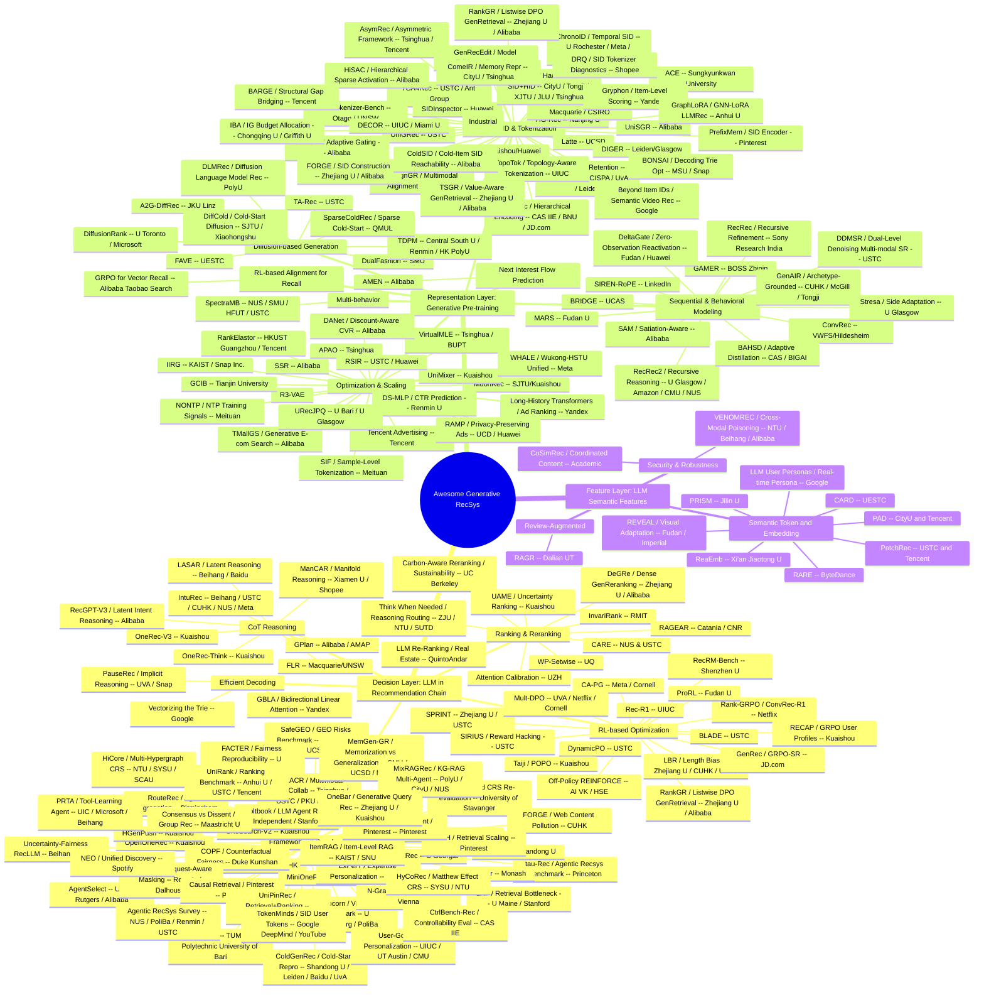

# Awesome Generative Recommendation System (RecSys)

```
 ██████╗                ██████╗                ███████╗                
██╔════╝  ███╗  ███╗    ██╔══██╗ ███╗   ███╗   ██╔════╝██╗ ██╗ ██████╗ 
██║      ██╔═██╗████╗   ██████╔╝██╔═██╗██╔═██╗ ███████╗╚██╗██║ ██╔═══╝ 
██║  ███╗██████║██╔██╗  ██╔══██╗██████║██║ ╚═╝ ╚════██║ ╚███╔╝ ██████╗ 
██║   ██║██║    ██║╚██╗ ██║  ██║██║    ██║ ██╗      ██║  ██╔╝      ██║
╚██████╔╝╚████╗ ██║ ╚██╗██║  ██║╚████╗ ╚███╔═╝ ███████║  ██║   ██████║
 ╚═════╝  ╚═══╝ ╚═╝  ╚═╝╚═╝  ╚═╝ ╚═══╝  ╚══╝   ╚══════╝  ╚═╝   ╚═════╝
```
---

[](https://github.com/sindresorhus/awesome)

RecSys is starting to adopt LLM for feature extraction, retrieval, and ranking/re-ranking! Although you can get some hands-on materials in either the [classics](#papers-classic-must-read) or some surveys, but since you're already interested in applying generative AI to industrial tasks, you probably wanna stay on the bleeding edge, right? That's exactly what this repo is for — automatically updated daily by agents with the latest generative RecSys papers fresh off arXiv, making sure that you never miss a beat.

> [!IMPORTANT]
> For those who are not familiar with GenRec, or not even the recommendation system, please checkout the kickstart posts [here](docs/kickstart.md).
> These posts are in Chinese, for English simply do your browser's internal translation or turn to __Ask Gemini__ :shipit:

## Quick Indexing
- [By Date](#by-date)
- [By Opensource](#by-opensource)
- [By Keyword](#by-keyword)
- [By Affiliation](#by-affiliation)


<div align="center">
  <i> Open-source Generative RecSys Map </i>
</div>

---
## By Date

### Papers July 23

*Thursday, July 23, 2026. Arxiv cs.IR new listing returned only 3 genrec papers (light day). Applied 3-month fallback to reach minimum 5 → found 2 additional papers (DRQ from Shopee, HiSAC from Alibaba). Total: 5 papers.*

1. **Personalized Recommendation Tool Learning via Autonomous Language Agents (PRTA)**
   * Affiliation: University of Illinois Chicago / Microsoft / Beihang University — *(Mingdai Yang, Weizhi Zhang, Yibo Wang, Philip Yu — UIC; Zhiwei Liu — Microsoft; Hao Peng — Beihang University)*
   * Link: [arxiv.org/abs/2607.19739](https://arxiv.org/abs/2607.19739)
   * Venue: RecSys 2026 (Short Paper)
   * TL;DR: LLM-based agent framework for full-ranking recommendation using multiple traditional recsys models as tools; LLM acts as central planner for personalized tool selection via reflection mechanisms; circumvents LLM hallucination and context-length limitations through architectural design rather than model modification.
   * Key techniques:
     - LLM as central planner: high-level reasoning + personalized tool selection
     - Traditional recommendation models as tools performing full-ranking scoring
     - Reflection mechanisms evaluating and comparing tools per user based on user profiles and candidate ranked lists
     - Memory-based personalized tool learning separating reasoning (LLM) from scoring (traditional models)
   * Scores (Opensource? / Novelty / Fairness / Robustness / Impact):
     - **Opensource?: 0/10** — No public code available
     - **Novelty: 6/10** — LLM-as-tool-planner architecture is creative; reflection mechanisms for personalized tool selection are practical
     - **Fairness: 3/10** — Not addressing fairness
     - **Robustness: 6/10** — RecSys 2026 peer-reviewed; 3 public datasets evaluated
     - **Impact: 6/10** — RecSys 2026; UIC/Microsoft/Beihang; practical approach bridging LLM reasoning with traditional recsys scalability

2. **Zero-Observation User Reactivation with Gap-Driven Dimensional Gating (DeltaGate)**
   * Affiliation: Fudan University / Huawei Technologies — *(Jiandong Ding — Fudan University; Tianying Liu, Fuyuan Liu, Huijie Qin, Tiandeng Wu — Huawei Technologies)*
   * Link: [arxiv.org/abs/2607.19802](https://arxiv.org/abs/2607.19802)
   * Venue: RecSys 2026
   * TL;DR: Lightweight output-layer plugin for sequential recommendation addressing zero-observation user reactivation; gap-conditioned gating routes each representation dimension between personalized history and learned global prior; Hit@10 decreases monotonically with gap duration; DeltaGate achieves 0.047 vs 0.031 SASRec in >365d bucket with 66K parameters (2–4% overhead).
   * Key techniques:
     - DeltaGate: frozen-backbone plugin routing dimensions between personalized history and zero-initialized global prior
     - Gap-conditioned gating jointly conditioned on time gap Δt and personalized representation
     - Chronologically aligned Gap-Synthesize Protocol on three Amazon datasets
     - 40× fewer trainable parameters than end-to-end retraining with zero backbone drift
   * Scores (Opensource? / Novelty / Fairness / Robustness / Impact):
     - **Opensource?: 1/10** — github.com/jdding/DeltaGate claimed but repo returns 404; code not accessible
     - **Novelty: 5/10** — Lightweight plugin for reactivation is practical but incremental; gap-conditioned gating is sensible
     - **Fairness: 4/10** — Indirectly helps returning/dormant users receive better recommendations
     - **Robustness: 7/10** — RecSys 2026 peer-reviewed; 3 Amazon datasets with systematic gap-bucket evaluation
     - **Impact: 5/10** — RecSys 2026; Fudan/Huawei; addresses practical reactivation problem in real-world recommender systems

3. **UniRank: Benchmarking Ranking Models for Unified Sequential Modeling and Feature Interaction**
   * Affiliation: Anhui University / University of Science and Technology of China / Tencent — *(Honghao Li, Yi Zhang, Yiwen Zhang — Anhui University; Xianquan Wang — USTC; Zibin Zhang, Kangyi Lin — Tencent)*
   * Link: [arxiv.org/abs/2607.19987](https://arxiv.org/abs/2607.19987)
   * Venue: arXiv preprint, July 2026
   * TL;DR: Open benchmark for unified ranking models (sequential modeling + feature interaction); 15 representative models on 5 large-scale public datasets (700M+ instances, 10^5+ behavior sequences); standardized chronological pointwise autoregressive evaluation; PyTorch toolkit with DDP, mixed-precision, Flash Attention.
   * Key techniques:
     - Chronological pointwise autoregressive supervision unifying training paradigm across models
     - Standardized evaluation across feedback tasks (CTR, CVR, etc.)
     - 15 implemented architectures from Google/ByteDance/Meta/Alibaba/Kuaishou/Tencent published at KDD/SIGIR/WWW/RecSys
     - Production-grade engineering: DDP, mixed precision, torch.compile, Flash Attention, activation checkpointing
   * Scores (Opensource? / Novelty / Fairness / Robustness / Impact):
     - **Opensource?: 8/10** — [github.com/salmon1802/UniRank](https://github.com/salmon1802/UniRank) — 55⭐, 21 commits, Apache 2.0; exceptionally well-documented with architecture taxonomy, evaluation protocols, extension guides; 5 preprocessed datasets on HuggingFace; comprehensive model zoo of 15 architectures
     - **Novelty: 5/10** — Benchmark contribution; standardized evaluation protocol is valuable but not algorithmically novel
     - **Fairness: 3/10** — Not addressing fairness
     - **Robustness: 8/10** — 5 large-scale datasets (700M+ instances); 15 models from top venues; thorough reproducibility practices
     - **Impact: 7/10** — Anhui U/USTC/Tencent; fills critical gap in reproducible ranking model research; practical toolkit for academic and industrial researchers

4. **Understanding and Diagnosing Failures in Semantic-ID Tokenization via Decoupled Residual Quantization (DRQ)**
   * Affiliation: Shopee — *(Xuesi Wang, Junjie Wang, Ziliang Wang, Weijie Bian, Guanxing Zhang — Shopee)*
   * Link: [arxiv.org/abs/2606.01844](https://arxiv.org/abs/2606.01844)
   * Venue: ACM Conference 2026
   * TL;DR: Quantitative diagnostic framework for SID tokenizer failures via expected codeword overlap and effective codebook capacity; decoupled residual quantization (DRQ) separates continuous geometry reconstruction from discrete distribution matching; identifies multi-objective nature of SID quality (symbolic robustness, reconstruction fidelity, behavior-aware soft matching).
   * Key techniques:
     - Expected Codeword Overlap: measures codeword confusion under retrieval-time perturbation
     - Effective Codebook Capacity: converts confusion into effective number of usable, well-separated codes
     - DRQ: decoupled residual quantization separating geometry reconstruction from distribution matching
     - Links semantic boundary confusion to both code usage imbalance and Euclidean geometric constraints
   * Scores (Opensource? / Novelty / Fairness / Robustness / Impact):
     - **Opensource?: 0/10** — No public code available
     - **Novelty: 6/10** — First quantitative diagnostic framework for SID tokenizer failures; formalized metrics are novel
     - **Fairness: 3/10** — Not addressing fairness
     - **Robustness: 5/10** — Proprietary industrial dataset only; case study scope limits generalizability
     - **Impact: 5/10** — Shopee; practical diagnostic tools for SID construction evaluation in generative recommendation

5. **HiSAC: Hierarchical Sparse Activation Compression for Ultra-long Sequence Modeling in Recommenders**
   * Affiliation: Alibaba Group (Taobao) — *(Kun Yuan, Junyu Bi, Daixuan Cheng, Changfa Wu, Shuwen Xiao, Binbin Cao, Jian Wu, Yuning Jiang — Alibaba Group)*
   * Link: [arxiv.org/abs/2602.21009](https://arxiv.org/abs/2602.21009)
   * Venue: arXiv preprint, February 2026 (revised July 2026)
   * TL;DR: Hierarchical sparse activation framework for ultra-long behavior sequence genrec; multi-level semantic ID encoding + global hierarchical codebook; hierarchical voting sparsely activates personalized interest-agents as fine-grained preference centers; Soft-Routing Attention aggregates by similarity to minimize quantization error; deployed on Taobao homepage with +1.65% CTR.
   * Key techniques:
     - Multi-level semantic ID encoding of user interactions
     - Global hierarchical codebook with personalized interest-agent activation via hierarchical voting
     - Soft-Routing Attention: aggregates historical signals in semantic space weighted by similarity
     - Minimizes quantization error while retaining long-tail behavior patterns
   * Scores (Opensource? / Novelty / Fairness / Robustness / Impact):
     - **Opensource?: 0/10** — No public code available (Alibaba internal production)
     - **Novelty: 6/10** — Hierarchical sparse activation with interest agents for ultra-long genrec is creative; soft-routing attention is practical
     - **Fairness: 4/10** — Retains long-tail preferences through similarity-weighted aggregation
     - **Robustness: 7/10** — Deployed on Taobao "Guess What You Like"; +1.65% CTR in online A/B; significant compression for production
     - **Impact: 7/10** — Alibaba Group; industrial-scale deployment on Taobao homepage; practical framework for compressing long user sequences in genrec

### Papers July 24

*Friday, July 24, 2026. Arxiv cs.IR new listing returned 3 genrec papers from July 23 submissions. Applied 3-month fallback → found 2 additional missed papers (CapsID from May 2026, ItemRAG from SIGIR 2026). Total: 5 papers.*

1. **BARGE: Bridging the Structural Gap — Adapting Autoregressive Generation for Recommendation**
   * Affiliation: Tencent — *(Junchao Zeng, Junzhang Zhu, Junyang Chen, Yudong Li, Wei Liu, Chengxiang Zhuo, Zang Li — Tencent)*
   * Link: [arxiv.org/abs/2607.21028](https://arxiv.org/abs/2607.21028)
   * Venue: arXiv preprint, July 2026
   * TL;DR: Bridges two structural gaps in generative recommendation (item-level structure destruction from flattening multi-token IDs + semantic drift from train-inference codebook inconsistency); ICA restores item-level structure during encoding, HPR+DPD suppress semantic drift during decoding; deployed on Tencent platform with +0.60% CTR, +1.34% click UV, +1.70% total reading time.
   * Key techniques:
     - Item Context-Aware Attention (ICA): restores item-level structure during encoding by preventing multi-token flattening information loss
     - Hierarchical Path Reranking (HPR): suppresses semantic drift from hierarchical codebook inconsistency during decoding
     - Dual-Path Decoding (DPD): complementary angle to HPR providing additional drift suppression
     - Jointly addresses two structural gaps that degrade autoregressive SID-based generative recommendation
   * Scores (Opensource? / Novelty / Fairness / Robustness / Impact):
     - **Opensource?: 0/10** — No public code available
     - **Novelty: 6/10** — Structural gap framing is well-motivated; ICA+HPR+DPD are practical but conceptually incremental
     - **Fairness: 3/10** — Not addressing fairness
     - **Robustness: 7/10** — Public benchmarks + Tencent online A/B; real business metrics validated
     - **Impact: 7/10** — Tencent; practical framework deployed on commercial platform with verified CTR/UV/time gains

2. **Diffusion Language Model for Recommendation (DLMRec)**
   * Affiliation: The Hong Kong Polytechnic University — *(Chengyi Liu, Yongqi Zhou, Junwei Pan, Zhixiang Feng, Chengguo Yin, Haijie Gu, Jie Jiang, Yinghao Liu, Yujuan Ding, Qing Li, Wenqi Fan — PolyU)*
   * Link: [arxiv.org/abs/2607.21519](https://arxiv.org/abs/2607.21519)
   * Venue: arXiv preprint, July 2026
   * TL;DR: First discrete diffusion language model tailored for recommendation as alternative to autoregressive generation; collaborative-aware stochastic tokenizer encodes multi-hop CF signals into diffusion-compatible discrete tokens; curriculum-driven training aligns denoising with preference recovery; stability-aware voting aggregates iterative predictions for robustness.
   * Key techniques:
     - Collaborative-aware stochastic tokenizer: encodes multi-hop collaborative signals into expressive discrete tokens compatible with diffusion modeling
     - Curriculum-driven training: progressive item- and token-level learning aligning denoising process with preference recovery
     - Stability-aware voting mechanism: aggregates iterative predictions to improve generation consistency and robustness
     - First framework to replace autoregressive paradigm with diffusion language modeling in generative recommendation
   * Scores (Opensource? / Novelty / Fairness / Robustness / Impact):
     - **Opensource?: 0/10** — No public code available
     - **Novelty: 8/10** — First diffusion language model for recommendation; shifts genrec paradigm from AR to diffusion; three novel components
     - **Fairness: 3/10** — Not addressing fairness
     - **Robustness: 7/10** — Comprehensive methodology (30 pages); well-established DLM paradigm from NLP; iterative refinement with stability voting
     - **Impact: 8/10** — PolyU; opens new research direction for non-autoregressive generative recommendation with diffusion-based token generation

3. **Can Generative Recommendation Reach Cold Items? A Temporal Perspective on Semantic-ID Generation**
   * Affiliation: Alibaba Group — *(Jie Peng, Yanping Zheng, Zhewei Zhe, Bin Tong, Guan Wang, Bo Zheng — Alibaba Group)*
   * Link: [arxiv.org/abs/2607.21101](https://arxiv.org/abs/2607.21101)
   * Venue: arXiv preprint, July 2026
   * TL;DR: Diagnostic analysis of SID-based genrec cold item reachability under absolute-time temporal protocol; reveals SID generation is compositional but not fully open-ended — models reach future items with observed tokens/prefixes but fail on unseen atomic tokens/unsupported SID paths; interprets SID generation as hierarchical semantic bucketing.
   * Key techniques:
     - Absolute-time temporal protocol separating seen/unseen targets for cold item diagnosis
     - Token-level coldness taxonomy: seen/unseen-hit analysis categorizing cold-start failure modes
     - Oracle-prefix probing empirically testing reachability under ideal prefix conditions
     - Hierarchical semantic bucketing interpretation: early tokens select coarse regions, later tokens refine item-specific paths
     - Boundary identification: SID generation is compositional (token recombination) but not fully open-ended (fails on unseen atoms)
   * Scores (Opensource? / Novelty / Fairness / Robustness / Impact):
     - **Opensource?: 0/10** — No public code available
     - **Novelty: 7/10** — First systematic cold item reachability analysis in SID genrec; temporal protocol + coldness taxonomy are novel
     - **Fairness: 6/10** — Directly addresses cold-start item reachability which is a fairness concern for new/niche items
     - **Robustness: 6/10** — Diagnostic analysis with strong empirical findings; not a method paper but important foundational work
     - **Impact: 6/10** — Alibaba Group; important diagnostic work revealing fundamental SID cold-start limitations; guides future research directions

4. **CapsID: Soft-Routed Variable-Length Semantic IDs for Generative Recommendation**
   * Affiliation: Unknown (Industrial) — *(Wenzhuo Cheng, Menghang Gong, Qixin Guo, Hang Zheng, Zhaobin Yang, Jianguo Lou, Zhengwei Zheng)*
   * Link: [arxiv.org/abs/2605.05096](https://arxiv.org/abs/2605.05096)
   * Venue: arXiv preprint, May 2026
   * TL;DR: Capsule routing replaces hard residual quantization in SID tokenizer; probabilistic soft assignment to multiple semantic capsules preserves multi-faceted item semantics; confidence-driven variable-length SIDs adapt to item complexity; SemanticBPE composes tokens into reusable subwords; +9.6% Recall@10 over ReSID, matches COBRA at 51% latency on 35M-item industrial catalog.
   * Key techniques:
     - Capsule routing: probabilistic soft assignment replacing winner-take-all nearest-neighbor in RQ-VAE
     - Iterative agreement mechanism for refined capsule assignment across routing iterations
     - Confidence-driven variable SID length: terminates when capsule confidence exceeds threshold or residual norm drops
     - SemanticBPE: subword composition combining co-occurrence frequency with embedding cosine compatibility
     - Single-representation solution matching sparse-dense hybrid systems (COBRA) without dense vector overhead
   * Scores (Opensource? / Novelty / Fairness / Robustness / Impact):
     - **Opensource?: 0/10** — No public code available
     - **Novelty: 8/10** — First capsule routing application to SID tokenization; soft routing + variable length + SemanticBPE are three novel contributions
     - **Fairness: 5/10** — Largest recall gains on tail items where boundary semantics dominate; long-tail fairness improvement
     - **Robustness: 7/10** — 3 Amazon datasets + 35M-item industrial catalog; thorough ablations confirming each component; theoretical analysis of routing convergence
     - **Impact: 7/10** — Important SID tokenizer advancement; competes with COBRA-style hybrid systems while being purely tokenizer-centric; practical for industrial deployment

5. **ItemRAG: Item-Based Retrieval-Augmented Generation for LLM-Based Recommendation**
   * Affiliation: KAIST / Seoul National University — *(Sunwoo Kim, Geon Lee, Kyungho Kim — KAIST; Jaemin Yoo — SNU; Kijung Shin — KAIST)*
   * Link: [arxiv.org/abs/2511.15141](https://arxiv.org/abs/2511.15141)
   * Venue: SIGIR 2026 (Short Paper)
   * TL;DR: Shifts RAG for LLM recommendation from coarse user-history retrieval to fine-grained item-level retrieval; augments each item description with co-purchase + semantically relevant items; prioritizes informative retrievals benefiting cold-start items; consistently outperforms user-based RAG baselines.
   * Key techniques:
     - Item-level RAG: retrieves relevant items per each item in user history or candidate set (not per user)
     - Dual retrieval signals: co-purchase information combined with semantic similarity for recommendation-informative (not just similar) retrieval
     - Cold-start benefit: item-level augmentation provides richer signal for items with limited interaction history
     - Careful combination mechanism balancing semantic and co-purchase signals
   * Scores (Opensource? / Novelty / Fairness / Robustness / Impact):
     - **Opensource?: 7/10** — [github.com/kswoo97/ItemRAG](https://github.com/kswoo97/ItemRAG) — SIGIR 2026 artifact; code + datasets provided; clean implementation with comprehensive README
     - **Novelty: 6/10** — Item-level RAG is a practical shift from user-level; conceptually incremental but well-executed
     - **Fairness: 5/10** — Cold-start item improvement directly addresses item-side fairness
     - **Robustness: 7/10** — SIGIR 2026 peer-reviewed; consistent outperformance across standard and cold-start settings
     - **Impact: 6/10** — SIGIR 2026; KAIST/SNU; practical RAG enhancement for LLM-based recommendation with open-source reproducibility

### Papers July 22

*Wednesday, July 22, 2026. Arxiv cs.IR new listing returned only 4 genrec papers (light day). No fallback needed.*

1. **Topology-Aware Tokenization for Generative Recommendation (TopoTok)**
   * Affiliation: University of Illinois Urbana-Champaign — *(Yaokun Liu, Yifan Liu, Zhenrui Yue, Gyuseok Lee, Zelin Li, Ruichen Yao, Dong Wang — UIUC)*
   * Link: [arxiv.org/abs/2607.18600](https://arxiv.org/abs/2607.18600)
   * Venue: RecSys 2026
   * TL;DR: Identifies topology distortion as critical bottleneck in generative recommendation tokenization; multi-level distillation (inter-group, intra-group, inter-item) preserves item relational structure through quantization hierarchy; +9.42% Recall@5 SOTA.
   * Key techniques:
     - Inter-Group Distillation: captures global cluster-wise relations in semantic embedding space
     - Intra-Group Distillation: refines local structures within semantic clusters
     - Inter-Item Distillation: enforces fine-grained alignment at individual item level
     - Multi-level progressive topology recovery throughout the quantization hierarchy
   * Scores (Opensource? / Novelty / Fairness / Robustness / Impact):
     - **Opensource?: 0/10** — No public code available
     - **Novelty: 7/10** — First to systematically identify and address topology distortion in GR tokenization; multi-level distillation is well-motivated
     - **Fairness: 3/10** — Not addressing fairness
     - **Robustness: 7/10** — 3 benchmark datasets; RecSys 2026 peer-reviewed; consistent SOTA gains
     - **Impact: 7/10** — RecSys 2026; UIUC; addresses fundamental tokenization bottleneck in generative recommendation

2. **Mitigating Matthew Effect: Multi-Hypergraph Boosted Multi-Interest Self-Supervised Learning for Conversational Recommendation (HiCore)**
   * Affiliation: Nanyang Technological University / Sun Yat-sen University / South China Agricultural University — *(Yongsen Zheng, Kwok-Yan Lam — NTU; Ruilin Xu, Liang Lin — SYSU; Guohua Wang — SCAU)*
   * Link: [arxiv.org/abs/2607.18609](https://arxiv.org/abs/2607.18609)
   * Venue: EMNLP 2024 (arxiv upload July 2026)
   * TL;DR: Multi-hypergraph boosted multi-interest self-supervised learning addressing Matthew effect in conversational recommendation with dynamic user-system feedback loop; item/entity/word-oriented multi-channel hypergraphs for multi-level user interest learning; SOTA on 4 CRS datasets.
   * Key techniques:
     - Multi-channel hypergraph construction: item-, entity-, word-oriented hypergraphs
     - Multi-interest self-supervised learning capturing multi-level user preferences
     - Dynamic user-system feedback loop modeling in conversational recommendation
     - Matthew effect mitigation through hypergraph-based interest diversification
   * Scores (Opensource? / Novelty / Fairness / Robustness / Impact):
     - **Opensource?: 6/10** — [github.com/zysensmile/HiCore](https://github.com/zysensmile/HiCore) — same org as HyCoRec (12⭐); EMNLP 2024 artifact; well-documented CRSLab integration
     - **Novelty: 6/10** — Multi-channel hypergraph for multi-interest SSL in CRS is practical; Matthew effect framing is well-motivated
     - **Fairness: 7/10** — Directly addresses Matthew effect and popularity bias in conversational recommendation
     - **Robustness: 7/10** — 4 CRS datasets; EMNLP 2024 peer-reviewed; consistent SOTA
     - **Impact: 5/10** — EMNLP 2024; NTU/SYSU/SCAU; practical framework for fair conversational recommendation

3. **Beyond Noisy Signals: Dual-Level Denoising for Multi-modal Sequential Recommendation (DDMSR)**
   * Affiliation: University of Science and Technology of China — *(Jie Luo, Qi Jin, Xinming Zhang — USTC)*
   * Link: [arxiv.org/abs/2607.18786](https://arxiv.org/abs/2607.18786)
   * Venue: arXiv preprint, July 2026
   * TL;DR: Dual-noise dilemma (feature-level redundancy + sequence-level stochasticity) addressed via graph-based Laplacian smoothing as low-pass filter + frequency-domain FFT adaptive denoising; multi-modal contrastive alignment bridges heterogeneity gap; SOTA on 4 benchmarks.
   * Key techniques:
     - Graph-based Feature Denoising: sparse item-item semantic graphs + Laplacian smoothing as structural low-pass filter
     - Frequency-domain Sequence Denoising: FFT + learnable complex-valued filter for adaptive spectral modulation
     - Gating network for adaptive fusion between filtered and original features
     - Multi-modal contrastive alignment (InfoNCE) enforcing cross-modal semantic consistency
   * Scores (Opensource? / Novelty / Fairness / Robustness / Impact):
     - **Opensource?: 7/10** — [github.com/jluo00/DDMSR](https://github.com/jluo00/DDMSR) — code available; RecBole-based implementation; 4 datasets; clean modular structure
     - **Novelty: 7/10** — Dual-level denoising (graph + frequency) is novel; first to apply FFT-based sequence purification in multimodal SR
     - **Fairness: 4/10** — Denoising may help long-tail items by reducing feature-level redundancy; not primary focus
     - **Robustness: 7/10** — 4 public datasets; consistent SOTA gains up to +19.33% Recall@20; comprehensive ablations
     - **Impact: 6/10** — USTC; practical dual-denoising framework for multimodal sequential recommendation

4. **TSGR: Taobao Search Generative Retrieval**
   * Affiliation: Zhejiang University / Alibaba Group (Taobao & Tmall) — *(Tianyu Zhan, Shengyu Zhang — Zhejiang University; Gui Ling, Tong Xiong, Kunhai Lin, Yang Wang, Kaixuan Zhang, Zhihong Chen, Yuliang Yan, Dan Ou, Haihong Tang, Bo Zheng — Alibaba)*
   * Link: [arxiv.org/abs/2607.18796](https://arxiv.org/abs/2607.18796)
   * Venue: arXiv preprint, July 2026
   * TL;DR: Value-aware generative retrieval for Taobao Search unifying retrieval and pre-ranking; Query-aware Parallel SID encodes business value + query relevance into SID construction; Value-aware Ranking Module enables single model as retriever + pre-ranker; deployed +0.43% IPV, +1.12% Transactions, +1.64% GMV.
   * Key techniques:
     - Query-aware Parallel SID (QP-SID): multiple parallel orderings per cluster encoding value + query-conditioned relevance
     - Value-aware Ranking Module (VRM): cross-attention fusing backbone user repr with item side-info for business-aligned scoring
     - Progressive training pipeline: semantic relevance → user preferences → business objectives
     - Single autoregressive model replacing separate retrieval + pre-ranking stages
   * Scores (Opensource? / Novelty / Fairness / Robustness / Impact):
     - **Opensource?: 0/10** — No public code available (Alibaba internal production)
     - **Novelty: 7/10** — First value-aware generative retrieval framework for industrial search; QP-SID + VRM co-design is novel
     - **Fairness: 3/10** — Value-awareness may favor high-GMV items; not explicitly addressing fairness
     - **Robustness: 8/10** — 38-day online A/B on Taobao Search; 200M interactions; +1.64% GMV validated
     - **Impact: 8/10** — Alibaba/Zhejiang University; production-deployed value-aware GR; practical blueprint for industrial e-commerce search

### Papers July 21

*Tuesday, July 21, 2026. Arxiv cs.IR new listing returned 6 genrec papers. No fallback needed.*

1. **Beyond Fixed Depths and Widths: Optimizing Textual Decoding Tries in LLM-based Generative Recommendation (BONSAI)**
   * Affiliation: Michigan State University / Snap Inc. — *(Jingzhe Liu, Hanbing Wang, Jiliang Tang — MSU; Liam Collins, Tong Zhao, Neil Shah, Mingxuan Ju — Snap Inc.)*
   * Link: [arxiv.org/abs/2607.16633](https://arxiv.org/abs/2607.16633)
   * Venue: arXiv preprint, July 2026
   * TL;DR: First to study decoding trie structure for LLM-based generative recommendation; identifies adaptive ID length + constrained branching factors as key properties; BONSAI co-designs term IDs and trie via minimum set cover, achieving +21.6% relative improvement over SOTA.
   * Key techniques:
     - Adaptive variable-length term IDs matching item semantic richness
     - Constrained branching factors at shallow trie levels for improved beam search success rate
     - Minimum set cover formulation recursively building optimized decoding trie
     - Co-design of term ID extraction and trie structure rather than treating trie as fixed
   * Scores (Opensource? / Novelty / Fairness / Robustness / Impact):
     - **Opensource?: 0/10** — No public code available
     - **Novelty: 7/10** — First systematic study of decoding trie optimization for LLM-based genrec; addressing a neglected structural bottleneck
     - **Fairness: 2/10** — Not addressing fairness
     - **Robustness: 6/10** — Multiple datasets with SOTA baselines; systematic ablation validating both properties
     - **Impact: 6/10** — MSU/Snap; practical framework for improving LLM-based GR beam search quality

2. **WHALE: A Scalable Unified Model for Recommendation with Wukong-HSTU Architecture**
   * Affiliation: Meta — *(Renqin Cai, Dawei Sun, Yuanjun Yao, Zhiyong Wang, Velvin Fu, Maggie Zhuang, Yu Shi, Zhongnan Fang, Xuan Cao, Jing Qian, Rui Li — Meta)*
   * Link: [arxiv.org/abs/2607.17017](https://arxiv.org/abs/2607.17017)
   * Venue: arXiv preprint, July 2026
   * TL;DR: Unifies Wukong (non-sequence feature interaction) + HSTU (behavior sequence modeling) in a single scalable ranking architecture; attention-based fusion enables progressive cross-module exchange; deployed in production with positive online gains.
   * Key techniques:
     - Dual-backbone per-layer design: Wukong module + HSTU module + attention-based fusion
     - Progressive Wukong-HSTU exchange: high-order feature crosses repeatedly query fine-grained behavior evidence
     - Custom Triton kernels for training/inference efficiency at industrial scale
     - Production-deployed with verified online gains
   * Scores (Opensource? / Novelty / Fairness / Robustness / Impact):
     - **Opensource?: 0/10** — No public code available (Meta internal production)
     - **Novelty: 6/10** — First practical unification of Wukong+HSTU; well-engineered but incremental
     - **Fairness: 3/10** — Not addressing fairness
     - **Robustness: 8/10** — Production-deployed; positive online A/B; custom Triton kernels for efficiency
     - **Impact: 7/10** — Meta; practical unified architecture bridging two dominant industrial ranking paradigms

3. **RAMP: Robust Ad Recommendation Under Limited Personalized-Feature Availability via Masking and Alignment Pathways**
   * Affiliation: University College Dublin / Huawei Ireland Research Centre — *(Dairui Liu, Zhongyi Lu, Changhong Jin, Jitao Lu, Aonghus Lawlor, Barry Smyth, Ruihai Dong — UCD; Roger Zhe Li, Xinyang Shao, Bichen Shi, Mete Sertkan, Aghiles Salah, Tri Kurniawan Wijaya, Xingsheng Guo — Huawei Ireland)*
   * Link: [arxiv.org/abs/2607.17473](https://arxiv.org/abs/2607.17473)
   * Venue: ICTIR 2026
   * TL;DR: Privacy-compliant ad CTR/CVR prediction when personalized features are unavailable; dual-tower with output masking + distillation-inspired alignment between personalized and non-personalized pathways; SOTA when personalization is missing.
   * Key techniques:
     - Personalized pathway: dual-tower with identical inputs but independent parameters + output masking
     - Non-personalized pathway trained exclusively on non-personalized features
     - Distillation-inspired prediction-alignment architecture between both pathways
     - Privacy-preserving ad recommendation without sacrificing accuracy on non-personalized traffic
   * Scores (Opensource? / Novelty / Fairness / Robustness / Impact):
     - **Opensource?: 7/10** — [github.com/Ruixinhua/RAMP](https://github.com/Ruixinhua/RAMP) — 0⭐, 4 commits, Apache 2.0; well-structured FuxiCTR-based codebase with comprehensive README, demo smoke test, hyperparameter configs; complete and runnable
     - **Novelty: 5/10** — Dual-pathway with masking+alignment is practical but conceptually incremental
     - **Fairness: 5/10** — Privacy-preserving design enables fairer ad delivery under restricted feature regimes
     - **Robustness: 7/10** — Multiple backbones (PNN, DCNv3, FinalNet); 3 public datasets + industrial; ICTIR 2026 peer-reviewed
     - **Impact: 6/10** — ICTIR 2026; UCD/Huawei; practical privacy-compliant ad recommendation framework

4. **HyCoRec: Hypergraph-Enhanced Multi-Preference Learning for Alleviating Matthew Effect in Conversational Recommendation**
   * Affiliation: Sun Yat-sen University / Nanyang Technological University — *(Yongsen Zheng, Ruilin Xu, Ziliang Chen, Guohua Wang, Mingjie Qian, Jinghui Qin, Liang Lin — SYSU; Yongsen Zheng — NTU)*
   * Link: [arxiv.org/abs/2607.17461](https://arxiv.org/abs/2607.17461)
   * Venue: arXiv preprint, July 2026 (extended from ACL 2024)
   * TL;DR: Multi-aspect hypergraph preference learning (item/entity/word/review/knowledge) to alleviate Matthew effect in conversational recommendation; new SOTA on two benchmarks with reduced popularity bias.
   * Key techniques:
     - Five-granularity preference learning: item-, entity-, word-, review-, knowledge-aspect preferences
     - Hypergraph-enhanced multi-preference fusion for conversational response generation + item prediction
     - Addresses Matthew effect amplification during multi-turn user-system interactions
     - Joint optimization of conversational task and recommendation task
   * Scores (Opensource? / Novelty / Fairness / Robustness / Impact):
     - **Opensource?: 7/10** — [github.com/zysensmile/HyCoRec](https://github.com/zysensmile/HyCoRec) — 12⭐, 31 commits; well-documented with uv-based setup, YAML configs, CRSLab integration; runnable with clear instructions
     - **Novelty: 6/10** — Multi-aspect hypergraph learning for conversational rec is creative; Matthew effect framing is practical
     - **Fairness: 7/10** — Directly addresses Matthew effect and popularity bias in conversational recommendation
     - **Robustness: 6/10** — Two benchmark datasets (ReDial, TG-ReDial); consistent SOTA; ACL 2024 peer-reviewed
     - **Impact: 5/10** — SYSU/NTU; practical framework for fair conversational recommendation

5. **Learning Sparse Representations of Multimodal Content for Enhanced Cold Item Recommendation**
   * Affiliation: Queen Mary University of London — *(Gregor Meehan, Johan Pauwels — QMUL)*
   * Link: [arxiv.org/abs/2607.17184](https://arxiv.org/abs/2607.17184)
   * Venue: RecSys 2026
   * TL;DR: Sparse embeddings outperform dense vectors for content-based cold-start recommendation; pre-sparsification activation from linear attention induces sharpness and denoising in item similarities; significant accuracy gains at lower storage cost.
   * Key techniques:
     - Sparse representation learning adapted from cold-start training regimes
     - Pre-sparsification activation technique derived from linear attention for sharpness + denoising
     - Content-based cold-start: directly leveraging content similarity rather than estimating CF embeddings
     - Significant storage reduction with improved accuracy, especially for multi-interest users
   * Scores (Opensource? / Novelty / Fairness / Robustness / Impact):
     - **Opensource?: 0/10** — No public code available
     - **Novelty: 6/10** — Sparse embeddings for cold-start is a practical insight; pre-sparsification activation from linear attention is creative
     - **Fairness: 5/10** — Cold-start recommendation inherently addresses item-side fairness for new items
     - **Robustness: 7/10** — 4 multimodal RS datasets; RecSys 2026 peer-reviewed; interpretability analysis included
     - **Impact: 6/10** — RecSys 2026; QMUL; practical sparse representation approach bridging cold-start and storage efficiency

6. **Uncertainty as Remedy: Mitigating Satisfaction Label Bias in Short Video Multi-Objective Ensemble Ranking (UAME)**
   * Affiliation: Kuaishou Technology — *(Zonghe Shao, Tiantian He, Xiaoxiao Xu, Jiaqi Yu, Minzhi Xie, Jinfang Gu, Yongqi Liu, Kaiqiao Zhan, Kun Gai — Kuaishou)*
   * Link: [arxiv.org/abs/2607.17092](https://arxiv.org/abs/2607.17092)
   * Venue: arXiv preprint, July 2026
   * TL;DR: Uncertainty-aware multi-objective ensemble ranking for short-video recommendation; Gaussian scoring with probabilistic pairwise loss + uncertainty-weighted samples to mitigate satisfaction label bias; deployed in production with stable gains.
   * Key techniques:
     - Gaussian scoring: mean = satisfaction score, variance = predictive uncertainty
     - Probabilistic pairwise ranking loss incorporating uncertainty
     - Uncertainty-aware sample-level weighting scheme to mitigate satisfaction label bias
     - Theoretical analysis proving weighting reduces label bias
     - Deployed on large-scale industrial short-video platform improving EMER and EASQ paradigms
   * Scores (Opensource? / Novelty / Fairness / Robustness / Impact):
     - **Opensource?: 0/10** — No public code available (Kuaishou internal production)
     - **Novelty: 6/10** — Uncertainty as bias mitigation (not post-hoc adjustment) is a fresh perspective; well-motivated
     - **Fairness: 5/10** — Mitigating satisfaction label bias improves fairness of user satisfaction modeling
     - **Robustness: 8/10** — Production-deployed with stable gains; improves two SOTA paradigms; questionnaire-aligned satisfaction
     - **Impact: 7/10** — Kuaishou; practical uncertainty-aware framework for short-video recsys ranking

### Papers July 20

*Monday, July 20, 2026. Arxiv cs.IR new listing returned 2 genrec papers (RecGPT-V3 + RECAP). Applied fallback to missed July 15–17 listings → found 3 additional papers (SAM, Long-History Transformers, DANet). Total: 5 papers.*

1. **RecGPT-V3 Technical Report**
   * Affiliation: Alibaba Group (Taobao) — *(Bowen Zheng, Chao Yi, Dian Chen, Gaoyang Guo, Han Zhu, Jiakai Tang, Jian Wu, Mao Zhang, Wen Chen, Yifan Lu, Yujie Luo, Yuning Jiang, Zhujin Gao, Bo Zheng, Dixuan Wang, Hao Fang, Jiancai Liu, Jing Yu, Ke Chen, Kewei Zhu, Mingke Xu, Wenjun Yang, Xunke Xi, Zile Zhou — Alibaba Group)*
   * Link: [arxiv.org/abs/2607.15591](https://arxiv.org/abs/2607.15591)
   * Venue: arXiv Technical Report, July 2026
   * TL;DR: Third iteration of RecGPT deployed on Taobao "Guess What You Like"; Memory Hub cuts user-modeling compute by 55.8%, hybrid-modal LLM jointly reasons over text + SIDs, Latent Intent Reasoning internalizes CoT into latent tokens reducing output cost 200x; +3.97% GMV, -52.4% serving resources.
   * Key techniques:
     - Memory Hub: structured continually evolving user memory condensing long-horizon behavior into compact units
     - Hybrid-modal Foundation Model: LLM jointly reasoning over natural-language tags and Semantic IDs (high-bandwidth item-space channel)
     - Latent Intent Reasoning: compresses verbose chain-of-thought rationales into compact learnable latent tokens, decodable into explanations
     - Stateful design addressing three V2 bottlenecks: stateless behavior modeling, tag-to-item information bottleneck, inefficient explicit reasoning
   * Scores (Opensource? / Novelty / Fairness / Robustness / Impact):
     - **Opensource?: 0/10** — No public code available (Alibaba internal production)
     - **Novelty: 7/10** — Memory Hub for stateful LM-based recsys + hybrid-modal SID+text reasoning + latent intent tokens are three well-motivated innovations
     - **Fairness: 3/10** — Not addressing fairness
     - **Robustness: 8/10** — Deployed on Taobao "Guess What You Like"; +3.97% GMV, -52.4% serving resources; online A/B validated
     - **Impact: 8/10** — Alibaba Group; RecGPT series established as major industrial genrec framework; significant resource efficiency contribution

2. **RECAP: Feedback-Driven Streaming Semantic User Profiles for Short-Video Recommendation**
   * Affiliation: Kuaishou Technology — *(Ziyi Zhao, Xiaoyou Zhou, Xiao Lv, Yangyang Li, Chubo He, Zhao Liu, Jiayao Shen, Yuqi Liu, He Li, Chengyi Zhang, Jian Liang, Ming Li, Chongming Gao, Fuli Feng, Ruiming Tang, Han Li — Kuaishou)*
   * Link: [arxiv.org/abs/2607.15730](https://arxiv.org/abs/2607.15730)
   * Venue: RecSys 2026
   * TL;DR: Offline closed-loop framework for optimizing streaming LLM-based semantic user profiles; LLM judge constructs profile-targeted feedback, GRPO reward from dual-tower evaluator; +0.0084 uAUC, +4.9% Recall@2000 offline, +0.139% app usage time online on Kuaishou.
   * Key techniques:
     - Streaming structured semantic profiles: bounded memory combining LLM-based updates + deterministic lifecycle/capacity control
     - Profile-targeted semantic feedback: LLM judge filtering label-consistent behavior pairs
     - Dual-tower evaluator trained as GRPO reward for closed-loop profile optimization
     - Offline closed-loop design replacing traditional open-loop profile generators
   * Scores (Opensource? / Novelty / Fairness / Robustness / Impact):
     - **Opensource?: 0/10** — No public code available
     - **Novelty: 7/10** — First closed-loop optimization of LLM-based user profiles with GRPO; streaming semantic profiles with bounded memory is novel
     - **Fairness: 3/10** — Not addressing fairness
     - **Robustness: 8/10** — RecSys 2026 peer-reviewed; 7-day online A/B with statistical significance; offline+online validation
     - **Impact: 7/10** — RecSys 2026; Kuaishou; practical closed-loop framework for LLM-based user profiling in short-video recommendation

3. **Learning to Forget: Satiation-Aware Long-Sequence Transducers for Mitigating Post-Purchase Redundancy (SAM)**
   * Affiliation: Alibaba Group (Tmall) — *(Yipin Dai, Ruocong Tang, Xing Fang, Yang Huang, Jing Wang, Zhentao Song, He Guo — Alibaba Group)*
   * Link: [arxiv.org/abs/2607.12714](https://arxiv.org/abs/2607.12714)
   * Venue: SIGIR 2026 Industry Track
   * TL;DR: Identifies Action-Intent Asymmetry where purchase signals intent termination not continuation; SAM with Dual-path Cross-Attention, Adaptive Satiation Gating Unit, and self-supervised TTNP reduces post-purchase repeat rate by 60%+ in online A/B.
   * Key techniques:
     - Dual-path Cross-Attention: retroactively suppresses fulfilled-intent clicks + retrieves personalized replenishment rhythms
     - Adaptive Satiation Gating Unit (ASGU): time-sensitive soft mask inhibiting satisfied interests post-purchase, gradually re-awakening near repurchase cycle
     - Self-supervised Time-to-Next-Purchase (TTNP) auxiliary task learning latent product lifecycles
     - Addresses Action-Intent Asymmetry: purchase = intent termination, not preference reinforcement
   * Scores (Opensource? / Novelty / Fairness / Robustness / Impact):
     - **Opensource?: 0/10** — No public code available
     - **Novelty: 6/10** — First explicit modeling of satiation lifecycle in sequential recommendation; Action-Intent Asymmetry is well-motivated
     - **Fairness: 3/10** — Not addressing fairness
     - **Robustness: 8/10** — SIGIR 2026 Industry Track peer-reviewed; 60%+ PPRR reduction; online A/B validated
     - **Impact: 7/10** — SIGIR 2026 Industry Track; Alibaba; addresses critical but underexplored post-purchase redundancy problem in e-commerce recsys

4. **Long-History User Transformers for Real-Time Ad Ranking**
   * Affiliation: Yandex — *(Viacheslav Ovchinnikov, Georgii Smirnov, Nikolai Savushkin, Veronika Ivanova, Maksim Kuzin — Yandex)*
   * Link: [arxiv.org/abs/2607.14331](https://arxiv.org/abs/2607.14331)
   * Venue: arXiv preprint, July 2026
   * TL;DR: Decouples history encoding from real-time inference for ad ranking; high-capacity offline transformer encodes full cross-surface history into compact cached embeddings; lightweight runtime model combines cache + recent events; recovers 72-80% of full-History quality; +2.77% ranking metric in search ads, +2.26% revenue.
   * Key techniques:
     - Decoupled two-stage architecture: offline high-capacity transformer (async) + lightweight online model (real-time)
     - Autoregressive pre-training with dual objective: feedback prediction + next-item prediction on large-scale interaction logs
     - Cached user representations robust to staleness for cheap refresh policies
     - Zero serving latency increase despite leveraging full cross-surface user history
   * Scores (Opensource? / Novelty / Fairness / Robustness / Impact):
     - **Opensource?: 0/10** — No public code available (Yandex internal production)
     - **Novelty: 5/10** — Decoupled offline-online architecture for long-history is practical but pattern is established in industrial ML
     - **Fairness: 3/10** — Not addressing fairness
     - **Robustness: 8/10** — Production A/B with +2.26% revenue on Yandex Ad Network; staleness-robust caching validated
     - **Impact: 6/10** — Yandex; practical engineering for long-history ad ranking under strict latency constraints

5. **Cheaper is Better: A Discount-Aware Network for Conversion Rate Prediction in E-commerce Recommendation System (DANet)**
   * Affiliation: Alibaba Group (Tmall) — *(Ruocong Tang, Yang Huang, Xing Fang, Chenyi Yan, Chuike Sun, Jing Wang — Alibaba Group)*
   * Link: [arxiv.org/abs/2607.12578](https://arxiv.org/abs/2607.12578)
   * Venue: SIGIR 2026 Industry Track
   * TL;DR: First framework modeling item discount rates for CVR prediction; time-frequency transformation captures long-term discount trends, distribution de-bias mitigates promotion-period biases; deployed on Alibaba Tmall with +3.63% pCVR, +2.23% GMV.
   * Key techniques:
     - Time-frequency transformation via Fourier transform capturing long-term discount rate trends of items
     - Distribution de-bias module mitigating biases from purchase combinations, promotional activities, and periodic deviations
     - Supervised regression auxiliary task establishing explicit discount labels for value-accurate representations
     - Addresses underexplored interaction between item pricing/discount dynamics and conversion behavior
   * Scores (Opensource? / Novelty / Fairness / Robustness / Impact):
     - **Opensource?: 3/10** — [github.com/tangrc/DANet](https://github.com/tangrc/DANet) — 0⭐, 11 commits, no license; reference-only code (not runnable due to proprietary framework dependencies); README describes architecture with honest disclaimers about non-runnability
     - **Novelty: 5/10** — First explicit discount-rate modeling for CVR is practical but conceptually incremental
     - **Fairness: 3/10** — Distribution de-bias addresses statistical bias in discount exposure; not primary focus
     - **Robustness: 8/10** — SIGIR 2026 Industry Track peer-reviewed; deployed on Alibaba Tmall with +3.63% pCVR
     - **Impact: 6/10** — SIGIR 2026 Industry Track; Alibaba; practical discount-aware CVR framework for e-commerce

### Papers July 19

*Sunday, July 19, 2026. Arxiv inactive (weekend). Applied 3-month fallback strategy: searched missed May–June 2026 genrec papers from arxiv cs.IR listings and venue proceedings (SIGIR 2026). Total: 5 papers.*

1. **Gated Bidirectional Linear Attention for Generative Retrieval (GBLA)**
   * Affiliation: Yandex — *(Artem Matveev, Vladislav Tytskiy, Sergei Makeev, Sergei Liamaev — Yandex)*
   * Link: [arxiv.org/abs/2606.07317](https://arxiv.org/abs/2606.07317)
   * Venue: SIGIR 2026
   * TL;DR: Extends kernelized linear attention with three lightweight components (local causal mixing, key gating, gated RMSNorm) for bidirectional encoder in generative retrieval; hybrid encoder interleaving SA and GBLA 1:2 matches full self-attention quality with 8.2× speedup at 32K sequence length on H100.
   * Key techniques:
     - GBLA: linear-time bidirectional attention with local causal mixing (Conv1D) for local patterns
     - Sequence-level key gating for soft forgetting of less relevant past information
     - Gated RMSNorm output for stabilized linear attention
     - Hybrid encoder design: interleave 1 self-attention + 2 GBLA blocks — matches full SA quality
     - Generalizes beyond proprietary Yandex Music dataset to public Amazon benchmarks
   * Scores (Opensource? / Novelty / Fairness / Robustness / Impact):
     - **Opensource?: 0/10** — No public code available
     - **Novelty: 6/10** — Extends kernelized linear attention with practical gating mechanisms for GR; well-engineered but incremental
     - **Fairness: 2/10** — Not addressing fairness
     - **Robustness: 7/10** — Yandex Music large-scale + Amazon public benchmarks; SIGIR 2026 peer-reviewed; 8.2× speedup validated on H100
     - **Impact: 7/10** — SIGIR 2026; Yandex; practical attention mechanism for long-sequence generative retrieval latency bottleneck

2. **Beyond Item IDs: Scaling Short-Form-Video Recommendation via Semantic-Native Long Sequence Modeling**
   * Affiliation: Google — *(Ruixiao Sun, Diego Uribe Mora, Zhimeng Jiang, Yuanzhen Lin, Jiarui Wang, Yuening Li, Danfeng Guo, Zhizhong Chen, Chuan He, Liang Liu — Google, Mountain View)*
   * Link: [arxiv.org/abs/2606.07546](https://arxiv.org/abs/2606.07546)
   * Venue: SIGIR 2026
   * TL;DR: Production-deployed framework replacing atomic Video IDs with depth-truncated coarse-grained Semantic IDs for short-video recommendation at billion-user scale; Global-Aware Compression Transformer with temporal folding + global query integration reduces memory by >90%; +1.42% satisfied watch time, +1.08% satisfied views.
   * Key techniques:
     - Content-native Semantic IDs via RQ-VAE replacing orthogonal Video IDs — shrinks embedding table from corpus cardinality
     - Depth-truncated, coarse-grained SIDs enabling cold-start generalization via shared semantic prefixes
     - Global-Aware Compression Transformer: non-parametric temporal folding + unified global query integration
     - Order-of-magnitude reduction in peak memory footprint and computational overhead
     - Validated on billion-user short-video platform with online A/B gains in satisfied engagement
   * Scores (Opensource? / Novelty / Fairness / Robustness / Impact):
     - **Opensource?: 0/10** — No public code available (Google internal production)
     - **Novelty: 6/10** — Production-scale SID adoption for short-video; compression transformer is practical but incremental
     - **Fairness: 3/10** — Cold-start generalization addresses supply-side bias indirectly
     - **Robustness: 8/10** — Billion-user deployment; >90% memory reduction; SIGIR 2026 peer-reviewed; online A/B validated
     - **Impact: 8/10** — SIGIR 2026; Google; industrial-scale semantic ID deployment for short-video recommendation

3. **RankGR: Rank-Enhanced Generative Retrieval with Listwise Direct Preference Optimization in Recommendation**
   * Affiliation: Zhejiang University / Alibaba Group — *(Kairui Fu, Kun Kuang — Zhejiang University; Changfa Wu, Kun Yuan, Binbin Cao, Dunxian Huang, Yuliang Yan, Junjun Zheng, Jianning Zhang, Silu Zhou, Jian Wu — Alibaba Group)*
   * Link: [arxiv.org/abs/2602.08575](https://arxiv.org/abs/2602.08575)
   * Venue: arXiv preprint, February 2026
   * TL;DR: Two-phase generative retrieval with listwise DPO capturing hierarchical user preferences; Initial Assessment Phase generates candidates via DPO-enhanced GR, Refined Scoring Phase re-ranks top-λ with lightweight interaction-based scoring; deployed on Taobao "Guess You Like" handling ~10K QPS.
   * Key techniques:
     - Listwise Direct Preference Optimization (DPO) incorporated into GR for partial-order modeling of user preferences
     - Two-phase decomposition: IAP (Initial Assessment Phase) for candidate generation + RSP (Refined Scoring Phase) for precision re-scoring
     - Lightweight scoring module in RSP capturing deep interaction between decoded identifiers and user behavior sequences
     - Joint optimization of both phases under unified GR model for consistency
     - Production deployment optimizations: RTP-LLM inference engine, ~10,000 QPS real-time serving
   * Scores (Opensource? / Novelty / Fairness / Robustness / Impact):
     - **Opensource?: 0/10** — No dedicated code; uses RTP-LLM ([github.com/alibaba/rtp-llm](https://github.com/alibaba/rtp-llm)) for inference
     - **Novelty: 7/10** — First listwise DPO application to generative retrieval; two-phase decomposition is well-motivated
     - **Fairness: 3/10** — Not addressing fairness
     - **Robustness: 8/10** — Taobao "Guess You Like" deployment; 10K QPS; offline + online validation on industrial + academic datasets
     - **Impact: 8/10** — Alibaba/Zhejiang University; deployed on Taobao; practical DPO-enhanced genrec at production scale

4. **OneBar: An End-to-End Content-Grounded Generative Query Recommendation Framework for E-Commerce Video Feeds**
   * Affiliation: Zhejiang University / Kuaishou Technology — *(Yao Tang, Jian Liu — Zhejiang University; Ying Yang, Ben Chen, Yufei Ma, Zihan Liang, Chenyi Lei, Wenwu Ou — Kuaishou Technology)*
   * Link: [arxiv.org/abs/2606.15330](https://arxiv.org/abs/2606.15330)
   * Venue: arXiv preprint, June 2026
   * TL;DR: End-to-end generative query recommendation for e-commerce short-video feeds; fuses multimodal video understanding with collaborative anchors; progressive preference learning eliminates separate reward model; deployed with +16.91% query exposure, +18.68% query click, +21.67% GMV.
   * Key techniques:
     - Collaborative-multimodal intent grounding: fuses multimodal video understanding with behavior-derived collaborative anchors
     - Unified end-to-end architecture with prompt-compression mechanism for efficient online serving
     - Progressive preference learning: internalizes hierarchical behavior preferences into generative policy without separate reward model
     - Real-time query generation triggered by video-induced search intent
     - Addresses noisy content-side metadata and preference drift in short-video query recommendation
   * Scores (Opensource? / Novelty / Fairness / Robustness / Impact):
     - **Opensource?: 0/10** — No public code available
     - **Novelty: 6/10** — Generative query recommendation for e-commerce video is a novel application; progressive preference learning is practical
     - **Fairness: 3/10** — Not directly addressing fairness
     - **Robustness: 7/10** — Production-deployed with significant business metrics (+16.91% query exposure, +21.67% GMV)
     - **Impact: 7/10** — Kuaishou/Zhejiang University; industrial generative framework bridging video content and e-commerce search

5. **TokenMinds: Pretrained User Tokens and Embeddings for User Understanding in Large Recommender Systems**
   * Affiliation: Google DeepMind / YouTube — *(Qingyun Liu, Yuji Roh, Min-hsuan Tsai, Yuan Hao, Lichan Hong, Xinyang Yi — Google DeepMind; Bo Yan, Yang Liu, Ekansh Sharma, Likang Yin, Emma Olowo, Yuxuan Li, Diego Uribe, Saksham Aggarwal, Siqi Wu, Vikas Kedigehalli, Lukasz Heldt, Li Wei — YouTube)*
   * Link: [arxiv.org/abs/2606.25147](https://arxiv.org/abs/2606.25147)
   * Venue: arXiv preprint, June 2026
   * TL;DR: First industrial-scale system generating discrete SID-based user tokens alongside dense embeddings via encoder-decoder adapted from pre-trained LLMs; dual-output design bridges discrete semantic representations with existing dense-embedding pipelines; deployed on multiple YouTube surfaces serving billions of users.
   * Key techniques:
     - Extends PLUM framework from item retrieval to user modeling: generates SID-based user tokens
     - Dual-output encoder-decoder architecture: discrete SID tokens + dense user embeddings
     - Shared SID vocabulary unifying long-form and short-form video behaviors in single model
     - Asynchronous serving infrastructure decoupling representation generation from downstream scoring
     - Cross-scenario modeling reducing training/serving costs through unified SID vocabulary
   * Scores (Opensource? / Novelty / Fairness / Robustness / Impact):
     - **Opensource?: 0/10** — No public code available (Google/YouTube internal production)
     - **Novelty: 7/10** — First SID-based user tokenization at industrial scale; dual-output design bridging discrete+dense paradigms is novel
     - **Fairness: 3/10** — Not addressing fairness
     - **Robustness: 9/10** — Billions of users; multiple YouTube surfaces; live deployment with complementary value verified across ranking systems
     - **Impact: 8/10** — Google DeepMind/YouTube; extends SID paradigm from items to users at YouTube scale; dual-output design bridges semantic and collaborative paradigms

### Papers July 18

*Saturday, July 18, 2026. Arxiv inactive (weekend). Applied 3-month fallback strategy: searched missed April–June 2026 genrec papers from arxiv cs.IR listings, RecSys Frontier daily digests, and venue proceedings (ACL 2026, RecSys 2026). Total: 6 papers.*

1. **RouteRec: Strict Evaluation of Recommender-Agent Selection and Aggregation**
   * Affiliation: University of Birmingham — *(Kaiji Zhou, Vladimir Kalmykov, Yue Feng — University of Birmingham)*
   * Link: [arxiv.org/abs/2607.09908](https://arxiv.org/abs/2607.09908)
   * Venue: AgentSearch 2026 Workshop (co-located with SIGIR 2026)
   * TL;DR: Compares request-level hard selection vs. item-level learned aggregation for combining heterogeneous recommender agents (CF, sequential, content-based, LLM reranker); finds item-level aggregation is more promising — gated all-agent aggregation reaches HR@10=0.295 with 70.2% LLM calls under strict leakage-free protocol.
   * Key techniques:
     - RouteRec framework comparing two paradigms: request-level hard selection (pick one agent) vs. item-level learned aggregation (combine outputs per item)
     - Leakage-free 5-fold out-of-fold evaluation protocol preventing data leakage
     - Gated all-agent aggregation: selectively invokes LLM reranker at 70.2% call rate
     - Cheap-only variant: cost-conscious aggregation using only non-LLM agents matching BM25 in HR
     - Full quality oracle upper-bound (HR@10=0.584) confirming substantial cross-agent signal
   * Scores (Opensource? / Novelty / Fairness / Robustness / Impact):
     - **Opensource?: 0/10** — No public code available
     - **Novelty: 5/10** — First systematic comparison of agent selection vs. aggregation under strict evaluation; findings are practical but methodology is incremental
     - **Fairness: 3/10** — Not addressing fairness
     - **Robustness: 5/10** — Only MovieLens-1M evaluated; strict 5-fold protocol is rigorous but limited dataset coverage
     - **Impact: 5/10** — AgentSearch Workshop @ SIGIR 2026; University of Birmingham; practical insights for agent-based recommendation architectures

2. **Consensus vs. Dissent: Dynamic LLM Modeling of Subjective Preferences in Group Recommenders**
   * Affiliation: Maastricht University — *(Cedric Waterschoot, Nava Tintarev, Francesco Barile — Maastricht University)*
   * Link: [arxiv.org/abs/2607.10235](https://arxiv.org/abs/2607.10235)
   * Venue: RecSys 2026
   * TL;DR: Fine-tunes LLMs (Judgmental Llama + Judgmental OLMo) on human survey data as real-time judgmental models for dynamic aggregation strategy selection in group recommenders; reasoning dataset distilled from DeepSeek-V3.1; user study (n=284) validates highest satisfaction and consensus scores.
   * Key techniques:
     - Fine-tuned LLMs as judgmental models predicting human perceptions of fairness/satisfaction/consensus
     - Reasoning dataset distilled from DeepSeek-V3.1 combined with human ground truth assessments
     - Dynamic aggregation strategy selection based on within-group preference distributions (minority, coalition)
     - Interaction effect modeling between LLM-based method and group configuration
     - Social choice-based aggregation strategies with LLM-driven adaptive selection
   * Scores (Opensource? / Novelty / Fairness / Robustness / Impact):
     - **Opensource?: 0/10** — No public code available
     - **Novelty: 7/10** — First to use fine-tuned LLMs as real-time judgmental models within group recsys pipeline; interaction effects with group configuration are novel
     - **Fairness: 7/10** — Directly addresses fairness, satisfaction, and consensus in group recommendations; validated via human study
     - **Robustness: 7/10** — RecSys 2026 peer-reviewed; user study (n=284) with human evaluation; two LLM families validated
     - **Impact: 6/10** — RecSys 2026; Maastricht University; practical LLM-based framework for group recommendation fairness

3. **UniPinRec: Unifying Generative Retrieval and Ranking at Pinterest Scale**
   * Affiliation: Pinterest Inc. — *(Hanyu Li, Yi-Ping Hsu, Aditya Mantha, Prabhat Agarwal, Laksh Bhasin, Jialu Wang, Hongtao Lin, Bella Huang, Yaxin Li, Xinyi Li, Chuxi Wang, Kousik Rajesh, Hooshmand Shokri Razaghi, Shunyao Li, Zongyue Qin, Jaewon Yang, James Li, Dhruvil Deven Badani, Jiajing Xu, Charles Rosenberg — Pinterest)*
   * Link: [arxiv.org/abs/2606.00422](https://arxiv.org/abs/2606.00422)
   * Venue: arXiv preprint, May 2026
   * TL;DR: First full-stack unification of retrieval and ranking in a production recommendation system; shared transformer + Masked Action Modeling + blended training + cross-stage KV cache sharing; deployed on Pinterest core surfaces with +1% engagement, -11.1% latency, +63.6% QPS.
   * Key techniques:
     - Masked Action Modeling (MAM): eliminates interleaving between retrieval and ranking inputs, enabling weight sharing without doubling context length
     - Blended training examples: pairs action sequences with feedview impression slates for joint objective satisfaction
     - Cross-stage KV cache sharing: reuses user-history computation from retrieval for ranking, reducing total FLOPs
     - Shared transformer encoding user action sequence into candidate-independent representations branched into ANN dot-product (retrieval) and cross-attention (ranking)
     - Deployed within existing serving infrastructure — first full-stack unification (inputs, model, training, serving)
   * Scores (Opensource? / Novelty / Fairness / Robustness / Impact):
     - **Opensource?: 0/10** — No public code available (Pinterest internal production)
     - **Novelty: 7/10** — First full-stack unification of retrieval and ranking in production; MAM is a novel solution to the interleaving problem
     - **Fairness: 3/10** — Not addressing fairness
     - **Robustness: 8/10** — Deployed on Pinterest core surfaces; +1% engagement, -11.1% latency, +63.6% QPS
     - **Impact: 8/10** — Pinterest; first production full-stack retrieval+ranking unification; substantial engineering contribution

4. **ChronoID: Infusing Explicit Temporal Signals into Semantic IDs for Generative Recommendation**
   * Affiliation: University of Rochester / Meta / MBZUAI — *(Dongdong Nian, Dongqi Fu, Chenliang Xu — University of Rochester; Yinglong Xia, Hong Li, Hong Yan — Meta; Jian Kang — MBZUAI)*
   * Link: [arxiv.org/abs/2606.14260](https://arxiv.org/abs/2606.14260)
   * Venue: arXiv preprint, June 2026
   * TL;DR: First systematic framework for injecting explicit temporal signals into semantic IDs for generative recommendation; characterizes design space along three orthogonal dimensions (signal type, injection position, fusion architecture); contributes new time-explicit generation recommendation benchmark.
   * Key techniques:
     - Three-dimensional design space: temporal signal type (absolute vs. relative time), injection position (tokenizer vs. recommender), fusion architecture (concatenation vs. attention vs. gating)
     - ChronoID unified framework for time-aware semantic ID learning
     - Time-explicit generative recommendation benchmark for controlled evaluation
     - Analysis of where performance gains originate: ID capacity expansion vs. temporal semantic enrichment
     - Explicit high-level temporal semantics effectiveness analysis
   * Scores (Opensource? / Novelty / Fairness / Robustness / Impact):
     - **Opensource?: 0/10** — No public code available
     - **Novelty: 7/10** — First systematic study of explicit temporal signals in SIDs; three-dimensional design space characterization is novel
     - **Fairness: 3/10** — Not addressing fairness
     - **Robustness: 6/10** — New benchmark; systematic evaluation along three dimensions; multi-dataset analysis
     - **Impact: 6/10** — U Rochester/Meta/MBZUAI; addresses fundamental limitation of time-agnostic SID learning in generative recommendation

5. **GraphLoRA: Structure-Aware Low-Rank Adaptation for Large Language Model Recommendation**
   * Affiliation: Anhui University — *(Lin Mu, Guoji Wang, Li Ni, Lei Sang, Zhize Wu, Peiquan Jin, Yiwen Zhang — Anhui University)*
   * Link: [arxiv.org/abs/2606.07526](https://arxiv.org/abs/2606.07526)
   * Venue: ACL 2026 Findings
   * TL;DR: Embeds trainable GNN message-passing network within LoRA adaptation pathway for LLM-based recommendation; collaborative topology explicitly guides parameter updates; outperforms SOTA LLMRec methods on MovieLens, Amazon, and Book-Crossing with superior generalization.
   * Key techniques:
     - Structure-aware LoRA: injects GNN-derived node representations into LoRA intermediate states via α·LoRA(A·x) + β·GNN(node_id) fusion
     - Supports multiple GNN backbones (LightGCN, NGCF, GCN) with configurable injection layer
     - Two-stage training: CF pre-training for collaborative embeddings → GraphLoRA tuning for LLM-based recommendation
     - Captures high-order relational dependencies beyond static collaborative prompts or pre-trained embeddings
   * Scores (Opensource? / Novelty / Fairness / Robustness / Impact):
     - **Opensource?: 6/10** — [github.com/wgj15965/GraphLoRA](https://github.com/wgj15965/GraphLoRA) — 2⭐, 4 commits; complete training pipeline with configs, preprocessing scripts, evaluation; well-documented README with architecture diagram; no license; early-stage repo
     - **Novelty: 6/10** — GNN injection into LoRA for LLMRec is creative but incremental over existing LoRA variants and graph-enhanced LLM methods
     - **Fairness: 3/10** — Not addressing fairness
     - **Robustness: 7/10** — Multiple benchmarks (MovieLens, Amazon, Book-Crossing); ACL 2026 Findings peer-reviewed; comprehensive ablation studies
     - **Impact: 6/10** — ACL 2026 Findings; Anhui University; practical PEFT method for structure-aware LLM-based recommendation

6. **BAHSD: Bridging the Long-tail Gap via Adaptive Distillation in Black-box Sequential Recommendation**
   * Affiliation: Chinese Academy of Sciences / University of Chinese Academy of Sciences / Beijing Institute for General Artificial Intelligence — *(Xi Zhou, Famin Wu, Mingming Li, Hongyue Zhang, Jiao Dai, Jizhong Han, Tao Guo — CAS / UCAS / BIGAI)*
   * Link: [arxiv.org/abs/2606.03091](https://arxiv.org/abs/2606.03091)
   * Venue: arXiv preprint, June 2026
   * TL;DR: Adaptive distillation framework addressing signal heterogeneity in black-box sequential recommendation; multi-scale consistency probing quantifies reliability, adaptive hierarchical objective with dynamic-temperature KL + ranking consistency + InfoNCE for head vs. tail; +80% improvement on tail users, +4.98% over teacher.
   * Key techniques:
     - Multi-scale consistency probing mechanism implicitly quantifying signal reliability along head-tail distribution
     - Adaptive hierarchical objective: dynamic-temperature KL divergence mitigates preference solidification for head signals
     - Ranking consistency + InfoNCE contrastive learning for noise-robust enhancement of low-confidence tail signals
     - Black-box model extraction setting: replicates capabilities of black-box sequential recommendation APIs
     - Plug-and-play design for high-fidelity black-box recommendation extraction
   * Scores (Opensource? / Novelty / Fairness / Robustness / Impact):
     - **Opensource?: 0/10** — No public code available
     - **Novelty: 6/10** — Multi-scale consistency probing for adaptive distillation is practical; addresses underexplored signal heterogeneity in black-box extraction
     - **Fairness: 5/10** — Directly addresses long-tail user performance disparity; +80% improvement on tail users
     - **Robustness: 6/10** — Consistent improvement over baselines; up to 4.98% over teacher model
     - **Impact: 5/10** — CAS/UCAS/BIGAI; practical plug-and-play distillation method for black-box sequential recommendation

### Papers July 17

*Friday, July 17, 2026. Arxiv cs.IR new listing returned 6 papers relevant to genrec/LLM-rec ecosystem (none directly generative-recommendation-specific — slow day). Total: 6 papers.*

1. **Sample Is Feature: Beyond Item-Level, Toward Sample-Level Tokens for Unified Large Recommender Models (SIF)**
   * Affiliation: Meituan — *(Shuli Wang, Junwei Yin, Changhao Li, Senjie Kou, Chi Wang, Yinqiu Huang, Yinhua Zhu, Haitao Wang, Xingxing Wang — Meituan)*
   * Link: [arxiv.org/abs/2604.15650](https://arxiv.org/abs/2604.15650)
   * Venue: RecSys 2026
   * TL;DR: Upgrades historical sequence tokens from item-level to sample-level via hierarchical group-adaptive quantization (HGAQ); Sample Tokenizer + SIF-Mixer resolve heterogeneity between sequential and non-sequential features; deployed on Meituan food delivery platform with +2.03% CTR, +1.21% CVR, +1.35% GMV/session.
   * Key techniques:
     - Sample Tokenizer: hierarchical group-adaptive quantization (HGAQ) compressing raw samples into Token Samples (648 bits per sample)
     - SIF-Mixer: token-level Mixer (intra-sample) + sample-level Mixer (inter-sample temporal) decomposing attention from O((LT)²) to O(L²T+LT²)
     - Label-Supervised Codebook Training: pCTR auxiliary loss ensuring codebook organized by predictive relevance
     - Alignment loss ensuring target token projection maps to same codebook space as historical tokens
   * Scores (Opensource? / Novelty / Fairness / Robustness / Impact):
     - **Opensource?: 0/10** — No public code available (Meituan internal production)
     - **Novelty: 8/10** — First to upgrade tokenization granularity from item-level to sample-level; resolves long-standing sequential vs. non-sequential heterogeneity
     - **Fairness: 3/10** — Not addressing fairness
     - **Robustness: 8/10** — Deployed on Meituan food delivery; +2.03% CTR, +1.21% CVR; RecSys 2026 peer-reviewed
     - **Impact: 8/10** — RecSys 2026; Meituan; paradigm-shifting tokenization approach for industrial recommender scaling

2. **Deep-learning Causal Retrieval Optimization for Efficient e-commerce Distribution in Pinterest**
   * Affiliation: Pinterest Inc. — *(Junpeng Hou, XianXing Zhang, Sai Xiao, Derek Cheng, Darren Reger, Olafur Gudmundsson, Mehdi Ben Ayed, Zhiqing Rao, Huizhong Duan — Pinterest)*
   * Link: [arxiv.org/abs/2607.14161](https://arxiv.org/abs/2607.14161)
   * Venue: KDD 2026
   * TL;DR: Causal decision-making framework for triggering shopping candidate generators in early retrieval; deep multi-task model with doubly-robust pseudo-outcome for uplift learning; deployed at Pinterest cutting shopping triggers by 85% with +0.26% total sessions, +1.10% Pin saves.
   * Key techniques:
     - Doubly-robust pseudo-outcome training with calibrated outcome losses for stable single-robust uplift learning
     - Randomized data logging for counterfactual coverage; regular + reverse metrics for full assessment
     - Linear-time offline replay selecting thresholds with high consistency to online results
     - Parallel model execution without end-to-end latency regression
   * Scores (Opensource? / Novelty / Fairness / Robustness / Impact):
     - **Opensource?: 0/10** — No public code available (Pinterest internal production)
     - **Novelty: 6/10** — Causal uplift learning for retrieval triggering is practical but incremental over existing causal ML literature
     - **Fairness: 3/10** — Not addressing fairness
     - **Robustness: 8/10** — Deployed at Pinterest web scale; 85% trigger reduction; KDD 2026 peer-reviewed
     - **Impact: 7/10** — KDD 2026; Pinterest; practical recipe for early-retrieval optimization in cascading recommenders

3. **Long-term User Engagement Optimization through Model-agnostic Downstream Rewards Learning**
   * Affiliation: Pinterest Inc. — *(Dingsu Wang, Filip Ryzner, Kelly He, Armando Ordorica, David Woo, Aditya Mantha, Liyao Lu, Usha Amrutha Nookala, Haoran Guo, Jiacong He, Olafur Gudmundsson, Matt Chun, Krystal Benitez, Dhruvil Deven Badani, Yijie Dylan Wang — Pinterest)*
   * Link: [arxiv.org/abs/2607.14192](https://arxiv.org/abs/2607.14192)
   * Venue: Recsys 2026
   * TL;DR: Model-agnostic downstream reward framework optimizing long-term user retention in large-scale recommendation; offline screening identifies early-observable session behaviors predictive of future retention; deployed across Homefeed, Related Pins, Search, and Notifications at Pinterest.
   * Key techniques:
     - Offline screening framework identifying session-level behaviors both early-observable and retention-predictive
     - Multiple model-agnostic downstream reward signals from observed user action patterns
     - Productionized reward derivations addressing sparse/delayed return signals without RL overhead
     - Unified framework deployed across multiple surfaces (Homefeed, Related Pins, Search, Notifications)
   * Scores (Opensource? / Novelty / Fairness / Robustness / Impact):
     - **Opensource?: 0/10** — No public code available (Pinterest internal production)
     - **Novelty: 5/10** — Model-agnostic downstream reward learning is practical but conceptually incremental
     - **Fairness: 3/10** — Not addressing fairness
     - **Robustness: 8/10** — Multi-surface Pinterest deployment; Recsys 2026 peer-reviewed
     - **Impact: 7/10** — Recsys 2026; Pinterest; practical framework for long-term engagement optimization at scale

4. **Think When Needed: Model-Aware Reasoning Routing for LLM-based Ranking**
   * Affiliation: Zhejiang University, Nanyang Technological University, Singapore University of Technology and Design — *(Huizhong Guo — Zhejiang University; Tianjun Wei, Yingpeng Du, Ziyan Wang, Jie Zhang — NTU; Dongxia Wang — Zhejiang University; Zhu Sun — SUTD)*
   * Link: [arxiv.org/abs/2601.18146](https://arxiv.org/abs/2601.18146)
   * Venue: SIGIR 2026
   * TL;DR: Lightweight plug-and-play reasoning router for LLM-based ranking deciding Think/Non-Think per instance before generation; router uses ranking-aware features + model-aware difficulty signals; +6.3% NDCG@10 with -49.5% tokens on MovieLens with Qwen3-4B.
   * Key techniques:
     - Router head with compact ranking-aware features (candidate dispersion) + model-aware difficulty signals (diagnostic checklist)
     - Controllable token determining Think vs. Non-Think mode before generation
     - Adaptive policy selection along validation Pareto frontier for dynamic compute allocation
     - Model-agnostic: works across different LLM scales and ranking datasets
   * Scores (Opensource? / Novelty / Fairness / Robustness / Impact):
     - **Opensource?: 0/10** — No public code available
     - **Novelty: 7/10** — First reasoning routing framework for LLM-based ranking; model-aware difficulty signals are well-motivated
     - **Fairness: 3/10** — Not addressing fairness
     - **Robustness: 7/10** — 3 public datasets with consistent improvements; SIGIR 2026 peer-reviewed
     - **Impact: 7/10** — SIGIR 2026; ZJU/NTU/SUTD; practical accuracy-efficiency trade-off for LLM-based ranking

5. **LLM-Based Re-Ranking for Real Estate Search**
   * Affiliation: QuintoAndar Group — *(Nkateko Ntimane, Rafel Guedes, Tiago Cunha, Pedro Nogueira — QuintoAndar Group)*
   * Link: [arxiv.org/abs/2607.14835](https://arxiv.org/abs/2607.14835)
   * Venue: arXiv preprint, July 2026
   * TL;DR: LLM-based re-ranker augmenting conversational real-estate recommendation by reordering candidates per multi-turn dialog intent; 960K query-item offline dataset with LLM-as-Judge + human validation; +5.3% CTR, +4.8% scheduled visits in production A/B.
   * Key techniques:
     - LLM re-ranker integrating multi-turn conversational context for nuanced intent understanding
     - Large-scale offline evaluation dataset: 960K query-item pairs (synthetic + production queries)
     - LLM-as-a-Judge annotation framework with human validation
     - Production deployment on Latin America's largest housing marketplace
   * Scores (Opensource? / Novelty / Fairness / Robustness / Impact):
     - **Opensource?: 0/10** — No public code available
     - **Novelty: 5/10** — LLM re-ranking applied to real estate is a domain transfer; methodology is established
     - **Fairness: 4/10** — Conversational context may improve access equity for non-expert users
     - **Robustness: 7/10** — Production A/B with +5.3% CTR, +4.8% visits; offline+online validation
     - **Impact: 5/10** — QuintoAndar; practical LLM re-ranking for conversational housing search in Latin America

6. **CoSimRec: Measuring Coordinated-Content Penetration in Recommender Feedback Loops**
   * Affiliation: Academic (Unknown) — *(Nan Li, Jiahong Shao, Jiuyang Lyu)*
   * Link: [arxiv.org/abs/2607.15114](https://arxiv.org/abs/2607.15114)
   * Venue: arXiv preprint, July 2026
   * TL;DR: Agent-based evaluation framework modeling coordinated accounts, dynamic ranking, and non-bot responses in closed-loop recommendation; introduces Algorithmic Penetration Rate (APR) metrics; finds popularity-based ranking significantly amplifies coordinated activity across all settings.
   * Key techniques:
     - CoSimRec: offline agent-based closed-loop framework (coordinated accounts + dynamic ranking + non-bot responses + interventions)
     - APR metric family: share of non-bot exposure/engagement, lift vs matched no-attack baselines, exposure per coordinated interaction
     - Ten-seed inference for primary analysis; population-scale experiments up to 1000 users
     - Synchronization-aware ranking reduces APR in defense settings
   * Scores (Opensource? / Novelty / Fairness / Robustness / Impact):
     - **Opensource?: 0/10** — No public code available
     - **Novelty: 6/10** — First closed-loop agent-based evaluation for coordinated content amplification in recommender feedback loops
     - **Fairness: 7/10** — Directly addresses coordinated manipulation fairness; APR metrics enable auditing
     - **Robustness: 6/10** — 3 datasets, 5 recommenders, population-scale experiments; comprehensive evaluation
     - **Impact: 5/10** — Academic; provides metrics and methodology for recommender system robustness auditing

### Papers July 16

*Thursday, July 16, 2026. Arxiv cs.IR new listing returned only 2 relevant genrec papers (TMallGS + CtrlBench-Rec). Applied 3-month fallback → found 3 additional missed papers (LLM User Personas Google, Gryphon Yandex, PrefixMem Pinterest). Total: 5 papers.*

1. **TMallGS: Scaling Unified Feature and Sequence Modeling for Generative E-commerce Search**
   * Affiliation: Alibaba Group (Tmall Search) — *(Zhentao Song, Yufeng Gao, Xing Fang, Jing Wang, Guangxin Song, Bokang Wang, Yipin Dai, He Guo — Alibaba Group)*
   * Link: [arxiv.org/abs/2607.13398](https://arxiv.org/abs/2607.13398)
   * Venue: arXiv preprint, July 2026
   * TL;DR: Scalable Transformer-based ranking architecture for Tmall generative e-commerce search; addresses heterogeneous ranking features ignored by prior all-in-tokenization approaches; five components including hierarchical distribution-calibrated tokenization and field-adaptive gated Transformer backbone; deployed on Tmall with verified UCTCVR and GMV gains.
   * Key techniques:
     - Hierarchical Distribution-Calibrated Tokenization: Field-wise Saliency Reweighting (FSR) + Distribution-Calibrated Projection (DCP) for heterogeneous feature mapping
     - Field-Adaptive Gated Transformer Backbone with per-field QKV projections and noise-adaptive gating
     - Decoupled FiLM Late Fusion preserving explicit high-frequency signals
     - Context-Aware Bias Net decoupling systemic bias from user intent
     - Error-Aware Progressive Training with dynamically weighted losses
   * Scores (Opensource? / Novelty / Fairness / Robustness / Impact):
     - **Opensource?: 0/10** — No public code available (Alibaba internal production)
     - **Novelty: 6/10** — Well-engineered ranking architecture addressing feature heterogeneity; incremental over OneTrans/Climber
     - **Fairness: 3/10** — Bias Net addresses systemic bias decoupling; not primary focus
     - **Robustness: 8/10** — Deployed on Tmall Search with online A/B gains in UCTCVR and GMV
     - **Impact: 7/10** — Alibaba Group; practical scaling architecture for industrial generative search ranking

2. **Can We Steer the Black-Box? Towards Controllability-Centric Evaluation of Recommender Systems with Collaborative Agents (CtrlBench-Rec)**
   * Affiliation: Institute of Information Engineering, CAS (CAS IIE) — *(Jiwen Zhou, Xiang Liu, Mingming Li, Pengbo Mo, Jiao Dai, Honglei Lv, Jizhong Han, Songlin Hu — CAS IIE)*
   * Link: [arxiv.org/abs/2607.13418](https://arxiv.org/abs/2607.13418)
   * Venue: arXiv preprint, July 2026
   * TL;DR: First standardized controllability evaluation framework for recommender systems; multi-agent benchmark assessing three tasks (target content discovery, interest profile shaping, popularity bias mitigation); reveals persistent resistance to long-tail guidance as critical bottleneck.
   * Key techniques:
     - Collaborative multi-agent framework (Initialization → Dynamic Interaction → Collaborative Fusion) refining novice agents into "super probes"
     - Three-task controllability benchmark: explicit command steering, implicit representation shaping, popularity bias mitigation
     - Systematic evaluation across multiple recommendation models on real-world datasets
     - Serves controllable recommendation research, algorithmic auditing, and user empowerment
   * Scores (Opensource? / Novelty / Fairness / Robustness / Impact):
     - **Opensource?: 7/10** — [github.com/caskcsg/CtrlBenchRec](https://github.com/caskcsg/CtrlBenchRec) — 2⭐, 16 commits, Apache 2.0; well-structured Python codebase with Poetry, pre-commit hooks, modular architecture (model/encoder/runner/tool); detailed README with Quick Start and reproduction instructions; no releases yet
     - **Novelty: 7/10** — First controllability-centric evaluation framework for recsys; three-task taxonomy is novel
     - **Fairness: 6/10** — Directly addresses popularity bias mitigation; controllability enables fairness auditing
     - **Robustness: 6/10** — Multiple real-world datasets and models evaluated; identifies long-tail guidance bottleneck
     - **Impact: 6/10** — CAS IIE; opens new evaluation dimension for recsys research; practical toolkit for auditing

3. **LLM-Based User Personas for Recommendations at Scale**
   * Affiliation: Google (YouTube) — *(Haoting Wang, Haokai Lu, Zheyun Feng, Jenny Huang, Yifat Amir, Gregory Hinkson, Ben Most, Zelong Zhao, Yixin Kelly Cui, Rein Zhang, Fabio Soldo, Yu Xia, Nihar Bhupalam, Minmin Chen, Konstantina Christakopoulou, Lichan Hong, Ed H. Chi — Google)*
   * Link: [arxiv.org/abs/2606.12198](https://arxiv.org/abs/2606.12198)
   * Venue: RecSys 2026 Industry Track
   * TL;DR: Real-time LLM-based user interest persona generation for billion-user video recommendation platform; balances exploitation-exploration via summarization of existing interests + novel topic discovery; knowledge distillation + asynchronous inference + semantically clustered video representations for cost-efficient online serving.
   * Key techniques:
     - Real-time natural-language user interest persona generation during serving (not offline)
     - Exploitation-exploration trade-off: existing interest summarization + novel topic injection
     - Cost-efficient architecture: knowledge distillation, asynchronous LLM inference, input optimization via semantically clustered video representations
     - Multi-faceted evaluation: offline eval, user studies, and live A/B tests
   * Scores (Opensource? / Novelty / Fairness / Robustness / Impact):
     - **Opensource?: 0/10** — No public code available (Google internal)
     - **Novelty: 6/10** — Real-time LLM personas for recommendation is practical; distillation+async inference for serving is well-executed but incremental
     - **Fairness: 4/10** — User personas may help diversify recommendations; not primary focus
     - **Robustness: 8/10** — Billion-user scale deployment; RecSys 2026 Industry Track peer-reviewed; multi-faceted evaluation
     - **Impact: 8/10** — RecSys 2026 Industry Track; Google/YouTube; practical blueprint for LLM-powered personalization at massive scale

4. **Gryphon: A Unified Architecture for Semantic-ID Generation and Item-Level Scoring in Industrial Recommendations**
   * Affiliation: Yandex — *(Daria Tikhonovich, Oleg Sorokin, Vladislav Dodonov, Mariia Ulianova, Ilya Murzin — Yandex)*
   * Link: [arxiv.org/abs/2606.08604](https://arxiv.org/abs/2606.08604)
   * Venue: arXiv preprint, June 2026
   * TL;DR: Adds jointly trained item-level scoring component to generative retrieval encoder-decoder, bypassing miscalibrated beam-likelihood SID ranking; resolves SID collisions; deployed as sole candidate source on industrial music service replacing 15+ generators + preranking stage with no engagement regression.
   * Key techniques:
     - Jointly trained item-level scoring head reusing encoder's user representation in single forward pass
     - SID-to-item resolution: beam search generates SIDs → resolve to items → re-score directly
     - Two-stage training: SFT for SID generation + joint next-item-prediction for item-level scoring
     - +3.7% Recall@1000 over vanilla GR; +4.2% from item-level scoring over beam-likelihood ranking
   * Scores (Opensource? / Novelty / Fairness / Robustness / Impact):
     - **Opensource?: 0/10** — No public code available
     - **Novelty: 6/10** — Item-level scoring alongside SID generation is practical and well-motivated; addresses beam search miscalibration
     - **Fairness: 3/10** — Not addressing fairness
     - **Robustness: 8/10** — Production-deployed A/B test (7-day, no regression); replaced 15+ candidate generators; +3.7% offline recall
     - **Impact: 7/10** — Yandex; simplifies candidate generation pipeline substantially; practical production validation of unified GR architecture

5. **LLMs Need Encoders for Semantic IDs Too (PrefixMem)**
   * Affiliation: Pinterest — *(Xiangyi Chen, Zelun Wang, Xinyi Li, Yi-Ping Hsu, Jaewon Yang, Jiajing Xu — Pinterest)*
   * Link: [arxiv.org/abs/2606.00324](https://arxiv.org/abs/2606.00324)
   * Venue: arXiv preprint, May 2026
   * TL;DR: Argues SIDs are a distinct modality requiring dedicated encoders (analogous to vision encoders in multimodal LLMs); PrefixMem provides prefix n-gram memory tables for prefix-conditioned SID representations; +46% deepest-level SID accuracy, +22% full-SID retrieval recall on Pinterest data; gains concentrate on hard examples (+77% relative).
   * Key techniques:
     - PrefixMem: lightweight SID encoder based on prefix n-gram memory tables providing prefix-conditioned embeddings
     - Analogy to multimodal LLMs: SIDs need encoders like vision needs ViT, audio needs Whisper
     - Prefix-conditioning resolves ambiguity where same SID code means different things under different prefixes
     - Pre-trainable independently then attached to any LLM for joint training
     - Evaluated on billion-scale Pinterest data across multiple LLM families
   * Scores (Opensource? / Novelty / Fairness / Robustness / Impact):
     - **Opensource?: 0/10** — No public code available (Pinterest internal)
     - **Novelty: 8/10** — First to frame SIDs as a distinct modality needing dedicated encoders; prefix-conditioned SID representation is novel and principled
     - **Fairness: 3/10** — Not addressing fairness
     - **Robustness: 7/10** — Billion-scale Pinterest data; consistent gains across multiple LLM families; hard-example concentration validates encoder need
     - **Impact: 8/10** — Pinterest; fundamental insight that could reshape SID tokenization in all LLM-based genrec; 46% accuracy improvement on hardest cases

### Papers July 15

*Wednesday, July 15, 2026. Arxiv cs.IR new listing returned 5 relevant genrec papers. No fallback needed.*

1. **Not Only NTP: Extending Training Signal Coverage for Generative Recommendation (NONTP)**
   * Affiliation: Meituan — *(Changhao Li, Shuli Wang, Junwei Yin, Senjie Kou, Yinqiu Huang, Chi Wang, Yinhua Zhu, Haitao Wang, Xingxing Wang — Meituan, Chengdu/Beijing)*
   * Link: [arxiv.org/abs/2607.12277](https://arxiv.org/abs/2607.12277)
   * Venue: arXiv preprint, July 2026
   * TL;DR: Extends next-token prediction with temporal contrastive learning (TCL) and trans-domain learning (TDL) auxiliary objectives to address temporal/spatial locality in generative recommendation training; both discarded at inference for zero overhead; +34.3% HR@10 on Meituan dataset, +1.8% CTR online.
   * Key techniques:
     - TCL (Temporal Contrastive Learning): BYOL-style EMA teacher + InfoNCE to align hidden states against K-step future trajectory
     - TDL (Trans-Domain Learning): mean-pools cross-domain hidden states through shared prediction head — zero extra parameters
     - Both objectives discarded at inference → zero overhead
     - Identifies two structural limitations of NTP: temporal locality (no long-range supervision) and spatial locality (no cross-domain gradient)
   * Scores (Opensource? / Novelty / Fairness / Robustness / Impact):
     - **Opensource?: 0/10** — No public code available
     - **Novelty: 6/10** — TCL+TDL are well-motivated extensions but incremental over standard contrastive/multi-task learning
     - **Fairness: 3/10** — Not addressing fairness
     - **Robustness: 8/10** — Online A/B with +1.8% CTR, +2.1% GMV (p<0.01); multi-domain Meituan industrial dataset
     - **Impact: 7/10** — Meituan; practical training signal augmentation for industrial generative recommendation

2. **Where Reasoning Matters: Rethinking Latent Reasoning in Semantic ID-based Generative Recommendation (IBA)**
   * Affiliation: Chongqing University, Griffith University — *(Shangxin Yang, Min Gao, Zongwei Wang — Chongqing University; Junliang Yu — Griffith University)*
   * Link: [arxiv.org/abs/2607.12425](https://arxiv.org/abs/2607.12425)
   * Venue: arXiv preprint, July 2026
   * TL;DR: Information-Gain Budget Allocation (IBA) framework strategically allocates latent reasoning steps across semantic ID token positions based on position-wise information gain; earlier SID positions get more refinement budget; achieves better accuracy-computation trade-off than uniform allocation.
   * Key techniques:
     - Position-wise information-gain (IG) analysis: earlier SID positions provide higher IG, later positions contribute less
     - IBA: learns to allocate limited latent refinement budget unevenly across SID positions
     - Treats latent reasoning steps as a computational resource to be allocated efficiently
     - Consistent improvements over fixed-step allocation baselines on public datasets
   * Scores (Opensource? / Novelty / Fairness / Robustness / Impact):
     - **Opensource?: 0/10** — No public code available
     - **Novelty: 7/10** — First to study position-wise reasoning budget allocation problem in SID-based genrec; information-gain perspective is novel
     - **Fairness: 3/10** — Not addressing fairness
     - **Robustness: 6/10** — Multiple public datasets; ablation showing budget allocation matters
     - **Impact: 6/10** — Chongqing U/Griffith; practical efficiency insight for latent reasoning in SID generative recommendation

3. **RecRec: Latent Interests Recursive Reasoning for Sequential Recommendation**
   * Affiliation: University of Glasgow, Ohio State University, Amazon, Telefónica Scientific Research, Carnegie Mellon University, National University of Singapore — *(Wenhao Deng, Junchen Fu, Kaiwen Zheng, Joemon M. Jose — University of Glasgow; Hanwen Du — Ohio State University; Alexandros Karatzoglou — Amazon; Ioannis Arapakis — Telefónica Scientific Research; Hangjun Guo — Carnegie Mellon University; Yongxin Ni — National University of Singapore)*
   * Link: [arxiv.org/abs/2607.12945](https://arxiv.org/abs/2607.12945)
   * Venue: RecSys 2026
   * TL;DR: RL-free recursive reasoning framework decoupling reasoning from prediction; Context Compressor distills backbone states into latent interests with diversity regularization, Recursive Reasoner refines them in separate latent space; deep supervision enables adjustable reasoning depth at inference without retraining.
   * Key techniques:
     - Context Compressor: distills backbone hidden states into compact latent interests with Interest Diversity Regularizer
     - Recursive Reasoner: refines interests in a separate intermediate latent space — decouples reasoning from prediction
     - RL-free: two supervised stages only, no reinforcement learning needed
     - Deep supervision enabling adjustable reasoning depth at inference without retraining
   * Scores (Opensource? / Novelty / Fairness / Robustness / Impact):
     - **Opensource?: 0/10** — No public code available
     - **Novelty: 7/10** — Novel decoupled reasoning architecture overcoming single d-dimensional state bottleneck; RL-free training is practical
     - **Fairness: 3/10** — Not addressing fairness
     - **Robustness: 7/10** — 4 real-world datasets; outperforms SOTA reasoning-enhanced methods; RecSys 2026 peer-reviewed
     - **Impact: 7/10** — RecSys 2026; multi-institution (U Glasgow/Ohio St/Amazon/Telefónica/CMU/NUS); practical recipe for recursive reasoning in seqrec

4. **MESH: Scaling Up Retrieval with Heterogeneous Content Unification**
   * Affiliation: Pinterest Inc. — *(Jiaxing Qu, Yilin Chen, Junpeng Hou, Jinfeng Rao, Olafur Gudmundsson, Sai Xiao, Huizhong Duan — Pinterest Inc., San Francisco)*
   * Link: [arxiv.org/abs/2607.12392](https://arxiv.org/abs/2607.12392)
   * Venue: RecSys 2026 Industry Track
   * TL;DR: Unified retrieval scaling framework mitigating "Scaling Bias of Heterogeneity" where model capacity gains don't apply equally across content tiers; modularized architecture with gated bias correction and feature-space partitioning; 14× improvement in fresh-item scaling exponent, +5.5% fresh-item repins on Pinterest.
   * Key techniques:
     - Gated bias correction: modular architecture reducing interference between sparse-item signals and high-frequency engagement features
     - Feature-space partitioning into independent domains as structural inductive bias
     - Asynchronous serving strategy delivering 2.87× throughput improvement
     - Protected gradient path improving sparse content scaling behavior (14× power-law exponent)
   * Scores (Opensource? / Novelty / Fairness / Robustness / Impact):
     - **Opensource?: 0/10** — No public code available (Pinterest internal production)
     - **Novelty: 6/10** — Scaling bias of heterogeneity is a well-motivated problem; gated correction is practical but incremental
     - **Fairness: 4/10** — Fresh/long-tail content coverage indirectly addresses supply-side fairness
     - **Robustness: 8/10** — Billion-scale deployment on Pinterest Related Pins; +5.5% repins, +0.46% retention; RecSys 2026 Industry Track
     - **Impact: 7/10** — RecSys 2026 Industry Track; Pinterest; practical paradigm for consolidating fragmented retrieval infrastructures

5. **What Would You Click? Personalized Video Thumbnail Generation with Preference-aware Highlight Retrieval (PVTG)**
   * Affiliation: Tsinghua University, University of Queensland — *(Zhiyu He, Yiqun Liu, Min Zhang — Tsinghua University; Zecheng Zhao, Tong Chen, Zi Huang — University of Queensland)*
   * Link: [arxiv.org/abs/2607.12882](https://arxiv.org/abs/2607.12882)
   * Venue: arXiv preprint, July 2026
   * TL;DR: Personalized video thumbnail generation via two-stage framework coupling preference-aware highlight retrieval with VLM-guided diffusion; personalized highlight retriever selects diverse visual anchors aligned with user preferences; VLM-guided diffusion pipeline transforms anchors into thumbnails preserving visual coherence.
   * Key techniques:
     - Personalized highlight retriever capturing fine-grained user-video interactions + video semantics via summarization
     - VLM-guided diffusion pipeline extracting and injecting semantically grounded visual cues
     - Verify-and-retry loop: VLM-as-judge ensures thumbnail fidelity with up to N retry attempts
     - Novel task formulation: personalized video thumbnail generation balancing personalization and informativeness
   * Scores (Opensource? / Novelty / Fairness / Robustness / Impact):
     - **Opensource?: 3/10** — [github.com/hezy18/PVTG](https://github.com/hezy18/PVTG) — 0⭐, 12 commits, no README documentation, no license; functional code but minimal; Python+JS+HTML (ThumbnailGeneration + UserStudyPlatform)
     - **Novelty: 6/10** — First to formulate personalized video thumbnail generation as a retrieve-then-generate task
     - **Fairness: 3/10** — Not addressing fairness
     - **Robustness: 6/10** — Two public datasets (EEGSVRec, PHD2); user study demonstrates improved click preference
     - **Impact: 5/10** — Tsinghua/UQ; novel task formulation bridging personalization and content generation

### Papers July 14

*Tuesday, July 14, 2026. Arxiv cs.IR new listing returned 7 relevant genrec papers. No fallback needed.*

1. **Prompt Generation Technical Report**
   * Affiliation: Alibaba Group (Taobao Search) — *(Dan Ou, Gui Ling, Hao Wan, Hongbin Zhou, Jialiang Cheng, Jiangnan Pang, Silu Zhou, Wei Shi, Weichen Ye, Wenming Zhang, Yang Wang, Yu Li, Yuliang Yan, Zhan Fa, Zhihong Chen, Zongyuan Wu, Bo Zheng, Changfa Wu, Dunxian Huang, Haihong Tang, Jinlong Guo, Kaixuan Zhang, Kun Ma, Lin Qu, Longbo Zhong, Tao Lan, Tong Xiong, Zhibo Wu — Alibaba Group)*
   * Link: [arxiv.org/abs/2607.11326](https://arxiv.org/abs/2607.11326)
   * Venue: arXiv preprint, July 2026
   * TL;DR: Configuration-driven framework decoupling feature-processing logic from model architecture for industrial generative retrieval; two declarative JSON files serve as single source of truth for offline training and online serving; deployed on Taobao Search with +0.47% transactions, +0.51% GMV.
   * Key techniques:
     - Four feature types with three composable processing components for heterogeneous feature assembly and compression
     - Declarative JSON configuration as single source of truth across offline training and online serving
     - Built-in token compression for ultra-long sequences
     - Universal pipeline enabling zero-engineering deployment across new scenarios
     - Unified engine optimizations over standardized configuration for negligible inference overhead
   * Scores (Opensource? / Novelty / Fairness / Robustness / Impact):
     - **Opensource?: 0/10** — No public code available (Alibaba internal production)
     - **Novelty: 6/10** — Configuration-driven decoupling is a practical engineering contribution rather than algorithmic novelty
     - **Fairness: 2/10** — Not addressing fairness
     - **Robustness: 8/10** — Deployed on Taobao Search with statistically significant A/B results; applied across multiple Taobao search and recommendation teams
     - **Impact: 8/10** — Alibaba Group; practical infrastructure framework accelerating generative retrieval iteration across Taobao

2. **Beyond Semantic IDs: Encoding Business-Value Ranking into Document Identifiers for Generative Retrieval (CRID)**
   * Affiliation: Alibaba Group (Taobao) — *(Gui Ling, Zhihong Chen, Yu Li, Tong Xiong, Kunhai Lin, Kaixuan Zhang, Yuliang Yan, Dan Ou, Haihong Tang, Bo Zheng — Alibaba Group)*
   * Link: [arxiv.org/abs/2607.11392](https://arxiv.org/abs/2607.11392)
   * Venue: arXiv preprint, July 2026
   * TL;DR: Collision-free DocID scheme (CRID) decoupling semantic clustering from business-value ranking for generative retrieval; analytical framework decomposing retrieval gains into personalization vs prior generalization; deployed on Taobao 300M-item corpus with +1.06% GMV.
   * Key techniques:
     - Cluster-Ranked Identifier (CRID): collision-free scheme with semantic clustering + business-value ranking decoupling
     - Intra-cluster reranking supporting incremental updates without full re-indexing
     - Analytical framework decomposing retrieval gains into personalized preference and statistical prior generalization
     - Cluster size governs personalization-generalization trade-off; CRID beats strongest embedding-based retrieval baseline on Hitrate
   * Scores (Opensource? / Novelty / Fairness / Robustness / Impact):
     - **Opensource?: 0/10** — No public code available (Alibaba internal production)
     - **Novelty: 7/10** — First to explicitly decouple semantic and business-value objectives in DocID design; collision-free identifier is novel
     - **Fairness: 3/10** — Business-value ranking may exacerbate popularity bias; not explicitly addressing fairness
     - **Robustness: 8/10** — 300M-item production corpus; full-traffic deployment; +1.06% GMV
     - **Impact: 9/10** — Alibaba Group; fundamental rethinking of DocID design in generative retrieval; production-validated at massive scale

3. **Tokenizing Numerical and Embedding Features for LLM RecSys**
   * Affiliation: Meta — *(Zhe Xu, Ankit Peshin, Chiyu Zhang, Feng Qi, Johnson Lui, Anil Ramakrishna, Justin Johnson, Carl Hu, Kaushik Rangadurai, Luke Simon — Meta)*
   * Link: [arxiv.org/abs/2607.10016](https://arxiv.org/abs/2607.10016)
   * Venue: arXiv preprint, July 2026
   * TL;DR: Soft-token fusion framework mapping continuous numerical and dense embedding features into LLM embedding space for recommendation; interaction-based fusion module refines heterogeneous soft tokens before LLM input; shared-parameter two-tower retrieval model; consistent improvements on 3 Amazon benchmarks.
   * Key techniques:
     - Soft-token fusion mapping numerical and embedding features into LLM embedding space via standard token interface
     - Interaction-based fusion module refining embedding and numerical soft tokens before LLM input (more effective than direct concatenation)
     - Shared-parameter LLM-based two-tower retrieval architecture
     - Addresses fundamental mismatch between token-based LLM input and heterogeneous recsys features
   * Scores (Opensource? / Novelty / Fairness / Robustness / Impact):
     - **Opensource?: 0/10** — No public code available
     - **Novelty: 6/10** — Soft-token fusion for LLM RecSys is a natural extension of prefix tuning; interaction-based fusion is incremental
     - **Fairness: 3/10** — Not addressing fairness
     - **Robustness: 7/10** — 3 Amazon benchmarks with consistent improvement over LLM-based baselines
     - **Impact: 7/10** — Meta; practical framework bridging non-textual features and LLM-based recommender systems

4. **An LLM-powered Agentic Recommendation System for Connected TV Content Discovery**
   * Affiliation: Samsung — *(Lei Shi, Di Wang, Harry Tran, Helsing Xu, Yuchen Lu, Dhara Ghodasara, Wilson Chaney, Xueting Liao, Jerry Yu, Huayu Ding, Mingze Gao, Shike Mei, Shuo Tang, Zhe Zhang, Jianming He, Abhishek Kumar, Haotian Wu, Hamed Firooz, Li Li — Samsung)*
   * Link: [arxiv.org/abs/2607.09988](https://arxiv.org/abs/2607.09988)
   * Venue: arXiv preprint, July 2026
   * TL;DR: LLM-powered agentic architecture for Connected TV content discovery orchestrating specialized LLM and traditional ML components; processes heterogeneous contextual signals (trending topics, breaking news, cultural events) without bespoke feature engineering; main contribution is practical engineering for inference latency.
   * Key techniques:
     - Agentic architecture orchestrating LLM-based and traditional ML components per sub-task
     - Natural processing of diverse unstructured contextual signals across varying schemas
     - Hybrid system balancing LLM flexibility with established recommendation performance
     - Engineering solutions for LLM inference latency in production recommendation
   * Scores (Opensource? / Novelty / Fairness / Robustness / Impact):
     - **Opensource?: 0/10** — No public code available
     - **Novelty: 6/10** — Agentic architecture for CTV is a new domain application; hybrid orchestration is practical but incremental
     - **Fairness: 4/10** — Contextual signal integration may improve content diversity
     - **Robustness: 7/10** — Production system overcoming practical latency limitations; 13 pages with detailed trade-off analysis
     - **Impact: 7/10** — Samsung; practical blueprint for LLM-powered agentic recommendation in resource-constrained CTV environments

5. **Serving the Long Tail: Training-Free LLM Candidate Generation for Vacation Rental Marketplaces**
   * Affiliation: Vrbo / Expedia Group — *(Syed Mohammed Arshad Zaidi, Eric Rincon, Shayan Hassantabar — Vrbo / Expedia Group)*
   * Link: [arxiv.org/abs/2607.09877](https://arxiv.org/abs/2607.09877)
   * Venue: KDD 2026 TSMO Workshop
   * TL;DR: Training-free LLM candidate generation for cold-start/long-tail vacation rental properties; semantic query synthesis per property + ANN retrieval from 11.7M catalog; Union fusion preserves behavioral ordering on well-served properties while extending coverage to tens of thousands of previously unreachable listings.
   * Key techniques:
     - Off-the-shelf LLM synthesizing diverse semantic queries from static property metadata (no behavioral signals or fine-tuning)
     - ANN retrieval at scale (11.7M-property catalog) via pre-trained text encoder
     - Union fusion strategy preserving IBKNN behavioral ordering while adding LLM candidates — zero regression on head items
     - Small 3B open-weights LLM matches frontier API models under Union fusion, enabling self-hosted deployment
   * Scores (Opensource? / Novelty / Fairness / Robustness / Impact):
     - **Opensource?: 0/10** — No public code available
     - **Novelty: 6/10** — Training-free LLM candidate generation is practical; Union fusion preserving head performance is well-motivated
     - **Fairness: 5/10** — Directly addresses long-tail supply-side imbalance; extends coverage to underserved properties
     - **Robustness: 7/10** — 1.6M focal properties; KDD 2026 Workshop peer-reviewed; 3B model matches frontier API models
     - **Impact: 6/10** — KDD 2026 Workshop; Vrbo/Expedia; practical long-tail solution for marketplace recommendation

6. **RecRec: Recursive Refinement for Sequential Recommendation**
   * Affiliation: Sony Research India — *(Pervez Shaik, Prosenjit Biswas, Abhinav Thorat, Ravi Kolla, Niranjan Pedanekar — Sony Research India)*
   * Link: [arxiv.org/abs/2607.10541](https://arxiv.org/abs/2607.10541)
   * Venue: arXiv preprint, July 2026
   * TL;DR: Recursive inference framework modeling user preferences as persistent latent state refined through shared recursive module; evidence-anchored correction mechanism prevents semantic drift during deep recursion; matches or outperforms SOTA sequential/graph/reasoning-enhanced recommenders with only 3.9M–14M parameters.
   * Key techniques:
     - Recursive latent state inference as alternative to single-pass encoding for sequential recommendation
     - Shared recursive module updating compact latent state conditioned on interaction evidence
     - Evidence-anchored correction mechanism grounding each update in original interaction context to prevent semantic drift
     - 3.9M–14M parameters matching much larger architectures — scalable alternative to deeper or language-based models
   * Scores (Opensource? / Novelty / Fairness / Robustness / Impact):
     - **Opensource?: 4/10** — [anonymous.4open.science/r/RecRec-6B67](https://anonymous.4open.science/r/RecRec-6B67/README.md) — anonymous review repository; functional code but minimal documentation, no license, no model checkpoints
     - **Novelty: 7/10** — Novel recursive inference perspective on sequential recommendation; evidence-anchored correction is well-motivated
     - **Fairness: 3/10** — Not addressing fairness
     - **Robustness: 7/10** — 3 benchmark datasets with standard evaluation protocols; comprehensive ablation studies
     - **Impact: 6/10** — Sony Research India; lightweight alternative to deeper architectures with strong empirical results

7. **Stream-aware Side Adaptation for Large Pre-trained Multimodal Embedding Models in Sequential Recommendation (Stresa)**
   * Affiliation: University of Glasgow — *(Junchen Fu, Kaiwen Zheng, Ioannis Arapakis, Wenhao Deng, Xin Xin, Joemon M. Jose, Xuri Ge — University of Glasgow / Collaborators)*
   * Link: [arxiv.org/abs/2607.10909](https://arxiv.org/abs/2607.10909)
   * Venue: ACM MM 2026
   * TL;DR: Stream-aware side-adaptation framework for frozen large pre-trained multimodal embedding models in sequential recommendation; SHAF preserves historical side memory during fusion, ReSA produces selective residual updates across layers; consistently outperforms standard side adapters and SOTA baselines.
   * Key techniques:
     - Stream-aware Hidden-Adapter Fusion (SHAF) preserving historical side memory during fusion
     - Residual Stream Adapter (ReSA) producing selective residual updates across layers, preventing layer dropout in existing side adapters
     - Designed for frozen large pre-trained multimodal embedding models (e.g., Qwen3-VL Embedding) to avoid full fine-tuning
     - Consistently outperforms across multiple backbone embedding models and public datasets
   * Scores (Opensource? / Novelty / Fairness / Robustness / Impact):
     - **Opensource?: 7/10** — [github.com/GAIR-Lab/Stresa](https://github.com/GAIR-Lab/Stresa) — public GitHub repo; code matches paper; well-structured; from established lab (GAIR-Lab)
     - **Novelty: 7/10** — Novel stream-aware side adaptation addressing two specific failure modes of existing side adapters
     - **Fairness: 3/10** — Not addressing fairness
     - **Robustness: 7/10** — Multiple backbone models and public datasets; ACM MM 2026 peer-reviewed
     - **Impact: 7/10** — ACM MM 2026; University of Glasgow; practical framework for adapting frozen multimodal embeddings in sequential recommendation

### Papers July 12 (Weekend Catch-up — KDD 2026)

*Sunday, July 12, 2026. Arxiv inactive (weekend). Cross-referenced KDD 2026 accepted papers against existing README entries; found 7 missed KDD 2026 GenRec papers. Total: 7 papers.*

1. **On the Memorization and Generalization of Generative Recommendation (MemGen-GR)**
   * Affiliation: Carnegie Mellon University, UC San Diego, Meta — *(Yijie Ding — CMU; Zitian Guo, Jiacheng Li, Letian Peng, Julian McAuley, Yupeng Hou — UCSD; Shuai Shao, Wei Shao, Xiaoqiang Luo, Luke Simon, Jingbo Shang — Meta)*
   * Link: [arxiv.org/abs/2603.19809](https://arxiv.org/abs/2603.19809)
   * Venue: KDD 2026 (Oral)
   * TL;DR: Systematic study of memorization vs generalization in generative recommendation; categorizes test instances by required capability, finds GR models excel at generalization while ID-based models are stronger at memorization; token-level analysis reveals apparent item-level generalization often reduces to token-level memorization; proposes adaptive ensemble combining both paradigms.
   * Key techniques:
     - Fine-grained evaluation framework categorizing test instances by memorization vs generalization patterns
     - Token-level memorization analysis explaining why GR generalizes better but memorizes worse
     - Memorization-aware indicator adaptively combining GR and conventional models per-instance
     - Released instance-level annotations + model checkpoints on 7 open-source datasets
   * Scores (Opensource? / Novelty / Fairness / Robustness / Impact):
     - **Opensource?: 8/10** — [github.com/Jamesding000/MemGen-GR](https://github.com/Jamesding000/MemGen-GR) — 40⭐, Apache-2.0, well-documented, complete training/evaluation/analysis pipeline; HuggingFace annotations + checkpoints released; KDD 2026 Oral artifact
     - **Novelty: 8/10** — First systematic analysis of memorization-generalization trade-off in generative recommendation; debunks prevailing "GR generalizes better" assumption
     - **Fairness: 4/10** — Instance-level categorization provides lens for understanding model behavior across item popularity regimes
     - **Robustness: 8/10** — 7 public datasets, comprehensive annotations released; KDD 2026 Oral peer-reviewed; adaptive ensemble validates complementarity
     - **Impact: 8/10** — KDD 2026 Oral; CMU/UCSD/Meta; foundational analysis reshaping understanding of generative recommendation

2. **NEO: A Unified Language Model for Large Scale Search, Recommendation, and Reasoning**
   * Affiliation: Spotify — *(Marco De Nadai, Edoardo D'Amico, Max Lefarov, Alexandre Tamborrino, Divita Vohra, Mark VanMiddlesworth, Shawn Lin, Jacqueline Wood, Jan Stypka, Eliza Klyce, Keshi Dai, Timothy Christopher Heath, Martin D. Gould, Yves Raimond, Sandeep Ghael, Tony Jebara, Andreas Damianou, Vladan Radosavljevic, Paul N. Bennett, Mounia Lalmas, Praveen Chandar — Spotify)*
   * Link: [arxiv.org/abs/2603.17533](https://arxiv.org/abs/2603.17533)
   * Venue: KDD 2026
   * TL;DR: Tool-free, catalog-grounded LLM unifying search, recommendation, and reasoning over 10M+ item catalog; treats SIDs as a distinct modality via staged alignment + instruction tuning; constrained decoding guarantees catalog-valid item generation while preserving free-form text; outperforms task-specific baselines with cross-task transfer.
   * Key techniques:
     - Language-steerability: instruction-conditioned control over task, entity type, and output format (IDs, text, or mixed)
     - Three-stage training: SID construction → domain alignment (frozen LLM) → capability induction (full fine-tuning)
     - Constrained decoding with precomputed SID prefix trie ensuring zero-hallucination item generation
     - Tool-free architecture eliminating orchestration complexity of tool-augmented systems
   * Scores (Opensource? / Novelty / Fairness / Robustness / Impact):
     - **Opensource?: 0/10** — No public code available (Spotify internal production)
     - **Novelty: 8/10** — First tool-free unified LLM for search/recommendation/reasoning over 10M+ heterogeneous catalog; SID-as-modality paradigm is novel
     - **Fairness: 3/10** — Not addressing fairness
     - **Robustness: 8/10** — 10M+ item catalog; cross-task transfer validated; KDD 2026 peer-reviewed
     - **Impact: 9/10** — KDD 2026; Spotify; paradigm-defining unified discovery model; practical path toward consolidating search + recommendation

3. **Mixture-of-Experts Knowledge Graph Retrieval-Augmented Generation for Multi-Agent LLM-based Recommendation (MixRAGRec)**
   * Affiliation: The Hong Kong Polytechnic University, City University of Hong Kong, National University of Singapore — *(Shijie Wang, Chengyi Liu, Yujuan Ding, Shanru Lin, See-Kiong Ng, Xu Xin, Wenqi Fan — PolyU/CityU/NUS)*
   * Link: [arxiv.org/abs/2605.28175](https://arxiv.org/abs/2605.28175)
   * Venue: KDD 2026 Research Track
   * TL;DR: Multi-agent KG-RAG framework for LLM-based recommendation with query-adaptive MoE retrieval routing across four granularity experts; MMAPO jointly trains three agents (retrieval, alignment, recommendation) under unified objective; outperforms SOTA on 3 real-world datasets.
   * Key techniques:
     - MoE Retrieval Agent routing queries to 4 granularity experts (direct, triple, subgraph, connected graph)
     - Knowledge Preference Alignment Agent converting structured KG to LLM-friendly natural language
     - Mixture-of-Experts Multi-Agent Policy Optimization (MMAPO) for end-to-end joint training
     - Contrastive preference feedback for recommendation agent training
   * Scores (Opensource? / Novelty / Fairness / Robustness / Impact):
     - **Opensource?: 7/10** — [github.com/Sjay-Wang/MixRAGRec](https://github.com/Sjay-Wang/MixRAGRec) — 3⭐, 3 commits, Python implementation; covers all agents and training pipeline; limited documentation but functional code
     - **Novelty: 7/10** — First MoE-based query-adaptive KG retrieval granularity for LLM recommendation; MMAPO unifies multi-agent training
     - **Fairness: 4/10** — KG-grounded recommendations may reduce hallucination bias; not primary focus
     - **Robustness: 7/10** — 3 real-world datasets with ablation and robustness analysis; KDD 2026 peer-reviewed
     - **Impact: 7/10** — KDD 2026; PolyU/CityU/NUS; practical KG-RAG framework for LLM-based recommendation

4. **The Best of Both Worlds: Harmonizing Semantic and Hash IDs for Sequential Recommendation (H²Rec)**
   * Affiliation: City University of Hong Kong, Tongji University, Xi'an Jiaotong University, Jilin University, Tsinghua University — *(Ziwei Liu, Yejing Wang, Wanyu Wang, Xiangyu Zhao — CityU; Wang Zejian — Tongji; Qidong Liu — Xi'an Jiaotong; Zijian Zhang — Jilin University; Chong Chen — Tsinghua; Wei Huang — Independent)*
   * Link: [arxiv.org/abs/2512.10388](https://arxiv.org/abs/2512.10388)
   * Venue: KDD 2026 ADS Track
   * TL;DR: Identifies "Collaborative Overwhelming" phenomenon where SID quantization compromises head-item identifier uniqueness; proposes dual-branch H²Rec harmonizing SID and HID with dual-level alignment; achieves better head-tail balance; online deployed on large-scale commercial platform.
   * Key techniques:
     - Collaborative Overwhelming phenomenon: formal identification of head-tail trade-off in SID-based methods
     - Dual-branch architecture: SID branch (multi-granularity fusion) + HID branch (cross-attention injection)
     - Dual-level Alignment Strategy: code-guided item-level + masked sequence user-level alignment
     - Quantization-agnostic and model-agnostic: compatible with different SID construction and backbone methods
   * Scores (Opensource? / Novelty / Fairness / Robustness / Impact):
     - **Opensource?: 7/10** — [github.com/Applied-Machine-Learning-Lab/KDD26_H2Rec](https://github.com/Applied-Machine-Learning-Lab/KDD26_H2Rec) — 3⭐, 11 commits, Python; dual-branch implementation with RQ-VAE SID construction; multi-dataset preprocessing scripts; moderate documentation
     - **Novelty: 7/10** — First framework explicitly harmonizing SID and HID; Collaborative Overwhelming phenomenon is novel and well-motivated
     - **Fairness: 6/10** — Explicitly addresses head-tail imbalance; dual-ID harmonization improves long-tail recommendation quality
     - **Robustness: 8/10** — 3 public benchmarks + online deployment on large-scale commercial platform; KDD 2026 peer-reviewed
     - **Impact: 7/10** — KDD 2026 ADS; CityU/Tongji/XJTU/JLU/Tsinghua; practical framework for balancing ID uniqueness and semantics

5. **FORGE: Forming Semantic Identifiers for Generative Retrieval in Industrial Datasets**
   * Affiliation: Zhejiang University, Alibaba Group (Taobao & Tmall) — *(Kairui Fu, Shengyu Zhang, Kun Kuang — Zhejiang University; Tao Zhang, Shuwen Xiao, Ziyang Wang, Xinming Zhang, Chenchi Zhang, Yuliang Yan, Junjun Zheng, Xiangheng Kong, Yuning Jiang — Alibaba)*
   * Link: [arxiv.org/abs/2509.20904](https://arxiv.org/abs/2509.20904)
   * Venue: KDD 2026
   * TL;DR: Comprehensive SID construction benchmark with taxonomy of strategies and novel GR-training-free evaluation metrics; releases AL-GR dataset (14B interactions, 250M items with multimodal features from Taobao); deployed at full scale on Taobao "Guess You Like" with +0.35% transaction count; code + dataset fully open.
   * Key techniques:
     - Taxonomy of SID construction strategies from multiple perspectives (embedding sources, quantization methods, codebook design)
     - Two novel SID evaluation metrics correlating with downstream GR performance without full GR training
     - Offline pretraining schema reducing online convergence time by half for new SIDs
     - AL-GR: industrial-scale dataset with 14B interactions and multimodal features of 250M Taobao items
   * Scores (Opensource? / Novelty / Fairness / Robustness / Impact):
     - **Opensource?: 9/10** — [github.com/selous123/al_sid](https://github.com/selous123/al_sid) — 233⭐, 42 commits, MIT license; well-documented; comprehensive SID generation + GR training code; HuggingFace dataset released (AL-GR); KDD 2026 artifact
     - **Novelty: 7/10** — First comprehensive SID construction benchmark with taxonomy and GR-free evaluation metrics; AL-GR fills critical industrial dataset gap
     - **Fairness: 4/10** — Not directly addressing fairness; open dataset enables broader research
     - **Robustness: 9/10** — 14B interactions at industrial scale; deployed on Taobao 300M+ DAU; KDD 2026 peer-reviewed
     - **Impact: 9/10** — KDD 2026; Zhejiang/Alibaba; foundational benchmark + dataset for SID research; industrial deployment validated

6. **Conditional Memory Enhanced Item Representation for Generative Recommendation (ComeIR)**
   * Affiliation: City University of Hong Kong, Tsinghua University — *(Ziwei Liu, Yejing Wang, Xiangyu Zhao — CityU; Shengyu Zhou, Xinhang Li — Independent/Tsinghua)*
   * Link: [arxiv.org/abs/2605.11447](https://arxiv.org/abs/2605.11447)
   * Venue: arXiv preprint, May 2026
   * TL;DR: Identifies representation construction as an underexplored bottleneck in generative recommendation; proposes ComeIR with MM-guided token scoring, dual-level Engram memory, and memory-restoring prediction head; bridges input-output granularity mismatch between item-level inputs and token-level generation; reveals log-linear scaling laws.
   * Key techniques:
     - MM-guided Token Scoring: adaptive estimation of SID code contributions using cached multimodal embeddings
     - Dual-level Engram Memory: intra-item code composition + inter-item transition patterns via sparse memories
     - Memory-conditioned Token Merge integrating scored SID embeddings with retrieved memories
     - Memory-restoring Prediction Head reusing memories during decoding to bridge input-output granularity mismatch
   * Scores (Opensource? / Novelty / Fairness / Robustness / Impact):
     - **Opensource?: 0/10** — No public code available
     - **Novelty: 7/10** — First systematic framing of representation construction bottleneck in GR; Engram memory + memory-restoring head is novel
     - **Fairness: 3/10** — Not addressing fairness
     - **Robustness: 7/10** — 3 public datasets; consistent improvements; reveals log-linear scaling with memory size
     - **Impact: 6/10** — CityU/Tsinghua; addresses fundamental representation bottleneck in generative recommendation pipelines

7. **LLM Agents Enable User-Governed Personalization Beyond Platform Boundaries**
   * Affiliation: UIUC, UT Austin, CMU, NYU, UC Berkeley, Northeastern University — *(Jiacheng Lin, Kun Qian, Tian Wang — UIUC; Arvind Srinivasan — UT Austin; Fang Han, Changran Hu, Junze Liu, Ziyi Wang, Hanwen Xu, Mengmeng Xue, Shuo Yang, Hansi Zeng, Kai Zhong, Weiqi Zhang — CMU/NYU/UC Berkeley/Northeastern; Simon Sinong Zhan — CMU; Dakuo Wang — Northeastern; Tianhao Wang — UVA; Zhiyuan Li — UC Berkeley)*
   * Link: [arxiv.org/abs/2605.09794](https://arxiv.org/abs/2605.09794)
   * Venue: arXiv preprint, May 2026 (Position Paper)
   * TL;DR: Position paper arguing for paradigm shift from platform-centric to user-governed personalization; only users can integrate fragmented cross-platform + offline contexts; LLM agents make this feasible for the first time; proof-of-concept shows cross-platform user data + LLM agent outperforms single-platform baselines.
   * Key techniques:
     - User-governed personalization paradigm: users aggregate cross-platform data exports + offline information
     - LLM agent reasoning over heterogeneous personal data for actionable recommendations
     - Proof-of-concept demonstrating cross-platform data improves over single-platform baselines
     - Research agenda for scalable user-governed personalization systems
   * Scores (Opensource? / Novelty / Fairness / Robustness / Impact):
     - **Opensource?: 0/10** — No public code (position paper)
     - **Novelty: 7/10** — Novel paradigm shift from platform-centric to user-governed personalization; timely with LLM agent capabilities
     - **Fairness: 7/10** — User-governed approach inherently promotes privacy and data sovereignty
     - **Robustness: 5/10** — Preliminary proof-of-concept with 15 participants; position paper lacking large-scale validation
     - **Impact: 8/10** — Multi-institution (UIUC/UT Austin/CMU/NYU/UC Berkeley/Northeastern); paradigm-defining vision for agentic era personalization


### Papers Classic Must Read

The list's in no particular order.

1. **OneTrans: Unified Feature Interaction and Sequence Modeling with One Transformer in Industrial Recommender**
   * Affiliation: Alibaba Group (Taobao/Tmall) — (Zhaoqi Zhang, Haolei Pei, Jun Guo, Tianyu Wang, Yufei Feng, Hui Sun, Shaowei Liu, Aixin Sun — Alibaba Group)
   * Link: [arxiv.org/abs/2510.26104](https://arxiv.org/abs/2510.26104)
   * Venue: WWW 2026
   * TL;DR: Unified Transformer backbone replacing the traditional encode-then-interaction pipeline; one tokenizer converts both sequential (user behavior) and non-sequential (user/item attributes) features into a single token sequence with shared params for S-tokens and token-specific params for NS-tokens; cross-request KV caching enables efficient serving; +5.68% per-user GMV in online A/B.
   * Key techniques:
     - Unified Tokenizer: converts sequential S-tokens and non-sequential NS-tokens into a single token sequence for joint processing
     - Mixed Transformer Blocks: shared parameters across homogeneous sequential tokens + token-specific parameters for heterogeneous non-sequential tokens
     - Cross-Request KV Caching: precomputes and caches intermediate representations, reducing costs during both training and inference
     - Causal Attention + Pyramid Stacking: maintains temporal ordering with efficient autoregressive-style processing amenable to FlashAttention
   * Scores (Opensource? / Novelty / Fairness / Robustness / Impact):
     - **Opensource?: 0/10** — No public code available (Alibaba internal production)
     - **Novelty: 8/10** — First to unify feature interaction and sequence modeling under a single Transformer backbone; breaks the encode-then-interaction paradigm
     - **Fairness: 3/10** — Not addressing fairness
     - **Robustness: 8/10** — WWW 2026 peer-reviewed; deployed at Alibaba scale with +5.68% per-user GMV in online A/B tests
     - **Impact: 8/10** — WWW 2026; Alibaba; foundational architecture for unified recommendation Transformers; enables scaling and unified optimization
  
2. **OpenOneRec Technical Report**
   * Affiliation: Kuaishou (Guorui Zhou, Honghui Bao, Jiaming Huang, et al., 47 authors total)
   * Link: [arxiv.org/abs/2512.24762](https://arxiv.org/abs/2512.24762)
   * Venue: arXiv preprint, December 2025 (v2 revised February 2026)
   * TL;DR: Open-source end-to-end generative recommendation framework with RecIF-Bench benchmark and OneRec-Foundation model family (1.7B/8B parameters)
   * Key techniques:
     - RecIF-Bench: comprehensive benchmark covering 8 tasks from basic prediction to complex reasoning
     - Large-scale open dataset: 960K interactions, 160K users
     - Full training pipeline: data processing, collaborative pre-training, post-training
     - Model scaling with catastrophic forgetting mitigation
     - OneRec-Foundation models (1.7B/8B) achieving SOTA on RecIF-Bench
   * Scores (Opensource? / Novelty / Fairness / Robustness / Impact):
     - **Opensource?: 9/10** — GitHub: https://github.com/Kuaishou-OneRec/OpenOneRec; complete training pipeline with data processing, pre-training, and post-training code; well-documented; active maintenance
     - **Novelty: 8/10** — First open-source framework bridging recommendation systems and LLMs; RecIF-Bench fills evaluation gap
     - **Fairness: 5/10** — Not explicitly addressed; open data/pretrained models could help fairness research
     - **Robustness: 8/10** — Comprehensive evaluation on 8 diverse tasks; demonstrated scaling behavior
     - **Impact: 9/10** — From Kuaishou production team; 26.8% avg Recall@10 improvement on Amazon transfer learning; high open-source value for community

3. **OneMall: One Architecture, More Scenarios — End-to-End Generative Recommender Family at Kuaishou E-Commerce**
   * Affiliation: Kuaishou (Kun Zhang, Jingming Zhang, Wei Cheng, et al., 32 authors total)
   * Link: [arxiv.org/abs/2601.21770](https://arxiv.org/abs/2601.21770)
   * Venue: arXiv preprint, January 2026 (v2 revised February 2026)
   * TL;DR: End-to-end generative recommendation framework for Kuaishou e-commerce, unifying product cards, short videos, and live streaming via Transformer architecture + RL pipeline
   * Key techniques:
     - E-commerce Semantic Tokenizer: captures real-world semantics and cross-scenario business relationships
     - Transformer-based architecture: Query-Former (long-sequence compression), Cross-Attention (multi-behavior fusion), Sparse MoE (scalable autoregressive generation)
     - Reinforcement Learning Pipeline: connects retrieval and ranking models with end-to-end policy optimization
   * Scores (Opensource? / Novelty / Fairness / Robustness / Impact):
     - **Opensource?: 0/10** — No public code found
     - **Novelty: 8/10** — Systematically unifies multiple e-commerce scenarios into one generative framework; novel semantic tokenizer design
     - **Fairness: 5/10** — Not explicitly addressed; unified model may propagate biases across scenarios
     - **Robustness: 8/10** — Deployed on 400M+ DAU; consistent improvements across all e-commerce scenarios (GMV +13.01%, order volume +15.32%/+2.78%)
     - **Impact: 9/10** — Deployed at Kuaishou scale; significant business metrics improvements; high industrial relevance

4. **OneRec-Think: In-Text Reasoning for Generative Recommendation**
   * Affiliation: Kuaishou (Zhanyu Liu, Shiyao Wang, Xingmei Wang, et al., 26 authors total)
   * Link: [arxiv.org/abs/2510.11639](https://arxiv.org/abs/2510.11639)
   * Venue: arXiv preprint, October 2025 (v2 revised November 2025)
   * TL;DR: Unified framework integrating conversation, reasoning, and personalized recommendation with explicit text-based reasoning capabilities for generative recommendation
   * Key techniques:
     - Item-Textual Alignment: cross-modal alignment for semantic grounding
     - Reasoning Scaffolding: mechanism to activate LLM reasoning in recommendation context
     - Recommendation-specific Reward Function: considers multi-validity nature of user preferences
     - "Think-Ahead" architecture: enables effective industrial deployment
   * Scores (Opensource? / Novelty / Fairness / Robustness / Impact):
     - **Opensource?: 8/10** — GitHub: https://github.com/wangshy31/OneRec-Think; 255⭐; complete implementation (basemodel/data/train/test); Apache-2.0 license; from paper author Shiyao Wang
     - **Novelty: 9/10** — First to introduce explicit text-based reasoning into generative recommendation; "Think-Ahead" architecture is novel
     - **Fairness: 5/10** — Not explicitly addressed; reasoning may inherit LLM biases
     - **Robustness: 8/10** — Explicit reasoning improves interpretability; validated on Kuaishou with +0.159% App Stay Time
     - **Impact: 9/10** — From Kuaishou; SOTA on public benchmarks; successful industrial deployment

5. **OneRec-V2 Technical Report**
   * Affiliation: Kuaishou (Guorui Zhou, Hengrui Hu, Hongtao Cheng, et al., 75 authors total)
   * Link: [arxiv.org/abs/2508.20900](https://arxiv.org/abs/2508.20900)
   * Venue: arXiv preprint, August 2025 (v4 revised October 2025)
   * TL;DR: Lazy decoder-only architecture reducing 94% computation with real-user-interaction-based preference alignment for scalable generative recommendation
   * Key techniques:
     - Lazy Decoder-Only Architecture: eliminates encoder bottleneck, reduces 94% computation, 90% training resources
     - Duration-Aware Reward Shaping: aligns with real-world user feedback
     - Adaptive Ratio Clipping: improves RL training stability
     - Model scaling to 8B parameters
   * Scores (Opensource? / Novelty / Fairness / Robustness / Impact):
     - **Opensource?: 0/10** — No public code available (Meta paper style, industry team)
     - **Novelty: 8/10** — Lazy decoder-only architecture is novel for generative recommendation; addresses key scalability challenges
     - **Fairness: 5/10** — Not discussed; real-user-interaction-based alignment may have bias concerns
     - **Robustness: 8/10** — Extensive A/B testing on Kuaishou; +0.467%/+0.741% App Stay Time
     - **Impact: 9/10** — From Kuaishou; significant engineering contribution; deployed at scale

6. **MiniOneRec: An Open-Source Framework for Scaling Generative Recommendation**
   * Affiliation: USTC (Xiaoyu Kong, Leheng Sheng, Junfei Tan, Yuxin Chen, Jiancan Wu, An Zhang, Xiang Wang, Xiangnan He)
   * Link: [arxiv.org/abs/2510.24431](https://arxiv.org/abs/2510.24431)
   * Venue: arXiv preprint, October 2025
   * TL;DR: First fully open-source generative recommendation framework with end-to-end workflow (SID construction, SFT, RL) validating scaling laws on public benchmarks
   * Key techniques:
     - Semantic ID (SID) construction via Residual Quantized VAE
     - Autoregressive Transformer for generative recommendation
     - Supervised Fine-Tuning on public datasets (Amazon Review)
     - Recommendation-oriented RL with constrained decoding and hybrid rewards
     - Full-process SID alignment
     - Scaling experiments (0.5B to 7B parameters)
   * Scores (Opensource? / Novelty / Fairness / Robustness / Impact):
     - **Opensource?: 10/10** — GitHub: https://github.com/AkaliKong/MiniOneRec; first complete open-source framework; full end-to-end workflow; well-documented; active maintenance; 1.5K+ stars
     - **Novelty: 7/10** — First fully open-source implementation; validates scaling laws for generative recommendation on public benchmarks
     - **Fairness: 5/10** — Not explicitly addressed; open framework enables fairness research
     - **Robustness: 7/10** — Validated scaling behavior; hybrid rewards improve ranking accuracy and candidate diversity
     - **Impact: 8/10** — From USTC (Xiangnan He's team); high open-source value; enables reproducible research

7. **UniGRec: Unified Generative Recommendation with Soft Identifiers for End-to-End Optimization**
   * Affiliation: USTC (Jialei Li, Yang Zhang, Yimeng Bai, Shuai Zhu, Ziqi Xue, Xiaoyan Zhao, Dingxian Wang, Frank Yang, Andrew Rabinovich, Xiangnan He)
   * Link: [arxiv.org/abs/2601.17438](https://arxiv.org/abs/2601.17438)
   * Venue: arXiv preprint, January 2026
   * TL;DR: Unifies tokenizer and recommender via differentiable soft identifiers with end-to-end joint training, addressing training-inference mismatch and codeword collapse
   * Key techniques:
     - Differentiable Soft Identifiers: enables end-to-end joint training of tokenizer and recommender
     - Annealed Inference Alignment: smoothly bridges soft training and hard inference
     - Codeword Uniformity Regularization: prevents identifier collapse and encourages codebook diversity
     - Dual Collaborative Distillation: distills collaborative priors from lightweight teacher model
   * Scores (Opensource? / Novelty / Fairness / Robustness / Impact):
     - **Opensource?: 8/10** — GitHub: https://github.com/Jialei-03/UniGRec; code matches paper; good documentation; complete implementation
     - **Novelty: 8/10** — Soft identifiers for end-to-end unification is novel; effectively addresses training-inference mismatch
     - **Fairness: 5/10** — Not explicitly addressed
     - **Robustness: 7/10** — Codeword uniformity regularization prevents collapse; dual distillation improves stability
     - **Impact: 7/10** — From USTC (Xiangnan He's team); novel technical approach; strong empirical results

8. **Rec-R1: Bridging Generative Large Language Models and User-Centric Recommendation Systems via Reinforcement Learning**
   * Affiliation: UIUC Illinois (Jiacheng Lin, Tian Wang, Kun Qian)
   * Link: [arxiv.org/abs/2503.24289](https://arxiv.org/abs/2503.24289)
   * Venue: arXiv preprint, March 2025 (v4 revised January 2026)
   * TL;DR: General RL framework bridging LLMs and recommendation systems via closed-loop optimization using feedback from fixed black-box recommendation models
   * Key techniques:
     - Reinforcement Learning framework with closed-loop optimization
     - Black-box recommendation model feedback (no synthetic data needed)
     - Task-agnostic framework supporting different recommendation tasks
     - Preserves LLM general capabilities (avoids catastrophic forgetting)
   * Scores (Opensource? / Novelty / Fairness / Robustness / Impact):
     - **Opensource?: 7/10** — GitHub: https://github.com/linjc16/Rec-R1; code available but may need updates for latest paper version
     - **Novelty: 8/10** — Novel approach using black-box rec model feedback for RL; avoids expensive data distillation
     - **Fairness: 5/10** — Not explicitly addressed
     - **Robustness: 8/10** — Preserves LLM general capabilities; outperforms prompting and SFT baselines
     - **Impact: 8/10** — From UIUC; novel RL framework for LLM-recsys bridging; strong empirical results

9.  **RelayGR: Scaling Long-Sequence Generative Recommendation via Cross-Stage Relay-Race Inference**
   * Affiliation: Huawei Cloud (Jiarui Wang, Huichao Chai, Yuanhang Zhang, et al., 41 authors total)
   * Link: [arxiv.org/abs/2601.01712](https://arxiv.org/abs/2601.01712)
   * Venue: arXiv preprint, January 2026
   * TL;DR: Production system for GR with HBM-based relay-race inference, enabling longer sequences within strict latency SLO via prefix KV cache reuse
   * Key techniques:
     - Sequence-aware trigger: selective prefix caching based on risk assessment
     - Affinity-aware router: co-locates pre-inference and ranking on same instance
     - Memory-aware expander: uses server local DRAM for cross-request reuse
     - HBM-based relay-race inference with prefix KV cache reuse
   * Scores (Opensource? / Novelty / Fairness / Robustness / Impact):
     - **Opensource?: 0/10** — No public code found (Huawei Cloud production system)
     - **Novelty: 8/10** — Creative system design for long-sequence GR in production; relay-race inference is novel
     - **Fairness: 4/10** — Not relevant to fairness; pure systems optimization
     - **Robustness: 9/10** — Deployed on Huawei Ascend NPUs; 1.5x sequence length increase, 3.6x SLO-compliant throughput improvement
     - **Impact: 8/10** — Huawei Cloud production system; significant engineering contribution for industrial GR deployment

10. **Reasoning over Semantic IDs Enhances Generative Recommendation (SIDReasoner)**
   * Affiliation: NUS (Yingzhi He, Yan Sun, Junfei Tan, Yuxin Chen, Xiaoyu Kong, Chunxu Shen, Xiang Wang, An Zhang, Tat-Seng Chua)
   * Link: [arxiv.org/abs/2603.23183](https://arxiv.org/abs/2603.23183)
   * Venue: arXiv preprint, March 2026
   * TL;DR: Two-stage framework (SIDReasoner) that elicits reasoning over SIDs by strengthening SID-language alignment and outcome-driven RL optimization
   * Key techniques:
     - Stage 1: Multi-task training with teacher-model-synthesized SID-centric corpus for SID-language alignment
     - Stage 2: Outcome-driven RL optimization for effective reasoning without explicit reasoning annotations
     - Transferable LLM reasoning capabilities for SID-based recommendation
   * Scores (Opensource? / Novelty / Fairness / Robustness / Impact):
     - **Opensource?: 0/10** — No public code found
     - **Novelty: 9/10** — First to address reasoning over SIDs; two-stage framework is novel and well-designed
     - **Fairness: 5/10** — Not explicitly addressed; SID-language alignment may have bias concerns
     - **Robustness: 8/10** — Outcome-driven RL avoids reliance on reasoning annotations; strong empirical results on 3 datasets
     - **Impact: 8/10** — From NUS (Tat-Seng Chua's team); addresses key challenge in SID-based generative recommendation

11. **MuonRec: Shifting the Optimizer Paradigm Beyond Adam in Scalable Generative Recommendation**
    * Affiliation: Shanghai JTU / Kuaishou (Rong Shan, Aofan Yu, Bo Chen, Kuo Cai, Qiang Luo, Ruiming Tang, Han Li, Weiwen Liu, Weinan Zhang, Jianghao Lin)
    * Link: [arxiv.org/abs/2603.00416](https://arxiv.org/abs/2603.00416)
    * Venue: arXiv preprint, February 2026
    * TL;DR: First framework bringing Muon optimizer to RecSys training, reducing 32.4% training steps while improving NDCG@10 by 12.6% on average
    * Key techniques:
      - Muon optimizer: orthogonal momentum updates via Newton-Schulz iteration
      - Open-source training solution for recommendation models
      - Evaluation on both traditional sequential recommenders and modern generative recommenders
    * Scores (Opensource? / Novelty / Fairness / Robustness / Impact):
      - **Opensource?: 8/10** — Code available (link in paper); matches paper description; good reproducibility
      - **Novelty: 8/10** — First to apply Muon optimizer to recommendation systems; significant training efficiency improvement
      - **Fairness: 4/10** — Not relevant to fairness; optimizer design
      - **Robustness: 8/10** — Consistent improvement over Adam/AdamW baselines; 32.4% training step reduction
      - **Impact: 8/10** — From Shanghai JTU/Kuaishou; practical optimization contribution with significant efficiency gains

12. **[STATIC] Vectorizing the Trie: Efficient Constrained Decoding for LLM-based Generative Retrieval on Accelerators**
    * Affiliation: Youtube / Google Research (Zhengyang Su, Isay Katsman, Yueqi Wang, Ruining He, et al., 13 authors total)
    * Link: [arxiv.org/abs/2602.22647](https://arxiv.org/abs/2602.22647)
    * Venue: arXiv preprint, February 2026
    * TL;DR: STATIC converts irregular Trie traversal to fully vectorized sparse matrix operations via CSR matrix representation, achieving 948x speedup over CPU Trie
    * Key techniques:
      - STATIC (Sparse Transition Matrix-Accelerated Trie Index for Constrained Decoding)
      - Flattens prefix tree (Trie) into static Compressed Sparse Row (CSR) matrix
      - Fully vectorized sparse matrix operations native to TPUs/GPUs
      - Branch-free decoding on hardware accelerators
    * Scores (Opensource? / Novelty / Fairness / Robustness / Impact):
      - **Opensource?: 9/10** — GitHub: https://github.com/youtube/static-constraint-decoding; 212⭐; complete implementation (JAX + PyTorch); well-documented; from Youtube/Google Research
      - **Novelty: 9/10** — Highly novel approach to constrained decoding; vectorization of Trie is clever and effective
      - **Fairness: 4/10** — Not relevant to fairness; systems optimization
      - **Robustness: 9/10** — Deployed on large-scale industrial video recommendation platform; 948x speedup over CPU Trie; 0.25% inference time overhead
      - **Impact: 9/10** — From Youtube/Google Research; first production-scale constrained generative retrieval deployment; significant engineering contribution

13. **Generative Large-Scale Pre-trained Models for Automated Ad Bidding Optimization (GRAD)**
    * Affiliation: Meituan (Yu Lei, Jiayang Zhao, Yilei Zhao, Zhaoqi Zhang, Linyou Cai, Qianlong Xie, Xingxing Wang)
    * Link: [arxiv.org/abs/2508.02002](https://arxiv.org/abs/2508.02002)
    * Venue: KDD 2026
    * TL;DR: GRAD is a scalable foundation model for automated bidding with Action-MoE and causal Transformer value estimator, deployed at Meituan with GMV +2.18% and ROI +10.68%
    * Key techniques:
      - GRAD (Generative Reward-driven Ad-bidding with Mixture-of-Experts)
      - Action-Mixture-of-Experts module for diverse bidding action exploration
      - Causal Transformer-based value estimator for constraint-aware optimization
      - Conditional generative model for bidding trajectory generation
    * Scores (Opensource? / Novelty / Fairness / Robustness / Impact):
      - **Opensource?: 0/10** — No public code found
      - **Novelty: 8/10** — Novel application of generative models to ad bidding; Action-MoE is creative design
      - **Fairness: 5/10** — Not explicitly addressed; ad bidding optimization may have fairness implications
      - **Robustness: 8/10** — Deployed at Meituan; GMV +2.18%, ROI +10.68%; handles CPM and ROI constraints
      - **Impact: 8/10** — KDD 2026; from Meituan; significant business impact; novel approach to ad bidding

14. **Rank-GRPO: Training LLM-based Conversational Recommender Systems with Reinforcement Learning (ConvRec-R1)**
    * Affiliation: Netflix (Yaochen Zhu, Harald Steck, Dawen Liang, et al.)
    * Link: [arxiv.org/abs/2510.20150](https://arxiv.org/abs/2510.20150)
    * Venue: ICLR 2026
    * TL;DR: ConvRec-R1 is a two-stage framework with Rank-GRPO, a principled extension of GRPO for rank-style outputs, achieving faster convergence and higher Recall/NDCG
    * Key techniques:
      - ConvRec-R1: two-stage end-to-end training framework
      - Remap-Reflect-Adjust pipeline for high-quality behavior cloning dataset construction
      - Rank-GRPO: treats each ranking as a unit, redefines rewards, introduces rank-level importance ratios
      - Two-stage training: behavior cloning warm-up + Rank-GRPO fine-tuning
    * Scores (Opensource? / Novelty / Fairness / Robustness / Impact):
      - **Opensource?: 9/10** — GitHub: https://github.com/yaochenzhu/Rank-GRPO; complete training/alignment/evaluation pipeline; well-documented; from Netflix
      - **Novelty: 9/10** — Rank-GRPO is a principled and novel extension of GRPO for ranking tasks; clever design
      - **Fairness: 5/10** — Not explicitly addressed
      - **Robustness: 8/10** — Faster convergence than GRPO baselines; rank-level importance ratios stabilize policy updates
      - **Impact: 9/10** — ICLR 2026; from Netflix; novel RL algorithm for conversational recommendation

### Archived Papers

- [June 2026](docs/archive_by_month/2026_06.md)
- [May 2026](docs/archive_by_month/2026_05.md)
- [April 2026](docs/archive_by_month/2026_04.md)


---

## By Opensource

Papers whose daily entry lists **Opensource?** strictly above **0/10**. Sorted by score (highest first), then by title.

**Count:** 106 papers as of July 24.

| Score | Paper |
| --- | --- |
| 10/10 | Expressiveness Limits of Autoregressive Semantic ID Generation in Generative Recommendation (Latte) |
| 10/10 | RecRM-Bench: Benchmarking Multidimensional Reward Modeling for Agentic Recommender Systems |
| 10/10 | MiniOneRec: An Open-Source Framework for Scaling Generative Recommendation |
| 9/10 | Bringing Reasoning to Generative Recommendation Through the Lens of Cascaded Ranking (CARE) |
| 9/10 | One Pass, Any Order: Position-Invariant Listwise Reranking for LLM-Based Recommendation (InvariRank) |
| 9/10 | LLM-as-a-Judge for Reliable and Explainable Offline Evaluation in Top-K Recommendation (LLM Judge) |
| 9/10 | OpenOneRec Technical Report |
| 9/10 | Rank-GRPO: Training LLM-based Conversational Recommender Systems with Reinforcement Learning (ConvRec-R1) |
| 9/10 | The Pitfall of Scaling Up: Uncovering and Mitigating Popularity Bias Amplification in Scaling Transformer-based Recommenders (SPRINT) |
| 9/10 | [STATIC] Vectorizing the Trie: Efficient Constrained Decoding for LLM-based Generative Retrieval on Accelerators |
| 9/10 | Tencent Advertising Algorithm Challenge 2025: All-Modality Generative Recommendation |
| 9/10 | FORGE: Forming Semantic Identifiers for Generative Retrieval in Industrial Datasets |
| 9/10 | DynamicPO: Dynamic Preference Optimization for Recommendation (DASFAA 2026) |
| 9/10 | Beyond Static Best-of-N: Bayesian List-wise Alignment for LLM-based Recommendation (BLADE) |
| 8.5/10 | Factorized Latent Reasoning for LLM-based Recommendation (FLR) |
| 8/10 | Adaptive Autoguidance for Item-Side Fairness in Diffusion Recommender Systems (A2G-DiffRec) |
| 8/10 | ACE: Anisotropy-Controllable Embedding for LLM-enhanced Sequential Recommendation |
| 8/10 | APAO: Bridging the Training-Inference Gap in Generative Recommendation via Adaptive Prefix-Aware Optimization (APAO) |
| 8/10 | BRIDGE: Behavior-Guided Candidate Calibration for Multimodal Recommendation |
| 8/10 | COPF: An Online Framework for Deployment-Stable Counterfactual Fairness in Evolving Graphs |
| 8/10 | Credit-assigned Policy Gradient for Early Stage Retrieval in Two-stage Ranking (CA-PG) |
| 8/10 | Mult-DPO: Multinomial Direct Preference Optimization for Recommender Systems |
| 8/10 | MuonRec: Shifting the Optimizer Paradigm Beyond Adam in Scalable Generative Recommendation |
| 8/10 | On the Memorization Behavior of LLMs in Generative Recommendation: Observations, Implications, and Training Strategies (IIRG) |
| 8/10 | One Polluted Page Is Enough: Evaluating Web Content Pollution in Generative Recommenders (FORGE) |
| 8/10 | On the Memorization and Generalization of Generative Recommendation (MemGen-GR) |
| 8/10 | ManCAR: Manifold-Constrained Latent Reasoning with Adaptive Test-Time Computation for Sequential Recommendation |
| 8/10 | ProRL: Effective Reinforcement Learning for Proactive Recommendation via Rectified Policy Gradient Estimation (ProRL) |
| 8/10 | RAGEAR: Retrieval-Augmented Graph-Enhanced Academic Recommender |
| 8/10 | SafeGEO: Understanding Generative Engine Optimization Risks in Recommendation Agents |
| 8/10 | How Reliable Are Semantic-ID Tokenizer Comparisons in Generative Recommendation? |
| 8/10 | Intuition-Guided Latent Reasoning for LLM-Based Recommendation (IntuRec) |
| 8/10 | Time-Aware Diffusion based on Preference Disentanglement for Generative Recommendation (TDPM) |
| 8/10 | OneRec-Think: In-Text Reasoning for Generative Recommendation |
| 8/10 | A Standardized Re-evaluation of Conversational Recommender Systems on the ReDial Dataset (APG4RecSim) |
| 8/10 | TRACE: A Conversational Framework for Sustainable Tourism Recommendation with Agentic Counterfactual Explanations |
| 8/10 | TCA4Rec: Token-level Collaborative Alignment for LLM-based Generative Recommendation |
| 8/10 | UniGRec: Unified Generative Recommendation with Soft Identifiers for End-to-End Optimization |
| 8/10 | Unleashing the Native Recommendation Potential: LLM-Based Generative Recommendation via Structured Term Identifiers (GRLM) |
| 8/10 | UniRank: Benchmarking Ranking Models for Unified Sequential Modeling and Feature Interaction |
| 8/10 | Dynamic Spectral Denoising with Global-Context Attention for Multi-Behavior Recommendation (SpectraMB) |
| 8/10 | Differentiable Semantic ID for Generative Recommendation (DIGER) |
| 8/10 | Do Generative Recommenders Deepen the Information Cocoon? A Closed-Loop Simulation with LLM-powered User Simulators (RecLoop) |
| 8/10 | From Noise to Order: Learning to Rank via Denoising Diffusion (DiffusionRank) |
| 8/10 | GCIB: Graph Contrastive Information Bottleneck for Multi-Behavior Recommendation |
| 8/10 | GPlan: Generative Spatiotemporal Intent Sequence Recommendation via Implicit Reasoning in Amap |
| 8/10 | Expand More, Shrink Less: Shaping Effective-Rank Dynamics for Dense Scaling in Recommendation (RankElastor) |
| 8/10 | Rethinking Convolutional Networks for Attribute-Aware Sequential Recommendation (ConvRec) |
| 8/10 | Attention Calibration for Position-Fair Dense Information Retrieval |
| 8/10 | Cold-Starts in Generative Recommendation: A Reproducibility Study (ColdGenRec) |
| 8/10 | Closing the Indexing-Decoding Gap in Multimodal Generative Retrieval via Prefix Retention Optimization (PRO) |
| 7.5/10 | Generative Sequential Recommendation via Hierarchical Behavior Modeling (GAMER) |
| 7/10 | Can We Steer the Black-Box? Towards Controllability-Centric Evaluation of Recommender Systems with Collaborative Agents (CtrlBench-Rec) |
| 7/10 | The Best of Both Worlds: Harmonizing Semantic and Hash IDs for Sequential Recommendation (H²Rec) |
| 7/10 | Beyond Noisy Signals: Dual-Level Denoising for Multi-modal Sequential Recommendation (DDMSR) |
| 7/10 | Diagnosing and Mitigating Retrieval Bottlenecks in LLM-Based Cold-Start Recommendation (LHF) |
| 7/10 | CRAMER: Control via Request-Aware Masking for Editing Recommenders (CRAMER) |
| 7/10 | Fast and Feasible: Permutation-based Constrained Reranking for Revenue Maximization (PermR) |
| 7/10 | FAVE: Flow-based Average Velocity Establishment for Sequential Recommendation |
| 7/10 | Generative Archetype-Grounded Item Representations for Sequential Recommendation (GenAIR) |
| 7/10 | Harmonizing Semantic and Collaborative in LLMs: Reasoning-based Embedding Generator for Sequential Recommendation (ReaEmb) |
| 7/10 | HyCoRec: Hypergraph-Enhanced Multi-Preference Learning for Alleviating Matthew Effect in Conversational Recommendation |
| 7/10 | SIDInspector: A Mapping-First Diagnostic Resource for Semantic-ID Tokenizers |
| 7/10 | Learning Decomposed Contextual Token Representations from Pretrained and Collaborative Signals for Generative Recommendation (DECOR) |
| 7/10 | Learning to Rotate: Temporal and Semantic Rotary Encoding for Sequential Modeling (SIREN-RoPE) |
| 7/10 | Mixture-of-Experts Knowledge Graph Retrieval-Augmented Generation for Multi-Agent LLM-based Recommendation (MixRAGRec) |
| 7/10 | OneSearch-V2: The Latent Reasoning Enhanced Self-distillation Generative Search Framework (OneSearch-V2) |
| 7/10 | Popcorn: A Configurable Benchmark for Visual Evidence in Multimodal Movie Recommendation (Popcorn) |
| 7/10 | Prompt Optimization for User Simulation in Conversational Recommender Systems (UserSimulator) |
| 7/10 | R3-VAE: Reference Vector-Guided Rating Residual Quantization VAE for Generative Recommendation |
| 7/10 | RAMP: Robust Ad Recommendation Under Limited Personalized-Feature Availability via Masking and Alignment Pathways |
| 7/10 | Rec-R1: Bridging Generative Large Language Models and User-Centric Recommendation Systems via Reinforcement Learning |
| 7/10 | RSIR: Can Recommender Systems Teach Themselves? A Recursive Self-Improving Framework with Fidelity Control (RSIR) |
| 7/10 | Reproducing FACTER: Fairness via Conformal Thresholding and Prompt Repair |
| 7/10 | SAERec: Constructing Fine-grained Interpretable Intents Priors via Sparse Autoencoders for Recommendation (SAERec) |
| 7/10 | Stream-aware Side Adaptation for Large Pre-trained Multimodal Embedding Models in Sequential Recommendation (Stresa) |
| 7/10 | Uncertainty and Fairness Awareness in LLM-Based Recommendation Systems |
| 7/10 | URecJPQ: Memory-efficient Multimodal Recommendation Models through RecJPQ in Large-Scale Scenarios (URecJPQ) |
| 7/10 | Who Owns the AI Recommendation? A Multi-Industry Empirical Map of Brand Category Ownership Across Large Language Models (LLM Brand) |
| 7/10 | RAGR: Review-Augmented Generative Recommendation |
| 7/10 | Dual-Stream MLP is All You Need for CTR Prediction (DS-MLP) |
| 7/10 | Dual-Diffusional Generative Fashion Recommendation (DualFashion) |
| 7/10 | Skill Is Not Document: A Query-Conditional Benchmark and Two-Stage Retriever for LLM Agent Skill Routing (R3) |
| 7/10 | tau-Rec: A Verifiable Benchmark for Agentic Recommender Systems |
| 7/10 | Teach Multimodal Recommendation Model to See via Personalized Visual Extraction and Adaptive Learning (REVEAL) |
| 7/10 | ItemRAG: Item-Based Retrieval-Augmented Generation for LLM-Based Recommendation |
| 6.5/10 | On Efficiency-Effectiveness Trade-off of Diffusion-based Recommenders (TA-Rec) |
| 6/10 | Beyond Centralization: User-Controlled Federated Recommendations |
| 6/10 | Beyond Dense Connectivity: Explicit Sparsity for Scalable Recommendation (SSR) |
| 6/10 | CARD: Non-Uniform Quantization of Visual Semantic Unit for Generative Recommendation |
| 6/10 | GraphLoRA: Structure-Aware Low-Rank Adaptation for Large Language Model Recommendation |
| 6/10 | Whole-Pool Setwise Reranking with Long-Context Language Models (WP-Setwise / DualEnd) |
| 6/10 | MARS: Multi-rate Aggregation of Recency Signals for Sequential Recommendation across Sparse and Dense Regimes (MARS) |
| 6/10 | Mitigating Matthew Effect: Multi-Hypergraph Boosted Multi-Interest Self-Supervised Learning for Conversational Recommendation (HiCore) |
| 6/10 | Trading Engagement for Sustainability: Carbon-Aware Re-ranking for E-commerce Recommendations |
| 6/10 | Understanding and Debugging Failures in N-Gram-Based Generative Retrieval |
| 6/10 | VirtualMLE: A Virtual ML Engineer that Optimizes Sequential Recommenders (VirtualMLE) |
| 5.5/10 | PRISM: Purified Representation and Integrated Semantic Modeling for Generative Sequential Recommendation |
| 5/10 | ExPerT: Personalizing LLM Responses to Users' Domain Expertise via Query-Wise Semantic and Keystroke Behavioral Cues (ExPerT) |
| 5/10 | Hyperbolic RQ-VAE enhanced Generative Recommendation with Differential-Length Codebook Strategy (HG-Rec) |
| 5/10 | LBR: Towards Mitigating Length Bias in Large Language Models for Recommendation (LBR) |
| 5/10 | OneReason Technical Report |
| 4/10 | RecRec: Recursive Refinement for Sequential Recommendation |
| 3/10 | Mitigating Reward Hacking in LLM-based Recommendation: A Preference Optimization Approach (SIRIUS) |
| 3/10 | PVTG / Personalized Video Thumbnail Generation |
| 3/10 | STORM: Stepwise Token Optimization with Reward-Guided Beam Search |
| 3/10 | Cheaper is Better: A Discount-Aware Network for Conversion Rate Prediction in E-commerce Recommendation System (DANet) |
| 3/10 | Tail-Aware Adaptive-k: Query-Adaptive Context Selection for Retrieval-Augmented Generation (TAA-k) |
| 2/10 | Verifiable Reasoning for LLM-based Generative Recommendation (VRec) |

---

## By Keyword

### Beam Search Decoding
- Closing the Indexing-Decoding Gap in Multimodal Generative Retrieval via Prefix Retention Optimization (PRO)
- GCRS: Generative Conversational Recommender System
- Generative Recommendation for Large-Scale Advertising (GR4AD)
- ThinkGR: Integrating Chain-of-Thought into Generative Retrieval
- LLaDA-Rec: Discrete Diffusion for Parallel Semantic ID Generation in Generative Recommendation
- MiniOneRec: An Open-Source Framework for Scaling Generative Recommendation
- Unified Value Alignment for Generative Recommendation in Industrial Advertising (UniVA)
- Objective Shaping with Hard Negatives: Windowed Partial AUC Optimization for RL-based LLM Recommenders
- PROMISE: Process Reward Models Unlock Test-Time Scaling Laws in Generative Recommendations
- SCOReD: Student-Aware CoT Optimization for Recommendation Distillation (SCOReD)
- [STATIC] Vectorizing the Trie: Efficient Constrained Decoding for LLM-based Generative Retrieval on Accelerators
- STORM: Stepwise Token Optimization with Reward-Guided Beam Search
- APAO: Bridging the Training-Inference Gap in Generative Recommendation via Adaptive Prefix-Aware Optimization (APAO)
- GR2 Technical Report (GR2)
- UniSGR: Unified Framework for Semantic ID Generation and Ranking (UniSGR)
- PauseRec: Implicit Reasoning for LLM-based Generative Recommendation (PauseRec)
- HoloRec: Holistic Encoding and Interleaved Reasoning for Generative Recommendation (HoloRec)
- AsymRec: Asymmetric Generative Recommendation via Multi-Expert Projection and Multi-Faceted Hierarchical Quantization (AsymRec)
- DeGRe: Dense-supervised Generative Reranking for Recommendation (DeGRe)
- DaV-Gen: End-to-End Generative Retrieval via Draft-and-Verify (DaV-Gen)
- OneReason Technical Report (OneReason)
- Learning Decomposed Contextual Token Representations from Pretrained and Collaborative Signals for Generative Recommendation (DECOR)
- GenRec: A Preference-Oriented Generative Framework for Large-Scale Recommendation (GenRec)
- LASAR: Latent Adaptive Semantic Aligned Reasoning for Generative Recommendation (LASAR)
- GateSID: Adaptive Gating for Balancing Semantic and Collaborative Signals in Recommendation (GateSID)
- NEO: A Unified Language Model for Large Scale Search, Recommendation, and Reasoning (NEO)
- FORGE: Forming Semantic Identifiers for Generative Retrieval in Industrial Datasets (FORGE)
- Conditional Memory Enhanced Item Representation for Generative Recommendation (ComeIR)
- The Best of Both Worlds: Harmonizing Semantic and Hash IDs for Sequential Recommendation (H²Rec)
- IBA / IG Budget Allocation -- Chongqing U / Griffith U
- RecRec / Recursive Reasoning -- U Glasgow / Amazon / CMU / NUS
- Gryphon / Item-Level Scoring -- Yandex
- PrefixMem / SID Encoder -- Pinterest
- BONSAI / Decoding Trie Optimization -- MSU / Snap


- GenRecEdit: Adapting Model Editing for Generative Recommendation with Cold-Start Items (GenRecEdit)
- GBLA: Gated Bidirectional Linear Attention for Generative Retrieval (GBLA)
- DRQ: Understanding SID Tokenizer Failures via Decoupled Residual Quantization (DRQ)
- HiSAC: Hierarchical Sparse Activation Compression for Recommenders (HiSAC)
- Beyond Item IDs: Scaling Short-Form-Video Recommendation via Semantic-Native Long Sequence Modeling
- RankGR: Rank-Enhanced Generative Retrieval with Listwise Direct Preference Optimization in Recommendation (RankGR)
- OneBar: An End-to-End Content-Grounded Generative Query Recommendation Framework for E-Commerce Video Feeds (OneBar)
- TokenMinds: Pretrained User Tokens and Embeddings for User Understanding in Large Recommender Systems (TokenMinds)
- RecGPT-V3 Technical Report (RecGPT-V3)
- Topology-Aware Tokenization for Generative Recommendation (TopoTok)
- TSGR: Taobao Search Generative Retrieval (TSGR)
- BARGE: Bridging the Structural Gap — Adapting Autoregressive Generation for Recommendation (BARGE)
- DLMRec: Diffusion Language Model for Recommendation (DLMRec)
- CapsID: Soft-Routed Variable-Length Semantic IDs for Generative Recommendation (CapsID)

### RL / Reinforcement Learning
- Efficient and Robust Online Learning to Rank in Decentralized Systems (RankGuard)
- Beyond Static Best-of-N: Bayesian List-wise Alignment for LLM-based Recommendation (BLADE)
- Bridging Passive and Active: Enhancing Conversation Starter Recommendation via Active Expression Modeling (PA-Bridge)
- Bringing Reasoning to Generative Recommendation Through the Lens of Cascaded Ranking (CARE)
- Adaptive Loss Balancing for Noise-Robust GRPO in Generative Recommendation (AdaGRPO)
- Causal Direct Preference Optimization for Distributionally Robust Generative Recommendation (CausalDPO)
- Diffusion-GR2: Diffusion Generative Reasoning Re-ranker (Diffusion-GR2)
- Don't Let Bandit Feedback Pull Continual LLM-Recommender Updates Off Target (ABPO)
- DynamicPO: Dynamic Preference Optimization for Recommendation
- Factorized Latent Reasoning for LLM-based Recommendation (FLR)
- Fairness Attacks on Recommender Systems
- Federated Variational Preference Alignment with Gumbel-Softmax Prior for Personalized User Preferences (FedVPA-GP)
- Affective Music Recommendation: A Rollout-Based World Model for Offline Preference Optimization (AMRS)
- Effective Reinforcement Learning for Agentic Search by Recycling Zero-Variance Queries During Training
- Generative Large-Scale Pre-trained Models for Automated Ad Bidding Optimization (GRAD)
- Generative Reasoning Re-ranker (GR2)
- Graph-GRPO: Dependency-Aware Credit Assignment for Generative E-commerce Search Relevance
- Harmonizing Semantic and Collaborative in LLMs: Reasoning-based Embedding Generator for Sequential Recommendation (ReaEmb)
- Taiji: Pareto Optimal Policy Optimization with Semantics-IDs Trade-off for Industrial LLM-Enhanced Recommendation (Taiji)
- MiniOneRec
- Mixture-of-Experts Knowledge Graph Retrieval-Augmented Generation for Multi-Agent LLM-based Recommendation (MixRAGRec)
- MuChator: Enabling Active Music Discovery via Conversational Music LLMs in Douyin Music
- Mult-DPO: Multinomial Direct Preference Optimization for Recommender Systems
- Unified Value Alignment for Generative Recommendation in Industrial Advertising (UniVA)
- Self-Distilled Reinforcement Learning for Co-Evolving Agentic Recommender Systems (CoARS)
- UniNote: A Unified Embedding Model for Multimodal Representation and Ranking
- Objective Shaping with Hard Negatives
- OneMall
- OneBar: An End-to-End Content-Grounded Generative Query Recommendation Framework for E-Commerce Video Feeds (OneBar)
- OneRec-Think
- OneRec-V2
- OpenOneRec
- ProMax: Exploring the Potential of LLM-derived Profiles
- Rank-GRPO
- Reasoning over Semantic IDs Enhances Generative Recommendation (SIDReasoner)
- Rec-R1
- ReCast
- ReRec: Reasoning-Augmented LLM-based Recommendation Assistant
- RPORec: Reinforced Preference Optimization for Reasoning-Augmented Recommendations
- RSIR: Can Recommender Systems Teach Themselves? A Recursive Self-Improving Framework with Fidelity Control (RSIR)
- SCOReD: Student-Aware CoT Optimization for Recommendation Distillation (SCOReD)
- SAGER: Self-Evolving User Policy Skills for Recommendation Agent
- SAPO: Step-Aligned Policy Optimization for Reasoning-Based Generative Recommendation
- Expressiveness Limits of Autoregressive Semantic ID Generation in Generative Recommendation (Latte)
- Planning over Matrix-Factorization MDPs for Candidate Generation (MF-MDP Planning)
- ProRL: Effective Reinforcement Learning for Proactive Recommendation via Rectified Policy Gradient Estimation (ProRL)
- Mitigating Reward Hacking in LLM-based Recommendation: A Preference Optimization Approach (SIRIUS)
- Long-Term Optimization for Large-Scale Generative Retrieval with Off-Policy REINFORCE
- LBR: Towards Mitigating Length Bias in Large Language Models for Recommendation (LBR)
- DeGRe: Dense-supervised Generative Reranking for Recommendation (DeGRe)
- PauseRec: Implicit Reasoning for LLM-based Generative Recommendation (PauseRec)
- OneReason Technical Report (OneReason)
- AgentX: Towards Agent-Driven Self-Iteration of Industrial Recommender Systems (AgentX)
- Recommendation as Generation: Unifying Personalized Video Generation and Recommendation at Industrial Scale (RaG)
- GenRec: A Preference-Oriented Generative Framework for Large-Scale Recommendation (GenRec)
- LASAR: Latent Adaptive Semantic Aligned Reasoning for Generative Recommendation (LASAR)
- ManCAR: Manifold-Constrained Latent Reasoning with Adaptive Test-Time Computation for Sequential Recommendation (ManCAR)
- RankGR: Rank-Enhanced Generative Retrieval with Listwise Direct Preference Optimization in Recommendation (RankGR)
- OneBar: An End-to-End Content-Grounded Generative Query Recommendation Framework for E-Commerce Video Feeds (OneBar)
- RECAP: Feedback-Driven Streaming Semantic User Profiles for Short-Video Recommendation (RECAP)
- Long-History User Transformers for Real-Time Ad Ranking
- DLMRec: Diffusion Language Model for Recommendation (DLMRec)


See [Full keyword index](docs/by_keyword.md) for all other categories.

## By Affiliation

See [Papers by Affiliation](docs/by_affiliation.md).
