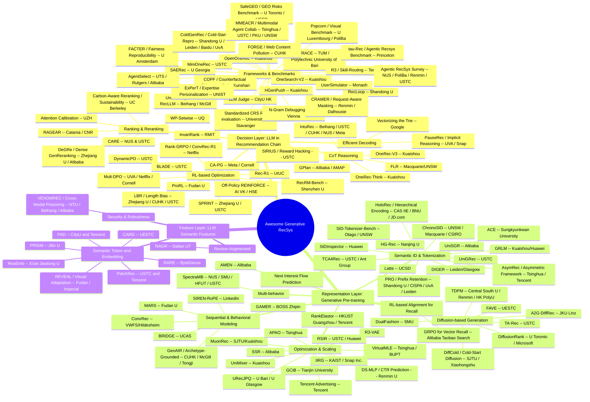

# Awesome Generative Recommendation System (RecSys)

> [!IMPORTANT]
> For those who are not familiar with GenRec, or not even the recommendation system, please checkout the kickstart posts [here](docs/kickstart.md).
> These posts are in Chinese, for English simply do your browser's internal translation or turn to __Ask Gemini__ :shipit:

## Quick Indexing
- [By Date](#by-date)
- [By Opensource](#by-opensource)
- [By Keyword](#by-keyword)
- [By Affiliation](#by-affiliation)

  <i> Open-source Generative RecSys Map </i>

---
## By Date

### Papers July 8

*Wednesday, July 8, 2026. Arxiv cs.IR new listing returned only 1 relevant genrec paper. Applied 3-month fallback → found 2 ICLR 2026 papers (PESO, VISTA), 1 ICML 2026 paper (CRAMER), and 1 SIGIR 2026 missed paper (ColdGenRec). Total: 5 papers.*

1. **SCOReD: Student-Aware CoT Optimization for Recommendation Distillation**
   * Affiliation: UC Riverside, Meta AI — *(Haz Sameen Shahgir, Yue Dong — UC Riverside; Yufei Li, Frank Shyu, Luke Simon, Sandeep Pandey, Xi Liu — Meta AI)*
   * Link: [arxiv.org/abs/2607.05734](https://arxiv.org/abs/2607.05734)
   * Venue: arXiv preprint, July 2026
   * TL;DR: Framework for distilling chain-of-thought reasoning from large LLM teachers to smaller student models for recommendation; parses teacher traces into typed segments, uses student attention to score importance, and dynamically selects KEEP/REWRITE/FUSE/PRUNE edits per segment; +1.56% NDCG, +1.9% Recall@5, 27.3% reasoning length reduction.
   * Key techniques:
     - Student-aware CoT trace parsing into typed segments with dynamic per-segment editing
     - Attention-based segment importance scoring using the student LLM's own attention
     - Four editing operations (KEEP/REWRITE/FUSE/PRUNE) selected via output length and log-probability lift
     - CoT distillation specifically tailored for the recommendation domain as pre-RL training
   * Scores (Opensource? / Novelty / Fairness / Robustness / Impact):
     - **Opensource?: 0/10** — No public code available
     - **Novelty: 7/10** — First student-aware CoT optimization framework tailored specifically for recommendation distillation
     - **Fairness: 3/10** — Not addressing fairness
     - **Robustness: 7/10** — 1.56% NDCG, 1.9% Recall@5 across recommendation benchmarks
     - **Impact: 7/10** — Meta/UC Riverside; practical distillation framework for deploying LLM-based recsys

2. **Cold-Starts in Generative Recommendation: A Reproducibility Study (ColdGenRec)**
   * Affiliation: Shandong University, Leiden University, Baidu Inc., University of Amsterdam — *(Zhen Zhang, Xin Xin — Shandong University; Jujia Zhao, Zhaochun Ren — Leiden University; Xinyu Ma — Baidu Inc.; Maarten de Rijke — University of Amsterdam)*
   * Link: [arxiv.org/abs/2603.29845](https://arxiv.org/abs/2603.29845)
   * Venue: SIGIR 2026
   * TL;DR: Systematic reproducibility study isolating the impact of model scale, identifier design, and RL training on cold-start performance of generative recommenders; reproduces multiple GR models under unified user/item cold-start protocols; released full code and data pipeline.
   * Key techniques:
     - Unified suite of cold-start protocols for user cold-start and item cold-start evaluation
     - Isolates impact of three core design choices: model scale, identifier design, and RL training
     - Reproduces representative generative recommenders (OpenOneRec, MiniOneRec, etc.) under controlled settings
     - Full code release with evaluation pipeline, dataset preprocessing, and configuration files
   * Scores (Opensource? / Novelty / Fairness / Robustness / Impact):
     - **Opensource?: 8/10** — [github.com/zhangzhen-research/ColdGenrec](https://github.com/zhangzhen-research/ColdGenrec) — complete pipeline with source code, evaluation scripts, dataset preprocessing; SIGIR 2026 artifact; well-documented
     - **Novelty: 7/10** — First systematic reproducibility study isolating key design factors in generative recommendation cold-start
     - **Fairness: 6/10** — Cold-start protocol explicitly addresses item/user fairness in sparse-data scenarios
     - **Robustness: 8/10** — Multiple models, datasets (Amazon, MicroLens, Steam), unified protocols; SIGIR 2026 peer-reviewed
     - **Impact: 7/10** — SIGIR 2026; Shandong/Leiden/Baidu/UvA; foundational benchmark for cold-start generative recommendation

3. **CRAMER: Control via Request-Aware Masking for Editing Recommenders**
   * Affiliation: Renmin University of China, Dalhousie University — *(Zhiyuan Su, Naihe Feng, Zhen Qin — Renmin University; Ga Wu — Dalhousie University)*
   * Link: ICML 2026 ([Poster 62968](https://icml.cc/virtual/2026/poster/62968))
   * Venue: ICML 2026
   * TL;DR: Treats natural-language user requests as control signals to modulate frozen sequential recommendation backbone parameters via masking, enabling instant adaptation without retraining or LLM prompting; outperforms 4 SOTA request-aware baselines with minimal overhead.
   * Key techniques:
     - Request-aware masking: user requests act as control signals modulating frozen backbone parameters
     - Model control theory-inspired: avoids costly retraining or LLM-based prompt engineering
     - Frozen backbone with learned masks enabling cross-domain adaptability
     - Lightweight instant adaptation to diverse natural-language user requests
   * Scores (Opensource? / Novelty / Fairness / Robustness / Impact):
     - **Opensource?: 7/10** — [github.com/zhiyuansu0326/CRAMER-ICML2026](https://github.com/zhiyuansu0326/CRAMER-ICML2026) — ICML 2026 code release; complete implementation with documentation
     - **Novelty: 7/10** — Novel control-theory perspective on request-aware recommendation with masking-based adaptation
     - **Fairness: 4/10** — Cross-domain adaptability promotes broader access; not primary focus
     - **Robustness: 7/10** — Outperforms 4 SOTA baselines; ICML 2026 peer-reviewed; cross-domain generalization
     - **Impact: 7/10** — ICML 2026; practical lightweight framework for real-time request adaptation

4. **Continual Low-Rank Adapters for LLM-based Generative Recommender Systems (PESO)**
   * Affiliation: University of Illinois Urbana-Champaign, Korea University, Amazon — *(Hyunsik Yoo, Ting-Wei Li, Zhining Liu, Hanghang Tong — UIUC; SeongKu Kang — Korea University; Charlie Xu, Qilin Qi — Amazon)*
   * Link: [arxiv.org/abs/2510.25093](https://arxiv.org/abs/2510.25093)
   * Venue: ICLR 2026
   * TL;DR: Proposes PESO (Proximally rEgularized Single evolving lOra) for continual adaptation of LLM-based generative recommenders; uses proximal regularization anchoring current adapter to its most recent frozen state, enabling flexible balance between preserving old knowledge and absorbing new preferences.
   * Key techniques:
     - Single evolving LoRA replacing frozen adapter stacking for continual learning
     - Proximal regularizer anchoring current adapter to most recent frozen state
     - Data-aware, direction-wise guidance in LoRA subspace (theoretically analyzed)
     - Challenges conventional continual learning goal of preserving past performance in recommendation
   * Scores (Opensource? / Novelty / Fairness / Robustness / Impact):
     - **Opensource?: 0/10** — No public code available
     - **Novelty: 7/10** — Novel continual learning paradigm specifically designed for recommendation's unique preference evolution
     - **Fairness: 3/10** — Not addressing fairness
     - **Robustness: 7/10** — Consistently outperforms LoRA-based continual methods on 3 real-world datasets; ICLR 2026 peer-reviewed
     - **Impact: 7/10** — ICLR 2026; UIUC/Amazon; practical continual learning framework for deployed LLM-based recsys

5. **Massive Memorization with Hundreds of Trillions of Parameters for Sequential Transducer Generative Recommenders (VISTA)**
   * Affiliation: Meta, Yale University — *(Zhimin Chen, Chenyu Zhao, Ka Chun Mo, Yunjiang Jiang, Khushhall Chandra Mahajan, Ning Jiang, Kai Ren, Jinhui Li, Wen-Yun Yang — Meta; Jane H. Lee — Yale University / Meta intern)*
   * Link: [arxiv.org/abs/2510.22049](https://arxiv.org/abs/2510.22049)
   * Venue: ICLR 2026
   * TL;DR: Two-stage attention framework decomposing target attention into history summarization (into few hundred cached tokens) and lightweight candidate attention over those tokens; enables scaling to lifelong user histories of up to 1M items with fixed downstream cost; deployed on Meta's recommendation platform serving billions of users.
   * Key techniques:
     - VISTA (VIrtual Sequential Target Attention): two-stage decomposition of target attention
     - Stage 1: user history summarization into a few hundred cached summary tokens
     - Stage 2: lightweight candidate item attention over cached summary tokens
     - Fixed downstream training/inference cost regardless of history length (up to 1M items)
   * Scores (Opensource? / Novelty / Fairness / Robustness / Impact):
     - **Opensource?: 0/10** — No public code available (Meta internal production)
     - **Novelty: 8/10** — Novel two-stage attention paradigm enabling trillion-parameter-scale memorization for recsys
     - **Fairness: 3/10** — Not addressing fairness
     - **Robustness: 9/10** — Deployed on Meta platform serving billions of users; ICLR 2026 peer-reviewed
     - **Impact: 9/10** — ICLR 2026; Meta; massive-scale industrial generative recommendation breakthrough

### Papers July 9

*Thursday, July 9, 2026. Arxiv cs.IR new listing returned only 2 relevant genrec papers (COPE + MMEACR). Applied 3-month fallback → found 5 additional papers (PauseRec, HoloRec, DiffCold, AsymRec, DeGRe). Total: 7 papers.*

1. **When and How to Ask: Dynamic Preference Elicitation Strategies for Conversational Recommendation (COPE)**
   * Affiliation: University of Sheffield, Bloomberg — *(Feng Xia, Xi Wang — University of Sheffield; Shuo Zhang — Bloomberg)*
   * Link: [arxiv.org/abs/2607.06765](https://arxiv.org/abs/2607.06765)
   * Venue: SIGIR 2026
   * TL;DR: Systematic investigation of stage-dependent preference elicitation for conversational recommendation; proposes COPE (Mixture of Experts) and InPE dataset with fine-grained elicitation annotations; attribute-based inquiries effective early, item-based strategies superior later.
   * Key techniques:
     - Stage-aware preference elicitation: attribute-based in early stages, item-based in later stages
     - InPE dataset with fine-grained annotations for elicitation necessity and strategy selection
     - COPE architecture (COnversational Preference Elicitation via Mixture of Experts) for dynamic strategy modeling
     - Empirical evidence of consistent stage-wise tendencies in dialogue progression
   * Scores (Opensource? / Novelty / Fairness / Robustness / Impact):
     - **Opensource?: 4/10** — [github.com/juanfacabian/InPE](https://github.com/juanfacabian/InPE) — dataset publicly available; no model code released
     - **Novelty: 6/10** — First systematic stage-aware analysis of preference elicitation strategies in CRS
     - **Fairness: 4/10** — Stage-dependent strategies may improve user experience equity
     - **Robustness: 6/10** — Extensive offline evaluation; SIGIR 2026 peer-reviewed
     - **Impact: 5/10** — SIGIR 2026; practical framework for conversational recommendation

2. **Seeing and Reflecting: Multimodal Memory-Enhanced Agent Collaboration for Recommendation (MMEACR)**
   * Affiliation: Tsinghua University, USTC, Peking University, UNSW, Macquarie University, CSIRO's Data61 — *(Hao Cong — Tsinghua; Huizu Lin — USTC; Zihan Wang — Peking; Chengkai Huang — UNSW/Macquarie; Quan Z. Sheng — Macquarie; Lina Yao — UNSW/CSIRO Data61)*
   * Link: [arxiv.org/abs/2607.07108](https://arxiv.org/abs/2607.07108)
   * Venue: arXiv preprint, July 2026
   * TL;DR: Dual-track memory architecture for LLM-based agentic recommendation; reasoning track with collaborative User/Item Memory Agents updated via attribute-guided reinforcement-and-reflection, matching track with decoupled multimodal embedding memory; integrated via weighted Reciprocal Rank Fusion.
   * Key techniques:
     - Dual-track memory: interpretable agent reasoning track + fine-grained multimodal matching track
     - Collaborative User and Item Memory Agents with persistent multimodal memories
     - Attribute-guided reinforcement-and-reflection mechanism for memory updates
     - Decoupled multimodal embedding memory preserving cross-modal signals beyond structured updates
   * Scores (Opensource? / Novelty / Fairness / Robustness / Impact):
     - **Opensource?: 0/10** — No public code available
     - **Novelty: 7/10** — Novel dual-track memory architecture separating reasoning from matching in agentic recsys
     - **Fairness: 4/10** — Multimodal memory may improve representation fairness across modalities
     - **Robustness: 6/10** — Three real-world domains; strong gains in visually grounded recommendation
     - **Impact: 6/10** — Tsinghua/USTC/PKU/UNSW/Macquarie/CSIRO; advances LLM agent-based multimodal recommendation

3. **Implicit Reasoning for Large Language Model-based Generative Recommendation (PauseRec)**
   * Affiliation: University of Virginia, Snap Inc. — *(Yinhan He, Jundong Li — University of Virginia; Liam Collins, Bhuvesh Kumar, Neil Shah, Donald Loveland — Snap Inc.)*
   * Link: [arxiv.org/abs/2606.14142](https://arxiv.org/abs/2606.14142)
   * Venue: arXiv preprint, June 2026
   * TL;DR: Lightweight implicit reasoning paradigm replacing explicit CoT in LLM-based GR; uses trainable <pause> tokens for latent computation instead of explicit reasoning traces; +6.22% performance, -65% GPU hours training, -71.3% inference speedup.
   * Key techniques:
     - Implicit reasoning via trainable <pause> tokens enabling latent computation in LLMs
     - Eliminates need for costly reasoning trace acquisition and alignment training
     - Identifies three limitations of explicit CoT: weakened world-knowledge verbalization, SID-language misalignment, rationale quality sensitivity
     - Dramatic training and inference efficiency gains over explicit CoT baselines
   * Scores (Opensource? / Novelty / Fairness / Robustness / Impact):
     - **Opensource?: 0/10** — No public code available
     - **Novelty: 8/10** — Novel implicit reasoning paradigm for LLM-based genrec; first to replace explicit CoT with latent tokens
     - **Fairness: 3/10** — Not addressing fairness
     - **Robustness: 7/10** — +6.22% over explicit CoT baselines; 65% training cost reduction; comprehensive ablations
     - **Impact: 7/10** — UVA/Snap; practical lightweight reasoning paradigm for deployed LLM-based recsys

4. **HoloRec: Holistic Encoding and Interleaved Reasoning for Generative Recommendation**
   * Affiliation: Institute of Information Engineering (CAS), Beijing Normal University, JD.com — *(Shuqi Zhao, Xiang Liu, Liang Lin, Pengbo Mo, Mingming Li, Jiao Dai, Jizhong Han, Songlin Hu — CAS IIE; Jingsong Su — BNU; Xingzhi Yao, Yiming Qiu, Huimu Wang — JD.com)*
   * Link: [arxiv.org/abs/2606.15331](https://arxiv.org/abs/2606.15331)
   * Venue: arXiv preprint, June 2026
   * TL;DR: Endogenous CoT recommendation unifying representation, reasoning, and generation via multi-granularity nested residual quantization; two inference modes — non-thinking (lightweight alignment) and thinking (interleaved on-the-fly reasoning); consistent gains especially in sparse scenarios.
   * Key techniques:
     - Hierarchical semantic encoding matrix via multi-granularity nested residual quantization
     - Holistic reconstruction loss jointly optimizing representation and generation
     - Non-thinking mode: lightweight multi-granularity supervised alignment for fast prediction
     - Thinking mode: interleaved reasoning generating CoT steps on-the-fly without external annotations
   * Scores (Opensource? / Novelty / Fairness / Robustness / Impact):
     - **Opensource?: 0/10** — No public code available
     - **Novelty: 7/10** — Novel endogenous CoT for genrec unifying representation, reasoning, and generation
     - **Fairness: 3/10** — Not addressing fairness
     - **Robustness: 7/10** — Multiple public datasets; consistent gains with notable sparse-scenario improvements
     - **Impact: 7/10** — CAS IIE/BNU/JD.com; advances hierarchical semantic encoding for generative recommendation

5. **DiffCold: A Diffusion-based Generative Model for Cold-Start Item Recommendation**
   * Affiliation: Shanghai Jiao Tong University, Xiaohongshu Inc. — *(Kangning Zhang, Jianghao Lin, Yingjie Qin, Weinan Zhang, Yong Yu — SJTU; Huanling — Xiaohongshu)*
   * Link: [arxiv.org/abs/2606.12245](https://arxiv.org/abs/2606.12245)
   * Venue: ECML-PKDD 2026
   * TL;DR: Diffusion-based generative model resolving the cold-start "seesaw dilemma" where improving cold items degrades warm items; retrieval-enhanced aggregator initializes from warm neighbors, simulation-based alignment enforces distribution consistency; consistent SOTA across 3 benchmarks.
   * Key techniques:
     - Identifies seesaw dilemma: warm items on behavioral manifold vs. cold items on semantic manifold
     - Retrieval-enhanced aggregator initializing generation from semantically similar warm items
     - Simulation-based representation alignment via contrastive learning between generated and real embeddings
     - Conditional diffusion unifying warm and cold representations without rigid manifold mapping
   * Scores (Opensource? / Novelty / Fairness / Robustness / Impact):
     - **Opensource?: 0/10** — No public code available
     - **Novelty: 7/10** — Novel diffusion-based approach specifically targeting cold-start representation disparity
     - **Fairness: 5/10** — Directly addresses cold-start item fairness; resolves warm-cold seesaw dilemma
     - **Robustness: 7/10** — 3 benchmarks; consistent SOTA; ECML-PKDD 2026 peer-reviewed
     - **Impact: 7/10** — ECML-PKDD 2026; SJTU/Xiaohongshu; practical cold-start solution with industrial backing

6. **Asymmetric Generative Recommendation via Multi-Expert Projection and Multi-Faceted Hierarchical Quantization (AsymRec)**
   * Affiliation: Tsinghua University, Tencent — *(Bin Huang, Xin Wang, Wenwu Zhu — Tsinghua; Junwei Pan, Yongqi Zhou, Yifeng Zhou, Zhixiang Feng, Shudong Huang, Haijie Gu — Tencent)*
   * Link: [arxiv.org/abs/2605.14512](https://arxiv.org/abs/2605.14512)
   * Venue: arXiv preprint, May 2026
   * TL;DR: Decouples input and output representations in generative recommendation to address dual-stage information bottleneck; Multi-expert Semantic Projection preserves semantic richness, Multi-faceted Hierarchical Quantization prevents dimensional collapse; +15.8% average improvement over SOTA.
   * Key techniques:
     - Asymmetric continuous-discrete framework decoupling input representations from discrete output targets
     - Multi-expert Semantic Projection (MSP): expert-specialized projections improving infrequent item generalization
     - Multi-faceted Hierarchical Quantization (MHQ): multi-view multi-level quantization with semantic regularization
     - Identifies dual-stage information bottleneck: input lossy quantization bias + output imprecise discrete targets
   * Scores (Opensource? / Novelty / Fairness / Robustness / Impact):
     - **Opensource?: 0/10** — No public code available (code promised but not yet released)
     - **Novelty: 7/10** — Novel asymmetric framework explicitly addressing dual-stage information bottleneck in genrec
     - **Fairness: 4/10** — MSP improves infrequent item generalization mitigating popularity bias
     - **Robustness: 7/10** — +15.8% avg improvement; consistent across multiple datasets and baselines
     - **Impact: 7/10** — Tsinghua/Tencent; strong empirical results advancing genrec representation design

7. **DeGRe: Dense-supervised Generative Reranking for Recommendation**
   * Affiliation: Zhejiang University, Alibaba Group — *(Chaotian Song, Jingyao Zhang, Chenghao Chen, Zisen Sang, Dehai Zhao, Guodong Cao, Boxi Wu, Deng Cai, Jia Jia — Zhejiang University / Alibaba Group)*
   * Link: [arxiv.org/abs/2605.25749](https://arxiv.org/abs/2605.25749)
   * Venue: KDD 2026 (ADS Track)
   * TL;DR: Dense-supervised generative reranking with offline-online decoupled design; Lookahead Evaluator uses beam search to mine high-value sequences offline, dense step-wise supervision distilled to lightweight Online Generator for single-pass greedy decoding; deployed on Taobao Flash Shopping.
   * Key techniques:
     - Offline-online decoupled design: beam-search exploration offline → dense distillation → greedy online generation
     - Lookahead Evaluator with cumulative regression actively mining high-value unexposed sequences
     - Step-wise dense supervision bridging click-top heuristic label bias and credit assignment gap
     - Lightweight Online Generator internalizing lookahead planning in single greedy decoding pass
   * Scores (Opensource? / Novelty / Fairness / Robustness / Impact):
     - **Opensource?: 0/10** — No public code available
     - **Novelty: 7/10** — Novel dense-supervised paradigm for generative reranking with offline-online decoupling
     - **Fairness: 3/10** — Not addressing fairness
     - **Robustness: 8/10** — Public benchmarks + industrial dataset; deployed on Taobao Flash Shopping; KDD 2026
     - **Impact: 8/10** — KDD 2026; Zhejiang/Alibaba; industrial deployment with verified online gains

### Papers July 7

*Tuesday, July 7, 2026. Arxiv cs.IR new listing returned 6 relevant genrec papers. No fallback needed.*

1. **LBR: Towards Mitigating Length Bias in Large Language Models for Recommendation**
   * Affiliation: Zhejiang University, The Chinese University of Hong Kong (CUHK), University of Science and Technology of China (USTC), Bangsun Technology — *(Hongchen Li, Bohao Wang, Weiqin Yang, Can Wang, Jiawei Chen — Zhejiang University; Jingbang Chen — CUHK; Hang Pan — USTC; Bingde Hu — Bangsun Technology)*
   * Link: [arxiv.org/abs/2607.04270](https://arxiv.org/abs/2607.04270)
   * Venue: arXiv preprint, July 2026
   * TL;DR: Identifies and mitigates dual length bias in LLM-based recommendation — input-side attention skew from longer item descriptions and output-side decoding bias against long items; proposes LBR framework with Length-Aware Attention Calibration and Effective Information Length Normalization; +16.82% avg NDCG@5.
   * Key techniques:
     - Length-Aware Attention Calibration: length-dependent offset injected into attention logits to neutralize input-side skew
     - Effective Information Length Normalization: information-theoretic length surrogate from prefix tree branching structure replaces naive token count
     - Model-agnostic lightweight framework with negligible training/inference overhead
     - Thorough analysis of length bias mechanisms in both input context and autoregressive decoding
   * Scores (Opensource? / Novelty / Fairness / Robustness / Impact):
     - **Opensource?: 5/10** — Paper claims code at github.com/Void-JackLee/LBR (repo not yet accessible, likely pending publication)
     - **Novelty: 8/10** — First systematic identification and mitigation of dual length bias in LLM-based recommendation
     - **Fairness: 7/10** — Directly addresses length-related fairness; length normalization improves item exposure equity
     - **Robustness: 7/10** — 3 Amazon datasets, 2 LLM-based recommender backbones; consistent improvements
     - **Impact: 7/10** — Addresses fundamental bias in LLM4Rec; Zhejiang/CUHK/USTC collaboration

2. **UniSGR: Unified Framework for Semantic ID Generation and Ranking**
   * Affiliation: Alibaba International Digital Commerce Group — *(Jiawei Sun, Jun Yang, Ziyue Guo, Dongyue Xu, Jianan Yan, Lifang Deng, Xiaoyi Zeng — Alibaba International)*
   * Link: [arxiv.org/abs/2607.04068](https://arxiv.org/abs/2607.04068)
   * Venue: arXiv preprint, July 2026
   * TL;DR: Two-stage framework unifying semantic ID generation and multi-objective ranking for e-commerce generative retrieval; introduces Task-Aware Tokens with Funnel-Aware Contrastive Learning and STARK inference strategy removing KV cache bottlenecks in beam search.
   * Key techniques:
     - Two-stage training: multi-scenario pre-training + scenario-specific alignment
     - Value-Aware Parallel Multi-Token Prediction (VA-PMTP) for joint generation and ranking optimization
     - Task-Aware Tokens (TAT) guided by Funnel-Aware Contrastive Learning for generation-ranking alignment
     - Semantic Tree Attention with Reorganized KV cache (STARK) for efficient beam search inference
   * Scores (Opensource? / Novelty / Fairness / Robustness / Impact):
     - **Opensource?: 0/10** — No public code available (Alibaba internal)
     - **Novelty: 7/10** — First unified framework integrating SID generation with multi-objective ranking; STARK inference is novel
     - **Fairness: 3/10** — Not addressing fairness
     - **Robustness: 7/10** — Large-scale e-commerce platform offline evaluation
     - **Impact: 7/10** — Alibaba International; practical framework bridging SID generation and ranking

3. **Beyond Item Order: Temporal Gap Tokenization for Generative Recommendation with Semantic IDs (ChronoSID)**
   * Affiliation: University of New South Wales (UNSW), Macquarie University, CSIRO's Data61 — *(Chengkai Huang — UNSW/Macquarie; Tianqi Gao — Independent; Hongtao Huang — UNSW; Quan Z. Sheng — Macquarie; Lina Yao — CSIRO Data61/UNSW)*
   * Link: [arxiv.org/abs/2607.03918](https://arxiv.org/abs/2607.03918)
   * Venue: arXiv preprint, July 2026
   * TL;DR: Lightweight temporal augmentation framework injecting inter-interaction gap signals into semantic-ID-based generative recommendation via time-aware masked auto-encoding and discretized gap token interleaving; consistent gains especially under long-gap scenarios.
   * Key techniques:
     - Time-Aware Field-Aware Masked Auto-Encoding (TA-FAMAE): auxiliary time-gap prediction objective for item representation learning
     - Discretized log-scale gap tokens interleaved with SID tuples in encoder input
     - Two complementary temporal signal injection perspectives preserving compact SID generation paradigm
     - Diagnostic analysis showing stronger gains under long-gap (interest drift) scenarios
   * Scores (Opensource? / Novelty / Fairness / Robustness / Impact):
     - **Opensource?: 0/10** — No public code available
     - **Novelty: 7/10** — First temporal augmentation framework specifically for semantic-ID-based generative recommendation
     - **Fairness: 3/10** — Not addressing fairness
     - **Robustness: 6/10** — Amazon review benchmarks with ablation and diagnostic analyses
     - **Impact: 6/10** — UNSW/Macquarie/CSIRO; addresses important temporal blindness limitation in SID-based genrec

4. **HGenPush: A Heterogeneous Generative Recommendation Architecture for Industrial Push Notification Systems**
   * Affiliation: Kuaishou Technology — *(Xiao Liang, Jiali Feng, Xin Feng, Yiqing Wang, Baolin Ye, Siyao Feng, Zhihui Deng, Cunyi Zhang, Huajin Sun, Xuanping Li, Kaiqiao Zhan, Yanan Niu, Kun Gai — Kuaishou Technology, Beijing)*
   * Link: [arxiv.org/abs/2607.03362](https://arxiv.org/abs/2607.03362)
   * Venue: arXiv preprint, July 2026
   * TL;DR: End-to-end heterogeneous generative recommendation architecture generating dual-type content (videos + authors) for push notifications; replaces autoregressive paradigm with lightweight multi-token prediction; deployed on Kuaishou with +0.181% DAU lift.
   * Key techniques:
     - Hybrid user behavior understanding: multi-scenario and multi-perspective behavior integration
     - Dual-branch heterogeneous generation unifying video and author recommendation
     - Lightweight multi-token prediction discarding autoregressive paradigm for efficiency
     - User consumption preference alignment module with reward-guided generation
   * Scores (Opensource? / Novelty / Fairness / Robustness / Impact):
     - **Opensource?: 0/10** — No public code available (Kuaishou internal production)
     - **Novelty: 7/10** — First heterogeneous generative recommendation for push notifications unifying dual content types
     - **Fairness: 3/10** — Not addressing fairness
     - **Robustness: 8/10** — Deployed on Kuaishou push notification system; verified DAU improvement
     - **Impact: 8/10** — Kuaishou; industrial deployment with measurable business metrics

5. **Long-Term Optimization for Large-Scale Generative Retrieval with Off-Policy REINFORCE**
   * Affiliation: AI VK, HSE University — *(Artem Matveev, Sergei Makeev, Aleksei Krasilnikov, Vladimir Baikalov, Sergei Liamaev — AI VK; Kirill Khrylchenko — HSE University)*
   * Link: [arxiv.org/abs/2607.02818](https://arxiv.org/abs/2607.02818)
   * Venue: 5th Workshop on End-to-End Customer Journey Optimization at KDD 2026
   * TL;DR: Formulates generative retrieval as session-level sequential decision-making with off-policy REINFORCE and multi-step importance weighting; introduces feedback-model-based test-time scaling for predicting long-term returns; evaluated on Yambda-5B dataset.
   * Key techniques:
     - Multi-step importance weight approximation enabled by autoregressive formulation
     - User feedback model simulating responses for offline evaluation
     - Doubly robust off-policy evaluation adapted for sequential recommendation
     - Test-time scaling: simulate future responses to select recommendations with highest predicted long-term returns
   * Scores (Opensource? / Novelty / Fairness / Robustness / Impact):
     - **Opensource?: 0/10** — No public code available
     - **Novelty: 7/10** — First multi-step off-policy REINFORCE for generative retrieval with test-time scaling
     - **Fairness: 3/10** — Not addressing fairness
     - **Robustness: 6/10** — Evaluated on public Yambda-5B dataset; KDD 2026 Workshop peer-reviewed
     - **Impact: 6/10** — KDD 2026 Workshop; practical RL framework for long-term optimization in generative retrieval

6. **Autonomous Information Seeking: A Roadmap for Agentic Recommender Systems**
   * Affiliation: National University of Singapore (NUS), Polytechnic University of Bari, Renmin University of China, University of Science and Technology of China (USTC) — *(Xinyu Lin, Honghui Bao, Tat-Seng Chua — NUS; Yashar Deldjoo, Fatemeh Nazary, Tommaso Di Noia — Polytechnic University of Bari; Sunhao Dai, Xiaopeng Ye, Jun Xu — Renmin University of China; Wenjie Wang — USTC)*
   * Link: [arxiv.org/abs/2607.04433](https://arxiv.org/abs/2607.04433)
   * Venue: arXiv preprint, July 2026
   * TL;DR: Comprehensive survey establishing a unified taxonomy for agentic recommender systems grounded in three paradigms (agent-assisted, agent-as-recommender, agent-as-user-simulator) and autonomy levels; covers evaluation challenges including trajectory-level assessment and agent contribution analysis.
   * Key techniques:
     - Unified taxonomy: agent-assisted recommendation, agent-as-recommender, agent-as-user-simulator
     - Autonomy framework organizing methods by proactivity, context awareness, interaction flexibility, and adaptivity
     - Analysis of agent architectures: profiles, memory, tool use, workflows, optimization mechanisms
     - Evaluation methodology survey: automated metrics, LLM judging, simulation-based assessment, trajectory-level evaluation
   * Scores (Opensource? / Novelty / Fairness / Robustness / Impact):
     - **Opensource?: 0/10** — No public code (survey paper)
     - **Novelty: 7/10** — First comprehensive survey unifying agentic recsys paradigms with autonomy-based taxonomy
     - **Fairness: 5/10** — Discusses trustworthiness and controllability as fairness-related dimensions
     - **Robustness: 6/10** — Systematic coverage across paradigms, architectures, and evaluation; survey quality
     - **Impact: 8/10** — NUS/Renmin/PoliBa/USTC; foundational reference for the rapidly growing agentic recsys field

### Papers July 6 (ICML 2026 Day 1)

*No new arxiv papers today (Monday, July 6, 2026). Arxiv new submissions not yet posted. ICML 2026 Day 1 kicks off in Seoul — cross-referenced ICML 2026 accepted papers list against existing README entries. Found 6 ICML 2026 GenRec/LLM4Rec papers not yet in the repository.*

1. **VENOMREC: Cross-Modal Interactive Poisoning for Targeted Promotion in Multimodal LLM Recommender Systems**
   * Affiliation: Nanyang Technological University (NTU), Beihang University, Alibaba — *(Guowei Guan, Yurong Hao, Jiaming Zhang, Tiantong Wu, Fuyao Zhang, Tianxiang Chen, Longtao Huang, Cyril Leung, Wei Yang Bryan Lim)*
   * Link: [arxiv.org/abs/2602.06409](https://arxiv.org/abs/2602.06409)
   * Venue: ICML 2026
   * TL;DR: Formalizes and demonstrates cross-modal interactive poisoning — a new attack surface in MLLM-based recommender systems where synchronized multimodal perturbations steer fused representations along stable semantic directions during fine-tuning; VENOMREC achieves 0.73 mean ER@20, +0.52 over strongest baseline.
   * Key techniques:
     - Exposure Alignment identifying high-exposure regions in the joint text-image embedding space
     - Cross-modal Interactive Perturbation crafting attention-guided coupled token-patch edits
     - Formalizes cross-modal interactive poisoning as a distinct threat category for MLLM RecSys
     - Maintains comparable recommendation utility while achieving effective targeted promotion
   * Scores (Opensource? / Novelty / Fairness / Robustness / Impact):
     - **Opensource?: 0/10** — No public code available
     - **Novelty: 7/10** — First formalization of cross-modal interactive poisoning for MLLM RecSys
     - **Fairness: 5/10** — Exposes fairness vulnerability; adversarial study informs robustness
     - **Robustness: 7/10** — 3 datasets, 0.73 ER@20, +0.52 over strongest baseline; ICML 2026 peer-reviewed
     - **Impact: 7/10** — ICML 2026; NTU/Beihang/Alibaba; opens security dimension for multimodal LLM RecSys

2. **ProRL: Effective Reinforcement Learning for Proactive Recommendation via Rectified Policy Gradient Estimation**
   * Affiliation: Fudan University — *(Hongru Hou, Tiehua Mei, Denghui Geng, Jinhui Huang, Ao Xu, Hengrui Chen, Jiaqing Liang, Deqing Yang — Fudan University)*
   * Link: [arxiv.org/abs/2605.28293](https://arxiv.org/abs/2605.28293)
   * Venue: ICML 2026
   * TL;DR: Identifies two critical gradient estimation deficiencies in applying policy gradients to proactive recommendation — length-dependent bias and high gradient variance — and proposes Stepwise Reward Centering and Position-Specific Advantage Estimation to rectify them; significantly outperforms SOTA PRSs on 3 real-world datasets.
   * Key techniques:
     - Formal identification of length-dependent bias: path-level rewards decompose into positively-biased step-level rewards favoring path extension
     - Stepwise Reward Centering subtracting expected rewards to neutralize length bias
     - Position-Specific Advantage Estimation computing step-dependent baselines for variance reduction
     - Semantic-ID item representations + T5 backbone for proactive path generation
   * Scores (Opensource? / Novelty / Fairness / Robustness / Impact):
     - **Opensource?: 8/10** — [github.com/hongruhou89/ProRL](https://github.com/hongruhou89/ProRL) — 45⭐, well-documented README, clean modular code, shell scripts for reproduction, pinned dependencies; missing pretrained weights and datasets
     - **Novelty: 7/10** — First to formally identify and fix two gradient estimation deficiencies in proactive recommendation RL
     - **Fairness: 3/10** — Not addressing fairness
     - **Robustness: 7/10** — 3 real-world datasets; consistent SOTA improvement; ICML 2026 peer-reviewed
     - **Impact: 7/10** — ICML 2026; Fudan; practical RL framework for proactive recommendation with strong opensource

3. **Hyperbolic RQ-VAE enhanced Generative Recommendation with Differential-Length Codebook Strategy (HG-Rec)**
   * Affiliation: Nanjing University, Nanjing University of Posts and Telecommunications — *(Aoran Zhang, Yu-Bin Yang, Yonghong Yu)*
   * Link: [openreview.net/forum?id=BpVBWp3PZx](https://openreview.net/forum?id=BpVBWp3PZx)
   * Venue: ICML 2026
   * TL;DR: Enhances residual quantization for generative recommendation by embedding latent discrete representations into hyperbolic space to explicitly model tree-like item hierarchies, combined with a pyramidal differential-length codebook strategy leveraging hyperbolic volume growth; achieves lower collision rates, more uniform codebook usage, and reduced training time.
   * Key techniques:
     - Hyperbolic RQ-VAE replacing Euclidean residual quantization to capture hierarchical item relationships
     - Differential-length codebook strategy with pyramidal structure aligned to tree-like item taxonomy
     - Exponential volume growth of hyperbolic space enabling compressed yet expressive codebooks
     - Improved codebook utilization and collision reduction over Euclidean RQ-VAE baselines
   * Scores (Opensource? / Novelty / Fairness / Robustness / Impact):
     - **Opensource?: 5/10** — [github.com/zar123123/HG-Rec](https://github.com/zar123123/HG-Rec) — minimal repo (2 commits, 1⭐), bare README, training scripts present but no documentation
     - **Novelty: 8/10** — First hyperbolic RQ-VAE for genrec; differential-length codebook is novel and well-motivated
     - **Fairness: 3/10** — Not addressing fairness
     - **Robustness: 7/10** — Multiple benchmark datasets; consistent SOTA; ICML 2026 peer-reviewed
     - **Impact: 7/10** — ICML 2026; Nanjing University; advances SID-based genrec with hyperbolic geometry

4. **Mitigating Reward Hacking in LLM-based Recommendation: A Preference Optimization Approach (SIRIUS)**
   * Affiliation: University of Science and Technology of China (USTC) — *(Heyu Chen, Junkang Wu, Guoqing Hu, Kexin Huang, Xiang Wang, Jiancan Wu — USTC)*
   * Link: [openreview.net/forum?id=9chqEmpIZT](https://openreview.net/forum?id=9chqEmpIZT)
   * Venue: ICML 2026
   * TL;DR: Gradient-based analysis formalizing the ε-insensitive region where pairwise DPO updates have little influence on ordering, causing reward hacking; proposes SIRIUS introducing pseudo-negative samples to enrich contrastive signals and reduce ε-insensitive regions; consistent ranking quality improvement across 3 benchmarks.
   * Key techniques:
     - Gradient perspective analysis revealing the ε-insensitive region mechanism behind reward hacking in DPO-based LLM recsys
     - Bradley-Terry model theoretical analysis showing ε-insensitive regions occupy substantial preference space
     - SIRIUS framework: Simulated Preference Optimization with pseudo-negative samples enriching contrastive signals
     - Reduces ε-insensitive regions to improve ranking quality without additional annotation cost
   * Scores (Opensource? / Novelty / Fairness / Robustness / Impact):
     - **Opensource?: 3/10** — [anonymous.4open.science/r/C557-id](https://anonymous.4open.science/r/C557-id) — anonymous review repository only; no proper public release
     - **Novelty: 7/10** — Novel gradient-based analysis of reward hacking in LLM recsys; ε-insensitive region formalization
     - **Fairness: 4/10** — Mitigating reward hacking improves training fairness in preference optimization
     - **Robustness: 7/10** — 3 public benchmarks; consistent improvement; ICML 2026 peer-reviewed
     - **Impact: 7/10** — ICML 2026; USTC; addresses fundamental training issue in LLM-based recommendation alignment

5. **AgentSelect: Benchmark for Narrative Query-to-Agent Recommendation**
   * Affiliation: University of Technology Sydney (UTS), Rutgers University, Alibaba — *(Yunxiao Shi, Wujiang Xu, Tingwei Chen, Haoning Shang, Ling Yang, Yunfeng Wan, Zhuo Cao, Xing Zi, Dimitris N. Metaxas, Min Xu)*
   * Link: [arxiv.org/abs/2603.03761](https://arxiv.org/abs/2603.03761)
   * Venue: ICML 2026
   * TL;DR: First unified benchmark reframing LLM agent selection as narrative query-to-agent recommendation; 111K queries, 107K agents, 251K interaction records from 40+ sources; reveals regime shift where traditional CF/GNN methods fail and content-aware capability matching is essential; transfers to real marketplace (MuleRun).
   * Key techniques:
     - Unified agent recommendation benchmark converting heterogeneous evaluation artifacts into positive-only interaction data
     - Compositional agent synthesis inducing capability-sensitive behavior under counterfactual edits
     - Cross-platform transfer learning to MuleRun marketplace demonstrating practical utility
     - Analysis revealing dense head → long-tail regime shift in agent selection
   * Scores (Opensource? / Novelty / Fairness / Robustness / Impact):
     - **Opensource?: 0/10** — No public code available
     - **Novelty: 7/10** — First benchmark framing agent selection as query-to-agent recommendation; 111K queries at scale
     - **Fairness: 4/10** — Addresses long-tail agent coverage; capability-aware matching promotes fair agent access
     - **Robustness: 7/10** — 111K queries, 107K agents, 40+ sources, cross-platform transfer; ICML 2026 peer-reviewed
     - **Impact: 6/10** — ICML 2026; UTS/Rutgers/Alibaba; foundational benchmark for emerging agent recommendation ecosystem

6. **CCLRec: Consensus-driven Contrastive Learning for LLM-enhanced Graph Recommendation**
   * Affiliation: North University of China, Harbin Institute of Technology (HIT), Penn State University — *(Ting Guo, Dongyu Pei, Litiao Qiu, Xiaoying Liao, KE LIANG, Peng Song, Pinle Qin)*
   * Link: [openreview.net/forum?id=CCLRec_ICML2026](https://icml.cc/virtual/2026/poster/65594)
   * Venue: ICML 2026
   * TL;DR: Bridges the supervisory gap between GNN structural proximity and LLM semantic relevance by mining consensus signals from both modalities; consensus-centered contrastive learning with weight-aware reinforcement mechanism; consistently outperforms SOTA LLM-enhanced graph recommendation methods.
   * Key techniques:
     - LLM-based semantic sampling for candidate positive/negative sets in semantic space
     - Structural-semantic consensus mining computing intersection between graph neighbors and semantic neighbors
     - Consensus-centered contrastive learning on high-confidence pairs endorsed by both CF and LLM
     - Weight-aware reinforcement amplifying high-quality consensus features during training
   * Scores (Opensource? / Novelty / Fairness / Robustness / Impact):
     - **Opensource?: 0/10** — No public code available
     - **Novelty: 6/10** — Consensus-driven integration of structural and semantic signals is incremental but well-motivated
     - **Fairness: 3/10** — Not addressing fairness
     - **Robustness: 6/10** — Multiple public benchmarks; ICML 2026 peer-reviewed
     - **Impact: 5/10** — ICML 2026; incremental improvement on LLM-enhanced graph recommendation

### Papers July 5 (Weekend Catch-up — ICML 2026)

*No new arxiv papers today (Sunday, July 5, 2026). Weekend fallback chain executed: arxiv → Zhihu (inaccessible) → ICML 2026 accepted papers review. Found 5 ICML 2026 GenRec papers not yet in the repository.*

1. **Principled Synthetic Data Enables the First Scaling Laws for LLMs in Recommendation**
   * Affiliation: Meta — *(Benyu Zhang, Qiang Zhang, Jianpeng Cheng, Hong-You Chen, Qifei Wang, Wei Sun, Shen Li, Jia Li, Jiahao Wu, Qunshu Zhang, Neeraj Bhatia, Xiangjun Fan, Hong Yan — Meta)*
   * Link: [arxiv.org/abs/2602.07298](https://arxiv.org/abs/2602.07298)
   * Venue: ICML 2026
   * TL;DR: First empirical demonstration of robust power-law scaling for LLMs continually pre-trained on high-quality synthetic recommendation data; standard sequential models trained on principled synthetic data outperform real-data-trained models by +130% recall@100; shifts focus from mitigating data deficiencies to leveraging structured information.
   * Key techniques:
     - Layered framework generating high-quality synthetic data as a curated pedagogical curriculum
     - Hierarchical synthetic data circumventing noise, bias, and incompleteness in raw interaction data
     - Continual pre-training on recommendation-specific synthetic data revealing predictable perplexity reduction
     - Standard sequential models (SasRec) trained on synthetic data outperform real-data models significantly
   * Scores (Opensource? / Novelty / Fairness / Robustness / Impact):
     - **Opensource?: 0/10** — No public code available
     - **Novelty: 8/10** — First robust scaling laws for LLM-based recommendation; principled synthetic data curriculum
     - **Fairness: 3/10** — Not addressing fairness
     - **Robustness: 8/10** — Consistent scaling behavior across multiple synthetic data modalities; ICML 2026 peer-reviewed
     - **Impact: 9/10** — ICML 2026; Meta; foundational methodology enabling predictable scaling of LLM4Rec

2. **RSIR: Can Recommender Systems Teach Themselves? A Recursive Self-Improving Framework with Fidelity Control**
   * Affiliation: University of Science and Technology of China (USTC), Huawei — *(Luankang Zhang, Hao Wang, Zhongzhou Liu, Mingjia Yin, Yonghao Huang, Jiaqi Li, Defu Lian, Enhong Chen — USTC; Wei Guo, Yong Liu, Huifeng Guo — Huawei)*
   * Link: [arxiv.org/abs/2602.15659](https://arxiv.org/abs/2602.15659)
   * Venue: ICML 2026
   * TL;DR: Closed-loop bootstrapping framework enabling recommender systems to self-improve without external data or teacher models; current model generates plausible user interaction sequences, fidelity control filters them, and successor models train on enriched data; theoretical analysis shows RSIR acts as a data-driven implicit regularizer smoothing optimization landscapes.
   * Key techniques:
     - Recursive self-improvement loop: model generates synthetic interactions → fidelity filtering → successor model training
     - Fidelity-based quality control ensuring consistency with user preference manifolds
     - Theoretical analysis proving RSIR as implicit regularizer for recommendation optimization landscapes
     - Weak-to-strong generalization: weaker models generate effective curricula for stronger models
   * Scores (Opensource? / Novelty / Fairness / Robustness / Impact):
     - **Opensource?: 7/10** — [github.com/USTC-StarTeam/RSIR](https://github.com/USTC-StarTeam/RSIR) — Well-documented; ICML 2026 artifact
     - **Novelty: 8/10** — First closed-loop self-improving paradigm for recommender systems with fidelity control
     - **Fairness: 3/10** — Not addressing fairness
     - **Robustness: 7/10** — Cumulative gains across benchmarks and architectures; theoretical guarantees
     - **Impact: 8/10** — ICML 2026; USTC/Huawei; model-agnostic solution to recommendation data scarcity

3. **Cold-Start Personalization via Training-Free Priors from Structured World Models (PEP)**
   * Affiliation: University of Washington, Meta FAIR, Allen Institute for AI — *(Avinandan Bose — UW; Shuyue Stella Li, Faeze Brahman — UW; Pang Wei Koh — UW / Allen AI; Simon Shaolei Du — UW; Yulia Tsvetkov — UW / Allen AI; Maryam Fazel — UW; Lin Xiao — Meta FAIR; Asli Celikyilmaz — Meta FAIR)*
   * Link: [arxiv.org/abs/2602.15012](https://arxiv.org/abs/2602.15012)
   * Venue: ICML 2026
   * TL;DR: Decomposes cold-start preference elicitation into offline structure learning and online Bayesian inference; Pep learns structured world models of preference correlations then performs training-free inference, achieving 80.8% alignment vs 68.5% for RL with 3-5x fewer interactions and ~10K parameters vs 8B.
   * Key techniques:
     - Offline structure learning of preference correlations from complete user profiles
     - Training-free Bayesian inference online for adaptive question selection
     - Factored per-criterion structure exploited for efficient preference profile prediction
     - Modular across downstream solvers; dramatically more sample-efficient than RL baselines
   * Scores (Opensource? / Novelty / Fairness / Robustness / Impact):
     - **Opensource?: 0/10** — No public code available
     - **Novelty: 8/10** — Novel decomposition of cold-start elicitation into structure learning + Bayesian inference
     - **Fairness: 5/10** — Personalized elicitation promotes individual-fair preference inference
     - **Robustness: 8/10** — 80.8% alignment across medical, math, social, commonsense domains; 3-5x sample efficiency
     - **Impact: 7/10** — ICML 2026; UW/Meta; paradigm shift for cold-start from RL to structured Bayesian inference

4. **Causal Direct Preference Optimization for Distributionally Robust Generative Recommendation (CausalDPO)**
   * Affiliation: Northeastern University (China) — *(Chu Zhao, Enneng Yang, Jianzhe Zhao, Guibing Guo — Northeastern University)*
   * Link: [arxiv.org/abs/2603.22335](https://arxiv.org/abs/2603.22335)
   * Venue: ICML 2026
   * TL;DR: Extends DPO for generative recommendation with causal invariance learning to mitigate spurious correlation amplification from environmental confounders; integrates backdoor adjustment, soft environmental clustering, and invariance constraints; achieves 17.17% average improvement across four distribution shift settings.
   * Key techniques:
     - Causal invariance learning mechanism extended into DPO alignment framework
     - Backdoor adjustment strategy eliminating interference from environmental confounders
     - Soft clustering for latent environmental distribution modeling
     - Invariance constraints enhancing robust consistency across diverse environments
   * Scores (Opensource? / Novelty / Fairness / Robustness / Impact):
     - **Opensource?: 0/10** — No public code available
     - **Novelty: 7/10** — First causal-invariant extension of DPO for distributionally robust generative recommendation
     - **Fairness: 5/10** — Distributional robustness addresses environmental bias in preference alignment
     - **Robustness: 8/10** — 17.17% average improvement across four representative OOD settings; theoretical guarantees
     - **Impact: 7/10** — ICML 2026; addresses fundamental robustness limitation in genrec preference optimization

5. **Federated Variational Preference Alignment with Gumbel-Softmax Prior for Personalized User Preferences (FedVPA-GP)**
   * Affiliation: POSTECH — *(Jabin Koo, Hoyoung Kim, Minwoo Jang, Jungseul Ok — POSTECH)*
   * Link: [arxiv.org/abs/2605.30873](https://arxiv.org/abs/2605.30873)
   * Venue: ICML 2026
   * TL;DR: Federated framework disentangling diverse user preferences in LLM alignment without compromising privacy; introduces federated mixture prior addressing posterior collapse under sparse heterogeneous local data, and orthogonal loss separating preference prototypes; enables dynamic preference switching while preserving privacy.
   * Key techniques:
     - Federated mixture prior using aggregate population distribution as dynamic prior for variational inference
     - Gumbel-Softmax prior stabilizing preference disentanglement against local data scarcity
     - Orthogonal loss explicitly enforcing separation of preference prototypes in latent space
     - Privacy-preserving federated preference alignment for personalized LLM recommenders
   * Scores (Opensource? / Novelty / Fairness / Robustness / Impact):
     - **Opensource?: 0/10** — No public code available
     - **Novelty: 7/10** — First federated variational preference alignment framework with Gumbel-Softmax prior for personalized preferences
     - **Fairness: 6/10** — Disentangles conflicting preference dimensions; promotes multi-dimensional preference expression
     - **Robustness: 7/10** — Outperforms monolithic baselines on HH-RLHF; ICML 2026 peer-reviewed
     - **Impact: 6/10** — ICML 2026; POSTECH; opens federated personalized alignment for privacy-preserving LLM recommendation

### Papers July 4 (Weekend Catch-up)

1. **UniMixer: A Unified Architecture for Scaling Laws in Recommendation Systems**
   * Affiliation: Kuaishou Technology — *(Mingming Ha, Guanchen Wang, Linxun Chen, Xuan Rao, Yuexin Shi, Tianbao Ma, Zhaojie Liu, Yunqian Fan, Zilong Lu, Yanan Niu, Han Li, Kun Gai — Kuaishou Technology, Beijing)*
   * Link: [arxiv.org/abs/2604.00590](https://arxiv.org/abs/2604.00590)
   * Venue: arXiv preprint, April 2026
   * TL;DR: Unifies attention-based, TokenMixer-based, and FM-based scaling architectures under a generalized parameterized token mixing framework; proposes UniMixing-Lite for lightweight scaling with superior ROI.
   * Key techniques:
     - Generalized parameterized feature mixing module removing the head-count = token-count constraint in TokenMixer
     - Unified theoretical framework bridging connections among three mainstream scaling architectures
     - UniMixing-Lite compressing parameters and compute while improving performance
     - Extensive offline and online experiments validating superior scaling abilities
   * Scores (Opensource? / Novelty / Fairness / Robustness / Impact):
     - **Opensource?: 0/10** — No public code available
     - **Novelty: 7/10** — First unified theoretical framework connecting three distinct scaling architecture paradigms
     - **Fairness: 2/10** — Not addressing fairness
     - **Robustness: 8/10** — Extensive offline + online experiments at Kuaishou scale
     - **Impact: 7/10** — Kuaishou; foundational theoretical contribution to recommendation scaling laws

2. **RankUp: Towards High-rank Representations for Large Scale Advertising Recommender Systems**
   * Affiliation: Tencent Inc. — *(Jin Chen, Shangyu Zhang, Bin Hu, Chao Zhou, Junwei Pan, Gengsheng Xue, Wentao Ning, Gengyu Weng, Wang Zheng, Shaohua Liu, Zeen Xu, Chengyuan Mai, Shijie Quan, Tingyu Jiang, Lifeng Wang, Shudong Huang, Chengguo Yin, Haijie Gu, Jie Jiang — Tencent Inc.)*
   * Link: [arxiv.org/abs/2604.17878](https://arxiv.org/abs/2604.17878)
   * Venue: arXiv preprint, April 2026
   * TL;DR: Addresses representation rank collapse in deep ranking models; proposes randomized permutation splitting, multi-embedding paradigm, and global token integration; deployed on WeChat Video Accounts (+3.41% GMV), Official Accounts (+4.81%), and Moments (+2.12%).
   * Key techniques:
     - Randomized permutation splitting over sparse features for diversity injection
     - Multi-embedding paradigm with global token integration for representation expressiveness
     - Crossed pretrained embedding tokens for enhanced feature interaction
     - Full deployment across three WeChat platforms with verified GMV lifts
   * Scores (Opensource? / Novelty / Fairness / Robustness / Impact):
     - **Opensource?: 0/10** — No public code available (Tencent proprietary)
     - **Novelty: 7/10** — First systematic study of representation rank collapse in deep ranking models with practical remedies
     - **Fairness: 2/10** — Not addressing fairness
     - **Robustness: 9/10** — Deployed across three WeChat platforms; 2-5% GMV improvements
     - **Impact: 9/10** — Tencent WeChat; massive industrial deployment across multiple platforms

3. **SSR: Beyond Dense Connectivity: Explicit Sparsity for Scalable Recommendation**
   * Affiliation: Alibaba International Digital Commercial Group — *(Yantao Yu, Sen Qiao, Lei Shen, Bing Wang, Xiaoyi Zeng — Alibaba International Digital Commercial Group, Hangzhou)*
   * Link: [arxiv.org/abs/2604.08011](https://arxiv.org/abs/2604.08011)
   * Venue: SIGIR 2026
   * TL;DR: Identifies implicit connection sparsity in dense recommendation models where most weights tend toward zero; proposes explicit sparsity via multi-view filter-then-fuse with bio-inspired iterative competitive sparse mechanism; accepted at SIGIR 2026.
   * Key techniques:
     - Multi-view filter-then-fuse mechanism decomposing inputs into parallel sparse-filtered views
     - Static Random Filter achieving structural sparsity via fixed dimension subsets
     - Iterative Competitive Sparse (ICS) using bio-inspired competition for adaptive dimension retention
     - Billion-scale AliExpress evaluation with superior scalability over dense models
   * Scores (Opensource? / Novelty / Fairness / Robustness / Impact):
     - **Opensource?: 6/10** — [github.com/Atticus666/SSRNet](https://github.com/Atticus666/SSRNet) — Code available; modest documentation
     - **Novelty: 7/10** — Novel explicit sparsity paradigm with bio-inspired competitive mechanism for scalable recommendation
     - **Fairness: 2/10** — Not addressing fairness
     - **Robustness: 7/10** — 3 public datasets + billion-scale industrial dataset; SIGIR 2026 peer-reviewed
     - **Impact: 7/10** — SIGIR 2026; Alibaba AliExpress deployment; practical framework for scaling recommendation

4. **IAT: Instance-As-Token Compression for Historical User Sequence Modeling**
   * Affiliation: ByteDance — *(Xinchun Li, Ning Zhang, Qianqian Yang, Fei Teng, Wenlin Zhao, Huizhi Yang (co-first); Heng Shi, Linlan Chen, Yixin Wu, Zhen Wang, Daiye Hou, Fei Qin, Lele Yu, Yaocheng Tan — ByteDance)*
   * Link: [arxiv.org/abs/2604.08933](https://arxiv.org/abs/2604.08933)
   * Venue: arXiv preprint, April 2026
   * TL;DR: Two-stage sequence modeling compressing each historical interaction instance into a unified token embedding, enabling standard sequence models to capture long-range patterns across e-commerce advertising, shopping mall marketing, and live-streaming e-commerce.
   * Key techniques:
     - Instance compression encoding all features per interaction into compact informative tokens
     - Dual compression schemes: temporal-order and user-order, with user-order better aligning with downstream tasks
     - Standard sequence modeling on compressed fixed-length instance tokens for long-range preferences
     - Cross-domain transferability demonstrated across three industrial recommendation scenarios
   * Scores (Opensource? / Novelty / Fairness / Robustness / Impact):
     - **Opensource?: 0/10** — No public code available (ByteDance proprietary)
     - **Novelty: 6/10** — Novel two-stage instance-as-token compression for scalable sequence modeling
     - **Fairness: 2/10** — Not addressing fairness
     - **Robustness: 8/10** — Deployed across three ByteDance business domains with significant metric improvements
     - **Impact: 8/10** — ByteDance; multi-domain industrial deployment

5. **IID-Nav: From Extraction to Navigation: Progressive Retrieval with Indirectly Infinite Depth**
   * Affiliation: Kuaishou Technology — *(Linxiao Che, Shanshan Huang, Haitao Lu, Yijia Sun, Qiang Luo, Ruiming Tang, Han Li, Kun Gai, Guorui Zhou — Kuaishou Technology, Beijing)*
   * Link: [arxiv.org/abs/2606.29970](https://arxiv.org/abs/2606.29970)
   * Venue: arXiv preprint, June 2026
   * TL;DR: Reframes retrieval as stateful autonomous graph exploration with goal-aware navigation, recursive state evolution enabling unlimited-depth traversal without latency increase, and trajectory-aligned training on billion-level industrial datasets.
   * Key techniques:
     - Goal-aware navigation policy with target discriminator supervision replacing passive neighborhood expansion
     - Recursive state evolution enabling indirectly infinite depth via cross-request state reuse
     - Trajectory-aligned training with graph hard negative sampling for full-path optimization
     - Billion-level industrial evaluation surpassing mainstream baselines under strict latency budgets
   * Scores (Opensource? / Novelty / Fairness / Robustness / Impact):
     - **Opensource?: 0/10** — No public code available
     - **Novelty: 7/10** — Novel retrieval-as-navigation paradigm with recursive unlimited-depth state evolution
     - **Fairness: 2/10** — Not addressing fairness
     - **Robustness: 7/10** — Billion-level industrial datasets; strict latency budget compliance
     - **Impact: 7/10** — Kuaishou; new retrieval paradigm for industrial recommendation systems

### Papers July 3

1. **CoPersona: Collaborative Persona Graphs for Robust LLM Personalization**
   * Affiliation: Yale University, Samsung — *(Yangtian Zhang, Leyao Wang, Hiren Madhu, Ngoc Bui, Rex Ying — Yale University; Walter Roznyatovskiy — Samsung)*
   * Link: [arxiv.org/abs/2607.01485](https://arxiv.org/abs/2607.01485)
   * Venue: KDD 2026
   * TL;DR: Graph-based collaborative personalization framework that completes sparse user profiles via behaviorally similar peers, decomposing interaction histories into facet-level representations with a multiplex persona graph and dual-branch inference architecture.
   * Key techniques:
     - Multiplex persona graph decomposing interaction histories into multiple facet-level representations
     - Dual-branch architecture combining non-parametric peer retrieval with parametric graph reasoning
     - Peer-to-peer facet-level alignment for robust personalization under sparse user histories
     - Facet decomposition addresses uneven coverage bias in unstructured global space
   * Scores (Opensource? / Novelty / Fairness / Robustness / Impact):
     - **Opensource?: 0/10** — No public code available
     - **Novelty: 7/10** — First collaborative persona graph approach combining non-parametric and parametric personalization
     - **Fairness: 6/10** — Explicitly addresses sparse/skewed user profiles causing brittle personalization for under-supported facets
     - **Robustness: 8/10** — Consistent improvements across multiple domains and model scales; KDD 2026 peer-reviewed
     - **Impact: 8/10** — KDD 2026; Yale/Samsung; strong results for robust LLM personalization with sparse data

2. **Bi-NAS: Towards Effective and Personalized Explanation for Recommender Systems via Bi-Level Neural Architecture Search**
   * Affiliation: Virginia Tech, Google, Amazon — *(Longfeng Wu, Tong Zeng, Lecheng Zheng, Dawei Zhou — Virginia Tech; Yao Zhou — Google; Zhimin Peng, Bhanu Pratap Singh Rawat, Giovanni Seni — Amazon)*
   * Link: [arxiv.org/abs/2607.01387](https://arxiv.org/abs/2607.01387)
   * Venue: arXiv preprint, July 2026
   * TL;DR: Bi-level NAS framework optimizing both intra-layer and inter-layer design spaces for personalized RecSys explanations, integrating LLM zero-shot prompting to produce justifications aligned with user preferences and item attributes.
   * Key techniques:
     - Bi-level NAS simultaneously refining cross-attention mechanisms and feature interaction functions
     - LLM integration via zero-shot prompting for enhanced explanation generation
     - Alignment of user feature preferences with item quality scores for transparency
     - Evaluated on 4 real-world datasets for both accuracy and explanation quality
   * Scores (Opensource? / Novelty / Fairness / Robustness / Impact):
     - **Opensource?: 0/10** — No public code available
     - **Novelty: 6/10** — First NAS-based approach for optimizing RecSys explanations with LLM integration
     - **Fairness: 4/10** — Personalized explanations promote individual-fair transparency
     - **Robustness: 6/10** — Evaluated on 4 datasets with ablation studies
     - **Impact: 5/10** — Preprint only; practical framework for explainable RecSys

3. **Planning over Matrix-Factorization MDPs for Candidate Generation**
   * Affiliation: AI VK, Lomonosov Moscow State University — *(Mikhail Trapeznikov — AI VK / Lomonosov Moscow State University; Maksim Utushkin — AI VK)*
   * Link: [arxiv.org/abs/2607.02115](https://arxiv.org/abs/2607.02115)
   * Venue: 5th Workshop on End-to-End Customer Journey Optimization at KDD 2026
   * TL;DR: Casts top-K retrieval as an MDP over implicit-ALS posteriors where items are actions and fold-in provides closed-form transitions; a single step of lookahead already captures most gains over static retrieval.
   * Key techniques:
     - MDP formulation over matrix-factorization posteriors with rank-one fold-in transitions
     - Comparison of static retrieval, one-step planning, and horizon-K MCTS
     - Cosine similarity (rather than inner product) prevents popularity entanglement
     - Lightweight planning layer requiring no retraining or representation change
   * Scores (Opensource? / Novelty / Fairness / Robustness / Impact):
     - **Opensource?: 0/10** — No public code available
     - **Novelty: 6/10** — Novel MDP formulation for MF-based candidate generation, though gains are mostly captured by one-step lookahead
     - **Fairness: 3/10** — Cosine similarity reduces popularity entanglement but not a fairness focus
     - **Robustness: 6/10** — Gains hold on ML-1M and VK-LSVD under global time split; consistent across 5 datasets
     - **Impact: 5/10** — KDD 2026 Workshop; practical technique for improving retrieval without retraining

4. **ExPerT: Personalizing LLM Responses to Users' Domain Expertise via Query-Wise Semantic and Keystroke Behavioral Cues**
   * Affiliation: UNIST (Ulsan National Institute of Science and Technology) — *(Yeji Park, Jiwon Tark, Taesik Gong — UNIST)*
   * Link: [arxiv.org/abs/2607.01242](https://arxiv.org/abs/2607.01242)
   * Venue: ACL 2026 (Main, Long)
   * TL;DR: Query-wise personalization framework adapting LLM responses to user expertise by combining semantic and keystroke behavioral cues via in-context prompting, achieving 65.7% reduction in expertise inference error and 17.5% improvement in response satisfaction.
   * Key techniques:
     - Semantic-behavioral expertise inference module combining query text and keystroke dynamics
     - Expertise-conditioned response generation adapting detail, terminology, and complexity
     - In-context LLM prompting for expertise inference without model fine-tuning
     - User study with 40 participants and 1,270 queries
   * Scores (Opensource? / Novelty / Fairness / Robustness / Impact):
     - **Opensource?: 5/10** — [github.com/unist-uai/ExPerT](https://github.com/unist-uai/ExPerT) — Preprocessing code with sample data and documentation; no license file; limited to preprocessing pipeline
     - **Novelty: 7/10** — First framework combining keystroke behavioral cues with semantic signals for query-wise LLM personalization
     - **Fairness: 5/10** — Expertise-adaptive personalization can mitigate one-size-fits-all bias
     - **Robustness: 7/10** — 65.7% error reduction validated via user study; ACL 2026 peer-reviewed
     - **Impact: 7/10** — ACL 2026 (Main); practical framework for expertise-aware LLM deployment

5. **IntentTune: Using User Demand and Personalization to Resolve "Unknown" Query Intents for E-commerce Search**
   * Affiliation: eBay Inc. — *(Rachith Aiyappa, Ishita Khan, Chester Palen-Michel, Jayanth Yetukuri, Samarth Agrawal, Mehran Elyasi, Shuang Zhou — eBay Inc.)*
   * Link: [arxiv.org/abs/2607.01530](https://arxiv.org/abs/2607.01530)
   * Venue: arXiv preprint, July 2026
   * TL;DR: Framework resolving ambiguous e-commerce query intents by leveraging user-specific behavioral signals (search history, browsing, profile) or population-level demand patterns; demonstrates user-specific signals significantly outperform population-level statistics.
   * Key techniques:
     - Dual-source intent inference: user-specific behavioral signals vs. population-level demand patterns
     - Real-world e-commerce query intent classification for gender, age group, product category, size
     - Prior search queries outperform both population statistics and static profiles for intent inference
     - Empirical comparison of behavioral signal types for underspecified query resolution
   * Scores (Opensource? / Novelty / Fairness / Robustness / Impact):
     - **Opensource?: 0/10** — No public code available (eBay internal)
     - **Novelty: 5/10** — Systematic comparison of behavioral signal types for query intent, but largely empirical
     - **Fairness: 5/10** — Personalized intent inference can improve relevance equity across user groups
     - **Robustness: 6/10** — Real-world e-commerce data evaluation with controlled experiments
     - **Impact: 6/10** — eBay; practical framework for e-commerce search personalization

### Papers July 2

1. **Diffusion-GR2: Diffusion Generative Reasoning Re-ranker**
   * Affiliation: Meta AI, UNC Chapel Hill — *(Zhuoxuan Zhang, Kangqi Ni, Yuhang Chen, Mingfu Liang, Xiaohan Wei, Yunchen Pu, Fei Tian, Chonglin Sun, Frank Shyu, Adam (Yang) Song, Sandeep Pandey, Luke Simon — Meta AI; Tianlong Chen, Xi Liu — UNC Chapel Hill)*
   * Link: [arxiv.org/abs/2607.01170](https://arxiv.org/abs/2607.01170)
   * Venue: arXiv preprint, July 2026
   * TL;DR: Converts autoregressive GR2 reasoning re-ranker into block-diffusion model, achieving 2.4-3.5x decode throughput with near-parity accuracy via conversion fine-tuning (CFT) closing structural gap, on-policy distillation (OPD) closing distributional gap, and RL fine-tuning on re-ranking reward.
   * Key techniques:
     - Block-diffusion language model for reasoning-based re-ranking with parallel token decoding
     - Conversion fine-tuning (CFT) adapts AR-initialized diffusion model to denoise valid permutations
     - On-policy distillation (OPD) with dense per-token targets from AR teacher
     - RL stage against re-ranking reward on top of OPD policy
   * Scores (Opensource? / Novelty / Fairness / Robustness / Impact):
     - **Opensource?: 0/10** — No public code available
     - **Novelty: 9/10** — First block-diffusion generative reasoning re-ranker for recommendation
     - **Fairness: 2/10** — Not addressing fairness
     - **Robustness: 8/10** — Thorough ablations; CFT recovers most of conversion gap; OPD further closes to AR reference
     - **Impact: 8/10** — Meta AI; extends GR2 with 2.4-3.5x speedup for practical deployment

2. **Real-Time Hard Negative Sampling via LLM-based Clustering for Large-Scale Two-Tower Retrieval**
   * Affiliation: Meta — *(Ivan Ji, Liuyi Hu, Harrison (Zihao) Zhao, Lei Huang, Qunshu Zhang, Max (Xiangjun) Fan, Aameek Singh — Meta)*
   * Link: [arxiv.org/abs/2607.00448](https://arxiv.org/abs/2607.00448)
   * Venue: arXiv preprint, July 2026
   * TL;DR: Self-supervised LLM-based hard negative sampling for two-tower retrieval, using LLM-learned media representations to cluster and generate challenging negatives in real time; deployed at billion-scale with significant popularity bias reduction.
   * Key techniques:
     - LLM-based media representation learning for item clustering
     - Real-time hard negative sampling from same-cluster items during training
     - Self-supervised framework designed for billion-scale production models
     - Breaks inherent feedback loops and reduces popularity bias
   * Scores (Opensource? / Novelty / Fairness / Robustness / Impact):
     - **Opensource?: 0/10** — No public code available (Meta internal production)
     - **Novelty: 7/10** — First LLM-based clustering approach for real-time hard negative sampling in retrieval
     - **Fairness: 6/10** — Explicitly reduces popularity bias and breaks feedback loops
     - **Robustness: 8/10** — Validated on public datasets + deployed to large-scale online system
     - **Impact: 7/10** — Meta; practical sampling technique for industrial two-tower retrieval

3. **From "Strings" to "Things" for Personal Knowledge Graphs: Evaluating LLM Triple Extraction for Recommendation Systems**
   * Affiliation: Rensselaer Polytechnic Institute — *(Abhirup Dasgupta, Fernando Spadea, Oshani Seneviratne — RPI)*
   * Link: [arxiv.org/abs/2607.00003](https://arxiv.org/abs/2607.00003)
   * Venue: arXiv preprint, April 2026
   * TL;DR: Reproducible pipeline extracting structured user-preference RDF triples from conversational data using lightweight LLMs (Qwen, Gemma) for privacy-preserving personal knowledge graph-based recommendation.
   * Key techniques:
     - LLM-based RDF triple extraction from unstructured conversational data
     - Wikidata-linked semantic identifiers for PKG construction
     - Downstream recommendation evaluation assessing utility of extracted graphs
     - Qwen and Gemma-based model comparison
   * Scores (Opensource? / Novelty / Fairness / Robustness / Impact):
     - **Opensource?: 0/10** — No public code available
     - **Novelty: 5/10** — Incremental: applying LLM triple extraction to PKG-based recommendation
     - **Fairness: 2/10** — Not addressing fairness
     - **Robustness: 5/10** — Multi-model evaluation; PKG-based recommendation evaluation
     - **Impact: 4/10** — Preprint only; niche privacy-preserving PKG recommendation

4. **Prompt Optimization for User Simulation in Conversational Recommender Systems: A Multi-Objective Framework**
   * Affiliation: Monash University — *(Nipun B Nair, Tongtong Wu, Weiqing Wang — Monash University)*
   * Link: [arxiv.org/abs/2607.00010](https://arxiv.org/abs/2607.00010)
   * Venue: IEEE ICDEW 2026
   * TL;DR: Automatic multi-objective prompt optimization framework for LLM-based user simulators in conversational recommender systems, mitigating positive bias and limited behavioral diversity while improving alignment with human interaction patterns.
   * Key techniques:
     - Automatic prompt optimization replacing manual prompt engineering for LLM user simulators
     - Multi-objective optimization balancing behavioral alignment, diversity, and bias reduction
     - Synthetic user interaction generation for CRS evaluation and training
     - Evaluation across diverse prompt settings with improved behavioral alignment
   * Scores (Opensource? / Novelty / Fairness / Robustness / Impact):
     - **Opensource?: 7/10** — [github.com/nipun-nair/UserSimulator](https://github.com/nipun-nair/UserSimulator) — Python, well-documented pipeline, MIT license, DASFAA 2026 accepted; research-grade code with comprehensive evaluation
     - **Novelty: 7/10** — First automatic prompt optimization framework for LLM user simulators in CRS
     - **Fairness: 5/10** — Addresses systematic positive bias and improves behavioral diversity
     - **Robustness: 6/10** — Multi-task evaluation with ablations; ICDEW 2026 peer-reviewed
     - **Impact: 6/10** — ICDEW 2026 / DASFAA 2026; practical tool for CRS evaluation and data generation

5. **Learning User-Aware Recall: Personalized Retrieval in Long-Term Conversational Memory**
   * Affiliation: Baidu Inc., The University of Queensland — *(ZhiShu Jiang, Haibo Liu, Guanqiang Qi, Chenxi Miao, Weikang Li, Liwei Qian, Xin Pei, Jizhou Huang — Baidu Inc.; Xin Shen — Baidu Inc. / The University of Queensland)*
   * Link: [arxiv.org/abs/2607.00017](https://arxiv.org/abs/2607.00017)
   * Venue: arXiv preprint, May 2026
   * TL;DR: Profile-guided Personalized Retrieval Optimization (PPRO) making LLM memory retrieval user-aware via user profile-guided ranking and GRPO-trained query rewriting for long-term conversational agents.
   * Key techniques:
     - Profile-guided personalized ranking incorporating user attributes and preferences
     - Group Relative Policy Optimization (GRPO) for training query rewriter
     - Episodic and semantic memory banks from dialogue histories
     - Dual feedback: evidence retrieval quality + downstream answer quality
   * Scores (Opensource? / Novelty / Fairness / Robustness / Impact):
     - **Opensource?: 0/10** — No public code available
     - **Novelty: 6/10** — First user-conditioned retrieval optimization for LLM agent memory
     - **Fairness: 5/10** — User-aware personalization promotes individual-fair retrieval
     - **Robustness: 7/10** — Consistent gains over baselines on LoCoMo and LongMemEval-S
     - **Impact: 6/10** — Baidu; practical memory optimization for long-term conversational agents

### Papers July 1

1. **GenPage: Towards End-to-End Generative Homepage Construction at Netflix**
   * Affiliation: Netflix, University of Alberta — *(Lequn Wang — Netflix, NYC; Jiangwei Pan, Linas Baltrunas — Netflix, Los Gatos; Fengdi Che — University of Alberta)*
   * Link: [arxiv.org/abs/2606.31031](https://arxiv.org/abs/2606.31031)
   * Venue: arXiv preprint, June 2026
   * TL;DR: End-to-end generative approach replacing the traditional multi-stage recommender stack with a single transformer that autoregressively generates the entire structured multi-row Netflix homepage; WBC variant delivers +0.24% core engagement lift (p < 0.001) while reducing serving latency by 20%; RL post-training increases homepage diversity even without diversity objective.
   * Key techniques:
     - Single transformer autoregressively generating structured multi-row homepage from user/request context prompt
     - LLM training recipe adapted: pretraining on production pages + post-training via weighted binary classification (WBC) or RL
     - Industry-scale techniques: cold start handling, model freshness, business-rule enforcement, serving efficiency
     - Prompt enrichment yields larger improvement than scaling model capacity; RL increases diversity organically
   * Scores (Opensource? / Novelty / Fairness / Robustness / Impact):
     - **Opensource?: 0/10** — No public code available (Netflix internal production system)
     - **Novelty: 9/10** — First end-to-end generative approach replacing entire multi-stage homepage recommender
     - **Fairness: 3/10** — Not addressing fairness; RL increases diversity as side effect
     - **Robustness: 9/10** — Online A/B at Netflix scale; statistically significant core engagement improvement
     - **Impact: 9/10** — Netflix; paradigm-shifting approach to homepage construction; 20% latency reduction

2. **ShopX: A Foundation Model for Intent-to-Item Fulfillment in Agentic Shopping**
   * Affiliation: Alibaba Group (Taobao & Tmall Group) — *(Jiacheng Chen, Tao Zhang, Manxi Lin, Dunxian Huang, Teng Shi, Honghao Fu, Mengyan Li, Xinming Zhang, Chenchi Zhang, Xuan Lu, Xiaoxiong Du, Haibin Chen, Shaolin Ye, Hao Chang, Xiaoqi Li, Shuwen Xiao, Yujin Yuan, Jingxuan Feng, Shaopan Xiong, Huimin Yi, Ju Huang, Qiu Shen, Ying Chen, Junjun Zheng, Xiangheng Kong, Yuning Jiang — Alibaba Group)*
   * Link: [arxiv.org/abs/2606.31693](https://arxiv.org/abs/2606.31693)
   * Venue: arXiv preprint, June 2026
   * TL;DR: Foundation model unifying intent understanding, execution planning, and flexible SID-native item-space operations (SID beam-search retrieval, listwise ranking, product bundling) for agentic shopping; deploys model-native fulfillment eliminating lossy hand-offs between LLM orchestration and item-space execution; evaluated on Taobao production logs.
   * Key techniques:
     - Semantically recoverable, LLM-operable SIDs for flexible multi-turn item-space fulfillment
     - Model-native item-fulfillment framework with action protocol, context access, catalog grounding, and state management
     - Composable SID-based operations: beam-search retrieval, listwise ranking, product bundling
     - Training recipe equipping general LLM for flexible item-space fulfillment while retaining instruction-following
   * Scores (Opensource? / Novelty / Fairness / Robustness / Impact):
     - **Opensource?: 0/10** — No public code available (Alibaba internal)
     - **Novelty: 8/10** — First foundation model unifying intent understanding + SID-based item-space operations natively
     - **Fairness: 3/10** — Not addressing fairness
     - **Robustness: 7/10** — Evaluated on Taobao production logs across single/multi-turn tasks
     - **Impact: 8/10** — Alibaba scale; new paradigm for agentic shopping with model-native fulfillment

3. **GR2 Technical Report**
   * Affiliation: Meta AI — *(Yufei Li, Zaiwei Zhang, Mingfu Liang, Kavosh Asadi, Jay Xu, Jimmy Kim, Chongyang Bai, Jieyi Zhang, Hongye Xie, Prachi Agrawal, Dian Yu, Tianyi Chen, Jean-Pascal Billaud, Garret Buell, YK Zhu, Sachin Patil, Brooke Bian, Zhou Fang, Kevin Huang, Shiva Sudanagunta, Yuzhen Huang, Emma Lu, Chris O'Brien, Yang Song, Lihong Li, Jacob Tao, Zhicheng Zhu, Chao Li, Gaoxiang Liu, Neil Wu, Zhongyin Hu, Li Han, Loki Chen, Ming Lei, Greg Rehm, Siyuan Song, Tianwei Zhang, Li Li, Ketan Singh, Yavuz Yetim, Ilyas Atishev, Satendra Gera, Ashkan Sadeghi, Rachel Yan, Nikko Mizutani, Shuaiwen Wang, Song Yang, Zhijing Li, Jiang Liu, Mengying Sun, Fei Tian, Xiaohan Wei, Chonglin Sun, Parish Aggarwal, Kaushik Rangadurai, Zhi Hua, Frank Shyu, Ruchit Sharma, Liyuan Li, Shike Mei, Wenlin Chen, Santanu Kolay, Ben Schulte, Deepak Chandra, Adam Song, Sandeep Pandey, Xi Liu, Hamed Firooz, Luke Simon — Meta AI; 69 authors total)*
   * Link: [arxiv.org/abs/2606.31984](https://arxiv.org/abs/2606.31984)
   * Venue: arXiv preprint, June 2026
   * TL;DR: End-to-end Generative Reasoning Re-Ranker (GR2) for industrial recommendation combining mid-training on SIDs (≥99% uniqueness), reasoning-trace distillation from teacher LLM, and RL with verifiable rewards purpose-built for re-ranking; delivers +18.7% R@1, +9.6% N@3 on industrial-scale traffic; introduces On-Policy Distillation (OPD) as scalable SFT alternative and reasoning distillation for low-latency serving.
   * Key techniques:
     - Mid-training on semantic IDs with ≥99% uniqueness tokenizer for industry-scale catalog indexing
     - Reasoning-trace distillation via targeted prompting and rejection sampling from stronger teacher
     - RL with conditional verifiable rewards preventing reward hacking (order preservation, position bias exploitation)
     - Context compressor + On-Policy Distillation (OPD) + reasoning distillation for training/serving efficiency
   * Scores (Opensource? / Novelty / Fairness / Robustness / Impact):
     - **Opensource?: 0/10** — No public code available (Meta internal); CC BY-NC-SA 4.0 license
     - **Novelty: 8/10** — First end-to-end RL-based generative re-ranking with reasoning traces; OPD as scalable SFT alternative
     - **Fairness: 4/10** — Conditional verifiable rewards address position bias; fairness not primary focus
     - **Robustness: 9/10** — Industrial-scale traffic validation; +18.7% R@1; comprehensive ablation of each component
     - **Impact: 9/10** — Meta; comprehensive generative re-ranking framework; 69-author technical report

4. **APAO: Bridging the Training-Inference Gap in Generative Recommendation via Adaptive Prefix-Aware Optimization**
   * Affiliation: Tsinghua University, Quancheng Laboratory — *(Yuanqing Yu — Tsinghua University / Quancheng Laboratory; Yifan Wang, Weizhi Ma, Zhiqiang Guo — Tsinghua University; Min Zhang — Tsinghua University / Quancheng Laboratory)*
   * Link: [arxiv.org/abs/2603.02730](https://arxiv.org/abs/2603.02730)
   * Venue: KDD 2026
   * TL;DR: Addresses fundamental training-inference inconsistency in generative recommendation where beam search prunes low-probability branches, prematurely discarding correct items; proposes adaptive prefix-aware optimization with worst-prefix strategy dynamically focusing on vulnerable prefixes; consistently improves genrec backbones with theoretical analysis.
   * Key techniques:
     - Prefix-level optimization losses aligning training with beam search inference constraints
     - Adaptive worst-prefix optimization dynamically focusing on most vulnerable prefixes during training
     - Theoretical analysis proving effectiveness and efficiency of the framework
     - Evaluated across multiple generative recommendation backbones
   * Scores (Opensource? / Novelty / Fairness / Robustness / Impact):
     - **Opensource?: 8/10** — [github.com/yuyq18/APAO](https://github.com/yuyq18/APAO) — full implementation available; well-documented KDD 2026 artifact
     - **Novelty: 7/10** — Novel prefix-aware optimization addressing critical training-inference gap in genrec beam search
     - **Fairness: 3/10** — Not addressing fairness
     - **Robustness: 7/10** — Extensive experiments across genrec backbones with theoretical guarantees
     - **Impact: 8/10** — KDD 2026; addresses fundamental bottleneck in generative recommendation inference

5. **Causal-Invariant Cross-Domain Out-of-Distribution Recommendation (CICDOR)**
   * Affiliation: Macquarie University, Ant Group, Singapore University of Technology and Design — *(Jiajie Zhu, Yan Wang, Pengfei Ding, Hongyang Liu — Macquarie University; Feng Zhu — Ant Group; Zhu Sun — Singapore University of Technology and Design)*
   * Link: [arxiv.org/abs/2505.16532](https://arxiv.org/abs/2505.16532)
   * Venue: ACM Transactions on Information Systems (TOIS)
   * TL;DR: Novel causal-invariant framework for cross-domain recommendation under OOD environments addressing both cross-domain and single-domain distribution shifts; learns dual-level causal structures and uses LLM-guided confounder discovery for effective deconfounding; superior accuracy across various OOD scenarios.
   * Key techniques:
     - Dual-level causal structure learning: domain-specific and domain-shared causal-invariant user preferences
     - LLM-guided confounder discovery integrating LLMs with causal discovery for effective deconfounding
     - Handles co-existing cross-domain distribution shifts (CDDS) and single-domain distribution shifts (SDDS)
     - Extensive experiments on two real-world datasets across OOD scenarios
   * Scores (Opensource? / Novelty / Fairness / Robustness / Impact):
     - **Opensource?: 0/10** — No public code available
     - **Novelty: 7/10** — First causal-invariant framework explicitly handling dual distribution shifts in CDR
     - **Fairness: 5/10** — OOD robustness contributes to fairer cross-domain recommendation
     - **Robustness: 7/10** — Comprehensive OOD scenario evaluation; LLM-guided confounder discovery
     - **Impact: 7/10** — ACM TOIS; advances causal OOD recommendation for cross-domain settings

### Papers June 30

1. **Rethinking Fairness in LLM-Based Recommender Systems: A Survey**
   * Affiliation: National Taiwan University — *(Song-Duo Ma, Chu-Yun Chen, Bang-An Li, Pin-Yu Chen, Shau-Yung Hsu, Yun-Nung Chen — National Taiwan University)*
   * Link: [arxiv.org/abs/2606.28340](https://arxiv.org/abs/2606.28340)
   * Venue: arXiv preprint, May 2026
   * TL;DR: First systematic survey of fairness in LLM-based recommender systems, organizing existing studies through a two-dimensional view of bias mechanisms and fairness targets, with a structured overview of evaluation landscapes and mitigation strategies; connects fairness with broader trustworthy concerns including explainability, privacy, robustness, and controllability.
   * Key techniques:
     - Two-dimensional taxonomy: bias mechanisms (pretrained knowledge, prompts, generated explanations, decoding strategies, feedback loops) × fairness targets
     - Structured overview of evaluation landscapes and mitigation strategies
     - Connects fairness with explainability, privacy, robustness, and controllability in LLM4Rec
   * Scores (Opensource? / Novelty / Fairness / Robustness / Impact):
     - **Opensource?: 0/10** — No public code available
     - **Novelty: 7/10** — First survey specifically focused on fairness in LLM-based recsys
     - **Fairness: 10/10** — Core contribution is comprehensive fairness taxonomy and analysis
     - **Robustness: 6/10** — Systematic review covering broad scope; not empirical
     - **Impact: 7/10** — Foundational survey for fairness research in LLM4Rec; National Taiwan University

2. **SafeGEO: Understanding Generative Engine Optimization Risks in Recommendation Agents**
   * Affiliation: University of Toronto, University of California San Diego, ZBot Technology, Coolwei AI Lab — *(Qianfeng Wen, Difan Jiao, Zhenwei Tang — University of Toronto; Yifan Simon Liu — University of Toronto; Xin Liu — University of Toronto; Blair Yang — University of Toronto / Coolwei AI Lab; Junda Wu — University of California San Diego; Qianfeng Wen — ZBot Technology)*
   * Link: [arxiv.org/abs/2606.28356](https://arxiv.org/abs/2606.28356)
   * Venue: arXiv preprint, June 2026
   * TL;DR: First systematic study of Generative Engine Optimization (GEO) risks in LLM-based recommendation agents; constructs SafeGEO benchmark with 22 attack variants across 600 recommendation cases, showing GEO attacks can push flawed products into top-3 at up to 90.9% rate; evaluates agent-side defenses reducing promotion by up to 39.2%.
   * Key techniques:
     - GEO attack taxonomy with 7 primitives across 3 loci composed into 22 attack packages
     - SafeGEO benchmark: 40,800 instances across 600 cases, 6 product verticals, 3 target slots
     - Agent-side mitigation study with 6 defense layers (L0-L5)
     - Target@3, HCV@1, uNDCG@5 evaluation metrics
   * Scores (Opensource? / Novelty / Fairness / Robustness / Impact):
     - **Opensource?: 8/10** — [github.com/QianfengWen/SafeGEO](https://github.com/QianfengWen/SafeGEO) — full benchmark code, Hugging Face dataset, Apache 2.0 license, well-documented with reproduction guide
     - **Novelty: 7/10** — First systematic study of GEO risks in recommendation agents
     - **Fairness: 7/10** — Directly addresses manipulation risk undermining fair recommendations
     - **Robustness: 7/10** — 40,800 instances, 600 cases, 6 verticals, 22 attack variants
     - **Impact: 7/10** — Highlights critical security/fairness concern for LLM-based recommendation

3. **ReasonRec: A Reasoning-Augmented Multimodal Agent for Unified Recommendation**
   * Affiliation: Meta AI, Michigan State University, University of North Carolina at Chapel Hill — *(Yihua Zhang, Mingfu Liang, Jiyan Yang, Rong Jin, Wen-Yen Chen, Yiping Han, Huayu Li, Buyun Zhang, Liang Luo, Frank Shyu, Luke Simon, Xi Liu — Meta AI; Sijia Liu — Michigan State University; Tianlong Chen — University of North Carolina at Chapel Hill)*
   * Link: [arxiv.org/abs/2606.28357](https://arxiv.org/abs/2606.28357)
   * Venue: ACL 2026 Findings
   * TL;DR: Reasoning-augmented multimodal VLM agent for unified recommendation with three-stage explicit reasoning pipeline; uses reasoning-aware visual instruction tuning, evidence-horizon curriculum, and uncertainty-guided delegation that dynamically assigns up to 35% of queries to efficient sub-models; achieves 30%+ relative improvement across 5 datasets and 4 tasks.
   * Key techniques:
     - Three-stage explicit reasoning pipeline: reasoning-aware visual instruction tuning, evidence-horizon curriculum, uncertainty-guided delegation
     - Unified CoT prompting transforming diverse recommendation tasks into reasoning chains
     - Uncertainty-guided delegation reducing inference latency by up to 35% without accuracy loss
     - Addresses cold-start and long-tail scenarios via progressive reasoning complexity
   * Scores (Opensource? / Novelty / Fairness / Robustness / Impact):
     - **Opensource?: 0/10** — No public code available (Meta internal)
     - **Novelty: 8/10** — First multimodal VLM agent with explicit reasoning and uncertainty-aware planning for recsys
     - **Fairness: 4/10** — Improves cold-start/long-tail but fairness not primary focus
     - **Robustness: 8/10** — 5 datasets, 4 tasks, comprehensive ablation of each mechanism
     - **Impact: 8/10** — ACL 2026 Findings; 30%+ relative improvement with efficiency gains

4. **EvoRec: Self Evolving Agentic Recommender Systems**
   * Affiliation: Alibaba International Digital Commerce Group — *(Lingyu Mu, Hao Deng, Jinxin Hu, Yu Zhang — Alibaba International, Beijing; Haibo Xing, Xiaoyi Zeng — Alibaba International, Hangzhou)*
   * Link: [arxiv.org/abs/2606.28368](https://arxiv.org/abs/2606.28368)
   * Venue: arXiv preprint, June 2026
   * TL;DR: Multi-agent framework that co-evolves the recommendation model and optimization methodology through four collaborating agents in a dual-track loop; Research Agent and Code Agent iterate the model each round, while Skill Evolver distills reusable methodology from persistent memory; online A/B shows +1.85% revenue lift and +1.02% CTR gain.
   * Key techniques:
     - Dual-track co-evolution: model optimization track + methodology evolution track
     - Four-agent collaboration: Research Agent, Code Agent, Skill Evolver, persistent Memory
     - Skill Evolver periodically distills reusable optimization methodology across rounds
     - Online A/B validation with revenue and CTR improvements
   * Scores (Opensource? / Novelty / Fairness / Robustness / Impact):
     - **Opensource?: 0/10** — No public code available (Alibaba internal)
     - **Novelty: 7/10** — First framework co-evolving both model and optimization methodology across iterations
     - **Fairness: 3/10** — Not addressing fairness
     - **Robustness: 8/10** — Online A/B on industrial platform; 2 public benchmarks + 1 industrial dataset
     - **Impact: 8/10** — Production-validated at Alibaba scale; practical self-evolving agentic recsys

5. **CMSL: Constructive Multi-Sequence Learning for Recommendation Systems**
   * Affiliation: Meta — *(Zikun Cui, Renzhi Wu, Junjie Yang, Li Sheng, Jijie Wei, Linfeng Liu, Tai Guo, Tao Jia, Xiaodong Wang, Hong Li, Li Yu, Sri Reddy, Hong Yan — Meta MRS / PyTorch / FB Monetization)*
   * Link: [arxiv.org/abs/2606.28533](https://arxiv.org/abs/2606.28533)
   * Venue: arXiv preprint, June 2026
   * TL;DR: Paradigm shift from passive single-sequence ingestion to active context engineering; proposes learnable Sequence Construction Module that disentangles user history into coherent thematic strands modeled via linear attention; deployed across 4 major Meta surfaces for both ranking and retrieval tasks.
   * Key techniques:
     - Constructive Multi-Sequence Learning: active context engineering vs. passive chronological ingestion
     - Learnable Sequence Construction Module disentangling user history into pure thematic strands
     - Linear attention mechanism efficiently modeling multiple coherent sequences at scale
     - Production deployment across ranking and retrieval on 4 major Meta surfaces
   * Scores (Opensource? / Novelty / Fairness / Robustness / Impact):
     - **Opensource?: 0/10** — No public code available (Meta internal production system)
     - **Novelty: 7/10** — Novel paradigm from single-sequence to multi-sequence learning for recsys
     - **Fairness: 3/10** — Not addressing fairness
     - **Robustness: 9/10** — Deployed across 4 major Meta surfaces for ranking and retrieval
     - **Impact: 8/10** — Meta-scale production deployment; paradigm shift in sequence learning for recsys

6. **Reproducing FACTER: Fairness via Conformal Thresholding and Prompt Repair**
   * Affiliation: University of Amsterdam — *(Oscar Miró López-Feliu, Daimy van Loo, Xanthos Kekkos, Mikel Blom, Clara Rus — University of Amsterdam)*
   * Link: [arxiv.org/abs/2606.28620](https://arxiv.org/abs/2606.28620)
   * Venue: TMLR 2026
   * TL;DR: Reproducibility study of the FACTER framework for fairness in LLM-based recommendation; finds that static fairness instructions achieve comparable outcomes to FACTER's dynamic prompt repair loop in constrained ranking, suggesting limited benefit from the online repair mechanism; introduces static Fair Zero-Shot baseline.
   * Key techniques:
     - Reproducibility study across diverse architectures and dataset sparsity levels
     - Constrained re-ranking extension for systematic FACTER evaluation
     - Static Fair Zero-Shot baseline isolating contribution of iterative prompt repair
     - Finding: dynamic repair provides limited benefit over static fairness instructions
   * Scores (Opensource? / Novelty / Fairness / Robustness / Impact):
     - **Opensource?: 7/10** — [github.com/oscar-omlf/facter-repr](https://github.com/oscar-omlf/facter-repr) — full code and reproduction artifacts available
     - **Novelty: 5/10** — Reproducibility study with novel baselines and insights
     - **Fairness: 8/10** — Directly evaluates and challenges fairness mechanisms in LLM4Rec
     - **Robustness: 6/10** — Multiple architectures, dataset sparsity levels, and evaluation settings
     - **Impact: 5/10** — TMLR 2026; contributes methodological rigor to LLM4Rec fairness evaluation

7. **Fairness Attacks on Recommender Systems**
   * Affiliation: University of Texas at Arlington, University of Arizona — *(Yanan Wang — University of Texas at Arlington; Yong Ge — University of Arizona)*
   * Link: [arxiv.org/abs/2606.29064](https://arxiv.org/abs/2606.29064)
   * Venue: arXiv preprint, June 2026
   * TL;DR: First structure-aware RL-based fairness attack method designed to exacerbate unfairness in recommender systems; jointly learns item selection and gender selection policies via graph-based structure encoding and sequential dependency modeling; effective against 4 types of target recommendation models on 2 real-world datasets.
   * Key techniques:
     - Structure-aware RL agent with graph-based encoding modeling structural dependencies among fake interactions
     - Joint item selection policy and gender selection policy learned via RL
     - Sequential dependency modeling of injected fake items via RNN
     - Evaluated against 4 recommendation model types on 2 real-world datasets
   * Scores (Opensource? / Novelty / Fairness / Robustness / Impact):
     - **Opensource?: 0/10** — No public code available
     - **Novelty: 6/10** — First systematic study of fairness attacks on recommender systems
     - **Fairness: 9/10** — Core contribution directly addresses understanding and exposing fairness vulnerabilities
     - **Robustness: 7/10** — Effective across 4 model types on 2 datasets
     - **Impact: 6/10** — Opens new security dimension for fairness in recsys; UTA + U Arizona

8. **Monosemanticity in Recommender Systems**
   * Affiliation: Tel Aviv University — *(Yagel Alfasi, Eden Rzezak, Eadan Schechter — School of Industrial & Intelligent Systems Engineering, Tel Aviv University)*
   * Link: [arxiv.org/abs/2606.29341](https://arxiv.org/abs/2606.29341)
   * Venue: arXiv preprint, June 2026
   * TL;DR: Applies Matryoshka Sparse Autoencoder (MSAE) to collaborative filtering embeddings to reveal interpretable latent structure; LLM-generated labeling confirms semantic coherence; demonstrates intervention on gender-associated latent neurons; shows CF embeddings contain recoverable hierarchical interpretable structure.
   * Key techniques:
     - Matryoshka Sparse Autoencoder (MSAE) applied to matrix factorization embeddings
     - LLM-generated labeling for semantic coherence verification of extracted features
     - Gender-associated neuron intervention demonstrating practical interpretability
     - Analysis on Amazon Fashion dataset
   * Scores (Opensource? / Novelty / Fairness / Robustness / Impact):
     - **Opensource?: 0/10** — No public code available
     - **Novelty: 6/10** — First application of MSAE to interpret CF embeddings in recsys
     - **Fairness: 5/10** — Gender intervention demonstration shows potential for fairness analysis
     - **Robustness: 5/10** — Single dataset evaluation; exploratory study
     - **Impact: 5/10** — Opens interpretability direction for collaborative filtering; Tel Aviv University

### Papers June 29

1. **Intuition-Guided Latent Reasoning for LLM-Based Recommendation (IntuRec)**
   * Affiliation: Beihang University, University of Science and Technology of China, The Chinese University of Hong Kong, National University of Singapore, Meta AI — *(Chang Liu, Wenge Rong — Beihang University; Yimeng Bai, Fuli Feng — University of Science and Technology of China; Xiaoyan Zhao — The Chinese University of Hong Kong; Yang Zhang — National University of Singapore; Qifan Wang — Meta AI)*
   * Link: [arxiv.org/abs/2606.27684](https://arxiv.org/abs/2606.27684)
   * Venue: KDD 2026
   * TL;DR: Two-stage framework that anchors latent reasoning in LLM-based recommendation with "recommendation intuition" from a top-K candidate set, using self- and cross-attention to initialize reasoning start points; consistently outperforms SOTA across multiple datasets.
   * Key techniques:
     - Extraction stage: LLM-based recommender generates top-K candidate set as intuition source
     - Injection stage: self/cross-attention transforms candidates into preference-aligned intuition embedding
     - Intuition-anchored latent reasoning in continuous hidden space for preference reasoning
   * Scores (Opensource? / Novelty / Fairness / Robustness / Impact):
     - **Opensource?: 8/10** — [github.com/Ten-Mao/IntuRec](https://github.com/Ten-Mao/IntuRec) — full PyTorch implementation, Zenodo artifact, well-documented KDD 2026 paper
     - **Novelty: 8/10** — First to anchor latent reasoning with intuition prior from candidate set; cognitive-neuroscience-inspired
     - **Fairness: 3/10** — Not primarily addressing fairness
     - **Robustness: 7/10** — Evaluated on multiple real-world datasets against SOTA baselines
     - **Impact: 8/10** — KDD 2026; advances LLM-based recsys reasoning beyond discrete token approaches

2. **From Bootstrapping to Sequence Modeling: A Unified Generative Framework for Personalized Landing-Page Modeling (GLAN)**
   * Affiliation: Duke University, Kuaishou Technology — *(Fan Li — Duke University; Chang Meng, Jiaqi Fu, Shuchang Liu, Tianke Zhang, Xueliang Wang, Xiaoqiang Feng, Yongqi Liu, Kaiqiao Zhan — Kuaishou Technology)*
   * Link: [arxiv.org/abs/2606.27865](https://arxiv.org/abs/2606.27865)
   * Venue: KDD 2026
   * TL;DR: Decision Transformer-based sequence modeling framework replacing CQL-based RL for personalized landing-page navigation; uses L-RTG for inter-day consumption dynamics and HRM for fine-grained session-level supervision; deployed on Kuaishou with +0.158% DAU and +0.108% LT improvements.
   * Key techniques:
     - Decision Transformer-based sequence modeling replacing Markov assumption of CQL
     - L-RTG module capturing inter-day consumption dynamics for global daily guidance
     - HRM module decomposing session-level feedback into fine-grained local supervision
     - Unified global-local perspective on personalized page navigation
   * Scores (Opensource? / Novelty / Fairness / Robustness / Impact):
     - **Opensource?: 0/10** — No public code available
     - **Novelty: 7/10** — Novel DT-based formulation for landing-page recsys; replaces CQL limitations
     - **Fairness: 3/10** — Not primarily addressing fairness
     - **Robustness: 8/10** — Online experiments on Kuaishou platform; DAU +0.158%, LT +0.108%
     - **Impact: 7/10** — KDD 2026; practical solution deployed at Kuaishou

3. **Fast and Feasible: Permutation-based Constrained Reranking for Revenue Maximization (PermR)**
   * Affiliation: Avito, Moscow State University — *(Svetlana Shirokovskikh, Roman Loginov, Egor Samosvat — Avito; Anastasiia Soboleva, Ekaterina Solodneva, Aleksandr Katrutsa — Moscow State University / Avito)*
   * Link: [arxiv.org/abs/2606.28059](https://arxiv.org/abs/2606.28059)
   * Venue: arXiv preprint, June 2026
   * TL;DR: Lightweight permutation-based approximation for ILP-constrained reranking that maximizes e-commerce revenue while preserving relevance and fraud constraints; achieves 63% of ILP revenue in production latency, with +2% revenue in 14-day A/B over 56M queries.
   * Key techniques:
     - ILP formulation maximizing revenue with per-query constraints on relevance and fraud
     - PermR algorithm: iterative pairwise neighbor swap to improve objective or repair constraints
     - Production-latency-compatible lightweight approximation
   * Scores (Opensource? / Novelty / Fairness / Robustness / Impact):
     - **Opensource?: 7/10** — [github.com/avito-tech/PermutationReranking](https://github.com/avito-tech/PermutationReranking) — full algorithm code + subset of product data for validation
     - **Novelty: 6/10** — Practical permutation-based approximation for constrained ILP reranking
     - **Fairness: 5/10** — Per-query constraints prevent relevance degradation and fraud risk
     - **Robustness: 8/10** — 14-day online A/B over 56M search queries; +2% revenue
     - **Impact: 6/10** — Practical reranking solution for e-commerce platforms

4. **An LLM-Powered Semantic Alignment Framework for Journal Recommendation**
   * Affiliation: Central University of Finance and Economics, Peking University — *(Yanglin Yan, Zicheng Xie, Rui Pan — Central University of Finance and Economics; Tianchen Gao, Hansheng Wang — Peking University)*
   * Link: [arxiv.org/abs/2606.27930](https://arxiv.org/abs/2606.27930)
   * Venue: arXiv preprint, June 2026
   * TL;DR: Training-free LLM framework for journal recommendation via semantic matching between manuscript content and journal scope descriptions; using DeepSeek-V3, achieves 70.05% Top-10 accuracy on 23,609 articles from 49 journals in statistics.
   * Key techniques:
     - Semantic alignment between manuscript content and journal scope descriptions
     - LLM-inferred suitability without task-specific training
     - Interpretable reasoning outputs providing insight into recommendations
   * Scores (Opensource? / Novelty / Fairness / Robustness / Impact):
     - **Opensource?: 0/10** — No public code available
     - **Novelty: 5/10** — Training-free LLM paradigm for journal recommendation
     - **Fairness: 3/10** — Not primarily addressing fairness
     - **Robustness: 5/10** — Validated on 23,609 articles across 49 journals; 84% Top-5 Jaccard stability
     - **Impact: 4/10** — Niche domain (journal recommendation); demonstrates LLM potential for scholarly decision support

5. **Adaptive Re-Ranking**
   * Affiliation: University of Massachusetts Amherst — *(Ata Cinar Genc, Emir Kaan Korukluoglu, James Allan — University of Massachusetts Amherst)*
   * Link: [arxiv.org/abs/2606.25249](https://arxiv.org/abs/2606.25249)
   * Venue: arXiv preprint, June 2026
   * TL;DR: Utility-based labeling framework for cost-aware query routing in retrieve-then-rerank pipelines; trained routing classifier selects among BM25, MiniLM, and BGE re-rankers, achieving 1.15-53x lower median latency while maintaining competitive nDCG@10 across multiple datasets.
   * Key techniques:
     - Utility-based labeling for cost-aware reranker routing
     - Three-strategy routing classifier: sparse (BM25), dense (MiniLM), heavy neural (BGE)
     - Per-query adaptive re-ranking reducing computational waste on simple queries
   * Scores (Opensource? / Novelty / Fairness / Robustness / Impact):
     - **Opensource?: 0/10** — No public code available
     - **Novelty: 6/10** — Practical cost-aware routing framework for adaptive re-ranking
     - **Fairness: 3/10** — Not primarily addressing fairness
     - **Robustness: 7/10** — 1.15-53x latency reduction; tested across multiple datasets
     - **Impact: 5/10** — Practical efficiency solution for IR/recommendation systems
### Papers Classic - Must Read

1. **OpenOneRec Technical Report**
   * Affiliation: Kuaishou (Guorui Zhou, Honghui Bao, Jiaming Huang, et al., 47 authors total)
   * Link: [arxiv.org/abs/2512.24762](https://arxiv.org/abs/2512.24762)
   * Venue: arXiv preprint, December 2025 (v2 revised February 2026)
   * TL;DR: Open-source end-to-end generative recommendation framework with RecIF-Bench benchmark and OneRec-Foundation model family (1.7B/8B parameters)
   * Key techniques:
     - RecIF-Bench: comprehensive benchmark covering 8 tasks from basic prediction to complex reasoning
     - Large-scale open dataset: 960K interactions, 160K users
     - Full training pipeline: data processing, collaborative pre-training, post-training
     - Model scaling with catastrophic forgetting mitigation
     - OneRec-Foundation models (1.7B/8B) achieving SOTA on RecIF-Bench
   * Scores (Opensource? / Novelty / Fairness / Robustness / Impact):
     - **Opensource?: 9/10** — GitHub: https://github.com/Kuaishou-OneRec/OpenOneRec; complete training pipeline with data processing, pre-training, and post-training code; well-documented; active maintenance
     - **Novelty: 8/10** — First open-source framework bridging recommendation systems and LLMs; RecIF-Bench fills evaluation gap
     - **Fairness: 5/10** — Not explicitly addressed; open data/pretrained models could help fairness research
     - **Robustness: 8/10** — Comprehensive evaluation on 8 diverse tasks; demonstrated scaling behavior
     - **Impact: 9/10** — From Kuaishou production team; 26.8% avg Recall@10 improvement on Amazon transfer learning; high open-source value for community

2. **OneMall: One Architecture, More Scenarios — End-to-End Generative Recommender Family at Kuaishou E-Commerce**
   * Affiliation: Kuaishou (Kun Zhang, Jingming Zhang, Wei Cheng, et al., 32 authors total)
   * Link: [arxiv.org/abs/2601.21770](https://arxiv.org/abs/2601.21770)
   * Venue: arXiv preprint, January 2026 (v2 revised February 2026)
   * TL;DR: End-to-end generative recommendation framework for Kuaishou e-commerce, unifying product cards, short videos, and live streaming via Transformer architecture + RL pipeline
   * Key techniques:
     - E-commerce Semantic Tokenizer: captures real-world semantics and cross-scenario business relationships
     - Transformer-based architecture: Query-Former (long-sequence compression), Cross-Attention (multi-behavior fusion), Sparse MoE (scalable autoregressive generation)
     - Reinforcement Learning Pipeline: connects retrieval and ranking models with end-to-end policy optimization
   * Scores (Opensource? / Novelty / Fairness / Robustness / Impact):
     - **Opensource?: 0/10** — No public code found
     - **Novelty: 8/10** — Systematically unifies multiple e-commerce scenarios into one generative framework; novel semantic tokenizer design
     - **Fairness: 5/10** — Not explicitly addressed; unified model may propagate biases across scenarios
     - **Robustness: 8/10** — Deployed on 400M+ DAU; consistent improvements across all e-commerce scenarios (GMV +13.01%, order volume +15.32%/+2.78%)
     - **Impact: 9/10** — Deployed at Kuaishou scale; significant business metrics improvements; high industrial relevance

3. **OneRec-Think: In-Text Reasoning for Generative Recommendation**
   * Affiliation: Kuaishou (Zhanyu Liu, Shiyao Wang, Xingmei Wang, et al., 26 authors total)
   * Link: [arxiv.org/abs/2510.11639](https://arxiv.org/abs/2510.11639)
   * Venue: arXiv preprint, October 2025 (v2 revised November 2025)
   * TL;DR: Unified framework integrating conversation, reasoning, and personalized recommendation with explicit text-based reasoning capabilities for generative recommendation
   * Key techniques:
     - Item-Textual Alignment: cross-modal alignment for semantic grounding
     - Reasoning Scaffolding: mechanism to activate LLM reasoning in recommendation context
     - Recommendation-specific Reward Function: considers multi-validity nature of user preferences
     - "Think-Ahead" architecture: enables effective industrial deployment
   * Scores (Opensource? / Novelty / Fairness / Robustness / Impact):
     - **Opensource?: 8/10** — GitHub: https://github.com/wangshy31/OneRec-Think; 255⭐; complete implementation (basemodel/data/train/test); Apache-2.0 license; from paper author Shiyao Wang
     - **Novelty: 9/10** — First to introduce explicit text-based reasoning into generative recommendation; "Think-Ahead" architecture is novel
     - **Fairness: 5/10** — Not explicitly addressed; reasoning may inherit LLM biases
     - **Robustness: 8/10** — Explicit reasoning improves interpretability; validated on Kuaishou with +0.159% App Stay Time
     - **Impact: 9/10** — From Kuaishou; SOTA on public benchmarks; successful industrial deployment

4. **OneRec-V2 Technical Report**
   * Affiliation: Kuaishou (Guorui Zhou, Hengrui Hu, Hongtao Cheng, et al., 75 authors total)
   * Link: [arxiv.org/abs/2508.20900](https://arxiv.org/abs/2508.20900)
   * Venue: arXiv preprint, August 2025 (v4 revised October 2025)
   * TL;DR: Lazy decoder-only architecture reducing 94% computation with real-user-interaction-based preference alignment for scalable generative recommendation
   * Key techniques:
     - Lazy Decoder-Only Architecture: eliminates encoder bottleneck, reduces 94% computation, 90% training resources
     - Duration-Aware Reward Shaping: aligns with real-world user feedback
     - Adaptive Ratio Clipping: improves RL training stability
     - Model scaling to 8B parameters
   * Scores (Opensource? / Novelty / Fairness / Robustness / Impact):
     - **Opensource?: 0/10** — No public code available (Meta paper style, industry team)
     - **Novelty: 8/10** — Lazy decoder-only architecture is novel for generative recommendation; addresses key scalability challenges
     - **Fairness: 5/10** — Not discussed; real-user-interaction-based alignment may have bias concerns
     - **Robustness: 8/10** — Extensive A/B testing on Kuaishou; +0.467%/+0.741% App Stay Time
     - **Impact: 9/10** — From Kuaishou; significant engineering contribution; deployed at scale

5. **MiniOneRec: An Open-Source Framework for Scaling Generative Recommendation**
   * Affiliation: USTC (Xiaoyu Kong, Leheng Sheng, Junfei Tan, Yuxin Chen, Jiancan Wu, An Zhang, Xiang Wang, Xiangnan He)
   * Link: [arxiv.org/abs/2510.24431](https://arxiv.org/abs/2510.24431)
   * Venue: arXiv preprint, October 2025
   * TL;DR: First fully open-source generative recommendation framework with end-to-end workflow (SID construction, SFT, RL) validating scaling laws on public benchmarks
   * Key techniques:
     - Semantic ID (SID) construction via Residual Quantized VAE
     - Autoregressive Transformer for generative recommendation
     - Supervised Fine-Tuning on public datasets (Amazon Review)
     - Recommendation-oriented RL with constrained decoding and hybrid rewards
     - Full-process SID alignment
     - Scaling experiments (0.5B to 7B parameters)
   * Scores (Opensource? / Novelty / Fairness / Robustness / Impact):
     - **Opensource?: 10/10** — GitHub: https://github.com/AkaliKong/MiniOneRec; first complete open-source framework; full end-to-end workflow; well-documented; active maintenance; 1.5K+ stars
     - **Novelty: 7/10** — First fully open-source implementation; validates scaling laws for generative recommendation on public benchmarks
     - **Fairness: 5/10** — Not explicitly addressed; open framework enables fairness research
     - **Robustness: 7/10** — Validated scaling behavior; hybrid rewards improve ranking accuracy and candidate diversity
     - **Impact: 8/10** — From USTC (Xiangnan He's team); high open-source value; enables reproducible research

6. **UniGRec: Unified Generative Recommendation with Soft Identifiers for End-to-End Optimization**
   * Affiliation: USTC (Jialei Li, Yang Zhang, Yimeng Bai, Shuai Zhu, Ziqi Xue, Xiaoyan Zhao, Dingxian Wang, Frank Yang, Andrew Rabinovich, Xiangnan He)
   * Link: [arxiv.org/abs/2601.17438](https://arxiv.org/abs/2601.17438)
   * Venue: arXiv preprint, January 2026
   * TL;DR: Unifies tokenizer and recommender via differentiable soft identifiers with end-to-end joint training, addressing training-inference mismatch and codeword collapse
   * Key techniques:
     - Differentiable Soft Identifiers: enables end-to-end joint training of tokenizer and recommender
     - Annealed Inference Alignment: smoothly bridges soft training and hard inference
     - Codeword Uniformity Regularization: prevents identifier collapse and encourages codebook diversity
     - Dual Collaborative Distillation: distills collaborative priors from lightweight teacher model
   * Scores (Opensource? / Novelty / Fairness / Robustness / Impact):
     - **Opensource?: 8/10** — GitHub: https://github.com/Jialei-03/UniGRec; code matches paper; good documentation; complete implementation
     - **Novelty: 8/10** — Soft identifiers for end-to-end unification is novel; effectively addresses training-inference mismatch
     - **Fairness: 5/10** — Not explicitly addressed
     - **Robustness: 7/10** — Codeword uniformity regularization prevents collapse; dual distillation improves stability
     - **Impact: 7/10** — From USTC (Xiangnan He's team); novel technical approach; strong empirical results

7. **Rec-R1: Bridging Generative Large Language Models and User-Centric Recommendation Systems via Reinforcement Learning**
   * Affiliation: UIUC Illinois (Jiacheng Lin, Tian Wang, Kun Qian)
   * Link: [arxiv.org/abs/2503.24289](https://arxiv.org/abs/2503.24289)
   * Venue: arXiv preprint, March 2025 (v4 revised January 2026)
   * TL;DR: General RL framework bridging LLMs and recommendation systems via closed-loop optimization using feedback from fixed black-box recommendation models
   * Key techniques:
     - Reinforcement Learning framework with closed-loop optimization
     - Black-box recommendation model feedback (no synthetic data needed)
     - Task-agnostic framework supporting different recommendation tasks
     - Preserves LLM general capabilities (avoids catastrophic forgetting)
   * Scores (Opensource? / Novelty / Fairness / Robustness / Impact):
     - **Opensource?: 7/10** — GitHub: https://github.com/linjc16/Rec-R1; code available but may need updates for latest paper version
     - **Novelty: 8/10** — Novel approach using black-box rec model feedback for RL; avoids expensive data distillation
     - **Fairness: 5/10** — Not explicitly addressed
     - **Robustness: 8/10** — Preserves LLM general capabilities; outperforms prompting and SFT baselines
     - **Impact: 8/10** — From UIUC; novel RL framework for LLM-recsys bridging; strong empirical results

8. **RelayGR: Scaling Long-Sequence Generative Recommendation via Cross-Stage Relay-Race Inference**
   * Affiliation: Huawei Cloud (Jiarui Wang, Huichao Chai, Yuanhang Zhang, et al., 41 authors total)
   * Link: [arxiv.org/abs/2601.01712](https://arxiv.org/abs/2601.01712)
   * Venue: arXiv preprint, January 2026
   * TL;DR: Production system for GR with HBM-based relay-race inference, enabling longer sequences within strict latency SLO via prefix KV cache reuse
   * Key techniques:
     - Sequence-aware trigger: selective prefix caching based on risk assessment
     - Affinity-aware router: co-locates pre-inference and ranking on same instance
     - Memory-aware expander: uses server local DRAM for cross-request reuse
     - HBM-based relay-race inference with prefix KV cache reuse
   * Scores (Opensource? / Novelty / Fairness / Robustness / Impact):
     - **Opensource?: 0/10** — No public code found (Huawei Cloud production system)
     - **Novelty: 8/10** — Creative system design for long-sequence GR in production; relay-race inference is novel
     - **Fairness: 4/10** — Not relevant to fairness; pure systems optimization
     - **Robustness: 9/10** — Deployed on Huawei Ascend NPUs; 1.5x sequence length increase, 3.6x SLO-compliant throughput improvement
     - **Impact: 8/10** — Huawei Cloud production system; significant engineering contribution for industrial GR deployment

9. **Reasoning over Semantic IDs Enhances Generative Recommendation (SIDReasoner)**
   * Affiliation: NUS (Yingzhi He, Yan Sun, Junfei Tan, Yuxin Chen, Xiaoyu Kong, Chunxu Shen, Xiang Wang, An Zhang, Tat-Seng Chua)
   * Link: [arxiv.org/abs/2603.23183](https://arxiv.org/abs/2603.23183)
   * Venue: arXiv preprint, March 2026
   * TL;DR: Two-stage framework (SIDReasoner) that elicits reasoning over SIDs by strengthening SID-language alignment and outcome-driven RL optimization
   * Key techniques:
     - Stage 1: Multi-task training with teacher-model-synthesized SID-centric corpus for SID-language alignment
     - Stage 2: Outcome-driven RL optimization for effective reasoning without explicit reasoning annotations
     - Transferable LLM reasoning capabilities for SID-based recommendation
   * Scores (Opensource? / Novelty / Fairness / Robustness / Impact):
     - **Opensource?: 0/10** — No public code found
     - **Novelty: 9/10** — First to address reasoning over SIDs; two-stage framework is novel and well-designed
     - **Fairness: 5/10** — Not explicitly addressed; SID-language alignment may have bias concerns
     - **Robustness: 8/10** — Outcome-driven RL avoids reliance on reasoning annotations; strong empirical results on 3 datasets
     - **Impact: 8/10** — From NUS (Tat-Seng Chua's team); addresses key challenge in SID-based generative recommendation

10. **MuonRec: Shifting the Optimizer Paradigm Beyond Adam in Scalable Generative Recommendation**
    * Affiliation: Shanghai JTU / Kuaishou (Rong Shan, Aofan Yu, Bo Chen, Kuo Cai, Qiang Luo, Ruiming Tang, Han Li, Weiwen Liu, Weinan Zhang, Jianghao Lin)
    * Link: [arxiv.org/abs/2603.00416](https://arxiv.org/abs/2603.00416)
    * Venue: arXiv preprint, February 2026
    * TL;DR: First framework bringing Muon optimizer to RecSys training, reducing 32.4% training steps while improving NDCG@10 by 12.6% on average
    * Key techniques:
      - Muon optimizer: orthogonal momentum updates via Newton-Schulz iteration
      - Open-source training solution for recommendation models
      - Evaluation on both traditional sequential recommenders and modern generative recommenders
    * Scores (Opensource? / Novelty / Fairness / Robustness / Impact):
      - **Opensource?: 8/10** — Code available (link in paper); matches paper description; good reproducibility
      - **Novelty: 8/10** — First to apply Muon optimizer to recommendation systems; significant training efficiency improvement
      - **Fairness: 4/10** — Not relevant to fairness; optimizer design
      - **Robustness: 8/10** — Consistent improvement over Adam/AdamW baselines; 32.4% training step reduction
      - **Impact: 8/10** — From Shanghai JTU/Kuaishou; practical optimization contribution with significant efficiency gains

11. **[STATIC] Vectorizing the Trie: Efficient Constrained Decoding for LLM-based Generative Retrieval on Accelerators**
    * Affiliation: Youtube / Google Research (Zhengyang Su, Isay Katsman, Yueqi Wang, Ruining He, et al., 13 authors total)
    * Link: [arxiv.org/abs/2602.22647](https://arxiv.org/abs/2602.22647)
    * Venue: arXiv preprint, February 2026
    * TL;DR: STATIC converts irregular Trie traversal to fully vectorized sparse matrix operations via CSR matrix representation, achieving 948x speedup over CPU Trie
    * Key techniques:
      - STATIC (Sparse Transition Matrix-Accelerated Trie Index for Constrained Decoding)
      - Flattens prefix tree (Trie) into static Compressed Sparse Row (CSR) matrix
      - Fully vectorized sparse matrix operations native to TPUs/GPUs
      - Branch-free decoding on hardware accelerators
    * Scores (Opensource? / Novelty / Fairness / Robustness / Impact):
      - **Opensource?: 9/10** — GitHub: https://github.com/youtube/static-constraint-decoding; 212⭐; complete implementation (JAX + PyTorch); well-documented; from Youtube/Google Research
      - **Novelty: 9/10** — Highly novel approach to constrained decoding; vectorization of Trie is clever and effective
      - **Fairness: 4/10** — Not relevant to fairness; systems optimization
      - **Robustness: 9/10** — Deployed on large-scale industrial video recommendation platform; 948x speedup over CPU Trie; 0.25% inference time overhead
      - **Impact: 9/10** — From Youtube/Google Research; first production-scale constrained generative retrieval deployment; significant engineering contribution

12. **Generative Large-Scale Pre-trained Models for Automated Ad Bidding Optimization (GRAD)**
    * Affiliation: Meituan (Yu Lei, Jiayang Zhao, Yilei Zhao, Zhaoqi Zhang, Linyou Cai, Qianlong Xie, Xingxing Wang)
    * Link: [arxiv.org/abs/2508.02002](https://arxiv.org/abs/2508.02002)
    * Venue: KDD 2026
    * TL;DR: GRAD is a scalable foundation model for automated bidding with Action-MoE and causal Transformer value estimator, deployed at Meituan with GMV +2.18% and ROI +10.68%
    * Key techniques:
      - GRAD (Generative Reward-driven Ad-bidding with Mixture-of-Experts)
      - Action-Mixture-of-Experts module for diverse bidding action exploration
      - Causal Transformer-based value estimator for constraint-aware optimization
      - Conditional generative model for bidding trajectory generation
    * Scores (Opensource? / Novelty / Fairness / Robustness / Impact):
      - **Opensource?: 0/10** — No public code found
      - **Novelty: 8/10** — Novel application of generative models to ad bidding; Action-MoE is creative design
      - **Fairness: 5/10** — Not explicitly addressed; ad bidding optimization may have fairness implications
      - **Robustness: 8/10** — Deployed at Meituan; GMV +2.18%, ROI +10.68%; handles CPM and ROI constraints
      - **Impact: 8/10** — KDD 2026; from Meituan; significant business impact; novel approach to ad bidding

13. **Rank-GRPO: Training LLM-based Conversational Recommender Systems with Reinforcement Learning (ConvRec-R1)**
    * Affiliation: Netflix (Yaochen Zhu, Harald Steck, Dawen Liang, et al.)
    * Link: [arxiv.org/abs/2510.20150](https://arxiv.org/abs/2510.20150)
    * Venue: ICLR 2026
    * TL;DR: ConvRec-R1 is a two-stage framework with Rank-GRPO, a principled extension of GRPO for rank-style outputs, achieving faster convergence and higher Recall/NDCG
    * Key techniques:
      - ConvRec-R1: two-stage end-to-end training framework
      - Remap-Reflect-Adjust pipeline for high-quality behavior cloning dataset construction
      - Rank-GRPO: treats each ranking as a unit, redefines rewards, introduces rank-level importance ratios
      - Two-stage training: behavior cloning warm-up + Rank-GRPO fine-tuning
    * Scores (Opensource? / Novelty / Fairness / Robustness / Impact):
      - **Opensource?: 9/10** — GitHub: https://github.com/yaochenzhu/Rank-GRPO; complete training/alignment/evaluation pipeline; well-documented; from Netflix
      - **Novelty: 9/10** — Rank-GRPO is a principled and novel extension of GRPO for ranking tasks; clever design
      - **Fairness: 5/10** — Not explicitly addressed
      - **Robustness: 8/10** — Faster convergence than GRPO baselines; rank-level importance ratios stabilize policy updates
      - **Impact: 9/10** — ICLR 2026; from Netflix; novel RL algorithm for conversational recommendation

### Archived Papers

- [June 2026](docs/archive_by_month/2026_06.md)
- [May 2026](docs/archive_by_month/2026_05.md)
- [April 2026](docs/archive_by_month/2026_04.md)

---

## By Opensource

Papers whose daily entry lists **Opensource?** strictly above **0/10**. Sorted by score (highest first), then by title.

**Count:** 85 papers as of July 8.

| Score | Paper |
| --- | --- |
| 10/10 | Expressiveness Limits of Autoregressive Semantic ID Generation in Generative Recommendation (Latte) |
| 10/10 | RecRM-Bench: Benchmarking Multidimensional Reward Modeling for Agentic Recommender Systems |
| 10/10 | MiniOneRec: An Open-Source Framework for Scaling Generative Recommendation |
| 9/10 | Bringing Reasoning to Generative Recommendation Through the Lens of Cascaded Ranking (CARE) |
| 9/10 | One Pass, Any Order: Position-Invariant Listwise Reranking for LLM-Based Recommendation (InvariRank) |
| 9/10 | LLM-as-a-Judge for Reliable and Explainable Offline Evaluation in Top-K Recommendation (LLM Judge) |
| 9/10 | OpenOneRec Technical Report |
| 9/10 | Rank-GRPO: Training LLM-based Conversational Recommender Systems with Reinforcement Learning (ConvRec-R1) |
| 9/10 | The Pitfall of Scaling Up: Uncovering and Mitigating Popularity Bias Amplification in Scaling Transformer-based Recommenders (SPRINT) |
| 9/10 | [STATIC] Vectorizing the Trie: Efficient Constrained Decoding for LLM-based Generative Retrieval on Accelerators |
| 9/10 | Tencent Advertising Algorithm Challenge 2025: All-Modality Generative Recommendation |
| 9/10 | DynamicPO: Dynamic Preference Optimization for Recommendation (DASFAA 2026) |
| 9/10 | Beyond Static Best-of-N: Bayesian List-wise Alignment for LLM-based Recommendation (BLADE) |
| 8.5/10 | Factorized Latent Reasoning for LLM-based Recommendation (FLR) |
| 8/10 | Adaptive Autoguidance for Item-Side Fairness in Diffusion Recommender Systems (A2G-DiffRec) |
| 8/10 | ACE: Anisotropy-Controllable Embedding for LLM-enhanced Sequential Recommendation |
| 8/10 | APAO: Bridging the Training-Inference Gap in Generative Recommendation via Adaptive Prefix-Aware Optimization (APAO) |
| 8/10 | BRIDGE: Behavior-Guided Candidate Calibration for Multimodal Recommendation |
| 8/10 | COPF: An Online Framework for Deployment-Stable Counterfactual Fairness in Evolving Graphs |
| 8/10 | Credit-assigned Policy Gradient for Early Stage Retrieval in Two-stage Ranking (CA-PG) |
| 8/10 | Mult-DPO: Multinomial Direct Preference Optimization for Recommender Systems |
| 8/10 | MuonRec: Shifting the Optimizer Paradigm Beyond Adam in Scalable Generative Recommendation |
| 8/10 | On the Memorization Behavior of LLMs in Generative Recommendation: Observations, Implications, and Training Strategies (IIRG) |
| 8/10 | One Polluted Page Is Enough: Evaluating Web Content Pollution in Generative Recommenders (FORGE) |
| 8/10 | ProRL: Effective Reinforcement Learning for Proactive Recommendation via Rectified Policy Gradient Estimation (ProRL) |
| 8/10 | RAGEAR: Retrieval-Augmented Graph-Enhanced Academic Recommender |
| 8/10 | SafeGEO: Understanding Generative Engine Optimization Risks in Recommendation Agents |
| 8/10 | How Reliable Are Semantic-ID Tokenizer Comparisons in Generative Recommendation? |
| 8/10 | Intuition-Guided Latent Reasoning for LLM-Based Recommendation (IntuRec) |
| 8/10 | Time-Aware Diffusion based on Preference Disentanglement for Generative Recommendation (TDPM) |
| 8/10 | OneRec-Think: In-Text Reasoning for Generative Recommendation |
| 8/10 | A Standardized Re-evaluation of Conversational Recommender Systems on the ReDial Dataset (APG4RecSim) |
| 8/10 | TRACE: A Conversational Framework for Sustainable Tourism Recommendation with Agentic Counterfactual Explanations |
| 8/10 | TCA4Rec: Token-level Collaborative Alignment for LLM-based Generative Recommendation |
| 8/10 | UniGRec: Unified Generative Recommendation with Soft Identifiers for End-to-End Optimization |
| 8/10 | Unleashing the Native Recommendation Potential: LLM-Based Generative Recommendation via Structured Term Identifiers (GRLM) |
| 8/10 | Dynamic Spectral Denoising with Global-Context Attention for Multi-Behavior Recommendation (SpectraMB) |
| 8/10 | Differentiable Semantic ID for Generative Recommendation (DIGER) |
| 8/10 | Do Generative Recommenders Deepen the Information Cocoon? A Closed-Loop Simulation with LLM-powered User Simulators (RecLoop) |
| 8/10 | From Noise to Order: Learning to Rank via Denoising Diffusion (DiffusionRank) |
| 8/10 | GCIB: Graph Contrastive Information Bottleneck for Multi-Behavior Recommendation |
| 8/10 | GPlan: Generative Spatiotemporal Intent Sequence Recommendation via Implicit Reasoning in Amap |
| 8/10 | Expand More, Shrink Less: Shaping Effective-Rank Dynamics for Dense Scaling in Recommendation (RankElastor) |
| 8/10 | Rethinking Convolutional Networks for Attribute-Aware Sequential Recommendation (ConvRec) |
| 8/10 | Attention Calibration for Position-Fair Dense Information Retrieval |
| 8/10 | Cold-Starts in Generative Recommendation: A Reproducibility Study (ColdGenRec) |
| 8/10 | Closing the Indexing-Decoding Gap in Multimodal Generative Retrieval via Prefix Retention Optimization (PRO) |
| 7.5/10 | Generative Sequential Recommendation via Hierarchical Behavior Modeling (GAMER) |
| 7/10 | CRAMER: Control via Request-Aware Masking for Editing Recommenders (CRAMER) |
| 7/10 | Fast and Feasible: Permutation-based Constrained Reranking for Revenue Maximization (PermR) |
| 7/10 | FAVE: Flow-based Average Velocity Establishment for Sequential Recommendation |
| 7/10 | Generative Archetype-Grounded Item Representations for Sequential Recommendation (GenAIR) |
| 7/10 | Harmonizing Semantic and Collaborative in LLMs: Reasoning-based Embedding Generator for Sequential Recommendation (ReaEmb) |
| 7/10 | SIDInspector: A Mapping-First Diagnostic Resource for Semantic-ID Tokenizers |
| 7/10 | Learning to Rotate: Temporal and Semantic Rotary Encoding for Sequential Modeling (SIREN-RoPE) |
| 7/10 | OneSearch-V2: The Latent Reasoning Enhanced Self-distillation Generative Search Framework (OneSearch-V2) |
| 7/10 | Popcorn: A Configurable Benchmark for Visual Evidence in Multimodal Movie Recommendation (Popcorn) |
| 7/10 | Prompt Optimization for User Simulation in Conversational Recommender Systems (UserSimulator) |
| 7/10 | R3-VAE: Reference Vector-Guided Rating Residual Quantization VAE for Generative Recommendation |
| 7/10 | Rec-R1: Bridging Generative Large Language Models and User-Centric Recommendation Systems via Reinforcement Learning |
| 7/10 | RSIR: Can Recommender Systems Teach Themselves? A Recursive Self-Improving Framework with Fidelity Control (RSIR) |
| 7/10 | Reproducing FACTER: Fairness via Conformal Thresholding and Prompt Repair |
| 7/10 | SAERec: Constructing Fine-grained Interpretable Intents Priors via Sparse Autoencoders for Recommendation (SAERec) |
| 7/10 | Uncertainty and Fairness Awareness in LLM-Based Recommendation Systems |
| 7/10 | URecJPQ: Memory-efficient Multimodal Recommendation Models through RecJPQ in Large-Scale Scenarios (URecJPQ) |
| 7/10 | Who Owns the AI Recommendation? A Multi-Industry Empirical Map of Brand Category Ownership Across Large Language Models (LLM Brand) |
| 7/10 | RAGR: Review-Augmented Generative Recommendation |
| 7/10 | Dual-Stream MLP is All You Need for CTR Prediction (DS-MLP) |
| 7/10 | Dual-Diffusional Generative Fashion Recommendation (DualFashion) |
| 7/10 | Skill Is Not Document: A Query-Conditional Benchmark and Two-Stage Retriever for LLM Agent Skill Routing (R3) |
| 7/10 | tau-Rec: A Verifiable Benchmark for Agentic Recommender Systems |
| 7/10 | Teach Multimodal Recommendation Model to See via Personalized Visual Extraction and Adaptive Learning (REVEAL) |
| 6.5/10 | On Efficiency-Effectiveness Trade-off of Diffusion-based Recommenders (TA-Rec) |
| 6/10 | Beyond Centralization: User-Controlled Federated Recommendations |
| 6/10 | Beyond Dense Connectivity: Explicit Sparsity for Scalable Recommendation (SSR) |
| 6/10 | CARD: Non-Uniform Quantization of Visual Semantic Unit for Generative Recommendation |
| 6/10 | Whole-Pool Setwise Reranking with Long-Context Language Models (WP-Setwise / DualEnd) |
| 6/10 | MARS: Multi-rate Aggregation of Recency Signals for Sequential Recommendation across Sparse and Dense Regimes (MARS) |
| 6/10 | Trading Engagement for Sustainability: Carbon-Aware Re-ranking for E-commerce Recommendations |
| 6/10 | Understanding and Debugging Failures in N-Gram-Based Generative Retrieval |
| 6/10 | VirtualMLE: A Virtual ML Engineer that Optimizes Sequential Recommenders (VirtualMLE) |
| 5.5/10 | PRISM: Purified Representation and Integrated Semantic Modeling for Generative Sequential Recommendation |
| 5/10 | ExPerT: Personalizing LLM Responses to Users' Domain Expertise via Query-Wise Semantic and Keystroke Behavioral Cues (ExPerT) |
| 5/10 | Hyperbolic RQ-VAE enhanced Generative Recommendation with Differential-Length Codebook Strategy (HG-Rec) |
| 5/10 | LBR: Towards Mitigating Length Bias in Large Language Models for Recommendation (LBR) |
| 3/10 | Mitigating Reward Hacking in LLM-based Recommendation: A Preference Optimization Approach (SIRIUS) |
| 3/10 | STORM: Stepwise Token Optimization with Reward-Guided Beam Search |
| 3/10 | Tail-Aware Adaptive-k: Query-Adaptive Context Selection for Retrieval-Augmented Generation (TAA-k) |
| 2/10 | Verifiable Reasoning for LLM-based Generative Recommendation (VRec) |

---

## By Keyword

### Beam Search Decoding
- Closing the Indexing-Decoding Gap in Multimodal Generative Retrieval via Prefix Retention Optimization (PRO)
- GCRS: Generative Conversational Recommender System
- Generative Recommendation for Large-Scale Advertising (GR4AD)
- ThinkGR: Integrating Chain-of-Thought into Generative Retrieval
- LLaDA-Rec: Discrete Diffusion for Parallel Semantic ID Generation in Generative Recommendation
- MiniOneRec: An Open-Source Framework for Scaling Generative Recommendation
- Unified Value Alignment for Generative Recommendation in Industrial Advertising (UniVA)
- Objective Shaping with Hard Negatives: Windowed Partial AUC Optimization for RL-based LLM Recommenders
- PROMISE: Process Reward Models Unlock Test-Time Scaling Laws in Generative Recommendations
- SCOReD: Student-Aware CoT Optimization for Recommendation Distillation (SCOReD)
- [STATIC] Vectorizing the Trie: Efficient Constrained Decoding for LLM-based Generative Retrieval on Accelerators
- STORM: Stepwise Token Optimization with Reward-Guided Beam Search
- APAO: Bridging the Training-Inference Gap in Generative Recommendation via Adaptive Prefix-Aware Optimization (APAO)
- GR2 Technical Report (GR2)
- UniSGR: Unified Framework for Semantic ID Generation and Ranking (UniSGR)
- PauseRec: Implicit Reasoning for LLM-based Generative Recommendation (PauseRec)
- HoloRec: Holistic Encoding and Interleaved Reasoning for Generative Recommendation (HoloRec)
- AsymRec: Asymmetric Generative Recommendation via Multi-Expert Projection and Multi-Faceted Hierarchical Quantization (AsymRec)
- DeGRe: Dense-supervised Generative Reranking for Recommendation (DeGRe)

### RL / Reinforcement Learning
- Efficient and Robust Online Learning to Rank in Decentralized Systems (RankGuard)
- Beyond Static Best-of-N: Bayesian List-wise Alignment for LLM-based Recommendation (BLADE)
- Bridging Passive and Active: Enhancing Conversation Starter Recommendation via Active Expression Modeling (PA-Bridge)
- Bringing Reasoning to Generative Recommendation Through the Lens of Cascaded Ranking (CARE)
- Adaptive Loss Balancing for Noise-Robust GRPO in Generative Recommendation (AdaGRPO)
- Causal Direct Preference Optimization for Distributionally Robust Generative Recommendation (CausalDPO)
- Diffusion-GR2: Diffusion Generative Reasoning Re-ranker (Diffusion-GR2)
- Don't Let Bandit Feedback Pull Continual LLM-Recommender Updates Off Target (ABPO)
- DynamicPO: Dynamic Preference Optimization for Recommendation
- Factorized Latent Reasoning for LLM-based Recommendation (FLR)
- Fairness Attacks on Recommender Systems
- Federated Variational Preference Alignment with Gumbel-Softmax Prior for Personalized User Preferences (FedVPA-GP)
- Affective Music Recommendation: A Rollout-Based World Model for Offline Preference Optimization (AMRS)
- Effective Reinforcement Learning for Agentic Search by Recycling Zero-Variance Queries During Training
- Generative Large-Scale Pre-trained Models for Automated Ad Bidding Optimization (GRAD)
- Generative Reasoning Re-ranker (GR2)
- Graph-GRPO: Dependency-Aware Credit Assignment for Generative E-commerce Search Relevance
- Harmonizing Semantic and Collaborative in LLMs: Reasoning-based Embedding Generator for Sequential Recommendation (ReaEmb)
- Taiji: Pareto Optimal Policy Optimization with Semantics-IDs Trade-off for Industrial LLM-Enhanced Recommendation (Taiji)
- MiniOneRec
- MuChator: Enabling Active Music Discovery via Conversational Music LLMs in Douyin Music
- Mult-DPO: Multinomial Direct Preference Optimization for Recommender Systems
- Unified Value Alignment for Generative Recommendation in Industrial Advertising (UniVA)
- Self-Distilled Reinforcement Learning for Co-Evolving Agentic Recommender Systems (CoARS)
- UniNote: A Unified Embedding Model for Multimodal Representation and Ranking
- Objective Shaping with Hard Negatives
- OneMall
- OneBar: An End-to-End Content-Grounded Generative Query Recommendation Framework for E-Commerce Video Feeds (OneBar)
- OneRec-Think
- OneRec-V2
- OpenOneRec
- ProMax: Exploring the Potential of LLM-derived Profiles
- Rank-GRPO
- Reasoning over Semantic IDs Enhances Generative Recommendation (SIDReasoner)
- Rec-R1
- ReCast
- ReRec: Reasoning-Augmented LLM-based Recommendation Assistant
- RPORec: Reinforced Preference Optimization for Reasoning-Augmented Recommendations
- RSIR: Can Recommender Systems Teach Themselves? A Recursive Self-Improving Framework with Fidelity Control (RSIR)
- SCOReD: Student-Aware CoT Optimization for Recommendation Distillation (SCOReD)
- SAGER: Self-Evolving User Policy Skills for Recommendation Agent
- SAPO: Step-Aligned Policy Optimization for Reasoning-Based Generative Recommendation
- Expressiveness Limits of Autoregressive Semantic ID Generation in Generative Recommendation (Latte)
- Planning over Matrix-Factorization MDPs for Candidate Generation (MF-MDP Planning)
- ProRL: Effective Reinforcement Learning for Proactive Recommendation via Rectified Policy Gradient Estimation (ProRL)
- Mitigating Reward Hacking in LLM-based Recommendation: A Preference Optimization Approach (SIRIUS)
- Long-Term Optimization for Large-Scale Generative Retrieval with Off-Policy REINFORCE
- LBR: Towards Mitigating Length Bias in Large Language Models for Recommendation (LBR)
- DeGRe: Dense-supervised Generative Reranking for Recommendation (DeGRe)
- PauseRec: Implicit Reasoning for LLM-based Generative Recommendation (PauseRec)

See [Full keyword index](docs/by_keyword.md) for all other categories.

## By Affiliation

See [Papers by Affiliation](docs/by_affiliation.md)
