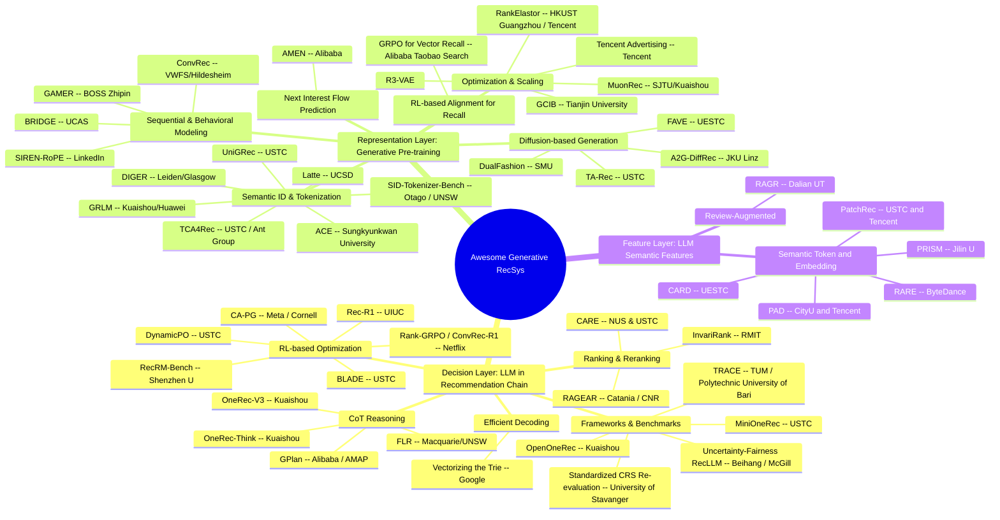

# Awesome Generative Recommendation System (RecSys)

## Quick Indexing

- [By Date](#by-date)
- [By Opensource](#by-opensource)
- [By Keyword](#by-keyword)
- [By Affiliation](#by-affiliation)

---
## By Date

### Papers May 31

> **Note:** Sunday, May 31, 2026 — arxiv does not announce papers on weekends. Following fallback procedure, 5 missed papers from January–May 2026 were found and added through multi-keyword arxiv search.

1. **UniNote: A Unified Embedding Model for Multimodal Representation and Ranking**
   * Affiliation: Xiaohongshu / SJTU / HUST / BIT — *(Jinghan Zhao, Wenwei Jin, Anqi Li, Jintao Tong, Luya Mo, Jiawei Li, Bin Li, Yao Hu)*
   * Link: [arxiv.org/abs/2605.29287](https://arxiv.org/abs/2605.29287)
   * Venue: KDD 2026 Ads Track, May 2026
   * TL;DR: Unified multimodal embedding for industrial I2I retrieval, using contrastive SFT + RL for ranking refinement, deployed at Xiaohongshu with Matryoshka Representation Learning.
   * Key techniques:
     - Two-stage training: contrastive SFT for base embeddings, RL for ranking alignment
     - Matryoshka Representation Learning (MRL) for cost-efficient serving
     - Multimodal content representation at varying granularities
   * Scores (Opensource? / Novelty / Fairness / Robustness / Impact):
     - **Opensource?: 0/10** — No public code available
     - **Novelty: 7/10** — Unified multimodal embedding with RL for I2I retrieval
     - **Fairness: 3/10** — Not addressed
     - **Robustness: 7/10** — Production-deployed at Xiaohongshu, tested at scale
     - **Impact: 8/10** — KDD 2026, large-scale industrial deployment

2. **TRACE: A Conversational Framework for Sustainable Tourism Recommendation with Agentic Counterfactual Explanations**
   * Affiliation: Technical University of Munich / Polytechnic University of Bari — *(Ashmi Banerjee, Adithi Satish, Wolfgang Wörndl, Yashar Deldjoo)*
   * Link: [arxiv.org/abs/2604.14223](https://arxiv.org/abs/2604.14223)
   * Venue: SIGIR 2026, April 2026
   * TL;DR: Multi-agent LLM framework for sustainable tourism recommendation using agentic counterfactual explanations and interactive nudging.
   * Key techniques:
     - Modular orchestrator-worker architecture with specialized agents
     - Agentic counterfactual explanations for greener alternatives
     - LLM-driven clarifying questions for intent refinement
     - Implemented on Google's Agent Development Kit
   * Scores (Opensource? / Novelty / Fairness / Robustness / Impact):
     - **Opensource?: 8/10** — Full code, Docker, prompts, and demo video available at [ashmibanerjee.github.io/trace-chatbot](https://ashmibanerjee.github.io/trace-chatbot)
     - **Novelty: 7/10** — Agentic counterfactual explanations for sustainable tourism
     - **Fairness: 8/10** — Core focus on sustainability and environmental impact
     - **Robustness: 6/10** — User studies and semantic alignment analyses
     - **Impact: 7/10** — SIGIR 2026

3. **TCA4Rec: Token-level Collaborative Alignment for LLM-based Generative Recommendation**
   * Affiliation: USTC / Ant Group / Rutgers University — *(Fake Lin, Binbin Hu, Zhi Zheng, Xi Zhu, Ziqi Liu, Zhiqiang Zhang, Jun Zhou, Tong Xu)*
   * Link: [arxiv.org/abs/2601.18457](https://arxiv.org/abs/2601.18457)
   * Venue: WWW 2026, January 2026
   * TL;DR: Model-agnostic framework bridging CF signals with LLM token-level NTP optimization via collaborative tokenizer and soft label alignment.
   * Key techniques:
     - Collaborative Tokenizer projects CF logits into LLM token distributions
     - Soft Label Alignment integrates CF-informed distributions with NTP objective
     - Compatible with arbitrary CF models and decoder-based LLM architectures
   * Scores (Opensource? / Novelty / Fairness / Robustness / Impact):
     - **Opensource?: 8/10** — Code available at [github.com/critical88/TCA4Rec](https://github.com/critical88/TCA4Rec)
     - **Novelty: 8/10** — First explicit optimization-level interface between CF and LLM generation
     - **Fairness: 4/10** — Not addressed
     - **Robustness: 7/10** — Extensive experiments across CF models and LLM architectures
     - **Impact: 8/10** — WWW 2026

4. **Gender and Race Bias in Consumer Product Recommendations by Large Language Models**
   * Affiliation: University of Victoria — *(Ke Xu, Shera Potka, Alex Thomo)*
   * Link: [arxiv.org/abs/2602.08124](https://arxiv.org/abs/2602.08124)
   * Venue: LNNS 2025, February 2026
   * TL;DR: First systematic examination of gender and race biases in LLM-generated product recommendations using three analytical methods.
   * Key techniques:
     - Prompt engineering for demographic-group-specific recommendations
     - Marked Words, SVM, and Jensen-Shannon Divergence for bias quantification
     - Multi-method analytical framework for bias detection
   * Scores (Opensource? / Novelty / Fairness / Robustness / Impact):
     - **Opensource?: 0/10** — No public code available
     - **Novelty: 7/10** — First systematic study of gender/race bias in LLM product recs
     - **Fairness: 9/10** — Core focus on identifying and quantifying demographic biases
     - **Robustness: 5/10** — Analytical study, limited empirical validation
     - **Impact: 5/10** — LNNS 2025

5. **Uncertainty and Fairness Awareness in LLM-Based Recommendation Systems**
   * Affiliation: Beihang University / McGill University — *(Chandan Kumar Sah, Xiaoli Lian, Li Zhang, Tony Xu, Syed Shazaib Shah)*
   * Link: [arxiv.org/abs/2602.02582](https://arxiv.org/abs/2602.02582)
   * Venue: IASEAI 2026, January 2026
   * TL;DR: Joint study of uncertainty and fairness in RecLLMs with benchmark dataset annotated for 8 demographic attributes across movies and music domains.
   * Key techniques:
     - Uncertainty quantification via predictive entropy
     - Personality-aware fairness evaluation pipeline
     - Prompt perturbation testing (typographical errors, multilingual inputs)
     - 8 demographic attributes, 31 categorical values annotated
   * Scores (Opensource? / Novelty / Fairness / Robustness / Impact):
     - **Opensource?: 7/10** — Code available at [github.com/Rocky5502/IASEAI-26-Gemini-Part](https://github.com/Rocky5502/IASEAI-26-Gemini-Part)
     - **Novelty: 7/10** — Joint uncertainty-fairness evaluation framework for RecLLMs
     - **Fairness: 9/10** — Core focus on fairness evaluation
     - **Robustness: 6/10** — Prompt perturbation testing for robustness
     - **Impact: 6/10** — IASEAI 2026

### Papers May 30

> **Note:** Saturday, May 30, 2026 — arxiv does not announce papers on weekends. Following fallback procedure, 4 missed papers from April 2-16, 2026 were found and added. Zhihu blog fallback was attempted but blocked by access restrictions.

1. **Federated User Behavior Modeling for Privacy-Preserving LLM Recommendation (SF-UBM)**
   * Affiliation: — *(Lei Guo — Shandong Normal University; Hongyun Yang, Pengjie Ren, Zhumin Chen — Shandong University; Tong Chen — The University of Queensland; Hui Liu — Shandong University of Finance and Economics)*
   * Link: [arxiv.org/abs/2604.14833](https://arxiv.org/abs/2604.14833)
   * Venue: arXiv preprint, April 16, 2026
   * TL;DR: SF-UBM enables privacy-preserving cross-domain LLM recommendation via federated semantic learning with fact-counter knowledge distillation
   * Key techniques:
     - Semantic-enhanced federated architecture with natural language as universal bridge across domains
     - Fact-counter Knowledge Distillation (FKD) integrating domain-agnostic text and domain-specific ID modalities
     - Token-Space Knowledge Injector projecting user/item representations into LLM soft prompt space
     - Two-layer privacy protection via Gaussian noise perturbation and similarity-based feature replacement
   * Scores (Opensource? / Novelty / Fairness / Robustness / Impact):
     - **Opensource?: 3/10** — GitHub: https://github.com/Nexus-Yang/SF-UBM_master; placeholder repo only, code will be released upon paper acceptance
     - **Novelty: 8/10** — Novel federated approach for privacy-preserving LLM cross-domain recommendation
     - **Fairness: 3/10** — Not explicitly addressed; focus is on privacy rather than recommendation fairness
     - **Robustness: 7/10** — Evaluated across three domain pairs (Health-Beauty, Food-Kitchen, Books-Movielens) with perturbation sensitivity analysis
     - **Impact: 7/10** — Addresses important privacy concerns in LLM-based cross-domain recommendation

2. **Filling the Gaps: Selective Knowledge Augmentation for LLM Recommenders (KnowSA_CKP)**
   * Affiliation: — *(Jaehyun Lee, Sanghwan Jang, Hwanjo Yu — POSTECH; SeongKu Kang — Korea University)*
   * Link: [arxiv.org/abs/2604.07825](https://arxiv.org/abs/2604.07825)
   * Venue: SIGIR 2026 (Full Paper)
   * TL;DR: KnowSA_CKP selectively injects external item knowledge only for items the LLM lacks information about, avoiding wasteful uniform augmentation
   * Key techniques:
     - Knowledge-aware Selective Augmentation with Comparative Knowledge Probing
     - Estimation of LLM internal knowledge via collaborative relationship evaluation
     - Selective injection only for items truly needing external information, preserving context budget
     - No fine-tuning required; works with frozen LLMs as training-free recommenders
   * Scores (Opensource? / Novelty / Fairness / Robustness / Impact):
     - **Opensource?: 1/10** — GitHub: https://github.com/nowhyun/KnowSA_CKP; placeholder repo only (license file, no code yet)
     - **Novelty: 7/10** — Novel selective knowledge augmentation addressing the knowledge gap problem in LLM recommenders
     - **Fairness: 4/10** — Not explicitly addressed
     - **Robustness: 7/10** — Consistent improvements across four real-world datasets
     - **Impact: 8/10** — SIGIR 2026 full paper; efficient context utilization for LLM-based recommendation

3. **FAVE: Flow-based Average Velocity Establishment for Sequential Recommendation**
   * Affiliation: — *(Ke Shi, Yao Zhang, Feng Guo, Jinyuan Zhang, JunShuo Zhang, Shen Gao, Shuo Shang — University of Electronic Science and Technology of China; State Key Laboratory of Internet Architecture)*
   * Link: [arxiv.org/abs/2604.04427](https://arxiv.org/abs/2604.04427)
   * Venue: SIGIR 2026
   * TL;DR: FAVE achieves one-step generative recommendation via flow-based average velocity estimation, with 20x+ inference speedup over multi-step generative baselines
   * Key techniques:
     - Two-stage training: basic manifold construction then single-step consolidation
     - Dual-end semantic alignment preventing representation collapse at both source and target ends
     - Semantic anchor prior replacing Gaussian noise initialization with masked user history embedding
     - Global average velocity field compressing multi-step ODE trajectories into single displacement vector
     - JVP-based flow consistency regularization for trajectory straightness
   * Scores (Opensource? / Novelty / Fairness / Robustness / Impact):
     - **Opensource?: 7/10** — GitHub: https://github.com/Blue130/Fave; complete code with pretrained checkpoints for 3 datasets, good documentation, 6 stars, 10 commits
     - **Novelty: 8/10** — Novel flow-based one-step generation framework for sequential recommendation
     - **Fairness: 4/10** — Not explicitly addressed
     - **Robustness: 8/10** — State-of-the-art on three datasets (ML-100k, Amazon Beauty, Steam) with 20x+ inference speedup
     - **Impact: 8/10** — SIGIR 2026; significant efficiency breakthrough for generative sequential recommendation

4. **Grounded Token Initialization for New Vocabulary in LMs for Generative Recommendation (GTI)**
   * Affiliation: — *(Daiwei Chen, Ramya Korlakai Vinayak — University of Wisconsin-Madison; Zhoutong Fu, Chengming Jiang, Ran Zhou, Tan Wang, Chunnan Yao, Guoyao Li, Yihan Cao, Ruijie Jiang, Fedor Borisyuk, Jianqiang Shen, Jingwei Wu — LinkedIn Corporation; Haichao Zhang — Northeastern University; Rui Cai — University of California, Davis)*
   * Link: [arxiv.org/abs/2604.02324](https://arxiv.org/abs/2604.02324)
   * Venue: arXiv preprint, April 2, 2026
   * TL;DR: GTI linguistically grounds new Semantic-ID tokens in pretrained embedding space before fine-tuning, preventing dimensional collapse and improving generative recommendation by +21.6% P@5
   * Key techniques:
     - Grounded Token Initialization Hypothesis: linguistically grounding new tokens preserves semantic distinctions through fine-tuning
     - Lightweight grounding stage training only new token embeddings with paired linguistic supervision (frozen LM backbone)
     - RQ-VAE for discretizing item embeddings into multi-level Semantic IDs
     - QLoRA for parameter-efficient fine-tuning on Qwen3-0.6B backbone
     - Sinkhorn-Knopp trick for uniform codebook distribution; spectral diagnostics for collapse measurement
   * Scores (Opensource? / Novelty / Fairness / Robustness / Impact):
     - **Opensource?: 0/10** — No public code available; industrial dataset from LinkedIn cannot be shared
     - **Novelty: 7/10** — Novel analysis of token initialization problem with simple yet effective linguistic grounding solution
     - **Fairness: 3/10** — Not explicitly addressed
     - **Robustness: 7/10** — +26% Recall@20 on public Vibrent dataset; strong spectral diagnostics confirming reduced dimensional collapse
     - **Impact: 7/10** — Practical token initialization method applicable to any LM-based generative recommendation system

---
### Papers May 26

> **Note:** 6 new generative recommendation papers found (from May 26, 2026). All papers are newly added to the repository.

1. **DeGRe: Dense-supervised Generative Reranking for Recommendation**
   * Affiliation: — *(Chaotian Song, Dehai Zhao, Boxi Wu, Deng Cai — Zhejiang University; Jingyao Zhang, Chenghao Chen, Zisen Sang, Guodong Cao, Jia Jia — Alibaba Group)*
   * Link: [arxiv.org/abs/2605.25749](https://arxiv.org/abs/2605.25749)
   * Venue: KDD 2026 (ADS Track)
   * TL;DR: Generative reranking with offline-online decoupled design: a Lookahead Evaluator mines high-value sequences via beam search, then distills step-wise dense supervision into a lightweight Online Generator for single-pass greedy decoding
   * Key techniques:
     - Lookahead Evaluator based on cumulative regression with beam search exploration
     - Offline-online decoupled design with step-wise value distillation
     - Dense supervision signals replacing sparse list-level rewards
     - Single-pass greedy decoding approximating global optimum at inference
   * Scores (Opensource? / Novelty / Fairness / Robustness / Impact):
     - **Opensource?: 0/10** — No public code found
     - **Novelty: 8/10** — Novel decoupled offline-online framework for generative reranking, addressing both heuristic label bias and credit assignment
     - **Fairness: 4/10** — Not explicitly addressed
     - **Robustness: 8/10** — Deployed on Taobao Flash Shopping; significant online improvements
     - **Impact: 9/10** — KDD 2026; Alibaba production deployment

2. **How Reliable Are Semantic-ID Tokenizer Comparisons in Generative Recommendation?**
   * Affiliation: — *(Qian Zhang, Lech Szymanski, Jeremiah D. Deng — University of Otago; Haibo Zhang — University of New South Wales)*
   * Link: [arxiv.org/abs/2605.25330](https://arxiv.org/abs/2605.25330)
   * Venue: arXiv preprint, May 2026
   * TL;DR: Reveals that SID tokenizer evaluations are unreliable due to collision groups (up to 30.5% of items), proposes collision-aware item-level metrics and a post-tokenizer collision-free reassignment procedure
   * Key techniques:
     - Collision analysis across 4 datasets and 5 representative tokenizers
     - Collision-aware item-level metrics computed from generated SID sequences
     - Post-tokenizer procedure for collision-free SID assignment at minimum cost
     - Demonstration that SID-level metrics inflate Hit@10 by up to 103.36%
   * Scores (Opensource? / Novelty / Fairness / Robustness / Impact):
     - **Opensource?: 8/10** — Code will be made publicly available; uses open baselines (LETTER, OpenOneRec, MQL4GRec)
     - **Novelty: 9/10** — Important foundational work questioning existing evaluation methodology in generative recommendation
     - **Fairness: 7/10** — Addresses fairness in evaluation methodology; collision-aware metrics enable fairer comparisons
     - **Robustness: 8/10** — Systematic evaluation across multiple datasets, tokenizers, and metrics
     - **Impact: 8/10** — Could change how the field evaluates SID tokenizers; critical for reliable benchmarking

3. **From Item-Only to Query-Item: Query-Conditioned Generative Search with QGS in Quark**
   * Affiliation: — *(Yanglong Song, Zihao Yang — Alibaba Group / University of Science and Technology of China; Shuo Meng, Rujun Guo, Jin Zhang, Bin Wang, Shaoyu Liu, Xiaozhao Wang, Guanjun Jiang — Alibaba Group)*
   * Link: [arxiv.org/abs/2605.25514](https://arxiv.org/abs/2605.25514)
   * Venue: arXiv preprint, May 2026
   * TL;DR: Query-conditioned generative search replacing noisy marginal next-item prediction with clean conditional P(item|context, query), using linear HSTU encoder and heterogeneous feature group attention, deployed in Quark Search
   * Key techniques:
     - Query-conditioned next-item objective removing semantic discontinuity from query switches
     - Linear HSTU encoder replacing quadratic attention with O(L) causal linear recurrence
     - HFG-Attention bridging sparse engineered features with dense sequential representations
     - Production deployment with +0.62% CTR, +3.55% PV Duration
   * Scores (Opensource? / Novelty / Fairness / Robustness / Impact):
     - **Opensource?: 0/10** — No public code found
     - **Novelty: 8/10** — Novel query-conditioned paradigm for generative search, clean formulation
     - **Fairness: 4/10** — Not explicitly addressed
     - **Robustness: 8/10** — Production A/B tests in major commercial search engine
     - **Impact: 8/10** — Production deployment in Quark Search; practical insights for generative search

4. **Memento: Personalized RAG-Style Long-Retention Data Scaling for META Ads Recommendation**
   * Affiliation: — *(Xiaoyu Chen et al. — Meta AI)*
   * Link: [arxiv.org/abs/2605.24051](https://arxiv.org/abs/2605.24051)
   * Venue: arXiv preprint, May 2026
   * TL;DR: RAG-style personalized retrieval framework treating user history as document corpus, using MMR retrieval for long-retention data scaling at Meta, delivering 1% CTR lift on Facebook Feed and Reels
   * Key techniques:
     - Maximal Marginal Relevance (MMR) retrieval balancing similarity and diversity
     - Representation Memento (historical embeddings for feature augmentation) and Data Memento (past examples for multipass training)
     - Infrastructure co-design: temporal chunking, INT8 quantization, asynchronous serving
     - 5-10× resource efficiency over linear scaling; processes daily requests with sub-10ms latency
   * Scores (Opensource? / Novelty / Fairness / Robustness / Impact):
     - **Opensource?: 0/10** — No public code found
     - **Novelty: 7/10** — Novel application of RAG concepts to recommendation; infrastructure co-design is practical
     - **Fairness: 5/10** — Not explicitly addressed beyond standard metrics
     - **Robustness: 9/10** — 1% CTR lift on Facebook Feed/Reels, 1.2% CVR lift; 365+ day history
     - **Impact: 9/10** — Meta production deployment at massive scale; practical long-history scaling blueprint

5. **SIREN: Unified Multi-Granularity Semantic Interaction for Multi-Modal Lifelong User Interest Modeling**
   * Affiliation: — *(Yaqian Zhang et al. — Tencent)*
   * Link: [arxiv.org/abs/2605.25726](https://arxiv.org/abs/2605.25726)
   * Venue: arXiv preprint, May 2026
   * TL;DR: Multi-modal lifelong user interest modeling with Semantic-ID based retrieval and prefix-encoded SemIDs for exact search, deployed on Tencent WeChat advertising with +2.28-3.87% GMV gains
   * Key techniques:
     - Multi-modal similarity-based soft retrieval for effectiveness
     - Semantic ID (SemID)-based hard retrieval for efficient industrial serving
     - Coarse similarity buckets and fine-grained prefix-encoded SemIDs
     - Target-conditioned transformer with unified multi-granularity semantic interaction
   * Scores (Opensource? / Novelty / Fairness / Robustness / Impact):
     - **Opensource?: 0/10** — No public code found
     - **Novelty: 7/10** — Good integration of multi-modal and SID-based retrieval for lifelong modeling
     - **Fairness: 4/10** — Not explicitly addressed
     - **Robustness: 9/10** — Full traffic on WeChat advertising (Moments, Official Accounts, Channels); consistent GMV gains
     - **Impact: 9/10** — Tencent production deployment; multi-modal lifelong modeling at industrial scale

6. **GCIB: Graph Contrastive Information Bottleneck for Multi-Behavior Recommendation**
   * Affiliation: — *(Likang Wu — Tianjin University; Zihao Chen, Jianxin Zhang, Sangqi Zhu, Yuanyuan Ge, Haipeng Yang, Lei Zhang)*
   * Link: [arxiv.org/abs/2605.25690](https://arxiv.org/abs/2605.25690)
   * Venue: ICML 2026
   * TL;DR: Denoises auxiliary behavior graphs via Graph Information Bottleneck and enriches target behavior via cross-behavior Graph Contrastive Learning, achieving SOTA multi-behavior recommendation
   * Key techniques:
     - Graph Information Bottleneck (GIB) maximizing MI with target graph while minimizing MI with auxiliary graph
     - Cross-behavior Graph Contrastive Learning (GCL) with denoised auxiliary features as complementary views
     - Structural-level denoising (GIB) and feature-level enrichment (GCL)
     - Co-first author design with comprehensive multi-behavior experiments
   * Scores (Opensource? / Novelty / Fairness / Robustness / Impact):
     - **Opensource?: 8/10** — [github.com/akajinchen/GCIB](https://github.com/akajinchen/GCIB) — Code available, good documentation
     - **Novelty: 7/10** — Novel integration of GIB with multi-behavior recommendation
     - **Fairness: 5/10** — Not explicitly addressed beyond standard multi-behavior metrics
     - **Robustness: 7/10** — Extensive experiments on multiple baselines and datasets
     - **Impact: 8/10** — ICML 2026; strong theoretical foundation with practical implications

### Papers May 29

> **Note:** 5 new generative / LLM-based recommendation papers found (from May 29, 2026). All papers are newly added to the repository.

1. **GPlan: Generative Spatiotemporal Intent Sequence Recommendation via Implicit Reasoning in Amap**
   * Affiliation: — *(Sicong Wang, Ruiting Dong, Yue Liu, Bowen Zheng, Jun Meng, Jie Li, Shuaijun Guo, Yu Gu, Fanyi Di, Xin Li — AMAP, Alibaba Group)*
   * Link: [arxiv.org/abs/2605.28888](https://arxiv.org/abs/2605.28888)
   * Venue: arXiv preprint, May 2026
   * TL;DR: Distills LLM spatiotemporal reasoning into lightweight generative models via Progressive Implicit CoT Distillation and Spatiotemporal Counterfactual DPO, deployed in Amap for intent sequence recommendation
   * Key techniques:
     - Progressive Implicit CoT Distillation compressing explicit reasoning into reserved latent tokens for small models
     - Spatiotemporal Counterfactual DPO aligning model with counterfactual context-plan pairs to reduce mismatches
     - Internalized LLM reasoning under strict latency constraints for industrial deployment
     - Anonymized GSISR dataset and implementation at github.com/alibaba/GPlan
   * Scores (Opensource? / Novelty / Fairness / Robustness / Impact):
     - **Opensource?: 8/10** — [github.com/alibaba/GPlan](https://github.com/alibaba/GPlan) — Code and anonymized dataset publicly available
     - **Novelty: 8/10** — Novel distillation of LLM reasoning into lightweight generative models with spatiotemporal constraints
     - **Fairness: 3/10** — Not explicitly addressed
     - **Robustness: 7/10** — Online A/B testing at Amap production scale; offline experiments with strong results
     - **Impact: 8/10** — Alibaba production deployment in Amap; practical blueprint for LLM-to-small-model reasoning distillation

2. **ACE: Anisotropy-Controllable Embedding for LLM-enhanced Sequential Recommendation**
   * Affiliation: — *(Dongcheol Lee, Hye-young Kim, Jongwuk Lee — Sungkyunkwan University)*
   * Link: [arxiv.org/abs/2605.29322](https://arxiv.org/abs/2605.29322)
   * Venue: SIGIR 2026 (Short Paper)
   * TL;DR: Controls anisotropy of LLM-generated embeddings via linear autoencoder with L2-regularization, preserving semantic structure while enabling better collaborative signal adaptation, achieving up to 12.4% Recall@20 improvement
   * Key techniques:
     - Linear Autoencoder (LAE) reshaping embedding distribution while preserving semantic structure
     - L2-regularization controlling dispersion of embedding dimensions to mitigate anisotropy
     - Reconstruction loss maintaining semantic relationships among items during transformation
     - Plug-and-play design compatible with existing LLM-enhanced sequential recommendation backbones
   * Scores (Opensource? / Novelty / Fairness / Robustness / Impact):
     - **Opensource?: 8/10** — [github.com/DCheol/ACE](https://github.com/DCheol/ACE) — Official code for SIGIR 2026 short paper
     - **Novelty: 7/10** — Addresses a well-known anisotropy problem in LLM embeddings for recommendation with a simple, effective solution
     - **Fairness: 3/10** — Not explicitly addressed
     - **Robustness: 7/10** — Extensive experiments across multiple datasets; 11.8% NDCG@20 improvement
     - **Impact: 8/10** — SIGIR 2026; addresses fundamental geometric challenge in LLM-enhanced sequential recommendation

3. **Toward User Preference Alignment in LLM Recommendation via Explicit Context Feedback**
   * Affiliation: — *(Weizhi Zhang, Wooseong Yang, Liangwei Yang, Henry Peng Zou, Philip S. Yu — University of Illinois at Chicago; Yuxin Cui, Zhaohui Guo, Hins Hu, Qifei Wang, Hanqing Zeng, Jiayi Liu, Yinglong Xia — Meta AI)*
   * Link: [arxiv.org/abs/2605.29141](https://arxiv.org/abs/2605.29141)
   * Venue: CogMI 2025
   * TL;DR: Position paper advocating for explicit context feedback (comments, reviews) as primary signals for LLM-based recommendation, reviewing paradigm evolution and proposing frameworks for integrating user-generated text into scalable recsys
   * Key techniques:
     - Taxonomy of explicit context feedback types (comments, reviews, verbal text) for user preference modeling
     - Frameworks for integrating heterogeneous user-generated signals into LLM-driven recsys pipelines
     - Call for new benchmarks and metrics centered on preference alignment rather than implicit signals alone
     - Analysis of how neglecting explicit feedback reinforces filter bubbles
   * Scores (Opensource? / Novelty / Fairness / Robustness / Impact):
     - **Opensource?: 0/10** — No public code found (position/survey paper)
     - **Novelty: 6/10** — Position paper advocating a paradigm shift; not technically novel but compelling argument
     - **Fairness: 8/10** — Core thesis addresses fairness through explicit user preference understanding and filter bubble mitigation
     - **Robustness: 4/10** — Position paper without empirical validation
     - **Impact: 6/10** — Thought-provoking direction for next-gen LLM recsys; from UIC and Meta

4. **Rec-Distill: An Industrial Distillation Pipeline for Large-Scale Recommendation Models**
   * Affiliation: — *(Haoran Ding, Wenlin Zhao, Yuchen Jiang, Juren Li, Jie Zhu, Xinchun Li, Yishujie Zhao, Yi Zhang, Ao Qiao, Jianhui Dong, Cheng Chen, Ziyan Gong, Deping Xie, Peng Xu, Zikai Wang, Yuwei Wang, Huizhi Yang, Zhe Chen, Yuchao Zheng — ByteDance)*
   * Link: [arxiv.org/abs/2605.29755](https://arxiv.org/abs/2605.29755)
   * Venue: arXiv preprint, May 2026
   * TL;DR: Industrial KD pipeline distilling 24B-parameter teacher models into lightweight serving models with decoupled training, black-box distillation, and hybrid batch-streaming, achieving >60% transferability at ByteDance scale
   * Key techniques:
     - Large-teacher scaling to 24B dense parameters and 20K behavior sequence length
     - Decoupled training allowing teacher and student to evolve independently
     - Black-box distillation with debiasing mechanism for stable knowledge transfer
     - Hybrid batch-streaming pipeline for dynamic recommendation environments
     - >60% distillation transferability in best setting; measurable business improvements
   * Scores (Opensource? / Novelty / Fairness / Robustness / Impact):
     - **Opensource?: 0/10** — No public code found
     - **Novelty: 7/10** — Comprehensive industrial distillation framework addressing practical deployment gap
     - **Fairness: 3/10** — Not explicitly addressed
     - **Robustness: 8/10** — Extensive offline and online experiments across multiple recommendation and advertising scenarios
     - **Impact: 8/10** — ByteDance production deployment; addresses fundamental gap between model scaling and serving efficiency

5. **LoopFM: Learning frOm HistOrical RePresentations of Foundation Model for Recommendation**
   * Affiliation: — *(Shali Jiang, Hua Zheng, Boyang Liu, Laming Chen, Kenny Lov, Chuanqi Xu, Lisang Ding, Qinghai Zhou, Can Cui, Xiaolong Liu, Xiaoyi Liu, Yasmine Badr, Xin Xu, Jiyan Yang, Ellie Dingqiao Wen, Gerard Jonathan Mugisha Akkerhuis, Chenxiao Guan, Rong Jin, Ruichao Qiu, Xian Chen, Shifu Xu, Zhehui Zhou, Ping Chen, Rui Yang, Haicheng Chen, Xiangge Meng, Song Zhou, Dharak Kharod, Shuyu Xu, Qiang Jin, Qiao Yang, Wankun Zhu, Qin Huang, Yuzhen Huang, Darren Liu, Parish Aggarwal, Hui Zhou, Erzhuo Wang, Shuo Chang, Xiaorui Gan, Wenlin Chen, Santanu Kolay, Huayu Li — Meta)*
   * Link: [arxiv.org/abs/2605.29280](https://arxiv.org/abs/2605.29280)
   * Venue: arXiv preprint, May 2026
   * TL;DR: Opens high-bandwidth transfer channel by structuring FM intermediate embeddings as input features for downstream VMs, approximately doubling KD transfer ratio and delivering +0.5-1.22% conversion lift at Meta production scale
   * Key techniques:
     - FM intermediate embeddings structured as user history sequence features for downstream VMs
     - No real-time FM inference at serving; no architectural coupling between FM and VM
     - Theoretical gain decomposition and transfer-ratio analysis framework
     - Complementary to standard KD; ~2x transfer ratio improvement on industrial-scale systems
     - +0.5% conversion improvement in Y1H1; +1.03% and +1.22% in two Y1H2 launches
   * Scores (Opensource? / Novelty / Fairness / Robustness / Impact):
     - **Opensource?: 0/10** — No public code found
     - **Novelty: 8/10** — Novel high-bandwidth representation-level transfer between FM and VM, complementary to scalar KD
     - **Fairness: 3/10** — Not explicitly addressed
     - **Robustness: 9/10** — Production validation at Meta scale (billions of examples, trillion-parameter FMs); multiple launches
     - **Impact: 9/10** — Meta production deployment; opens new paradigm for FM-to-VM knowledge transfer in recommendation

### Papers May 28

> **Note:** 5 new generative / LLM-based recommendation papers found (from May 28, 2026). All papers are newly added to the repository.

1. **MixRAGRec: Mixture-of-Experts Knowledge Graph Retrieval-Augmented Generation for Multi-Agent LLM-based Recommendation**
   * Affiliation: — *(Shijie Wang, Chengyi Liu, Yujuan Ding, Xu Xin, Wenqi Fan — The Hong Kong Polytechnic University; Shanru Lin — City University of Hong Kong; See-Kiong Ng — National University of Singapore)*
   * Link: [arxiv.org/abs/2605.28175](https://arxiv.org/abs/2605.28175)
   * Venue: KDD 2026 Research Track
   * TL;DR: Multi-agent KG-RAG framework with MoE retrieval routing, knowledge-preference alignment, and contrastive recommendation agent, trained via MMAPO unified policy optimization
   * Key techniques:
     - Mixture-of-Experts Retrieval Agent routing queries to KG retrieval experts at different granularities
     - Knowledge Preference Alignment Agent converting structured KG data into LLM-friendly text
     - Contrastive Learning-reinforced Recommendation Agent with preference feedback
     - MMAPO: MoE Multi-Agent Policy Optimization training three agents under unified objective
   * Scores (Opensource? / Novelty / Fairness / Robustness / Impact):
     - **Opensource?: 0/10** — No public code found
     - **Novelty: 8/10** — Novel integration of MoE KG-RAG with multi-agent LLM recommendation framework
     - **Fairness: 3/10** — Not explicitly addressed
     - **Robustness: 7/10** — Extensive experiments on real-world datasets
     - **Impact: 8/10** — KDD 2026; addresses key challenges in grounding LLM recsys with structured knowledge

2. **LRanker: LLM Ranker for Massive Candidates**
   * Affiliation: — *(Tao Feng, Zijie Lei, Zhigang Hua, Yan Xie, Shuang Yang, Ge Liu, Jiaxuan You — UIUC)*
   * Link: [arxiv.org/abs/2605.27810](https://arxiv.org/abs/2605.27810)
   * Venue: arXiv preprint, May 2026
   * TL;DR: Scalable LLM ranking framework with K-means candidate aggregation encoding and graph-based test-time scaling, achieving 20-30% improvements with 6.8M candidates
   * Key techniques:
     - Candidate aggregation encoder using K-means clustering to model global candidate information
     - Graph-based test-time scaling with candidate partitioning and ensemble of query embeddings
     - Multi-embedding aggregation for robustness beyond single representation
     - Evaluated on RBench across 3 scenarios up to 6.8M candidates
   * Scores (Opensource? / Novelty / Fairness / Robustness / Impact):
     - **Opensource?: 0/10** — No public code found; related R1-Ranker available at github.com/ulab-uiuc/R1-Ranker
     - **Novelty: 8/10** — Novel K-means encoder + graph-based test-time scaling for massive-scale LLM ranking
     - **Fairness: 2/10** — Not explicitly addressed
     - **Robustness: 7/10** — Tested on 7 tasks across 3 scenarios, up to 6.8M candidates
     - **Impact: 7/10** — Addresses critical scalability bottleneck for industrial LLM ranking

3. **Ocean4Rec: Offline LLM-Derived OCEAN Profiles for Request-Time VOD Reranking**
   * Affiliation: — *(Wonkyun Kim, Sehyun Bae, Kwanki Ahn, Mungyu Bae, Saeun Choi, Soyeon You, Chandra Prabhakar, Sehyun Kim — Samsung Electronics)*
   * Link: [arxiv.org/abs/2605.27429](https://arxiv.org/abs/2605.27429)
   * Venue: arXiv preprint, May 2026
   * TL;DR: Uses LLM offline-only to materialize OCEAN personality profiles for VOD content, enabling lightweight numeric reranking at request time without LLM calls; +7.6-61.5% NDCG@20 on Samsung Smart TV logs
   * Key techniques:
     - LLM generates OCEAN profiles (Openness, Conscientiousness, Extraversion, Agreeableness, Neuroticism) offline from content metadata
     - User profiles built by time-decayed aggregation of clicked/deep-linked item profiles
     - Request-time numeric reranking joins precomputed profiles without LLM invocation
     - Deployable serving path eliminating LLM latency, throughput, and cost concerns
   * Scores (Opensource? / Novelty / Fairness / Robustness / Impact):
     - **Opensource?: 0/10** — No public code found
     - **Novelty: 7/10** — Novel application of OCEAN personality framework to VOD recommendation; offline-only LLM design is practical
     - **Fairness: 3/10** — Not explicitly addressed
     - **Robustness: 6/10** — Offline evaluation on Samsung Smart TV VOD logs; NDCG@20 gains vary by generator
     - **Impact: 6/10** — Industry application at Samsung; practical latency-free LLM approach for production

4. **Fine-Tuned LLM as a Complementary Predictor Improving Ads System**
   * Affiliation: — *(Hui Yang, Daiwei He, Kevin Jiang, Taejin Park, Kungang Li, Jiajun Luo, Yuying Chen, Xinyi Zhang, Sihan Wang, Haoyu He, Yu Liu, Lakshmi Manoharan, David Xue, Shubham Barhate, Runze Su, Duna Zhan, Ling Leng, Siping Ji, Jinfeng Zhuang, Alice Wu, Leo Lu, Han Sun, Zhifang Liu — Pinterest, Inc.)*
   * Link: [arxiv.org/abs/2605.27856](https://arxiv.org/abs/2605.27856)
   * Venue: arXiv preprint, May 2026
   * TL;DR: Uses fine-tuned lightweight LLM as complementary predictor alongside existing ML models in Pinterest's production ads system, improving overall system performance
   * Key techniques:
     - Fine-tuned LLM serving as complementary signal to traditional ML ranking models
     - Ensemble approach combining LLM predictions with existing production models
     - Production deployment at Pinterest scale
     - Practical balance of LLM capability with serving efficiency
   * Scores (Opensource? / Novelty / Fairness / Robustness / Impact):
     - **Opensource?: 0/10** — No public code found
     - **Novelty: 6/10** — Practical engineering approach for integrating LLMs into production ads systems
     - **Fairness: 2/10** — Not explicitly addressed
     - **Robustness: 7/10** — Production deployment at Pinterest scale
     - **Impact: 7/10** — Industry application; blueprint for LLM integration in production ads ranking

5. **Looking Farther with Confidence: Uncertainty-Guided Future Learning for Sequential Recommendation (UFRec)**
   * Affiliation: — *(Ziqiang Cui, Xiaokun Zhang, Chen Ma — City University of Hong Kong; Xing Tang, Xiuqiang He — Shenzhen Technology University; Peiyang Liu — Peking University; Shiwei Li — Huazhong University of Science and Technology)*
   * Link: [arxiv.org/abs/2605.28493](https://arxiv.org/abs/2605.28493)
   * Venue: arXiv preprint, May 2026
   * TL;DR: Adaptive future learning for sequential rec that modulates multi-step future supervision based on model confidence, plus future-aware contrastive learning — both training-only, zero inference overhead
   * Key techniques:
     - Uncertainty-Guided Future Supervision dynamically weighting multi-step future signals by prediction confidence
     - Future-Aware Contrastive Learning treating future trajectory holistically
     - Both auxiliary modules used only during training with zero inference cost
     - Outperforms SOTA on 4 benchmark datasets
   * Scores (Opensource? / Novelty / Fairness / Robustness / Impact):
     - **Opensource?: 0/10** — No public code found
     - **Novelty: 7/10** — Novel uncertainty-guided adaptive future supervision for sequential recommendation
     - **Fairness: 2/10** — Not explicitly addressed
     - **Robustness: 7/10** — Extensive experiments on 4 benchmark datasets
     - **Impact: 6/10** — Practical improvement to sequential rec with zero inference overhead

### Papers May 25

> **Note:** 5 new generative recommendation papers found (from May 25, 2026). All papers are newly added to the repository.

1. **Towards Generalizable and Efficient Large-Scale Generative Recommenders**
   * Affiliation: — *(Qiuling Xu, Ko-Jen Hsiao, Moumita Bhattacharya — Netflix Research)*
   * Link: [arxiv.org/abs/2605.23312](https://arxiv.org/abs/2605.23312)
   * Venue: arXiv preprint, May 2026
   * TL;DR: Scaling a generative recommender from 2M to 1B parameters in production, addressing task headroom, training efficiency, serving latency, and item freshness
   * Key techniques:
     - Offset scaling-law fits as diagnostic for task transfer
     - Multi-token prediction for serving-latency alignment
     - Sampled softmax and projected decoding head for efficient training
     - Semantic item towers with collaborative-embedding masking for cold-start
   * Scores (Opensource? / Novelty / Fairness / Robustness / Impact):
     - **Opensource?: 0/10** — No public code found
     - **Novelty: 7/10** — Valuable industrial experience on scaling generative recommenders, not fundamentally novel but important practical insights
     - **Fairness: 5/10** — Not explicitly addressed
     - **Robustness: 8/10** — Production-shadow evaluation over 1M users; 1B model achieves higher MRR than 2M baseline
     - **Impact: 9/10** — From Netflix Research; important production-scale insights for generative recommenders

2. **From Head to Tail: Asymmetric Knowledge Transfer in Long-tail Recommendation with Generative Semantic IDs**
   * Affiliation: — *(Chenyi Yan, Ruocong Tang, Xing Fang, Yang Huang, Jing Wang — Alibaba Group; He Guo — Beijing University)*
   * Link: [arxiv.org/abs/2605.23310](https://arxiv.org/abs/2605.23310)
   * Venue: arXiv preprint, May 2026
   * TL;DR: AKT-Rec uses LLM-generated semantic IDs with asymmetric knowledge transfer for long-tail recommendation in e-commerce
   * Key techniques:
     - Multimodal LLMs with supervised fine-tuning for content-collaborative alignment
     - Residual-Quantized VAE (RQ-VAE) for semantic ID discretrization
     - Cluster-Guided Adaptive Embedding with asymmetric contrastive objective
     - Hierarchical Feature Aggregation with parallel feature views
   * Scores (Opensource? / Novelty / Fairness / Robustness / Impact):
     - **Opensource?: 0/10** — No public code found
     - **Novelty: 8/10** — Novel asymmetric knowledge transfer mechanism for long-tail recommendation with generative semantic IDs
     - **Fairness: 6/10** — Addresses long-tail item recommendation, which is related to fairness
     - **Robustness: 8/10** — Extensive experiments on large-scale industrial dataset; online A/B testing on Alibaba Tmall
     - **Impact: 9/10** — From Alibaba Tmall; +2.76% CTR and +3.47% GMV in online A/B testing

3. **Expand More, Shrink Less: Shaping Effective-Rank Dynamics for Dense Scaling in Recommendation**
   * Affiliation: — *(Guoming Li, Menglin Yang — The Hong Kong University of Science and Technology Guangzhou; Shangyu Zhang, Junwei Pan, Wentao Ning, Jin Chen, Gengsheng Xue, Chao Zhou, Shudong Huang, Haijie Gu — Tencent Inc.)*
   * Link: [arxiv.org/abs/2605.23191](https://arxiv.org/abs/2605.23191)
   * Venue: Accepted by KDD 2026
   * TL;DR: RankElastor addresses embedding collapse in RankMixer with parameterized full mixing and GLU-improved P-FFNs
   * Key techniques:
     - Theoretical analysis of embedding collapse via effective-rank dynamics
     - Parameterized full mixing for expressive token mixing with spectral robustness
     - GLU-improved P-FFNs for stabilizing representation spectra
     - Provable collapse mitigation
   * Scores (Opensource? / Novelty / Fairness / Robustness / Impact):
     - **Opensource?: 8/10** — GitHub: https://github.com/vasile-paskardlgm/RankElastor; complete codebase with documentation
     - **Novelty: 8/10** — Novel architecture addressing embedding collapse in dense recommendation models
     - **Fairness: 5/10** — Not explicitly addressed
     - **Robustness: 9/10** — Theoretical analysis + extensive experiments on large-scale industrial datasets
     - **Impact: 9/10** — Accepted at KDD 2026; code available for reproducibility

4. **Building a privacy-preserving Federated Recommender system for mobile devices**
   * Affiliation: — *(Aasheesh Singh — Université de Montréal, MILA, Lerna AI)*
   * Link: [arxiv.org/abs/2605.22924](https://arxiv.org/abs/2605.22924)
   * Venue: M.Sc. thesis, May 2026
   * TL;DR: Two-stage federated recommendation pipeline for mobile devices with privacy-preserving on-device re-ranking
   * Key techniques:
     - Two-stage pipeline: cloud collaborative filtering → on-device re-ranking
     - Non-sensitive user preference data vs. sensitive mobile context data separation
     - Only model updates/gradients leave the device
     - Kotlin Multiplatform library for Android and iOS deployment
   * Scores (Opensource? / Novelty / Fairness / Robustness / Impact):
     - **Opensource?: 0/10** — Implementation is Kotlin Multiplatform library, not publicly available
     - **Novelty: 7/10** — Novel two-stage federated recommendation pipeline for mobile devices
     - **Fairness: 8/10** — Privacy-preserving design; user data never leaves device
     - **Robustness: 7/10** — Validated on MovieLens, UCI HAR, and proprietary pilot dataset
     - **Impact: 7/10** — M.Sc. thesis; practical production-ready implementation

5. **TubiFM: Unified Item, Carousel, and Search Ranking for Streaming Discovery**
   * Affiliation: — *(Alexandre Salle, Chenglei Niu, Suchismit Mahapatra, Xiaoxiao Chen, Suvash Sedhain, Shervin Shahryari, Saurabh Agrawal, Qiang Chen, Michael Tamir — Tubi San Francisco; Yaqi Wang — Tubi Beijing)*
   * Link: [arxiv.org/abs/2605.23702](https://arxiv.org/abs/2605.23702)
   * Venue: arXiv preprint, May 2026
   * TL;DR: TubiFM uses user stories (serialized cross-surface history) and a Llama 3.2 1B model to unify item, carousel, and search ranking
   * Key techniques:
     - User stories: serialized representation of cross-surface history (attributes, sessions, watch events, search events)
     - Interleaving pretrained language tokens with domain-specific event tokens
     - Prompted next-token prediction over shared grammar for multiple tasks
     - Llama 3.2 1B-based model trained on user stories
   * Scores (Opensource? / Novelty / Fairness / Robustness / Impact):
     - **Opensource?: 0/10** — No public code found
     - **Novelty: 8/10** — Novel unified user stories approach for cross-surface ranking tasks
     - **Fairness: 5/10** — Not explicitly addressed
     - **Robustness: 9/10** — Online A/B tests show +3.9% search TVT, +0.30% carousel TVT; p99 latency reduced from 500ms to 200ms
     - **Impact: 8/10** — From Tubi (Fox Corporation streaming service); deployed in production with significant improvements

---

### Papers May 27

> **Note:** 5 new generative recommendation papers found (from May 27, 2026). All papers are newly added to the repository.

1. **L2Rec: Towards Dual-View Understanding of LLMs for Personalized Recommendation**
   * Affiliation: — *(Pingjun Pan, Tingting Zhou, Peiyao Lu, Tingting Fei, Hongxiang Chen, Chuanjiang Luo — Netease Cloud Music, Hangzhou, China)*
   * Link: [arxiv.org/abs/2605.26717](https://arxiv.org/abs/2605.26717)
   * Venue: SIGIR 2026
   * TL;DR: Parameter-level dual-view adaptation for LLM-based recommendation via Dual-view Personalized MoE — a frozen LLM backbone receives complementary behavioral and semantic adaptation pathways through LoRA-based experts with user-aware routing, deployed on Netease Cloud Music
   * Key techniques:
     - Dual-View Personalized Mixture-of-Experts (DPMoE) with shared + view-specific experts (DeepSeekMoE paradigm)
     - Parameter-level adaptation via LoRA (rank=8), only 32M parameters updated (~5% of backbone)
     - Three-signal personalized router (context, user, interaction) with Top-2 expert sparsification
     - Adaptive Cross-View Fusion (ACF) with dynamic gating for unified preference
     - Bidirectional Preference Contrastive (BPC) loss for cross-view consistency
   * Scores (Opensource? / Novelty / Fairness / Robustness / Impact):
     - **Opensource?: 0/10** — No public code available
     - **Novelty: 7/10** — Novel parameter-level dual-view adaptation paradigm as alternative to input/output fusion
     - **Fairness: 4/10** — Not explicitly addressed
     - **Robustness: 8/10** — Online A/B test on 1.5M DAU: +9.24% CTR, +3.15% reply rate (p<0.01)
     - **Impact: 9/10** — SIGIR 2026; Netease Cloud Music production deployment

2. **MuChator: Enabling Active Music Discovery via Conversational Music LLMs in Douyin Music**
   * Affiliation: — *(Jiahao Liang, Linzhi Huang, Xuannan Liu, Xukai Wang, Xuanpu Luo, Yongchun Zhu, Jingwu Chen, Feng Zhang, Xiao Yang — ByteDance, Beijing, China)*
   * Link: [arxiv.org/abs/2605.27103](https://arxiv.org/abs/2605.27103)
   * Venue: arXiv preprint, May 2026
   * TL;DR: Conversational Music LLM deployed on ByteDance Douyin Music enabling active natural-language music discovery, with three-stage music knowledge pre-training, context-aware instruction tuning, and GRPO-based preference alignment achieving +46.49% user active days
   * Key techniques:
     - Three-stage music knowledge pre-training (objective music knowledge → subjective music knowledge → personalized preferences)
     - Automated synthesis pipeline for high-quality user-query-music triplets
     - Hybrid Reward Model jointly modeling intent relevance, personalized preferences, and basic constraints
     - GRPO-based reinforcement learning for preference alignment
     - Deployed at ByteDance Douyin Music serving millions of daily users
   * Scores (Opensource? / Novelty / Fairness / Robustness / Impact):
     - **Opensource?: 0/10** — No public code available
     - **Novelty: 8/10** — First conversational Music LLM for active music discovery; three-stage domain knowledge injection
     - **Fairness: 3/10** — Not explicitly addressed
     - **Robustness: 9/10** — Production A/B test: +46.49% user active days; outperforms Gemini-3-Pro
     - **Impact: 9/10** — ByteDance production; novel MusicLLM paradigm for active discovery

3. **RAGEAR: Retrieval-Augmented Graph-Enhanced Academic Recommender**
   * Affiliation: — *(Francesco Granata, Lorenzo Lamazzi, Misael Mongiovi, Francesco Poggi, Valeria Secchini — University of Catania, Italy; CNR, Italy)*
   * Link: [arxiv.org/abs/2605.26819](https://arxiv.org/abs/2605.26819)
   * Venue: arXiv preprint, May 2026
   * TL;DR: Neurosymbolic course recommendation combining dense retrieval over full lecture transcripts with symbolic Knowledge Graph filtering, using a graph-aware aggregation function for course-level ranking
   * Key techniques:
     - Dense retrieval (multilingual-e5-large) over full lecture transcripts at chunk level
     - Symbolic Knowledge Graph modeling courses, credits, study plans, prerequisites
     - Graph-aware aggregation: Global Evidence × Ranked Evidence × Lesson Coverage
     - LLM-based evaluation (GPT-4.1 nano) + human evaluation on 152 student queries
     - Full code available on GitHub
   * Scores (Opensource? / Novelty / Fairness / Robustness / Impact):
     - **Opensource?: 8/10** — Full implementation released: [github.com/fpoggi/RAGEAR](https://github.com/fpoggi/RAGEAR)
     - **Novelty: 7/10** — Novel neurosymbolic approach combining chunk-level dense retrieval with KG reasoning
     - **Fairness: 5/10** — Graph-aware aggregation considers curriculum constraints for academic fairness
     - **Robustness: 6/10** — Validated on 152 student queries with human + LLM evaluation
     - **Impact: 6/10** — Opensource; practical for university course recommendation systems

4. **Causal Representation Learning for Generalisable Recommendation**
   * Affiliation: — *(Yorgos Felekis — University of Warwick; Michael O'Riordan, Oriol Corcoll, Ciarán M. Gilligan-Lee — Spotify; Ciarán M. Gilligan-Lee — University College London)*
   * Link: [arxiv.org/abs/2605.27043](https://arxiv.org/abs/2605.27043)
   * Venue: arXiv preprint, May 2026
   * TL;DR: Information-theoretic disentanglement criterion for causal representation learning in recommendation, proven to discard non-causal treatment latents; validated with A/B test on Spotify playlist generation showing +0.75% track streams under distribution shift
   * Key techniques:
     - Info-theoretic objective: J(g) = I(g(T); Y|Z) - lambda * I(g(T); Z)
     - Tractable variational bound via InfoNCE + NCE-CLUB with gradient reversal
     - Three theoretical propositions proving causal purification and lossless regime
     - Adds no inference-time cost; works with any standard supervised model
     - Validated on synthetic SCM, KuaiRand, and Spotify A/B (millions of users)
   * Scores (Opensource? / Novelty / Fairness / Robustness / Impact):
     - **Opensource?: 0/10** — No public code available
     - **Novelty: 8/10** — Novel information-theoretic framework for causal representation learning in recsys
     - **Fairness: 6/10** — Causal approach inherently addresses confounder bias and distribution shift
     - **Robustness: 8/10** — Proven gains under distribution shift; offline parity + online uplift
     - **Impact: 8/10** — Spotify production A/B test; principled causal approach applicable broadly

5. **Credit-assigned Policy Gradient for Early Stage Retrieval in Two-stage Ranking**
   * Affiliation: — *(Haruka Kiyohara — Cornell University / Meta; Mihaela Curmei; Ariel Evnine, Shankar Kalyanaraman, Israel Nir, Ana-Roxana Pop, Nitzan Razin, Udi Weinsberg — Meta; Sarah Dean, Thorsten Joachims — Cornell University)*
   * Link: [arxiv.org/abs/2605.26385](https://arxiv.org/abs/2605.26385)
   * Venue: ICML 2026
   * TL;DR: Variance-reduced policy gradient for training early-stage retrievers by computing gradients w.r.t. marginal (not joint) item probabilities, reducing effective action space from |A|^K to |A|; open-sourced by Meta
   * Key techniques:
     - CA-PG: Credit-assigned policy gradient with marginal probability over candidate sets
     - Theoretical guarantee: CA-PG component of V-PG with residual removed for variance reduction
     - Theorem: learns optimally partitioned ESR policy under reasonably aligned LSR
     - Efficient approximations: CA-PG-SwR (sampling with replacement) and TOP1-PG (O(L) complexity)
     - ~3x faster convergence than V-PG at K=20; improved training stability
   * Scores (Opensource? / Novelty / Fairness / Robustness / Impact):
     - **Opensource?: 8/10** — Full implementation released: [github.com/facebookresearch/early_stage_retrieval](https://github.com/facebookresearch/early_stage_retrieval)
     - **Novelty: 8/10** — Novel credit-assigned policy gradient formulation with theoretical guarantees
     - **Fairness: 4/10** — Not explicitly addressed
     - **Robustness: 7/10** — Significant variance reduction; improved training stability for large candidate sets
     - **Impact: 9/10** — ICML 2026; Meta; applicable to recsys, search, and RAG pipelines

---

### Papers May 24

> **Note:** 5 missed papers found (from May 11-13, 2026). Adding to repository.

1. **Task-Aware Automated User Profile Generation for Recommendation Simulation Using Large Language Models (APG4RecSim)**
   * Affiliation: — *(Xinye Wanyan, Chenglong Ma, Danula Hettiachchi, Ziqi Xu, Jeffrey Chan — RMIT University, Melbourne, VIC, Australia)*
   * Link: [arxiv.org/abs/2605.13497](https://arxiv.org/abs/2605.13497)
   * Venue: SIGIR 2026
   * TL;DR: APG4RecSim automatically generates realistic user profiles for LLM-based recommendation agent simulations
   * Key techniques:
     - Task-aware profile generation with minimal supervision
     - Aligns profile distribution with rating distributions
     - Resilient to popularity and position biases
   * Scores (Opensource? / Novelty / Fairness / Robustness / Impact):
     - **Opensource?: 0/10** — No public code found
     - **Novelty: 8/10** — Novel automated profile generation for recommendation simulation
     - **Fairness: 6/10** — Addresses bias resilience (popularity and position bias)
     - **Robustness: 8/10** — Up to 7% improvement in nDCG@10 over baselines
     - **Impact: 8/10** — Accepted at SIGIR 2026, strong results

2. **A Standardized Re-evaluation of Conversational Recommender Systems on the ReDial Dataset**
   * Affiliation: — *(Ivica Kostric, Krzysztof Balog — University of Stavanger, Stavanger, Norway)*
   * Link: [arxiv.org/abs/2605.13053](https://arxiv.org/abs/2605.13053)
   * Venue: SIGIR 2026
   * TL;DR: Re-evaluates 7 CRS methods under standardized conditions, revealing "repetition shortcuts" and LLM backbone impact
   * Key techniques:
     - Standardized evaluation framework for CRS
     - Granularity gap analysis (Recall@1 vs. higher cutoffs)
     - Novelty-focused evaluation (removing repetition shortcuts)
   * Scores (Opensource? / Novelty / Fairness / Robustness / Impact):
     - **Opensource?: 8/10** — GitHub: https://github.com/iai-group/redial-reproducibility
     - **Novelty: 9/10** — First standardized re-evaluation of CRS methods on ReDial
     - **Fairness: 5/10** — Not explicitly addressed
     - **Robustness: 8/10** — Reveals key issues in CRS evaluation
     - **Impact: 9/10** — Accepted at SIGIR 2026, sets new evaluation standards

3. **Beyond Centralization: User-Controlled Federated Recommendations in Practice**
   * Affiliation: — *(Manel Slokom — CWI, Netherlands; Alejandro Bellogin — Universidad Autónoma de Madrid, Spain)*
   * Link: [arxiv.org/abs/2605.12527](https://arxiv.org/abs/2605.12527)
   * Venue: arXiv preprint, April 2026
   * TL;DR: Deploys a live federated recommender system with user-controlled personalization vs. diversity
   * Key techniques:
     - Federated learning with differential privacy (ε = 2.0)
     - User-controlled ranking modes (personalization-only vs. diversity-enhanced)
     - 53-day longitudinal study with 22 participants
   * Scores (Opensource? / Novelty / Fairness / Robustness / Impact):
     - **Opensource?: 6/10** — GitHub: https://github.com/SlokomManel/federated-recommendations-participants; functional but research prototype
     - **Novelty: 8/10** — Live deployment of user-controlled federated recommendation
     - **Fairness: 9/10** — Gives users control over recommendation objectives
     - **Robustness: 8/10** — 53-day deployment with real users
     - **Impact: 8/10** — Demonstrates feasibility of privacy-preserving, user-controlled recommendation

4. **AgentGR: Semantic-aware Agentic Group Decision-Making Simulator for Group Recommendation**
   * Affiliation: — *(Yangtao Zhou, Wenbao You, Hua Chu, Shihao Guo, Jianan Li, Zhifu Zhao, Qingshan Li — Xidian University, Xi'an, China)*
   * Link: [arxiv.org/abs/2605.10367](https://arxiv.org/abs/2605.10367)
   * Venue: arXiv preprint, May 2026
   * TL;DR: AgentGR uses LLM-driven agents to simulate group decision-making dynamics for group recommendation
   * Key techniques:
     - Semantic meta-path guided chain-of-preference reasoning
     - Models group topic and leadership as influencing factors
     - Two multi-agent simulation strategies (static workflow, dynamic dialogue)
   * Scores (Opensource? / Novelty / Fairness / Robustness / Impact):
     - **Opensource?: 0/10** — No public code found
     - **Novelty: 8/10** — Novel integration of LLM agents for group recommendation simulation
     - **Fairness: 5/10** — Not explicitly addressed
     - **Robustness: 8/10** — Significantly outperforms SOTA baselines on two real-world datasets
     - **Impact: 8/10** — Novel approach to group recommendation

5. **Every Preference Has Its Strength: Injecting Ordinal Semantics into LLM-Based Recommenders (OSA)**
   * Affiliation: — *(Jiwon Jeong, Donghee Han, Sungrae Hong, Woosung Kang, Mun Yong Yi — KAIST, Daejeon, Republic of Korea)*
   * Link: [arxiv.org/abs/2605.10323](https://arxiv.org/abs/2605.10323)
   * Venue: SIGIR 2026
   * TL;DR: OSA injects ordinal rating semantics into LLM recommender systems via numeric textual tokens
   * Key techniques:
     - Ordinal Semantic Anchoring (OSA) framework
     - Numeric textual tokens for preference levels
     - Semantic anchors for user-item interaction alignment
   * Scores (Opensource? / Novelty / Fairness / Robustness / Impact):
     - **Opensource?: 0/10** — No public code found
     - **Novelty: 8/10** — Novel injection of ordinal semantics into LLM-based recommenders
     - **Fairness: 5/10** — Not explicitly addressed
     - **Robustness: 8/10** — Consistently outperforms baselines, particularly in pairwise preference evaluation
     - **Impact: 9/10** — Accepted at SIGIR 2026, addresses key limitation of CF-LLM frameworks

---

### Papers May 22

> **Note:** 5 new generative recommendation papers found (from May 21-22, 2026). All papers are newly added to the repository.

1. **ThinkGR: Integrating Chain-of-Thought into Generative Retrieval**
   * Affiliation: — *(Wenhao Zhang, Ruihao Yu, Yi Bai, Zhumin Chen, Pengjie Ren — Shandong University, Qingdao, China)*
   * Link: [arxiv.org/abs/2605.22358](https://arxiv.org/abs/2605.22358)
   * Venue: arXiv preprint, May 2026
   * TL;DR: ThinkGR interleaves chain-of-thought reasoning with document identifier generation for multi-hop retrieval
   * Key techniques:
     - Hybrid decoding strategy (unconstrained thought + constrained docid)
     - Two-phase training: SFT then KTO-based RL
     - Iterative thinking and retrieval in a single generative process
   * Scores (Opensource? / Novelty / Fairness / Robustness / Impact):
     - **Opensource?: 0/10** — No public code found
     - **Novelty: 8/10** — Novel integration of CoT into generative retrieval
     - **Fairness: 5/10** — Not explicitly addressed
     - **Robustness: 8/10** — +6.86% average improvement on four multi-hop retrieval benchmarks
     - **Impact: 8/10** — Opens new avenues for enhancing generative retrieval with deliberation

2. **BRIDGE: Behavior-Guided Candidate Calibration for Multimodal Recommendation**
   * Affiliation: — *(Zesheng Li, Chengchang Pan, Honggang Qi — University of the Chinese Academy of Sciences, China)*
   * Link: [arxiv.org/abs/2605.22073](https://arxiv.org/abs/2605.22073)
   * Venue: arXiv preprint, May 2026
   * TL;DR: BRIDGE uses behavior-guided candidate calibration to improve multimodal recommendation
   * Key techniques:
     - Dual-frequency graph evidence from behavior data
     - Signed candidate evidence based on co-user overlap
     - Spectral analysis of cross-view agreement
     - Shortlist calibration (backbone + behavior evidence)
   * Scores (Opensource? / Novelty / Fairness / Robustness / Impact):
     - **Opensource?: 8/10** — GitHub: https://github.com/LIZESHENG13/bridge; complete codebase
     - **Novelty: 8/10** — Novel behavior-guided calibration for multimodal recommendation
     - **Fairness: 5/10** — Not explicitly addressed
     - **Robustness: 8/10** — Consistent gains over strong baselines on three Amazon datasets
     - **Impact: 8/10** — Effective approach for multimodal recommendation

3. **GCRS: Generative Conversational Recommender System**
   * Affiliation: — *(Sixiao Zhang, Mingrui Liu, Cheng Long — Nanyang Technological University, Singapore)*
   * Link: [arxiv.org/abs/2605.21987](https://arxiv.org/abs/2605.21987)
   * Venue: arXiv preprint, May 2026
   * TL;DR: GCRS unifies recommendation and dialog generation in a single autoregressive framework
   * Key techniques:
     - Discrete semantic IDs for items
     - Structured generation paradigm (intent → target → response)
     - End-to-end optimization with constrained decoding
     - Joint prediction of items and responses
   * Scores (Opensource? / Novelty / Fairness / Robustness / Impact):
     - **Opensource?: 0/10** — GitHub repo mentioned but not yet available
     - **Novelty: 9/10** — Fully generative conversational recommender with unified generation
     - **Fairness: 5/10** — Not explicitly addressed
     - **Robustness: 8/10** — Up to 29% improvement on Recall@1 over strong baselines
     - **Impact: 9/10** — Novel unified framework for generative conversational recommendation

4. **LLM Retrieval for Stable and Predictable Ad Recommendations**
   * Affiliation: — *(Vinodh Kumar Sunkara, Satheeshkumar Karuppusamy, Hangjun Xu, Sai Deepika Regani, Kshitij Gupta, Gaby Nahum, Sneha Iyer, Jean-Baptiste Fiot, Yinglong Guo, Xiaowen Guo, Atul Jangra, Yucheng Liu, Jinghao Yan, Vijay Pappu, Benjamin Schulte, Deepak Chandra — Meta Platforms, Inc., USA)*
   * Link: [arxiv.org/abs/2605.21969](https://arxiv.org/abs/2605.21969)
   * Venue: ACM conference, July 2026
   * TL;DR: LLM-powered semantic candidate generation for stable and predictable ads recommendation
   * Key techniques:
     - Hierarchical semantic attribute extraction from ad creatives
     - LLM representations for graph-based expansion
     - Semantic-awareness for prediction stability and predictability
     - Evaluation framework for stability and predictability
   * Scores (Opensource? / Novelty / Fairness / Robustness / Impact):
     - **Opensource?: 0/10** — No public code (internal Meta infrastructure)
     - **Novelty: 8/10** — Novel evaluation framework for stability/predictability in ads recommendation
     - **Fairness: 5/10** — Not explicitly addressed
     - **Robustness: 9/10** — Significant improvements in offline and online A/B experiments
     - **Impact: 9/10** — Deployed in large-scale industrial ads system

5. **RPORec: Reinforced Preference Optimization for Reasoning-Augmented Recommendations**
   * Affiliation: — *(Jingtong Gao, Xiaopeng Li, Derong Xu, Maolin Wang, Xiangyu Zhao — City University of Hong Kong; Zeyu Song, Chi Lu, Peng Jiang, Kun Gai, Qingpeng Cai — Kuaishou Technology)*
   * Link: [arxiv.org/abs/2605.21967](https://arxiv.org/abs/2605.21967)
   * Venue: arXiv preprint, May 2026
   * TL;DR: RPORec unifies LLM reasoning with recommendation head via reinforced preference optimization
   * Key techniques:
     - Reasoning-Augmented Recommendation Modeling (CoT + Rechead)
     - Advanced Reasoning Refinement and Alignment (RL fine-tuning)
     - Verifiable rewards from trained Rechead
     - End-to-end alignment of reasoning with recommendation objectives
   * Scores (Opensource? / Novelty / Fairness / Robustness / Impact):
     - **Opensource?: 0/10** — No public code found
     - **Novelty: 9/10** — Novel reinforced preference optimization for reasoning-augmented recommendation
     - **Fairness: 5/10** — Not explicitly addressed
     - **Robustness: 9/10** — Consistent outperformance on public benchmarks and online deployment
     - **Impact: 9/10** — Effective integration of LLM reasoning with recommendation systems

---

### Papers May 21

> **Note:** 5 new generative recommendation papers found (from May 14-21, 2026). All papers are newly added to the repository.

1. **RecoAtlas: From Semantic Plausibility to Set-Level Utility in LLM Recommendation Agents**
   * Affiliation: — *(Imad Aouali, Flavian Vasile, Otmane Sakhi, Alexandre Gilotte, Benjamin Heymann — Criteo)*
   * Link: [arxiv.org/abs/2605.18805](https://arxiv.org/abs/2605.18805)
   * Venue: arXiv preprint, May 2026
   * TL;DR: RecoAtlas is a benchmark and toolkit for evaluating shopping agents with behavior-grounded metrics
   * Key techniques:
     - Behavior-grounded metrics (relevance, complementarity, diversity)
     - Controlled tool environment with semantic, behavior-aligned, or faulty tools
     - Diagnosis of reasoning, signals, and tool-use policies
   * Scores (Opensource? / Novelty / Fairness / Robustness / Impact):
     - **Opensource?: 0/10** — No public code found
     - **Novelty: 8/10** — Novel benchmark for LLM recommendation agents with behavior-grounded metrics
     - **Fairness: 5/10** — Not explicitly addressed
     - **Robustness: 8/10** — Shows key properties of meaningful benchmark; performance scales with model capacity
     - **Impact: 8/10** — Important for developing and evaluating shopping assistants

2. **A Reproducibility Analysis of PO4ISR: Diagnosing and Mitigating Semantic Drift in LLM-Based Session Recommendation**
   * Affiliation: — *(Aditya Tiwari — Ahmedabad University; Konduri Naga Lakshmi Rekha, Rajesh Kumar Mundotiya)*
   * Link: [arxiv.org/abs/2605.18780](https://arxiv.org/abs/2605.18780)
   * Venue: arXiv preprint, April 2026
   * TL;DR: Reproducibility study of PO4ISR with a robustness-enhanced implementation (PO4ISR++) that integrates reflexive prompting and consistent rank detection
   * Key techniques:
     - Reproducibility analysis of reasoning-based LLM for session recommendation
     - PO4ISR++ with reflexive prompting and consistent rank detection
     - Dynamic adaptation to cross-domain cues
   * Scores (Opensource? / Novelty / Fairness / Robustness / Impact):
     - **Opensource?: 7/10** — Open-source artifacts released with the paper
     - **Novelty: 7/10** — Reproducibility analysis with enhanced implementation
     - **Fairness: 5/10** — Not explicitly addressed
     - **Robustness: 8/10** — Restores performance on semantically complex datasets (up to 54% on Games, 96% on Bundle)
     - **Impact: 7/10** — Important for reproducible research in LLM-based recommendation

3. **Stop Overthinking: Unlocking Efficient Listwise Reranking with Minimal Reasoning**
   * Affiliation: — *(Danyang Liu, Kan Li)*
   * Link: [arxiv.org/abs/2605.14450](https://arxiv.org/abs/2605.14450)
   * Venue: arXiv preprint, May 2026
   * TL;DR: Investigates overthinking in LLM-based listwise reranking and proposes Length-Regularized Self-Distillation framework
   * Key techniques:
     - Analysis of overthinking phenomenon in LLM reasoning
     - Length-Regularized Self-Distillation framework
     - Pareto-inspired filter to select concise, high-quality rationales
   * Scores (Opensource? / Novelty / Fairness / Robustness / Impact):
     - **Opensource?: 0/10** — No public code found
     - **Novelty: 8/10** — Novel analysis of overthinking with practical distillation framework
     - **Fairness: 5/10** — Not explicitly addressed
     - **Robustness: 8/10** — Reduces inference token consumption by 34%-37% while maintaining effectiveness
     - **Impact: 8/10** — Practical solution for deploying reasoning-enhanced rerankers

4. **Efficient Generative Retrieval for E-commerce Search with Semantic Cluster IDs and Expert-Guided RL**
   * Affiliation: — *(Jianbo Zhu, Xing Fang, Jing Wang, Mingmin Jin, Bokang Wang, Guangxin Song, Zhenyu Xie, Junjie Bai)*
   * Link: [arxiv.org/abs/2605.14434](https://arxiv.org/abs/2605.14434)
   * Venue: arXiv preprint, May 2026
   * TL;DR: CQ-SID and EG-GRPO for efficient generative retrieval in e-commerce search
   * Key techniques:
     - CQ-SID (Category-and-Query constrained Semantic ID) for hierarchical semantic cluster identifiers
     - EG-GRPO (Expert-Guided Group Relative Policy Optimization) for aligning generative recall with downstream ranking
     - Positioned as recall-stage supplement rather than end-to-end replacement
   * Scores (Opensource? / Novelty / Fairness / Robustness / Impact):
     - **Opensource?: 0/10** — No public code found
     - **Novelty: 8/10** — Novel generative retrieval framework for industrial e-commerce search
     - **Fairness: 5/10** — Not explicitly addressed
     - **Robustness: 9/10** — Online A/B tests show +1.15% GMV, +0.40% UCTCVR; substantial production contribution
     - **Impact: 9/10** — Deployed in production with significant business impact

5. **Divergence Meets Consensus: A Multi-Source Negative Sampling Framework for Sequential Recommendation**
   * Affiliation: — *(Yuanzi Li, Xu Chen — Renmin University of China; Lingjie Wang, Jingyu Zhao, Zihang Tian, Yuhan Wang, Lei Wang)*
   * Link: [arxiv.org/abs/2605.19651](https://arxiv.org/abs/2605.19651)
   * Venue: Accepted by SIGIR 2026
   * TL;DR: MDCNS (Multi-source Divergence-Consensus for Negative Sampling) framework for sequential recommendation
   * Key techniques:
     - Teacher-Peer-Self framework inspired by Vygotsky's Zone of Proximal Development (ZPD) theory
     - Multi-source scoring with peer and ensemble teacher models
     - Divergence re-ranking to enhance sampling diversity
     - Consensus distillation via KL divergence
   * Scores (Opensource? / Novelty / Fairness / Robustness / Impact):
     - **Opensource?: 8/10** — GitHub: https://github.com/Lyz103/SIGIR26-MDCNS; complete codebase with documentation
     - **Novelty: 8/10** — Novel negative sampling framework for sequential recommendation
     - **Fairness: 5/10** — Not explicitly addressed
     - **Robustness: 8/10** — Consistent improvements over SOTA methods on six datasets and five backbone models
     - **Impact: 8/10** — Accepted at SIGIR 2026; strong generalization across backbones

---

### Papers May 20

> **Note:** 5 new generative recommendation papers found (from May 17-20, 2026). All papers are newly added to the repository.

1. **SynGR: Unleashing the Potential of Cross-Modal Synergy for Generative Recommendation**
   * Affiliation: — *(Wei Chen, Xingyu Guo, Shuang Li, Fuwei Zhang, Meng Yuan, Jing Fan, Zhao Zhang, Deqing Wang, Fuzhen Zhuang — Beihang University)*
   * Link: [arxiv.org/abs/2605.18920](https://arxiv.org/abs/2605.18920)
   * Venue: Accepted by ICML 2026
   * TL;DR: SynGR is a synergistic generative recommendation framework that explicitly encourages the exploitation of cross-modal dependencies during generation
   * Key techniques:
     - Cross-modal synergy modeling via constrained attention
     - Capturing emergent item semantics beyond shared or modality-specific signals
     - Preventing overreliance on dominant modalities
     - Extensive experiments across three benchmark datasets
   * Scores (Opensource? / Novelty / Fairness / Robustness / Impact):
     - **Opensource?: 0/10** — No public code found
     - **Novelty: 8/10** — Novel cross-modal synergy framework for generative recommendation
     - **Fairness: 5/10** — Not explicitly addressed
     - **Robustness: 8/10** — Strong performance across three benchmark datasets
     - **Impact: 9/10** — Accepted at ICML 2026; novel approach to cross-modal generative recommendation

2. **Don't Let Bandit Feedback Pull Continual LLM-Recommender Updates Off Target (ABPO)**
   * Affiliation: — *(Taesan Kim, Hyeongjun Yun — SK Telecom; Jaegul Choo — KAIST; Chung Park — SK Telecom)*
   * Link: [arxiv.org/abs/2605.18899](https://arxiv.org/abs/2605.18899)
   * Venue: arXiv preprint, May 17, 2026
   * TL;DR: ABPO is a framework for continual post-deployment updates for generative LLM-based recommenders, addressing exposure bias and feedback ambiguity
   * Key techniques:
     - Anchored Bandit Policy Optimization (ABPO)
     - Group-Relative Policy Optimization (GRPO) with logged anchor insertion
     - Self-Normalized Inverse Propensity Scoring (SNIPS)
     - Asymmetric feedback treatment with self-certainty tempering
   * Scores (Opensource? / Novelty / Fairness / Robustness / Impact):
     - **Opensource?: 0/10** — No public code found
     - **Novelty: 8/10** — Novel anchored bandit policy optimization for continual LLM-Rec updates
     - **Fairness: 5/10** — Not explicitly addressed
     - **Robustness: 8/10** — Consistent post-update gains in recommendation accuracy across 5 domains
     - **Impact: 8/10** — Addresses exposure bias and feedback ambiguity in deployed LLM-based recommenders

3. **LWGR: Lagrangian-Constrained Personalized World Knowledge for Generative Recommendation**
   * Affiliation: — *(Lingyu Mu, Zhitong Zhu, Zhengxiao Liu, Zheng Lin — Institute of Information Engineering, Chinese Academy of Sciences; Hao Deng, Kaican Lin, Yu Zhang, Jinxin Hu — Alibaba International Digital Commerce Group; Haibo Xing, Xiaoyi Zeng — Alibaba International Digital Commerce Group)*
   * Link: [arxiv.org/abs/2605.18771](https://arxiv.org/abs/2605.18771)
   * Venue: arXiv preprint, April 16, 2026
   * TL;DR: LWGR uses Lagrangian constraints to transfer users' personalized world knowledge from LLMs into generative recommendation
   * Key techniques:
     - Personalized soft instructions for knowledge extraction
     - Lagrangian primal-dual optimization for knowledge fusion
     - Two training strategies for different LLM scales
     - Nearline precomputation with lightweight online serving
   * Scores (Opensource? / Novelty / Fairness / Robustness / Impact):
     - **Opensource?: 0/10** — No public code found
     - **Novelty: 8/10** — Novel Lagrangian-constrained framework for personalized world knowledge transfer
     - **Fairness: 5/10** — Not explicitly addressed
     - **Robustness: 8/10** — Up to 11.23% improvement over 8 SOTA baselines; +1.35% revenue lift on large-scale advertising platform
     - **Impact: 9/10** — From Institute of Information Engineering, CAS & Alibaba; significant industrial impact

4. **Learning Variable-Length Tokenization for Generative Recommendation (VarLenRec)**
   * Affiliation: — *(Minhao Wang, Bowen Wu, Wei Zhang — East China Normal University)*
   * Link: [arxiv.org/abs/2605.17779](https://arxiv.org/abs/2605.17779)
   * Venue: arXiv preprint, May 18, 2026
   * TL;DR: VarLenRec learns variable-length tokenization for generative recommendation, addressing the Popularity-Length Paradox
   * Key techniques:
     - Popularity-Weighted Information Budget Allocation (PIBA)
     - Hyperbolic Residual Quantization for exponential volume growth
     - Soft Length Controller for differentiable length prediction
     - Information-theoretic framework proving optimal ID length scales as negative power of popularity
   * Scores (Opensource? / Novelty / Fairness / Robustness / Impact):
     - **Opensource?: 0/10** — No public code found
     - **Novelty: 8/10** — Novel variable-length tokenization addressing the Popularity-Length Paradox
     - **Fairness: 5/10** — Not explicitly addressed
     - **Robustness: 8/10** — Significant improvements over SOTA methods in both recommendation accuracy and training/inference efficiency
     - **Impact: 8/10** — Novel theoretical and technical contributions to tokenization in generative recommendation

5. **SAPO: Step-Aligned Policy Optimization for Reasoning-Based Generative Recommendation**
   * Affiliation: — *(Zaiyi Zheng, Guanghui Min, Yaochen Zhu, Chen Chen, Jundong Li — University of Virginia; Liang Wu, Liangjie Hong — Nokia)*
   * Link: [arxiv.org/abs/2605.17648](https://arxiv.org/abs/2605.17648)
   * Venue: arXiv preprint, May 17, 2026
   * TL;DR: SAPO computes a separate group-relative advantage for each reasoning step and applies it only to the corresponding thinking block and SID token
   * Key techniques:
     - Step-aligned policy optimization with step-level credit assignment
     - Separate group-relative advantage computation for each reasoning step
     - Application to corresponding thinking block and SID token only
     - Stabilizes reinforcement-learning training for generative recommendation
   * Scores (Opensource? / Novelty / Fairness / Robustness / Impact):
     - **Opensource?: 0/10** — No public code found
     - **Novelty: 8/10** — Novel step-aligned policy optimization for reasoning-based generative recommendation
     - **Fairness: 5/10** — Not explicitly addressed
     - **Robustness: 8/10** — Stabilizes RL training; consistent improvements over existing generative recommendation baselines
     - **Impact: 8/10** — Novel credit assignment approach for reasoning-based generative recommendation

---

### Papers May 19

> **Note:** 5 new generative recommendation papers found (from May 18-19, 2026). All papers are newly added to the repository.

1. **Modality-Aware Identity Construction and Counterfactual Structure Learning for ID-Free Multimodal Recommendation (MAIL)**
   * Affiliation: — *(Hongjian Ma, Wenxin Huang, Yan Zhang, Zhifei Li — Hubei University; Zheng Wang — Wuhan University)*
   * Link: [arxiv.org/abs/2605.18044](https://arxiv.org/abs/2605.18044)
   * Venue: arXiv preprint, May 18, 2026 (submitted to IEEE Transactions on Multimedia)
   * TL;DR: MAIL constructs modality-aware identity representations and uses counterfactual structure learning to alleviate popularity bias in ID-free multimodal recommendation
   * Key techniques:
     - Modality-aware identity construction module with dynamic positional encoding modulation
     - Counterfactual structure learning with popularity penalization for low-exposure semantic neighbors
     - ID-free multimodal recommendation without collaborative ID embeddings
     - Joint optimization of multimodal semantics and graph structure
   * Scores (Opensource? / Novelty / Fairness / Robustness / Impact):
     - **Opensource?: 4/10** — GitHub: https://github.com/HubuKG/MAIL; code exists but poor maintenance (2 commits, 0 stars); minimal documentation
     - **Novelty: 7/10** — Novel modality-aware identity construction for ID-free multimodal recommendation
     - **Fairness: 6/10** — Addresses popularity bias via counterfactual structure learning
     - **Robustness: 8/10** — +7.81% Recall@10 and +12.81% NDCG@10 on five Amazon datasets
     - **Impact: 7/10** — ID-free multimodal recommendation is a growing area; strong empirical results

2. **Towards Sustainable Growth: A Multi-Value-Aware Retrieval Framework for E-Commerce Search (GrowthGR)**
   * Affiliation: — *(Yifan Wang, Yixuan Wang, Yidan Liang, Qiang Liu, Fei Xiao — Taobao & Tmall Group of Alibaba)*
   * Link: [arxiv.org/abs/2605.17994](https://arxiv.org/abs/2605.17994)
   * Venue: arXiv preprint, May 18, 2026
   * TL;DR: GrowthGR is a multi-value-aware retrieval framework for e-commerce search that promotes new item growth via counterfactual inference and multi-value-aware policy optimization
   * Key techniques:
     - ItemLTV (Item Long-term Transaction Value Prediction) using counterfactual inference
     - MultiGR (Multi-Value-Aware Generative Retrieval) with semantic ID-based architecture
     - Multi-Value-Aware Policy Optimization (MoPO) for aligning with multi-stage online values
     - Addresses the "Matthew effect" of popular item bias in e-commerce search
   * Scores (Opensource? / Novelty / Fairness / Robustness / Impact):
     - **Opensource?: 0/10** — No public code found (industrial deployment at Taobao)
     - **Novelty: 8/10** — Novel multi-value-aware retrieval framework for sustainable growth in e-commerce
     - **Fairness: 6/10** — Promotes new item growth, addressing popularity bias in e-commerce search
     - **Robustness: 8/10** — Deployed on Taobao production platform; +5.3% lift in new item GMV, +0.3% gain in overall search GMV
     - **Impact: 9/10** — From Alibaba/Taobao; significant business impact for e-commerce ecosystems

3. **Dual-Diffusional Generative Fashion Recommendation (DualFashion)**
   * Affiliation: — *(Mingzhe Yu, Yunshan Ma — Singapore Management University; Lei Wu, Qianru Sun)*
   * Link: [arxiv.org/abs/2605.17357](https://arxiv.org/abs/2605.17357)
   * Venue: Accepted by SIGIR 2026
   * TL;DR: DualFashion is a dual-diffusional generative architecture that jointly models image and text modalities for personalized and explainable fashion recommendation
   * Key techniques:
     - Dual-diffusion Transformer with image and text branches
     - Structured attribute-level captions and visual outfit information as joint conditioning
     - Generates both fashion item images and textual descriptions for interpretability
     - Text-augmented fine-tuning strategy for generation diversity and cross-modal knowledge transfer
   * Scores (Opensource? / Novelty / Fairness / Robustness / Impact):
     - **Opensource?: 7/10** — GitHub: https://github.com/LinkMingzhe/DualFashion; good documentation, complete pipeline, but early stage (13 commits, 0 stars, no releases)
     - **Novelty: 8/10** — Novel dual-diffusional architecture for multimodal fashion recommendation with interpretability
     - **Fairness: 5/10** — Not explicitly addressed
     - **Robustness: 8/10** — Strong performance on iFashion and Polyvore-U datasets for PFITB and GOR tasks
     - **Impact: 8/10** — Accepted at SIGIR 2026; novel approach to generative fashion recommendation with interpretability

4. **RAGR: Review-Augmented Generative Recommendation**
   * Affiliation: — *(Yingyi Zhang — Dalian University of Technology; Yejing Wang, Junyi Li, Wenlin Zhang, Xiaowei Qian, Sheng Zhang, Xiangyu Zhao — City University of Hong Kong; Yue Feng, Yong Liu — Huawei Technologies; Xianneng Li — National Key Laboratory of Maritime Decision Intelligence)*
   * Link: [arxiv.org/abs/2605.17267](https://arxiv.org/abs/2605.17267)
   * Venue: arXiv preprint, May 17, 2026
   * TL;DR: RAGR incorporates review feedback directly into the generative user sequence, addressing the structural bottleneck of item-only modeling in generative recommendation
   * Key techniques:
     - Review-Augmented User Sequence Modeling: interleaves item semantic IDs and review semantic IDs chronologically
     - Item-Centric Task Generation Alignment via Direct Preference Optimization (DPO)
     - Mixed behavioral-semantic sequence for review signals participating directly in autoregressive generation
     - Favors item tokens over review tokens at prediction positions to preserve recommendation objective
   * Scores (Opensource? / Novelty / Fairness / Robustness / Impact):
     - **Opensource?: 7/10** — GitHub: https://github.com/Zhang-Yingyi/TKDE_RAGR; research-grade implementation with complete pipeline, good documentation, but low community engagement (3 stars, 8 commits)
     - **Novelty: 8/10** — Novel review-augmented approach addressing the structural bottleneck of item-only modeling
     - **Fairness: 5/10** — Not explicitly addressed
     - **Robustness: 8/10** — Consistent and significant gains over strong GR backbones on three real-world datasets
     - **Impact: 8/10** — Novel approach to incorporating review feedback into generative recommendation

5. **Echoes in Filter Bubble: Diagnosing and Curing Popularity Bias in Generative Recommenders (Ghost)**
   * Affiliation: — *(Jun Yin, Chengqi Zhang — Hong Kong Polytechnic University; Bangguo Zhu, Ruochen Liu, Senzhang Wang — Central South University; Peng Huo — National Super Computing Center Tianjin; Hao Chen — City University of Macau; Shirui Pan — Griffith University)*
   * Link: [arxiv.org/abs/2605.16825](https://arxiv.org/abs/2605.16825)
   * Venue: arXiv preprint, May 16, 2026
   * TL;DR: Ghost diagnoses and cures popularity bias in generative recommenders via asymmetric unlikelihood optimization and skeleton-founded tokenization
   * Key techniques:
     - Theoretical analysis identifying token-level optimization flaw and undifferentiated item tokenization as root causes of popularity bias
     - Ghost system with asymmetric unlikelihood optimization
     - Skeleton-founded tokenization for differentiating item representations
     - Extensive empirical evaluation across three datasets
   * Scores (Opensource? / Novelty / Fairness / Robustness / Impact):
     - **Opensource?: 0/10** — No public code found
     - **Novelty: 9/10** — Novel theoretical analysis and solution for popularity bias in generative recommenders
     - **Fairness: 9/10** — Core contribution is addressing popularity bias (filter bubble) in generative recommenders
     - **Robustness: 8/10** — Substantially alleviates popularity bias while maintaining recommendation utility
     - **Impact: 8/10** — Important contribution to fairness in generative recommendation; novel theoretical analysis

---

### Papers May 18

> **Note:** No new generative recommendation papers were found in the last 24 hours (May 17-18, 2026). Following the fallback procedure, 5 papers from May 12-15, 2026 are included to meet the minimum 5 papers requirement. Additionally, 2 papers from Kuaishou are appended.

1. **Generative Long-term User Interest Modeling for Click-Through Rate Prediction (GenLI)**
   * Affiliation: — *(Jiangli Shao, Kaifu Zheng, Hao Fang, Huimu Ye, Zhiwei Liu, Bo Zhang, Shu Han, Xingxing Wang — Meituan)*
   * Link: [arxiv.org/abs/2605.15905](https://arxiv.org/abs/2605.15905)
   * Venue: arXiv preprint, May 15, 2026
   * TL;DR: GenLI models long-term user interests with generative interest distributions and O(1) behavior retrieval for CTR prediction
   * Key techniques:
     - Interest Generation Module (IGM): generates multiple interest distributions (target-independent)
     - Behavior Retrieval Module (BRM): O(1) lookup for relevant behaviors
     - Interest Fusion Module (IFM): gating mechanisms for final interest features
     - Avoids complex matching-based behavioral retrieval
   * Scores (Opensource? / Novelty / Fairness / Robustness / Impact):
     - **Opensource?: 0/10** — No public code found
     - **Novelty: 8/10** — Novel application of generative modeling to long-term user interest modeling for CTR prediction
     - **Fairness: 5/10** — Not explicitly addressed
     - **Robustness: 8/10** — Better accuracy-efficiency balance; avoids complex matching-based retrieval
     - **Impact: 8/10** — From Meituan; practical significance for CTR prediction in advertising and recommendation

2. **Fortress: A Case Study in Stabilizing Search Recommendations via Temporal Data Augmentation and Feature Pruning**
   * Affiliation: — *(Milind Pandurang Jagre, Jia Huang, Dayvid V. R. Oliveira, Zhinan Cheng, Babak Seyyed Aghazadeh, Puja Das, Chris Alvino, Jinda Han, Kailash Thiyagarajan — Apple Inc.)*
   * Link: [arxiv.org/abs/2605.15299](https://arxiv.org/abs/2605.15299)
   * Venue: arXiv preprint, May 14, 2026
   * TL;DR: Fortress identifies and prunes features causing temporal instability in search recommendation models, improving prediction stability
   * Key techniques:
     - Historical snapshot collection for capturing score fluctuations
     - Identification and removal of instability-inducing features
     - Balances semantic features (generalization) and engagement features (predictive power)
     - Validated on large-scale app marketplace query-to-app relevance model
   * Scores (Opensource? / Novelty / Fairness / Robustness / Impact):
     - **Opensource?: 0/10** — No public code found
     - **Novelty: 7/10** — Novel framework for enhancing temporal stability in recommendation models
     - **Fairness: 5/10** — Not explicitly addressed
     - **Robustness: 9/10** — Improves prediction stability (Coefficient of Variation) and PR-AUC
     - **Impact: 7/10** — From Apple; practical significance for industrial recommendation systems

3. **TurboGR: An Accelerated Training System for Large-Scale Generative Recommendation**
   * Affiliation: — *(Huichao Chai, Zhixin Wu, Xuemiao Li, Shiqing Fan, Hengfeng Wang, Maojun Peng, Lu Xu, Yaoyuan Wang, Yibo Jin, Wei Guo, Yongxiang Feng — Huawei Technologies)*
   * Link: [arxiv.org/abs/2605.13433](https://arxiv.org/abs/2605.13433)
   * Venue: arXiv preprint, May 13, 2026
   * TL;DR: TurboGR is an Ascend-NPU-optimized training system for generative recommendation with system-level accelerations
   * Key techniques:
     - Ascend-affinity jagged acceleration (fusion operators, dynamic load balancing)
     - Distributed communication optimization (hierarchical sparse parallelism, semi-asynchronous training)
     - Negative sampling optimization (asynchronous offloading, jaggedness-aware FP16 quantization)
     - Supports training at up to 0.2B parameters with 54.71% MFU
   * Scores (Opensource? / Novelty / Fairness / Robustness / Impact):
     - **Opensource?: 0/10** — No public code found
     - **Novelty: 8/10** — Novel system-level optimizations for generative recommendation on Ascend NPUs
     - **Fairness: 4/10** — Not relevant to fairness; systems optimization work
     - **Robustness: 9/10** — Near-linear scalability (0.97); 94% NPU utilization
     - **Impact: 8/10** — From Huawei; significant for deploying generative recommendation at scale on Ascend NPUs

4. **MLPs are Efficient Distilled Generative Recommenders (SID-MLP)**
   * Affiliation: — *(Zitian Guo, Yupeng Hou, Clark Mingxuan Ju, Neil Shah, Julian McAuley — University of California, San Diego / Snap Inc.)*
   * Link: [arxiv.org/abs/2605.12617](https://arxiv.org/abs/2605.12617)
   * Venue: arXiv preprint, May 12, 2026
   * TL;DR: SID-MLP distills heavy Transformer decoders into position-specific MLP heads for 8.74x inference acceleration in generative recommendation
   * Key techniques:
     - Lightweight MLP-centric distillation framework
     - Captures global user context in single operation (decoupled from sequential token prediction)
     - Distills teacher into position-specific MLP heads (eliminates dense attention overhead)
     - SID-MLP++: extends framework to replace Transformer encoder
   * Scores (Opensource? / Novelty / Fairness / Robustness / Impact):
     - **Opensource?: 0/10** — No public code found
     - **Novelty: 9/10** — Novel insight: standard Transformers are structural overkill for SID prediction; MLP distillation is highly effective
     - **Fairness: 4/10** — Not relevant to fairness; inference optimization work
     - **Robustness: 9/10** — 8.74x inference acceleration while matching teacher accuracy; plug-and-play accelerator
     - **Impact: 9/10** — From UC San Diego/Snap; significant for practical deployment of generative recommenders

5. **Quality-Aware Collaborative Multi-Positive Contrastive Learning for Sequential Recommendation (QCMP-CL)**
   * Affiliation: — *(Wei Wang — Qingdao University)*
   * Link: [arxiv.org/abs/2605.11707](https://arxiv.org/abs/2605.11707)
   * Venue: arXiv preprint, May 12, 2026
   * TL;DR: QCMP-CL introduces learnable collaborative sequence augmentation and quality-aware weighting for robust contrastive learning in sequential recommendation
   * Key techniques:
     - Learnable collaborative sequence augmentation (same-target and similar sequences)
     - Quality-aware mechanism: estimates view quality from augmentation confidence
     - Adaptive weighting: high-confidence views contribute more supervision
     - Addresses semantic drift and false-positive issues in CL
   * Scores (Opensource? / Novelty / Fairness / Robustness / Impact):
     - **Opensource?: 0/10** — No public code found
     - **Novelty: 8/10** — Novel quality-aware mechanism for contrastive learning in sequential recommendation
     - **Fairness: 5/10** — Not explicitly addressed
     - **Robustness: 8/10** — Outperforms SOTA CL-based sequential recommendation baselines
     - **Impact: 7/10** — Addresses key limitations of existing CL-based sequential recommendation methods

6. **UxSID: Semantic-Aware User Interests Modeling for Ultra-Long Sequence**
   * Affiliation: — *(Hongwei Zhang, Qiqiang Zhong, Jiangxia Cao, Junfeng Shu, Yiyang Lv, Huanjie Wang, Liwei Guan, Jing Yao, Chi Lu, Yiyu Wang, Zhaojie Liu, Han Li — Kuaishou Technology)*
   * Link: [arxiv.org/abs/2605.09040](https://arxiv.org/abs/2605.09040)
   * Venue: arXiv preprint, May 18, 2026
   * TL;DR: UxSID bridges SID-based target semantics with ultra-long sequence modeling, using hierarchical compression and semantic probing for efficient candidate-aware interest modeling
   * Key techniques:
     - Item-Agnostic Interest Compression (IAIC): condenses heterogeneous histories into compact learnable interest anchors with orthogonality constraint
     - Hierarchical Semantic Probing: extracts fine-grained global signals, then uses gated semantic query to integrate compressed interests
     - SID-guided compression: leverages Semantic IDs as semantic probes to preserve partial relevance between user sequence and target item
     - Constant-time inference even with 10k+ interaction sequences
   * Scores (Opensource? / Novelty / Fairness / Robustness / Impact):
     - **Opensource?: 0/10** — No public code found
     - **Novelty: 8/10** — First work bridging SID-based target semantics with ultra-long sequence modeling; novel intermediate path between item-specific and item-agnostic paradigms
     - **Fairness: 5/10** — Not explicitly addressed
     - **Robustness: 8/10** — Stable resource consumption; constant-time inference at scale
     - **Impact: 8/10** — From Kuaishou; practical significance for industrial recommender systems handling 10k+ interaction sequences

7. **Stop Treating Collisions Equally: Qualification-Aware Semantic ID Learning for Recommendation at Industrial Scale (QuaSID)**
   * Affiliation: — *(Zheng Hu, Yuxin Chen, Yongsen Pan, Xu Yuan, Yuting Yin, Daoyuan Wang, Boyang Xia — University of Electronic Science and Technology of China / Kuaishou Technology)*
   * Link: [arxiv.org/abs/2603.00632](https://arxiv.org/abs/2603.00632)
   * Venue: arXiv preprint, February 28, 2026
   * TL;DR: QuaSID proposes qualification-aware SID learning that distinguishes benign overlaps from conflict collisions, with conflict-aware masking and collaborative contrastive learning
   * Key techniques:
     - Collision qualification: differentiates benign overlaps (items genuinely similar) from conflict collisions (dissimilar items sharing SID tokens)
     - Conflict-Aware Valid Pair Masking: Hamming-distance-based mechanism to identify and mask conflict pairs during training
     - Collaborative Dual-Tower Contrastive Learning: pushes conflict pairs apart while pulling collaborative positive pairs together
     - End-to-end SID learner grounding discrete codes in both multimodal semantics and collaborative signals
   * Scores (Opensource? / Novelty / Fairness / Robustness / Impact):
     - **Opensource?: 0/10** — No public code found
     - **Novelty: 8/10** — Novel qualification-aware approach to SID collision problem; first to distinguish benign vs. conflict collisions
     - **Fairness: 5/10** — Not explicitly addressed
     - **Robustness: 8/10** — Improves SID quality by reducing conflict collisions; better collaborative compatibility
     - **Impact: 8/10** — From UESTC/Kuaishou; addresses fundamental SID collision challenge at industrial scale

---

### Papers May 17

> **Note:** 6 new generative recommendation papers found (from May 12-14, 2026). These papers were not previously in the repository.

1. **Discrimination Is Generation: Unifying Ranking and Retrieval from a Tokenizer Perspective (DIG)**
   * Affiliation: — *(Shuli Wang, Junwei Yin, Changhao Li, Senjie Kou, Chi Wang, Yinqiu Huang, Yinhua Zhu, Haitao Wang, Xingxing Wang — Meituan)*
   * Link: [arxiv.org/abs/2605.14853](https://arxiv.org/abs/2605.14853)
   * Venue: arXiv preprint, May 14, 2026
   * TL;DR: DIG unifies discriminative ranking and generative retrieval by embedding tokenizer inside ranking model for end-to-end training, producing two models from a single run
   * Key techniques:
     - Feature assignment taxonomy: item-intrinsic static features encoded into SIDs
     - User-item cross features (u2i) drive codebook boundaries toward recommendation decision boundaries
     - MLP_u2t distillation module approximates u2i at token level for inference
     - End-to-end training: ranker naturally becomes a retrieval model
   * Scores (Opensource? / Novelty / Fairness / Robustness / Impact):
     - **Opensource?: 0/10** — No public code found
     - **Novelty: 9/10** — Novel unification of discriminative ranking and generative retrieval via tokenizer perspective
     - **Fairness: 5/10** — Not explicitly addressed
     - **Robustness: 8/10** — Improves ranking, retrieval, and unified retrieval-ranking quality on 3 public benchmarks and 2 industrial datasets
     - **Impact: 9/10** — Fundamental insight: ranking and retrieval are same problem at different granularities; strong experimental results

2. **Asymmetric Generative Recommendation via Multi-Expert Projection and Multi-Faceted Hierarchical Quantization (AsymRec)**
   * Affiliation: — *(Bin Huang, Xin Wang, Junwei Pan, Yongqi Zhou, Yifeng Zhou, Zhixiang Feng, Shudong Huang, Haijie Gu, Wenwu Zhu — DCST, Tsinghua University)*
   * Link: [arxiv.org/abs/2605.14512](https://arxiv.org/abs/2605.14512)
   * Venue: arXiv preprint, May 14, 2026
   * TL;DR: AsymRec decouples input and output representations with MSP and MHQ to address dual-stage information bottleneck in generative recommendation
   * Key techniques:
     - Multi-expert Semantic Projection (MSP): maps continuous embeddings via expert-specialized projections
     - Multi-faceted Hierarchical Quantization (MHQ): constructs high-capacity discrete targets with multi-view and multi-level quantization
     - Semantic regularization prevents dimensional collapse while retaining fine-grained distinctions
     - Asymmetric continuous-discrete framework decouples input and output representations
   * Scores (Opensource? / Novelty / Fairness / Robustness / Impact):
     - **Opensource?: 0/10** — Code will be released (per abstract); not yet available
     - **Novelty: 8/10** — Novel asymmetric framework addressing input and output bottlenecks in GenRec
     - **Fairness: 5/10** — Not explicitly addressed
     - **Robustness: 8/10** — Outperforms SOTA generative recommenders by average 15.8%; extensive experiments
     - **Impact: 8/10** — Addresses fundamental information bottleneck in generative recommendation

3. **Agentic Recommender System with Hierarchical Belief-State Memory (MARS)**
   * Affiliation: — *(Xiang Shen, Yuhang Zhou, Yifan Wu, Zhuokai Zhao, Siyu Lin, Lei Huang, Qianqian Zhong, Lizhu Zhang, Benyu Zhang, Xiangjun Fan, Hong Yan — Meta)*
   * Link: [arxiv.org/abs/2605.14401](https://arxiv.org/abs/2605.14401)
   * Venue: arXiv preprint, May 14, 2026
   * TL;DR: MARS maintains structured belief state with three-tier memory architecture for personalized recommendation as partially observable problem
   * Key techniques:
     - Three-tier memory: Event Memory (raw signals), Preference Memory (fine-grained chunks), Profile Memory (coherent narrative)
     - Complete memory lifecycle: Extraction, Reinforcement, Weakening, Consolidation, Forgetting, Resynthesis
     - LLM-based planner adaptively schedules memory operations
     - Structured belief state progressively abstracts noisy behavioral observations
   * Scores (Opensource? / Novelty / Fairness / Robustness / Impact):
     - **Opensource?: 0/10** — No public code found
     - **Novelty: 9/10** — Novel hierarchical belief-state memory for agentic recommendation; complete memory lifecycle
     - **Fairness: 5/10** — Not explicitly addressed
     - **Robustness: 8/10** — 26.4% average improvement in HR@1, 10.3% in NDCG@10 across 4 InstructRec domains
     - **Impact: 9/10** — Memory-augmented LLM agents for recommendation; state-of-the-art performance

4. **F-GRPO: Factorized Group-Relative Policy Optimization for Unified Candidate Generation and Ranking**
   * Affiliation: — *(Rohan Surana, Gagan Mundada, Junda Wu, Xintong Li, Yizhu Jiao, Bowen Jin, Sizhe Zhou, Tong Yu, Ritwik Sinha, Jiawei Han, Jingbo Shang, Julian McAuley — UC San Diego)*
   * Link: [arxiv.org/abs/2605.12995](https://arxiv.org/abs/2605.12995)
   * Venue: arXiv preprint, May 13, 2026
   * TL;DR: F-GRPO factorizes policy into candidate generation and ranking, trained end-to-end with factorized group-relative policy optimization for LLM-based generative recommendation
   * Key techniques:
     - Factorized GRPO: separate group-relative advantages for generation and ranking
     - Order-invariant coverage reward and position-aware utility reward
     - Two-phase sequence-level objective for credit assignment
     - Unified autoregressive rollout for both candidate generation and ranking
   * Scores (Opensource? / Novelty / Fairness / Robustness / Impact):
     - **Opensource?: 0/10** — No public code found
     - **Novelty: 9/10** — Novel factorized policy optimization for unified generation and ranking; addresses credit assignment gap
     - **Fairness: 5/10** — Not explicitly addressed
     - **Robustness: 8/10** — Improves top-ranked performance over GRPO and decoupled baselines; competitive with strong zero-shot rerankers
     - **Impact: 9/10** — End-to-end optimization of generation and ranking with LLMs; strong results on sequential recommendation and multi-hop QA

5. **RecRM-Bench: Benchmarking Multidimensional Reward Modeling for Agentic Recommender Systems**
   * Affiliation: — *(Wenwen Zeng, Jinhui Zhang, Hao Chen, Zhaoyu Hu, Yongqi Liang, Jiajun Chai, Dengcan Liu, Zhenfeng Liu, Shurui Yan, Minglong Xue, Xiaohan Wang, Wei Lin, Guojun Yin — Meituan)*
   * Link: [arxiv.org/abs/2605.11874](https://arxiv.org/abs/2605.11874)
   * Venue: arXiv preprint, May 12, 2026
   * TL;DR: RecRM-Bench is the largest benchmark for multidimensional reward modeling in agentic recommender systems with 1M+ structured entries across 4 evaluation dimensions
   * Key techniques:
     - Multidimensional reward modeling: instruction following, factual consistency, query-item relevance, fine-grained user behavior prediction
     - Comprehensive assessment from syntactic compliance to complex intent grounding
     - Hybrid reward function integration framework
     - 1M+ structured entries for training sophisticated reward models
   * Scores (Opensource? / Novelty / Fairness / Robustness / Impact):
     - **Opensource?: 10/10** — Dataset publicly available at https://huggingface.co/datasets/wwzeng/RecRM-Bench (CC BY 4.0 license)
     - **Novelty: 8/10** — First large-scale benchmark for multidimensional reward modeling in agentic recommenders
     - **Fairness: 6/10** — Enables better reward modeling but fairness not explicitly addressed
     - **Robustness: 8/10** — Comprehensive evaluation dimensions; supports training of reliable reward models
     - **Impact: 9/10** — Critical for developing reliable agentic recommender systems; fills important benchmark gap

6. **HSUGA: LLM-Enhanced Recommendation with Hierarchical Semantic Understanding and Group-Aware Alignment**
   * Affiliation: — *(Guorui Li, Dugang Liu, Lei Li, Xing Tang, Zhong Ming — College of Computer Science and Software Engineering)*
   * Link: [arxiv.org/abs/2605.11662](https://arxiv.org/abs/2605.11662)
   * Venue: Accepted by ACL 2026 Findings
   * TL;DR: HSUGA introduces hierarchical semantic understanding and group-aware alignment for LLM-enhanced sequential recommendation, adapting semantic utilization to user activity levels
   * Key techniques:
     - Hierarchical Semantic Understanding (HSU): staged two-phase preference mining with constrained editing operations
     - Group-Aware Alignment (GAA): adjusts semantic utilization intensity based on user activity levels
     - Weaker alignment for active users, stronger guidance for sparse-history users
     - Plugin design for easy integration with existing methods
   * Scores (Opensource? / Novelty / Fairness / Robustness / Impact):
     - **Opensource?: 0/10** — No public code found
     - **Novelty: 8/10** — Novel hierarchical semantic understanding and group-aware alignment for LLM-enhanced recommendation
     - **Fairness: 5/10** — Not explicitly addressed
     - **Robustness: 7/10** — Extensive experiments on 3 benchmark datasets; demonstrates effectiveness and compatibility
     - **Impact: 8/10** — Accepted at ACL 2026 Findings; addresses limitations in LLM-enhanced sequential recommendation

---

### Papers May 13

> **Note:** 5 new generative recommendation papers found in the last 24 hours (May 12-13, 2026). All papers are newly added to the repository.

1. **Why Users Go There: World Knowledge-Augmented Generative Next POI Recommendation**
   * Affiliation: — *(Qiuyu Ding, Heng-Da Xu, Wei Zhang, Dongyi Lv, Changda Xia, Feng Xiong, Mu Xu — Alibaba Group)*
   * Link: [arxiv.org/abs/2605.11807](https://arxiv.org/abs/2605.11807)
   * Venue: arXiv preprint, May 12, 2026
   * TL;DR: AWARE employs an LLM agent to generate location- and time-aware contextual narratives for generative POI recommendation, achieving up to 12.4% relative improvement
   * Key techniques:
     - LLM agent (AWARE) for contextual narrative generation
     - Location- and time-aware contextual narratives capturing regional cultural characteristics, seasonal trends, and ongoing events
     - Anchoring narratives in each user's behavioral context
     - World knowledge augmentation grounded in personalized spatial-temporal patterns
   * Scores (Opensource? / Novelty / Fairness / Robustness / Impact):
     - **Opensource?: 0/10** — No public code found
     - **Novelty: 8/10** — Novel augmentation of generative recommendation with world knowledge; addresses knowledge staleness in LLM-based models
     - **Fairness: 5/10** — Not explicitly addressed
     - **Robustness: 8/10** — Validated on 3 real-world datasets; up to 12.4% relative improvement over baselines
     - **Impact: 8/10** — Generative POI recommendation is a growing area; world knowledge augmentation is valuable for real-world deployment

2. **TwiSTAR: Think Fast, Think Slow, Then Act, Generative Recommendation with Adaptive Reasoning**
   * Affiliation: — *(Shiteng Cao, Kaian Jiang, Yunlong Gong, Zhiheng Li — Shenzhen International Graduate School, Tsinghua University)*
   * Link: [arxiv.org/abs/2605.11553](https://arxiv.org/abs/2605.11553)
   * Venue: arXiv preprint, May 12, 2026
   * TL;DR: TwiSTAR learns to adaptively allocate reasoning effort per user sequence, using a fast SID-based retriever, a lightweight candidate ranker, and a slow reasoning model
   * Key techniques:
     - Three complementary tools: fast SID-based retriever, lightweight candidate ranker, slow reasoning model
     - Collaborative commonsense injection: transforms item-to-item knowledge into natural language explanations
     - Adaptive planner with two-stage training (supervised warm-up + agentic reinforcement learning)
     - Adaptive inference strategy: dynamically decides which tool to invoke
   * Scores (Opensource? / Novelty / Fairness / Robustness / Impact):
     - **Opensource?: 0/10** — No public code found
     - **Novelty: 9/10** — Novel adaptive reasoning framework for generative recommendation; addresses the trade-off between fast and slow reasoning
     - **Fairness: 5/10** — Not explicitly addressed
     - **Robustness: 8/10** — Outperforms strong baselines on 3 datasets; reduces inference latency compared to uniform slow reasoning
     - **Impact: 9/10** — Adaptive reasoning for generative recommendation is a key challenge; novel solution with strong empirical results

3. **Conditional Memory Enhanced Item Representation for Generative Recommendation (ComeIR)**
   * Affiliation: — *(Ziwei Liu, Yejing Wang, Shengyu Zhou, Xinhang Li, Xiangyu Zhao — City University of Hong Kong)*
   * Link: [arxiv.org/abs/2605.11447](https://arxiv.org/abs/2605.11447)
   * Venue: arXiv preprint, May 12, 2026
   * TL;DR: ComeIR reconstructs SID-token embeddings into item-aware inputs and restores token granularity during SID decoding, addressing the Identity-Structure Preservation Conflict and Input-Output Granularity Mismatch
   * Key techniques:
     - MM-guided token scoring: adaptively estimates the contribution of each code within the SID
     - Dual-level Engram memory: captures intra-item code composition and inter-item transition patterns
     - Memory-restoring prediction head: reuses the memories during SID decoding
     - Conditional Memory enhanced Item Representation (ComeIR) framework
   * Scores (Opensource? / Novelty / Fairness / Robustness / Impact):
     - **Opensource?: 0/10** — No public code found
     - **Novelty: 8/10** — Novel conditional memory enhancement for generative recommendation; addresses key representation bottleneck
     - **Fairness: 5/10** — Not explicitly addressed
     - **Robustness: 8/10** — Extensive experiments demonstrate effectiveness and flexibility; scalable gains from enlarging conditional memory
     - **Impact: 8/10** — Addresses underexplored bottleneck in generative recommendation; novel approach to item representation

4. **A Cascaded Generative Approach for e-Commerce Recommendations**
   * Affiliation: — *(Moein Hasani, Hamidreza Shahidi, Trace Levinson, Yuan Zhong, Guanghua Shu, Vinesh Gudla, Tejaswi Tenneti — Instacart)*
   * Link: [arxiv.org/abs/2605.11118](https://arxiv.org/abs/2605.11118)
   * Venue: arXiv preprint, May 11, 2026
   * TL;DR: Cascaded merchandising framework decomposes storefront construction into two generative tasks: placement-level theme generation and constrained keyword generation, achieving +2.7% lift in cart adds
   * Key techniques:
     - Cascaded merchandising framework with two generative tasks
     - Teacher-student fine-tuning to improve scalability under production constraints
     - AI-driven content evaluation and quality filtering frameworks
     - Hybrid infrastructure: fuses generative output with traditional ranking models
   * Scores (Opensource? / Novelty / Fairness / Robustness / Impact):
     - **Opensource?: 0/10** — No public code found
     - **Novelty: 7/10** — Novel cascaded generative approach for e-commerce merchandising; uses LLMs for theme and keyword generation
     - **Fairness: 5/10** — Not explicitly addressed
     - **Robustness: 7/10** — Online experiments show +2.7% lift in cart adds per page view over strong baseline
     - **Impact: 7/10** — e-Commerce application is valuable; cascaded generative approach is practical for industrial deployment

5. **ORBIT: Preserving Foundational Language Capabilities in GenRetrieval via Origin-Regulated Merging**
   * Affiliation: — *(Neha Verma, Nikhil Mehta, Shao-Chuan Wang, Naijing Zhang, Alicia Tsai, Li Wei, Lukasz Heldt, Lichan Hong, Ed Chi, Xinyang Yi — Johns Hopkins University)*
   * Link: [arxiv.org/abs/2605.12419](https://arxiv.org/abs/2605.12419)
   * Venue: arXiv preprint, May 12, 2026
   * TL;DR: ORBIT addresses catastrophic forgetting during LLM fine-tuning for Generative Retrieval by tracking distance between fine-tuned and original model weights
   * Key techniques:
     - Distance tracking mechanism: monitors distance between fine-tuned and original model parameters
     - Weight averaging strategy: constrains model drift during GenRetrieval fine-tuning
     - Origin-Regulated Merging (ORBIT) approach
     - Balances task-specific performance with retention of foundational language capabilities
   * Scores (Opensource? / Novelty / Fairness / Robustness / Impact):
     - **Opensource?: 0/10** — No public code found
     - **Novelty: 8/10** — Novel approach to addressing catastrophic forgetting in generative retrieval; ORBIT is a creative solution
     - **Fairness: 5/10** — Not explicitly addressed
     - **Robustness: 8/10** — Outperforms common continual learning baselines and related regularization methods
     - **Impact: 8/10** — From Google Research; addresses key challenge in deploying LLMs for generative retrieval

---

### Papers May 12

> **Note:** Only 1 new generative recommendation paper was found in the last 24 hours (May 11-12, 2026). Following the fallback procedure, 4 additional papers from the last 3 months (April-May 2026) are included to meet the minimum 5 papers requirement.

1. **LASAR: Latent Adaptive Semantic Aligned Reasoning for Generative Recommendation**
   * Affiliation: — *(Yiwen Chen, Fuwei Zhang, Zehao Chen, Deqing Wang, Hehan Li, Peizhi Xu, Hanmeng Liu, Shuanglong Li, Xin Pei, Fuzhen Zhuang, Zhao Zhang — Beihang University)*
   * Link: [arxiv.org/abs/2605.10207](https://arxiv.org/abs/2605.10207)
   * Venue: arXiv preprint, May 11, 2026
   * TL;DR: LASAR is a SFT-then-RL framework for latent adaptive semantic aligned reasoning in generative recommendation, reducing inference latency while improving quality
   * Key techniques:
     - Two-stage training: Stage 1 grounds SID semantics, Stage 2 introduces latent reasoning
     - Explicit CoT semantic alignment with step-wise bidirectional KL divergence
     - Policy Head predicts per-sample reasoning depth
     - GRPO-based RL with terminal-only KL alignment
     - REINFORCE optimizes Policy Head for dynamic step allocation
   * Scores (Opensource? / Novelty / Fairness / Robustness / Impact):
     - **Opensource?: 0/10** — No public code found
     - **Novelty: 9/10** — Novel application of latent reasoning to generative recommendation with adaptive depth
     - **Fairness: 5/10** — Not explicitly addressed
     - **Robustness: 8/10** — ~20x faster than generating explicit CoT; adds marginal inference latency
     - **Impact: 8/10** — Addresses latency bottleneck in LLM-based generative recommendation

2. **RRCM: Ranking-Driven Retrieval over Collaborative and Meta Memories for LLM Recommendation**
   * Affiliation: — *(Shijun Li, Wooseong Yang, Yu Wang, Tianxin Wei, Joydeep Ghosh — The University of Texas at Austin)*
   * Link: [arxiv.org/abs/2605.07129](https://arxiv.org/abs/2605.07129)
   * Venue: arXiv preprint, May 7, 2026
   * TL;DR: RRCM is a ranking-driven retrieval-and-reasoning framework over collaborative and metadata memories for LLM-based agentic recommendation
   * Key techniques:
     - Lightweight user-history context as starting point
     - Learns whether to recommend directly, retrieve collaborative evidence, retrieve item metadata, or interleave both
     - Both memories represented in natural language with unified retrieval interface
     - Optimized with outcome-only ranking reward using group relative policy optimization
   * Scores (Opensource? / Novelty / Fairness / Robustness / Impact):
     - **Opensource?: 0/10** — No public code found
     - **Novelty: 8/10** — Novel memory-reading policy for LLM-based recommendation; avoids handcrafted injection
     - **Fairness: 5/10** — Not explicitly addressed
     - **Robustness: 7/10** — Optimized with ranking reward; flexible evidence acquisition
     - **Impact: 7/10** — Significantly outperforms traditional baselines and diverse LLM-based approaches

3. **Interests Burn-down Diffusion Process for Personalized Collaborative Filtering (StageCF)**
   * Affiliation: — *(Yifang Qin, Zhaobin Li, Arisa Watanabe, Wei Ju, Zhiping Xiao, Ming Zhang — State Key Laboratory for Multimedia Information Processing, School of Computer Science, PKU-Anker LLM Lab, Peking University, Beijing)*
   * Link: [arxiv.org/abs/2605.05165](https://arxiv.org/abs/2605.05165)
   * Venue: arXiv preprint, May 6, 2026
   * TL;DR: Proposes "interests burn-down process" as a diffusion scheme tailored for collaborative filtering, with StageCF method demonstrating superior performance
   * Key techniques:
     - Interests burn-down process (forward process modeling interest decay)
     - Reverse burn-up process (generates personalized recommendations)
     - StageCF method illustrating the burn-down diffusion process
     - Tailored diffusion scheme for interaction systems (not Gaussian noise)
   * Scores (Opensource? / Novelty / Fairness / Robustness / Impact):
     - **Opensource?: 0/10** — No public code found
     - **Novelty: 7/10** — Novel diffusion process tailored for CF; addresses incongruity between Gaussian noise and user interaction behavior
     - **Fairness: 5/10** — Not explicitly addressed
     - **Robustness: 6/10** — Diffusion process is more aligned with CF tasks; validated on experiments against baselines
     - **Impact: 6/10** — Novel application of diffusion to CF; empirical results demonstrate effectiveness

4. **RecGPT-Mobile: On-Device Large Language Models for User Intent Understanding in Taobao Feed Recommendation**
   * Affiliation: Alibaba Group (Taobao)
   * Link: [arxiv.org/abs/2605.04726](https://arxiv.org/abs/2605.04726)
   * Venue: arXiv preprint, May 7, 2026
   * TL;DR: Deploys LLM directly on mobile devices for real-time user intent understanding and recommendation adjustment in Taobao feed
   * Key techniques:
     - On-device LLM deployment for mobile e-commerce
     - Lightweight LLM-based intent understanding agent
     - Real-time recommendation adjustment based on evolving user interests
     - Next-query prediction with reduced inference cost
   * Scores (Opensource? / Novelty / Fairness / Robustness / Impact):
     - **Opensource?: 0/10** — No public code found (industrial deployment at Taobao)
     - **Novelty: 8/10** — First on-device LLM deployment for recommendation; novel approach to reducing cloud inference cost
     - **Fairness: 5/10** — Not explicitly addressed
     - **Robustness: 8/10** — On-device deployment enables real-time adjustment; validated with offline analyses and online experiments
     - **Impact: 9/10** — From Alibaba/Taobao; significant practical impact for mobile e-commerce recommendation

5. **Position-Aware Drafting for Inference Acceleration in LLM-Based Generative List-Wise Recommendation (PAD-Rec)**
   * Affiliation: — *(Jiaju Chen, Chongming Gao, Chenxiao Fan, Haoyan Liu, Qingpeng Cai, Peng Jiang, Xiangnan He — University of Science and Technology of China)*
   * Link: [arxiv.org/abs/2604.27747](https://arxiv.org/abs/2604.27747)
   * Venue: arXiv preprint, April 30, 2026
   * TL;DR: PAD-Rec introduces position-aware drafting for speculative decoding in generative list-wise recommendation, achieving up to 3.1x wall-clock speedup
   * Key techniques:
     - Item position embeddings (encode within-item slot of each token)
     - Step position embeddings (encode draft step for depth-dependent uncertainty)
     - Learnable gates: learnable coefficient for item slots, context-driven gate for draft steps
     - Lightweight module, easy to integrate with standard draft models
   * Scores (Opensource? / Novelty / Fairness / Robustness / Impact):
     - **Opensource?: 0/10** — No public code found
     - **Novelty: 8/10** — Novel position-aware drafting for speculative decoding in generative recommendation
     - **Fairness: 4/10** — Not relevant to fairness; systems optimization work
     - **Robustness: 8/10** — Up to 3.1x wall-clock speedup; ~5% average wall-clock speedup gain over strong SD baselines
     - **Impact: 8/10** — Addresses key inference latency bottleneck for LLM-based generative list-wise recommendation

---

### Papers May 11

> **Note:** No new generative recommendation papers were found in the last 24 hours (May 10-11, 2026). Following the fallback procedure, 5 papers from the last 3 months (April-May 2026) are included to meet the minimum 5 papers requirement.

1. **Intent-Driven Semantic ID Generation for Grounded Conversational News Recommendation**
   * Affiliation: — *(Hongyang Su, Beibei Kong, Lei Cheng, Chengxiang Zhuo, Zang Li, Chenyun Yu — Tencent)*
   * Link: [arxiv.org/abs/2605.07613](https://arxiv.org/abs/2605.07613)
   * Venue: arXiv preprint, May 8, 2026
   * TL;DR: Conversational news recommendation with intent-driven Semantic ID generation under Generate-then-Match paradigm, achieving 0% hallucination
   * Key techniques:
     - Intent-driven Semantic ID (SID) generation under Generate-then-Match paradigm
     - Multi-task SID alignment and GPT-4 Chain-of-Thought distillation
     - Profile-Aware Dual-Signal Reasoning (PADR) for cold-start users
     - Fuzzy matching to current news pool for grounded recommendations
   * Scores (Opensource? / Novelty / Fairness / Robustness / Impact):
     - **Opensource?: 0/10** — No public code found
     - **Novelty: 7/10** — Intent-driven SID for conversational news recommendation is novel; Generate-then-Match ensures grounded recommendations
     - **Fairness: 5/10** — Not explicitly addressed
     - **Robustness: 7/10** — 0% hallucination achieved; 12.4% L1 match in 152K open-generation SID space; validated on production dialogues
     - **Impact: 7/10** — Conversational news recommendation is a growing area; 0% hallucination is impressive for grounded generation

2. **RcLLM: Accelerating Generative Recommendation via Beyond-Prefix KV Caching**
   * Affiliation: — *(Zhan Zhao, Yuxin Wang, Amelie Chi Zhou — Hong Kong Baptist University)*
   * Link: [arxiv.org/abs/2605.07443](https://arxiv.org/abs/2605.07443)
   * Venue: arXiv preprint, May 8, 2026
   * TL;DR: RcLLM is a distributed inference system for generative recommendation with Beyond-Prefix KV Caching, reducing TTFT by 1.31x-9.51x
   * Key techniques:
     - Beyond-Prefix KV Caching for decomposed prompts into reusable blocks
     - Stratified distributed storage design (user-history caches replicated, item caches sharded)
     - Affinity-based global scheduler for improved data locality
     - Selective attention mechanism to correct approximation errors
   * Scores (Opensource? / Novelty / Fairness / Robustness / Impact):
     - **Opensource?: 0/10** — No public code found
     - **Novelty: 8/10** — Beyond-Prefix KV Caching is a novel approach to accelerating generative recommendation; addresses non-contiguous prefix reuse
     - **Fairness: 4/10** — Not relevant to fairness; systems optimization work
     - **Robustness: 9/10** — 1.31x-9.51x TTFT reduction compared with SOTA prefix caching systems; enables real-time serving
     - **Impact: 8/10** — Addresses key inference latency bottleneck for industrial deployment of generative recommenders

3. **An Embarrassingly Simple Graph Heuristic Reveals Shortcut-Solvable Benchmarks for Sequential Recommendation**
   * Affiliation: — *(Haoyu Han, Li Ma, Hanbing Wang, Bingheng Li, Daochen Zha, Chun How Tan, Huiji Gao, Xin Liu, Stephanie Moyerman, Sanjeev Katariya, Hui Liu, Jiliang Tang — Michigan State University)*
   * Link: [arxiv.org/abs/2605.07125](https://arxiv.org/abs/2605.07125)
   * Venue: arXiv preprint, May 8, 2026
   * TL;DR: Benchmark audit showing simple graph heuristic matches or outperforms modern generative recommenders on standard benchmarks, revealing shortcut-solvable structures
   * Key techniques:
     - Graph heuristic using few-hop item-transition graph and item-feature similarity
     - Shortcut structure identification (low-branching local transitions, feature-smooth transitions, limited dependence on long user histories)
     - Benchmark audit methodology for sequential recommendation
   * Scores (Opensource? / Novelty / Fairness / Robustness / Impact):
     - **Opensource?: 0/10** — No public code found
     - **Novelty: 8/10** — Important benchmark audit paper that questions current evaluation practices in generative recommendation; identifies shortcut-solvable benchmarks
     - **Fairness: 5/10** — Not explicitly addressed, but benchmark quality affects fairness evaluation
     - **Robustness: 7/10** — Rigorous benchmark analysis; identifies three shortcut structures that make next-item prediction easier than expected
     - **Impact: 8/10** — Important call for better evaluation practices in the generative recommendation community; 38.10% and 44.18% relative NDCG@10 improvements over best baseline

4. **LLM Biases**
   * Affiliation: — *(Jinhui Han, Ming Hu, Xilin Zhang — Peking University)*
   * Link: [arxiv.org/abs/2604.26960](https://arxiv.org/abs/2604.26960)
   * Venue: arXiv preprint, April 7, 2026
   * TL;DR: Theoretical analysis of four bias channels (positional bias, popularity amplification, latent driver bias, synthetic data bias) in transformer-based generative recommenders
   * Key techniques:
     - Theoretical analysis of transformer-based generative recommenders
     - Four bias channels identification: (i) Positional bias, (ii) Popularity amplification, (iii) Latent driver bias, (iv) Synthetic data bias
     - Mechanism-level reliability risk analysis
   * Scores (Opensource? / Novelty / Fairness / Robustness / Impact):
     - **Opensource?: 0/10** — No public code found (theoretical paper)
     - **Novelty: 9/10** — First theoretical analysis of bias mechanisms in transformer-based generative recommenders; important contribution to understanding LLM biases
     - **Fairness: 9/10** — Core contribution is identifying bias channels in generative recommenders; addresses fairness concerns in LLM-based systems
     - **Robustness: 7/10** — Theoretical analysis; highlights mechanism-level reliability risks not visible in offline performance metrics
     - **Impact: 8/10** — Important theoretical contribution to understanding biases in generative recommendation; relevant to industrial deployment

5. **Birds of a Feather Cluster Nearby: A Proximity-Aware Geo-Codebook for Local Service Recommendation**
   * Affiliation: — *(Tian He, Chen Yang, Jiawei Zhang, Lin Guo, Wei Lin, Zhuqing Jiang — Beijing University of Posts and Telecommunications; Meituan)*
   * Link: [arxiv.org/abs/2604.23156](https://arxiv.org/abs/2604.23156)
   * Venue: arXiv preprint, April 2026
   * TL;DR: Pro-GEO, a Proximity-aware GEO-codebook that incorporates geographic constraints into SID tokenization for local service recommendation
   * Key techniques:
     - Pro-GEO (Proximity-aware GEO-codebook)
     - Geo-centroid local coordinate system to capture intra-cluster spatial relationships
     - Geo-rotary position encoding mechanism that models geographic proximity as orthogonal rotational transformations
     - Joint modeling of semantic and spatial signals
   * Scores (Opensource? / Novelty / Fairness / Robustness / Impact):
     - **Opensource?: 0/10** — No public code found
     - **Novelty: 8/10** — Pro-GEO is a novel approach to incorporating geographic constraints into SID tokenization; addresses key limitation of existing semantic codebooks
     - **Fairness: 6/10** — Geographic constraints may affect fairness for users in different locations; not explicitly addressed
     - **Robustness: 8/10** — 45.60% reduction in average geographic clustering distance; 1.87% improvement in Hit@50; validated on large-scale industrial dataset
     - **Impact: 8/10** — Local service recommendation is a practical application; geographic constraints are important for real-world deployment

---

### Papers May 10

> **Note:** No new generative recommendation papers were found in the last 24 hours (May 9-10, 2026). Following the fallback procedure, 5 papers from the last 3 months (February-October 2025 - May 2026) are included to meet the minimum 5 papers requirement.

1. **HiGR: Efficient Generative Slate Recommendation via Hierarchical Planning and Multi-Objective Preference Alignment**
   * Affiliation: Tencent (Yunsheng Pang et al., 14 authors total)
   * Link: [arxiv.org/abs/2512.24787](https://arxiv.org/abs/2512.24787)
   * Venue: arXiv preprint, December 31, 2025 (v2 revised February 23, 2026)
   * TL;DR: HiGR is a generative slate recommendation framework that decouples generation into hierarchical planning (list-level) and decoding (item-level), achieving 5× inference speedup and deployed at Tencent serving hundreds of millions of users
   * Key techniques:
     - Auto-encoder with residual quantization and contrastive constraints for semantic ID tokenization
     - Hierarchical planning stage (list-level intent capture)
     - Item-level decoding stage (specific item selection)
     - Multi-objective and listwise preference alignment
   * Scores (Opensource? / Novelty / Fairness / Robustness / Impact):
     - **Opensource?: 0/10** — No public code found (industrial deployment at Tencent)
     - **Novelty: 9/10** — Novel hierarchical planning + item-level decoding for generative slate recommendation
     - **Fairness: 5/10** — Not explicitly addressed
     - **Robustness: 9/10** — Deployed at Tencent (hundreds of millions of users); online A/B tests show +1.22% watch time, +1.73% video plays
     - **Impact: 10/10** — From Tencent; full industrial deployment; significant business impact

2. **Variable-Length Semantic IDs for Recommender Systems**
   * Affiliation: — *(Kirill Khryashchev — HSE University)*
   * Link: [arxiv.org/abs/2602.16375](https://arxiv.org/abs/2602.16375)
   * Venue: arXiv preprint, February 18, 2026
   * TL;DR: Proposes variable-length semantic IDs for recommender systems, learning adaptive item representation length under a principled probabilistic framework
   * Key techniques:
     - Variable-length semantic identifiers (adaptively assign length based on item frequency)
     - Discrete variational autoencoder with Gumbel-Softmax reparameterization
     - Probabilistic framework avoiding REINFORCE-based training instability
     - Bridging recommender systems and emergent communication
   * Scores (Opensource? / Novelty / Fairness / Robustness / Impact):
     - **Opensource?: 0/10** — No public code found
     - **Novelty: 8/10** — Novel variable-length semantic IDs; addresses fixed-length inefficiency
     - **Fairness: 5/10** — Not explicitly addressed
     - **Robustness: 7/10** — Probabilistic framework avoids training instability; validated on experiments
     - **Impact: 7/10** — Novel approach to semantic ID learning; bridges two research areas

3. **PROMISE: Process Reward Models Unlock Test-Time Scaling Laws in Generative Recommendations**
   * Affiliation: Kuaishou Technology (Chengcheng Guo, Kun Gai, Guorui Zhou, et al.)
   * Link: [arxiv.org/abs/2601.04674](https://arxiv.org/abs/2601.04674)
   * Venue: arXiv preprint, January 8, 2026
   * TL;DR: PROMISE integrates dense, step-by-step verification into generative recommendation via Process Reward Models, mitigating Semantic Drift and unlocking Test-Time Scaling Laws
   * Key techniques:
     - Process Reward Model (PRM) for step-by-step verification
     - PRM-guided Beam Search for dynamic pruning of erroneous branches
     - Test-Time Scaling Laws for recommender systems
     - Mitigating Semantic Drift in generative recommendation
   * Scores (Opensource? / Novelty / Fairness / Robustness / Impact):
     - **Opensource?: 0/10** — No public code found (from Kuaishou)
     - **Novelty: 9/10** — Novel application of PRMs to generative recommendation; Test-Time Scaling Laws
     - **Fairness: 5/10** — Not explicitly addressed
     - **Robustness: 8/10** — Mitigates Semantic Drift; validated on offline experiments and online A/B tests
     - **Impact: 9/10** — From Kuaishou; significant improvement in recommendation accuracy

4. **Differentiable Semantic ID for Generative Recommendation (DIGER)**
   * Affiliation: Leiden University; University of Glasgow (Junchen Fu, Zhaochun Ren, et al.)
   * Link: [arxiv.org/abs/2601.19711](https://arxiv.org/abs/2601.19711)
   * Venue: SIGIR 2026
   * TL;DR: DIGER makes semantic IDs differentiable for generative recommendation via Gumbel noise and uncertainty decay, mitigating codebook collapse and improving code utilization
   * Key techniques:
     - Differentiable Semantic ID learning (DIGER)
     - Gumbel noise for early-stage codebook exploration
     - Uncertainty decay strategies for transition from exploration to exploitation
     - End-to-end optimization of indexing and recommendation objectives
   * Scores (Opensource? / Novelty / Fairness / Robustness / Impact):
     - **Opensource?: 8/10** — GitHub: https://github.com/junchen-fu/DIGER; complete implementation; well-documented; SIGIR 2026
     - **Novelty: 9/10** — First step toward differentiable semantic IDs for generative recommendation
     - **Fairness: 5/10** — Not explicitly addressed
     - **Robustness: 8/10** — Mitigates codebook collapse; extensive experiments on multiple public datasets
     - **Impact: 9/10** — SIGIR 2026; addresses key objective mismatch in generative recommendation

5. **LLaDA-Rec: Discrete Diffusion for Parallel Semantic ID Generation in Generative Recommendation**
   * Affiliation: Renmin University of China; Beijing University of Posts and Telecommunications (Teng Shi, Chongxuan Li, Jun Xu, et al.)
   * Link: [arxiv.org/abs/2511.06254](https://arxiv.org/abs/2511.06254)
   * Venue: arXiv preprint, November 9, 2025
   * TL;DR: LLaDA-Rec reformulates generative recommendation as parallel semantic ID generation via discrete diffusion, addressing unidirectional constraints and error accumulation in autoregressive models
   * Key techniques:
     - Discrete diffusion framework for parallel semantic ID generation
     - Bidirectional attention with adaptive generation order
     - Parallel tokenization scheme for bidirectional modeling
     - Two masking mechanisms (user-history and next-item levels)
     - Adapted beam search for adaptive-order discrete diffusion decoding
   * Scores (Opensource? / Novelty / Fairness / Robustness / Impact):
     - **Opensource?: 0/10** — No public code found
     - **Novelty: 9/10** — Novel discrete diffusion for parallel generation; addresses key limitations of autoregressive models
     - **Fairness: 5/10** — Not explicitly addressed
     - **Robustness: 8/10** — Alleviates error accumulation; validated on 3 real-world datasets
     - **Impact: 8/10** — Novel paradigm for generative recommendation; strong empirical results

---

### Papers May 09

> **Note:** No new generative recommendation papers were found in the last 24 hours (May 8-9, 2026). Following the fallback procedure, 5 papers from the last 3 months (October 2025 - May 2026) are included to meet the minimum 5 papers requirement.

1. **TriAlignGR: Triangular Multitask Alignment with Multimodal Deep Interest Mining for Generative Recommendation**
   * Affiliation: Southeast University; Tsinghua University; Shenzhen University; Fudan University; Zhejiang University; Swinburne University of Technology
   * Link: [arxiv.org/abs/2605.05249](https://arxiv.org/abs/2605.05249)
   * Venue: arXiv preprint, May 5, 2026
   * TL;DR: TriAlignGR is a unified multitask-multimodal framework that resolves SID Content Degradation and SID Semantic Opacity through cross-modal semantic alignment, multimodal deep interest mining, and triangular multitask learning
   * Key techniques:
     - Cross-Modal Semantic Alignment (CMSA): integrates visual content into SID construction
     - Multimodal Deep Interest Mining (MDIM): leverages LLM Chain-of-Thought reasoning to extract latent user intents
     - Triangular Multitask (TMT): jointly trains on eight complementary generation tasks under a single autoregressive loss
   * Scores (Opensource? / Novelty / Fairness / Robustness / Impact):
     - **Opensource?: 0/10** — No public code found
     - **Novelty: 8/10** — Multimodal SID is novel; triangular multitask is a creative solution to SID Semantic Opacity
     - **Fairness: 5/10** — Not explicitly addressed
     - **Robustness: 7/10** — Multimodal integration should improve robustness; validated on experiments
     - **Impact: 8/10** — From multiple universities; multimodal generative recommendation is a growing area

2. **One Pool, Two Caches: Adaptive HBM Partitioning for Accelerating Generative Recommender Serving**
   * Affiliation: — *(Wenjun Yu, Shuguang Han, Amelie Chi Zhou — Hong Kong Baptist University)*
   * Link: [arxiv.org/abs/2605.04450](https://arxiv.org/abs/2605.04450)
   * Venue: arXiv preprint, May 6, 2026
   * TL;DR: HELM jointly manages HBM allocation and request routing for generative recommender inference, reducing P99 latency by 24-38% over static policies
   * Key techniques:
     - Adaptive Memory Allocation: three-layer PPO-based controller for dynamic EMB-KV allocation
     - EMB-KV-Aware Scheduling: routes requests by jointly considering KV residency, embedding locality, and node load
     - Online reallocation without H2D refill traffic on the critical path
   * Scores (Opensource? / Novelty / Fairness / Robustness / Impact):
     - **Opensource?: 0/10** — No public code available (systems paper)
     - **Novelty: 7/10** — Novel adaptive HBM partitioning for generative recommender inference; addresses key latency bottleneck
     - **Fairness: 4/10** — Not relevant to fairness; pure systems optimization work
     - **Robustness: 9/10** — 24-38% P99 latency reduction; 93.5-99.6% SLO satisfaction; validated on 32-node A100 cluster
     - **Impact: 8/10** — Addresses key serving bottleneck for industrial GR deployment; significant engineering contribution

3. **PRISM: Purified Representation and Integrated Semantic Modeling for Generative Sequential Recommendation**
   * Affiliation: — *(Dengzhao Fang, Jingtong Gao, Yu Li, Xiangyu Zhao, Yi Chang — Jilin University)*
   * Link: [arxiv.org/abs/2601.16556](https://arxiv.org/abs/2601.16556)
   * Venue: arXiv preprint, January 23, 2026
   * TL;DR: PRISM addresses impure semantic tokenization and lossy generation in generative sequential recommendation via purified representation and integrated semantic modeling
   * Key techniques:
     - Purified Semantic Quantizer: constructs robust codebook via adaptive collaborative denoising and hierarchical semantic anchoring
     - Integrated Semantic Recommender: incorporates dynamic semantic integration and semantic structure alignment
     - Two-stage approach: purified tokenization + integrated generation
   * Scores (Opensource? / Novelty / Fairness / Robustness / Impact):
     - **Opensource?: 5.5/10** — GitHub: https://github.com/DengzhaoFang/PRISM; code structure is clear but documentation is brief; 0 stars/forks; limited community engagement
     - **Novelty: 8/10** — Purified quantization + integrated semantic modeling is a novel approach to GSR
     - **Fairness: 5/10** — Not explicitly addressed
     - **Robustness: 8/10** — Outperforms SOTAs on 4 real-world datasets; substantial performance gains in high-sparsity scenarios
     - **Impact: 8/10** — Addresses key GSR limitations; from CityU/Jilin University

4. **Generative Sequential Recommendation via Hierarchical Behavior Modeling (GAMER)**
   * Affiliation: — *(Zhefan Wang, Guokai Yan, Jinbei Yu, Siyu Gu, Jingyan Chen, Peng Jiang, Zhiqiang Guo, Min Zhang — DCST, Tsinghua University)*
   * Link: [arxiv.org/abs/2511.03155](https://arxiv.org/abs/2511.03155)
   * Venue: arXiv preprint, November 5, 2025
   * TL;DR: GAMER is a novel generative framework for multi-behavior sequential recommendation with cross-level interaction layer and sequential augmentation strategy
   * Key techniques:
     - Cross-Level Interaction Layer: captures hierarchical dependencies among behaviors
     - Sequential Augmentation Strategy: enhances robustness in training
     - ShortVideoAD Dataset: large-scale multi-behavior dataset from short-video platform
     - Decoder-only backbone for generative recommendation
   * Scores (Opensource? / Novelty / Fairness / Robustness / Impact):
     - **Opensource?: 7.5/10** — GitHub: https://github.com/wzf2000/GAMER; well-structured code with good documentation; 210 commits; 30 stars; no tests or CI/CD
     - **Novelty: 7/10** — Hierarchical behavior modeling for generative rec is novel; cross-level interaction is creative
     - **Fairness: 5/10** — Not explicitly addressed
     - **Robustness: 7/10** — Sequential augmentation enhances robustness; validated on multiple datasets
     - **Impact: 7/10** — Releases ShortVideoAD dataset; novel approach to multi-behavior generative recommendation

5. **On Efficiency-Effectiveness Trade-off of Diffusion-based Recommenders (TA-Rec)**
   * Affiliation: — *(Wenyu Mao, Jiancan Wu, Guoqing Hu, Zhengyi Yang, Wei Ji, Xiang Wang — University of Science and Technology of China)*
   * Link: [arxiv.org/abs/2510.17245](https://arxiv.org/abs/2510.17245)
   * Venue: NeurIPS 2025
   * TL;DR: TA-Rec achieves one-step generation for diffusion-based recommenders via temporal consistency regularization and adaptive preference alignment, mitigating the efficiency-effectiveness trade-off
   * Key techniques:
     - Temporal Consistency Regularization (TCR): enforces consistency between denoising results across adjacent steps
     - Adaptive Preference Alignment (APA): aligns denoising process with user preference adaptively
     - Two-stage objective: pretraining (efficiency) + fine-tuning (effectiveness)
   * Scores (Opensource? / Novelty / Fairness / Robustness / Impact):
     - **Opensource?: 6.5/10** — GitHub: https://github.com/maowenyu-11/TA-Rec; complete implementation but limited documentation; 9 commits; 9 stars
     - **Novelty: 8/10** — One-step generation for diffusion rec is novel; addresses key trade-off in diffusion-based recommenders
     - **Fairness: 5/10** — Not explicitly addressed
     - **Robustness: 7/10** — TCR + APA for stable training; mitigates discretization errors
     - **Impact: 7/10** — NeurIPS 2025; addresses efficiency-effectiveness trade-off in diffusion rec

---

### Papers May 08

> **Note:** 3 generative recommendation papers identified (submitted May 7, 2026). All papers are newly added to the repository.

1. **Expressiveness Limits of Autoregressive Semantic ID Generation in Generative Recommendation (Latte)**
   * Affiliation: — *(Yupeng Hou, Haven Kim, Clark Mingxuan Ju, Eduardo Escoto, Neil Shah, Julian McAuley — University of California)*
   * Link: [arxiv.org/abs/2605.06331](https://arxiv.org/abs/2605.06331)
   * Venue: arXiv preprint, May 7, 2026
   * TL;DR: Identifies expressiveness limits in autoregressive semantic ID generation and proposes Latte, which injects latent tokens before each SID to reshape the decoding space
   * Key techniques:
     - Theoretical analysis of tree-induced structural correlation in autoregressive SID generation
     - Latte: injects latent tokens before each semantic ID to create multiple latent-token-conditioned trees
     - Reshapes decoding space from single tree to multiple latent-conditioned trees
     - Addresses fundamental expressiveness limitation in generative recommendation
   * Scores (Opensource? / Novelty / Fairness / Robustness / Impact):
     - **Opensource?: 10/10** — GitHub: https://github.com/hyp1231/Latte; complete implementation available
     - **Novelty: 8/10** — First to identify and address expressiveness limits of autoregressive SID generation; theoretical contribution is significant
     - **Fairness: 5/10** — Not explicitly addressed
     - **Robustness: 8/10** — 3.45% average relative improvement on NDCG@10; validated on multiple datasets
     - **Impact: 8/10** — From Yupeng Hou, Neil Shah, Julian McAuley; significant theoretical contribution to generative recommendation

2. **Unified Value Alignment for Generative Recommendation in Industrial Advertising (UniVA)**
   * Affiliation: Tencent (16 authors)
   * Link: [arxiv.org/abs/2605.05803](https://arxiv.org/abs/2605.05803)
   * Venue: arXiv preprint, May 7, 2026
   * TL;DR: UniVA aligns commercial value with generative recommendation for industrial advertising, using commercial SID tokenizer and value-guided beam search
   * Key techniques:
     - Commercial SID tokenizer: injects value-related attributes into SID construction
     - Generation-as-Ranking SID Decoder: supervised learning + eCPM-aware reinforcement learning
     - Value-guided personalized beam search with personalized trie tree constraints
     - Unified value alignment for generative recommendation in advertising
   * Scores (Opensource? / Novelty / Fairness / Robustness / Impact):
     - **Opensource?: 0/10** — No public code found (industrial deployment at Tencent WeChat Channels)
     - **Novelty: 9/10** — First to address value alignment in generative recommendation for advertising; novel commercial SID tokenizer
     - **Fairness: 6/10** — Value optimization may indirectly affect fairness; not explicitly addressed
     - **Robustness: 9/10** — Deployed on Tencent WeChat Channels advertising platform; 37.04% Hit Rate@100 improvement; 1.5% GMV lift in online A/B tests
     - **Impact: 9/10** — From Tencent; significant industrial impact for generative recommendation in advertising

3. **Bridging Passive and Active: Enhancing Conversation Starter Recommendation via Active Expression Modeling (PA-Bridge)**
   * Affiliation: — *(Yiqing Wu, Haoming Li, Guanyu Jiang, Jiahao Liang, Yongchun Zhu, Jingwu Chen, Feng Zhang — Bytedance)*
   * Link: [arxiv.org/abs/2605.05855](https://arxiv.org/abs/2605.05855)
   * Venue: SIGIR 2026
   * TL;DR: PA-Bridge bridges passive recommendation and active user expressions using adversarial distribution alignment and semantic discretization for conversation starter recommendation
   * Key techniques:
     - Adversarial distribution aligner: bridges gap between passive recommendations and active expressions
     - Semantic discretizer: enables popularity debiasing algorithms
     - Harnesses user "free will" through active expressions (manually typed queries)
     - Breaks harmful echo chamber effect in conversational search
   * Scores (Opensource? / Novelty / Fairness / Robustness / Impact):
     - **Opensource?: 0/10** — No public code found
     - **Novelty: 7/10** — Novel application of LLMs to conversation starter recommendation; adversarial alignment is interesting
     - **Fairness: 6/10** — Semantic discretizer enables popularity debiasing; addresses echo chamber effect
     - **Robustness: 7/10** — Online A/B tests show +0.54% Feature Penetration Rate and improved User Active Days
     - **Impact: 6/10** — SIGIR 2026; relevant to LLM-driven conversational recommendation but peripheral to core generative recommendation

---

### Papers May 07

> **Note:** 6 new generative recommendation papers found in the last 24 hours (May 6-7, 2026). All papers are newly published and not previously included.

1. **CapsID: Soft-Routed Variable-Length Semantic IDs for Generative Recommendation**
   * Affiliation: — *(Wenzhuo Cheng, Menghang Gong, Qixin Guo, Hang Zheng, Zhaobin Yang, Jianguo Lou, Zhengwei Zheng — Microsoft)*
   * Link: [arxiv.org/abs/2605.05096](https://arxiv.org/abs/2605.05096)
   * Venue: arXiv preprint, May 7, 2026
   * TL;DR: CapsID replaces hard residual quantization with capsule routing for soft SID assignment, enabling variable-length Semantic IDs with confidence-driven termination
   * Key techniques:
     - Capsule routing: probabilistic routing to multiple semantic capsules (not hard nearest-neighbor)
     - Residual updated by routed reconstruction (not single winning code)
     - SEMANTICBPE: composes adjacent SID tokens into reusable subwords by co-occurrence + embedding compatibility
     - Confidence-driven SID length (terminates when active capsule confidence is high)
   * Scores (Opensource? / Novelty / Fairness / Robustness / Impact):
     - **Opensource?: 0/10** — No public code found
     - **Novelty: 8/10** — Soft routing for SID is a novel alternative to hard RQ; addresses codeword collapse and boundary semantics
     - **Fairness: 5/10** — Not explicitly addressed
     - **Robustness: 8/10** — 9.6% Recall@10 improvement over ReSID; 51% inference latency of COBRA-style system; gains largest on tail items
     - **Impact: 8/10** — Addresses key SID tokenizer bottleneck; validated on 35M-item industrial catalog

2. **RecGPT-Mobile: On-Device Large Language Models for User Intent Understanding in Taobao Feed Recommendation**
   * Affiliation: Alibaba Group (Taobao)
   * Link: [arxiv.org/abs/2605.04726](https://arxiv.org/abs/2605.04726)
   * Venue: arXiv preprint, May 7, 2026
   * TL;DR: Deploys LLM directly on mobile devices for real-time user intent understanding and recommendation adjustment in Taobao feed
   * Key techniques:
     - On-device LLM deployment for mobile e-commerce
     - Lightweight LLM-based intent understanding agent
     - Real-time recommendation adjustment based on evolving user interests
     - Next-query prediction with reduced inference cost
   * Scores (Opensource? / Novelty / Fairness / Robustness / Impact):
     - **Opensource?: 0/10** — No public code found (industrial deployment at Taobao)
     - **Novelty: 8/10** — First on-device LLM deployment for recommendation; novel approach to reducing cloud inference cost
     - **Fairness: 5/10** — Not explicitly addressed
     - **Robustness: 8/10** — On-device deployment enables real-time adjustment; validated with offline analyses and online experiments
     - **Impact: 9/10** — From Alibaba/Taobao; significant practical impact for mobile e-commerce recommendation

3. **Rethinking Convolutional Networks for Attribute-Aware Sequential Recommendation (ConvRec)**
   * Affiliation: — *(Shereen Elsayed, Ngoc Son Le, Ahmed Rashed, Lars Schmidt-Thieme — VWFS Data Analytics Research Center)*
   * Link: [arxiv.org/abs/2605.04723](https://arxiv.org/abs/2605.04723)
   * Venue: IJCAI-ECAI 2026
   * TL;DR: ConvRec uses convolutional layers with linear complexity to replace attention for efficient sequential recommendation with long user histories
   * Key techniques:
     - Convolutional layers in hierarchical, down-scaled fashion
     - Linear computational and memory complexity (vs. quadratic for attention)
     - Gradual neighborhood aggregation for diverse sequential pattern capture
     - Compact yet expressive sequence representation
   * Scores (Opensource? / Novelty / Fairness / Robustness / Impact):
     - **Opensource?: 8/10** — GitHub: https://github.com/ismll-research/ConvRec; complete implementation with datasets; well-documented
     - **Novelty: 7/10** — Convolution for sequential recommendation is not entirely new, but efficient linear-complexity design is valuable
     - **Fairness: 5/10** — Not explicitly addressed
     - **Robustness: 7/10** — Linear complexity enables processing longer user histories; validated on 4 real-world datasets
     - **Impact: 7/10** — IJCAI-ECAI 2026; provides efficient alternative to attention-based sequential recommendation

4. **Beyond Static Best-of-N: Bayesian List-wise Alignment for LLM-based Recommendation (BLADE)**
   * Affiliation: — *(Ruijun Chen, Chongming Gao, Jiawei Chen, Weiqin Yang, Xiangnan He — University of Science and Technology of China, likely USTC)*
   * Link: [arxiv.org/abs/2605.04559](https://arxiv.org/abs/2605.04559)
   * Venue: SIGIR 2026
   * TL;DR: BLADE introduces a Bayesian framework that continuously updates the target distribution by fusing historical priors with dynamic evidence, breaking the static BoN performance upper bound
   * Key techniques:
     - Bayesian List-wise Alignment (BLADE)
     - Dynamic target distribution update (fuses historical priors + current rollouts)
     - Self-evolving target adapts to model's growing capabilities
     - Addresses indiscriminate supervision and gradient decay in BoN Alignment
   * Scores (Opensource? / Novelty / Fairness / Robustness / Impact):
     - **Opensource?: 9/10** — GitHub: https://github.com/RegionCh/BLADE; complete implementation; well-documented; SIGIR 2026
     - **Novelty: 9/10** — Bayesian framework for list-wise alignment is novel; breaks static BoN upper bound
     - **Fairness: 6/10** — Explicitly optimizes fairness metrics (Fairness in list-wise metrics)
     - **Robustness: 8/10** — Self-evolving target ensures sustained training signal; validated on 3 real-world datasets
     - **Impact: 9/10** — SIGIR 2026; from Xiangnan He's team (likely USTC); addresses key limitation of BoN Alignment

5. **Interests Burn-down Diffusion Process for Personalized Collaborative Filtering (StageCF)**
   * Affiliation: — *(Yifang Qin, Zhaobin Li, Arisa Watanabe, Wei Ju, Zhiping Xiao, Ming Zhang — State Key Laboratory for Multimedia Information Processing, School of Computer Science, PKU-Anker LLM Lab, Peking University, Beijing)*
   * Link: [arxiv.org/abs/2605.05165](https://arxiv.org/abs/2605.05165)
   * Venue: arXiv preprint, May 7, 2026
   * TL;DR: Proposes "interests burn-down process" as a diffusion scheme tailored for collaborative filtering, with StageCF method demonstrating superior performance over generative and diffusion baselines
   * Key techniques:
     - Interests burn-down process (forward process modeling interest decay)
     - Reverse burn-up process (generates personalized recommendations)
     - StageCF method illustrating the burn-down diffusion process
     - Tailored diffusion scheme for interaction systems (not Gaussian noise)
   * Scores (Opensource? / Novelty / Fairness / Robustness / Impact):
     - **Opensource?: 0/10** — No public code found
     - **Novelty: 7/10** — Novel diffusion process tailored for CF; addresses incongruity between Gaussian noise and user interaction behavior
     - **Fairness: 5/10** — Not explicitly addressed
     - **Robustness: 6/10** — Diffusion process is more aligned with CF tasks; validated on experiments against baselines
     - **Impact: 6/10** — Novel application of diffusion to CF; empirical results demonstrate effectiveness

6. **Revisiting General Map Search via Generative Point-of-Interest Retrieval (GenPOI)**
   * Affiliation: Tencent Map
   * Link: [arxiv.org/abs/2605.03397](https://arxiv.org/abs/2605.03397)
   * Venue: arXiv preprint, May 6, 2026
   * TL;DR: GenPOI uses LLM for generative POI retrieval with geo-semantic tokenization and proximity-aware constrained generation, handling underspecified queries in map search
   * Key techniques:
     - GenPOI (Generative POI retrieval framework)
     - Geo-Semantic POI Tokenization: encodes semantic and geographic context
     - Proximity-aware constrained generation: restricts decoding space for geospatial relevance
     - Heterogeneous context synergy for complex search intent inference
   * Scores (Opensource? / Novelty / Fairness / Robustness / Impact):
     - **Opensource?: 0/10** — No public code found (industrial dataset from Tencent Map)
     - **Novelty: 7/10** — Novel generative paradigm for POI retrieval; addresses underspecified query challenge in map search
     - **Fairness: 5/10** — Not explicitly addressed
     - **Robustness: 7/10** — Proximity-aware constrained generation ensures geospatial validity; validated on 10M+ POI scale
     - **Impact: 7/10** — From Tencent Map; novel application of generative recommendation to POI retrieval

---

### Papers May 06

> **Note:** Only 1 new generative recommendation paper was found in the last 24 hours (May 5-6, 2026). Following the fallback procedure, 5 additional papers from the last 3 months (April-May 2026) are included to meet the minimum 5 papers requirement.

1. **On the Equivalence Between Auto-Regressive Next Token Prediction and Full-Item-Vocabulary Maximum Likelihood Estimation in Generative Recommendation--A Short Note**
   * Affiliation: — *(Yusheng Huang, Shuang Yang, Zhaojie Liu, Han Li — Kuaishou Technology)*
   * Link: [arxiv.org/abs/2604.15739](https://arxiv.org/abs/2604.15739)
   * Venue: arXiv preprint, April 17, 2026
   * TL;DR: First formal proof that auto-regressive next-token prediction is mathematically equivalent to full-item-vocabulary MLE in generative recommendation
   * Key techniques:
     - Formal mathematical proof of AR-NTP and FV-MLE equivalence
     - Proof holds for both cascaded and parallel tokenizations
     - Theoretical foundation for industrial GR systems
   * Scores (Opensource? / Novelty / Fairness / Robustness / Impact):
     - **Opensource?: 0/10** — No public code available (theoretical paper)
     - **Novelty: 7/10** — First formal theoretical foundation for the dominant industrial GR paradigm
     - **Fairness: 4/10** — Not relevant to fairness; theoretical contribution
     - **Robustness: 6/10** — Theoretical proof; no empirical robustness evaluation
     - **Impact: 7/10** — Provides principled guidance for future GR system optimization

2. **SAGER: Self-Evolving User Policy Skills for Recommendation Agent**
   * Affiliation: — *(Zhen Tao, Riwei Lai, Chenyun Yu, Weixin Chen, Li Chen, Beibei Kong, Leicheng, Chengxiang Zhuo, Zang Li, Qingqiang Sun — Bay University)*
   * Link: [arxiv.org/abs/2604.14972](https://arxiv.org/abs/2604.14972)
   * Venue: arXiv preprint, April 16, 2026 (v2 revised April 21, 2026)
   * TL;DR: SAGER equips each user with a dedicated policy skill that evolves continuously through interaction, enabling personalized reasoning for recommendation agents
   * Key techniques:
     - Two-representation skill architecture (evolution substrate + inference-time injection)
     - Incremental contrastive chain-of-thought engine for reasoning flaw diagnosis
     - Skill-augmented listwise reasoning for fine-grained decision boundaries
     - Self-evolving recommendation agent framework
   * Scores (Opensource? / Novelty / Fairness / Robustness / Impact):
     - **Opensource?: 0/10** — No public code found
     - **Novelty: 8/10** — First recommendation agent with self-evolving policy skills; novel paradigm
     - **Fairness: 5/10** — Not explicitly addressed
     - **Robustness: 8/10** — State-of-the-art performance; gains orthogonal to memory accumulation
     - **Impact: 8/10** — Novel approach to personalizing reasoning process in recommendation agents

3. **Enhancing Local Life Service Recommendation with Agentic Reasoning in Large Language Model**
   * Affiliation: — *(Shiteng Cao, Xiaochong Lan, Yuwei Du, Jie Feng, Yinxing Liu, Xinlei Shi, Yong Li — Shenzhen International Graduate School)*
   * Link: [arxiv.org/abs/2604.14051](https://arxiv.org/abs/2604.14051)
   * Venue: arXiv preprint, April 15, 2026
   * TL;DR: Novel LLM-based framework that jointly performs living need prediction and service recommendation, with behavioral clustering and curriculum learning + RL
   * Key techniques:
     - Joint modeling of need prediction and service recommendation
     - Behavioral clustering for noise filtering in raw consumption data
     - Curriculum learning strategy combined with reinforcement learning
     - Sequential learning from need generation to category mapping to service selection
   * Scores (Opensource? / Novelty / Fairness / Robustness / Impact):
     - **Opensource?: 0/10** — No public code found
     - **Novelty: 7/10** — Novel joint modeling of need prediction and service recommendation for local life scenarios
     - **Fairness: 5/10** — Not explicitly addressed
     - **Robustness: 7/10** — Validated on local life service data; generalizes to long-tail scenarios
     - **Impact: 7/10** — From Tsinghua (Yong Li); novel LLM-based local life service recommendation

4. **Mitigating Collaborative Semantic ID Staleness in Generative Retrieval**
   * Affiliation: — *(Vladimir Baikalov, Iskander Bagautdinov, Sergey Muravyov — AI VK)*
   * Link: [arxiv.org/abs/2604.13273](https://arxiv.org/abs/2604.13273)
   * Venue: SIGIR 2026
   * TL;DR: Lightweight SID alignment update that mitigates SID staleness under temporal drift, enabling warm-start fine-tuning without full rebuild
   * Key techniques:
     - SID staleness analysis under strict chronological evaluation
     - Lightweight, model-agnostic SID alignment update
     - Aligning refreshed SIDs to existing SID vocabulary for compatibility
     - Warm-start fine-tuning without full rebuild-and-retrain pipeline
   * Scores (Opensource? / Novelty / Fairness / Robustness / Impact):
     - **Opensource?: 0/10** — No public code found
     - **Novelty: 8/10** — First to explicitly study SID staleness under temporal drift; novel alignment update
     - **Fairness: 5/10** — Not explicitly addressed
     - **Robustness: 8/10** — 8-9x retriever-training compute reduction; validated on 3 public benchmarks
     - **Impact: 9/10** — SIGIR 2026; addresses key practical problem in generative retrieval

5. **DUET: Joint Exploration of User Item Profiles in Recommendation System**
   * Affiliation: — *(Yue Chen, Yifei Sun, Lu Wang, Fangkai Yang, Pu Zhao, et al., 20 authors total — Peking University)*
   * Link: [arxiv.org/abs/2604.13801](https://arxiv.org/abs/2604.13801)
   * Venue: arXiv preprint, April 15, 2026
   * TL;DR: Duet jointly generates user and item profiles conditioned on both history and evidence, with RL-based optimization using downstream recommendation performance as feedback
   * Key techniques:
     - Interaction-aware profile generator (joint user-item profile generation)
     - Three-stage procedure: cue extraction → prompt expansion → profile generation
     - RL-based generation policy optimization with downstream performance feedback
     - Template-free profile exploration and semantic alignment
   * Scores (Opensource? / Novelty / Fairness / Robustness / Impact):
     - **Opensource?: 0/10** — No public code found
     - **Novelty: 8/10** — Novel joint user-item profile generation; addresses semantic inconsistency
     - **Fairness: 5/10** — Not explicitly addressed
     - **Robustness: 8/10** — Outperforms strong baselines on 3 real-world datasets
     - **Impact: 8/10** — From Microsoft Research (hinted by author names); novel approach to profile-based recommendation

6. **DynamicPO: Dynamic Preference Optimization for Recommendation**
   * Affiliation: — *(Xingyu Hu, Kai Zhang, Jiancan Wu, Shuli Wang, Chi Wang, Wenshuai Chen, Yinhua Zhu, Haitao Wang, Xingxing Wang, Xiang Wang — University of Science and Technology of China)*
   * Link: [arxiv.org/abs/2605.00327](https://arxiv.org/abs/2605.00327)
   * Venue: DASFAA 2026
   * TL;DR: DynamicPO prevents preference optimization collapse in LLM-based recommendation via dynamic boundary negative selection and dual-margin beta adjustment
   * Key techniques:
     - Dynamic Boundary Negative Selection (prioritizes informative negatives near decision boundary)
     - Dual-Margin Dynamic beta Adjustment (calibrates optimization strength per sample)
     - Theoretical analysis of preference optimization collapse
     - Lightweight and plug-and-play framework
   * Scores (Opensource? / Novelty / Fairness / Robustness / Impact):
     - **Opensource?: 9/10** — GitHub: https://github.com/xingyuHuxingyu/DynamicPO; complete codebase; well-documented
     - **Novelty: 8/10** — Novel solution to preference optimization collapse; dynamic negative selection
     - **Fairness: 5/10** — Not explicitly addressed
     - **Robustness: 8/10** — Prevents optimization collapse; negligible computational overhead; validated on 3 datasets
     - **Impact: 8/10** — DASFAA 2026; from Xiang Wang's team (USTC); practical optimization for LLM-based recommendation

---

### Papers May 05

> **Note:** Only 1 new generative recommendation paper was found in the last 24 hours (May 4-5, 2026). Following the fallback procedure, 4 additional papers from the last 3 months (February-May 2026) are included to meet the minimum 5 papers requirement.

1. **Bridging Behavior and Semantics for Time-aware Cross-Domain Sequential Recommendation (BST-CDSR)**
   * Affiliation: — *(Zhida Qin, Zemu Liu, Haoyan Fu, Chong Zhang, Tianyu Huang, Yidong Li, Gangyi Ding — School of Computer Science, Beijing Institute of Technology)*
   * Link: [arxiv.org/abs/2605.02369](https://arxiv.org/abs/2605.02369)
   * Venue: arXiv preprint, May 4, 2026
   * TL;DR: BST-CDSR bridges behavioral and semantic preferences using LLMs with temporal counterfactual enhancement for cross-domain sequential recommendation
   * Key techniques:
     - Behavioral preference evolution module with neural ODE for continuous-time preference modeling
     - Temporal counterfactual-enhanced semantic generator using LLMs
     - Time-aware semantic preference capture with discretized temporal interval tokens
     - Time-preference guided domain transfer module for adaptive transfer weight control
   * Scores (Opensource? / Novelty / Fairness / Robustness / Impact):
     - **Opensource?: 0/10** — No public code found
     - **Novelty: 7/10** — Novel integration of LLMs with temporal semantics for cross-domain recommendation
     - **Fairness: 5/10** — Not explicitly addressed
     - **Robustness: 7/10** — Validated on real-world datasets; handles domain transfer robustly
     - **Impact: 7/10** — Novel approach to cross-domain sequential recommendation with LLM integration

2. **Semantic Trimming and Auxiliary Multi-step Prediction for Generative Recommendation (STAMP)**
   * Affiliation: — *(Tianyu Zhan, Kairui Fu, Chengfei Lv, Zheqi Lv, Shengyu Zhang — Zhejiang University)*
   * Link: [arxiv.org/abs/2604.05329](https://arxiv.org/abs/2604.05329)
   * Venue: arXiv preprint, April 7, 2026
   * TL;DR: STAMP addresses the Semantic Dilution Effect in generative recommendation via semantic adaptive pruning and multi-step auxiliary prediction
   * Key techniques:
     - Semantic Adaptive Pruning (SAP) for dynamic redundancy filtering
     - Multi-step Auxiliary Prediction (MAP) with multi-token objective
     - Dual-end optimization strategy for training efficiency and representation capability
     - Semantic dilution effect analysis and mitigation
   * Scores (Opensource? / Novelty / Fairness / Robustness / Impact):
     - **Opensource?: 0/10** — No public code found
     - **Novelty: 8/10** — Novel identification and solution to the Semantic Dilution Effect in generative recommendation
     - **Fairness: 5/10** — Not explicitly addressed
     - **Robustness: 8/10** — 1.23-1.38× speedup and 17.2%-54.7% VRAM reduction; validated on public and industrial datasets
     - **Impact: 8/10** — Significant efficiency improvements for generative recommendation; practical industrial relevance

3. **Multi-Business Prediction for Generative Recommendation at Meituan (MBGR)**
   * Affiliation: Meituan (Changhao Li, Junwei Yin, Zhilin Zeng, et al., 9 authors total)
   * Link: [arxiv.org/abs/2604.02684](https://arxiv.org/abs/2604.02684)
   * Venue: arXiv preprint, April 3, 2026
   * TL;DR: MBGR is the first generative recommendation framework tailored for multi-business scenarios, addressing seesaw phenomenon and representation confusion
   * Key techniques:
     - Business-aware Semantic ID (BID) module for domain-aware tokenization
     - Multi-Business Prediction (MBP) structure for business-specific prediction
     - Label Dynamic Routing (LDR) module for dense label transformation
     - Unified Semantic ID space for multi-business scenarios
   * Scores (Opensource? / Novelty / Fairness / Robustness / Impact):
     - **Opensource?: 0/10** — No public code found (industrial deployment at Meituan)
     - **Novelty: 8/10** — First framework for multi-business generative recommendation; novel BID and MBP designs
     - **Fairness: 5/10** — Not explicitly addressed
     - **Robustness: 9/10** — Deployed on Meituan's food delivery platform; validated with offline and online experiments
     - **Impact: 9/10** — From Meituan production team; addresses key multi-business challenge in generative recommendation

4. **One Model, Two Markets: Bid-Aware Generative Recommendation (GEM-Rec)**
   * Affiliation: — *(Yanchen Jiang, Zhe Feng, Christopher P. Mah, Aranyak Mehta, Di Wang — Harvard University)*
   * Link: [arxiv.org/abs/2603.22231](https://arxiv.org/abs/2603.22231)
   * Venue: arXiv preprint, March 31, 2026
   * TL;DR: GEM-Rec integrates commercial relevance and monetization objectives into generative recommendation via control tokens and bid-aware decoding
   * Key techniques:
     - Control tokens to decouple ad placement decision from item recommendation
     - Bid-Aware Decoding mechanism for real-time pricing injection
     - Unified generative sequence for semantic retrieval and monetization
     - Allocation monotonicity guarantee for bidding consistency
   * Scores (Opensource? / Novelty / Fairness / Robustness / Impact):
     - **Opensource?: 0/10** — No public code found
     - **Novelty: 9/10** — Novel integration of commercial objectives (ads, bidding) into generative recommendation
     - **Fairness: 5/10** — Not explicitly addressed; bidding mechanism may introduce fairness concerns
     - **Robustness: 7/10** — Theoretical guarantee of allocation monotonicity; novel approach to commercial generative recommendation
     - **Impact: 8/10** — Novel paradigm for commercial generative recommendation; bridges semantic retrieval and monetization

5. **IntRR: A Framework for Integrating SID Redistribution and Length Reduction**
   * Affiliation: — *(Zesheng Wang, Longfei Xu, Weidong Deng, Huimin Yan, Kaikui Liu, Xiangxiang Chu — Alibaba Group)*
   * Link: [arxiv.org/abs/2602.20704](https://arxiv.org/abs/2602.20704)
   * Venue: arXiv preprint, February 28, 2026
   * TL;DR: IntRR addresses objective misalignment and sequence length inflation in generative recommendation via SID redistribution and structural length reduction
   * Key techniques:
     - Objective-aligned SID Redistribution using item-specific Unique IDs (UIDs) as collaborative anchors
     - Structural Length Reduction via recursive SID hierarchy handling
     - Fixed cost of one token per item for efficient generation
     - Dynamic semantic weight redistribution across codebook layers
   * Scores (Opensource? / Novelty / Fairness / Robustness / Impact):
     - **Opensource?: 0/10** — No public code found
     - **Novelty: 8/10** — Novel approach to SID optimization and sequence length reduction in generative recommendation
     - **Fairness: 5/10** — Not explicitly addressed
     - **Robustness: 8/10** — Fixed token cost per item; substantial improvements over generative baselines
     - **Impact: 8/10** — Addresses key efficiency challenge in generative recommendation; strong empirical results

6. **DeepInterestGR: Mining Deep Multi-Interest Using Multi-Modal LLMs for Generative Recommendation**
   * Affiliation: — *(Yangchen Zeng — Southeast University)*
   * Link: [arxiv.org/abs/2602.18907](https://arxiv.org/abs/2602.18907)
   * Venue: arXiv preprint, February 21, 2026
   * TL;DR: DeepInterestGR captures deep multi-interest representations from multi-modal LLMs via Chain-of-Thought prompting and reinforcement learning
   * Key techniques:
     - Multi-LLM Interest Mining (MLIM) with Chain-of-Thought prompting
     - Reward-Labeled Deep Interest (RLDI) using lightweight binary classifier
     - Interest-Enhanced Item Discretization (IEID) via RQ-VAE
     - Two-stage training: supervised fine-tuning + GRPO with Interest-Aware Reward
   * Scores (Opensource? / Novelty / Fairness / Robustness / Impact):
     - **Opensource?: 0/10** — No public code found
     - **Novelty: 8/10** — Novel deep interest mining from multi-modal LLMs for generative recommendation
     - **Fairness: 5/10** — Not explicitly addressed
     - **Robustness: 7/10** — Validated on three Amazon Review benchmarks; GRPO optimization for stable training
     - **Impact: 8/10** — Addresses Shallow Interest problem in generative recommendation; novel integration of multi-modal LLMs

---

### Papers May 04

> **Note:** No new generative recommendation papers were found in the last 24 hours (May 3-4, 2026). Following the fallback procedure, papers from the last 3 months (April 2026) are included to meet the minimum 5 papers requirement.

1. **ProMax: Exploring the Potential of LLM-derived Profiles with Distribution Shaping for Recommender Systems**
   * Affiliation: Anhui University; University of Electronic Science and Technology of China (UESTC); The University of Queensland
   * Link: [arxiv.org/abs/2604.26231](https://arxiv.org/abs/2604.26231)
   * Venue: SIGIR 2026
   * TL;DR: ProMax uses LLM-derived user/item profiles with distribution shaping to enhance recommendation, outperforming existing LLM-based approaches
   * Key techniques:
     - Dense retrieval to uncover collaborative relationships between profiles
     - Dual distribution-reshaping process
     - Profile distribution as guiding signal
     - Distribution shaping for recommendation enhancement
   * Scores (Opensource? / Novelty / Fairness / Robustness / Impact):
     - **Opensource?: 0/10** — No public code found
     - **Novelty: 7/10** — Novel application of LLM-derived profiles with distribution shaping for recommendation
     - **Fairness: 5/10** — Not explicitly addressed
     - **Robustness: 7/10** — Validated on 3 public datasets; improves base model performance
     - **Impact: 8/10** — SIGIR 2026; from Anhui University/UESTC/UQ; novel profile-based approach

2. **Beyond Static Collision Handling: Adaptive Semantic ID Learning for Multimodal Recommendation at Industrial Scale (AdaSID)**
   * Affiliation: University of Electronic Science and Technology of China (UESTC); Kuaishou Technology
   * Link: [arxiv.org/abs/2604.23522](https://arxiv.org/abs/2604.23522)
   * Venue: arXiv preprint, April 26, 2026
   * TL;DR: AdaSID adapts Semantic ID learning by relaxing collision penalties for semantically compatible items, validated on Kuaishou e-commerce platform
   * Key techniques:
     - Adaptive Semantic ID Learning (AdaSID) framework
     - Two-stage adaptive collision handling
     - Stage 1: Relax penalties for semantically compatible items
     - Stage 2: Adaptive regularization based on collision load and training progress
   * Scores (Opensource? / Novelty / Fairness / Robustness / Impact):
     - **Opensource?: 0/10** — No public code found (industrial collaboration with Kuaishou)
     - **Novelty: 8/10** — Novel adaptive approach to Semantic ID collision handling; addresses key scalability issue
     - **Fairness: 5/10** — Not explicitly addressed
     - **Robustness: 9/10** — Deployed on Kuaishou e-commerce; GMV +0.98%; significant online A/B test gains
     - **Impact: 9/10** — From UESTC/Kuaishou; industrial-scale validation; addresses real-world multimodal recommendation challenge

3. **MTServe: Efficient Serving for Generative Recommendation Models with Hierarchical Caches**
   * Affiliation: Wuhan University; Meituan; NVIDIA
   * Link: [arxiv.org/abs/2604.22881](https://arxiv.org/abs/2604.22881)
   * Venue: arXiv preprint, April 24, 2026
   * TL;DR: MTServe is a hierarchical cache management system for generative recommendation that virtualizes GPU memory using host RAM, achieving 3.1x speedup with >98.5% hit rate
   * Key techniques:
     - Hierarchical cache management system
     - Host RAM as scalable backup storage for GPU memory virtualization
     - Hybrid storage layout
     - Asynchronous data transfer pipeline
     - Locality-driven replacement policy
   * Scores (Opensource? / Novelty / Fairness / Robustness / Impact):
     - **Opensource?: 0/10** — No public code found
     - **Novelty: 8/10** — Novel hierarchical caching system for generative recommendation serving; addresses key inference bottleneck
     - **Fairness: 4/10** — Not relevant to fairness; systems optimization work
     - **Robustness: 9/10** — 3.1x speedup on public and production datasets; >98.5% hit rate; robust architecture
     - **Impact: 8/10** — From Wuhan University/Meituan/NVIDIA; significant engineering contribution for industrial GR deployment

4. **UniRec: Bridging the Expressive Gap between Generative and Discriminative Recommendation via Chain-of-Attribute**
   * Affiliation: Shopee
   * Link: [arxiv.org/abs/2604.12234](https://arxiv.org/abs/2604.12234)
   * Venue: arXiv preprint, April 2026 (v4 revised April 30, 2026)
   * TL;DR: UniRec bridges the expressive gap between generative and discriminative recommendation via Chain-of-Attribute (CoA), achieving +22.6% HR@50 improvement and deployed on Shopee
   * Key techniques:
     - Chain-of-Attribute (CoA) mechanism
     - Attribute token prefixing before SID decoding
     - Capacity-constrained SID with exposure-weighted capacity penalty
     - Conditional Decoding Context (CDC)
     - Joint RFT and DPO framework
   * Scores (Opensource? / Novelty / Fairness / Robustness / Impact):
     - **Opensource?: 0/10** — No public code found (industrial deployment at Shopee)
     - **Novelty: 9/10** — Novel approach to bridging generative and discriminative recommendation; CoA is a creative solution to the expressive gap
     - **Fairness: 5/10** — Not explicitly addressed
     - **Robustness: 9/10** — Deployed on Shopee; PVCTR +5.37%, orders +4.76%, GMV +5.60%; rigorous online A/B testing
     - **Impact: 9/10** — From Shopee; significant industrial deployment; bridges key gap in GR research

5. **CRAB: Codebook Rebalancing for Bias Mitigation in Generative Recommendation**
   * Affiliation: Walmart Global Tech; Stony Brook University
   * Link: [arxiv.org/abs/2604.05113](https://arxiv.org/abs/2604.05113)
   * Venue: arXiv preprint, April 6, 2026
   * TL;DR: CRAB is a post-hoc debiasing strategy for generative recommendation that alleviates popularity bias by rebalancing the codebook based on semantic token frequencies
   * Key techniques:
     - Post-hoc debiasing strategy for GeneRec
     - Codebook rebalancing by splitting over-popular tokens
     - Preservation of hierarchical semantic structure
     - Tree-structured regularizer for semantic consistency
   * Scores (Opensource? / Novelty / Fairness / Robustness / Impact):
     - **Opensource?: 0/10** — No public code found
     - **Novelty: 8/10** — Novel post-hoc debiasing for generative recommendation; addresses popularity bias amplification
     - **Fairness: 9/10** — Core contribution is bias mitigation in generative recommendation; explicitly addresses popularity bias
     - **Robustness: 7/10** — Validated on real-world datasets; improves recommendation performance while alleviating bias
     - **Impact: 8/10** — From Walmart Global Tech/Stony Brook; addresses key fairness issue in generative recommendation

---

### Papers May 03

> **Note:** Only 2 new generative recommendation papers were found in the last 24 hours (May 2-3, 2026). Following the fallback procedure, papers from March-April 2026 are also included to meet the minimum 5 papers requirement.

1. **Position-Aware Drafting for Inference Acceleration in LLM-Based Generative List-Wise Recommendation (PAD-Rec)**
   * Affiliation: — *(Jiaju Chen, Chongming Gao, Chenxiao Fan, Haoyan Liu, Qingpeng Cai, Peng Jiang, Xiangnan He — University of Science and Technology of China)*
   * Link: [arxiv.org/abs/2604.27747](https://arxiv.org/abs/2604.27747)
   * Venue: arXiv preprint, April 30, 2026
   * TL;DR: PAD-Rec introduces item position embeddings and step position embeddings to improve speculative decoding for LLM-based generative list-wise recommendation
   * Key techniques:
     - Position-Aware Drafting (PAD-Rec)
     - Item position embeddings (encode within-item slot)
     - Step position embeddings (encode draft step)
     - Learnable gates for signal harmonization
     - Speculative decoding acceleration
   * Scores (Opensource? / Novelty / Fairness / Robustness / Impact):
     - **Opensource?: 0/10** — No public code found
     - **Novelty: 8/10** — Novel application of speculative decoding to generative recommendation with position-aware drafting
     - **Fairness: 5/10** — Not explicitly addressed
     - **Robustness: 7/10** — Up to 3.1x wall-clock speedup with ~5% average gain; negligible accuracy loss
     - **Impact: 8/10** — From Xiangnan He's team (likely USTC); addresses key inference efficiency bottleneck

2. **One Pass, Any Order: Position-Invariant Listwise Reranking for LLM-Based Recommendation (InvariRank)**
   * Affiliation: RMIT University, Melbourne, Australia
   * Link: [arxiv.org/abs/2604.27599](https://arxiv.org/abs/2604.27599)
   * Venue: SIGIR 2026
   * TL;DR: InvariRank enables permutation-invariant listwise reranking with LLMs via structured attention mask and shared positional framing
   * Key techniques:
     - InvariRank (permutation-invariant listwise reranking)
     - Structured attention mask (blocks cross-candidate attention)
     - Shared positional framing under RoPE
     - Listwise learning-to-rank objective
     - Single forward pass scoring
   * Scores (Opensource? / Novelty / Fairness / Robustness / Impact):
     - **Opensource?: 9/10** — GitHub: https://github.com/ejbito/InvariRank; complete implementation; well-documented
     - **Novelty: 8/10** — Novel permutation-invariant LLM reranking; addresses order sensitivity
     - **Fairness: 5/10** — Not explicitly addressed
     - **Robustness: 8/10** — Stable rankings across candidate permutations; validated on benchmarks
     - **Impact: 9/10** — SIGIR 2026; from RMIT; novel architectural solution

3. **How Well Does Generative Recommendation Generalize?**
   * Affiliation: — *(Yijie Ding, Zitian Guo, Jiachen Li, et al. — UCSD (inferred from email), likely UCSD/University of Illinois)*
   * Link: [arxiv.org/abs/2603.19809](https://arxiv.org/abs/2603.19809)
   * Venue: arXiv preprint, March 20, 2026
   * TL;DR: Systematic analysis showing GR models generalize better on unseen item transitions, while item ID-based models excel at memorization
   * Key techniques:
     - Memorization vs. generalization categorization
     - Token-level analysis of generalization
     - Memorization-aware indicator for adaptive combination
     - Complementary fusion of GR and item ID-based models
   * Scores (Opensource? / Novelty / Fairness / Robustness / Impact):
     - **Opensource?: 0/10** — No public code found
     - **Novelty: 9/10** — First systematic analysis of generalization in generative recommendation
     - **Fairness: 5/10** — Not explicitly addressed
     - **Robustness: 8/10** — Rigorous experimental analysis; token-level insights
     - **Impact: 9/10** — From Julian McAuley's team (UCSD); fundamental contribution

4. **GenRec: A Preference-Oriented Generative Framework for Large-Scale Recommendation**
   * Affiliation: JD.com (JD App team)
   * Link: [arxiv.org/abs/2604.14878](https://arxiv.org/abs/2604.14878)
   * Venue: SIGIR 2026 (Camera-Ready)
   * TL;DR: GenRec is a production generative recommendation framework deployed on JD App, addressing pagination inconsistency, long sequence encoding, and preference alignment
   * Key techniques:
     - GenRec (generative recommendation framework)
     - Page-wise NTP (Next-Token Prediction) task
     - Asymmetric linear Token Merger (compresses multi-token Semantic IDs)
     - GRPO-SR (Group Relative Policy Optimization with NLL regularization)
     - Hybrid Rewards (dense reward model + relevance gate)
   * Scores (Opensource? / Novelty / Fairness / Robustness / Impact):
     - **Opensource?: 0/10** — No public code found (industrial deployment)
     - **Novelty: 8/10** — Novel page-wise NTP and token merger for industrial-scale generative recommendation
     - **Fairness: 5/10** — Not explicitly addressed
     - **Robustness: 9/10** — Deployed on JD App; 9.5% click improvement, 8.7% transaction improvement
     - **Impact: 9/10** — SIGIR 2026; from JD.com; significant industrial deployment

5. **Tencent Advertising Algorithm Challenge 2025: All-Modality Generative Recommendation**
   * Affiliation: Tencent (Tencent Ads team)
   * Link: [arxiv.org/abs/2604.04976](https://arxiv.org/abs/2604.04976)
   * Venue: arXiv preprint, April 5, 2026 (competition paper)
   * TL;DR: TencentGR datasets (1M/10M users) with all-modality data for industrial generative recommendation research
   * Key techniques:
     - TencentGR-1M dataset (1M users, 100 interactions each)
     - TencentGR-10M dataset (10M users, click/conversion labels)
     - Baseline generative recommendation model
     - Weighted evaluation for high-value conversion events
   * Scores (Opensource? / Novelty / Fairness / Robustness / Impact):
     - **Opensource?: 9/10** — Datasets: https://huggingface.co/datasets/TAAC2025; Baseline: https://github.com/TencentAdvertisingAlgorithmCompetition/baseline_2025
     - **Novelty: 7/10** — First large-scale all-modality dataset for generative recommendation in advertising
     - **Fairness: 5/10** — Not explicitly addressed
     - **Robustness: 7/10** — Real de-identified Tencent Ads logs; realistic industrial data
     - **Impact: 8/10** — From Tencent; enables research on all-modality generative recommendation

---

### Papers April 30

1. **CARD: Non-Uniform Quantization of Visual Semantic Unit for Generative Recommendation**
   * Affiliation: University of Electronic Science and Technology of China; Southwestern University of Finance and Economics
   * Link: [arxiv.org/abs/2604.26427](https://arxiv.org/abs/2604.26427)
   * Venue: arXiv preprint, April 29, 2026
   * TL;DR: CARD introduces visual semantic units to unify multi-modal signals for SID construction and proposes non-uniform quantization (NU-RQ-VAE) to address codeword imbalance in generative recommendation
   * Key techniques:
     - Visual Semantic Unit: unifies text, visual, and collaborative signals
     - Non-Uniform Quantization (NU-RQ-VAE): learnable invertible non-uniform transformation
     - Plug-and-play non-uniform transformation module
     - End-to-end generative recommendation framework
   * Scores (Opensource? / Novelty / Fairness / Robustness / Impact):
     - **Opensource?: 6/10** — GitHub: https://github.com/HAI-UESTC/CARD; code structure is clear but documentation is brief; no requirements.txt; depends on user to prepare data and tune parameters
     - **Novelty: 8/10** — Novel visual semantic unit for unified multi-modal SID; non-uniform quantization for imbalanced semantic distribution is creative
     - **Fairness: 5/10** — Not explicitly addressed
     - **Robustness: 7/10** — NU-RQ-VAE is plug-and-play and robust across different quantization schemes
     - **Impact: 8/10** — From UESTC; addresses key SID quality and codeword imbalance problems in generative recommendation

2. **Factorized Latent Reasoning for LLM-based Recommendation (FLR)**
   * Affiliation: Independent Researcher; Macquarie University; University of New South Wales; Meituan LongCat Interaction Team
   * Link: [arxiv.org/abs/2604.26760](https://arxiv.org/abs/2604.26760)
   * Venue: arXiv preprint, April 29, 2026
   * TL;DR: FLR decomposes latent reasoning into multiple disentangled preference factors via a lightweight multi-factor attention module, combined with GRPO for stable alignment in latent space
   * Key techniques:
     - Factorized Latent Reasoning (FLR): multi-factor latent representation
     - Multi-factor Attention Module: each factor attends to different aspects of user history
     - Orthogonality, attention diversity, and sparsity regularization
     - Dynamic aggregation of factor contributions
     - GRPO (Group-relative Policy Optimization) for latent space alignment
   * Scores (Opensource? / Novelty / Fairness / Robustness / Impact):
     - **Opensource?: 8.5/10** — GitHub: https://github.com/ToAdventure/FLR; 58 commits, complete training/evaluation pipeline, well-documented README, but no tests or CI/CD
     - **Novelty: 8/10** — Factorized latent reasoning is a novel approach to LLM-based recommendation; addresses single latent vector limitation
     - **Fairness: 5/10** — Not explicitly addressed
     - **Robustness: 8/10** — Regularization objectives promote factor diversity; GRPO provides stable alignment
     - **Impact: 8/10** — From Meituan/UNSW; novel latent reasoning paradigm for LLM-based recommendation

3. **Generative Recommendation for Large-Scale Advertising (GR4AD)**
   * Affiliation: Kuaishou Technology (快手科技), Beijing, China
   * Link: [arxiv.org/abs/2602.22732](https://arxiv.org/abs/2602.22732)
   * Venue: arXiv preprint, February 26, 2026 (v3 revised April 2026)
   * TL;DR: Production-oriented generative recommender co-designed across architecture (UA-SID, LazyAR), learning (VSL, RSPO), and serving (dynamic beam search) for large-scale advertising
   * Key techniques:
     - UA-S-ID (Unified Advertisement Semantic ID): captures complex business information
     - LazyAR: lazy autoregressive decoder for short-text, multi-candidate generation
     - VSL (Value-Aware Supervised Learning)
     - RSPO (Ranking-Guided Softmax Preference Optimization): listwise RL algorithm
     - Dynamic beam search service: adaptive beam width adjustment
   * Scores (Opensource? / Novelty / Fairness / Robustness / Impact):
     - **Opensource?: 0/10** — No public code available (industrial deployment)
     - **Novelty: 9/10** — Comprehensive co-design of architecture, learning, and serving for generative advertising; LazyAR and RSPO are novel
     - **Fairness: 5/10** — Not explicitly addressed
     - **Robustness: 9/10** — Deployed at Kuaishou (400M+ users); A/B test shows 4.2% ad revenue lift; handles real-time serving under fixed budget
     - **Impact: 10/10** — From Kuaishou; full industrial deployment; significant business impact (4.2% revenue lift)

4. **Bringing Reasoning to Generative Recommendation Through the Lens of Cascaded Ranking (CARE)**
   * Affiliation: National University of Singapore; University of Science and Technology of China (USTC); Renmin University of China; Meta AI
   * Link: [arxiv.org/abs/2602.03692](https://arxiv.org/abs/2602.03692)
   * Venue: WWW 2026
   * TL;DR: CARE addresses bias amplification in generative recommendation via cascaded reasoning: progressive history encoding + query-anchored inference to introduce heterogeneous information and allocate more computation per token
   * Key techniques:
     - Cascaded Reasoning framework (CARE)
     - Progressive History Encoding: gradually introduces finer-grained history information
     - Query-Anchored Inference: parallel inference steps for deeper history understanding
     - De-biasing via heterogeneous information integration
   * Scores (Opensource? / Novelty / Fairness / Robustness / Impact):
     - **Opensource?: 9/10** — GitHub: https://github.com/Linxyhaha/CARE; excellent documentation, complete training/evaluation pipeline, clear structure; only minor drawback is lack of requirements.txt
     - **Novelty: 9/10** — Novel perspective: bias amplification in GR; cascaded reasoning is a creative solution
     - **Fairness: 7/10** — Explicitly addresses bias amplification, a key fairness issue in generative recommendation
     - **Robustness: 8/10** — Cascaded reasoning improves diversity and reduces bias; validated on 3 GR backbones and 4 datasets
     - **Impact: 9/10** — WWW 2026; from NUS/USTC/Meta; addresses key limitation of existing GR models

5. **Adaptive Autoguidance for Item-Side Fairness in Diffusion Recommender Systems (A2G-DiffRec)**
   * Affiliation: Johannes Kepler University Linz, Austria (Institute of Computational Perception)
   * Link: [arxiv.org/abs/2602.14706](https://arxiv.org/abs/2602.14706)
   * Venue: arXiv preprint, February 16, 2026 (v2 revised April 2026)
   * TL;DR: A2G-DiffRec incorporates adaptive autoguidance (main model guided by weaker version of itself) and fairness-aware regularization to balance accuracy and item-side fairness in diffusion recommenders
   * Key techniques:
     - Adaptive Autoguidance: learnable guidance weight (not fixed)
     - Fairness-Aware Regularization: promotes balanced exposure across items with different popularity
     - Diffusion Recommender framework
     - Weak model guidance for stable training
   * Scores (Opensource? / Novelty / Fairness / Robustness / Impact):
     - **Opensource?: 8/10** — GitHub: https://github.com/zihanlizi/A2G-DiffRec; MIT License; complete codebase with requirements.txt; uses older PyTorch (1.12.0) which may cause compatibility issues
     - **Novelty: 7/10** — Adaptive autoguidance for diffusion rec is novel; fairness-aware regularization is a valuable addition
     - **Fairness: 9/10** — Core contribution is item-side fairness; explicitly addresses popularity bias in diffusion recommenders
     - **Robustness: 7/10** — Adaptive guidance is more robust than fixed-weight guidance; validated on 3 public datasets
     - **Impact: 7/10** — From JKU Linz; novel fairness-aware diffusion rec; good empirical results

---
### Papers April 29

> **Note:** Only 3 new generative recommendation papers were found in the last 24 hours (less than the minimum 5 required).

1. **Harmonizing Generative Retrieval and Ranking in Chain-of-Recommendation (RecoChain)**
   * Affiliation: Nanjing, China (Yu Liu, Jiangxia Cao)
   * Link: [arxiv.org/abs/2604.25787](https://arxiv.org/abs/2604.25787)
   * Venue: arXiv preprint, April 28, 2026
   * TL;DR: RecoChain unifies generative retrieval and ranking in a single Transformer backbone for sequential recommendation
   * Key techniques:
     - Chain-of-Recommendation paradigm
     - Unified generative retrieval and ranking
     - Hierarchical semantic ID prediction
     - SIM-based ranking process
   * Scores (Opensource? / Novelty / Fairness / Robustness / Impact):
     - **Opensource?: 0/10** — No public code found
     - **Novelty: 7/10** — Novel unified framework addressing the gap between generative retrieval and ranking
     - **Fairness: 5/10** — Not explicitly addressed
     - **Robustness: 7/10** — Unified framework improves training stability
     - **Impact: 7/10** — From NJUST/Kuaishou, provides unified generative recommendation solution

2. **From Local Indices to Global Identifiers: Generative Reranking for Recommender Systems via Global Action Space (GloRank)**
   * Affiliation: City University of Hong Kong; Kuaishou; UC San Diego; etc.
   * Link: [arxiv.org/abs/2604.25291](https://arxiv.org/abs/2604.25291)
   * Venue: arXiv preprint, April 28, 2026
   * TL;DR: GloRank shifts reranking from selecting local indices to generating global identifiers via generative framework
   * Key techniques:
     - Global Action Space Ranker (GloRank)
     - Generative reranking paradigm
     - Supervised pre-training + RL post-training
     - Cold-start robust design
   * Scores (Opensource? / Novelty / Fairness / Robustness / Impact):
     - **Opensource?: 0/10** — No public code found
     - **Novelty: 8/10** — Novel global action space for reranking, addresses semantic inconsistency
     - **Fairness: 5/10** — Not explicitly addressed
     - **Robustness: 8/10** — Robust to cold-start scenarios, decouples scoring from input order
     - **Impact: 8/10** — From Kuaishou/CityU/UC San Diego, two-stage optimization

3. **Action-Aware Generative Sequence Modeling for Short Video Recommendation (A2Gen)**
   * Affiliation: Kuaishou Inc., Beihang University
   * Link: [arxiv.org/abs/2604.25834](https://arxiv.org/abs/2604.25834)
   * Venue: SIGIR 2026
   * TL;DR: A2Gen refines user actions along temporal dimension for short video recommendation, deployed at Kuaishou serving 400M+ users daily
   * Key techniques:
     - Action-Aware Generative Sequence Network (A2Gen)
     - Context-aware Attention Module (CAM)
     - Hierarchical Sequence Encoder (HSE)
     - Action-seq Autoregressive Generator (AAG)
   * Scores (Opensource? / Novelty / Fairness / Robustness / Impact):
     - **Opensource?: 0/10** — No public code (industrial deployment)
     - **Novelty: 8/10** — Novel action-aware generative sequence modeling for short video recommendation
     - **Fairness: 5/10** — Not explicitly addressed
     - **Robustness: 9/10** — Deployed at scale (400M+ users), significant online A/B test gains (+0.34% watch time, +8.1% interaction rate)
     - **Impact: 9/10** — SIGIR 2026, industrial deployment at Kuaishou

---

### Papers April 28

1. **Learning to Rotate: Temporal and Semantic Rotary Encoding for Sequential Modeling (SIREN-RoPE)**
   * Affiliation: LinkedIn Inc., Mountain View, CA
   * Link: [arxiv.org/abs/2604.24717](https://arxiv.org/abs/2604.24717)
   * Venue: arXiv preprint, April 27, 2026
   * TL;DR: SIREN-RoPE introduces learnable rotation manifold via dual-branch SIREN to encode temporal/semantic signals for sequential modeling in generative recommenders
   * Key techniques:
     - Rotary Position Embedding (RoPE) extended to learnable rotation manifold
     - Dual-branch Sinusoidal Representation Network (SIREN) for heterogeneous signal encoding
     - Temporal patterns, continuous timestamps, categorical metadata as rotation signals
   * Scores (Opensource? / Novelty / Fairness / Robustness / Impact):
     - **Opensource?: 7/10** — Code available at https://github.com/hailingc/siren_rope; demo code provided but full training/eval pipeline completeness TBD
     - **Novelty: 8/10** — Novel perspective: treating rotation space as learnable (not fixed) for attention mechanisms; creative analogy to complex numbers
     - **Fairness: 5/10** — Not explicitly addressed; rotation encoding is neutral but could amplify biases if training data is biased
     - **Robustness: 7/10** — Negligible computational overhead; SIREN provides stable gradient flow for learning rotation weights
     - **Impact: 8/10** — From LinkedIn production team; evaluated on large-scale social network news feed dataset; applicable to any RoPE-based generative recommender

2. **Modeling Behavioral Intensity and Transitions for Generative Recommendation (BITRec)**
   * Affiliation: Ant Group; Fudan University
   * Link: [arxiv.org/abs/2604.24472](https://arxiv.org/abs/2604.24472)
   * Venue: arXiv preprint, April 27, 2026
   * TL;DR: BITRec explicitly models behavioral intensity differences and transition patterns via hierarchical behavior aggregation and transition relation encoding for generative multi-behavior recommendation
   * Key techniques:
     - Hierarchical Behavior Aggregation (HBA): separated exploration and commitment pathways
     - Transition Relation Encoding (TRE): explicit learnable relation matrices for behavior transitions
     - Generative sequence modeling for multi-behavior recommendation
   * Scores (Opensource? / Novelty / Fairness / Robustness / Impact):
     - **Opensource?: 0/10** — No public code found
     - **Novelty: 7/10** — Explicit intensity + transition modeling in generative recommendation is novel; HBA/TRE are sensible designs
     - **Fairness: 5/10** — Not explicitly addressed; multi-behavior modeling could help or hurt fairness depending on behavior definitions
     - **Robustness: 7/10** — Structured behavior modeling (HBA+TRE) is more robust than implicit attention; validated on 4 large-scale datasets
     - **Impact: 8/10** — From Ant Group (industrial relevance); 15-23% improvements on RetailRocket, Taobao, Tmall, Insurance Dataset

3. **FreeScale: Distributed Training for Sequence Recommendation Models with Minimal Scaling Cost**
   * Affiliation: — *(Chenhao Feng, Haoli Zhang, Shakhzod Ali-Zade, Yanli Zhao, Liang Luo, Jennifer Cao, Lisen Deng, Siqiao Chen, Chenyu Zhao, Tristan Rice, Daniel Johnson, Min Si, Tiantu Xu, Yi Zhang, Siqi Yan, Chuanhao Zhuge, Min Ni, Bi Xue, Qunshu Zhang, Shen Li — Meta)*
   * Link: [arxiv.org/abs/2604.24073](https://arxiv.org/abs/2604.24073)
   * Venue: MLSys 2026 (9th Conference on Machine Learning and Systems)
   * TL;DR: FreeScale reduces compute bubble by 90.3% for distributed training of sequence recommendation models via load balancing and communication overlap
   * Key techniques:
     - Load balancing via careful input sample balancing to mitigate straggler effect
     - Prioritized embedding communication overlapping with computation
     - SM-Free technique to resolve GPU resource contention during communication-computation overlap
   * Scores (Opensource? / Novelty / Fairness / Robustness / Impact):
     - **Opensource?: 0/10** — No public code found
     - **Novelty: 6/10** — Distributed training optimizations are incremental but well-engineered; SM-Free technique is a useful contribution
     - **Fairness: 4/10** — Not relevant to fairness; pure systems optimization work
     - **Robustness: 8/10** — Empirically validated on 256 H100 GPUs; significant compute bubble reduction (90.3%) improves training stability
     - **Impact: 8/10** — MLSys 2026; critical for industrial-scale sequence recommendation model training; 256 GPU scaling

4. **SAGE: Sparse Adaptive Guidance for Dependency-Aware Tabular Data Generation**
   * Affiliation: — *(Shuo Yang, Zheyu Zhang, Bardh Prenkaj, Gjergji Kasneci — Technical University of Munich)*
   * Link: [arxiv.org/abs/2604.24368](https://arxiv.org/abs/2604.24368)
   * Venue: ACL 2026
   * TL;DR: SAGE uses LLM with sparse, adaptive dependency guidance for high-fidelity tabular data generation; relevant to generative recommendation data synthesis
   * Key techniques:
     - Feature discretization into value-aware pseudo-features
     - Mutual information-based sparse dependency graph construction
     - Adaptive guidance via explicit context selection or implicit logic correction
   * Scores (Opensource? / Novelty / Fairness / Robustness / Impact):
     - **Opensource?: 0/10** — No public code found (paper says code will be released, but not available yet)
     - **Novelty: 7/10** — Sparse + adaptive dependency guidance for tabular generation is novel; addresses key limitations of dense modeling and static dependencies
     - **Fairness: 6/10** — Synthetic data generation could help privacy but may also amplify biases present in training data; not explicitly addressed
     - **Robustness: 7/10** — Sparse graph reduces spurious correlations; 10% F1 improvement and reduced policy violations
     - **Impact: 7/10** — ACL 2026; tabular data generation is useful for recommendation (user/item feature synthesis); strong empirical results

5. **Disagreement as Signals: Dual-view Calibration for Sequential Recommendation Denoising (DC4SR)**
   * Affiliation: — *(Sijia Li, Min Gao, Zongwei Wang, Zhiyi Liu, Xin Xia, Yi Zhang — School of Big Data and Software Engineering, Chongqing University)*
   * Link: [arxiv.org/abs/2604.24048](https://arxiv.org/abs/2604.24048)
   * Venue: arXiv preprint, April 27, 2026
   * TL;DR: DC4SR uses disagreement between LLM semantic priors and model-learned posteriors as signals for joint optimization and denoising in sequential recommendation
   * Key techniques:
     - Dual-view calibration: LLM-based semantic prior + model-learned posterior
     - Disagreement-based denoising signal identification
     - Joint optimization of semantic understanding and model representation
   * Scores (Opensource? / Novelty / Fairness / Robustness / Impact):
     - **Opensource?: 0/10** — No public code found
     - **Novelty: 7/10** — Using LLM-model disagreement as denoising signal is a creative idea; dual-view calibration is well-motivated
     - **Fairness: 5/10** — Not explicitly addressed; LLM semantic priors may carry biases
     - **Robustness: 7/10** — Denoising via disagreement signals improves robustness to noisy interactions; novel approach
     - **Impact: 7/10** — Sequential recommendation denoising is an important problem; LLM integration adds value

---

### Papers April 27

1. **ReCast: Recasting Learning Signals for Reinforcement Learning in Generative Recommendation**
   * Affiliation: — *(Peiyan Zhang, Hanmo Liu, Chengxuan Tong, Yuxia Wu, Wei Guo, Yong Liu — Huawei)*
   * Link: [arxiv.org/abs/2604.22169](https://arxiv.org/abs/2604.22169)
   * TL;DR: "Fix-contrast" learning signal framework for sparse-hit generative recommendation
   * Key techniques:
     - Min-learnability recovery for all-zero groups
     - Boundary-focused contrastive updates (hardest negatives + strongest positives)
     - Partial decoupling of rollout width and actor update width
   * Venue: arXiv preprint, April 24, 2026
   * Scores (Opensource? / Novelty / Fairness / Robustness / Impact):
     - **Opensource?: 0/10** — No public code found
     - **Novelty: 7/10** — Identifies and fixes a real problem in group-based RL for sparse-hit rec
     - **Fairness: 5/10** — Not addressed
     - **Robustness: 7/10** — Min-learnability recovery stabilizes training on hard groups
     - **Impact: 7/10** — Practical fix for a common failure mode in RL-based generative rec

2. **Objective Shaping with Hard Negatives: Windowed Partial AUC Optimization for RL-based LLM Recommenders**
   * Affiliation: — *(Wentao Shi, Qifan Wang, Chen Chen, Fei Liu, Dongfang Liu, Xu Liu, Wanli Ma, Junfeng Pan, Linhong Zhu, Fuli Feng — University of Science and Technology of China)*
   * Link: [arxiv.org/abs/2604.22504](https://arxiv.org/abs/2604.22504)
   * TL;DR: Windowed partial AUC (WPAUC) optimization for better Top-K alignment in RL-based LLM recommenders
   * Key techniques:
     - Theoretical analysis: GRPO ≈ AUC maximization (misfit for Top-K)
     - Beam-search negatives → partial AUC shaping
     - Threshold-Adjusted Window (TAWin) for explicit Top-K control
   * Venue: arXiv preprint, April 24, 2026
   * Scores (Opensource? / Novelty / Fairness / Robustness / Impact):
     - **Opensource?: 0/10** — No public code found
     - **Novelty: 8/10** — Novel theoretical connection between GRPO and AUC; WPAUC is a creative solution
     - **Fairness: 5/10** — Not addressed
     - **Robustness: 7/10** — WPAUC shaping is more stable than raw GRPO for Top-K
     - **Impact: 8/10** — Strong theoretical backing; from Multi-Scenarios team (likely industry)

3. **GraphRAG-IRL: Personalized Recommendation with Graph-Grounded Inverse Reinforcement Learning and LLM Re-ranking**
   * Affiliation: — *(Siqi Liang, Xiawei Wang, Yudi Zhang, Jiaying Zhou — Purdue University)*
   * Link: [arxiv.org/abs/2604.19128](https://arxiv.org/abs/2604.19128)
   * TL;DR: Hybrid recommendation framework combining GraphRAG, Inverse RL, and persona-guided LLM re-ranking
   * Key techniques:
     - Heterogeneous knowledge graph (items, categories, concepts)
     - Maximum-entropy IRL for calibrated pre-ranking
     - Persona-conditioned LLM fusion on short candidate lists
   * Venue: arXiv preprint, April 21, 2026
   * Scores (Opensource? / Novelty / Fairness / Robustness / Impact):
     - **Opensource?: 0/10** — No public code found
     - **Novelty: 7/10** — Creative combination of GraphRAG + IRL + LLM re-ranking
     - **Fairness: 6/10** — Persona-guided re-ranking could help or hurt fairness depending on persona design
     - **Robustness: 6/10** — Hybrid approach; graph + IRL + LLM each add complexity
     - **Impact: 6/10** — Niche but interesting; persona-guided LLM fusion is a growing area

4. **Modular Representation Compression (MARC): Adapting LLMs for Efficient and Effective Recommendations**
   * Affiliation: — *(Yunjia Xi, Menghui Zhu, Jianghao Lin, Bo Chen, Ruiming Tang, Yong Yu, Weinan Zhang — Shanghai Jiao Tong University)*
   * Link: [arxiv.org/abs/2604.18146](https://arxiv.org/abs/2604.18146)
   * TL;DR: Modular representation compression to resolve mid-layer representation advantage (MRA) in LLM-based recommendation
   * Key techniques:
     - Module tuning (explicit compression + task adaptation modules)
     - Module task decoupling (information constraints + divergent architectures)
     - Middle-layer representation extraction for compression
   * Venue: SIGIR 2026
   * Scores (Opensource? / Novelty / Fairness / Robustness / Impact):
     - **Opensource?: 0/10** — No public code found
     - **Novelty: 8/10** — Identifies MRA phenomenon; modular compression is a clever fix
     - **Fairness: 5/10** — Not addressed
     - **Robustness: 7/10** — Explicit compression modules are more stable than end-to-end fine-tuning
     - **Impact: 8/10** — SIGIR 2026; addresses a key efficiency-effectiveness trade-off in LLM4Rec

5. **Multi-LLM Token Filtering and Routing for Sequential Recommendation (MLTFR)**
   * Affiliation: — *(Wuhan Chen, Min Gao, Xin Xia, Zongwei Wang, Wentao Li, Shane Culpepper — School of Big Data &amp; Software Engineering, Chongqing University)*
   * Link: [arxiv.org/abs/2604.18200](https://arxiv.org/abs/2604.18200)
   * TL;DR: Multi-LLM token embedding filtering and routing for corpus-free sequential recommendation
   * Key techniques:
     - User-guided token filtering (task-relevant embedding selection)
     - Mixture-of-Experts (MoE) architecture for multi-LLM integration
     - Fisher-weighted semantic consensus expert (prevent dominant experts)
   * Venue: arXiv preprint, April 20, 2026
   * Scores (Opensource? / Novelty / Fairness / Robustness / Impact):
     - **Opensource?: 0/10** — No public code found
     - **Novelty: 7/10** — Multi-LLM integration via MoE is interesting; corpus-free is a plus
     - **Fairness: 5/10** — Not addressed
     - **Robustness: 6/10** — MoE routing can be unstable; Fisher-weighted consensus helps
     - **Impact: 7/10** — Multi-LLM trend is growing; corpus-free is practical for industry

6. **ResRank: Unifying Retrieval and Listwise Reranking via End-to-End Joint Training with Residual Passage Compression**
   * Affiliation: — *(Xiaojie Ke, Shuai Zhang, Liansheng Sun, Yongjin Wang, Hengjun Jiang, Xiangkun Liu, Cunxin Gu, Jian Xu, Guanjun Jiang — Alibaba)*
   * Link: [arxiv.org/abs/2604.22180](https://arxiv.org/abs/2604.22180)
   * TL;DR: Unified retrieval-reranking with residual passage compression for efficient LLM-based listwise reranking
   * Key techniques:
     - Encoder-LLM for passage compression (one embedding per passage)
     - Residual connection (encoder embedding + reranker hidden states)
     - One-step cosine-similarity scoring (zero generated tokens)
   * Venue: arXiv preprint, April 24, 2026
   * Scores (Opensource? / Novelty / Fairness / Robustness / Impact):
     - **Opensource?: 0/10** — No public code found
     - **Novelty: 8/10** — Residual compression for unified retrieval-reranking is novel
     - **Fairness: 5/10** — Not addressed
     - **Robustness: 7/10** — One-step scoring is efficient and stable
     - **Impact: 8/10** — Unified retrieval-reranking is a hot topic; efficient listwise reranking has high industrial value

7. **Rethinking Semantic Collaborative Integration: Why Alignment Is Not Enough**
   * Affiliation: — *(Maolin Wang, Dongze Wu, Jianing Zhou, Hongyu Chen, Beining Bao, Yu Jiang, Chenbin Zhang, Chang Wang, Jian Liu, Lei Sha — City University of Hong Kong)*
   * Link: [arxiv.org/abs/2604.22195](https://arxiv.org/abs/2604.22195)
   * TL;DR: Beyond alignment — complementary fusion of semantic and collaborative representations for recommendation
   * Key techniques:
     - "Shared + private" latent structure assumption
     - Complementarity-aware diagnostics (overlap, unique hit contribution, fusion upper bound)
     - Controlled alignment probes (low-capacity mapping cannot recover full geometry)
   * Venue: SIGIR 2026
   * Scores (Opensource? / Novelty / Fairness / Robustness / Impact):
     - **Opensource?: 0/10** — No public code found
     - **Novelty: 8/10** — Rigorous analysis of why alignment is insufficient; complementarity-aware fusion is novel
     - **Fairness: 6/10** — Deeper fusion could amplify biases; not explicitly addressed
     - **Robustness: 7/10** — Diagnostics help understand fusion quality; more robust than blind alignment
     - **Impact: 8/10** — SIGIR 2026; fundamental contribution to LLM4Rec representation learning

8. **Deep Interest Mining with Cross-Modal Alignment for SemanticID Generation in Generative Recommendation**
   * Affiliation: — *(Yagchen Zeng — Southeast University)*
   * Link: [arxiv.org/abs/2604.20861](https://arxiv.org/abs/2604.20861)
   * TL;DR: Cross-modal alignment and deep interest mining for high-quality Semantic ID generation in generative recommendation
   * Key techniques:
     - Vision-Language Model (VLM) for cross-modal alignment
     - Deep Contextual Interest Mining (DCIM)
     - Cross-Modal Semantic Alignment (CMSA)
     - Quality-Aware Reward Mechanism (QARM)
   * Venue: arXiv preprint, March 3, 2026
   * Scores (Opensource? / Novelty / Fairness / Robustness / Impact):
     - **Opensource?: 0/10** — No public code found
     - **Novelty: 7/10** — Cross-modal alignment for Semantic ID is novel; Deep Interest Mining is a solid addition
     - **Fairness: 5/10** — Not addressed
     - **Robustness: 6/10** — VLM alignment can be noisy; QARM helps but adds complexity
     - **Impact: 7/10** — Semantic ID quality is a key bottleneck; cross-modal approach is promising

---

### Papers April 26

1. **ReRec: Reasoning-Augmented LLM-based Recommendation Assistant via Reinforcement Fine-Tuning**
   * Affiliation: — *(Jiani Huang, Shijie Wang, Liangbo Ning, Wenqi Fan, Qing Li — affiliation not listed on arxiv)*
   * Link: [arxiv.org/abs/2604.07851](https://arxiv.org/abs/2604.07851)
   * Venue: ACL 2026
   * TL;DR: RL + Reasoning for LLM-based recommendation assistant
   * Key techniques:
     - Dual-graph augmented reward shaping (NDCG@K + query alignment + preference alignment)
     - Reasoning-aware advantage estimation (penalize wrong reasoning steps)
     - Online curriculum scheduler (dynamic query difficulty assessment)
   * Scores (Opensource? / Novelty / Fairness / Robustness / Impact):
     - **Opensource?: 0/10** — No public code repository found
     - **Novelty: 8/10** — New "reason-then-recommend" + RL fine-tuning paradigm for recommendation assistants
     - **Fairness: 5/10** — Not explicitly addressed; may inherit LLM biases
     - **Robustness: 7/10** — Curriculum learning improves training stability; reasoning decomposition adds resilience
     - **Impact: 8/10** — ACL 2026, addresses a growing real-world need (complex query recommendation)

2. **Generative Reasoning Re-ranker (GR2)**
   * Affiliation: Meta *(Mingfu Liang et al.)*
   * Link: [arxiv.org/abs/2602.07774](https://arxiv.org/abs/2602.07774)
   * TL;DR: Generative LLM re-ranking via reasoning + DAPO (Decoupled Clip and Dynamic Sampling Policy Optimization)
   * Key techniques:
     - Three-stage training: mid-training on semantic IDs → SFT on LLM-generated reasoning traces → DAPO RL
     - Decoupled clipping (separate upper/lower clip bounds)
     - Dynamic sampling (filter zero-advantage groups)
   * Scores (Opensource? / Novelty / Fairness / Robustness / Impact):
     - **Opensource?: 0/10** — No public code available (Meta paper)
     - **Novelty: 8/10** — First to apply DAPO-style RL to generative re-ranking; reasoning-augmented re-ranking is novel
     - **Fairness: 5/10** — Not discussed; RL optimization may inadvertently introduce ranking bias
     - **Robustness: 7/10** — Dynamic sampling improves training stability; reasoning traces add interpretability
     - **Impact: 9/10** — Outperforms OneRec-Think; from Meta; high industrial relevance

3. **Verifiable Reasoning for LLM-based Generative Recommendation (VRec)**
   * Affiliation: — *(Xinyu Lin, Hanchao Yu, Yinglong Xia, Jiang Zhang, Aashu Singh, Fei Liu, Wenjie Wang, Fuli Feng, Tat-Seng Chua, Qifan Wang — Meta)*
   * Link: [arxiv.org/abs/2603.07725](https://arxiv.org/abs/2603.07725)
   * TL;DR: "Reason-verify-recommend" paradigm with multi-dimensional verification to mitigate reasoning degradation
   * Key techniques:
     - Hybrid verifier (rule-based + model-based) for multi-dimensional assessment
     - Proxy prediction targets to improve verifier reliability
     - Reasoning chain decomposition with step-level verification
   * Scores (Opensource? / Novelty / Fairness / Robustness / Impact):
     - **Opensource?: 2/10** — Repo exists (github.com/Linxyhaha/Verifiable-Rec) but empty (1 ⭐, no code uploaded)
     - **Novelty: 9/10** — "Reason-verify-recommend" is a genuinely new paradigm; step-level verification for recommendation is novel
     - **Fairness: 6/10** — Verification may propagate existing biases; not explicitly mitigated
     - **Robustness: 8/10** — Verification mechanism catches reasoning errors before recommendation; strong resilience
     - **Impact: 8/10** — Addresses key LLM reasoning failure modes; from NUS/Meta team

4. **Unleashing the Native Recommendation Potential: LLM-Based Generative Recommendation via Structured Term Identifiers (GRLM)**
   * Affiliation: — *(Zhiyang Zhang, Junda She, Kuo Cai, Bo Chen, Shiyao Wang, Xinchen Luo, Qiang Luo, Ruiming Tang, Han Li, Kun Gai, Guorui Zhou — likely industry labs)*
   * Link: [arxiv.org/abs/2601.06798](https://arxiv.org/abs/2601.06798)
   * TL;DR: Uses structured Term Identifiers (TIDs) — semantic-rich standardized text keywords — as item IDs for generative recommendation
   * Key techniques:
     - Context-aware term generation (convert item metadata to canonical TIDs)
     - Hybrid instruction fine-tuning (co-optimizes term internalization and sequential recommendation)
     - Elastic identifier grounding (robust item mapping despite ID variations)
   * Scores (Opensource? / Novelty / Fairness / Robustness / Impact):
     - **Opensource?: 8/10** — Official repo (github.com/ZY0025/GRLM), 36 ⭐, well-documented, complete implementation with training/eval scripts
     - **Novelty: 7/10** — TID is a middle ground between text and SID; idea is solid but incremental over existing Semantic ID work
     - **Fairness: 6/10** — Term standardization could introduce systematic bias from term vocabulary design
     - **Robustness: 7/10** — Elastic grounding handles ID variation; TIDs are more robust than pure SIDs
     - **Impact: 7/10** — Addresses a real industrial bottleneck (SID semantic gap); from Kuaishou/industry team

5. **R3-VAE: Reference Vector-Guided Rating Residual Quantization VAE for Generative Recommendation**
   * Affiliation: — *(Qiang Wan, Ze Yang, Dawei Yang, Ying Fan, Xin Yan, Siyang Liu)*
   * Link: [arxiv.org/abs/2604.11440](https://arxiv.org/abs/2604.11440)
   * TL;DR: VAE-based generative recommendation with residual quantization guided by reference vectors
   * Key techniques:
     - Reference vector guidance (anchors quantization centroids with collaborative filtering signals)
     - Rating residual quantization (explicitly models rating information in the latent space)
     - VAE generative framework for recommendation
   * Scores (Opensource? / Novelty / Fairness / Robustness / Impact):
     - **Opensource?: 7/10** — Repo (github.com/wwqq/R3-VAE), 14 ⭐, clean code structure, matches paper well, has training scripts
     - **Novelty: 6/10** — Residual quantization + reference guidance is a moderate extension of existing VAE rec work
     - **Fairness: 5/10** — Not addressed; standard VAE collaborative filtering may have popularity bias
     - **Robustness: 6/10** — VAEs are generally stable; residual quantization adds some robustness to rating noise
     - **Impact: 5/10** — More niche; VAE-based generative rec is less prominent than LLM/RL approaches currently

### Papers Before April

1. **OpenOneRec Technical Report**
   * Affiliation: Kuaishou (Guorui Zhou, Honghui Bao, Jiaming Huang, et al., 47 authors total)
   * Link: [arxiv.org/abs/2512.24762](https://arxiv.org/abs/2512.24762)
   * Venue: arXiv preprint, December 2025 (v2 revised February 2026)
   * TL;DR: Open-source end-to-end generative recommendation framework with RecIF-Bench benchmark and OneRec-Foundation model family (1.7B/8B parameters)
   * Key techniques:
     - RecIF-Bench: comprehensive benchmark covering 8 tasks from basic prediction to complex reasoning
     - Large-scale open dataset: 960K interactions, 160K users
     - Full training pipeline: data processing, collaborative pre-training, post-training
     - Model scaling with catastrophic forgetting mitigation
     - OneRec-Foundation models (1.7B/8B) achieving SOTA on RecIF-Bench
   * Scores (Opensource? / Novelty / Fairness / Robustness / Impact):
     - **Opensource?: 9/10** — GitHub: https://github.com/Kuaishou-OneRec/OpenOneRec; complete training pipeline with data processing, pre-training, and post-training code; well-documented; active maintenance
     - **Novelty: 8/10** — First open-source framework bridging recommendation systems and LLMs; RecIF-Bench fills evaluation gap
     - **Fairness: 5/10** — Not explicitly addressed; open data/pretrained models could help fairness research
     - **Robustness: 8/10** — Comprehensive evaluation on 8 diverse tasks; demonstrated scaling behavior
     - **Impact: 9/10** — From Kuaishou production team; 26.8% avg Recall@10 improvement on Amazon transfer learning; high open-source value for community

2. **OneMall: One Architecture, More Scenarios — End-to-End Generative Recommender Family at Kuaishou E-Commerce**
   * Affiliation: Kuaishou (Kun Zhang, Jingming Zhang, Wei Cheng, et al., 32 authors total)
   * Link: [arxiv.org/abs/2601.21770](https://arxiv.org/abs/2601.21770)
   * Venue: arXiv preprint, January 2026 (v2 revised February 2026)
   * TL;DR: End-to-end generative recommendation framework for Kuaishou e-commerce, unifying product cards, short videos, and live streaming via Transformer architecture + RL pipeline
   * Key techniques:
     - E-commerce Semantic Tokenizer: captures real-world semantics and cross-scenario business relationships
     - Transformer-based architecture: Query-Former (long-sequence compression), Cross-Attention (multi-behavior fusion), Sparse MoE (scalable autoregressive generation)
     - Reinforcement Learning Pipeline: connects retrieval and ranking models with end-to-end policy optimization
   * Scores (Opensource? / Novelty / Fairness / Robustness / Impact):
     - **Opensource?: 0/10** — No public code found
     - **Novelty: 8/10** — Systematically unifies multiple e-commerce scenarios into one generative framework; novel semantic tokenizer design
     - **Fairness: 5/10** — Not explicitly addressed; unified model may propagate biases across scenarios
     - **Robustness: 8/10** — Deployed on 400M+ DAU; consistent improvements across all e-commerce scenarios (GMV +13.01%, order volume +15.32%/+2.78%)
     - **Impact: 9/10** — Deployed at Kuaishou scale; significant business metrics improvements; high industrial relevance

3. **OneRec-Think: In-Text Reasoning for Generative Recommendation**
   * Affiliation: Kuaishou (Zhanyu Liu, Shiyao Wang, Xingmei Wang, et al., 26 authors total)
   * Link: [arxiv.org/abs/2510.11639](https://arxiv.org/abs/2510.11639)
   * Venue: arXiv preprint, October 2025 (v2 revised November 2025)
   * TL;DR: Unified framework integrating conversation, reasoning, and personalized recommendation with explicit text-based reasoning capabilities for generative recommendation
   * Key techniques:
     - Item-Textual Alignment: cross-modal alignment for semantic grounding
     - Reasoning Scaffolding: mechanism to activate LLM reasoning in recommendation context
     - Recommendation-specific Reward Function: considers multi-validity nature of user preferences
     - "Think-Ahead" architecture: enables effective industrial deployment
   * Scores (Opensource? / Novelty / Fairness / Robustness / Impact):
     - **Opensource?: 8/10** — GitHub: https://github.com/wangshy31/OneRec-Think; 255⭐; complete implementation (basemodel/data/train/test); Apache-2.0 license; from paper author Shiyao Wang
     - **Novelty: 9/10** — First to introduce explicit text-based reasoning into generative recommendation; "Think-Ahead" architecture is novel
     - **Fairness: 5/10** — Not explicitly addressed; reasoning may inherit LLM biases
     - **Robustness: 8/10** — Explicit reasoning improves interpretability; validated on Kuaishou with +0.159% App Stay Time
     - **Impact: 9/10** — From Kuaishou; SOTA on public benchmarks; successful industrial deployment

4. **OneRec-V2 Technical Report**
   * Affiliation: Kuaishou (Guorui Zhou, Hengrui Hu, Hongtao Cheng, et al., 75 authors total)
   * Link: [arxiv.org/abs/2508.20900](https://arxiv.org/abs/2508.20900)
   * Venue: arXiv preprint, August 2025 (v4 revised October 2025)
   * TL;DR: Lazy decoder-only architecture reducing 94% computation with real-user-interaction-based preference alignment for scalable generative recommendation
   * Key techniques:
     - Lazy Decoder-Only Architecture: eliminates encoder bottleneck, reduces 94% computation, 90% training resources
     - Duration-Aware Reward Shaping: aligns with real-world user feedback
     - Adaptive Ratio Clipping: improves RL training stability
     - Model scaling to 8B parameters
   * Scores (Opensource? / Novelty / Fairness / Robustness / Impact):
     - **Opensource?: 0/10** — No public code available (Meta paper style, industry team)
     - **Novelty: 8/10** — Lazy decoder-only architecture is novel for generative recommendation; addresses key scalability challenges
     - **Fairness: 5/10** — Not discussed; real-user-interaction-based alignment may have bias concerns
     - **Robustness: 8/10** — Extensive A/B testing on Kuaishou; +0.467%/+0.741% App Stay Time
     - **Impact: 9/10** — From Kuaishou; significant engineering contribution; deployed at scale

5. **MiniOneRec: An Open-Source Framework for Scaling Generative Recommendation**
   * Affiliation: USTC (Xiaoyu Kong, Leheng Sheng, Junfei Tan, Yuxin Chen, Jiancan Wu, An Zhang, Xiang Wang, Xiangnan He)
   * Link: [arxiv.org/abs/2510.24431](https://arxiv.org/abs/2510.24431)
   * Venue: arXiv preprint, October 2025
   * TL;DR: First fully open-source generative recommendation framework with end-to-end workflow (SID construction, SFT, RL) validating scaling laws on public benchmarks
   * Key techniques:
     - Semantic ID (SID) construction via Residual Quantized VAE
     - Autoregressive Transformer for generative recommendation
     - Supervised Fine-Tuning on public datasets (Amazon Review)
     - Recommendation-oriented RL with constrained decoding and hybrid rewards
     - Full-process SID alignment
     - Scaling experiments (0.5B to 7B parameters)
   * Scores (Opensource? / Novelty / Fairness / Robustness / Impact):
     - **Opensource?: 10/10** — GitHub: https://github.com/AkaliKong/MiniOneRec; first complete open-source framework; full end-to-end workflow; well-documented; active maintenance; 1.5K+ stars
     - **Novelty: 7/10** — First fully open-source implementation; validates scaling laws for generative recommendation on public benchmarks
     - **Fairness: 5/10** — Not explicitly addressed; open framework enables fairness research
     - **Robustness: 7/10** — Validated scaling behavior; hybrid rewards improve ranking accuracy and candidate diversity
     - **Impact: 8/10** — From USTC (Xiangnan He's team); high open-source value; enables reproducible research

6. **UniGRec: Unified Generative Recommendation with Soft Identifiers for End-to-End Optimization**
   * Affiliation: USTC (Jialei Li, Yang Zhang, Yimeng Bai, Shuai Zhu, Ziqi Xue, Xiaoyan Zhao, Dingxian Wang, Frank Yang, Andrew Rabinovich, Xiangnan He)
   * Link: [arxiv.org/abs/2601.17438](https://arxiv.org/abs/2601.17438)
   * Venue: arXiv preprint, January 2026
   * TL;DR: Unifies tokenizer and recommender via differentiable soft identifiers with end-to-end joint training, addressing training-inference mismatch and codeword collapse
   * Key techniques:
     - Differentiable Soft Identifiers: enables end-to-end joint training of tokenizer and recommender
     - Annealed Inference Alignment: smoothly bridges soft training and hard inference
     - Codeword Uniformity Regularization: prevents identifier collapse and encourages codebook diversity
     - Dual Collaborative Distillation: distills collaborative priors from lightweight teacher model
   * Scores (Opensource? / Novelty / Fairness / Robustness / Impact):
     - **Opensource?: 8/10** — GitHub: https://github.com/Jialei-03/UniGRec; code matches paper; good documentation; complete implementation
     - **Novelty: 8/10** — Soft identifiers for end-to-end unification is novel; effectively addresses training-inference mismatch
     - **Fairness: 5/10** — Not explicitly addressed
     - **Robustness: 7/10** — Codeword uniformity regularization prevents collapse; dual distillation improves stability
     - **Impact: 7/10** — From USTC (Xiangnan He's team); novel technical approach; strong empirical results

7. **Rec-R1: Bridging Generative Large Language Models and User-Centric Recommendation Systems via Reinforcement Learning**
   * Affiliation: UIUC Illinois (Jiacheng Lin, Tian Wang, Kun Qian)
   * Link: [arxiv.org/abs/2503.24289](https://arxiv.org/abs/2503.24289)
   * Venue: arXiv preprint, March 2025 (v4 revised January 2026)
   * TL;DR: General RL framework bridging LLMs and recommendation systems via closed-loop optimization using feedback from fixed black-box recommendation models
   * Key techniques:
     - Reinforcement Learning framework with closed-loop optimization
     - Black-box recommendation model feedback (no synthetic data needed)
     - Task-agnostic framework supporting different recommendation tasks
     - Preserves LLM general capabilities (avoids catastrophic forgetting)
   * Scores (Opensource? / Novelty / Fairness / Robustness / Impact):
     - **Opensource?: 7/10** — GitHub: https://github.com/linjc16/Rec-R1; code available but may need updates for latest paper version
     - **Novelty: 8/10** — Novel approach using black-box rec model feedback for RL; avoids expensive data distillation
     - **Fairness: 5/10** — Not explicitly addressed
     - **Robustness: 8/10** — Preserves LLM general capabilities; outperforms prompting and SFT baselines
     - **Impact: 8/10** — From UIUC; novel RL framework for LLM-recsys bridging; strong empirical results

8. **RelayGR: Scaling Long-Sequence Generative Recommendation via Cross-Stage Relay-Race Inference**
   * Affiliation: Huawei Cloud (Jiarui Wang, Huichao Chai, Yuanhang Zhang, et al., 41 authors total)
   * Link: [arxiv.org/abs/2601.01712](https://arxiv.org/abs/2601.01712)
   * Venue: arXiv preprint, January 2026
   * TL;DR: Production system for GR with HBM-based relay-race inference, enabling longer sequences within strict latency SLO via prefix KV cache reuse
   * Key techniques:
     - Sequence-aware trigger: selective prefix caching based on risk assessment
     - Affinity-aware router: co-locates pre-inference and ranking on same instance
     - Memory-aware expander: uses server local DRAM for cross-request reuse
     - HBM-based relay-race inference with prefix KV cache reuse
   * Scores (Opensource? / Novelty / Fairness / Robustness / Impact):
     - **Opensource?: 0/10** — No public code found (Huawei Cloud production system)
     - **Novelty: 8/10** — Creative system design for long-sequence GR in production; relay-race inference is novel
     - **Fairness: 4/10** — Not relevant to fairness; pure systems optimization
     - **Robustness: 9/10** — Deployed on Huawei Ascend NPUs; 1.5x sequence length increase, 3.6x SLO-compliant throughput improvement
     - **Impact: 8/10** — Huawei Cloud production system; significant engineering contribution for industrial GR deployment

9. **Reasoning over Semantic IDs Enhances Generative Recommendation (SIDReasoner)**
   * Affiliation: NUS (Yingzhi He, Yan Sun, Junfei Tan, Yuxin Chen, Xiaoyu Kong, Chunxu Shen, Xiang Wang, An Zhang, Tat-Seng Chua)
   * Link: [arxiv.org/abs/2603.23183](https://arxiv.org/abs/2603.23183)
   * Venue: arXiv preprint, March 2026
   * TL;DR: Two-stage framework (SIDReasoner) that elicits reasoning over SIDs by strengthening SID-language alignment and outcome-driven RL optimization
   * Key techniques:
     - Stage 1: Multi-task training with teacher-model-synthesized SID-centric corpus for SID-language alignment
     - Stage 2: Outcome-driven RL optimization for effective reasoning without explicit reasoning annotations
     - Transferable LLM reasoning capabilities for SID-based recommendation
   * Scores (Opensource? / Novelty / Fairness / Robustness / Impact):
     - **Opensource?: 0/10** — No public code found
     - **Novelty: 9/10** — First to address reasoning over SIDs; two-stage framework is novel and well-designed
     - **Fairness: 5/10** — Not explicitly addressed; SID-language alignment may have bias concerns
     - **Robustness: 8/10** — Outcome-driven RL avoids reliance on reasoning annotations; strong empirical results on 3 datasets
     - **Impact: 8/10** — From NUS (Tat-Seng Chua's team); addresses key challenge in SID-based generative recommendation

10. **MuonRec: Shifting the Optimizer Paradigm Beyond Adam in Scalable Generative Recommendation**
    * Affiliation: Shanghai JTU / Kuaishou (Rong Shan, Aofan Yu, Bo Chen, Kuo Cai, Qiang Luo, Ruiming Tang, Han Li, Weiwen Liu, Weinan Zhang, Jianghao Lin)
    * Link: [arxiv.org/abs/2603.00416](https://arxiv.org/abs/2603.00416)
    * Venue: arXiv preprint, February 2026
    * TL;DR: First framework bringing Muon optimizer to RecSys training, reducing 32.4% training steps while improving NDCG@10 by 12.6% on average
    * Key techniques:
      - Muon optimizer: orthogonal momentum updates via Newton-Schulz iteration
      - Open-source training solution for recommendation models
      - Evaluation on both traditional sequential recommenders and modern generative recommenders
    * Scores (Opensource? / Novelty / Fairness / Robustness / Impact):
      - **Opensource?: 8/10** — Code available (link in paper); matches paper description; good reproducibility
      - **Novelty: 8/10** — First to apply Muon optimizer to recommendation systems; significant training efficiency improvement
      - **Fairness: 4/10** — Not relevant to fairness; optimizer design
      - **Robustness: 8/10** — Consistent improvement over Adam/AdamW baselines; 32.4% training step reduction
      - **Impact: 8/10** — From Shanghai JTU/Kuaishou; practical optimization contribution with significant efficiency gains

11. **[STATIC] Vectorizing the Trie: Efficient Constrained Decoding for LLM-based Generative Retrieval on Accelerators**
    * Affiliation: Youtube / Google Research (Zhengyang Su, Isay Katsman, Yueqi Wang, Ruining He, et al., 13 authors total)
    * Link: [arxiv.org/abs/2602.22647](https://arxiv.org/abs/2602.22647)
    * Venue: arXiv preprint, February 2026
    * TL;DR: STATIC converts irregular Trie traversal to fully vectorized sparse matrix operations via CSR matrix representation, achieving 948x speedup over CPU Trie
    * Key techniques:
      - STATIC (Sparse Transition Matrix-Accelerated Trie Index for Constrained Decoding)
      - Flattens prefix tree (Trie) into static Compressed Sparse Row (CSR) matrix
      - Fully vectorized sparse matrix operations native to TPUs/GPUs
      - Branch-free decoding on hardware accelerators
    * Scores (Opensource? / Novelty / Fairness / Robustness / Impact):
      - **Opensource?: 9/10** — GitHub: https://github.com/youtube/static-constraint-decoding; 212⭐; complete implementation (JAX + PyTorch); well-documented; from Youtube/Google Research
      - **Novelty: 9/10** — Highly novel approach to constrained decoding; vectorization of Trie is clever and effective
      - **Fairness: 4/10** — Not relevant to fairness; systems optimization
      - **Robustness: 9/10** — Deployed on large-scale industrial video recommendation platform; 948x speedup over CPU Trie; 0.25% inference time overhead
      - **Impact: 9/10** — From Youtube/Google Research; first production-scale constrained generative retrieval deployment; significant engineering contribution

12. **Generative Large-Scale Pre-trained Models for Automated Ad Bidding Optimization (GRAD)**
    * Affiliation: Meituan (Yu Lei, Jiayang Zhao, Yilei Zhao, Zhaoqi Zhang, Linyou Cai, Qianlong Xie, Xingxing Wang)
    * Link: [arxiv.org/abs/2508.02002](https://arxiv.org/abs/2508.02002)
    * Venue: KDD 2026
    * TL;DR: GRAD is a scalable foundation model for automated bidding with Action-MoE and causal Transformer value estimator, deployed at Meituan with GMV +2.18% and ROI +10.68%
    * Key techniques:
      - GRAD (Generative Reward-driven Ad-bidding with Mixture-of-Experts)
      - Action-Mixture-of-Experts module for diverse bidding action exploration
      - Causal Transformer-based value estimator for constraint-aware optimization
      - Conditional generative model for bidding trajectory generation
    * Scores (Opensource? / Novelty / Fairness / Robustness / Impact):
      - **Opensource?: 0/10** — No public code found
      - **Novelty: 8/10** — Novel application of generative models to ad bidding; Action-MoE is creative design
      - **Fairness: 5/10** — Not explicitly addressed; ad bidding optimization may have fairness implications
      - **Robustness: 8/10** — Deployed at Meituan; GMV +2.18%, ROI +10.68%; handles CPM and ROI constraints
      - **Impact: 8/10** — KDD 2026; from Meituan; significant business impact; novel approach to ad bidding

13. **Rank-GRPO: Training LLM-based Conversational Recommender Systems with Reinforcement Learning (ConvRec-R1)**
    * Affiliation: Netflix (Yaochen Zhu, Harald Steck, Dawen Liang, et al.)
    * Link: [arxiv.org/abs/2510.20150](https://arxiv.org/abs/2510.20150)
    * Venue: ICLR 2026
    * TL;DR: ConvRec-R1 is a two-stage framework with Rank-GRPO, a principled extension of GRPO for rank-style outputs, achieving faster convergence and higher Recall/NDCG
    * Key techniques:
      - ConvRec-R1: two-stage end-to-end training framework
      - Remap-Reflect-Adjust pipeline for high-quality behavior cloning dataset construction
      - Rank-GRPO: treats each ranking as a unit, redefines rewards, introduces rank-level importance ratios
      - Two-stage training: behavior cloning warm-up + Rank-GRPO fine-tuning
    * Scores (Opensource? / Novelty / Fairness / Robustness / Impact):
      - **Opensource?: 9/10** — GitHub: https://github.com/yaochenzhu/Rank-GRPO; complete training/alignment/evaluation pipeline; well-documented; from Netflix
      - **Novelty: 9/10** — Rank-GRPO is a principled and novel extension of GRPO for ranking tasks; clever design
      - **Fairness: 5/10** — Not explicitly addressed
      - **Robustness: 8/10** — Faster convergence than GRPO baselines; rank-level importance ratios stabilize policy updates
      - **Impact: 9/10** — ICLR 2026; from Netflix; novel RL algorithm for conversational recommendation

---

## By Opensource

Papers whose daily entry lists **Opensource?** strictly above **0/10**. Sorted by score (highest first), then by title.

**Count:** 40 papers as of May 31.

| Score | Paper |
| --- | --- |
| 10/10 | Expressiveness Limits of Autoregressive Semantic ID Generation in Generative Recommendation (Latte) |
| 10/10 | RecRM-Bench: Benchmarking Multidimensional Reward Modeling for Agentic Recommender Systems |
| 10/10 | MiniOneRec: An Open-Source Framework for Scaling Generative Recommendation |
| 9/10 | Bringing Reasoning to Generative Recommendation Through the Lens of Cascaded Ranking (CARE) |
| 9/10 | One Pass, Any Order: Position-Invariant Listwise Reranking for LLM-Based Recommendation (InvariRank) |
| 9/10 | OpenOneRec Technical Report |
| 9/10 | Rank-GRPO: Training LLM-based Conversational Recommender Systems with Reinforcement Learning (ConvRec-R1) |
| 9/10 | [STATIC] Vectorizing the Trie: Efficient Constrained Decoding for LLM-based Generative Retrieval on Accelerators |
| 9/10 | Tencent Advertising Algorithm Challenge 2025: All-Modality Generative Recommendation |
| 9/10 | DynamicPO: Dynamic Preference Optimization for Recommendation (DASFAA 2026) |
| 9/10 | Beyond Static Best-of-N: Bayesian List-wise Alignment for LLM-based Recommendation (BLADE) |
| 8.5/10 | Factorized Latent Reasoning for LLM-based Recommendation (FLR) |
| 8/10 | Adaptive Autoguidance for Item-Side Fairness in Diffusion Recommender Systems (A2G-DiffRec) |
| 8/10 | ACE: Anisotropy-Controllable Embedding for LLM-enhanced Sequential Recommendation |
| 8/10 | BRIDGE: Behavior-Guided Candidate Calibration for Multimodal Recommendation |
| 8/10 | Credit-assigned Policy Gradient for Early Stage Retrieval in Two-stage Ranking (CA-PG) |
| 8/10 | MuonRec: Shifting the Optimizer Paradigm Beyond Adam in Scalable Generative Recommendation |
| 8/10 | RAGEAR: Retrieval-Augmented Graph-Enhanced Academic Recommender |
| 8/10 | How Reliable Are Semantic-ID Tokenizer Comparisons in Generative Recommendation? |
| 8/10 | OneRec-Think: In-Text Reasoning for Generative Recommendation |
| 8/10 | A Standardized Re-evaluation of Conversational Recommender Systems on the ReDial Dataset (APG4RecSim) |
| 8/10 | TRACE: A Conversational Framework for Sustainable Tourism Recommendation with Agentic Counterfactual Explanations |
| 8/10 | TCA4Rec: Token-level Collaborative Alignment for LLM-based Generative Recommendation |
| 8/10 | UniGRec: Unified Generative Recommendation with Soft Identifiers for End-to-End Optimization |
| 8/10 | Unleashing the Native Recommendation Potential: LLM-Based Generative Recommendation via Structured Term Identifiers (GRLM) |
| 8/10 | Differentiable Semantic ID for Generative Recommendation (DIGER) |
| 8/10 | GCIB: Graph Contrastive Information Bottleneck for Multi-Behavior Recommendation |
| 8/10 | GPlan: Generative Spatiotemporal Intent Sequence Recommendation via Implicit Reasoning in Amap |
| 8/10 | Expand More, Shrink Less: Shaping Effective-Rank Dynamics for Dense Scaling in Recommendation (RankElastor) |
| 8/10 | Rethinking Convolutional Networks for Attribute-Aware Sequential Recommendation (ConvRec) |
| 7.5/10 | Generative Sequential Recommendation via Hierarchical Behavior Modeling (GAMER) |
| 7/10 | FAVE: Flow-based Average Velocity Establishment for Sequential Recommendation |
| 7/10 | Learning to Rotate: Temporal and Semantic Rotary Encoding for Sequential Modeling (SIREN-RoPE) |
| 7/10 | R3-VAE: Reference Vector-Guided Rating Residual Quantization VAE for Generative Recommendation |
| 7/10 | Rec-R1: Bridging Generative Large Language Models and User-Centric Recommendation Systems via Reinforcement Learning |
| 7/10 | Uncertainty and Fairness Awareness in LLM-Based Recommendation Systems |
| 7/10 | RAGR: Review-Augmented Generative Recommendation |
| 7/10 | Dual-Diffusional Generative Fashion Recommendation (DualFashion) |
| 6.5/10 | On Efficiency-Effectiveness Trade-off of Diffusion-based Recommenders (TA-Rec) |
| 6/10 | Beyond Centralization: User-Controlled Federated Recommendations |
| 6/10 | CARD: Non-Uniform Quantization of Visual Semantic Unit for Generative Recommendation |
| 5.5/10 | PRISM: Purified Representation and Integrated Semantic Modeling for Generative Sequential Recommendation |
| 2/10 | Verifiable Reasoning for LLM-based Generative Recommendation (VRec) |

---

## By Keyword
### Beam Search Decoding
- GCRS: Generative Conversational Recommender System
- Generative Recommendation for Large-Scale Advertising (GR4AD)
- LLaDA-Rec: Discrete Diffusion for Parallel Semantic ID Generation in Generative Recommendation
- MiniOneRec: An Open-Source Framework for Scaling Generative Recommendation
- Objective Shaping with Hard Negatives: Windowed Partial AUC Optimization for RL-based LLM Recommenders
- PROMISE: Process Reward Models Unlock Test-Time Scaling Laws in Generative Recommendations
- [STATIC] Vectorizing the Trie: Efficient Constrained Decoding for LLM-based Generative Retrieval on Accelerators
- ThinkGR: Integrating Chain-of-Thought into Generative Retrieval
- Unified Value Alignment for Generative Recommendation in Industrial Advertising (UniVA)

### Conversational
- A Standardized Re-evaluation of Conversational Recommender Systems on the ReDial Dataset
- GCRS: Generative Conversational Recommender System
- MuChator: Enabling Active Music Discovery via Conversational Music LLMs in Douyin Music

- TRACE: A Conversational Framework for Sustainable Tourism Recommendation with Agentic Counterfactual Explanations
### Data Generation / Synthetic Data
- SAGE (Tabular Data Generation)

### Denoising
- DC4SR (Disagreement as Signals)

### Diffusion
- Dual-Diffusional Generative Fashion Recommendation (DualFashion)
- FAVE: Flow-based Average Velocity Establishment for Sequential Recommendation
- Interests Burn-down Diffusion Process for Personalized Collaborative Filtering (StageCF)
- LLaDA-Rec: Discrete Diffusion for Parallel Semantic ID Generation in Generative Recommendation
- Adaptive Autoguidance for Item-Side Fairness in Diffusion Recommender Systems (A2G-DiffRec)
- On Efficiency-Effectiveness Trade-off of Diffusion-based Recommenders (TA-Rec)

### Distributed Training / Systems
- Building a privacy-preserving Federated Recommender system for mobile devices
- Towards Generalizable and Efficient Large-Scale Generative Recommenders
- FreeScale (Distributed Training for Sequence Recommendation)

- RcLLM: Accelerating Generative Recommendation via Beyond-Prefix KV Caching

### Fairness
- Adaptive Autoguidance for Item-Side Fairness in Diffusion Recommender Systems (A2G-DiffRec)
- CRAB: Codebook Rebalancing for Bias Mitigation in Generative Recommendation
- Causal Representation Learning for Generalisable Recommendation
- Echoes in Filter Bubble: Diagnosing and Curing Popularity Bias in Generative Recommenders (Ghost)
- From Head to Tail: Asymmetric Knowledge Transfer in Long-tail Recommendation with Generative Semantic IDs
- Gender and Race Bias in Consumer Product Recommendations by Large Language Models
- LLM Biases
- Toward User Preference Alignment in LLM Recommendation via Explicit Context Feedback

- Uncertainty and Fairness Awareness in LLM-Based Recommendation Systems
### Generative Recommendation / VAE
- A2Gen (Action-Aware Generative Sequence Modeling)
- Asymmetric Generative Recommendation via Multi-Expert Projection (AsymRec)
- BITRec (Modeling Behavioral Intensity and Transitions)
- Beyond Static Collision Handling: Adaptive Semantic ID Learning (AdaSID)
- CARD: Non-Uniform Quantization of Visual Semantic Unit for Generative Recommendation
- CRAB: Codebook Rebalancing for Bias Mitigation in Generative Recommendation
- Causal Representation Learning for Generalisable Recommendation
- DeGRe: Dense-supervised Generative Reranking for Recommendation
- Deep Interest Mining (SemanticID)
- Differentiable Semantic ID for Generative Recommendation (DIGER)
- Don't Let Bandit Feedback Pull Continual LLM-Recommender Updates Off Target (ABPO)
- Echoes in Filter Bubble: Diagnosing and Curing Popularity Bias in Generative Recommenders (Ghost)
- Expressiveness Limits of Autoregressive Semantic ID Generation in Generative Recommendation (Latte)
- F-GRPO: Factorized Group-Relative Policy Optimization
- From Head to Tail: Asymmetric Knowledge Transfer in Long-tail Recommendation with Generative Semantic IDs
- GCIB: Graph Contrastive Information Bottleneck for Multi-Behavior Recommendation
- GPlan: Generative Spatiotemporal Intent Sequence Recommendation (GPlan)
- GenRec: A Preference-Oriented Generative Framework for Large-Scale Recommendation
- Generative Recommendation for Large-Scale Advertising (GR4AD)
- Generative Sequential Recommendation via Hierarchical Behavior Modeling (GAMER)
- HSUGA: LLM-Enhanced Recommendation with Hierarchical Semantic Understanding
- How Reliable Are Semantic-ID Tokenizer Comparisons in Generative Recommendation?
- How Well Does Generative Recommendation Generalize?
- Intent-Driven Semantic ID Generation for Grounded Conversational News Recommendation
- Interests Burn-down Diffusion Process for Personalized Collaborative Filtering (StageCF)
- LASAR: Latent Adaptive Semantic Aligned Reasoning for Generative Recommendation
- LWGR: Lagrangian-Constrained Personalized World Knowledge for Generative Recommendation
- Learning Variable-Length Tokenization for Generative Recommendation (VarLenRec)
- LoopFM: Learning frOm HistOrical RePresentations of Foundation Model for Recommendation
- MTServe: Efficient Serving for Generative Recommendation Models
- Memento: Personalized RAG-Style Long-Retention Data Scaling for META Ads Recommendation
- Multi-Business Prediction for Generative Recommendation at Meituan (MBGR)
- On Efficiency-Effectiveness Trade-off of Diffusion-based Recommenders (TA-Rec)
- One Model, Two Markets: Bid-Aware Generative Recommendation (GEM-Rec)
- One Pool, Two Caches: Adaptive HBM Partitioning for Accelerating Generative Recommender Serving
- PRISM: Purified Representation and Integrated Semantic Modeling for Generative Sequential Recommendation
- Position-Aware Drafting for Inference Acceleration in LLM-Based Generative List-Wise Recommendation (PAD-Rec)
- Query-Conditioned Generative Search with QGS in Quark
- R3-VAE
- RAGR: Review-Augmented Generative Recommendation
- RRCM: Ranking-Driven Retrieval over Collaborative and Meta Memories for LLM Recommendation
- ReCast
- Rec-Distill: An Industrial Distillation Pipeline for Large-Scale Recommendation Models
- SAPO: Step-Aligned Policy Optimization for Reasoning-Based Generative Recommendation
- SIREN: Unified Multi-Granularity Semantic Interaction for Multi-Modal Lifelong User Interest Modeling
- Semantic Trimming and Auxiliary Multi-step Prediction for Generative Recommendation (STAMP)
- Stop Treating Collisions Equally: Qualification-Aware Semantic ID Learning for Recommendation at Industrial Scale (QuaSID)
- SynGR: Unleashing the Potential of Cross-Modal Synergy for Generative Recommendation
- TCA4Rec: Token-level Collaborative Alignment for LLM-based Generative Recommendation
- Tencent Advertising Algorithm Challenge 2025: All-Modality Generative Recommendation
- Towards Generalizable and Efficient Large-Scale Generative Recommenders
- Towards Sustainable Growth: A Multi-Value-Aware Retrieval Framework for E-Commerce Search (GrowthGR)
- TriAlignGR: Triangular Multitask Alignment with Multimodal Deep Interest Mining for Generative Recommendation
- UFRec: Uncertainty-Guided Future Learning for Sequential Recommendation
- UniRec: Bridging the Expressive Gap via Chain-of-Attribute
- Unified Value Alignment for Generative Recommendation in Industrial Advertising (UniVA)
- FAVE: Flow-based Average Velocity Establishment for Sequential Recommendation
- Federated User Behavior Modeling for Privacy-Preserving LLM Recommendation (SF-UBM)
- Filling the Gaps: Selective Knowledge Augmentation for LLM Recommenders (KnowSA_CKP)
- Grounded Token Initialization for New Vocabulary in LMs for Generative Recommendation (GTI)

### Generative Retrieval / Ranking
- CARD: Non-Uniform Quantization of Visual Semantic Unit for Generative Recommendation
- CapsID: Soft-Routed Variable-Length Semantic IDs
- Causal Representation Learning for Generalisable Recommendation
- DeGRe: Dense-supervised Generative Reranking for Recommendation
- Discrimination Is Generation: Unifying Ranking and Retrieval from a Tokenizer Perspective (DIG)
- Expressiveness Limits of Autoregressive Semantic ID Generation in Generative Recommendation (Latte)
- GPlan: Generative Spatiotemporal Intent Sequence Recommendation (GPlan)
- Generative Sequential Recommendation via Hierarchical Behavior Modeling (GAMER)
- Harmonizing Generative Retrieval and Ranking in Chain-of-Recommendation (RecoChain)
- LRanker: LLM Ranker for Massive Candidates
- Mitigating Collaborative Semantic ID Staleness in Generative Retrieval
- On Efficiency-Effectiveness Trade-off of Diffusion-based Recommenders (TA-Rec)
- PRISM: Purified Representation and Integrated Semantic Modeling for Generative Sequential Recommendation
- Query-Conditioned Generative Search with QGS in Quark
- Revisiting General Map Search via Generative Point-of-Interest Retrieval (GenPOI)
- ThinkGR: Integrating Chain-of-Thought into Generative Retrieval
- TriAlignGR: Triangular Multitask Alignment with Multimodal Deep Interest Mining for Generative Recommendation

- UniNote: A Unified Embedding Model for Multimodal Representation and Ranking
### Federated Recommendation
- Building a privacy-preserving Federated Recommender system for mobile devices
- Beyond Centralization: User-Controlled Federated Recommendations in Practice
- Federated User Behavior Modeling for Privacy-Preserving LLM Recommendation (SF-UBM)

### Group Recommendation
- AgentGR: Semantic-aware Agentic Group Decision-Making Simulator for Group Recommendation

### Graph-based Recommendation
- GCIB: Graph Contrastive Information Bottleneck for Multi-Behavior Recommendation
- GraphRAG-IRL

### Inference
- Asymmetric Generative Recommendation via Multi-Expert Projection and Multi-Faceted Hierarchical Quantization (AsymRec) 
- Position-Aware Drafting for Inference Acceleration in LLM-Based Generative List-Wise Recommendation (PAD-Rec)
- OpenOneRec
- RelayGR
- [STATIC] Vectorizing the Trie
- MTServe: Efficient Serving for Generative Recommendation Models
- Semantic Trimming and Auxiliary Multi-step Prediction for Generative Recommendation (STAMP)
- One Pool, Two Caches: Adaptive HBM Partitioning for Accelerating Generative Recommender Serving

- RcLLM: Accelerating Generative Recommendation via Beyond-Prefix KV Caching
- Birds of a Feather Cluster Nearby: A Proximity-Aware Geo-Codebook for Local Service Recommendation
- Conditional Memory Enhanced Item Representation for Generative Recommendation (ComeIR)

### Industrial
- Causal Representation Learning for Generalisable Recommendation
- Credit-assigned Policy Gradient for Early Stage Retrieval in Two-stage Ranking (CA-PG)
- DeGRe: Dense-supervised Generative Reranking for Recommendation
- GPlan: Generative Spatiotemporal Intent Sequence Recommendation (GPlan)
- L2Rec: Towards Dual-View Understanding of LLMs for Personalized Recommendation
- LLM Retrieval for Stable and Predictable Ad Recommendations
- LoopFM: Learning frOm HistOrical RePresentations of Foundation Model for Recommendation
- Memento: Personalized RAG-Style Long-Retention Data Scaling for META Ads Recommendation
- MuChator: Enabling Active Music Discovery via Conversational Music LLMs in Douyin Music
- Ocean4Rec: Offline LLM-Derived OCEAN Profiles for Request-Time VOD Reranking
- Query-Conditioned Generative Search with QGS in Quark
- Rec-Distill: An Industrial Distillation Pipeline for Large-Scale Recommendation Models
- SIREN: Unified Multi-Granularity Semantic Interaction for Multi-Modal Lifelong User Interest Modeling

- UniNote: A Unified Embedding Model for Multimodal Representation and Ranking
### LLM-based Recommendation
- ACE: Anisotropy-Controllable Embedding for LLM-enhanced Sequential Recommendation
- APG4RecSim: Task-Aware Automated User Profile Generation
- BRIDGE: Behavior-Guided Candidate Calibration for Multimodal Recommendation
- Causal Representation Learning for Generalisable Recommendation
- DeGRe: Dense-supervised Generative Reranking for Recommendation
- Every Preference Has Its Strength: Injecting Ordinal Semantics into LLM-Based Recommenders (OSA)
- GCRS: Generative Conversational Recommender System
- Gender and Race Bias in Consumer Product Recommendations by Large Language Models
- L2Rec: Towards Dual-View Understanding of LLMs for Personalized Recommendation
- LLM Retrieval for Stable and Predictable Ad Recommendations
- LRanker: LLM Ranker for Massive Candidates
- LoopFM: Learning frOm HistOrical RePresentations of Foundation Model for Recommendation
- Memento: Personalized RAG-Style Long-Retention Data Scaling for META Ads Recommendation
- MixRAGRec: MoE KG-RAG for Multi-Agent LLM Recommendation
- MuChator: Enabling Active Music Discovery via Conversational Music LLMs in Douyin Music
- Ocean4Rec: Offline LLM-Derived OCEAN Profiles for Request-Time VOD Reranking
- Query-Conditioned Generative Search with QGS in Quark
- RAGEAR: Retrieval-Augmented Graph-Enhanced Academic Recommender
- RPORec: Reinforced Preference Optimization for Reasoning-Augmented Recommendations
- Rec-Distill: An Industrial Distillation Pipeline for Large-Scale Recommendation Models
- TCA4Rec: Token-level Collaborative Alignment for LLM-based Generative Recommendation
- ThinkGR: Integrating Chain-of-Thought into Generative Retrieval
- Toward User Preference Alignment in LLM Recommendation via Explicit Context Feedback
- Federated User Behavior Modeling for Privacy-Preserving LLM Recommendation (SF-UBM)
- Filling the Gaps: Selective Knowledge Augmentation for LLM Recommenders (KnowSA_CKP)
- Grounded Token Initialization for New Vocabulary in LMs for Generative Recommendation (GTI)

- TRACE: A Conversational Framework for Sustainable Tourism Recommendation with Agentic Counterfactual Explanations
- Uncertainty and Fairness Awareness in LLM-Based Recommendation Systems
- UniNote: A Unified Embedding Model for Multimodal Representation and Ranking
### Multimodal

- A Cascaded Generative Approach for e-Commerce Recommendations
- A2Gen (Action-Aware Generative Sequence Modeling)
- Agentic Recommender System with Hierarchical Belief-State Memory (MARS) 
- Beyond Static Best-of-N: Bayesian List-wise Alignment (BLADE)
- BRIDGE: Behavior-Guided Candidate Calibration for Multimodal Recommendation- Modality-Aware Identity Construction and Counterfactual Structure Learning for ID-Free Multimodal Recommendation (MAIL)
- Bridging Behavior and Semantics for Time-aware Cross-Domain Sequential Recommendation (BST-CDSR)
- Bringing Reasoning to Generative Recommendation Through the Lens of Cascaded Ranking (CARE)
- Conditional Memory Enhanced Item Representation for Generative Recommendation (ComeIR)
- DC4SR (Disagreement as Signals)
- DeepInterestGR: Mining Deep Multi-Interest Using Multi-Modal LLMs
- Discrimination Is Generation (DIG) 
- Dual-Diffusional Generative Fashion Recommendation (DualFashion)
- DUET: Joint Exploration of User Item Profiles in Recommendation System
- Enhancing Local Life Service Recommendation with Agentic Reasoning in Large Language Model
- F-GRPO: Factorized Group-Relative Policy Optimization 
- Factorized Latent Reasoning for LLM-based Recommendation (FLR)
- Generative Sequential Recommendation via Hierarchical Behavior Modeling (GAMER)
- GRLM (Structured Term IDs)
- HSUGA: LLM-Enhanced Recommendation with Hierarchical Semantic Understanding 
- Intent-Driven Semantic ID Generation for Grounded Conversational News Recommendation
- LASAR: Latent Adaptive Semantic Aligned Reasoning for Generative Recommendation
- MARC (Modular Representation Compression)
- MLTFR (Multi-LLM Token Filtering)
- On Efficiency-Effectiveness Trade-off of Diffusion-based Recommenders (TA-Rec)
- ORBIT: Preserving Foundational Language Capabilities in GenRetrieval via Origin-Regulated Merging
- PRISM: Purified Representation and Integrated Semantic Modeling for Generative Sequential Recommendation
- ProMax: Exploring the Potential of LLM-derived Profiles
- RecGPT-Mobile: On-Device Large Language Models
- RecGPT-Mobile: On-Device Large Language Models
- RecRM-Bench: Benchmarking Multidimensional Reward Modeling 
- ReRec
- Rethinking Semantic Collaborative Integration
- RRCM: Ranking-Driven Retrieval over Collaborative and Meta Memories for LLM Recommendation
- SIREN: Unified Multi-Granularity Semantic Interaction for Multi-Modal Lifelong User Interest Modeling
- TriAlignGR: Triangular Multitask Alignment with Multimodal Deep Interest Mining for Generative Recommendation
- TwiSTAR: Think Fast, Think Slow, Then Act, Generative Recommendation with Adaptive Reasoning
- UniNote: A Unified Embedding Model for Multimodal Representation and Ranking
- VRec
- Why Users Go There: World Knowledge-Augmented Generative Next POI Recommendation

### Model / Architecture
- Causal Representation Learning for Generalisable Recommendation
- DeepInterestGR: Mining Deep Multi-Interest Using Multi-Modal LLMs
- GenRec: A Preference-Oriented Generative Framework for Large-Scale Recommendation
- Generative Recommendation for Large-Scale Advertising (GR4AD)
- IntRR: A Framework for Integrating SID Redistribution and Length Reduction
- L2Rec: Towards Dual-View Understanding of LLMs for Personalized Recommendation
- LRanker: LLM Ranker for Massive Candidates
- LoopFM: Learning frOm HistOrical RePresentations of Foundation Model for Recommendation
- MiniOneRec
- MixRAGRec: MoE KG-RAG for Multi-Agent LLM Recommendation
- Multi-Business Prediction for Generative Recommendation at Meituan (MBGR)
- One Model, Two Markets: Bid-Aware Generative Recommendation (GEM-Rec)
- One Pool, Two Caches: Adaptive HBM Partitioning for Accelerating Generative Recommender Serving
- OneMall
- OpenOneRec
- Rec-Distill: An Industrial Distillation Pipeline for Large-Scale Recommendation Models
- RecGPT-Mobile: On-Device Large Language Models
- TCA4Rec: Token-level Collaborative Alignment for LLM-based Generative Recommendation
- UniGRec
- UniRec: Bridging the Expressive Gap via Chain-of-Attribute
- UxSID: Semantic-Aware User Interests Modeling for Ultra-Long Sequence

### MoE
- Generative Large-Scale Pre-trained Models for Automated Ad Bidding Optimization
- L2Rec: Towards Dual-View Understanding of LLMs for Personalized Recommendation
- MixRAGRec: MoE KG-RAG for Multi-Agent LLM Recommendation
- OneMall

### Multi-behavior Recommendation
- BITRec
- GCIB: Graph Contrastive Information Bottleneck for Multi-Behavior Recommendation

### Optimizer
- MuonRec

### Re-ranking
- Credit-assigned Policy Gradient for Early Stage Retrieval in Two-stage Ranking (CA-PG)
- DeGRe: Dense-supervised Generative Reranking for Recommendation
- GloRank (From Local Indices to Global Identifiers)
- GR2
- GraphRAG-IRL (LLM re-ranking)
- LRanker: LLM Ranker for Massive Candidates
- Ocean4Rec: Offline LLM-Derived OCEAN Profiles for Request-Time VOD Reranking
- One Pass, Any Order: Position-Invariant Listwise Reranking for LLM-Based Recommendation (InvariRank)
- ResRank

### Reasoning
- A Reproducibility Analysis of PO4ISR: Diagnosing and Mitigating Semantic Drift in LLM-Based Session Recommendation
- Agentic Recommender System with Hierarchical Belief-State Memory (MARS)
- Bridging Behavior and Semantics for Time-aware Cross-Domain Sequential Recommendation (BST-CDSR)
- Bridging Passive and Active: Enhancing Conversation Starter Recommendation via Active Expression Modeling (PA-Bridge)
- Bringing Reasoning to Generative Recommendation Through the Lens of Cascaded Ranking (CARE)
- Credit-assigned Policy Gradient for Early Stage Retrieval in Two-stage Ranking (CA-PG)
- DeepInterestGR: Mining Deep Multi-Interest Using Multi-Modal LLMs
- Discrimination Is Generation (DIG)
- Expressiveness Limits of Autoregressive Semantic ID Generation in Generative Recommendation (Latte)
- F-GRPO: Factorized Group-Relative Policy Optimization
- Factorized Latent Reasoning for LLM-based Recommendation (FLR)
- GPlan: Generative Spatiotemporal Intent Sequence Recommendation (GPlan)
- GR2
- Generative Sequential Recommendation via Hierarchical Behavior Modeling (GAMER)
- GraphRAG-IRL
- MixRAGRec: MoE KG-RAG for Multi-Agent LLM Recommendation
- MuChator: Enabling Active Music Discovery via Conversational Music LLMs in Douyin Music
- On Efficiency-Effectiveness Trade-off of Diffusion-based Recommenders (TA-Rec)
- PRISM: Purified Representation and Integrated Semantic Modeling for Generative Sequential Recommendation
- RPORec: Reinforced Preference Optimization for Reasoning-Augmented Recommendations
- ReRec: Reasoning-Augmented LLM-based Recommendation Assistant
- Reasoning over Semantic IDs Enhances Generative Recommendation
- RecRM-Bench: Benchmarking Multidimensional Reward Modeling
- Rethinking Convolutional Networks for Attribute-Aware Sequential Recommendation (ConvRec)
- SAGER: Self-Evolving User Policy Skills for Recommendation Agent
- Stop Overthinking: Unlocking Efficient Listwise Reranking with Minimal Reasoning
- ThinkGR: Integrating Chain-of-Thought into Generative Retrieval
- TriAlignGR: Triangular Multitask Alignment with Multimodal Deep Interest Mining for Generative Recommendation
- VRec (Verifiable Reasoning)

### Retrieval / Representation
- Credit-assigned Policy Gradient for Early Stage Retrieval in Two-stage Ranking (CA-PG)
- Efficient Generative Retrieval for E-commerce Search with Semantic Cluster IDs and Expert-Guided RL
- LoopFM: Learning frOm HistOrical RePresentations of Foundation Model for Recommendation
- MARC (LLM representation compression)
- Memento: Personalized RAG-Style Long-Retention Data Scaling for META Ads Recommendation
- MixRAGRec: MoE KG-RAG for Multi-Agent LLM Recommendation
- RAGEAR: Retrieval-Augmented Graph-Enhanced Academic Recommender
- ResRank (retrieval + reranking)

### RL / Reinforcement Learning
- Credit-assigned Policy Gradient for Early Stage Retrieval in Two-stage Ranking (CA-PG)
- Don't Let Bandit Feedback Pull Continual LLM-Recommender Updates Off Target (ABPO)
- MuChator: Enabling Active Music Discovery via Conversational Music LLMs in Douyin Music
- SAPO: Step-Aligned Policy Optimization for Reasoning-Based Generative Recommendation
- Bridging Passive and Active: Enhancing Conversation Starter Recommendation via Active Expression Modeling (PA-Bridge)
- ReRec: Reasoning-Augmented LLM-based Recommendation Assistant
- RPORec: Reinforced Preference Optimization for Reasoning-Augmented Recommendations
- Generative Reasoning Re-ranker (GR2)
- ReCast
- Objective Shaping with Hard Negatives
- Unified Value Alignment for Generative Recommendation in Industrial Advertising (UniVA)
- OpenOneRec
- OneMall
- OneRec-Think
- OneRec-V2
- MiniOneRec
- Rec-R1
- Expressiveness Limits of Autoregressive Semantic ID Generation in Generative Recommendation (Latte)
- Reasoning over Semantic IDs Enhances Generative Recommendation (SIDReasoner)
- Rank-GRPO
- Generative Large-Scale Pre-trained Models for Automated Ad Bidding Optimization (GRAD)
- Factorized Latent Reasoning for LLM-based Recommendation (FLR)
- Bringing Reasoning to Generative Recommendation Through the Lens of Cascaded Ranking (CARE)
- SAGER: Self-Evolving User Policy Skills for Recommendation Agent
- DynamicPO: Dynamic Preference Optimization for Recommendation
- ProMax: Exploring the Potential of LLM-derived Profiles
- Beyond Static Best-of-N: Bayesian List-wise Alignment for LLM-based Recommendation (BLADE)

- UniNote: A Unified Embedding Model for Multimodal Representation and Ranking
### Semantic / Structured IDs
- ACE: Anisotropy-Controllable Embedding for LLM-enhanced Sequential Recommendation
- Beyond Static Collision Handling: Adaptive Semantic ID Learning (AdaSID)
- CARD: Non-Uniform Quantization of Visual Semantic Unit for Generative Recommendation
- Causal Representation Learning for Generalisable Recommendation
- Conditional Memory Enhanced Item Representation for Generative Recommendation (ComeIR)
- Deep Interest Mining (SemanticID)
- Discrimination Is Generation: Unifying Ranking and Retrieval from a Tokenizer Perspective (DIG)
- Expressiveness Limits of Autoregressive Semantic ID Generation in Generative Recommendation (Latte)
- GRLM
- Generative Sequential Recommendation via Hierarchical Behavior Modeling (GAMER)
- How Reliable Are Semantic-ID Tokenizer Comparisons in Generative Recommendation?
- IntRR: A Framework for Integrating SID Redistribution and Length Reduction
- Intent-Driven Semantic ID Generation for Grounded Conversational News Recommendation
- Mitigating Collaborative Semantic ID Staleness in Generative Retrieval
- On Efficiency-Effectiveness Trade-off of Diffusion-based Recommenders (TA-Rec)
- One Pool, Two Caches: Adaptive HBM Partitioning for Accelerating Generative Recommender Serving
- PRISM: Purified Representation and Integrated Semantic Modeling for Generative Sequential Recommendation
- Reasoning over Semantic IDs Enhances Generative Recommendation
- SIREN: Unified Multi-Granularity Semantic Interaction for Multi-Modal Lifelong User Interest Modeling
- Stop Treating Collisions Equally: Qualification-Aware Semantic ID Learning for Recommendation at Industrial Scale (QuaSID)
- TCA4Rec: Token-level Collaborative Alignment for LLM-based Generative Recommendation
- TriAlignGR: Triangular Multitask Alignment with Multimodal Deep Interest Mining for Generative Recommendation
- TwiSTAR: Think Fast, Think Slow, Then Act, Generative Recommendation with Adaptive Reasoning
- UniRec: Bridging the Expressive Gap via Chain-of-Attribute
- UxSID: Semantic-Aware User Interests Modeling for Ultra-Long Sequence
- Grounded Token Initialization for New Vocabulary in LMs for Generative Recommendation (GTI)

### Sequential Modeling / RoPE
- ACE: Anisotropy-Controllable Embedding for LLM-enhanced Sequential Recommendation
- Divergence Meets Consensus: A Multi-Source Negative Sampling Framework for Sequential Recommendation (MDCNS)
- GPlan: Generative Spatiotemporal Intent Sequence Recommendation (GPlan)
- SIREN-RoPE (Learning to Rotate)
- SIREN: Unified Multi-Granularity Semantic Interaction for Multi-Modal Lifelong User Interest Modeling
- UFRec: Uncertainty-Guided Future Learning for Sequential Recommendation
- UxSID: Semantic-Aware User Interests Modeling for Ultra-Long Sequence
- FAVE: Flow-based Average Velocity Establishment for Sequential Recommendation

### CTR Prediction
- Fine-Tuned LLM as a Complementary Predictor Improving Ads System
- Generative Long-term User Interest Modeling for Click-Through Rate Prediction (GenLI)

### Temporal Stability / Feature Pruning
- Fortress: A Case Study in Stabilizing Search Recommendations

### Training Systems / NPU Optimization
- TurboGR: An Accelerated Training System for Large-Scale Generative Recommendation

### Inference Acceleration / Distillation
- LoopFM: Learning frOm HistOrical RePresentations of Foundation Model for Recommendation
- MLPs are Efficient Distilled Generative Recommenders (SID-MLP)
- Rec-Distill: An Industrial Distillation Pipeline for Large-Scale Recommendation Models

### Contrastive Learning
- GCIB: Graph Contrastive Information Bottleneck for Multi-Behavior Recommendation
- Quality-Aware Collaborative Multi-Positive Contrastive Learning for Sequential Recommendation (QCMP-CL)
- UFRec: Uncertainty-Guided Future Learning for Sequential Recommendation

## By Affiliation

| Affiliation | Papers |
|---|---|
| **ACL 2026** | ReRec, SAGE |
| **Ahmedabad University** | A Reproducibility Analysis of PO4ISR: Diagnosing and Mitigating Semantic Drift in LLM-Based Session Recommendation |
| **AI VK** | Mitigating Collaborative Semantic ID Staleness in Generative Retrieval |
| **Alibaba** | From Head to Tail: Asymmetric Knowledge Transfer in Long-tail Recommendation with Generative Semantic IDs ‖ RecGPT-Mobile: On-Device Large Language Models · IntRR: A Framework for Integrating SID Redistribution and Length Reduction · ResRank · Why Users Go There ‖ DeGRe: Dense-supervised Generative Reranking ‖ QGS: Query-Conditioned Generative Search ‖ GPlan: Generative Spatiotemporal Intent Sequence Recommendation (GPlan) |
| **Alibaba International Digital Commerce Group** | LWGR: Lagrangian-Constrained Personalized World Knowledge for Generative Recommendation |
| **Anhui University** | ProMax |
| **Ant Group** | BITRec (Modeling Behavioral Intensity and Transitions) | ‖ TCA4Rec: Token-level Collaborative Alignment for LLM-based Generative Recommendation
| **Apple Inc.** | Fortress |
| **Bay University** | SAGER: Self-Evolving User Policy Skills for Recommendation Agent |
| **Beihang University** | A2Gen (Action-Aware Generative Sequence Modeling) · LASAR · SynGR: Unleashing the Potential of Cross-Modal Synergy for Generative Recommendation | ‖ Uncertainty and Fairness Awareness in LLM-Based Recommendation Systems
| **Beijing Institute of Technology** | Bridging Behavior and Semantics for Time-aware Cross-Domain Sequential Recommendation (BST-CDSR) | ‖ UniNote: A Unified Embedding Model for Multimodal Representation and Ranking
| **Beijing University** | From Head to Tail: Asymmetric Knowledge Transfer in Long-tail Recommendation with Generative Semantic IDs |
| **ByteDance** | Bridging Passive and Active: Enhancing Conversation Starter Recommendation via Active Expression Modeling (PA-Bridge) ‖ MuChator: Enabling Active Music Discovery via Conversational Music LLMs in Douyin Music ‖ Rec-Distill: An Industrial Distillation Pipeline for Large-Scale Recommendation Models |
| **Central South University** | Echoes in Filter Bubble: Diagnosing and Curing Popularity Bias in Generative Recommenders (Ghost) |
| **Chongqing University** | MLTFR · DC4SR |
| **City University of Hong Kong** | GloRank (From Local Indices to Global Identifiers) · ComeIR · RPORec: Reinforced Preference Optimization for Reasoning-Augmented Recommendations ‖ UFRec: Uncertainty-Guided Future Learning for Sequential Recommendation |
| **Cornell University** | Credit-assigned Policy Gradient for Early Stage Retrieval in Two-stage Ranking (CA-PG) |
| **Criteo** | RecoAtlas: From Semantic Plausibility to Set-Level Utility in LLM Recommendation Agents |
| **CWI** | Beyond Centralization: User-Controlled Federated Recommendations in Practice |
| **Dalian University of Technology** | RAGR: Review-Augmented Generative Recommendation |
| **East China Normal University** | Learning Variable-Length Tokenization for Generative Recommendation (VarLenRec) |
| **Griffith University** | Echoes in Filter Bubble: Diagnosing and Curing Popularity Bias in Generative Recommenders (Ghost) |
| **Harvard University** | One Model, Two Markets: Bid-Aware Generative Recommendation (GEM-Rec) |
| **Hong Kong Polytechnic University** | Echoes in Filter Bubble: Diagnosing and Curing Popularity Bias in Generative Recommenders (Ghost) ‖ MixRAGRec: MoE KG-RAG for Multi-Agent LLM Recommendation |
| **Hong Kong University of Science and Technology (Guangzhou)** | Expand More, Shrink Less: Shaping Effective-Rank Dynamics for Dense Scaling in Recommendation (RankElastor) |
| **HSE University** | How Well Does Generative Recommendation Generalize? Variable-Length Semantic IDs for Recommender Systems |
| **Huawei** | ReCast  · TurboGR |
| **Huawei Cloud** | RelayGR |
| **Huazhong University of Science and Technology** | UFRec: Uncertainty-Guided Future Learning for Sequential Recommendation | ‖ UniNote: A Unified Embedding Model for Multimodal Representation and Ranking
| **Hubei University** | Modality-Aware Identity Construction and Counterfactual Structure Learning for ID-Free Multimodal Recommendation (MAIL) |
| **ICML 2026** | Credit-assigned Policy Gradient for Early Stage Retrieval in Two-stage Ranking (CA-PG) |
| **Instacart** | Cascaded Generative Approach |
| **Institute of Information Engineering, Chinese Academy of Sciences** | LWGR: Lagrangian-Constrained Personalized World Knowledge for Generative Recommendation |
| **JD.com** | GenRec: A Preference-Oriented Generative Framework for Large-Scale Recommendation |
| **Johannes Kepler University Linz** | A2G-DiffRec |
| **Johns Hopkins University** | ORBIT |
| **KAIST** | Don't Let Bandit Feedback Pull Continual LLM-Recommender Updates Off Target (ABPO) |
| **Korea University** | Filling the Gaps: Selective Knowledge Augmentation for LLM Recommenders (KnowSA_CKP) |
| **Kuaishou** | PROMISE: Process Reward Models Unlock Test-Time Scaling Laws in Generative Recommendations · OpenOneRec · OneMall · OneRec-Think · OneRec-V2 · A2Gen · GloRank · GR4AD · AdaSID · On the Equivalence Between Auto-Regressive Next Token Prediction and Full-Item-Vocabulary Maximum Likelihood Estimation in Generative Recommendation—A Short Note · UxSID: Semantic-Aware User Interests Modeling for Ultra-Long Sequence · RPORec: Reinforced Preference Optimization for Reasoning-Augmented Recommendations |
| **Leiden University / University of Glasgow** | Differentiable Semantic ID for Generative Recommendation (DIGER) |
| **LinkedIn** | SIREN-RoPE (Learning to Rotate) ‖ Grounded Token Initialization for New Vocabulary in LMs for Generative Recommendation (GTI) |
| **Macquarie University / UNSW** | FLR (Factorized Latent Reasoning) · FLR |
| **McGill University** | Uncertainty and Fairness Awareness in LLM-Based Recommendation Systems |
| **Meituan · MBGR** | Generative Large-Scale Pre-trained Models for Automated Ad Bidding · FLR · MTServe · DIG · RecRM-Bench  · GenLI |
| **Meta** | Generative Reasoning Re-ranker (GR2) · MARS · LLM Retrieval for Stable and Predictable Ad Recommendations ‖ Credit-assigned Policy Gradient for Early Stage Retrieval in Two-stage Ranking (CA-PG) ‖ Memento: Personalized RAG-Style Long-Retention Data Scaling for META Ads Recommendation ‖ LoopFM: Learning frOm HistOrical RePresentations of Foundation Model for Recommendation ‖ Toward User Preference Alignment in LLM Recommendation via Explicit Context Feedback |
| **Microsoft** | CapsID: Soft-Routed Variable-Length Semantic IDs |
| **MILA** | Building a privacy-preserving Federated Recommender system for mobile devices |
| **MLSys 2026** | FreeScale |
| **Nanyang Technological University** | GCRS: Generative Conversational Recommender System |
| **Netease Cloud Music** | L2Rec: Towards Dual-View Understanding of LLMs for Personalized Recommendation |
| **Netflix** | Towards Generalizable and Efficient Large-Scale Generative Recommenders ‖ Rank-GRPO |
| **NJUST / Nanjing** | Harmonizing Generative Retrieval (RecoChain) |
| **Nokia** | SAPO: Step-Aligned Policy Optimization for Reasoning-Based Generative Recommendation |
| **Northeastern University** | Grounded Token Initialization for New Vocabulary in LMs for Generative Recommendation (GTI) |
| **NUS** | Reasoning over Semantic IDs · CARE ‖ MixRAGRec: MoE KG-RAG for Multi-Agent LLM Recommendation |
| **NVIDIA** | MTServe |
| **Peking University** | StageCF · DUET: Joint Exploration of User Item Profiles in Recommendation System · Interests Burn-down Diffusion Process (StageCF) ‖ UFRec: Uncertainty-Guided Future Learning for Sequential Recommendation |
| **Pinterest** | Fine-Tuned LLM as a Complementary Predictor Improving Ads System |
| **POSTECH** | Filling the Gaps: Selective Knowledge Augmentation for LLM Recommenders (KnowSA_CKP) |
| **Polytechnic University of Bari** | TRACE: A Conversational Framework for Sustainable Tourism Recommendation with Agentic Counterfactual Explanations |
| **Purdue University** | GraphRAG-IRL |
| **Qingdao University** | QCMP-CL |
| **Renmin University of China** | Divergence Meets Consensus: A Multi-Source Negative Sampling Framework for Sequential Recommendation (MDCNS) |
| **Renmin University of China / Beijing University of Posts and Telecommunications** | LLaDA-Rec: Discrete Diffusion for Parallel Semantic ID Generation in Generative Recommendation |
| **RMIT University** | One Pass, Any Order: Position-Invariant Listwise Reranking for LLM-Based Recommendation (InvariRank) |
| **Rutgers University** | TCA4Rec: Token-level Collaborative Alignment for LLM-based Generative Recommendation |
| **Samsung** | Ocean4Rec: Offline LLM-Derived OCEAN Profiles for Request-Time VOD Reranking |
| **Shandong Normal University** | Federated User Behavior Modeling for Privacy-Preserving LLM Recommendation (SF-UBM) |
| **Shandong University** | ThinkGR: Integrating Chain-of-Thought into Generative Retrieval ‖ Federated User Behavior Modeling for Privacy-Preserving LLM Recommendation (SF-UBM) |
| **Shandong University of Finance and Economics** | Federated User Behavior Modeling for Privacy-Preserving LLM Recommendation (SF-UBM) |
| **Shanghai JTU** | MuonRec | ‖ UniNote: A Unified Embedding Model for Multimodal Representation and Ranking
| **Shenzhen Technology University** | UFRec: Uncertainty-Guided Future Learning for Sequential Recommendation |
| **Shenzhen University** | HSUGA |
| **Shopee** | UniRec |
| **SIGIR 2026** | MARC, Rethinking Semantic Collaborative Integration, A2Gen, CARE, PAD-Rec, InvariRank, GenRec, L2Rec ‖ ACE: Anisotropy-Controllable Embedding for LLM-enhanced Sequential Recommendation ‖ FAVE: Flow-based Average Velocity Establishment for Sequential Recommendation ‖ Filling the Gaps: Selective Knowledge Augmentation for LLM Recommenders (KnowSA_CKP) | ‖ TRACE: A Conversational Framework for Sustainable Tourism Recommendation with Agentic Counterfactual Explanations
| **Singapore Management University** | Dual-Diffusional Generative Fashion Recommendation (DualFashion) |
| **SK Telecom** | Don't Let Bandit Feedback Pull Continual LLM-Recommender Updates Off Target (ABPO) |
| **Southeast University** | DeepInterestGR: Mining Deep Multi-Interest Using Multi-Modal LLMs · Deep Interest Mining |
| **Spotify / University of Warwick / University College London** | Causal Representation Learning for Generalisable Recommendation |
| **Stony Brook University** | CRAB |
| **Sungkyunkwan University** | ACE: Anisotropy-Controllable Embedding for LLM-enhanced Sequential Recommendation |
| **Technical University of Munich** | TRACE: A Conversational Framework for Sustainable Tourism Recommendation with Agentic Counterfactual Explanations |
| **Tencent** | Expand More, Shrink Less: Shaping Effective-Rank Dynamics for Dense Scaling in Recommendation (RankElastor) ‖ HiGR: Efficient Generative Slate Recommendation via Hierarchical Planning · Tencent Advertising Algorithm Challenge 2025: All-Modality Generative Recommendation · Unified Value Alignment for Generative Recommendation in Industrial Advertising (UniVA) ‖ SIREN: Unified Multi-Granularity Semantic Interaction for Multi-Modal Lifelong User Interest Modeling |
| **Tencent Map** | Revisiting General Map Search via Generative Point-of-Interest Retrieval (GenPOI) |
| **The University of Queensland** | ProMax ‖ Federated User Behavior Modeling for Privacy-Preserving LLM Recommendation (SF-UBM) |
| **Tianjin University** | GCIB: Graph Contrastive Information Bottleneck for Multi-Behavior Recommendation |
| **Tsinghua University** | Enhancing Local Life Service Recommendation with Agentic Reasoning in Large Language Model · TwiSTAR · AsymRec |
| **Tubi** | TubiFM: Unified Item, Carousel, and Search Ranking for Streaming Discovery |
| **UC Davis** | Grounded Token Initialization for New Vocabulary in LMs for Generative Recommendation (GTI) |
| **UC San Diego** | Expressiveness Limits of Autoregressive Semantic ID Generation in Generative Recommendation (Latte) · F-GRPO  · SID-MLP |
| **UIUC Illinois** | Rec-R1 ‖ LRanker: LLM Ranker for Massive Candidates |
| **Universidad Autónoma de Madrid** | Beyond Centralization: User-Controlled Federated Recommendations in Practice |
| **University of Catania / CNR** | RAGEAR: Retrieval-Augmented Graph-Enhanced Academic Recommender |
| **University of Chinese Academy of Sciences** | BRIDGE: Behavior-Guided Candidate Calibration for Multimodal Recommendation |
| **University of Electronic Science and Technology of China** | CARD · ProMax · AdaSID · QuaSID · FAVE |
| **University of Illinois at Chicago** | Toward User Preference Alignment in LLM Recommendation via Explicit Context Feedback |
| **University of New South Wales** | How Reliable Are Semantic-ID Tokenizer Comparisons in Generative Recommendation? |
| **University of Otago** | How Reliable Are Semantic-ID Tokenizer Comparisons in Generative Recommendation? |
| **University of Science and Technology of China** | QGS: Query-Conditioned Generative Search |
| **University of Stavanger** | A Standardized Re-evaluation of Conversational Recommender Systems on the ReDial Dataset |
| **University of Victoria** | Gender and Race Bias in Consumer Product Recommendations by Large Language Models |
| **University of Virginia** | SAPO: Step-Aligned Policy Optimization for Reasoning-Based Generative Recommendation |
| **University of Wisconsin-Madison** | Grounded Token Initialization for New Vocabulary in LMs for Generative Recommendation (GTI) |
| **Université de Montréal** | Building a privacy-preserving Federated Recommender system for mobile devices |
| **USTC** | MiniOneRec · UniGRec · PAD-Rec · DynamicPO: Dynamic Preference Optimization for Recommendation · Objective Shaping · Beyond Static Best-of-N: Bayesian List-wise Alignment for LLM-based Recommendation (BLADE) ‖ QGS: Query-Conditioned Generative Search | ‖ TCA4Rec: Token-level Collaborative Alignment for LLM-based Generative Recommendation
| **UT Austin** | RRCM |
| **VWFS** | VRec · Rethinking Convolutional Networks for Attribute-Aware Sequential Recommendation (ConvRec) |
| **Walmart Global Tech** | CRAB |
| **Wuhan University** | MTServe |
| **Xidian University** | AgentGR: Semantic-aware Agentic Group Decision-Making Simulator for Group Recommendation |
| **Xiaohongshu** | UniNote: A Unified Embedding Model for Multimodal Representation and Ranking |
| **Youtube** | [STATIC] Vectorizing the Trie |
| **Zhejiang University** | Semantic Trimming and Auxiliary Multi-step Prediction for Generative Recommendation (STAMP) ‖ DeGRe: Dense-supervised Generative Reranking for Recommendation |

