# Awesome Generative Recommendation System (RecSys)

```
 ██████╗                ██████╗                ███████╗                
██╔════╝  ███╗  ███╗    ██╔══██╗ ███╗   ███╗   ██╔════╝██╗ ██╗ ██████╗ 
██║      ██╔═██╗████╗   ██████╔╝██╔═██╗██╔═██╗ ███████╗╚██╗██║ ██╔═══╝ 
██║  ███╗██████║██╔██╗  ██╔══██╗██████║██║ ╚═╝ ╚════██║ ╚███╔╝ ██████╗ 
██║   ██║██║    ██║╚██╗ ██║  ██║██║    ██║ ██╗      ██║  ██╔╝      ██║
╚██████╔╝╚████╗ ██║ ╚██╗██║  ██║╚████╗ ╚███╔═╝ ███████║  ██║   ██████║
 ╚═════╝  ╚═══╝ ╚═╝  ╚═╝╚═╝  ╚═╝ ╚═══╝  ╚══╝   ╚══════╝  ╚═╝   ╚═════╝
```
---

[](https://github.com/sindresorhus/awesome)

RecSys is starting to adopt LLM for feature extraction, retrieval, and ranking/re-ranking! Although you can get some hands-on materials in either the [classics](#papers-classic-must-read) or some surveys, but since you're already interested in applying generative AI to industrial tasks, you probably wanna stay on the bleeding edge, right? That's exactly what this repo is for — automatically updated daily by agents with the latest generative RecSys papers fresh off arXiv, making sure that you never miss a beat.

> [!IMPORTANT]
> For those who are not familiar with GenRec, or not even the recommendation system, please checkout the kickstart posts [here](docs/kickstart.md).
> These posts are in Chinese, for English simply do your browser's internal translation or turn to __Ask Gemini__ :shipit:

## Quick Indexing
- [By Date](#by-date)
- [By Opensource](#by-opensource)
- [By Keyword](#by-keyword)
- [By Affiliation](#by-affiliation)

```mermaid
mindmap
  root((Awesome Generative RecSys))
    Decision Layer: LLM in Recommendation Chain
      CoT Reasoning
        OneRec-Think -- Kuaishou
        OneRec-V3 -- Kuaishou
        GPlan -- Alibaba / AMAP
        FLR -- Macquarie/UNSW
        IntuRec -- Beihang / USTC / CUHK / NUS / Meta
        LASAR / Latent Reasoning -- Beihang / Baidu
        ManCAR / Manifold Reasoning -- Xiamen U / Shopee
      RL-based Optimization
        Rank-GRPO / ConvRec-R1 -- Netflix
        Rec-R1 -- UIUC
        DynamicPO -- USTC
        RecRM-Bench -- Shenzhen U
        BLADE -- USTC
        SPRINT -- Zhejiang U / USTC
        CA-PG -- Meta / Cornell
        Mult-DPO -- UVA / Netflix / Cornell
        ProRL -- Fudan U
        SIRIUS / Reward Hacking -- USTC
        LBR / Length Bias -- Zhejiang U / CUHK / USTC
        Off-Policy REINFORCE -- AI VK / HSE
        GenRec / GRPO-SR -- JD.com
        Taiji / POPO -- Kuaishou
      Ranking & Reranking
        CARE -- NUS & USTC
        InvariRank -- RMIT
        RAGEAR -- Catania / CNR
        WP-Setwise -- UQ
        Attention Calibration -- UZH
        Carbon-Aware Reranking / Sustainability -- UC Berkeley
        DeGRe / Dense GenReranking -- Zhejiang U / Alibaba
      Frameworks & Benchmarks
        TRACE -- TUM / Polytechnic University of Bari
        LLM Judge -- CityU HK
        Uncertainty-Fairness RecLLM -- Beihang / McGill
        Standardized CRS Re-evaluation -- University of Stavanger
        R3 / Skill-Routing -- Tencent
        OpenOneRec -- Kuaishou
        MiniOneRec -- USTC
        COPF / Counterfactual Fairness -- Duke Kunshan
        Popcorn / Visual Benchmark -- U Luxembourg / PoliBa
        tau-Rec / Agentic Recsys Benchmark -- Princeton
        FORGE / Web Content Pollution -- CUHK
        OneSearch-V2 -- Kuaishou
        RecLoop -- Shandong U
        N-Gram Debugging -- WU Vienna
        SAERec -- U Georgia
        SafeGEO / GEO Risks Benchmark -- U Toronto / UCSD
        FACTER / Fairness Reproducibility -- U Amsterdam
        UserSimulator -- Monash
        ExPerT / Expertise Personalization -- UNIST
        AgentSelect -- UTS / Rutgers / Alibaba
        Agentic RecSys Survey -- NUS / PoliBa / Renmin / USTC
        HGenPush -- Kuaishou
        ColdGenRec / Cold-Start Repro -- Shandong U / Leiden / Baidu / UvA
        CRAMER / Request-Aware Masking -- Renmin / Dalhousie
        MMEACR / Multimodal Agent Collab -- Tsinghua / USTC / PKU / UNSW
        MemGen-GR / Memorization vs Generalization -- CMU / UCSD / Meta
        NEO / Unified Discovery -- Spotify
        MixRAGRec / KG-RAG Multi-Agent -- PolyU / CityU / NUS
        User-Governed Personalization -- UIUC / UT Austin / CMU
        Moltbook / LLM Agent Rec -- Independent / Stanford
        LHF / Retrieval Bottleneck -- U Maine / Stanford
      Efficient Decoding
        Vectorizing the Trie -- Google
        PauseRec / Implicit Reasoning -- UVA / Snap
    Representation Layer: Generative Pre-training
      Semantic ID & Tokenization
        TCA4Rec -- USTC / Ant Group
        Latte -- UCSD
        DIGER -- Leiden/Glasgow
        PRO / Prefix Retention -- Shandong U / CISPA / UvA / Leiden
        SIDInspector -- Huawei
        UniGRec -- USTC
        GRLM -- Kuaishou/Huawei
        SID-Tokenizer-Bench -- Otago / UNSW
        ACE -- Sungkyunkwan University
        HG-Rec -- Nanjing U
        UniSGR -- Alibaba
        ChronoSID -- UNSW / Macquarie / CSIRO
        HoloRec / Hierarchical Encoding -- CAS IIE / BNU / JD.com
        AsymRec / Asymmetric Framework -- Tsinghua / Tencent
        DECOR -- UIUC / Miami U
        GateSID / Adaptive Gating -- Alibaba
        TriAlignGR / Multimodal Alignment -- Academic
        GenRecEdit / Model Editing -- Renmin U
        H2Rec / Harmonized SID+HID -- CityU / Tongji / XJTU / JLU / Tsinghua
        FORGE / SID Construction -- Zhejiang U / Alibaba
        ComeIR / Memory Repr -- CityU / Tsinghua
      Next Interest Flow Prediction
        AMEN -- Alibaba
      RL-based Alignment for Recall
        GRPO for Vector Recall -- Alibaba Taobao Search
      Diffusion-based Generation
        A2G-DiffRec -- JKU Linz
        TA-Rec -- USTC
        DualFashion -- SMU
        FAVE -- UESTC
        TDPM -- Central South U / Renmin / HK PolyU
        DiffusionRank -- U Toronto / Microsoft
        DiffCold / Cold-Start Diffusion -- SJTU / Xiaohongshu
      Sequential & Behavioral Modeling
        GAMER -- BOSS Zhipin
        SIREN-RoPE -- LinkedIn
        ConvRec -- VWFS/Hildesheim
        BRIDGE -- UCAS
        MARS -- Fudan U
        GenAIR / Archetype-Grounded -- CUHK / McGill / Tongji
        RecRec / Recursive Refinement -- Sony Research India
        Stresa / Side Adaptation -- U Glasgow
      Multi-behavior
        SpectraMB -- NUS / SMU / HFUT / USTC
      Optimization & Scaling
        MuonRec -- SJTU/Kuaishou
        R3-VAE
        Tencent Advertising -- Tencent
        RankElastor -- HKUST Guangzhou / Tencent
        GCIB -- Tianjin University
        VirtualMLE -- Tsinghua / BUPT
        APAO -- Tsinghua
        UniMixer -- Kuaishou
        SSR -- Alibaba
        RSIR -- USTC / Huawei
        DS-MLP / CTR Prediction -- Renmin U
        IIRG -- KAIST / Snap Inc.
        URecJPQ -- U Bari / U Glasgow
    Feature Layer: LLM Semantic Features
      Semantic Token and Embedding
        PatchRec -- USTC and Tencent
        PAD -- CityU and Tencent
        RARE -- ByteDance
        CARD -- UESTC
        PRISM -- Jilin U
        REVEAL / Visual Adaptation -- Fudan / Imperial
        ReaEmb -- Xi'an Jiaotong U
      Review-Augmented
        RAGR -- Dalian UT
      Security & Robustness
        VENOMREC / Cross-Modal Poisoning -- NTU / Beihang / Alibaba
```


<div align="center">
  <i> Open-source Generative RecSys Map </i>
</div>

---
## By Date

### Papers July 14

*Tuesday, July 14, 2026. Arxiv cs.IR new listing returned 7 relevant genrec papers. No fallback needed.*

1. **Prompt Generation Technical Report**
   * Affiliation: Alibaba Group (Taobao Search) — *(Dan Ou, Gui Ling, Hao Wan, Hongbin Zhou, Jialiang Cheng, Jiangnan Pang, Silu Zhou, Wei Shi, Weichen Ye, Wenming Zhang, Yang Wang, Yu Li, Yuliang Yan, Zhan Fa, Zhihong Chen, Zongyuan Wu, Bo Zheng, Changfa Wu, Dunxian Huang, Haihong Tang, Jinlong Guo, Kaixuan Zhang, Kun Ma, Lin Qu, Longbo Zhong, Tao Lan, Tong Xiong, Zhibo Wu — Alibaba Group)*
   * Link: [arxiv.org/abs/2607.11326](https://arxiv.org/abs/2607.11326)
   * Venue: arXiv preprint, July 2026
   * TL;DR: Configuration-driven framework decoupling feature-processing logic from model architecture for industrial generative retrieval; two declarative JSON files serve as single source of truth for offline training and online serving; deployed on Taobao Search with +0.47% transactions, +0.51% GMV.
   * Key techniques:
     - Four feature types with three composable processing components for heterogeneous feature assembly and compression
     - Declarative JSON configuration as single source of truth across offline training and online serving
     - Built-in token compression for ultra-long sequences
     - Universal pipeline enabling zero-engineering deployment across new scenarios
     - Unified engine optimizations over standardized configuration for negligible inference overhead
   * Scores (Opensource? / Novelty / Fairness / Robustness / Impact):
     - **Opensource?: 0/10** — No public code available (Alibaba internal production)
     - **Novelty: 6/10** — Configuration-driven decoupling is a practical engineering contribution rather than algorithmic novelty
     - **Fairness: 2/10** — Not addressing fairness
     - **Robustness: 8/10** — Deployed on Taobao Search with statistically significant A/B results; applied across multiple Taobao search and recommendation teams
     - **Impact: 8/10** — Alibaba Group; practical infrastructure framework accelerating generative retrieval iteration across Taobao

2. **Beyond Semantic IDs: Encoding Business-Value Ranking into Document Identifiers for Generative Retrieval (CRID)**
   * Affiliation: Alibaba Group (Taobao) — *(Gui Ling, Zhihong Chen, Yu Li, Tong Xiong, Kunhai Lin, Kaixuan Zhang, Yuliang Yan, Dan Ou, Haihong Tang, Bo Zheng — Alibaba Group)*
   * Link: [arxiv.org/abs/2607.11392](https://arxiv.org/abs/2607.11392)
   * Venue: arXiv preprint, July 2026
   * TL;DR: Collision-free DocID scheme (CRID) decoupling semantic clustering from business-value ranking for generative retrieval; analytical framework decomposing retrieval gains into personalization vs prior generalization; deployed on Taobao 300M-item corpus with +1.06% GMV.
   * Key techniques:
     - Cluster-Ranked Identifier (CRID): collision-free scheme with semantic clustering + business-value ranking decoupling
     - Intra-cluster reranking supporting incremental updates without full re-indexing
     - Analytical framework decomposing retrieval gains into personalized preference and statistical prior generalization
     - Cluster size governs personalization-generalization trade-off; CRID beats strongest embedding-based retrieval baseline on Hitrate
   * Scores (Opensource? / Novelty / Fairness / Robustness / Impact):
     - **Opensource?: 0/10** — No public code available (Alibaba internal production)
     - **Novelty: 7/10** — First to explicitly decouple semantic and business-value objectives in DocID design; collision-free identifier is novel
     - **Fairness: 3/10** — Business-value ranking may exacerbate popularity bias; not explicitly addressing fairness
     - **Robustness: 8/10** — 300M-item production corpus; full-traffic deployment; +1.06% GMV
     - **Impact: 9/10** — Alibaba Group; fundamental rethinking of DocID design in generative retrieval; production-validated at massive scale

3. **Tokenizing Numerical and Embedding Features for LLM RecSys**
   * Affiliation: Meta — *(Zhe Xu, Ankit Peshin, Chiyu Zhang, Feng Qi, Johnson Lui, Anil Ramakrishna, Justin Johnson, Carl Hu, Kaushik Rangadurai, Luke Simon — Meta)*
   * Link: [arxiv.org/abs/2607.10016](https://arxiv.org/abs/2607.10016)
   * Venue: arXiv preprint, July 2026
   * TL;DR: Soft-token fusion framework mapping continuous numerical and dense embedding features into LLM embedding space for recommendation; interaction-based fusion module refines heterogeneous soft tokens before LLM input; shared-parameter two-tower retrieval model; consistent improvements on 3 Amazon benchmarks.
   * Key techniques:
     - Soft-token fusion mapping numerical and embedding features into LLM embedding space via standard token interface
     - Interaction-based fusion module refining embedding and numerical soft tokens before LLM input (more effective than direct concatenation)
     - Shared-parameter LLM-based two-tower retrieval architecture
     - Addresses fundamental mismatch between token-based LLM input and heterogeneous recsys features
   * Scores (Opensource? / Novelty / Fairness / Robustness / Impact):
     - **Opensource?: 0/10** — No public code available
     - **Novelty: 6/10** — Soft-token fusion for LLM RecSys is a natural extension of prefix tuning; interaction-based fusion is incremental
     - **Fairness: 3/10** — Not addressing fairness
     - **Robustness: 7/10** — 3 Amazon benchmarks with consistent improvement over LLM-based baselines
     - **Impact: 7/10** — Meta; practical framework bridging non-textual features and LLM-based recommender systems

4. **An LLM-powered Agentic Recommendation System for Connected TV Content Discovery**
   * Affiliation: Samsung — *(Lei Shi, Di Wang, Harry Tran, Helsing Xu, Yuchen Lu, Dhara Ghodasara, Wilson Chaney, Xueting Liao, Jerry Yu, Huayu Ding, Mingze Gao, Shike Mei, Shuo Tang, Zhe Zhang, Jianming He, Abhishek Kumar, Haotian Wu, Hamed Firooz, Li Li — Samsung)*
   * Link: [arxiv.org/abs/2607.09988](https://arxiv.org/abs/2607.09988)
   * Venue: arXiv preprint, July 2026
   * TL;DR: LLM-powered agentic architecture for Connected TV content discovery orchestrating specialized LLM and traditional ML components; processes heterogeneous contextual signals (trending topics, breaking news, cultural events) without bespoke feature engineering; main contribution is practical engineering for inference latency.
   * Key techniques:
     - Agentic architecture orchestrating LLM-based and traditional ML components per sub-task
     - Natural processing of diverse unstructured contextual signals across varying schemas
     - Hybrid system balancing LLM flexibility with established recommendation performance
     - Engineering solutions for LLM inference latency in production recommendation
   * Scores (Opensource? / Novelty / Fairness / Robustness / Impact):
     - **Opensource?: 0/10** — No public code available
     - **Novelty: 6/10** — Agentic architecture for CTV is a new domain application; hybrid orchestration is practical but incremental
     - **Fairness: 4/10** — Contextual signal integration may improve content diversity
     - **Robustness: 7/10** — Production system overcoming practical latency limitations; 13 pages with detailed trade-off analysis
     - **Impact: 7/10** — Samsung; practical blueprint for LLM-powered agentic recommendation in resource-constrained CTV environments

5. **Serving the Long Tail: Training-Free LLM Candidate Generation for Vacation Rental Marketplaces**
   * Affiliation: Vrbo / Expedia Group — *(Syed Mohammed Arshad Zaidi, Eric Rincon, Shayan Hassantabar — Vrbo / Expedia Group)*
   * Link: [arxiv.org/abs/2607.09877](https://arxiv.org/abs/2607.09877)
   * Venue: KDD 2026 TSMO Workshop
   * TL;DR: Training-free LLM candidate generation for cold-start/long-tail vacation rental properties; semantic query synthesis per property + ANN retrieval from 11.7M catalog; Union fusion preserves behavioral ordering on well-served properties while extending coverage to tens of thousands of previously unreachable listings.
   * Key techniques:
     - Off-the-shelf LLM synthesizing diverse semantic queries from static property metadata (no behavioral signals or fine-tuning)
     - ANN retrieval at scale (11.7M-property catalog) via pre-trained text encoder
     - Union fusion strategy preserving IBKNN behavioral ordering while adding LLM candidates — zero regression on head items
     - Small 3B open-weights LLM matches frontier API models under Union fusion, enabling self-hosted deployment
   * Scores (Opensource? / Novelty / Fairness / Robustness / Impact):
     - **Opensource?: 0/10** — No public code available
     - **Novelty: 6/10** — Training-free LLM candidate generation is practical; Union fusion preserving head performance is well-motivated
     - **Fairness: 5/10** — Directly addresses long-tail supply-side imbalance; extends coverage to underserved properties
     - **Robustness: 7/10** — 1.6M focal properties; KDD 2026 Workshop peer-reviewed; 3B model matches frontier API models
     - **Impact: 6/10** — KDD 2026 Workshop; Vrbo/Expedia; practical long-tail solution for marketplace recommendation

6. **RecRec: Recursive Refinement for Sequential Recommendation**
   * Affiliation: Sony Research India — *(Pervez Shaik, Prosenjit Biswas, Abhinav Thorat, Ravi Kolla, Niranjan Pedanekar — Sony Research India)*
   * Link: [arxiv.org/abs/2607.10541](https://arxiv.org/abs/2607.10541)
   * Venue: arXiv preprint, July 2026
   * TL;DR: Recursive inference framework modeling user preferences as persistent latent state refined through shared recursive module; evidence-anchored correction mechanism prevents semantic drift during deep recursion; matches or outperforms SOTA sequential/graph/reasoning-enhanced recommenders with only 3.9M–14M parameters.
   * Key techniques:
     - Recursive latent state inference as alternative to single-pass encoding for sequential recommendation
     - Shared recursive module updating compact latent state conditioned on interaction evidence
     - Evidence-anchored correction mechanism grounding each update in original interaction context to prevent semantic drift
     - 3.9M–14M parameters matching much larger architectures — scalable alternative to deeper or language-based models
   * Scores (Opensource? / Novelty / Fairness / Robustness / Impact):
     - **Opensource?: 4/10** — [anonymous.4open.science/r/RecRec-6B67](https://anonymous.4open.science/r/RecRec-6B67/README.md) — anonymous review repository; functional code but minimal documentation, no license, no model checkpoints
     - **Novelty: 7/10** — Novel recursive inference perspective on sequential recommendation; evidence-anchored correction is well-motivated
     - **Fairness: 3/10** — Not addressing fairness
     - **Robustness: 7/10** — 3 benchmark datasets with standard evaluation protocols; comprehensive ablation studies
     - **Impact: 6/10** — Sony Research India; lightweight alternative to deeper architectures with strong empirical results

7. **Stream-aware Side Adaptation for Large Pre-trained Multimodal Embedding Models in Sequential Recommendation (Stresa)**
   * Affiliation: University of Glasgow — *(Junchen Fu, Kaiwen Zheng, Ioannis Arapakis, Wenhao Deng, Xin Xin, Joemon M. Jose, Xuri Ge — University of Glasgow / Collaborators)*
   * Link: [arxiv.org/abs/2607.10909](https://arxiv.org/abs/2607.10909)
   * Venue: ACM MM 2026
   * TL;DR: Stream-aware side-adaptation framework for frozen large pre-trained multimodal embedding models in sequential recommendation; SHAF preserves historical side memory during fusion, ReSA produces selective residual updates across layers; consistently outperforms standard side adapters and SOTA baselines.
   * Key techniques:
     - Stream-aware Hidden-Adapter Fusion (SHAF) preserving historical side memory during fusion
     - Residual Stream Adapter (ReSA) producing selective residual updates across layers, preventing layer dropout in existing side adapters
     - Designed for frozen large pre-trained multimodal embedding models (e.g., Qwen3-VL Embedding) to avoid full fine-tuning
     - Consistently outperforms across multiple backbone embedding models and public datasets
   * Scores (Opensource? / Novelty / Fairness / Robustness / Impact):
     - **Opensource?: 7/10** — [github.com/GAIR-Lab/Stresa](https://github.com/GAIR-Lab/Stresa) — public GitHub repo; code matches paper; well-structured; from established lab (GAIR-Lab)
     - **Novelty: 7/10** — Novel stream-aware side adaptation addressing two specific failure modes of existing side adapters
     - **Fairness: 3/10** — Not addressing fairness
     - **Robustness: 7/10** — Multiple backbone models and public datasets; ACM MM 2026 peer-reviewed
     - **Impact: 7/10** — ACM MM 2026; University of Glasgow; practical framework for adapting frozen multimodal embeddings in sequential recommendation

### Papers July 13

*Monday, July 13, 2026. Arxiv cs.IR new listing returned only 1 relevant genrec paper (Semantic Planning) + 1 replacement (Moltbook). Applied 3-month fallback → found 3 additional missed papers (ManCAR KDD 2026, LHF retrieval bottleneck, GenRecEdit model editing). Total: 5 papers.*

1. **From Raw IDs to Semantic Planning: How Recommender Systems Utilize Information at Scale**
   * Affiliation: University College Dublin, Huawei Ireland Research Centre — *(Changhong Jin, Shiqiu Yang, Zheng Ju, Ruihai Dong, Barry Smyth — UCD; Roger Zhe Li, Yingjie Niu, Aghiles Salah, Mete Sertkan, Xingsheng Guo, Huifeng Guo — Huawei Ireland)*
   * Link: [arxiv.org/abs/2607.09540](https://arxiv.org/abs/2607.09540)
   * Venue: RecSys 2026
   * TL;DR: Position paper tracing recommender systems' evolution through three stages of information utilization: Raw IDs → Semantic IDs → Semantic Planning; argues the next stage will predict the semantic target of the next exposure before instantiating it as a specific item or generated creative.
   * Key techniques:
     - Three-stage evolutionary framework: raw IDs (exact lookup, memorization) → semantic IDs (structured model-facing identity) → semantic planning (target-first, item-second)
     - Multi-stakeholder perspective coordinating user, platform, and provider objectives
     - Argues semantic planning requires changes in model design, evaluation methodology, and objective coordination
   * Scores (Opensource? / Novelty / Fairness / Robustness / Impact):
     - **Opensource?: 0/10** — No public code available (position/survey paper)
     - **Novelty: 7/10** — First to formalize "semantic planning" as a distinct evolutionary stage beyond semantic retrieval
     - **Fairness: 5/10** — Multi-stakeholder framing explicitly considers provider and platform fairness
     - **Robustness: 6/10** — Conceptual framework supported by 2 decades of literature; RecSys 2026 peer-reviewed
     - **Impact: 7/10** — RecSys 2026; UCD/Huawei; visionary roadmap for next-gen recommender architectures

2. **Do Recommendation Algorithms Work When Users Are LLM Agents? A Case Study on Moltbook**
   * Affiliation: Independent Researcher, Stanford University, University of Waterloo — *(Daming Li — Independent; Simeng Han — Stanford; Jialu Zhang — U Waterloo)*
   * Link: [arxiv.org/abs/2606.29762](https://arxiv.org/abs/2606.29762)
   * Venue: arXiv preprint, June 2026 (v2 July 2026)
   * TL;DR: First empirical study on whether human-designed recommendation algorithms generalize to LLM agent users; on Moltbook (social media platform exclusively for AI agents), simple popularity rules and item-side CF outperform user-specific personalization, revealing that agent consumption patterns differ fundamentally from humans.
   * Key techniques:
     - Evaluation of 9 recommendation methods (heuristic, MF, ItemKNN, UserKNN, graph-based, sequential) on agent-populated platform
     - Moltbook: large-scale social media platform exclusively for autonomous AI agents (OpenClaw framework)
     - Finding: popularity baselines + item-side CF outperform personalization; static agent persona descriptions add no predictive value
     - Platform-level and item-level structural signals dominate over individual preference modeling for agent users
   * Scores (Opensource? / Novelty / Fairness / Robustness / Impact):
     - **Opensource?: 0/10** — No public code available
     - **Novelty: 8/10** — First empirical investigation of recommendation for LLM agent users; provocative findings challenging personalization assumptions
     - **Fairness: 4/10** — Not addressing fairness
     - **Robustness: 6/10** — 9 methods evaluated on real agent-populated platform; findings may not generalize beyond current agent behaviors
     - **Impact: 7/10** — Opens critical question for the future agent-populated web; implications for recommender system design

3. **ManCAR: Manifold-Constrained Latent Reasoning with Adaptive Test-Time Computation for Sequential Recommendation**
   * Affiliation: Xiamen University, Shopee — *(Kun Yang, Yuxuan Zhu, Yazhe Chen, Siyao Zheng, Bangyang Hong, Kangle Wu, Yabo Ni, Anxiang Zeng, Cong Fu, Hui Li — Xiamen University / Shopee)*
   * Link: [arxiv.org/abs/2602.20093](https://arxiv.org/abs/2602.20093)
   * Venue: KDD 2026
   * TL;DR: Principled latent reasoning framework constraining multi-step reasoning within the topology of a global interaction graph to prevent latent drift; local intent prior from collaborative neighborhood + adaptive test-time stopping; +46.88% NDCG@10 relative improvement over SOTA on 7 benchmarks.
   * Key techniques:
     - Manifold-constrained reasoning: local intent prior as distribution over item simplex from collaborative neighborhood
     - Progressive alignment during training forcing reasoning trajectory within valid manifold
     - Adaptive test-time stopping when predictive distribution stabilizes, preventing over-refinement
     - Variational interpretation providing theoretical validation of drift-prevention and adaptive stopping mechanisms
   * Scores (Opensource? / Novelty / Fairness / Robustness / Impact):
     - **Opensource?: 8/10** — [github.com/FuCongResearchSquad/ManCAR](https://github.com/FuCongResearchSquad/ManCAR) — 18⭐, 14 commits, PyTorch implementation, KDD 2026 artifact with CITATION.cff and ARTIFACT.md; well-documented README with dataset processing scripts; clean modular code structure
     - **Novelty: 8/10** — First principled manifold-constrained latent reasoning framework; drift-prevention via manifold navigation is novel and well-motivated
     - **Fairness: 3/10** — Not addressing fairness
     - **Robustness: 8/10** — 7 benchmarks with consistent SOTA outperformance; theoretical variational analysis; KDD 2026 peer-reviewed
     - **Impact: 8/10** — KDD 2026; Xiamen/Shopee; 46.88% relative gain establishes manifold-constrained reasoning as new paradigm for latent reasoning in recommendation

4. **Diagnosing and Mitigating Retrieval Bottlenecks in LLM-Based Cold-Start Recommendation (LHF)**
   * Affiliation: University of Maine at Presque Isle, Stanford University — *(Zhe Dong — U Maine at Presque Isle; Fang Qin — Stanford; Manish Shah, Yicheng Wang — Independent)*
   * Link: [arxiv.org/abs/2606.29947](https://arxiv.org/abs/2606.29947)
   * Venue: arXiv preprint, June 2026
   * TL;DR: Systematic diagnosis revealing that retrieval coverage, not reranking quality, is the critical bottleneck for LLM-based cold-start recommendation; standard retrievers find gold items only 4.6–22.9% of the time; proposes LHF (Learned Hybrid Fusion) recovering 17–61% of oracle coverage headroom.
   * Key techniques:
     - Five-domain benchmark separating reranking quality from retrieval coverage with positive-controlled and retrieval-realistic regimes
     - LHF: validation-trained learned hybrid fusion layer over multi-retriever union pool using GBDT
     - Finding: LLM rerankers fail to consistently outperform collaborative baselines even with ideal retrieval
     - Coverage-aware training revealing inherent warm-cold retrieval trade-off
   * Scores (Opensource? / Novelty / Fairness / Robustness / Impact):
     - **Opensource?: 7/10** — [doi.org/10.5281/zenodo.20993306](https://doi.org/10.5281/zenodo.20993306) — full reproducibility artifacts (code, evaluation tooling, splits, prompts) archived on Zenodo; 17 pages, 6 figures, 13 tables
     - **Novelty: 7/10** — First systematic diagnosis that retrieval is the primary bottleneck (not reranking) in LLM cold-start recommendation
     - **Fairness: 4/10** — Coverage-aware training reveals fairness trade-offs; not primary focus
     - **Robustness: 7/10** — 5 domains, benchmark protocol with splits publicly released; rigorous separation of retrieval and reranking effects
     - **Impact: 7/10** — Reframes LLM cold-start recsys research toward retrieval-side improvements; practical LHF baseline for future work

5. **GenRecEdit: Adapting Model Editing for Generative Recommendation with Cold-Start Items**
   * Affiliation: Renmin University of China — *(Chenglei Shen, Teng Shi, Weijie Yu, Xiao Zhang, Jun Xu — Renmin University of China)*
   * Link: [arxiv.org/abs/2603.14259](https://arxiv.org/abs/2603.14259)
   * Venue: arXiv preprint, March 2026
   * TL;DR: First framework adapting NLP model editing to generative recommendation for cold-start items; explicitly models context-to-token relationships, uses iterative token-level editing for multi-token item injection, and introduces one-to-one trigger mechanism to reduce inter-edit interference; achieves significant cold-start gains using only 9.5% of retraining time.
   * Key techniques:
     - Position-wise knowledge preparation explicitly modeling full sequence context to next-token generation relationship
     - Iterative token-level editing injecting multi-token item representations (addressing SID co-occurrence instability)
     - One-to-one trigger mechanism reducing interference among multiple edits during inference
     - Training-free knowledge injection preserving original recommendation quality
   * Scores (Opensource? / Novelty / Fairness / Robustness / Impact):
     - **Opensource?: 0/10** — No public code available
     - **Novelty: 7/10** — First adaptation of model editing paradigm to generative recommendation cold-start; addresses two GR-specific challenges
     - **Fairness: 5/10** — Directly addresses cold-start item fairness by enabling efficient updates for new items
     - **Robustness: 6/10** — Multiple Amazon datasets; preserves warm-item performance; 9.5% retraining cost
     - **Impact: 6/10** — Renmin University; practical framework for efficient cold-start updates in generative recommendation

### Papers July 11

*Saturday, July 11, 2026. Arxiv inactive (weekend). Applied 3-month fallback strategy: searched missed April–June 2026 genrec papers from arxiv cs.IR replacement listings, liyaozong1991's May 2026 roundup, and RecSys Frontier daily digests. Total: 5 papers.*

1. **GenRec: A Preference-Oriented Generative Framework for Large-Scale Recommendation**
   * Affiliation: JD.com — *(Yanyan Zou, Junbo Qi, Lunsong Huang, Yu Li, Kewei Xu, Jiabao Gao, Binglei Zhao, Xuanhua Yang, Sulong Xu, Shengjie Li — JD.com)*
   * Link: [arxiv.org/abs/2604.14878](https://arxiv.org/abs/2604.14878)
   * Venue: SIGIR 2026
   * TL;DR: Production generative retrieval framework deployed on JD App; Page-wise NTP provides denser supervision over entire interaction pages, asymmetric Token Merger compresses multi-token SIDs ~2x in prompt while preserving full-resolution decoding, GRPO-SR with hybrid rewards (dense reward model + relevance gate) aligns policy with user satisfaction; +9.5% clicks, +8.7% transactions in month-long A/B.
   * Key techniques:
     - Page-wise NTP training objective supervising over entire interaction page instead of individual items
     - Asymmetric linear Token Merger compressing multi-token SIDs in prompt while preserving full-resolution decoding
     - GRPO-SR: Group Relative Policy Optimization + NLL regularization + hybrid rewards (dense RM + relevance gate)
     - Single decoder-only architecture handling all three industrial challenges end-to-end
   * Scores (Opensource? / Novelty / Fairness / Robustness / Impact):
     - **Opensource?: 0/10** — No public code available
     - **Novelty: 8/10** — Page-wise NTP + asymmetric Token Merger + GRPO-SR address three distinct industrial genrec bottlenecks
     - **Fairness: 3/10** — Not addressing fairness
     - **Robustness: 9/10** — Month-long online A/B at JD scale; SIGIR 2026 peer-reviewed; +9.5% clicks, +8.7% transactions
     - **Impact: 8/10** — SIGIR 2026; JD.com; practical industrial genrec with verified business metrics

2. **LASAR: Latent Adaptive Semantic Aligned Reasoning for Generative Recommendation**
   * Affiliation: Beihang University, Baidu — *(Yiwen Chen, Fuwei Zhang, Zehao Chen, Deqing Wang, Hehan Li, Peizhi Xu, Hanmeng Liu, Shuanglong Li, Xin Pei — Baidu; Fuzhen Zhuang, Zhao Zhang — Beihang University)*
   * Link: [arxiv.org/abs/2605.10207](https://arxiv.org/abs/2605.10207)
   * Venue: arXiv preprint, May 2026
   * TL;DR: First latent reasoning (continuous hidden-state) framework for generative recommendation; two-stage SFT (SID grounding → latent reasoning) + GRPO-based RL with adaptive reasoning depth via Policy Head + REINFORCE; step-wise bidirectional KL divergence aligns latent trajectory with CoT anchors; ~20x faster than explicit CoT with better recommendation quality.
   * Key techniques:
     - Two-stage SFT: Stage 1 grounds SID semantics, Stage 2 introduces latent reasoning loop
     - Step-wise bidirectional KL divergence constraining latent trajectory with CoT hidden-state anchors
     - Policy Head predicting per-sample reasoning depth, optimized via REINFORCE during RL
     - Terminal-only KL alignment accommodating variable-length reasoning in GRPO phase
   * Scores (Opensource? / Novelty / Fairness / Robustness / Impact):
     - **Opensource?: 0/10** — No public code available
     - **Novelty: 8/10** — First latent reasoning framework for genrec; adaptive depth is novel and well-motivated
     - **Fairness: 3/10** — Not addressing fairness
     - **Robustness: 7/10** — 3 real-world datasets; comprehensive ablations; SFT+RL dual-stage validation
     - **Impact: 7/10** — Beihang/Baidu; opens new paradigm for efficient reasoning in genrec

3. **GateSID: Adaptive Gating for Balancing Semantic and Collaborative Signals in Recommendation**
   * Affiliation: Alibaba International Digital Commerce Group — *(Hai Zhu, Yantao Yu, Lei Shen, Bing Wang, Xiaoyi Zeng — Alibaba International)*
   * Link: [arxiv.org/abs/2603.22916](https://arxiv.org/abs/2603.22916)
   * Venue: arXiv preprint, March 2026 (v2 July 2026)
   * TL;DR: Adaptive gating network dynamically balancing SID semantic and collaborative signals based on item maturity for cold-start recommendation; GFSA fuses attention with gate-regulated weights, GRCA enforces stronger alignment for cold-start items; deployed on AliExpress with +2.6% GMV, +1.1% CTR, <5ms added latency.
   * Key techniques:
     - Adaptive gating network balancing semantic vs collaborative signals based on item maturity (popularity)
     - Gating-Fused Shared Attention (GFSA) merging attention distributions with gate-regulated weights
     - Gate-Regulated Contrastive Alignment (GRCA) adaptively adjusting alignment strength: stronger for cold-start, relaxed for popular
     - Comprehensive SID study: embedding types, SID configurations, fusion strategies for ranking models
   * Scores (Opensource? / Novelty / Fairness / Robustness / Impact):
     - **Opensource?: 0/10** — No public code available
     - **Novelty: 7/10** — Novel adaptive gating for SID-based cold-start with item maturity awareness
     - **Fairness: 5/10** — Addresses cold-start item fairness by adaptively balancing semantic and collaborative signals
     - **Robustness: 8/10** — Online A/B + large-scale industrial eval; +2.6% GMV; <5ms latency overhead
     - **Impact: 7/10** — Alibaba International (AliExpress); practical cold-start SID framework

4. **Taiji: Pareto Optimal Policy Optimization with Semantics-IDs Trade-off for Industrial LLM-Enhanced Recommendation**
   * Affiliation: Kuaishou Technology — *(Yuecheng Li, Zeyu Song, Jing Yao, Chi Lu, Peng Jiang, Kun Gai — Kuaishou)*
   * Link: [arxiv.org/abs/2606.03866](https://arxiv.org/abs/2606.03866)
   * Venue: arXiv preprint, June 2026
   * TL;DR: LLM-as-Enhancer framework with reverse-engineered CoT reasoning + open-ended rejection sampling for high-quality SFT data; POPO (Pareto Optimal Policy Optimization) adaptively balances LLM semantic rewards vs recommendation ID rewards; deployed on Kuaishou advertising platform (400M+ DAU) since May 2026 with significant commercial revenue.
   * Key techniques:
     - Reverse-engineered reasoning + open-ended rejection sampling for domain-specific CoT data generation
     - Pareto Optimal Policy Optimization (POPO) achieving optimal semantic-ID reward trade-off
     - LLM-as-Enhancer paradigm: LLM augments rather than replaces collaborative filtering signals
     - Theoretically grounded Pareto optimality with adaptive cross-domain reward weight adjustment
   * Scores (Opensource? / Novelty / Fairness / Robustness / Impact):
     - **Opensource?: 0/10** — No public code available (Kuaishou internal production)
     - **Novelty: 8/10** — POPO for semantic-ID trade-off is novel; reverse-engineered reasoning for CoT in recsys
     - **Fairness: 3/10** — Not addressing fairness
     - **Robustness: 9/10** — Deployed on 400M+ DAU Kuaishou advertising since May 2026; significant revenue impact
     - **Impact: 9/10** — Kuaishou; massive-scale industrial LLM4Rec deployment; practical LLM-as-Enhancer paradigm

5. **TriAlignGR: Triangular Multitask Alignment with Multimodal Deep Interest Mining for Generative Recommendation**
   * Affiliation: Academic (Unknown) — *(Yangchen Zeng, Hao Peng, Rongfeng Guo, Zhenyu Yu, Zhiyuan Hu, Jinze Wang)*
   * Link: [arxiv.org/abs/2605.05249](https://arxiv.org/abs/2605.05249)
   * Venue: arXiv preprint, May 2026 (v3 June 2026)
   * TL;DR: Unified multitask-multimodal genrec framework addressing SID Content Degradation and SID Semantic Opacity; CMSA injects visual semantics into SIDs, MDIM uses LLM CoT to extract latent user intents, TMT jointly trains 8 tasks under single loss; +13.6% HR@5, +15.5% NDCG@5 over SOTA.
   * Key techniques:
     - Cross-Modal Semantic Alignment (CMSA): dual-pathway visual content integration via VLM descriptions + multimodal embeddings
     - Multimodal Deep Interest Mining (MDIM): LLM CoT extracting latent user intents beyond surface attributes
     - Triangular Multitask (TMT): 8 complementary generation tasks including novel VisDesc→SID and VisDesc→Title
     - SID-Text-Image triangular alignment completing multimodal semantic propagation
   * Scores (Opensource? / Novelty / Fairness / Robustness / Impact):
     - **Opensource?: 0/10** — No public code available
     - **Novelty: 7/10** — Novel triangular multimodal alignment for genrec; addresses SCD and SSO explicitly
     - **Fairness: 3/10** — Not addressing fairness
     - **Robustness: 6/10** — 3 Amazon datasets; consistent SOTA improvement; comprehensive 8-task ablation
     - **Impact: 6/10** — Academic; advances multimodal SID representation quality for generative recommendation

### Papers July 10

*Friday, July 10, 2026. Arxiv cs.IR new listing returned only 1 relevant genrec paper (DaV-Gen). Applied 3-month fallback → found 5 additional missed papers (OneReason, AgentX, DECOR, G2Rec, RaG). Total: 6 papers.*

1. **DaV-Gen: End-to-End Generative Retrieval via Draft-and-Verify**
   * Affiliation: Alibaba (HUJING Digital Media & Entertainment Group) — *(Meng Zhao, Chunmei Liu, Qinyong Wang — Alibaba)*
   * Link: [arxiv.org/abs/2607.08365](https://arxiv.org/abs/2607.08365)
   * Venue: IJCAI 2026
   * TL;DR: Unified end-to-end generative retrieval framework replacing multi-stage cascade architectures with a Draft-and-Verify mechanism inspired by speculative decoding; jointly trained contrastive loss + fusion loss for drafting and verification; 2.73-3.44% improvement over SOTA generative recommenders on 3 public benchmarks.
   * Key techniques:
     - Draft-and-Verify mechanism splitting generation into efficient candidate drafting + fine-grained verification
     - Composite loss: contrastive loss structures embedding space for vector-based drafting; fusion loss combines generative likelihood with vector similarity for precise verification
     - Single unified model handling both search and recommendation, eliminating multi-stage cascade objective inconsistency
     - Vector-based drafting for speed, fused scoring for precision — deterministic list length control
   * Scores (Opensource? / Novelty / Fairness / Robustness / Impact):
     - **Opensource?: 0/10** — No public code available
     - **Novelty: 7/10** — Novel draft-and-verify framework bridging end-to-end genrec and industrial serving efficiency
     - **Fairness: 3/10** — Not addressing fairness
     - **Robustness: 7/10** — 3 public benchmarks + 1 industrial search dataset; IJCAI 2026 peer-reviewed
     - **Impact: 7/10** — IJCAI 2026; Alibaba; practical end-to-end genrec framework for industrial search + recommendation

2. **OneReason Technical Report**
   * Affiliation: Kuaishou Technology (OneRec Team) — *(OneRec Team, 84 authors total)*
   * Link: [arxiv.org/abs/2606.06260](https://arxiv.org/abs/2606.06260)
   * Venue: arXiv preprint, June 2026
   * TL;DR: First systematic activation of reasoning capability in generative recommendation; identifies perception and cognition as two root causes of CoT failure in LLM-based recsys; perception-aligned pre-training + three-level cognition-enhanced CoT SFT + specialize-then-unify RL; thinking mode stably outperforms non-thinking; deployed with +10.33% ad exposure lift, +8.23% ad revenue.
   * Key techniques:
     - Four-granularity pre-training aligning itemic tokens with language semantics at token/item/relational/user levels (578B tokens)
     - Three-level cognition-enhanced CoT: R0 perception → R1 derivation → R2 evolution → R3 recommendation
     - Specialize-then-unify RL: single-domain recommendation specialization then cross-domain unification
     - Fast-Slow Thinking architecture separating thinking and non-thinking inference for industrial serving
   * Scores (Opensource? / Novelty / Fairness / Robustness / Impact):
     - **Opensource?: 5/10** — [huggingface.co/OpenOneRec/OneReason-0.8B-pretrain](https://huggingface.co/OpenOneRec/OneReason-0.8B-pretrain) — pretrained checkpoint released (0.8B); SFT/RL checkpoints and 8B model promised; no training code yet
     - **Novelty: 9/10** — First successful activation of thinking mode in generative recommendation; perception-cognition framework is novel and well-motivated
     - **Fairness: 3/10** — Not addressing fairness
     - **Robustness: 9/10** — 578B tokens pre-training; deployed at Kuaishou with +10.33% exposure, +8.23% ad revenue, ROI > 5; thinking mode consistently superior across 4 business domains
     - **Impact: 9/10** — Kuaishou OneRec Team; foundational work for reasoning in generative recommendation; benchmarks thinking vs non-thinking with +13.45% Pass@4 advantage

3. **AgentX: Towards Agent-Driven Self-Iteration of Industrial Recommender Systems**
   * Affiliation: Kuaishou Technology — *(Changxin Lao, Fei Pan, Guozhuang Ma, et al., 62 authors total)*
   * Link: [arxiv.org/abs/2606.26859](https://arxiv.org/abs/2606.26859)
   * Venue: arXiv preprint, June 2026
   * TL;DR: Production-deployed multi-agent system for autonomous recommendation algorithm iteration; Brainstorm → Develop → Evaluate → Harness Evolution (SGPO) closed loop; 374 experiments → 10 shippable results; 3.7x per-engineer business value; cumulative +0.561% app stay time; ~1B CNY annualized revenue from lifestyle services.
   * Key techniques:
     - Four-agent closed loop: Brainstorm Agent (proposal generation from experiments + research), Developing Agent (repo-grounded code generation + reliability verification), Evaluation Agent (guardrail-vetoed A/B testing), Harness Evolution (SGPO self-improvement)
     - Self-Gradient Policy Optimization (SGPO) distilling execution trajectories into semantic-gradient updates for continuous agent sharpening
     - Knowledge asset accumulation from both successes and failures for compound learning
     - 3 AgentX workers: 8x concurrent experiments per worker, 3.7x per-engineer business value
   * Scores (Opensource? / Novelty / Fairness / Robustness / Impact):
     - **Opensource?: 0/10** — No public code available (Kuaishou internal production)
     - **Novelty: 8/10** — First production-deployed multi-agent system for full-cycle recommendation algorithm self-iteration
     - **Fairness: 3/10** — Not addressing fairness
     - **Robustness: 9/10** — 374 experiments, 10 shippable results; deployed with verified cumulative business metrics; SGPO for continuous improvement
     - **Impact: 9/10** — Kuaishou; paradigm shift from manual to agent-driven recommendation iteration; 3.7x efficiency multiplier

4. **Learning Decomposed Contextual Token Representations from Pretrained and Collaborative Signals for Generative Recommendation (DECOR)**
   * Affiliation: University of Illinois Urbana-Champaign, Miami University — *(Yifan Liu, Yaokun Liu, Zelin Li, Zhenrui Yue, Gyuseok Lee, Ruichen Yao, Dong Wang — UIUC; Yang Zhang — Miami University)*
   * Link: [arxiv.org/abs/2509.10468](https://arxiv.org/abs/2509.10468)
   * Venue: SIGIR 2026
   * TL;DR: Addresses objective misalignment between tokenizer pretraining and recommender training in two-stage generative recommendation; proposes contextualized token composition refining embeddings based on interaction context, and decomposed embedding fusion integrating pretrained codebook with newly learned collaborative embeddings; consistently outperforms SOTA on 3 datasets.
   * Key techniques:
     - Contextualized token composition dynamically refining token embeddings based on user interaction context
     - Decomposed embedding fusion integrating pretrained codebook embeddings with newly learned collaborative embeddings
     - Identifies two key issues: suboptimal static tokenization (fixed assignments fail diverse contexts) and discarded pretrained semantics (language knowledge overwritten during recommender training)
     - Unified DECOR framework bridging tokenizer pretraining and recommender training objectives end-to-end
   * Scores (Opensource? / Novelty / Fairness / Robustness / Impact):
     - **Opensource?: 7/10** — [github.com/yliuaa/DECOR](https://github.com/yliuaa/DECOR) — PyTorch implementation, SIGIR 2026 artifact, clean code structure; 2⭐
     - **Novelty: 7/10** — Novel contextual token composition addressing fundamental two-stage objective misalignment in genrec
     - **Fairness: 3/10** — Not addressing fairness
     - **Robustness: 7/10** — 3 real-world datasets; consistent SOTA outperformance; SIGIR 2026 peer-reviewed
     - **Impact: 7/10** — SIGIR 2026; UIUC/Miami; practical framework for improving genrec item tokenization

5. **Recommendation as Generation: Unifying Personalized Video Generation and Recommendation at Industrial Scale (RaG)**
   * Affiliation: Kuaishou Technology, Beihang University — *(Yanhua Cheng, Bo Wang, Xinyuan Gao, Zhihui Yin, Ben Xue, Yongzhi Li, Jieting Xue, Ye Ma, Minquan Wang, Jiahui Li, Tianyu Xu, Zhiqiang Liu, Xiao Lin, Shiyang Wen, Changcheng Li, Quan Chen, Peng Jiang, Kun Gai — Kuaishou; Haotian Zhang, Liu Liu — Beihang University)*
   * Link: [arxiv.org/abs/2606.25496](https://arxiv.org/abs/2606.25496)
   * Venue: arXiv preprint, June 2026
   * TL;DR: New paradigm generating personalized videos on demand from inferred user interest using Disentangled Semantic IDs (D-SIDs) as shared interface between recommendation and video generation; Video Generation Agents for hierarchical planning (visual composition, audio alignment, artistic effects); deployed on 400M+ DAU platform with +1.87% ad revenue over strong GRM baseline.
   * Key techniques:
     - Disentangled Semantic IDs (D-SIDs) decoupling video into content semantics + creative style semantics for fine-grained interest modeling
     - Video Generation Agents (VGAs) performing hierarchical planning: visual composition, audio alignment, artistic effect enhancement
     - Synergistic Cross-Domain Reward Learning (SCRL) jointly optimizing interest alignment, user feedback, and video quality
     - Closed-loop generative system: GRM predicts interest D-SIDs → VGAs generate videos → user feedback calibrates both
   * Scores (Opensource? / Novelty / Fairness / Robustness / Impact):
     - **Opensource?: 0/10** — No public code; project page at [recommendation-as-generation.github.io](https://recommendation-as-generation.github.io/)
     - **Novelty: 9/10** — First paradigm unifying recommendation and generative video creation at industrial scale; D-SIDs as shared interface is novel
     - **Fairness: 3/10** — Not addressing fairness
     - **Robustness: 9/10** — 400M+ DAU deployment; +1.87% ad revenue vs strong production GRM baseline
     - **Impact: 9/10** — Kuaishou/Beihang; paradigm-defining work bridging recommendation and content generation; opens new research direction

6. **Structuring and Tokenizing Distributed User Interest Context for Generative Recommendation (G2Rec)**
   * Affiliation: University of Illinois Urbana-Champaign, Meta — *(Ruizhong Qiu, Hanghang Tong — UIUC; Yinglong Xia, Dongqi Fu, Hanqing Zeng, Ren Chen, Xiangjun Fan, Hong Li, Hong Yan — Meta)*
   * Link: [arxiv.org/abs/2606.20554](https://arxiv.org/abs/2606.20554)
   * Venue: arXiv preprint, June 2026
   * TL;DR: Scalable framework unifying holistic graph-based co-engagement modeling with semantic tokenization for industrial generative recommendation; captures semantically grounded user interest prototypes without ground-truth labels; online deployment across product surfaces with +4.2% CTR, +5.7% watch time.
   * Key techniques:
     - Sparse item-item co-engagement graph eliminating user nodes for scalable global graph modeling
     - Unified graph serialization + semantic tokenization with contrastive self-supervision replacing heuristic tokenization
     - Interest prototype tokens capturing holistic and semantically grounded user interests without ground-truth annotation
     - Deployed across billion-scale product surfaces; Llama 2 13B backbone with LoRA fine-tuning
   * Scores (Opensource? / Novelty / Fairness / Robustness / Impact):
     - **Opensource?: 0/10** — No public code available (code promised as "G2Rec-official" but not yet accessible)
     - **Novelty: 7/10** — First unified framework combining global graph modeling with supervised semantic tokenization for genrec
     - **Fairness: 3/10** — Not addressing fairness
     - **Robustness: 8/10** — 4 public datasets + industrial deployment; +4.2% CTR, +5.7% watch time; Llama 2 13B backbone
     - **Impact: 8/10** — UIUC/Meta; practical genrec framework deployed at billion-scale product surfaces

### Papers July 9

*Thursday, July 9, 2026. Arxiv cs.IR new listing returned only 2 relevant genrec papers (COPE + MMEACR). Applied 3-month fallback → found 5 additional papers (PauseRec, HoloRec, DiffCold, AsymRec, DeGRe). Total: 7 papers.*

1. **When and How to Ask: Dynamic Preference Elicitation Strategies for Conversational Recommendation (COPE)**
   * Affiliation: University of Sheffield, Bloomberg — *(Feng Xia, Xi Wang — University of Sheffield; Shuo Zhang — Bloomberg)*
   * Link: [arxiv.org/abs/2607.06765](https://arxiv.org/abs/2607.06765)
   * Venue: SIGIR 2026
   * TL;DR: Systematic investigation of stage-dependent preference elicitation for conversational recommendation; proposes COPE (Mixture of Experts) and InPE dataset with fine-grained elicitation annotations; attribute-based inquiries effective early, item-based strategies superior later.
   * Key techniques:
     - Stage-aware preference elicitation: attribute-based in early stages, item-based in later stages
     - InPE dataset with fine-grained annotations for elicitation necessity and strategy selection
     - COPE architecture (COnversational Preference Elicitation via Mixture of Experts) for dynamic strategy modeling
     - Empirical evidence of consistent stage-wise tendencies in dialogue progression
   * Scores (Opensource? / Novelty / Fairness / Robustness / Impact):
     - **Opensource?: 4/10** — [github.com/juanfacabian/InPE](https://github.com/juanfacabian/InPE) — dataset publicly available; no model code released
     - **Novelty: 6/10** — First systematic stage-aware analysis of preference elicitation strategies in CRS
     - **Fairness: 4/10** — Stage-dependent strategies may improve user experience equity
     - **Robustness: 6/10** — Extensive offline evaluation; SIGIR 2026 peer-reviewed
     - **Impact: 5/10** — SIGIR 2026; practical framework for conversational recommendation

2. **Seeing and Reflecting: Multimodal Memory-Enhanced Agent Collaboration for Recommendation (MMEACR)**
   * Affiliation: Tsinghua University, USTC, Peking University, UNSW, Macquarie University, CSIRO's Data61 — *(Hao Cong — Tsinghua; Huizu Lin — USTC; Zihan Wang — Peking; Chengkai Huang — UNSW/Macquarie; Quan Z. Sheng — Macquarie; Lina Yao — UNSW/CSIRO Data61)*
   * Link: [arxiv.org/abs/2607.07108](https://arxiv.org/abs/2607.07108)
   * Venue: arXiv preprint, July 2026
   * TL;DR: Dual-track memory architecture for LLM-based agentic recommendation; reasoning track with collaborative User/Item Memory Agents updated via attribute-guided reinforcement-and-reflection, matching track with decoupled multimodal embedding memory; integrated via weighted Reciprocal Rank Fusion.
   * Key techniques:
     - Dual-track memory: interpretable agent reasoning track + fine-grained multimodal matching track
     - Collaborative User and Item Memory Agents with persistent multimodal memories
     - Attribute-guided reinforcement-and-reflection mechanism for memory updates
     - Decoupled multimodal embedding memory preserving cross-modal signals beyond structured updates
   * Scores (Opensource? / Novelty / Fairness / Robustness / Impact):
     - **Opensource?: 0/10** — No public code available
     - **Novelty: 7/10** — Novel dual-track memory architecture separating reasoning from matching in agentic recsys
     - **Fairness: 4/10** — Multimodal memory may improve representation fairness across modalities
     - **Robustness: 6/10** — Three real-world domains; strong gains in visually grounded recommendation
     - **Impact: 6/10** — Tsinghua/USTC/PKU/UNSW/Macquarie/CSIRO; advances LLM agent-based multimodal recommendation

3. **Implicit Reasoning for Large Language Model-based Generative Recommendation (PauseRec)**
   * Affiliation: University of Virginia, Snap Inc. — *(Yinhan He, Jundong Li — University of Virginia; Liam Collins, Bhuvesh Kumar, Neil Shah, Donald Loveland — Snap Inc.)*
   * Link: [arxiv.org/abs/2606.14142](https://arxiv.org/abs/2606.14142)
   * Venue: arXiv preprint, June 2026
   * TL;DR: Lightweight implicit reasoning paradigm replacing explicit CoT in LLM-based GR; uses trainable <pause> tokens for latent computation instead of explicit reasoning traces; +6.22% performance, -65% GPU hours training, -71.3% inference speedup.
   * Key techniques:
     - Implicit reasoning via trainable <pause> tokens enabling latent computation in LLMs
     - Eliminates need for costly reasoning trace acquisition and alignment training
     - Identifies three limitations of explicit CoT: weakened world-knowledge verbalization, SID-language misalignment, rationale quality sensitivity
     - Dramatic training and inference efficiency gains over explicit CoT baselines
   * Scores (Opensource? / Novelty / Fairness / Robustness / Impact):
     - **Opensource?: 0/10** — No public code available
     - **Novelty: 8/10** — Novel implicit reasoning paradigm for LLM-based genrec; first to replace explicit CoT with latent tokens
     - **Fairness: 3/10** — Not addressing fairness
     - **Robustness: 7/10** — +6.22% over explicit CoT baselines; 65% training cost reduction; comprehensive ablations
     - **Impact: 7/10** — UVA/Snap; practical lightweight reasoning paradigm for deployed LLM-based recsys

4. **HoloRec: Holistic Encoding and Interleaved Reasoning for Generative Recommendation**
   * Affiliation: Institute of Information Engineering (CAS), Beijing Normal University, JD.com — *(Shuqi Zhao, Xiang Liu, Liang Lin, Pengbo Mo, Mingming Li, Jiao Dai, Jizhong Han, Songlin Hu — CAS IIE; Jingsong Su — BNU; Xingzhi Yao, Yiming Qiu, Huimu Wang — JD.com)*
   * Link: [arxiv.org/abs/2606.15331](https://arxiv.org/abs/2606.15331)
   * Venue: arXiv preprint, June 2026
   * TL;DR: Endogenous CoT recommendation unifying representation, reasoning, and generation via multi-granularity nested residual quantization; two inference modes — non-thinking (lightweight alignment) and thinking (interleaved on-the-fly reasoning); consistent gains especially in sparse scenarios.
   * Key techniques:
     - Hierarchical semantic encoding matrix via multi-granularity nested residual quantization
     - Holistic reconstruction loss jointly optimizing representation and generation
     - Non-thinking mode: lightweight multi-granularity supervised alignment for fast prediction
     - Thinking mode: interleaved reasoning generating CoT steps on-the-fly without external annotations
   * Scores (Opensource? / Novelty / Fairness / Robustness / Impact):
     - **Opensource?: 0/10** — No public code available
     - **Novelty: 7/10** — Novel endogenous CoT for genrec unifying representation, reasoning, and generation
     - **Fairness: 3/10** — Not addressing fairness
     - **Robustness: 7/10** — Multiple public datasets; consistent gains with notable sparse-scenario improvements
     - **Impact: 7/10** — CAS IIE/BNU/JD.com; advances hierarchical semantic encoding for generative recommendation

5. **DiffCold: A Diffusion-based Generative Model for Cold-Start Item Recommendation**
   * Affiliation: Shanghai Jiao Tong University, Xiaohongshu Inc. — *(Kangning Zhang, Jianghao Lin, Yingjie Qin, Weinan Zhang, Yong Yu — SJTU; Huanling — Xiaohongshu)*
   * Link: [arxiv.org/abs/2606.12245](https://arxiv.org/abs/2606.12245)
   * Venue: ECML-PKDD 2026
   * TL;DR: Diffusion-based generative model resolving the cold-start "seesaw dilemma" where improving cold items degrades warm items; retrieval-enhanced aggregator initializes from warm neighbors, simulation-based alignment enforces distribution consistency; consistent SOTA across 3 benchmarks.
   * Key techniques:
     - Identifies seesaw dilemma: warm items on behavioral manifold vs. cold items on semantic manifold
     - Retrieval-enhanced aggregator initializing generation from semantically similar warm items
     - Simulation-based representation alignment via contrastive learning between generated and real embeddings
     - Conditional diffusion unifying warm and cold representations without rigid manifold mapping
   * Scores (Opensource? / Novelty / Fairness / Robustness / Impact):
     - **Opensource?: 0/10** — No public code available
     - **Novelty: 7/10** — Novel diffusion-based approach specifically targeting cold-start representation disparity
     - **Fairness: 5/10** — Directly addresses cold-start item fairness; resolves warm-cold seesaw dilemma
     - **Robustness: 7/10** — 3 benchmarks; consistent SOTA; ECML-PKDD 2026 peer-reviewed
     - **Impact: 7/10** — ECML-PKDD 2026; SJTU/Xiaohongshu; practical cold-start solution with industrial backing

6. **Asymmetric Generative Recommendation via Multi-Expert Projection and Multi-Faceted Hierarchical Quantization (AsymRec)**
   * Affiliation: Tsinghua University, Tencent — *(Bin Huang, Xin Wang, Wenwu Zhu — Tsinghua; Junwei Pan, Yongqi Zhou, Yifeng Zhou, Zhixiang Feng, Shudong Huang, Haijie Gu — Tencent)*
   * Link: [arxiv.org/abs/2605.14512](https://arxiv.org/abs/2605.14512)
   * Venue: arXiv preprint, May 2026
   * TL;DR: Decouples input and output representations in generative recommendation to address dual-stage information bottleneck; Multi-expert Semantic Projection preserves semantic richness, Multi-faceted Hierarchical Quantization prevents dimensional collapse; +15.8% average improvement over SOTA.
   * Key techniques:
     - Asymmetric continuous-discrete framework decoupling input representations from discrete output targets
     - Multi-expert Semantic Projection (MSP): expert-specialized projections improving infrequent item generalization
     - Multi-faceted Hierarchical Quantization (MHQ): multi-view multi-level quantization with semantic regularization
     - Identifies dual-stage information bottleneck: input lossy quantization bias + output imprecise discrete targets
   * Scores (Opensource? / Novelty / Fairness / Robustness / Impact):
     - **Opensource?: 0/10** — No public code available (code promised but not yet released)
     - **Novelty: 7/10** — Novel asymmetric framework explicitly addressing dual-stage information bottleneck in genrec
     - **Fairness: 4/10** — MSP improves infrequent item generalization mitigating popularity bias
     - **Robustness: 7/10** — +15.8% avg improvement; consistent across multiple datasets and baselines
     - **Impact: 7/10** — Tsinghua/Tencent; strong empirical results advancing genrec representation design

7. **DeGRe: Dense-supervised Generative Reranking for Recommendation**
   * Affiliation: Zhejiang University, Alibaba Group — *(Chaotian Song, Jingyao Zhang, Chenghao Chen, Zisen Sang, Dehai Zhao, Guodong Cao, Boxi Wu, Deng Cai, Jia Jia — Zhejiang University / Alibaba Group)*
   * Link: [arxiv.org/abs/2605.25749](https://arxiv.org/abs/2605.25749)
   * Venue: KDD 2026 (ADS Track)
   * TL;DR: Dense-supervised generative reranking with offline-online decoupled design; Lookahead Evaluator uses beam search to mine high-value sequences offline, dense step-wise supervision distilled to lightweight Online Generator for single-pass greedy decoding; deployed on Taobao Flash Shopping.
   * Key techniques:
     - Offline-online decoupled design: beam-search exploration offline → dense distillation → greedy online generation
     - Lookahead Evaluator with cumulative regression actively mining high-value unexposed sequences
     - Step-wise dense supervision bridging click-top heuristic label bias and credit assignment gap
     - Lightweight Online Generator internalizing lookahead planning in single greedy decoding pass
   * Scores (Opensource? / Novelty / Fairness / Robustness / Impact):
     - **Opensource?: 0/10** — No public code available
     - **Novelty: 7/10** — Novel dense-supervised paradigm for generative reranking with offline-online decoupling
     - **Fairness: 3/10** — Not addressing fairness
     - **Robustness: 8/10** — Public benchmarks + industrial dataset; deployed on Taobao Flash Shopping; KDD 2026
     - **Impact: 8/10** — KDD 2026; Zhejiang/Alibaba; industrial deployment with verified online gains

### Papers July 8

*Wednesday, July 8, 2026. Arxiv cs.IR new listing returned only 1 relevant genrec paper. Applied 3-month fallback → found 2 ICLR 2026 papers (PESO, VISTA), 1 ICML 2026 paper (CRAMER), and 1 SIGIR 2026 missed paper (ColdGenRec). Total: 5 papers.*

1. **SCOReD: Student-Aware CoT Optimization for Recommendation Distillation**
   * Affiliation: UC Riverside, Meta AI — *(Haz Sameen Shahgir, Yue Dong — UC Riverside; Yufei Li, Frank Shyu, Luke Simon, Sandeep Pandey, Xi Liu — Meta AI)*
   * Link: [arxiv.org/abs/2607.05734](https://arxiv.org/abs/2607.05734)
   * Venue: arXiv preprint, July 2026
   * TL;DR: Framework for distilling chain-of-thought reasoning from large LLM teachers to smaller student models for recommendation; parses teacher traces into typed segments, uses student attention to score importance, and dynamically selects KEEP/REWRITE/FUSE/PRUNE edits per segment; +1.56% NDCG, +1.9% Recall@5, 27.3% reasoning length reduction.
   * Key techniques:
     - Student-aware CoT trace parsing into typed segments with dynamic per-segment editing
     - Attention-based segment importance scoring using the student LLM's own attention
     - Four editing operations (KEEP/REWRITE/FUSE/PRUNE) selected via output length and log-probability lift
     - CoT distillation specifically tailored for the recommendation domain as pre-RL training
   * Scores (Opensource? / Novelty / Fairness / Robustness / Impact):
     - **Opensource?: 0/10** — No public code available
     - **Novelty: 7/10** — First student-aware CoT optimization framework tailored specifically for recommendation distillation
     - **Fairness: 3/10** — Not addressing fairness
     - **Robustness: 7/10** — 1.56% NDCG, 1.9% Recall@5 across recommendation benchmarks
     - **Impact: 7/10** — Meta/UC Riverside; practical distillation framework for deploying LLM-based recsys

2. **Cold-Starts in Generative Recommendation: A Reproducibility Study (ColdGenRec)**
   * Affiliation: Shandong University, Leiden University, Baidu Inc., University of Amsterdam — *(Zhen Zhang, Xin Xin — Shandong University; Jujia Zhao, Zhaochun Ren — Leiden University; Xinyu Ma — Baidu Inc.; Maarten de Rijke — University of Amsterdam)*
   * Link: [arxiv.org/abs/2603.29845](https://arxiv.org/abs/2603.29845)
   * Venue: SIGIR 2026
   * TL;DR: Systematic reproducibility study isolating the impact of model scale, identifier design, and RL training on cold-start performance of generative recommenders; reproduces multiple GR models under unified user/item cold-start protocols; released full code and data pipeline.
   * Key techniques:
     - Unified suite of cold-start protocols for user cold-start and item cold-start evaluation
     - Isolates impact of three core design choices: model scale, identifier design, and RL training
     - Reproduces representative generative recommenders (OpenOneRec, MiniOneRec, etc.) under controlled settings
     - Full code release with evaluation pipeline, dataset preprocessing, and configuration files
   * Scores (Opensource? / Novelty / Fairness / Robustness / Impact):
     - **Opensource?: 8/10** — [github.com/zhangzhen-research/ColdGenrec](https://github.com/zhangzhen-research/ColdGenrec) — complete pipeline with source code, evaluation scripts, dataset preprocessing; SIGIR 2026 artifact; well-documented
     - **Novelty: 7/10** — First systematic reproducibility study isolating key design factors in generative recommendation cold-start
     - **Fairness: 6/10** — Cold-start protocol explicitly addresses item/user fairness in sparse-data scenarios
     - **Robustness: 8/10** — Multiple models, datasets (Amazon, MicroLens, Steam), unified protocols; SIGIR 2026 peer-reviewed
     - **Impact: 7/10** — SIGIR 2026; Shandong/Leiden/Baidu/UvA; foundational benchmark for cold-start generative recommendation

3. **CRAMER: Control via Request-Aware Masking for Editing Recommenders**
   * Affiliation: Renmin University of China, Dalhousie University — *(Zhiyuan Su, Naihe Feng, Zhen Qin — Renmin University; Ga Wu — Dalhousie University)*
   * Link: ICML 2026 ([Poster 62968](https://icml.cc/virtual/2026/poster/62968))
   * Venue: ICML 2026
   * TL;DR: Treats natural-language user requests as control signals to modulate frozen sequential recommendation backbone parameters via masking, enabling instant adaptation without retraining or LLM prompting; outperforms 4 SOTA request-aware baselines with minimal overhead.
   * Key techniques:
     - Request-aware masking: user requests act as control signals modulating frozen backbone parameters
     - Model control theory-inspired: avoids costly retraining or LLM-based prompt engineering
     - Frozen backbone with learned masks enabling cross-domain adaptability
     - Lightweight instant adaptation to diverse natural-language user requests
   * Scores (Opensource? / Novelty / Fairness / Robustness / Impact):
     - **Opensource?: 7/10** — [github.com/zhiyuansu0326/CRAMER-ICML2026](https://github.com/zhiyuansu0326/CRAMER-ICML2026) — ICML 2026 code release; complete implementation with documentation
     - **Novelty: 7/10** — Novel control-theory perspective on request-aware recommendation with masking-based adaptation
     - **Fairness: 4/10** — Cross-domain adaptability promotes broader access; not primary focus
     - **Robustness: 7/10** — Outperforms 4 SOTA baselines; ICML 2026 peer-reviewed; cross-domain generalization
     - **Impact: 7/10** — ICML 2026; practical lightweight framework for real-time request adaptation

4. **Continual Low-Rank Adapters for LLM-based Generative Recommender Systems (PESO)**
   * Affiliation: University of Illinois Urbana-Champaign, Korea University, Amazon — *(Hyunsik Yoo, Ting-Wei Li, Zhining Liu, Hanghang Tong — UIUC; SeongKu Kang — Korea University; Charlie Xu, Qilin Qi — Amazon)*
   * Link: [arxiv.org/abs/2510.25093](https://arxiv.org/abs/2510.25093)
   * Venue: ICLR 2026
   * TL;DR: Proposes PESO (Proximally rEgularized Single evolving lOra) for continual adaptation of LLM-based generative recommenders; uses proximal regularization anchoring current adapter to its most recent frozen state, enabling flexible balance between preserving old knowledge and absorbing new preferences.
   * Key techniques:
     - Single evolving LoRA replacing frozen adapter stacking for continual learning
     - Proximal regularizer anchoring current adapter to most recent frozen state
     - Data-aware, direction-wise guidance in LoRA subspace (theoretically analyzed)
     - Challenges conventional continual learning goal of preserving past performance in recommendation
   * Scores (Opensource? / Novelty / Fairness / Robustness / Impact):
     - **Opensource?: 0/10** — No public code available
     - **Novelty: 7/10** — Novel continual learning paradigm specifically designed for recommendation's unique preference evolution
     - **Fairness: 3/10** — Not addressing fairness
     - **Robustness: 7/10** — Consistently outperforms LoRA-based continual methods on 3 real-world datasets; ICLR 2026 peer-reviewed
     - **Impact: 7/10** — ICLR 2026; UIUC/Amazon; practical continual learning framework for deployed LLM-based recsys

5. **Massive Memorization with Hundreds of Trillions of Parameters for Sequential Transducer Generative Recommenders (VISTA)**
   * Affiliation: Meta, Yale University — *(Zhimin Chen, Chenyu Zhao, Ka Chun Mo, Yunjiang Jiang, Khushhall Chandra Mahajan, Ning Jiang, Kai Ren, Jinhui Li, Wen-Yun Yang — Meta; Jane H. Lee — Yale University / Meta intern)*
   * Link: [arxiv.org/abs/2510.22049](https://arxiv.org/abs/2510.22049)
   * Venue: ICLR 2026
   * TL;DR: Two-stage attention framework decomposing target attention into history summarization (into few hundred cached tokens) and lightweight candidate attention over those tokens; enables scaling to lifelong user histories of up to 1M items with fixed downstream cost; deployed on Meta's recommendation platform serving billions of users.
   * Key techniques:
     - VISTA (VIrtual Sequential Target Attention): two-stage decomposition of target attention
     - Stage 1: user history summarization into a few hundred cached summary tokens
     - Stage 2: lightweight candidate item attention over cached summary tokens
     - Fixed downstream training/inference cost regardless of history length (up to 1M items)
   * Scores (Opensource? / Novelty / Fairness / Robustness / Impact):
     - **Opensource?: 0/10** — No public code available (Meta internal production)
     - **Novelty: 8/10** — Novel two-stage attention paradigm enabling trillion-parameter-scale memorization for recsys
     - **Fairness: 3/10** — Not addressing fairness
     - **Robustness: 9/10** — Deployed on Meta platform serving billions of users; ICLR 2026 peer-reviewed
     - **Impact: 9/10** — ICLR 2026; Meta; massive-scale industrial generative recommendation breakthrough

### Papers July 7

*Tuesday, July 7, 2026. Arxiv cs.IR new listing returned 6 relevant genrec papers. No fallback needed.*

1. **LBR: Towards Mitigating Length Bias in Large Language Models for Recommendation**
   * Affiliation: Zhejiang University, The Chinese University of Hong Kong (CUHK), University of Science and Technology of China (USTC), Bangsun Technology — *(Hongchen Li, Bohao Wang, Weiqin Yang, Can Wang, Jiawei Chen — Zhejiang University; Jingbang Chen — CUHK; Hang Pan — USTC; Bingde Hu — Bangsun Technology)*
   * Link: [arxiv.org/abs/2607.04270](https://arxiv.org/abs/2607.04270)
   * Venue: arXiv preprint, July 2026
   * TL;DR: Identifies and mitigates dual length bias in LLM-based recommendation — input-side attention skew from longer item descriptions and output-side decoding bias against long items; proposes LBR framework with Length-Aware Attention Calibration and Effective Information Length Normalization; +16.82% avg NDCG@5.
   * Key techniques:
     - Length-Aware Attention Calibration: length-dependent offset injected into attention logits to neutralize input-side skew
     - Effective Information Length Normalization: information-theoretic length surrogate from prefix tree branching structure replaces naive token count
     - Model-agnostic lightweight framework with negligible training/inference overhead
     - Thorough analysis of length bias mechanisms in both input context and autoregressive decoding
   * Scores (Opensource? / Novelty / Fairness / Robustness / Impact):
     - **Opensource?: 5/10** — Paper claims code at github.com/Void-JackLee/LBR (repo not yet accessible, likely pending publication)
     - **Novelty: 8/10** — First systematic identification and mitigation of dual length bias in LLM-based recommendation
     - **Fairness: 7/10** — Directly addresses length-related fairness; length normalization improves item exposure equity
     - **Robustness: 7/10** — 3 Amazon datasets, 2 LLM-based recommender backbones; consistent improvements
     - **Impact: 7/10** — Addresses fundamental bias in LLM4Rec; Zhejiang/CUHK/USTC collaboration

2. **UniSGR: Unified Framework for Semantic ID Generation and Ranking**
   * Affiliation: Alibaba International Digital Commerce Group — *(Jiawei Sun, Jun Yang, Ziyue Guo, Dongyue Xu, Jianan Yan, Lifang Deng, Xiaoyi Zeng — Alibaba International)*
   * Link: [arxiv.org/abs/2607.04068](https://arxiv.org/abs/2607.04068)
   * Venue: arXiv preprint, July 2026
   * TL;DR: Two-stage framework unifying semantic ID generation and multi-objective ranking for e-commerce generative retrieval; introduces Task-Aware Tokens with Funnel-Aware Contrastive Learning and STARK inference strategy removing KV cache bottlenecks in beam search.
   * Key techniques:
     - Two-stage training: multi-scenario pre-training + scenario-specific alignment
     - Value-Aware Parallel Multi-Token Prediction (VA-PMTP) for joint generation and ranking optimization
     - Task-Aware Tokens (TAT) guided by Funnel-Aware Contrastive Learning for generation-ranking alignment
     - Semantic Tree Attention with Reorganized KV cache (STARK) for efficient beam search inference
   * Scores (Opensource? / Novelty / Fairness / Robustness / Impact):
     - **Opensource?: 0/10** — No public code available (Alibaba internal)
     - **Novelty: 7/10** — First unified framework integrating SID generation with multi-objective ranking; STARK inference is novel
     - **Fairness: 3/10** — Not addressing fairness
     - **Robustness: 7/10** — Large-scale e-commerce platform offline evaluation
     - **Impact: 7/10** — Alibaba International; practical framework bridging SID generation and ranking

3. **Beyond Item Order: Temporal Gap Tokenization for Generative Recommendation with Semantic IDs (ChronoSID)**
   * Affiliation: University of New South Wales (UNSW), Macquarie University, CSIRO's Data61 — *(Chengkai Huang — UNSW/Macquarie; Tianqi Gao — Independent; Hongtao Huang — UNSW; Quan Z. Sheng — Macquarie; Lina Yao — CSIRO Data61/UNSW)*
   * Link: [arxiv.org/abs/2607.03918](https://arxiv.org/abs/2607.03918)
   * Venue: arXiv preprint, July 2026
   * TL;DR: Lightweight temporal augmentation framework injecting inter-interaction gap signals into semantic-ID-based generative recommendation via time-aware masked auto-encoding and discretized gap token interleaving; consistent gains especially under long-gap scenarios.
   * Key techniques:
     - Time-Aware Field-Aware Masked Auto-Encoding (TA-FAMAE): auxiliary time-gap prediction objective for item representation learning
     - Discretized log-scale gap tokens interleaved with SID tuples in encoder input
     - Two complementary temporal signal injection perspectives preserving compact SID generation paradigm
     - Diagnostic analysis showing stronger gains under long-gap (interest drift) scenarios
   * Scores (Opensource? / Novelty / Fairness / Robustness / Impact):
     - **Opensource?: 0/10** — No public code available
     - **Novelty: 7/10** — First temporal augmentation framework specifically for semantic-ID-based generative recommendation
     - **Fairness: 3/10** — Not addressing fairness
     - **Robustness: 6/10** — Amazon review benchmarks with ablation and diagnostic analyses
     - **Impact: 6/10** — UNSW/Macquarie/CSIRO; addresses important temporal blindness limitation in SID-based genrec

4. **HGenPush: A Heterogeneous Generative Recommendation Architecture for Industrial Push Notification Systems**
   * Affiliation: Kuaishou Technology — *(Xiao Liang, Jiali Feng, Xin Feng, Yiqing Wang, Baolin Ye, Siyao Feng, Zhihui Deng, Cunyi Zhang, Huajin Sun, Xuanping Li, Kaiqiao Zhan, Yanan Niu, Kun Gai — Kuaishou Technology, Beijing)*
   * Link: [arxiv.org/abs/2607.03362](https://arxiv.org/abs/2607.03362)
   * Venue: arXiv preprint, July 2026
   * TL;DR: End-to-end heterogeneous generative recommendation architecture generating dual-type content (videos + authors) for push notifications; replaces autoregressive paradigm with lightweight multi-token prediction; deployed on Kuaishou with +0.181% DAU lift.
   * Key techniques:
     - Hybrid user behavior understanding: multi-scenario and multi-perspective behavior integration
     - Dual-branch heterogeneous generation unifying video and author recommendation
     - Lightweight multi-token prediction discarding autoregressive paradigm for efficiency
     - User consumption preference alignment module with reward-guided generation
   * Scores (Opensource? / Novelty / Fairness / Robustness / Impact):
     - **Opensource?: 0/10** — No public code available (Kuaishou internal production)
     - **Novelty: 7/10** — First heterogeneous generative recommendation for push notifications unifying dual content types
     - **Fairness: 3/10** — Not addressing fairness
     - **Robustness: 8/10** — Deployed on Kuaishou push notification system; verified DAU improvement
     - **Impact: 8/10** — Kuaishou; industrial deployment with measurable business metrics

5. **Long-Term Optimization for Large-Scale Generative Retrieval with Off-Policy REINFORCE**
   * Affiliation: AI VK, HSE University — *(Artem Matveev, Sergei Makeev, Aleksei Krasilnikov, Vladimir Baikalov, Sergei Liamaev — AI VK; Kirill Khrylchenko — HSE University)*
   * Link: [arxiv.org/abs/2607.02818](https://arxiv.org/abs/2607.02818)
   * Venue: 5th Workshop on End-to-End Customer Journey Optimization at KDD 2026
   * TL;DR: Formulates generative retrieval as session-level sequential decision-making with off-policy REINFORCE and multi-step importance weighting; introduces feedback-model-based test-time scaling for predicting long-term returns; evaluated on Yambda-5B dataset.
   * Key techniques:
     - Multi-step importance weight approximation enabled by autoregressive formulation
     - User feedback model simulating responses for offline evaluation
     - Doubly robust off-policy evaluation adapted for sequential recommendation
     - Test-time scaling: simulate future responses to select recommendations with highest predicted long-term returns
   * Scores (Opensource? / Novelty / Fairness / Robustness / Impact):
     - **Opensource?: 0/10** — No public code available
     - **Novelty: 7/10** — First multi-step off-policy REINFORCE for generative retrieval with test-time scaling
     - **Fairness: 3/10** — Not addressing fairness
     - **Robustness: 6/10** — Evaluated on public Yambda-5B dataset; KDD 2026 Workshop peer-reviewed
     - **Impact: 6/10** — KDD 2026 Workshop; practical RL framework for long-term optimization in generative retrieval

6. **Autonomous Information Seeking: A Roadmap for Agentic Recommender Systems**
   * Affiliation: National University of Singapore (NUS), Polytechnic University of Bari, Renmin University of China, University of Science and Technology of China (USTC) — *(Xinyu Lin, Honghui Bao, Tat-Seng Chua — NUS; Yashar Deldjoo, Fatemeh Nazary, Tommaso Di Noia — Polytechnic University of Bari; Sunhao Dai, Xiaopeng Ye, Jun Xu — Renmin University of China; Wenjie Wang — USTC)*
   * Link: [arxiv.org/abs/2607.04433](https://arxiv.org/abs/2607.04433)
   * Venue: arXiv preprint, July 2026
   * TL;DR: Comprehensive survey establishing a unified taxonomy for agentic recommender systems grounded in three paradigms (agent-assisted, agent-as-recommender, agent-as-user-simulator) and autonomy levels; covers evaluation challenges including trajectory-level assessment and agent contribution analysis.
   * Key techniques:
     - Unified taxonomy: agent-assisted recommendation, agent-as-recommender, agent-as-user-simulator
     - Autonomy framework organizing methods by proactivity, context awareness, interaction flexibility, and adaptivity
     - Analysis of agent architectures: profiles, memory, tool use, workflows, optimization mechanisms
     - Evaluation methodology survey: automated metrics, LLM judging, simulation-based assessment, trajectory-level evaluation
   * Scores (Opensource? / Novelty / Fairness / Robustness / Impact):
     - **Opensource?: 0/10** — No public code (survey paper)
     - **Novelty: 7/10** — First comprehensive survey unifying agentic recsys paradigms with autonomy-based taxonomy
     - **Fairness: 5/10** — Discusses trustworthiness and controllability as fairness-related dimensions
     - **Robustness: 6/10** — Systematic coverage across paradigms, architectures, and evaluation; survey quality
     - **Impact: 8/10** — NUS/Renmin/PoliBa/USTC; foundational reference for the rapidly growing agentic recsys field


### Papers July 6 (ICML 2026 Day 1)

*No new arxiv papers today (Monday, July 6, 2026). Arxiv new submissions not yet posted. ICML 2026 Day 1 kicks off in Seoul — cross-referenced ICML 2026 accepted papers list against existing README entries. Found 6 ICML 2026 GenRec/LLM4Rec papers not yet in the repository.*

1. **VENOMREC: Cross-Modal Interactive Poisoning for Targeted Promotion in Multimodal LLM Recommender Systems**
   * Affiliation: Nanyang Technological University (NTU), Beihang University, Alibaba — *(Guowei Guan, Yurong Hao, Jiaming Zhang, Tiantong Wu, Fuyao Zhang, Tianxiang Chen, Longtao Huang, Cyril Leung, Wei Yang Bryan Lim)*
   * Link: [arxiv.org/abs/2602.06409](https://arxiv.org/abs/2602.06409)
   * Venue: ICML 2026
   * TL;DR: Formalizes and demonstrates cross-modal interactive poisoning — a new attack surface in MLLM-based recommender systems where synchronized multimodal perturbations steer fused representations along stable semantic directions during fine-tuning; VENOMREC achieves 0.73 mean ER@20, +0.52 over strongest baseline.
   * Key techniques:
     - Exposure Alignment identifying high-exposure regions in the joint text-image embedding space
     - Cross-modal Interactive Perturbation crafting attention-guided coupled token-patch edits
     - Formalizes cross-modal interactive poisoning as a distinct threat category for MLLM RecSys
     - Maintains comparable recommendation utility while achieving effective targeted promotion
   * Scores (Opensource? / Novelty / Fairness / Robustness / Impact):
     - **Opensource?: 0/10** — No public code available
     - **Novelty: 7/10** — First formalization of cross-modal interactive poisoning for MLLM RecSys
     - **Fairness: 5/10** — Exposes fairness vulnerability; adversarial study informs robustness
     - **Robustness: 7/10** — 3 datasets, 0.73 ER@20, +0.52 over strongest baseline; ICML 2026 peer-reviewed
     - **Impact: 7/10** — ICML 2026; NTU/Beihang/Alibaba; opens security dimension for multimodal LLM RecSys

2. **ProRL: Effective Reinforcement Learning for Proactive Recommendation via Rectified Policy Gradient Estimation**
   * Affiliation: Fudan University — *(Hongru Hou, Tiehua Mei, Denghui Geng, Jinhui Huang, Ao Xu, Hengrui Chen, Jiaqing Liang, Deqing Yang — Fudan University)*
   * Link: [arxiv.org/abs/2605.28293](https://arxiv.org/abs/2605.28293)
   * Venue: ICML 2026
   * TL;DR: Identifies two critical gradient estimation deficiencies in applying policy gradients to proactive recommendation — length-dependent bias and high gradient variance — and proposes Stepwise Reward Centering and Position-Specific Advantage Estimation to rectify them; significantly outperforms SOTA PRSs on 3 real-world datasets.
   * Key techniques:
     - Formal identification of length-dependent bias: path-level rewards decompose into positively-biased step-level rewards favoring path extension
     - Stepwise Reward Centering subtracting expected rewards to neutralize length bias
     - Position-Specific Advantage Estimation computing step-dependent baselines for variance reduction
     - Semantic-ID item representations + T5 backbone for proactive path generation
   * Scores (Opensource? / Novelty / Fairness / Robustness / Impact):
     - **Opensource?: 8/10** — [github.com/hongruhou89/ProRL](https://github.com/hongruhou89/ProRL) — 45⭐, well-documented README, clean modular code, shell scripts for reproduction, pinned dependencies; missing pretrained weights and datasets
     - **Novelty: 7/10** — First to formally identify and fix two gradient estimation deficiencies in proactive recommendation RL
     - **Fairness: 3/10** — Not addressing fairness
     - **Robustness: 7/10** — 3 real-world datasets; consistent SOTA improvement; ICML 2026 peer-reviewed
     - **Impact: 7/10** — ICML 2026; Fudan; practical RL framework for proactive recommendation with strong opensource

3. **Hyperbolic RQ-VAE enhanced Generative Recommendation with Differential-Length Codebook Strategy (HG-Rec)**
   * Affiliation: Nanjing University, Nanjing University of Posts and Telecommunications — *(Aoran Zhang, Yu-Bin Yang, Yonghong Yu)*
   * Link: [openreview.net/forum?id=BpVBWp3PZx](https://openreview.net/forum?id=BpVBWp3PZx)
   * Venue: ICML 2026
   * TL;DR: Enhances residual quantization for generative recommendation by embedding latent discrete representations into hyperbolic space to explicitly model tree-like item hierarchies, combined with a pyramidal differential-length codebook strategy leveraging hyperbolic volume growth; achieves lower collision rates, more uniform codebook usage, and reduced training time.
   * Key techniques:
     - Hyperbolic RQ-VAE replacing Euclidean residual quantization to capture hierarchical item relationships
     - Differential-length codebook strategy with pyramidal structure aligned to tree-like item taxonomy
     - Exponential volume growth of hyperbolic space enabling compressed yet expressive codebooks
     - Improved codebook utilization and collision reduction over Euclidean RQ-VAE baselines
   * Scores (Opensource? / Novelty / Fairness / Robustness / Impact):
     - **Opensource?: 5/10** — [github.com/zar123123/HG-Rec](https://github.com/zar123123/HG-Rec) — minimal repo (2 commits, 1⭐), bare README, training scripts present but no documentation
     - **Novelty: 8/10** — First hyperbolic RQ-VAE for genrec; differential-length codebook is novel and well-motivated
     - **Fairness: 3/10** — Not addressing fairness
     - **Robustness: 7/10** — Multiple benchmark datasets; consistent SOTA; ICML 2026 peer-reviewed
     - **Impact: 7/10** — ICML 2026; Nanjing University; advances SID-based genrec with hyperbolic geometry

4. **Mitigating Reward Hacking in LLM-based Recommendation: A Preference Optimization Approach (SIRIUS)**
   * Affiliation: University of Science and Technology of China (USTC) — *(Heyu Chen, Junkang Wu, Guoqing Hu, Kexin Huang, Xiang Wang, Jiancan Wu — USTC)*
   * Link: [openreview.net/forum?id=9chqEmpIZT](https://openreview.net/forum?id=9chqEmpIZT)
   * Venue: ICML 2026
   * TL;DR: Gradient-based analysis formalizing the ε-insensitive region where pairwise DPO updates have little influence on ordering, causing reward hacking; proposes SIRIUS introducing pseudo-negative samples to enrich contrastive signals and reduce ε-insensitive regions; consistent ranking quality improvement across 3 benchmarks.
   * Key techniques:
     - Gradient perspective analysis revealing the ε-insensitive region mechanism behind reward hacking in DPO-based LLM recsys
     - Bradley-Terry model theoretical analysis showing ε-insensitive regions occupy substantial preference space
     - SIRIUS framework: Simulated Preference Optimization with pseudo-negative samples enriching contrastive signals
     - Reduces ε-insensitive regions to improve ranking quality without additional annotation cost
   * Scores (Opensource? / Novelty / Fairness / Robustness / Impact):
     - **Opensource?: 3/10** — [anonymous.4open.science/r/C557-id](https://anonymous.4open.science/r/C557-id) — anonymous review repository only; no proper public release
     - **Novelty: 7/10** — Novel gradient-based analysis of reward hacking in LLM recsys; ε-insensitive region formalization
     - **Fairness: 4/10** — Mitigating reward hacking improves training fairness in preference optimization
     - **Robustness: 7/10** — 3 public benchmarks; consistent improvement; ICML 2026 peer-reviewed
     - **Impact: 7/10** — ICML 2026; USTC; addresses fundamental training issue in LLM-based recommendation alignment

5. **AgentSelect: Benchmark for Narrative Query-to-Agent Recommendation**
   * Affiliation: University of Technology Sydney (UTS), Rutgers University, Alibaba — *(Yunxiao Shi, Wujiang Xu, Tingwei Chen, Haoning Shang, Ling Yang, Yunfeng Wan, Zhuo Cao, Xing Zi, Dimitris N. Metaxas, Min Xu)*
   * Link: [arxiv.org/abs/2603.03761](https://arxiv.org/abs/2603.03761)
   * Venue: ICML 2026
   * TL;DR: First unified benchmark reframing LLM agent selection as narrative query-to-agent recommendation; 111K queries, 107K agents, 251K interaction records from 40+ sources; reveals regime shift where traditional CF/GNN methods fail and content-aware capability matching is essential; transfers to real marketplace (MuleRun).
   * Key techniques:
     - Unified agent recommendation benchmark converting heterogeneous evaluation artifacts into positive-only interaction data
     - Compositional agent synthesis inducing capability-sensitive behavior under counterfactual edits
     - Cross-platform transfer learning to MuleRun marketplace demonstrating practical utility
     - Analysis revealing dense head → long-tail regime shift in agent selection
   * Scores (Opensource? / Novelty / Fairness / Robustness / Impact):
     - **Opensource?: 0/10** — No public code available
     - **Novelty: 7/10** — First benchmark framing agent selection as query-to-agent recommendation; 111K queries at scale
     - **Fairness: 4/10** — Addresses long-tail agent coverage; capability-aware matching promotes fair agent access
     - **Robustness: 7/10** — 111K queries, 107K agents, 40+ sources, cross-platform transfer; ICML 2026 peer-reviewed
     - **Impact: 6/10** — ICML 2026; UTS/Rutgers/Alibaba; foundational benchmark for emerging agent recommendation ecosystem

6. **CCLRec: Consensus-driven Contrastive Learning for LLM-enhanced Graph Recommendation**
   * Affiliation: North University of China, Harbin Institute of Technology (HIT), Penn State University — *(Ting Guo, Dongyu Pei, Litiao Qiu, Xiaoying Liao, KE LIANG, Peng Song, Pinle Qin)*
   * Link: [openreview.net/forum?id=CCLRec_ICML2026](https://icml.cc/virtual/2026/poster/65594)
   * Venue: ICML 2026
   * TL;DR: Bridges the supervisory gap between GNN structural proximity and LLM semantic relevance by mining consensus signals from both modalities; consensus-centered contrastive learning with weight-aware reinforcement mechanism; consistently outperforms SOTA LLM-enhanced graph recommendation methods.
   * Key techniques:
     - LLM-based semantic sampling for candidate positive/negative sets in semantic space
     - Structural-semantic consensus mining computing intersection between graph neighbors and semantic neighbors
     - Consensus-centered contrastive learning on high-confidence pairs endorsed by both CF and LLM
     - Weight-aware reinforcement amplifying high-quality consensus features during training
   * Scores (Opensource? / Novelty / Fairness / Robustness / Impact):
     - **Opensource?: 0/10** — No public code available
     - **Novelty: 6/10** — Consensus-driven integration of structural and semantic signals is incremental but well-motivated
     - **Fairness: 3/10** — Not addressing fairness
     - **Robustness: 6/10** — Multiple public benchmarks; ICML 2026 peer-reviewed
     - **Impact: 5/10** — ICML 2026; incremental improvement on LLM-enhanced graph recommendation

### Papers July 5 (Weekend Catch-up — ICML 2026)

*No new arxiv papers today (Sunday, July 5, 2026). Weekend fallback chain executed: arxiv → Zhihu (inaccessible) → ICML 2026 accepted papers review. Found 5 ICML 2026 GenRec papers not yet in the repository.*

1. **Principled Synthetic Data Enables the First Scaling Laws for LLMs in Recommendation**
   * Affiliation: Meta — *(Benyu Zhang, Qiang Zhang, Jianpeng Cheng, Hong-You Chen, Qifei Wang, Wei Sun, Shen Li, Jia Li, Jiahao Wu, Qunshu Zhang, Neeraj Bhatia, Xiangjun Fan, Hong Yan — Meta)*
   * Link: [arxiv.org/abs/2602.07298](https://arxiv.org/abs/2602.07298)
   * Venue: ICML 2026
   * TL;DR: First empirical demonstration of robust power-law scaling for LLMs continually pre-trained on high-quality synthetic recommendation data; standard sequential models trained on principled synthetic data outperform real-data-trained models by +130% recall@100; shifts focus from mitigating data deficiencies to leveraging structured information.
   * Key techniques:
     - Layered framework generating high-quality synthetic data as a curated pedagogical curriculum
     - Hierarchical synthetic data circumventing noise, bias, and incompleteness in raw interaction data
     - Continual pre-training on recommendation-specific synthetic data revealing predictable perplexity reduction
     - Standard sequential models (SasRec) trained on synthetic data outperform real-data models significantly
   * Scores (Opensource? / Novelty / Fairness / Robustness / Impact):
     - **Opensource?: 0/10** — No public code available
     - **Novelty: 8/10** — First robust scaling laws for LLM-based recommendation; principled synthetic data curriculum
     - **Fairness: 3/10** — Not addressing fairness
     - **Robustness: 8/10** — Consistent scaling behavior across multiple synthetic data modalities; ICML 2026 peer-reviewed
     - **Impact: 9/10** — ICML 2026; Meta; foundational methodology enabling predictable scaling of LLM4Rec

2. **RSIR: Can Recommender Systems Teach Themselves? A Recursive Self-Improving Framework with Fidelity Control**
   * Affiliation: University of Science and Technology of China (USTC), Huawei — *(Luankang Zhang, Hao Wang, Zhongzhou Liu, Mingjia Yin, Yonghao Huang, Jiaqi Li, Defu Lian, Enhong Chen — USTC; Wei Guo, Yong Liu, Huifeng Guo — Huawei)*
   * Link: [arxiv.org/abs/2602.15659](https://arxiv.org/abs/2602.15659)
   * Venue: ICML 2026
   * TL;DR: Closed-loop bootstrapping framework enabling recommender systems to self-improve without external data or teacher models; current model generates plausible user interaction sequences, fidelity control filters them, and successor models train on enriched data; theoretical analysis shows RSIR acts as a data-driven implicit regularizer smoothing optimization landscapes.
   * Key techniques:
     - Recursive self-improvement loop: model generates synthetic interactions → fidelity filtering → successor model training
     - Fidelity-based quality control ensuring consistency with user preference manifolds
     - Theoretical analysis proving RSIR as implicit regularizer for recommendation optimization landscapes
     - Weak-to-strong generalization: weaker models generate effective curricula for stronger models
   * Scores (Opensource? / Novelty / Fairness / Robustness / Impact):
     - **Opensource?: 7/10** — [github.com/USTC-StarTeam/RSIR](https://github.com/USTC-StarTeam/RSIR) — Well-documented; ICML 2026 artifact
     - **Novelty: 8/10** — First closed-loop self-improving paradigm for recommender systems with fidelity control
     - **Fairness: 3/10** — Not addressing fairness
     - **Robustness: 7/10** — Cumulative gains across benchmarks and architectures; theoretical guarantees
     - **Impact: 8/10** — ICML 2026; USTC/Huawei; model-agnostic solution to recommendation data scarcity

3. **Cold-Start Personalization via Training-Free Priors from Structured World Models (PEP)**
   * Affiliation: University of Washington, Meta FAIR, Allen Institute for AI — *(Avinandan Bose — UW; Shuyue Stella Li, Faeze Brahman — UW; Pang Wei Koh — UW / Allen AI; Simon Shaolei Du — UW; Yulia Tsvetkov — UW / Allen AI; Maryam Fazel — UW; Lin Xiao — Meta FAIR; Asli Celikyilmaz — Meta FAIR)*
   * Link: [arxiv.org/abs/2602.15012](https://arxiv.org/abs/2602.15012)
   * Venue: ICML 2026
   * TL;DR: Decomposes cold-start preference elicitation into offline structure learning and online Bayesian inference; Pep learns structured world models of preference correlations then performs training-free inference, achieving 80.8% alignment vs 68.5% for RL with 3-5x fewer interactions and ~10K parameters vs 8B.
   * Key techniques:
     - Offline structure learning of preference correlations from complete user profiles
     - Training-free Bayesian inference online for adaptive question selection
     - Factored per-criterion structure exploited for efficient preference profile prediction
     - Modular across downstream solvers; dramatically more sample-efficient than RL baselines
   * Scores (Opensource? / Novelty / Fairness / Robustness / Impact):
     - **Opensource?: 0/10** — No public code available
     - **Novelty: 8/10** — Novel decomposition of cold-start elicitation into structure learning + Bayesian inference
     - **Fairness: 5/10** — Personalized elicitation promotes individual-fair preference inference
     - **Robustness: 8/10** — 80.8% alignment across medical, math, social, commonsense domains; 3-5x sample efficiency
     - **Impact: 7/10** — ICML 2026; UW/Meta; paradigm shift for cold-start from RL to structured Bayesian inference

4. **Causal Direct Preference Optimization for Distributionally Robust Generative Recommendation (CausalDPO)**
   * Affiliation: Northeastern University (China) — *(Chu Zhao, Enneng Yang, Jianzhe Zhao, Guibing Guo — Northeastern University)*
   * Link: [arxiv.org/abs/2603.22335](https://arxiv.org/abs/2603.22335)
   * Venue: ICML 2026
   * TL;DR: Extends DPO for generative recommendation with causal invariance learning to mitigate spurious correlation amplification from environmental confounders; integrates backdoor adjustment, soft environmental clustering, and invariance constraints; achieves 17.17% average improvement across four distribution shift settings.
   * Key techniques:
     - Causal invariance learning mechanism extended into DPO alignment framework
     - Backdoor adjustment strategy eliminating interference from environmental confounders
     - Soft clustering for latent environmental distribution modeling
     - Invariance constraints enhancing robust consistency across diverse environments
   * Scores (Opensource? / Novelty / Fairness / Robustness / Impact):
     - **Opensource?: 0/10** — No public code available
     - **Novelty: 7/10** — First causal-invariant extension of DPO for distributionally robust generative recommendation
     - **Fairness: 5/10** — Distributional robustness addresses environmental bias in preference alignment
     - **Robustness: 8/10** — 17.17% average improvement across four representative OOD settings; theoretical guarantees
     - **Impact: 7/10** — ICML 2026; addresses fundamental robustness limitation in genrec preference optimization

5. **Federated Variational Preference Alignment with Gumbel-Softmax Prior for Personalized User Preferences (FedVPA-GP)**
   * Affiliation: POSTECH — *(Jabin Koo, Hoyoung Kim, Minwoo Jang, Jungseul Ok — POSTECH)*
   * Link: [arxiv.org/abs/2605.30873](https://arxiv.org/abs/2605.30873)
   * Venue: ICML 2026
   * TL;DR: Federated framework disentangling diverse user preferences in LLM alignment without compromising privacy; introduces federated mixture prior addressing posterior collapse under sparse heterogeneous local data, and orthogonal loss separating preference prototypes; enables dynamic preference switching while preserving privacy.
   * Key techniques:
     - Federated mixture prior using aggregate population distribution as dynamic prior for variational inference
     - Gumbel-Softmax prior stabilizing preference disentanglement against local data scarcity
     - Orthogonal loss explicitly enforcing separation of preference prototypes in latent space
     - Privacy-preserving federated preference alignment for personalized LLM recommenders
   * Scores (Opensource? / Novelty / Fairness / Robustness / Impact):
     - **Opensource?: 0/10** — No public code available
     - **Novelty: 7/10** — First federated variational preference alignment framework with Gumbel-Softmax prior for personalized preferences
     - **Fairness: 6/10** — Disentangles conflicting preference dimensions; promotes multi-dimensional preference expression
     - **Robustness: 7/10** — Outperforms monolithic baselines on HH-RLHF; ICML 2026 peer-reviewed
     - **Impact: 6/10** — ICML 2026; POSTECH; opens federated personalized alignment for privacy-preserving LLM recommendation

### Papers July 4 (Weekend Catch-up)

1. **UniMixer: A Unified Architecture for Scaling Laws in Recommendation Systems**
   * Affiliation: Kuaishou Technology — *(Mingming Ha, Guanchen Wang, Linxun Chen, Xuan Rao, Yuexin Shi, Tianbao Ma, Zhaojie Liu, Yunqian Fan, Zilong Lu, Yanan Niu, Han Li, Kun Gai — Kuaishou Technology, Beijing)*
   * Link: [arxiv.org/abs/2604.00590](https://arxiv.org/abs/2604.00590)
   * Venue: arXiv preprint, April 2026
   * TL;DR: Unifies attention-based, TokenMixer-based, and FM-based scaling architectures under a generalized parameterized token mixing framework; proposes UniMixing-Lite for lightweight scaling with superior ROI.
   * Key techniques:
     - Generalized parameterized feature mixing module removing the head-count = token-count constraint in TokenMixer
     - Unified theoretical framework bridging connections among three mainstream scaling architectures
     - UniMixing-Lite compressing parameters and compute while improving performance
     - Extensive offline and online experiments validating superior scaling abilities
   * Scores (Opensource? / Novelty / Fairness / Robustness / Impact):
     - **Opensource?: 0/10** — No public code available
     - **Novelty: 7/10** — First unified theoretical framework connecting three distinct scaling architecture paradigms
     - **Fairness: 2/10** — Not addressing fairness
     - **Robustness: 8/10** — Extensive offline + online experiments at Kuaishou scale
     - **Impact: 7/10** — Kuaishou; foundational theoretical contribution to recommendation scaling laws

2. **RankUp: Towards High-rank Representations for Large Scale Advertising Recommender Systems**
   * Affiliation: Tencent Inc. — *(Jin Chen, Shangyu Zhang, Bin Hu, Chao Zhou, Junwei Pan, Gengsheng Xue, Wentao Ning, Gengyu Weng, Wang Zheng, Shaohua Liu, Zeen Xu, Chengyuan Mai, Shijie Quan, Tingyu Jiang, Lifeng Wang, Shudong Huang, Chengguo Yin, Haijie Gu, Jie Jiang — Tencent Inc.)*
   * Link: [arxiv.org/abs/2604.17878](https://arxiv.org/abs/2604.17878)
   * Venue: arXiv preprint, April 2026
   * TL;DR: Addresses representation rank collapse in deep ranking models; proposes randomized permutation splitting, multi-embedding paradigm, and global token integration; deployed on WeChat Video Accounts (+3.41% GMV), Official Accounts (+4.81%), and Moments (+2.12%).
   * Key techniques:
     - Randomized permutation splitting over sparse features for diversity injection
     - Multi-embedding paradigm with global token integration for representation expressiveness
     - Crossed pretrained embedding tokens for enhanced feature interaction
     - Full deployment across three WeChat platforms with verified GMV lifts
   * Scores (Opensource? / Novelty / Fairness / Robustness / Impact):
     - **Opensource?: 0/10** — No public code available (Tencent proprietary)
     - **Novelty: 7/10** — First systematic study of representation rank collapse in deep ranking models with practical remedies
     - **Fairness: 2/10** — Not addressing fairness
     - **Robustness: 9/10** — Deployed across three WeChat platforms; 2-5% GMV improvements
     - **Impact: 9/10** — Tencent WeChat; massive industrial deployment across multiple platforms

3. **SSR: Beyond Dense Connectivity: Explicit Sparsity for Scalable Recommendation**
   * Affiliation: Alibaba International Digital Commercial Group — *(Yantao Yu, Sen Qiao, Lei Shen, Bing Wang, Xiaoyi Zeng — Alibaba International Digital Commercial Group, Hangzhou)*
   * Link: [arxiv.org/abs/2604.08011](https://arxiv.org/abs/2604.08011)
   * Venue: SIGIR 2026
   * TL;DR: Identifies implicit connection sparsity in dense recommendation models where most weights tend toward zero; proposes explicit sparsity via multi-view filter-then-fuse with bio-inspired iterative competitive sparse mechanism; accepted at SIGIR 2026.
   * Key techniques:
     - Multi-view filter-then-fuse mechanism decomposing inputs into parallel sparse-filtered views
     - Static Random Filter achieving structural sparsity via fixed dimension subsets
     - Iterative Competitive Sparse (ICS) using bio-inspired competition for adaptive dimension retention
     - Billion-scale AliExpress evaluation with superior scalability over dense models
   * Scores (Opensource? / Novelty / Fairness / Robustness / Impact):
     - **Opensource?: 6/10** — [github.com/Atticus666/SSRNet](https://github.com/Atticus666/SSRNet) — Code available; modest documentation
     - **Novelty: 7/10** — Novel explicit sparsity paradigm with bio-inspired competitive mechanism for scalable recommendation
     - **Fairness: 2/10** — Not addressing fairness
     - **Robustness: 7/10** — 3 public datasets + billion-scale industrial dataset; SIGIR 2026 peer-reviewed
     - **Impact: 7/10** — SIGIR 2026; Alibaba AliExpress deployment; practical framework for scaling recommendation

4. **IAT: Instance-As-Token Compression for Historical User Sequence Modeling**
   * Affiliation: ByteDance — *(Xinchun Li, Ning Zhang, Qianqian Yang, Fei Teng, Wenlin Zhao, Huizhi Yang (co-first); Heng Shi, Linlan Chen, Yixin Wu, Zhen Wang, Daiye Hou, Fei Qin, Lele Yu, Yaocheng Tan — ByteDance)*
   * Link: [arxiv.org/abs/2604.08933](https://arxiv.org/abs/2604.08933)
   * Venue: arXiv preprint, April 2026
   * TL;DR: Two-stage sequence modeling compressing each historical interaction instance into a unified token embedding, enabling standard sequence models to capture long-range patterns across e-commerce advertising, shopping mall marketing, and live-streaming e-commerce.
   * Key techniques:
     - Instance compression encoding all features per interaction into compact informative tokens
     - Dual compression schemes: temporal-order and user-order, with user-order better aligning with downstream tasks
     - Standard sequence modeling on compressed fixed-length instance tokens for long-range preferences
     - Cross-domain transferability demonstrated across three industrial recommendation scenarios
   * Scores (Opensource? / Novelty / Fairness / Robustness / Impact):
     - **Opensource?: 0/10** — No public code available (ByteDance proprietary)
     - **Novelty: 6/10** — Novel two-stage instance-as-token compression for scalable sequence modeling
     - **Fairness: 2/10** — Not addressing fairness
     - **Robustness: 8/10** — Deployed across three ByteDance business domains with significant metric improvements
     - **Impact: 8/10** — ByteDance; multi-domain industrial deployment

5. **IID-Nav: From Extraction to Navigation: Progressive Retrieval with Indirectly Infinite Depth**
   * Affiliation: Kuaishou Technology — *(Linxiao Che, Shanshan Huang, Haitao Lu, Yijia Sun, Qiang Luo, Ruiming Tang, Han Li, Kun Gai, Guorui Zhou — Kuaishou Technology, Beijing)*
   * Link: [arxiv.org/abs/2606.29970](https://arxiv.org/abs/2606.29970)
   * Venue: arXiv preprint, June 2026
   * TL;DR: Reframes retrieval as stateful autonomous graph exploration with goal-aware navigation, recursive state evolution enabling unlimited-depth traversal without latency increase, and trajectory-aligned training on billion-level industrial datasets.
   * Key techniques:
     - Goal-aware navigation policy with target discriminator supervision replacing passive neighborhood expansion
     - Recursive state evolution enabling indirectly infinite depth via cross-request state reuse
     - Trajectory-aligned training with graph hard negative sampling for full-path optimization
     - Billion-level industrial evaluation surpassing mainstream baselines under strict latency budgets
   * Scores (Opensource? / Novelty / Fairness / Robustness / Impact):
     - **Opensource?: 0/10** — No public code available
     - **Novelty: 7/10** — Novel retrieval-as-navigation paradigm with recursive unlimited-depth state evolution
     - **Fairness: 2/10** — Not addressing fairness
     - **Robustness: 7/10** — Billion-level industrial datasets; strict latency budget compliance
     - **Impact: 7/10** — Kuaishou; new retrieval paradigm for industrial recommendation systems

### Papers July 12 (Weekend Catch-up — KDD 2026)

*Sunday, July 12, 2026. Arxiv inactive (weekend). Cross-referenced KDD 2026 accepted papers against existing README entries; found 7 missed KDD 2026 GenRec papers. Total: 7 papers.*

1. **On the Memorization and Generalization of Generative Recommendation (MemGen-GR)**
   * Affiliation: Carnegie Mellon University, UC San Diego, Meta — *(Yijie Ding — CMU; Zitian Guo, Jiacheng Li, Letian Peng, Julian McAuley, Yupeng Hou — UCSD; Shuai Shao, Wei Shao, Xiaoqiang Luo, Luke Simon, Jingbo Shang — Meta)*
   * Link: [arxiv.org/abs/2603.19809](https://arxiv.org/abs/2603.19809)
   * Venue: KDD 2026 (Oral)
   * TL;DR: Systematic study of memorization vs generalization in generative recommendation; categorizes test instances by required capability, finds GR models excel at generalization while ID-based models are stronger at memorization; token-level analysis reveals apparent item-level generalization often reduces to token-level memorization; proposes adaptive ensemble combining both paradigms.
   * Key techniques:
     - Fine-grained evaluation framework categorizing test instances by memorization vs generalization patterns
     - Token-level memorization analysis explaining why GR generalizes better but memorizes worse
     - Memorization-aware indicator adaptively combining GR and conventional models per-instance
     - Released instance-level annotations + model checkpoints on 7 open-source datasets
   * Scores (Opensource? / Novelty / Fairness / Robustness / Impact):
     - **Opensource?: 8/10** — [github.com/Jamesding000/MemGen-GR](https://github.com/Jamesding000/MemGen-GR) — 40⭐, Apache-2.0, well-documented, complete training/evaluation/analysis pipeline; HuggingFace annotations + checkpoints released; KDD 2026 Oral artifact
     - **Novelty: 8/10** — First systematic analysis of memorization-generalization trade-off in generative recommendation; debunks prevailing "GR generalizes better" assumption
     - **Fairness: 4/10** — Instance-level categorization provides lens for understanding model behavior across item popularity regimes
     - **Robustness: 8/10** — 7 public datasets, comprehensive annotations released; KDD 2026 Oral peer-reviewed; adaptive ensemble validates complementarity
     - **Impact: 8/10** — KDD 2026 Oral; CMU/UCSD/Meta; foundational analysis reshaping understanding of generative recommendation

2. **NEO: A Unified Language Model for Large Scale Search, Recommendation, and Reasoning**
   * Affiliation: Spotify — *(Marco De Nadai, Edoardo D'Amico, Max Lefarov, Alexandre Tamborrino, Divita Vohra, Mark VanMiddlesworth, Shawn Lin, Jacqueline Wood, Jan Stypka, Eliza Klyce, Keshi Dai, Timothy Christopher Heath, Martin D. Gould, Yves Raimond, Sandeep Ghael, Tony Jebara, Andreas Damianou, Vladan Radosavljevic, Paul N. Bennett, Mounia Lalmas, Praveen Chandar — Spotify)*
   * Link: [arxiv.org/abs/2603.17533](https://arxiv.org/abs/2603.17533)
   * Venue: KDD 2026
   * TL;DR: Tool-free, catalog-grounded LLM unifying search, recommendation, and reasoning over 10M+ item catalog; treats SIDs as a distinct modality via staged alignment + instruction tuning; constrained decoding guarantees catalog-valid item generation while preserving free-form text; outperforms task-specific baselines with cross-task transfer.
   * Key techniques:
     - Language-steerability: instruction-conditioned control over task, entity type, and output format (IDs, text, or mixed)
     - Three-stage training: SID construction → domain alignment (frozen LLM) → capability induction (full fine-tuning)
     - Constrained decoding with precomputed SID prefix trie ensuring zero-hallucination item generation
     - Tool-free architecture eliminating orchestration complexity of tool-augmented systems
   * Scores (Opensource? / Novelty / Fairness / Robustness / Impact):
     - **Opensource?: 0/10** — No public code available (Spotify internal production)
     - **Novelty: 8/10** — First tool-free unified LLM for search/recommendation/reasoning over 10M+ heterogeneous catalog; SID-as-modality paradigm is novel
     - **Fairness: 3/10** — Not addressing fairness
     - **Robustness: 8/10** — 10M+ item catalog; cross-task transfer validated; KDD 2026 peer-reviewed
     - **Impact: 9/10** — KDD 2026; Spotify; paradigm-defining unified discovery model; practical path toward consolidating search + recommendation

3. **Mixture-of-Experts Knowledge Graph Retrieval-Augmented Generation for Multi-Agent LLM-based Recommendation (MixRAGRec)**
   * Affiliation: The Hong Kong Polytechnic University, City University of Hong Kong, National University of Singapore — *(Shijie Wang, Chengyi Liu, Yujuan Ding, Shanru Lin, See-Kiong Ng, Xu Xin, Wenqi Fan — PolyU/CityU/NUS)*
   * Link: [arxiv.org/abs/2605.28175](https://arxiv.org/abs/2605.28175)
   * Venue: KDD 2026 Research Track
   * TL;DR: Multi-agent KG-RAG framework for LLM-based recommendation with query-adaptive MoE retrieval routing across four granularity experts; MMAPO jointly trains three agents (retrieval, alignment, recommendation) under unified objective; outperforms SOTA on 3 real-world datasets.
   * Key techniques:
     - MoE Retrieval Agent routing queries to 4 granularity experts (direct, triple, subgraph, connected graph)
     - Knowledge Preference Alignment Agent converting structured KG to LLM-friendly natural language
     - Mixture-of-Experts Multi-Agent Policy Optimization (MMAPO) for end-to-end joint training
     - Contrastive preference feedback for recommendation agent training
   * Scores (Opensource? / Novelty / Fairness / Robustness / Impact):
     - **Opensource?: 7/10** — [github.com/Sjay-Wang/MixRAGRec](https://github.com/Sjay-Wang/MixRAGRec) — 3⭐, 3 commits, Python implementation; covers all agents and training pipeline; limited documentation but functional code
     - **Novelty: 7/10** — First MoE-based query-adaptive KG retrieval granularity for LLM recommendation; MMAPO unifies multi-agent training
     - **Fairness: 4/10** — KG-grounded recommendations may reduce hallucination bias; not primary focus
     - **Robustness: 7/10** — 3 real-world datasets with ablation and robustness analysis; KDD 2026 peer-reviewed
     - **Impact: 7/10** — KDD 2026; PolyU/CityU/NUS; practical KG-RAG framework for LLM-based recommendation

4. **The Best of Both Worlds: Harmonizing Semantic and Hash IDs for Sequential Recommendation (H²Rec)**
   * Affiliation: City University of Hong Kong, Tongji University, Xi'an Jiaotong University, Jilin University, Tsinghua University — *(Ziwei Liu, Yejing Wang, Wanyu Wang, Xiangyu Zhao — CityU; Wang Zejian — Tongji; Qidong Liu — Xi'an Jiaotong; Zijian Zhang — Jilin University; Chong Chen — Tsinghua; Wei Huang — Independent)*
   * Link: [arxiv.org/abs/2512.10388](https://arxiv.org/abs/2512.10388)
   * Venue: KDD 2026 ADS Track
   * TL;DR: Identifies "Collaborative Overwhelming" phenomenon where SID quantization compromises head-item identifier uniqueness; proposes dual-branch H²Rec harmonizing SID and HID with dual-level alignment; achieves better head-tail balance; online deployed on large-scale commercial platform.
   * Key techniques:
     - Collaborative Overwhelming phenomenon: formal identification of head-tail trade-off in SID-based methods
     - Dual-branch architecture: SID branch (multi-granularity fusion) + HID branch (cross-attention injection)
     - Dual-level Alignment Strategy: code-guided item-level + masked sequence user-level alignment
     - Quantization-agnostic and model-agnostic: compatible with different SID construction and backbone methods
   * Scores (Opensource? / Novelty / Fairness / Robustness / Impact):
     - **Opensource?: 7/10** — [github.com/Applied-Machine-Learning-Lab/KDD26_H2Rec](https://github.com/Applied-Machine-Learning-Lab/KDD26_H2Rec) — 3⭐, 11 commits, Python; dual-branch implementation with RQ-VAE SID construction; multi-dataset preprocessing scripts; moderate documentation
     - **Novelty: 7/10** — First framework explicitly harmonizing SID and HID; Collaborative Overwhelming phenomenon is novel and well-motivated
     - **Fairness: 6/10** — Explicitly addresses head-tail imbalance; dual-ID harmonization improves long-tail recommendation quality
     - **Robustness: 8/10** — 3 public benchmarks + online deployment on large-scale commercial platform; KDD 2026 peer-reviewed
     - **Impact: 7/10** — KDD 2026 ADS; CityU/Tongji/XJTU/JLU/Tsinghua; practical framework for balancing ID uniqueness and semantics

5. **FORGE: Forming Semantic Identifiers for Generative Retrieval in Industrial Datasets**
   * Affiliation: Zhejiang University, Alibaba Group (Taobao & Tmall) — *(Kairui Fu, Shengyu Zhang, Kun Kuang — Zhejiang University; Tao Zhang, Shuwen Xiao, Ziyang Wang, Xinming Zhang, Chenchi Zhang, Yuliang Yan, Junjun Zheng, Xiangheng Kong, Yuning Jiang — Alibaba)*
   * Link: [arxiv.org/abs/2509.20904](https://arxiv.org/abs/2509.20904)
   * Venue: KDD 2026
   * TL;DR: Comprehensive SID construction benchmark with taxonomy of strategies and novel GR-training-free evaluation metrics; releases AL-GR dataset (14B interactions, 250M items with multimodal features from Taobao); deployed at full scale on Taobao "Guess You Like" with +0.35% transaction count; code + dataset fully open.
   * Key techniques:
     - Taxonomy of SID construction strategies from multiple perspectives (embedding sources, quantization methods, codebook design)
     - Two novel SID evaluation metrics correlating with downstream GR performance without full GR training
     - Offline pretraining schema reducing online convergence time by half for new SIDs
     - AL-GR: industrial-scale dataset with 14B interactions and multimodal features of 250M Taobao items
   * Scores (Opensource? / Novelty / Fairness / Robustness / Impact):
     - **Opensource?: 9/10** — [github.com/selous123/al_sid](https://github.com/selous123/al_sid) — 233⭐, 42 commits, MIT license; well-documented; comprehensive SID generation + GR training code; HuggingFace dataset released (AL-GR); KDD 2026 artifact
     - **Novelty: 7/10** — First comprehensive SID construction benchmark with taxonomy and GR-free evaluation metrics; AL-GR fills critical industrial dataset gap
     - **Fairness: 4/10** — Not directly addressing fairness; open dataset enables broader research
     - **Robustness: 9/10** — 14B interactions at industrial scale; deployed on Taobao 300M+ DAU; KDD 2026 peer-reviewed
     - **Impact: 9/10** — KDD 2026; Zhejiang/Alibaba; foundational benchmark + dataset for SID research; industrial deployment validated

6. **Conditional Memory Enhanced Item Representation for Generative Recommendation (ComeIR)**
   * Affiliation: City University of Hong Kong, Tsinghua University — *(Ziwei Liu, Yejing Wang, Xiangyu Zhao — CityU; Shengyu Zhou, Xinhang Li — Independent/Tsinghua)*
   * Link: [arxiv.org/abs/2605.11447](https://arxiv.org/abs/2605.11447)
   * Venue: arXiv preprint, May 2026
   * TL;DR: Identifies representation construction as an underexplored bottleneck in generative recommendation; proposes ComeIR with MM-guided token scoring, dual-level Engram memory, and memory-restoring prediction head; bridges input-output granularity mismatch between item-level inputs and token-level generation; reveals log-linear scaling laws.
   * Key techniques:
     - MM-guided Token Scoring: adaptive estimation of SID code contributions using cached multimodal embeddings
     - Dual-level Engram Memory: intra-item code composition + inter-item transition patterns via sparse memories
     - Memory-conditioned Token Merge integrating scored SID embeddings with retrieved memories
     - Memory-restoring Prediction Head reusing memories during decoding to bridge input-output granularity mismatch
   * Scores (Opensource? / Novelty / Fairness / Robustness / Impact):
     - **Opensource?: 0/10** — No public code available
     - **Novelty: 7/10** — First systematic framing of representation construction bottleneck in GR; Engram memory + memory-restoring head is novel
     - **Fairness: 3/10** — Not addressing fairness
     - **Robustness: 7/10** — 3 public datasets; consistent improvements; reveals log-linear scaling with memory size
     - **Impact: 6/10** — CityU/Tsinghua; addresses fundamental representation bottleneck in generative recommendation pipelines

7. **LLM Agents Enable User-Governed Personalization Beyond Platform Boundaries**
   * Affiliation: UIUC, UT Austin, CMU, NYU, UC Berkeley, Northeastern University — *(Jiacheng Lin, Kun Qian, Tian Wang — UIUC; Arvind Srinivasan — UT Austin; Fang Han, Changran Hu, Junze Liu, Ziyi Wang, Hanwen Xu, Mengmeng Xue, Shuo Yang, Hansi Zeng, Kai Zhong, Weiqi Zhang — CMU/NYU/UC Berkeley/Northeastern; Simon Sinong Zhan — CMU; Dakuo Wang — Northeastern; Tianhao Wang — UVA; Zhiyuan Li — UC Berkeley)*
   * Link: [arxiv.org/abs/2605.09794](https://arxiv.org/abs/2605.09794)
   * Venue: arXiv preprint, May 2026 (Position Paper)
   * TL;DR: Position paper arguing for paradigm shift from platform-centric to user-governed personalization; only users can integrate fragmented cross-platform + offline contexts; LLM agents make this feasible for the first time; proof-of-concept shows cross-platform user data + LLM agent outperforms single-platform baselines.
   * Key techniques:
     - User-governed personalization paradigm: users aggregate cross-platform data exports + offline information
     - LLM agent reasoning over heterogeneous personal data for actionable recommendations
     - Proof-of-concept demonstrating cross-platform data improves over single-platform baselines
     - Research agenda for scalable user-governed personalization systems
   * Scores (Opensource? / Novelty / Fairness / Robustness / Impact):
     - **Opensource?: 0/10** — No public code (position paper)
     - **Novelty: 7/10** — Novel paradigm shift from platform-centric to user-governed personalization; timely with LLM agent capabilities
     - **Fairness: 7/10** — User-governed approach inherently promotes privacy and data sovereignty
     - **Robustness: 5/10** — Preliminary proof-of-concept with 15 participants; position paper lacking large-scale validation
     - **Impact: 8/10** — Multi-institution (UIUC/UT Austin/CMU/NYU/UC Berkeley/Northeastern); paradigm-defining vision for agentic era personalization


### Papers Classic Must Read

1. **OpenOneRec Technical Report**
   * Affiliation: Kuaishou (Guorui Zhou, Honghui Bao, Jiaming Huang, et al., 47 authors total)
   * Link: [arxiv.org/abs/2512.24762](https://arxiv.org/abs/2512.24762)
   * Venue: arXiv preprint, December 2025 (v2 revised February 2026)
   * TL;DR: Open-source end-to-end generative recommendation framework with RecIF-Bench benchmark and OneRec-Foundation model family (1.7B/8B parameters)
   * Key techniques:
     - RecIF-Bench: comprehensive benchmark covering 8 tasks from basic prediction to complex reasoning
     - Large-scale open dataset: 960K interactions, 160K users
     - Full training pipeline: data processing, collaborative pre-training, post-training
     - Model scaling with catastrophic forgetting mitigation
     - OneRec-Foundation models (1.7B/8B) achieving SOTA on RecIF-Bench
   * Scores (Opensource? / Novelty / Fairness / Robustness / Impact):
     - **Opensource?: 9/10** — GitHub: https://github.com/Kuaishou-OneRec/OpenOneRec; complete training pipeline with data processing, pre-training, and post-training code; well-documented; active maintenance
     - **Novelty: 8/10** — First open-source framework bridging recommendation systems and LLMs; RecIF-Bench fills evaluation gap
     - **Fairness: 5/10** — Not explicitly addressed; open data/pretrained models could help fairness research
     - **Robustness: 8/10** — Comprehensive evaluation on 8 diverse tasks; demonstrated scaling behavior
     - **Impact: 9/10** — From Kuaishou production team; 26.8% avg Recall@10 improvement on Amazon transfer learning; high open-source value for community

2. **OneMall: One Architecture, More Scenarios — End-to-End Generative Recommender Family at Kuaishou E-Commerce**
   * Affiliation: Kuaishou (Kun Zhang, Jingming Zhang, Wei Cheng, et al., 32 authors total)
   * Link: [arxiv.org/abs/2601.21770](https://arxiv.org/abs/2601.21770)
   * Venue: arXiv preprint, January 2026 (v2 revised February 2026)
   * TL;DR: End-to-end generative recommendation framework for Kuaishou e-commerce, unifying product cards, short videos, and live streaming via Transformer architecture + RL pipeline
   * Key techniques:
     - E-commerce Semantic Tokenizer: captures real-world semantics and cross-scenario business relationships
     - Transformer-based architecture: Query-Former (long-sequence compression), Cross-Attention (multi-behavior fusion), Sparse MoE (scalable autoregressive generation)
     - Reinforcement Learning Pipeline: connects retrieval and ranking models with end-to-end policy optimization
   * Scores (Opensource? / Novelty / Fairness / Robustness / Impact):
     - **Opensource?: 0/10** — No public code found
     - **Novelty: 8/10** — Systematically unifies multiple e-commerce scenarios into one generative framework; novel semantic tokenizer design
     - **Fairness: 5/10** — Not explicitly addressed; unified model may propagate biases across scenarios
     - **Robustness: 8/10** — Deployed on 400M+ DAU; consistent improvements across all e-commerce scenarios (GMV +13.01%, order volume +15.32%/+2.78%)
     - **Impact: 9/10** — Deployed at Kuaishou scale; significant business metrics improvements; high industrial relevance

3. **OneRec-Think: In-Text Reasoning for Generative Recommendation**
   * Affiliation: Kuaishou (Zhanyu Liu, Shiyao Wang, Xingmei Wang, et al., 26 authors total)
   * Link: [arxiv.org/abs/2510.11639](https://arxiv.org/abs/2510.11639)
   * Venue: arXiv preprint, October 2025 (v2 revised November 2025)
   * TL;DR: Unified framework integrating conversation, reasoning, and personalized recommendation with explicit text-based reasoning capabilities for generative recommendation
   * Key techniques:
     - Item-Textual Alignment: cross-modal alignment for semantic grounding
     - Reasoning Scaffolding: mechanism to activate LLM reasoning in recommendation context
     - Recommendation-specific Reward Function: considers multi-validity nature of user preferences
     - "Think-Ahead" architecture: enables effective industrial deployment
   * Scores (Opensource? / Novelty / Fairness / Robustness / Impact):
     - **Opensource?: 8/10** — GitHub: https://github.com/wangshy31/OneRec-Think; 255⭐; complete implementation (basemodel/data/train/test); Apache-2.0 license; from paper author Shiyao Wang
     - **Novelty: 9/10** — First to introduce explicit text-based reasoning into generative recommendation; "Think-Ahead" architecture is novel
     - **Fairness: 5/10** — Not explicitly addressed; reasoning may inherit LLM biases
     - **Robustness: 8/10** — Explicit reasoning improves interpretability; validated on Kuaishou with +0.159% App Stay Time
     - **Impact: 9/10** — From Kuaishou; SOTA on public benchmarks; successful industrial deployment

4. **OneRec-V2 Technical Report**
   * Affiliation: Kuaishou (Guorui Zhou, Hengrui Hu, Hongtao Cheng, et al., 75 authors total)
   * Link: [arxiv.org/abs/2508.20900](https://arxiv.org/abs/2508.20900)
   * Venue: arXiv preprint, August 2025 (v4 revised October 2025)
   * TL;DR: Lazy decoder-only architecture reducing 94% computation with real-user-interaction-based preference alignment for scalable generative recommendation
   * Key techniques:
     - Lazy Decoder-Only Architecture: eliminates encoder bottleneck, reduces 94% computation, 90% training resources
     - Duration-Aware Reward Shaping: aligns with real-world user feedback
     - Adaptive Ratio Clipping: improves RL training stability
     - Model scaling to 8B parameters
   * Scores (Opensource? / Novelty / Fairness / Robustness / Impact):
     - **Opensource?: 0/10** — No public code available (Meta paper style, industry team)
     - **Novelty: 8/10** — Lazy decoder-only architecture is novel for generative recommendation; addresses key scalability challenges
     - **Fairness: 5/10** — Not discussed; real-user-interaction-based alignment may have bias concerns
     - **Robustness: 8/10** — Extensive A/B testing on Kuaishou; +0.467%/+0.741% App Stay Time
     - **Impact: 9/10** — From Kuaishou; significant engineering contribution; deployed at scale

5. **MiniOneRec: An Open-Source Framework for Scaling Generative Recommendation**
   * Affiliation: USTC (Xiaoyu Kong, Leheng Sheng, Junfei Tan, Yuxin Chen, Jiancan Wu, An Zhang, Xiang Wang, Xiangnan He)
   * Link: [arxiv.org/abs/2510.24431](https://arxiv.org/abs/2510.24431)
   * Venue: arXiv preprint, October 2025
   * TL;DR: First fully open-source generative recommendation framework with end-to-end workflow (SID construction, SFT, RL) validating scaling laws on public benchmarks
   * Key techniques:
     - Semantic ID (SID) construction via Residual Quantized VAE
     - Autoregressive Transformer for generative recommendation
     - Supervised Fine-Tuning on public datasets (Amazon Review)
     - Recommendation-oriented RL with constrained decoding and hybrid rewards
     - Full-process SID alignment
     - Scaling experiments (0.5B to 7B parameters)
   * Scores (Opensource? / Novelty / Fairness / Robustness / Impact):
     - **Opensource?: 10/10** — GitHub: https://github.com/AkaliKong/MiniOneRec; first complete open-source framework; full end-to-end workflow; well-documented; active maintenance; 1.5K+ stars
     - **Novelty: 7/10** — First fully open-source implementation; validates scaling laws for generative recommendation on public benchmarks
     - **Fairness: 5/10** — Not explicitly addressed; open framework enables fairness research
     - **Robustness: 7/10** — Validated scaling behavior; hybrid rewards improve ranking accuracy and candidate diversity
     - **Impact: 8/10** — From USTC (Xiangnan He's team); high open-source value; enables reproducible research

6. **UniGRec: Unified Generative Recommendation with Soft Identifiers for End-to-End Optimization**
   * Affiliation: USTC (Jialei Li, Yang Zhang, Yimeng Bai, Shuai Zhu, Ziqi Xue, Xiaoyan Zhao, Dingxian Wang, Frank Yang, Andrew Rabinovich, Xiangnan He)
   * Link: [arxiv.org/abs/2601.17438](https://arxiv.org/abs/2601.17438)
   * Venue: arXiv preprint, January 2026
   * TL;DR: Unifies tokenizer and recommender via differentiable soft identifiers with end-to-end joint training, addressing training-inference mismatch and codeword collapse
   * Key techniques:
     - Differentiable Soft Identifiers: enables end-to-end joint training of tokenizer and recommender
     - Annealed Inference Alignment: smoothly bridges soft training and hard inference
     - Codeword Uniformity Regularization: prevents identifier collapse and encourages codebook diversity
     - Dual Collaborative Distillation: distills collaborative priors from lightweight teacher model
   * Scores (Opensource? / Novelty / Fairness / Robustness / Impact):
     - **Opensource?: 8/10** — GitHub: https://github.com/Jialei-03/UniGRec; code matches paper; good documentation; complete implementation
     - **Novelty: 8/10** — Soft identifiers for end-to-end unification is novel; effectively addresses training-inference mismatch
     - **Fairness: 5/10** — Not explicitly addressed
     - **Robustness: 7/10** — Codeword uniformity regularization prevents collapse; dual distillation improves stability
     - **Impact: 7/10** — From USTC (Xiangnan He's team); novel technical approach; strong empirical results

7. **Rec-R1: Bridging Generative Large Language Models and User-Centric Recommendation Systems via Reinforcement Learning**
   * Affiliation: UIUC Illinois (Jiacheng Lin, Tian Wang, Kun Qian)
   * Link: [arxiv.org/abs/2503.24289](https://arxiv.org/abs/2503.24289)
   * Venue: arXiv preprint, March 2025 (v4 revised January 2026)
   * TL;DR: General RL framework bridging LLMs and recommendation systems via closed-loop optimization using feedback from fixed black-box recommendation models
   * Key techniques:
     - Reinforcement Learning framework with closed-loop optimization
     - Black-box recommendation model feedback (no synthetic data needed)
     - Task-agnostic framework supporting different recommendation tasks
     - Preserves LLM general capabilities (avoids catastrophic forgetting)
   * Scores (Opensource? / Novelty / Fairness / Robustness / Impact):
     - **Opensource?: 7/10** — GitHub: https://github.com/linjc16/Rec-R1; code available but may need updates for latest paper version
     - **Novelty: 8/10** — Novel approach using black-box rec model feedback for RL; avoids expensive data distillation
     - **Fairness: 5/10** — Not explicitly addressed
     - **Robustness: 8/10** — Preserves LLM general capabilities; outperforms prompting and SFT baselines
     - **Impact: 8/10** — From UIUC; novel RL framework for LLM-recsys bridging; strong empirical results

8. **RelayGR: Scaling Long-Sequence Generative Recommendation via Cross-Stage Relay-Race Inference**
   * Affiliation: Huawei Cloud (Jiarui Wang, Huichao Chai, Yuanhang Zhang, et al., 41 authors total)
   * Link: [arxiv.org/abs/2601.01712](https://arxiv.org/abs/2601.01712)
   * Venue: arXiv preprint, January 2026
   * TL;DR: Production system for GR with HBM-based relay-race inference, enabling longer sequences within strict latency SLO via prefix KV cache reuse
   * Key techniques:
     - Sequence-aware trigger: selective prefix caching based on risk assessment
     - Affinity-aware router: co-locates pre-inference and ranking on same instance
     - Memory-aware expander: uses server local DRAM for cross-request reuse
     - HBM-based relay-race inference with prefix KV cache reuse
   * Scores (Opensource? / Novelty / Fairness / Robustness / Impact):
     - **Opensource?: 0/10** — No public code found (Huawei Cloud production system)
     - **Novelty: 8/10** — Creative system design for long-sequence GR in production; relay-race inference is novel
     - **Fairness: 4/10** — Not relevant to fairness; pure systems optimization
     - **Robustness: 9/10** — Deployed on Huawei Ascend NPUs; 1.5x sequence length increase, 3.6x SLO-compliant throughput improvement
     - **Impact: 8/10** — Huawei Cloud production system; significant engineering contribution for industrial GR deployment

9. **Reasoning over Semantic IDs Enhances Generative Recommendation (SIDReasoner)**
   * Affiliation: NUS (Yingzhi He, Yan Sun, Junfei Tan, Yuxin Chen, Xiaoyu Kong, Chunxu Shen, Xiang Wang, An Zhang, Tat-Seng Chua)
   * Link: [arxiv.org/abs/2603.23183](https://arxiv.org/abs/2603.23183)
   * Venue: arXiv preprint, March 2026
   * TL;DR: Two-stage framework (SIDReasoner) that elicits reasoning over SIDs by strengthening SID-language alignment and outcome-driven RL optimization
   * Key techniques:
     - Stage 1: Multi-task training with teacher-model-synthesized SID-centric corpus for SID-language alignment
     - Stage 2: Outcome-driven RL optimization for effective reasoning without explicit reasoning annotations
     - Transferable LLM reasoning capabilities for SID-based recommendation
   * Scores (Opensource? / Novelty / Fairness / Robustness / Impact):
     - **Opensource?: 0/10** — No public code found
     - **Novelty: 9/10** — First to address reasoning over SIDs; two-stage framework is novel and well-designed
     - **Fairness: 5/10** — Not explicitly addressed; SID-language alignment may have bias concerns
     - **Robustness: 8/10** — Outcome-driven RL avoids reliance on reasoning annotations; strong empirical results on 3 datasets
     - **Impact: 8/10** — From NUS (Tat-Seng Chua's team); addresses key challenge in SID-based generative recommendation

10. **MuonRec: Shifting the Optimizer Paradigm Beyond Adam in Scalable Generative Recommendation**
    * Affiliation: Shanghai JTU / Kuaishou (Rong Shan, Aofan Yu, Bo Chen, Kuo Cai, Qiang Luo, Ruiming Tang, Han Li, Weiwen Liu, Weinan Zhang, Jianghao Lin)
    * Link: [arxiv.org/abs/2603.00416](https://arxiv.org/abs/2603.00416)
    * Venue: arXiv preprint, February 2026
    * TL;DR: First framework bringing Muon optimizer to RecSys training, reducing 32.4% training steps while improving NDCG@10 by 12.6% on average
    * Key techniques:
      - Muon optimizer: orthogonal momentum updates via Newton-Schulz iteration
      - Open-source training solution for recommendation models
      - Evaluation on both traditional sequential recommenders and modern generative recommenders
    * Scores (Opensource? / Novelty / Fairness / Robustness / Impact):
      - **Opensource?: 8/10** — Code available (link in paper); matches paper description; good reproducibility
      - **Novelty: 8/10** — First to apply Muon optimizer to recommendation systems; significant training efficiency improvement
      - **Fairness: 4/10** — Not relevant to fairness; optimizer design
      - **Robustness: 8/10** — Consistent improvement over Adam/AdamW baselines; 32.4% training step reduction
      - **Impact: 8/10** — From Shanghai JTU/Kuaishou; practical optimization contribution with significant efficiency gains

11. **[STATIC] Vectorizing the Trie: Efficient Constrained Decoding for LLM-based Generative Retrieval on Accelerators**
    * Affiliation: Youtube / Google Research (Zhengyang Su, Isay Katsman, Yueqi Wang, Ruining He, et al., 13 authors total)
    * Link: [arxiv.org/abs/2602.22647](https://arxiv.org/abs/2602.22647)
    * Venue: arXiv preprint, February 2026
    * TL;DR: STATIC converts irregular Trie traversal to fully vectorized sparse matrix operations via CSR matrix representation, achieving 948x speedup over CPU Trie
    * Key techniques:
      - STATIC (Sparse Transition Matrix-Accelerated Trie Index for Constrained Decoding)
      - Flattens prefix tree (Trie) into static Compressed Sparse Row (CSR) matrix
      - Fully vectorized sparse matrix operations native to TPUs/GPUs
      - Branch-free decoding on hardware accelerators
    * Scores (Opensource? / Novelty / Fairness / Robustness / Impact):
      - **Opensource?: 9/10** — GitHub: https://github.com/youtube/static-constraint-decoding; 212⭐; complete implementation (JAX + PyTorch); well-documented; from Youtube/Google Research
      - **Novelty: 9/10** — Highly novel approach to constrained decoding; vectorization of Trie is clever and effective
      - **Fairness: 4/10** — Not relevant to fairness; systems optimization
      - **Robustness: 9/10** — Deployed on large-scale industrial video recommendation platform; 948x speedup over CPU Trie; 0.25% inference time overhead
      - **Impact: 9/10** — From Youtube/Google Research; first production-scale constrained generative retrieval deployment; significant engineering contribution

12. **Generative Large-Scale Pre-trained Models for Automated Ad Bidding Optimization (GRAD)**
    * Affiliation: Meituan (Yu Lei, Jiayang Zhao, Yilei Zhao, Zhaoqi Zhang, Linyou Cai, Qianlong Xie, Xingxing Wang)
    * Link: [arxiv.org/abs/2508.02002](https://arxiv.org/abs/2508.02002)
    * Venue: KDD 2026
    * TL;DR: GRAD is a scalable foundation model for automated bidding with Action-MoE and causal Transformer value estimator, deployed at Meituan with GMV +2.18% and ROI +10.68%
    * Key techniques:
      - GRAD (Generative Reward-driven Ad-bidding with Mixture-of-Experts)
      - Action-Mixture-of-Experts module for diverse bidding action exploration
      - Causal Transformer-based value estimator for constraint-aware optimization
      - Conditional generative model for bidding trajectory generation
    * Scores (Opensource? / Novelty / Fairness / Robustness / Impact):
      - **Opensource?: 0/10** — No public code found
      - **Novelty: 8/10** — Novel application of generative models to ad bidding; Action-MoE is creative design
      - **Fairness: 5/10** — Not explicitly addressed; ad bidding optimization may have fairness implications
      - **Robustness: 8/10** — Deployed at Meituan; GMV +2.18%, ROI +10.68%; handles CPM and ROI constraints
      - **Impact: 8/10** — KDD 2026; from Meituan; significant business impact; novel approach to ad bidding

13. **Rank-GRPO: Training LLM-based Conversational Recommender Systems with Reinforcement Learning (ConvRec-R1)**
    * Affiliation: Netflix (Yaochen Zhu, Harald Steck, Dawen Liang, et al.)
    * Link: [arxiv.org/abs/2510.20150](https://arxiv.org/abs/2510.20150)
    * Venue: ICLR 2026
    * TL;DR: ConvRec-R1 is a two-stage framework with Rank-GRPO, a principled extension of GRPO for rank-style outputs, achieving faster convergence and higher Recall/NDCG
    * Key techniques:
      - ConvRec-R1: two-stage end-to-end training framework
      - Remap-Reflect-Adjust pipeline for high-quality behavior cloning dataset construction
      - Rank-GRPO: treats each ranking as a unit, redefines rewards, introduces rank-level importance ratios
      - Two-stage training: behavior cloning warm-up + Rank-GRPO fine-tuning
    * Scores (Opensource? / Novelty / Fairness / Robustness / Impact):
      - **Opensource?: 9/10** — GitHub: https://github.com/yaochenzhu/Rank-GRPO; complete training/alignment/evaluation pipeline; well-documented; from Netflix
      - **Novelty: 9/10** — Rank-GRPO is a principled and novel extension of GRPO for ranking tasks; clever design
      - **Fairness: 5/10** — Not explicitly addressed
      - **Robustness: 8/10** — Faster convergence than GRPO baselines; rank-level importance ratios stabilize policy updates
      - **Impact: 9/10** — ICLR 2026; from Netflix; novel RL algorithm for conversational recommendation

### Archived Papers

- [June 2026](docs/archive_by_month/2026_06.md)
- [May 2026](docs/archive_by_month/2026_05.md)
- [April 2026](docs/archive_by_month/2026_04.md)


---

## By Opensource

Papers whose daily entry lists **Opensource?** strictly above **0/10**. Sorted by score (highest first), then by title.

**Count:** 95 papers as of July 14.

| Score | Paper |
| --- | --- |
| 10/10 | Expressiveness Limits of Autoregressive Semantic ID Generation in Generative Recommendation (Latte) |
| 10/10 | RecRM-Bench: Benchmarking Multidimensional Reward Modeling for Agentic Recommender Systems |
| 10/10 | MiniOneRec: An Open-Source Framework for Scaling Generative Recommendation |
| 9/10 | Bringing Reasoning to Generative Recommendation Through the Lens of Cascaded Ranking (CARE) |
| 9/10 | One Pass, Any Order: Position-Invariant Listwise Reranking for LLM-Based Recommendation (InvariRank) |
| 9/10 | LLM-as-a-Judge for Reliable and Explainable Offline Evaluation in Top-K Recommendation (LLM Judge) |
| 9/10 | OpenOneRec Technical Report |
| 9/10 | Rank-GRPO: Training LLM-based Conversational Recommender Systems with Reinforcement Learning (ConvRec-R1) |
| 9/10 | The Pitfall of Scaling Up: Uncovering and Mitigating Popularity Bias Amplification in Scaling Transformer-based Recommenders (SPRINT) |
| 9/10 | [STATIC] Vectorizing the Trie: Efficient Constrained Decoding for LLM-based Generative Retrieval on Accelerators |
| 9/10 | Tencent Advertising Algorithm Challenge 2025: All-Modality Generative Recommendation |
| 9/10 | FORGE: Forming Semantic Identifiers for Generative Retrieval in Industrial Datasets |
| 9/10 | DynamicPO: Dynamic Preference Optimization for Recommendation (DASFAA 2026) |
| 9/10 | Beyond Static Best-of-N: Bayesian List-wise Alignment for LLM-based Recommendation (BLADE) |
| 8.5/10 | Factorized Latent Reasoning for LLM-based Recommendation (FLR) |
| 8/10 | Adaptive Autoguidance for Item-Side Fairness in Diffusion Recommender Systems (A2G-DiffRec) |
| 8/10 | ACE: Anisotropy-Controllable Embedding for LLM-enhanced Sequential Recommendation |
| 8/10 | APAO: Bridging the Training-Inference Gap in Generative Recommendation via Adaptive Prefix-Aware Optimization (APAO) |
| 8/10 | BRIDGE: Behavior-Guided Candidate Calibration for Multimodal Recommendation |
| 8/10 | COPF: An Online Framework for Deployment-Stable Counterfactual Fairness in Evolving Graphs |
| 8/10 | Credit-assigned Policy Gradient for Early Stage Retrieval in Two-stage Ranking (CA-PG) |
| 8/10 | Mult-DPO: Multinomial Direct Preference Optimization for Recommender Systems |
| 8/10 | MuonRec: Shifting the Optimizer Paradigm Beyond Adam in Scalable Generative Recommendation |
| 8/10 | On the Memorization Behavior of LLMs in Generative Recommendation: Observations, Implications, and Training Strategies (IIRG) |
| 8/10 | One Polluted Page Is Enough: Evaluating Web Content Pollution in Generative Recommenders (FORGE) |
| 8/10 | On the Memorization and Generalization of Generative Recommendation (MemGen-GR) |
| 8/10 | ManCAR: Manifold-Constrained Latent Reasoning with Adaptive Test-Time Computation for Sequential Recommendation |
| 8/10 | ProRL: Effective Reinforcement Learning for Proactive Recommendation via Rectified Policy Gradient Estimation (ProRL) |
| 8/10 | RAGEAR: Retrieval-Augmented Graph-Enhanced Academic Recommender |
| 8/10 | SafeGEO: Understanding Generative Engine Optimization Risks in Recommendation Agents |
| 8/10 | How Reliable Are Semantic-ID Tokenizer Comparisons in Generative Recommendation? |
| 8/10 | Intuition-Guided Latent Reasoning for LLM-Based Recommendation (IntuRec) |
| 8/10 | Time-Aware Diffusion based on Preference Disentanglement for Generative Recommendation (TDPM) |
| 8/10 | OneRec-Think: In-Text Reasoning for Generative Recommendation |
| 8/10 | A Standardized Re-evaluation of Conversational Recommender Systems on the ReDial Dataset (APG4RecSim) |
| 8/10 | TRACE: A Conversational Framework for Sustainable Tourism Recommendation with Agentic Counterfactual Explanations |
| 8/10 | TCA4Rec: Token-level Collaborative Alignment for LLM-based Generative Recommendation |
| 8/10 | UniGRec: Unified Generative Recommendation with Soft Identifiers for End-to-End Optimization |
| 8/10 | Unleashing the Native Recommendation Potential: LLM-Based Generative Recommendation via Structured Term Identifiers (GRLM) |
| 8/10 | Dynamic Spectral Denoising with Global-Context Attention for Multi-Behavior Recommendation (SpectraMB) |
| 8/10 | Differentiable Semantic ID for Generative Recommendation (DIGER) |
| 8/10 | Do Generative Recommenders Deepen the Information Cocoon? A Closed-Loop Simulation with LLM-powered User Simulators (RecLoop) |
| 8/10 | From Noise to Order: Learning to Rank via Denoising Diffusion (DiffusionRank) |
| 8/10 | GCIB: Graph Contrastive Information Bottleneck for Multi-Behavior Recommendation |
| 8/10 | GPlan: Generative Spatiotemporal Intent Sequence Recommendation via Implicit Reasoning in Amap |
| 8/10 | Expand More, Shrink Less: Shaping Effective-Rank Dynamics for Dense Scaling in Recommendation (RankElastor) |
| 8/10 | Rethinking Convolutional Networks for Attribute-Aware Sequential Recommendation (ConvRec) |
| 8/10 | Attention Calibration for Position-Fair Dense Information Retrieval |
| 8/10 | Cold-Starts in Generative Recommendation: A Reproducibility Study (ColdGenRec) |
| 8/10 | Closing the Indexing-Decoding Gap in Multimodal Generative Retrieval via Prefix Retention Optimization (PRO) |
| 7.5/10 | Generative Sequential Recommendation via Hierarchical Behavior Modeling (GAMER) |
| 7/10 | The Best of Both Worlds: Harmonizing Semantic and Hash IDs for Sequential Recommendation (H²Rec) |
| 7/10 | Diagnosing and Mitigating Retrieval Bottlenecks in LLM-Based Cold-Start Recommendation (LHF) |
| 7/10 | CRAMER: Control via Request-Aware Masking for Editing Recommenders (CRAMER) |
| 7/10 | Fast and Feasible: Permutation-based Constrained Reranking for Revenue Maximization (PermR) |
| 7/10 | FAVE: Flow-based Average Velocity Establishment for Sequential Recommendation |
| 7/10 | Generative Archetype-Grounded Item Representations for Sequential Recommendation (GenAIR) |
| 7/10 | Harmonizing Semantic and Collaborative in LLMs: Reasoning-based Embedding Generator for Sequential Recommendation (ReaEmb) |
| 7/10 | SIDInspector: A Mapping-First Diagnostic Resource for Semantic-ID Tokenizers |
| 7/10 | Learning Decomposed Contextual Token Representations from Pretrained and Collaborative Signals for Generative Recommendation (DECOR) |
| 7/10 | Learning to Rotate: Temporal and Semantic Rotary Encoding for Sequential Modeling (SIREN-RoPE) |
| 7/10 | Mixture-of-Experts Knowledge Graph Retrieval-Augmented Generation for Multi-Agent LLM-based Recommendation (MixRAGRec) |
| 7/10 | OneSearch-V2: The Latent Reasoning Enhanced Self-distillation Generative Search Framework (OneSearch-V2) |
| 7/10 | Popcorn: A Configurable Benchmark for Visual Evidence in Multimodal Movie Recommendation (Popcorn) |
| 7/10 | Prompt Optimization for User Simulation in Conversational Recommender Systems (UserSimulator) |
| 7/10 | R3-VAE: Reference Vector-Guided Rating Residual Quantization VAE for Generative Recommendation |
| 7/10 | Rec-R1: Bridging Generative Large Language Models and User-Centric Recommendation Systems via Reinforcement Learning |
| 7/10 | RSIR: Can Recommender Systems Teach Themselves? A Recursive Self-Improving Framework with Fidelity Control (RSIR) |
| 7/10 | Reproducing FACTER: Fairness via Conformal Thresholding and Prompt Repair |
| 7/10 | SAERec: Constructing Fine-grained Interpretable Intents Priors via Sparse Autoencoders for Recommendation (SAERec) |
| 7/10 | Stream-aware Side Adaptation for Large Pre-trained Multimodal Embedding Models in Sequential Recommendation (Stresa) |
| 7/10 | Uncertainty and Fairness Awareness in LLM-Based Recommendation Systems |
| 7/10 | URecJPQ: Memory-efficient Multimodal Recommendation Models through RecJPQ in Large-Scale Scenarios (URecJPQ) |
| 7/10 | Who Owns the AI Recommendation? A Multi-Industry Empirical Map of Brand Category Ownership Across Large Language Models (LLM Brand) |
| 7/10 | RAGR: Review-Augmented Generative Recommendation |
| 7/10 | Dual-Stream MLP is All You Need for CTR Prediction (DS-MLP) |
| 7/10 | Dual-Diffusional Generative Fashion Recommendation (DualFashion) |
| 7/10 | Skill Is Not Document: A Query-Conditional Benchmark and Two-Stage Retriever for LLM Agent Skill Routing (R3) |
| 7/10 | tau-Rec: A Verifiable Benchmark for Agentic Recommender Systems |
| 7/10 | Teach Multimodal Recommendation Model to See via Personalized Visual Extraction and Adaptive Learning (REVEAL) |
| 6.5/10 | On Efficiency-Effectiveness Trade-off of Diffusion-based Recommenders (TA-Rec) |
| 6/10 | Beyond Centralization: User-Controlled Federated Recommendations |
| 6/10 | Beyond Dense Connectivity: Explicit Sparsity for Scalable Recommendation (SSR) |
| 6/10 | CARD: Non-Uniform Quantization of Visual Semantic Unit for Generative Recommendation |
| 6/10 | Whole-Pool Setwise Reranking with Long-Context Language Models (WP-Setwise / DualEnd) |
| 6/10 | MARS: Multi-rate Aggregation of Recency Signals for Sequential Recommendation across Sparse and Dense Regimes (MARS) |
| 6/10 | Trading Engagement for Sustainability: Carbon-Aware Re-ranking for E-commerce Recommendations |
| 6/10 | Understanding and Debugging Failures in N-Gram-Based Generative Retrieval |
| 6/10 | VirtualMLE: A Virtual ML Engineer that Optimizes Sequential Recommenders (VirtualMLE) |
| 5.5/10 | PRISM: Purified Representation and Integrated Semantic Modeling for Generative Sequential Recommendation |
| 5/10 | ExPerT: Personalizing LLM Responses to Users' Domain Expertise via Query-Wise Semantic and Keystroke Behavioral Cues (ExPerT) |
| 5/10 | Hyperbolic RQ-VAE enhanced Generative Recommendation with Differential-Length Codebook Strategy (HG-Rec) |
| 5/10 | LBR: Towards Mitigating Length Bias in Large Language Models for Recommendation (LBR) |
| 5/10 | OneReason Technical Report |
| 4/10 | RecRec: Recursive Refinement for Sequential Recommendation |
| 3/10 | Mitigating Reward Hacking in LLM-based Recommendation: A Preference Optimization Approach (SIRIUS) |
| 3/10 | STORM: Stepwise Token Optimization with Reward-Guided Beam Search |
| 3/10 | Tail-Aware Adaptive-k: Query-Adaptive Context Selection for Retrieval-Augmented Generation (TAA-k) |
| 2/10 | Verifiable Reasoning for LLM-based Generative Recommendation (VRec) |

---

## By Keyword

### Beam Search Decoding
- Closing the Indexing-Decoding Gap in Multimodal Generative Retrieval via Prefix Retention Optimization (PRO)
- GCRS: Generative Conversational Recommender System
- Generative Recommendation for Large-Scale Advertising (GR4AD)
- ThinkGR: Integrating Chain-of-Thought into Generative Retrieval
- LLaDA-Rec: Discrete Diffusion for Parallel Semantic ID Generation in Generative Recommendation
- MiniOneRec: An Open-Source Framework for Scaling Generative Recommendation
- Unified Value Alignment for Generative Recommendation in Industrial Advertising (UniVA)
- Objective Shaping with Hard Negatives: Windowed Partial AUC Optimization for RL-based LLM Recommenders
- PROMISE: Process Reward Models Unlock Test-Time Scaling Laws in Generative Recommendations
- SCOReD: Student-Aware CoT Optimization for Recommendation Distillation (SCOReD)
- [STATIC] Vectorizing the Trie: Efficient Constrained Decoding for LLM-based Generative Retrieval on Accelerators
- STORM: Stepwise Token Optimization with Reward-Guided Beam Search
- APAO: Bridging the Training-Inference Gap in Generative Recommendation via Adaptive Prefix-Aware Optimization (APAO)
- GR2 Technical Report (GR2)
- UniSGR: Unified Framework for Semantic ID Generation and Ranking (UniSGR)
- PauseRec: Implicit Reasoning for LLM-based Generative Recommendation (PauseRec)
- HoloRec: Holistic Encoding and Interleaved Reasoning for Generative Recommendation (HoloRec)
- AsymRec: Asymmetric Generative Recommendation via Multi-Expert Projection and Multi-Faceted Hierarchical Quantization (AsymRec)
- DeGRe: Dense-supervised Generative Reranking for Recommendation (DeGRe)
- DaV-Gen: End-to-End Generative Retrieval via Draft-and-Verify (DaV-Gen)
- OneReason Technical Report (OneReason)
- Learning Decomposed Contextual Token Representations from Pretrained and Collaborative Signals for Generative Recommendation (DECOR)
- GenRec: A Preference-Oriented Generative Framework for Large-Scale Recommendation (GenRec)
- LASAR: Latent Adaptive Semantic Aligned Reasoning for Generative Recommendation (LASAR)
- GateSID: Adaptive Gating for Balancing Semantic and Collaborative Signals in Recommendation (GateSID)
- NEO: A Unified Language Model for Large Scale Search, Recommendation, and Reasoning (NEO)
- FORGE: Forming Semantic Identifiers for Generative Retrieval in Industrial Datasets (FORGE)
- Conditional Memory Enhanced Item Representation for Generative Recommendation (ComeIR)
- The Best of Both Worlds: Harmonizing Semantic and Hash IDs for Sequential Recommendation (H²Rec)


- GenRecEdit: Adapting Model Editing for Generative Recommendation with Cold-Start Items (GenRecEdit)

### RL / Reinforcement Learning
- Efficient and Robust Online Learning to Rank in Decentralized Systems (RankGuard)
- Beyond Static Best-of-N: Bayesian List-wise Alignment for LLM-based Recommendation (BLADE)
- Bridging Passive and Active: Enhancing Conversation Starter Recommendation via Active Expression Modeling (PA-Bridge)
- Bringing Reasoning to Generative Recommendation Through the Lens of Cascaded Ranking (CARE)
- Adaptive Loss Balancing for Noise-Robust GRPO in Generative Recommendation (AdaGRPO)
- Causal Direct Preference Optimization for Distributionally Robust Generative Recommendation (CausalDPO)
- Diffusion-GR2: Diffusion Generative Reasoning Re-ranker (Diffusion-GR2)
- Don't Let Bandit Feedback Pull Continual LLM-Recommender Updates Off Target (ABPO)
- DynamicPO: Dynamic Preference Optimization for Recommendation
- Factorized Latent Reasoning for LLM-based Recommendation (FLR)
- Fairness Attacks on Recommender Systems
- Federated Variational Preference Alignment with Gumbel-Softmax Prior for Personalized User Preferences (FedVPA-GP)
- Affective Music Recommendation: A Rollout-Based World Model for Offline Preference Optimization (AMRS)
- Effective Reinforcement Learning for Agentic Search by Recycling Zero-Variance Queries During Training
- Generative Large-Scale Pre-trained Models for Automated Ad Bidding Optimization (GRAD)
- Generative Reasoning Re-ranker (GR2)
- Graph-GRPO: Dependency-Aware Credit Assignment for Generative E-commerce Search Relevance
- Harmonizing Semantic and Collaborative in LLMs: Reasoning-based Embedding Generator for Sequential Recommendation (ReaEmb)
- Taiji: Pareto Optimal Policy Optimization with Semantics-IDs Trade-off for Industrial LLM-Enhanced Recommendation (Taiji)
- MiniOneRec
- Mixture-of-Experts Knowledge Graph Retrieval-Augmented Generation for Multi-Agent LLM-based Recommendation (MixRAGRec)
- MuChator: Enabling Active Music Discovery via Conversational Music LLMs in Douyin Music
- Mult-DPO: Multinomial Direct Preference Optimization for Recommender Systems
- Unified Value Alignment for Generative Recommendation in Industrial Advertising (UniVA)
- Self-Distilled Reinforcement Learning for Co-Evolving Agentic Recommender Systems (CoARS)
- UniNote: A Unified Embedding Model for Multimodal Representation and Ranking
- Objective Shaping with Hard Negatives
- OneMall
- OneBar: An End-to-End Content-Grounded Generative Query Recommendation Framework for E-Commerce Video Feeds (OneBar)
- OneRec-Think
- OneRec-V2
- OpenOneRec
- ProMax: Exploring the Potential of LLM-derived Profiles
- Rank-GRPO
- Reasoning over Semantic IDs Enhances Generative Recommendation (SIDReasoner)
- Rec-R1
- ReCast
- ReRec: Reasoning-Augmented LLM-based Recommendation Assistant
- RPORec: Reinforced Preference Optimization for Reasoning-Augmented Recommendations
- RSIR: Can Recommender Systems Teach Themselves? A Recursive Self-Improving Framework with Fidelity Control (RSIR)
- SCOReD: Student-Aware CoT Optimization for Recommendation Distillation (SCOReD)
- SAGER: Self-Evolving User Policy Skills for Recommendation Agent
- SAPO: Step-Aligned Policy Optimization for Reasoning-Based Generative Recommendation
- Expressiveness Limits of Autoregressive Semantic ID Generation in Generative Recommendation (Latte)
- Planning over Matrix-Factorization MDPs for Candidate Generation (MF-MDP Planning)
- ProRL: Effective Reinforcement Learning for Proactive Recommendation via Rectified Policy Gradient Estimation (ProRL)
- Mitigating Reward Hacking in LLM-based Recommendation: A Preference Optimization Approach (SIRIUS)
- Long-Term Optimization for Large-Scale Generative Retrieval with Off-Policy REINFORCE
- LBR: Towards Mitigating Length Bias in Large Language Models for Recommendation (LBR)
- DeGRe: Dense-supervised Generative Reranking for Recommendation (DeGRe)
- PauseRec: Implicit Reasoning for LLM-based Generative Recommendation (PauseRec)
- OneReason Technical Report (OneReason)
- AgentX: Towards Agent-Driven Self-Iteration of Industrial Recommender Systems (AgentX)
- Recommendation as Generation: Unifying Personalized Video Generation and Recommendation at Industrial Scale (RaG)
- GenRec: A Preference-Oriented Generative Framework for Large-Scale Recommendation (GenRec)
- LASAR: Latent Adaptive Semantic Aligned Reasoning for Generative Recommendation (LASAR)
- ManCAR: Manifold-Constrained Latent Reasoning with Adaptive Test-Time Computation for Sequential Recommendation (ManCAR)


See [Full keyword index](docs/by_keyword.md) for all other categories.

## By Affiliation

See [Papers by Affiliation](docs/by_affiliation.md).
