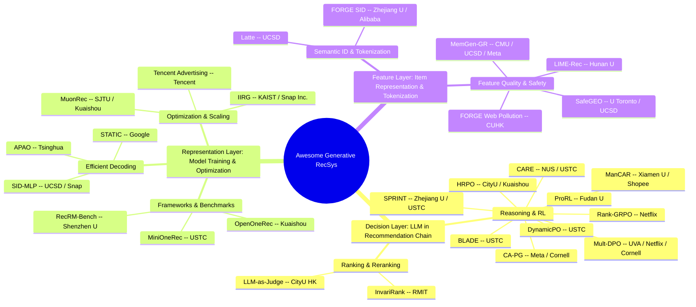

# Awesome Generative Recommendation System (RecSys)

```
 ██████╗                ██████╗                ███████╗                
██╔════╝  ███╗  ███╗    ██╔══██╗ ███╗   ███╗   ██╔════╝██╗ ██╗ ██████╗ 
██║      ██╔═██╗████╗   ██████╔╝██╔═██╗██╔═██╗ ███████╗╚██╗██║ ██╔═══╝ 
██║  ███╗██████║██╔██╗  ██╔══██╗██████║██║ ╚═╝ ╚════██║ ╚███╔╝ ██████╗ 
██║   ██║██║    ██║╚██╗ ██║  ██║██║    ██║ ██╗      ██║  ██╔╝      ██║
╚██████╔╝╚████╗ ██║ ╚██╗██║  ██║╚████╗ ╚███╔═╝ ███████║  ██║   ██████║
 ╚═════╝  ╚═══╝ ╚═╝  ╚═╝╚═╝  ╚═╝ ╚═══╝  ╚══╝   ╚══════╝  ╚═╝   ╚═════╝
```
---

[](https://github.com/sindresorhus/awesome)

RecSys is starting to adopt LLM for feature extraction, retrieval, and ranking/re-ranking! Although you can get some hands-on materials in either the [classics](#papers-classic-must-read) or some surveys, but since you're already interested in applying generative AI to industrial tasks, you probably wanna stay on the bleeding edge, right? That's exactly what this repo is for — automatically updated daily by agents with the latest generative RecSys papers fresh off arXiv, making sure that you never miss a beat.

> [!IMPORTANT]
> For those who are not familiar with GenRec, or not even the recommendation system, please checkout the kickstart posts [here](docs/kickstart.md).
> These posts are in Chinese, for English simply do your browser's internal translation or turn to __Ask Gemini__ :shipit:

## Quick Indexing
- [By Date](#by-date)
- [By Opensource](#by-opensource)
- [By Keyword](#by-keyword)
- [By Affiliation](#by-affiliation)


```mermaid
mindmap
  root((Awesome Generative RecSys))
    Decision Layer: LLM in Recommendation Chain
      Reasoning & RL
        Rank-GRPO -- Netflix
        DynamicPO -- USTC
        BLADE -- USTC
        SPRINT -- Zhejiang U / USTC
        CARE -- NUS / USTC
        HRPO -- CityU / Kuaishou
        Mult-DPO -- UVA / Netflix / Cornell
        CA-PG -- Meta / Cornell
        ProRL -- Fudan U
        ManCAR -- Xiamen U / Shopee
      Ranking & Reranking
        InvariRank -- RMIT
        LLM-as-Judge -- CityU HK
    Representation Layer: Model Training & Optimization
      Frameworks & Benchmarks
        MiniOneRec -- USTC
        OpenOneRec -- Kuaishou
        RecRM-Bench -- Shenzhen U
      Efficient Decoding
        STATIC -- Google
        APAO -- Tsinghua
        SID-MLP -- UCSD / Snap
      Optimization & Scaling
        MuonRec -- SJTU / Kuaishou
        Tencent Advertising -- Tencent
        IIRG -- KAIST / Snap Inc.
    Feature Layer: Item Representation & Tokenization
      Semantic ID & Tokenization
        Latte -- UCSD
        FORGE SID -- Zhejiang U / Alibaba
      Feature Quality & Safety
        SafeGEO -- U Toronto / UCSD
        MemGen-GR -- CMU / UCSD / Meta
        FORGE Web Pollution -- CUHK
        LIME-Rec -- Hunan U
```
<div align="center">
  <i> Open-source Generative RecSys Map </i>
</div>

---
## By Date

### Papers August 5

*Wednesday, August 5, 2026. Arxiv active. cs.IR listing returned 5 genrec papers from Aug 3–4 submission windows + 1 missed July 28 paper (UniR²). Total: 6 papers.*

1. **SmartGR: Hierarchy and Beam-Aware Knowledge Distillation for Generative Recommendation**
   * Affiliation: Zhejiang University — *(Ziheng Zhang, Yu Cui, Bohao Wang, Wujie Sun, Can Wang, Jiawei Chen — Zhejiang U; Yong He, Chao Yu, Chuan Yuan)*
   * Link: [arxiv.org/abs/2608.02048](https://arxiv.org/abs/2608.02048)
   * Venue: arXiv preprint, August 2026
   * TL;DR: First knowledge distillation framework specifically designed for GR; Hierarchy-Aware SID Distillation addresses imbalanced distillation difficulty across SID levels; Beam-Aware Ranking Distillation transfers teacher ranking preferences during beam search; +8.6% performance with 2.39× inference speedup.
   * Key techniques:
     - Hierarchy-Aware SID Distillation: transfers teacher modeling capability across coarse-to-fine SID hierarchy with level-specific weighting
     - Beam-Aware Ranking Distillation: distills teacher's beam search ranking preferences to correct prefix pruning errors
     - Offline teacher cache with top-K token distributions at each valid SID position
     - Unified distillation framework combining hierarchy-aware + beam-aware objectives for GR models
   * Scores (Opensource? / Novelty / Fairness / Robustness / Impact):
     - **Opensource?: 0/10** — No public code available
     - **Novelty: 6/10** — First KD specifically designed for GR; hierarchy-aware + beam-aware distillation is practical but conceptually incremental
     - **Fairness: 3/10** — Not addressing fairness
     - **Robustness: 6/10** — 4 benchmark datasets (Amazon Beauty/Toys + Kuaishou Ad/Video); 2.39× speedup; consistent across distillation configurations
     - **Impact: 6/10** — Zhejiang U; practical contribution enabling efficient GR deployment; built on OneRec ecosystem

2. **UnpairGR: Unpaired Modality-Agnostic Generative Recommendation**
   * Affiliation: Beihang University / Meituan — *(Weihao Shen, Wei Chen, Fuwei Zhang, Meng Yuan, Yuqin Lan, Fuzhen Zhuang — Beihang; Guojun Liu, Qingsong Hua, Wei Lin — Meituan)*
   * Link: [arxiv.org/abs/2608.02477](https://arxiv.org/abs/2608.02477)
   * Venue: arXiv preprint, August 2026
   * TL;DR: Learns unified SID space from paired + image-only + text-only observations; lightweight modality-specific input projections + shared Transformer/codebooks; reliability-guided cross-modal consensus resolves incompatible identifier sequences; no feature imputation or modality-specific codebooks needed.
   * Key techniques:
     - Unified semantic-ID space learning from paired (image+text), image-only, and text-only observations
     - Modality-specific processing confined to lightweight input projections; shared Transformer + residual codebooks
     - Reliability-guided cross-modal consensus: paired observations establish cross-modal alignment for unimodal refinement
     - Stationary tokenizer: learned tokenizer fixed as stable targets for autoregressive recommender
     - No feature imputation, modality-specific codebooks, or fallback mappings
   * Scores (Opensource? / Novelty / Fairness / Robustness / Impact):
     - **Opensource?: 0/10** — No public code available
     - **Novelty: 7/10** — First to handle unpaired multimodal observations in GR; shared SID space with reliability-guided consensus is novel
     - **Fairness: 4/10** — Improves coverage for items with incomplete modality data (indirect fairness benefit)
     - **Robustness: 6/10** — 3 benchmark datasets; both fully-observed and incomplete-observation settings; consistent improvement
     - **Impact: 6/10** — Beihang/Meituan; practical for real-world multimodal GR where modality missing is common

3. **SITA: Semantic Interest Tokens for Target-Aware Compression in Long-Sequence Recommendation**
   * Affiliation: University of Science and Technology of China / Kuaishou Technology — *(Rui Zhou, Hao Wang, Enhong Chen — USTC; Bo Chen, Qinglin Jia, Jiezhou Ji, Chaoyi Ma, Ruiming Tang — Kuaishou)*
   * Link: [arxiv.org/abs/2608.03692](https://arxiv.org/abs/2608.03692)
   * Venue: arXiv preprint, August 2026
   * TL;DR: Target-aware compression for long user sequences via semantic interest tokens learned through parallel semantic quantization; target-conditioned aggregation adaptively selects relevant interests per candidate; bridges the gap between efficient compression-based methods and adaptive target-retrieval methods.
   * Key techniques:
     - Semantic interest tokens: compress user history into structured semantic representations via parallel semantic quantization
     - Target-conditioned aggregation: conditioned on target item's semantic identifier, adaptively aggregates corresponding structured interests
     - Parallel semantic quantization organizes compressed interests into semantic structures without sequential dependency
     - Balances target-aware modeling with compression efficiency; validated on public + large-scale industrial datasets
   * Scores (Opensource? / Novelty / Fairness / Robustness / Impact):
     - **Opensource?: 0/10** — No public code available
     - **Novelty: 6/10** — Target-aware compression via semantic interest tokens is practical; parallel semantic quantization for rec is well-motivated
     - **Fairness: 3/10** — Not addressing fairness
     - **Robustness: 7/10** — Public + large-scale industrial datasets; strong scalability maintained; consistent outperformance over baselines
     - **Impact: 7/10** — USTC/Kuaishou; practical for industrial long-sequence recommendation bridging compression and target-awareness

4. **STEPS: A Self-Triggered Agentic Push Recommendation System**
   * Affiliation: ByteDance / Peking University — *(Zhao-Yu Zhang, Qingying Chen, Jing Zhou, Jian Sun, Siqi Chen, Leiying Chen, Chuan Zhou, Huiyou Jiang, Xin Tao, Chunyuan Zheng — ByteDance; Haoxuan Li, Zhouchen Lin — PKU)*
   * Link: [arxiv.org/abs/2608.01949](https://arxiv.org/abs/2608.01949)
   * Venue: arXiv preprint, August 2026
   * TL;DR: Reformulates push notification recommendation as proactive self-triggered agentic process; Planning Agent schedules next invocation via gated ordinal regression; Execution Agent decides send/drop with trajectory rewards; deployed at Douyin (1B+ users) with +0.28% active days, -1.91% push disablement, -79.42% compute overhead.
   * Key techniques:
     - Self-triggered agentic framework (STEPS): proactive closed-loop replacing passive polling/pre-scheduled delivery
     - Two Decision Transformer-based agents: Planning Agent (gated ordinal regression for scheduling) + Execution Agent (trajectory-reward-driven send/drop)
     - Lightweight filtering agent controls compute overhead and safeguards against unreasonable planning
     - End-to-end architecture avoiding local optima in multi-stage push frameworks
   * Scores (Opensource? / Novelty / Fairness / Robustness / Impact):
     - **Opensource?: 0/10** — No public code available
     - **Novelty: 7/10** — First self-triggered agentic push rec; reformulates push as proactive agentic process; gated ordinal regression for scheduling is novel
     - **Fairness: 3/10** — Not addressing fairness
     - **Robustness: 8/10** — Online A/B at Douyin (1B+ users); +0.28% active days; -1.91% push disablement; -79.42% compute reduction
     - **Impact: 7/10** — ByteDance/PKU; production-proven agentic push paradigm; deployed at Douyin with verified engagement and efficiency gains

5. **UniR²: Unifying Generative Recall and Multi-Objective Ranking in a Single Decoder-Only Sequence**
   * Affiliation: Kuaishou Technology / CAS IIE — *(Shuang Wen, Pengbo Xu, Yusheng Huang, Jiangxia Cao, Shuang Yang, Zhaojie Liu — Kuaishou; Ruochen Yang, Jiawei Sheng, Tingwen Liu — CAS IIE)*
   * Link: [arxiv.org/abs/2607.24439](https://arxiv.org/abs/2607.24439)
   * Venue: arXiv preprint, July 2026
   * TL;DR: Unified decoder-only Transformer merging generative recall + multi-objective ranking in single heterogeneous sequence; generated SID trajectory serves as representation bridge; Dual-Query Prefix-Causal Attention provides task-specific visibility with shared base weights + LoRA ranking adaptation; long-term online A/B validated at Kuaishou.
   * Key techniques:
     - Heterogeneous sequence: user context + SID trajectory + item features in single decoder-only Transformer
     - Generated SID trajectory as representation bridge between recall and ranking stages
     - Dual-Query Prefix-Causal Attention: task-specific information visibility with shared attention weights
     - LoRA for ranking adaptation: preserves generative backbone while enabling ranking-specific optimization
     - Eliminates objective inconsistency and information loss at candidate hand-off in cascade architectures
   * Scores (Opensource? / Novelty / Fairness / Robustness / Impact):
     - **Opensource?: 0/10** — No public code available
     - **Novelty: 7/10** — First to unify genrec recall + multi-objective ranking in single decoder-only sequence; Dual-Query Prefix-Causal Attention is novel
     - **Fairness: 3/10** — Not addressing fairness
     - **Robustness: 8/10** — Large-scale industrial data; long-term online A/B at Kuaishou with consistent positive gains
     - **Impact: 7/10** — Kuaishou/CAS IIE; practical unified recall-ranking paradigm for industrial recommendation

### Papers August 4

*Tuesday, August 4, 2026. Arxiv active. cs.IR listing returned 6 genrec papers from Aug 1–2 submission window. Total: 6 papers.*

1. **HRPO: Hierarchical Residual Policy Optimization for Generative Recommendations**
   * Affiliation: City University of Hong Kong / Kuaishou Technology — *(Kaifeng Guo, Jingtong Gao, Xiangyu Zhao — CityU; Yiming Yang, Fukang Yang, Yukang Liang, Peng Jiang, Qingpeng Cai — Kuaishou; Guolei Zeng — Independent)*
   * Link: [arxiv.org/abs/2608.00750](https://arxiv.org/abs/2608.00750)
   * Venue: KDD 2026 Research Track
   * TL;DR: Converts item-level outcome feedback into dense, token-aligned learning signals for SID-based generative recommenders via hierarchical residual credit decomposition; RRPO with group-normalized advantages + KL regularization; online A/B-validated with source code and Zenodo artifact.
   * Key techniques:
     - Prefix-level utility estimation via group-wise reward smoothing over feature-based user clusters
     - Residual token credit decomposition: prefix utilities broken into per-token credits, accumulated into credit-to-go signals
     - Residual-Return Policy Optimization (RRPO): clipped updates, group-normalized advantages, KL regularization
     - Converts sparse item-level feedback into dense token-aligned signals for conservative per-token improvement
   * Scores (Opensource? / Novelty / Fairness / Robustness / Impact):
     - **Opensource?: 8/10** — [github.com/Applied-Machine-Learning-Lab/KDD2026-HRPO](https://github.com/Applied-Machine-Learning-Lab/KDD2026-HRPO) — 3⭐, 6 commits; Apache 2.0; complete pipeline (KuaiSim simulator, SID mapping, HRPO table building, RRPO training + 11 baseline comparisons); Zenodo DOI artifact; well-documented README with reproduction instructions
     - **Novelty: 7/10** — First to convert item-level feedback into hierarchical token-aligned credits for SID genrec; RRPO is a principled RL formulation
     - **Fairness: 3/10** — Not addressing fairness
     - **Robustness: 8/10** — KDD 2026 peer-reviewed; public dataset + online A/B test in large-scale commercial system; comprehensive baseline comparisons (A2C, DDPG, HAC, Decision Transformer, etc.)
     - **Impact: 7/10** — KDD 2026; CityU/Kuaishou; practical post-training framework for token-level credit assignment in SID-based genrec

2. **Exp-RSFT: Exponential Reward Weighting for Fine-Tuning Generative Recommenders under Sparse and Noisy Feedback**
   * Affiliation: Netflix — *(Keertana Chidambaram, Sanath Kumar Krishnamurthy, Qiuling Xu, Ko-Jen Hsiao, Moumita Bhattacharya — Netflix)*
   * Link: [arxiv.org/abs/2608.00816](https://arxiv.org/abs/2608.00816)
   * Venue: arXiv preprint, August 2026
   * TL;DR: Replaces PPO/DPO post-training with exponential reward-weighted SFT (Exp-RSFT); temperature λ balances coverage vs. noise costs with inverted-U optimality curve; no online exploration or preference data needed; outperforms PPO/DPO on 3 public + 1 industrial dataset.
   * Key techniques:
     - Exponential reward-weighted fine-tuning: weights logged interactions by exp(r/λ), directly optimizing logged rewards
     - Theoretical suboptimality decomposition: coverage cost (logging policy limitations) + noise cost (imperfect feedback)
     - Temperature λ balancing exploitation-robustness tradeoff → inverted-U performance curve
     - Outperforms PPO/DPO which over-optimize unreliable reward models; no online exploration required
   * Scores (Opensource? / Novelty / Fairness / Robustness / Impact):
     - **Opensource?: 0/10** — No public code available
     - **Novelty: 6/10** — Simple but principled alternative to PPO/DPO for genrec post-training; theoretical decomposition is clean
     - **Fairness: 3/10** — Not addressing fairness
     - **Robustness: 7/10** — 3 public benchmarks + large-scale industrial dataset; theoretical analysis supporting empirical inverted-U trend
     - **Impact: 6/10** — Netflix; practical lightweight post-training method for industrial genrec under sparse/noisy feedback

3. **OMEGA: Collaborative Memory Augmentation for Generative Recommendation**
   * Affiliation: Renmin University of China / ByteDance — *(Enze Liu, Wayne Xin Zhao — Renmin University; Zhen Tian — ByteDance)*
   * Link: [arxiv.org/abs/2608.01315](https://arxiv.org/abs/2608.01315)
   * Venue: KDD 2026 Research Track
   * TL;DR: Bridges parametric knowledge gap in GR with explicit collaborative memory bank; learnable query tokens compress user sequences into compact memory; target-aware retrieval + gated cross-attention integration adaptively fuses global patterns with local context.
   * Key techniques:
     - Latent context compression: learnable query tokens distill sequential behavior into compact memory representations
     - Collaborative memory bank: explicit repository of global cross-user behavioral patterns
     - Lightweight target-aware retrieval: identifies relevant memories via sequence-level + target-level similarities
     - Gated cross-attention integration: adaptively fuses retrieved collaborative memories while suppressing noisy patterns
   * Scores (Opensource? / Novelty / Fairness / Robustness / Impact):
     - **Opensource?: 0/10** — No public code available
     - **Novelty: 6/10** — First to add explicit collaborative memory bank to GR; bridges implicit parametric ↔ explicit collaborative knowledge gap
     - **Fairness: 3/10** — Not addressing fairness
     - **Robustness: 7/10** — KDD 2026 peer-reviewed; multiple real-world datasets; consistent outperformance over advanced GR models
     - **Impact: 6/10** — KDD 2026; Renmin/ByteDance; opens new direction for memory-augmented generative recommendation

4. **GARDRec: Decision-Level Graph Grounding for Large Language Model Recommendation**
   * Affiliation: Harbin Institute of Technology — *(Yong Wang, Hongliang Sun, Jinlan Liu, Hua Zhang, Dianbo Sui, Dianhui Chu, Zhiying Tu — HIT)*
   * Link: [arxiv.org/abs/2608.00669](https://arxiv.org/abs/2608.00669)
   * Venue: arXiv preprint, August 2026
   * TL;DR: Shifts KG grounding from prompt-level to decision-level for LLM-based next-item ranking; semantic-structural item representations + temporally weighted graph contexts aligned with frozen LLM via multimodal prompts; late-stage decision branches inject explicit matching features.
   * Key techniques:
     - Semantic-structural item representations from textual node features + graph propagation
     - Personalized graph contexts from temporally weighted histories + first-order neighborhoods
     - Graph-LLM alignment via continuous multimodal prompts with frozen LLM backbone
     - Late-stage decision branches injecting explicit interaction/matching features + inter-candidate attention
   * Scores (Opensource? / Novelty / Fairness / Robustness / Impact):
     - **Opensource?: 0/10** — No public code available
     - **Novelty: 5/10** — Decision-level vs. prompt-level graph grounding is a practical refinement; conceptually incremental
     - **Fairness: 3/10** — Not addressing fairness
     - **Robustness: 6/10** — 3 public benchmarks; multiple LLM backbones; ablation verifying each component
     - **Impact: 5/10** — HIT; practical LLM-based recommendation with structured graph grounding

5. **GRACE: Generative Recommender Acceleration Engine for Real-Time Ads Retrieval**
   * Affiliation: Meta — *(Zhou Fang, Yuhang Huang, Ang Zhang, Yihan He, Ruichao Xiao, Chao Li, Yavuz Yetim, Sibyl Yang, Xiaohan Wei, Fei Tian, Liang Wang, Liyuan Li, Nathan Yan, Gaoxiang Liu — Meta)*
   * Link: [arxiv.org/abs/2608.00938](https://arxiv.org/abs/2608.00938)
   * Venue: arXiv preprint, August 2026
   * TL;DR: Production serving system for ads genrec solving eligibility (GTM: bitmask+Bloom filter SID-prefix filtering, 23.55→40.42% pass rate) and latency (68× cross-attention, 11.1× decoder speedup on GH200 via wide-beam kernel/KV-cache/beam-search optimization).
   * Key techniques:
     - Generative Target Matching (GTM): SID-prefix-level personalized filtering using bitmask + Bloom filter matchers from advertiser targeting rules
     - Encoder-decoder Transformer optimizations targeting wide-beam, short-sequence decoding regime
     - Custom attention kernels + KV cache + beam search redesign for wide-beam inference
     - 68× cross-attention, 23-26× self-attention, 11.1× overall decoder latency reduction on NVIDIA GH200
   * Scores (Opensource? / Novelty / Fairness / Robustness / Impact):
     - **Opensource?: 0/10** — No public code available
     - **Novelty: 6/10** — First production serving system addressing both eligibility and latency for ads genrec; GTM is novel for ad targeting
     - **Fairness: 3/10** — Not addressing fairness
     - **Robustness: 7/10** — Production-scale system design; GH200 latency benchmarks; comprehensive serving pipeline coverage
     - **Impact: 7/10** — Meta; practical blueprint for productionizing genrec in high-volume real-time ads systems

6. **LIME-Rec: Auditing Semantic Gains in Sequential Recommendation — A Lightweight Recovery Test**
   * Affiliation: Hunan University — *(Kong Wang, Kehua Yang — Hunan U; Zhongke He, Xiang Chen, Hongwei Zeng, Kai Deng, Long Wang)*
   * Link: [arxiv.org/abs/2608.01260](https://arxiv.org/abs/2608.01260)
   * Venue: arXiv preprint, August 2026
   * TL;DR: Diagnostic framework decomposing semantic recsys gains; three-expert fusion (SASRec + ItemCF + frozen BGE embeddings) with auditable score-level fusion + bounded history calibration recovers 7-12% over strongest baselines without serving-time LM inference; randomly permuting embeddings drops R@10 by 13.6-17.5%.
   * Key techniques:
     - Three-expert design: SASRec sequential + ItemCF co-occurrence + frozen BAAI/bge-base-en-v1.5 semantic expert
     - Auditable score-level fusion: per-user score normalization with separately inspectable expert contributions
     - Bounded history calibration fitted on validation data only, zero serving-time LM inference
     - Controlled perturbation: random item-text permutation reducing R@10 by 13.6-17.5% → gains depend on genuine content correspondence
   * Scores (Opensource? / Novelty / Fairness / Robustness / Impact):
     - **Opensource?: 7/10** — [github.com/Double-wk/LIME-Rec](https://github.com/Double-wk/LIME-Rec) — 3⭐, 1 commit; Apache 2.0; well-structured package (lime_rec/, configs/, scripts/, workflows/); comprehensive README with multi-seed reproduction; tests included
     - **Novelty: 7/10** — First lightweight recovery test auditing source of semantic gains in seqrec; diagnostic framing is important for the field
     - **Fairness: 3/10** — Not addressing fairness directly
     - **Robustness: 7/10** — 3 Amazon benchmarks + Yelp; multi-seed; controlled perturbations; three-expert isolation
     - **Impact: 7/10** — Hunan U; important diagnostic contribution suggesting lightweight representations may explain much of semantic rec gains; challenges the need for complex semantic architectures

### Papers August 3

*Monday, August 3, 2026. Arxiv active. cs.IR listing returned 7 new genrec papers from July 31–Aug 1 submission window. Total: 7 papers.*

1. **SnapLGR: LLM-Based Generative Retrieval for Snapchat Content Recommendation**
   * Affiliation: Snap Inc. — *(Liam Collins, Jiwen Ren, Donald Loveland, Bhuvesh Kumar, Clark Mingxuan Ju, Xuan Guo, Mo Li, Alvin Hou, Yi Cui, Peng Yang, Jian Wang, Saud Afzal Shafi, Nga Than, Ruiming Lu, Wenfeng Zhuo, Dongheng Li, Lili Zhang, Mingtao Zhang, Jinchao Ye, Vincent Xue, Chunhui Zhu, Neil Shah — Snap Inc.)*
   * Link: [arxiv.org/abs/2607.28895](https://arxiv.org/abs/2607.28895)
   * Venue: arXiv preprint, July 2026
   * TL;DR: Production LLM-based GR system at Snapchat with PPR-enhanced SIDs + continued pretraining for vocabulary grounding + TensorRT-LLM beam search; live A/B: +0.37% View Time, +0.18% Deep Sessions over TIGER baseline.
   * Key techniques:
     - PPR-based co-engagement contrastive learning for collaborative-enhanced SIDs (improved codebook utilization + reduced collisions)
     - Continued Pretraining (CPT) grounding SID tokens before supervised fine-tuning on user interaction sequences
     - TensorRT-LLM CUDA-backed beam search + decentralized worker-loop serving architecture
     - Joint design across representation learning, vocabulary grounding, and efficient training/serving
   * Scores (Opensource? / Novelty / Fairness / Robustness / Impact):
     - **Opensource?: 0/10** — No public code available
     - **Novelty: 6/10** — PPR-enhanced SID construction and CPT-based vocabulary grounding are practical advances; joint design perspective is valuable
     - **Fairness: 3/10** — Not addressing fairness
     - **Robustness: 8/10** — Live A/B at Snapchat with 4 significant metrics; joint optimization across representation/vocabulary/serving
     - **Impact: 8/10** — Snap Inc.; production-proven LLM-based GR at Snapchat scale; practical blueprint for industrial GR deployment

2. **TransX: Scaling Transformer-based Recommendation via Behavioral and Serving Stream Crossings**
   * Affiliation: LinkedIn — *(Da Xu, Liyan Fang, Divya Venugopalan, Sunny Hsu, Xukai Wang, Rishav Roy Chowdhury, Cindy Liang, Nishant Satya Lakshmikanth — LinkedIn)*
   * Link: [arxiv.org/abs/2607.28940](https://arxiv.org/abs/2607.28940)
   * Venue: KDD 2026 (DOI: 10.1145/3770855.3818497)
   * TL;DR: Encoder-decoder separating behavior-stream encoding from serving-event decoding with cross-attention conditioning; amortized serving with incremental encoding + per-request KV cache reduces online compute 80%; +6.0% CTR, +4.4% CVR on LinkedIn.
   * Key techniques:
     - Sequence-to-sequence action transduction paradigm: decouples long-term behavior (nearline) from real-time serving (online)
     - Scalable cross-attention between behavior encodings and serving representations
     - Amortized serving: incremental behavior encoding + per-request key-value caching → latency insensitive to behavior length
     - 80% online compute reduction with comparable serving cost to existing production models
   * Scores (Opensource? / Novelty / Fairness / Robustness / Impact):
     - **Opensource?: 0/10** — No public code available
     - **Novelty: 6/10** — Stream decoupling for recommendation is practical; amortized serving co-design is well-engineered
     - **Fairness: 3/10** — Not addressing fairness
     - **Robustness: 8/10** — KDD 2026; production A/B at LinkedIn; strong business metrics + compute efficiency
     - **Impact: 7/10** — KDD 2026; LinkedIn; practical scaling blueprint for Transformer-based industrial recommendation

3. **Think2Go: Generative Next POI Recommendation with LLM Reasoning**
   * Affiliation: Dalian University of Technology / Wuhan University / A*STAR / South China University of Technology — *(Zhuang Zhuang, Heng Qi, Yanming Shen, Baocai Yin — Dalian UT; Shanshan Feng — Wuhan U; Hangwei Qian — A*STAR; Mingqi Yang — SCUT)*
   * Link: [arxiv.org/abs/2607.28997](https://arxiv.org/abs/2607.28997)
   * Venue: KDD 2026 Research Track (Oral)
   * TL;DR: First generative POI recommendation framework unifying SFT + RL reasoning for SID-based generation; epistemic uncertainty from kernel density + reward-informed advantage scaling for calibrated policy optimization; implicit curriculum preventing entropy collapse.
   * Key techniques:
     - Unified SFT + RL reasoning architecture for generative POI rec over SIDs
     - Prompt epistemic uncertainty via kernel density estimation measuring spatial-temporal pattern alignment
     - Reward-informed advantage scaling normalizing rewards against maxima for stable training
     - Implicit curriculum learning: instance-aware policy updates preventing entropy collapse
     - Test-time computational scaling exploring diverse spatial-temporal patterns
   * Scores (Opensource? / Novelty / Fairness / Robustness / Impact):
     - **Opensource?: 5/10** — [github.com/zhuang999/Think2Go](https://github.com/zhuang999/Think2Go) — 3⭐, 9 commits functional code (SFT training, eval, vLLM inference); no license; minimal documentation but runnable with dataset; KDD 2026 Oral artifact
     - **Novelty: 7/10** — First generative POI rec with LLM reasoning + SIDs; epistemic uncertainty-driven exploration is novel for genrec
     - **Fairness: 3/10** — Not addressing fairness
     - **Robustness: 7/10** — KDD 2026 Oral; 3 real-world POI datasets; implicit curriculum learning stabilizes training
     - **Impact: 7/10** — KDD 2026 Oral; Dalian UT; opens new direction for generative POI recommendation with reasoning

4. **PaletteID: Prototype-Composed Semantic Identifiers for Multimodal CTR Prediction**
   * Affiliation: Huazhong University of Science and Technology / Central China Normal University — *(Huanyu Liu, Baining Chen, Hui Liu, Ziyi Huang — HUST; Zengyang Li — CCNU)*
   * Link: [arxiv.org/abs/2607.29000](https://arxiv.org/abs/2607.29000)
   * Venue: arXiv preprint, July 2026
   * TL;DR: Palette-inspired SID construction using prototype items as semantic anchors; SQ-DPP selects representative prototypes balancing local density + global diversity; prototype-aggregated PID representation preserves fine-grained semantics; larger gains on long-tail items.
   * Key techniques:
     - Prototype palette: compact set of representative items as semantic anchors bridging content space and rec models
     - Semantic Quality-Aware Determinantal Point Process (SQ-DPP): joint local density + global diversity optimization
     - PID representation: retrieves and aggregates semantically related prototypes into informative item representation
     - More robust SID assignments + interpretable token semantics vs. residual SID methods
   * Scores (Opensource? / Novelty / Fairness / Robustness / Impact):
     - **Opensource?: 0/10** — No public code available
     - **Novelty: 7/10** — Palette-inspired prototype composition for SID is novel; SQ-DPP is a principled approach
     - **Fairness: 4/10** — Larger gains on long-tail items indirectly addressing cold-start fairness
     - **Robustness: 6/10** — 2 public datasets; more robust SID assignments; no industrial validation
     - **Impact: 6/10** — HUST; novel SID construction paradigm with interpretability advantages

5. **EvoReason: Self-Evolving Reasoning Primitive-Guided On-Policy Distillation for Latent Reasoning in Generative Recommendation**
   * Affiliation: Kuaishou Technology / Shenzhen University — *(Zhuang Zhuang, Zhipeng Wei, Shijie Li, Peng Zhao, Jie Chen, Fei Pan — Kuaishou; Rongfeng Guo — Shenzhen U)*
   * Link: [arxiv.org/abs/2607.29010](https://arxiv.org/abs/2607.29010)
   * Venue: arXiv preprint, July 2026
   * TL;DR: Replaces raw CoT distillation for latent reasoning in GR with self-evolving primitive-guided on-policy distillation; extracts reusable reasoning primitives from agentic trajectories as pseudo-tools for structured teacher reasoning; closed-loop co-evolution aligns teacher supervision with student latent space.
   * Key techniques:
     - Reasoning primitives extraction: reusable atomic behaviors from agentic recommendation trajectories as pseudo-tools
     - Primitive-guided structured CoT generation: reduced redundancy + improved consistency from teacher
     - Self-evolving on-policy distillation: teacher reasoning evolves according to student's latent outcomes
     - Closed-loop co-evolution: progressively better-aligned CoT supervision for latent reasoning transfer
   * Scores (Opensource? / Novelty / Fairness / Robustness / Impact):
     - **Opensource?: 0/10** — No public code available
     - **Novelty: 7/10** — First reasoning primitive-guided distillation for GR; self-evolving on-policy mechanism is novel for latent reasoning
     - **Fairness: 3/10** — Not addressing fairness
     - **Robustness: 6/10** — Strong conceptual framework with structured primitives; no online A/B reported
     - **Impact: 7/10** — Kuaishou; extends latent reasoning paradigm with self-evolving distillation; practical for industrial GR

6. **GALA: Generative Aligned Learning for Adaptive Multimodal Representation in the Taobao Shangou Recommender System**
   * Affiliation: Alibaba Group (Taobao) — *(Jiping Liu, Zhongmin Zhang, Zisen Sang, Zhijia Fang, Tao Ouyang, Ma Jiang, Shaopeng Liang, Zeyang Hou, Guodong Cao, Jia Jia — Alibaba)*
   * Link: [arxiv.org/abs/2607.29213](https://arxiv.org/abs/2607.29213)
   * Venue: ICDE 2026 (Industry and Applications Track)
   * TL;DR: Three-stage pipeline for multimodal food-delivery rec with intermediate generative RL alignment stage bridging pretraining-fine-tuning gap; GRPO refines multimodal embeddings using conversion rewards; deployed at Taobao Shangou (200M DAU) with +0.55% order volume.
   * Key techniques:
     - Behavior-aware triplet pretraining on query-image-text pairs from search logs
     - Intermediate generative RL alignment: GRPO refines embeddings via conversion-based rewards
     - Adaptive gating + hybrid loss preserving multimodal contributions under ID-dominant training
     - Production deployment serving 200M daily active users
   * Scores (Opensource? / Novelty / Fairness / Robustness / Impact):
     - **Opensource?: 0/10** — No public code available
     - **Novelty: 6/10** — Intermediate RL alignment stage is practical; GRPO for multimodal rec is well-motivated
     - **Fairness: 3/10** — Not addressing fairness
     - **Robustness: 8/10** — ICDE 2026; 200M DAU production at Taobao; +0.55% order volume with consistent offline gains
     - **Impact: 7/10** — ICDE 2026; Alibaba Taobao; industrial multimodal rec with verified business impact

7. **RecHarness: A Bandit-Routed Agentic Harness for Self-Evolving Recommender Systems**
   * Affiliation: Kuaishou Technology — *(Haoran Ling, Yuecheng Li, Zeyu Song, Jing Yao, Shuwen Kang, Chi Lu, Wenjin Wu, Peng Jiang — Kuaishou)*
   * Link: [arxiv.org/abs/2607.29241](https://arxiv.org/abs/2607.29241)
   * Venue: arXiv preprint, July 2026
   * TL;DR: Bandit router selects modification direction + LLM generates concrete hypothesis/code edit for automated recsys optimization; jump-basin mechanism triggers structural exploration when local edits stagnate; 7-day A/B: +2.084% ADVV, +0.534% Revenue on short-video ads.
   * Key techniques:
     - Two-step optimization: bandit router (direction selection) + LLM (hypothesis generation + code editing)
     - Jump-basin mechanism: activates structural-jump arm when local edits plateau for sustained exploration
     - Historical validation feedback guiding bandit decisions across long-horizon experiments
     - Open-source code (placeholder, "Coming Soon"): github.com/6lyc/RecHarness
   * Scores (Opensource? / Novelty / Fairness / Robustness / Impact):
     - **Opensource?: 1/10** — [github.com/6lyc/RecHarness](https://github.com/6lyc/RecHarness) — placeholder only (2 commits, "Coming Soon", no code, no license); stated as open-source in paper but not yet released
     - **Novelty: 7/10** — Bandit-router for separating optimization direction from hypothesis generation is novel; jump-basin mechanism addresses exploration stagnation
     - **Fairness: 3/10** — Not addressing fairness
     - **Robustness: 8/10** — 7-day online A/B at Kuaishou with +2.084% ADVV; multiple tasks/datasets/backbones; limited trial budget efficiency
     - **Impact: 7/10** — Kuaishou; agentic recsys optimization with production-proven gains; practical framework for automated model iteration

### Papers August 2

*Sunday, August 2, 2026. Arxiv inactive (weekend). Applied 3-month fallback strategy → found 5 missed genrec papers: 1 from July 26 listing (Dual-purpose SIDs, YouTube/Google, RecSys 2026) + 4 from Feb–June 2026 3-month fallback (UGR USTC KDD 2026, RAGR Dalian/CityU/Huawei TOIS 2026, PauseRec UVA/Snap, Gryphon Yandex). Total: 5 papers.*

1. **Tokens are All You Need: Dual-purpose Semantic IDs for Achieving LLM-Level I/O Efficiency in Recommendation Systems**
   * Affiliation: YouTube / Google — *(Baolei Li, Yiping Yuan, Yilin Zheng, Likang Yin, Ling Liu, Fabio Soldo, Romer Rosales, Xinyang Yi, Lichan Hong — YouTube/Google)*
   * Link: [arxiv.org/abs/2607.24865](https://arxiv.org/abs/2607.24865)
   * Venue: RecSys 2026
   * TL;DR: Dual-purpose SIDs serving as both collaborative identity (via learnable embedding table) and content reconstruction (via lightweight Semantic Decoder for on-the-fly embedding approximation); replaces massive embedding storage with on-demand reconstruction; deployed on production-scale ranking + retrieval at major video platform.
   * Key techniques:
     - Dual-purpose Semantic IDs: hierarchical quantization condenses continuous embeddings into discrete tokens with two concurrent roles
     - Collaborative Identity: models user-item interactions via learnable embedding table lookup
     - Content Reconstruction: lightweight Semantic Decoder reconstructs embeddings on-the-fly, eliminating massive vector storage
     - On-demand reconstruction replacing persistent dense embedding tables for I/O efficiency
   * Scores (Opensource? / Novelty / Fairness / Robustness / Impact):
     - **Opensource?: 0/10** — No public code available
     - **Novelty: 7/10** — Dual-purpose SID concept combining collaborative and content roles is novel; bridges traditional embedding and generative paradigms
     - **Fairness: 3/10** — Not addressing fairness
     - **Robustness: 7/10** — RecSys 2026 peer-reviewed; production deployment at major video platform; offline + online validation
     - **Impact: 7/10** — RecSys 2026; YouTube/Google; practical I/O efficiency paradigm for industrial-scale recommendation

2. **Uncertainty-aware Generative Recommendation (UGR)**
   * Affiliation: University of Science and Technology of China — *(Chenxiao Fan, Chongming Gao, Yaxin Gong, Haoyan Liu, Fuli Feng, Xiangnan He — USTC)*
   * Link: [arxiv.org/abs/2602.11719](https://arxiv.org/abs/2602.11719)
   * Venue: KDD 2026
   * TL;DR: Identifies "uncertainty blindness" in genrec — existing preference optimization relies solely on binary outcome correctness ignoring model confidence; proposes uncertainty-weighted reward penalizing confident errors + difficulty-aware optimization + explicit confidence alignment via confidence tokens; stabilizes training preventing performance degradation.
   * Key techniques:
     - Uncertainty-weighted reward: adaptive penalties distinguishing confident hallucinations from tentative explorations
     - Difficulty-aware optimization dynamics: prevents premature convergence by focusing on hard samples
     - Explicit confidence alignment: augments vocabulary with confidence tokens, jointly generates recommendation + confidence
     - Uncertainty-aware RL objective for preference optimization with confidence expression
   * Scores (Opensource? / Novelty / Fairness / Robustness / Impact):
     - **Opensource?: 7/10** — [github.com/cxfann/UGR](https://github.com/cxfann/UGR) — KDD 2026 artifact; 4 commits; clean modular structure (data/train/eval); well-documented README with full reproduction pipeline; built on LETTER/MiniOneRec; Zenodo DOI available
     - **Novelty: 7/10** — First to formalize uncertainty blindness in GR; confidence tokens as explicit signal for generative recommendation is novel
     - **Fairness: 3/10** — Not addressing fairness
     - **Robustness: 7/10** — KDD 2026 peer-reviewed; training stabilization demonstrated; learned confidence enables risk-aware downstream applications
     - **Impact: 7/10** — KDD 2026; USTC (Xiangnan He); addresses fundamental training issue in generative recommendation with practical confidence modeling

3. **Review-Augmented Generative Recommendation (RAGR)**
   * Affiliation: Dalian University of Technology / City University of Hong Kong / Huawei Noah's Ark Lab — *(Yingyi Zhang, Junyi Li, Yejing Wang, Wenlin Zhang, Xiaowei Qian, Sheng Zhang, Yue Feng — Dalian/CityU; Yichao Wang, Yong Liu — Huawei; Xiangyu Zhao — CityU; Xianneng Li — Dalian)*
   * Link: [arxiv.org/abs/2605.17267](https://arxiv.org/abs/2605.17267)
   * Venue: ACM TOIS 2026
   * TL;DR: Identifies item-only modeling as structural bottleneck in GR — review feedback explains why users choose items; interleaves item SIDs and review SIDs in chronological autoregressive sequence; DPO-based alignment ensures item tokens prioritized over review tokens at prediction positions.
   * Key techniques:
     - Review-Augmented User Sequence Modeling: interleaves item SIDs + review SIDs chronologically in mixed behavioral-semantic sequence
     - Item-Centric Task Generation Alignment: DPO favoring item tokens over review tokens at prediction positions
     - Review SID construction parallel to item SID via RQ-VAE tokenizer
     - Review feedback directly participating in autoregressive next-token generation
   * Scores (Opensource? / Novelty / Fairness / Robustness / Impact):
     - **Opensource?: 7/10** — [github.com/Zhang-Yingyi/RAGR](https://github.com/Zhang-Yingyi/RAGR) — 6⭐, 8 commits; well-structured README with diagrams and full 7-step pipeline; modular code (data_process/RQ-VAE/TIGER); sample Beauty dataset provided; ACM TOIS artifact
     - **Novelty: 7/10** — First to incorporate review feedback directly into generative user sequence via interleaved SIDs; DPO-based preference alignment for task focus is well-motivated
     - **Fairness: 3/10** — Not addressing fairness
     - **Robustness: 6/10** — 3 real-world datasets; consistent gains over strong GR backbones; ACM TOIS peer-reviewed
     - **Impact: 6/10** — Dalian/CityU/Huawei; practical augmentation paradigm for generative recommendation bridging behavioral and semantic signals

4. **Implicit Reasoning for Large Language Model-based Generative Recommendation (PauseRec)**
   * Affiliation: University of Virginia / Snap Inc. — *(Yinhan He, Liam Collins, Bhuvesh Kumar, Jundong Li — UVA; Neil Shah, Donald Loveland — Snap Inc.)*
   * Link: [arxiv.org/abs/2606.14142](https://arxiv.org/abs/2606.14142)
   * Venue: arXiv preprint, June 2026
   * TL;DR: Systematically decomposes explicit CoT reasoning pipelines for LLM-based GR, revealing 3 limitations (weakened world-knowledge verbalization, SID-NL embedding misalignment, rationale quality sensitivity); proposes lightweight implicit reasoning avoiding costly reasoning trace acquisition; +6.22% over CoT, -65% training GPU hours, -71.3% inference time.
   * Key techniques:
     - Systematic decomposition of explicit reasoning pipelines revealing 3 failure modes in LLM-based GR
     - Implicit reasoning paradigm: avoids reasoning trace acquisition and reasoning alignment training entirely
     - Lightweight alternative to explicit rationale generation for LLM-based generative recommendation
     - Empirical analysis showing when and why each stage of explicit reasoning is unnecessary
   * Scores (Opensource? / Novelty / Fairness / Robustness / Impact):
     - **Opensource?: 0/10** — No public code available
     - **Novelty: 6/10** — Systematic decomposition of explicit reasoning is valuable diagnostics; implicit reasoning for LLM GR is a practical insight
     - **Fairness: 3/10** — Not addressing fairness
     - **Robustness: 6/10** — 3 datasets; consistent improvements; comprehensive ablation on reasoning pipeline stages
     - **Impact: 6/10** — UVA/Snap (Neil Shah); practical lightweight alternative to costly explicit CoT for LLM-based generative recommendation

5. **Gryphon: A Unified Architecture for Semantic-ID Generation and Item-Level Scoring in Industrial Recommendations**
   * Affiliation: Yandex — *(Daria Tikhonovich, Oleg Sorokin, Vladislav Dodonov, Mariia Ulianova, Ilya Murzin — Yandex)*
   * Link: [arxiv.org/abs/2606.08604](https://arxiv.org/abs/2606.08604)
   * Venue: arXiv preprint, June 2026
   * TL;DR: Unified encoder-decoder adding jointly trained item-level scoring alongside SID generation; resolves beam-likelihood miscalibration and SID collision by re-scoring resolved items directly; deployed as sole candidate source replacing 15+ candidate generators + preranking stage; +3.7% Recall@1000 over vanilla GR, +4.2% gain over beam-likelihood ranking.
   * Key techniques:
     - Jointly trained item-level scoring component reusing encoder's user representation from single forward pass
     - Item-level re-scoring: resolves generated SIDs to concrete items, avoids miscalibrated sequence scores
     - SID collision resolution: separates items collapsed on same identifier via direct item scoring
     - System simplification: single GR model replaces 15+ candidate generators + separate preranking stage
   * Scores (Opensource? / Novelty / Fairness / Robustness / Impact):
     - **Opensource?: 0/10** — No public code available
     - **Novelty: 6/10** — Item-level scoring alongside SID generation is a practical architectural improvement; production validation of system simplification is valuable
     - **Fairness: 3/10** — Not addressing fairness
     - **Robustness: 7/10** — Industrial music service deployment; 7-day A/B test; no regression in listening time while substantially simplifying system
     - **Impact: 6/10** — Yandex; practical blueprint for simplifying industrial candidate generation via unified GR with item-level scoring

### Papers August 1

*Saturday, August 1, 2026. Arxiv inactive (weekend). Friday July 31 listing returned 1 new genrec paper (LGRID) + 4 missed papers from May 2026 3-month fallback (Intent-Driven SID, SID-MLP, TwiSTAR, IMFuse). Total: 5 papers.*

1. **Interpretable Representation via LLM-Driven Generative Disentanglement for Local-Life Service Recommendation (LGRID)**
   * Affiliation: Kuaishou Technology — *(Long Zhang, Hao Jiang, Sheng Yu, Fei Pan, Peng Jiang, Kun Gai — Kuaishou)*
   * Link: [arxiv.org/abs/2607.27944](https://arxiv.org/abs/2607.27944)
   * Venue: arXiv preprint, July 2026
   * TL;DR: Generative disentanglement paradigm for SID construction with Encode→Disentangle→Align→Quantize pipeline; dual-stream Residual Quantization yields interpretable SIDs with explicit geographic-semantic attribute correspondence; reduces full-SID collision rate from 97.0% to 39.9%.
   * Key techniques:
     - Structured Disentangled Block: routes hidden states into attribute-aligned slots for geographic and semantic factors
     - Synergistic Alignment Learning: makes slots both generatively decodable and discriminative for retrieval
     - Dual-Stream Residual Quantization: separately discretizes geographic and semantic streams into compact SIDs
     - Joint LLM encoding preserving cross-attribute geographic-semantic dependencies
   * Scores (Opensource? / Novelty / Fairness / Robustness / Impact):
     - **Opensource?: 0/10** — No public code available
     - **Novelty: 6/10** — First to apply generative disentanglement to SID construction; dual-stream quantization is novel for local-life recsys
     - **Fairness: 3/10** — Not addressing fairness
     - **Robustness: 6/10** — Kuaishou + Foursquare datasets; 5.44% relative AUC gain; 99% attribute-decoding accuracy
     - **Impact: 6/10** — Kuaishou; interpretable SIDs with explicit attribute correspondence for local-life recommendation

2. **Intent-Driven Semantic ID Generation for Grounded Conversational News Recommendation**
   * Affiliation: Tencent — *(Hongyang Su, Beibei Kong, Lei Cheng, Chengxiang Zhuo, Zang Li, Chenyun Yu — Tencent)*
   * Link: [arxiv.org/abs/2605.07613](https://arxiv.org/abs/2605.07613)
   * Venue: ACL 2026 Industry Track (Oral)
   * TL;DR: Generate-then-Match paradigm mapping 6 user intent types (5 implicit) to hierarchical SID prefixes for grounded conversational news rec; 0% hallucination at 7B model; matches GPT-4+Hybrid RAG at ~100x lower cost; cold-start users achieve 18.0% L1 match.
   * Key techniques:
     - Generate-then-Match: LLM maps diverse intents to hierarchical SID prefixes → fuzzy-matched to news pool
     - Two-stage training: multi-task SID alignment + GPT-4 CoT distillation
     - Profile-Aware Dual-Signal Reasoning (PADR): enables cold-start recommendations using only profiles
     - 6 intent-type taxonomy from production dialogues (5 implicit, 1 explicit)
   * Scores (Opensource? / Novelty / Fairness / Robustness / Impact):
     - **Opensource?: 0/10** — No public code available
     - **Novelty: 7/10** — Generate-then-Match paradigm is a clean departure from retrieve-then-rank for conversational rec; intent-type taxonomy is systematic
     - **Fairness: 4/10** — Cold-start users benefit most (18.0% L1 vs 0% baselines)
     - **Robustness: 7/10** — ACL 2026 Oral; 0% hallucination on Chinese news platform; GPT-4-level quality at ~100x lower cost
     - **Impact: 7/10** — ACL 2026 Oral; Tencent; practical conversational news rec with guaranteed grounding

3. **MLPs are Efficient Distilled Generative Recommenders (SID-MLP)**
   * Affiliation: University of California, San Diego / Snap Inc. — *(Zitian Guo, Yupeng Hou, Julian McAuley — UCSD; Clark Mingxuan Ju, Neil Shah — Snap Inc.)*
   * Link: [arxiv.org/abs/2605.12617](https://arxiv.org/abs/2605.12617)
   * Venue: arXiv preprint, May 2026
   * TL;DR: Identifies Transformer decoder as structural overkill for SID-based GR — prediction difficulty drops sharply after first token; distills autoregressive teacher into position-specific MLP heads; 8.74× inference speedup with matched accuracy; SID-MLP++ extends to encoder replacement.
   * Key techniques:
     - SID search-space collapse analysis: valid continuations drop to single digits after first token
     - Position-specific MLP heads: global user context captured in single operation, decoupled from sequential token prediction
     - Teacher-student distillation from autoregressive Transformer to MLP-only decoder
     - SID-MLP++: extends distillation to replace Transformer encoder for further latency reduction
     - Plug-and-play accelerator compatible with different backbones and tokenizer settings
   * Scores (Opensource? / Novelty / Fairness / Robustness / Impact):
     - **Opensource?: 7/10** — [github.com/ztguo715/SID-MLP](https://github.com/ztguo715/SID-MLP) — code available per paper; UCSD/Snap team
     - **Novelty: 7/10** — First to identify Transformer decoder overkill for SID-based GR; MLP-only distillation for GR is novel and practical
     - **Fairness: 3/10** — Not addressing fairness
     - **Robustness: 7/10** — Multiple backbones + tokenizers; 8.74× speedup; SID-MLP++ for full encoder replacement
     - **Impact: 7/10** — UCSD/Snap (Yupeng Hou / Julian McAuley / Neil Shah); practical inference acceleration for GR deployment

4. **TwiSTAR: Think Fast, Think Slow, Then Act — Generative Recommendation with Adaptive Reasoning**
   * Affiliation: Tsinghua University (Shenzhen International Graduate School) — *(Shiteng Cao, Kaian Jiang, Yunlong Gong, Zhiheng Li — Tsinghua)*
   * Link: [arxiv.org/abs/2605.11553](https://arxiv.org/abs/2605.11553)
   * Venue: arXiv preprint, May 2026
   * TL;DR: Adaptive reasoning allocation for SID-based genrec; LLM equipped with fast retriever + candidate ranker + slow CoT reasoner; agentic planner (supervised warmup + GRPO) dynamically selects tool per user sequence; collaborative commonsense injected via I2I→NL explanations.
   * Key techniques:
     - Three-tool architecture: fast SID retriever, lightweight candidate ranker, slow CoT reasoning model
     - Collaborative commonsense injection: I2I co-occurrence patterns → natural language rationale → GRPO training
     - Agentic planner: supervised warmup from pseudo-labels + GRPO with accuracy-latency reward
     - Adaptive per-instance reasoning allocation reducing latency vs. uniform slow reasoning
   * Scores (Opensource? / Novelty / Fairness / Robustness / Impact):
     - **Opensource?: 0/10** — No public code available
     - **Novelty: 7/10** — First adaptive reasoning allocation for genrec; agentic planner for fast/slow routing is well-motivated; collaborative commonsense injection is clever
     - **Fairness: 3/10** — Not addressing fairness
     - **Robustness: 6/10** — 3 Amazon benchmarks; GRPO-trained planner; consistent accuracy-latency trade-off improvement
     - **Impact: 6/10** — Tsinghua; practical adaptive reasoning framework with potential for industrial genrec deployment

5. **IMFuse: Instance-Aware Multi-Layer Fusion for LLM-Enhanced Sequential Recommendation**
   * Affiliation: Zhejiang University / Zhengzhou University / University of Science and Technology of China — *(Yuheng Cui, Yu Cui, Can Wang, Jiawei Chen — Zhejiang U; Bin Wu — Zhengzhou U; Jian Zhang, Ye Feng — USTC)*
   * Link: [arxiv.org/abs/2607.27002](https://arxiv.org/abs/2607.27002)
   * Venue: arXiv preprint, July 2026
   * TL;DR: Replaces single final-layer LLM representation with adaptive multi-layer fusion; learns global dimension-wise layer preferences + instance-aware expert modulation for item-level heterogeneity; +6.72% average improvement over SOTA with limited overhead.
   * Key techniques:
     - Multi-layer semantic aggregation: intermediate LLM layers preserve complementary coarse-to-fine knowledge
     - Global dimension-wise layer preferences capturing general semantic contributions
     - Instance-aware expert modulation: dynamically adjusts global preferences per item for personalized representations
     - Limited parameter/computational overhead despite multi-layer integration
   * Scores (Opensource? / Novelty / Fairness / Robustness / Impact):
     - **Opensource?: 0/10** — No public code available
     - **Novelty: 5/10** — Multi-layer fusion for LLM-enhanced rec is practical but conceptually incremental
     - **Fairness: 3/10** — Not addressing fairness
     - **Robustness: 6/10** — 4 real-world datasets; consistent 6.72% average improvement; comprehensive ablation
     - **Impact: 5/10** — Zhejiang U; practical LLM-enhanced sequential rec framework

### Papers July 31

*Friday, July 31, 2026. Arxiv cs.IR new listing returned 4 genrec papers from July 30 submission window + 2 missed papers from July 28 submission. Total: 6 papers.*

1. **From Understanding to Action: Feedback-Grounded Policy Discovery for Generative Recommendation**
   * Affiliation: Tianjin University / Kuaishou Technology / HKUST(GZ) — *(Zhi Chen, Minmao Wang, Xingchen Liu, Haoqiang Liang, Huihuang Lin, Likang Wu — HKUST(GZ); Hongke Zhao — Tianjin U; Yulong Wang, Shijie Yi, Fei Pan, Peng Jiang — Kuaishou)*
   * Link: [arxiv.org/abs/2607.27789](https://arxiv.org/abs/2607.27789)
   * Venue: arXiv preprint, July 2026
   * TL;DR: Identifies Understanding-Action Gap — linguistically plausible LLM reasoning ≠ effective rec decisions; feedback-driven agent discovers policies through outcome-derived incremental utility; dual-space relational distillation into latent tokens for LLM-free inference; +4.506% Revenue, +4.621% ADVV in A/B.
   * Key techniques:
     - Understanding-Action Gap: distinguishes intent knowledge (user demand) from policy knowledge (recommendation direction + rejection boundary)
     - Feedback-driven agent: evaluates/refines candidate policies via outcome-derived feedback not linguistic plausibility
     - Dual-space relational distillation: transfers intent + policy knowledge into two latent tokens of lightweight SID generator
     - LLM-free online inference after distillation; public benchmarks + industrial A/B validation
   * Scores (Opensource? / Novelty / Fairness / Robustness / Impact):
     - **Opensource?: 0/10** — No public code available
     - **Novelty: 7/10** — Understanding-Action Gap is a novel diagnostic framing; dual-space distillation for LLM-free inference is well-motivated
     - **Fairness: 3/10** — Not addressing fairness
     - **Robustness: 8/10** — Large-scale online A/B with +4.506% Revenue, +4.621% ADVV; public benchmark + industrial validation
     - **Impact: 7/10** — Tianjin U/Kuaishou/HKUST(GZ); practical bridge between LLM reasoning and genrec decisions; feedback-driven paradigm

2. **LoopMemGR: From Behavior Logs to Evolving Memory for Generative Recommendation**
   * Affiliation: Alibaba Group (Taobao) — *(Hui Qian, Changfa Wu, Chang Liu, Binbin Cao, Jian Wu, Yuliang Yan, Han Zhu, Bo Zheng — Alibaba)*
   * Link: [arxiv.org/abs/2607.27647](https://arxiv.org/abs/2607.27647)
   * Venue: arXiv preprint, July 2026
   * TL;DR: Closed-loop genrec maintaining recommendation experience log alongside behavior log; three-view extraction (recency/frequency/global) compresses past rec-feedback trajectories into experience tokens; identifies asymmetric memory problem where system forgets its own past recommendations.
   * Key techniques:
     - Recommendation experience log: records past recommendation-feedback trajectories alongside behavior log
     - Three-view evidence extraction: recency (short-term dynamics), frequency (recurring patterns), global (transferable regularities)
     - Experience tokens: compress multi-view evidence into fixed-token budget conditioning the generative backbone
     - Closed-loop memory: system remembers what it recommended + the resulting feedback across requests
   * Scores (Opensource? / Novelty / Fairness / Robustness / Impact):
     - **Opensource?: 0/10** — No public code available
     - **Novelty: 7/10** — First closed-loop recommendation experience memory for genrec; asymmetric memory diagnosis is insightful
     - **Fairness: 3/10** — Not addressing fairness
     - **Robustness: 6/10** — Industrial Taobao dataset only; three-view ablation; no public benchmark results
     - **Impact: 6/10** — Alibaba; practical closed-loop memory paradigm for genrec; experience-aware generation direction

3. **Restoring Collaborative Signals in Semantic-ID Generative Recommendation via Personalized Natural Language**
   * Affiliation: JD.com / McGill University — *(Changjiang Han, Qingyang Li, Yaqiang Zang, Pinghua Gong — JD.com; Jikun Kang, Xue Liu — McGill; Bowei He)*
   * Link: [arxiv.org/abs/2607.27682](https://arxiv.org/abs/2607.27682)
   * Venue: arXiv preprint, July 2026
   * TL;DR: Diagnoses SID content-collaboration competition — compact SIDs lose collaborative signal to content reconstruction; personalized natural language injects hierarchical collaborative cues at inference without backbone change or SID retraining.
   * Key techniques:
     - SID competition diagnosis: compact SID cannot hold both content and collaborative signal → collaboration loses → accuracy capped
     - Personalized NL-guided collaborative injection: language attaches analyzable links between collaborative patterns and their audiences
     - Hierarchical collaborative cues: added progressively as model generates SIDs at inference time
     - No backbone alteration, no SID retraining, no multi-round training; purely inference-time enhancement
   * Scores (Opensource? / Novelty / Fairness / Robustness / Impact):
     - **Opensource?: 0/10** — No public code available
     - **Novelty: 7/10** — First to diagnose and address SID content-vs-collaboration competition; inference-time NL-guided collaborative restoration is novel
     - **Fairness: 3/10** — Not addressing fairness
     - **Robustness: 6/10** — Consistent gains without training changes; diagnostic framing is strong
     - **Impact: 6/10** — JD.com/McGill; addresses fundamental SID limitation; practical inference-time solution

4. **HiLaR: Hierarchical Latent Reasoning for LLM-based Recommendation**
   * Affiliation: Xi'an Jiaotong-Liverpool University / Xiaohongshu / Peking University / Beijing Jiaotong University — *(Peiyu Hu, Jia Wang — XJTLU; Siying Gu, Yuntian Tang, Jiahao Liang, Yiying Xie, Jiang Rong, Zhaokai Luo, Zhiyong Wang — Xiaohongshu; Weihai Lu — PKU; Zhuodong Liu — BJTU)*
   * Link: [arxiv.org/abs/2607.27760](https://arxiv.org/abs/2607.27760)
   * Venue: arXiv preprint, July 2026
   * TL;DR: Temporal-guided hierarchical user preference representations aligned with LLM latent reasoning states from broad→fine-grained; layer-aware process rewards from marginal target-likelihood gain optimize reasoning trajectory; 4 Amazon benchmarks outperforming sequential/generative/LLM baselines.
   * Key techniques:
     - Temporal-guided hierarchical preference: constructs multi-granularity user representations from broad to current intent
     - Layer-aware alignment: matches hierarchical preferences with specific LLM latent reasoning layers
     - Process rewards: marginal target-likelihood gain per latent state as layer-aware optimization signal
     - Combined final recommendation feedback + process-level rewards for trajectory optimization
   * Scores (Opensource? / Novelty / Fairness / Robustness / Impact):
     - **Opensource?: 1/10** — [github.com/hupeiyu21/HiLaR](https://github.com/hupeiyu21/HiLaR) — 2 commits, 0⭐; placeholder "Coming Soon"; no code, no license, no documentation
     - **Novelty: 7/10** — Layer-aware process rewards for latent reasoning is novel; hierarchical preference-to-LLM-state alignment is well-motivated
     - **Fairness: 3/10** — Not addressing fairness
     - **Robustness: 6/10** — 4 Amazon benchmarks; comprehensive ablation on all components (hierarchical, alignment, process optimization)
     - **Impact: 6/10** — XJTLU/Xiaohongshu/PKU/BJTU; practical latent reasoning framework with layer-aware optimization for LLM-based rec

5. **SPARC: Sequence-aware Progressive Attribute Routing and Compression Framework for Generative Recommendation**
   * Affiliation: Alibaba Group (Taobao) — *(Chang Liu, Changfa Wu, Hui Qian, Binbin Cao, Jian Wu, Yuliang Yan, Han Zhu, Bo Zheng — Alibaba)*
   * Link: [arxiv.org/abs/2607.25339](https://arxiv.org/abs/2607.25339)
   * Venue: arXiv preprint, July 2026
   * TL;DR: Contextualizes heterogeneous behavior attributes (category/brand/price/behavior type/timestamp) before compressing; progressive field-level routing preserves complementary info under fixed capacity; light cross-item interaction compresses each item to single token without increasing genrec input length.
   * Key techniques:
     - Contextualize-before-compression: first models per-field sequential dependencies, then compresses
     - Multi-slot routing: routes original, contextual, and identity representations of different fields into slots
     - Lightweight cross-item interaction: integrates intermediate tokens and compresses each historical item into single token
     - Fixed input budget to genrec backbone; improvement from context-conditioned retention not expressiveness inflation
   * Scores (Opensource? / Novelty / Fairness / Robustness / Impact):
     - **Opensource?: 0/10** — No public code available
     - **Novelty: 6/10** — Contextualize-before-compression is a clean principle; field-level routing is practical but incremental
     - **Fairness: 3/10** — Not addressing fairness
     - **Robustness: 7/10** — Industrial Taobao + public Amazon; controlled comparison with static compression variants
     - **Impact: 6/10** — Alibaba; practical attribute compression for genrec deployed on Taobao

6. **Reward Guided Decoding for Generative Recommendation (RGD)**
   * Affiliation: Kuaishou Technology / Institute of Information Engineering, CAS — *(Ruochen Yang, Yusheng Huang, Youfeng Zheng, Shuang Wen, Liangliang Chen, Pengbo Xu, Xiaoyu Zhang, Shijun Wang, Shuang Yang, Zhaojie Liu, Lantao Hu, Wenwu Ou — Kuaishou; Jiawei Sheng, Tingwen Liu — CAS IIE)*
   * Link: [arxiv.org/abs/2607.25344](https://arxiv.org/abs/2607.25344)
   * Venue: arXiv preprint, July 2026
   * TL;DR: KL-regularized reward maximization derives closed-form value-guided decoding distribution for genrec; reward model as test-time controller injects business value at each beam-search step without retraining; deployed on Kuaishou with consistent online gains.
   * Key techniques:
     - Value-guided decoding as KL-regularized reward maximization with closed-form decoding distribution
     - Base generator as reference policy + reward model as test-time controller; no retraining when business preferences change
     - Principled combination of generation probability with reward signals at each decoding step
     - Reshapes beam search trajectory to align personalization with business objectives
   * Scores (Opensource? / Novelty / Fairness / Robustness / Impact):
     - **Opensource?: 0/10** — No public code available
     - **Novelty: 6/10** — KL-regularized reward-guided decoding is a principled approach; test-time controllability without retraining is practical
     - **Fairness: 3/10** — Not addressing fairness
     - **Robustness: 7/10** — Deployed on Kuaishou; consistent offline + online improvements; closed-form solution is principled
     - **Impact: 7/10** — Kuaishou/CAS IIE; practical value-aligned genrec decoding framework deployed at industrial scale

### Papers July 30

*Thursday, July 30, 2026. Arxiv cs.IR new listing returned 5 genrec papers from July 29 submission window. Total: 5 papers.*

1. **Multi-Decoder OneRec: Controllable Generative Retrieval for Multi-Objective Industrial Recommendation**
   * Affiliation: Kuaishou Technology — *(You Wang, Zhao Liu, Guoping Tang, Yiqing Yang, Shuo Su, Jing Liu, Naifu Zhou, Xiaoyou Zhou, Wei Jiang, Jian Liang, Xiao Lv, Ruiming Tang, Liyin Hong, Wenwu Ou — Kuaishou)*
   * Link: [arxiv.org/abs/2607.26500](https://arxiv.org/abs/2607.26500)
   * Venue: arXiv preprint, July 2026
   * TL;DR: Controllable multi-objective generative retrieval with shared representations + per-objective LoRA experts + multi-decoder constrained beam search; releases Kwai26 benchmark with 1.31B records; deployed at Kuaishou with +0.37% app time, +2.09% cold-start.
   * Key techniques:
     - Multi-decoder architecture: shared user-context module + General Decoder, with isolated parameter-efficient LoRA experts per objective
     - Three training regimes: exposure-sample NTP (shared base), target-filtered NTP (event experts), KL-regularized policy optimization (watch-time expert)
     - Gradient routing isolating shared vs. objective-specific updates; General Decoder supplies stop-gradient reference
     - Multi-Decoder Constrained Beam Search reducing cross-route overlap at inference with explicit route quotas
     - Kwai26: publicly released large-scale multi-objective benchmark (1.31B records, 31.85M Item-IDs, 25.03M items with SIDs)
   * Scores (Opensource? / Novelty / Fairness / Robustness / Impact):
     - **Opensource?: 4/10** — Kwai26 benchmark publicly released (1.31B records, predefined splits, evaluation protocol); no model training code
     - **Novelty: 7/10** — First multi-decoder genrec with LoRA experts for controllable multi-objective retrieval; gradient routing + constrained beam search are well-motivated
     - **Fairness: 4/10** — Addresses cold-start content (+2.09%); multi-objective control enables balanced candidate composition
     - **Robustness: 8/10** — Production A/B at Kuaishou with consistent gains; 1.69-5.62% Recall improvement; cold-start improvements validated
     - **Impact: 8/10** — Kuaishou OneRec family; production-proven multi-objective genrec; Kwai26 fills benchmark gap for multi-objective evaluation

2. **WhisperRec: Latent Reasoning for Efficient Foundation Recommendation Models**
   * Affiliation: Kuaishou Technology — *(Hao Jiang, Peiru Du, Pengfei Yao, Mengting Li, Siyuan Lou, Kuo Cai, Sheng Yu, Qiang Luo, Jian Liang, Ruiming Tang, Fei Pan, Peng Jiang, Wenwu Ou — Kuaishou)*
   * Link: [arxiv.org/abs/2607.26621](https://arxiv.org/abs/2607.26621)
   * Venue: arXiv preprint, July 2026
   * TL;DR: Compresses explicit CoT reasoning into learnable latent tokens for foundation rec models; Multi-View Adaptive CoT adapts reasoning complexity per instance; +17.44% SID@64 over explicit CoT Think, 10x+ inference throughput.
   * Key techniques:
     - Latent-Reason-then-Answer paradigm: compresses teacher CoT into latent reasoning tokens, avoiding autoregressive rationale generation
     - Multi-View Adaptive CoT (MV-ACoT): constructs diverse CoT from complementary perspectives, adapts complexity (lightweight for clear cases, multi-factor for challenging ones)
     - Three-stage Latent Reasoning Alignment: progressively internalizes teacher CoT into latent representations
     - Curriculum-based post-training activating latent-token reasoning while preserving standard rec capability
   * Scores (Opensource? / Novelty / Fairness / Robustness / Impact):
     - **Opensource?: 0/10** — Code will be released upon publication (stated in paper)
     - **Novelty: 7/10** — First to compress CoT into latent tokens for foundation rec models; adaptive reasoning complexity per instance is well-motivated
     - **Fairness: 3/10** — Not addressing fairness
     - **Robustness: 7/10** — Industrial Kuaishou dataset + public LLM-Rec benchmark; +17.44% SID@64, 10x throughput; three-stage training validated
     - **Impact: 7/10** — Kuaishou; bridges LLM reasoning capability with recsys efficiency constraints; practical for industrial FRM deployment

3. **PSG: Pair-Space Generation for Efficient Generative Reranking**
   * Affiliation: Kuaishou Technology — *(Chao Feng, Li Ma, Xiancheng Gao, Chenghao Zhang, Yuanhao Pu, Xiang Li — Kuaishou)*
   * Link: [arxiv.org/abs/2607.26427](https://arxiv.org/abs/2607.26427)
   * Venue: arXiv preprint, July 2026
   * TL;DR: Elevates generative reranking atom from items to ordered item pairs; bijective mapping preserves expressiveness while halving generation steps; three theoretical guarantees (bijection, 2-4× speedup, 4× tighter suboptimality bound); deployed on Kuaishou with 1.83× speedup and +0.178% stay-time.
   * Key techniques:
     - Pair-Space Generation (PSG): treats ordered item pairs as generation tokens, generating L/2 tokens instead of L items
     - On-the-fly pair-token representations via pretrained pair encoder, eliminating data sparsity of quadratic vocabulary
     - Dynamic-vocabulary decoder scoring via inner product with encoder output, serving arbitrary candidate sets
     - Three theoretical guarantees: bijective expressiveness, 2-4× speedup, ~4× tighter suboptimality bound O((L/2)²ε̄)
     - Pair-space RL with action-mask constraints for item non-repetition
   * Scores (Opensource? / Novelty / Fairness / Robustness / Impact):
     - **Opensource?: 0/10** — No public code available
     - **Novelty: 8/10** — Elevating generation atom to ordered pairs is a fundamental reformulation; three theoretical guarantees with practical industrial validation
     - **Fairness: 3/10** — Not addressing fairness
     - **Robustness: 8/10** — Production-deployed on Kuaishou (400M DAU); 1.83× speedup; +0.178% stay-time lift; theoretical proofs provided
     - **Impact: 8/10** — Kuaishou; fundamentally new approach to generative reranking efficiency; applicable to any AR-based genrec system

4. **DIRECTOR: Dynamic Index-based Recommendation with Transport-Optimized Retrieval**
   * Affiliation: University of Science and Technology of China / Kuaishou Technology — *(Yuanhao Pu, Chenghao Zhang, Chao Feng, Xiang Li — Kuaishou; Defu Lian — USTC)*
   * Link: [arxiv.org/abs/2607.26418](https://arxiv.org/abs/2607.26418)
   * Venue: arXiv preprint, July 2026
   * TL;DR: Transport-guided parallel reranking combining optimal transport with non-autoregressive generation; entropy-regularized OT provides conflict-aware supervision; prefix-anchored credit assignment aligns opaque list-wise evaluator with position-specific training; achieves duplicate-free slates without iterative transport.
   * Key techniques:
     - Transport-guided parallel reranking: maps candidates to continuous latent space, generates dynamic retrieval indices for all positions in parallel
     - Entropy-regularized Optimal Transport for conflict-aware training supervision
     - Global hard matching at inference: produces duplicate-free slates without iterative transport
     - Prefix-anchored credit assignment: converts opaque list-wise scalar reward into position-specific training signals
     - Retains parallel NAR efficiency while introducing global structural coordination via OT guidance
   * Scores (Opensource? / Novelty / Fairness / Robustness / Impact):
     - **Opensource?: 0/10** — No public code available
     - **Novelty: 7/10** — First to combine optimal transport with NAR generation for reranking; prefix-anchored credit assignment is novel for list-wise reward alignment
     - **Fairness: 3/10** — Not addressing fairness
     - **Robustness: 7/10** — Industrial-scale deployment; consistent offline+online gains; OT framework provides theoretical grounding
     - **Impact: 7/10** — USTC/Kuaishou; practical parallel generative reranking with theoretical grounding in optimal transport

5. **Learning from the Future: Privileged Self-Distillation for Sequential Recommendation**
   * Affiliation: Alibaba Group / National University of Singapore / Renmin University of China — *(Jiakai Tang, Wen Chen, Jian Wu, Han Zhu — Alibaba; Yang Zhang; See-Kiong Ng — NUS; Xu Chen — Renmin U)*
   * Link: [arxiv.org/abs/2607.27055](https://arxiv.org/abs/2607.27055)
   * Venue: arXiv preprint, July 2026
   * TL;DR: Future interactions as training-only privileged information via dual-attention-mask self-distillation; shared backbone removes need for separate teacher; advantage-reachability gate focuses on prefix-supported signals; zero inference cost change.
   * Key techniques:
     - Privileged Self-Distillation (PSD): future-aware teacher view (past+future) distills into prefix-only student view (past only)
     - Dual attention masks on shared backbone: teacher advantage is purely informational, not architectural
     - Advantage-reachability gate: focuses distillation on teacher signals likely supported by observed prefix
     - Momentum-averaged teacher for stable targets; single-stage end-to-end training
     - Zero change to deployed model or inference cost
   * Scores (Opensource? / Novelty / Fairness / Robustness / Impact):
     - **Opensource?: 0/10** — No public code available
     - **Novelty: 6/10** — Privileged self-distillation using future interactions is a clean training technique; advantage-reachability gate is practical
     - **Fairness: 3/10** — Not addressing fairness
     - **Robustness: 7/10** — Multiple public benchmarks + diverse backbones (SASRec, BERT4Rec); single-stage training with consistent improvements
     - **Impact: 6/10** — Alibaba/NUS/Renmin; broadly applicable training technique for sequential recommendation; simple integration with existing models

### Papers July 29

*Wednesday, July 29, 2026. Arxiv cs.IR new listing returned 5 genrec papers from July 28 submission window. Total: 5 papers.*

1. **Grevo: A Unified Generative Recommendation Framework with Evolutionary Item Indexing**
   * Affiliation: Kuaishou Technology — *(Huanjie Wang, Liwei Guan, Zekai Sun, Hongwei Zhang, Honghui Bao — Kuaishou)*
   * Link: [arxiv.org/abs/2607.25329](https://arxiv.org/abs/2607.25329)
   * Venue: arXiv preprint, July 2026
   * TL;DR: Treats SID assignment as an evolvable discrete variable that adapts to behavioral feedback; single multitask recommender unifies SID generation + semantic grounding, eliminating the need for separate tokenizer, alignment losses, or alternating-optimization schedules.
   * Key techniques:
     - Evolutionary Item Indexing: SID assignment as a budgeted feedback-driven search using trained recommender as posterior evaluator
     - Single multitask recommender absorbing tokenizer's role: behavioral SID generation + semantic SID grounding in one model
     - Fixed vocabulary and length; no second learnable model, no alignment losses, no alternating-optimization
     - Stable identifier evolution under closed-world SID vocabulary constraints
   * Scores (Opensource? / Novelty / Fairness / Robustness / Impact):
     - **Opensource?: 0/10** — No public code available
     - **Novelty: 7/10** — First to frame SID assignment as evolutionary search rather than learning; unified single-model approach eliminates tokenizer-as-separate-entity
     - **Fairness: 3/10** — Not addressing fairness
     - **Robustness: 6/10** — Multiple real-world datasets; consistent outperformance over SOTA genrec methods; no industrial deployment reported
     - **Impact: 7/10** — Kuaishou; practical alternative to end-to-end SID-recommender co-training with simpler architecture

2. **VaLiDRec: Variable-Length LLM-Aligned Semantic IDs for Generative Recommendation**
   * Affiliation: University of Queensland / Griffith University — *(Shutong Qiao, Wei Yuan, Tong Chen, Hao Wang, Quoc Viet Hung Nguyen, Hongzhi Yin — UQ/Griffith)*
   * Link: [arxiv.org/abs/2607.25209](https://arxiv.org/abs/2607.25209)
   * Venue: arXiv preprint, July 2026
   * TL;DR: Constructs variable-length SIDs from native LLM vocabulary tokens via importance estimation + pruning + collision refinement; graph-aware soft prompts + token-set prediction eliminate autoregressive decoding with 87.49× faster inference than LC-Rec.
   * Key techniques:
     - LLM-native SID construction: token importance estimation → semantic-quality-aware pruning → collision-aware refinement
     - Variable-length identifiers adapting to item semantic complexity (no fixed-length overhead)
     - Token-set prediction with token-level item scoring replacing autoregressive SID generation and beam search
     - Graph-aware soft prompts for user preference encoding
     - Zero-shot cold-start: superior performance without retraining on completely new items
   * Scores (Opensource? / Novelty / Fairness / Robustness / Impact):
     - **Opensource?: 0/10** — No public code available
     - **Novelty: 7/10** — First to construct LLM-native variable-length SIDs directly from vocabulary tokens; token-set prediction paradigm is a clean break from autoregressive genrec
     - **Fairness: 4/10** — Zero-shot cold-start evaluation benefits new/niche items
     - **Robustness: 7/10** — 4 real-world datasets; 87.49× faster inference; consistent SOTA outperformance
     - **Impact: 7/10** — UQ (Hongzhi Yin); paradigm-shifting: eliminates beam search and autoregressive decoding for genrec, opens new efficient genrec direction

3. **TopoGR: Revealing and Preserving Latent Structure of Semantic ID in Generative Recommendation**
   * Affiliation: Xidian University / Alibaba Group — *(Ziyu Zheng, Zhengshun Du, Yaming Yang, Bin Tong, Guan Wang, Meng Yan, Ziyu Guan, Wei Zhao — Xidian U/Alibaba)*
   * Link: [arxiv.org/abs/2607.25216](https://arxiv.org/abs/2607.25216)
   * Venue: arXiv preprint, July 2026
   * TL;DR: Identifies structural mismatch between SID tokenizer (structured code space) and generator (independent categorical symbols); proposes Bit-decomposable Binary SIDs with explicit Hamming geometry preserved through input, training, and inference stages.
   * Key techniques:
     - Bit-decomposable Semantic ID (Binary SID): deterministically convertible to integer SID with explicit Hamming geometry
     - Three-stage topology preservation: binary SID features at input layer preserve Hamming proximity; Hamming soft targets inject topology-aware supervision; Hamming-consistent reranking at inference
     - Captures item relatedness beyond exact SID overlap through Hamming distance
     - Standard SID generator consumes Binary SID tokens as regular categorical inputs (zero architecture change)
   * Scores (Opensource? / Novelty / Fairness / Robustness / Impact):
     - **Opensource?: 0/10** — No public code available
     - **Novelty: 7/10** — First to expose and exploit SID topology through Hamming geometry; Binary SID is a simple but effective intervention
     - **Fairness: 3/10** — Not addressing fairness
     - **Robustness: 6/10** — 4 benchmark datasets; consistent SOTA; Hamming topology is theoretically grounded
     - **Impact: 6/10** — Xidian U/Alibaba; practical topology-preserving approach for improving SID-based genrec quality

4. **RecoReward: Recommender-Guided Multimodal Description Generation for Recommendation**
   * Affiliation: Nankai University / Kuaishou Technology — *(Guohong Mu, Yueyang Liu, Jiangxia Cao, Changxin Lao, Zijie Zhuang, Yuhui Zhang, Jiaqi Feng, Ruochen Yang, Shuang Yang, Zhaojie Liu, Qibin Hou — Nankai/Kuaishou)*
   * Link: [arxiv.org/abs/2607.25901](https://arxiv.org/abs/2607.25901)
   * Venue: arXiv preprint, July 2026
   * TL;DR: Trains MLLMs to generate recommendation-optimized item descriptions using behavior-derived RL rewards during training while preserving content-only inference; Recommender Affinity Score contrasts engaged vs. non-target users; deployed on Kuaishou live-stream with online A/B gains.
   * Key techniques:
     - Recommender Affinity Score (RAS): contrasts historically engaged users vs. observational non-target users to estimate shared affinity
     - Reinforcement learning with RAS as reward: trains MLLM to emphasize rec-relevant semantics without user-conditioning
     - Content-only inference after RL training: generates single shared description without user inputs at serving
     - Proxy user strategy: historically engaged users as proxy for future targets
     - RecoReward-9B built on Qwen3.5-9B; deployed on live-stream recommendation
   * Scores (Opensource? / Novelty / Fairness / Robustness / Impact):
     - **Opensource?: 0/10** — No public code available
     - **Novelty: 7/10** — First RL-trained MLLM for recommendation-optimized item description; content-only inference after behavior-derived training is novel
     - **Fairness: 3/10** — Not addressing fairness
     - **Robustness: 7/10** — Offline benchmark (7 recall metrics) + online A/B testing; Qwen3.5-9B as strong baseline
     - **Impact: 7/10** — Nankai/Kuaishou; bridges MLLM content generation with recommendation optimization; practical for industrial multimodal rec

5. **The Case Against Generation for Retrieval: Discriminative Language Models as Effective Retrievers**
   * Affiliation: Microsoft — *(Zhe Xu, Prachi Agrawal, Kavosh Asadi, Tianyi Chen, Carl Hu, Justin Johnson, Wuwei Lan, Mingfu Liang, Xi Liu, Tik On Lui, Oladipo Ositelu, Sandeep Pandey, Ankit Peshin, Feng Qi, Anil Ramakrishna, Kaushik Rangadurai, Frank Shyu, Luke Simon, Yang Yang, Chiyu Zhang — Microsoft)*
   * Link: [arxiv.org/abs/2607.25346](https://arxiv.org/abs/2607.25346)
   * Venue: arXiv preprint, July 2026
   * TL;DR: Argues against generative retrieval at web-scale; revitalizes two-tower architecture with LLM backbone + EOS token pooling + knowledge distillation + latent reasoning; matches genrec SOTA with far lower latency on production systems.
   * Key techniques:
     - Shared LLM encoder for joint user-item representation learning
     - End-of-Sentence (EOS) token pooling for compact sequence embedding
     - Knowledge distillation from cross-encoder teachers into two-tower student
     - Cross-dataset transfer learning + latent reasoning within user tower
     - Production evaluation: high resilience to model staleness, superior data scaling
   * Scores (Opensource? / Novelty / Fairness / Robustness / Impact):
     - **Opensource?: 0/10** — No public code available
     - **Novelty: 7/10** — Takes a principled stand against generative retrieval, making the case for discriminative efficiency; LLM-native two-tower is a compelling counterpoint
     - **Fairness: 3/10** — Not addressing fairness
     - **Robustness: 8/10** — 3 public benchmarks + internal production; staleness resilience + data scaling analysis; large author team
     - **Impact: 8/10** — Microsoft; important counterpoint to the genrec paradigm; practical for web-scale retrieval where generation overhead is prohibitive


### Papers July 28

*Tuesday, July 28, 2026. Arxiv cs.IR new listing returned 5 genrec papers from July 27 submission window. Total: 5 papers.*

1. **LaRec: Unleashing LLM-based Latent Reasoning for Generative Recommendation**
   * Affiliation: University of Chinese Academy of Sciences / Xiaohongshu — *(Yu Xia — UCAS; Zihan Lin, Wei Yang, Rui Zhong, Cheng Chen, Huan Ren, Yao Hu — Xiaohongshu)*
   * Link: [arxiv.org/abs/2607.24617](https://arxiv.org/abs/2607.24617)
   * Venue: arXiv preprint, July 2026
   * TL;DR: Latent reasoning framework for LLM-based generative recommendation with personalized Gaussian Mixture Distribution RL-tuning; addresses fine-grained supervision gap and single reasoning path limitations without explicit CoT overhead.
   * Key techniques:
     - Latent Pre-training: step-level alignment + process direction alignment for rich latent reasoning supervision
     - Personalized RL-tuning: constructs per-user Gaussian Mixture Distribution from historical interests, samples diverse reasoning paths
     - Two-stage framework balancing latent reasoning efficiency with multi-faceted user interest exploration
   * Scores (Opensource? / Novelty / Fairness / Robustness / Impact):
     - **Opensource?: 0/10** — No public code available
     - **Novelty: 7/10** — Personalized multi-path latent reasoning via Gaussian Mixture Model is novel; addresses two fundamental latent reasoning challenges
     - **Fairness: 3/10** — Not addressing fairness
     - **Robustness: 6/10** — Multiple datasets; comparable efficiency baselines validated; ablation on both stages
     - **Impact: 7/10** — UCAS/Xiaohongshu; practical latent reasoning framework bridging efficiency and exploration for industrial LLM-based genrec

2. **OxygenREC-v2: Internalizing Discrimination into Generative Recommendation**
   * Affiliation: JD.com — *(Guo Tang, Hanye Wu, Changjiang Han, Qingyang Li, Ming Zhang, Xiangyu Qian, Yanchen Qiao, Huanjie Wang, Zhi Ma, Zhen Li, Yaqiang Zang, Pinghua Gong — JD.com)*
   * Link: [arxiv.org/abs/2607.24255](https://arxiv.org/abs/2607.24255)
   * Venue: arXiv preprint, July 2026
   * TL;DR: Internalizes behavior discrimination into generative recommendation via behavior-conditioned generation + entropy-aware trajectory optimization; 3B MoE deployed at JD.com with +1.6–4.4% UCTCVR, +2.8–6.8% GMV over v1; reward-model-free policy optimization.
   * Key techniques:
     - IDGR (Internalized Discrimination into Generative Recommendation): behavior instruction conditions generation from first decoder step
     - Entropy-aware trajectory optimization self-distillation: uses future interactions as privileged knowledge
     - Reward-model-free policy optimization: removes proxy reward model, eliminating reward hacking risk
     - Single unified backbone across both pre-training and post-training stages; 3B-parameter, 1B-activated MoE
   * Scores (Opensource? / Novelty / Fairness / Robustness / Impact):
     - **Opensource?: 0/10** — No public code available (JD.com internal production)
     - **Novelty: 7/10** — Internalizing discrimination via behavior conditioning is a clean alternative to co-training and RL-reward paradigms
     - **Fairness: 3/10** — Not addressing fairness
     - **Robustness: 8/10** — 3B MoE deployed at JD.com scale; multiple online A/B with consistent gains; UCTCVR +4.4%, GMV +6.8%
     - **Impact: 8/10** — JD.com; OxygenREC series established as major industrial genrec framework; practical behavior integration paradigm

3. **CogRec: Structure-Cognitive Fast-and-Slow Reasoning for Generative Recommendation**
   * Affiliation: Chinese Academy of Sciences (Institute of Information Engineering) / University of Chinese Academy of Sciences / Beijing Normal University / JD.com — *(Xiang Liu, Shuqi Zhao, Pengbo Mo, Mingming Li, Jiao Dai, Jizhong Han, Songlin Hu — CAS IIE/UCAS; Jingsong Su — BNU; Yiming Qiu, Huimu Wang — JD.com)*
   * Link: [arxiv.org/abs/2607.24402](https://arxiv.org/abs/2607.24402)
   * Venue: arXiv preprint, July 2026
   * TL;DR: Grounds intermediate reasoning in SID topology via SID Routing (Match/LateralJump/Explore); augments vertical SID hierarchy with intra-layer graphs + item neighborhoods; supervised multi-stage pipeline with shared trie-constrained output.
   * Key techniques:
     - SID Routing: layer-wise Match (fast localization), LateralJump (cross-layer navigation), Explore (slower structural search)
     - Augmented SID topology: intra-layer semantic graphs + item-level neighborhoods beyond vertical hierarchy
     - Multi-stage supervised pipeline: SID token alignment → direct generation → NL + SID-routing branches from shared checkpoint
     - Structure-grounded reasoning most useful when prefix matching insufficient but learnable SID-space transitions available
   * Scores (Opensource? / Novelty / Fairness / Robustness / Impact):
     - **Opensource?: 6/10** — [github.com/caskcsg/CogRec](https://github.com/caskcsg/CogRec) — 3 commits, 0⭐; well-documented README with full reproduction protocol; clean modular structure (config/data/model/train/test); no license; anonymized release with visualization/GRPO code excluded; functional and reproducible
     - **Novelty: 7/10** — First to ground fast-and-slow reasoning in SID topology; SID Routing operations are conceptually clean and well-motivated
     - **Fairness: 3/10** — Not addressing fairness
     - **Robustness: 6/10** — 3 public Amazon benchmarks; consistent SID Routing improvement over direct generation; analysis of when reasoning helps vs. hurts (weak routes → accumulated errors)
     - **Impact: 6/10** — CAS IIE; opens new direction for structure-grounded reasoning in SID-based generative recommendation with interpretable routing operations

4. **EGR: Embedding-Native Generative Retrieval with a Shared LLM**
   * Affiliation: Snap Inc. — *(Xiaodong Liu, Congfei Zhang, Hsiang-wei Chao, Siman Wang, Tong Zhao, Xiao Bai, Vincent Zhang, Jingxiao Ma, Zhe Liu, Wenfeng Zhuo, Zichu Li, Jitin Krishnan, Yunzhi Zhou, Yajun Wang, Jinchao Li, Yu Zhang — Snap Inc.)*
   * Link: [arxiv.org/abs/2607.23038](https://arxiv.org/abs/2607.23038)
   * Venue: RecSys 2026
   * TL;DR: Single shared LLM learns item+user representations in one embedding space with joint contrastive training; items indexed as dense vectors eliminating SID quantization; deployed on Snap DPA with +2.91% conversion-rate lift.
   * Key techniques:
     - Shared LLM encoding both item metadata and user interaction histories into unified embedding space
     - Dense vector indexing bypassing SID quantization and mutable identifier vocabularies
     - Joint contrastive training grouping related items and aligning queries with target items
     - Handles cold-start items natively; benefits from multimodal input; scales with data
   * Scores (Opensource? / Novelty / Fairness / Robustness / Impact):
     - **Opensource?: 0/10** — No public code available (Snap Inc. internal production)
     - **Novelty: 7/10** — Embedding-native GR paradigm avoids quantization artifacts; shared LLM for both sides is novel compared to separate encoder-generator designs
     - **Fairness: 3/10** — Not addressing fairness
     - **Robustness: 8/10** — RecSys 2026 peer-reviewed; public benchmarks + industrial data + live Snap DPA deployment; +2.91% CVR
     - **Impact: 8/10** — RecSys 2026; Snap Inc.; practical alternative to SID-based generative retrieval for large-scale advertising

5. **MIRAGE: Escaping the Euclidean Void — Manifold-Informed Flow Matching for Sequential Recommendation**
   * Affiliation: Jilin University / City University of Hong Kong — *(Dengzhao Fang, Yu Li, Yi Chang — Jilin University; Jingtong Gao, Xiangyu Zhao — CityU HK)*
   * Link: [arxiv.org/abs/2607.23762](https://arxiv.org/abs/2607.23762)
   * Venue: arXiv preprint, July 2026
   * TL;DR: Identifies "Euclidean void" in flow matching for sequential recommendation — straight paths crossing unsupported embedding regions; rectifies geometry via item co-occurrence graph topology regularization; enables accurate one-step inference.
   * Key techniques:
     - Euclidean void formalization: straight probability paths crossing regions with no valid item semantics
     - MIRAGE manifold-informed rectification: reorganizes item embeddings via co-occurrence graph anchors without changing probability path
     - Training-time topology regularization with zero inference overhead (graph used only during training)
     - One-step inference preserving flow matching efficiency while boosting sparse target performance
   * Scores (Opensource? / Novelty / Fairness / Robustness / Impact):
     - **Opensource?: 0/10** — No public code available (will be released upon publication)
     - **Novelty: 7/10** — First to identify and formalize Euclidean void in generative SR flow matching; manifold-informed rectification is principled
     - **Fairness: 4/10** — Boosted performance on sparsely observed targets benefits long-tail items
     - **Robustness: 6/10** — 4 real-world datasets; consistent SOTA improvements; topology regularization is theoretically grounded
     - **Impact: 5/10** — Jilin University/CityU HK; opens new direction for geometric awareness in continuous generative recommendation

### Papers July 27

*Monday, July 27, 2026. Arxiv cs.IR new listing returned 5 relevant genrec/recsys papers (light day for generative recommendation — most papers are general recsys/systems). No fallback needed.*

1. **PinEqualizer: Full Funnel Content Exploration and Debiasing System at Pinterest**
   * Affiliation: Pinterest Inc. — *(Olafur Gudmundsson, Bo Zhao, Huayi Liao, Anna Kiyantseva, Sai Xiao, Heath Vinicombe, Mostafa Keikha, Luke DeLuccia, Zihao Chen, Junpeng Hou, Weijie Jiang, Bhawna Juneja, Andreanne Lemay, Wei-Ting Lin, Keyvan Moghadam, Jiaxing Qu, Zhiqing Rao, Zhihua Zhang — Pinterest)*
   * Link: [arxiv.org/abs/2607.22518](https://arxiv.org/abs/2607.22518)
   * Venue: KDD 2026
   * TL;DR: Full-funnel content cold-start debiasing system spanning multi-stage recommendation/search at Pinterest; reduces popularity bias favoring existing content; scalable measurement framework enabling fast experimentation while validating long-term impact; deployed over 2 years with significant engagement gains.
   * Key techniques:
     - Full-funnel coverage: spans entire multi-stage pipeline for both search and recommendation surfaces
     - Bias reduction: reduces bias favoring existing/popular content allowing more accurate prediction for new content
     - Scalable measurement framework: fast short-term experimentation + long-term impact validation
     - Production-deployed over 2 years with verified improvements in fresh content exploration and overall engagement
   * Scores (Opensource? / Novelty / Fairness / Robustness / Impact):
     - **Opensource?: 0/10** — No public code available (Pinterest internal production)
     - **Novelty: 5/10** — Full-funnel debiasing approach is practical but systems contribution; measurement framework is well-designed
     - **Fairness: 7/10** — Directly addresses content cold-start fairness and popularity bias in industrial recommendation
     - **Robustness: 8/10** — KDD 2026 peer-reviewed; deployed for 2 years at Pinterest scale with verified engagement gains
     - **Impact: 8/10** — KDD 2026; Pinterest; practical full-funnel debiasing blueprint for industrial content platforms

2. **SIREN (Luring LLMs onto the Rocks): PAIR-Driven Preference Manipulation in Web-RAG Recommenders**
   * Affiliation: University of Queensland — *(Evan Caville, Siamak Layeghy, Billy Sung, Sara Dolnicar, Marius Portmann — UQ)*
   * Link: [arxiv.org/abs/2607.21951](https://arxiv.org/abs/2607.21951)
   * Venue: arXiv preprint, July 2026
   * TL;DR: First controlled study of competitive rank manipulation in production LLM-based Web-RAG recommenders; adapts PAIR jailbreaking loop with 23 content-poisoning techniques; achieves rank-1 across 62/124 technique trials with 80.5% reproduction success rate; fixed-source replay isolates content effects from retrieval differences.
   * Key techniques:
     - Automated attacker-judge method adapting PAIR jailbreaking loop to competitive rank manipulation
     - Taxonomy of 23 content-poisoning techniques (declarative ranking claims, seeded lists, directive injections)
     - Custom RAG replay platform keeping same sources in same order for controlled experiments
     - Cross-session reproduction testing at 80.5% mean success rate on production Claude models
   * Scores (Opensource? / Novelty / Fairness / Robustness / Impact):
     - **Opensource?: 0/10** — No public code available
     - **Novelty: 6/10** — First controlled rank manipulation study in Web-RAG recommenders; 23-technique taxonomy is systematic
     - **Fairness: 5/10** — Addresses adversarial fairness and manipulation risks in LLM-based recommendation
     - **Robustness: 6/10** — Two production Claude models; cross-session reproduction validation; 124 technique trials
     - **Impact: 6/10** — U Queensland; important security contribution for emerging Web-RAG recommendation paradigm

3. **Probabilistic Residual Learning for Online Recommendations (PRL)**
   * Affiliation: Rutgers University / Meta / National University of Singapore / Columbia University — *(Wenyuan Wang, Yusong Zhao, Zihao Xu, Hengyi Wang, Qi Xu — Rutgers; Zhigang Hua, Yan Xie, Yi Wang, Zihao Zhao, Bo Long, Shuang Yang — Meta; Hengguan Huang — NUS; Chengzhi Mao — Columbia; Hao Wang — Rutgers)*
   * Link: [arxiv.org/abs/2607.20863](https://arxiv.org/abs/2607.20863)
   * Venue: RecSys 2026
   * TL;DR: Causal Bayesian plug-and-play framework for systematically enhancing existing deep learning recommender systems by modeling residual between ground-truth and base predictions; probabilistic user clustering + domain-level confounder modeling via do-calculus; compatible with various base recommenders.
   * Key techniques:
     - Probabilistic user grouping for localized residual modeling
     - Domain-level confounder modeling influencing user and item representations
     - Causal intervention via do-calculus aggregating cluster-specific residual predictions
     - Plug-and-play: compatible with various base deep learning recommender systems
   * Scores (Opensource? / Novelty / Fairness / Robustness / Impact):
     - **Opensource?: 0/10** — No public code available
     - **Novelty: 5/10** — Causal residual learning for recsys is a practical extension; do-calculus integration is well-motivated
     - **Fairness: 4/10** — Probabilistic clustering may help fairness through localized modeling; not primary focus
     - **Robustness: 7/10** — RecSys 2026 peer-reviewed; compatible with multiple base recommender architectures
     - **Impact: 6/10** — RecSys 2026; Rutgers/Meta/NUS/Columbia; practical plug-and-play framework for recommendation enhancement

4. **RankGraph-2: Lifecycle Co-Design for Billion-Node Graph Learning in Recommendation**
   * Affiliation: Meta — *(Renzhi Wu, Zikun Cui, Junjie Yang, Tai Guo, Hong Li, Xian Chen, Li Yu, Ke Pan, Sri Reddy, Mahesh Srinivasan, Nipun Mathur, Haomin Yu, Hong Yan — Meta)*
   * Link: [arxiv.org/abs/2606.18379](https://arxiv.org/abs/2606.18379)
   * Venue: arXiv preprint, June 2026 (v4 July 2026)
   * TL;DR: Lifecycle co-design of graph construction, representation learning, and real-time serving for billion-node recommendation retrieval at Meta; popularity-bias-corrected subsampling compresses trillions→hundreds of billions of edges; co-learned residual-quantization cluster index reduces serving cost 83%; powers 20+ retrieval launches with +0.96% CTR, +2.75% CVR.
   * Key techniques:
     - Lifecycle co-design: graph construction + representation learning + serving jointly optimized
     - Popularity-bias-corrected subsampling: reduces hundreds of trillions to hundreds of billions of edges
     - Co-learned residual-quantization cluster index for 83% serving cost reduction
     - Pre-computed multi-hop neighborhoods via personalized PageRank eliminating online graph infrastructure
   * Scores (Opensource? / Novelty / Fairness / Robustness / Impact):
     - **Opensource?: 0/10** — No public code available (Meta internal production)
     - **Novelty: 6/10** — Lifecycle co-design is practical; co-learned cluster index for similarity-based retrieval is well-engineered
     - **Fairness: 5/10** — Popularity bias correction in subsampling addresses graph construction fairness
     - **Robustness: 8/10** — Deployed at Meta; 20+ retrieval launches; verified CTR/CVR gains at billion-node scale
     - **Impact: 7/10** — Meta; important infrastructure contribution for graph-based recommendation at unprecedented scale

5. **Bringing GRACE to Recommendation: Fine-Tuning for Sustainable and Accurate Personalization**
   * Affiliation: Shandong University / Nanyang Technological University — *(Yibowen Zhao, Yinan Zhang, Ning Liu, Lizhen Cui — Shandong U; Chunyan Miao — NTU)*
   * Link: [arxiv.org/abs/2607.22341](https://arxiv.org/abs/2607.22341)
   * Venue: arXiv preprint, July 2026
   * TL;DR: Fine-tuning framework integrating sustainability signals (eco-scores, health indices) into pretrained recommendation models via differentiable approximation and gradient projection; avoids training from scratch or inference-time reranking; balances green objectives with personalization accuracy via preference-anchored updates.
   * Key techniques:
     - Differentiable approximation of discrete sustainability values enabling direct gradient-based optimization
     - Gradient projection mechanism mitigating conflicts between green objective and accuracy objective
     - Controllable preference-anchored update mechanism balancing sustainability and personalization
     - Fine-tuning paradigm avoiding costly retraining or inference-time reranking
   * Scores (Opensource? / Novelty / Fairness / Robustness / Impact):
     - **Opensource?: 0/10** — No public code available
     - **Novelty: 5/10** — Differentiable green optimization + gradient projection is a practical approach for sustainable recsys
     - **Fairness: 6/10** — Directly addresses sustainability/health fairness through green recommendation
     - **Robustness: 5/10** — Real-world datasets; gradient projection mechanism provides theoretical grounding
     - **Impact: 5/10** — Shandong U/NTU; practical contribution to emerging green recommendation paradigm

### Papers July 26

*Sunday, July 26, 2026. Arxiv inactive (weekend). Applied 3-month fallback strategy → found 5 missed papers from February–June 2026 (CaLIR Beihang/Meituan/Renmin latent reasoning GR, SynGR Beihang ICML 2026 cross-modal GR opensource, OneFeed unified feed-query GR, DREAM Kuaishou CIKM 2026 cold-start SID refinement, SimGR Central South U/PolyU latent-space genrec opensource). Total: 5 papers.*

1. **Beyond Matching: Category-Guided Latent Intent Reasoning for Generative Retrieval in E-Commerce (CaLIR)**
   * Affiliation: Beihang University / Meituan / Renmin University of China / Beijing Information Science and Technology University — *(Fuwei Zhang, Xiaoyu Liu, Jiajie Jin, Jiale Mao, Wei Chen, Dongbo Xi, Yifan Yang, Peng Yan — Beihang/Meituan; Zichao Hao — BISTU; Zhao Zhang, Fuzhen Zhuang — Beihang)*
   * Link: [arxiv.org/abs/2606.07075](https://arxiv.org/abs/2606.07075)
   * Venue: arXiv preprint, June 2026
   * TL;DR: Replaces explicit CoT reasoning in e-commerce generative retrieval with continuous latent intent states guided by product category hierarchies; achieves better retrieval-inference efficiency trade-off while maintaining robustness across hierarchies and generative backbones.
   * Key techniques:
     - Hierarchical Semantic Reasoning (HSR): aligns latent states with category-level shopping intent using product category hierarchies as coarse-to-fine scaffold
     - Query-wise Reasoning Enhancement (QRE): multi-positive InfoNCE loss regularizing latent states to model diverse intent paths
     - Query-specific dynamic prefix trie: assembled from pre-indexed category-level tries with reasoning-aware constrained decoding
     - Latent intent reasoning: learns continuous hidden states before SID decoding, avoiding explicit CoT generation cost
   * Scores (Opensource? / Novelty / Fairness / Robustness / Impact):
     - **Opensource?: 0/10** — No public code available
     - **Novelty: 7/10** — First to replace explicit CoT with category-guided latent reasoning for generative retrieval; hierarchical reasoning scaffold is well-motivated
     - **Fairness: 3/10** — Not addressing fairness
     - **Robustness: 7/10** — Multilingual e-commerce datasets; transferability demonstrated across induced hierarchies and different generative backbones (Qwen3 included)
     - **Impact: 7/10** — Beihang/Meituan/Renmin; practical framework for efficient e-commerce generative retrieval balancing accuracy and latency

2. **SynGR: Unleashing the Potential of Cross-Modal Synergy for Generative Recommendation**
   * Affiliation: Beihang University — *(Wei Chen, Xingyu Guo, Shuang Li, Fuwei Zhang, Meng Yuan, Jing Fan, Zhao Zhang, Deqing Wang, Fuzhen Zhuang — Beihang)*
   * Link: [arxiv.org/abs/2605.18920](https://arxiv.org/abs/2605.18920)
   * Venue: ICML 2026
   * TL;DR: Enforces cross-modal synergistic dependencies by constraining overreliance on dominant modalities during generative recommendation; captures emergent item properties beyond shared or modality-specific signals; +9.01% average improvement on 3 benchmarks.
   * Key techniques:
     - Dominant modality masking: identifies and masks top salient tokens in the dominant modality to force cross-modal synergy exploitation
     - Synergistic-aware contrastive learning: triplet loss (masked anchor, original positive, unimodal negatives) promoting cross-modal interaction
     - PID-inspired performance decomposition quantifying synergistic, redundant, and unique information across modalities
     - Mask ratio tuning controlling the balance between unimodal sufficiency and cross-modal dependency
   * Scores (Opensource? / Novelty / Fairness / Robustness / Impact):
     - **Opensource?: 7/10** — [github.com/gxingyu/SynGR](https://github.com/gxingyu/SynGR) — 7 commits, ICML 2026 artifact; complete training pipeline (data processing, indexing, pretrain, finetune); well-documented README with hyperparameter space; based on MQL4GRec; no license
     - **Novelty: 7/10** — First to explicitly model and exploit cross-modal synergistic information in generative recommendation; PID-inspired decomposition is novel
     - **Fairness: 3/10** — Not addressing fairness
     - **Robustness: 7/10** — ICML 2026 peer-reviewed; 3 benchmark datasets (Amazon categories); consistent 9.01% average improvement
     - **Impact: 7/10** — ICML 2026; Beihang (Fuzhen Zhuang's group); opens new direction for multimodal synergy in generative recommendation

3. **OneFeed: A Unified Generative Framework for Feed Content Enhancement and Query Generation**
   * Affiliation: Independent (Guo Xun — industry practitioner, ex-Huawei/Alibaba/Baidu) — *(Guo Xun)*
   * Link: [arxiv.org/abs/2606.07972](https://arxiv.org/abs/2606.07972)
   * Venue: arXiv preprint, June 2026
   * TL;DR: Unified generative framework jointly modeling feed SID generation and search query generation from shared behavior encoder; SID-Query alignment objective bridges semantic gap; closed-loop self-enhancement paradigm leverages implicit feedback.
   * Key techniques:
     - Shared behavior encoder processing heterogeneous user behavior sequences (action type, SID, query, temporal, interaction strength)
     - Dual generative heads: Feed Semantic ID Generator (recommendation retrieval) + Intent Query Generator (search expansion)
     - SID-Query alignment objective learning shared semantic space for content SIDs and query representations
     - Closed-loop self-enhancement paradigm using implicit user feedback to improve both generation tasks
   * Scores (Opensource? / Novelty / Fairness / Robustness / Impact):
     - **Opensource?: 0/10** — No public code available (torch-free prototype mentioned but not released)
     - **Novelty: 6/10** — First to unify feed recommendation and search query generation in a single generative framework; closed-loop self-enhancement is practical
     - **Fairness: 3/10** — Not addressing fairness
     - **Robustness: 4/10** — Single-author paper; experimental protocol provided but results are expected/estimated rather than fully empirical; minimal local prototype validates executability
     - **Impact: 5/10** — Independent (Guo Xun); provides extensible direction for search-recommendation unification; design paper with practical blueprint

4. **DREAM: Dynamic Refinement of Early Assignment Mappings**
   * Affiliation: Kuaishou Technology — *(Liwei Guan, Huanjie Wang, Hongwei Zhang, Linxun Chen, Zhaojie Liu — Kuaishou)*
   * Link: [arxiv.org/abs/2606.06947](https://arxiv.org/abs/2606.06947)
   * Venue: CIKM 2026
   * TL;DR: Identifies early static SID commitment as the fundamental cold-start bottleneck in generative recommendation (not model capacity); three-stage progressive refinement: intent-aware tokenizer → backbone evaluator → dynamic beam mechanism maintaining multiple weighted SID hypotheses.
   * Key techniques:
     - Intent-aware tokenizer: counterfactual contrastive learning rebuilding SID space to generate diverse behavior-aligned candidates per cold-start item
     - Frozen backbone evaluator: selects most reliable SID candidate based on multi-context user support without retraining
     - Dynamic beam mechanism: maintains multiple weighted SID hypotheses throughout training and inference, preventing premature collapse
     - Decomposes cold-start bottleneck into: unsupported assignment, premature commitment, and inference-time single-path constraint
   * Scores (Opensource? / Novelty / Fairness / Robustness / Impact):
     - **Opensource?: 0/10** — No public code available
     - **Novelty: 7/10** — First to identify early static commitment as fundamental cold-start bottleneck distinct from model capacity; three-stage refinement framework is well-motivated
     - **Fairness: 5/10** — Directly targets cold-start item reachability which is a fairness concern; benefits tail/cold items
     - **Robustness: 7/10** — CIKM 2026 peer-reviewed; 3 Amazon benchmarks with consistent cold-start metric improvements
     - **Impact: 7/10** — CIKM 2026; Kuaishou; addresses critical cold-start limitation in SID-based generative recommendation with practical refinement framework

5. **SimGR: Escaping the Pitfalls of Generative Decoding in LLM-based Recommendation**
   * Affiliation: Central South University / Hong Kong Polytechnic University / National University of Defense Technology / City University of Macau / Griffith University — *(Yuanbo Zhao, Ruochen Liu, Senzhang Wang, Jun Yin — Central South U; Yuxin Dong — PolyU; Huan Gong — NUDT; Hao Chen — City U Macau; Shirui Pan — Griffith; Chengqi Zhang — UTS)*
   * Link: [arxiv.org/abs/2602.07847](https://arxiv.org/abs/2602.07847)
   * Venue: arXiv preprint, February 2026
   * TL;DR: Identifies systematic bias in LLM-based genrec from token-level generation approximation; proposes directly modeling item-level preference distributions in shared latent space and ranking by similarity; achieves higher accuracy, diversity, and coverage with better scaling behavior.
   * Key techniques:
     - Theoretical analysis proving token-level generation cannot faithfully substitute item-level generation (beam search pruning → incomplete coverage; parallel generation → token independence distortion)
     - SimGR framework: directly models item-level preference distributions in shared latent space, ranks by similarity
     - Mean pooling aggregation of SID token embeddings into item representations
     - Higher Entropy@K and item coverage (22.04% vs 11.50% LC-Rec, 18.71% RPG) indicating more balanced exposure distribution
   * Scores (Opensource? / Novelty / Fairness / Robustness / Impact):
     - **Opensource?: 5/10** — [anonymous.4open.science/r/SimGR-C408](https://anonymous.4open.science/r/SimGR-C408) — anonymous review repo; code available but no documentation, no license, anonymous submission; functional implementation
     - **Novelty: 7/10** — First theoretical analysis of token-level generation bias in LLM-based genrec; latent-space item-level modeling is a principled alternative
     - **Fairness: 5/10** — Higher item coverage and Entropy@K suggests more equitable item exposure; diversity analysis included
     - **Robustness: 7/10** — Multiple datasets and LLM backbones; consistent outperformance; scaling behavior analysis; Entropy@K diversity metrics
     - **Impact: 6/10** — Central South U/PolyU/NUDT/Griffith; principled critique of token-level generation paradigm; latent-space alternative direction

## By Opensource

Papers whose daily entry lists **Opensource?** strictly above **0/10**. Sorted by score (highest first), then by title.

**Count:** 116 papers as of August 4.

| Score | Paper |
| --- | --- |
| 10/10 | Expressiveness Limits of Autoregressive Semantic ID Generation in Generative Recommendation (Latte) |
| 10/10 | RecRM-Bench: Benchmarking Multidimensional Reward Modeling for Agentic Recommender Systems |
| 10/10 | MiniOneRec: An Open-Source Framework for Scaling Generative Recommendation |
| 9/10 | Bringing Reasoning to Generative Recommendation Through the Lens of Cascaded Ranking (CARE) |
| 9/10 | One Pass, Any Order: Position-Invariant Listwise Reranking for LLM-Based Recommendation (InvariRank) |
| 9/10 | LLM-as-a-Judge for Reliable and Explainable Offline Evaluation in Top-K Recommendation (LLM Judge) |
| 9/10 | OpenOneRec Technical Report |
| 9/10 | Rank-GRPO: Training LLM-based Conversational Recommender Systems with Reinforcement Learning (ConvRec-R1) |
| 9/10 | The Pitfall of Scaling Up: Uncovering and Mitigating Popularity Bias Amplification in Scaling Transformer-based Recommenders (SPRINT) |
| 9/10 | [STATIC] Vectorizing the Trie: Efficient Constrained Decoding for LLM-based Generative Retrieval on Accelerators |
| 9/10 | Tencent Advertising Algorithm Challenge 2025: All-Modality Generative Recommendation |
| 9/10 | FORGE: Forming Semantic Identifiers for Generative Retrieval in Industrial Datasets |
| 9/10 | DynamicPO: Dynamic Preference Optimization for Recommendation (DASFAA 2026) |
| 9/10 | Beyond Static Best-of-N: Bayesian List-wise Alignment for LLM-based Recommendation (BLADE) |
| 8.5/10 | Factorized Latent Reasoning for LLM-based Recommendation (FLR) |
| 8/10 | Adaptive Autoguidance for Item-Side Fairness in Diffusion Recommender Systems (A2G-DiffRec) |
| 8/10 | ACE: Anisotropy-Controllable Embedding for LLM-enhanced Sequential Recommendation |
| 8/10 | APAO: Bridging the Training-Inference Gap in Generative Recommendation via Adaptive Prefix-Aware Optimization (APAO) |
| 8/10 | BRIDGE: Behavior-Guided Candidate Calibration for Multimodal Recommendation |
| 8/10 | COPF: An Online Framework for Deployment-Stable Counterfactual Fairness in Evolving Graphs |
| 8/10 | Credit-assigned Policy Gradient for Early Stage Retrieval in Two-stage Ranking (CA-PG) |
| 8/10 | Mult-DPO: Multinomial Direct Preference Optimization for Recommender Systems |
| 8/10 | MuonRec: Shifting the Optimizer Paradigm Beyond Adam in Scalable Generative Recommendation |
| 8/10 | On the Memorization Behavior of LLMs in Generative Recommendation: Observations, Implications, and Training Strategies (IIRG) |
| 8/10 | One Polluted Page Is Enough: Evaluating Web Content Pollution in Generative Recommenders (FORGE) |
| 8/10 | On the Memorization and Generalization of Generative Recommendation (MemGen-GR) |
| 8/10 | ManCAR: Manifold-Constrained Latent Reasoning with Adaptive Test-Time Computation for Sequential Recommendation |
| 8/10 | ProRL: Effective Reinforcement Learning for Proactive Recommendation via Rectified Policy Gradient Estimation (ProRL) |
| 8/10 | RAGEAR: Retrieval-Augmented Graph-Enhanced Academic Recommender |
| 8/10 | SafeGEO: Understanding Generative Engine Optimization Risks in Recommendation Agents |
| 8/10 | How Reliable Are Semantic-ID Tokenizer Comparisons in Generative Recommendation? |
| 8/10 | HRPO: Hierarchical Residual Policy Optimization for Generative Recommendations |
| 8/10 | Intuition-Guided Latent Reasoning for LLM-Based Recommendation (IntuRec) |
| 8/10 | Time-Aware Diffusion based on Preference Disentanglement for Generative Recommendation (TDPM) |
| 8/10 | OneRec-Think: In-Text Reasoning for Generative Recommendation |
| 8/10 | A Standardized Re-evaluation of Conversational Recommender Systems on the ReDial Dataset (APG4RecSim) |
| 8/10 | TRACE: A Conversational Framework for Sustainable Tourism Recommendation with Agentic Counterfactual Explanations |
| 8/10 | TCA4Rec: Token-level Collaborative Alignment for LLM-based Generative Recommendation |
| 8/10 | UniGRec: Unified Generative Recommendation with Soft Identifiers for End-to-End Optimization |
| 8/10 | Unleashing the Native Recommendation Potential: LLM-Based Generative Recommendation via Structured Term Identifiers (GRLM) |
| 8/10 | UniRank: Benchmarking Ranking Models for Unified Sequential Modeling and Feature Interaction |
| 8/10 | Dynamic Spectral Denoising with Global-Context Attention for Multi-Behavior Recommendation (SpectraMB) |
| 8/10 | Differentiable Semantic ID for Generative Recommendation (DIGER) |
| 8/10 | Do Generative Recommenders Deepen the Information Cocoon? A Closed-Loop Simulation with LLM-powered User Simulators (RecLoop) |
| 8/10 | From Noise to Order: Learning to Rank via Denoising Diffusion (DiffusionRank) |
| 8/10 | GCIB: Graph Contrastive Information Bottleneck for Multi-Behavior Recommendation |
| 8/10 | GPlan: Generative Spatiotemporal Intent Sequence Recommendation via Implicit Reasoning in Amap |
| 8/10 | Expand More, Shrink Less: Shaping Effective-Rank Dynamics for Dense Scaling in Recommendation (RankElastor) |
| 8/10 | Rethinking Convolutional Networks for Attribute-Aware Sequential Recommendation (ConvRec) |
| 8/10 | Attention Calibration for Position-Fair Dense Information Retrieval |
| 8/10 | Cold-Starts in Generative Recommendation: A Reproducibility Study (ColdGenRec) |
| 8/10 | Closing the Indexing-Decoding Gap in Multimodal Generative Retrieval via Prefix Retention Optimization (PRO) |
| 7.5/10 | Generative Sequential Recommendation via Hierarchical Behavior Modeling (GAMER) |
| 7/10 | Can We Steer the Black-Box? Towards Controllability-Centric Evaluation of Recommender Systems with Collaborative Agents (CtrlBench-Rec) |
| 7/10 | The Best of Both Worlds: Harmonizing Semantic and Hash IDs for Sequential Recommendation (H²Rec) |
| 7/10 | Beyond Noisy Signals: Dual-Level Denoising for Multi-modal Sequential Recommendation (DDMSR) |
| 7/10 | Diagnosing and Mitigating Retrieval Bottlenecks in LLM-Based Cold-Start Recommendation (LHF) |
| 7/10 | CRAMER: Control via Request-Aware Masking for Editing Recommenders (CRAMER) |
| 7/10 | Fast and Feasible: Permutation-based Constrained Reranking for Revenue Maximization (PermR) |
| 7/10 | FAVE: Flow-based Average Velocity Establishment for Sequential Recommendation |
| 7/10 | Generative Archetype-Grounded Item Representations for Sequential Recommendation (GenAIR) |
| 7/10 | Harmonizing Semantic and Collaborative in LLMs: Reasoning-based Embedding Generator for Sequential Recommendation (ReaEmb) |
| 7/10 | HyCoRec: Hypergraph-Enhanced Multi-Preference Learning for Alleviating Matthew Effect in Conversational Recommendation |
| 7/10 | SIDInspector: A Mapping-First Diagnostic Resource for Semantic-ID Tokenizers |
| 7/10 | Learning Decomposed Contextual Token Representations from Pretrained and Collaborative Signals for Generative Recommendation (DECOR) |
| 7/10 | Learning to Rotate: Temporal and Semantic Rotary Encoding for Sequential Modeling (SIREN-RoPE) |
| 7/10 | LIME-Rec: Auditing Semantic Gains in Sequential Recommendation — A Lightweight Recovery Test |
| 7/10 | Mixture-of-Experts Knowledge Graph Retrieval-Augmented Generation for Multi-Agent LLM-based Recommendation (MixRAGRec) |
| 7/10 | MLPs are Efficient Distilled Generative Recommenders (SID-MLP) |
| 7/10 | OneSearch-V2: The Latent Reasoning Enhanced Self-distillation Generative Search Framework (OneSearch-V2) |
| 7/10 | Popcorn: A Configurable Benchmark for Visual Evidence in Multimodal Movie Recommendation (Popcorn) |
| 7/10 | Prompt Optimization for User Simulation in Conversational Recommender Systems (UserSimulator) |
| 7/10 | R3-VAE: Reference Vector-Guided Rating Residual Quantization VAE for Generative Recommendation |
| 7/10 | RAMP: Robust Ad Recommendation Under Limited Personalized-Feature Availability via Masking and Alignment Pathways |
| 7/10 | Rec-R1: Bridging Generative Large Language Models and User-Centric Recommendation Systems via Reinforcement Learning |
| 7/10 | RSIR: Can Recommender Systems Teach Themselves? A Recursive Self-Improving Framework with Fidelity Control (RSIR) |
| 7/10 | Reproducing FACTER: Fairness via Conformal Thresholding and Prompt Repair |
| 7/10 | SAERec: Constructing Fine-grained Interpretable Intents Priors via Sparse Autoencoders for Recommendation (SAERec) |
| 7/10 | Stream-aware Side Adaptation for Large Pre-trained Multimodal Embedding Models in Sequential Recommendation (Stresa) |
| 7/10 | SynGR: Unleashing the Potential of Cross-Modal Synergy for Generative Recommendation (SynGR) |
| 7/10 | Uncertainty-aware Generative Recommendation (UGR) |
| 7/10 | Uncertainty and Fairness Awareness in LLM-Based Recommendation Systems |
| 7/10 | URecJPQ: Memory-efficient Multimodal Recommendation Models through RecJPQ in Large-Scale Scenarios (URecJPQ) |
| 7/10 | Who Owns the AI Recommendation? A Multi-Industry Empirical Map of Brand Category Ownership Across Large Language Models (LLM Brand) |
| 7/10 | RAGR: Review-Augmented Generative Recommendation |
| 7/10 | Dual-Stream MLP is All You Need for CTR Prediction (DS-MLP) |
| 7/10 | Dual-Diffusional Generative Fashion Recommendation (DualFashion) |
| 7/10 | Skill Is Not Document: A Query-Conditional Benchmark and Two-Stage Retriever for LLM Agent Skill Routing (R3) |
| 7/10 | tau-Rec: A Verifiable Benchmark for Agentic Recommender Systems |
| 7/10 | Teach Multimodal Recommendation Model to See via Personalized Visual Extraction and Adaptive Learning (REVEAL) |
| 7/10 | ItemRAG: Item-Based Retrieval-Augmented Generation for LLM-Based Recommendation |
| 6.5/10 | On Efficiency-Effectiveness Trade-off of Diffusion-based Recommenders (TA-Rec) |
| 6/10 | Beyond Centralization: User-Controlled Federated Recommendations |
| 6/10 | Beyond Dense Connectivity: Explicit Sparsity for Scalable Recommendation (SSR) |
| 6/10 | CARD: Non-Uniform Quantization of Visual Semantic Unit for Generative Recommendation |
| 6/10 | GraphLoRA: Structure-Aware Low-Rank Adaptation for Large Language Model Recommendation |
| 6/10 | Whole-Pool Setwise Reranking with Long-Context Language Models (WP-Setwise / DualEnd) |
| 6/10 | MARS: Multi-rate Aggregation of Recency Signals for Sequential Recommendation across Sparse and Dense Regimes (MARS) |
| 6/10 | Mitigating Matthew Effect: Multi-Hypergraph Boosted Multi-Interest Self-Supervised Learning for Conversational Recommendation (HiCore) |
| 6/10 | Trading Engagement for Sustainability: Carbon-Aware Re-ranking for E-commerce Recommendations |
| 6/10 | Understanding and Debugging Failures in N-Gram-Based Generative Retrieval |
| 6/10 | CogRec: Structure-Cognitive Fast-and-Slow Reasoning for Generative Recommendation (CogRec) |
| 6/10 | VirtualMLE: A Virtual ML Engineer that Optimizes Sequential Recommenders (VirtualMLE) |
| 5.5/10 | PRISM: Purified Representation and Integrated Semantic Modeling for Generative Sequential Recommendation |
| 5/10 | ExPerT: Personalizing LLM Responses to Users' Domain Expertise via Query-Wise Semantic and Keystroke Behavioral Cues (ExPerT) |
| 5/10 | Hyperbolic RQ-VAE enhanced Generative Recommendation with Differential-Length Codebook Strategy (HG-Rec) |
| 5/10 | LBR: Towards Mitigating Length Bias in Large Language Models for Recommendation (LBR) |
| 5/10 | OneReason Technical Report |
| 5/10 | SimGR: Escaping the Pitfalls of Generative Decoding in LLM-based Recommendation (SimGR) |
| 5/10 | Think2Go: Generative Next POI Recommendation with LLM Reasoning (Think2Go) |
| 4/10 | Multi-Decoder OneRec: Controllable Generative Retrieval for Multi-Objective Industrial Recommendation |
| 4/10 | GLASS: Coarse-to-Fine Long-term Interest Modeling for Generative Recommendation |
| 4/10 | RecRec: Recursive Refinement for Sequential Recommendation |
| 3/10 | Mitigating Reward Hacking in LLM-based Recommendation: A Preference Optimization Approach (SIRIUS) |
| 3/10 | PVTG / Personalized Video Thumbnail Generation |
| 3/10 | STORM: Stepwise Token Optimization with Reward-Guided Beam Search |
| 3/10 | Cheaper is Better: A Discount-Aware Network for Conversion Rate Prediction in E-commerce Recommendation System (DANet) |
| 3/10 | Tail-Aware Adaptive-k: Query-Adaptive Context Selection for Retrieval-Augmented Generation (TAA-k) |
| 2/10 | Verifiable Reasoning for LLM-based Generative Recommendation (VRec) |

---

## By Keyword

### Beam Search Decoding
- Closing the Indexing-Decoding Gap in Multimodal Generative Retrieval via Prefix Retention Optimization (PRO)
- GCRS: Generative Conversational Recommender System
- Generative Recommendation for Large-Scale Advertising (GR4AD)
- ThinkGR: Integrating Chain-of-Thought into Generative Retrieval
- LLaDA-Rec: Discrete Diffusion for Parallel Semantic ID Generation in Generative Recommendation
- MiniOneRec: An Open-Source Framework for Scaling Generative Recommendation
- Unified Value Alignment for Generative Recommendation in Industrial Advertising (UniVA)
- Objective Shaping with Hard Negatives: Windowed Partial AUC Optimization for RL-based LLM Recommenders
- PROMISE: Process Reward Models Unlock Test-Time Scaling Laws in Generative Recommendations
- SCOReD: Student-Aware CoT Optimization for Recommendation Distillation (SCOReD)
- SmartGR: Hierarchy and Beam-Aware Knowledge Distillation for Generative Recommendation (SmartGR)
- [STATIC] Vectorizing the Trie: Efficient Constrained Decoding for LLM-based Generative Retrieval on Accelerators
- STORM: Stepwise Token Optimization with Reward-Guided Beam Search
- APAO: Bridging the Training-Inference Gap in Generative Recommendation via Adaptive Prefix-Aware Optimization (APAO)
- GR2 Technical Report (GR2)
- UniSGR: Unified Framework for Semantic ID Generation and Ranking (UniSGR)
- PauseRec: Implicit Reasoning for LLM-based Generative Recommendation (PauseRec)
- HoloRec: Holistic Encoding and Interleaved Reasoning for Generative Recommendation (HoloRec)
- AsymRec: Asymmetric Generative Recommendation via Multi-Expert Projection and Multi-Faceted Hierarchical Quantization (AsymRec)
- DeGRe: Dense-supervised Generative Reranking for Recommendation (DeGRe)
- DaV-Gen: End-to-End Generative Retrieval via Draft-and-Verify (DaV-Gen)
- OneReason Technical Report (OneReason)
- Learning Decomposed Contextual Token Representations from Pretrained and Collaborative Signals for Generative Recommendation (DECOR)
- GenRec: A Preference-Oriented Generative Framework for Large-Scale Recommendation (GenRec)
- LASAR: Latent Adaptive Semantic Aligned Reasoning for Generative Recommendation (LASAR)
- GateSID: Adaptive Gating for Balancing Semantic and Collaborative Signals in Recommendation (GateSID)
- NEO: A Unified Language Model for Large Scale Search, Recommendation, and Reasoning (NEO)
- FORGE: Forming Semantic Identifiers for Generative Retrieval in Industrial Datasets (FORGE)
- Conditional Memory Enhanced Item Representation for Generative Recommendation (ComeIR)
- The Best of Both Worlds: Harmonizing Semantic and Hash IDs for Sequential Recommendation (H²Rec)
- IBA / IG Budget Allocation -- Chongqing U / Griffith U
- RecRec / Recursive Reasoning -- U Glasgow / Amazon / CMU / NUS
- Gryphon / Item-Level Scoring -- Yandex
- PrefixMem / SID Encoder -- Pinterest
- BONSAI / Decoding Trie Optimization -- MSU / Snap


- GenRecEdit: Adapting Model Editing for Generative Recommendation with Cold-Start Items (GenRecEdit)
- GBLA: Gated Bidirectional Linear Attention for Generative Retrieval (GBLA)
- DRQ: Understanding SID Tokenizer Failures via Decoupled Residual Quantization (DRQ)
- HiSAC: Hierarchical Sparse Activation Compression for Recommenders (HiSAC)
- Beyond Item IDs: Scaling Short-Form-Video Recommendation via Semantic-Native Long Sequence Modeling
- RankGR: Rank-Enhanced Generative Retrieval with Listwise Direct Preference Optimization in Recommendation (RankGR)
- OneBar: An End-to-End Content-Grounded Generative Query Recommendation Framework for E-Commerce Video Feeds (OneBar)
- TokenMinds: Pretrained User Tokens and Embeddings for User Understanding in Large Recommender Systems (TokenMinds)
- RecGPT-V3 Technical Report (RecGPT-V3)
- Topology-Aware Tokenization for Generative Recommendation (TopoTok)
- TSGR: Taobao Search Generative Retrieval (TSGR)
- BARGE: Bridging the Structural Gap — Adapting Autoregressive Generation for Recommendation (BARGE)
- DLMRec: Diffusion Language Model for Recommendation (DLMRec)
- CapsID: Soft-Routed Variable-Length Semantic IDs for Generative Recommendation (CapsID)
- GLASS: Coarse-to-Fine Long-term Interest Modeling for Generative Recommendation (GLASS)
- DIG: Discrimination Is Generation — Unifying Ranking and Retrieval from a Tokenizer Perspective (DIG)
- CaLIR: Category-Guided Latent Intent Reasoning for Generative Retrieval in E-Commerce (CaLIR)
- SynGR: Cross-Modal Synergy for Generative Recommendation (SynGR)
- DREAM: Dynamic Refinement of Early Assignment Mappings (DREAM)
- SimGR: Escaping the Pitfalls of Generative Decoding in LLM-based Recommendation (SimGR)
- OneFeed: A Unified Generative Framework for Feed Content Enhancement and Query Generation (OneFeed)
- CogRec: Structure-Cognitive Fast-and-Slow Reasoning for Generative Recommendation (CogRec)
- LaRec: Unleashing LLM-based Latent Reasoning for Generative Recommendation (LaRec)
- OxygenREC-v2: Internalizing Discrimination into Generative Recommendation (OxygenREC-v2)
- EGR: Embedding-Native Generative Retrieval with a Shared LLM (EGR)
- Grevo: A Unified Generative Recommendation Framework with Evolutionary Item Indexing (Grevo)
- VaLiDRec: Variable-Length LLM-Aligned Semantic IDs for Generative Recommendation (VaLiDRec)
- TopoGR: Revealing and Preserving Latent Structure of Semantic ID in Generative Recommendation (TopoGR)
- The Case Against Generation for Retrieval: Discriminative Language Models as Effective Retrievers (Discriminative Retrieval)
- Multi-Decoder OneRec: Controllable Generative Retrieval for Multi-Objective Industrial Recommendation (Multi-Decoder OneRec)
- WhisperRec: Latent Reasoning for Efficient Foundation Recommendation Models (WhisperRec)
- PSG: Pair-Space Generation for Efficient Generative Reranking (PSG)
- DIRECTOR: Dynamic Index-based Recommendation with Transport-Optimized Retrieval (DIRECTOR)
- Feedback-Grounded Policy Discovery / Understanding-Action Gap -- Tianjin U / Kuaishou / HKUST(GZ)
- LoopMemGR / Closed-Loop Experience Memory -- Alibaba
- Restoring Collaborative Signals via Personalized NL -- JD.com / McGill
- HiLaR / Hierarchical Latent Reasoning -- XJTLU / Xiaohongshu / PKU / BJTU
- SPARC / Sequence-aware Progressive Attribute Routing -- Alibaba
- RGD / Reward Guided Decoding -- Kuaishou / CAS IIE
- LGRID / Generative Disentanglement for SID -- Kuaishou
- Intent-Driven SID Generation for News -- Tencent (ACL 2026)
- SID-MLP / Efficient Distilled GenRec -- UCSD / Snap
- TwiSTAR / Adaptive Reasoning -- Tsinghua
- IMFuse / Multi-Layer Fusion -- Zhejiang U
- Dual-purpose Semantic IDs / Dual-purpose SID -- YouTube / Google (RecSys 2026)
- UGR / Uncertainty-aware GenRec -- USTC (KDD 2026)
- RAGR / Review-Augmented GenRec -- Dalian / CityU / Huawei (TOIS 2026)
- PauseRec / Implicit Reasoning -- UVA / Snap
- Gryphon / Item-Level Scoring -- Yandex
- SnapLGR / LLM-Based GR -- Snap Inc.
- Think2Go / Generative POI Rec -- Dalian UT / KDD 2026 Oral
- EvoReason / Self-Evolving Latent Reasoning -- Kuaishou / Shenzhen U
- HRPO / Hierarchical Residual Policy Optimization -- CityU / Kuaishou / KDD 2026
- GRACE / Generative Recommender Acceleration Engine -- Meta
- OMEGA / Collaborative Memory Augmentation -- Renmin / ByteDance / KDD 2026
- LIME-Rec / Auditing Semantic Gains -- Hunan U
- SmartGR / Hierarchy-Aware KD for GR -- Zhejiang U
- UniR² / Unifying Genrec Recall + Ranking -- Kuaishou / CAS IIE

### RL / Reinforcement Learning
- Efficient and Robust Online Learning to Rank in Decentralized Systems (RankGuard)
- Beyond Static Best-of-N: Bayesian List-wise Alignment for LLM-based Recommendation (BLADE)
- Bridging Passive and Active: Enhancing Conversation Starter Recommendation via Active Expression Modeling (PA-Bridge)
- Bringing Reasoning to Generative Recommendation Through the Lens of Cascaded Ranking (CARE)
- Adaptive Loss Balancing for Noise-Robust GRPO in Generative Recommendation (AdaGRPO)
- Causal Direct Preference Optimization for Distributionally Robust Generative Recommendation (CausalDPO)
- Diffusion-GR2: Diffusion Generative Reasoning Re-ranker (Diffusion-GR2)
- Don't Let Bandit Feedback Pull Continual LLM-Recommender Updates Off Target (ABPO)
- DynamicPO: Dynamic Preference Optimization for Recommendation
- Factorized Latent Reasoning for LLM-based Recommendation (FLR)
- Fairness Attacks on Recommender Systems
- Federated Variational Preference Alignment with Gumbel-Softmax Prior for Personalized User Preferences (FedVPA-GP)
- Affective Music Recommendation: A Rollout-Based World Model for Offline Preference Optimization (AMRS)
- Effective Reinforcement Learning for Agentic Search by Recycling Zero-Variance Queries During Training
- Generative Large-Scale Pre-trained Models for Automated Ad Bidding Optimization (GRAD)
- Generative Reasoning Re-ranker (GR2)
- Graph-GRPO: Dependency-Aware Credit Assignment for Generative E-commerce Search Relevance
- Harmonizing Semantic and Collaborative in LLMs: Reasoning-based Embedding Generator for Sequential Recommendation (ReaEmb)
- Taiji: Pareto Optimal Policy Optimization with Semantics-IDs Trade-off for Industrial LLM-Enhanced Recommendation (Taiji)
- MiniOneRec
- Mixture-of-Experts Knowledge Graph Retrieval-Augmented Generation for Multi-Agent LLM-based Recommendation (MixRAGRec)
- MuChator: Enabling Active Music Discovery via Conversational Music LLMs in Douyin Music
- Mult-DPO: Multinomial Direct Preference Optimization for Recommender Systems
- Unified Value Alignment for Generative Recommendation in Industrial Advertising (UniVA)
- Self-Distilled Reinforcement Learning for Co-Evolving Agentic Recommender Systems (CoARS)
- UniNote: A Unified Embedding Model for Multimodal Representation and Ranking
- Objective Shaping with Hard Negatives
- OneMall
- OneBar: An End-to-End Content-Grounded Generative Query Recommendation Framework for E-Commerce Video Feeds (OneBar)
- OneRec-Think
- OneRec-V2
- OpenOneRec
- ProMax: Exploring the Potential of LLM-derived Profiles
- Rank-GRPO
- Reasoning over Semantic IDs Enhances Generative Recommendation (SIDReasoner)
- Rec-R1
- ReCast
- ReRec: Reasoning-Augmented LLM-based Recommendation Assistant
- RPORec: Reinforced Preference Optimization for Reasoning-Augmented Recommendations
- RSIR: Can Recommender Systems Teach Themselves? A Recursive Self-Improving Framework with Fidelity Control (RSIR)
- SCOReD: Student-Aware CoT Optimization for Recommendation Distillation (SCOReD)
- SAGER: Self-Evolving User Policy Skills for Recommendation Agent
- SAPO: Step-Aligned Policy Optimization for Reasoning-Based Generative Recommendation
- Expressiveness Limits of Autoregressive Semantic ID Generation in Generative Recommendation (Latte)
- Planning over Matrix-Factorization MDPs for Candidate Generation (MF-MDP Planning)
- ProRL: Effective Reinforcement Learning for Proactive Recommendation via Rectified Policy Gradient Estimation (ProRL)
- Mitigating Reward Hacking in LLM-based Recommendation: A Preference Optimization Approach (SIRIUS)
- Long-Term Optimization for Large-Scale Generative Retrieval with Off-Policy REINFORCE
- LBR: Towards Mitigating Length Bias in Large Language Models for Recommendation (LBR)
- DeGRe: Dense-supervised Generative Reranking for Recommendation (DeGRe)
- PauseRec: Implicit Reasoning for LLM-based Generative Recommendation (PauseRec)
- OneReason Technical Report (OneReason)
- AgentX: Towards Agent-Driven Self-Iteration of Industrial Recommender Systems (AgentX)
- Recommendation as Generation: Unifying Personalized Video Generation and Recommendation at Industrial Scale (RaG)
- GenRec: A Preference-Oriented Generative Framework for Large-Scale Recommendation (GenRec)
- LASAR: Latent Adaptive Semantic Aligned Reasoning for Generative Recommendation (LASAR)
- ManCAR: Manifold-Constrained Latent Reasoning with Adaptive Test-Time Computation for Sequential Recommendation (ManCAR)
- RankGR: Rank-Enhanced Generative Retrieval with Listwise Direct Preference Optimization in Recommendation (RankGR)
- OneBar: An End-to-End Content-Grounded Generative Query Recommendation Framework for E-Commerce Video Feeds (OneBar)
- RECAP: Feedback-Driven Streaming Semantic User Profiles for Short-Video Recommendation (RECAP)
- Long-History User Transformers for Real-Time Ad Ranking
- DLMRec: Diffusion Language Model for Recommendation (DLMRec)
- DREAM: Dynamic Refinement of Early Assignment Mappings (DREAM)
- SimGR: Escaping the Pitfalls of Generative Decoding in LLM-based Recommendation (SimGR)
- STEPS / Self-Triggered Agentic Push -- ByteDance / PKU
- LaRec: Unleashing LLM-based Latent Reasoning for Generative Recommendation (LaRec)
- OxygenREC-v2: Internalizing Discrimination into Generative Recommendation (OxygenREC-v2)
- RecoReward: Recommender-Guided Multimodal Description Generation for Recommendation (RecoReward)
- Multi-Decoder OneRec: Controllable Generative Retrieval for Multi-Objective Industrial Recommendation (Multi-Decoder OneRec)
- WhisperRec: Latent Reasoning for Efficient Foundation Recommendation Models (WhisperRec)
- PSG: Pair-Space Generation for Efficient Generative Reranking (PSG)
- DIRECTOR: Dynamic Index-based Recommendation with Transport-Optimized Retrieval (DIRECTOR)
- Feedback-Grounded Policy Discovery / Understanding-Action Gap -- Tianjin U / Kuaishou / HKUST(GZ)
- HiLaR / Hierarchical Latent Reasoning -- XJTLU / Xiaohongshu / PKU / BJTU
- RGD / Reward Guided Decoding -- Kuaishou / CAS IIE
- TwiSTAR / Adaptive Reasoning -- Tsinghua
- UGR / Uncertainty-aware GenRec -- USTC (KDD 2026)
- UniR² / Unifying Genrec Recall + Ranking -- Kuaishou / CAS IIE
- PauseRec / Implicit Reasoning -- UVA / Snap
- Think2Go / Generative POI Rec -- Dalian UT / KDD 2026 Oral
- EvoReason / Self-Evolving Latent Reasoning -- Kuaishou / Shenzhen U
- GALA / Generative Aligned Multimodal -- Alibaba (ICDE 2026)
- RecHarness / Bandit Agentic Harness -- Kuaishou
- HRPO / Hierarchical Residual Policy Optimization -- CityU / Kuaishou / KDD 2026
- Exp-RSFT / Exponential Reward-Weighted Fine-Tuning -- Netflix


See [Full keyword index](docs/by_keyword.md) for all other categories.

## By Affiliation

See [Papers by Affiliation](docs/by_affiliation.md).
