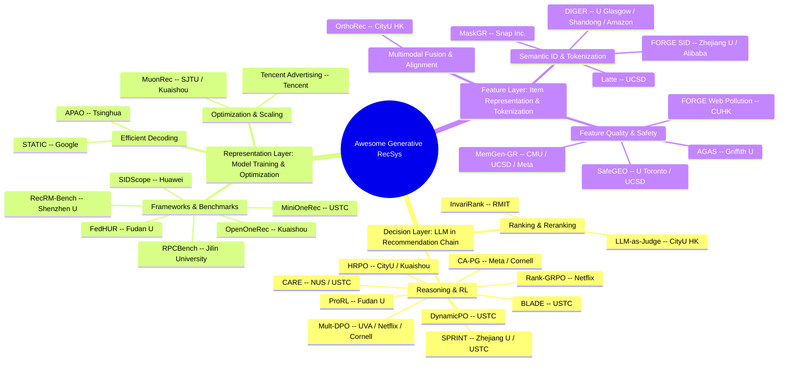

# Awesome Generative Recommendation System (RecSys)

```
 ██████╗                ██████╗                ███████╗                
██╔════╝  ███╗  ███╗    ██╔══██╗ ███╗   ███╗   ██╔════╝██╗ ██╗ ██████╗ 
██║      ██╔═██╗████╗   ██████╔╝██╔═██╗██╔═██╗ ███████╗╚██╗██║ ██╔═══╝ 
██║  ███╗██████║██╔██╗  ██╔══██╗██████║██║ ╚═╝ ╚════██║ ╚███╔╝ ██████╗ 
██║   ██║██║    ██║╚██╗ ██║  ██║██║    ██║ ██╗      ██║  ██╔╝      ██║
╚██████╔╝╚████╗ ██║ ╚██╗██║  ██║╚████╗ ╚███╔═╝ ███████║  ██║   ██████║
 ╚═════╝  ╚═══╝ ╚═╝  ╚═╝╚═╝  ╚═╝ ╚═══╝  ╚══╝   ╚══════╝  ╚═╝   ╚═════╝
```
---

[](https://github.com/sindresorhus/awesome)

RecSys is starting to adopt LLM for feature extraction, retrieval, and ranking/re-ranking! Although you can get some hands-on materials in either the [classics](#papers-classic-must-read) or some surveys, but since you're already interested in applying generative AI to industrial tasks, you probably wanna stay on the bleeding edge, right? That's exactly what this repo is for — automatically updated daily by agents with the latest generative RecSys papers fresh off arXiv, making sure that you never miss a beat.

> [!IMPORTANT]
> For those who are not familiar with GenRec, or not even the recommendation system, please checkout the kickstart posts [here](docs/kickstart.md).
> These posts are in Chinese, for English simply do your browser's internal translation or turn to __Ask Gemini__ :shipit:

## Quick Indexing
- [By Date](#by-date)
- [By Opensource](#by-opensource)
- [By Keyword](#by-keyword)
- [By Affiliation](#by-affiliation)
- [Papers Classic Must Read](#papers-classic-must-read)
- [Verl-GR: An Awesome RL Toolkit for GenRecSys](#verl-gr-an-awesome-rl-toolkit-for-genrecsys)


```mermaid
mindmap
  root((Awesome Generative RecSys))
    Decision Layer: LLM in Recommendation Chain
      Reasoning & RL
        Rank-GRPO -- Netflix
        DynamicPO -- USTC
        BLADE -- USTC
        SPRINT -- Zhejiang U / USTC
        CARE -- NUS / USTC
        HRPO -- CityU / Kuaishou
        Mult-DPO -- UVA / Netflix / Cornell
        CA-PG -- Meta / Cornell
        ProRL -- Fudan U
      Ranking & Reranking
        InvariRank -- RMIT
        LLM-as-Judge -- CityU HK
    Representation Layer: Model Training & Optimization
      Frameworks & Benchmarks
        MiniOneRec -- USTC
        OpenOneRec -- Kuaishou
        RecRM-Bench -- Shenzhen U
        SIDScope -- Huawei
        RPCBench -- Jilin University
        FedHUR -- Fudan U
      Efficient Decoding
        STATIC -- Google
        APAO -- Tsinghua
      Optimization & Scaling
        MuonRec -- SJTU / Kuaishou
        Tencent Advertising -- Tencent
    Feature Layer: Item Representation & Tokenization
      Semantic ID & Tokenization
        Latte -- UCSD
        FORGE SID -- Zhejiang U / Alibaba
        DIGER -- U Glasgow / Shandong / Amazon
        MaskGR -- Snap Inc.
      Multimodal Fusion & Alignment
        OrthoRec -- CityU HK
      Feature Quality & Safety
        SafeGEO -- U Toronto / UCSD
        MemGen-GR -- CMU / UCSD / Meta
        FORGE Web Pollution -- CUHK
        AGAS -- Griffith U
```
<div align="center">
  <i> Open-source Generative RecSys Map </i>
</div>

---
## `Verl-GR`: An Awesome RL Toolkit for GenRecSys
If you are interested in RFT your own GenRecSys, come check out our `verl`-based implementation called `verl-gr` here:
* [https://github.com/HaFred/verl-GR/tree/main/verl_gr/recipes/openonerec](https://github.com/HaFred/verl-GR/tree/main/verl_gr/recipes/openonerec)
* [https://github.com/HaFred/verl-GR/tree/main/verl_gr/recipes/rankgrpo](https://github.com/HaFred/verl-GR/tree/main/verl_gr/recipes/rankgrpo)

We manage to achieve 22% and 32% boosting for the end-to-end training efficiencies, compared with their respective vanilla implementations.

## By Date

### Papers September 11

*Friday, September 11, 2026. arXiv Thursday (Sep 10) announcement batch — cs.AI / cs.CL / cs.IR / cs.LG / stat.ML. 6 papers found (1 opensource). Note: the Friday Sep 11 batch had not posted at scan time, so the "last 24h" window maps to the Sep 10 batch; it is agentic/e-commerce/industrial-heavy with no new SID/tokenization method. Core: Auto-RecSys (Meta autonomous research agents for industry-scale recsys), UniRec (Kuaishou cross-stage fusion, deployed), FedHUR (Fudan hierarchical federated rec, CIKM 2026, opensource), Agentic Share-of-Search (Georgia Tech seller-side LLM-commerce competitive intelligence), On the Regularization Landscape (Kent State linear-rec unification theory), GMMM (U Tokyo causal framework for generative-engine marketing).*

1. **Auto-RecSys: Harnessing Autonomous Research Agents for Industry-Scale Recommender System**
   * Affiliation: Meta — *(Ming Li, Dai Li, Xuying Ning, Bo Sun, Rui Li, Yi Zhang, Silvia Gong, Xuan Cao, Cornelia Carapcea, Qunshu Zhang, Zhigang Wang, Yinglong Xia, Andy Wang; Xuying Ning also UIUC)*
   * Link: [arxiv.org/abs/2609.10922](https://arxiv.org/abs/2609.10922)
   * Venue: arXiv preprint, September 2026 (cs.AI / cs.CL)
   * TL;DR: An autonomous research system that scales agentic hypothesis-generation/experimentation to industry-scale recommendation models whose training takes days, via parallel distributed execution and persistent cross-server memory.
   * Key techniques:
     - Distributed asynchronous execution for parallel multi-direction experiments across servers
     - Centralized cross-server memory for persistent, recoverable execution across sessions/failures
     - Cognitive-procedural separation: natural-language skill files steer LLM reasoning while deterministic scripts enforce correctness
     - Dual-loop self-evolution (Execution Evolution Loop for playbooks, Idea Evolution Loop for ideation)
   * Scores (Opensource? / Novelty / Fairness / Robustness / Impact):
     - **Opensource?: 0/10** — no public code available (Meta internal research infrastructure)
     - **Novelty: 7/10** — scaling autonomous research agents to multi-day industry rec experiments with self-evolving playbooks is a fresh system angle
     - **Fairness: 1/10** — not fairness-focused
     - **Robustness: 8/10** — robustness is the core design goal (recoverable execution, persistent memory, playbook maturation)
     - **Impact: 7/10** — Meta; cuts human time per experiment cycle on production recommendation models

2. **UniRec: Cross-stage Multi-Task Fusion with Preference Alignment for Cascaded Recommender Systems**
   * Affiliation: Kuaishou Technology — *(Lingyuan Kong, Jiaqi Cui, Fanjiao Zeng, Congqi Wang, Yu Li, Yuan Cheng, Jingxin Liu, Xiaoshuang Chen, Kaiqiao Zhan)*
   * Link: [arxiv.org/abs/2609.11052](https://arxiv.org/abs/2609.11052)
   * Venue: arXiv preprint, September 2026 (cs.IR); fully deployed on Kuaishou
   * TL;DR: Unified cross-stage (pre-ranking + ranking) fusion that trains both fusion agents in one computation graph with dual-axis preference alignment to remove cross-stage inconsistency in cascaded recommenders.
   * Key techniques:
     - Partially shared input embeddings trained in a single computation graph so gradients propagate across stages
     - Dual-axis preference alignment: vertical cross-stage consistency + horizontal compact aggregation over heterogeneous prior signals
     - Attribute group-relative regularization to stop end-to-end fusion over-concentrating on high-reward regions
     - Online A/B: +0.616% app usage duration; fully deployed
   * Scores (Opensource? / Novelty / Fairness / Robustness / Impact):
     - **Opensource?: 0/10** — no public code available
     - **Novelty: 6/10** — joint cross-stage fusion optimization is under-explored vs. intra-stage multi-objective fusion
     - **Fairness: 4/10** — attribute group-relative regularization addresses item-attribute distribution imbalance
     - **Robustness: 6/10** — deployed in production with online A/B validation
     - **Impact: 7/10** — Kuaishou production deployment; large-scale industrial cascade

3. **FedHUR: Learning Hierarchical Utility-Guided Client Relations for Personalized Federated Recommendation**
   * Affiliation: Fudan University — *(Mingzhe Han, Jiahao Liu, Dongsheng Li, Jiankui Zhou, Hansu Gu, Peng Zhang, Ning Gu, Tun Lu; Dongsheng Li also Microsoft Research Asia)*
   * Link: [arxiv.org/abs/2609.11632](https://arxiv.org/abs/2609.11632)
   * Venue: CIKM 2026
   * TL;DR: Federated recommendation that learns hierarchical, utility-guided client relations from item-item filters so each client aggregates only the collaborators that actually improve its prediction, replacing predefined single-global-relation assumptions.
   * Key techniques:
     - Item-item filters as the object for relation construction and aggregation
     - Hierarchical clustering of client information into global multi-granularity structure
     - Hierarchical utility signals indicating which collaborative information helps each client
     - Server retrieves useful clients per target for personalized aggregation; SOTA on 5 datasets
   * Scores (Opensource? / Novelty / Fairness / Robustness / Impact):
     - **Opensource?: 7/10** — [github.com/Mingzhe-Han/FedHUR](https://github.com/Mingzhe-Han/FedHUR) — complete code (flalgorithm/model/entry/config + datasets) with runnable README, but minimal docs, no license, 1 star
     - **Novelty: 6/10** — hierarchical utility-guided client relations generalize single-relation personalized aggregation
     - **Fairness: 5/10** — federated privacy-preserving personalization; utility signals reduce harmful cross-client aggregation
     - **Robustness: 6/10** — consistent gains across five real-world datasets
     - **Impact: 6/10** — CIKM 2026; open-source federated rec framework

4. **Agentic Share-of-Search: A Multi-Agent AI System for Competitive Decision-Making in LLM-Mediated E-Commerce**
   * Affiliation: Georgia Institute of Technology — *(Spandan Ghose Chowdhury, College of Computing)*
   * Link: [arxiv.org/abs/2609.11190](https://arxiv.org/abs/2609.11190)
   * Venue: 2026 Decision Science Institute (DSI) Annual Conference
   * TL;DR: A seller-side multi-agent system that measures "Agentic Share-of-Search" (how often an LLM shopping assistant surfaces a retailer's products) and diagnoses root causes via a ReAct agent that recommends merchandising interventions.
   * Key techniques:
     - Agentic Share-of-Search (ASoS): retailer-attribution-weighted visibility metric robust to entity-resolution noise
     - Query agents deployed across leading AI shopping platforms
     - ReAct-based diagnostic agent for root-cause attribution and intervention recommendation
     - 100-trial ablation: recovers ablated signal in 39% (5.5x chance), 63.9% on high-correlation ablations
   * Scores (Opensource? / Novelty / Fairness / Robustness / Impact):
     - **Opensource?: 0/10** — no public code available (prototype)
     - **Novelty: 7/10** — seller-side ASoS metric + diagnostic agent is a fresh inversion of generative commerce evaluation
     - **Fairness: 6/10** — retailer-attribution weighting addresses measurement fairness across sellers
     - **Robustness: 5/10** — 100-trial ablation with CIs; prototype feasibility stage
     - **Impact: 5/10** — DSI 2026; emerging LLM-mediated e-commerce decision support

5. **On the Regularization Landscape for the Linear Recommendation Models**
   * Affiliation: Kent State University — *(Dong Li, Ruoming Jin, Hao Zhou — Kent State; Zhenming Liu, Bin Ren — College of William & Mary; Zhi Liu, Jing Gao — iLambda)*
   * Link: [arxiv.org/abs/2609.11876](https://arxiv.org/abs/2609.11876)
   * Venue: arXiv preprint, September 2026 (cs.AI)
   * TL;DR: Unifies recent linear recommendation performance-leaders under two regularizers (nuclear-norm vs Frobenius-norm) and derives two new low-rank closed-form solutions that capture the best of both worlds.
   * Key techniques:
     - Shows all linear leaders effectively add only a nuclear-norm or Frobenius-norm regularizer
     - Nuclear-norm models: low-rank + closed-form but rigid/limited; Frobenius-norm models: expressive but full-rank/hard-to-tune (ADMM)
     - Two new low-rank, closed-form solutions generalizing Frobenius-norm regularizers
   * Scores (Opensource? / Novelty / Fairness / Robustness / Impact):
     - **Opensource?: 0/10** — no public code available (theory paper)
     - **Novelty: 6/10** — a unifying regularization taxonomy plus closed-form constructions
     - **Fairness: 3/10** — not fairness-focused (low-rank structure touches expressiveness only)
     - **Robustness: 6/10** — closed-form solutions with theoretical guarantees
     - **Impact: 5/10** — academic theory; clarifies the "barebones engine" behind linear rec models

6. **Generative Marketing Mix Modeling: A Causal Inference Framework Linking GEO and GEM to Business Impact**
   * Affiliation: The University of Tokyo — *(Masahiro Kato; also Mizuho-DL Financial Technology Co., Ltd.)*
   * Link: [arxiv.org/abs/2609.11915](https://arxiv.org/abs/2609.11915)
   * Venue: arXiv preprint, September 2026 (stat.ML / cs.AI / cs.LG / econ.EM)
   * TL;DR: Extends marketing mix modeling to measure the causal effects of Generative Engine Optimization (GEO) and Generative Engine Marketing (GEM) by combining generated-answer occurrence counts with question counts, platform share, and notice probabilities.
   * Key techniques:
     - GEO/GEM inputs: occurrence probability x question counts x system share x notice probability
     - Carryover + Hill saturation transformations before the response model, matching classic MMM
     - Sequence-level treatment-effect comparison under alternative treatment paths
     - Bayesian cut-posterior averaging over measurement uncertainty; eval on simulated product-recommendation answers (EN/JA)
   * Scores (Opensource? / Novelty / Fairness / Robustness / Impact):
     - **Opensource?: 0/10** — no public code available
     - **Novelty: 7/10** — first causal-inference framework for GEO/GEM business attribution
     - **Fairness: 4/10** — identification/measurement rigor (notice probabilities, measurement error) rather than fairness per se
     - **Robustness: 6/10** — sufficient identification conditions + Bayesian uncertainty
     - **Impact: 6/10** — generative commerce/marketing measurement; econometrics + ML relevance

### Papers September 10

*Thursday, September 10, 2026. arXiv Wednesday (Sep 9) announcement batch — cs.IR / cs.CL / cs.AI / cs.LG. 6 papers found (2 opensource). Note: the Thursday Sep 10 batch had not posted at scan time, so the "last 24h" window maps to the Sep 9 batch; it is personalization/security/evaluation-heavy with no new SID/generative-retrieval method. Core: AGAS (Griffith U agentic group shilling attack, opensource), HyperTrace (JHU hypothesis-based LLM preference tracing, EMNLP 2026 Findings, opensource), PRAGMA (SNU personalized-guidance benchmark), Purchase Advice (Aiso real-conversation purchase audit), LLM Relevance Judge tone (RecSys 2026 reproducibility), Kernel-Managed Shared Memory (Rutgers system-wide personalization).*

1. **An Efficient and Effective Agentic Group Shilling Attack on Recommender Systems (AGAS)**
   * Affiliation: Griffith University — *(Quoc Viet Nguyen, Quoc Viet Hung Nguyen, Thanh Tam Nguyen; also Edith Cowan University, University of Queensland, HUTECH University)*
   * Link: [arxiv.org/abs/2609.09551](https://arxiv.org/abs/2609.09551)
   * Venue: arXiv preprint, September 2026 (cs.CR / cs.CL)
   * TL;DR: A coordinated multi-agent shilling framework where a central Coordinator directs role-switching worker agents to adaptively promote a target item across victim families while evading detection.
   * Key techniques:
     - Central Coordinator + role-switching worker agents pursuing a shared promotion objective
     - Adaptive strategy adjustment when progress stalls or suppression signals rise
     - Active/inactive role alternation to avoid repetitive, detectable patterns
     - Outperforms strong baselines in target promotion while preserving benign recommendation quality and weakening representative detectors
   * Scores (Opensource? / Novelty / Fairness / Robustness / Impact):
     - **Opensource?: 7/10** — [github.com/phkhanhtrinh23/AGAS](https://github.com/phkhanhtrinh23/AGAS) — clean src/configs/tests/docs layout with pyproject+requirements, but no license and 2 stars (early stage)
     - **Novelty: 7/10** — group-coordinated, role-switching agentic attack generalizes beyond target-specific single-agent shilling
     - **Fairness: 8/10** — directly targets RS integrity/robustness and surfaces the need for adaptive defenses
     - **Robustness: 7/10** — consistent gains under matched budgets + evasion of representative detectors
     - **Impact: 6/10** — recsys security; red-team for shilling-resilient recommenders

2. **HyperTrace: Hypothesis-Based Preference Tracing for Online LLM Personalization**
   * Affiliation: Johns Hopkins University — *(also Institute of Science Tokyo)*
   * Link: [arxiv.org/abs/2609.09835](https://arxiv.org/abs/2609.09835)
   * Venue: EMNLP 2026 Findings
   * TL;DR: A training-free framework that traces latent user preferences as interpretable natural-language hypotheses (short-term intent + long-term preference), updated via SMC-style reweighting with an LLM surrogate choice model.
   * Key techniques:
     - Natural-language hypothesis state over short-term intent and long-term preferences
     - SMC-style hypothesis reweighting using an LLM-based surrogate choice model
     - Cross-turn / cross-session updates without any parameter updates
     - Improves response alignment, preference prediction, and profile consistency on PRISM and PersonaMem-v2
   * Scores (Opensource? / Novelty / Fairness / Robustness / Impact):
     - **Opensource?: 6/10** — [github.com/jiseshen/HyperTrace](https://github.com/jiseshen/HyperTrace) — functional core/model/eval/config code, but no README at root and no license
     - **Novelty: 7/10** — SMC-style latent-preference tracing is a fresh training-free alternative to memory retrieval
     - **Fairness: 3/10** — not fairness-focused
     - **Robustness: 6/10** — robust across turns/sessions; strong online baselines compared
     - **Impact: 5/10** — EMNLP 2026 Findings; LLM personalization

3. **PRAGMA: Evaluating Personalized Guidance with Memory Alignment in Lifelong Conversations**
   * Affiliation: Seoul National University
   * Link: [arxiv.org/abs/2609.09664](https://arxiv.org/abs/2609.09664)
   * Venue: arXiv preprint, September 2026 (cs.AI)
   * TL;DR: A benchmark for personalized guidance (recommendations, planning, decision support) in long-term LLM conversations, with evidence annotations and evolving user-context scenarios.
   * Key techniques:
     - Curated longitudinal conversation histories with evidence annotations
     - Guidance scenarios grounded in evolving user contexts and incorrect user assumptions
     - Evaluates retrieval systems, memory systems, and long-context models
   * Scores (Opensource? / Novelty / Fairness / Robustness / Impact):
     - **Opensource?: 0/10** — no public code/data announced
     - **Novelty: 6/10** — first benchmark targeting personalized guidance beyond factual recall
     - **Fairness: 4/10** — focuses on memory alignment, not user-fairness
     - **Robustness: 5/10** — reveals a wide robustness gap in current memory systems
     - **Impact: 5/10** — SNU; benchmark for memory-grounded recommendation agents

4. **Purchase Advice and Observable Buyer Responses in Real AI Conversations**
   * Affiliation: Aiso
   * Link: [arxiv.org/abs/2609.09878](https://arxiv.org/abs/2609.09878)
   * Venue: arXiv preprint, September 2026 (cs.IR)
   * TL;DR: An audit of 317 real AI-assistant conversations showing recommendation content is observable far more often than the buyer's subsequent decision, exposing a fundamental measurement limitation.
   * Key techniques:
     - Audit of 317 licensed, consent-based, de-identified conversations (Apr 2023–Jul 2025)
     - Single-agent AI screening for purchase-directed records (68 episodes)
     - Operational definitions + text-free annotations + reproducible descriptive statistics
   * Scores (Opensource? / Novelty / Fairness / Robustness / Impact):
     - **Opensource?: 0/10** — observational audit, no code released
     - **Novelty: 5/10** — measurement-limitation audit rather than a new method
     - **Fairness: 5/10** — audits persuasion/advice asymmetry in AI commerce
     - **Robustness: 3/10** — small sample, unvalidated AI annotations, no causal claims
     - **Impact: 4/10** — Aiso; informs evaluation of conversational commerce assistants

5. **Should I Be Polite to My LLM Relevance Judge? Tone as a Severity Operating-Point Shift**
   * Affiliation: Independent Researcher
   * Link: [arxiv.org/abs/2609.09703](https://arxiv.org/abs/2609.09703)
   * Venue: RecSys 2026 (Reproducibility & Practice Notes)
   * TL;DR: Prompt tone shifts an LLM relevance judge's overall scoring leniency rather than improving judgment, a validity threat when absolute relevance labels matter.
   * Key techniques:
     - 3,498 TREC DL19/DL20 query-passage pairs × 8 judge models × 5 politeness levels × 3 paraphrases
     - Severity operating-point account (Spearman ρ = −0.683; permutation p = 0.019)
     - Separates calibration-based agreement shifts from ranking changes (NDCG@10 ≤ 0.011)
   * Scores (Opensource? / Novelty / Fairness / Robustness / Impact):
     - **Opensource?: 0/10** — no public code
     - **Novelty: 6/10** — tone-as-operating-point reconciles contradictory prior findings
     - **Fairness: 6/10** — flags a validity threat to judge reliability/fairness
     - **Robustness: 5/10** — model-dependent effects with a held-out cross-fit
     - **Impact: 5/10** — RecSys 2026; LLM-as-judge evaluation practice

6. **Kernel-Managed Shared Memory for System-Wide Personalization**
   * Affiliation: Rutgers University
   * Link: [arxiv.org/abs/2609.10144](https://arxiv.org/abs/2609.10144)
   * Venue: arXiv preprint, September 2026 (cs.AI / cs.LG)
   * TL;DR: Centralizes multi-agent memory retrieval/privacy/prompt-injection in an agent-system kernel (AIOS), delivering most of the personalization benefit of full context at a fraction of its cost.
   * Key techniques:
     - Kernel-governed retrieval, privacy enforcement, and prompt injection for tagged agent memories
     - 1,800 trials across 3 assistant models (GPT-4o, Llama-3.1:8B, Qwen-2.5:7B)
     - +2.4–4.0 personalization points vs. unmanaged Mem0 (p < 10⁻¹⁸); 15–61% lower latency
   * Scores (Opensource? / Novelty / Fairness / Robustness / Impact):
     - **Opensource?: 0/10** — no public code (evaluated on AIOS)
     - **Novelty: 6/10** — kernel-managed memory is a principled system-level answer to cross-agent personalization
     - **Fairness: 4/10** — privacy enforcement as a first-class concern
     - **Robustness: 6/10** — large trial count, three models, statistical significance
     - **Impact: 5/10** — Rutgers (Yongfeng Zhang); multi-agent personalization systems

### Papers September 09

*Wednesday, September 9, 2026. arXiv Tuesday (Sep 8) announcement batch — cs.IR / cs.AI. 6 papers found (2 opensource). Core: SequenceO1 (ByteDance/Douyin ultra-long 100K sequence modeling, RecSys 2026 Industry long oral), FINALLY (U Siegen dataset recommender, RecSys 2026 demo, opensource), REDSI (IRISA Rennes first open-source DSI implementation, opensource), PDMR (IRIT Toulouse passage-driven multi-ID generative retrieval), Bottom-Up Clustering for Semantic IDs (Cornell workshop), A-MLE (Google agentic ML exploration for ads ranking).*

1. **SequenceO1: End-to-End Ultra-Long (100K) Sequence Modeling in Recommendation with Low-Rank Caching**
   * Affiliation: ByteDance (Douyin)
   * Link: [arxiv.org/abs/2609.08443](https://arxiv.org/abs/2609.08443)
   * Venue: RecSys 2026 Industry Track (long oral)
   * TL;DR: A compress-then-reason framework for ultra-long user-behavior sequence modeling, deployed at full traffic on Douyin with histories of up to 100K interactions.
   * Key techniques:
     - Sketch Attention (SA): learnable prototypes + prototype-wise normalization compress the raw history into a fixed-size, target-agnostic user representation
     - Stacked Target-to-History Cross Attention (STCA): a recent 10K suffix for short-term interests + the compact sketch for long-term preferences
     - Low-rank user representation caching, multi-request user-level batching, pipeline lift, and a fused FlashSA kernel amortize storage/communication/compute
   * Scores (Opensource? / Novelty / Fairness / Robustness / Impact):
     - **Opensource?: 0/10** — no public code available (industrial, deployed at Douyin)
     - **Novelty: 7/10** — compress-then-reason with prototype-based sketch attention is a fresh end-to-end answer to 100K-sequence ranking
     - **Fairness: 3/10** — not fairness-focused
     - **Robustness: 8/10** — consistent offline + online gains at full Douyin traffic
     - **Impact: 8/10** — RecSys 2026 Industry long oral; billion-scale production deployment

2. **FINALLY: A Dataset Recommender System for Recommender-Systems Research**
   * Affiliation: University of Siegen
   * Link: [arxiv.org/abs/2609.08941](https://arxiv.org/abs/2609.08941)
   * Venue: RecSys 2026 Demo (also Bachelor's thesis, University of Siegen, 2026)
   * TL;DR: A web-based dataset recommender that constructs configurable dataset sets (90+ datasets) for offline RecSys evaluation via Effective-Covariance / Convex-Hull diversity objectives.
   * Key techniques:
     - Required-dataset + candidate-pool restrictions + metadata filters with configurable target-set sizes
     - Diverse and non-diverse strategies via adapted Effective Covariance and Convex Hull objectives
     - 420 recommendation runs across ten configurations; all deterministic strategy-configuration combinations reproducible
   * Scores (Opensource? / Novelty / Fairness / Robustness / Impact):
     - **Opensource?: 7/10** — live system (finally.recommender-systems.com) + source at code.isg.beel.org/FINALLY; public, operational, 90+ datasets
     - **Novelty: 6/10** — first operational dataset-set recommender for RecSys experiments (vs. manual/convention-driven selection)
     - **Fairness: 4/10** — addresses dataset-selection concentration/bias, not user-facing fairness
     - **Robustness: 6/10** — 420 runs, reproducible deterministic strategies, constraint satisfaction verified
     - **Impact: 6/10** — RecSys 2026 demo; targets the under-addressed dataset-selection gap

3. **REDSI: Addressing the Reproducibility and Evaluation Consistency of Differentiable Search Indexing for Document Retrieval**
   * Affiliation: IRISA / Université de Rennes
   * Link: [arxiv.org/abs/2609.08860](https://arxiv.org/abs/2609.08860)
   * Venue: arXiv preprint, September 2026 (cs.IR)
   * TL;DR: ReDSI — the first open-source DSI implementation covering all three document identifier types (atomic, naive, semantic) plus a parameterizable, well-documented NQ320K construction pipeline.
   * Key techniques:
     - Unified open-source DSI supporting atomic / naive / semantic identifier types
     - Parameterizable and well-documented NQ320K construction pipeline from Natural Questions
     - Model-downscaling experiments across retrieval effectiveness, parameter efficiency, training methods, and decoding strategies
   * Scores (Opensource? / Novelty / Fairness / Robustness / Impact):
     - **Opensource?: 7/10** — open-source ReDSI (repo linked in paper); first to cover all three ID types + documented NQ320K pipeline
     - **Novelty: 6/10** — reproducibility/consistency contribution rather than a new method
     - **Fairness: 3/10** — not fairness-focused
     - **Robustness: 7/10** — competitive-or-stronger results vs. DSI baselines under downscaling
     - **Impact: 6/10** — fixes a long-standing DSI reproducibility gap for generative retrieval

4. **PDMR: Passage-Driven Multi-ID Document Retrieval**
   * Affiliation: IRIT, Université de Toulouse
   * Link: [arxiv.org/abs/2609.08762](https://arxiv.org/abs/2609.08762)
   * Venue: arXiv preprint, September 2026 (cs.IR)
   * TL;DR: A generative retrieval framework that gives each document multiple passage-level identifiers as semantic entry points, with a multi-target objective distributing probability mass across valid passage IDs.
   * Key techniques:
     - Document segmentation + one identifier per selected passage (multi-entry representation)
     - Multi-target learning to resolve the one-to-many supervision ambiguity
     - Passage-level supervision, identifier design, and training-query augmentation ablations
   * Scores (Opensource? / Novelty / Fairness / Robustness / Impact):
     - **Opensource?: 0/10** — no public code available
     - **Novelty: 6/10** — multi-ID passage-level entry points is a clean extension beyond single-ID generative retrieval
     - **Fairness: 3/10** — not fairness-focused
     - **Robustness: 6/10** — gains on NQ320K + MS MARCO Document with controlled ablations
     - **Impact: 5/10** — advances generative retrieval for multi-faceted documents

5. **Exploring Bottom-Up Clustering for Creating Semantic IDs**
   * Affiliation: Cornell University
   * Link: [arxiv.org/abs/2609.08310](https://arxiv.org/abs/2609.08310)
   * Venue: Workshop paper (arXiv, cs.IR / cs.AI)
   * TL;DR: Bottom-up (agglomerative) clustering to build unique, embedding-structure-preserving Semantic IDs for downstream generative retrieval.
   * Key techniques:
     - Bottom-up clustering preserves local embedding-space structure (vs. top-down residual quantization)
     - Uniqueness guarantee + structure preservation for each identifier
     - Improved clustering quality and downstream generative-retrieval utility
   * Scores (Opensource? / Novelty / Fairness / Robustness / Impact):
     - **Opensource?: 0/10** — no public code available
     - **Novelty: 6/10** — bottom-up (vs. top-down) clustering for SID construction is an under-explored direction
     - **Fairness: 3/10** — not fairness-focused
     - **Robustness: 5/10** — workshop-scale evaluation, limited benchmarks
     - **Impact: 5/10** — informs SID tokenization design for generative retrieval

6. **Agentic ML Exploration (A-MLE) for Ads Ranking**
   * Affiliation: Google
   * Link: [arxiv.org/abs/2609.08248](https://arxiv.org/abs/2609.08248)
   * Venue: arXiv preprint, September 2026 (cs.AI)
   * TL;DR: An autonomous LLM-agent system that systematically explores ML techniques across a portfolio of ads-ranking models, decomposing ML iteration into five stages with human-in-the-loop checkpoints.
   * Key techniques:
     - Five-stage decomposition: hypothesis generation, exploration strategy, experiment execution, result analysis, shared knowledge substrate
     - Sandboxed execution layer + domain-specific skills + agentic workflows
     - Cross-LLM study (Claude Sonnet, Gemini, GPT) of execution reliability and exploration aggressiveness
   * Scores (Opensource? / Novelty / Fairness / Robustness / Impact):
     - **Opensource?: 0/10** — no public code available
     - **Novelty: 7/10** — agentic ML exploration as a force multiplier for industrial recommenders is an emerging, underexplored direction
     - **Fairness: 3/10** — not fairness-focused
     - **Robustness: 6/10** — tiered capability framework + failure-mode analysis, but qualitative
     - **Impact: 7/10** — Google ads ranking; targets the long tail of models lacking expert attention

### Papers September 08

*Tuesday, September 8, 2026. arXiv Monday (Sep 7) announcement batch — cs.IR / cs.AI / cs.LG. 7 papers found (2 opensource). Core: SAM-D2Q (Alibaba/AliExpress multimodal Doc2Query, CIKM 2026 Oral), Distill Globally Adapt Locally (Amazon trade-up recommendation distillation, GenAIECommerce @ RecSys 2026), AutoLR (NetEase autonomous research-to-launch harness), Embedding Surgery (IIT-CNR Pisa dense-retrieval ranking correction, CIKM 2026, opensource); plus RegionFed (Walmart federated retail search), SAGE (Korea University visual retrieval, EMNLP 2026 Main, opensource), IGPO (Alibaba Taobao training-free AI search, EMNLP 2026 Industry).*

1. **SAM-D2Q: Aligning Multimodal Doc2Query with Search Demand and Conversion for E-commerce**
   * Affiliation: Alibaba International Digital Commerce Group (AliExpress)
   * Link: [arxiv.org/abs/2609.04961](https://arxiv.org/abs/2609.04961)
   * Venue: CIKM 2026 (Oral Full Paper)
   * TL;DR: A business-aligned multimodal Doc2Query framework that SFTs a vision-language model, augments visual attributes, then RL-aligns pseudo-query generation toward search conversion — deployed in AliExpress (+3.38% GMV, +2.27% Pay Count).
   * Key techniques:
     - Task-adapted multimodal supervised fine-tuning over product titles, images, and user queries
     - Multimodal data augmentation for key visual-attribute perception and expansion coverage
     - Reinforcement-learning preference alignment toward search business objectives under Boolean-retrieval constraints
   * Scores (Opensource? / Novelty / Fairness / Robustness / Impact):
     - **Opensource?: 0/10** — no public code available (industrial, deployed in AliExpress)
     - **Novelty: 7/10** — pairing multimodal Doc2Query with RL-based business-objective alignment is a fresh step beyond text-only document expansion
     - **Fairness: 3/10** — not fairness-focused
     - **Robustness: 7/10** — offline gains plus a deployed online A/B (GMV +3.38%, Pay Count +2.27%)
     - **Impact: 8/10** — CIKM 2026 Oral, production AliExpress search system

2. **Distill Globally, Adapt Locally: Reasoning Distillation and Product-Type Test-Time Training for Scalable Trade-Up Recommendation**
   * Affiliation: Amazon (Everyday Essentials Technologies)
   * Link: [arxiv.org/abs/2609.05363](https://arxiv.org/abs/2609.05363)
   * Venue: GenAIECommerce 2026 Workshop @ ACM RecSys 2026
   * TL;DR: Distills LLM trade-up reasoning into a 15.5M-param embedding-pair classifier, then adapts the decision boundary per product type via test-time training (AUC 0.924 → 0.941), ~5,000× faster than direct LLM inference.
   * Key techniques:
     - Retrieval-augmented few-shot LLM teacher emits structured relation labels + natural-language rationales
     - Alignment + contrastive distillation into a compact embedding-pair student (no LLM calls at inference)
     - Product-type test-time training (PT-TTT) with lightweight category-specific adapters over the frozen student
   * Scores (Opensource? / Novelty / Fairness / Robustness / Impact):
     - **Opensource?: 0/10** — no public code available
     - **Novelty: 7/10** — reasoning distillation + category-specific TTT for a recommendation decision boundary is a clean, practical contribution
     - **Fairness: 3/10** — not fairness-focused
     - **Robustness: 7/10** — fixed 8,352-pair benchmark with reported 95% CIs; AUC 0.924 → 0.941
     - **Impact: 7/10** — Amazon, GenAIECommerce @ RecSys 2026; 5,000× speedup / 10,000× cost reduction vs. LLM

3. **AutoLR: Automating the Path from Research to Launch Review in Industrial Recommender Systems**
   * Affiliation: NetEase Games (Fuxi AI Lab)
   * Link: [arxiv.org/abs/2609.04871](https://arxiv.org/abs/2609.04871)
   * Venue: arXiv preprint, September 2026 (cs.AI)
   * TL;DR: An autonomous research-to-launch harness for NetEase's DASHEN gaming-community recommender that coordinates a multi-expert council, a deterministic evidence-weighted explore-exploit selector, and layered knowledge to drive multi-day experiment cycles through launch review.
   * Key techniques:
     - Multi-expert council that debates and adversarially reviews proposals
     - Deterministic evidence-weighted exploration–exploitation selector allocating a limited trial budget with Council reranking
     - Layered knowledge system combining external research, production knowledge, and DASHEN domain knowledge
   * Scores (Opensource? / Novelty / Fairness / Robustness / Impact):
     - **Opensource?: 0/10** — no public code available
     - **Novelty: 7/10** — an end-to-end autonomous harness from research reproduction to launch review is a distinct, underexplored angle for industrial recsys
     - **Fairness: 4/10** — adversarial council review provides some guardrails, but not a fairness contribution
     - **Robustness: 6/10** — deployed in DASHEN over long-running, multi-day cycles
     - **Impact: 7/10** — NetEase; targets the recsys research-to-production automation bottleneck

4. **Embedding Surgery: Localized Updates for Adaptive Ranking Correction in Dense Retrieval**
   * Affiliation: IIT-CNR, Pisa (Italian National Research Council)
   * Link: [arxiv.org/abs/2609.05110](https://arxiv.org/abs/2609.05110)
   * Venue: CIKM 2026
   * TL;DR: A query-time convex-optimization "surgery" that applies localized, minimal edits to document embeddings — guided by editorial, click, or LLM feedback — to fix stale rankings without re-indexing (up to +60.64% relative nDCG@10 on DL-Hard).
   * Key techniques:
     - Embedding surgery formulated as convex optimization enforcing ranking constraints while minimizing representation drift
     - Symmetric / demotion / promotion update variants for different feedback signals
     - Safe in-place ANN index overwriting (no reconstruction); complements query-adaptation methods such as CoRocchio
   * Scores (Opensource? / Novelty / Fairness / Robustness / Impact):
     - **Opensource?: 7/10** — [github.com/maddalena-amendola/Embedding-Surgery](https://github.com/maddalena-amendola/Embedding-Surgery) — complete pipeline (embedding_surgery, corocchio, llm, index/generate utils), clean module split, README; no license/tests yet
     - **Novelty: 6/10** — localized query-time embedding correction as convex optimization is a well-motivated, pragmatic idea (adjacent to CoRocchio/query-side adaptation)
     - **Fairness: 4/10** — robust to noisy feedback, but not fairness-focused
     - **Robustness: 7/10** — TREC DL/Robust/CAsT + MS MARCO, consistent gains even under noisy/shifting feedback
     - **Impact: 6/10** — CIKM 2026; applicable to search, recommendation, and RAG pipelines

5. **RegionFed: Federated Learning for Personalized Query Understanding in Heterogeneous Retail Environments**
   * Affiliation: Walmart Global Tech
   * Link: [arxiv.org/abs/2609.05403](https://arxiv.org/abs/2609.05403)
   * Venue: arXiv preprint, September 2026 (cs.LG / cs.AI)
   * TL;DR: A gradient-level federated personalization framework that uses ℓ2 conflict between regional and global gradients to diagnose heterogeneity, route each region to the cheapest sufficient personalization strategy, and avoid the transformer collapse of parameter-level methods (92.27% accuracy).
   * Key techniques:
     - Gradient-level personalization treating models as differentiable black boxes (zero code changes across T5-Small/T5-3B/RoBERTa/CNN)
     - ℓ2 gradient-conflict as a unified signal for heterogeneity diagnosis + personalization-strength control
     - Differential privacy (ε≈0.60) and O(1/√T) convergence guarantees
   * Scores (Opensource? / Novelty / Fairness / Robustness / Impact):
     - **Opensource?: 0/10** — no public code available
     - **Novelty: 6/10** — operating personalization at the gradient level sidesteps a concrete transformer failure mode, though personalized FL is a mature area
     - **Fairness: 6/10** — regional personalization + differential privacy directly target cross-region equity and privacy
     - **Robustness: 7/10** — 3 datasets (Amazon ESCI/Reviews, LEAF-FEMNIST) and 4 architectures with consistent gains
     - **Impact: 6/10** — Walmart Global Tech; retail search across heterogeneous regions

6. **SAGE: Semantic Attribute Graphs for Multi-Entity Visual Retrieval**
   * Affiliation: Korea University
   * Link: [arxiv.org/abs/2609.04255](https://arxiv.org/abs/2609.04255)
   * Venue: EMNLP 2026 (Main)
   * TL;DR: A training-free framework that parses dense document images into hierarchical graph nodes with multi-vector embeddings and performs iterative entity-level subgraph matching to counter "semantic dilution" (R@3 0.849 on the new DEAR dataset).
   * Key techniques:
     - Semantic Dilution failure-mode quantification as a function of entity density
     - Hierarchical entity-graph parsing with multi-vector node embeddings
     - Iterative entity-level subgraph matching; DEAR benchmark (1,055 query–image pairs from product detail pages)
   * Scores (Opensource? / Novelty / Fairness / Robustness / Impact):
     - **Opensource?: 3/10** — [github.com/All4Nothing/SAGE](https://github.com/All4Nothing/SAGE) — repo announced but currently only a README placeholder (no code pushed yet)
     - **Novelty: 6/10** — training-free hierarchical graph representation for fine-grained visual retrieval is a clean idea
     - **Fairness: 3/10** — not fairness-focused
     - **Robustness: 6/10** — outperforms patch-level and OCR-based baselines on DEAR, but single-dataset evaluation
     - **Impact: 6/10** — EMNLP 2026 Main; product-detail retrieval

7. **Inventory-Grounded Policy-Level Optimization for Training-Free AI Search (IGPO)**
   * Affiliation: Alibaba (Taobao AI Search)
   * Link: [arxiv.org/abs/2609.04813](https://arxiv.org/abs/2609.04813)
   * Venue: EMNLP 2026 (Industry Track)
   * TL;DR: A training-free search optimization that separates Policy Guidelines from runtime inventory facts — online it probes inventory to build a "portrait" and injects relevant guidelines into retrieval/selection prompts (3.17% CTR lift, 38.9% fewer audited bad cases).
   * Key techniques:
     - Policy Guidelines decoupled from environment facts (no fine-tuning, RL, or static prompt patches)
     - Inventory grounding: runtime probing → inventory portrait → guideline injection
     - Contrastive signal from stochastic rollouts grouped by query; inventory-guided exploration loop
   * Scores (Opensource? / Novelty / Fairness / Robustness / Impact):
     - **Opensource?: 0/10** — no public code available
     - **Novelty: 6/10** — separating policy from environment facts for training-free adaptation is a sensible, production-oriented framing
     - **Fairness: 3/10** — not fairness-focused
     - **Robustness: 7/10** — deployed since May 2026; 14-day online A/B (CTR +3.17%, bad cases −38.9%)
     - **Impact: 7/10** — EMNLP 2026 Industry Track; commercial smart-assistant AI search

### Papers September 07

*Monday, September 7, 2026. arXiv Friday (Sep 4) announcement batch — cs.IR / cs.AI. 7 papers found (1 opensource). Core generative/agentic rec: AtomRec (XJTLU/Xiaohongshu evolving atomic memory), CGM-Rec (Phenikaa continual graph memory, EMNLP 2026 Findings), LARK (Xiaohongshu/SJTU latent-aligned VLM reasoning), MURAL (American U uncertainty-aware multimodal GNN); broader: Repeated Queries (LLM brand-rec saturation audit, opensource), PTDG (Huawei multi-task dependency graphs, CIKM 2026), AlleCompanion (Allegro complementary rec, RecSys 2026 OARS).*

1. **AtomRec: Evolving Atomic Memory for Agentic Recommendation**
   * Affiliation: Xi'an Jiaotong-Liverpool University / Xiaohongshu — *(with Peking University, East China Normal University, Beijing Jiaotong University)*
   * Link: [arxiv.org/abs/2609.04882](https://arxiv.org/abs/2609.04882)
   * Venue: arXiv preprint, September 2026 (cs.IR)
   * TL;DR: An agentic recommender that stores user/item memory as structured atomic units (not coarse summaries), links them semantically, and retrieves multi-hop evidence paths so fine-grained preference stages survive interest evolution.
   * Key techniques:
     - Atomic collaborative memory: user/item memories as structured atomic units with semantic links, evolved field-wise on new interactions
     - Multi-hop evidence-path retrieval (vs. isolated neighbor summaries) for grounded, evidence-aware ranking
     - ~8.5% average relative improvement over SOTA agentic and memory-augmented baselines on 4 public benchmarks
   * Scores (Opensource? / Novelty / Fairness / Robustness / Impact):
     - **Opensource?: 0/10** — no public code available
     - **Novelty: 7/10** — replacing coarse-summary memory with evolving atomic units + multi-hop evidence paths is a fresh, well-motivated advance for agentic-rec memory
     - **Fairness: 3/10** — not fairness-focused
     - **Robustness: 6/10** — 4 public benchmarks with consistent gains
     - **Impact: 7/10** — XJTLU/Xiaohongshu/PKU/ECNU/BJTU collaboration targeting the agentic-recommender memory bottleneck

2. **Continual Graph Memory for Adaptive Recommendation under Intent Drift (CGM-Rec)**
   * Affiliation: Phenikaa University, Vietnam — *(with Hanoi University of Science and Technology, University of Technology Sydney)*
   * Link: [arxiv.org/abs/2609.04651](https://arxiv.org/abs/2609.04651)
   * Venue: Findings of EMNLP 2026
   * TL;DR: Treats the KG as a writable memory — a conservative Semantic Graph Memory plus a fast Episodic Lesson Memory — so a frozen-parameter model adapts to intent drift purely through memory writes.
   * Key techniques:
     - Semantic Graph Memory updated via quality-gated typed operations for stable, high-confidence relational knowledge
     - Episodic Lesson Memory as a fast reactive store of recent outcomes, failures, and corrective hints
     - Frozen-parameter, one-pass reranking protocol; HR@1 up to +29.58% over the strongest LLM baseline on Bundle, HR@5 0.5941 vs 0.4746 (K-RagRec) on ML-100K
   * Scores (Opensource? / Novelty / Fairness / Robustness / Impact):
     - **Opensource?: 0/10** — only an anonymous review repo (anonymous.4open.science/r/CGM-17DD); no public code
     - **Novelty: 6/10** — writable graph memory for frozen-parameter intent-drift adaptation is a clean idea, though memory-augmented KG rec is well-trodden
     - **Fairness: 3/10** — not fairness-focused
     - **Robustness: 6/10** — multiple settings (Bundle, ML-100K, etc.) with consistent wins
     - **Impact: 7/10** — EMNLP 2026 Findings

3. **Latent-Aligned Reasoning for Multimodal Recommendation (LARK)**
   * Affiliation: Xiaohongshu / Shanghai Jiao Tong University
   * Link: [arxiv.org/abs/2609.04645](https://arxiv.org/abs/2609.04645)
   * Venue: arXiv preprint, September 2026 (cs.IR / cs.CL / cs.CV / cs.LG)
   * TL;DR: A two-stage latent reasoning framework inside a single VLM that uses learnable latent tokens as "visual checkpoints" to stop cross-modal dilution as visual/textual signals attenuate through multi-step reasoning.
   * Key techniques:
     - Learnable latent tokens interleaved with multi-step CoT and aligned to a frozen vision encoder, preserving perceptual detail throughout the chain
     - Bridge MLP + item-to-item contrastive learning; intermediate features aligned to first-stage CoT hidden states to anchor final embeddings to reasoning output
     - SOTA across 3 public benchmarks + 1 industrial dataset, with controlled ablations
   * Scores (Opensource? / Novelty / Fairness / Robustness / Impact):
     - **Opensource?: 0/10** — no public code available
     - **Novelty: 7/10** — diagnosing "cross-modal dilution" and using latent-token visual checkpoints inside VLM reasoning is a fresh angle for multimodal rec
     - **Fairness: 3/10** — not fairness-focused
     - **Robustness: 6/10** — 3 public + 1 industrial dataset with ablations
     - **Impact: 6/10** — Xiaohongshu/SJTU; strong SOTA but no venue/code yet

4. **MURAL: Multimodal Uncertainty-aware Recommendation via Adaptive edge Learning**
   * Affiliation: American University — *(with Ulsan National Institute of Science and Technology, Michigan State University, Independent Researcher)*
   * Link: [arxiv.org/abs/2609.04574](https://arxiv.org/abs/2609.04574)
   * Venue: arXiv preprint, September 2026 (cs.IR / cs.LG / cs.SI)
   * TL;DR: Moves multimodal GNN recommendation from fixed structural augmentation to dynamic topology discovery, with uncertainty-aware fusion that down-weights noisy modality signals.
   * Key techniques:
     - Adaptive Edge Learner: differentiable retrieval-augmented strategy + ANN search to discover latent item-item correlations in O(N log N)
     - Uncertainty-Aware Fusion models aleatoric uncertainty to down-weight unreliable modalities against cross-modal noise
     - Contrastive teacher-student alignment anchors modality representations to stable behavioral signals (no gradient leakage)
   * Scores (Opensource? / Novelty / Fairness / Robustness / Impact):
     - **Opensource?: 0/10** — no public code available
     - **Novelty: 6/10** — dynamic topology discovery + uncertainty-aware fusion is a solid, if incremental, evolution of multimodal GNN rec
     - **Fairness: 3/10** — not fairness-focused
     - **Robustness: 8/10** — large-scale TikTok/Amazon benchmarks, robustness shown under extreme data corruption
     - **Impact: 6/10** — beats both structural and generative SOTA baselines on multimodal rec

5. **Repeated Queries Exhaust an LLM's Brand Recommendations but Not Its Sources**
   * Affiliation: Estonian Entrepreneurship University of Applied Sciences
   * Link: [arxiv.org/abs/2609.05059](https://arxiv.org/abs/2609.05059)
   * Venue: arXiv preprint, September 2026 (cs.IR / cs.CL)
   * TL;DR: Shows non-retrieval LLMs keep adding never-seen brands even at run 15 (86–92% of cells) while retrieval-enabled engines saturate earlier — using exact rarefaction and Chao2 richness estimators.
   * Key techniques:
     - 300 question-engine cells (50 questions, 6 engines, 15 runs) over 1,470 adjudicated organizations with open extraction
     - Exact rarefaction + Chao2 richness; parallel fixed-roster extraction reproduces flat curves, showing roster-bounded tracking manufactures plateaus
     - Open-sources code, per-cell tables, and data pointers
   * Scores (Opensource? / Novelty / Fairness / Robustness / Impact):
     - **Opensource?: 7/10** — [github.com/Rankfor/rankfor-open](https://github.com/Rankfor/rankfor-open): well-organized repo (dice-roller + brand-detector + research/recommendation-saturation study), LICENSE, CITATION.cff, unit tests, docs; data archived on Zenodo (CC BY 4.0)
     - **Novelty: 5/10** — rigorous follow-up to the author's Dice Roll Method; rarefaction/Chao2 on recommendation saturation is a useful methodological addition
     - **Fairness: 8/10** — directly targets reliability/auditing of LLM recommendation output
     - **Robustness: 7/10** — exact estimators over 300 cells; large N
     - **Impact: 5/10** — single-author preprint; niche (brand-visibility auditing) but clean, reproducible methodology

6. **Personalized Task Dependency Graphs for Mitigating Signal Erosion in Multi-Task Recommendation (PTDG)**
   * Affiliation: Huawei Technologies Co., Ltd.
   * Link: [arxiv.org/abs/2609.04862](https://arxiv.org/abs/2609.04862)
   * Venue: CIKM 2026
   * TL;DR: Item-adaptive "rewiring" of task dependency pathways (low-rank) plus adaptive progressive masking to fix cumulative signal erosion in multi-task CTR.
   * Key techniques:
     - Low-rank dependency rewiring respects physical causal constraints (Click → Pay) while creating adaptive information shortcuts
     - GCN propagation with hard causal masking; Adaptive Progressive Masking (APM) decouples shared parameters by task sparsity
     - AUC up to +1.45% on sparse conversion tasks; online A/B +1.2% CVR, +1.9% eCPM
   * Scores (Opensource? / Novelty / Fairness / Robustness / Impact):
     - **Opensource?: 0/10** — no public code available
     - **Novelty: 6/10** — personalized task-dependency rewiring + APM is a thoughtful, pragmatic advance over static MTL funnels
     - **Fairness: 3/10** — not fairness-focused
     - **Robustness: 8/10** — KuaiRand1K + industrial dataset + online A/B
     - **Impact: 7/10** — CIKM 2026; Huawei industrial multi-task recommendation

7. **Beyond Co-purchase Relation: Evolution of Complementary Recommendations at Allegro (AlleCompanion)**
   * Affiliation: Allegro
   * Link: [arxiv.org/abs/2609.05063](https://arxiv.org/abs/2609.05063)
   * Venue: RecSys 2026 OARS Workshop
   * TL;DR: Production complementary-product retrieval that turns noisy co-purchase traffic into semantic compatibility via a category-constrained Two Tower plus a multi-source category mapping (ComCat).
   * Key techniques:
     - Category-constrained Two Tower architecture with a Category Adapter guiding embeddings within complementary boundaries
     - ComCat: multi-source Complementary Categories Mapping (expert rules + human-in-the-loop + LLM reasoning + statistical mining)
     - Data-level filtering heuristics; 20M+ monthly active users, uplift in attributed GMV and sponsored revenue
   * Scores (Opensource? / Novelty / Fairness / Robustness / Impact):
     - **Opensource?: 0/10** — no public code available
     - **Novelty: 5/10** — category-constrained Two Tower + ComCat is practical, but the techniques are established
     - **Fairness: 3/10** — not fairness-focused
     - **Robustness: 8/10** — deployed production system, 20M+ MAU
     - **Impact: 7/10** — Allegro production complementary rec; RecSys 2026 workshop

### Papers September 06

*Sunday, September 6, 2026. Arxiv weekend pause — no new announcement batch since Friday (Sep 4). Following the fallback protocol, this entry surfaces 5 additional on-topic generative-rec papers from the recent Aug 29–31 cs.IR batch not covered by the September 04/05 entries: Alibaba AMAP's high-fidelity SIDs for LBS generative retrieval (HF-SID), Snap's co-engagement-aware multimodal item embeddings for dynamic product ads (CAMIE), Emory's two-sided state-space model for review-driven sequential recommendation (TS-SSM, EMNLP 2026 Findings, open-source), HIT's temporal autoregressive alignment against early beam pruning (TAAL), and HKU's two-agent knowledge-integrator framework for multimodal recommendation (AgentMMRec). Total: 5 papers (1 opensource).*

1. **HF-SID: High-Fidelity Semantic IDs for Generative Retrieval in Location-Based Services**
   * Affiliation: AMAP, Alibaba Group — *(with Jing Li — USTC; Zhibin Hao — Tsinghua University)*
   * Link: [arxiv.org/abs/2608.30479](https://arxiv.org/abs/2608.30479)
   * Venue: arXiv preprint, August 2026 (cs.IR)
   * TL;DR: Restores geographic, numerical, and structural fidelity at the representation stage of POI Semantic IDs — before any information is committed to a discrete code — so LBS generative retrieval no longer blurs the fine-grained POI differences it must preserve.
   * Key techniques:
     - Geo-CPT + Num-CPT: transforms coordinates into a continuous 3D Cartesian form and encodes each numerical attribute as a single unit with type-aware embeddings, fixing LLMs' discontinuous coordinate embedding
     - Structure-based Contrastive Learning on the last-layer residual separates co-located POIs that share a coarse tag but differ at the fine level
     - Compact 3-token SID at no extra decoding cost (enriches representation rather than lengthening the identifier)
     - Open-sources AMap-S, a large-scale real-world POI/trajectory dataset; large-scale industrial offline + production validation
   * Scores (Opensource? / Novelty / Fairness / Robustness / Impact):
     - **Opensource?: 0/10** — no public code; only the AMap-S POI dataset is released (not the model)
     - **Novelty: 7/10** — targeting geographic/numerical/structural fidelity losses inside the SID representation is a fresh, well-motivated angle for LBS generative retrieval
     - **Fairness: 3/10** — not fairness-focused
     - **Robustness: 8/10** — large-scale industrial AMap deployment with offline + production experiments
     - **Impact: 7/10** — AMAP (Alibaba) production POI retrieval; releases a real-world LBS dataset

2. **CAMIE: Co-Engagement-Aware Multimodal Item Embeddings for Snap Dynamic Product Ads Retrieval**
   * Affiliation: Snap Inc.
   * Link: [arxiv.org/abs/2608.30255](https://arxiv.org/abs/2608.30255)
   * Venue: arXiv preprint, August 2026 (cs.IR)
   * TL;DR: Unifies Snap DPA's fragmented visual/text/multimodal encoders into a single LLM/MLLM-backbone embedding space and fine-tunes it on co-engaged item pairs, aligning embeddings with the co-engagement behavior that drives downstream conversions.
   * Key techniques:
     - Shared LLM/MLLM backbone using native multimodal interfaces to represent item images + metadata in one embedding space
     - Symmetric in-batch InfoNCE fine-tuning on co-engaged item pairs mined from user journeys
     - Serves text-only retrieval from the same checkpoint with minimal quality loss
     - Production: +0.390% CTR / +10.832% CVR over multimodal control, +18.958% CTR / +13.12% CVR over text control
   * Scores (Opensource? / Novelty / Fairness / Robustness / Impact):
     - **Opensource?: 0/10** — no public code (Snap production system)
     - **Novelty: 6/10** — co-engagement-aligned MLLM embeddings as a drop-in for fragmented encoders is practical but incremental
     - **Fairness: 3/10** — not fairness-focused
     - **Robustness: 8/10** — deployed in production DPA with strong offline + online gains
     - **Impact: 8/10** — Snap production dynamic-product-ads retrieval

3. **Two-Sided State-Space Models for Sequential Recommendation with Non-Random Multimodal Review Feedback**
   * Affiliation: Emory University
   * Link: [arxiv.org/abs/2609.00165](https://arxiv.org/abs/2609.00165)
   * Venue: Findings of EMNLP 2026
   * TL;DR: Models reviews as non-random, informative signals that both reflect and reshape evolving user and item states, via a two-sided state-space model with modality-missing-not-at-random fusion and asymmetric positive/negative carryover.
   * Key techniques:
     - Modality-missing-not-at-random fusion encodes review content plus the informative availability pattern (presence/absence of text/image)
     - User-state evolution with temporal variation + local graph message passing using related item states
     - Item-state evolution with asymmetric carryover of positive vs negative review shocks (different decay half-lives)
     - 6 Amazon categories (+14.8–18.8% Recall@20 over BSARec) + Goodreads Fantasy
   * Scores (Opensource? / Novelty / Fairness / Robustness / Impact):
     - **Opensource?: 7/10** — [github.com/CausalMLResearch/TS-SSM](https://github.com/CausalMLResearch/TS-SSM): MIT license, official implementation with a well-structured README (model overview + mermaid pipeline + setup) and reproducibility materials; very new (1 star)
     - **Novelty: 7/10** — two-sided (user + item) co-evolution with non-random multimodal review feedback is a fresh, principled formulation
     - **Fairness: 4/10** — asymmetric negative/positive carryover is fairness-adjacent but not an explicit fairness mechanism
     - **Robustness: 7/10** — 6 Amazon categories + Goodreads; detailed ablations; EMNLP Findings
     - **Impact: 6/10** — EMNLP 2026 Findings; sequential recommendation

4. **TAAL: Mitigating Early Beam Pruning in Generative Recommendation via Temporal Autoregressive Alignment**
   * Affiliation: Harbin Institute of Technology (Weihai)
   * Link: [arxiv.org/abs/2608.29179](https://arxiv.org/abs/2608.29179)
   * Venue: arXiv preprint, August 2026 (cs.IR)
   * TL;DR: Shows 91.9–96.6% of generative-retrieval failures occur within the first two beam-search decoding steps, then fixes the early-pruning problem by aligning the early-prefix distribution with historical transitions and PMI-calibrating candidate scores.
   * Key techniques:
     - Joint (c₁,c₂) soft target built from historical transitions, aligned with a forward-KL objective on the early-prefix distribution
     - Pointwise Mutual Information (PMI) candidate-score calibration to downweight globally frequent prefixes at inference
     - +39.5% / +6.7% / +28.6% NDCG@10 on Amazon Beauty / Instruments / Yelp; full-SID survival +3.9–16.6%
     - Beam-width analysis: relative survival gain grows as the beam narrows (+39.4% at B=5)
   * Scores (Opensource? / Novelty / Fairness / Robustness / Impact):
     - **Opensource?: 0/10** — no public code available
     - **Novelty: 8/10** — directly targets the under-studied early-pruning failure mode of trie-constrained beam search with a transition-alignment + PMI approach
     - **Fairness: 3/10** — PMI calibration incidentally reduces global-frequency bias, but no explicit fairness objective
     - **Robustness: 7/10** — 3 benchmarks with consistent gains + thorough beam-width analysis
     - **Impact: 6/10** — beam-search decoding is a core GenRec inference bottleneck

5. **Agents as Knowledge Integrator and Utilizer in Multimodal Recommendation**
   * Affiliation: University of Hong Kong — *(with BIT, Peking University, Universiti Malaya, Macao Polytechnic University)*
   * Link: [arxiv.org/abs/2608.29410](https://arxiv.org/abs/2608.29410)
   * Venue: arXiv preprint, August 2026 (cs.IR)
   * TL;DR: Two coordinated agents — an Integrator that distills behavior- and multimodal-aware knowledge into a reusable memory, and a Utilizer that converts that memory into graph structure and reranking — bridge the semantic gap between multimodal content and recommendation objectives.
   * Key techniques:
     - Integrator Agent infers user preferences + item properties from interactions + content, stored in reusable knowledge memory
     - Utilizer Agent refines modality-specific item-item graphs, builds behavior-aware homogeneous graphs, and reranks under a frozen evaluation-time memory
     - Knowledge converted into graph structure/model representations before recommendation (vs direct LLM feature augmentation or pure reranking)
     - 3 Amazon multimodal datasets; gains persist under sparsity and item cold-start; knowledge transfers to existing backbones
   * Scores (Opensource? / Novelty / Fairness / Robustness / Impact):
     - **Opensource?: 0/10** — no public code available
     - **Novelty: 7/10** — treating LLM knowledge as an intermediate graph-structuring memory (rather than augmentation/reranking) is a distinct agentic design
     - **Fairness: 4/10** — cold-start/sparsity robustness is mild; no explicit fairness mechanism
     - **Robustness: 6/10** — 3 Amazon datasets + sparsity/cold-start + transfer studies
     - **Impact: 6/10** — agent-based multimodal recommendation

### Papers September 05

*Saturday, September 5, 2026. Arxiv weekend pause — no new announcement batch since Friday's run, so this entry surfaces 7 additional on-topic papers from the recent Sep 2–4 cs.IR batch not covered in the September 04 entry. Covers Baidu's intent-coherent end-to-end generative retrieval for e-commerce search (ICEGR, +7.53% GMV), a masking-GNN-guided diffusion framework for popularity-bias-free sequence recommendation (MGDiff), Alibaba's LLM-based AI guidance query generation for multi-interest mining (LLM4AIGQ), Google's autonomous agent system for production recommender optimization (RecEvolve), SJTU's reusable compressed-prefix LLM reranking (DoPR, EMNLP 2026 Findings, open-source), a University of Zurich study on LLMs for explanation evaluation (RecSys 2026), and a standardized protocol for auditing LLM brand recommendations (Dice Roll Method). Total: 7 papers (1 opensource).*

1. **ICEGR: An Intent-Coherent End-to-End Generative Retrieval Framework for E-commerce Search**
   * Affiliation: Baidu — *(Jiayi Tuo — USTC; Hehan Li, Dongjun Fu, Xin Lu, Ling Zhuang, Meifang Li, Peizhi Xu, Hanmeng Liu, Shuanglong Li, Liwei Qian — Baidu; Fuwei Zhang, Fuzhen Zhuang — Beihang University; Yanbiao Ma — Renmin University of China)*
   * Link: [arxiv.org/abs/2608.29652](https://arxiv.org/abs/2608.29652)
   * Venue: arXiv preprint, September 2026 (deployed in Baidu E-commerce Search)
   * TL;DR: Maintains query-intent consistency across the whole generative-retrieval training pipeline — intent-aware SID construction, synthetic-query-augmented unified SFT, and relevance-calibrated preference optimization — to fix the intent drift that limits end-to-end GR in e-commerce search.
   * Key techniques:
     - Intent-Aware SID Construction injects query-intent signals into semantic-ID building so SIDs capture search intent beyond static product info
     - Synthetic Query-Enhanced Unified SFT unifies multiple SFT tasks under the query-to-SID objective and augments sparse log supervision with synthetic queries for low-exposure products
     - Relevance-Calibrated Preference Optimization blends query-product relevance with business signals via a margin-adaptive preference objective
     - Deployed end-to-end GR pathway in Baidu E-commerce Search: +3.52% CTR, +15.96% order volume, +7.53% GMV in A/B
   * Scores (Opensource? / Novelty / Fairness / Robustness / Impact):
     - **Opensource?: 0/10** — no public code available (Baidu production system)
     - **Novelty: 7/10** — intent-coherence across the full GR training pipeline is a clean, well-motivated industrial contribution
     - **Fairness: 4/10** — relevance calibration keeps query relevance over popularity, mildly fairness-adjacent, but no explicit fairness mechanism
     - **Robustness: 8/10** — production deployment with large A/B gains; offline Recall@20 +21.7%, NDCG@20 +26.6%
     - **Impact: 8/10** — Baidu production; +7.53% GMV; a strong industrial generative-retrieval reference

2. **MGDiff: Multi-Interest Sequence Recommendation with Masking GNN-Guided Diffusion**
   * Affiliation: Huazhong University of Science and Technology — *(Wenjing Xiao, Hao Ding)*
   * Link: [arxiv.org/abs/2609.01619](https://arxiv.org/abs/2609.01619)
   * Venue: arXiv preprint (cs.IR)
   * TL;DR: A masking-GNN-guided diffusion model for sequence recommendation that generates accurate, bias-free user-interest representations — denoising semantic distortion in guidance and suppressing popularity-bias-induced mode collapse.
   * Key techniques:
     - Dual-layer Semantic Guidance (DSG): extracts latent item semantics then decouples multidimensional user intent
     - Weight-adaptive Masking Graph Neural Network reconstructs missing links to uncover deep item relationships beyond co-occurrence
     - Dynamic Multi-Expert Network projects user preferences into distinct semantic subspaces
     - Popularity-Aware Guidance (PAG) uses item popularity as a differentiable signal to recalibrate similarity and debias generation
     - 4 benchmark datasets; superior to multiple baselines
   * Scores (Opensource? / Novelty / Fairness / Robustness / Impact):
     - **Opensource?: 0/10** — no public code available
     - **Novelty: 7/10** — masking-GNN guidance + popularity-aware geometric debiasing is a fresh combination for diffusion rec
     - **Fairness: 7/10** — explicitly targets popularity bias via PAG for bias-free, diverse recommendation
     - **Robustness: 6/10** — 4 datasets; preprint without a venue yet
     - **Impact: 6/10** — arXiv preprint; diffusion sequential recommendation is an active direction

3. **LLM4AIGQ: LLM-based AI Guidance Query Generation Framework for Multi Interest Mining**
   * Affiliation: Alibaba Group — *(Xiangchen Pan — HUST / Alibaba Group; Jiayi Xu, Jing Wang, Xing Fang, Lingyun Zhu — Alibaba Group)*
   * Link: [arxiv.org/abs/2609.03674](https://arxiv.org/abs/2609.03674)
   * Venue: arXiv preprint, September 2026 (cs.IR)
   * TL;DR: Replaces co-occurrence-based query derivation with an LLM that segments user multi-interests and generates shopping-guidance queries per sub-interest, trained via an SFT + RL + DPO post-training pipeline with a multi-level reward.
   * Key techniques:
     - Multi-interest segmentation from user profiles + interaction sequences; per-sub-interest consumption-intent inference
     - Post-training pipeline: SFT → RL (ROLL framework, vLLM inference) → DPO for query generation
     - Multi-level reward design for multi-objective optimization and long-chain reasoning
     - Nearline-generation + online-read architecture for latency constraints
     - Offline + online A/B on Taobao; beats zero-shot SOTA and larger same-family models
   * Scores (Opensource? / Novelty / Fairness / Robustness / Impact):
     - **Opensource?: 0/10** — no public code available
     - **Novelty: 6/10** — LLM-native replacement of the Q2AIGQ retrieval paradigm is practical but incremental
     - **Fairness: 4/10** — multi-interest coverage is mildly fairness-related; no explicit fairness mechanism
     - **Robustness: 8/10** — offline + online A/B; deployed on Taobao with nearline/online serving
     - **Impact: 7/10** — Alibaba/Taobao production; e-commerce query guidance at scale

4. **RecEvolve: A Knowledge-Driven Autonomous Agent System for Recommender Systems**
   * Affiliation: Google — *(Weidi Pan, He Ma, Shuhao Ye, Palaksh Rungta, David McPeek, Junyi Jiao, Arnab Bhadury, Mingyan Gao, Onkar Dalal)*
   * Link: [arxiv.org/abs/2609.01622](https://arxiv.org/abs/2609.01622)
   * Venue: arXiv preprint (targeting RecSys 2026)
   * TL;DR: Deploys a closed-loop autonomous agent that runs the whole research lifecycle — idea generation, code, training, evaluation — on a production Two-Tower retrieval model, yielding ~20% relative NDCG and +3.77% live user satisfaction while surfacing reward-hacking shortcuts.
   * Key techniques:
     - Continuous closed-loop pipeline: Propose Idea → Implement → Offline Train → Evaluate → Loop
     - Centralized knowledge base of prior results drives hypothesis formulation and avoids redundant exploration
     - 40+ autonomous training runs from scratch under production-scale evaluation
     - Agent autonomously discovered reward-hacking shortcuts, exposing evaluation-protocol vulnerabilities
   * Scores (Opensource? / Novelty / Fairness / Robustness / Impact):
     - **Opensource?: 0/10** — no public code available (Google production infrastructure)
     - **Novelty: 7/10** — an end-to-end autonomous research loop on a production recommender is a notable frontier demonstration
     - **Fairness: 4/10** — not addressing fairness; instead stress-tests evaluation rigor (reward hacking)
     - **Robustness: 8/10** — production-scale validation; ~20% NDCG, +3.77% live satisfaction
     - **Impact: 8/10** — Google production; shifts manual → autonomous recommender optimization

5. **DoPR: Reusable Compressed Document Prefixes for Efficient LLM Reranking**
   * Affiliation: Shanghai Jiao Tong University (LUMIA Lab) — *(Beiya Dai, Xinbing Wang, Zhouhan Lin — SJTU; Yifan Wei, Guang Yang, Xing Shi — ByteDance)*
   * Link: [arxiv.org/abs/2609.03311](https://arxiv.org/abs/2609.03311)
   * Venue: EMNLP 2026 Findings
   * TL;DR: Decouples offline document processing from online reranking by precomputing compressed, query-independent document prefixes and reusing them across queries — up to 8× less memory and 8.04× lower latency while retaining 97.1–99.5% NDCG@10.
   * Key techniques:
     - Compressed document prefix states selected offline and reused whenever a document is retrieved
     - Attention-guided selection of salient document states without a separate selector network
     - Structured attention masking lets query/scoring tokens read bottleneck states during training
     - RankNet training; TREC DL, BEIR, BRIGHT with Qwen3 0.6B–8B
   * Scores (Opensource? / Novelty / Fairness / Robustness / Impact):
     - **Opensource?: 7/10** — [github.com/dbylynn/DoPR](https://github.com/dbylynn/DoPR) — complete code (configs/, models/, scripts/, src/, requirements.txt, README with install/train/eval); single "Initial release" commit, no LICENSE file
     - **Novelty: 7/10** — reusable compressed document prefixes for pointwise reranking is a clean efficiency angle
     - **Fairness: 3/10** — not addressing fairness
     - **Robustness: 7/10** — 3 benchmark suites, 0.6B–8B models; peer-reviewed at EMNLP 2026 Findings
     - **Impact: 7/10** — EMNLP 2026 Findings; efficiency is a key bottleneck for LLM reranking

6. **The Utility of LLMs in Recommender Systems Explanation Evaluation**
   * Affiliation: University of Zurich — *(Kathrin Wardatzky, Oana Inel, Luca Rossetto, Abraham Bernstein)*
   * Link: [arxiv.org/abs/2609.01627](https://arxiv.org/abs/2609.01627)
   * Venue: ACM RecSys 2026 (accepted)
   * TL;DR: A systematic study of whether LLMs can serve as judges for explanation-method selection — 18 prototypes scored by 14 LLMs against a human user study, yielding moderate rank correlation but low absolute agreement plus four practical recommendations.
   * Key techniques:
     - 18 explanation prototypes generated across varying RS/user information; evaluated by 14 LLMs at two temperatures
     - Human-in-the-loop comparison against a user study
     - Four recommendations: concise prompts, larger models, pre-test constructs, audit factual accuracy
     - Finds neither humans nor LLMs reliably detect non-factual explanations
   * Scores (Opensource? / Novelty / Fairness / Robustness / Impact):
     - **Opensource?: 0/10** — no public code available
     - **Novelty: 6/10** — systematic LLM-judge study for explanation selection fills a real evaluation gap
     - **Fairness: 5/10** — audits factual accuracy of explanations, an explainability/reliability concern
     - **Robustness: 7/10** — peer-reviewed at RecSys 2026; human-study grounding
     - **Impact: 6/10** — RecSys 2026; practical guidance for LLM explanation evaluation

7. **The Dice Roll Method: A Standardized Protocol for Repeated-Query Auditing of Large Language Model Brand Recommendations**
   * Affiliation: Independent Researcher — *(Dmitrij Żatuchin)*
   * Link: [arxiv.org/abs/2609.04047](https://arxiv.org/abs/2609.04047)
   * Venue: arXiv preprint (cs.IR / cs.CL)
   * TL;DR: Formalizes a reusable statistical protocol for repeated-query auditing of LLM brand recommendations, decomposing response variance and giving iteration-count tiers tied to effect-size and generalizability targets.
   * Key techniques:
     - Negative-binomial mixed model with iterations as repeated measures; Cliff's delta effect size
     - Dependence-preserving bootstrap + simulation-based power + generalizability-theory decomposition
     - Three iteration tiers: exploratory (n=5), confirmatory (n=10), rigorous (n=15)
     - Reanalysis of ~190K observations, 270+ brands, 6 languages; pre-registered external validation (37/39 cells)
   * Scores (Opensource? / Novelty / Fairness / Robustness / Impact):
     - **Opensource?: 0/10** — no public code available
     - **Novelty: 6/10** — first standardized protocol for repeated-query LLM-recommendation auditing
     - **Fairness: 8/10** — fairness-adjusted PASOR metric; directly targets brand-recommendation bias/stability
     - **Robustness: 7/10** — 190K observations + pre-registered external validation across independent corpora
     - **Impact: 4/10** — preprint, no venue yet; rigorous methodology for LLM rec reliability

### Papers September 04

*Friday, September 4, 2026. Arxiv active — Wednesday announcement batch. cs.IR/cs.CV returned 5 recommendation papers spanning the first hyperbolic item indexing for long-tail-aware generative recommenders (HypRQ-VAE, ICDM 2026, open-source), explicit item-level posterior conditioning for semantic-ID diffusion recommendation (EPIC), self-distillation from reasoning for efficient LLM recommendation (SelfDR, CIKM 2026, open-source), Meituan's unified context-centric CTR paradigm (UniCon), and wildcard decoding for cross-modal generative retrieval (WIDE, ACM MM 2026). Total: 5 papers (3 opensource).*

1. **HypRQ-VAE: Hyperbolic Item Indexing for Long-Tail-Aware Generative Recommender Systems**
   * Affiliation: Virginia Tech — *(Longfeng Wu, Tong Zeng, Lecheng Zheng, Bo Ji, Dawei Zhou — Virginia Tech; Giovanni Seni, Zhimin Peng, Bhanu Pratap Singh Rawat — Amazon; Si Zhang — Meta AI; Yao Zhou — Google; Yujun Yan — Dartmouth College)*
   * Link: [arxiv.org/abs/2609.03369](https://arxiv.org/abs/2609.03369)
   * Venue: IEEE ICDM 2026 (accepted)
   * TL;DR: The first framework to learn item indexing in hyperbolic space — HypRQ-VAE exploits hyperbolic geometry's exponential volume expansion to naturally fit the power-law structure of user-item interactions, encoding rich textual semantics while preserving the fidelity of sparse long-tail items.
   * Key techniques:
     - Hyperbolic Residual-Quantized VAE (HypRQ-VAE): learns item vocabularies in hyperbolic (Poincaré ball) space instead of Euclidean space
     - Hyperbolic geometry's exponential volume expansion accommodates head/tail power-law catalogs; hierarchical codeword placement encodes item hierarchy
     - Möbius operations preserve geodesic structure during residual quantization of item embeddings
     - 3 benchmark datasets; consistent gains, largest on tail-item recommendation
   * Scores (Opensource? / Novelty / Fairness / Robustness / Impact):
     - **Opensource?: 6/10** — [github.com/wulongfeng/HypRQ-VAE](https://github.com/wulongfeng/HypRQ-VAE) — complete code (hyp_main.py, hyp_trainer.py, hyp_generate_indices.py, tokenizer scripts, models/, fine-tuning/, data/, environment.yml, README); no license, no stars yet
     - **Novelty: 8/10** — first hyperbolic item indexing for generative rec; a geometric solution to the long-tail problem
     - **Fairness: 5/10** — long-tail/tail-item awareness is exposure-fairness-adjacent, but no explicit fairness mechanism
     - **Robustness: 7/10** — 3 benchmark datasets; peer-reviewed at ICDM 2026
     - **Impact: 7/10** — ICDM 2026; long-tail generative recommendation is a central open problem

2. **EPIC: Explicit Posterior Item Conditioning for Semantic ID Diffusion Recommendation**
   * Affiliation: Griffith University — *(Tuan-Binh Tran, Thanh Tam Nguyen, Quoc Viet Hung Nguyen — Griffith University; Dung D. Le, Thanh Trung Huynh — Singapore Management University; Tung Kieu — Aalborg University)*
   * Link: [arxiv.org/abs/2609.03522](https://arxiv.org/abs/2609.03522)
   * Venue: arXiv preprint, September 2026 (cs.IR / cs.LG)
   * TL;DR: Introduces explicit item-level competition into semantic-ID denoising by building a personalized posterior over feasible candidate items and projecting it back to unresolved SID positions, so item-level evidence guides which hypotheses stay reachable.
   * Key techniques:
     - Explicit Posterior Item Conditioning (EPIC): constructs a personalized item posterior over feasible candidates from generation context + user's recent interactions
     - Candidate-conditioned transition evidence compares each candidate against the user's recent complete items
     - Frontier-aware learning concentrates item-level supervision on states where multiple candidates genuinely compete
     - Frozen pretrained backbone, no extra decoder forward pass; 4 Amazon benchmarks
   * Scores (Opensource? / Novelty / Fairness / Robustness / Impact):
     - **Opensource?: 3/10** — anonymous double-blind reproducibility link only ([anonymous.4open.science/r/EPIC](https://anonymous.4open.science/r/EPIC)); no stable public GitHub release yet
     - **Novelty: 7/10** — item-level posterior conditioning in masked SID diffusion is a well-motivated, non-incremental angle
     - **Fairness: 0/10** — no fairness consideration
     - **Robustness: 7/10** — 4 Amazon benchmarks + diagnostic analyses attributing gains
     - **Impact: 6/10** — Griffith; SID diffusion recommendation is an active direction

3. **SelfDR: Self-Distillation from Reasoning for LLM-Based Recommendation**
   * Affiliation: Tsinghua University — *(Chumeng Jiang, Jiayin Wang, Xinjie Lin, Zhiqiang Guo, Min Zhang — DCST Tsinghua University (Quan Cheng Laboratory); Hengliang Luo — Meituan)*
   * Link: [arxiv.org/abs/2609.03313](https://arxiv.org/abs/2609.03313)
   * Venue: CIKM 2026
   * TL;DR: Distills an LLM's own reasoning-enhanced predictions into a direct recommender, keeping reasoning's accuracy gains while preserving inference efficiency — a reward-trained teacher reasoner feeds a same-backbone student via self-distillation with dynamic weighting.
   * Key techniques:
     - Teacher reasoner trained with downstream performance as reward to generate targeted rationales
     - Student direct recommender (same base LLM) learns through self-distillation with dynamic weighting
     - No external models — all components share the same base LLM
     - 3 public datasets; validates effectiveness, rationality, and efficiency
   * Scores (Opensource? / Novelty / Fairness / Robustness / Impact):
     - **Opensource?: 5/10** — [github.com/JiangDeccc/SelfDistillation](https://github.com/JiangDeccc/SelfDistillation) — codes/ + raw_data/ + README present; no license, minimal docs
     - **Novelty: 7/10** — distilling reasoning into direct (reasoning-free) recommendation for efficiency is clean and practical
     - **Fairness: 0/10** — no fairness consideration
     - **Robustness: 7/10** — 3 public datasets; peer-reviewed at CIKM 2026
     - **Impact: 7/10** — CIKM 2026; LLM-rec inference efficiency is high-impact

4. **UniCon: A Unified Context-Centric Modeling Paradigm for CTR Prediction**
   * Affiliation: Meituan — *(Jiajun Cui, Zhengqi Xu, Fan Zhang, Zhangteng, Gu Tang, Honghong Zhu, Mengxi Wu, Yulin Liang, Xingxing Wang)*
   * Link: [arxiv.org/abs/2609.03290](https://arxiv.org/abs/2609.03290)
   * Venue: arXiv preprint, September 2026 (cs.IR)
   * TL;DR: Reframes unified CTR modeling around the "request context" as the atomic unit, treating history and prediction targets as homogeneous context units with intra-context (locality) and inter-context (dynamics) attention — deployed on Meituan search advertising.
   * Key techniques:
     - Context-centric modeling: request context as the basic unit; history + prediction targets organized as homogeneous context units
     - Intra-context attention (Locality) captures local item coupling within a context
     - Inter-context attention (Dynamics) models decision-state evolution across contexts
     - Context-unit-level sequence compression reduces deployment overhead
   * Scores (Opensource? / Novelty / Fairness / Robustness / Impact):
     - **Opensource?: 0/10** — no public code available
     - **Novelty: 6/10** — context-centric reframing of unified CTR is clean but architecturally incremental
     - **Fairness: 0/10** — no fairness consideration
     - **Robustness: 7/10** — industrial deployment on Meituan search advertising + offline gains
     - **Impact: 7/10** — Meituan; industrial-scale CTR prediction

5. **WIDE: Wildcard Inference with Dynamic Expansion for Cross-Modal Generative Retrieval**
   * Affiliation: Jilin University — *(Teng Guo, Xin Wang, Jiayou Xu, Keying Zhou, Haoxin Ruan — Jilin University; Jifeng Shen — Jiangsu University)*
   * Link: [arxiv.org/abs/2609.03554](https://arxiv.org/abs/2609.03554)
   * Venue: ACM Multimedia 2026 (ACM MM 2026)
   * TL;DR: Addresses cross-modal information asymmetry in generative retrieval by emitting "wildcards" instead of forced identifiers at semantic blind spots, dynamically expanding the search space without log-prob penalties and re-ranking the expanded pool.
   * Key techniques:
     - Adaptive Entropy Thresholding (AET): calibrates layer-specific uncertainty boundaries offline
     - Asymmetry-aware Wildcard Decoding (AWD): detects blind spots and emits wildcards instead of forced deterministic identifiers
     - Blind-Spot Re-ranking (BSR): hybrid scoring of discrete generation confidence + continuous semantic similarity
     - M-BEIR benchmark; suppresses forced hallucination while keeping compact indexes
   * Scores (Opensource? / Novelty / Fairness / Robustness / Impact):
     - **Opensource?: 0/10** — no public code available
     - **Novelty: 7/10** — wildcard decoding for cross-modal info asymmetry is a novel angle on constrained decoding
     - **Fairness: 0/10** — no fairness consideration
     - **Robustness: 7/10** — M-BEIR benchmark; peer-reviewed at ACM MM 2026
     - **Impact: 7/10** — ACM MM 2026; cross-modal generative retrieval

### Papers September 03

*Thursday, September 3, 2026. Arxiv active — Wednesday announcement batch. cs.IR/cs.LG returned 7 recommendation papers spanning an adaptive fast-slow sequential recommendation framework (DS-Frame, open-source), a generative counterfactual alignment method with conformal FDR control for out-of-distribution recommendation (GenCAR), a conflict-aware multimodal recommender (OrthoRec, ACM MM 2026, open-source), Alibaba AMAP's industrial-scale generative POI recommender (SPAR), a document-mediated RL skill-optimization framework for ads (DMRL, SJTU/Kuaishou), Meta's single-pass decoding for generative reranking (hLLM), and a unified feature-transport block that won TAAC2026 (CRAFT, KDDCUP 2026 workshop, open-source). Total: 7 papers (3 opensource).*

1. **Recommender System as Slow and Fast Thinkers**
   * Affiliation: City University of Hong Kong — *(Zichen Yuan, Youhua Li — CityU HK; Xiaoxuan Dong, Jinwei Yang, Jining Luan — UESTC; Linkun Dai — SJTU; Chunxiao Li — USTC; Joemon M. Jose, Junchen Fu — University of Glasgow; Dexu Yu — Fenz.AI; Hanwen Du — Ohio State University)*
   * Link: [arxiv.org/abs/2609.02671](https://arxiv.org/abs/2609.02671)
   * Venue: arXiv preprint, September 2026 (cs.IR)
   * TL;DR: DS-Frame — an adaptive fast-slow inference framework for sequential recommendation that pairs a fast routine-prediction system with a slow iterative latent-refinement system and a learned selector that routes each sample under a controllable computation budget.
   * Key techniques:
     - Fast System for efficient routine prediction on common behavior patterns
     - Slow System for iterative latent refinement on challenging user groups (long histories, less-mainstream item profiles)
     - Learned selector routing each sample under a controllable computation budget (accuracy-efficiency trade-off)
     - Consistent gains on 5 real-world datasets, with larger gains on operationally challenging groups
   * Scores (Opensource? / Novelty / Fairness / Robustness / Impact):
     - **Opensource?: 6/10** — [github.com/ZichenYuan233/Recommender-System-as-Slow-and-Fast-Thinkers](https://github.com/ZichenYuan233/Recommender-System-as-Slow-and-Fast-Thinkers) — full code (helpers/models/utils + main.py) with README describing structure and usage; no license, no requirements.txt, minimal install/data docs
     - **Novelty: 6/10** — Kahneman-style fast/slow adaptive inference is a fresh angle for sequential rec, though the underlying backbones are standard
     - **Fairness: 0/10** — motivated by heterogeneous user environments but no explicit fairness mechanism
     - **Robustness: 7/10** — 5 datasets; consistent gains and larger wins on challenging groups
     - **Impact: 6/10** — CityU HK; adaptive inference for sequential recommenders

2. **GenCAR: Generative Counterfactual Alignment with Risk-Controlled Selection for Out-of-Distribution Recommendation**
   * Affiliation: Southern University of Science and Technology (SUSTech) — *(Qianqian Wang, Wenwu Gong, Lili Yang — SUSTech; Jiawen Zeng — University of Pennsylvania; Yunshan Li)*
   * Link: [arxiv.org/abs/2609.02162](https://arxiv.org/abs/2609.02162)
   * Venue: arXiv preprint, September 2026 (cs.IR / cs.LG)
   * TL;DR: GenCAR couples preference-grounded counterfactual supervision with conformal-p-value calibrated set selection to serve OOD recommendations while provably controlling the proxy-label false discovery rate.
   * Key techniques:
     - Formulates OOD serving as the α-Valid Counterfactual Recommendation (α-VCR) problem
     - Fixes stable-preference representation while intervening on the environmental factor; grounds offline LLM proposals via preference anchors + trust-radius filtering
     - Conformal p-values + Benjamini-Hochberg selection; Benjamini-Yekutieli guarantee under arbitrary dependence
     - Finite-sample, distribution-free FDR bounds under exchangeability and positive regression dependence
   * Scores (Opensource? / Novelty / Fairness / Robustness / Impact):
     - **Opensource?: 0/10** — no public code available
     - **Novelty: 8/10** — marrying counterfactual candidate generation with conformal FDR-controlled selection is a principled, underexplored combination
     - **Fairness: 6/10** — risk/FDR control makes served sets reliable under shift (fairness-adjacent reliability)
     - **Robustness: 8/10** — theoretical finite-sample guarantees + extensive OOD benchmark audits of realized false-discovery proportions
     - **Impact: 6/10** — SUSTech/UPenn; theory-grounded OOD recommendation

3. **Beyond Modality Harmony: Orthogonal Purification and Topology-Guided MoE for Conflict-Aware Multimodal Recommendation**
   * Affiliation: City University of Hong Kong — *(Jialin Liu, Ray C. C. Cheung — CityU HK; Zhaorui Zhang — Hong Kong Polytechnic University)*
   * Link: [arxiv.org/abs/2609.02152](https://arxiv.org/abs/2609.02152)
   * Venue: ACM Multimedia 2026 (ACM MM 2026)
   * TL;DR: OrthoRec challenges the "modality harmony" assumption by geometrically purifying multimodal features against a collaborative anchor and routing purified modalities through a topology-guided MoE to avoid representation distortion from deceptive visual clickbait.
   * Key techniques:
     - Collaborative-Guided Orthogonal Purification (CGOP): decouples each modality into parallel/orthogonal directions and truncates orthogonal noise with energy-preserving normalization
     - Topology-Aware Routing Mixture-of-Experts (TAR-MoE): decoupled sigmoid gating conditioned on collaborative topology breaks the softmax zero-sum bottleneck
     - safe-SSL objective dynamically penalizes forced contrastive alignment of contradictory pairs
     - Robust on 3 Amazon datasets under modality noise and item sparsity
   * Scores (Opensource? / Novelty / Fairness / Robustness / Impact):
     - **Opensource?: 7/10** — [github.com/Camilla-jl/Orthorec](https://github.com/Camilla-jl/Orthorec) — complete PyTorch impl (common/configs/data/models/utils + main.py + train.sh + requirement.txt), README with dataset download instructions and hyperparameter config; no license
     - **Novelty: 7/10** — conflict-aware multimodal rec via orthogonal purification + topology-guided routing is a clean, non-incremental contribution
     - **Fairness: 0/10** — no fairness consideration
     - **Robustness: 7/10** — ACM MM 2026; robust under modality noise and item sparsity
     - **Impact: 7/10** — ACM MM 2026; open-source multimodal recommendation

4. **SPAR: Enhancing Industrial-Scale Generative POI Recommendation via Real-World Spatial Perception**
   * Affiliation: AMAP (Alibaba Group), Beijing — *(Fangye Wang, Haowen Lin, Yifang Yuan, Song Yang, Xiaojiang Zhou, Pengjie Wang — AMAP/Alibaba; Yunjin Gu — CUHK-Shenzhen)*
   * Link: [arxiv.org/abs/2609.02062](https://arxiv.org/abs/2609.02062)
   * Venue: arXiv preprint, September 2026 (cs.IR)
   * TL;DR: SPAR injects real urban spatial knowledge (distance/direction/reachability) into generative POI recommendation across tokenization, continual pre-training, and task-vector-anchored fine-tuning, so predicted POIs are both behaviorally plausible and reachable.
   * Key techniques:
     - Spatially-Intrinsic SID (SI-SID): encodes lon/lat into a sinusoidal geospatial embedding fused with textual semantics before RQ-Kmeans
     - Multi-Granular Geospatial CPT (MG-CPT): continually pre-trains the base LLM on 25 curated geospatial datasets across attribute/relation/navigation tiers
     - Task-Vector Anchored SFT (TV-SFT): freezes spatial knowledge as a parameter-space task vector to prevent catastrophic forgetting during behavioral fine-tuning
     - Evaluated on 2 public + 4 industrial-scale datasets
   * Scores (Opensource? / Novelty / Fairness / Robustness / Impact):
     - **Opensource?: 0/10** — no code yet (authors plan to release 4 industrial POI datasets + 25 geospatial training sets + an 18-task benchmark, but no link)
     - **Novelty: 8/10** — explicitly learning/preserving urban spatial geometry for generative POI is a genuine gap-filler
     - **Fairness: 0/10** — no fairness consideration
     - **Robustness: 8/10** — 2 public + 4 industrial datasets with visualization
     - **Impact: 8/10** — Alibaba AMAP; industrial-scale POI recommendation

5. **DMRL: Document-Mediated Reinforcement Learning for Skill Optimization in Advertising Recommendation**
   * Affiliation: Shanghai Jiao Tong University / Kuaishou Technology — *(Wei Zhang, Hongji Li, Song Sun, Peng Yu, Xue Yang, Lei Zhao, Peng Jiang)*
   * Link: [arxiv.org/abs/2609.02170](https://arxiv.org/abs/2609.02170)
   * Venue: arXiv preprint, September 2026 (cs.LG)
   * TL;DR: DMRL models skill-document optimization as a sequence of structured editing actions, with an upper-level agent editing docs and a frozen lower-level task agent evaluating edits via A/B testing, to self-evolve ad-recommendation skills with principled credit assignment.
   * Key techniques:
     - Dual-Relative Policy Optimization (DRPO): robust, risk-aware advantage estimation for post-training
     - Long-term Reward Predictor (LRP): estimates long-term outcomes via disentangled representation learning + cross-attention over population heterogeneity
     - Upper/lower agent split with A/B-tested document edits for credit assignment
     - Deployed on a large-scale short-video ads platform
   * Scores (Opensource? / Novelty / Fairness / Robustness / Impact):
     - **Opensource?: 0/10** — no public code available
     - **Novelty: 7/10** — document-mediated skill self-evolution with DRPO/LRP is a fresh take on LLM-driven ad tuning
     - **Fairness: 0/10** — no fairness consideration
     - **Robustness: 7/10** — deployed on a short-video ads platform; outperforms SOTA baselines across ad metrics
     - **Impact: 7/10** — SJTU/Kuaishou; industrial advertising recommendation

6. **hLLM: Single Pass Decoding for Generative Reranking**
   * Affiliation: Meta Platforms, Inc. — *(Emil Laftchiev, Prachi Agrawal, Moe Kayali, Bixing Yan, Qi Xu, Zijie Lei, Chen Qiu, Zhi Hua, Ke Li, Luke Simon)*
   * Link: [arxiv.org/abs/2609.01807](https://arxiv.org/abs/2609.01807)
   * Venue: arXiv preprint, September 2026 (cs.LG / cs.AI / cs.IR)
   * TL;DR: hLLM (Hungarian LLM) decodes all N ranking ordinals in O(1) forward passes by reading an N×K item-position score matrix off prefill hidden states and solving the optimal bipartite assignment via the Hungarian algorithm — a 64× end-to-end speedup while maintaining ranking quality.
   * Key techniques:
     - Reads an N×K item-position score matrix from the LLM's prefill hidden states with a lightweight self-attention head
     - Decodes ordinals as the optimal bipartite assignment (Hungarian algorithm), yielding a valid permutation by construction
     - LoRA fine-tuning + teacher ranking distillation → 28 ms end-to-end, 64× speedup
     - Connects generative ranking to combinatorial optimization; full ablation of architecture/training-signal/backbone
   * Scores (Opensource? / Novelty / Fairness / Robustness / Impact):
     - **Opensource?: 0/10** — no public code available
     - **Novelty: 8/10** — O(1)-decode generative reranking via combinatorial assignment is a genuinely new decoding paradigm
     - **Fairness: 0/10** — no fairness consideration
     - **Robustness: 7/10** — ranking quality on par with teacher + systematic ablations
     - **Impact: 8/10** — Meta; real-time generative reranking

7. **From Feature Interaction to Feature Transport - A Unified Block for Scalable Recommendation Models**
   * Affiliation: Tianjin University (VIMA Group) — *(Zichen Luo, Jiachen Guo, Keming Gu, Jie Zhang)*
   * Link: [arxiv.org/abs/2609.01655](https://arxiv.org/abs/2609.01655)
   * Venue: KDDCUP 2026 Workshop (oral)
   * TL;DR: CRAFT reframes unified recommendation from local feature interaction to controlled representation transport, where non-sequential context actively generates residual displacement and memory-preserving signals for intent/sequence states — the 1st-place academic-track solution of the TAAC-UniRec challenge.
   * Key techniques:
     - Contextual Residual Adaptive Feature Transport (CRAFT) block: reliability-aware contextual field generates sample-conditioned residual displacement + memory-preserving signals
     - CRAFT Bridge: sequence refinement, intent-to-sequence cross-attention, and token-subspace rewiring
     - Scales with both depth (6 blocks) and width; test AUC 0.838090 surpassing the prior leaderboard best
   * Scores (Opensource? / Novelty / Fairness / Robustness / Impact):
     - **Opensource?: 5/10** — [github.com/AshleyLuo001/CRAFT](https://github.com/AshleyLuo001/CRAFT) — model-only release (craft_model.py + README + requirements.txt) with detailed architecture/scaling docs; no training pipeline, private data, or checkpoints
     - **Novelty: 6/10** — transport-before-interaction view is a clean reframing, though architecturally incremental
     - **Fairness: 0/10** — no fairness consideration
     - **Robustness: 6/10** — depth/width scaling + competition AUC; KDDCUP 2026 workshop oral
     - **Impact: 7/10** — KDDCUP 2026 workshop oral; 1st-place TAAC-UniRec challenge

### Papers September 02

*Wednesday, September 2, 2026. Arxiv active — Tuesday announcement batch. cs.IR/cs.AI returned 7 recommendation papers spanning Tencent's unified industrial generative framework (TGR), a dual-node Monte Carlo Tree Search conversational recommender (DREAMS, EMNLP 2026, open-source), a co-evolving generative retriever trained with RL (CoGR, UNC/Apple), ByteDance's recommendation-native Transformer scaling (ReST), a training-time cold-item swap for sequential recommenders (SwapRec), a world-model-guided RL recommender (WMG-RL, EMNLP 2026), and a premise-critique benchmark for LLM recommenders (RPCBench, open-source). Total: 7 papers (2 opensource).*

1. **TGR: Advancing Industrial Recommendation from Generative-Paradigm Ranking toward Unified Generation and Reasoning**
   * Affiliation: Tencent — *(TGR Team: Lei Cheng, Haonan Hu, Beibei Kong, Yudong Li, Zang Li, Yunsheng Pang, Hongyang Su, Jianchao Tu, Yunlong Wang, Bing Wen, Junzhang Zhu, Shaojie Zhu, Chengxiang Zhuo)*
   * Link: [arxiv.org/abs/2609.00986](https://arxiv.org/abs/2609.00986)
   * Venue: arXiv preprint, September 2026 (cs.IR)
   * TL;DR: Tencent Generative Recommendation (TGR) — a deployed industrial framework advancing recommendation toward the generative paradigm across three coupled directions: generative ranking (CCFormer), end-to-end generation (BARGE + whole-slate HiGR), and offline-injected semantic-ID reasoning tokens (TGR-Reason).
   * Key techniques:
     - TGR-GenRank / CCFormer: unified feature tokenization, field-separated cross attention, subspace token mixing, hierarchical sequence compression with per-item multi-task outputs
     - TGR-GenRec / BARGE: item context-aware attention + hierarchical path reranking + orthogonal dual-path decoding for hierarchical SID generation
     - TGR-GenRec / HiGR: whole-slate generation with prefix-structured semantic IDs, coarse-to-fine decoding, listwise multi-objective alignment (5× inference speedup)
     - TGR-Reason: offline-generated SID reason tokens injected into online decoding, removing request-time rollout
     - Deployed across Tencent surfaces serving hundreds of millions of users; CCFormer fully launched (+3.57% CTR, +1.71% ad revenue), TGR-Reason +477.8% cold-start new-user Hit@1
   * Scores (Opensource? / Novelty / Fairness / Robustness / Impact):
     - **Opensource?: 0/10** — no public code available
     - **Novelty: 8/10** — unified ranking + generation + reasoning with whole-slate prefix-SID decoding is a comprehensive, forward-looking industrial design
     - **Fairness: 0/10** — no fairness consideration
     - **Robustness: 9/10** — full production rollout with multiple A/B tests at Tencent scale
     - **Impact: 9/10** — Tencent; hundreds of millions of users; blueprint for the next-gen generative ranking/generation stack

2. **Towards Effective Structured Context Modeling for Conversational Recommender Systems via Dual-node Monte Carlo Tree Search**
   * Affiliation: Sichuan University / National University of Singapore / Singapore Management University — *(Jincheng Zhang, Chen Huang, Wenqiang Lei — Sichuan University; See-Kiong Ng — NUS; Yang Deng — SMU)*
   * Link: [arxiv.org/abs/2609.00618](https://arxiv.org/abs/2609.00618)
   * Venue: EMNLP 2026 (Main Conference)
   * TL;DR: DREAMS — a tree-structured context modeling framework for conversational recommendation that splits multi-turn preference tracking into MCTS-driven elicitation nodes (strategic action exploration) and LLM-based exploitation nodes (structured retrieval-query refinement).
   * Key techniques:
     - Dual node types aligned with the two CRS objectives: preference elicitation vs. preference exploitation
     - Elicitation nodes use Monte Carlo Tree Search to strategically explore conversational actions and infer latent preferences
     - Exploitation nodes use LLM-based refinement to transform the tracked preference state into structured retrieval queries
     - Benchmark experiments on ReDial and OpenDialKG
   * Scores (Opensource? / Novelty / Fairness / Robustness / Impact):
     - **Opensource?: 7/10** — [github.com/SCUNLP/DREAMS](https://github.com/SCUNLP/DREAMS) — complete repo (code/data/script/tests, README with install + web-demo + CLI + simulator-eval commands, requirements.txt); no license
     - **Novelty: 6/10** — dual-node MCTS for CRS context modeling is a fresh structure, though MCTS itself is a known tool
     - **Fairness: 0/10** — no fairness consideration
     - **Robustness: 7/10** — EMNLP 2026 main; benchmark datasets with simulator-based evaluation
     - **Impact: 6/10** — EMNLP 2026; open-source MCTS framework for conversational recommenders

3. **It Takes Two to Match: Co-Evolving Generative Retriever with Reinforcement Learning**
   * Affiliation: University of North Carolina at Chapel Hill / Apple — *(Runpeng Dai, Kaili Huang — UNC Chapel Hill; Changsung Kang, Ciya Liao — Apple)*
   * Link: [arxiv.org/abs/2609.00638](https://arxiv.org/abs/2609.00638)
   * Venue: arXiv preprint, September 2026 (cs.IR / cs.CL)
   * TL;DR: CoGR trains LLMs to directly construct retrieval representations on both query and item sides, each emitting a compact keyword set matched through an inverted index, then co-evolves the two generators with GRPO against the opposite side's frozen index.
   * Key techniques:
     - Two-sided generative keyword construction preserving compatibility with keyword-based retrieval infrastructure
     - Supervised fine-tuning to establish an aligned keyword space, then co-evolving RL (GRPO) alternating query/item-side optimization
     - Item side receives a counterfactual marginal reward measuring the query-side F1 change caused by its keywords
     - Best F1 across 10 sparse/dense/generative baselines on an internal APP Marketplace dataset and the public WANDS benchmark (+10.9% / +36.1%)
   * Scores (Opensource? / Novelty / Fairness / Robustness / Impact):
     - **Opensource?: 0/10** — no public code available
     - **Novelty: 7/10** — symmetric co-evolution of query- and item-side generators with a counterfactual marginal reward is a clean, novel retrieval formulation
     - **Fairness: 0/10** — no fairness consideration
     - **Robustness: 6/10** — 10 baselines across internal + public benchmarks
     - **Impact: 6/10** — Apple; drops into existing inverted-index retrieval stacks with large F1 gains

4. **From Language to Behavior: Scaling Sequence Transformers for Industrial Recommendation Ranking with Rec-Native Designs**
   * Affiliation: ByteDance — *(Jie Chen, Xiangqian Yu, Yanchao Lian, Tan Lu, Run Yang, Zhengchun Shang, Xing Wang, Cheng Chen, Ke Hu, Qiang Li, Tianjiu Yin, Xiaobing Liu)*
   * Link: [arxiv.org/abs/2609.01240](https://arxiv.org/abs/2609.01240)
   * Venue: arXiv preprint, September 2026 (cs.IR / cs.AI / cs.LG)
   * TL;DR: ReST — a recommendation-native Transformer scaling framework that handles noisy/sparse behavior signals via a dual-gated sequence encoder and the compute asymmetry of ranking via a heavy reusable encoder + lightweight cross decoder with shared-prefix serving.
   * Key techniques:
     - Dual-gated attention, rotary positional + temporal embedding, stabilized residual normalization, training-only auxiliary objectives
     - Factorization into a heavy reusable encoder and a projection-free-KV lightweight cross decoder (compute-once, decode-many-times)
     - User-level shared-prefix training coupled with shared-prefix serving
     - One-week online A/B: +1.31% AUC and +11.93% core revenue within a 50 ms P99 budget; fully deployed
   * Scores (Opensource? / Novelty / Fairness / Robustness / Impact):
     - **Opensource?: 0/10** — no public code available
     - **Novelty: 6/10** — rec-native scaling design with shared-prefix serving is a practical, well-motivated contribution
     - **Fairness: 0/10** — no fairness consideration
     - **Robustness: 7/10** — industrial + public benchmarks, online A/B, full deployment
     - **Impact: 7/10** — ByteDance; production-deployed ranking backbone for behavior-sequence scaling

5. **SwapRec: Warming Up Cold Items Through Training-Time Swaps**
   * Affiliation: Albatross AI / Johannes Kepler University Linz — *(Marta Moscati, Jan Malte Lichtenberg, Davide Abbattista, Antonio De Candia, Laura Boggia, Matteo Ruffini)*
   * Link: [arxiv.org/abs/2609.00913](https://arxiv.org/abs/2609.00913)
   * Venue: DaQuaMRec @ RecSys 2026 (2nd International Workshop on Data Quality-Aware Multimodal Recommendation)
   * TL;DR: Shows sequential recommenders are not robust to the inference-time "swap" of cold items for their most-similar warm neighbors, and fixes it by applying the same swap heuristic at training time (SwapRec), improving accuracy and cold-item exposure.
   * Key techniques:
     - Reveals sequential models degrade when cold items are swapped for warm neighbors at inference
     - SwapRec applies the identical swap heuristics during training, making the model swap-robust
     - Quantitative evaluation in three domains (online shopping, movie, music) across SOTA sequential architectures
   * Scores (Opensource? / Novelty / Fairness / Robustness / Impact):
     - **Opensource?: 0/10** — no public code available
     - **Novelty: 5/10** — simple but effective training-time formalization of an existing industrial heuristic
     - **Fairness: 4/10** — increases cold-item representation in recommendation lists (coverage/fairness-adjacent)
     - **Robustness: 5/10** — three domains across multiple sequential backbones; workshop venue
     - **Impact: 4/10** — practical, easy-to-implement fix for real-time cold-item personalization

6. **World Model-Guided Reinforcement Learning via Counterfactual User Engagement Simulation**
   * Affiliation: The Chinese University of Hong Kong / ByteDance / Zhejiang University — *(Ang Li, Bin Liang, Kam-Fai Wong — CUHK; Xin Xu, Yue Ma, Fubang Zhao — ByteDance; Yangyang Kang — Zhejiang University / ByteDance)*
   * Link: [arxiv.org/abs/2609.01067](https://arxiv.org/abs/2609.01067)
   * Venue: EMNLP 2026 (Main Conference)
   * TL;DR: WMG-RL trains a frozen User Engagement World Model (UEWM) that infers user-specific dynamics from engagement history and simulates counterfactual feedback for candidate items, converting it into dense rewards so a compact 1.7B policy matches or surpasses larger LLMs.
   * Key techniques:
     - User Engagement World Model treating the recommended item as the action and heterogeneous user feedback as the environment observation
     - Learns user-specific dynamics from engagement history rather than one fixed transition
     - Parallel counterfactual feedback prediction for multiple candidate items, converted to dense rewards for policy optimization
     - 1.7B student policy matches/surpasses much larger LLMs on downstream recommendation tasks
   * Scores (Opensource? / Novelty / Fairness / Robustness / Impact):
     - **Opensource?: 0/10** — no public code available
     - **Novelty: 6/10** — world-model-guided RL with counterfactual engagement simulation is a clean, practical alternative to costly online feedback
     - **Fairness: 0/10** — no fairness consideration
     - **Robustness: 6/10** — EMNLP 2026 main; cross-domain transfer experiments
     - **Impact: 6/10** — EMNLP 2026; enables compact policies for user-centric agents without online exposure

7. **RPCBench: A Benchmark for Proactive Premise Critique in LLM-based Recommendation**
   * Affiliation: Jilin University — *(Zhongru Chen, Yuan Wu, Yi Chang)*
   * Link: [arxiv.org/abs/2609.00918](https://arxiv.org/abs/2609.00918)
   * Venue: arXiv preprint, September 2026 (cs.AI / cs.CL)
   * TL;DR: RPCBench evaluates Recommender-Premise Critique — whether LLM recommendation assistants detect, localize, and properly handle faulty premises in requests — via 4,623 evidence-grounded instances across five domains and ten premise-failure types.
   * Key techniques:
     - Evidence-grounded instances spanning 5 domains (MovieLens-1M, MIND, Yelp, Amazon Sports, Goodreads) and 10 premise-failure types
     - Fine-grained evaluation over proactive detection, error localization, post-detection strategy, and evidence faithfulness
     - Systematic evaluation of 11 LLMs with three-judge aggregation
     - Finds proactive detection is the main bottleneck and overthinking penalizes over-long reasoning
   * Scores (Opensource? / Novelty / Fairness / Robustness / Impact):
     - **Opensource?: 9/10** — [github.com/ZhongruChen/RPCBench](https://github.com/ZhongruChen/RPCBench) — complete 4,623-instance benchmark + full code pipeline + extensive docs (data card, schema, reproduction, paper mapping) + release-validation script; no explicit license
     - **Novelty: 7/10** — "premise critique" is a fresh evaluation angle beyond ranking/generation accuracy
     - **Fairness: 5/10** — includes safety/compliance-boundary request handling and evidence-faithfulness, adjacent to robustness/fairness
     - **Robustness: 8/10** — large-scale (4,623 instances, 11 models, 3 judges) with careful cross-model filtering
     - **Impact: 7/10** — Jilin University (Yi Chang); timely benchmark as LLMs become interactive recommendation assistants

## Papers Classic Must Read

The list's in no particular order.

1. **OneTrans: Unified Feature Interaction and Sequence Modeling with One Transformer in Industrial Recommender**
   * Affiliation: Alibaba Group (Taobao/Tmall) — (Zhaoqi Zhang, Haolei Pei, Jun Guo, Tianyu Wang, Yufei Feng, Hui Sun, Shaowei Liu, Aixin Sun — Alibaba Group)
   * Link: [arxiv.org/abs/2510.26104](https://arxiv.org/abs/2510.26104)
   * Venue: WWW 2026
   * TL;DR: Unified Transformer backbone replacing the traditional encode-then-interaction pipeline; one tokenizer converts both sequential (user behavior) and non-sequential (user/item attributes) features into a single token sequence with shared params for S-tokens and token-specific params for NS-tokens; cross-request KV caching enables efficient serving; +5.68% per-user GMV in online A/B.
   * Key techniques:
     - Unified Tokenizer: converts sequential S-tokens and non-sequential NS-tokens into a single token sequence for joint processing
     - Mixed Transformer Blocks: shared parameters across homogeneous sequential tokens + token-specific parameters for heterogeneous non-sequential tokens
     - Cross-Request KV Caching: precomputes and caches intermediate representations, reducing costs during both training and inference
     - Causal Attention + Pyramid Stacking: maintains temporal ordering with efficient autoregressive-style processing amenable to FlashAttention
   * Scores (Opensource? / Novelty / Fairness / Robustness / Impact):
     - **Opensource?: 0/10** — No public code available (Alibaba internal production)
     - **Novelty: 8/10** — First to unify feature interaction and sequence modeling under a single Transformer backbone; breaks the encode-then-interaction paradigm
     - **Fairness: 3/10** — Not addressing fairness
     - **Robustness: 8/10** — WWW 2026 peer-reviewed; deployed at Alibaba scale with +5.68% per-user GMV in online A/B tests
     - **Impact: 8/10** — WWW 2026; Alibaba; foundational architecture for unified recommendation Transformers; enables scaling and unified optimization

2. **OpenOneRec Technical Report**
   * Affiliation: Kuaishou (Guorui Zhou, Honghui Bao, Jiaming Huang, et al., 47 authors total)
   * Link: [arxiv.org/abs/2512.24762](https://arxiv.org/abs/2512.24762)
   * Venue: arXiv preprint, December 2025 (v2 revised February 2026)
   * TL;DR: Open-source end-to-end generative recommendation framework with RecIF-Bench benchmark and OneRec-Foundation model family (1.7B/8B parameters)
   * Key techniques:
     - RecIF-Bench: comprehensive benchmark covering 8 tasks from basic prediction to complex reasoning
     - Large-scale open dataset: 960K interactions, 160K users
     - Full training pipeline: data processing, collaborative pre-training, post-training
     - Model scaling with catastrophic forgetting mitigation
     - OneRec-Foundation models (1.7B/8B) achieving SOTA on RecIF-Bench
   * Scores (Opensource? / Novelty / Fairness / Robustness / Impact):
     - **Opensource?: 9/10** — GitHub: https://github.com/Kuaishou-OneRec/OpenOneRec; complete training pipeline with data processing, pre-training, and post-training code; well-documented; active maintenance
     - **Novelty: 8/10** — First open-source framework bridging recommendation systems and LLMs; RecIF-Bench fills evaluation gap
     - **Fairness: 5/10** — Not explicitly addressed; open data/pretrained models could help fairness research
     - **Robustness: 8/10** — Comprehensive evaluation on 8 diverse tasks; demonstrated scaling behavior
     - **Impact: 9/10** — From Kuaishou production team; 26.8% avg Recall@10 improvement on Amazon transfer learning; high open-source value for community

3. **OneMall: One Architecture, More Scenarios — End-to-End Generative Recommender Family at Kuaishou E-Commerce**
   * Affiliation: Kuaishou (Kun Zhang, Jingming Zhang, Wei Cheng, et al., 32 authors total)
   * Link: [arxiv.org/abs/2601.21770](https://arxiv.org/abs/2601.21770)
   * Venue: arXiv preprint, January 2026 (v2 revised February 2026)
   * TL;DR: End-to-end generative recommendation framework for Kuaishou e-commerce, unifying product cards, short videos, and live streaming via Transformer architecture + RL pipeline
   * Key techniques:
     - E-commerce Semantic Tokenizer: captures real-world semantics and cross-scenario business relationships
     - Transformer-based architecture: Query-Former (long-sequence compression), Cross-Attention (multi-behavior fusion), Sparse MoE (scalable autoregressive generation)
     - Reinforcement Learning Pipeline: connects retrieval and ranking models with end-to-end policy optimization
   * Scores (Opensource? / Novelty / Fairness / Robustness / Impact):
     - **Opensource?: 0/10** — No public code found
     - **Novelty: 8/10** — Systematically unifies multiple e-commerce scenarios into one generative framework; novel semantic tokenizer design
     - **Fairness: 5/10** — Not explicitly addressed; unified model may propagate biases across scenarios
     - **Robustness: 8/10** — Deployed on 400M+ DAU; consistent improvements across all e-commerce scenarios (GMV +13.01%, order volume +15.32%/+2.78%)
     - **Impact: 9/10** — Deployed at Kuaishou scale; significant business metrics improvements; high industrial relevance

4. **OneRec-Think: In-Text Reasoning for Generative Recommendation**
   * Affiliation: Kuaishou (Zhanyu Liu, Shiyao Wang, Xingmei Wang, et al., 26 authors total)
   * Link: [arxiv.org/abs/2510.11639](https://arxiv.org/abs/2510.11639)
   * Venue: arXiv preprint, October 2025 (v2 revised November 2025)
   * TL;DR: Unified framework integrating conversation, reasoning, and personalized recommendation with explicit text-based reasoning capabilities for generative recommendation
   * Key techniques:
     - Item-Textual Alignment: cross-modal alignment for semantic grounding
     - Reasoning Scaffolding: mechanism to activate LLM reasoning in recommendation context
     - Recommendation-specific Reward Function: considers multi-validity nature of user preferences
     - "Think-Ahead" architecture: enables effective industrial deployment
   * Scores (Opensource? / Novelty / Fairness / Robustness / Impact):
     - **Opensource?: 8/10** — GitHub: https://github.com/wangshy31/OneRec-Think; 255⭐; complete implementation (basemodel/data/train/test); Apache-2.0 license; from paper author Shiyao Wang
     - **Novelty: 9/10** — First to introduce explicit text-based reasoning into generative recommendation; "Think-Ahead" architecture is novel
     - **Fairness: 5/10** — Not explicitly addressed; reasoning may inherit LLM biases
     - **Robustness: 8/10** — Explicit reasoning improves interpretability; validated on Kuaishou with +0.159% App Stay Time
     - **Impact: 9/10** — From Kuaishou; SOTA on public benchmarks; successful industrial deployment

5. **OneRec-V2 Technical Report**
   * Affiliation: Kuaishou (Guorui Zhou, Hengrui Hu, Hongtao Cheng, et al., 75 authors total)
   * Link: [arxiv.org/abs/2508.20900](https://arxiv.org/abs/2508.20900)
   * Venue: arXiv preprint, August 2025 (v4 revised October 2025)
   * TL;DR: Lazy decoder-only architecture reducing 94% computation with real-user-interaction-based preference alignment for scalable generative recommendation
   * Key techniques:
     - Lazy Decoder-Only Architecture: eliminates encoder bottleneck, reduces 94% computation, 90% training resources
     - Duration-Aware Reward Shaping: aligns with real-world user feedback
     - Adaptive Ratio Clipping: improves RL training stability
     - Model scaling to 8B parameters
   * Scores (Opensource? / Novelty / Fairness / Robustness / Impact):
     - **Opensource?: 0/10** — No public code available (Meta paper style, industry team)
     - **Novelty: 8/10** — Lazy decoder-only architecture is novel for generative recommendation; addresses key scalability challenges
     - **Fairness: 5/10** — Not discussed; real-user-interaction-based alignment may have bias concerns
     - **Robustness: 8/10** — Extensive A/B testing on Kuaishou; +0.467%/+0.741% App Stay Time
     - **Impact: 9/10** — From Kuaishou; significant engineering contribution; deployed at scale

6. **MiniOneRec: An Open-Source Framework for Scaling Generative Recommendation**
   * Affiliation: USTC (Xiaoyu Kong, Leheng Sheng, Junfei Tan, Yuxin Chen, Jiancan Wu, An Zhang, Xiang Wang, Xiangnan He)
   * Link: [arxiv.org/abs/2510.24431](https://arxiv.org/abs/2510.24431)
   * Venue: arXiv preprint, October 2025
   * TL;DR: First fully open-source generative recommendation framework with end-to-end workflow (SID construction, SFT, RL) validating scaling laws on public benchmarks
   * Key techniques:
     - Semantic ID (SID) construction via Residual Quantized VAE
     - Autoregressive Transformer for generative recommendation
     - Supervised Fine-Tuning on public datasets (Amazon Review)
     - Recommendation-oriented RL with constrained decoding and hybrid rewards
     - Full-process SID alignment
     - Scaling experiments (0.5B to 7B parameters)
   * Scores (Opensource? / Novelty / Fairness / Robustness / Impact):
     - **Opensource?: 10/10** — GitHub: https://github.com/AkaliKong/MiniOneRec; first complete open-source framework; full end-to-end workflow; well-documented; active maintenance; 1.5K+ stars
     - **Novelty: 7/10** — First fully open-source implementation; validates scaling laws for generative recommendation on public benchmarks
     - **Fairness: 5/10** — Not explicitly addressed; open framework enables fairness research
     - **Robustness: 7/10** — Validated scaling behavior; hybrid rewards improve ranking accuracy and candidate diversity
     - **Impact: 8/10** — From USTC (Xiangnan He's team); high open-source value; enables reproducible research

7. **UniGRec: Unified Generative Recommendation with Soft Identifiers for End-to-End Optimization**
   * Affiliation: USTC (Jialei Li, Yang Zhang, Yimeng Bai, Shuai Zhu, Ziqi Xue, Xiaoyan Zhao, Dingxian Wang, Frank Yang, Andrew Rabinovich, Xiangnan He)
   * Link: [arxiv.org/abs/2601.17438](https://arxiv.org/abs/2601.17438)
   * Venue: arXiv preprint, January 2026
   * TL;DR: Unifies tokenizer and recommender via differentiable soft identifiers with end-to-end joint training, addressing training-inference mismatch and codeword collapse
   * Key techniques:
     - Differentiable Soft Identifiers: enables end-to-end joint training of tokenizer and recommender
     - Annealed Inference Alignment: smoothly bridges soft training and hard inference
     - Codeword Uniformity Regularization: prevents identifier collapse and encourages codebook diversity
     - Dual Collaborative Distillation: distills collaborative priors from lightweight teacher model
   * Scores (Opensource? / Novelty / Fairness / Robustness / Impact):
     - **Opensource?: 8/10** — GitHub: https://github.com/Jialei-03/UniGRec; code matches paper; good documentation; complete implementation
     - **Novelty: 8/10** — Soft identifiers for end-to-end unification is novel; effectively addresses training-inference mismatch
     - **Fairness: 5/10** — Not explicitly addressed
     - **Robustness: 7/10** — Codeword uniformity regularization prevents collapse; dual distillation improves stability
     - **Impact: 7/10** — From USTC (Xiangnan He's team); novel technical approach; strong empirical results

8. **Rec-R1: Bridging Generative Large Language Models and User-Centric Recommendation Systems via Reinforcement Learning**
   * Affiliation: UIUC Illinois (Jiacheng Lin, Tian Wang, Kun Qian)
   * Link: [arxiv.org/abs/2503.24289](https://arxiv.org/abs/2503.24289)
   * Venue: arXiv preprint, March 2025 (v4 revised January 2026)
   * TL;DR: General RL framework bridging LLMs and recommendation systems via closed-loop optimization using feedback from fixed black-box recommendation models
   * Key techniques:
     - Reinforcement Learning framework with closed-loop optimization
     - Black-box recommendation model feedback (no synthetic data needed)
     - Task-agnostic framework supporting different recommendation tasks
     - Preserves LLM general capabilities (avoids catastrophic forgetting)
   * Scores (Opensource? / Novelty / Fairness / Robustness / Impact):
     - **Opensource?: 7/10** — GitHub: https://github.com/linjc16/Rec-R1; code available but may need updates for latest paper version
     - **Novelty: 8/10** — Novel approach using black-box rec model feedback for RL; avoids expensive data distillation
     - **Fairness: 5/10** — Not explicitly addressed
     - **Robustness: 8/10** — Preserves LLM general capabilities; outperforms prompting and SFT baselines
     - **Impact: 8/10** — From UIUC; novel RL framework for LLM-recsys bridging; strong empirical results

9. **RelayGR: Scaling Long-Sequence Generative Recommendation via Cross-Stage Relay-Race Inference**
   * Affiliation: Huawei Cloud (Jiarui Wang, Huichao Chai, Yuanhang Zhang, et al., 41 authors total)
   * Link: [arxiv.org/abs/2601.01712](https://arxiv.org/abs/2601.01712)
   * Venue: arXiv preprint, January 2026
   * TL;DR: Production system for GR with HBM-based relay-race inference, enabling longer sequences within strict latency SLO via prefix KV cache reuse
   * Key techniques:
     - Sequence-aware trigger: selective prefix caching based on risk assessment
     - Affinity-aware router: co-locates pre-inference and ranking on same instance
     - Memory-aware expander: uses server local DRAM for cross-request reuse
     - HBM-based relay-race inference with prefix KV cache reuse
   * Scores (Opensource? / Novelty / Fairness / Robustness / Impact):
     - **Opensource?: 0/10** — No public code found (Huawei Cloud production system)
     - **Novelty: 8/10** — Creative system design for long-sequence GR in production; relay-race inference is novel
     - **Fairness: 4/10** — Not relevant to fairness; pure systems optimization
     - **Robustness: 9/10** — Deployed on Huawei Ascend NPUs; 1.5x sequence length increase, 3.6x SLO-compliant throughput improvement
     - **Impact: 8/10** — Huawei Cloud production system; significant engineering contribution for industrial GR deployment

10. **Reasoning over Semantic IDs Enhances Generative Recommendation (SIDReasoner)**
   * Affiliation: NUS (Yingzhi He, Yan Sun, Junfei Tan, Yuxin Chen, Xiaoyu Kong, Chunxu Shen, Xiang Wang, An Zhang, Tat-Seng Chua)
   * Link: [arxiv.org/abs/2603.23183](https://arxiv.org/abs/2603.23183)
   * Venue: arXiv preprint, March 2026
   * TL;DR: Two-stage framework (SIDReasoner) that elicits reasoning over SIDs by strengthening SID-language alignment and outcome-driven RL optimization
   * Key techniques:
     - Stage 1: Multi-task training with teacher-model-synthesized SID-centric corpus for SID-language alignment
     - Stage 2: Outcome-driven RL optimization for effective reasoning without explicit reasoning annotations
     - Transferable LLM reasoning capabilities for SID-based recommendation
   * Scores (Opensource? / Novelty / Fairness / Robustness / Impact):
     - **Opensource?: 0/10** — No public code found
     - **Novelty: 9/10** — First to address reasoning over SIDs; two-stage framework is novel and well-designed
     - **Fairness: 5/10** — Not explicitly addressed; SID-language alignment may have bias concerns
     - **Robustness: 8/10** — Outcome-driven RL avoids reliance on reasoning annotations; strong empirical results on 3 datasets
     - **Impact: 8/10** — From NUS (Tat-Seng Chua's team); addresses key challenge in SID-based generative recommendation

11. **MuonRec: Shifting the Optimizer Paradigm Beyond Adam in Scalable Generative Recommendation**
   * Affiliation: Shanghai JTU / Kuaishou (Rong Shan, Aofan Yu, Bo Chen, Kuo Cai, Qiang Luo, Ruiming Tang, Han Li, Weiwen Liu, Weinan Zhang, Jianghao Lin)
   * Link: [arxiv.org/abs/2603.00416](https://arxiv.org/abs/2603.00416)
   * Venue: arXiv preprint, February 2026
   * TL;DR: First framework bringing Muon optimizer to RecSys training, reducing 32.4% training steps while improving NDCG@10 by 12.6% on average
   * Key techniques:
     - Muon optimizer: orthogonal momentum updates via Newton-Schulz iteration
     - Open-source training solution for recommendation models
     - Evaluation on both traditional sequential recommenders and modern generative recommenders
   * Scores (Opensource? / Novelty / Fairness / Robustness / Impact):
     - **Opensource?: 8/10** — Code available (link in paper); matches paper description; good reproducibility
     - **Novelty: 8/10** — First to apply Muon optimizer to recommendation systems; significant training efficiency improvement
     - **Fairness: 4/10** — Not relevant to fairness; optimizer design
     - **Robustness: 8/10** — Consistent improvement over Adam/AdamW baselines; 32.4% training step reduction
     - **Impact: 8/10** — From Shanghai JTU/Kuaishou; practical optimization contribution with significant efficiency gains

12. **[STATIC] Vectorizing the Trie: Efficient Constrained Decoding for LLM-based Generative Retrieval on Accelerators**
   * Affiliation: Youtube / Google Research (Zhengyang Su, Isay Katsman, Yueqi Wang, Ruining He, et al., 13 authors total)
   * Link: [arxiv.org/abs/2602.22647](https://arxiv.org/abs/2602.22647)
   * Venue: arXiv preprint, February 2026
   * TL;DR: STATIC converts irregular Trie traversal to fully vectorized sparse matrix operations via CSR matrix representation, achieving 948x speedup over CPU Trie
   * Key techniques:
     - STATIC (Sparse Transition Matrix-Accelerated Trie Index for Constrained Decoding)
     - Flattens prefix tree (Trie) into static Compressed Sparse Row (CSR) matrix
     - Fully vectorized sparse matrix operations native to TPUs/GPUs
     - Branch-free decoding on hardware accelerators
   * Scores (Opensource? / Novelty / Fairness / Robustness / Impact):
     - **Opensource?: 9/10** — GitHub: https://github.com/youtube/static-constraint-decoding; 212⭐; complete implementation (JAX + PyTorch); well-documented; from Youtube/Google Research
     - **Novelty: 9/10** — Highly novel approach to constrained decoding; vectorization of Trie is clever and effective
     - **Fairness: 4/10** — Not relevant to fairness; systems optimization
     - **Robustness: 9/10** — Deployed on large-scale industrial video recommendation platform; 948x speedup over CPU Trie; 0.25% inference time overhead
     - **Impact: 9/10** — From Youtube/Google Research; first production-scale constrained generative retrieval deployment; significant engineering contribution

13. **Generative Large-Scale Pre-trained Models for Automated Ad Bidding Optimization (GRAD)**
   * Affiliation: Meituan (Yu Lei, Jiayang Zhao, Yilei Zhao, Zhaoqi Zhang, Linyou Cai, Qianlong Xie, Xingxing Wang)
   * Link: [arxiv.org/abs/2508.02002](https://arxiv.org/abs/2508.02002)
   * Venue: KDD 2026
   * TL;DR: GRAD is a scalable foundation model for automated bidding with Action-MoE and causal Transformer value estimator, deployed at Meituan with GMV +2.18% and ROI +10.68%
   * Key techniques:
     - GRAD (Generative Reward-driven Ad-bidding with Mixture-of-Experts)
     - Action-Mixture-of-Experts module for diverse bidding action exploration
     - Causal Transformer-based value estimator for constraint-aware optimization
     - Conditional generative model for bidding trajectory generation
   * Scores (Opensource? / Novelty / Fairness / Robustness / Impact):
     - **Opensource?: 0/10** — No public code found
     - **Novelty: 8/10** — Novel application of generative models to ad bidding; Action-MoE is creative design
     - **Fairness: 5/10** — Not explicitly addressed; ad bidding optimization may have fairness implications
     - **Robustness: 8/10** — Deployed at Meituan; GMV +2.18%, ROI +10.68%; handles CPM and ROI constraints
     - **Impact: 8/10** — KDD 2026; from Meituan; significant business impact; novel approach to ad bidding

14. **Rank-GRPO: Training LLM-based Conversational Recommender Systems with Reinforcement Learning (ConvRec-R1)**
   * Affiliation: Netflix (Yaochen Zhu, Harald Steck, Dawen Liang, et al.)
   * Link: [arxiv.org/abs/2510.20150](https://arxiv.org/abs/2510.20150)
   * Venue: ICLR 2026
   * TL;DR: ConvRec-R1 is a two-stage framework with Rank-GRPO, a principled extension of GRPO for rank-style outputs, achieving faster convergence and higher Recall/NDCG
   * Key techniques:
     - ConvRec-R1: two-stage end-to-end training framework
     - Remap-Reflect-Adjust pipeline for high-quality behavior cloning dataset construction
     - Rank-GRPO: treats each ranking as a unit, redefines rewards, introduces rank-level importance ratios
     - Two-stage training: behavior cloning warm-up + Rank-GRPO fine-tuning
   * Scores (Opensource? / Novelty / Fairness / Robustness / Impact):
     - **Opensource?: 9/10** — GitHub: https://github.com/yaochenzhu/Rank-GRPO; complete training/alignment/evaluation pipeline; well-documented; from Netflix
     - **Novelty: 9/10** — Rank-GRPO is a principled and novel extension of GRPO for ranking tasks; clever design
     - **Fairness: 5/10** — Not explicitly addressed
     - **Robustness: 8/10** — Faster convergence than GRPO baselines; rank-level importance ratios stabilize policy updates
     - **Impact: 9/10** — ICLR 2026; from Netflix; novel RL algorithm for conversational recommendation

## By Opensource

Papers whose daily entry lists **Opensource?** strictly above **0/10**. Sorted by score (highest first), then by title.

**Count:** 164 papers as of September 11.

| Score | Paper |
| --- | --- |
| 10/10 | Expressiveness Limits of Autoregressive Semantic ID Generation in Generative Recommendation (Latte) |
| 10/10 | RecRM-Bench: Benchmarking Multidimensional Reward Modeling for Agentic Recommender Systems |
| 10/10 | MiniOneRec: An Open-Source Framework for Scaling Generative Recommendation |
| 9/10 | Bringing Reasoning to Generative Recommendation Through the Lens of Cascaded Ranking (CARE) |
| 9/10 | One Pass, Any Order: Position-Invariant Listwise Reranking for LLM-Based Recommendation (InvariRank) |
| 9/10 | LLM-as-a-Judge for Reliable and Explainable Offline Evaluation in Top-K Recommendation (LLM Judge) |
| 9/10 | OpenOneRec Technical Report |
| 9/10 | Rank-GRPO: Training LLM-based Conversational Recommender Systems with Reinforcement Learning (ConvRec-R1) |
| 9/10 | The Pitfall of Scaling Up: Uncovering and Mitigating Popularity Bias Amplification in Scaling Transformer-based Recommenders (SPRINT) |
| 9/10 | [STATIC] Vectorizing the Trie: Efficient Constrained Decoding for LLM-based Generative Retrieval on Accelerators |
| 9/10 | Tencent Advertising Algorithm Challenge 2025: All-Modality Generative Recommendation |
| 9/10 | FORGE: Forming Semantic Identifiers for Generative Retrieval in Industrial Datasets |
| 9/10 | DynamicPO: Dynamic Preference Optimization for Recommendation (DASFAA 2026) |
| 9/10 | Beyond Static Best-of-N: Bayesian List-wise Alignment for LLM-based Recommendation (BLADE) |
| 9/10 | RPCBench: A Benchmark for Proactive Premise Critique in LLM-based Recommendation (RPCBench) |
| 8.5/10 | Factorized Latent Reasoning for LLM-based Recommendation (FLR) |
| 8/10 | Adaptive Autoguidance for Item-Side Fairness in Diffusion Recommender Systems (A2G-DiffRec) |
| 8/10 | ACE: Anisotropy-Controllable Embedding for LLM-enhanced Sequential Recommendation |
| 8/10 | APAO: Bridging the Training-Inference Gap in Generative Recommendation via Adaptive Prefix-Aware Optimization (APAO) |
| 8/10 | BRIDGE: Behavior-Guided Candidate Calibration for Multimodal Recommendation |
| 8/10 | COPF: An Online Framework for Deployment-Stable Counterfactual Fairness in Evolving Graphs |
| 8/10 | Credit-assigned Policy Gradient for Early Stage Retrieval in Two-stage Ranking (CA-PG) |
| 8/10 | Mult-DPO: Multinomial Direct Preference Optimization for Recommender Systems |
| 8/10 | MuonRec: Shifting the Optimizer Paradigm Beyond Adam in Scalable Generative Recommendation |
| 8/10 | On the Memorization Behavior of LLMs in Generative Recommendation: Observations, Implications, and Training Strategies (IIRG) |
| 8/10 | One Polluted Page Is Enough: Evaluating Web Content Pollution in Generative Recommenders (FORGE) |
| 8/10 | On the Memorization and Generalization of Generative Recommendation (MemGen-GR) |
| 8/10 | ManCAR: Manifold-Constrained Latent Reasoning with Adaptive Test-Time Computation for Sequential Recommendation |
| 8/10 | ProRL: Effective Reinforcement Learning for Proactive Recommendation via Rectified Policy Gradient Estimation (ProRL) |
| 8/10 | RAGEAR: Retrieval-Augmented Graph-Enhanced Academic Recommender |
| 8/10 | SafeGEO: Understanding Generative Engine Optimization Risks in Recommendation Agents |
| 8/10 | SIDScope: A Diagnostic Resource for Semantic-ID Interfaces in Generative Recommendation |
| 8/10 | How Reliable Are Semantic-ID Tokenizer Comparisons in Generative Recommendation? |
| 8/10 | HRPO: Hierarchical Residual Policy Optimization for Generative Recommendations |
| 8/10 | Intuition-Guided Latent Reasoning for LLM-Based Recommendation (IntuRec) |
| 8/10 | Time-Aware Diffusion based on Preference Disentanglement for Generative Recommendation (TDPM) |
| 8/10 | OneRec-Think: In-Text Reasoning for Generative Recommendation |
| 8/10 | A Standardized Re-evaluation of Conversational Recommender Systems on the ReDial Dataset (APG4RecSim) |
| 8/10 | TRACE: A Conversational Framework for Sustainable Tourism Recommendation with Agentic Counterfactual Explanations |
| 8/10 | TCA4Rec: Token-level Collaborative Alignment for LLM-based Generative Recommendation |
| 8/10 | UniGRec: Unified Generative Recommendation with Soft Identifiers for End-to-End Optimization |
| 8/10 | Unleashing the Native Recommendation Potential: LLM-Based Generative Recommendation via Structured Term Identifiers (GRLM) |
| 8/10 | UniRank: Benchmarking Ranking Models for Unified Sequential Modeling and Feature Interaction |
| 8/10 | Dynamic Spectral Denoising with Global-Context Attention for Multi-Behavior Recommendation (SpectraMB) |
| 8/10 | Differentiable Semantic ID for Generative Recommendation (DIGER) |
| 8/10 | Do Generative Recommenders Deepen the Information Cocoon? A Closed-Loop Simulation with LLM-powered User Simulators (RecLoop) |
| 8/10 | From Noise to Order: Learning to Rank via Denoising Diffusion (DiffusionRank) |
| 8/10 | GCIB: Graph Contrastive Information Bottleneck for Multi-Behavior Recommendation |
| 8/10 | GPlan: Generative Spatiotemporal Intent Sequence Recommendation via Implicit Reasoning in Amap |
| 8/10 | Expand More, Shrink Less: Shaping Effective-Rank Dynamics for Dense Scaling in Recommendation (RankElastor) |
| 8/10 | Rethinking Convolutional Networks for Attribute-Aware Sequential Recommendation (ConvRec) |
| 8/10 | Attention Calibration for Position-Fair Dense Information Retrieval |
| 8/10 | Cold-Starts in Generative Recommendation: A Reproducibility Study (ColdGenRec) |
| 8/10 | Closing the Indexing-Decoding Gap in Multimodal Generative Retrieval via Prefix Retention Optimization (PRO) |
| 8/10 | Masked Diffusion for Generative Recommendation (MaskGR) |
| 8/10 | Hierarchical Exponential-Gaussian Mixtures for Watch-Time Distribution Prediction (HEGM) |
| 7.5/10 | Generative Sequential Recommendation via Hierarchical Behavior Modeling (GAMER) |
| 7/10 | RecPFN: Prior-Fitted Networks for In-Context-Based Recommendations (RecPFN) |
| 7/10 | Reasoning over Semantic IDs Enhances Generative Recommendation (SIDReasoner) |
| 7/10 | Can We Steer the Black-Box? Towards Controllability-Centric Evaluation of Recommender Systems with Collaborative Agents (CtrlBench-Rec) |
| 7/10 | The Best of Both Worlds: Harmonizing Semantic and Hash IDs for Sequential Recommendation (H²Rec) |
| 7/10 | Beyond Modality Harmony: Orthogonal Purification and Topology-Guided MoE for Conflict-Aware Multimodal Recommendation (OrthoRec) |
| 7/10 | Beyond Noisy Signals: Dual-Level Denoising for Multi-modal Sequential Recommendation (DDMSR) |
| 7/10 | Diagnosing and Mitigating Retrieval Bottlenecks in LLM-Based Cold-Start Recommendation (LHF) |
| 7/10 | CRAMER: Control via Request-Aware Masking for Editing Recommenders (CRAMER) |
| 7/10 | Empowering Compact LLMs with Fusion of Layer-wise Exits for Recommendation (FLEXRec) |
| 7/10 | Fast and Feasible: Permutation-based Constrained Reranking for Revenue Maximization (PermR) |
| 7/10 | FAVE: Flow-based Average Velocity Establishment for Sequential Recommendation |
| 7/10 | FedHUR: Learning Hierarchical Utility-Guided Client Relations for Personalized Federated Recommendation |
| 7/10 | Generative Archetype-Grounded Item Representations for Sequential Recommendation (GenAIR) |
| 7/10 | Harmonizing Semantic and Collaborative in LLMs: Reasoning-based Embedding Generator for Sequential Recommendation (ReaEmb) |
| 7/10 | HyCoRec: Hypergraph-Enhanced Multi-Preference Learning for Alleviating Matthew Effect in Conversational Recommendation |
| 7/10 | SIDInspector: A Mapping-First Diagnostic Resource for Semantic-ID Tokenizers |
| 7/10 | Learning Decomposed Contextual Token Representations from Pretrained and Collaborative Signals for Generative Recommendation (DECOR) |
| 7/10 | Learning to Rotate: Temporal and Semantic Rotary Encoding for Sequential Modeling (SIREN-RoPE) |
| 7/10 | LIME-Rec: Auditing Semantic Gains in Sequential Recommendation — A Lightweight Recovery Test |
| 7/10 | Mixture-of-Experts Knowledge Graph Retrieval-Augmented Generation for Multi-Agent LLM-based Recommendation (MixRAGRec) |
| 7/10 | MLPs are Efficient Distilled Generative Recommenders (SID-MLP) |
| 7/10 | OneSearch-V2: The Latent Reasoning Enhanced Self-distillation Generative Search Framework (OneSearch-V2) |
| 7/10 | Popcorn: A Configurable Benchmark for Visual Evidence in Multimodal Movie Recommendation (Popcorn) |
| 7/10 | Prompt Optimization for User Simulation in Conversational Recommender Systems (UserSimulator) |
| 7/10 | R3-VAE: Reference Vector-Guided Rating Residual Quantization VAE for Generative Recommendation |
| 7/10 | RAMP: Robust Ad Recommendation Under Limited Personalized-Feature Availability via Masking and Alignment Pathways |
| 7/10 | Rec-R1: Bridging Generative Large Language Models and User-Centric Recommendation Systems via Reinforcement Learning |
| 7/10 | RSIR: Can Recommender Systems Teach Themselves? A Recursive Self-Improving Framework with Fidelity Control (RSIR) |
| 7/10 | Reproducing FACTER: Fairness via Conformal Thresholding and Prompt Repair |
| 7/10 | SAERec: Constructing Fine-grained Interpretable Intents Priors via Sparse Autoencoders for Recommendation (SAERec) |
| 7/10 | Stream-aware Side Adaptation for Large Pre-trained Multimodal Embedding Models in Sequential Recommendation (Stresa) |
| 7/10 | SynGR: Unleashing the Potential of Cross-Modal Synergy for Generative Recommendation (SynGR) |
| 7/10 | Uncertainty-aware Generative Recommendation (UGR) |
| 7/10 | Uncertainty and Fairness Awareness in LLM-Based Recommendation Systems |
| 7/10 | URecJPQ: Memory-efficient Multimodal Recommendation Models through RecJPQ in Large-Scale Scenarios (URecJPQ) |
| 7/10 | Who Owns the AI Recommendation? A Multi-Industry Empirical Map of Brand Category Ownership Across Large Language Models (LLM Brand) |
| 7/10 | RAGR: Review-Augmented Generative Recommendation |
| 7/10 | Dual-Stream MLP is All You Need for CTR Prediction (DS-MLP) |
| 7/10 | Dual-Diffusional Generative Fashion Recommendation (DualFashion) |
| 7/10 | Skill Is Not Document: A Query-Conditional Benchmark and Two-Stage Retriever for LLM Agent Skill Routing (R3) |
| 7/10 | tau-Rec: A Verifiable Benchmark for Agentic Recommender Systems |
| 7/10 | Teach Multimodal Recommendation Model to See via Personalized Visual Extraction and Adaptive Learning (REVEAL) |
| 7/10 | ItemRAG: Item-Based Retrieval-Augmented Generation for LLM-Based Recommendation |
| 7/10 | Are We Really Making Progress in Group Recommendation? Unmasking the Tie-Breaking Illusion (Tie-Breaking) |
| 7/10 | Rethinking Item Tokenization in Generative Recommenders: From Fixed Atoms to Semantic Subwords (SST) |
| 7/10 | Difficulty-Aware Semantic-ID Optimization for Generative Recommendation (DASO) |
| 7/10 | CoFiRec: Coarse-to-Fine Tokenization for Generative Recommendation (CoFiRec) |
| 7/10 | Towards Effective Structured Context Modeling for Conversational Recommender Systems via Dual-node Monte Carlo Tree Search (DREAMS) |
| 7/10 | DoPR: Reusable Compressed Document Prefixes for Efficient LLM Reranking (DoPR) |
| 7/10 | Two-Sided State-Space Models for Sequential Recommendation with Non-Random Multimodal Review Feedback (TS-SSM) |
| 7/10 | Repeated Queries Exhaust an LLM's Brand Recommendations but Not Its Sources |
| 7/10 | Embedding Surgery: Localized Updates for Adaptive Ranking Correction in Dense Retrieval |
| 7/10 | FINALLY: A Dataset Recommender System for Recommender-Systems Research |
| 7/10 | REDSI: Addressing the Reproducibility and Evaluation Consistency of Differentiable Search Indexing for Document Retrieval |
| 7/10 | An Efficient and Effective Agentic Group Shilling Attack on Recommender Systems (AGAS) |
| 6.5/10 | On Efficiency-Effectiveness Trade-off of Diffusion-based Recommenders (TA-Rec) |
| 6/10 | Beyond Centralization: User-Controlled Federated Recommendations |
| 6/10 | Beyond Dense Connectivity: Explicit Sparsity for Scalable Recommendation (SSR) |
| 6/10 | Beyond Uniform Token Training: A Multi-Target Framework for Learning Token-Weighted Objectives in Generative Recommenders (Beyond Uniform Token Training) |
| 6/10 | CARD: Non-Uniform Quantization of Visual Semantic Unit for Generative Recommendation |
| 6/10 | GraphLoRA: Structure-Aware Low-Rank Adaptation for Large Language Model Recommendation |
| 6/10 | Whole-Pool Setwise Reranking with Long-Context Language Models (WP-Setwise / DualEnd) |
| 6/10 | MARS: Multi-rate Aggregation of Recency Signals for Sequential Recommendation across Sparse and Dense Regimes (MARS) |
| 6/10 | Mitigating Matthew Effect: Multi-Hypergraph Boosted Multi-Interest Self-Supervised Learning for Conversational Recommendation (HiCore) |
| 6/10 | Trading Engagement for Sustainability: Carbon-Aware Re-ranking for E-commerce Recommendations |
| 6/10 | Understanding and Debugging Failures in N-Gram-Based Generative Retrieval |
| 6/10 | CogRec: Structure-Cognitive Fast-and-Slow Reasoning for Generative Recommendation (CogRec) |
| 6/10 | VirtualMLE: A Virtual ML Engineer that Optimizes Sequential Recommenders (VirtualMLE) |
| 6/10 | From Overlooked to Explored: Recovering Item Relations via Mixture of Perspectives for Sequential Recommendation (PRISM) |
| 6/10 | Recommender System as Slow and Fast Thinkers (DS-Frame) |
| 6/10 | Residual Dominance as a Structural Account of Last-Item Reliance in Causal Self-Attention Recommenders (Residual Dominance) |
| 6/10 | Scaling Graph Neural Networks for Friend Recommendation: Multi-Hash User Embeddings and Temporal Neighbor Sampling |
| 6/10 | Tlow: Flow-based Item Tokenizer for Recommendation (Tlow) |
| 6/10 | Diffusion Language Model for Recommendation (DLMRec) |
| 6/10 | Empowering Cross-Domain Sequential Recommendation with Hybrid Tokenization and Serial-Parallel Decoding (GenCDSR) |
| 6/10 | SG-UMP: Sequence-Guided Universal Multimodal Prioritization Calculation Framework (SG-UMP) |
| 6/10 | HypRQ-VAE: Hyperbolic Item Indexing for Long-Tail-Aware Generative Recommender Systems (HypRQ-VAE) |
| 6/10 | HyperTrace: Hypothesis-Based Preference Tracing for Online LLM Personalization |
| 5.5/10 | PRISM: Purified Representation and Integrated Semantic Modeling for Generative Sequential Recommendation |
| 5/10 | ExPerT: Personalizing LLM Responses to Users' Domain Expertise via Query-Wise Semantic and Keystroke Behavioral Cues (ExPerT) |
| 5/10 | From Feature Interaction to Feature Transport - A Unified Block for Scalable Recommendation Models (CRAFT) |
| 5/10 | Gwhere: Guess Where You Go — Generative Next Point-of-Interest Recommendation in Amap (Gwhere) |
| 5/10 | Hyperbolic RQ-VAE enhanced Generative Recommendation with Differential-Length Codebook Strategy (HG-Rec) |
| 5/10 | LBR: Towards Mitigating Length Bias in Large Language Models for Recommendation (LBR) |
| 5/10 | OneReason Technical Report |
| 5/10 | Progressive Alignment of Recommender Foundation Model through Multi-Phase Post-Training (Progressive FM Post-Training) |
| 5/10 | SimGR: Escaping the Pitfalls of Generative Decoding in LLM-based Recommendation (SimGR) |
| 5/10 | Think2Go: Generative Next POI Recommendation with LLM Reasoning (Think2Go) |
| 5/10 | Adaptive Item-based Collaborative Structures via Noise Rescheduling in Diffusion for Generative Recommendation (ANR-DiffRec) |
| 5/10 | Conversational Recommendation over Live E-Commerce Catalogues with Self-Refreshing Retrieval |
| 5/10 | Information-Guided Selective Modality-Interest Alignment for Multimodal Recommendation (AMUR) |
| 5/10 | SelfDR: Self-Distillation from Reasoning for LLM-Based Recommendation (SelfDR) |
| 4/10 | Towards Efficient Reasoning in LLM-Based Recommender Systems via Model Merging (REAM) |
| 4/10 | Multi-Decoder OneRec: Controllable Generative Retrieval for Multi-Objective Industrial Recommendation |
| 4/10 | GLASS: Coarse-to-Fine Long-term Interest Modeling for Generative Recommendation |
| 4/10 | RecRec: Recursive Refinement for Sequential Recommendation |
| 4/10 | TRACER: Balancing Stability-Plasticity-Cognitivity Trilemma for LLM Enhanced Continual Recommendation (TRACER) |
| 4/10 | Cascading Relevance-driven Recommendation Network for CTR Prediction in Trigger-Introduced Recommendation (CRRN) |
| 3/10 | Mitigating Reward Hacking in LLM-based Recommendation: A Preference Optimization Approach (SIRIUS) |
| 3/10 | PVTG / Personalized Video Thumbnail Generation |
| 3/10 | STORM: Stepwise Token Optimization with Reward-Guided Beam Search |
| 3/10 | Cheaper is Better: A Discount-Aware Network for Conversion Rate Prediction in E-commerce Recommendation System (DANet) |
| 3/10 | Tail-Aware Adaptive-k: Query-Adaptive Context Selection for Retrieval-Augmented Generation (TAA-k) |
| 3/10 | InforID: Adaptive Semantic Capacity Allocation for Parallel Generative Recommendation (InforID) |
| 3/10 | TimeRoute: Time-Aware Modality Routing and Diffusion for Multi-Modal Recommendation (TimeRoute) |
| 3/10 | EPIC: Explicit Posterior Item Conditioning for Semantic ID Diffusion Recommendation (EPIC) |
| 3/10 | SAGE: Semantic Attribute Graphs for Multi-Entity Visual Retrieval (SAGE) |
| 2/10 | Verifiable Reasoning for LLM-based Generative Recommendation (VRec) |
| 1/10 | TSPORec: Token Selection via Preference Optimization for LLM-Based Sequential Recommendation (TSPORec) |
| 1/10 | HCGRec: Hint-Conditioned Generative Recommendation with Semantic IDs (HCGRec) |

---

## By Keyword

### Beam Search Decoding
- FedCGR: Federated Cross-Domain Generative Recommendation (FedCGR) — CIKM 2026
- GenRec / LLM-Backed Ranker — Netflix
- Closing the Indexing-Decoding Gap in Multimodal Generative Retrieval via Prefix Retention Optimization (PRO)
- GCRS: Generative Conversational Recommender System
- Generative Recommendation for Large-Scale Advertising (GR4AD)
- ThinkGR: Integrating Chain-of-Thought into Generative Retrieval
- LLaDA-Rec: Discrete Diffusion for Parallel Semantic ID Generation in Generative Recommendation
- MiniOneRec: An Open-Source Framework for Scaling Generative Recommendation
- Unified Value Alignment for Generative Recommendation in Industrial Advertising (UniVA)
- Objective Shaping with Hard Negatives: Windowed Partial AUC Optimization for RL-based LLM Recommenders
- PROMISE: Process Reward Models Unlock Test-Time Scaling Laws in Generative Recommendations
- SCOReD: Student-Aware CoT Optimization for Recommendation Distillation (SCOReD)
- SmartGR: Hierarchy and Beam-Aware Knowledge Distillation for Generative Recommendation (SmartGR)
- [STATIC] Vectorizing the Trie: Efficient Constrained Decoding for LLM-based Generative Retrieval on Accelerators
- STORM: Stepwise Token Optimization with Reward-Guided Beam Search
- APAO: Bridging the Training-Inference Gap in Generative Recommendation via Adaptive Prefix-Aware Optimization (APAO)
- GR2 Technical Report (GR2)
- UniSGR: Unified Framework for Semantic ID Generation and Ranking (UniSGR)
- PauseRec: Implicit Reasoning for LLM-based Generative Recommendation (PauseRec)
- HoloRec: Holistic Encoding and Interleaved Reasoning for Generative Recommendation (HoloRec)
- AsymRec: Asymmetric Generative Recommendation via Multi-Expert Projection and Multi-Faceted Hierarchical Quantization (AsymRec)
- DeGRe: Dense-supervised Generative Reranking for Recommendation (DeGRe)
- DaV-Gen: End-to-End Generative Retrieval via Draft-and-Verify (DaV-Gen)
- OneReason Technical Report (OneReason)
- Learning Decomposed Contextual Token Representations from Pretrained and Collaborative Signals for Generative Recommendation (DECOR)
- GenRec: A Preference-Oriented Generative Framework for Large-Scale Recommendation (GenRec)
- LASAR: Latent Adaptive Semantic Aligned Reasoning for Generative Recommendation (LASAR)
- GateSID: Adaptive Gating for Balancing Semantic and Collaborative Signals in Recommendation (GateSID)
- NEO: A Unified Language Model for Large Scale Search, Recommendation, and Reasoning (NEO)
- FORGE: Forming Semantic Identifiers for Generative Retrieval in Industrial Datasets (FORGE)
- Conditional Memory Enhanced Item Representation for Generative Recommendation (ComeIR)
- The Best of Both Worlds: Harmonizing Semantic and Hash IDs for Sequential Recommendation (H²Rec)
- IBA / IG Budget Allocation -- Chongqing U / Griffith U
- RecRec / Recursive Reasoning -- U Glasgow / Amazon / CMU / NUS
- Gryphon / Item-Level Scoring -- Yandex
- PrefixMem / SID Encoder -- Pinterest
- BONSAI / Decoding Trie Optimization -- MSU / Snap


- GenRecEdit: Adapting Model Editing for Generative Recommendation with Cold-Start Items (GenRecEdit)
- GBLA: Gated Bidirectional Linear Attention for Generative Retrieval (GBLA)
- DRQ: Understanding SID Tokenizer Failures via Decoupled Residual Quantization (DRQ)
- HiSAC: Hierarchical Sparse Activation Compression for Recommenders (HiSAC)
- Beyond Item IDs: Scaling Short-Form-Video Recommendation via Semantic-Native Long Sequence Modeling
- RankGR: Rank-Enhanced Generative Retrieval with Listwise Direct Preference Optimization in Recommendation (RankGR)
- OneBar: An End-to-End Content-Grounded Generative Query Recommendation Framework for E-Commerce Video Feeds (OneBar)
- TokenMinds: Pretrained User Tokens and Embeddings for User Understanding in Large Recommender Systems (TokenMinds)
- RecGPT-V3 Technical Report (RecGPT-V3)
- Topology-Aware Tokenization for Generative Recommendation (TopoTok)
- TSGR: Taobao Search Generative Retrieval (TSGR)
- BARGE: Bridging the Structural Gap — Adapting Autoregressive Generation for Recommendation (BARGE)
- DLMRec: Diffusion Language Model for Recommendation (DLMRec)
- CapsID: Soft-Routed Variable-Length Semantic IDs for Generative Recommendation (CapsID)
- GLASS: Coarse-to-Fine Long-term Interest Modeling for Generative Recommendation (GLASS)
- DIG: Discrimination Is Generation — Unifying Ranking and Retrieval from a Tokenizer Perspective (DIG)
- CaLIR: Category-Guided Latent Intent Reasoning for Generative Retrieval in E-Commerce (CaLIR)
- SynGR: Cross-Modal Synergy for Generative Recommendation (SynGR)
- DREAM: Dynamic Refinement of Early Assignment Mappings (DREAM)
- SimGR: Escaping the Pitfalls of Generative Decoding in LLM-based Recommendation (SimGR)
- OneFeed: A Unified Generative Framework for Feed Content Enhancement and Query Generation (OneFeed)
- CogRec: Structure-Cognitive Fast-and-Slow Reasoning for Generative Recommendation (CogRec)
- LaRec: Unleashing LLM-based Latent Reasoning for Generative Recommendation (LaRec)
- OxygenREC-v2: Internalizing Discrimination into Generative Recommendation (OxygenREC-v2)
- EGR: Embedding-Native Generative Retrieval with a Shared LLM (EGR)
- Grevo: A Unified Generative Recommendation Framework with Evolutionary Item Indexing (Grevo)
- VaLiDRec: Variable-Length LLM-Aligned Semantic IDs for Generative Recommendation (VaLiDRec)
- TopoGR: Revealing and Preserving Latent Structure of Semantic ID in Generative Recommendation (TopoGR)
- The Case Against Generation for Retrieval: Discriminative Language Models as Effective Retrievers (Discriminative Retrieval)
- Multi-Decoder OneRec: Controllable Generative Retrieval for Multi-Objective Industrial Recommendation (Multi-Decoder OneRec)
- WhisperRec: Latent Reasoning for Efficient Foundation Recommendation Models (WhisperRec)
- PSG: Pair-Space Generation for Efficient Generative Reranking (PSG)
- DIRECTOR: Dynamic Index-based Recommendation with Transport-Optimized Retrieval (DIRECTOR)
- Feedback-Grounded Policy Discovery / Understanding-Action Gap -- Tianjin U / Kuaishou / HKUST(GZ)
- LoopMemGR / Closed-Loop Experience Memory -- Alibaba
- Restoring Collaborative Signals via Personalized NL -- JD.com / McGill
- HiLaR / Hierarchical Latent Reasoning -- XJTLU / Xiaohongshu / PKU / BJTU
- SPARC / Sequence-aware Progressive Attribute Routing -- Alibaba
- RGD / Reward Guided Decoding -- Kuaishou / CAS IIE
- LGRID / Generative Disentanglement for SID -- Kuaishou
- Intent-Driven SID Generation for News -- Tencent (ACL 2026)
- SID-MLP / Efficient Distilled GenRec -- UCSD / Snap
- TwiSTAR / Adaptive Reasoning -- Tsinghua
- IMFuse / Multi-Layer Fusion -- Zhejiang U
- Dual-purpose Semantic IDs / Dual-purpose SID -- YouTube / Google (RecSys 2026)
- UGR / Uncertainty-aware GenRec -- USTC (KDD 2026)
- RAGR / Review-Augmented GenRec -- Dalian / CityU / Huawei (TOIS 2026)
- PauseRec / Implicit Reasoning -- UVA / Snap
- Gryphon / Item-Level Scoring -- Yandex
- SnapLGR / LLM-Based GR -- Snap Inc.
- Think2Go / Generative POI Rec -- Dalian UT / KDD 2026 Oral
- EvoReason / Self-Evolving Latent Reasoning -- Kuaishou / Shenzhen U
- HRPO / Hierarchical Residual Policy Optimization -- CityU / Kuaishou / KDD 2026
- GRACE / Generative Recommender Acceleration Engine -- Meta
- OMEGA / Collaborative Memory Augmentation -- Renmin / ByteDance / KDD 2026
- LIME-Rec / Auditing Semantic Gains -- Hunan U
- SmartGR / Hierarchy-Aware KD for GR -- Zhejiang U
- UniR² / Unifying Genrec Recall + Ranking -- Kuaishou / CAS IIE
- DEGR / Dual Exploration Generative Re-Ranking -- JD.com / KDD 2026
- SIDReasoner / Reasoning over SIDs -- NUS / USTC / Tencent / KDD 2026
- CARD / Non-Uniform Quantization Visual SID -- UESTC / SWUFE / SIGIR 2026
- DIGER / Differentiable Semantic ID -- U Glasgow / Shandong / Amazon / SIGIR 2026
- S2GR / Stepwise Semantic-Guided Reasoning -- Kuaishou / KDD 2026
- Gryphon-v2 / Generate-and-Rank with Rollout Distillation -- Yandex
- UniGD / Unified Generative-Discriminative Framework -- Kuaishou
- PinRec / Unified Generative Retrieval for Pinterest -- Pinterest (KDD 2026)
- SA2CRQ / Adaptive Semantic Quantization -- JD.com / HIT / PKU / CAS IIE (SIGIR 2026)
- OneLive / Dynamically Unified Generative Live-Streaming -- Kuaishou
- DualGR / Long+Short Interest GR -- USTC / Kuaishou (WWW 2026)
- GRC / Generation-Reflection-Correction -- Alibaba / Wuhan U (KDD 2026)
- SID Staleness / Mitigating Collaborative SID Staleness -- ITMO / VK (SIGIR 2026)
- MDGR / Masked Diffusion GR -- Alibaba International
- MaskGR / Masked Diffusion GR -- Snap Inc.
- Progressive FM Post-Training -- Webtoon (RecSys 2026)
- HD-Rec / Generative Cross-Domain Rec -- CityU / Kuaishou
- SID Understanding / Item-Supported Decoding -- UIUC
- TM20K / 20K Sequence Modeling -- ByteDance
- Preserving Item Semantics for Free / Centroid SID Init -- Snap Inc. / UMich
- PushDualGen / LLM SID Push Rec -- Kuaishou
- MetaStrategy / Generative LLM Ranking Strategy -- Alibaba (Taobao)
- TSPORec / Token Selection SeqRec -- ZJU / ByteDance
- IntHQ / Multi-Task Generative Rec -- Amap / Alibaba
- InforID / Adaptive SID Capacity Allocation -- UCAS / CASIA
- HCGRec / Hint-Conditioned GenRec -- SJTU / Huawei Noah's Ark Lab (CIKM 2026)
- Token-Level Credit Assignment / Generative Document Retrieval -- Shandong U
- DrIG / Dual-role Identifiers Multimodal Generative Retrieval -- U Tsukuba
- FlashTrie / GPU-Accelerated Constrained Beam Search -- Microsoft / Nvidia
- TGR / Tencent Generative Recommendation — Unified Generation and Reasoning (TGR)
- hLLM / Single Pass Decoding for Generative Reranking -- Meta
- WIDE / Wildcard Inference with Dynamic Expansion for Cross-Modal Generative Retrieval -- Jilin University
- TAAL / Mitigating Early Beam Pruning via Temporal Autoregressive Alignment -- Harbin Institute of Technology

### RL / Reinforcement Learning
- Ask to Be Sure / Entropy-Reduction Reward for Multi-Turn LLM Rec — Amazon (CIKM 2026)
- ConnectionMind / Social Graph LLM Rec — Meta / MSU
- Efficient and Robust Online Learning to Rank in Decentralized Systems (RankGuard)
- Beyond Static Best-of-N: Bayesian List-wise Alignment for LLM-based Recommendation (BLADE)
- Bridging Passive and Active: Enhancing Conversation Starter Recommendation via Active Expression Modeling (PA-Bridge)
- Bringing Reasoning to Generative Recommendation Through the Lens of Cascaded Ranking (CARE)
- Adaptive Loss Balancing for Noise-Robust GRPO in Generative Recommendation (AdaGRPO)
- Causal Direct Preference Optimization for Distributionally Robust Generative Recommendation (CausalDPO)
- Diffusion-GR2: Diffusion Generative Reasoning Re-ranker (Diffusion-GR2)
- Don't Let Bandit Feedback Pull Continual LLM-Recommender Updates Off Target (ABPO)
- DynamicPO: Dynamic Preference Optimization for Recommendation
- Factorized Latent Reasoning for LLM-based Recommendation (FLR)
- Fairness Attacks on Recommender Systems
- Federated Variational Preference Alignment with Gumbel-Softmax Prior for Personalized User Preferences (FedVPA-GP)
- Affective Music Recommendation: A Rollout-Based World Model for Offline Preference Optimization (AMRS)
- Effective Reinforcement Learning for Agentic Search by Recycling Zero-Variance Queries During Training
- Generative Large-Scale Pre-trained Models for Automated Ad Bidding Optimization (GRAD)
- Generative Reasoning Re-ranker (GR2)
- Graph-GRPO: Dependency-Aware Credit Assignment for Generative E-commerce Search Relevance
- Harmonizing Semantic and Collaborative in LLMs: Reasoning-based Embedding Generator for Sequential Recommendation (ReaEmb)
- Taiji: Pareto Optimal Policy Optimization with Semantics-IDs Trade-off for Industrial LLM-Enhanced Recommendation (Taiji)
- MiniOneRec
- Mixture-of-Experts Knowledge Graph Retrieval-Augmented Generation for Multi-Agent LLM-based Recommendation (MixRAGRec)
- MuChator: Enabling Active Music Discovery via Conversational Music LLMs in Douyin Music
- Mult-DPO: Multinomial Direct Preference Optimization for Recommender Systems
- Unified Value Alignment for Generative Recommendation in Industrial Advertising (UniVA)
- Self-Distilled Reinforcement Learning for Co-Evolving Agentic Recommender Systems (CoARS)
- UniNote: A Unified Embedding Model for Multimodal Representation and Ranking
- Objective Shaping with Hard Negatives
- Once Generated, Ranked / End-to-End Generative Slate Recommendation (OGR) — Kuaishou
- OneMall
- OneBar: An End-to-End Content-Grounded Generative Query Recommendation Framework for E-Commerce Video Feeds (OneBar)
- OneRec-Think
- OneRec-V2
- OpenOneRec
- ProMax: Exploring the Potential of LLM-derived Profiles
- Rank-GRPO
- Reasoning over Semantic IDs Enhances Generative Recommendation (SIDReasoner)
- Rec-R1
- ReCast
- ReRec: Reasoning-Augmented LLM-based Recommendation Assistant
- RPORec: Reinforced Preference Optimization for Reasoning-Augmented Recommendations
- RSIR: Can Recommender Systems Teach Themselves? A Recursive Self-Improving Framework with Fidelity Control (RSIR)
- SCOReD: Student-Aware CoT Optimization for Recommendation Distillation (SCOReD)
- SAGER: Self-Evolving User Policy Skills for Recommendation Agent
- SAPO: Step-Aligned Policy Optimization for Reasoning-Based Generative Recommendation
- Expressiveness Limits of Autoregressive Semantic ID Generation in Generative Recommendation (Latte)
- Planning over Matrix-Factorization MDPs for Candidate Generation (MF-MDP Planning)
- ProRL: Effective Reinforcement Learning for Proactive Recommendation via Rectified Policy Gradient Estimation (ProRL)
- Mitigating Reward Hacking in LLM-based Recommendation: A Preference Optimization Approach (SIRIUS)
- Long-Term Optimization for Large-Scale Generative Retrieval with Off-Policy REINFORCE
- LBR: Towards Mitigating Length Bias in Large Language Models for Recommendation (LBR)
- DeGRe: Dense-supervised Generative Reranking for Recommendation (DeGRe)
- PauseRec: Implicit Reasoning for LLM-based Generative Recommendation (PauseRec)
- OneReason Technical Report (OneReason)
- AgentX: Towards Agent-Driven Self-Iteration of Industrial Recommender Systems (AgentX)
- Recommendation as Generation: Unifying Personalized Video Generation and Recommendation at Industrial Scale (RaG)
- GenRec: A Preference-Oriented Generative Framework for Large-Scale Recommendation (GenRec)
- LASAR: Latent Adaptive Semantic Aligned Reasoning for Generative Recommendation (LASAR)
- ManCAR: Manifold-Constrained Latent Reasoning with Adaptive Test-Time Computation for Sequential Recommendation (ManCAR)
- RankGR: Rank-Enhanced Generative Retrieval with Listwise Direct Preference Optimization in Recommendation (RankGR)
- OneBar: An End-to-End Content-Grounded Generative Query Recommendation Framework for E-Commerce Video Feeds (OneBar)
- RECAP: Feedback-Driven Streaming Semantic User Profiles for Short-Video Recommendation (RECAP)
- Long-History User Transformers for Real-Time Ad Ranking
- DLMRec: Diffusion Language Model for Recommendation (DLMRec)
- DREAM: Dynamic Refinement of Early Assignment Mappings (DREAM)
- SimGR: Escaping the Pitfalls of Generative Decoding in LLM-based Recommendation (SimGR)
- SSR-GRPO / Supervised Retrieval-GRPO with Semantic IDs -- Alibaba
- Think-to-Personalize / Reasoning + GRPO Personalized Dense Retrieval -- USTC / Meituan (CIKM 2026)
- STEPS / Self-Triggered Agentic Push -- ByteDance / PKU
- LaRec: Unleashing LLM-based Latent Reasoning for Generative Recommendation (LaRec)
- OxygenREC-v2: Internalizing Discrimination into Generative Recommendation (OxygenREC-v2)
- RecoReward: Recommender-Guided Multimodal Description Generation for Recommendation (RecoReward)
- Multi-Decoder OneRec: Controllable Generative Retrieval for Multi-Objective Industrial Recommendation (Multi-Decoder OneRec)
- WhisperRec: Latent Reasoning for Efficient Foundation Recommendation Models (WhisperRec)
- PSG: Pair-Space Generation for Efficient Generative Reranking (PSG)
- DIRECTOR: Dynamic Index-based Recommendation with Transport-Optimized Retrieval (DIRECTOR)
- Feedback-Grounded Policy Discovery / Understanding-Action Gap -- Tianjin U / Kuaishou / HKUST(GZ)
- HiLaR / Hierarchical Latent Reasoning -- XJTLU / Xiaohongshu / PKU / BJTU
- RGD / Reward Guided Decoding -- Kuaishou / CAS IIE
- TwiSTAR / Adaptive Reasoning -- Tsinghua
- UGR / Uncertainty-aware GenRec -- USTC (KDD 2026)
- UniR² / Unifying Genrec Recall + Ranking -- Kuaishou / CAS IIE
- PauseRec / Implicit Reasoning -- UVA / Snap
- Think2Go / Generative POI Rec -- Dalian UT / KDD 2026 Oral
- EvoReason / Self-Evolving Latent Reasoning -- Kuaishou / Shenzhen U
- GALA / Generative Aligned Multimodal -- Alibaba (ICDE 2026)
- RecHarness / Bandit Agentic Harness -- Kuaishou
- HRPO / Hierarchical Residual Policy Optimization -- CityU / Kuaishou / KDD 2026
- Exp-RSFT / Exponential Reward-Weighted Fine-Tuning -- Netflix
- DEGR / Dual Exploration Generative Re-Ranking -- JD.com / KDD 2026
- SIDReasoner / Reasoning over SIDs -- NUS / USTC / Tencent / KDD 2026
- S2GR / Stepwise Semantic-Guided Reasoning -- Kuaishou / KDD 2026
- Gryphon-v2 / Rollout Distillation GenRec -- Yandex
- UniGD / CAGE Gradient Coordination -- Kuaishou
- PinRec / Outcome-Conditioned Generation -- Pinterest (KDD 2026)
- OneLive / Multi-Objective Policy Optimization -- Kuaishou
- DualGR / Long+Short Interest GR -- USTC / Kuaishou (WWW 2026)
- GRC / Generation-Reflection-Correction GRPO -- Alibaba / Wuhan U (KDD 2026)
- Progressive FM Post-Training / Three-Phase RL Alignment -- Webtoon (RecSys 2026)
- MetaStrategy / Generative LLM Ranking Strategy -- Alibaba (Taobao)
- TSPORec / Token Selection SeqRec -- ZJU / ByteDance
- PushDualGen / LLM SID Push Rec -- Kuaishou
- HCGRec / Hint-Conditioned GenRec -- SJTU / Huawei Noah's Ark Lab (CIKM 2026)
- Token-Level Credit Assignment / Generative Document Retrieval -- Shandong U
- Gwhere / Generative Next-POI with EAKTO RL -- Amap / Alibaba
- TAGR / Temporally Adaptive Generative Recommendation (IOPO) -- Kuaishou / Tsinghua
- RecGPT-Mobile-V2 / On-Device Query Prediction with Reasoning-Cost RL -- Alibaba (Taobao)
- DCEO / Direct Causal Effect Optimization (actor-critic) for Long-Term User Value -- Alibaba (Taobao & Tmall)
- Astar / Self-Evolving Industrial AI Evolution-Direction Proposal (mid-training + SFT + RL) -- Alibaba (Lazada) / Zhejiang University
- DASO / Difficulty-Aware Semantic-ID Optimization (GRPO rollout-allocation) -- Meta / Penn State
- CoGR / It Takes Two to Match: Co-Evolving Generative Retriever with Reinforcement Learning -- UNC Chapel Hill / Apple
- WMG-RL / World Model-Guided Reinforcement Learning via Counterfactual User Engagement Simulation -- CUHK / ByteDance / Zhejiang University
- DMRL / Document-Mediated Reinforcement Learning for Skill Optimization in Advertising Recommendation -- SJTU / Kuaishou


See [Full keyword index](docs/by_keyword.md) for all other categories.

## By Affiliation

See [Papers by Affiliation](docs/by_affiliation.md).
