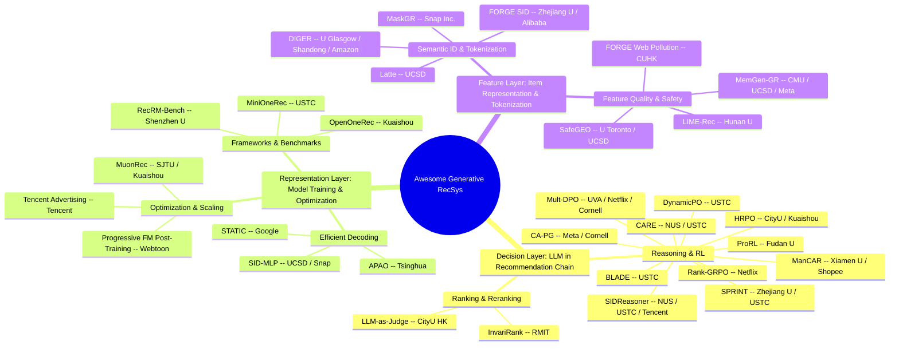

# Awesome Generative Recommendation System (RecSys)

```
 ██████╗                ██████╗                ███████╗                
██╔════╝  ███╗  ███╗    ██╔══██╗ ███╗   ███╗   ██╔════╝██╗ ██╗ ██████╗ 
██║      ██╔═██╗████╗   ██████╔╝██╔═██╗██╔═██╗ ███████╗╚██╗██║ ██╔═══╝ 
██║  ███╗██████║██╔██╗  ██╔══██╗██████║██║ ╚═╝ ╚════██║ ╚███╔╝ ██████╗ 
██║   ██║██║    ██║╚██╗ ██║  ██║██║    ██║ ██╗      ██║  ██╔╝      ██║
╚██████╔╝╚████╗ ██║ ╚██╗██║  ██║╚████╗ ╚███╔═╝ ███████║  ██║   ██████║
 ╚═════╝  ╚═══╝ ╚═╝  ╚═╝╚═╝  ╚═╝ ╚═══╝  ╚══╝   ╚══════╝  ╚═╝   ╚═════╝
```
---

[](https://github.com/sindresorhus/awesome)

RecSys is starting to adopt LLM for feature extraction, retrieval, and ranking/re-ranking! Although you can get some hands-on materials in either the [classics](#papers-classic-must-read) or some surveys, but since you're already interested in applying generative AI to industrial tasks, you probably wanna stay on the bleeding edge, right? That's exactly what this repo is for — automatically updated daily by agents with the latest generative RecSys papers fresh off arXiv, making sure that you never miss a beat.

> [!IMPORTANT]
> For those who are not familiar with GenRec, or not even the recommendation system, please checkout the kickstart posts [here](docs/kickstart.md).
> These posts are in Chinese, for English simply do your browser's internal translation or turn to __Ask Gemini__ :shipit:

## Quick Indexing
- [By Date](#by-date)
- [By Opensource](#by-opensource)
- [By Keyword](#by-keyword)
- [By Affiliation](#by-affiliation)


```mermaid
mindmap
  root((Awesome Generative RecSys))
    Decision Layer: LLM in Recommendation Chain
      Reasoning & RL
        Rank-GRPO -- Netflix
        DynamicPO -- USTC
        BLADE -- USTC
        SPRINT -- Zhejiang U / USTC
        CARE -- NUS / USTC
        HRPO -- CityU / Kuaishou
        Mult-DPO -- UVA / Netflix / Cornell
        CA-PG -- Meta / Cornell
        ProRL -- Fudan U
        ManCAR -- Xiamen U / Shopee
        SIDReasoner -- NUS / USTC / Tencent
      Ranking & Reranking
        InvariRank -- RMIT
        LLM-as-Judge -- CityU HK
    Representation Layer: Model Training & Optimization
      Frameworks & Benchmarks
        MiniOneRec -- USTC
        OpenOneRec -- Kuaishou
        RecRM-Bench -- Shenzhen U
      Efficient Decoding
        STATIC -- Google
        APAO -- Tsinghua
        SID-MLP -- UCSD / Snap
      Optimization & Scaling
        MuonRec -- SJTU / Kuaishou
        Tencent Advertising -- Tencent
        Progressive FM Post-Training -- Webtoon
    Feature Layer: Item Representation & Tokenization
      Semantic ID & Tokenization
        Latte -- UCSD
        FORGE SID -- Zhejiang U / Alibaba
        DIGER -- U Glasgow / Shandong / Amazon
        MaskGR -- Snap Inc.
      Feature Quality & Safety
        SafeGEO -- U Toronto / UCSD
        MemGen-GR -- CMU / UCSD / Meta
        FORGE Web Pollution -- CUHK
        LIME-Rec -- Hunan U
```
<div align="center">
  <i> Open-source Generative RecSys Map </i>
</div>

---
## By Date

### Papers August 9

*Sunday, August 9, 2026. Arxiv inactive (weekend). Applied 3-month fallback strategy → found 5 missed genrec papers from Nov 2025–Apr 2026: DualGR USTC/Kuaishou WWW 2026, GRC Alibaba/Wuhan U KDD 2026, SID Staleness ITMO/AI VK SIGIR 2026, MDGR Alibaba International, MaskGR Snap Inc. opensource 8/10. Total: 5 papers.*

1. **DualGR: Generative Retrieval with Long and Short-Term Interests Modeling**
   * Affiliation: University of Science and Technology of China / Kuaishou Technology — *(Zhongchao Yi, Zhengyang Zhou, Yang Wang — USTC; Kai Feng, Xiaojian Ma, Yalong Wang, Yongqi Liu, Han Li — Kuaishou)*
   * Link: [arxiv.org/abs/2511.12518](https://arxiv.org/abs/2511.12518)
   * Venue: WWW 2026
   * TL;DR: Generative retrieval with explicit dual-branch long/short-term router + search-based SID decoding for noise control + exposure-aware NTP loss treating unclicked items as hard negatives; deployed at Kuaishou short-video: +0.527% video views, +0.432% watch time.
   * Key techniques:
     - Dual-Branch Long/Short-Term Router (DBR): selective activation covering stable preferences (long window ~1000) and transient intents (short window ~64)
     - Search-based SID Decoding (S2D): constrains fine-level decoding within current coarse bucket for noise control and efficiency
     - Exposure-aware Next-Token Prediction Loss (ENTP-Loss): treats exposed-but-unclicked items as coarse-level hard negatives for timely interest fade-out
     - Encoder-free decoder-only backbone with step-wise target-aware cross-attention
   * Scores (Opensource? / Novelty / Fairness / Robustness / Impact):
     - **Opensource?: 0/10** — No public code available
     - **Novelty: 7/10** — First to explicitly model dual time-scale interests in GR via selective routing; ENTP-Loss exploits negative feedback
     - **Fairness: 3/10** — Not addressing fairness
     - **Robustness: 7/10** — WWW 2026 peer-reviewed; online A/B at Kuaishou; +0.527% video views, +0.432% watch time
     - **Impact: 7/10** — WWW 2026; USTC/Kuaishou; practical GR for industrial short-video with explicit interest time-scale modeling

2. **GRC: Learning to Reflect and Correct — Towards Better Decoding Trajectories for Large-Scale Generative Recommendation**
   * Affiliation: Alibaba International Digital Commerce Group / Wuhan University — *(Haibo Xing, Hao Deng, Lingyu Mu, Jinxin Hu, Yu Zhang, Xiaoyi Zeng — Alibaba; Jing Zhang — Wuhan U)*
   * Link: [arxiv.org/abs/2602.23639](https://arxiv.org/abs/2602.23639)
   * Venue: KDD 2026
   * TL;DR: First structured reflection-correction framework for GR extending decoding into Generation→Reflection→Correction process; GRPO-based RL optimizes full trajectory; Entropy-Guided Reflection Scheduling dynamically allocates correction budget; +15.74% Recall, +1.79% ad revenue.
   * Key techniques:
     - Structured reflection-correction template: token-level localization + semantic consistency checking in discrete SID token space
     - GRPO-based RL optimization: combined task reward (final token) + correction reward (error localization + quality improvement)
     - Entropy-Guided Reflection Scheduling (EGRS): dynamically allocates correction budget to high-uncertainty beams
     - Multi-granular reflection decomposing decoding into draft generation, reflection, reflection-guided correction
   * Scores (Opensource? / Novelty / Fairness / Robustness / Impact):
     - **Opensource?: 0/10** — No public code available
     - **Novelty: 7/10** — First structured reflection-correction for GR; EGRS for inference efficiency is clever; GRPO in discrete SID space is well-motivated
     - **Fairness: 3/10** — Not addressing fairness
     - **Robustness: 8/10** — KDD 2026 peer-reviewed; public + industrial datasets; online A/B +1.79% revenue; up to 15.74% Recall gain
     - **Impact: 7/10** — KDD 2026; Alibaba/Wuhan U; opens reflection-correction paradigm for generative recommendation

3. **Mitigating Collaborative Semantic ID Staleness in Generative Retrieval**
   * Affiliation: ITMO University / AI VK — *(Vladimir Baikalov, Iskander Bagautdinov, Sergey Muravyov — ITMO/VK)*
   * Link: [arxiv.org/abs/2604.13273](https://arxiv.org/abs/2604.13273)
   * Venue: SIGIR 2026
   * TL;DR: First systematic study of SID staleness under temporal distribution drift; lightweight model-agnostic SID alignment via bipartite matching between old and new codebooks; 8-9× training compute reduction while matching full-retrain recall.
   * Key techniques:
     - SID staleness diagnosis: interaction-informed SIDs degrade as collaborative patterns drift over time
     - Bipartite token matching: aligns refreshed SIDs to existing vocabulary via codebook-wise assignment (Greedy/Hungarian)
     - Warm-start fine-tuning: checkpoint-compatible adaptation without full rebuild-and-retrain pipeline
     - Multi-step continual adaptation stability across consecutive refresh cycles
   * Scores (Opensource? / Novelty / Fairness / Robustness / Impact):
     - **Opensource?: 0/10** — No public code available
     - **Novelty: 6/10** — First to formalize SID staleness in GR; bipartite alignment is simple but effective
     - **Fairness: 3/10** — Not addressing fairness
     - **Robustness: 6/10** — SIGIR 2026 peer-reviewed; 3 benchmarks; multi-step adaptation analysis
     - **Impact: 6/10** — SIGIR 2026; ITMO/VK; practical SID maintenance for continual GR deployment

4. **MDGR: Masked Diffusion Generative Recommendation**
   * Affiliation: Alibaba International Digital Commerce Group — *(Lingyu Mu, Hao Deng, Haibo Xing, Jinxin Hu, Yu Zhang, Xiaoyi Zeng — Alibaba)*
   * Link: [arxiv.org/abs/2601.19501](https://arxiv.org/abs/2601.19501)
   * Venue: arXiv preprint, January 2026
   * TL;DR: Replaces autoregressive SID decoding with masked diffusion; parallel codebook + adaptive masking + warm-up two-stage parallel decoding; +10.78% over SOTA, +1.20% ad revenue in online deployment.
   * Key techniques:
     - Parallel codebook: structural foundation for diffusion-based GR (positions conditionally independent given unmasked tokens)
     - Adaptive masking along temporal + sample dimensions for difficulty-aware training
     - Warm-up two-stage parallel decoding: efficient inference generating multiple SID positions simultaneously
     - Addresses three AR limitations: global dependency capture, fixed decoding path, inference efficiency
   * Scores (Opensource? / Novelty / Fairness / Robustness / Impact):
     - **Opensource?: 0/10** — Code stated "will be released upon acceptance"; not yet available
     - **Novelty: 7/10** — First to apply masked diffusion to SID-based GR; parallel codebook + adaptive masking is well-designed
     - **Fairness: 3/10** — Not addressing fairness
     - **Robustness: 7/10** — Public + industrial-scale datasets; +1.20% online revenue; 10-SOTA-baseline comparison
     - **Impact: 7/10** — Alibaba; practical diffusion-based alternative to autoregressive GR; production-verified

5. **Masked Diffusion for Generative Recommendation (MaskGR)**
   * Affiliation: Snap Inc. — *(Kulin Shah, Bhuvesh Kumar, Neil Shah, Liam Collins — Snap Inc.)*
   * Link: [arxiv.org/abs/2511.23021](https://arxiv.org/abs/2511.23021)
   * Venue: arXiv preprint, November 2025
   * TL;DR: Masked diffusion as alternative to autoregressive modeling for SID-based GR; conditional independence enables parallel decoding; consistently outperforms AR especially in data-constrained settings; code open-sourced.
   * Key techniques:
     - Masked diffusion on SID sequences: discrete masking noise with conditional independence assumption
     - Parallel decoding: predicts multiple masked SID positions simultaneously during inference
     - Better data efficiency: performance gap widens in data-constrained settings
     - Superior coarse-grained recall: diffusion better captures global token relationships vs. local AR bias
   * Scores (Opensource? / Novelty / Fairness / Robustness / Impact):
     - **Opensource?: 8/10** — [github.com/snap-research/MaskGR](https://github.com/snap-research/MaskGR) — well-structured repo with Hydra configs, Makefile targets, GRID pipeline integration; training/inference/eval scripts
     - **Novelty: 6/10** — Applies masked diffusion to SID-based GR; conceptually clean but builds on known diffusion techniques
     - **Fairness: 3/10** — Not addressing fairness
     - **Robustness: 6/10** — Thorough experiments; consistent outperformance especially data-constrained regimes
     - **Impact: 7/10** — Snap Inc.; opens diffusion-based GR paradigm with strong open-source implementation

### Papers August 10

*Monday, August 10, 2026. Arxiv active. cs.IR Aug 10 listing returned 4 genrec papers (light day) + 1 missed July 27 paper from 3-month fallback (SID Understanding, UIUC). Total: 5 papers.*

1. **Progressive Alignment of Recommender Foundation Model through Multi-Phase Post-Training**
   * Affiliation: Webtoon (NAVER WEBTOON) — *(Oseong Choi, Hoeinn Kim, Jihoon Lee, Byungsoo Kang, Taeyeong Jang — Webtoon)*
   * Link: [arxiv.org/abs/2608.06792](https://arxiv.org/abs/2608.06792)
   * Venue: RecSys 2026 Industry Track
   * TL;DR: Three-phase progressive post-training (LP→FFT→RFT) decoupling downstream adaptation from business-metric alignment for recommender foundation models; reward-based RL fine-tuning uses learned reward model with dense implicit feedback; large-scale online A/B validated; code open-sourced.
   * Key techniques:
     - Three-phase framework: Linear Probing stabilizes heads in frozen FM space, Full Fine-Tuning jointly specializes, Reinforcement Fine-Tuning aligns with business objectives
     - Decoupled alignment: business-metric supervision used only for reward modeling — policy optimized on dense implicit feedback
     - Learned reward model avoids directly optimizing serving policy on sparse/noisy business targets
     - Reference implementation at github.com/webtoon/rec-fm-progressive-alignment (Apache 2.0)
   * Scores (Opensource? / Novelty / Fairness / Robustness / Impact):
     - **Opensource?: 5/10** — [github.com/webtoon/rec-fm-progressive-alignment](https://github.com/webtoon/rec-fm-progressive-alignment) — 3⭐, 1 commit, Apache 2.0; functional ref impl with clean modular structure (recfm/); runs on synthetic data; no pretrained weights or real dataset
     - **Novelty: 5/10** — Three-phase alignment is a practical methodology but conceptually incremental; decoupling adaptation from alignment is sensible engineering
     - **Fairness: 3/10** — Not addressing fairness
     - **Robustness: 7/10** — RecSys 2026 peer-reviewed; large-scale online A/B; production deployment validation
     - **Impact: 6/10** — RecSys 2026 Industry; Webtoon; practical post-training blueprint for FM-based recommendation systems

2. **From Classification to Recommendation: Empirical Analysis of Audio Embedding Models Application for Content-Based Music Recommendation**
   * Affiliation: Macquarie University — *(Qingrui Li, Haowei Lou, Chengkai Huang, Quan Z. Sheng, Lina Yao — Macquarie/UNSW)*
   * Link: [arxiv.org/abs/2608.06928](https://arxiv.org/abs/2608.06928)
   * Venue: arXiv preprint, August 2026
   * TL;DR: First systematic evaluation of audio embeddings across 3 recommendation paradigms (content-based, sequential, SID-based generative); increasing SID capacity does not consistently improve genrec and may introduce instability; practical guidance for audio encoder selection.
   * Key techniques:
     - Six representative audio encoders evaluated across three recommendation paradigms
     - Residual-quantization analysis: codebook width, quantization depth, retained SID prefixes
     - Key finding: audio-text-aligned and music-domain representations best when embedding geometry used directly; interaction-based training narrows encoder differences
     - Key finding: increased SID capacity does not consistently improve generative rec performance
   * Scores (Opensource? / Novelty / Fairness / Robustness / Impact):
     - **Opensource?: 0/10** — No public code available
     - **Novelty: 6/10** — First systematic audio embedding evaluation across SID-based genrec; capacity-instability finding is practically important
     - **Fairness: 3/10** — Not addressing fairness
     - **Robustness: 5/10** — 6 encoders × 3 paradigms on 2 music datasets; comprehensive but no venue/peer review yet
     - **Impact: 5/10** — Macquarie/UNSW; practical empirical guidance for music rec adopting genrec

3. **HD-Rec: Hierarchical Quantization with Domain-Adaptive Sparse Routing for Generative Cross-Domain Recommendation**
   * Affiliation: City University of Hong Kong / Kuaishou Technology — *(Haiying He, Kuo Cai, Bo Chen, Jingtong Gao, Yejing Wang, Ruiming Tang, Guorui Zhou, Han Li — Kuaishou; Xiaopeng Li, Yuchen Gu, Derong Xu, Xiangyu Zhao — CityU)*
   * Link: [arxiv.org/abs/2608.06997](https://arxiv.org/abs/2608.06997)
   * Venue: arXiv preprint, August 2026
   * TL;DR: First generative cross-domain recommendation framework; hierarchical domain-aware quantizer with shared coarse + adaptively routed fine codebooks; domain-adaptive sparse MoE combining shared + specialized experts; cross-granularity routing consistency objective.
   * Key techniques:
     - Hierarchical Domain-Aware Quantizer: globally shared coarse-level codebooks + adaptively routed fine-level codebooks for domain-specific granularity
     - Domain-Adaptive Sparse MoE: continuously activated shared expert + dynamically selected specialized expert per domain
     - Cross-Granularity Routing Consistency: regularizes token-level routing toward item-level consensus for coherent multi-token representations
     - Unified generative framework handling heterogeneous item semantics and behavioral patterns across domains
   * Scores (Opensource? / Novelty / Fairness / Robustness / Impact):
     - **Opensource?: 0/10** — No public code available
     - **Novelty: 7/10** — First generative cross-domain rec with hierarchical domain-aware SID construction; MoE + routing consistency is well-designed
     - **Fairness: 3/10** — Not addressing fairness
     - **Robustness: 6/10** — 3 public cross-domain benchmarks; consistent gains over sequential, generative, and cross-domain baselines
     - **Impact: 6/10** — CityU/Kuaishou (Xiangyu Zhao, Ruiming Tang); opens generative cross-domain recommendation direction

4. **TM20K: Teacher Retains Full Tokens, Student Merges Efficiently — E-Commerce Sequence Modeling in Ad Recommendation**
   * Affiliation: ByteDance — *(Xinchun Li, Duoru Zheng, Wenlin Zhao, Ziyi Zhou, Jingxuan Tan, Huizhi Yang, Linlan Chen, Dongjian Wang, Dongyue Wang, Xiaosong Li, Hongyue Mao, Yaocheng Tan — ByteDance)*
   * Link: [arxiv.org/abs/2608.07055](https://arxiv.org/abs/2608.07055)
   * Venue: arXiv preprint, August 2026
   * TL;DR: Ultra-long 20K-token e-commerce sequence modeling with full Transformer attention + teacher-student KD; student uses token merge for compression; deployed at ByteDance ads: +1.036% ADSS, only +5.6% serving latency.
   * Key techniques:
     - Full Transformer attention (not target-sequence attention) for effective ultra-long sequence feature extraction
     - Token merge: simple yet well-motivated compression for student model maintaining acceptable performance
     - Two-stage KD: one-time heavy teacher trained on full 20K tokens; student distilled with merged tokens
     - Production deployment: extends sequence to 20K with near-identical training/serving cost as online SOTA
   * Scores (Opensource? / Novelty / Fairness / Robustness / Impact):
     - **Opensource?: 0/10** — No public code available
     - **Novelty: 6/10** — Full-attention + token-merge KD for 20K sequences is practical; production-scale validation is strong
     - **Fairness: 3/10** — Not addressing fairness
     - **Robustness: 8/10** — Production A/B at ByteDance e-commerce ads; +1.036% ADSS with minimal latency overhead
     - **Impact: 7/10** — ByteDance; practical ultra-long sequence scaling blueprint for industrial ad recommendation

5. **Understanding Semantic IDs: From Item Representation to Item Selection in Generative Recommendation**
   * Affiliation: University of Illinois at Urbana-Champaign — *(Junting Wang, Xinrui He, Yunzhe Li, Hari Sundaram — UIUC)*
   * Link: [arxiv.org/abs/2607.24995](https://arxiv.org/abs/2607.24995)
   * Venue: arXiv preprint, July 2026
   * TL;DR: First systematic empirical analysis of SID construction→generation pipeline; SIDs recover only 32.2% of encoder neighbors, TIGER retains only 29.9% of plausible targets after final token; proposes Item-Supported Decoding (ISD) with up to 31.2% NDCG gain, zero retraining.
   * Key techniques:
     - Systematic SID pipeline analysis: item encoding → SID construction → autoregressive generation → recommendation
     - 8 SID constructions × 3 Amazon domains: SID neighborhoods recover only 32.2% of encoder's 10 nearest neighbors
     - Item-Supported Decoding (ISD): lightweight inference-time method using user-specific item ranking to support SID prefixes before beam search discards them
     - No additional parameters or retraining required; relative NDCG@10 gains up to 31.2%
   * Scores (Opensource? / Novelty / Fairness / Robustness / Impact):
     - **Opensource?: 0/10** — No public code available
     - **Novelty: 7/10** — First systematic diagnostic of SID construction-to-generation pipeline; ISD is a clever lightweight fix
     - **Fairness: 3/10** — Not addressing fairness
     - **Robustness: 6/10** — 3 domains × 8 constructions; comprehensive analysis; no peer review yet
     - **Impact: 7/10** — UIUC (Hari Sundaram lab); important diagnostic work questioning SID fine-boundary assumptions; ISD practical for any SID-based genrec

### Papers August 7

*Friday, August 7, 2026. Arxiv active. cs.IR Aug 7 listing returned 1 new genrec paper (Gryphon-v2) + 1 missed paper from Aug 4 submission (UniGD) + 3 missed KDD/SIGIR 2026 papers from 3-month fallback (PinRec Pinterest KDD 2026, SA2CRQ JD.com/HIT/PKU/CAS IIE SIGIR 2026, OneLive Kuaishou). Total: 5 papers.*

1. **Gryphon-v2: One Model in Place of a Cascade — Generate-and-Rank Recommender with Rollout Distillation**
   * Affiliation: Yandex — *(Anna Lipkina, Daria Tikhonovich, Viktor Yanush, Mariia Ulianova, Oleg Sorokin, Vladislav Dodonov, Ilya Murzin, Denis Burshtein, Nikolay Savushkin — Yandex)*
   * Link: [arxiv.org/abs/2608.06213](https://arxiv.org/abs/2608.06213)
   * Venue: arXiv preprint, August 2026
   * TL;DR: Unified generate-and-rank architecture replacing multi-stage cascade with single model; Rollout Distillation transfers production ranking preferences from Teacher Ranker to Ranking Module without second serving model; deployed at Yandex Music replacing 15+ candidate generators + pre-ranking + final ranking; +1.41% active users at comparable latency.
   * Key techniques:
     - Unified generate-and-rank: shared encoder processes user history once for both SID generation and item-level ranking
     - Rollout Distillation: teacher scores as sole ranking supervision over decoder rollouts + logged impressions for complementary coverage
     - Shared encoder reuse between autoregressive decoder and item-level Ranking Module
     - End-to-end deployment replacing production cascade with single model
   * Scores (Opensource? / Novelty / Fairness / Robustness / Impact):
     - **Opensource?: 0/10** — No public code available
     - **Novelty: 6/10** — Extends Gryphon with rollout distillation for end-to-end cascade replacement; deployment validation is strong
     - **Fairness: 3/10** — Not addressing fairness
     - **Robustness: 7/10** — Production deployment at Yandex Music; +1.41% active users; comparable latency to production cascade
     - **Impact: 7/10** — Yandex; practical blueprint for end-to-end generative retrieval replacing multi-stage cascade in music streaming

2. **UniGD: A Unified Generative-Discriminative Framework for Industrial Retrieval**
   * Affiliation: Kuaishou Technology — *(Shujie Ji, Yawei Kong, Yilin Zhao, Li Wang, Xialong Liu, Peng Jiang — Kuaishou)*
   * Link: [arxiv.org/abs/2608.03150](https://arxiv.org/abs/2608.03150)
   * Venue: arXiv preprint, August 2026
   * TL;DR: Unified decoder-only framework integrating SID-based generation and query-ad relevance scoring in single model; CAGE coordinates conflicting gradients between generation and discrimination objectives; CAM anchors ad representations to frozen hierarchical codebooks; deployed at Kuaishou search ads: +5.78% revenue, -33% latency.
   * Key techniques:
     - Conflict-Aware Gradient Enhancement (CAGE): adaptive gradient coordination via orthogonal projection when generation and discrimination objectives conflict
     - Codebook-Anchored Representation Module (CAM): anchors items to frozen hierarchical codebooks from multimodal pretrained model for rich semantic priors
     - Heterogeneous Ad-material Modeling (HAM): shared backbone + type-specific capacity for short-video, product, and live-stream ads
     - Unified decoder-only architecture eliminating external online relevance model
   * Scores (Opensource? / Novelty / Fairness / Robustness / Impact):
     - **Opensource?: 0/10** — No public code available
     - **Novelty: 6/10** — Unified generative-discriminative with CAGE gradient coordination is practical; CAM+HAM are well-engineered for industrial ads
     - **Fairness: 3/10** — Not addressing fairness
     - **Robustness: 7/10** — Production A/B at Kuaishou; +5.78% revenue, -33% latency; NQ320K + MS300K public benchmarks
     - **Impact: 7/10** — Kuaishou; practical unified framework bridging generation and relevance for industrial search advertising

3. **PinRec: Unified Generative Retrieval for Pinterest Recommender Systems**
   * Affiliation: Pinterest Inc. — *(Edoardo Botta, Jaewon Yang, Yi-Ping Hsu, Laksh Bhasin, Yilin Chen, Prabhat Agarwal, Anirudhan Badrinath, Jiajing Xu, Charles Rosenberg — Pinterest)*
   * Link: [arxiv.org/abs/2504.10507](https://arxiv.org/abs/2504.10507)
   * Venue: KDD 2026
   * TL;DR: First unified generative retrieval model serving all Pinterest surfaces (home feed, search, related pins) with single pretrained-finetuned architecture; outcome-conditioned generation targets surface-specific business goals; +4% increase in search saves at Pinterest scale.
   * Key techniques:
     - Cross-surface pretraining + surface-specific fine-tuning: single model serves all recommendation surfaces
     - Outcome-conditioned generation mechanism: targets different business outcomes per surface (saves, clicks, etc.)
     - Unified token sequence combining heterogeneous inputs (query text + user history) across surfaces
     - First rigorous study of unified generative retrieval deployed at Pinterest scale (600M+ MAU)
   * Scores (Opensource? / Novelty / Fairness / Robustness / Impact):
     - **Opensource?: 0/10** — No public code available
     - **Novelty: 6/10** — First multi-surface unified GR at production scale; outcome-conditioned generation is practical
     - **Fairness: 3/10** — Not addressing fairness
     - **Robustness: 8/10** — KDD 2026; deployed at Pinterest (600M+ MAU); +4% search saves; cross-surface validation
     - **Impact: 8/10** — KDD 2026; Pinterest; milestone for unified generative retrieval at internet-scale visual discovery platform

4. **SA²CRQ: Towards Efficient and Generalizable Retrieval — Adaptive Semantic Quantization and Residual Knowledge Transfer**
   * Affiliation: JD.com / Harbin Institute of Technology / Peking University / CAS IIE — *(Huimu Wang, Xingzhi Yao, Yiming Qiu, Qinghong Zhang, Songlin Wang, Sulong Xu — JD.com; Haotian Wang — HIT; Yufan Cui — PKU; Mingming Li — CAS IIE)*
   * Link: [arxiv.org/abs/2602.23978](https://arxiv.org/abs/2602.23978)
   * Venue: SIGIR 2026
   * TL;DR: Addresses SID head-tail asymmetry — head items suffer ID collisions, tail items suffer semantic fragmentation; SARQ dynamically allocates code lengths based on item path entropy; ACRQ uses frozen head-item manifold to regularize tail-item representation learning; consistent improvements especially in cold-start.
   * Key techniques:
     - Sequential Adaptive Residual Quantization (SARQ): variable-length SID allocation — longer discriminative IDs for head items, shorter generalizable IDs for tail items
     - Anchored Curriculum Residual Quantization (ACRQ): frozen semantic manifold from head items regularizes tail-item learning
     - Path-entropy-based code length allocation adapting to item popularity
     - Large-scale industrial search validation + public datasets; cold-start scenario emphasis
   * Scores (Opensource? / Novelty / Fairness / Robustness / Impact):
     - **Opensource?: 0/10** — No public code available
     - **Novelty: 7/10** — First to address SID head-tail asymmetry via adaptive code-length allocation; frozen manifold knowledge transfer is principled
     - **Fairness: 4/10** — Explicitly improves tail/cold-start item retrieval; addresses data-imbalance fairness
     - **Robustness: 6/10** — SIGIR 2026 peer-reviewed; industrial + public datasets; consistent cold-start gains
     - **Impact: 6/10** — SIGIR 2026; JD.com/HIT/PKU/CAS IIE; practical adaptive SID framework for imbalanced industrial item corpora

5. **OneLive: Dynamically Unified Generative Framework for Live-Streaming Recommendation**
   * Affiliation: Kuaishou Technology — *(Shen Wang, Yusheng Huang, Ruochen Yang, Shuang Wen, Pengbo Xu, Jiangxia Cao, Yueyang Liu, Kuo Cai, Chengcheng Guo, Shiyao Wang, Xinchen Luo, Qiang Luo, Ruiming Tang, Shuang Yang, Zhaojie Liu, Guorui Zhou, Han Li, Kun Gai — Kuaishou)*
   * Link: [arxiv.org/abs/2602.08612](https://arxiv.org/abs/2602.08612)
   * Venue: arXiv preprint, February 2026
   * TL;DR: First generative recommendation framework tailored for live-streaming; Dynamic Tokenizer with residual quantization handles continuously evolving live content; Time-Aware Gated Attention for temporal dynamics; Unified Multi-Objective Alignment for heterogeneous objectives; decoder-only architecture with Sequential MTP.
   * Key techniques:
     - Dynamic Tokenizer: continuous residual quantization encoding evolving real-time live content fused with behavior signals
     - Time-Aware Gated Attention: explicit temporal dynamics modeling for timely decision-making in fast-changing live environments
     - Sequential Multi-Token Prediction (MTP) + QK Norm for stable training and accelerated inference
     - Unified Multi-Objective Alignment Framework: policy optimization balancing heterogeneous objectives (engagement, retention, revenue)
   * Scores (Opensource? / Novelty / Fairness / Robustness / Impact):
     - **Opensource?: 0/10** — No public code available
     - **Novelty: 6/10** — First generative recommendation specifically for live-streaming; dynamic tokenization for evolving content is well-motivated
     - **Fairness: 3/10** — Not addressing fairness
     - **Robustness: 5/10** — Work in progress; no public benchmark or industrial A/B reported; decoder-only architecture is sound
     - **Impact: 6/10** — Kuaishou; opens new direction for generative recommendation in live-streaming domain; practical for short-video/live platforms

### Papers August 6

*Thursday, August 6, 2026. Arxiv active. cs.IR listing returned 1 new genrec paper (DEGR) from Aug 5 submission window + 4 missed papers from Jan–Apr 2026 3-month fallback (SIDReasoner NUS/USTC/Tencent KDD 2026, CARD UESTC/SWUFE SIGIR 2026, DIGER SIGIR 2026, S2GR Kuaishou KDD 2026). Total: 5 papers.*

1. **DEGR: Dual Exploration-Driven Generative Re-Ranking for Adaptive Cross-Request Context Bridging**
   * Affiliation: JD.com — *(Binglei Zhao, Xuanhua Yang, Xiwei Zhao, Sulong Xu — JD.com)*
   * Link: [arxiv.org/abs/2608.04809](https://arxiv.org/abs/2608.04809)
   * Venue: KDD 2026 ADS Track
   * TL;DR: Generative re-ranking with hybrid supervised-RL exploration; exploratory reward model adaptively balances immediate vs. exploratory value per supply quality; deployed at JD.com with +1.22% UCTR, +0.20% PV.
   * Key techniques:
     - Dual exploration: immediate value exploitation + exploratory exposure driven by supply quality assessment
     - Hybrid supervised-reinforcement optimization with exploration diversity constraint
     - Adaptive reward-weighted ORPO for preference optimization under cross-request context
     - Generator as adaptive cross-request contextual bridge
   * Scores (Opensource? / Novelty / Fairness / Robustness / Impact):
     - **Opensource?: 0/10** — No public code available
     - **Novelty: 6/10** — First generative re-ranking with dual exploration bridging cross-request context; hybrid ORPO is practical
     - **Fairness: 3/10** — Not addressing fairness
     - **Robustness: 7/10** — KDD 2026 ADS; production deployment at JD.com; +1.22% UCTR, +0.20% PV
     - **Impact: 7/10** — KDD 2026 ADS; JD.com; practical generative re-ranking paradigm for industrial recommendation

2. **SIDReasoner: Reasoning over Semantic IDs Enhances Generative Recommendation**
   * Affiliation: National University of Singapore / University of Science and Technology of China / Tencent — *(Yingzhi He, Yuxin Chen, Tat-Seng Chua — NUS; Yan Sun, Junfei Tan, Xiaoyu Kong, Xiang Wang, An Zhang — USTC; Chunxu Shen — Tencent)*
   * Link: [arxiv.org/abs/2603.23183](https://arxiv.org/abs/2603.23183)
   * Venue: KDD 2026
   * TL;DR: Two-stage framework for reasoning over SIDs via SID-language alignment + outcome-driven RL; enriched SID-centered corpus synthesized by teacher model grounds itemic tokens in diverse contexts; no recommendation-specific reasoning traces needed.
   * Key techniques:
     - SID-language alignment via multi-task training on enriched SID-centered corpus synthesized by stronger teacher model
     - Outcome-driven reinforced optimization guiding model toward effective reasoning trajectories without explicit annotations
     - Two-stage framework: alignment pretraining → RL-based reasoning activation
     - Improved cross-domain generalization and interpretability beyond accuracy gains
   * Scores (Opensource? / Novelty / Fairness / Robustness / Impact):
     - **Opensource?: 7/10** — [github.com/HappyPointer/SIDReasoner](https://github.com/HappyPointer/SIDReasoner) — 29⭐, 10 commits; three-stage pipeline (SFT→Reasoning→RL); Zenodo DOI artifact; well-documented README with reproduction instructions; built on MiniOneRec
     - **Novelty: 7/10** — First to enable reasoning over SIDs by strengthening SID-language alignment; outcome-driven RL for reasoning is well-motivated
     - **Fairness: 3/10** — Not addressing fairness
     - **Robustness: 7/10** — KDD 2026 peer-reviewed; 3 real-world datasets; cross-domain generalization analysis; interpretability evaluation
     - **Impact: 7/10** — KDD 2026; NUS/USTC/Tencent; opens new direction for reasoning-augmented SID-based generative recommendation

3. **CARD: Non-Uniform Quantization of Visual Semantic Unit for Generative Recommendation**
   * Affiliation: University of Electronic Science and Technology of China / Southwestern University of Finance and Economics — *(Yibiao Wei, Jie Zou, Xiao Ao, Pengfei Zhang, Zeyu Ma, Yang Yang — UESTC; Weikang Guo — SWUFE)*
   * Link: [arxiv.org/abs/2604.26427](https://arxiv.org/abs/2604.26427)
   * Venue: SIGIR 2026
   * TL;DR: Visual semantic unit unifying text+visual+collab signals into structured representation; NU-RQ-VAE with learnable non-uniform transformation maps skewed embedding distributions to balanced latent space for improved codebook utilization.
   * Key techniques:
     - Visual semantic unit: unifies textual, visual, and collaborative signals into structured visual representation prior to encoding
     - NU-RQ-VAE: learnable and invertible non-uniform transformation handling skewed semantic distributions
     - Plug-and-play non-uniform transformation module robust across different quantization schemes
     - Reduced supervision signal dependency for heterogeneous fusion in SID learning
   * Scores (Opensource? / Novelty / Fairness / Robustness / Impact):
     - **Opensource?: 6/10** — [github.com/HAI-UESTC/CARD](https://github.com/HAI-UESTC/CARD) — 19⭐, 49 commits; functional codebase with training pipeline; sparse README lacking paper link, results, license; built on TIGER/SASRec
     - **Novelty: 7/10** — First to address non-uniform embedding distributions in SID quantization; visual semantic unit + NU-RQ-VAE is novel
     - **Fairness: 3/10** — Not addressing fairness
     - **Robustness: 6/10** — SIGIR 2026 peer-reviewed; multiple datasets; plug-and-play module across quantization schemes
     - **Impact: 6/10** — SIGIR 2026; UESTC; practical non-uniform quantization framework improving codebook utilization for genrec

4. **DIGER: Differentiable Semantic ID for Generative Recommendation**
   * Affiliation: University of Glasgow / Shandong University / Amazon / Telefónica / Leiden University — *(Junchen Fu, Joemon M. Jose — U Glasgow; Xuri Ge — Shandong U; Alexandros Karatzoglou — Amazon; Ioannis Arapakis — Telefónica; Suzan Verberne, Zhaochun Ren — Leiden U)*
   * Link: [arxiv.org/abs/2601.19711](https://arxiv.org/abs/2601.19711)
   * Venue: SIGIR 2026
   * TL;DR: First differentiable SID joint optimization; Gumbel noise + uncertainty decay strategies prevent codebook collapse while aligning indexing and recommendation objectives end-to-end.
   * Key techniques:
     - Differentiable semantic indexing: recommendation gradients directly influence SID learning
     - Gumbel noise injection encouraging early codebook exploration to prevent collapse
     - Two uncertainty decay strategies: gradual noise reduction transitioning from exploration to exploitation
     - Joint optimization closing the objective mismatch between content reconstruction and recommendation
   * Scores (Opensource? / Novelty / Fairness / Robustness / Impact):
     - **Opensource?: 8/10** — [github.com/junchen-fu/DIGER](https://github.com/junchen-fu/DIGER) — SIGIR 2026 artifact; clean implementation with clear modular structure; well-documented; reproducible pipeline
     - **Novelty: 7/10** — First to enable differentiable SID optimization for GR; Gumbel-based codebook collapse mitigation is principled
     - **Fairness: 3/10** — Not addressing fairness
     - **Robustness: 6/10** — SIGIR 2026 peer-reviewed; multiple public datasets; consistent improvements across benchmark settings
     - **Impact: 7/10** — SIGIR 2026; Glasgow/Shandong/Amazon; addresses fundamental objective-mismatch problem in genrec; opens differentiable SID research direction

5. **S²GR: Stepwise Semantic-Guided Reasoning in Latent Space for Generative Recommendation**
   * Affiliation: Kuaishou Technology — *(Zihao Guo, Jian Wang, Ruxin Zhou, Youhua Liu, Jiawei Guo, Jun Zhao, Xiaoxiao Xu, Yongqi Liu, Kaiqiao Zhan — Kuaishou)*
   * Link: [arxiv.org/abs/2601.18664](https://arxiv.org/abs/2601.18664)
   * Venue: KDD 2026
   * TL;DR: Inserts thinking tokens before each SID generation step with contrastive supervision against codebook cluster distributions; CoBa RQ-VAE integrates co-occurrence + load balancing for robust codebooks; online A/B at Kuaishou: +0.092% app usage time, +0.091% video views.
   * Key techniques:
     - CoBa RQ-VAE: item co-occurrence + load balancing + uniformity objectives for robust semantic codebooks
     - Stepwise reasoning: thinking tokens interleaved before each SID code step with explicit semantic supervision
     - Contrastive learning against ground-truth codebook cluster distributions for interpretable reasoning paths
     - Balanced computational focus across all hierarchical SID codes vs. sequential separation approaches
   * Scores (Opensource? / Novelty / Fairness / Robustness / Impact):
     - **Opensource?: 0/10** — No public code available
     - **Novelty: 7/10** — First stepwise latent reasoning for SID generation; CoBa RQ-VAE with co-occurrence is novel; thinking token supervision is well-motivated
     - **Fairness: 3/10** — Not addressing fairness
     - **Robustness: 7/10** — KDD 2026 peer-reviewed; public + industrial datasets; online A/B at Kuaishou with +0.092% usage time
     - **Impact: 7/10** — KDD 2026; Kuaishou; practical stepwise reasoning framework for genrec deployed on large-scale short-video platform

### Papers August 5

*Wednesday, August 5, 2026. Arxiv active. cs.IR listing returned 5 genrec papers from Aug 3–4 submission windows + 1 missed July 28 paper (UniR²). Total: 6 papers.*

1. **SmartGR: Hierarchy and Beam-Aware Knowledge Distillation for Generative Recommendation**
   * Affiliation: Zhejiang University — *(Ziheng Zhang, Yu Cui, Bohao Wang, Wujie Sun, Can Wang, Jiawei Chen — Zhejiang U; Yong He, Chao Yu, Chuan Yuan)*
   * Link: [arxiv.org/abs/2608.02048](https://arxiv.org/abs/2608.02048)
   * Venue: arXiv preprint, August 2026
   * TL;DR: First knowledge distillation framework specifically designed for GR; Hierarchy-Aware SID Distillation addresses imbalanced distillation difficulty across SID levels; Beam-Aware Ranking Distillation transfers teacher ranking preferences during beam search; +8.6% performance with 2.39× inference speedup.
   * Key techniques:
     - Hierarchy-Aware SID Distillation: transfers teacher modeling capability across coarse-to-fine SID hierarchy with level-specific weighting
     - Beam-Aware Ranking Distillation: distills teacher's beam search ranking preferences to correct prefix pruning errors
     - Offline teacher cache with top-K token distributions at each valid SID position
     - Unified distillation framework combining hierarchy-aware + beam-aware objectives for GR models
   * Scores (Opensource? / Novelty / Fairness / Robustness / Impact):
     - **Opensource?: 0/10** — No public code available
     - **Novelty: 6/10** — First KD specifically designed for GR; hierarchy-aware + beam-aware distillation is practical but conceptually incremental
     - **Fairness: 3/10** — Not addressing fairness
     - **Robustness: 6/10** — 4 benchmark datasets (Amazon Beauty/Toys + Kuaishou Ad/Video); 2.39× speedup; consistent across distillation configurations
     - **Impact: 6/10** — Zhejiang U; practical contribution enabling efficient GR deployment; built on OneRec ecosystem

2. **UnpairGR: Unpaired Modality-Agnostic Generative Recommendation**
   * Affiliation: Beihang University / Meituan — *(Weihao Shen, Wei Chen, Fuwei Zhang, Meng Yuan, Yuqin Lan, Fuzhen Zhuang — Beihang; Guojun Liu, Qingsong Hua, Wei Lin — Meituan)*
   * Link: [arxiv.org/abs/2608.02477](https://arxiv.org/abs/2608.02477)
   * Venue: arXiv preprint, August 2026
   * TL;DR: Learns unified SID space from paired + image-only + text-only observations; lightweight modality-specific input projections + shared Transformer/codebooks; reliability-guided cross-modal consensus resolves incompatible identifier sequences; no feature imputation or modality-specific codebooks needed.
   * Key techniques:
     - Unified semantic-ID space learning from paired (image+text), image-only, and text-only observations
     - Modality-specific processing confined to lightweight input projections; shared Transformer + residual codebooks
     - Reliability-guided cross-modal consensus: paired observations establish cross-modal alignment for unimodal refinement
     - Stationary tokenizer: learned tokenizer fixed as stable targets for autoregressive recommender
     - No feature imputation, modality-specific codebooks, or fallback mappings
   * Scores (Opensource? / Novelty / Fairness / Robustness / Impact):
     - **Opensource?: 0/10** — No public code available
     - **Novelty: 7/10** — First to handle unpaired multimodal observations in GR; shared SID space with reliability-guided consensus is novel
     - **Fairness: 4/10** — Improves coverage for items with incomplete modality data (indirect fairness benefit)
     - **Robustness: 6/10** — 3 benchmark datasets; both fully-observed and incomplete-observation settings; consistent improvement
     - **Impact: 6/10** — Beihang/Meituan; practical for real-world multimodal GR where modality missing is common

3. **SITA: Semantic Interest Tokens for Target-Aware Compression in Long-Sequence Recommendation**
   * Affiliation: University of Science and Technology of China / Kuaishou Technology — *(Rui Zhou, Hao Wang, Enhong Chen — USTC; Bo Chen, Qinglin Jia, Jiezhou Ji, Chaoyi Ma, Ruiming Tang — Kuaishou)*
   * Link: [arxiv.org/abs/2608.03692](https://arxiv.org/abs/2608.03692)
   * Venue: arXiv preprint, August 2026
   * TL;DR: Target-aware compression for long user sequences via semantic interest tokens learned through parallel semantic quantization; target-conditioned aggregation adaptively selects relevant interests per candidate; bridges the gap between efficient compression-based methods and adaptive target-retrieval methods.
   * Key techniques:
     - Semantic interest tokens: compress user history into structured semantic representations via parallel semantic quantization
     - Target-conditioned aggregation: conditioned on target item's semantic identifier, adaptively aggregates corresponding structured interests
     - Parallel semantic quantization organizes compressed interests into semantic structures without sequential dependency
     - Balances target-aware modeling with compression efficiency; validated on public + large-scale industrial datasets
   * Scores (Opensource? / Novelty / Fairness / Robustness / Impact):
     - **Opensource?: 0/10** — No public code available
     - **Novelty: 6/10** — Target-aware compression via semantic interest tokens is practical; parallel semantic quantization for rec is well-motivated
     - **Fairness: 3/10** — Not addressing fairness
     - **Robustness: 7/10** — Public + large-scale industrial datasets; strong scalability maintained; consistent outperformance over baselines
     - **Impact: 7/10** — USTC/Kuaishou; practical for industrial long-sequence recommendation bridging compression and target-awareness

4. **STEPS: A Self-Triggered Agentic Push Recommendation System**
   * Affiliation: ByteDance / Peking University — *(Zhao-Yu Zhang, Qingying Chen, Jing Zhou, Jian Sun, Siqi Chen, Leiying Chen, Chuan Zhou, Huiyou Jiang, Xin Tao, Chunyuan Zheng — ByteDance; Haoxuan Li, Zhouchen Lin — PKU)*
   * Link: [arxiv.org/abs/2608.01949](https://arxiv.org/abs/2608.01949)
   * Venue: arXiv preprint, August 2026
   * TL;DR: Reformulates push notification recommendation as proactive self-triggered agentic process; Planning Agent schedules next invocation via gated ordinal regression; Execution Agent decides send/drop with trajectory rewards; deployed at Douyin (1B+ users) with +0.28% active days, -1.91% push disablement, -79.42% compute overhead.
   * Key techniques:
     - Self-triggered agentic framework (STEPS): proactive closed-loop replacing passive polling/pre-scheduled delivery
     - Two Decision Transformer-based agents: Planning Agent (gated ordinal regression for scheduling) + Execution Agent (trajectory-reward-driven send/drop)
     - Lightweight filtering agent controls compute overhead and safeguards against unreasonable planning
     - End-to-end architecture avoiding local optima in multi-stage push frameworks
   * Scores (Opensource? / Novelty / Fairness / Robustness / Impact):
     - **Opensource?: 0/10** — No public code available
     - **Novelty: 7/10** — First self-triggered agentic push rec; reformulates push as proactive agentic process; gated ordinal regression for scheduling is novel
     - **Fairness: 3/10** — Not addressing fairness
     - **Robustness: 8/10** — Online A/B at Douyin (1B+ users); +0.28% active days; -1.91% push disablement; -79.42% compute reduction
     - **Impact: 7/10** — ByteDance/PKU; production-proven agentic push paradigm; deployed at Douyin with verified engagement and efficiency gains

5. **UniR²: Unifying Generative Recall and Multi-Objective Ranking in a Single Decoder-Only Sequence**
   * Affiliation: Kuaishou Technology / CAS IIE — *(Shuang Wen, Pengbo Xu, Yusheng Huang, Jiangxia Cao, Shuang Yang, Zhaojie Liu — Kuaishou; Ruochen Yang, Jiawei Sheng, Tingwen Liu — CAS IIE)*
   * Link: [arxiv.org/abs/2607.24439](https://arxiv.org/abs/2607.24439)
   * Venue: arXiv preprint, July 2026
   * TL;DR: Unified decoder-only Transformer merging generative recall + multi-objective ranking in single heterogeneous sequence; generated SID trajectory serves as representation bridge; Dual-Query Prefix-Causal Attention provides task-specific visibility with shared base weights + LoRA ranking adaptation; long-term online A/B validated at Kuaishou.
   * Key techniques:
     - Heterogeneous sequence: user context + SID trajectory + item features in single decoder-only Transformer
     - Generated SID trajectory as representation bridge between recall and ranking stages
     - Dual-Query Prefix-Causal Attention: task-specific information visibility with shared attention weights
     - LoRA for ranking adaptation: preserves generative backbone while enabling ranking-specific optimization
     - Eliminates objective inconsistency and information loss at candidate hand-off in cascade architectures
   * Scores (Opensource? / Novelty / Fairness / Robustness / Impact):
     - **Opensource?: 0/10** — No public code available
     - **Novelty: 7/10** — First to unify genrec recall + multi-objective ranking in single decoder-only sequence; Dual-Query Prefix-Causal Attention is novel
     - **Fairness: 3/10** — Not addressing fairness
     - **Robustness: 8/10** — Large-scale industrial data; long-term online A/B at Kuaishou with consistent positive gains
     - **Impact: 7/10** — Kuaishou/CAS IIE; practical unified recall-ranking paradigm for industrial recommendation

### Papers August 4

*Tuesday, August 4, 2026. Arxiv active. cs.IR listing returned 6 genrec papers from Aug 1–2 submission window. Total: 6 papers.*

1. **HRPO: Hierarchical Residual Policy Optimization for Generative Recommendations**
   * Affiliation: City University of Hong Kong / Kuaishou Technology — *(Kaifeng Guo, Jingtong Gao, Xiangyu Zhao — CityU; Yiming Yang, Fukang Yang, Yukang Liang, Peng Jiang, Qingpeng Cai — Kuaishou; Guolei Zeng — Independent)*
   * Link: [arxiv.org/abs/2608.00750](https://arxiv.org/abs/2608.00750)
   * Venue: KDD 2026 Research Track
   * TL;DR: Converts item-level outcome feedback into dense, token-aligned learning signals for SID-based generative recommenders via hierarchical residual credit decomposition; RRPO with group-normalized advantages + KL regularization; online A/B-validated with source code and Zenodo artifact.
   * Key techniques:
     - Prefix-level utility estimation via group-wise reward smoothing over feature-based user clusters
     - Residual token credit decomposition: prefix utilities broken into per-token credits, accumulated into credit-to-go signals
     - Residual-Return Policy Optimization (RRPO): clipped updates, group-normalized advantages, KL regularization
     - Converts sparse item-level feedback into dense token-aligned signals for conservative per-token improvement
   * Scores (Opensource? / Novelty / Fairness / Robustness / Impact):
     - **Opensource?: 8/10** — [github.com/Applied-Machine-Learning-Lab/KDD2026-HRPO](https://github.com/Applied-Machine-Learning-Lab/KDD2026-HRPO) — 3⭐, 6 commits; Apache 2.0; complete pipeline (KuaiSim simulator, SID mapping, HRPO table building, RRPO training + 11 baseline comparisons); Zenodo DOI artifact; well-documented README with reproduction instructions
     - **Novelty: 7/10** — First to convert item-level feedback into hierarchical token-aligned credits for SID genrec; RRPO is a principled RL formulation
     - **Fairness: 3/10** — Not addressing fairness
     - **Robustness: 8/10** — KDD 2026 peer-reviewed; public dataset + online A/B test in large-scale commercial system; comprehensive baseline comparisons (A2C, DDPG, HAC, Decision Transformer, etc.)
     - **Impact: 7/10** — KDD 2026; CityU/Kuaishou; practical post-training framework for token-level credit assignment in SID-based genrec

2. **Exp-RSFT: Exponential Reward Weighting for Fine-Tuning Generative Recommenders under Sparse and Noisy Feedback**
   * Affiliation: Netflix — *(Keertana Chidambaram, Sanath Kumar Krishnamurthy, Qiuling Xu, Ko-Jen Hsiao, Moumita Bhattacharya — Netflix)*
   * Link: [arxiv.org/abs/2608.00816](https://arxiv.org/abs/2608.00816)
   * Venue: arXiv preprint, August 2026
   * TL;DR: Replaces PPO/DPO post-training with exponential reward-weighted SFT (Exp-RSFT); temperature λ balances coverage vs. noise costs with inverted-U optimality curve; no online exploration or preference data needed; outperforms PPO/DPO on 3 public + 1 industrial dataset.
   * Key techniques:
     - Exponential reward-weighted fine-tuning: weights logged interactions by exp(r/λ), directly optimizing logged rewards
     - Theoretical suboptimality decomposition: coverage cost (logging policy limitations) + noise cost (imperfect feedback)
     - Temperature λ balancing exploitation-robustness tradeoff → inverted-U performance curve
     - Outperforms PPO/DPO which over-optimize unreliable reward models; no online exploration required
   * Scores (Opensource? / Novelty / Fairness / Robustness / Impact):
     - **Opensource?: 0/10** — No public code available
     - **Novelty: 6/10** — Simple but principled alternative to PPO/DPO for genrec post-training; theoretical decomposition is clean
     - **Fairness: 3/10** — Not addressing fairness
     - **Robustness: 7/10** — 3 public benchmarks + large-scale industrial dataset; theoretical analysis supporting empirical inverted-U trend
     - **Impact: 6/10** — Netflix; practical lightweight post-training method for industrial genrec under sparse/noisy feedback

3. **OMEGA: Collaborative Memory Augmentation for Generative Recommendation**
   * Affiliation: Renmin University of China / ByteDance — *(Enze Liu, Wayne Xin Zhao — Renmin University; Zhen Tian — ByteDance)*
   * Link: [arxiv.org/abs/2608.01315](https://arxiv.org/abs/2608.01315)
   * Venue: KDD 2026 Research Track
   * TL;DR: Bridges parametric knowledge gap in GR with explicit collaborative memory bank; learnable query tokens compress user sequences into compact memory; target-aware retrieval + gated cross-attention integration adaptively fuses global patterns with local context.
   * Key techniques:
     - Latent context compression: learnable query tokens distill sequential behavior into compact memory representations
     - Collaborative memory bank: explicit repository of global cross-user behavioral patterns
     - Lightweight target-aware retrieval: identifies relevant memories via sequence-level + target-level similarities
     - Gated cross-attention integration: adaptively fuses retrieved collaborative memories while suppressing noisy patterns
   * Scores (Opensource? / Novelty / Fairness / Robustness / Impact):
     - **Opensource?: 0/10** — No public code available
     - **Novelty: 6/10** — First to add explicit collaborative memory bank to GR; bridges implicit parametric ↔ explicit collaborative knowledge gap
     - **Fairness: 3/10** — Not addressing fairness
     - **Robustness: 7/10** — KDD 2026 peer-reviewed; multiple real-world datasets; consistent outperformance over advanced GR models
     - **Impact: 6/10** — KDD 2026; Renmin/ByteDance; opens new direction for memory-augmented generative recommendation

4. **GARDRec: Decision-Level Graph Grounding for Large Language Model Recommendation**
   * Affiliation: Harbin Institute of Technology — *(Yong Wang, Hongliang Sun, Jinlan Liu, Hua Zhang, Dianbo Sui, Dianhui Chu, Zhiying Tu — HIT)*
   * Link: [arxiv.org/abs/2608.00669](https://arxiv.org/abs/2608.00669)
   * Venue: arXiv preprint, August 2026
   * TL;DR: Shifts KG grounding from prompt-level to decision-level for LLM-based next-item ranking; semantic-structural item representations + temporally weighted graph contexts aligned with frozen LLM via multimodal prompts; late-stage decision branches inject explicit matching features.
   * Key techniques:
     - Semantic-structural item representations from textual node features + graph propagation
     - Personalized graph contexts from temporally weighted histories + first-order neighborhoods
     - Graph-LLM alignment via continuous multimodal prompts with frozen LLM backbone
     - Late-stage decision branches injecting explicit interaction/matching features + inter-candidate attention
   * Scores (Opensource? / Novelty / Fairness / Robustness / Impact):
     - **Opensource?: 0/10** — No public code available
     - **Novelty: 5/10** — Decision-level vs. prompt-level graph grounding is a practical refinement; conceptually incremental
     - **Fairness: 3/10** — Not addressing fairness
     - **Robustness: 6/10** — 3 public benchmarks; multiple LLM backbones; ablation verifying each component
     - **Impact: 5/10** — HIT; practical LLM-based recommendation with structured graph grounding

5. **GRACE: Generative Recommender Acceleration Engine for Real-Time Ads Retrieval**
   * Affiliation: Meta — *(Zhou Fang, Yuhang Huang, Ang Zhang, Yihan He, Ruichao Xiao, Chao Li, Yavuz Yetim, Sibyl Yang, Xiaohan Wei, Fei Tian, Liang Wang, Liyuan Li, Nathan Yan, Gaoxiang Liu — Meta)*
   * Link: [arxiv.org/abs/2608.00938](https://arxiv.org/abs/2608.00938)
   * Venue: arXiv preprint, August 2026
   * TL;DR: Production serving system for ads genrec solving eligibility (GTM: bitmask+Bloom filter SID-prefix filtering, 23.55→40.42% pass rate) and latency (68× cross-attention, 11.1× decoder speedup on GH200 via wide-beam kernel/KV-cache/beam-search optimization).
   * Key techniques:
     - Generative Target Matching (GTM): SID-prefix-level personalized filtering using bitmask + Bloom filter matchers from advertiser targeting rules
     - Encoder-decoder Transformer optimizations targeting wide-beam, short-sequence decoding regime
     - Custom attention kernels + KV cache + beam search redesign for wide-beam inference
     - 68× cross-attention, 23-26× self-attention, 11.1× overall decoder latency reduction on NVIDIA GH200
   * Scores (Opensource? / Novelty / Fairness / Robustness / Impact):
     - **Opensource?: 0/10** — No public code available
     - **Novelty: 6/10** — First production serving system addressing both eligibility and latency for ads genrec; GTM is novel for ad targeting
     - **Fairness: 3/10** — Not addressing fairness
     - **Robustness: 7/10** — Production-scale system design; GH200 latency benchmarks; comprehensive serving pipeline coverage
     - **Impact: 7/10** — Meta; practical blueprint for productionizing genrec in high-volume real-time ads systems

6. **LIME-Rec: Auditing Semantic Gains in Sequential Recommendation — A Lightweight Recovery Test**
   * Affiliation: Hunan University — *(Kong Wang, Kehua Yang — Hunan U; Zhongke He, Xiang Chen, Hongwei Zeng, Kai Deng, Long Wang)*
   * Link: [arxiv.org/abs/2608.01260](https://arxiv.org/abs/2608.01260)
   * Venue: arXiv preprint, August 2026
   * TL;DR: Diagnostic framework decomposing semantic recsys gains; three-expert fusion (SASRec + ItemCF + frozen BGE embeddings) with auditable score-level fusion + bounded history calibration recovers 7-12% over strongest baselines without serving-time LM inference; randomly permuting embeddings drops R@10 by 13.6-17.5%.
   * Key techniques:
     - Three-expert design: SASRec sequential + ItemCF co-occurrence + frozen BAAI/bge-base-en-v1.5 semantic expert
     - Auditable score-level fusion: per-user score normalization with separately inspectable expert contributions
     - Bounded history calibration fitted on validation data only, zero serving-time LM inference
     - Controlled perturbation: random item-text permutation reducing R@10 by 13.6-17.5% → gains depend on genuine content correspondence
   * Scores (Opensource? / Novelty / Fairness / Robustness / Impact):
     - **Opensource?: 7/10** — [github.com/Double-wk/LIME-Rec](https://github.com/Double-wk/LIME-Rec) — 3⭐, 1 commit; Apache 2.0; well-structured package (lime_rec/, configs/, scripts/, workflows/); comprehensive README with multi-seed reproduction; tests included
     - **Novelty: 7/10** — First lightweight recovery test auditing source of semantic gains in seqrec; diagnostic framing is important for the field
     - **Fairness: 3/10** — Not addressing fairness directly
     - **Robustness: 7/10** — 3 Amazon benchmarks + Yelp; multi-seed; controlled perturbations; three-expert isolation
     - **Impact: 7/10** — Hunan U; important diagnostic contribution suggesting lightweight representations may explain much of semantic rec gains; challenges the need for complex semantic architectures

### Papers August 3

*Monday, August 3, 2026. Arxiv active. cs.IR listing returned 7 new genrec papers from July 31–Aug 1 submission window. Total: 7 papers.*

1. **SnapLGR: LLM-Based Generative Retrieval for Snapchat Content Recommendation**
   * Affiliation: Snap Inc. — *(Liam Collins, Jiwen Ren, Donald Loveland, Bhuvesh Kumar, Clark Mingxuan Ju, Xuan Guo, Mo Li, Alvin Hou, Yi Cui, Peng Yang, Jian Wang, Saud Afzal Shafi, Nga Than, Ruiming Lu, Wenfeng Zhuo, Dongheng Li, Lili Zhang, Mingtao Zhang, Jinchao Ye, Vincent Xue, Chunhui Zhu, Neil Shah — Snap Inc.)*
   * Link: [arxiv.org/abs/2607.28895](https://arxiv.org/abs/2607.28895)
   * Venue: arXiv preprint, July 2026
   * TL;DR: Production LLM-based GR system at Snapchat with PPR-enhanced SIDs + continued pretraining for vocabulary grounding + TensorRT-LLM beam search; live A/B: +0.37% View Time, +0.18% Deep Sessions over TIGER baseline.
   * Key techniques:
     - PPR-based co-engagement contrastive learning for collaborative-enhanced SIDs (improved codebook utilization + reduced collisions)
     - Continued Pretraining (CPT) grounding SID tokens before supervised fine-tuning on user interaction sequences
     - TensorRT-LLM CUDA-backed beam search + decentralized worker-loop serving architecture
     - Joint design across representation learning, vocabulary grounding, and efficient training/serving
   * Scores (Opensource? / Novelty / Fairness / Robustness / Impact):
     - **Opensource?: 0/10** — No public code available
     - **Novelty: 6/10** — PPR-enhanced SID construction and CPT-based vocabulary grounding are practical advances; joint design perspective is valuable
     - **Fairness: 3/10** — Not addressing fairness
     - **Robustness: 8/10** — Live A/B at Snapchat with 4 significant metrics; joint optimization across representation/vocabulary/serving
     - **Impact: 8/10** — Snap Inc.; production-proven LLM-based GR at Snapchat scale; practical blueprint for industrial GR deployment

2. **TransX: Scaling Transformer-based Recommendation via Behavioral and Serving Stream Crossings**
   * Affiliation: LinkedIn — *(Da Xu, Liyan Fang, Divya Venugopalan, Sunny Hsu, Xukai Wang, Rishav Roy Chowdhury, Cindy Liang, Nishant Satya Lakshmikanth — LinkedIn)*
   * Link: [arxiv.org/abs/2607.28940](https://arxiv.org/abs/2607.28940)
   * Venue: KDD 2026 (DOI: 10.1145/3770855.3818497)
   * TL;DR: Encoder-decoder separating behavior-stream encoding from serving-event decoding with cross-attention conditioning; amortized serving with incremental encoding + per-request KV cache reduces online compute 80%; +6.0% CTR, +4.4% CVR on LinkedIn.
   * Key techniques:
     - Sequence-to-sequence action transduction paradigm: decouples long-term behavior (nearline) from real-time serving (online)
     - Scalable cross-attention between behavior encodings and serving representations
     - Amortized serving: incremental behavior encoding + per-request key-value caching → latency insensitive to behavior length
     - 80% online compute reduction with comparable serving cost to existing production models
   * Scores (Opensource? / Novelty / Fairness / Robustness / Impact):
     - **Opensource?: 0/10** — No public code available
     - **Novelty: 6/10** — Stream decoupling for recommendation is practical; amortized serving co-design is well-engineered
     - **Fairness: 3/10** — Not addressing fairness
     - **Robustness: 8/10** — KDD 2026; production A/B at LinkedIn; strong business metrics + compute efficiency
     - **Impact: 7/10** — KDD 2026; LinkedIn; practical scaling blueprint for Transformer-based industrial recommendation

3. **Think2Go: Generative Next POI Recommendation with LLM Reasoning**
   * Affiliation: Dalian University of Technology / Wuhan University / A*STAR / South China University of Technology — *(Zhuang Zhuang, Heng Qi, Yanming Shen, Baocai Yin — Dalian UT; Shanshan Feng — Wuhan U; Hangwei Qian — A*STAR; Mingqi Yang — SCUT)*
   * Link: [arxiv.org/abs/2607.28997](https://arxiv.org/abs/2607.28997)
   * Venue: KDD 2026 Research Track (Oral)
   * TL;DR: First generative POI recommendation framework unifying SFT + RL reasoning for SID-based generation; epistemic uncertainty from kernel density + reward-informed advantage scaling for calibrated policy optimization; implicit curriculum preventing entropy collapse.
   * Key techniques:
     - Unified SFT + RL reasoning architecture for generative POI rec over SIDs
     - Prompt epistemic uncertainty via kernel density estimation measuring spatial-temporal pattern alignment
     - Reward-informed advantage scaling normalizing rewards against maxima for stable training
     - Implicit curriculum learning: instance-aware policy updates preventing entropy collapse
     - Test-time computational scaling exploring diverse spatial-temporal patterns
   * Scores (Opensource? / Novelty / Fairness / Robustness / Impact):
     - **Opensource?: 5/10** — [github.com/zhuang999/Think2Go](https://github.com/zhuang999/Think2Go) — 3⭐, 9 commits functional code (SFT training, eval, vLLM inference); no license; minimal documentation but runnable with dataset; KDD 2026 Oral artifact
     - **Novelty: 7/10** — First generative POI rec with LLM reasoning + SIDs; epistemic uncertainty-driven exploration is novel for genrec
     - **Fairness: 3/10** — Not addressing fairness
     - **Robustness: 7/10** — KDD 2026 Oral; 3 real-world POI datasets; implicit curriculum learning stabilizes training
     - **Impact: 7/10** — KDD 2026 Oral; Dalian UT; opens new direction for generative POI recommendation with reasoning

4. **PaletteID: Prototype-Composed Semantic Identifiers for Multimodal CTR Prediction**
   * Affiliation: Huazhong University of Science and Technology / Central China Normal University — *(Huanyu Liu, Baining Chen, Hui Liu, Ziyi Huang — HUST; Zengyang Li — CCNU)*
   * Link: [arxiv.org/abs/2607.29000](https://arxiv.org/abs/2607.29000)
   * Venue: arXiv preprint, July 2026
   * TL;DR: Palette-inspired SID construction using prototype items as semantic anchors; SQ-DPP selects representative prototypes balancing local density + global diversity; prototype-aggregated PID representation preserves fine-grained semantics; larger gains on long-tail items.
   * Key techniques:
     - Prototype palette: compact set of representative items as semantic anchors bridging content space and rec models
     - Semantic Quality-Aware Determinantal Point Process (SQ-DPP): joint local density + global diversity optimization
     - PID representation: retrieves and aggregates semantically related prototypes into informative item representation
     - More robust SID assignments + interpretable token semantics vs. residual SID methods
   * Scores (Opensource? / Novelty / Fairness / Robustness / Impact):
     - **Opensource?: 0/10** — No public code available
     - **Novelty: 7/10** — Palette-inspired prototype composition for SID is novel; SQ-DPP is a principled approach
     - **Fairness: 4/10** — Larger gains on long-tail items indirectly addressing cold-start fairness
     - **Robustness: 6/10** — 2 public datasets; more robust SID assignments; no industrial validation
     - **Impact: 6/10** — HUST; novel SID construction paradigm with interpretability advantages

5. **EvoReason: Self-Evolving Reasoning Primitive-Guided On-Policy Distillation for Latent Reasoning in Generative Recommendation**
   * Affiliation: Kuaishou Technology / Shenzhen University — *(Zhuang Zhuang, Zhipeng Wei, Shijie Li, Peng Zhao, Jie Chen, Fei Pan — Kuaishou; Rongfeng Guo — Shenzhen U)*
   * Link: [arxiv.org/abs/2607.29010](https://arxiv.org/abs/2607.29010)
   * Venue: arXiv preprint, July 2026
   * TL;DR: Replaces raw CoT distillation for latent reasoning in GR with self-evolving primitive-guided on-policy distillation; extracts reusable reasoning primitives from agentic trajectories as pseudo-tools for structured teacher reasoning; closed-loop co-evolution aligns teacher supervision with student latent space.
   * Key techniques:
     - Reasoning primitives extraction: reusable atomic behaviors from agentic recommendation trajectories as pseudo-tools
     - Primitive-guided structured CoT generation: reduced redundancy + improved consistency from teacher
     - Self-evolving on-policy distillation: teacher reasoning evolves according to student's latent outcomes
     - Closed-loop co-evolution: progressively better-aligned CoT supervision for latent reasoning transfer
   * Scores (Opensource? / Novelty / Fairness / Robustness / Impact):
     - **Opensource?: 0/10** — No public code available
     - **Novelty: 7/10** — First reasoning primitive-guided distillation for GR; self-evolving on-policy mechanism is novel for latent reasoning
     - **Fairness: 3/10** — Not addressing fairness
     - **Robustness: 6/10** — Strong conceptual framework with structured primitives; no online A/B reported
     - **Impact: 7/10** — Kuaishou; extends latent reasoning paradigm with self-evolving distillation; practical for industrial GR

6. **GALA: Generative Aligned Learning for Adaptive Multimodal Representation in the Taobao Shangou Recommender System**
   * Affiliation: Alibaba Group (Taobao) — *(Jiping Liu, Zhongmin Zhang, Zisen Sang, Zhijia Fang, Tao Ouyang, Ma Jiang, Shaopeng Liang, Zeyang Hou, Guodong Cao, Jia Jia — Alibaba)*
   * Link: [arxiv.org/abs/2607.29213](https://arxiv.org/abs/2607.29213)
   * Venue: ICDE 2026 (Industry and Applications Track)
   * TL;DR: Three-stage pipeline for multimodal food-delivery rec with intermediate generative RL alignment stage bridging pretraining-fine-tuning gap; GRPO refines multimodal embeddings using conversion rewards; deployed at Taobao Shangou (200M DAU) with +0.55% order volume.
   * Key techniques:
     - Behavior-aware triplet pretraining on query-image-text pairs from search logs
     - Intermediate generative RL alignment: GRPO refines embeddings via conversion-based rewards
     - Adaptive gating + hybrid loss preserving multimodal contributions under ID-dominant training
     - Production deployment serving 200M daily active users
   * Scores (Opensource? / Novelty / Fairness / Robustness / Impact):
     - **Opensource?: 0/10** — No public code available
     - **Novelty: 6/10** — Intermediate RL alignment stage is practical; GRPO for multimodal rec is well-motivated
     - **Fairness: 3/10** — Not addressing fairness
     - **Robustness: 8/10** — ICDE 2026; 200M DAU production at Taobao; +0.55% order volume with consistent offline gains
     - **Impact: 7/10** — ICDE 2026; Alibaba Taobao; industrial multimodal rec with verified business impact

7. **RecHarness: A Bandit-Routed Agentic Harness for Self-Evolving Recommender Systems**
   * Affiliation: Kuaishou Technology — *(Haoran Ling, Yuecheng Li, Zeyu Song, Jing Yao, Shuwen Kang, Chi Lu, Wenjin Wu, Peng Jiang — Kuaishou)*
   * Link: [arxiv.org/abs/2607.29241](https://arxiv.org/abs/2607.29241)
   * Venue: arXiv preprint, July 2026
   * TL;DR: Bandit router selects modification direction + LLM generates concrete hypothesis/code edit for automated recsys optimization; jump-basin mechanism triggers structural exploration when local edits stagnate; 7-day A/B: +2.084% ADVV, +0.534% Revenue on short-video ads.
   * Key techniques:
     - Two-step optimization: bandit router (direction selection) + LLM (hypothesis generation + code editing)
     - Jump-basin mechanism: activates structural-jump arm when local edits plateau for sustained exploration
     - Historical validation feedback guiding bandit decisions across long-horizon experiments
     - Open-source code (placeholder, "Coming Soon"): github.com/6lyc/RecHarness
   * Scores (Opensource? / Novelty / Fairness / Robustness / Impact):
     - **Opensource?: 1/10** — [github.com/6lyc/RecHarness](https://github.com/6lyc/RecHarness) — placeholder only (2 commits, "Coming Soon", no code, no license); stated as open-source in paper but not yet released
     - **Novelty: 7/10** — Bandit-router for separating optimization direction from hypothesis generation is novel; jump-basin mechanism addresses exploration stagnation
     - **Fairness: 3/10** — Not addressing fairness
     - **Robustness: 8/10** — 7-day online A/B at Kuaishou with +2.084% ADVV; multiple tasks/datasets/backbones; limited trial budget efficiency
     - **Impact: 7/10** — Kuaishou; agentic recsys optimization with production-proven gains; practical framework for automated model iteration

### Papers August 2

*Sunday, August 2, 2026. Arxiv inactive (weekend). Applied 3-month fallback strategy → found 5 missed genrec papers: 1 from July 26 listing (Dual-purpose SIDs, YouTube/Google, RecSys 2026) + 4 from Feb–June 2026 3-month fallback (UGR USTC KDD 2026, RAGR Dalian/CityU/Huawei TOIS 2026, PauseRec UVA/Snap, Gryphon Yandex). Total: 5 papers.*

1. **Tokens are All You Need: Dual-purpose Semantic IDs for Achieving LLM-Level I/O Efficiency in Recommendation Systems**
   * Affiliation: YouTube / Google — *(Baolei Li, Yiping Yuan, Yilin Zheng, Likang Yin, Ling Liu, Fabio Soldo, Romer Rosales, Xinyang Yi, Lichan Hong — YouTube/Google)*
   * Link: [arxiv.org/abs/2607.24865](https://arxiv.org/abs/2607.24865)
   * Venue: RecSys 2026
   * TL;DR: Dual-purpose SIDs serving as both collaborative identity (via learnable embedding table) and content reconstruction (via lightweight Semantic Decoder for on-the-fly embedding approximation); replaces massive embedding storage with on-demand reconstruction; deployed on production-scale ranking + retrieval at major video platform.
   * Key techniques:
     - Dual-purpose Semantic IDs: hierarchical quantization condenses continuous embeddings into discrete tokens with two concurrent roles
     - Collaborative Identity: models user-item interactions via learnable embedding table lookup
     - Content Reconstruction: lightweight Semantic Decoder reconstructs embeddings on-the-fly, eliminating massive vector storage
     - On-demand reconstruction replacing persistent dense embedding tables for I/O efficiency
   * Scores (Opensource? / Novelty / Fairness / Robustness / Impact):
     - **Opensource?: 0/10** — No public code available
     - **Novelty: 7/10** — Dual-purpose SID concept combining collaborative and content roles is novel; bridges traditional embedding and generative paradigms
     - **Fairness: 3/10** — Not addressing fairness
     - **Robustness: 7/10** — RecSys 2026 peer-reviewed; production deployment at major video platform; offline + online validation
     - **Impact: 7/10** — RecSys 2026; YouTube/Google; practical I/O efficiency paradigm for industrial-scale recommendation

2. **Uncertainty-aware Generative Recommendation (UGR)**
   * Affiliation: University of Science and Technology of China — *(Chenxiao Fan, Chongming Gao, Yaxin Gong, Haoyan Liu, Fuli Feng, Xiangnan He — USTC)*
   * Link: [arxiv.org/abs/2602.11719](https://arxiv.org/abs/2602.11719)
   * Venue: KDD 2026
   * TL;DR: Identifies "uncertainty blindness" in genrec — existing preference optimization relies solely on binary outcome correctness ignoring model confidence; proposes uncertainty-weighted reward penalizing confident errors + difficulty-aware optimization + explicit confidence alignment via confidence tokens; stabilizes training preventing performance degradation.
   * Key techniques:
     - Uncertainty-weighted reward: adaptive penalties distinguishing confident hallucinations from tentative explorations
     - Difficulty-aware optimization dynamics: prevents premature convergence by focusing on hard samples
     - Explicit confidence alignment: augments vocabulary with confidence tokens, jointly generates recommendation + confidence
     - Uncertainty-aware RL objective for preference optimization with confidence expression
   * Scores (Opensource? / Novelty / Fairness / Robustness / Impact):
     - **Opensource?: 7/10** — [github.com/cxfann/UGR](https://github.com/cxfann/UGR) — KDD 2026 artifact; 4 commits; clean modular structure (data/train/eval); well-documented README with full reproduction pipeline; built on LETTER/MiniOneRec; Zenodo DOI available
     - **Novelty: 7/10** — First to formalize uncertainty blindness in GR; confidence tokens as explicit signal for generative recommendation is novel
     - **Fairness: 3/10** — Not addressing fairness
     - **Robustness: 7/10** — KDD 2026 peer-reviewed; training stabilization demonstrated; learned confidence enables risk-aware downstream applications
     - **Impact: 7/10** — KDD 2026; USTC (Xiangnan He); addresses fundamental training issue in generative recommendation with practical confidence modeling

3. **Review-Augmented Generative Recommendation (RAGR)**
   * Affiliation: Dalian University of Technology / City University of Hong Kong / Huawei Noah's Ark Lab — *(Yingyi Zhang, Junyi Li, Yejing Wang, Wenlin Zhang, Xiaowei Qian, Sheng Zhang, Yue Feng — Dalian/CityU; Yichao Wang, Yong Liu — Huawei; Xiangyu Zhao — CityU; Xianneng Li — Dalian)*
   * Link: [arxiv.org/abs/2605.17267](https://arxiv.org/abs/2605.17267)
   * Venue: ACM TOIS 2026
   * TL;DR: Identifies item-only modeling as structural bottleneck in GR — review feedback explains why users choose items; interleaves item SIDs and review SIDs in chronological autoregressive sequence; DPO-based alignment ensures item tokens prioritized over review tokens at prediction positions.
   * Key techniques:
     - Review-Augmented User Sequence Modeling: interleaves item SIDs + review SIDs chronologically in mixed behavioral-semantic sequence
     - Item-Centric Task Generation Alignment: DPO favoring item tokens over review tokens at prediction positions
     - Review SID construction parallel to item SID via RQ-VAE tokenizer
     - Review feedback directly participating in autoregressive next-token generation
   * Scores (Opensource? / Novelty / Fairness / Robustness / Impact):
     - **Opensource?: 7/10** — [github.com/Zhang-Yingyi/RAGR](https://github.com/Zhang-Yingyi/RAGR) — 6⭐, 8 commits; well-structured README with diagrams and full 7-step pipeline; modular code (data_process/RQ-VAE/TIGER); sample Beauty dataset provided; ACM TOIS artifact
     - **Novelty: 7/10** — First to incorporate review feedback directly into generative user sequence via interleaved SIDs; DPO-based preference alignment for task focus is well-motivated
     - **Fairness: 3/10** — Not addressing fairness
     - **Robustness: 6/10** — 3 real-world datasets; consistent gains over strong GR backbones; ACM TOIS peer-reviewed
     - **Impact: 6/10** — Dalian/CityU/Huawei; practical augmentation paradigm for generative recommendation bridging behavioral and semantic signals

4. **Implicit Reasoning for Large Language Model-based Generative Recommendation (PauseRec)**
   * Affiliation: University of Virginia / Snap Inc. — *(Yinhan He, Liam Collins, Bhuvesh Kumar, Jundong Li — UVA; Neil Shah, Donald Loveland — Snap Inc.)*
   * Link: [arxiv.org/abs/2606.14142](https://arxiv.org/abs/2606.14142)
   * Venue: arXiv preprint, June 2026
   * TL;DR: Systematically decomposes explicit CoT reasoning pipelines for LLM-based GR, revealing 3 limitations (weakened world-knowledge verbalization, SID-NL embedding misalignment, rationale quality sensitivity); proposes lightweight implicit reasoning avoiding costly reasoning trace acquisition; +6.22% over CoT, -65% training GPU hours, -71.3% inference time.
   * Key techniques:
     - Systematic decomposition of explicit reasoning pipelines revealing 3 failure modes in LLM-based GR
     - Implicit reasoning paradigm: avoids reasoning trace acquisition and reasoning alignment training entirely
     - Lightweight alternative to explicit rationale generation for LLM-based generative recommendation
     - Empirical analysis showing when and why each stage of explicit reasoning is unnecessary
   * Scores (Opensource? / Novelty / Fairness / Robustness / Impact):
     - **Opensource?: 0/10** — No public code available
     - **Novelty: 6/10** — Systematic decomposition of explicit reasoning is valuable diagnostics; implicit reasoning for LLM GR is a practical insight
     - **Fairness: 3/10** — Not addressing fairness
     - **Robustness: 6/10** — 3 datasets; consistent improvements; comprehensive ablation on reasoning pipeline stages
     - **Impact: 6/10** — UVA/Snap (Neil Shah); practical lightweight alternative to costly explicit CoT for LLM-based generative recommendation

5. **Gryphon: A Unified Architecture for Semantic-ID Generation and Item-Level Scoring in Industrial Recommendations**
   * Affiliation: Yandex — *(Daria Tikhonovich, Oleg Sorokin, Vladislav Dodonov, Mariia Ulianova, Ilya Murzin — Yandex)*
   * Link: [arxiv.org/abs/2606.08604](https://arxiv.org/abs/2606.08604)
   * Venue: arXiv preprint, June 2026
   * TL;DR: Unified encoder-decoder adding jointly trained item-level scoring alongside SID generation; resolves beam-likelihood miscalibration and SID collision by re-scoring resolved items directly; deployed as sole candidate source replacing 15+ candidate generators + preranking stage; +3.7% Recall@1000 over vanilla GR, +4.2% gain over beam-likelihood ranking.
   * Key techniques:
     - Jointly trained item-level scoring component reusing encoder's user representation from single forward pass
     - Item-level re-scoring: resolves generated SIDs to concrete items, avoids miscalibrated sequence scores
     - SID collision resolution: separates items collapsed on same identifier via direct item scoring
     - System simplification: single GR model replaces 15+ candidate generators + separate preranking stage
   * Scores (Opensource? / Novelty / Fairness / Robustness / Impact):
     - **Opensource?: 0/10** — No public code available
     - **Novelty: 6/10** — Item-level scoring alongside SID generation is a practical architectural improvement; production validation of system simplification is valuable
     - **Fairness: 3/10** — Not addressing fairness
     - **Robustness: 7/10** — Industrial music service deployment; 7-day A/B test; no regression in listening time while substantially simplifying system
     - **Impact: 6/10** — Yandex; practical blueprint for simplifying industrial candidate generation via unified GR with item-level scoring

### Papers August 1

*Saturday, August 1, 2026. Arxiv inactive (weekend). Friday July 31 listing returned 1 new genrec paper (LGRID) + 4 missed papers from May 2026 3-month fallback (Intent-Driven SID, SID-MLP, TwiSTAR, IMFuse). Total: 5 papers.*

1. **Interpretable Representation via LLM-Driven Generative Disentanglement for Local-Life Service Recommendation (LGRID)**
   * Affiliation: Kuaishou Technology — *(Long Zhang, Hao Jiang, Sheng Yu, Fei Pan, Peng Jiang, Kun Gai — Kuaishou)*
   * Link: [arxiv.org/abs/2607.27944](https://arxiv.org/abs/2607.27944)
   * Venue: arXiv preprint, July 2026
   * TL;DR: Generative disentanglement paradigm for SID construction with Encode→Disentangle→Align→Quantize pipeline; dual-stream Residual Quantization yields interpretable SIDs with explicit geographic-semantic attribute correspondence; reduces full-SID collision rate from 97.0% to 39.9%.
   * Key techniques:
     - Structured Disentangled Block: routes hidden states into attribute-aligned slots for geographic and semantic factors
     - Synergistic Alignment Learning: makes slots both generatively decodable and discriminative for retrieval
     - Dual-Stream Residual Quantization: separately discretizes geographic and semantic streams into compact SIDs
     - Joint LLM encoding preserving cross-attribute geographic-semantic dependencies
   * Scores (Opensource? / Novelty / Fairness / Robustness / Impact):
     - **Opensource?: 0/10** — No public code available
     - **Novelty: 6/10** — First to apply generative disentanglement to SID construction; dual-stream quantization is novel for local-life recsys
     - **Fairness: 3/10** — Not addressing fairness
     - **Robustness: 6/10** — Kuaishou + Foursquare datasets; 5.44% relative AUC gain; 99% attribute-decoding accuracy
     - **Impact: 6/10** — Kuaishou; interpretable SIDs with explicit attribute correspondence for local-life recommendation

2. **Intent-Driven Semantic ID Generation for Grounded Conversational News Recommendation**
   * Affiliation: Tencent — *(Hongyang Su, Beibei Kong, Lei Cheng, Chengxiang Zhuo, Zang Li, Chenyun Yu — Tencent)*
   * Link: [arxiv.org/abs/2605.07613](https://arxiv.org/abs/2605.07613)
   * Venue: ACL 2026 Industry Track (Oral)
   * TL;DR: Generate-then-Match paradigm mapping 6 user intent types (5 implicit) to hierarchical SID prefixes for grounded conversational news rec; 0% hallucination at 7B model; matches GPT-4+Hybrid RAG at ~100x lower cost; cold-start users achieve 18.0% L1 match.
   * Key techniques:
     - Generate-then-Match: LLM maps diverse intents to hierarchical SID prefixes → fuzzy-matched to news pool
     - Two-stage training: multi-task SID alignment + GPT-4 CoT distillation
     - Profile-Aware Dual-Signal Reasoning (PADR): enables cold-start recommendations using only profiles
     - 6 intent-type taxonomy from production dialogues (5 implicit, 1 explicit)
   * Scores (Opensource? / Novelty / Fairness / Robustness / Impact):
     - **Opensource?: 0/10** — No public code available
     - **Novelty: 7/10** — Generate-then-Match paradigm is a clean departure from retrieve-then-rank for conversational rec; intent-type taxonomy is systematic
     - **Fairness: 4/10** — Cold-start users benefit most (18.0% L1 vs 0% baselines)
     - **Robustness: 7/10** — ACL 2026 Oral; 0% hallucination on Chinese news platform; GPT-4-level quality at ~100x lower cost
     - **Impact: 7/10** — ACL 2026 Oral; Tencent; practical conversational news rec with guaranteed grounding

3. **MLPs are Efficient Distilled Generative Recommenders (SID-MLP)**
   * Affiliation: University of California, San Diego / Snap Inc. — *(Zitian Guo, Yupeng Hou, Julian McAuley — UCSD; Clark Mingxuan Ju, Neil Shah — Snap Inc.)*
   * Link: [arxiv.org/abs/2605.12617](https://arxiv.org/abs/2605.12617)
   * Venue: arXiv preprint, May 2026
   * TL;DR: Identifies Transformer decoder as structural overkill for SID-based GR — prediction difficulty drops sharply after first token; distills autoregressive teacher into position-specific MLP heads; 8.74× inference speedup with matched accuracy; SID-MLP++ extends to encoder replacement.
   * Key techniques:
     - SID search-space collapse analysis: valid continuations drop to single digits after first token
     - Position-specific MLP heads: global user context captured in single operation, decoupled from sequential token prediction
     - Teacher-student distillation from autoregressive Transformer to MLP-only decoder
     - SID-MLP++: extends distillation to replace Transformer encoder for further latency reduction
     - Plug-and-play accelerator compatible with different backbones and tokenizer settings
   * Scores (Opensource? / Novelty / Fairness / Robustness / Impact):
     - **Opensource?: 7/10** — [github.com/ztguo715/SID-MLP](https://github.com/ztguo715/SID-MLP) — code available per paper; UCSD/Snap team
     - **Novelty: 7/10** — First to identify Transformer decoder overkill for SID-based GR; MLP-only distillation for GR is novel and practical
     - **Fairness: 3/10** — Not addressing fairness
     - **Robustness: 7/10** — Multiple backbones + tokenizers; 8.74× speedup; SID-MLP++ for full encoder replacement
     - **Impact: 7/10** — UCSD/Snap (Yupeng Hou / Julian McAuley / Neil Shah); practical inference acceleration for GR deployment

4. **TwiSTAR: Think Fast, Think Slow, Then Act — Generative Recommendation with Adaptive Reasoning**
   * Affiliation: Tsinghua University (Shenzhen International Graduate School) — *(Shiteng Cao, Kaian Jiang, Yunlong Gong, Zhiheng Li — Tsinghua)*
   * Link: [arxiv.org/abs/2605.11553](https://arxiv.org/abs/2605.11553)
   * Venue: arXiv preprint, May 2026
   * TL;DR: Adaptive reasoning allocation for SID-based genrec; LLM equipped with fast retriever + candidate ranker + slow CoT reasoner; agentic planner (supervised warmup + GRPO) dynamically selects tool per user sequence; collaborative commonsense injected via I2I→NL explanations.
   * Key techniques:
     - Three-tool architecture: fast SID retriever, lightweight candidate ranker, slow CoT reasoning model
     - Collaborative commonsense injection: I2I co-occurrence patterns → natural language rationale → GRPO training
     - Agentic planner: supervised warmup from pseudo-labels + GRPO with accuracy-latency reward
     - Adaptive per-instance reasoning allocation reducing latency vs. uniform slow reasoning
   * Scores (Opensource? / Novelty / Fairness / Robustness / Impact):
     - **Opensource?: 0/10** — No public code available
     - **Novelty: 7/10** — First adaptive reasoning allocation for genrec; agentic planner for fast/slow routing is well-motivated; collaborative commonsense injection is clever
     - **Fairness: 3/10** — Not addressing fairness
     - **Robustness: 6/10** — 3 Amazon benchmarks; GRPO-trained planner; consistent accuracy-latency trade-off improvement
     - **Impact: 6/10** — Tsinghua; practical adaptive reasoning framework with potential for industrial genrec deployment

5. **IMFuse: Instance-Aware Multi-Layer Fusion for LLM-Enhanced Sequential Recommendation**
   * Affiliation: Zhejiang University / Zhengzhou University / University of Science and Technology of China — *(Yuheng Cui, Yu Cui, Can Wang, Jiawei Chen — Zhejiang U; Bin Wu — Zhengzhou U; Jian Zhang, Ye Feng — USTC)*
   * Link: [arxiv.org/abs/2607.27002](https://arxiv.org/abs/2607.27002)
   * Venue: arXiv preprint, July 2026
   * TL;DR: Replaces single final-layer LLM representation with adaptive multi-layer fusion; learns global dimension-wise layer preferences + instance-aware expert modulation for item-level heterogeneity; +6.72% average improvement over SOTA with limited overhead.
   * Key techniques:
     - Multi-layer semantic aggregation: intermediate LLM layers preserve complementary coarse-to-fine knowledge
     - Global dimension-wise layer preferences capturing general semantic contributions
     - Instance-aware expert modulation: dynamically adjusts global preferences per item for personalized representations
     - Limited parameter/computational overhead despite multi-layer integration
   * Scores (Opensource? / Novelty / Fairness / Robustness / Impact):
     - **Opensource?: 0/10** — No public code available
     - **Novelty: 5/10** — Multi-layer fusion for LLM-enhanced rec is practical but conceptually incremental
     - **Fairness: 3/10** — Not addressing fairness
     - **Robustness: 6/10** — 4 real-world datasets; consistent 6.72% average improvement; comprehensive ablation
     - **Impact: 5/10** — Zhejiang U; practical LLM-enhanced sequential rec framework

### Papers July 31

*Friday, July 31, 2026. Arxiv cs.IR new listing returned 4 genrec papers from July 30 submission window + 2 missed papers from July 28 submission. Total: 6 papers.*

1. **From Understanding to Action: Feedback-Grounded Policy Discovery for Generative Recommendation**
   * Affiliation: Tianjin University / Kuaishou Technology / HKUST(GZ) — *(Zhi Chen, Minmao Wang, Xingchen Liu, Haoqiang Liang, Huihuang Lin, Likang Wu — HKUST(GZ); Hongke Zhao — Tianjin U; Yulong Wang, Shijie Yi, Fei Pan, Peng Jiang — Kuaishou)*
   * Link: [arxiv.org/abs/2607.27789](https://arxiv.org/abs/2607.27789)
   * Venue: arXiv preprint, July 2026
   * TL;DR: Identifies Understanding-Action Gap — linguistically plausible LLM reasoning ≠ effective rec decisions; feedback-driven agent discovers policies through outcome-derived incremental utility; dual-space relational distillation into latent tokens for LLM-free inference; +4.506% Revenue, +4.621% ADVV in A/B.
   * Key techniques:
     - Understanding-Action Gap: distinguishes intent knowledge (user demand) from policy knowledge (recommendation direction + rejection boundary)
     - Feedback-driven agent: evaluates/refines candidate policies via outcome-derived feedback not linguistic plausibility
     - Dual-space relational distillation: transfers intent + policy knowledge into two latent tokens of lightweight SID generator
     - LLM-free online inference after distillation; public benchmarks + industrial A/B validation
   * Scores (Opensource? / Novelty / Fairness / Robustness / Impact):
     - **Opensource?: 0/10** — No public code available
     - **Novelty: 7/10** — Understanding-Action Gap is a novel diagnostic framing; dual-space distillation for LLM-free inference is well-motivated
     - **Fairness: 3/10** — Not addressing fairness
     - **Robustness: 8/10** — Large-scale online A/B with +4.506% Revenue, +4.621% ADVV; public benchmark + industrial validation
     - **Impact: 7/10** — Tianjin U/Kuaishou/HKUST(GZ); practical bridge between LLM reasoning and genrec decisions; feedback-driven paradigm

2. **LoopMemGR: From Behavior Logs to Evolving Memory for Generative Recommendation**
   * Affiliation: Alibaba Group (Taobao) — *(Hui Qian, Changfa Wu, Chang Liu, Binbin Cao, Jian Wu, Yuliang Yan, Han Zhu, Bo Zheng — Alibaba)*
   * Link: [arxiv.org/abs/2607.27647](https://arxiv.org/abs/2607.27647)
   * Venue: arXiv preprint, July 2026
   * TL;DR: Closed-loop genrec maintaining recommendation experience log alongside behavior log; three-view extraction (recency/frequency/global) compresses past rec-feedback trajectories into experience tokens; identifies asymmetric memory problem where system forgets its own past recommendations.
   * Key techniques:
     - Recommendation experience log: records past recommendation-feedback trajectories alongside behavior log
     - Three-view evidence extraction: recency (short-term dynamics), frequency (recurring patterns), global (transferable regularities)
     - Experience tokens: compress multi-view evidence into fixed-token budget conditioning the generative backbone
     - Closed-loop memory: system remembers what it recommended + the resulting feedback across requests
   * Scores (Opensource? / Novelty / Fairness / Robustness / Impact):
     - **Opensource?: 0/10** — No public code available
     - **Novelty: 7/10** — First closed-loop recommendation experience memory for genrec; asymmetric memory diagnosis is insightful
     - **Fairness: 3/10** — Not addressing fairness
     - **Robustness: 6/10** — Industrial Taobao dataset only; three-view ablation; no public benchmark results
     - **Impact: 6/10** — Alibaba; practical closed-loop memory paradigm for genrec; experience-aware generation direction

3. **Restoring Collaborative Signals in Semantic-ID Generative Recommendation via Personalized Natural Language**
   * Affiliation: JD.com / McGill University — *(Changjiang Han, Qingyang Li, Yaqiang Zang, Pinghua Gong — JD.com; Jikun Kang, Xue Liu — McGill; Bowei He)*
   * Link: [arxiv.org/abs/2607.27682](https://arxiv.org/abs/2607.27682)
   * Venue: arXiv preprint, July 2026
   * TL;DR: Diagnoses SID content-collaboration competition — compact SIDs lose collaborative signal to content reconstruction; personalized natural language injects hierarchical collaborative cues at inference without backbone change or SID retraining.
   * Key techniques:
     - SID competition diagnosis: compact SID cannot hold both content and collaborative signal → collaboration loses → accuracy capped
     - Personalized NL-guided collaborative injection: language attaches analyzable links between collaborative patterns and their audiences
     - Hierarchical collaborative cues: added progressively as model generates SIDs at inference time
     - No backbone alteration, no SID retraining, no multi-round training; purely inference-time enhancement
   * Scores (Opensource? / Novelty / Fairness / Robustness / Impact):
     - **Opensource?: 0/10** — No public code available
     - **Novelty: 7/10** — First to diagnose and address SID content-vs-collaboration competition; inference-time NL-guided collaborative restoration is novel
     - **Fairness: 3/10** — Not addressing fairness
     - **Robustness: 6/10** — Consistent gains without training changes; diagnostic framing is strong
     - **Impact: 6/10** — JD.com/McGill; addresses fundamental SID limitation; practical inference-time solution

4. **HiLaR: Hierarchical Latent Reasoning for LLM-based Recommendation**
   * Affiliation: Xi'an Jiaotong-Liverpool University / Xiaohongshu / Peking University / Beijing Jiaotong University — *(Peiyu Hu, Jia Wang — XJTLU; Siying Gu, Yuntian Tang, Jiahao Liang, Yiying Xie, Jiang Rong, Zhaokai Luo, Zhiyong Wang — Xiaohongshu; Weihai Lu — PKU; Zhuodong Liu — BJTU)*
   * Link: [arxiv.org/abs/2607.27760](https://arxiv.org/abs/2607.27760)
   * Venue: arXiv preprint, July 2026
   * TL;DR: Temporal-guided hierarchical user preference representations aligned with LLM latent reasoning states from broad→fine-grained; layer-aware process rewards from marginal target-likelihood gain optimize reasoning trajectory; 4 Amazon benchmarks outperforming sequential/generative/LLM baselines.
   * Key techniques:
     - Temporal-guided hierarchical preference: constructs multi-granularity user representations from broad to current intent
     - Layer-aware alignment: matches hierarchical preferences with specific LLM latent reasoning layers
     - Process rewards: marginal target-likelihood gain per latent state as layer-aware optimization signal
     - Combined final recommendation feedback + process-level rewards for trajectory optimization
   * Scores (Opensource? / Novelty / Fairness / Robustness / Impact):
     - **Opensource?: 1/10** — [github.com/hupeiyu21/HiLaR](https://github.com/hupeiyu21/HiLaR) — 2 commits, 0⭐; placeholder "Coming Soon"; no code, no license, no documentation
     - **Novelty: 7/10** — Layer-aware process rewards for latent reasoning is novel; hierarchical preference-to-LLM-state alignment is well-motivated
     - **Fairness: 3/10** — Not addressing fairness
     - **Robustness: 6/10** — 4 Amazon benchmarks; comprehensive ablation on all components (hierarchical, alignment, process optimization)
     - **Impact: 6/10** — XJTLU/Xiaohongshu/PKU/BJTU; practical latent reasoning framework with layer-aware optimization for LLM-based rec

5. **SPARC: Sequence-aware Progressive Attribute Routing and Compression Framework for Generative Recommendation**
   * Affiliation: Alibaba Group (Taobao) — *(Chang Liu, Changfa Wu, Hui Qian, Binbin Cao, Jian Wu, Yuliang Yan, Han Zhu, Bo Zheng — Alibaba)*
   * Link: [arxiv.org/abs/2607.25339](https://arxiv.org/abs/2607.25339)
   * Venue: arXiv preprint, July 2026
   * TL;DR: Contextualizes heterogeneous behavior attributes (category/brand/price/behavior type/timestamp) before compressing; progressive field-level routing preserves complementary info under fixed capacity; light cross-item interaction compresses each item to single token without increasing genrec input length.
   * Key techniques:
     - Contextualize-before-compression: first models per-field sequential dependencies, then compresses
     - Multi-slot routing: routes original, contextual, and identity representations of different fields into slots
     - Lightweight cross-item interaction: integrates intermediate tokens and compresses each historical item into single token
     - Fixed input budget to genrec backbone; improvement from context-conditioned retention not expressiveness inflation
   * Scores (Opensource? / Novelty / Fairness / Robustness / Impact):
     - **Opensource?: 0/10** — No public code available
     - **Novelty: 6/10** — Contextualize-before-compression is a clean principle; field-level routing is practical but incremental
     - **Fairness: 3/10** — Not addressing fairness
     - **Robustness: 7/10** — Industrial Taobao + public Amazon; controlled comparison with static compression variants
     - **Impact: 6/10** — Alibaba; practical attribute compression for genrec deployed on Taobao

6. **Reward Guided Decoding for Generative Recommendation (RGD)**
   * Affiliation: Kuaishou Technology / Institute of Information Engineering, CAS — *(Ruochen Yang, Yusheng Huang, Youfeng Zheng, Shuang Wen, Liangliang Chen, Pengbo Xu, Xiaoyu Zhang, Shijun Wang, Shuang Yang, Zhaojie Liu, Lantao Hu, Wenwu Ou — Kuaishou; Jiawei Sheng, Tingwen Liu — CAS IIE)*
   * Link: [arxiv.org/abs/2607.25344](https://arxiv.org/abs/2607.25344)
   * Venue: arXiv preprint, July 2026
   * TL;DR: KL-regularized reward maximization derives closed-form value-guided decoding distribution for genrec; reward model as test-time controller injects business value at each beam-search step without retraining; deployed on Kuaishou with consistent online gains.
   * Key techniques:
     - Value-guided decoding as KL-regularized reward maximization with closed-form decoding distribution
     - Base generator as reference policy + reward model as test-time controller; no retraining when business preferences change
     - Principled combination of generation probability with reward signals at each decoding step
     - Reshapes beam search trajectory to align personalization with business objectives
   * Scores (Opensource? / Novelty / Fairness / Robustness / Impact):
     - **Opensource?: 0/10** — No public code available
     - **Novelty: 6/10** — KL-regularized reward-guided decoding is a principled approach; test-time controllability without retraining is practical
     - **Fairness: 3/10** — Not addressing fairness
     - **Robustness: 7/10** — Deployed on Kuaishou; consistent offline + online improvements; closed-form solution is principled
     - **Impact: 7/10** — Kuaishou/CAS IIE; practical value-aligned genrec decoding framework deployed at industrial scale

## By Opensource

Papers whose daily entry lists **Opensource?** strictly above **0/10**. Sorted by score (highest first), then by title.

**Count:** 119 papers as of August 10.

| Score | Paper |
| --- | --- |
| 10/10 | Expressiveness Limits of Autoregressive Semantic ID Generation in Generative Recommendation (Latte) |
| 10/10 | RecRM-Bench: Benchmarking Multidimensional Reward Modeling for Agentic Recommender Systems |
| 10/10 | MiniOneRec: An Open-Source Framework for Scaling Generative Recommendation |
| 9/10 | Bringing Reasoning to Generative Recommendation Through the Lens of Cascaded Ranking (CARE) |
| 9/10 | One Pass, Any Order: Position-Invariant Listwise Reranking for LLM-Based Recommendation (InvariRank) |
| 9/10 | LLM-as-a-Judge for Reliable and Explainable Offline Evaluation in Top-K Recommendation (LLM Judge) |
| 9/10 | OpenOneRec Technical Report |
| 9/10 | Rank-GRPO: Training LLM-based Conversational Recommender Systems with Reinforcement Learning (ConvRec-R1) |
| 9/10 | The Pitfall of Scaling Up: Uncovering and Mitigating Popularity Bias Amplification in Scaling Transformer-based Recommenders (SPRINT) |
| 9/10 | [STATIC] Vectorizing the Trie: Efficient Constrained Decoding for LLM-based Generative Retrieval on Accelerators |
| 9/10 | Tencent Advertising Algorithm Challenge 2025: All-Modality Generative Recommendation |
| 9/10 | FORGE: Forming Semantic Identifiers for Generative Retrieval in Industrial Datasets |
| 9/10 | DynamicPO: Dynamic Preference Optimization for Recommendation (DASFAA 2026) |
| 9/10 | Beyond Static Best-of-N: Bayesian List-wise Alignment for LLM-based Recommendation (BLADE) |
| 8.5/10 | Factorized Latent Reasoning for LLM-based Recommendation (FLR) |
| 8/10 | Adaptive Autoguidance for Item-Side Fairness in Diffusion Recommender Systems (A2G-DiffRec) |
| 8/10 | ACE: Anisotropy-Controllable Embedding for LLM-enhanced Sequential Recommendation |
| 8/10 | APAO: Bridging the Training-Inference Gap in Generative Recommendation via Adaptive Prefix-Aware Optimization (APAO) |
| 8/10 | BRIDGE: Behavior-Guided Candidate Calibration for Multimodal Recommendation |
| 8/10 | COPF: An Online Framework for Deployment-Stable Counterfactual Fairness in Evolving Graphs |
| 8/10 | Credit-assigned Policy Gradient for Early Stage Retrieval in Two-stage Ranking (CA-PG) |
| 8/10 | Mult-DPO: Multinomial Direct Preference Optimization for Recommender Systems |
| 8/10 | MuonRec: Shifting the Optimizer Paradigm Beyond Adam in Scalable Generative Recommendation |
| 8/10 | On the Memorization Behavior of LLMs in Generative Recommendation: Observations, Implications, and Training Strategies (IIRG) |
| 8/10 | One Polluted Page Is Enough: Evaluating Web Content Pollution in Generative Recommenders (FORGE) |
| 8/10 | On the Memorization and Generalization of Generative Recommendation (MemGen-GR) |
| 8/10 | ManCAR: Manifold-Constrained Latent Reasoning with Adaptive Test-Time Computation for Sequential Recommendation |
| 8/10 | ProRL: Effective Reinforcement Learning for Proactive Recommendation via Rectified Policy Gradient Estimation (ProRL) |
| 8/10 | RAGEAR: Retrieval-Augmented Graph-Enhanced Academic Recommender |
| 8/10 | SafeGEO: Understanding Generative Engine Optimization Risks in Recommendation Agents |
| 8/10 | How Reliable Are Semantic-ID Tokenizer Comparisons in Generative Recommendation? |
| 8/10 | HRPO: Hierarchical Residual Policy Optimization for Generative Recommendations |
| 8/10 | Intuition-Guided Latent Reasoning for LLM-Based Recommendation (IntuRec) |
| 8/10 | Time-Aware Diffusion based on Preference Disentanglement for Generative Recommendation (TDPM) |
| 8/10 | OneRec-Think: In-Text Reasoning for Generative Recommendation |
| 8/10 | A Standardized Re-evaluation of Conversational Recommender Systems on the ReDial Dataset (APG4RecSim) |
| 8/10 | TRACE: A Conversational Framework for Sustainable Tourism Recommendation with Agentic Counterfactual Explanations |
| 8/10 | TCA4Rec: Token-level Collaborative Alignment for LLM-based Generative Recommendation |
| 8/10 | UniGRec: Unified Generative Recommendation with Soft Identifiers for End-to-End Optimization |
| 8/10 | Unleashing the Native Recommendation Potential: LLM-Based Generative Recommendation via Structured Term Identifiers (GRLM) |
| 8/10 | UniRank: Benchmarking Ranking Models for Unified Sequential Modeling and Feature Interaction |
| 8/10 | Dynamic Spectral Denoising with Global-Context Attention for Multi-Behavior Recommendation (SpectraMB) |
| 8/10 | Differentiable Semantic ID for Generative Recommendation (DIGER) |
| 8/10 | Do Generative Recommenders Deepen the Information Cocoon? A Closed-Loop Simulation with LLM-powered User Simulators (RecLoop) |
| 8/10 | From Noise to Order: Learning to Rank via Denoising Diffusion (DiffusionRank) |
| 8/10 | GCIB: Graph Contrastive Information Bottleneck for Multi-Behavior Recommendation |
| 8/10 | GPlan: Generative Spatiotemporal Intent Sequence Recommendation via Implicit Reasoning in Amap |
| 8/10 | Expand More, Shrink Less: Shaping Effective-Rank Dynamics for Dense Scaling in Recommendation (RankElastor) |
| 8/10 | Rethinking Convolutional Networks for Attribute-Aware Sequential Recommendation (ConvRec) |
| 8/10 | Attention Calibration for Position-Fair Dense Information Retrieval |
| 8/10 | Cold-Starts in Generative Recommendation: A Reproducibility Study (ColdGenRec) |
| 8/10 | Closing the Indexing-Decoding Gap in Multimodal Generative Retrieval via Prefix Retention Optimization (PRO) |
| 8/10 | Masked Diffusion for Generative Recommendation (MaskGR) |
| 7.5/10 | Generative Sequential Recommendation via Hierarchical Behavior Modeling (GAMER) |
| 7/10 | Reasoning over Semantic IDs Enhances Generative Recommendation (SIDReasoner) |
| 7/10 | Can We Steer the Black-Box? Towards Controllability-Centric Evaluation of Recommender Systems with Collaborative Agents (CtrlBench-Rec) |
| 7/10 | The Best of Both Worlds: Harmonizing Semantic and Hash IDs for Sequential Recommendation (H²Rec) |
| 7/10 | Beyond Noisy Signals: Dual-Level Denoising for Multi-modal Sequential Recommendation (DDMSR) |
| 7/10 | Diagnosing and Mitigating Retrieval Bottlenecks in LLM-Based Cold-Start Recommendation (LHF) |
| 7/10 | CRAMER: Control via Request-Aware Masking for Editing Recommenders (CRAMER) |
| 7/10 | Fast and Feasible: Permutation-based Constrained Reranking for Revenue Maximization (PermR) |
| 7/10 | FAVE: Flow-based Average Velocity Establishment for Sequential Recommendation |
| 7/10 | Generative Archetype-Grounded Item Representations for Sequential Recommendation (GenAIR) |
| 7/10 | Harmonizing Semantic and Collaborative in LLMs: Reasoning-based Embedding Generator for Sequential Recommendation (ReaEmb) |
| 7/10 | HyCoRec: Hypergraph-Enhanced Multi-Preference Learning for Alleviating Matthew Effect in Conversational Recommendation |
| 7/10 | SIDInspector: A Mapping-First Diagnostic Resource for Semantic-ID Tokenizers |
| 7/10 | Learning Decomposed Contextual Token Representations from Pretrained and Collaborative Signals for Generative Recommendation (DECOR) |
| 7/10 | Learning to Rotate: Temporal and Semantic Rotary Encoding for Sequential Modeling (SIREN-RoPE) |
| 7/10 | LIME-Rec: Auditing Semantic Gains in Sequential Recommendation — A Lightweight Recovery Test |
| 7/10 | Mixture-of-Experts Knowledge Graph Retrieval-Augmented Generation for Multi-Agent LLM-based Recommendation (MixRAGRec) |
| 7/10 | MLPs are Efficient Distilled Generative Recommenders (SID-MLP) |
| 7/10 | OneSearch-V2: The Latent Reasoning Enhanced Self-distillation Generative Search Framework (OneSearch-V2) |
| 7/10 | Popcorn: A Configurable Benchmark for Visual Evidence in Multimodal Movie Recommendation (Popcorn) |
| 7/10 | Prompt Optimization for User Simulation in Conversational Recommender Systems (UserSimulator) |
| 7/10 | R3-VAE: Reference Vector-Guided Rating Residual Quantization VAE for Generative Recommendation |
| 7/10 | RAMP: Robust Ad Recommendation Under Limited Personalized-Feature Availability via Masking and Alignment Pathways |
| 7/10 | Rec-R1: Bridging Generative Large Language Models and User-Centric Recommendation Systems via Reinforcement Learning |
| 7/10 | RSIR: Can Recommender Systems Teach Themselves? A Recursive Self-Improving Framework with Fidelity Control (RSIR) |
| 7/10 | Reproducing FACTER: Fairness via Conformal Thresholding and Prompt Repair |
| 7/10 | SAERec: Constructing Fine-grained Interpretable Intents Priors via Sparse Autoencoders for Recommendation (SAERec) |
| 7/10 | Stream-aware Side Adaptation for Large Pre-trained Multimodal Embedding Models in Sequential Recommendation (Stresa) |
| 7/10 | SynGR: Unleashing the Potential of Cross-Modal Synergy for Generative Recommendation (SynGR) |
| 7/10 | Uncertainty-aware Generative Recommendation (UGR) |
| 7/10 | Uncertainty and Fairness Awareness in LLM-Based Recommendation Systems |
| 7/10 | URecJPQ: Memory-efficient Multimodal Recommendation Models through RecJPQ in Large-Scale Scenarios (URecJPQ) |
| 7/10 | Who Owns the AI Recommendation? A Multi-Industry Empirical Map of Brand Category Ownership Across Large Language Models (LLM Brand) |
| 7/10 | RAGR: Review-Augmented Generative Recommendation |
| 7/10 | Dual-Stream MLP is All You Need for CTR Prediction (DS-MLP) |
| 7/10 | Dual-Diffusional Generative Fashion Recommendation (DualFashion) |
| 7/10 | Skill Is Not Document: A Query-Conditional Benchmark and Two-Stage Retriever for LLM Agent Skill Routing (R3) |
| 7/10 | tau-Rec: A Verifiable Benchmark for Agentic Recommender Systems |
| 7/10 | Teach Multimodal Recommendation Model to See via Personalized Visual Extraction and Adaptive Learning (REVEAL) |
| 7/10 | ItemRAG: Item-Based Retrieval-Augmented Generation for LLM-Based Recommendation |
| 6.5/10 | On Efficiency-Effectiveness Trade-off of Diffusion-based Recommenders (TA-Rec) |
| 6/10 | Beyond Centralization: User-Controlled Federated Recommendations |
| 6/10 | Beyond Dense Connectivity: Explicit Sparsity for Scalable Recommendation (SSR) |
| 6/10 | CARD: Non-Uniform Quantization of Visual Semantic Unit for Generative Recommendation |
| 6/10 | GraphLoRA: Structure-Aware Low-Rank Adaptation for Large Language Model Recommendation |
| 6/10 | Whole-Pool Setwise Reranking with Long-Context Language Models (WP-Setwise / DualEnd) |
| 6/10 | MARS: Multi-rate Aggregation of Recency Signals for Sequential Recommendation across Sparse and Dense Regimes (MARS) |
| 6/10 | Mitigating Matthew Effect: Multi-Hypergraph Boosted Multi-Interest Self-Supervised Learning for Conversational Recommendation (HiCore) |
| 6/10 | Trading Engagement for Sustainability: Carbon-Aware Re-ranking for E-commerce Recommendations |
| 6/10 | Understanding and Debugging Failures in N-Gram-Based Generative Retrieval |
| 6/10 | CogRec: Structure-Cognitive Fast-and-Slow Reasoning for Generative Recommendation (CogRec) |
| 6/10 | VirtualMLE: A Virtual ML Engineer that Optimizes Sequential Recommenders (VirtualMLE) |
| 5.5/10 | PRISM: Purified Representation and Integrated Semantic Modeling for Generative Sequential Recommendation |
| 5/10 | ExPerT: Personalizing LLM Responses to Users' Domain Expertise via Query-Wise Semantic and Keystroke Behavioral Cues (ExPerT) |
| 5/10 | Hyperbolic RQ-VAE enhanced Generative Recommendation with Differential-Length Codebook Strategy (HG-Rec) |
| 5/10 | LBR: Towards Mitigating Length Bias in Large Language Models for Recommendation (LBR) |
| 5/10 | OneReason Technical Report |
| 5/10 | Progressive Alignment of Recommender Foundation Model through Multi-Phase Post-Training (Progressive FM Post-Training) |
| 5/10 | SimGR: Escaping the Pitfalls of Generative Decoding in LLM-based Recommendation (SimGR) |
| 5/10 | Think2Go: Generative Next POI Recommendation with LLM Reasoning (Think2Go) |
| 4/10 | Multi-Decoder OneRec: Controllable Generative Retrieval for Multi-Objective Industrial Recommendation |
| 4/10 | GLASS: Coarse-to-Fine Long-term Interest Modeling for Generative Recommendation |
| 4/10 | RecRec: Recursive Refinement for Sequential Recommendation |
| 3/10 | Mitigating Reward Hacking in LLM-based Recommendation: A Preference Optimization Approach (SIRIUS) |
| 3/10 | PVTG / Personalized Video Thumbnail Generation |
| 3/10 | STORM: Stepwise Token Optimization with Reward-Guided Beam Search |
| 3/10 | Cheaper is Better: A Discount-Aware Network for Conversion Rate Prediction in E-commerce Recommendation System (DANet) |
| 3/10 | Tail-Aware Adaptive-k: Query-Adaptive Context Selection for Retrieval-Augmented Generation (TAA-k) |
| 2/10 | Verifiable Reasoning for LLM-based Generative Recommendation (VRec) |

---

## By Keyword

### Beam Search Decoding
- Closing the Indexing-Decoding Gap in Multimodal Generative Retrieval via Prefix Retention Optimization (PRO)
- GCRS: Generative Conversational Recommender System
- Generative Recommendation for Large-Scale Advertising (GR4AD)
- ThinkGR: Integrating Chain-of-Thought into Generative Retrieval
- LLaDA-Rec: Discrete Diffusion for Parallel Semantic ID Generation in Generative Recommendation
- MiniOneRec: An Open-Source Framework for Scaling Generative Recommendation
- Unified Value Alignment for Generative Recommendation in Industrial Advertising (UniVA)
- Objective Shaping with Hard Negatives: Windowed Partial AUC Optimization for RL-based LLM Recommenders
- PROMISE: Process Reward Models Unlock Test-Time Scaling Laws in Generative Recommendations
- SCOReD: Student-Aware CoT Optimization for Recommendation Distillation (SCOReD)
- SmartGR: Hierarchy and Beam-Aware Knowledge Distillation for Generative Recommendation (SmartGR)
- [STATIC] Vectorizing the Trie: Efficient Constrained Decoding for LLM-based Generative Retrieval on Accelerators
- STORM: Stepwise Token Optimization with Reward-Guided Beam Search
- APAO: Bridging the Training-Inference Gap in Generative Recommendation via Adaptive Prefix-Aware Optimization (APAO)
- GR2 Technical Report (GR2)
- UniSGR: Unified Framework for Semantic ID Generation and Ranking (UniSGR)
- PauseRec: Implicit Reasoning for LLM-based Generative Recommendation (PauseRec)
- HoloRec: Holistic Encoding and Interleaved Reasoning for Generative Recommendation (HoloRec)
- AsymRec: Asymmetric Generative Recommendation via Multi-Expert Projection and Multi-Faceted Hierarchical Quantization (AsymRec)
- DeGRe: Dense-supervised Generative Reranking for Recommendation (DeGRe)
- DaV-Gen: End-to-End Generative Retrieval via Draft-and-Verify (DaV-Gen)
- OneReason Technical Report (OneReason)
- Learning Decomposed Contextual Token Representations from Pretrained and Collaborative Signals for Generative Recommendation (DECOR)
- GenRec: A Preference-Oriented Generative Framework for Large-Scale Recommendation (GenRec)
- LASAR: Latent Adaptive Semantic Aligned Reasoning for Generative Recommendation (LASAR)
- GateSID: Adaptive Gating for Balancing Semantic and Collaborative Signals in Recommendation (GateSID)
- NEO: A Unified Language Model for Large Scale Search, Recommendation, and Reasoning (NEO)
- FORGE: Forming Semantic Identifiers for Generative Retrieval in Industrial Datasets (FORGE)
- Conditional Memory Enhanced Item Representation for Generative Recommendation (ComeIR)
- The Best of Both Worlds: Harmonizing Semantic and Hash IDs for Sequential Recommendation (H²Rec)
- IBA / IG Budget Allocation -- Chongqing U / Griffith U
- RecRec / Recursive Reasoning -- U Glasgow / Amazon / CMU / NUS
- Gryphon / Item-Level Scoring -- Yandex
- PrefixMem / SID Encoder -- Pinterest
- BONSAI / Decoding Trie Optimization -- MSU / Snap


- GenRecEdit: Adapting Model Editing for Generative Recommendation with Cold-Start Items (GenRecEdit)
- GBLA: Gated Bidirectional Linear Attention for Generative Retrieval (GBLA)
- DRQ: Understanding SID Tokenizer Failures via Decoupled Residual Quantization (DRQ)
- HiSAC: Hierarchical Sparse Activation Compression for Recommenders (HiSAC)
- Beyond Item IDs: Scaling Short-Form-Video Recommendation via Semantic-Native Long Sequence Modeling
- RankGR: Rank-Enhanced Generative Retrieval with Listwise Direct Preference Optimization in Recommendation (RankGR)
- OneBar: An End-to-End Content-Grounded Generative Query Recommendation Framework for E-Commerce Video Feeds (OneBar)
- TokenMinds: Pretrained User Tokens and Embeddings for User Understanding in Large Recommender Systems (TokenMinds)
- RecGPT-V3 Technical Report (RecGPT-V3)
- Topology-Aware Tokenization for Generative Recommendation (TopoTok)
- TSGR: Taobao Search Generative Retrieval (TSGR)
- BARGE: Bridging the Structural Gap — Adapting Autoregressive Generation for Recommendation (BARGE)
- DLMRec: Diffusion Language Model for Recommendation (DLMRec)
- CapsID: Soft-Routed Variable-Length Semantic IDs for Generative Recommendation (CapsID)
- GLASS: Coarse-to-Fine Long-term Interest Modeling for Generative Recommendation (GLASS)
- DIG: Discrimination Is Generation — Unifying Ranking and Retrieval from a Tokenizer Perspective (DIG)
- CaLIR: Category-Guided Latent Intent Reasoning for Generative Retrieval in E-Commerce (CaLIR)
- SynGR: Cross-Modal Synergy for Generative Recommendation (SynGR)
- DREAM: Dynamic Refinement of Early Assignment Mappings (DREAM)
- SimGR: Escaping the Pitfalls of Generative Decoding in LLM-based Recommendation (SimGR)
- OneFeed: A Unified Generative Framework for Feed Content Enhancement and Query Generation (OneFeed)
- CogRec: Structure-Cognitive Fast-and-Slow Reasoning for Generative Recommendation (CogRec)
- LaRec: Unleashing LLM-based Latent Reasoning for Generative Recommendation (LaRec)
- OxygenREC-v2: Internalizing Discrimination into Generative Recommendation (OxygenREC-v2)
- EGR: Embedding-Native Generative Retrieval with a Shared LLM (EGR)
- Grevo: A Unified Generative Recommendation Framework with Evolutionary Item Indexing (Grevo)
- VaLiDRec: Variable-Length LLM-Aligned Semantic IDs for Generative Recommendation (VaLiDRec)
- TopoGR: Revealing and Preserving Latent Structure of Semantic ID in Generative Recommendation (TopoGR)
- The Case Against Generation for Retrieval: Discriminative Language Models as Effective Retrievers (Discriminative Retrieval)
- Multi-Decoder OneRec: Controllable Generative Retrieval for Multi-Objective Industrial Recommendation (Multi-Decoder OneRec)
- WhisperRec: Latent Reasoning for Efficient Foundation Recommendation Models (WhisperRec)
- PSG: Pair-Space Generation for Efficient Generative Reranking (PSG)
- DIRECTOR: Dynamic Index-based Recommendation with Transport-Optimized Retrieval (DIRECTOR)
- Feedback-Grounded Policy Discovery / Understanding-Action Gap -- Tianjin U / Kuaishou / HKUST(GZ)
- LoopMemGR / Closed-Loop Experience Memory -- Alibaba
- Restoring Collaborative Signals via Personalized NL -- JD.com / McGill
- HiLaR / Hierarchical Latent Reasoning -- XJTLU / Xiaohongshu / PKU / BJTU
- SPARC / Sequence-aware Progressive Attribute Routing -- Alibaba
- RGD / Reward Guided Decoding -- Kuaishou / CAS IIE
- LGRID / Generative Disentanglement for SID -- Kuaishou
- Intent-Driven SID Generation for News -- Tencent (ACL 2026)
- SID-MLP / Efficient Distilled GenRec -- UCSD / Snap
- TwiSTAR / Adaptive Reasoning -- Tsinghua
- IMFuse / Multi-Layer Fusion -- Zhejiang U
- Dual-purpose Semantic IDs / Dual-purpose SID -- YouTube / Google (RecSys 2026)
- UGR / Uncertainty-aware GenRec -- USTC (KDD 2026)
- RAGR / Review-Augmented GenRec -- Dalian / CityU / Huawei (TOIS 2026)
- PauseRec / Implicit Reasoning -- UVA / Snap
- Gryphon / Item-Level Scoring -- Yandex
- SnapLGR / LLM-Based GR -- Snap Inc.
- Think2Go / Generative POI Rec -- Dalian UT / KDD 2026 Oral
- EvoReason / Self-Evolving Latent Reasoning -- Kuaishou / Shenzhen U
- HRPO / Hierarchical Residual Policy Optimization -- CityU / Kuaishou / KDD 2026
- GRACE / Generative Recommender Acceleration Engine -- Meta
- OMEGA / Collaborative Memory Augmentation -- Renmin / ByteDance / KDD 2026
- LIME-Rec / Auditing Semantic Gains -- Hunan U
- SmartGR / Hierarchy-Aware KD for GR -- Zhejiang U
- UniR² / Unifying Genrec Recall + Ranking -- Kuaishou / CAS IIE
- DEGR / Dual Exploration Generative Re-Ranking -- JD.com / KDD 2026
- SIDReasoner / Reasoning over SIDs -- NUS / USTC / Tencent / KDD 2026
- CARD / Non-Uniform Quantization Visual SID -- UESTC / SWUFE / SIGIR 2026
- DIGER / Differentiable Semantic ID -- U Glasgow / Shandong / Amazon / SIGIR 2026
- S2GR / Stepwise Semantic-Guided Reasoning -- Kuaishou / KDD 2026
- Gryphon-v2 / Generate-and-Rank with Rollout Distillation -- Yandex
- UniGD / Unified Generative-Discriminative Framework -- Kuaishou
- PinRec / Unified Generative Retrieval for Pinterest -- Pinterest (KDD 2026)
- SA2CRQ / Adaptive Semantic Quantization -- JD.com / HIT / PKU / CAS IIE (SIGIR 2026)
- OneLive / Dynamically Unified Generative Live-Streaming -- Kuaishou
- DualGR / Long+Short Interest GR -- USTC / Kuaishou (WWW 2026)
- GRC / Generation-Reflection-Correction -- Alibaba / Wuhan U (KDD 2026)
- SID Staleness / Mitigating Collaborative SID Staleness -- ITMO / VK (SIGIR 2026)
- MDGR / Masked Diffusion GR -- Alibaba International
- MaskGR / Masked Diffusion GR -- Snap Inc.
- Progressive FM Post-Training -- Webtoon (RecSys 2026)
- HD-Rec / Generative Cross-Domain Rec -- CityU / Kuaishou
- SID Understanding / Item-Supported Decoding -- UIUC
- TM20K / 20K Sequence Modeling -- ByteDance

### RL / Reinforcement Learning
- Efficient and Robust Online Learning to Rank in Decentralized Systems (RankGuard)
- Beyond Static Best-of-N: Bayesian List-wise Alignment for LLM-based Recommendation (BLADE)
- Bridging Passive and Active: Enhancing Conversation Starter Recommendation via Active Expression Modeling (PA-Bridge)
- Bringing Reasoning to Generative Recommendation Through the Lens of Cascaded Ranking (CARE)
- Adaptive Loss Balancing for Noise-Robust GRPO in Generative Recommendation (AdaGRPO)
- Causal Direct Preference Optimization for Distributionally Robust Generative Recommendation (CausalDPO)
- Diffusion-GR2: Diffusion Generative Reasoning Re-ranker (Diffusion-GR2)
- Don't Let Bandit Feedback Pull Continual LLM-Recommender Updates Off Target (ABPO)
- DynamicPO: Dynamic Preference Optimization for Recommendation
- Factorized Latent Reasoning for LLM-based Recommendation (FLR)
- Fairness Attacks on Recommender Systems
- Federated Variational Preference Alignment with Gumbel-Softmax Prior for Personalized User Preferences (FedVPA-GP)
- Affective Music Recommendation: A Rollout-Based World Model for Offline Preference Optimization (AMRS)
- Effective Reinforcement Learning for Agentic Search by Recycling Zero-Variance Queries During Training
- Generative Large-Scale Pre-trained Models for Automated Ad Bidding Optimization (GRAD)
- Generative Reasoning Re-ranker (GR2)
- Graph-GRPO: Dependency-Aware Credit Assignment for Generative E-commerce Search Relevance
- Harmonizing Semantic and Collaborative in LLMs: Reasoning-based Embedding Generator for Sequential Recommendation (ReaEmb)
- Taiji: Pareto Optimal Policy Optimization with Semantics-IDs Trade-off for Industrial LLM-Enhanced Recommendation (Taiji)
- MiniOneRec
- Mixture-of-Experts Knowledge Graph Retrieval-Augmented Generation for Multi-Agent LLM-based Recommendation (MixRAGRec)
- MuChator: Enabling Active Music Discovery via Conversational Music LLMs in Douyin Music
- Mult-DPO: Multinomial Direct Preference Optimization for Recommender Systems
- Unified Value Alignment for Generative Recommendation in Industrial Advertising (UniVA)
- Self-Distilled Reinforcement Learning for Co-Evolving Agentic Recommender Systems (CoARS)
- UniNote: A Unified Embedding Model for Multimodal Representation and Ranking
- Objective Shaping with Hard Negatives
- OneMall
- OneBar: An End-to-End Content-Grounded Generative Query Recommendation Framework for E-Commerce Video Feeds (OneBar)
- OneRec-Think
- OneRec-V2
- OpenOneRec
- ProMax: Exploring the Potential of LLM-derived Profiles
- Rank-GRPO
- Reasoning over Semantic IDs Enhances Generative Recommendation (SIDReasoner)
- Rec-R1
- ReCast
- ReRec: Reasoning-Augmented LLM-based Recommendation Assistant
- RPORec: Reinforced Preference Optimization for Reasoning-Augmented Recommendations
- RSIR: Can Recommender Systems Teach Themselves? A Recursive Self-Improving Framework with Fidelity Control (RSIR)
- SCOReD: Student-Aware CoT Optimization for Recommendation Distillation (SCOReD)
- SAGER: Self-Evolving User Policy Skills for Recommendation Agent
- SAPO: Step-Aligned Policy Optimization for Reasoning-Based Generative Recommendation
- Expressiveness Limits of Autoregressive Semantic ID Generation in Generative Recommendation (Latte)
- Planning over Matrix-Factorization MDPs for Candidate Generation (MF-MDP Planning)
- ProRL: Effective Reinforcement Learning for Proactive Recommendation via Rectified Policy Gradient Estimation (ProRL)
- Mitigating Reward Hacking in LLM-based Recommendation: A Preference Optimization Approach (SIRIUS)
- Long-Term Optimization for Large-Scale Generative Retrieval with Off-Policy REINFORCE
- LBR: Towards Mitigating Length Bias in Large Language Models for Recommendation (LBR)
- DeGRe: Dense-supervised Generative Reranking for Recommendation (DeGRe)
- PauseRec: Implicit Reasoning for LLM-based Generative Recommendation (PauseRec)
- OneReason Technical Report (OneReason)
- AgentX: Towards Agent-Driven Self-Iteration of Industrial Recommender Systems (AgentX)
- Recommendation as Generation: Unifying Personalized Video Generation and Recommendation at Industrial Scale (RaG)
- GenRec: A Preference-Oriented Generative Framework for Large-Scale Recommendation (GenRec)
- LASAR: Latent Adaptive Semantic Aligned Reasoning for Generative Recommendation (LASAR)
- ManCAR: Manifold-Constrained Latent Reasoning with Adaptive Test-Time Computation for Sequential Recommendation (ManCAR)
- RankGR: Rank-Enhanced Generative Retrieval with Listwise Direct Preference Optimization in Recommendation (RankGR)
- OneBar: An End-to-End Content-Grounded Generative Query Recommendation Framework for E-Commerce Video Feeds (OneBar)
- RECAP: Feedback-Driven Streaming Semantic User Profiles for Short-Video Recommendation (RECAP)
- Long-History User Transformers for Real-Time Ad Ranking
- DLMRec: Diffusion Language Model for Recommendation (DLMRec)
- DREAM: Dynamic Refinement of Early Assignment Mappings (DREAM)
- SimGR: Escaping the Pitfalls of Generative Decoding in LLM-based Recommendation (SimGR)
- STEPS / Self-Triggered Agentic Push -- ByteDance / PKU
- LaRec: Unleashing LLM-based Latent Reasoning for Generative Recommendation (LaRec)
- OxygenREC-v2: Internalizing Discrimination into Generative Recommendation (OxygenREC-v2)
- RecoReward: Recommender-Guided Multimodal Description Generation for Recommendation (RecoReward)
- Multi-Decoder OneRec: Controllable Generative Retrieval for Multi-Objective Industrial Recommendation (Multi-Decoder OneRec)
- WhisperRec: Latent Reasoning for Efficient Foundation Recommendation Models (WhisperRec)
- PSG: Pair-Space Generation for Efficient Generative Reranking (PSG)
- DIRECTOR: Dynamic Index-based Recommendation with Transport-Optimized Retrieval (DIRECTOR)
- Feedback-Grounded Policy Discovery / Understanding-Action Gap -- Tianjin U / Kuaishou / HKUST(GZ)
- HiLaR / Hierarchical Latent Reasoning -- XJTLU / Xiaohongshu / PKU / BJTU
- RGD / Reward Guided Decoding -- Kuaishou / CAS IIE
- TwiSTAR / Adaptive Reasoning -- Tsinghua
- UGR / Uncertainty-aware GenRec -- USTC (KDD 2026)
- UniR² / Unifying Genrec Recall + Ranking -- Kuaishou / CAS IIE
- PauseRec / Implicit Reasoning -- UVA / Snap
- Think2Go / Generative POI Rec -- Dalian UT / KDD 2026 Oral
- EvoReason / Self-Evolving Latent Reasoning -- Kuaishou / Shenzhen U
- GALA / Generative Aligned Multimodal -- Alibaba (ICDE 2026)
- RecHarness / Bandit Agentic Harness -- Kuaishou
- HRPO / Hierarchical Residual Policy Optimization -- CityU / Kuaishou / KDD 2026
- Exp-RSFT / Exponential Reward-Weighted Fine-Tuning -- Netflix
- DEGR / Dual Exploration Generative Re-Ranking -- JD.com / KDD 2026
- SIDReasoner / Reasoning over SIDs -- NUS / USTC / Tencent / KDD 2026
- S2GR / Stepwise Semantic-Guided Reasoning -- Kuaishou / KDD 2026
- Gryphon-v2 / Rollout Distillation GenRec -- Yandex
- UniGD / CAGE Gradient Coordination -- Kuaishou
- PinRec / Outcome-Conditioned Generation -- Pinterest (KDD 2026)
- OneLive / Multi-Objective Policy Optimization -- Kuaishou
- DualGR / Long+Short Interest GR -- USTC / Kuaishou (WWW 2026)
- GRC / Generation-Reflection-Correction GRPO -- Alibaba / Wuhan U (KDD 2026)
- Progressive FM Post-Training / Three-Phase RL Alignment -- Webtoon (RecSys 2026)


See [Full keyword index](docs/by_keyword.md) for all other categories.

## By Affiliation

See [Papers by Affiliation](docs/by_affiliation.md).
