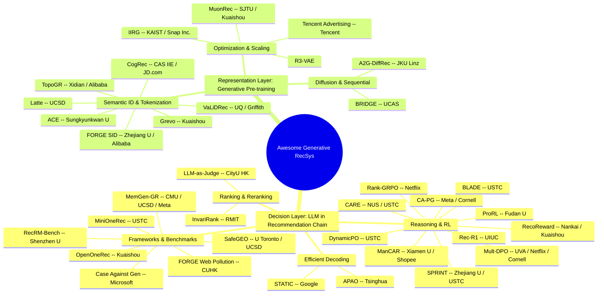

# Awesome Generative Recommendation System (RecSys)

```
 ██████╗                ██████╗                ███████╗                
██╔════╝  ███╗  ███╗    ██╔══██╗ ███╗   ███╗   ██╔════╝██╗ ██╗ ██████╗ 
██║      ██╔═██╗████╗   ██████╔╝██╔═██╗██╔═██╗ ███████╗╚██╗██║ ██╔═══╝ 
██║  ███╗██████║██╔██╗  ██╔══██╗██████║██║ ╚═╝ ╚════██║ ╚███╔╝ ██████╗ 
██║   ██║██║    ██║╚██╗ ██║  ██║██║    ██║ ██╗      ██║  ██╔╝      ██║
╚██████╔╝╚████╗ ██║ ╚██╗██║  ██║╚████╗ ╚███╔═╝ ███████║  ██║   ██████║
 ╚═════╝  ╚═══╝ ╚═╝  ╚═╝╚═╝  ╚═╝ ╚═══╝  ╚══╝   ╚══════╝  ╚═╝   ╚═════╝
```
---

[](https://github.com/sindresorhus/awesome)

RecSys is starting to adopt LLM for feature extraction, retrieval, and ranking/re-ranking! Although you can get some hands-on materials in either the [classics](#papers-classic-must-read) or some surveys, but since you're already interested in applying generative AI to industrial tasks, you probably wanna stay on the bleeding edge, right? That's exactly what this repo is for — automatically updated daily by agents with the latest generative RecSys papers fresh off arXiv, making sure that you never miss a beat.

> [!IMPORTANT]
> For those who are not familiar with GenRec, or not even the recommendation system, please checkout the kickstart posts [here](docs/kickstart.md).
> These posts are in Chinese, for English simply do your browser's internal translation or turn to __Ask Gemini__ :shipit:

## Quick Indexing
- [By Date](#by-date)
- [By Opensource](#by-opensource)
- [By Keyword](#by-keyword)
- [By Affiliation](#by-affiliation)


```mermaid
mindmap
  root((Awesome Generative RecSys))
    Decision Layer: LLM in Recommendation Chain
      Reasoning & RL
        Rank-GRPO -- Netflix
        DynamicPO -- USTC
        BLADE -- USTC
        SPRINT -- Zhejiang U / USTC
        Mult-DPO -- UVA / Netflix / Cornell
        CA-PG -- Meta / Cornell
        ProRL -- Fudan U
        Rec-R1 -- UIUC
        ManCAR -- Xiamen U / Shopee
        CARE -- NUS / USTC
        RecoReward -- Nankai / Kuaishou
      Ranking & Reranking
        InvariRank -- RMIT
        LLM-as-Judge -- CityU HK
      Frameworks & Benchmarks
        MiniOneRec -- USTC
        OpenOneRec -- Kuaishou
        RecRM-Bench -- Shenzhen U
        SafeGEO -- U Toronto / UCSD
        MemGen-GR -- CMU / UCSD / Meta
        FORGE Web Pollution -- CUHK
        Case Against Gen -- Microsoft
      Efficient Decoding
        STATIC -- Google
        APAO -- Tsinghua
    Representation Layer: Generative Pre-training
      Semantic ID & Tokenization
        Latte -- UCSD
        FORGE SID -- Zhejiang U / Alibaba
        ACE -- Sungkyunkwan U
        CogRec -- CAS IIE / JD.com
        Grevo -- Kuaishou
        VaLiDRec -- UQ / Griffith
        TopoGR -- Xidian / Alibaba
      Diffusion & Sequential
        A2G-DiffRec -- JKU Linz
        BRIDGE -- UCAS
      Optimization & Scaling
        MuonRec -- SJTU / Kuaishou
        Tencent Advertising -- Tencent
        IIRG -- KAIST / Snap Inc.
        R3-VAE
```
<div align="center">
  <i> Open-source Generative RecSys Map </i>
</div>

---
## By Date

### Papers July 30

*Thursday, July 30, 2026. Arxiv cs.IR new listing returned 5 genrec papers from July 29 submission window. Total: 5 papers.*

1. **Multi-Decoder OneRec: Controllable Generative Retrieval for Multi-Objective Industrial Recommendation**
   * Affiliation: Kuaishou Technology — *(You Wang, Zhao Liu, Guoping Tang, Yiqing Yang, Shuo Su, Jing Liu, Naifu Zhou, Xiaoyou Zhou, Wei Jiang, Jian Liang, Xiao Lv, Ruiming Tang, Liyin Hong, Wenwu Ou — Kuaishou)*
   * Link: [arxiv.org/abs/2607.26500](https://arxiv.org/abs/2607.26500)
   * Venue: arXiv preprint, July 2026
   * TL;DR: Controllable multi-objective generative retrieval with shared representations + per-objective LoRA experts + multi-decoder constrained beam search; releases Kwai26 benchmark with 1.31B records; deployed at Kuaishou with +0.37% app time, +2.09% cold-start.
   * Key techniques:
     - Multi-decoder architecture: shared user-context module + General Decoder, with isolated parameter-efficient LoRA experts per objective
     - Three training regimes: exposure-sample NTP (shared base), target-filtered NTP (event experts), KL-regularized policy optimization (watch-time expert)
     - Gradient routing isolating shared vs. objective-specific updates; General Decoder supplies stop-gradient reference
     - Multi-Decoder Constrained Beam Search reducing cross-route overlap at inference with explicit route quotas
     - Kwai26: publicly released large-scale multi-objective benchmark (1.31B records, 31.85M Item-IDs, 25.03M items with SIDs)
   * Scores (Opensource? / Novelty / Fairness / Robustness / Impact):
     - **Opensource?: 4/10** — Kwai26 benchmark publicly released (1.31B records, predefined splits, evaluation protocol); no model training code
     - **Novelty: 7/10** — First multi-decoder genrec with LoRA experts for controllable multi-objective retrieval; gradient routing + constrained beam search are well-motivated
     - **Fairness: 4/10** — Addresses cold-start content (+2.09%); multi-objective control enables balanced candidate composition
     - **Robustness: 8/10** — Production A/B at Kuaishou with consistent gains; 1.69-5.62% Recall improvement; cold-start improvements validated
     - **Impact: 8/10** — Kuaishou OneRec family; production-proven multi-objective genrec; Kwai26 fills benchmark gap for multi-objective evaluation

2. **WhisperRec: Latent Reasoning for Efficient Foundation Recommendation Models**
   * Affiliation: Kuaishou Technology — *(Hao Jiang, Peiru Du, Pengfei Yao, Mengting Li, Siyuan Lou, Kuo Cai, Sheng Yu, Qiang Luo, Jian Liang, Ruiming Tang, Fei Pan, Peng Jiang, Wenwu Ou — Kuaishou)*
   * Link: [arxiv.org/abs/2607.26621](https://arxiv.org/abs/2607.26621)
   * Venue: arXiv preprint, July 2026
   * TL;DR: Compresses explicit CoT reasoning into learnable latent tokens for foundation rec models; Multi-View Adaptive CoT adapts reasoning complexity per instance; +17.44% SID@64 over explicit CoT Think, 10x+ inference throughput.
   * Key techniques:
     - Latent-Reason-then-Answer paradigm: compresses teacher CoT into latent reasoning tokens, avoiding autoregressive rationale generation
     - Multi-View Adaptive CoT (MV-ACoT): constructs diverse CoT from complementary perspectives, adapts complexity (lightweight for clear cases, multi-factor for challenging ones)
     - Three-stage Latent Reasoning Alignment: progressively internalizes teacher CoT into latent representations
     - Curriculum-based post-training activating latent-token reasoning while preserving standard rec capability
   * Scores (Opensource? / Novelty / Fairness / Robustness / Impact):
     - **Opensource?: 0/10** — Code will be released upon publication (stated in paper)
     - **Novelty: 7/10** — First to compress CoT into latent tokens for foundation rec models; adaptive reasoning complexity per instance is well-motivated
     - **Fairness: 3/10** — Not addressing fairness
     - **Robustness: 7/10** — Industrial Kuaishou dataset + public LLM-Rec benchmark; +17.44% SID@64, 10x throughput; three-stage training validated
     - **Impact: 7/10** — Kuaishou; bridges LLM reasoning capability with recsys efficiency constraints; practical for industrial FRM deployment

3. **PSG: Pair-Space Generation for Efficient Generative Reranking**
   * Affiliation: Kuaishou Technology — *(Chao Feng, Li Ma, Xiancheng Gao, Chenghao Zhang, Yuanhao Pu, Xiang Li — Kuaishou)*
   * Link: [arxiv.org/abs/2607.26427](https://arxiv.org/abs/2607.26427)
   * Venue: arXiv preprint, July 2026
   * TL;DR: Elevates generative reranking atom from items to ordered item pairs; bijective mapping preserves expressiveness while halving generation steps; three theoretical guarantees (bijection, 2-4× speedup, 4× tighter suboptimality bound); deployed on Kuaishou with 1.83× speedup and +0.178% stay-time.
   * Key techniques:
     - Pair-Space Generation (PSG): treats ordered item pairs as generation tokens, generating L/2 tokens instead of L items
     - On-the-fly pair-token representations via pretrained pair encoder, eliminating data sparsity of quadratic vocabulary
     - Dynamic-vocabulary decoder scoring via inner product with encoder output, serving arbitrary candidate sets
     - Three theoretical guarantees: bijective expressiveness, 2-4× speedup, ~4× tighter suboptimality bound O((L/2)²ε̄)
     - Pair-space RL with action-mask constraints for item non-repetition
   * Scores (Opensource? / Novelty / Fairness / Robustness / Impact):
     - **Opensource?: 0/10** — No public code available
     - **Novelty: 8/10** — Elevating generation atom to ordered pairs is a fundamental reformulation; three theoretical guarantees with practical industrial validation
     - **Fairness: 3/10** — Not addressing fairness
     - **Robustness: 8/10** — Production-deployed on Kuaishou (400M DAU); 1.83× speedup; +0.178% stay-time lift; theoretical proofs provided
     - **Impact: 8/10** — Kuaishou; fundamentally new approach to generative reranking efficiency; applicable to any AR-based genrec system

4. **DIRECTOR: Dynamic Index-based Recommendation with Transport-Optimized Retrieval**
   * Affiliation: University of Science and Technology of China / Kuaishou Technology — *(Yuanhao Pu, Chenghao Zhang, Chao Feng, Xiang Li — Kuaishou; Defu Lian — USTC)*
   * Link: [arxiv.org/abs/2607.26418](https://arxiv.org/abs/2607.26418)
   * Venue: arXiv preprint, July 2026
   * TL;DR: Transport-guided parallel reranking combining optimal transport with non-autoregressive generation; entropy-regularized OT provides conflict-aware supervision; prefix-anchored credit assignment aligns opaque list-wise evaluator with position-specific training; achieves duplicate-free slates without iterative transport.
   * Key techniques:
     - Transport-guided parallel reranking: maps candidates to continuous latent space, generates dynamic retrieval indices for all positions in parallel
     - Entropy-regularized Optimal Transport for conflict-aware training supervision
     - Global hard matching at inference: produces duplicate-free slates without iterative transport
     - Prefix-anchored credit assignment: converts opaque list-wise scalar reward into position-specific training signals
     - Retains parallel NAR efficiency while introducing global structural coordination via OT guidance
   * Scores (Opensource? / Novelty / Fairness / Robustness / Impact):
     - **Opensource?: 0/10** — No public code available
     - **Novelty: 7/10** — First to combine optimal transport with NAR generation for reranking; prefix-anchored credit assignment is novel for list-wise reward alignment
     - **Fairness: 3/10** — Not addressing fairness
     - **Robustness: 7/10** — Industrial-scale deployment; consistent offline+online gains; OT framework provides theoretical grounding
     - **Impact: 7/10** — USTC/Kuaishou; practical parallel generative reranking with theoretical grounding in optimal transport

5. **Learning from the Future: Privileged Self-Distillation for Sequential Recommendation**
   * Affiliation: Alibaba Group / National University of Singapore / Renmin University of China — *(Jiakai Tang, Wen Chen, Jian Wu, Han Zhu — Alibaba; Yang Zhang; See-Kiong Ng — NUS; Xu Chen — Renmin U)*
   * Link: [arxiv.org/abs/2607.27055](https://arxiv.org/abs/2607.27055)
   * Venue: arXiv preprint, July 2026
   * TL;DR: Future interactions as training-only privileged information via dual-attention-mask self-distillation; shared backbone removes need for separate teacher; advantage-reachability gate focuses on prefix-supported signals; zero inference cost change.
   * Key techniques:
     - Privileged Self-Distillation (PSD): future-aware teacher view (past+future) distills into prefix-only student view (past only)
     - Dual attention masks on shared backbone: teacher advantage is purely informational, not architectural
     - Advantage-reachability gate: focuses distillation on teacher signals likely supported by observed prefix
     - Momentum-averaged teacher for stable targets; single-stage end-to-end training
     - Zero change to deployed model or inference cost
   * Scores (Opensource? / Novelty / Fairness / Robustness / Impact):
     - **Opensource?: 0/10** — No public code available
     - **Novelty: 6/10** — Privileged self-distillation using future interactions is a clean training technique; advantage-reachability gate is practical
     - **Fairness: 3/10** — Not addressing fairness
     - **Robustness: 7/10** — Multiple public benchmarks + diverse backbones (SASRec, BERT4Rec); single-stage training with consistent improvements
     - **Impact: 6/10** — Alibaba/NUS/Renmin; broadly applicable training technique for sequential recommendation; simple integration with existing models

### Papers July 29

*Wednesday, July 29, 2026. Arxiv cs.IR new listing returned 5 genrec papers from July 28 submission window. Total: 5 papers.*

1. **Grevo: A Unified Generative Recommendation Framework with Evolutionary Item Indexing**
   * Affiliation: Kuaishou Technology — *(Huanjie Wang, Liwei Guan, Zekai Sun, Hongwei Zhang, Honghui Bao — Kuaishou)*
   * Link: [arxiv.org/abs/2607.25329](https://arxiv.org/abs/2607.25329)
   * Venue: arXiv preprint, July 2026
   * TL;DR: Treats SID assignment as an evolvable discrete variable that adapts to behavioral feedback; single multitask recommender unifies SID generation + semantic grounding, eliminating the need for separate tokenizer, alignment losses, or alternating-optimization schedules.
   * Key techniques:
     - Evolutionary Item Indexing: SID assignment as a budgeted feedback-driven search using trained recommender as posterior evaluator
     - Single multitask recommender absorbing tokenizer's role: behavioral SID generation + semantic SID grounding in one model
     - Fixed vocabulary and length; no second learnable model, no alignment losses, no alternating-optimization
     - Stable identifier evolution under closed-world SID vocabulary constraints
   * Scores (Opensource? / Novelty / Fairness / Robustness / Impact):
     - **Opensource?: 0/10** — No public code available
     - **Novelty: 7/10** — First to frame SID assignment as evolutionary search rather than learning; unified single-model approach eliminates tokenizer-as-separate-entity
     - **Fairness: 3/10** — Not addressing fairness
     - **Robustness: 6/10** — Multiple real-world datasets; consistent outperformance over SOTA genrec methods; no industrial deployment reported
     - **Impact: 7/10** — Kuaishou; practical alternative to end-to-end SID-recommender co-training with simpler architecture

2. **VaLiDRec: Variable-Length LLM-Aligned Semantic IDs for Generative Recommendation**
   * Affiliation: University of Queensland / Griffith University — *(Shutong Qiao, Wei Yuan, Tong Chen, Hao Wang, Quoc Viet Hung Nguyen, Hongzhi Yin — UQ/Griffith)*
   * Link: [arxiv.org/abs/2607.25209](https://arxiv.org/abs/2607.25209)
   * Venue: arXiv preprint, July 2026
   * TL;DR: Constructs variable-length SIDs from native LLM vocabulary tokens via importance estimation + pruning + collision refinement; graph-aware soft prompts + token-set prediction eliminate autoregressive decoding with 87.49× faster inference than LC-Rec.
   * Key techniques:
     - LLM-native SID construction: token importance estimation → semantic-quality-aware pruning → collision-aware refinement
     - Variable-length identifiers adapting to item semantic complexity (no fixed-length overhead)
     - Token-set prediction with token-level item scoring replacing autoregressive SID generation and beam search
     - Graph-aware soft prompts for user preference encoding
     - Zero-shot cold-start: superior performance without retraining on completely new items
   * Scores (Opensource? / Novelty / Fairness / Robustness / Impact):
     - **Opensource?: 0/10** — No public code available
     - **Novelty: 7/10** — First to construct LLM-native variable-length SIDs directly from vocabulary tokens; token-set prediction paradigm is a clean break from autoregressive genrec
     - **Fairness: 4/10** — Zero-shot cold-start evaluation benefits new/niche items
     - **Robustness: 7/10** — 4 real-world datasets; 87.49× faster inference; consistent SOTA outperformance
     - **Impact: 7/10** — UQ (Hongzhi Yin); paradigm-shifting: eliminates beam search and autoregressive decoding for genrec, opens new efficient genrec direction

3. **TopoGR: Revealing and Preserving Latent Structure of Semantic ID in Generative Recommendation**
   * Affiliation: Xidian University / Alibaba Group — *(Ziyu Zheng, Zhengshun Du, Yaming Yang, Bin Tong, Guan Wang, Meng Yan, Ziyu Guan, Wei Zhao — Xidian U/Alibaba)*
   * Link: [arxiv.org/abs/2607.25216](https://arxiv.org/abs/2607.25216)
   * Venue: arXiv preprint, July 2026
   * TL;DR: Identifies structural mismatch between SID tokenizer (structured code space) and generator (independent categorical symbols); proposes Bit-decomposable Binary SIDs with explicit Hamming geometry preserved through input, training, and inference stages.
   * Key techniques:
     - Bit-decomposable Semantic ID (Binary SID): deterministically convertible to integer SID with explicit Hamming geometry
     - Three-stage topology preservation: binary SID features at input layer preserve Hamming proximity; Hamming soft targets inject topology-aware supervision; Hamming-consistent reranking at inference
     - Captures item relatedness beyond exact SID overlap through Hamming distance
     - Standard SID generator consumes Binary SID tokens as regular categorical inputs (zero architecture change)
   * Scores (Opensource? / Novelty / Fairness / Robustness / Impact):
     - **Opensource?: 0/10** — No public code available
     - **Novelty: 7/10** — First to expose and exploit SID topology through Hamming geometry; Binary SID is a simple but effective intervention
     - **Fairness: 3/10** — Not addressing fairness
     - **Robustness: 6/10** — 4 benchmark datasets; consistent SOTA; Hamming topology is theoretically grounded
     - **Impact: 6/10** — Xidian U/Alibaba; practical topology-preserving approach for improving SID-based genrec quality

4. **RecoReward: Recommender-Guided Multimodal Description Generation for Recommendation**
   * Affiliation: Nankai University / Kuaishou Technology — *(Guohong Mu, Yueyang Liu, Jiangxia Cao, Changxin Lao, Zijie Zhuang, Yuhui Zhang, Jiaqi Feng, Ruochen Yang, Shuang Yang, Zhaojie Liu, Qibin Hou — Nankai/Kuaishou)*
   * Link: [arxiv.org/abs/2607.25901](https://arxiv.org/abs/2607.25901)
   * Venue: arXiv preprint, July 2026
   * TL;DR: Trains MLLMs to generate recommendation-optimized item descriptions using behavior-derived RL rewards during training while preserving content-only inference; Recommender Affinity Score contrasts engaged vs. non-target users; deployed on Kuaishou live-stream with online A/B gains.
   * Key techniques:
     - Recommender Affinity Score (RAS): contrasts historically engaged users vs. observational non-target users to estimate shared affinity
     - Reinforcement learning with RAS as reward: trains MLLM to emphasize rec-relevant semantics without user-conditioning
     - Content-only inference after RL training: generates single shared description without user inputs at serving
     - Proxy user strategy: historically engaged users as proxy for future targets
     - RecoReward-9B built on Qwen3.5-9B; deployed on live-stream recommendation
   * Scores (Opensource? / Novelty / Fairness / Robustness / Impact):
     - **Opensource?: 0/10** — No public code available
     - **Novelty: 7/10** — First RL-trained MLLM for recommendation-optimized item description; content-only inference after behavior-derived training is novel
     - **Fairness: 3/10** — Not addressing fairness
     - **Robustness: 7/10** — Offline benchmark (7 recall metrics) + online A/B testing; Qwen3.5-9B as strong baseline
     - **Impact: 7/10** — Nankai/Kuaishou; bridges MLLM content generation with recommendation optimization; practical for industrial multimodal rec

5. **The Case Against Generation for Retrieval: Discriminative Language Models as Effective Retrievers**
   * Affiliation: Microsoft — *(Zhe Xu, Prachi Agrawal, Kavosh Asadi, Tianyi Chen, Carl Hu, Justin Johnson, Wuwei Lan, Mingfu Liang, Xi Liu, Tik On Lui, Oladipo Ositelu, Sandeep Pandey, Ankit Peshin, Feng Qi, Anil Ramakrishna, Kaushik Rangadurai, Frank Shyu, Luke Simon, Yang Yang, Chiyu Zhang — Microsoft)*
   * Link: [arxiv.org/abs/2607.25346](https://arxiv.org/abs/2607.25346)
   * Venue: arXiv preprint, July 2026
   * TL;DR: Argues against generative retrieval at web-scale; revitalizes two-tower architecture with LLM backbone + EOS token pooling + knowledge distillation + latent reasoning; matches genrec SOTA with far lower latency on production systems.
   * Key techniques:
     - Shared LLM encoder for joint user-item representation learning
     - End-of-Sentence (EOS) token pooling for compact sequence embedding
     - Knowledge distillation from cross-encoder teachers into two-tower student
     - Cross-dataset transfer learning + latent reasoning within user tower
     - Production evaluation: high resilience to model staleness, superior data scaling
   * Scores (Opensource? / Novelty / Fairness / Robustness / Impact):
     - **Opensource?: 0/10** — No public code available
     - **Novelty: 7/10** — Takes a principled stand against generative retrieval, making the case for discriminative efficiency; LLM-native two-tower is a compelling counterpoint
     - **Fairness: 3/10** — Not addressing fairness
     - **Robustness: 8/10** — 3 public benchmarks + internal production; staleness resilience + data scaling analysis; large author team
     - **Impact: 8/10** — Microsoft; important counterpoint to the genrec paradigm; practical for web-scale retrieval where generation overhead is prohibitive


### Papers July 28

*Tuesday, July 28, 2026. Arxiv cs.IR new listing returned 5 genrec papers from July 27 submission window. Total: 5 papers.*

1. **LaRec: Unleashing LLM-based Latent Reasoning for Generative Recommendation**
   * Affiliation: University of Chinese Academy of Sciences / Xiaohongshu — *(Yu Xia — UCAS; Zihan Lin, Wei Yang, Rui Zhong, Cheng Chen, Huan Ren, Yao Hu — Xiaohongshu)*
   * Link: [arxiv.org/abs/2607.24617](https://arxiv.org/abs/2607.24617)
   * Venue: arXiv preprint, July 2026
   * TL;DR: Latent reasoning framework for LLM-based generative recommendation with personalized Gaussian Mixture Distribution RL-tuning; addresses fine-grained supervision gap and single reasoning path limitations without explicit CoT overhead.
   * Key techniques:
     - Latent Pre-training: step-level alignment + process direction alignment for rich latent reasoning supervision
     - Personalized RL-tuning: constructs per-user Gaussian Mixture Distribution from historical interests, samples diverse reasoning paths
     - Two-stage framework balancing latent reasoning efficiency with multi-faceted user interest exploration
   * Scores (Opensource? / Novelty / Fairness / Robustness / Impact):
     - **Opensource?: 0/10** — No public code available
     - **Novelty: 7/10** — Personalized multi-path latent reasoning via Gaussian Mixture Model is novel; addresses two fundamental latent reasoning challenges
     - **Fairness: 3/10** — Not addressing fairness
     - **Robustness: 6/10** — Multiple datasets; comparable efficiency baselines validated; ablation on both stages
     - **Impact: 7/10** — UCAS/Xiaohongshu; practical latent reasoning framework bridging efficiency and exploration for industrial LLM-based genrec

2. **OxygenREC-v2: Internalizing Discrimination into Generative Recommendation**
   * Affiliation: JD.com — *(Guo Tang, Hanye Wu, Changjiang Han, Qingyang Li, Ming Zhang, Xiangyu Qian, Yanchen Qiao, Huanjie Wang, Zhi Ma, Zhen Li, Yaqiang Zang, Pinghua Gong — JD.com)*
   * Link: [arxiv.org/abs/2607.24255](https://arxiv.org/abs/2607.24255)
   * Venue: arXiv preprint, July 2026
   * TL;DR: Internalizes behavior discrimination into generative recommendation via behavior-conditioned generation + entropy-aware trajectory optimization; 3B MoE deployed at JD.com with +1.6–4.4% UCTCVR, +2.8–6.8% GMV over v1; reward-model-free policy optimization.
   * Key techniques:
     - IDGR (Internalized Discrimination into Generative Recommendation): behavior instruction conditions generation from first decoder step
     - Entropy-aware trajectory optimization self-distillation: uses future interactions as privileged knowledge
     - Reward-model-free policy optimization: removes proxy reward model, eliminating reward hacking risk
     - Single unified backbone across both pre-training and post-training stages; 3B-parameter, 1B-activated MoE
   * Scores (Opensource? / Novelty / Fairness / Robustness / Impact):
     - **Opensource?: 0/10** — No public code available (JD.com internal production)
     - **Novelty: 7/10** — Internalizing discrimination via behavior conditioning is a clean alternative to co-training and RL-reward paradigms
     - **Fairness: 3/10** — Not addressing fairness
     - **Robustness: 8/10** — 3B MoE deployed at JD.com scale; multiple online A/B with consistent gains; UCTCVR +4.4%, GMV +6.8%
     - **Impact: 8/10** — JD.com; OxygenREC series established as major industrial genrec framework; practical behavior integration paradigm

3. **CogRec: Structure-Cognitive Fast-and-Slow Reasoning for Generative Recommendation**
   * Affiliation: Chinese Academy of Sciences (Institute of Information Engineering) / University of Chinese Academy of Sciences / Beijing Normal University / JD.com — *(Xiang Liu, Shuqi Zhao, Pengbo Mo, Mingming Li, Jiao Dai, Jizhong Han, Songlin Hu — CAS IIE/UCAS; Jingsong Su — BNU; Yiming Qiu, Huimu Wang — JD.com)*
   * Link: [arxiv.org/abs/2607.24402](https://arxiv.org/abs/2607.24402)
   * Venue: arXiv preprint, July 2026
   * TL;DR: Grounds intermediate reasoning in SID topology via SID Routing (Match/LateralJump/Explore); augments vertical SID hierarchy with intra-layer graphs + item neighborhoods; supervised multi-stage pipeline with shared trie-constrained output.
   * Key techniques:
     - SID Routing: layer-wise Match (fast localization), LateralJump (cross-layer navigation), Explore (slower structural search)
     - Augmented SID topology: intra-layer semantic graphs + item-level neighborhoods beyond vertical hierarchy
     - Multi-stage supervised pipeline: SID token alignment → direct generation → NL + SID-routing branches from shared checkpoint
     - Structure-grounded reasoning most useful when prefix matching insufficient but learnable SID-space transitions available
   * Scores (Opensource? / Novelty / Fairness / Robustness / Impact):
     - **Opensource?: 6/10** — [github.com/caskcsg/CogRec](https://github.com/caskcsg/CogRec) — 3 commits, 0⭐; well-documented README with full reproduction protocol; clean modular structure (config/data/model/train/test); no license; anonymized release with visualization/GRPO code excluded; functional and reproducible
     - **Novelty: 7/10** — First to ground fast-and-slow reasoning in SID topology; SID Routing operations are conceptually clean and well-motivated
     - **Fairness: 3/10** — Not addressing fairness
     - **Robustness: 6/10** — 3 public Amazon benchmarks; consistent SID Routing improvement over direct generation; analysis of when reasoning helps vs. hurts (weak routes → accumulated errors)
     - **Impact: 6/10** — CAS IIE; opens new direction for structure-grounded reasoning in SID-based generative recommendation with interpretable routing operations

4. **EGR: Embedding-Native Generative Retrieval with a Shared LLM**
   * Affiliation: Snap Inc. — *(Xiaodong Liu, Congfei Zhang, Hsiang-wei Chao, Siman Wang, Tong Zhao, Xiao Bai, Vincent Zhang, Jingxiao Ma, Zhe Liu, Wenfeng Zhuo, Zichu Li, Jitin Krishnan, Yunzhi Zhou, Yajun Wang, Jinchao Li, Yu Zhang — Snap Inc.)*
   * Link: [arxiv.org/abs/2607.23038](https://arxiv.org/abs/2607.23038)
   * Venue: RecSys 2026
   * TL;DR: Single shared LLM learns item+user representations in one embedding space with joint contrastive training; items indexed as dense vectors eliminating SID quantization; deployed on Snap DPA with +2.91% conversion-rate lift.
   * Key techniques:
     - Shared LLM encoding both item metadata and user interaction histories into unified embedding space
     - Dense vector indexing bypassing SID quantization and mutable identifier vocabularies
     - Joint contrastive training grouping related items and aligning queries with target items
     - Handles cold-start items natively; benefits from multimodal input; scales with data
   * Scores (Opensource? / Novelty / Fairness / Robustness / Impact):
     - **Opensource?: 0/10** — No public code available (Snap Inc. internal production)
     - **Novelty: 7/10** — Embedding-native GR paradigm avoids quantization artifacts; shared LLM for both sides is novel compared to separate encoder-generator designs
     - **Fairness: 3/10** — Not addressing fairness
     - **Robustness: 8/10** — RecSys 2026 peer-reviewed; public benchmarks + industrial data + live Snap DPA deployment; +2.91% CVR
     - **Impact: 8/10** — RecSys 2026; Snap Inc.; practical alternative to SID-based generative retrieval for large-scale advertising

5. **MIRAGE: Escaping the Euclidean Void — Manifold-Informed Flow Matching for Sequential Recommendation**
   * Affiliation: Jilin University / City University of Hong Kong — *(Dengzhao Fang, Yu Li, Yi Chang — Jilin University; Jingtong Gao, Xiangyu Zhao — CityU HK)*
   * Link: [arxiv.org/abs/2607.23762](https://arxiv.org/abs/2607.23762)
   * Venue: arXiv preprint, July 2026
   * TL;DR: Identifies "Euclidean void" in flow matching for sequential recommendation — straight paths crossing unsupported embedding regions; rectifies geometry via item co-occurrence graph topology regularization; enables accurate one-step inference.
   * Key techniques:
     - Euclidean void formalization: straight probability paths crossing regions with no valid item semantics
     - MIRAGE manifold-informed rectification: reorganizes item embeddings via co-occurrence graph anchors without changing probability path
     - Training-time topology regularization with zero inference overhead (graph used only during training)
     - One-step inference preserving flow matching efficiency while boosting sparse target performance
   * Scores (Opensource? / Novelty / Fairness / Robustness / Impact):
     - **Opensource?: 0/10** — No public code available (will be released upon publication)
     - **Novelty: 7/10** — First to identify and formalize Euclidean void in generative SR flow matching; manifold-informed rectification is principled
     - **Fairness: 4/10** — Boosted performance on sparsely observed targets benefits long-tail items
     - **Robustness: 6/10** — 4 real-world datasets; consistent SOTA improvements; topology regularization is theoretically grounded
     - **Impact: 5/10** — Jilin University/CityU HK; opens new direction for geometric awareness in continuous generative recommendation

### Papers July 27

*Monday, July 27, 2026. Arxiv cs.IR new listing returned 5 relevant genrec/recsys papers (light day for generative recommendation — most papers are general recsys/systems). No fallback needed.*

1. **PinEqualizer: Full Funnel Content Exploration and Debiasing System at Pinterest**
   * Affiliation: Pinterest Inc. — *(Olafur Gudmundsson, Bo Zhao, Huayi Liao, Anna Kiyantseva, Sai Xiao, Heath Vinicombe, Mostafa Keikha, Luke DeLuccia, Zihao Chen, Junpeng Hou, Weijie Jiang, Bhawna Juneja, Andreanne Lemay, Wei-Ting Lin, Keyvan Moghadam, Jiaxing Qu, Zhiqing Rao, Zhihua Zhang — Pinterest)*
   * Link: [arxiv.org/abs/2607.22518](https://arxiv.org/abs/2607.22518)
   * Venue: KDD 2026
   * TL;DR: Full-funnel content cold-start debiasing system spanning multi-stage recommendation/search at Pinterest; reduces popularity bias favoring existing content; scalable measurement framework enabling fast experimentation while validating long-term impact; deployed over 2 years with significant engagement gains.
   * Key techniques:
     - Full-funnel coverage: spans entire multi-stage pipeline for both search and recommendation surfaces
     - Bias reduction: reduces bias favoring existing/popular content allowing more accurate prediction for new content
     - Scalable measurement framework: fast short-term experimentation + long-term impact validation
     - Production-deployed over 2 years with verified improvements in fresh content exploration and overall engagement
   * Scores (Opensource? / Novelty / Fairness / Robustness / Impact):
     - **Opensource?: 0/10** — No public code available (Pinterest internal production)
     - **Novelty: 5/10** — Full-funnel debiasing approach is practical but systems contribution; measurement framework is well-designed
     - **Fairness: 7/10** — Directly addresses content cold-start fairness and popularity bias in industrial recommendation
     - **Robustness: 8/10** — KDD 2026 peer-reviewed; deployed for 2 years at Pinterest scale with verified engagement gains
     - **Impact: 8/10** — KDD 2026; Pinterest; practical full-funnel debiasing blueprint for industrial content platforms

2. **SIREN (Luring LLMs onto the Rocks): PAIR-Driven Preference Manipulation in Web-RAG Recommenders**
   * Affiliation: University of Queensland — *(Evan Caville, Siamak Layeghy, Billy Sung, Sara Dolnicar, Marius Portmann — UQ)*
   * Link: [arxiv.org/abs/2607.21951](https://arxiv.org/abs/2607.21951)
   * Venue: arXiv preprint, July 2026
   * TL;DR: First controlled study of competitive rank manipulation in production LLM-based Web-RAG recommenders; adapts PAIR jailbreaking loop with 23 content-poisoning techniques; achieves rank-1 across 62/124 technique trials with 80.5% reproduction success rate; fixed-source replay isolates content effects from retrieval differences.
   * Key techniques:
     - Automated attacker-judge method adapting PAIR jailbreaking loop to competitive rank manipulation
     - Taxonomy of 23 content-poisoning techniques (declarative ranking claims, seeded lists, directive injections)
     - Custom RAG replay platform keeping same sources in same order for controlled experiments
     - Cross-session reproduction testing at 80.5% mean success rate on production Claude models
   * Scores (Opensource? / Novelty / Fairness / Robustness / Impact):
     - **Opensource?: 0/10** — No public code available
     - **Novelty: 6/10** — First controlled rank manipulation study in Web-RAG recommenders; 23-technique taxonomy is systematic
     - **Fairness: 5/10** — Addresses adversarial fairness and manipulation risks in LLM-based recommendation
     - **Robustness: 6/10** — Two production Claude models; cross-session reproduction validation; 124 technique trials
     - **Impact: 6/10** — U Queensland; important security contribution for emerging Web-RAG recommendation paradigm

3. **Probabilistic Residual Learning for Online Recommendations (PRL)**
   * Affiliation: Rutgers University / Meta / National University of Singapore / Columbia University — *(Wenyuan Wang, Yusong Zhao, Zihao Xu, Hengyi Wang, Qi Xu — Rutgers; Zhigang Hua, Yan Xie, Yi Wang, Zihao Zhao, Bo Long, Shuang Yang — Meta; Hengguan Huang — NUS; Chengzhi Mao — Columbia; Hao Wang — Rutgers)*
   * Link: [arxiv.org/abs/2607.20863](https://arxiv.org/abs/2607.20863)
   * Venue: RecSys 2026
   * TL;DR: Causal Bayesian plug-and-play framework for systematically enhancing existing deep learning recommender systems by modeling residual between ground-truth and base predictions; probabilistic user clustering + domain-level confounder modeling via do-calculus; compatible with various base recommenders.
   * Key techniques:
     - Probabilistic user grouping for localized residual modeling
     - Domain-level confounder modeling influencing user and item representations
     - Causal intervention via do-calculus aggregating cluster-specific residual predictions
     - Plug-and-play: compatible with various base deep learning recommender systems
   * Scores (Opensource? / Novelty / Fairness / Robustness / Impact):
     - **Opensource?: 0/10** — No public code available
     - **Novelty: 5/10** — Causal residual learning for recsys is a practical extension; do-calculus integration is well-motivated
     - **Fairness: 4/10** — Probabilistic clustering may help fairness through localized modeling; not primary focus
     - **Robustness: 7/10** — RecSys 2026 peer-reviewed; compatible with multiple base recommender architectures
     - **Impact: 6/10** — RecSys 2026; Rutgers/Meta/NUS/Columbia; practical plug-and-play framework for recommendation enhancement

4. **RankGraph-2: Lifecycle Co-Design for Billion-Node Graph Learning in Recommendation**
   * Affiliation: Meta — *(Renzhi Wu, Zikun Cui, Junjie Yang, Tai Guo, Hong Li, Xian Chen, Li Yu, Ke Pan, Sri Reddy, Mahesh Srinivasan, Nipun Mathur, Haomin Yu, Hong Yan — Meta)*
   * Link: [arxiv.org/abs/2606.18379](https://arxiv.org/abs/2606.18379)
   * Venue: arXiv preprint, June 2026 (v4 July 2026)
   * TL;DR: Lifecycle co-design of graph construction, representation learning, and real-time serving for billion-node recommendation retrieval at Meta; popularity-bias-corrected subsampling compresses trillions→hundreds of billions of edges; co-learned residual-quantization cluster index reduces serving cost 83%; powers 20+ retrieval launches with +0.96% CTR, +2.75% CVR.
   * Key techniques:
     - Lifecycle co-design: graph construction + representation learning + serving jointly optimized
     - Popularity-bias-corrected subsampling: reduces hundreds of trillions to hundreds of billions of edges
     - Co-learned residual-quantization cluster index for 83% serving cost reduction
     - Pre-computed multi-hop neighborhoods via personalized PageRank eliminating online graph infrastructure
   * Scores (Opensource? / Novelty / Fairness / Robustness / Impact):
     - **Opensource?: 0/10** — No public code available (Meta internal production)
     - **Novelty: 6/10** — Lifecycle co-design is practical; co-learned cluster index for similarity-based retrieval is well-engineered
     - **Fairness: 5/10** — Popularity bias correction in subsampling addresses graph construction fairness
     - **Robustness: 8/10** — Deployed at Meta; 20+ retrieval launches; verified CTR/CVR gains at billion-node scale
     - **Impact: 7/10** — Meta; important infrastructure contribution for graph-based recommendation at unprecedented scale

5. **Bringing GRACE to Recommendation: Fine-Tuning for Sustainable and Accurate Personalization**
   * Affiliation: Shandong University / Nanyang Technological University — *(Yibowen Zhao, Yinan Zhang, Ning Liu, Lizhen Cui — Shandong U; Chunyan Miao — NTU)*
   * Link: [arxiv.org/abs/2607.22341](https://arxiv.org/abs/2607.22341)
   * Venue: arXiv preprint, July 2026
   * TL;DR: Fine-tuning framework integrating sustainability signals (eco-scores, health indices) into pretrained recommendation models via differentiable approximation and gradient projection; avoids training from scratch or inference-time reranking; balances green objectives with personalization accuracy via preference-anchored updates.
   * Key techniques:
     - Differentiable approximation of discrete sustainability values enabling direct gradient-based optimization
     - Gradient projection mechanism mitigating conflicts between green objective and accuracy objective
     - Controllable preference-anchored update mechanism balancing sustainability and personalization
     - Fine-tuning paradigm avoiding costly retraining or inference-time reranking
   * Scores (Opensource? / Novelty / Fairness / Robustness / Impact):
     - **Opensource?: 0/10** — No public code available
     - **Novelty: 5/10** — Differentiable green optimization + gradient projection is a practical approach for sustainable recsys
     - **Fairness: 6/10** — Directly addresses sustainability/health fairness through green recommendation
     - **Robustness: 5/10** — Real-world datasets; gradient projection mechanism provides theoretical grounding
     - **Impact: 5/10** — Shandong U/NTU; practical contribution to emerging green recommendation paradigm

### Papers July 26

*Sunday, July 26, 2026. Arxiv inactive (weekend). Applied 3-month fallback strategy → found 5 missed papers from February–June 2026 (CaLIR Beihang/Meituan/Renmin latent reasoning GR, SynGR Beihang ICML 2026 cross-modal GR opensource, OneFeed unified feed-query GR, DREAM Kuaishou CIKM 2026 cold-start SID refinement, SimGR Central South U/PolyU latent-space genrec opensource). Total: 5 papers.*

1. **Beyond Matching: Category-Guided Latent Intent Reasoning for Generative Retrieval in E-Commerce (CaLIR)**
   * Affiliation: Beihang University / Meituan / Renmin University of China / Beijing Information Science and Technology University — *(Fuwei Zhang, Xiaoyu Liu, Jiajie Jin, Jiale Mao, Wei Chen, Dongbo Xi, Yifan Yang, Peng Yan — Beihang/Meituan; Zichao Hao — BISTU; Zhao Zhang, Fuzhen Zhuang — Beihang)*
   * Link: [arxiv.org/abs/2606.07075](https://arxiv.org/abs/2606.07075)
   * Venue: arXiv preprint, June 2026
   * TL;DR: Replaces explicit CoT reasoning in e-commerce generative retrieval with continuous latent intent states guided by product category hierarchies; achieves better retrieval-inference efficiency trade-off while maintaining robustness across hierarchies and generative backbones.
   * Key techniques:
     - Hierarchical Semantic Reasoning (HSR): aligns latent states with category-level shopping intent using product category hierarchies as coarse-to-fine scaffold
     - Query-wise Reasoning Enhancement (QRE): multi-positive InfoNCE loss regularizing latent states to model diverse intent paths
     - Query-specific dynamic prefix trie: assembled from pre-indexed category-level tries with reasoning-aware constrained decoding
     - Latent intent reasoning: learns continuous hidden states before SID decoding, avoiding explicit CoT generation cost
   * Scores (Opensource? / Novelty / Fairness / Robustness / Impact):
     - **Opensource?: 0/10** — No public code available
     - **Novelty: 7/10** — First to replace explicit CoT with category-guided latent reasoning for generative retrieval; hierarchical reasoning scaffold is well-motivated
     - **Fairness: 3/10** — Not addressing fairness
     - **Robustness: 7/10** — Multilingual e-commerce datasets; transferability demonstrated across induced hierarchies and different generative backbones (Qwen3 included)
     - **Impact: 7/10** — Beihang/Meituan/Renmin; practical framework for efficient e-commerce generative retrieval balancing accuracy and latency

2. **SynGR: Unleashing the Potential of Cross-Modal Synergy for Generative Recommendation**
   * Affiliation: Beihang University — *(Wei Chen, Xingyu Guo, Shuang Li, Fuwei Zhang, Meng Yuan, Jing Fan, Zhao Zhang, Deqing Wang, Fuzhen Zhuang — Beihang)*
   * Link: [arxiv.org/abs/2605.18920](https://arxiv.org/abs/2605.18920)
   * Venue: ICML 2026
   * TL;DR: Enforces cross-modal synergistic dependencies by constraining overreliance on dominant modalities during generative recommendation; captures emergent item properties beyond shared or modality-specific signals; +9.01% average improvement on 3 benchmarks.
   * Key techniques:
     - Dominant modality masking: identifies and masks top salient tokens in the dominant modality to force cross-modal synergy exploitation
     - Synergistic-aware contrastive learning: triplet loss (masked anchor, original positive, unimodal negatives) promoting cross-modal interaction
     - PID-inspired performance decomposition quantifying synergistic, redundant, and unique information across modalities
     - Mask ratio tuning controlling the balance between unimodal sufficiency and cross-modal dependency
   * Scores (Opensource? / Novelty / Fairness / Robustness / Impact):
     - **Opensource?: 7/10** — [github.com/gxingyu/SynGR](https://github.com/gxingyu/SynGR) — 7 commits, ICML 2026 artifact; complete training pipeline (data processing, indexing, pretrain, finetune); well-documented README with hyperparameter space; based on MQL4GRec; no license
     - **Novelty: 7/10** — First to explicitly model and exploit cross-modal synergistic information in generative recommendation; PID-inspired decomposition is novel
     - **Fairness: 3/10** — Not addressing fairness
     - **Robustness: 7/10** — ICML 2026 peer-reviewed; 3 benchmark datasets (Amazon categories); consistent 9.01% average improvement
     - **Impact: 7/10** — ICML 2026; Beihang (Fuzhen Zhuang's group); opens new direction for multimodal synergy in generative recommendation

3. **OneFeed: A Unified Generative Framework for Feed Content Enhancement and Query Generation**
   * Affiliation: Independent (Guo Xun — industry practitioner, ex-Huawei/Alibaba/Baidu) — *(Guo Xun)*
   * Link: [arxiv.org/abs/2606.07972](https://arxiv.org/abs/2606.07972)
   * Venue: arXiv preprint, June 2026
   * TL;DR: Unified generative framework jointly modeling feed SID generation and search query generation from shared behavior encoder; SID-Query alignment objective bridges semantic gap; closed-loop self-enhancement paradigm leverages implicit feedback.
   * Key techniques:
     - Shared behavior encoder processing heterogeneous user behavior sequences (action type, SID, query, temporal, interaction strength)
     - Dual generative heads: Feed Semantic ID Generator (recommendation retrieval) + Intent Query Generator (search expansion)
     - SID-Query alignment objective learning shared semantic space for content SIDs and query representations
     - Closed-loop self-enhancement paradigm using implicit user feedback to improve both generation tasks
   * Scores (Opensource? / Novelty / Fairness / Robustness / Impact):
     - **Opensource?: 0/10** — No public code available (torch-free prototype mentioned but not released)
     - **Novelty: 6/10** — First to unify feed recommendation and search query generation in a single generative framework; closed-loop self-enhancement is practical
     - **Fairness: 3/10** — Not addressing fairness
     - **Robustness: 4/10** — Single-author paper; experimental protocol provided but results are expected/estimated rather than fully empirical; minimal local prototype validates executability
     - **Impact: 5/10** — Independent (Guo Xun); provides extensible direction for search-recommendation unification; design paper with practical blueprint

4. **DREAM: Dynamic Refinement of Early Assignment Mappings**
   * Affiliation: Kuaishou Technology — *(Liwei Guan, Huanjie Wang, Hongwei Zhang, Linxun Chen, Zhaojie Liu — Kuaishou)*
   * Link: [arxiv.org/abs/2606.06947](https://arxiv.org/abs/2606.06947)
   * Venue: CIKM 2026
   * TL;DR: Identifies early static SID commitment as the fundamental cold-start bottleneck in generative recommendation (not model capacity); three-stage progressive refinement: intent-aware tokenizer → backbone evaluator → dynamic beam mechanism maintaining multiple weighted SID hypotheses.
   * Key techniques:
     - Intent-aware tokenizer: counterfactual contrastive learning rebuilding SID space to generate diverse behavior-aligned candidates per cold-start item
     - Frozen backbone evaluator: selects most reliable SID candidate based on multi-context user support without retraining
     - Dynamic beam mechanism: maintains multiple weighted SID hypotheses throughout training and inference, preventing premature collapse
     - Decomposes cold-start bottleneck into: unsupported assignment, premature commitment, and inference-time single-path constraint
   * Scores (Opensource? / Novelty / Fairness / Robustness / Impact):
     - **Opensource?: 0/10** — No public code available
     - **Novelty: 7/10** — First to identify early static commitment as fundamental cold-start bottleneck distinct from model capacity; three-stage refinement framework is well-motivated
     - **Fairness: 5/10** — Directly targets cold-start item reachability which is a fairness concern; benefits tail/cold items
     - **Robustness: 7/10** — CIKM 2026 peer-reviewed; 3 Amazon benchmarks with consistent cold-start metric improvements
     - **Impact: 7/10** — CIKM 2026; Kuaishou; addresses critical cold-start limitation in SID-based generative recommendation with practical refinement framework

5. **SimGR: Escaping the Pitfalls of Generative Decoding in LLM-based Recommendation**
   * Affiliation: Central South University / Hong Kong Polytechnic University / National University of Defense Technology / City University of Macau / Griffith University — *(Yuanbo Zhao, Ruochen Liu, Senzhang Wang, Jun Yin — Central South U; Yuxin Dong — PolyU; Huan Gong — NUDT; Hao Chen — City U Macau; Shirui Pan — Griffith; Chengqi Zhang — UTS)*
   * Link: [arxiv.org/abs/2602.07847](https://arxiv.org/abs/2602.07847)
   * Venue: arXiv preprint, February 2026
   * TL;DR: Identifies systematic bias in LLM-based genrec from token-level generation approximation; proposes directly modeling item-level preference distributions in shared latent space and ranking by similarity; achieves higher accuracy, diversity, and coverage with better scaling behavior.
   * Key techniques:
     - Theoretical analysis proving token-level generation cannot faithfully substitute item-level generation (beam search pruning → incomplete coverage; parallel generation → token independence distortion)
     - SimGR framework: directly models item-level preference distributions in shared latent space, ranks by similarity
     - Mean pooling aggregation of SID token embeddings into item representations
     - Higher Entropy@K and item coverage (22.04% vs 11.50% LC-Rec, 18.71% RPG) indicating more balanced exposure distribution
   * Scores (Opensource? / Novelty / Fairness / Robustness / Impact):
     - **Opensource?: 5/10** — [anonymous.4open.science/r/SimGR-C408](https://anonymous.4open.science/r/SimGR-C408) — anonymous review repo; code available but no documentation, no license, anonymous submission; functional implementation
     - **Novelty: 7/10** — First theoretical analysis of token-level generation bias in LLM-based genrec; latent-space item-level modeling is a principled alternative
     - **Fairness: 5/10** — Higher item coverage and Entropy@K suggests more equitable item exposure; diversity analysis included
     - **Robustness: 7/10** — Multiple datasets and LLM backbones; consistent outperformance; scaling behavior analysis; Entropy@K diversity metrics
     - **Impact: 6/10** — Central South U/PolyU/NUDT/Griffith; principled critique of token-level generation paradigm; latent-space alternative direction

### Papers July 25

*Saturday, July 25, 2026. Arxiv inactive (weekend). Applied 3-month fallback strategy → found 5 missed papers from February–May 2026 (GLASS Kuaishou/Tsinghua/BUPT, Netflix scaling genrec, Snap KDD 2026 model-scaling analysis, MGR-LF++ UMich/Snap SIGIR 2026 multimodal GR, DIG Meituan unified ranking-retrieval). Total: 5 papers.*

1. **GLASS: Coarse-to-Fine Long-term Interest Modeling for Generative Recommendation**
   * Affiliation: Tsinghua University / Beijing University of Posts and Telecommunications / Kuaishou Inc. — *(Shiteng Cao, Junda She, Bin Zeng, Ji Liu, Chengcheng Guo, Kuo Cai, Qiang Luo, Ruiming Tang, Han Li, Kun Gai — Kuaishou; Zhiheng Li — Tsinghua; Cheng Yang — BUPT)*
   * Link: [arxiv.org/abs/2602.05663](https://arxiv.org/abs/2602.05663)
   * Venue: ACM Conference 2026
   * TL;DR: Integrates long-term user interests into generative recommendation via SID-Tier (coarse-level interest prediction) and Semantic Hard Search (fine-grained token recalibration); two sparsity strategies (semantic neighbor augmentation + codebook resizing) address inherent data sparsity; significant gains on TAOBAO-MM and KuaiRec datasets.
   * Key techniques:
     - SID-Tier: maps long-term interactions to unified interest vector leveraging compact semantic codebook for initial SID token prediction
     - Semantic Hard Search: uses generated coarse-grained SIDs as dynamic keys to retrieve and fuse relevant historical behaviors via adaptive gated fusion
     - Semantic neighbor augmentation: top-k nearest codebook embeddings expand sparse retrieval sets
     - Codebook resizing: constrains first-layer codebook size to increase per-SID item density
   * Scores (Opensource? / Novelty / Fairness / Robustness / Impact):
     - **Opensource?: 4/10** — [anonymous.4open.science/r/GLASS](https://anonymous.4open.science/r/GLASS) — anonymous review repo; code available but minimal documentation, no license, no model checkpoints; functional implementation
     - **Novelty: 6/10** — First to leverage coarse-to-fine SID hierarchy for long-sequence generative recommendation; SID-Tier + Semantic Search is well-motivated
     - **Fairness: 3/10** — Not addressing fairness
     - **Robustness: 7/10** — Two large-scale real-world datasets (TAOBAO-MM, KuaiRec); ACM published; consistent gains over ID-based and SID-based baselines
     - **Impact: 7/10** — Kuaishou/Tsinghua/BUPT; practical long-sequence solution for generative recommendation at industrial scale

2. **Towards Generalizable and Efficient Large-Scale Generative Recommenders**
   * Affiliation: Netflix Research — *(Qiuling Xu, Ko-Jen Hsiao, Moumita Bhattacharya — Netflix)*
   * Link: [arxiv.org/abs/2605.23312](https://arxiv.org/abs/2605.23312)
   * Venue: arXiv preprint / Netflix Tech Blog, May 2026
   * TL;DR: Netflix's experience scaling a generative recommender from 2M to 1B backbone parameters in production; task-dependent scaling behavior with offset scaling-law fits as diagnostic; multi-token prediction for latency alignment, sampled softmax for efficient retraining, semantic item towers with collaborative-embedding masking for cold-start; 1B model achieves higher MRR than 2M baseline across all tasks.
   * Key techniques:
     - Offset scaling-law fits as diagnostic for identifying which downstream tasks benefit from model scaling
     - Multi-token prediction for serving-latency alignment in production
     - Sampled softmax + projected decoding head for efficient repeated training over trillions of behavior tokens
     - Semantic item towers with collaborative-embedding masking for cold-start adaptation
     - One-week production-shadow evaluation over 1M users
   * Scores (Opensource? / Novelty / Fairness / Robustness / Impact):
     - **Opensource?: 0/10** — No public code available (Netflix internal production)
     - **Novelty: 6/10** — Practical scaling-law analysis for generative recommendation in production; task-dependent scaling behavior is a valuable industrial insight
     - **Fairness: 3/10** — Not addressing fairness
     - **Robustness: 8/10** — Production-scale evaluation over 1M users; trillions of behavior tokens; multi-task validation
     - **Impact: 7/10** — Netflix; important industrial reference for scaling generative recommenders under production constraints

3. **Understanding Generative Recommendation with Semantic IDs from a Model-scaling View**
   * Affiliation: Michigan State University / Snap Inc. — *(Jingzhe Liu, Jiliang Tang — MSU; Liam Collins, Tong Zhao, Neil Shah, Clark Mingxuan Ju — Snap)*
   * Link: [arxiv.org/abs/2509.25522](https://arxiv.org/abs/2509.25522)
   * Venue: KDD 2026
   * TL;DR: Reveals SID-based GR exhibits severe scaling bottlenecks — performance saturates quickly as encoder, tokenizer, and recommender scale; identifies limited SID capacity as fundamental bottleneck; LLM-as-RS paradigm shows superior scaling with up to 20% improvement over best SID-based GR; challenges belief that LLMs struggle with collaborative filtering.
   * Key techniques:
     - Systematic scaling analysis across three GR components: modality encoder, quantization tokenizer, RS backbone
     - Identification of SID capacity as the fundamental scaling bottleneck in SID-based GR
     - Comparative scaling: SID-based GR (44M–14B params) vs LLM-as-RS paradigm
     - LLM-as-RS demonstrates improving collaborative filtering capability as model scales
     - Up to 20% improvement over best achievable SID-based GR performance through scaling
   * Scores (Opensource? / Novelty / Fairness / Robustness / Impact):
     - **Opensource?: 0/10** — No public code available
     - **Novelty: 8/10** — First systematic scaling-law analysis for SID-based GR; challenges prevailing assumptions about LLM collaborative filtering; paradigm-shifting findings
     - **Fairness: 3/10** — Not addressing fairness
     - **Robustness: 8/10** — KDD 2026 peer-reviewed; models from 44M to 14B parameters; comprehensive multi-component scaling analysis
     - **Impact: 9/10** — KDD 2026; MSU/Snap; foundational analysis that could reshape GR research direction toward LLM-as-RS paradigm

4. **Beyond Unimodal Boundaries: Generative Recommendation with Multimodal Semantics (MGR-LF++)**
   * Affiliation: University of Michigan / Snap Inc. — *(Jing Zhu, Danai Koutra — UMich; Mingxuan Ju, Yozen Liu, Neil Shah, Tong Zhao — Snap)*
   * Link: [arxiv.org/abs/2503.23333](https://arxiv.org/abs/2503.23333)
   * Venue: SIGIR 2026
   * TL;DR: First systematic exploration of multimodal generative recommendation; reveals GR models are highly sensitive to modality choices; MGR-LF++ enhanced late fusion with contrastive modality alignment + special tokens achieves 20%+ improvement over single-modality; early fusion suffers from dominant modality suppression, naive late fusion struggles with modality correspondence.
   * Key techniques:
     - Early fusion (MGR-EF): single multimodal encoder generating unified SIDs — suffers from dominant modality suppression
     - Late fusion (MGR-LF): per-modality SIDs concatenated — suffers from modality correspondence problem
     - MGR-LF++: contrastive modality alignment pre-training + special modality-separator tokens
     - Contrastive alignment trains sequential recommender to match corresponding SIDs across modalities
     - Special tokens demarcate modality transitions for smoother multi-modal integration in autoregressive generation
   * Scores (Opensource? / Novelty / Fairness / Robustness / Impact):
     - **Opensource?: 0/10** — No public code available
     - **Novelty: 7/10** — First comprehensive study of multimodal generative recommendation; modality sensitivity analysis + enhanced late fusion with alignment are novel
     - **Fairness: 4/10** — Multi-modal approach may improve representation quality for items with varying modality availability
     - **Robustness: 7/10** — SIGIR 2026 peer-reviewed; multiple datasets and modality combinations evaluated
     - **Impact: 7/10** — SIGIR 2026; UMich/Snap; opens new research direction for multimodal generative recommendation

5. **DIG: Discrimination Is Generation — Unifying Ranking and Retrieval from a Tokenizer Perspective**
   * Affiliation: Meituan — *(Shuli Wang, Junwei Yin, Changhao Li, Senjie Kou, Chi Wang, Yinqiu Huang, Yinhua Zhu, Haitao Wang, Xingxing Wang — Meituan)*
   * Link: [arxiv.org/abs/2605.14853](https://arxiv.org/abs/2605.14853)
   * Venue: arXiv preprint, May 2026
   * TL;DR: Embeds tokenizer inside discriminative ranking model for end-to-end training — ranker naturally becomes retrieval model yielding two models from one training run; item-intrinsic features → SIDs, user-item cross features (u2i) drive codebook boundaries toward decision boundaries, MLP_u2t distillation approximates cross features at token level; simultaneously improves ranking, retrieval, and unified quality.
   * Key techniques:
     - Tokenizer-in-Ranker architecture: SID codebook trained end-to-end with discriminative ranking gradients
     - Feature assignment taxonomy: Type-I (static → SID), Type-II (request-level → conditioning), Type-III (u2i cross features → codebook boundary shaping)
     - MLP_u2t distillation: approximates user-item cross features at token level for inference-time personalization
     - Unified five-part loss jointly driving ranking and retrieval optimization
     - Core insight: ranking = argmax in item space, retrieval = argmax in token space — same problem at different granularities
   * Scores (Opensource? / Novelty / Fairness / Robustness / Impact):
     - **Opensource?: 0/10** — No public code available
     - **Novelty: 7/10** — Novel paradigm unifying ranking and retrieval through joint tokenizer-ranker training; tokenizer-in-ranker architecture is conceptually clean
     - **Fairness: 3/10** — Not addressing fairness
     - **Robustness: 7/10** — 3 public benchmarks + 2 industrial datasets; consistent improvements across ranking and retrieval metrics
     - **Impact: 7/10** — Meituan; practical framework for closing the persistent gap between discriminative ranking and generative retrieval

### Papers July 24

*Friday, July 24, 2026. Arxiv cs.IR new listing returned 3 genrec papers from July 23 submissions. Applied 3-month fallback → found 2 additional missed papers (CapsID from May 2026, ItemRAG from SIGIR 2026). Total: 5 papers.*

1. **BARGE: Bridging the Structural Gap — Adapting Autoregressive Generation for Recommendation**
   * Affiliation: Tencent — *(Junchao Zeng, Junzhang Zhu, Junyang Chen, Yudong Li, Wei Liu, Chengxiang Zhuo, Zang Li — Tencent)*
   * Link: [arxiv.org/abs/2607.21028](https://arxiv.org/abs/2607.21028)
   * Venue: arXiv preprint, July 2026
   * TL;DR: Bridges two structural gaps in generative recommendation (item-level structure destruction from flattening multi-token IDs + semantic drift from train-inference codebook inconsistency); ICA restores item-level structure during encoding, HPR+DPD suppress semantic drift during decoding; deployed on Tencent platform with +0.60% CTR, +1.34% click UV, +1.70% total reading time.
   * Key techniques:
     - Item Context-Aware Attention (ICA): restores item-level structure during encoding by preventing multi-token flattening information loss
     - Hierarchical Path Reranking (HPR): suppresses semantic drift from hierarchical codebook inconsistency during decoding
     - Dual-Path Decoding (DPD): complementary angle to HPR providing additional drift suppression
     - Jointly addresses two structural gaps that degrade autoregressive SID-based generative recommendation
   * Scores (Opensource? / Novelty / Fairness / Robustness / Impact):
     - **Opensource?: 0/10** — No public code available
     - **Novelty: 6/10** — Structural gap framing is well-motivated; ICA+HPR+DPD are practical but conceptually incremental
     - **Fairness: 3/10** — Not addressing fairness
     - **Robustness: 7/10** — Public benchmarks + Tencent online A/B; real business metrics validated
     - **Impact: 7/10** — Tencent; practical framework deployed on commercial platform with verified CTR/UV/time gains

2. **Diffusion Language Model for Recommendation (DLMRec)**
   * Affiliation: The Hong Kong Polytechnic University — *(Chengyi Liu, Yongqi Zhou, Junwei Pan, Zhixiang Feng, Chengguo Yin, Haijie Gu, Jie Jiang, Yinghao Liu, Yujuan Ding, Qing Li, Wenqi Fan — PolyU)*
   * Link: [arxiv.org/abs/2607.21519](https://arxiv.org/abs/2607.21519)
   * Venue: arXiv preprint, July 2026
   * TL;DR: First discrete diffusion language model tailored for recommendation as alternative to autoregressive generation; collaborative-aware stochastic tokenizer encodes multi-hop CF signals into diffusion-compatible discrete tokens; curriculum-driven training aligns denoising with preference recovery; stability-aware voting aggregates iterative predictions for robustness.
   * Key techniques:
     - Collaborative-aware stochastic tokenizer: encodes multi-hop collaborative signals into expressive discrete tokens compatible with diffusion modeling
     - Curriculum-driven training: progressive item- and token-level learning aligning denoising process with preference recovery
     - Stability-aware voting mechanism: aggregates iterative predictions to improve generation consistency and robustness
     - First framework to replace autoregressive paradigm with diffusion language modeling in generative recommendation
   * Scores (Opensource? / Novelty / Fairness / Robustness / Impact):
     - **Opensource?: 0/10** — No public code available
     - **Novelty: 8/10** — First diffusion language model for recommendation; shifts genrec paradigm from AR to diffusion; three novel components
     - **Fairness: 3/10** — Not addressing fairness
     - **Robustness: 7/10** — Comprehensive methodology (30 pages); well-established DLM paradigm from NLP; iterative refinement with stability voting
     - **Impact: 8/10** — PolyU; opens new research direction for non-autoregressive generative recommendation with diffusion-based token generation

3. **Can Generative Recommendation Reach Cold Items? A Temporal Perspective on Semantic-ID Generation**
   * Affiliation: Alibaba Group — *(Jie Peng, Yanping Zheng, Zhewei Zhe, Bin Tong, Guan Wang, Bo Zheng — Alibaba Group)*
   * Link: [arxiv.org/abs/2607.21101](https://arxiv.org/abs/2607.21101)
   * Venue: arXiv preprint, July 2026
   * TL;DR: Diagnostic analysis of SID-based genrec cold item reachability under absolute-time temporal protocol; reveals SID generation is compositional but not fully open-ended — models reach future items with observed tokens/prefixes but fail on unseen atomic tokens/unsupported SID paths; interprets SID generation as hierarchical semantic bucketing.
   * Key techniques:
     - Absolute-time temporal protocol separating seen/unseen targets for cold item diagnosis
     - Token-level coldness taxonomy: seen/unseen-hit analysis categorizing cold-start failure modes
     - Oracle-prefix probing empirically testing reachability under ideal prefix conditions
     - Hierarchical semantic bucketing interpretation: early tokens select coarse regions, later tokens refine item-specific paths
     - Boundary identification: SID generation is compositional (token recombination) but not fully open-ended (fails on unseen atoms)
   * Scores (Opensource? / Novelty / Fairness / Robustness / Impact):
     - **Opensource?: 0/10** — No public code available
     - **Novelty: 7/10** — First systematic cold item reachability analysis in SID genrec; temporal protocol + coldness taxonomy are novel
     - **Fairness: 6/10** — Directly addresses cold-start item reachability which is a fairness concern for new/niche items
     - **Robustness: 6/10** — Diagnostic analysis with strong empirical findings; not a method paper but important foundational work
     - **Impact: 6/10** — Alibaba Group; important diagnostic work revealing fundamental SID cold-start limitations; guides future research directions

4. **CapsID: Soft-Routed Variable-Length Semantic IDs for Generative Recommendation**
   * Affiliation: Unknown (Industrial) — *(Wenzhuo Cheng, Menghang Gong, Qixin Guo, Hang Zheng, Zhaobin Yang, Jianguo Lou, Zhengwei Zheng)*
   * Link: [arxiv.org/abs/2605.05096](https://arxiv.org/abs/2605.05096)
   * Venue: arXiv preprint, May 2026
   * TL;DR: Capsule routing replaces hard residual quantization in SID tokenizer; probabilistic soft assignment to multiple semantic capsules preserves multi-faceted item semantics; confidence-driven variable-length SIDs adapt to item complexity; SemanticBPE composes tokens into reusable subwords; +9.6% Recall@10 over ReSID, matches COBRA at 51% latency on 35M-item industrial catalog.
   * Key techniques:
     - Capsule routing: probabilistic soft assignment replacing winner-take-all nearest-neighbor in RQ-VAE
     - Iterative agreement mechanism for refined capsule assignment across routing iterations
     - Confidence-driven variable SID length: terminates when capsule confidence exceeds threshold or residual norm drops
     - SemanticBPE: subword composition combining co-occurrence frequency with embedding cosine compatibility
     - Single-representation solution matching sparse-dense hybrid systems (COBRA) without dense vector overhead
   * Scores (Opensource? / Novelty / Fairness / Robustness / Impact):
     - **Opensource?: 0/10** — No public code available
     - **Novelty: 8/10** — First capsule routing application to SID tokenization; soft routing + variable length + SemanticBPE are three novel contributions
     - **Fairness: 5/10** — Largest recall gains on tail items where boundary semantics dominate; long-tail fairness improvement
     - **Robustness: 7/10** — 3 Amazon datasets + 35M-item industrial catalog; thorough ablations confirming each component; theoretical analysis of routing convergence
     - **Impact: 7/10** — Important SID tokenizer advancement; competes with COBRA-style hybrid systems while being purely tokenizer-centric; practical for industrial deployment

5. **ItemRAG: Item-Based Retrieval-Augmented Generation for LLM-Based Recommendation**
   * Affiliation: KAIST / Seoul National University — *(Sunwoo Kim, Geon Lee, Kyungho Kim — KAIST; Jaemin Yoo — SNU; Kijung Shin — KAIST)*
   * Link: [arxiv.org/abs/2511.15141](https://arxiv.org/abs/2511.15141)
   * Venue: SIGIR 2026 (Short Paper)
   * TL;DR: Shifts RAG for LLM recommendation from coarse user-history retrieval to fine-grained item-level retrieval; augments each item description with co-purchase + semantically relevant items; prioritizes informative retrievals benefiting cold-start items; consistently outperforms user-based RAG baselines.
   * Key techniques:
     - Item-level RAG: retrieves relevant items per each item in user history or candidate set (not per user)
     - Dual retrieval signals: co-purchase information combined with semantic similarity for recommendation-informative (not just similar) retrieval
     - Cold-start benefit: item-level augmentation provides richer signal for items with limited interaction history
     - Careful combination mechanism balancing semantic and co-purchase signals
   * Scores (Opensource? / Novelty / Fairness / Robustness / Impact):
     - **Opensource?: 7/10** — [github.com/kswoo97/ItemRAG](https://github.com/kswoo97/ItemRAG) — SIGIR 2026 artifact; code + datasets provided; clean implementation with comprehensive README
     - **Novelty: 6/10** — Item-level RAG is a practical shift from user-level; conceptually incremental but well-executed
     - **Fairness: 5/10** — Cold-start item improvement directly addresses item-side fairness
     - **Robustness: 7/10** — SIGIR 2026 peer-reviewed; consistent outperformance across standard and cold-start settings
     - **Impact: 6/10** — SIGIR 2026; KAIST/SNU; practical RAG enhancement for LLM-based recommendation with open-source reproducibility

### Papers July 23

*Thursday, July 23, 2026. Arxiv cs.IR new listing returned only 3 genrec papers (light day). Applied 3-month fallback to reach minimum 5 → found 2 additional papers (DRQ from Shopee, HiSAC from Alibaba). Total: 5 papers.*

1. **Personalized Recommendation Tool Learning via Autonomous Language Agents (PRTA)**
   * Affiliation: University of Illinois Chicago / Microsoft / Beihang University — *(Mingdai Yang, Weizhi Zhang, Yibo Wang, Philip Yu — UIC; Zhiwei Liu — Microsoft; Hao Peng — Beihang University)*
   * Link: [arxiv.org/abs/2607.19739](https://arxiv.org/abs/2607.19739)
   * Venue: RecSys 2026 (Short Paper)
   * TL;DR: LLM-based agent framework for full-ranking recommendation using multiple traditional recsys models as tools; LLM acts as central planner for personalized tool selection via reflection mechanisms; circumvents LLM hallucination and context-length limitations through architectural design rather than model modification.
   * Key techniques:
     - LLM as central planner: high-level reasoning + personalized tool selection
     - Traditional recommendation models as tools performing full-ranking scoring
     - Reflection mechanisms evaluating and comparing tools per user based on user profiles and candidate ranked lists
     - Memory-based personalized tool learning separating reasoning (LLM) from scoring (traditional models)
   * Scores (Opensource? / Novelty / Fairness / Robustness / Impact):
     - **Opensource?: 0/10** — No public code available
     - **Novelty: 6/10** — LLM-as-tool-planner architecture is creative; reflection mechanisms for personalized tool selection are practical
     - **Fairness: 3/10** — Not addressing fairness
     - **Robustness: 6/10** — RecSys 2026 peer-reviewed; 3 public datasets evaluated
     - **Impact: 6/10** — RecSys 2026; UIC/Microsoft/Beihang; practical approach bridging LLM reasoning with traditional recsys scalability

2. **Zero-Observation User Reactivation with Gap-Driven Dimensional Gating (DeltaGate)**
   * Affiliation: Fudan University / Huawei Technologies — *(Jiandong Ding — Fudan University; Tianying Liu, Fuyuan Liu, Huijie Qin, Tiandeng Wu — Huawei Technologies)*
   * Link: [arxiv.org/abs/2607.19802](https://arxiv.org/abs/2607.19802)
   * Venue: RecSys 2026
   * TL;DR: Lightweight output-layer plugin for sequential recommendation addressing zero-observation user reactivation; gap-conditioned gating routes each representation dimension between personalized history and learned global prior; Hit@10 decreases monotonically with gap duration; DeltaGate achieves 0.047 vs 0.031 SASRec in >365d bucket with 66K parameters (2–4% overhead).
   * Key techniques:
     - DeltaGate: frozen-backbone plugin routing dimensions between personalized history and zero-initialized global prior
     - Gap-conditioned gating jointly conditioned on time gap Δt and personalized representation
     - Chronologically aligned Gap-Synthesize Protocol on three Amazon datasets
     - 40× fewer trainable parameters than end-to-end retraining with zero backbone drift
   * Scores (Opensource? / Novelty / Fairness / Robustness / Impact):
     - **Opensource?: 1/10** — github.com/jdding/DeltaGate claimed but repo returns 404; code not accessible
     - **Novelty: 5/10** — Lightweight plugin for reactivation is practical but incremental; gap-conditioned gating is sensible
     - **Fairness: 4/10** — Indirectly helps returning/dormant users receive better recommendations
     - **Robustness: 7/10** — RecSys 2026 peer-reviewed; 3 Amazon datasets with systematic gap-bucket evaluation
     - **Impact: 5/10** — RecSys 2026; Fudan/Huawei; addresses practical reactivation problem in real-world recommender systems

3. **UniRank: Benchmarking Ranking Models for Unified Sequential Modeling and Feature Interaction**
   * Affiliation: Anhui University / University of Science and Technology of China / Tencent — *(Honghao Li, Yi Zhang, Yiwen Zhang — Anhui University; Xianquan Wang — USTC; Zibin Zhang, Kangyi Lin — Tencent)*
   * Link: [arxiv.org/abs/2607.19987](https://arxiv.org/abs/2607.19987)
   * Venue: arXiv preprint, July 2026
   * TL;DR: Open benchmark for unified ranking models (sequential modeling + feature interaction); 15 representative models on 5 large-scale public datasets (700M+ instances, 10^5+ behavior sequences); standardized chronological pointwise autoregressive evaluation; PyTorch toolkit with DDP, mixed-precision, Flash Attention.
   * Key techniques:
     - Chronological pointwise autoregressive supervision unifying training paradigm across models
     - Standardized evaluation across feedback tasks (CTR, CVR, etc.)
     - 15 implemented architectures from Google/ByteDance/Meta/Alibaba/Kuaishou/Tencent published at KDD/SIGIR/WWW/RecSys
     - Production-grade engineering: DDP, mixed precision, torch.compile, Flash Attention, activation checkpointing
   * Scores (Opensource? / Novelty / Fairness / Robustness / Impact):
     - **Opensource?: 8/10** — [github.com/salmon1802/UniRank](https://github.com/salmon1802/UniRank) — 55⭐, 21 commits, Apache 2.0; exceptionally well-documented with architecture taxonomy, evaluation protocols, extension guides; 5 preprocessed datasets on HuggingFace; comprehensive model zoo of 15 architectures
     - **Novelty: 5/10** — Benchmark contribution; standardized evaluation protocol is valuable but not algorithmically novel
     - **Fairness: 3/10** — Not addressing fairness
     - **Robustness: 8/10** — 5 large-scale datasets (700M+ instances); 15 models from top venues; thorough reproducibility practices
     - **Impact: 7/10** — Anhui U/USTC/Tencent; fills critical gap in reproducible ranking model research; practical toolkit for academic and industrial researchers

4. **Understanding and Diagnosing Failures in Semantic-ID Tokenization via Decoupled Residual Quantization (DRQ)**
   * Affiliation: Shopee — *(Xuesi Wang, Junjie Wang, Ziliang Wang, Weijie Bian, Guanxing Zhang — Shopee)*
   * Link: [arxiv.org/abs/2606.01844](https://arxiv.org/abs/2606.01844)
   * Venue: ACM Conference 2026
   * TL;DR: Quantitative diagnostic framework for SID tokenizer failures via expected codeword overlap and effective codebook capacity; decoupled residual quantization (DRQ) separates continuous geometry reconstruction from discrete distribution matching; identifies multi-objective nature of SID quality (symbolic robustness, reconstruction fidelity, behavior-aware soft matching).
   * Key techniques:
     - Expected Codeword Overlap: measures codeword confusion under retrieval-time perturbation
     - Effective Codebook Capacity: converts confusion into effective number of usable, well-separated codes
     - DRQ: decoupled residual quantization separating geometry reconstruction from distribution matching
     - Links semantic boundary confusion to both code usage imbalance and Euclidean geometric constraints
   * Scores (Opensource? / Novelty / Fairness / Robustness / Impact):
     - **Opensource?: 0/10** — No public code available
     - **Novelty: 6/10** — First quantitative diagnostic framework for SID tokenizer failures; formalized metrics are novel
     - **Fairness: 3/10** — Not addressing fairness
     - **Robustness: 5/10** — Proprietary industrial dataset only; case study scope limits generalizability
     - **Impact: 5/10** — Shopee; practical diagnostic tools for SID construction evaluation in generative recommendation

5. **HiSAC: Hierarchical Sparse Activation Compression for Ultra-long Sequence Modeling in Recommenders**
   * Affiliation: Alibaba Group (Taobao) — *(Kun Yuan, Junyu Bi, Daixuan Cheng, Changfa Wu, Shuwen Xiao, Binbin Cao, Jian Wu, Yuning Jiang — Alibaba Group)*
   * Link: [arxiv.org/abs/2602.21009](https://arxiv.org/abs/2602.21009)
   * Venue: arXiv preprint, February 2026 (revised July 2026)
   * TL;DR: Hierarchical sparse activation framework for ultra-long behavior sequence genrec; multi-level semantic ID encoding + global hierarchical codebook; hierarchical voting sparsely activates personalized interest-agents as fine-grained preference centers; Soft-Routing Attention aggregates by similarity to minimize quantization error; deployed on Taobao homepage with +1.65% CTR.
   * Key techniques:
     - Multi-level semantic ID encoding of user interactions
     - Global hierarchical codebook with personalized interest-agent activation via hierarchical voting
     - Soft-Routing Attention: aggregates historical signals in semantic space weighted by similarity
     - Minimizes quantization error while retaining long-tail behavior patterns
   * Scores (Opensource? / Novelty / Fairness / Robustness / Impact):
     - **Opensource?: 0/10** — No public code available (Alibaba internal production)
     - **Novelty: 6/10** — Hierarchical sparse activation with interest agents for ultra-long genrec is creative; soft-routing attention is practical
     - **Fairness: 4/10** — Retains long-tail preferences through similarity-weighted aggregation
     - **Robustness: 7/10** — Deployed on Taobao "Guess What You Like"; +1.65% CTR in online A/B; significant compression for production
     - **Impact: 7/10** — Alibaba Group; industrial-scale deployment on Taobao homepage; practical framework for compressing long user sequences in genrec

### Papers July 22

*Wednesday, July 22, 2026. Arxiv cs.IR new listing returned only 4 genrec papers (light day). No fallback needed.*

1. **Topology-Aware Tokenization for Generative Recommendation (TopoTok)**
   * Affiliation: University of Illinois Urbana-Champaign — *(Yaokun Liu, Yifan Liu, Zhenrui Yue, Gyuseok Lee, Zelin Li, Ruichen Yao, Dong Wang — UIUC)*
   * Link: [arxiv.org/abs/2607.18600](https://arxiv.org/abs/2607.18600)
   * Venue: RecSys 2026
   * TL;DR: Identifies topology distortion as critical bottleneck in generative recommendation tokenization; multi-level distillation (inter-group, intra-group, inter-item) preserves item relational structure through quantization hierarchy; +9.42% Recall@5 SOTA.
   * Key techniques:
     - Inter-Group Distillation: captures global cluster-wise relations in semantic embedding space
     - Intra-Group Distillation: refines local structures within semantic clusters
     - Inter-Item Distillation: enforces fine-grained alignment at individual item level
     - Multi-level progressive topology recovery throughout the quantization hierarchy
   * Scores (Opensource? / Novelty / Fairness / Robustness / Impact):
     - **Opensource?: 0/10** — No public code available
     - **Novelty: 7/10** — First to systematically identify and address topology distortion in GR tokenization; multi-level distillation is well-motivated
     - **Fairness: 3/10** — Not addressing fairness
     - **Robustness: 7/10** — 3 benchmark datasets; RecSys 2026 peer-reviewed; consistent SOTA gains
     - **Impact: 7/10** — RecSys 2026; UIUC; addresses fundamental tokenization bottleneck in generative recommendation

2. **Mitigating Matthew Effect: Multi-Hypergraph Boosted Multi-Interest Self-Supervised Learning for Conversational Recommendation (HiCore)**
   * Affiliation: Nanyang Technological University / Sun Yat-sen University / South China Agricultural University — *(Yongsen Zheng, Kwok-Yan Lam — NTU; Ruilin Xu, Liang Lin — SYSU; Guohua Wang — SCAU)*
   * Link: [arxiv.org/abs/2607.18609](https://arxiv.org/abs/2607.18609)
   * Venue: EMNLP 2024 (arxiv upload July 2026)
   * TL;DR: Multi-hypergraph boosted multi-interest self-supervised learning addressing Matthew effect in conversational recommendation with dynamic user-system feedback loop; item/entity/word-oriented multi-channel hypergraphs for multi-level user interest learning; SOTA on 4 CRS datasets.
   * Key techniques:
     - Multi-channel hypergraph construction: item-, entity-, word-oriented hypergraphs
     - Multi-interest self-supervised learning capturing multi-level user preferences
     - Dynamic user-system feedback loop modeling in conversational recommendation
     - Matthew effect mitigation through hypergraph-based interest diversification
   * Scores (Opensource? / Novelty / Fairness / Robustness / Impact):
     - **Opensource?: 6/10** — [github.com/zysensmile/HiCore](https://github.com/zysensmile/HiCore) — same org as HyCoRec (12⭐); EMNLP 2024 artifact; well-documented CRSLab integration
     - **Novelty: 6/10** — Multi-channel hypergraph for multi-interest SSL in CRS is practical; Matthew effect framing is well-motivated
     - **Fairness: 7/10** — Directly addresses Matthew effect and popularity bias in conversational recommendation
     - **Robustness: 7/10** — 4 CRS datasets; EMNLP 2024 peer-reviewed; consistent SOTA
     - **Impact: 5/10** — EMNLP 2024; NTU/SYSU/SCAU; practical framework for fair conversational recommendation

3. **Beyond Noisy Signals: Dual-Level Denoising for Multi-modal Sequential Recommendation (DDMSR)**
   * Affiliation: University of Science and Technology of China — *(Jie Luo, Qi Jin, Xinming Zhang — USTC)*
   * Link: [arxiv.org/abs/2607.18786](https://arxiv.org/abs/2607.18786)
   * Venue: arXiv preprint, July 2026
   * TL;DR: Dual-noise dilemma (feature-level redundancy + sequence-level stochasticity) addressed via graph-based Laplacian smoothing as low-pass filter + frequency-domain FFT adaptive denoising; multi-modal contrastive alignment bridges heterogeneity gap; SOTA on 4 benchmarks.
   * Key techniques:
     - Graph-based Feature Denoising: sparse item-item semantic graphs + Laplacian smoothing as structural low-pass filter
     - Frequency-domain Sequence Denoising: FFT + learnable complex-valued filter for adaptive spectral modulation
     - Gating network for adaptive fusion between filtered and original features
     - Multi-modal contrastive alignment (InfoNCE) enforcing cross-modal semantic consistency
   * Scores (Opensource? / Novelty / Fairness / Robustness / Impact):
     - **Opensource?: 7/10** — [github.com/jluo00/DDMSR](https://github.com/jluo00/DDMSR) — code available; RecBole-based implementation; 4 datasets; clean modular structure
     - **Novelty: 7/10** — Dual-level denoising (graph + frequency) is novel; first to apply FFT-based sequence purification in multimodal SR
     - **Fairness: 4/10** — Denoising may help long-tail items by reducing feature-level redundancy; not primary focus
     - **Robustness: 7/10** — 4 public datasets; consistent SOTA gains up to +19.33% Recall@20; comprehensive ablations
     - **Impact: 6/10** — USTC; practical dual-denoising framework for multimodal sequential recommendation

4. **TSGR: Taobao Search Generative Retrieval**
   * Affiliation: Zhejiang University / Alibaba Group (Taobao & Tmall) — *(Tianyu Zhan, Shengyu Zhang — Zhejiang University; Gui Ling, Tong Xiong, Kunhai Lin, Yang Wang, Kaixuan Zhang, Zhihong Chen, Yuliang Yan, Dan Ou, Haihong Tang, Bo Zheng — Alibaba)*
   * Link: [arxiv.org/abs/2607.18796](https://arxiv.org/abs/2607.18796)
   * Venue: arXiv preprint, July 2026
   * TL;DR: Value-aware generative retrieval for Taobao Search unifying retrieval and pre-ranking; Query-aware Parallel SID encodes business value + query relevance into SID construction; Value-aware Ranking Module enables single model as retriever + pre-ranker; deployed +0.43% IPV, +1.12% Transactions, +1.64% GMV.
   * Key techniques:
     - Query-aware Parallel SID (QP-SID): multiple parallel orderings per cluster encoding value + query-conditioned relevance
     - Value-aware Ranking Module (VRM): cross-attention fusing backbone user repr with item side-info for business-aligned scoring
     - Progressive training pipeline: semantic relevance → user preferences → business objectives
     - Single autoregressive model replacing separate retrieval + pre-ranking stages
   * Scores (Opensource? / Novelty / Fairness / Robustness / Impact):
     - **Opensource?: 0/10** — No public code available (Alibaba internal production)
     - **Novelty: 7/10** — First value-aware generative retrieval framework for industrial search; QP-SID + VRM co-design is novel
     - **Fairness: 3/10** — Value-awareness may favor high-GMV items; not explicitly addressing fairness
     - **Robustness: 8/10** — 38-day online A/B on Taobao Search; 200M interactions; +1.64% GMV validated
     - **Impact: 8/10** — Alibaba/Zhejiang University; production-deployed value-aware GR; practical blueprint for industrial e-commerce search

### Papers July 21

*Tuesday, July 21, 2026. Arxiv cs.IR new listing returned 6 genrec papers. No fallback needed.*

1. **Beyond Fixed Depths and Widths: Optimizing Textual Decoding Tries in LLM-based Generative Recommendation (BONSAI)**
   * Affiliation: Michigan State University / Snap Inc. — *(Jingzhe Liu, Hanbing Wang, Jiliang Tang — MSU; Liam Collins, Tong Zhao, Neil Shah, Mingxuan Ju — Snap Inc.)*
   * Link: [arxiv.org/abs/2607.16633](https://arxiv.org/abs/2607.16633)
   * Venue: arXiv preprint, July 2026
   * TL;DR: First to study decoding trie structure for LLM-based generative recommendation; identifies adaptive ID length + constrained branching factors as key properties; BONSAI co-designs term IDs and trie via minimum set cover, achieving +21.6% relative improvement over SOTA.
   * Key techniques:
     - Adaptive variable-length term IDs matching item semantic richness
     - Constrained branching factors at shallow trie levels for improved beam search success rate
     - Minimum set cover formulation recursively building optimized decoding trie
     - Co-design of term ID extraction and trie structure rather than treating trie as fixed
   * Scores (Opensource? / Novelty / Fairness / Robustness / Impact):
     - **Opensource?: 0/10** — No public code available
     - **Novelty: 7/10** — First systematic study of decoding trie optimization for LLM-based genrec; addressing a neglected structural bottleneck
     - **Fairness: 2/10** — Not addressing fairness
     - **Robustness: 6/10** — Multiple datasets with SOTA baselines; systematic ablation validating both properties
     - **Impact: 6/10** — MSU/Snap; practical framework for improving LLM-based GR beam search quality

2. **WHALE: A Scalable Unified Model for Recommendation with Wukong-HSTU Architecture**
   * Affiliation: Meta — *(Renqin Cai, Dawei Sun, Yuanjun Yao, Zhiyong Wang, Velvin Fu, Maggie Zhuang, Yu Shi, Zhongnan Fang, Xuan Cao, Jing Qian, Rui Li — Meta)*
   * Link: [arxiv.org/abs/2607.17017](https://arxiv.org/abs/2607.17017)
   * Venue: arXiv preprint, July 2026
   * TL;DR: Unifies Wukong (non-sequence feature interaction) + HSTU (behavior sequence modeling) in a single scalable ranking architecture; attention-based fusion enables progressive cross-module exchange; deployed in production with positive online gains.
   * Key techniques:
     - Dual-backbone per-layer design: Wukong module + HSTU module + attention-based fusion
     - Progressive Wukong-HSTU exchange: high-order feature crosses repeatedly query fine-grained behavior evidence
     - Custom Triton kernels for training/inference efficiency at industrial scale
     - Production-deployed with verified online gains
   * Scores (Opensource? / Novelty / Fairness / Robustness / Impact):
     - **Opensource?: 0/10** — No public code available (Meta internal production)
     - **Novelty: 6/10** — First practical unification of Wukong+HSTU; well-engineered but incremental
     - **Fairness: 3/10** — Not addressing fairness
     - **Robustness: 8/10** — Production-deployed; positive online A/B; custom Triton kernels for efficiency
     - **Impact: 7/10** — Meta; practical unified architecture bridging two dominant industrial ranking paradigms

3. **RAMP: Robust Ad Recommendation Under Limited Personalized-Feature Availability via Masking and Alignment Pathways**
   * Affiliation: University College Dublin / Huawei Ireland Research Centre — *(Dairui Liu, Zhongyi Lu, Changhong Jin, Jitao Lu, Aonghus Lawlor, Barry Smyth, Ruihai Dong — UCD; Roger Zhe Li, Xinyang Shao, Bichen Shi, Mete Sertkan, Aghiles Salah, Tri Kurniawan Wijaya, Xingsheng Guo — Huawei Ireland)*
   * Link: [arxiv.org/abs/2607.17473](https://arxiv.org/abs/2607.17473)
   * Venue: ICTIR 2026
   * TL;DR: Privacy-compliant ad CTR/CVR prediction when personalized features are unavailable; dual-tower with output masking + distillation-inspired alignment between personalized and non-personalized pathways; SOTA when personalization is missing.
   * Key techniques:
     - Personalized pathway: dual-tower with identical inputs but independent parameters + output masking
     - Non-personalized pathway trained exclusively on non-personalized features
     - Distillation-inspired prediction-alignment architecture between both pathways
     - Privacy-preserving ad recommendation without sacrificing accuracy on non-personalized traffic
   * Scores (Opensource? / Novelty / Fairness / Robustness / Impact):
     - **Opensource?: 7/10** — [github.com/Ruixinhua/RAMP](https://github.com/Ruixinhua/RAMP) — 0⭐, 4 commits, Apache 2.0; well-structured FuxiCTR-based codebase with comprehensive README, demo smoke test, hyperparameter configs; complete and runnable
     - **Novelty: 5/10** — Dual-pathway with masking+alignment is practical but conceptually incremental
     - **Fairness: 5/10** — Privacy-preserving design enables fairer ad delivery under restricted feature regimes
     - **Robustness: 7/10** — Multiple backbones (PNN, DCNv3, FinalNet); 3 public datasets + industrial; ICTIR 2026 peer-reviewed
     - **Impact: 6/10** — ICTIR 2026; UCD/Huawei; practical privacy-compliant ad recommendation framework

4. **HyCoRec: Hypergraph-Enhanced Multi-Preference Learning for Alleviating Matthew Effect in Conversational Recommendation**
   * Affiliation: Sun Yat-sen University / Nanyang Technological University — *(Yongsen Zheng, Ruilin Xu, Ziliang Chen, Guohua Wang, Mingjie Qian, Jinghui Qin, Liang Lin — SYSU; Yongsen Zheng — NTU)*
   * Link: [arxiv.org/abs/2607.17461](https://arxiv.org/abs/2607.17461)
   * Venue: arXiv preprint, July 2026 (extended from ACL 2024)
   * TL;DR: Multi-aspect hypergraph preference learning (item/entity/word/review/knowledge) to alleviate Matthew effect in conversational recommendation; new SOTA on two benchmarks with reduced popularity bias.
   * Key techniques:
     - Five-granularity preference learning: item-, entity-, word-, review-, knowledge-aspect preferences
     - Hypergraph-enhanced multi-preference fusion for conversational response generation + item prediction
     - Addresses Matthew effect amplification during multi-turn user-system interactions
     - Joint optimization of conversational task and recommendation task
   * Scores (Opensource? / Novelty / Fairness / Robustness / Impact):
     - **Opensource?: 7/10** — [github.com/zysensmile/HyCoRec](https://github.com/zysensmile/HyCoRec) — 12⭐, 31 commits; well-documented with uv-based setup, YAML configs, CRSLab integration; runnable with clear instructions
     - **Novelty: 6/10** — Multi-aspect hypergraph learning for conversational rec is creative; Matthew effect framing is practical
     - **Fairness: 7/10** — Directly addresses Matthew effect and popularity bias in conversational recommendation
     - **Robustness: 6/10** — Two benchmark datasets (ReDial, TG-ReDial); consistent SOTA; ACL 2024 peer-reviewed
     - **Impact: 5/10** — SYSU/NTU; practical framework for fair conversational recommendation

5. **Learning Sparse Representations of Multimodal Content for Enhanced Cold Item Recommendation**
   * Affiliation: Queen Mary University of London — *(Gregor Meehan, Johan Pauwels — QMUL)*
   * Link: [arxiv.org/abs/2607.17184](https://arxiv.org/abs/2607.17184)
   * Venue: RecSys 2026
   * TL;DR: Sparse embeddings outperform dense vectors for content-based cold-start recommendation; pre-sparsification activation from linear attention induces sharpness and denoising in item similarities; significant accuracy gains at lower storage cost.
   * Key techniques:
     - Sparse representation learning adapted from cold-start training regimes
     - Pre-sparsification activation technique derived from linear attention for sharpness + denoising
     - Content-based cold-start: directly leveraging content similarity rather than estimating CF embeddings
     - Significant storage reduction with improved accuracy, especially for multi-interest users
   * Scores (Opensource? / Novelty / Fairness / Robustness / Impact):
     - **Opensource?: 0/10** — No public code available
     - **Novelty: 6/10** — Sparse embeddings for cold-start is a practical insight; pre-sparsification activation from linear attention is creative
     - **Fairness: 5/10** — Cold-start recommendation inherently addresses item-side fairness for new items
     - **Robustness: 7/10** — 4 multimodal RS datasets; RecSys 2026 peer-reviewed; interpretability analysis included
     - **Impact: 6/10** — RecSys 2026; QMUL; practical sparse representation approach bridging cold-start and storage efficiency

6. **Uncertainty as Remedy: Mitigating Satisfaction Label Bias in Short Video Multi-Objective Ensemble Ranking (UAME)**
   * Affiliation: Kuaishou Technology — *(Zonghe Shao, Tiantian He, Xiaoxiao Xu, Jiaqi Yu, Minzhi Xie, Jinfang Gu, Yongqi Liu, Kaiqiao Zhan, Kun Gai — Kuaishou)*
   * Link: [arxiv.org/abs/2607.17092](https://arxiv.org/abs/2607.17092)
   * Venue: arXiv preprint, July 2026
   * TL;DR: Uncertainty-aware multi-objective ensemble ranking for short-video recommendation; Gaussian scoring with probabilistic pairwise loss + uncertainty-weighted samples to mitigate satisfaction label bias; deployed in production with stable gains.
   * Key techniques:
     - Gaussian scoring: mean = satisfaction score, variance = predictive uncertainty
     - Probabilistic pairwise ranking loss incorporating uncertainty
     - Uncertainty-aware sample-level weighting scheme to mitigate satisfaction label bias
     - Theoretical analysis proving weighting reduces label bias
     - Deployed on large-scale industrial short-video platform improving EMER and EASQ paradigms
   * Scores (Opensource? / Novelty / Fairness / Robustness / Impact):
     - **Opensource?: 0/10** — No public code available (Kuaishou internal production)
     - **Novelty: 6/10** — Uncertainty as bias mitigation (not post-hoc adjustment) is a fresh perspective; well-motivated
     - **Fairness: 5/10** — Mitigating satisfaction label bias improves fairness of user satisfaction modeling
     - **Robustness: 8/10** — Production-deployed with stable gains; improves two SOTA paradigms; questionnaire-aligned satisfaction
     - **Impact: 7/10** — Kuaishou; practical uncertainty-aware framework for short-video recsys ranking

### Papers July 20

*Monday, July 20, 2026. Arxiv cs.IR new listing returned 2 genrec papers (RecGPT-V3 + RECAP). Applied fallback to missed July 15–17 listings → found 3 additional papers (SAM, Long-History Transformers, DANet). Total: 5 papers.*

1. **RecGPT-V3 Technical Report**
   * Affiliation: Alibaba Group (Taobao) — *(Bowen Zheng, Chao Yi, Dian Chen, Gaoyang Guo, Han Zhu, Jiakai Tang, Jian Wu, Mao Zhang, Wen Chen, Yifan Lu, Yujie Luo, Yuning Jiang, Zhujin Gao, Bo Zheng, Dixuan Wang, Hao Fang, Jiancai Liu, Jing Yu, Ke Chen, Kewei Zhu, Mingke Xu, Wenjun Yang, Xunke Xi, Zile Zhou — Alibaba Group)*
   * Link: [arxiv.org/abs/2607.15591](https://arxiv.org/abs/2607.15591)
   * Venue: arXiv Technical Report, July 2026
   * TL;DR: Third iteration of RecGPT deployed on Taobao "Guess What You Like"; Memory Hub cuts user-modeling compute by 55.8%, hybrid-modal LLM jointly reasons over text + SIDs, Latent Intent Reasoning internalizes CoT into latent tokens reducing output cost 200x; +3.97% GMV, -52.4% serving resources.
   * Key techniques:
     - Memory Hub: structured continually evolving user memory condensing long-horizon behavior into compact units
     - Hybrid-modal Foundation Model: LLM jointly reasoning over natural-language tags and Semantic IDs (high-bandwidth item-space channel)
     - Latent Intent Reasoning: compresses verbose chain-of-thought rationales into compact learnable latent tokens, decodable into explanations
     - Stateful design addressing three V2 bottlenecks: stateless behavior modeling, tag-to-item information bottleneck, inefficient explicit reasoning
   * Scores (Opensource? / Novelty / Fairness / Robustness / Impact):
     - **Opensource?: 0/10** — No public code available (Alibaba internal production)
     - **Novelty: 7/10** — Memory Hub for stateful LM-based recsys + hybrid-modal SID+text reasoning + latent intent tokens are three well-motivated innovations
     - **Fairness: 3/10** — Not addressing fairness
     - **Robustness: 8/10** — Deployed on Taobao "Guess What You Like"; +3.97% GMV, -52.4% serving resources; online A/B validated
     - **Impact: 8/10** — Alibaba Group; RecGPT series established as major industrial genrec framework; significant resource efficiency contribution

2. **RECAP: Feedback-Driven Streaming Semantic User Profiles for Short-Video Recommendation**
   * Affiliation: Kuaishou Technology — *(Ziyi Zhao, Xiaoyou Zhou, Xiao Lv, Yangyang Li, Chubo He, Zhao Liu, Jiayao Shen, Yuqi Liu, He Li, Chengyi Zhang, Jian Liang, Ming Li, Chongming Gao, Fuli Feng, Ruiming Tang, Han Li — Kuaishou)*
   * Link: [arxiv.org/abs/2607.15730](https://arxiv.org/abs/2607.15730)
   * Venue: RecSys 2026
   * TL;DR: Offline closed-loop framework for optimizing streaming LLM-based semantic user profiles; LLM judge constructs profile-targeted feedback, GRPO reward from dual-tower evaluator; +0.0084 uAUC, +4.9% Recall@2000 offline, +0.139% app usage time online on Kuaishou.
   * Key techniques:
     - Streaming structured semantic profiles: bounded memory combining LLM-based updates + deterministic lifecycle/capacity control
     - Profile-targeted semantic feedback: LLM judge filtering label-consistent behavior pairs
     - Dual-tower evaluator trained as GRPO reward for closed-loop profile optimization
     - Offline closed-loop design replacing traditional open-loop profile generators
   * Scores (Opensource? / Novelty / Fairness / Robustness / Impact):
     - **Opensource?: 0/10** — No public code available
     - **Novelty: 7/10** — First closed-loop optimization of LLM-based user profiles with GRPO; streaming semantic profiles with bounded memory is novel
     - **Fairness: 3/10** — Not addressing fairness
     - **Robustness: 8/10** — RecSys 2026 peer-reviewed; 7-day online A/B with statistical significance; offline+online validation
     - **Impact: 7/10** — RecSys 2026; Kuaishou; practical closed-loop framework for LLM-based user profiling in short-video recommendation

3. **Learning to Forget: Satiation-Aware Long-Sequence Transducers for Mitigating Post-Purchase Redundancy (SAM)**
   * Affiliation: Alibaba Group (Tmall) — *(Yipin Dai, Ruocong Tang, Xing Fang, Yang Huang, Jing Wang, Zhentao Song, He Guo — Alibaba Group)*
   * Link: [arxiv.org/abs/2607.12714](https://arxiv.org/abs/2607.12714)
   * Venue: SIGIR 2026 Industry Track
   * TL;DR: Identifies Action-Intent Asymmetry where purchase signals intent termination not continuation; SAM with Dual-path Cross-Attention, Adaptive Satiation Gating Unit, and self-supervised TTNP reduces post-purchase repeat rate by 60%+ in online A/B.
   * Key techniques:
     - Dual-path Cross-Attention: retroactively suppresses fulfilled-intent clicks + retrieves personalized replenishment rhythms
     - Adaptive Satiation Gating Unit (ASGU): time-sensitive soft mask inhibiting satisfied interests post-purchase, gradually re-awakening near repurchase cycle
     - Self-supervised Time-to-Next-Purchase (TTNP) auxiliary task learning latent product lifecycles
     - Addresses Action-Intent Asymmetry: purchase = intent termination, not preference reinforcement
   * Scores (Opensource? / Novelty / Fairness / Robustness / Impact):
     - **Opensource?: 0/10** — No public code available
     - **Novelty: 6/10** — First explicit modeling of satiation lifecycle in sequential recommendation; Action-Intent Asymmetry is well-motivated
     - **Fairness: 3/10** — Not addressing fairness
     - **Robustness: 8/10** — SIGIR 2026 Industry Track peer-reviewed; 60%+ PPRR reduction; online A/B validated
     - **Impact: 7/10** — SIGIR 2026 Industry Track; Alibaba; addresses critical but underexplored post-purchase redundancy problem in e-commerce recsys

4. **Long-History User Transformers for Real-Time Ad Ranking**
   * Affiliation: Yandex — *(Viacheslav Ovchinnikov, Georgii Smirnov, Nikolai Savushkin, Veronika Ivanova, Maksim Kuzin — Yandex)*
   * Link: [arxiv.org/abs/2607.14331](https://arxiv.org/abs/2607.14331)
   * Venue: arXiv preprint, July 2026
   * TL;DR: Decouples history encoding from real-time inference for ad ranking; high-capacity offline transformer encodes full cross-surface history into compact cached embeddings; lightweight runtime model combines cache + recent events; recovers 72-80% of full-History quality; +2.77% ranking metric in search ads, +2.26% revenue.
   * Key techniques:
     - Decoupled two-stage architecture: offline high-capacity transformer (async) + lightweight online model (real-time)
     - Autoregressive pre-training with dual objective: feedback prediction + next-item prediction on large-scale interaction logs
     - Cached user representations robust to staleness for cheap refresh policies
     - Zero serving latency increase despite leveraging full cross-surface user history
   * Scores (Opensource? / Novelty / Fairness / Robustness / Impact):
     - **Opensource?: 0/10** — No public code available (Yandex internal production)
     - **Novelty: 5/10** — Decoupled offline-online architecture for long-history is practical but pattern is established in industrial ML
     - **Fairness: 3/10** — Not addressing fairness
     - **Robustness: 8/10** — Production A/B with +2.26% revenue on Yandex Ad Network; staleness-robust caching validated
     - **Impact: 6/10** — Yandex; practical engineering for long-history ad ranking under strict latency constraints

5. **Cheaper is Better: A Discount-Aware Network for Conversion Rate Prediction in E-commerce Recommendation System (DANet)**
   * Affiliation: Alibaba Group (Tmall) — *(Ruocong Tang, Yang Huang, Xing Fang, Chenyi Yan, Chuike Sun, Jing Wang — Alibaba Group)*
   * Link: [arxiv.org/abs/2607.12578](https://arxiv.org/abs/2607.12578)
   * Venue: SIGIR 2026 Industry Track
   * TL;DR: First framework modeling item discount rates for CVR prediction; time-frequency transformation captures long-term discount trends, distribution de-bias mitigates promotion-period biases; deployed on Alibaba Tmall with +3.63% pCVR, +2.23% GMV.
   * Key techniques:
     - Time-frequency transformation via Fourier transform capturing long-term discount rate trends of items
     - Distribution de-bias module mitigating biases from purchase combinations, promotional activities, and periodic deviations
     - Supervised regression auxiliary task establishing explicit discount labels for value-accurate representations
     - Addresses underexplored interaction between item pricing/discount dynamics and conversion behavior
   * Scores (Opensource? / Novelty / Fairness / Robustness / Impact):
     - **Opensource?: 3/10** — [github.com/tangrc/DANet](https://github.com/tangrc/DANet) — 0⭐, 11 commits, no license; reference-only code (not runnable due to proprietary framework dependencies); README describes architecture with honest disclaimers about non-runnability
     - **Novelty: 5/10** — First explicit discount-rate modeling for CVR is practical but conceptually incremental
     - **Fairness: 3/10** — Distribution de-bias addresses statistical bias in discount exposure; not primary focus
     - **Robustness: 8/10** — SIGIR 2026 Industry Track peer-reviewed; deployed on Alibaba Tmall with +3.63% pCVR
     - **Impact: 6/10** — SIGIR 2026 Industry Track; Alibaba; practical discount-aware CVR framework for e-commerce

### Papers July 19

*Sunday, July 19, 2026. Arxiv inactive (weekend). Applied 3-month fallback strategy: searched missed May–June 2026 genrec papers from arxiv cs.IR listings and venue proceedings (SIGIR 2026). Total: 5 papers.*

1. **Gated Bidirectional Linear Attention for Generative Retrieval (GBLA)**
   * Affiliation: Yandex — *(Artem Matveev, Vladislav Tytskiy, Sergei Makeev, Sergei Liamaev — Yandex)*
   * Link: [arxiv.org/abs/2606.07317](https://arxiv.org/abs/2606.07317)
   * Venue: SIGIR 2026
   * TL;DR: Extends kernelized linear attention with three lightweight components (local causal mixing, key gating, gated RMSNorm) for bidirectional encoder in generative retrieval; hybrid encoder interleaving SA and GBLA 1:2 matches full self-attention quality with 8.2× speedup at 32K sequence length on H100.
   * Key techniques:
     - GBLA: linear-time bidirectional attention with local causal mixing (Conv1D) for local patterns
     - Sequence-level key gating for soft forgetting of less relevant past information
     - Gated RMSNorm output for stabilized linear attention
     - Hybrid encoder design: interleave 1 self-attention + 2 GBLA blocks — matches full SA quality
     - Generalizes beyond proprietary Yandex Music dataset to public Amazon benchmarks
   * Scores (Opensource? / Novelty / Fairness / Robustness / Impact):
     - **Opensource?: 0/10** — No public code available
     - **Novelty: 6/10** — Extends kernelized linear attention with practical gating mechanisms for GR; well-engineered but incremental
     - **Fairness: 2/10** — Not addressing fairness
     - **Robustness: 7/10** — Yandex Music large-scale + Amazon public benchmarks; SIGIR 2026 peer-reviewed; 8.2× speedup validated on H100
     - **Impact: 7/10** — SIGIR 2026; Yandex; practical attention mechanism for long-sequence generative retrieval latency bottleneck

2. **Beyond Item IDs: Scaling Short-Form-Video Recommendation via Semantic-Native Long Sequence Modeling**
   * Affiliation: Google — *(Ruixiao Sun, Diego Uribe Mora, Zhimeng Jiang, Yuanzhen Lin, Jiarui Wang, Yuening Li, Danfeng Guo, Zhizhong Chen, Chuan He, Liang Liu — Google, Mountain View)*
   * Link: [arxiv.org/abs/2606.07546](https://arxiv.org/abs/2606.07546)
   * Venue: SIGIR 2026
   * TL;DR: Production-deployed framework replacing atomic Video IDs with depth-truncated coarse-grained Semantic IDs for short-video recommendation at billion-user scale; Global-Aware Compression Transformer with temporal folding + global query integration reduces memory by >90%; +1.42% satisfied watch time, +1.08% satisfied views.
   * Key techniques:
     - Content-native Semantic IDs via RQ-VAE replacing orthogonal Video IDs — shrinks embedding table from corpus cardinality
     - Depth-truncated, coarse-grained SIDs enabling cold-start generalization via shared semantic prefixes
     - Global-Aware Compression Transformer: non-parametric temporal folding + unified global query integration
     - Order-of-magnitude reduction in peak memory footprint and computational overhead
     - Validated on billion-user short-video platform with online A/B gains in satisfied engagement
   * Scores (Opensource? / Novelty / Fairness / Robustness / Impact):
     - **Opensource?: 0/10** — No public code available (Google internal production)
     - **Novelty: 6/10** — Production-scale SID adoption for short-video; compression transformer is practical but incremental
     - **Fairness: 3/10** — Cold-start generalization addresses supply-side bias indirectly
     - **Robustness: 8/10** — Billion-user deployment; >90% memory reduction; SIGIR 2026 peer-reviewed; online A/B validated
     - **Impact: 8/10** — SIGIR 2026; Google; industrial-scale semantic ID deployment for short-video recommendation

3. **RankGR: Rank-Enhanced Generative Retrieval with Listwise Direct Preference Optimization in Recommendation**
   * Affiliation: Zhejiang University / Alibaba Group — *(Kairui Fu, Kun Kuang — Zhejiang University; Changfa Wu, Kun Yuan, Binbin Cao, Dunxian Huang, Yuliang Yan, Junjun Zheng, Jianning Zhang, Silu Zhou, Jian Wu — Alibaba Group)*
   * Link: [arxiv.org/abs/2602.08575](https://arxiv.org/abs/2602.08575)
   * Venue: arXiv preprint, February 2026
   * TL;DR: Two-phase generative retrieval with listwise DPO capturing hierarchical user preferences; Initial Assessment Phase generates candidates via DPO-enhanced GR, Refined Scoring Phase re-ranks top-λ with lightweight interaction-based scoring; deployed on Taobao "Guess You Like" handling ~10K QPS.
   * Key techniques:
     - Listwise Direct Preference Optimization (DPO) incorporated into GR for partial-order modeling of user preferences
     - Two-phase decomposition: IAP (Initial Assessment Phase) for candidate generation + RSP (Refined Scoring Phase) for precision re-scoring
     - Lightweight scoring module in RSP capturing deep interaction between decoded identifiers and user behavior sequences
     - Joint optimization of both phases under unified GR model for consistency
     - Production deployment optimizations: RTP-LLM inference engine, ~10,000 QPS real-time serving
   * Scores (Opensource? / Novelty / Fairness / Robustness / Impact):
     - **Opensource?: 0/10** — No dedicated code; uses RTP-LLM ([github.com/alibaba/rtp-llm](https://github.com/alibaba/rtp-llm)) for inference
     - **Novelty: 7/10** — First listwise DPO application to generative retrieval; two-phase decomposition is well-motivated
     - **Fairness: 3/10** — Not addressing fairness
     - **Robustness: 8/10** — Taobao "Guess You Like" deployment; 10K QPS; offline + online validation on industrial + academic datasets
     - **Impact: 8/10** — Alibaba/Zhejiang University; deployed on Taobao; practical DPO-enhanced genrec at production scale

4. **OneBar: An End-to-End Content-Grounded Generative Query Recommendation Framework for E-Commerce Video Feeds**
   * Affiliation: Zhejiang University / Kuaishou Technology — *(Yao Tang, Jian Liu — Zhejiang University; Ying Yang, Ben Chen, Yufei Ma, Zihan Liang, Chenyi Lei, Wenwu Ou — Kuaishou Technology)*
   * Link: [arxiv.org/abs/2606.15330](https://arxiv.org/abs/2606.15330)
   * Venue: arXiv preprint, June 2026
   * TL;DR: End-to-end generative query recommendation for e-commerce short-video feeds; fuses multimodal video understanding with collaborative anchors; progressive preference learning eliminates separate reward model; deployed with +16.91% query exposure, +18.68% query click, +21.67% GMV.
   * Key techniques:
     - Collaborative-multimodal intent grounding: fuses multimodal video understanding with behavior-derived collaborative anchors
     - Unified end-to-end architecture with prompt-compression mechanism for efficient online serving
     - Progressive preference learning: internalizes hierarchical behavior preferences into generative policy without separate reward model
     - Real-time query generation triggered by video-induced search intent
     - Addresses noisy content-side metadata and preference drift in short-video query recommendation
   * Scores (Opensource? / Novelty / Fairness / Robustness / Impact):
     - **Opensource?: 0/10** — No public code available
     - **Novelty: 6/10** — Generative query recommendation for e-commerce video is a novel application; progressive preference learning is practical
     - **Fairness: 3/10** — Not directly addressing fairness
     - **Robustness: 7/10** — Production-deployed with significant business metrics (+16.91% query exposure, +21.67% GMV)
     - **Impact: 7/10** — Kuaishou/Zhejiang University; industrial generative framework bridging video content and e-commerce search

5. **TokenMinds: Pretrained User Tokens and Embeddings for User Understanding in Large Recommender Systems**
   * Affiliation: Google DeepMind / YouTube — *(Qingyun Liu, Yuji Roh, Min-hsuan Tsai, Yuan Hao, Lichan Hong, Xinyang Yi — Google DeepMind; Bo Yan, Yang Liu, Ekansh Sharma, Likang Yin, Emma Olowo, Yuxuan Li, Diego Uribe, Saksham Aggarwal, Siqi Wu, Vikas Kedigehalli, Lukasz Heldt, Li Wei — YouTube)*
   * Link: [arxiv.org/abs/2606.25147](https://arxiv.org/abs/2606.25147)
   * Venue: arXiv preprint, June 2026
   * TL;DR: First industrial-scale system generating discrete SID-based user tokens alongside dense embeddings via encoder-decoder adapted from pre-trained LLMs; dual-output design bridges discrete semantic representations with existing dense-embedding pipelines; deployed on multiple YouTube surfaces serving billions of users.
   * Key techniques:
     - Extends PLUM framework from item retrieval to user modeling: generates SID-based user tokens
     - Dual-output encoder-decoder architecture: discrete SID tokens + dense user embeddings
     - Shared SID vocabulary unifying long-form and short-form video behaviors in single model
     - Asynchronous serving infrastructure decoupling representation generation from downstream scoring
     - Cross-scenario modeling reducing training/serving costs through unified SID vocabulary
   * Scores (Opensource? / Novelty / Fairness / Robustness / Impact):
     - **Opensource?: 0/10** — No public code available (Google/YouTube internal production)
     - **Novelty: 7/10** — First SID-based user tokenization at industrial scale; dual-output design bridging discrete+dense paradigms is novel
     - **Fairness: 3/10** — Not addressing fairness
     - **Robustness: 9/10** — Billions of users; multiple YouTube surfaces; live deployment with complementary value verified across ranking systems
     - **Impact: 8/10** — Google DeepMind/YouTube; extends SID paradigm from items to users at YouTube scale; dual-output design bridges semantic and collaborative paradigms

## By Opensource

Papers whose daily entry lists **Opensource?** strictly above **0/10**. Sorted by score (highest first), then by title.

**Count:** 111 papers as of July 30.

| Score | Paper |
| --- | --- |
| 10/10 | Expressiveness Limits of Autoregressive Semantic ID Generation in Generative Recommendation (Latte) |
| 10/10 | RecRM-Bench: Benchmarking Multidimensional Reward Modeling for Agentic Recommender Systems |
| 10/10 | MiniOneRec: An Open-Source Framework for Scaling Generative Recommendation |
| 9/10 | Bringing Reasoning to Generative Recommendation Through the Lens of Cascaded Ranking (CARE) |
| 9/10 | One Pass, Any Order: Position-Invariant Listwise Reranking for LLM-Based Recommendation (InvariRank) |
| 9/10 | LLM-as-a-Judge for Reliable and Explainable Offline Evaluation in Top-K Recommendation (LLM Judge) |
| 9/10 | OpenOneRec Technical Report |
| 9/10 | Rank-GRPO: Training LLM-based Conversational Recommender Systems with Reinforcement Learning (ConvRec-R1) |
| 9/10 | The Pitfall of Scaling Up: Uncovering and Mitigating Popularity Bias Amplification in Scaling Transformer-based Recommenders (SPRINT) |
| 9/10 | [STATIC] Vectorizing the Trie: Efficient Constrained Decoding for LLM-based Generative Retrieval on Accelerators |
| 9/10 | Tencent Advertising Algorithm Challenge 2025: All-Modality Generative Recommendation |
| 9/10 | FORGE: Forming Semantic Identifiers for Generative Retrieval in Industrial Datasets |
| 9/10 | DynamicPO: Dynamic Preference Optimization for Recommendation (DASFAA 2026) |
| 9/10 | Beyond Static Best-of-N: Bayesian List-wise Alignment for LLM-based Recommendation (BLADE) |
| 8.5/10 | Factorized Latent Reasoning for LLM-based Recommendation (FLR) |
| 8/10 | Adaptive Autoguidance for Item-Side Fairness in Diffusion Recommender Systems (A2G-DiffRec) |
| 8/10 | ACE: Anisotropy-Controllable Embedding for LLM-enhanced Sequential Recommendation |
| 8/10 | APAO: Bridging the Training-Inference Gap in Generative Recommendation via Adaptive Prefix-Aware Optimization (APAO) |
| 8/10 | BRIDGE: Behavior-Guided Candidate Calibration for Multimodal Recommendation |
| 8/10 | COPF: An Online Framework for Deployment-Stable Counterfactual Fairness in Evolving Graphs |
| 8/10 | Credit-assigned Policy Gradient for Early Stage Retrieval in Two-stage Ranking (CA-PG) |
| 8/10 | Mult-DPO: Multinomial Direct Preference Optimization for Recommender Systems |
| 8/10 | MuonRec: Shifting the Optimizer Paradigm Beyond Adam in Scalable Generative Recommendation |
| 8/10 | On the Memorization Behavior of LLMs in Generative Recommendation: Observations, Implications, and Training Strategies (IIRG) |
| 8/10 | One Polluted Page Is Enough: Evaluating Web Content Pollution in Generative Recommenders (FORGE) |
| 8/10 | On the Memorization and Generalization of Generative Recommendation (MemGen-GR) |
| 8/10 | ManCAR: Manifold-Constrained Latent Reasoning with Adaptive Test-Time Computation for Sequential Recommendation |
| 8/10 | ProRL: Effective Reinforcement Learning for Proactive Recommendation via Rectified Policy Gradient Estimation (ProRL) |
| 8/10 | RAGEAR: Retrieval-Augmented Graph-Enhanced Academic Recommender |
| 8/10 | SafeGEO: Understanding Generative Engine Optimization Risks in Recommendation Agents |
| 8/10 | How Reliable Are Semantic-ID Tokenizer Comparisons in Generative Recommendation? |
| 8/10 | Intuition-Guided Latent Reasoning for LLM-Based Recommendation (IntuRec) |
| 8/10 | Time-Aware Diffusion based on Preference Disentanglement for Generative Recommendation (TDPM) |
| 8/10 | OneRec-Think: In-Text Reasoning for Generative Recommendation |
| 8/10 | A Standardized Re-evaluation of Conversational Recommender Systems on the ReDial Dataset (APG4RecSim) |
| 8/10 | TRACE: A Conversational Framework for Sustainable Tourism Recommendation with Agentic Counterfactual Explanations |
| 8/10 | TCA4Rec: Token-level Collaborative Alignment for LLM-based Generative Recommendation |
| 8/10 | UniGRec: Unified Generative Recommendation with Soft Identifiers for End-to-End Optimization |
| 8/10 | Unleashing the Native Recommendation Potential: LLM-Based Generative Recommendation via Structured Term Identifiers (GRLM) |
| 8/10 | UniRank: Benchmarking Ranking Models for Unified Sequential Modeling and Feature Interaction |
| 8/10 | Dynamic Spectral Denoising with Global-Context Attention for Multi-Behavior Recommendation (SpectraMB) |
| 8/10 | Differentiable Semantic ID for Generative Recommendation (DIGER) |
| 8/10 | Do Generative Recommenders Deepen the Information Cocoon? A Closed-Loop Simulation with LLM-powered User Simulators (RecLoop) |
| 8/10 | From Noise to Order: Learning to Rank via Denoising Diffusion (DiffusionRank) |
| 8/10 | GCIB: Graph Contrastive Information Bottleneck for Multi-Behavior Recommendation |
| 8/10 | GPlan: Generative Spatiotemporal Intent Sequence Recommendation via Implicit Reasoning in Amap |
| 8/10 | Expand More, Shrink Less: Shaping Effective-Rank Dynamics for Dense Scaling in Recommendation (RankElastor) |
| 8/10 | Rethinking Convolutional Networks for Attribute-Aware Sequential Recommendation (ConvRec) |
| 8/10 | Attention Calibration for Position-Fair Dense Information Retrieval |
| 8/10 | Cold-Starts in Generative Recommendation: A Reproducibility Study (ColdGenRec) |
| 8/10 | Closing the Indexing-Decoding Gap in Multimodal Generative Retrieval via Prefix Retention Optimization (PRO) |
| 7.5/10 | Generative Sequential Recommendation via Hierarchical Behavior Modeling (GAMER) |
| 7/10 | Can We Steer the Black-Box? Towards Controllability-Centric Evaluation of Recommender Systems with Collaborative Agents (CtrlBench-Rec) |
| 7/10 | The Best of Both Worlds: Harmonizing Semantic and Hash IDs for Sequential Recommendation (H²Rec) |
| 7/10 | Beyond Noisy Signals: Dual-Level Denoising for Multi-modal Sequential Recommendation (DDMSR) |
| 7/10 | Diagnosing and Mitigating Retrieval Bottlenecks in LLM-Based Cold-Start Recommendation (LHF) |
| 7/10 | CRAMER: Control via Request-Aware Masking for Editing Recommenders (CRAMER) |
| 7/10 | Fast and Feasible: Permutation-based Constrained Reranking for Revenue Maximization (PermR) |
| 7/10 | FAVE: Flow-based Average Velocity Establishment for Sequential Recommendation |
| 7/10 | Generative Archetype-Grounded Item Representations for Sequential Recommendation (GenAIR) |
| 7/10 | Harmonizing Semantic and Collaborative in LLMs: Reasoning-based Embedding Generator for Sequential Recommendation (ReaEmb) |
| 7/10 | HyCoRec: Hypergraph-Enhanced Multi-Preference Learning for Alleviating Matthew Effect in Conversational Recommendation |
| 7/10 | SIDInspector: A Mapping-First Diagnostic Resource for Semantic-ID Tokenizers |
| 7/10 | Learning Decomposed Contextual Token Representations from Pretrained and Collaborative Signals for Generative Recommendation (DECOR) |
| 7/10 | Learning to Rotate: Temporal and Semantic Rotary Encoding for Sequential Modeling (SIREN-RoPE) |
| 7/10 | Mixture-of-Experts Knowledge Graph Retrieval-Augmented Generation for Multi-Agent LLM-based Recommendation (MixRAGRec) |
| 7/10 | OneSearch-V2: The Latent Reasoning Enhanced Self-distillation Generative Search Framework (OneSearch-V2) |
| 7/10 | Popcorn: A Configurable Benchmark for Visual Evidence in Multimodal Movie Recommendation (Popcorn) |
| 7/10 | Prompt Optimization for User Simulation in Conversational Recommender Systems (UserSimulator) |
| 7/10 | R3-VAE: Reference Vector-Guided Rating Residual Quantization VAE for Generative Recommendation |
| 7/10 | RAMP: Robust Ad Recommendation Under Limited Personalized-Feature Availability via Masking and Alignment Pathways |
| 7/10 | Rec-R1: Bridging Generative Large Language Models and User-Centric Recommendation Systems via Reinforcement Learning |
| 7/10 | RSIR: Can Recommender Systems Teach Themselves? A Recursive Self-Improving Framework with Fidelity Control (RSIR) |
| 7/10 | Reproducing FACTER: Fairness via Conformal Thresholding and Prompt Repair |
| 7/10 | SAERec: Constructing Fine-grained Interpretable Intents Priors via Sparse Autoencoders for Recommendation (SAERec) |
| 7/10 | Stream-aware Side Adaptation for Large Pre-trained Multimodal Embedding Models in Sequential Recommendation (Stresa) |
| 7/10 | SynGR: Unleashing the Potential of Cross-Modal Synergy for Generative Recommendation (SynGR) |
| 7/10 | Uncertainty and Fairness Awareness in LLM-Based Recommendation Systems |
| 7/10 | URecJPQ: Memory-efficient Multimodal Recommendation Models through RecJPQ in Large-Scale Scenarios (URecJPQ) |
| 7/10 | Who Owns the AI Recommendation? A Multi-Industry Empirical Map of Brand Category Ownership Across Large Language Models (LLM Brand) |
| 7/10 | RAGR: Review-Augmented Generative Recommendation |
| 7/10 | Dual-Stream MLP is All You Need for CTR Prediction (DS-MLP) |
| 7/10 | Dual-Diffusional Generative Fashion Recommendation (DualFashion) |
| 7/10 | Skill Is Not Document: A Query-Conditional Benchmark and Two-Stage Retriever for LLM Agent Skill Routing (R3) |
| 7/10 | tau-Rec: A Verifiable Benchmark for Agentic Recommender Systems |
| 7/10 | Teach Multimodal Recommendation Model to See via Personalized Visual Extraction and Adaptive Learning (REVEAL) |
| 7/10 | ItemRAG: Item-Based Retrieval-Augmented Generation for LLM-Based Recommendation |
| 6.5/10 | On Efficiency-Effectiveness Trade-off of Diffusion-based Recommenders (TA-Rec) |
| 6/10 | Beyond Centralization: User-Controlled Federated Recommendations |
| 6/10 | Beyond Dense Connectivity: Explicit Sparsity for Scalable Recommendation (SSR) |
| 6/10 | CARD: Non-Uniform Quantization of Visual Semantic Unit for Generative Recommendation |
| 6/10 | GraphLoRA: Structure-Aware Low-Rank Adaptation for Large Language Model Recommendation |
| 6/10 | Whole-Pool Setwise Reranking with Long-Context Language Models (WP-Setwise / DualEnd) |
| 6/10 | MARS: Multi-rate Aggregation of Recency Signals for Sequential Recommendation across Sparse and Dense Regimes (MARS) |
| 6/10 | Mitigating Matthew Effect: Multi-Hypergraph Boosted Multi-Interest Self-Supervised Learning for Conversational Recommendation (HiCore) |
| 6/10 | Trading Engagement for Sustainability: Carbon-Aware Re-ranking for E-commerce Recommendations |
| 6/10 | Understanding and Debugging Failures in N-Gram-Based Generative Retrieval |
| 6/10 | CogRec: Structure-Cognitive Fast-and-Slow Reasoning for Generative Recommendation (CogRec) |
| 6/10 | VirtualMLE: A Virtual ML Engineer that Optimizes Sequential Recommenders (VirtualMLE) |
| 5.5/10 | PRISM: Purified Representation and Integrated Semantic Modeling for Generative Sequential Recommendation |
| 5/10 | ExPerT: Personalizing LLM Responses to Users' Domain Expertise via Query-Wise Semantic and Keystroke Behavioral Cues (ExPerT) |
| 5/10 | Hyperbolic RQ-VAE enhanced Generative Recommendation with Differential-Length Codebook Strategy (HG-Rec) |
| 5/10 | LBR: Towards Mitigating Length Bias in Large Language Models for Recommendation (LBR) |
| 5/10 | OneReason Technical Report |
| 5/10 | SimGR: Escaping the Pitfalls of Generative Decoding in LLM-based Recommendation (SimGR) |
| 4/10 | Multi-Decoder OneRec: Controllable Generative Retrieval for Multi-Objective Industrial Recommendation |
| 4/10 | GLASS: Coarse-to-Fine Long-term Interest Modeling for Generative Recommendation |
| 4/10 | RecRec: Recursive Refinement for Sequential Recommendation |
| 3/10 | Mitigating Reward Hacking in LLM-based Recommendation: A Preference Optimization Approach (SIRIUS) |
| 3/10 | PVTG / Personalized Video Thumbnail Generation |
| 3/10 | STORM: Stepwise Token Optimization with Reward-Guided Beam Search |
| 3/10 | Cheaper is Better: A Discount-Aware Network for Conversion Rate Prediction in E-commerce Recommendation System (DANet) |
| 3/10 | Tail-Aware Adaptive-k: Query-Adaptive Context Selection for Retrieval-Augmented Generation (TAA-k) |
| 2/10 | Verifiable Reasoning for LLM-based Generative Recommendation (VRec) |

---

## By Keyword

### Beam Search Decoding
- Closing the Indexing-Decoding Gap in Multimodal Generative Retrieval via Prefix Retention Optimization (PRO)
- GCRS: Generative Conversational Recommender System
- Generative Recommendation for Large-Scale Advertising (GR4AD)
- ThinkGR: Integrating Chain-of-Thought into Generative Retrieval
- LLaDA-Rec: Discrete Diffusion for Parallel Semantic ID Generation in Generative Recommendation
- MiniOneRec: An Open-Source Framework for Scaling Generative Recommendation
- Unified Value Alignment for Generative Recommendation in Industrial Advertising (UniVA)
- Objective Shaping with Hard Negatives: Windowed Partial AUC Optimization for RL-based LLM Recommenders
- PROMISE: Process Reward Models Unlock Test-Time Scaling Laws in Generative Recommendations
- SCOReD: Student-Aware CoT Optimization for Recommendation Distillation (SCOReD)
- [STATIC] Vectorizing the Trie: Efficient Constrained Decoding for LLM-based Generative Retrieval on Accelerators
- STORM: Stepwise Token Optimization with Reward-Guided Beam Search
- APAO: Bridging the Training-Inference Gap in Generative Recommendation via Adaptive Prefix-Aware Optimization (APAO)
- GR2 Technical Report (GR2)
- UniSGR: Unified Framework for Semantic ID Generation and Ranking (UniSGR)
- PauseRec: Implicit Reasoning for LLM-based Generative Recommendation (PauseRec)
- HoloRec: Holistic Encoding and Interleaved Reasoning for Generative Recommendation (HoloRec)
- AsymRec: Asymmetric Generative Recommendation via Multi-Expert Projection and Multi-Faceted Hierarchical Quantization (AsymRec)
- DeGRe: Dense-supervised Generative Reranking for Recommendation (DeGRe)
- DaV-Gen: End-to-End Generative Retrieval via Draft-and-Verify (DaV-Gen)
- OneReason Technical Report (OneReason)
- Learning Decomposed Contextual Token Representations from Pretrained and Collaborative Signals for Generative Recommendation (DECOR)
- GenRec: A Preference-Oriented Generative Framework for Large-Scale Recommendation (GenRec)
- LASAR: Latent Adaptive Semantic Aligned Reasoning for Generative Recommendation (LASAR)
- GateSID: Adaptive Gating for Balancing Semantic and Collaborative Signals in Recommendation (GateSID)
- NEO: A Unified Language Model for Large Scale Search, Recommendation, and Reasoning (NEO)
- FORGE: Forming Semantic Identifiers for Generative Retrieval in Industrial Datasets (FORGE)
- Conditional Memory Enhanced Item Representation for Generative Recommendation (ComeIR)
- The Best of Both Worlds: Harmonizing Semantic and Hash IDs for Sequential Recommendation (H²Rec)
- IBA / IG Budget Allocation -- Chongqing U / Griffith U
- RecRec / Recursive Reasoning -- U Glasgow / Amazon / CMU / NUS
- Gryphon / Item-Level Scoring -- Yandex
- PrefixMem / SID Encoder -- Pinterest
- BONSAI / Decoding Trie Optimization -- MSU / Snap


- GenRecEdit: Adapting Model Editing for Generative Recommendation with Cold-Start Items (GenRecEdit)
- GBLA: Gated Bidirectional Linear Attention for Generative Retrieval (GBLA)
- DRQ: Understanding SID Tokenizer Failures via Decoupled Residual Quantization (DRQ)
- HiSAC: Hierarchical Sparse Activation Compression for Recommenders (HiSAC)
- Beyond Item IDs: Scaling Short-Form-Video Recommendation via Semantic-Native Long Sequence Modeling
- RankGR: Rank-Enhanced Generative Retrieval with Listwise Direct Preference Optimization in Recommendation (RankGR)
- OneBar: An End-to-End Content-Grounded Generative Query Recommendation Framework for E-Commerce Video Feeds (OneBar)
- TokenMinds: Pretrained User Tokens and Embeddings for User Understanding in Large Recommender Systems (TokenMinds)
- RecGPT-V3 Technical Report (RecGPT-V3)
- Topology-Aware Tokenization for Generative Recommendation (TopoTok)
- TSGR: Taobao Search Generative Retrieval (TSGR)
- BARGE: Bridging the Structural Gap — Adapting Autoregressive Generation for Recommendation (BARGE)
- DLMRec: Diffusion Language Model for Recommendation (DLMRec)
- CapsID: Soft-Routed Variable-Length Semantic IDs for Generative Recommendation (CapsID)
- GLASS: Coarse-to-Fine Long-term Interest Modeling for Generative Recommendation (GLASS)
- DIG: Discrimination Is Generation — Unifying Ranking and Retrieval from a Tokenizer Perspective (DIG)
- CaLIR: Category-Guided Latent Intent Reasoning for Generative Retrieval in E-Commerce (CaLIR)
- SynGR: Cross-Modal Synergy for Generative Recommendation (SynGR)
- DREAM: Dynamic Refinement of Early Assignment Mappings (DREAM)
- SimGR: Escaping the Pitfalls of Generative Decoding in LLM-based Recommendation (SimGR)
- OneFeed: A Unified Generative Framework for Feed Content Enhancement and Query Generation (OneFeed)
- CogRec: Structure-Cognitive Fast-and-Slow Reasoning for Generative Recommendation (CogRec)
- LaRec: Unleashing LLM-based Latent Reasoning for Generative Recommendation (LaRec)
- OxygenREC-v2: Internalizing Discrimination into Generative Recommendation (OxygenREC-v2)
- EGR: Embedding-Native Generative Retrieval with a Shared LLM (EGR)
- Grevo: A Unified Generative Recommendation Framework with Evolutionary Item Indexing (Grevo)
- VaLiDRec: Variable-Length LLM-Aligned Semantic IDs for Generative Recommendation (VaLiDRec)
- TopoGR: Revealing and Preserving Latent Structure of Semantic ID in Generative Recommendation (TopoGR)
- The Case Against Generation for Retrieval: Discriminative Language Models as Effective Retrievers (Discriminative Retrieval)
- Multi-Decoder OneRec: Controllable Generative Retrieval for Multi-Objective Industrial Recommendation (Multi-Decoder OneRec)
- WhisperRec: Latent Reasoning for Efficient Foundation Recommendation Models (WhisperRec)
- PSG: Pair-Space Generation for Efficient Generative Reranking (PSG)
- DIRECTOR: Dynamic Index-based Recommendation with Transport-Optimized Retrieval (DIRECTOR)

### RL / Reinforcement Learning
- Efficient and Robust Online Learning to Rank in Decentralized Systems (RankGuard)
- Beyond Static Best-of-N: Bayesian List-wise Alignment for LLM-based Recommendation (BLADE)
- Bridging Passive and Active: Enhancing Conversation Starter Recommendation via Active Expression Modeling (PA-Bridge)
- Bringing Reasoning to Generative Recommendation Through the Lens of Cascaded Ranking (CARE)
- Adaptive Loss Balancing for Noise-Robust GRPO in Generative Recommendation (AdaGRPO)
- Causal Direct Preference Optimization for Distributionally Robust Generative Recommendation (CausalDPO)
- Diffusion-GR2: Diffusion Generative Reasoning Re-ranker (Diffusion-GR2)
- Don't Let Bandit Feedback Pull Continual LLM-Recommender Updates Off Target (ABPO)
- DynamicPO: Dynamic Preference Optimization for Recommendation
- Factorized Latent Reasoning for LLM-based Recommendation (FLR)
- Fairness Attacks on Recommender Systems
- Federated Variational Preference Alignment with Gumbel-Softmax Prior for Personalized User Preferences (FedVPA-GP)
- Affective Music Recommendation: A Rollout-Based World Model for Offline Preference Optimization (AMRS)
- Effective Reinforcement Learning for Agentic Search by Recycling Zero-Variance Queries During Training
- Generative Large-Scale Pre-trained Models for Automated Ad Bidding Optimization (GRAD)
- Generative Reasoning Re-ranker (GR2)
- Graph-GRPO: Dependency-Aware Credit Assignment for Generative E-commerce Search Relevance
- Harmonizing Semantic and Collaborative in LLMs: Reasoning-based Embedding Generator for Sequential Recommendation (ReaEmb)
- Taiji: Pareto Optimal Policy Optimization with Semantics-IDs Trade-off for Industrial LLM-Enhanced Recommendation (Taiji)
- MiniOneRec
- Mixture-of-Experts Knowledge Graph Retrieval-Augmented Generation for Multi-Agent LLM-based Recommendation (MixRAGRec)
- MuChator: Enabling Active Music Discovery via Conversational Music LLMs in Douyin Music
- Mult-DPO: Multinomial Direct Preference Optimization for Recommender Systems
- Unified Value Alignment for Generative Recommendation in Industrial Advertising (UniVA)
- Self-Distilled Reinforcement Learning for Co-Evolving Agentic Recommender Systems (CoARS)
- UniNote: A Unified Embedding Model for Multimodal Representation and Ranking
- Objective Shaping with Hard Negatives
- OneMall
- OneBar: An End-to-End Content-Grounded Generative Query Recommendation Framework for E-Commerce Video Feeds (OneBar)
- OneRec-Think
- OneRec-V2
- OpenOneRec
- ProMax: Exploring the Potential of LLM-derived Profiles
- Rank-GRPO
- Reasoning over Semantic IDs Enhances Generative Recommendation (SIDReasoner)
- Rec-R1
- ReCast
- ReRec: Reasoning-Augmented LLM-based Recommendation Assistant
- RPORec: Reinforced Preference Optimization for Reasoning-Augmented Recommendations
- RSIR: Can Recommender Systems Teach Themselves? A Recursive Self-Improving Framework with Fidelity Control (RSIR)
- SCOReD: Student-Aware CoT Optimization for Recommendation Distillation (SCOReD)
- SAGER: Self-Evolving User Policy Skills for Recommendation Agent
- SAPO: Step-Aligned Policy Optimization for Reasoning-Based Generative Recommendation
- Expressiveness Limits of Autoregressive Semantic ID Generation in Generative Recommendation (Latte)
- Planning over Matrix-Factorization MDPs for Candidate Generation (MF-MDP Planning)
- ProRL: Effective Reinforcement Learning for Proactive Recommendation via Rectified Policy Gradient Estimation (ProRL)
- Mitigating Reward Hacking in LLM-based Recommendation: A Preference Optimization Approach (SIRIUS)
- Long-Term Optimization for Large-Scale Generative Retrieval with Off-Policy REINFORCE
- LBR: Towards Mitigating Length Bias in Large Language Models for Recommendation (LBR)
- DeGRe: Dense-supervised Generative Reranking for Recommendation (DeGRe)
- PauseRec: Implicit Reasoning for LLM-based Generative Recommendation (PauseRec)
- OneReason Technical Report (OneReason)
- AgentX: Towards Agent-Driven Self-Iteration of Industrial Recommender Systems (AgentX)
- Recommendation as Generation: Unifying Personalized Video Generation and Recommendation at Industrial Scale (RaG)
- GenRec: A Preference-Oriented Generative Framework for Large-Scale Recommendation (GenRec)
- LASAR: Latent Adaptive Semantic Aligned Reasoning for Generative Recommendation (LASAR)
- ManCAR: Manifold-Constrained Latent Reasoning with Adaptive Test-Time Computation for Sequential Recommendation (ManCAR)
- RankGR: Rank-Enhanced Generative Retrieval with Listwise Direct Preference Optimization in Recommendation (RankGR)
- OneBar: An End-to-End Content-Grounded Generative Query Recommendation Framework for E-Commerce Video Feeds (OneBar)
- RECAP: Feedback-Driven Streaming Semantic User Profiles for Short-Video Recommendation (RECAP)
- Long-History User Transformers for Real-Time Ad Ranking
- DLMRec: Diffusion Language Model for Recommendation (DLMRec)
- DREAM: Dynamic Refinement of Early Assignment Mappings (DREAM)
- SimGR: Escaping the Pitfalls of Generative Decoding in LLM-based Recommendation (SimGR)
- LaRec: Unleashing LLM-based Latent Reasoning for Generative Recommendation (LaRec)
- OxygenREC-v2: Internalizing Discrimination into Generative Recommendation (OxygenREC-v2)
- RecoReward: Recommender-Guided Multimodal Description Generation for Recommendation (RecoReward)
- Multi-Decoder OneRec: Controllable Generative Retrieval for Multi-Objective Industrial Recommendation (Multi-Decoder OneRec)
- WhisperRec: Latent Reasoning for Efficient Foundation Recommendation Models (WhisperRec)
- PSG: Pair-Space Generation for Efficient Generative Reranking (PSG)
- DIRECTOR: Dynamic Index-based Recommendation with Transport-Optimized Retrieval (DIRECTOR)


See [Full keyword index](docs/by_keyword.md) for all other categories.

## By Affiliation

See [Papers by Affiliation](docs/by_affiliation.md).
