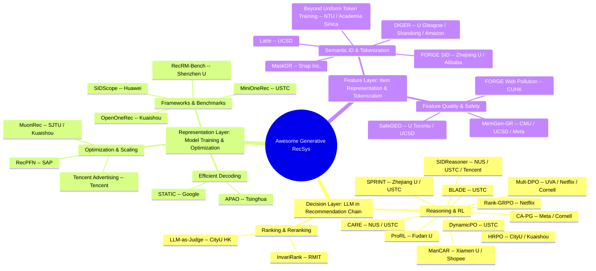

# Awesome Generative Recommendation System (RecSys)

```
 ██████╗                ██████╗                ███████╗                
██╔════╝  ███╗  ███╗    ██╔══██╗ ███╗   ███╗   ██╔════╝██╗ ██╗ ██████╗ 
██║      ██╔═██╗████╗   ██████╔╝██╔═██╗██╔═██╗ ███████╗╚██╗██║ ██╔═══╝ 
██║  ███╗██████║██╔██╗  ██╔══██╗██████║██║ ╚═╝ ╚════██║ ╚███╔╝ ██████╗ 
██║   ██║██║    ██║╚██╗ ██║  ██║██║    ██║ ██╗      ██║  ██╔╝      ██║
╚██████╔╝╚████╗ ██║ ╚██╗██║  ██║╚████╗ ╚███╔═╝ ███████║  ██║   ██████║
 ╚═════╝  ╚═══╝ ╚═╝  ╚═╝╚═╝  ╚═╝ ╚═══╝  ╚══╝   ╚══════╝  ╚═╝   ╚═════╝
```
---

[](https://github.com/sindresorhus/awesome)

RecSys is starting to adopt LLM for feature extraction, retrieval, and ranking/re-ranking! Although you can get some hands-on materials in either the [classics](#papers-classic-must-read) or some surveys, but since you're already interested in applying generative AI to industrial tasks, you probably wanna stay on the bleeding edge, right? That's exactly what this repo is for — automatically updated daily by agents with the latest generative RecSys papers fresh off arXiv, making sure that you never miss a beat.

> [!IMPORTANT]
> For those who are not familiar with GenRec, or not even the recommendation system, please checkout the kickstart posts [here](docs/kickstart.md).
> These posts are in Chinese, for English simply do your browser's internal translation or turn to __Ask Gemini__ :shipit:

## Quick Indexing
- [By Date](#by-date)
- [By Opensource](#by-opensource)
- [By Keyword](#by-keyword)
- [By Affiliation](#by-affiliation)


```mermaid
mindmap
  root((Awesome Generative RecSys))
    Decision Layer: LLM in Recommendation Chain
      Reasoning & RL
        Rank-GRPO -- Netflix
        DynamicPO -- USTC
        BLADE -- USTC
        SPRINT -- Zhejiang U / USTC
        CARE -- NUS / USTC
        HRPO -- CityU / Kuaishou
        Mult-DPO -- UVA / Netflix / Cornell
        CA-PG -- Meta / Cornell
        ProRL -- Fudan U
        ManCAR -- Xiamen U / Shopee
        SIDReasoner -- NUS / USTC / Tencent
      Ranking & Reranking
        InvariRank -- RMIT
        LLM-as-Judge -- CityU HK
    Representation Layer: Model Training & Optimization
      Frameworks & Benchmarks
        MiniOneRec -- USTC
        OpenOneRec -- Kuaishou
        RecRM-Bench -- Shenzhen U
        SIDScope -- Huawei
      Efficient Decoding
        STATIC -- Google
        APAO -- Tsinghua
      Optimization & Scaling
        MuonRec -- SJTU / Kuaishou
        Tencent Advertising -- Tencent
        RecPFN -- SAP
    Feature Layer: Item Representation & Tokenization
      Semantic ID & Tokenization
        Latte -- UCSD
        FORGE SID -- Zhejiang U / Alibaba
        DIGER -- U Glasgow / Shandong / Amazon
        MaskGR -- Snap Inc.
        Beyond Uniform Token Training -- NTU / Academia Sinica
      Feature Quality & Safety
        SafeGEO -- U Toronto / UCSD
        MemGen-GR -- CMU / UCSD / Meta
        FORGE Web Pollution -- CUHK
```
<div align="center">
  <i> Open-source Generative RecSys Map </i>
</div>

---
## By Date

### Papers August 22

*Saturday, August 22, 2026. Arxiv weekend pause (no new Saturday announcement). Friday Aug 21 listing yielded 2 new papers (RecPFN, Sequential Benchmarks) plus 3 missed papers from Aug 18–20 (Think-to-Personalize, OneModel) plus 1 replacement (Beyond Uniform Token Training, v2 Aug 20). Total: 5 papers.*

1. **RecPFN: Prior-Fitted Networks for In-Context-Based Recommendations**
   * Affiliation: SAP
   * Link: [arxiv.org/abs/2608.19735](https://arxiv.org/abs/2608.19735)
   * Venue: SIGIR 2026
   * TL;DR: Brings prior-fitted networks (in-context learning) to sequential recommendation — pretrained entirely on synthetic clickstreams sampled from a broad structural causal prior, amortizing Bayesian-style inference from a small support set; SOTA zero-shot performance across 8 benchmarks.
   * Key techniques:
     - Prior-Fitted Network (PFN) pretrained on synthetic clickstream environments from a broad structural causal prior
     - Amortized Bayesian-style inference from a small support set of domain sequences; no weight updates at inference
     - Lightweight decoder-only transformer producing next-item predictions in a single forward pass
     - Deployment-efficient and robust to domain shift; competitive with supervised methods in low-compute/low-data regimes
   * Scores (Opensource? / Novelty / Fairness / Robustness / Impact):
     - **Opensource?: 7/10** — [github.com/SAP-samples/tabular-ai-recpfn](https://github.com/SAP-samples/tabular-ai-recpfn) — official SAP samples repo with training + evaluation code
     - **Novelty: 7/10** — First to bring prior-fitted networks / in-context learning to sequential recommendation
     - **Fairness: 3/10** — Not addressing fairness
     - **Robustness: 7/10** — SIGIR 2026 peer-reviewed; 8 public benchmarks; robust to domain shift
     - **Impact: 7/10** — SIGIR 2026; SAP; a practical path to generalizable, data-efficient recommenders

2. **Do Sequential Recommendation Benchmarks Really Require Higher-Order Sequence Modelling?**
   * Affiliation: Spotify
   * Link: [arxiv.org/abs/2608.19833](https://arxiv.org/abs/2608.19833)
   * Venue: RecSys 2026
   * TL;DR: Two simple recency-weighted pairwise probes (SeqRules + PCTM) that learn no higher-order sequence representations match or beat SASRec on most benchmarks, questioning whether widely used sequential-rec benchmarks actually measure higher-order sequence modelling.
   * Key techniques:
     - SeqRules (Sequential Rules) and PCTM (Probabilistic Collaborative Transition Model) — recency-weighted pairwise probes without higher-order sequence representations
     - Reproduction of eSASRec + sampled-softmax SASRec as the reference point
     - At least one probe exceeds the eSASRec reproduction by 15–38% on 3 Amazon datasets and 4.4% on ML-1M
     - Concrete test of whether a benchmark can meaningfully measure higher-order sequence-modelling gains
   * Scores (Opensource? / Novelty / Fairness / Robustness / Impact):
     - **Opensource?: 0/10** — No public code available
     - **Novelty: 7/10** — Provocative benchmarking study with a concrete, reusable test for higher-order gains
     - **Fairness: 3/10** — Not addressing fairness
     - **Robustness: 7/10** — RecSys 2026 peer-reviewed; 8 datasets
     - **Impact: 7/10** — Spotify; challenges a core premise of sequential-rec benchmark design

3. **Think-to-Personalize: Unifying Reasoning and Retrieval for User-Centric Personalized Dense Retrieval**
   * Affiliation: University of Science and Technology of China / Meituan — *(Angqing Jiang, Gaoming Zhang, Defu Lian — USTC; Jianchun Song, Kena Qi, Dayao Chen, Wei Lin — Meituan)*
   * Link: [arxiv.org/abs/2608.18855](https://arxiv.org/abs/2608.18855)
   * Venue: CIKM 2026
   * TL;DR: Unifies explicit user-centric intent reasoning with dense retrieval — the LLM reasons over the user's purchase history to deduce latent needs and generate an intent-enhanced query encoded into a unified dense embedding; two-stage SFT + GRPO RL.
   * Key techniques:
     - Explicit user-centric intent reasoning over historical purchase sequences to disambiguate noisy behavior
     - Intent-enhanced query generation, then encoded into a unified dense embedding for retrieval
     - Two-stage training: SFT (cold-start capability) + GRPO RL (align reasoning with retrieval utility)
     - Online A/B: +0.46% order volume
   * Scores (Opensource? / Novelty / Fairness / Robustness / Impact):
     - **Opensource?: 0/10** — No public code available
     - **Novelty: 6/10** — Reasoning-driven personalized dense retrieval (vs implicit embedding interaction) is a clean, well-motivated angle
     - **Fairness: 3/10** — Not addressing fairness
     - **Robustness: 7/10** — CIKM 2026 peer-reviewed; proprietary + public benchmarks; online A/B
     - **Impact: 6/10** — Meituan/USTC; a new paradigm for reasoning-driven personalized retrieval in e-commerce

4. **OneModel: A Unified Foundation for Platform-Scale Multi-Scenario Ranking**
   * Affiliation: Xiaohongshu
   * Link: [arxiv.org/abs/2608.18606](https://arxiv.org/abs/2608.18606)
   * Venue: arXiv preprint, August 2026 (deployed in production at Xiaohongshu)
   * TL;DR: Unified multi-stream final-ranking foundation mapping heterogeneous behaviors into shared event sequences with an action-oriented backbone + Scenario-aware Information Modulation; deployed across Explore Feed, Feed Advertising, and Merchant Recommendation with consistent A/B gains.
   * Key techniques:
     - Shared event sequences unifying heterogeneous cross-stream user behaviors
     - Long-context user representations with an action-oriented backbone
     - Scenario-aware Information Modulation balancing cross-stream transfer and stream-specific specialization
     - Production serving optimizations (stratified user representation, multi-objective training, feature decomposition, user-feature prefetching, shared user-tower)
   * Scores (Opensource? / Novelty / Fairness / Robustness / Impact):
     - **Opensource?: 0/10** — No public code available
     - **Novelty: 5/10** — Unified multi-scenario ranking foundation is practical; scenario-aware modulation is conceptually incremental
     - **Fairness: 3/10** — Not addressing fairness
     - **Robustness: 7/10** — Production deployment; online A/B gains across 3 streams
     - **Impact: 7/10** — Xiaohongshu; production-proven unified multi-stream ranking foundation

5. **Beyond Uniform Token Training: A Multi-Target Framework for Learning Token-Weighted Objectives in Generative Recommenders**
   * Affiliation: National Taiwan University / Academia Sinica — *(Wei-Ning Chiu, Song-Duo Ma, Pu-Jen Cheng — NTU; Han-Jay Shu — National Tsing Hua University; Chuan-Ju Wang — Academia Sinica)*
   * Link: [arxiv.org/abs/2601.17787](https://arxiv.org/abs/2601.17787)
   * Venue: CIKM 2026
   * TL;DR: Token-weighted training objectives for generative recommenders — prefix-aware Front-Greater Weighting plus frequency weighting for long-tail tokens, integrated via multi-target curriculum learning; improves both popular and long-tail item recommendation.
   * Key techniques:
     - Front-Greater Weighting: prefix-aware scheme emphasizing tokens that most reduce semantic ambiguity among candidate items
     - Frequency weighting: upweights infrequent tokens to counter long-tailed distributions and popularity bias
     - Multi-target optimization with curriculum learning integrating token-weighted objectives with standard likelihood
     - Robust across semantic-ID constructions and backbone scales; helps both head and tail items
   * Scores (Opensource? / Novelty / Fairness / Robustness / Impact):
     - **Opensource?: 6/10** — [github.com/CHIUWEINING/Token-Weighted-Multi-Target-Learning-for-Generative-Recommenders-with-Curriculum-Learning](https://github.com/CHIUWEINING/Token-Weighted-Multi-Target-Learning-for-Generative-Recommenders-with-Curriculum-Learning) — individual research repo with training code
     - **Novelty: 6/10** — Token-weighted objectives aligned with semantic-ID structure is a clean, underexplored training fix
     - **Fairness: 5/10** — Frequency weighting directly mitigates popularity bias toward long-tail items
     - **Robustness: 6/10** — CIKM 2026 peer-reviewed; multiple benchmarks; robust across SID constructions and backbone scales
     - **Impact: 6/10** — NTU/Academia Sinica; token-weighted training applicable to any semantic-ID generative recommender

### Papers August 21

*Friday, August 21, 2026. Arxiv active. cs.IR Aug 20–21 listings returned 6 recommendation papers spanning LLM-based recommendation distillation, training-free LLM rec, semantic-ID diagnostics, memory-augmented reasoning, RL dense retrieval, and diffusion-based user behavior modeling. Total: 6 papers.*

1. **SCoRD: Semantic-Assisted Continual Retriever-Reranker Distillation for LLM-Based Recommendation**
   * Affiliation: Korea University / University of Illinois at Urbana-Champaign / Sungkyunkwan University — *(Seunghyun Baek, Seunghan Lee, SeongKu Kang — Korea University; Gyuseok Lee, Dong Wang — UIUC; Wonbin Kweon — Sungkyunkwan University)*
   * Link: [arxiv.org/abs/2608.19998](https://arxiv.org/abs/2608.19998)
   * Venue: arXiv preprint, August 2026
   * TL;DR: Continual knowledge distillation for LLM-based retriever-reranker pipelines under non-stationary data streams; a semantic reasoning assistant distills the LLM's intent-inference ability into reusable intent-level guidance, enabling cheap retriever-only updates without repeated LLM inference.
   * Key techniques:
     - Semantic reasoning assistant: distills the LLM's ability to infer user intents into reusable intent-level guidance
     - Selective distillation: reranker knowledge transferred to the retriever only on low-confidence sequences
     - Retriever-derived representations and intent-drift signals fed back to the reranker for co-adaptation
     - Avoids the prohibitive cost of repeatedly updating and distilling the LLM reranker
   * Scores (Opensource? / Novelty / Fairness / Robustness / Impact):
     - **Opensource?: 0/10** — No public code available
     - **Novelty: 6/10** — Continual retriever-reranker co-adaptation with an intent-level semantic assistant is a practical, well-motivated framing
     - **Fairness: 3/10** — Not addressing fairness
     - **Robustness: 5/10** — Real-world datasets; preprint (no peer review yet)
     - **Impact: 5/10** — Korea University (SeongKu Kang); practical continual distillation for deployed two-stage LLM rec

2. **Training-Free LLM-Based Recommendation with Post-LLM Item Refinement Using Collaborative Signals (CoRRe)**
   * Affiliation: KAIST / Snap Inc. — *(Kyungho Kim, Sunwoo Kim, Geon Lee, Shinhwan Kang, Sojeong Kim, Kijung Shin — KAIST; Liam Collins, Bhuvesh Kumar, Donald Loveland — Snap Inc.)*
   * Link: [arxiv.org/abs/2608.19665](https://arxiv.org/abs/2608.19665)
   * Venue: CIKM 2026 (short)
   * TL;DR: Post-LLM training-free recommendation injecting collaborative-filtering signals into LLM-generated item representations (rather than pre-LLM reranking/prompting); refines item-embedding directions via an item-item co-purchase graph and magnitudes via popularity, matching against LLM-generated user interests.
   * Key techniques:
     - Post-LLM paradigm: CF signals injected into LLM-generated item representations instead of pre-LLM candidate reranking/prompt augmentation
     - Direction refinement via item-item co-purchase graph; magnitude refinement via item popularity
     - Fully training-free, no model training or task-specific fine-tuning
     - Competitive or superior to training-based methods on real-world datasets
   * Scores (Opensource? / Novelty / Fairness / Robustness / Impact):
     - **Opensource?: 0/10** — No public code available
     - **Novelty: 6/10** — Post-LLM (vs pre-LLM) CF injection is a clean reframing with consistent gains
     - **Fairness: 3/10** — Not addressing fairness
     - **Robustness: 6/10** — CIKM 2026 peer-reviewed (short); real-world datasets; competitive with training-based baselines
     - **Impact: 5/10** — KAIST/Snap; practical training-free LLM recommendation

3. **SIDScope: A Diagnostic Resource for Semantic-ID Interfaces in Generative Recommendation**
   * Affiliation: Huawei Technologies Co., Ltd. — *(Jiandong Ding, Huijie Qin, Tiandeng Wu, Yi Cao)*
   * Link: [arxiv.org/abs/2608.18779](https://arxiv.org/abs/2608.18779)
   * Venue: arXiv preprint, August 2026
   * TL;DR: Source-traced diagnostic resource auditing semantic-ID tokenizer artifacts across D1–D7 signals (utilization, aliasing, neighborhood alignment, popularity allocation, structural cost, churn, trace accounting); finds interface health is mechanism-conditional rather than scalar, with prefix alignment tracking exposure only under prefix-based retrieval.
   * Key techniques:
     - D1–D7 multi-signal diagnostics: code utilization, prefix collision, neighborhood alignment, popularity allocation, structural cost, refresh churn, and generated-path trace accounting
     - Source-traced normalization across 9 tokenizer exports from 7 families on Amazon + Yelp (8 executable routes + 1 auditable snapshot)
     - Trace accounting exposes a hidden gap: valid target paths surviving without uniquely retrieving the target item (1.2–3.0 p.p.)
     - Refresh case: repairing the mapping does not by itself restore an inherited generator (needs a separate handoff check)
   * Scores (Opensource? / Novelty / Fairness / Robustness / Impact):
     - **Opensource?: 8/10** — [github.com/jdding/SIDscope](https://github.com/jdding/SIDscope) — MIT license; clean src/tests/docs/examples/experiments layout with pyproject.toml + setup.py, CPU-only verifier, frozen evidence summaries + conformance reports + table builders; 0⭐ (new)
     - **Novelty: 6/10** — Mechanism-conditional multi-signal SID-interface diagnostics is a fresh, rigorous angle vs. scalar metrics
     - **Fairness: 4/10** — D4 popularity allocation probes head/mid/tail capacity (indirect item-exposure fairness)
     - **Robustness: 5/10** — 9 tokenizer exports × 7 families on 2 datasets; preprint (no peer review yet)
     - **Impact: 6/10** — Huawei; important diagnostic resource for SID-based generative recommendation

4. **rEDMRec: Distilling Large Language Model Reasoning into an Editable Experience Memory for Recommendation**
   * Affiliation: University of Science, VNU-HCM (Vietnam National University Ho Chi Minh City) — *(Minh Hoang Nguyen, Tung Le, Huy Tien Nguyen)*
   * Link: [arxiv.org/abs/2608.18952](https://arxiv.org/abs/2608.18952)
   * Venue: arXiv preprint, August 2026
   * TL;DR: Compresses teacher-LLM reasoning once into four typed, editable experience channels (long-term preference, short-term context, item-perception, counterfactual hard negatives) maintained by an LLM memory controller with Add/Delete/Modify/Keep ops + K-agent debate, so a lightweight student ranks purely by memory retrieval without re-invoking the teacher.
   * Key techniques:
     - Four typed experience channels: long-term preference, short-term context, item-perception, counterfactual hard-negative comparisons
     - LLM memory controller performing Add/Delete/Modify/Keep operations with K-agent debate-based refinement
     - Lightweight student LLM ranks purely by retrieval, decoupling inference cost from reasoning depth
     - Up to 13.3% Impv over second-best baseline on ML-1M; debate lowers duplication 7.4 p.p.
   * Scores (Opensource? / Novelty / Fairness / Robustness / Impact):
     - **Opensource?: 0/10** — No public code available
     - **Novelty: 6/10** — Editable experience memory with typed channels + memory controller is a clean, practical idea
     - **Fairness: 3/10** — Not addressing fairness
     - **Robustness: 5/10** — ML-1M + Amazon Beauty + Steam × 10 student backbones; preprint (no peer review yet)
     - **Impact: 5/10** — VNU-HCM; practical memory-augmented LLM rec decoupling reasoning cost

5. **SSR-GRPO: Integrating Supervision and Semantic IDs into Reinforcement Learning for Dense Retrieval in E-commerce**
   * Affiliation: Alibaba Group — *(Guangxin Song, Xing Fang, Mingmin Jin, Jing Wang, Bokang Wang, Zhentao Song, Junjie Bai, Jianbo Zhu)*
   * Link: [arxiv.org/abs/2608.19595](https://arxiv.org/abs/2608.19595)
   * Venue: arXiv preprint, August 2026 (deployed on a large-scale e-commerce platform)
   * TL;DR: Fixes R-GRPO's noisy top-K and biased relevance by dual-perspective relevance assessment combining Semantic IDs + dense vectors, plus SID-hierarchy hard-negative mining for intra-group masking and a Retrieval-DPO pairwise task; deployed in production.
   * Key techniques:
     - Dual-perspective relevance assessment: SID-based + dense-vector scores for more unbiased relevance signals
     - SID-hierarchy hard-negative mining feeding (1) a masking function to filter intra-group noisy samples in R-GRPO and (2) a Retrieval-DPO pairwise task
     - Integrates supervised signals with RL for fine-grained semantic distinction
     - Validated offline + online, deployed on a large-scale e-commerce platform
   * Scores (Opensource? / Novelty / Fairness / Robustness / Impact):
     - **Opensource?: 0/10** — No public code available
     - **Novelty: 6/10** — SID-grounded dual-perspective relevance + hard-negative masking for retrieval RL is a clean, practical fix
     - **Fairness: 3/10** — Not addressing fairness
     - **Robustness: 7/10** — Offline + online experiments; production deployment on large-scale e-commerce
     - **Impact: 6/10** — Alibaba; practical RL dense retrieval for e-commerce search

6. **GateDiffInt: Gate-Mediated Controllable Diffusion and Multi-Intent LLM Distillation for User Behavior Modeling**
   * Affiliation: Fudan University / Xiaohongshu Inc. — *(Jialong Duan — Fudan; Zichen Zhang, Zirui Tu, Zheng Zhang, Zepeng Li, Qingyao Cui, Qinwen Wang, Yudan Liu, Luo Yang, Yao Hu — Xiaohongshu)*
   * Link: [arxiv.org/abs/2608.18764](https://arxiv.org/abs/2608.18764)
   * Venue: arXiv preprint, August 2026 (deployed to primary traffic)
   * TL;DR: Diagnoses Noise-Intent Coupling (NIC) in behavior sequences; uses a conversion-signal-aligned controllable forward diffusion with dual gating to denoise, then distills four structured intents (long-term, short-term, latent, conversion) from an LLM into a lightweight student for conversion-rate prediction.
   * Key techniques:
     - Noise-Intent Coupling (NIC) diagnosis: noise dilutes intents while missing intent priors leave denoising targetless
     - Controllable forward diffusion with dual gating to enhance and denoise behavior sequences aligned to the conversion signal
     - LLM teacher distills four structured intents into a lightweight student model
     - Attention-based deep fusion of enhanced sequences + structured intents; deployed to primary traffic with GMV gains
   * Scores (Opensource? / Novelty / Fairness / Robustness / Impact):
     - **Opensource?: 0/10** — No public code available
     - **Novelty: 6/10** — Gate-mediated controllable diffusion + multi-intent LLM distillation is a well-motivated industrial framing
     - **Fairness: 3/10** — Not addressing fairness
     - **Robustness: 7/10** — Public + industrial datasets; online A/B (hundreds of millions DAU); deployed to primary traffic
     - **Impact: 7/10** — Xiaohongshu/Fudan; production-deployed diffusion+LLM user behavior modeling

### Papers August 19

*Wednesday, August 19, 2026. Arxiv active. cs.IR Aug 18–19 listings returned 5 recommendation papers spanning end-to-end generative slate recommendation, compact-LLM efficiency, unified sequence+feature-interaction modeling, staleness filtering, and LLM-augmented POI recommendation. Total: 5 papers.*

1. **Once Generated, Ranked: End-to-End Generative Slate Recommendation with Unified Semantic-Collaborative IDs (OGR)**
   * Affiliation: Kuaishou Technology — *(Yang Hu, Jiayi Guo, Jingui Ma, Ning Li, Jiangling Qin, Yanming Li, Yang Deng, Xiaoshuang Chen, Kaiqiao Zhan)*
   * Link: [arxiv.org/abs/2608.17613](https://arxiv.org/abs/2608.17613)
   * Venue: arXiv preprint, August 2026
   * TL;DR: First end-to-end generative slate recommendation that directly generates ordered slates; TUSID fuses item-specific semantic + local collaborative signals into recommendation-aware hierarchical SIDs, list-wise preference planning + pipelined position-wise SID decoding models inter-item dependencies, and reward-guided conservative policy optimization (SPA) aligns slates with preferences; +48.2% NDCG@5 offline, +1.120% Effective Views online at Kuaishou.
   * Key techniques:
     - TUSID: adaptively fuses item-specific semantic and local collaborative information into hierarchical SIDs for recommendation-aware tokenization
     - List-wise preference planning + pipelined position-wise SID decoding to model global preferences and inter-item dependencies while generating ordered slates
     - SPA (reward-guided conservative policy optimization): aligns generated slates with user preferences beyond likelihood imitation
     - End-to-end "generate-then-rank" unified framework replacing separate candidate generation + ranking
   * Scores (Opensource? / Novelty / Fairness / Robustness / Impact):
     - **Opensource?: 0/10** — No public code available
     - **Novelty: 7/10** — First end-to-end generative slate recommendation; recommendation-aware SIDs + list-wise preference planning is a fresh, well-motivated angle
     - **Fairness: 3/10** — Not addressing fairness
     - **Robustness: 8/10** — Offline (industrial + public datasets) + online A/B at Kuaishou; +1.120% Effective Views validated
     - **Impact: 7/10** — Kuaishou; end-to-end slate-level generative recommendation with production validation

2. **Empowering Compact LLMs with Fusion of Layer-wise Exits for Recommendation (FLEXRec)**
   * Affiliation: University of Queensland / Griffith University / Edith Cowan University / University of Notre Dame — *(Xurong Liang, Tong Chen, Hongzhi Yin — UQ; Quoc Viet Hung Nguyen — Griffith; Jianxin Li — Edith Cowan; Xiangliang Zhang — Notre Dame)*
   * Link: [arxiv.org/abs/2608.17316](https://arxiv.org/abs/2608.17316)
   * Venue: ICDM 2026
   * TL;DR: Discriminative compact-LLM framework that inserts prediction heads (exits) at multiple transformer layers and adaptively fuses their score distributions via an adaptive continuous router, enabling efficient full-corpus ranking without autoregressive decoding; SOTA accuracy among compact backbones.
   * Key techniques:
     - Fusion of Layer-wise Exits: prediction heads inserted at multiple transformer layers with adaptive score-distribution fusion
     - Adaptive Continuous Router (AC-Router): dynamically selects both the number and identity of exits for each user sequence
     - Target-k hinge loss regulates routing sparsity for efficiency
     - Discriminative (embedding-similarity) full-corpus ranking, avoiding autoregressive decode latency
   * Scores (Opensource? / Novelty / Fairness / Robustness / Impact):
     - **Opensource?: 7/10** — [github.com/xurong-liang/FLEXRec](https://github.com/xurong-liang/FLEXRec) — complete 4-stage pipeline (preprocess → LLM4Rec pretrain → multi-head pretrain → FLEXRec train) with eval scripts, datasets, requirements.txt, clear README; no license, 1⭐, single-GPU only
     - **Novelty: 6/10** — Layer-wise exit fusion + adaptive continuous routing for compact discriminative LLM rec is a clean, practical idea
     - **Fairness: 3/10** — Not addressing fairness
     - **Robustness: 6/10** — ICDM 2026 peer-reviewed; 3 datasets; Qwen3 1.7B + Llama 3.2 3B
     - **Impact: 5/10** — UQ (Hongzhi Yin); practical efficiency solution for compact LLM-based recommendation

3. **UniDot: A Unified Network for Sequence Modeling and Feature Interaction in Large-scale Recommendation**
   * Affiliation: Meta — *(Rongcheng Lin, Yan Sun, Jamey Zhang, Guanglei Xiong, Ivan Ji, Xianjie Chen, Shujian Bu — Meta)*
   * Link: [arxiv.org/abs/2608.16797](https://arxiv.org/abs/2608.16797)
   * Venue: KDD 2026 UniRec Workshop (TAAC KDD Cup 2026 Industrial track runner-up)
   * TL;DR: Unifies feature interaction and sequence modeling from an FM point of view — the embedding inner product (CF) is the same primitive as attention's query·key scoring — tokenizing non-sequential fields and multi-domain behavioral sequences into one shared token space with a single macro-block; runner-up on TAAC KDD Cup 2026 Industrial track.
   * Key techniques:
     - Single dot-product primitive unifying feature interaction (FM) and sequence modeling (attention) in one shared token space
     - Token-mixing bus + sequence-retrieval bus (item tokens cross-attending histories) run in parallel, exchanging state each layer via MLP-Mixer fusion
     - FM Highway: explicit per-layer dot-product interactions carried around the residual stack directly to the classifier
     - Dual sparse/dense (Adagrad + Muon) optimizer, auxiliary conversion-delay head, multi-path mutual learning
   * Scores (Opensource? / Novelty / Fairness / Robustness / Impact):
     - **Opensource?: 0/10** — No public code available
     - **Novelty: 6/10** — Unified FM-dot-product view bridging feature interaction + sequence modeling is a clean conceptual unification; practical industrial architecture
     - **Fairness: 3/10** — Not addressing fairness
     - **Robustness: 6/10** — KDD Cup 2026 Industrial track runner-up; large-scale industrial validation
     - **Impact: 6/10** — Meta; runner-up on TAAC KDD Cup 2026 Industrial track

4. **Decomposing Staleness in Recommender Systems: A Dual-Filter Framework for Supersession and Decay (SDF)**
   * Affiliation: Google — *(Di Bai, Feng Han, Zhenwei Tang, Jintao Liu, Luoshu Wang, Jialu Liu — Google)*
   * Link: [arxiv.org/abs/2608.15780](https://arxiv.org/abs/2608.15780)
   * Venue: CIKM 2026 Applied Research Track
   * TL;DR: Decomposes recommendation staleness into supersession (emerging updates render prior coverage stale) and relevance decay (informational value diminishes over lifecycle), each handled by a learned filter; deployed in Google Discover, cutting user-filed staleness reports by 54.9% over two years.
   * Key techniques:
     - Relational staleness model: detects supersession between item pairs
     - Predicted Traffic Ratio (PTR) model: forecasts relevance decay from item content, trained on lifetime visit traffic
     - Dual-filter disjunction applied upstream of ranking to prune stale candidates, reducing downstream serving cost
     - Two-year production deployment at Google Discover (hundreds of millions of daily active users)
   * Scores (Opensource? / Novelty / Fairness / Robustness / Impact):
     - **Opensource?: 0/10** — No public code available
     - **Novelty: 6/10** — Decomposing staleness into supersession + decay with two complementary learned filters is a clean, well-motivated industrial framing
     - **Fairness: 3/10** — Not addressing fairness
     - **Robustness: 8/10** — CIKM 2026 Applied Research; two-year production deployment; -54.9% user-filed staleness reports
     - **Impact: 7/10** — Google; production-proven staleness filtering at massive scale

5. **POI Recommendation with LLM-Augmented Multi-Graph Learning and Contrastive Alignment (LLM-MGCL)**
   * Affiliation: University of Applied Sciences Ravensburg-Weingarten — *(Burak Tamer, Wolfram Höpken, Zehui Wang)*
   * Link: [arxiv.org/abs/2608.16407](https://arxiv.org/abs/2608.16407)
   * Venue: arXiv preprint, August 2026
   * TL;DR: Multi-graph neural network extending LightGCN with two LLM-derived auxiliary item-item graphs (semantic + geographic) to mitigate POI cold-start; +52.0% Recall@20 and +64.8% NDCG@20 over LightGCN on Yelp.
   * Key techniques:
     - Semantic graph built from sentence embeddings of LLM-generated photo summaries and keywords
     - Geographic graph derived from Haversine distances between business locations
     - Parallel propagation over behavioral + semantic + spatial graphs, additive fusion, bidirectional InfoNCE cross-view alignment
     - Externally grounded LLM item knowledge compensates for missing collaborative signal
   * Scores (Opensource? / Novelty / Fairness / Robustness / Impact):
     - **Opensource?: 0/10** — No public code available
     - **Novelty: 5/10** — LLM-derived semantic + geographic graphs for POI cold-start is practical; conceptually incremental vs. multi-graph GNN literature
     - **Fairness: 3/10** — Not addressing fairness
     - **Robustness: 5/10** — Yelp dataset with ablation study; preprint (no peer review yet)
     - **Impact: 5/10** — Ravensburg-Weingarten (Wolfram Höpken); practical LLM-augmented POI cold-start mitigation

### Papers August 18

*Tuesday, August 18, 2026. Arxiv active. cs.IR Aug 17–18 listings returned 6 recommendation papers spanning generative recommendation, LLM-based continual/multi-turn recommendation, and sequential recommendation. Total: 6 papers.*

1. **EchoRec: Multi-Item Prediction-Empowered Generative Recommendation via Cycle-Consistent Preference Alignment**
   * Affiliation: National University of Singapore / Tencent / BUPT / Shandong University — *(Haokai Ma, Aoqi Hu, Yonghui Yang, Teng Tu, Tat-Seng Chua — NUS; Ruobing Xie — Tencent; Yueao Xing — BUPT; Lei Meng — Shandong University)*
   * Link: [arxiv.org/abs/2608.14011](https://arxiv.org/abs/2608.14011)
   * Venue: arXiv preprint (under review)
   * TL;DR: Unlocks Multi-Token Prediction's dense-supervision potential for generative recommendation — future behaviors carry a semantic echo of the current one that decays across horizons; EchoRec chains horizon-aware auxiliary branches and cycle-consistently aligns the decoding representation with a holistic preference.
   * Key techniques:
     - Horizon-aware Preference Generation (HPG): sequentially chains lightweight auxiliary branches on the base recommender, each conditioning on its predecessor to respect preference evolution
     - Verifiable Holistic-Preference Alignment (VHA): consolidates multi-horizon signals into a holistic preference echoed back through cycle-consistent projectors to suppress spurious alignment (theoretically excludes rank-collapse under invertible transport)
     - Disposable scaffolding discarded at inference → negligible online serving overhead; natural multi-item generation ability
   * Scores (Opensource? / Novelty / Fairness / Robustness / Impact):
     - **Opensource?: 0/10** — code/datasets "available upon acceptance"; not yet public
     - **Novelty: 7/10** — First to unlock MTP's dense-supervision (vs. efficiency) potential for genrec; cycle-consistent holistic alignment is clean and theoretically grounded
     - **Fairness: 3/10** — Not addressing fairness
     - **Robustness: 5/10** — 3 datasets; under review (no peer review yet); theoretical guarantee on spurious-alignment exclusion
     - **Impact: 6/10** — NUS/Tencent (Tat-Seng Chua); advances multi-token prediction for SID-based generative recommendation

2. **Decoupled Temporal Encoding for Generative Recommendation**
   * Affiliation: Meituan — *(Pengfei Jia, Jingjian Wang, Jingmao Li, Ge Zhang, Feng Shi)*
   * Link: [arxiv.org/abs/2608.16274](https://arxiv.org/abs/2608.16274)
   * Venue: CIKM 2026
   * TL;DR: Separates broad temporal dynamics from local order cues in generative recommendation via a personalized macro-temporal module plus a time-gated micro-sequential module, motivated by multi-level temporal regularities (recency, meal-time peaks, weekday-weekend shifts, promotion bursts) in food delivery.
   * Key techniques:
     - Personalized macro-temporal module: injects compact temporal primitives into item embeddings
     - Time-gated micro-sequential module: introduces relative-order bias only when interactions are temporally dense
     - Parameter-efficient and deployment-friendly; easy integration into existing systems
   * Scores (Opensource? / Novelty / Fairness / Robustness / Impact):
     - **Opensource?: 0/10** — no public code available
     - **Novelty: 6/10** — Decoupling macro temporal dynamics from micro order cues is a clean, well-motivated fix vs. unified temporal modeling
     - **Fairness: 3/10** — Not addressing fairness
     - **Robustness: 6/10** — CIKM 2026 peer-reviewed; real-world food delivery / instant retail system
     - **Impact: 6/10** — Meituan; practical temporal encoding for industrial generative recommendation

3. **TRACER: Balancing Stability-Plasticity-Cognitivity Trilemma for LLM Enhanced Continual Recommendation**
   * Affiliation: POSTECH — *(WooJoo Kim, HyunSik Yoo, JunYoung Kim, JaeHyung Lim, SeongKu Kang, HwanJo Yu)*
   * Link: [arxiv.org/abs/2608.16075](https://arxiv.org/abs/2608.16075)
   * Venue: CIKM 2026
   * TL;DR: Identifies the Stability-Plasticity-Cognitivity (SPC) trilemma in LLM-enhanced continual recommendation and harmonizes it with three specialized modules so LLM semantic priors support history retention and interest adaptation without disrupting continual learning.
   * Key techniques:
     - SPC Trilemma diagnosis: generalized LLM semantic priors (Cognitivity) conflict with retaining personalized history (Stability) and adapting to interest shifts (Plasticity)
     - Three specialized modules targeting stability, plasticity, and cognitivity, preventing any single lemma from dominating
     - Up to 14.38% improvement over SOTA across 5 real-world datasets
   * Scores (Opensource? / Novelty / Fairness / Robustness / Impact):
     - **Opensource?: 4/10** — [github.com/woo-joo/TRACER_CIKM26](https://github.com/woo-joo/TRACER_CIKM26) — modular (base_rec/tracer/cl_frames/llm_enhancers), train.py + metrics, Zenodo pre-computed assets; no license, 1⭐, minimal README (no results/citation)
     - **Novelty: 6/10** — SPC trilemma is a fresh framing of the LLM-continual-rec conflict; three-way harmonization is well-designed
     - **Fairness: 3/10** — Not addressing fairness
     - **Robustness: 6/10** — CIKM 2026 peer-reviewed; 5 datasets; consistent gains
     - **Impact: 5/10** — POSTECH; practical LLM-enhanced continual recommendation

4. **GOD: Enhancing Generalization via Deep Grafting for Sequential Recommendation**
   * Affiliation: POSTECH — *(WooJoo Kim, JunYoung Kim, JaeHyung Lim, HwanJo Yu)*
   * Link: [arxiv.org/abs/2608.16073](https://arxiv.org/abs/2608.16073)
   * Venue: CIKM 2026
   * TL;DR: Component-level distillation via grafting — builds hybrid teacher-student source models to isolate whether weak generalization stems from unreliable embeddings, overfitted encoding, or co-adaptation to sparse histories.
   * Key techniques:
     - Graft-Oriented Distillation (GOD): replaces selected frozen-teacher components with trainable student counterparts to build hybrid source models
     - Component-level feedback: evaluates student embeddings with the teacher encoder, and the student encoder with teacher embeddings
     - Student-only at inference → no additional serving cost; up to 13.92% over SOTA on 3 datasets
   * Scores (Opensource? / Novelty / Fairness / Robustness / Impact):
     - **Opensource?: 0/10** — no public code available
     - **Novelty: 5/10** — Component-level grafting distillation is practical; conceptually incremental vs. representation/output matching
     - **Fairness: 3/10** — Not addressing fairness
     - **Robustness: 6/10** — CIKM 2026 peer-reviewed; 3 datasets; consistent gains
     - **Impact: 5/10** — POSTECH; practical distillation fix for sequential recommendation

5. **Ask to Be Sure: Informative Interactions for Confident Multi-Turn LLM Recommendation**
   * Affiliation: Amazon — *(Cedar Site Bai, Duanshun Li, Zhenyu Liao, Sheikh Sarwar, Huiyuan Chen, Yuan Chen, Changhe Yuan, Haiyang Zhang, Qilin Qi)*
   * Link: [arxiv.org/abs/2608.15949](https://arxiv.org/abs/2608.15949)
   * Venue: CIKM 2026
   * TL;DR: Quantifies each multi-turn interaction by the reduction in the assistant's uncertainty (entropy over recommendations) and uses this entropy-reduction reward — without ground-truth recommendations — to fine-tune the LLM for strategic interaction generation.
   * Key techniques:
     - Entropy-reduction reward: measures information gain per interaction via entropy over recommendations, no ground-truth needed
     - SFT + DPO fine-tuning with the entropy-reduction reward for strategic interaction generation
     - Improves both recommendation quality and conversational efficiency on INSPIRED + ReDial
   * Scores (Opensource? / Novelty / Fairness / Robustness / Impact):
     - **Opensource?: 0/10** — no public code available
     - **Novelty: 6/10** — Entropy-reduction (uncertainty) reward for multi-turn elicitation without ground-truth is a clean, practical idea
     - **Fairness: 3/10** — Not addressing fairness
     - **Robustness: 6/10** — CIKM 2026 peer-reviewed; INSPIRED + ReDial; SFT + DPO
     - **Impact: 5/10** — Amazon; practical multi-turn LLM recommendation with strategic interaction

6. **SAGA: Structure-Attended Generative Action Embedding Model that encodes Multi-Surface User Action Sequences**
   * Affiliation: PayPal AI — *(Tsz Fung Pang, Po Jen Chen, Nimish Ronghe, Farhad Farahani, Bo Zhang)*
   * Link: [arxiv.org/abs/2608.15429](https://arxiv.org/abs/2608.15429)
   * Venue: RecSys 2026 CARS Workshop
   * TL;DR: Generative action embedding with per-field tokenization (product/interaction/surface) encodes cross-surface financial-service user actions (checkout, P2P, in-app, email, account) into a unified user representation for downstream recommendation.
   * Key techniques:
     - Per-field tokenization: decomposes each action event into multiple field-level tokens enabling field-level attention and per-field objectives
     - Decoder-only transformer with round-robin per-field tokenization + K independent LM heads
     - Event-boundary contrastive head with stop-gradient compositional targets; strongest click/conversion lift across touchpoints
   * Scores (Opensource? / Novelty / Fairness / Robustness / Impact):
     - **Opensource?: 0/10** — no public code available
     - **Novelty: 6/10** — Per-field action tokenization for cross-surface generative embedding is a fresh, well-motivated angle for fintech
     - **Fairness: 3/10** — Not addressing fairness
     - **Robustness: 5/10** — RecSys 2026 CARS workshop; offline ablation; no online A/B
     - **Impact: 5/10** — PayPal; multi-surface generative embedding for financial-services recommendation

### Papers August 16

*Sunday, August 16, 2026. Arxiv inactive (weekend, Aug 15–16). Applied 3-month fallback strategy → found 5 missed genrec papers from May–Aug 2026: Sona Yandex Music cascade-replacing generative recommender, Related Intent Generation Amazon KDD 2026 intent-conditioned recall expansion, Hypothesis-Driven Shelf Generation Spotify RecSys 2026, Gwhere Amap generative next-POI opensource 5/10, ICICLE NTU in-context generative retrieval. Total: 5 papers.*

1. **Sona Technical Report**
   * Affiliation: Yandex — *(Sona Team: Alexandr Udeneev, Aleksei Krasilnikov, Alexey Nadtochiy, Andrey Semenov, Andrey Tsyrkunov, Anna Krivonos, Anna Lipkina, Artem Matveev, Daniil Burlakov, Daniil Leshchev, Daria Tikhonovich, Denis Burshtein, Ekaterina Dmitrieva, Eugene Krofto, Grigorii Khlystov, Ilya Murzin, Kirill Golovko, Ksenia Sycheva, Leonid Dmitriev, Mariia Rozaeva, Mariia Ulianova, Mikhail Sandul, Nikolai Savushkin, Oleg Sorokin, Roman Odobesku, Semyon Panenko, Sergei Liamaev, Sergei Makeev, Vadim Shilov, Veronika Ivanova, Viktor Yanush, Vladimir Baikalov, Vladislav Dodonov, Vladislav Tytskiy — Yandex)*
   * Link: [arxiv.org/abs/2608.11015](https://arxiv.org/abs/2608.11015)
   * Venue: arXiv technical report, August 2026
   * TL;DR: Single-model generative recommender for Yandex Music replacing the entire production cascade (15+ candidate generators + pre-ranking + ranking); shared user representation couples autoregressive SID generation with an item-level Ranking Module via next-token-prediction + distillation; online A/B: +4.53% Active Users, +6.30% Listening Time, +11.42% Likes.
   * Key techniques:
     - Unified generate-and-rank: a single encoder turns logged engagement events into hidden states consumed by both the autoregressive decoder and the Ranking Module
     - Distillation-only ranking supervision: a larger Teacher Ranker supplies ranking targets during training but is absent from serving (no second model in the serving path)
     - No hand-engineered features: both Sona and its Teacher Ranker operate on logged event fields + learned item representations
     - Active-Users uplift 2.35× the increment previously delivered by Argus, the strongest prior model on the surface
   * Scores (Opensource? / Novelty / Fairness / Robustness / Impact):
     - **Opensource?: 0/10** — No public code available
     - **Novelty: 6/10** — Extends the Gryphon generate-and-rank lineage to full cascade replacement; shared-representation coupling of generation and ranking is clean but builds on prior work
     - **Fairness: 3/10** — Not addressing fairness
     - **Robustness: 8/10** — Large-scale online A/B on a Yandex Music smart-speaker surface; statistically significant uplifts on 3 metrics
     - **Impact: 8/10** — Yandex; production-proven single-model replacement of a mature multi-stage cascade at a major streaming service

2. **Improving Item Discoverability in e-Commerce Search via Related Intent Generation**
   * Affiliation: Amazon — *(Ji Xin, Xiao Xiao, Ishan Bhatt, Vinesh Gudla, Trace Levinson, Raochuan Fan, Shishir Kumar Prasad, Prakash Putta, Tejaswi Tenneti — Amazon)*
   * Link: [arxiv.org/abs/2607.27172](https://arxiv.org/abs/2607.27172)
   * Venue: KDD 2026 TSMO
   * TL;DR: Discovery-augmented e-commerce search generating implicit user intents for intent-conditioned recall expansion; two-stage hybrid architecture with a closed-weight LLM for head queries + LoRA/distilled small language model (SLM) for tail queries; extends discovery coverage 60%→80% at ~30% of teacher inference cost.
   * Key techniques:
     - Intent-conditioned recall expansion: generates implicit user intents to surface substitute/complementary/thematically-related items beyond strict query matching
     - Two-stage hybrid architecture: closed-weight LLM for head queries + finetuned SLM (LoRA adapters + teacher-student distillation) for tail queries
     - Dual evaluation: LLM-as-a-judge metrics (validated against human preferences) + end-to-end session-level purchase analysis
     - Marketplace-balancing framing giving long-tail/emerging supply query-conditioned exposure
   * Scores (Opensource? / Novelty / Fairness / Robustness / Impact):
     - **Opensource?: 0/10** — No public code available
     - **Novelty: 5/10** — Intent-conditioned recall expansion with LLM→SLM distillation is practical; conceptually incremental
     - **Fairness: 4/10** — Explicitly framed as marketplace-balancing for long-tail supply (indirect provider fairness)
     - **Robustness: 6/10** — KDD 2026 TSMO; dual evaluation framework; industrial-scale grocery e-commerce
     - **Impact: 6/10** — Amazon; practical discovery-augmented search addressing the cost-quality tradeoff of generative retrieval

3. **Hypothesis-Driven Shelf Generation for Personalised Recommendation**
   * Affiliation: Spotify — *(Aleksandr V. Petrov, Tarun Chillara, Matthew D. Moellman, Lucas de Haas, Yabai Song, Alina Susoykina, Melissa Crawford, Gabriel Negash, Erik Franco, Tasnim Rahman, Binal Jhaveri, Shubham Bansal, Hugues Bouchard, Roberto Mirizzi, Mounia Lalmas, Aloïs Gruson — Spotify)*
   * Link: [arxiv.org/abs/2607.25823](https://arxiv.org/abs/2607.25823)
   * Venue: RecSys 2026 Industry Track
   * TL;DR: Replaces hand-crafted shelf templates on Spotify Home with natural-language content hypotheses; four-stage pipeline (hypothesis generation → catalogue fulfilment → shelf alignment → offline serving) decouples planning from retrieval and enables constrained generative retrieval over catalogue entities + frontier-LLM distillation into compact models.
   * Key techniques:
     - Content-hypothesis-driven shelves: natural-language hypotheses describing what a personalised shelf should contain, replacing fixed templates
     - Four-stage decomposition: hypothesis generation, catalogue fulfilment, shelf alignment, offline serving — decouples planning from retrieval for independent optimisation
     - Constrained generative retrieval over catalogue entities + distillation of frontier LLM behaviour into compact models
     - Precomputed serving + offline LLM-as-a-judge evaluation; early online evaluation under uniform random exposure
   * Scores (Opensource? / Novelty / Fairness / Robustness / Impact):
     - **Opensource?: 0/10** — No public code available
     - **Novelty: 6/10** — Hypothesis-driven shelf generation at the interface level is a fresh angle on generative recommendation
     - **Fairness: 4/10** — Expands personalised supply to the long tail of individual taste (indirect fairness)
     - **Robustness: 6/10** — RecSys 2026 Industry Track; offline analyses + early online evaluation at Spotify Home
     - **Impact: 6/10** — Spotify; generative interface-level recommendation with frontier-LLM distillation

4. **Gwhere: Guess Where You Go — Generative Next Point-of-Interest Recommendation in Amap**
   * Affiliation: Amap / Alibaba Group — *(Penglong Zhai, Bowen Zheng, Jie Li, Yifang Yuan, Yue Liu, Sicong Wang, Mingyang Yin, Tingting Hu, Shuaijun Guo, Fanyi Di, Xin Li — Amap/Alibaba)*
   * Link: [arxiv.org/abs/2607.26073](https://arxiv.org/abs/2607.26073)
   * Venue: arXiv preprint, July 2026
   * TL;DR: End-to-end industrial generative next-POI recommendation integrating SID generation with an LLM; contrastive residual-quantization tokenizer aligns textual/visual/spatial/collaborative signals; continued pretraining + SFT + Exposure-Aware Kahneman-Tversky Optimization (EAKTO); deployed at Amap: +5.83% P-CTR, +6.20% U-CTR.
   * Key techniques:
     - Contrastive residual-quantization tokenizer learning discriminative POI SIDs from text/visual/spatial/collaborative signals
     - LLM adaptation via continued pretraining on spatio-temporal corpora + supervised fine-tuning
     - Exposure-Aware Kahneman-Tversky Optimization (EAKTO): reinforcement-learning objective for behavioral preference alignment
     - Deployed in Amap homepage under high-concurrency/low-latency constraints; long-term A/B validation
   * Scores (Opensource? / Novelty / Fairness / Robustness / Impact):
     - **Opensource?: 5/10** — [github.com/alibaba/SimCIT](https://github.com/alibaba/SimCIT) — MIT license; functional contrastive SID tokenizer (train/infer scripts, config); LLM training marked "coming soon"
     - **Novelty: 6/10** — Contrastive RQ tokenizer for spatial POI SIDs + Kahneman-Tversky RL objective are well-motivated
     - **Fairness: 3/10** — Not addressing fairness
     - **Robustness: 7/10** — Public + large-scale Amap industrial dataset; deployed with long-term online A/B (+5.83% P-CTR, +6.20% U-CTR)
     - **Impact: 7/10** — Amap/Alibaba; production-deployed generative next-POI recommendation at scale

5. **ICICLE: Expanding Retrieval with In-Context Documents**
   * Affiliation: National Taiwan University / Johns Hopkins University — *(Yu-Chen Den, Yung-Yu Shih, Zhi Rui Tam, Kuan-Yu Chen, Pu-Jen Cheng, Yun-Nung Chen — NTU; Eugene Yang — JHU)*
   * Link: [arxiv.org/abs/2605.26902](https://arxiv.org/abs/2605.26902)
   * Venue: arXiv preprint, May 2026
   * TL;DR: Revisits incremental generative retrieval as an in-context retrieval problem; newly added documents supplied as inference-time document-docid evidence; source-aware docid generation with [COPY]-based routing + preference-based calibration; improves new-document retrieval while preserving seen-document retention without corpus-specific retraining.
   * Key techniques:
     - In-context indexing: source-aware docid generation over parametric memory + context-provided document-docid pairs
     - [COPY]-based routing mechanism distinguishing context-grounded retrieval from parametric retrieval
     - Preference-based calibration + large-context adaptation
     - Diagnoses high-shot degradation as routing failure (source-selection calibration as the scaling bottleneck)
   * Scores (Opensource? / Novelty / Fairness / Robustness / Impact):
     - **Opensource?: 0/10** — No public code available
     - **Novelty: 6/10** — In-context indexing for incremental generative retrieval is a clean alternative to parameter-update methods
     - **Fairness: 3/10** — Not addressing fairness
     - **Robustness: 5/10** — MS MARCO + NQ320K; preprint (no venue/peer review yet)
     - **Impact: 5/10** — NTU/JHU; practical in-context generative retrieval for evolving corpora

### Papers August 14

*Friday, August 14, 2026. Arxiv active. cs.IR Aug 13 listing returned 5 genrec/recsys papers. Total: 5 papers.*

1. **FSGR: Mitigating Token Frequency Bias for Fair SID-Based Generative Recommendation**
   * Affiliation: Nankai University — *(Yuchen Zheng, Sihan Xu, Jingwen Yang, Xiangrui Cai, Haiwei Zhang, Xiaojie Yuan)*
   * Link: [arxiv.org/abs/2608.12845](https://arxiv.org/abs/2608.12845)
   * Venue: arXiv preprint, August 2026
   * TL;DR: Diagnoses "Token Frequency Bias" in SID genrec — high-frequency SID tokens are systematically over-predicted while low-frequency tokens are under-predicted; FSGR rebalances the SID representation space (OT-based assignment + dual-criteria re-anchor) and adds two-stage training with hierarchical frequency calibration, achieving >20% Gini fairness improvement while maintaining accuracy.
   * Key techniques:
     - Token Frequency Bias diagnosis: over/under-prediction of high/low-frequency SID tokens from imbalanced codebooks + popularity bias + MLE objective
     - OT-based Assignment Optimization + Dual-Criteria Re-anchor for a balanced SID representation space during construction
     - Two-stage training + Hierarchical Frequency Calibration for layer-specific fairness fine-tuning
     - >20% average Gini fairness improvement across 3 datasets and 3 backbones while maintaining competitive accuracy
   * Scores (Opensource? / Novelty / Fairness / Robustness / Impact):
     - **Opensource?: 0/10** — No public code available
     - **Novelty: 7/10** — First to diagnose token frequency bias in SID genrec; OT-based re-anchor + hierarchical frequency calibration is principled
     - **Fairness: 8/10** — Directly targets fairness (token frequency bias → item-category exposure fairness) with quantified Gini gains
     - **Robustness: 5/10** — 3 public datasets × 3 backbone models; no venue/peer review yet
     - **Impact: 6/10** — Nankai (Xiaojie Yuan); opens fairness direction for SID-based genrec

2. **STAR: Structured Tokenization and Target-Aware Interest Representation for PCVR Prediction**
   * Affiliation: Tsinghua University / Peking University — *(Yimeng Xu, Yingqi Song, Ying Jiang, Lan Ma — Tsinghua; Ruihao Zhang — Peking University)*
   * Link: [arxiv.org/abs/2608.12986](https://arxiv.org/abs/2608.12986)
   * Venue: KDD Cup 2026 Tencent UniRec Challenge (workshop)
   * TL;DR: Practical PCVR ranking framework combining structured feature tokenization with target-aware interest representation on a HyFormer-style multi-sequence backbone; high-cardinality signal recovery, explicit user-item interaction tokens, target-aware sequence decoding, and InfoNCE-inspired contrastive objective; identifies temporal context as the largest contributor to ranking AUC.
   * Key techniques:
     - Structured feature tokenization on a HyFormer-style multi-sequence backbone unifying sequence modeling + feature interaction
     - High-cardinality signal recovery + explicit user-item interaction tokens for sparse features
     - Target-aware sequence decoding + weighted user-item contrastive auxiliary objective (InfoNCE-inspired)
     - Train-inference pipeline alignment via reconstruction of feature remapping tables from saved config
   * Scores (Opensource? / Novelty / Fairness / Robustness / Impact):
     - **Opensource?: 0/10** — No public code available
     - **Novelty: 5/10** — Practical challenge solution; tokenization + target-aware interest representation is incremental
     - **Fairness: 3/10** — Not addressing fairness (ethics note flags monitoring before production)
     - **Robustness: 5/10** — Challenge leaderboard-style offline evaluation; no online A/B
     - **Impact: 5/10** — KDD Cup 2026 Tencent UniRec; Tsinghua/PKU; practical PCVR ranking blueprint

3. **Generative Universal Multimodal Retrieval with Dual-role Identifiers (DrIG)**
   * Affiliation: University of Tsukuba — *(Kaipeng Li, Haitao Yu, Xuanchen Zhou)*
   * Link: [arxiv.org/abs/2608.12987](https://arxiv.org/abs/2608.12987)
   * Venue: arXiv preprint, August 2026 (under review)
   * TL;DR: Generative multimodal retrieval where each candidate gets one residual-quantized identifier playing a sequential role (autoregressive decode; first token = modality) and a set-based role (unordered set providing a prefix-independent relevance prior that guides beam search); outperforms SOTA generative multimodal baselines on M-BEIR.
   * Key techniques:
     - Dual-role identifiers: sequential role (AR decoding with modality token + progressive semantics) + set-based role (prefix-independent relevance prior)
     - Set-based prior guides constrained beam search to alleviate prefix-level/local-optimum errors
     - Hybrid reranking for efficiency-effectiveness tradeoff vs. dense retrievers
     - Scaling/ablation analysis over base LMM, beam size, reranking depth, fusion strategy
   * Scores (Opensource? / Novelty / Fairness / Robustness / Impact):
     - **Opensource?: 0/10** — No public code available
     - **Novelty: 6/10** — Dual-role identifier with set-based prefix-independent prior is a clean, novel idea
     - **Fairness: 3/10** — Not addressing fairness
     - **Robustness: 5/10** — M-BEIR + text-to-image benchmarks; under review
     - **Impact: 6/10** — U Tsukuba (Haitao Yu); advances generative multimodal retrieval

4. **DrEM: Dual-Side Robust Ensemble Ranking from Noisy User Preference Predictions in Video Recommendation**
   * Affiliation: Shenzhen University / Kuaishou Technology — *(Canwei Huang, Tiantian He, Xiaoxiao Xu, Jun Zhang, Ziran Deng, Weike Pan, Chunjie Chen, Kaiqiao Zhan)*
   * Link: [arxiv.org/abs/2608.12778](https://arxiv.org/abs/2608.12778)
   * Venue: arXiv preprint, August 2026
   * TL;DR: Addresses prediction noise in multi-task pxtr signals used for ensemble ranking; risk-denoising robust loss corrects empirical risk using estimated preference flip probability (supervision side) + perturbation sampling with a preference-preserving ranking consistency regularizer (feature side); theoretical robustness proof + online A/B.
   * Key techniques:
     - Risk-denoising robust loss: corrects empirical risk using estimated preference flip probability
     - Preference-preserving ranking consistency regularizer for feature-side output stability
     - Perturbation sampling from the prediction-noise distribution
     - Theoretical proof of robustness under flip-probability estimation error
   * Scores (Opensource? / Novelty / Fairness / Robustness / Impact):
     - **Opensource?: 0/10** — No public code available
     - **Novelty: 6/10** — Dual-side (supervision + feature) noise handling in ensemble ranking is novel
     - **Fairness: 3/10** — Not addressing fairness
     - **Robustness: 7/10** — Theoretical analysis + offline experiments + large-scale online A/B
     - **Impact: 6/10** — Kuaishou/SZU; practical robust ensemble ranking for industrial video rec

5. **TimeRoute: Time-Aware Modality Routing and Diffusion for Multi-Modal Recommendation**
   * Affiliation: University of Amsterdam / University of Hong Kong / Aarhus University — *(Pengyu Zhang, Congfeng Cao, Paul Groth — UvA; Yangqin Jiang — HKU; Klim Zaporojets — Aarhus)*
   * Link: [arxiv.org/abs/2608.10983](https://arxiv.org/abs/2608.10983)
   * Venue: arXiv preprint, August 2026
   * TL;DR: Modality usefulness drifts over time at different rates (e.g., text→visual cues around holidays); temporal-aware modal router maps behavioral features to a personalized modality distribution, and a diffusion-based graph reconstructor conditioned via FiLM with dual-stream long/short-term denoising heads suppresses outdated modality edges; up to 9.8% improvement.
   * Key techniques:
     - Temporal-aware modal router: personalized modality distribution replacing globally shared fusion weights
     - Diffusion-based graph reconstructor with Feature-wise Linear Modulation (FiLM) + dual-stream long/short-term denoising heads
     - Suppresses outdated modality edges before they enter the propagation graph
     - 10-seed paired tests; up to 9.8% Recall/Precision/NDCG gains
   * Scores (Opensource? / Novelty / Fairness / Robustness / Impact):
     - **Opensource?: 3/10** — [anonymous.4open.science/r/TimeRoute](https://anonymous.4open.science/r/TimeRoute) — anonymous repo for double-blind review; not a permanent public release
     - **Novelty: 6/10** — Time-aware modality routing + diffusion for multimodal rec is well-motivated
     - **Fairness: 3/10** — Not addressing fairness
     - **Robustness: 5/10** — TikTok + Amazon datasets; 10-seed paired tests; preprint
     - **Impact: 5/10** — UvA (Paul Groth); practical multimodal rec with temporal modality dynamics

### Papers August 13

*Thursday, August 13, 2026. Arxiv active. cs.IR Aug 12 listing returned 5 genrec/recsys papers. Total: 5 papers.*

1. **HCGRec: Hint-Conditioned Generative Recommendation with Semantic IDs**
   * Affiliation: Shanghai Jiao Tong University / Huawei Noah's Ark Lab — *(Kangning Zhang, Haotian Fang, Xukun Luo, Hao Yin, Yang Gao, Peng Yan, Weiwen Liu, Weinan Zhang, Yong Yu)*
   * Link: [arxiv.org/abs/2608.11980](https://arxiv.org/abs/2608.11980)
   * Venue: CIKM 2026
   * TL;DR: Diagnoses the "zero-advantage" bottleneck in reward-based post-training of SID genrec — when an early semantic token enters the wrong branch, rollout groups miss the ground-truth item and receive identical zero rewards; supplies minimal target-prefix hints only for hard instances, then uses hint-aware credit decomposition (supervised for hinted tokens, GRPO for sampled suffix).
   * Key techniques:
     - Checkpoint-rollout diagnosis: supplies a minimal target-prefix hint only when the current generator cannot reach the correct item
     - Hint-aware credit decomposition: supervised learning preserves item-semantic/prefix-structure alignment for hinted tokens; GRPO optimizes the sampled suffix
     - Turns zero-reward groups into informative comparisons over item-token completions
     - Reduces zero-advantage training samples from over 70% to below 20%
   * Scores (Opensource? / Novelty / Fairness / Robustness / Impact):
     - **Opensource?: 1/10** — [github.com/WncFht/GRec](https://github.com/WncFht/GRec) — code link provided in paper but repo returns 404 (not yet public)
     - **Novelty: 7/10** — First to diagnose and treat the zero-advantage training failure in SID genrec; hint-conditioned generation is a clean, well-motivated fix
     - **Fairness: 3/10** — Not addressing fairness
     - **Robustness: 6/10** — CIKM 2026 peer-reviewed; sequential recommendation benchmarks; consistent gains over SFT + vanilla reward-based post-training
     - **Impact: 6/10** — CIKM 2026; SJTU (Weinan Zhang); practical post-training fix applicable to any SID-based genrec

2. **Token-Level Credit Assignment Optimization for Generative Document Retrieval**
   * Affiliation: Shandong University — *(Xinpeng Zhao, Yang Liu, Ran Chen, Xinyu Ma, Daiting Shi, Pengjie Ren, Zhumin Chen, Zhaochun Ren, Xin Xin)*
   * Link: [arxiv.org/abs/2608.12049](https://arxiv.org/abs/2608.12049)
   * Venue: arXiv preprint, August 2026
   * TL;DR: Fine-grained RL framework replacing sequence-level rewards with token-level relevance rewards for generative (DocID) retrieval; estimates step-wise rewards by measuring how each token decision changes the expected retrieval quality of the generation trajectory.
   * Key techniques:
     - Token-level relevance rewards: step-wise reward estimation measuring per-token impact on expected retrieval quality
     - Precise credit assignment favoring token decisions that contribute directly to document-level relevance
     - Practical reward-estimation strategies tailored to the autoregressive DocID generation process
     - Policy optimization integrating fine-grained supervision to align decoding with retrieval objectives
   * Scores (Opensource? / Novelty / Fairness / Robustness / Impact):
     - **Opensource?: 0/10** — No public code available
     - **Novelty: 6/10** — Token-level (vs sequence-level) RL rewards for generative retrieval is a clean, under-explored idea
     - **Fairness: 3/10** — Not addressing fairness
     - **Robustness: 5/10** — Retrieval benchmarks; consistently outperforms sequence-level reward baselines; no venue/peer review yet
     - **Impact: 5/10** — Shandong U; practical RL credit-assignment improvement for generative retrieval

3. **Making Collaborative Signals Count: Graph-Aware Large Language Models for Sequential Recommendation (GALLM)**
   * Affiliation: Zhejiang University — *(Fenglin Yan, Bohao Wang, Jian Zhang, Yu Cui, Tongya Zheng, Ye Feng, Can Wang, Jiawei Chen)*
   * Link: [arxiv.org/abs/2608.12184](https://arxiv.org/abs/2608.12184)
   * Venue: arXiv preprint, August 2026
   * TL;DR: Graph-aware LLM framework building a collaborative graph over text tokens + item tokens with three relation types (Text-Text, Item-Text, Item-Item), turned into lightweight learnable attention biases — no additional graph encoder needed.
   * Key techniques:
     - Collaborative graph over text tokens + item tokens modeling three relation types
     - Lightweight learnable attention biases injected into the LLM attention mechanism for collaborative-aware token interactions
     - Item-Item relations derived from global item co-occurrence patterns across users
     - No additional graph encoder; +9.76% average HR@5 over strongest baseline on 4 benchmarks
   * Scores (Opensource? / Novelty / Fairness / Robustness / Impact):
     - **Opensource?: 0/10** — No public code available
     - **Novelty: 5/10** — Graph-aware attention biases for LLM seqrec are practical; conceptually incremental
     - **Fairness: 3/10** — Not addressing fairness
     - **Robustness: 5/10** — 4 real-world benchmarks; consistent gains; no venue/peer review yet
     - **Impact: 5/10** — Zhejiang U; practical integration of collaborative signals into LLM-based sequential rec

4. **From Overlooked to Explored: Recovering Item Relations via Mixture of Perspectives for Sequential Recommendation (PRISM)**
   * Affiliation: POSTECH — *(Junyoung Kim, Wonbin Kweon, Woojoo Kim, Jaehyung Lim, Dongha Kim, Hwanjo Yu)*
   * Link: [arxiv.org/abs/2608.11846](https://arxiv.org/abs/2608.11846)
   * Venue: CIKM 2026
   * TL;DR: Diagnoses similarity bias in transformer sequential rec (dot-product attention over-favors similar items, overlooking heterogeneous relations with meaningful preference signals); proposes PRISM with K Perspective Lenses combining an Affinity View (homogeneous) and a Contrast View (heterogeneous) to calibrate attention.
   * Key techniques:
     - Similarity-bias diagnosis: dot-product attention scores disproportionately favor similar items across transformer-based SR models
     - K Perspective Lenses calibrating attention from distinct viewpoints
     - Affinity View (homogeneous relations) + Contrast View (heterogeneous relations suppressed by bias)
     - 7 real-world benchmarks; consistently outperforms SOTA baselines
   * Scores (Opensource? / Novelty / Fairness / Robustness / Impact):
     - **Opensource?: 6/10** — [github.com/327aem/PRISM](https://github.com/327aem/PRISM) — 1⭐, 9 commits; functional code (train/trainer/dataset/metrics) with training scripts; minimal README, no license
     - **Novelty: 5/10** — Multi-perspective attention calibration is practical; conceptually incremental
     - **Fairness: 3/10** — Not addressing fairness
     - **Robustness: 6/10** — CIKM 2026 peer-reviewed; 7 benchmarks; consistent SOTA
     - **Impact: 5/10** — CIKM 2026; POSTECH; practical attention fix for sequential recommendation

5. **Are We Really Making Progress in Group Recommendation? Unmasking the Tie-Breaking Illusion**
   * Affiliation: National Taiwan University — *(Song-Duo Ma, Pu-Jen Cheng)*
   * Link: [arxiv.org/abs/2608.11190](https://arxiv.org/abs/2608.11190)
   * Venue: RecSys 2026
   * TL;DR: Shows recent group rec improvements are inflated by a systematic evaluation bias from training-time score compression + deterministic tie-breaking; proposes tie-aware evaluation computing the exact expectation of HR@K/NDCG@K under uniform random tie-breaking; finds many reported gains shrink substantially.
   * Key techniques:
     - Tie-breaking bias diagnosis: sigmoid-before-BPR inflates tied top scores, making HR@K/NDCG@K highly sensitive to tie resolution
     - Tie-aware protocol: exact expectation of HR@K/NDCG@K under uniform random tie-breaking
     - Re-evaluation of 5 recent methods + 6 baselines on CAMRa2011 and Mafengwo (group + user settings)
     - Temperature-scaled BPR (τ-BPR) retains smoothing benefit without severe tie inflation
   * Scores (Opensource? / Novelty / Fairness / Robustness / Impact):
     - **Opensource?: 7/10** — [github.com/songduoma/TieAwareGroupRec](https://github.com/songduoma/TieAwareGroupRec) — 0⭐, 18 commits; publication-grade README with full reproduction for 5 methods + 6 baselines
     - **Novelty: 6/10** — First to isolate tie-breaking as a systematic evaluation confound in group rec; tie-aware protocol is an important diagnostic
     - **Fairness: 4/10** — Establishes reliable, unbiased evaluation for group rec benchmarks (indirect fairness)
     - **Robustness: 7/10** — RecSys 2026 peer-reviewed; tie-aware protocol; multiple methods + datasets
     - **Impact: 6/10** — RecSys 2026; NTU; important diagnostic for reliable group recommendation evaluation

## By Opensource

Papers whose daily entry lists **Opensource?** strictly above **0/10**. Sorted by score (highest first), then by title.

**Count:** 132 papers as of August 22.

| Score | Paper |
| --- | --- |
| 10/10 | Expressiveness Limits of Autoregressive Semantic ID Generation in Generative Recommendation (Latte) |
| 10/10 | RecRM-Bench: Benchmarking Multidimensional Reward Modeling for Agentic Recommender Systems |
| 10/10 | MiniOneRec: An Open-Source Framework for Scaling Generative Recommendation |
| 9/10 | Bringing Reasoning to Generative Recommendation Through the Lens of Cascaded Ranking (CARE) |
| 9/10 | One Pass, Any Order: Position-Invariant Listwise Reranking for LLM-Based Recommendation (InvariRank) |
| 9/10 | LLM-as-a-Judge for Reliable and Explainable Offline Evaluation in Top-K Recommendation (LLM Judge) |
| 9/10 | OpenOneRec Technical Report |
| 9/10 | Rank-GRPO: Training LLM-based Conversational Recommender Systems with Reinforcement Learning (ConvRec-R1) |
| 9/10 | The Pitfall of Scaling Up: Uncovering and Mitigating Popularity Bias Amplification in Scaling Transformer-based Recommenders (SPRINT) |
| 9/10 | [STATIC] Vectorizing the Trie: Efficient Constrained Decoding for LLM-based Generative Retrieval on Accelerators |
| 9/10 | Tencent Advertising Algorithm Challenge 2025: All-Modality Generative Recommendation |
| 9/10 | FORGE: Forming Semantic Identifiers for Generative Retrieval in Industrial Datasets |
| 9/10 | DynamicPO: Dynamic Preference Optimization for Recommendation (DASFAA 2026) |
| 9/10 | Beyond Static Best-of-N: Bayesian List-wise Alignment for LLM-based Recommendation (BLADE) |
| 8.5/10 | Factorized Latent Reasoning for LLM-based Recommendation (FLR) |
| 8/10 | Adaptive Autoguidance for Item-Side Fairness in Diffusion Recommender Systems (A2G-DiffRec) |
| 8/10 | ACE: Anisotropy-Controllable Embedding for LLM-enhanced Sequential Recommendation |
| 8/10 | APAO: Bridging the Training-Inference Gap in Generative Recommendation via Adaptive Prefix-Aware Optimization (APAO) |
| 8/10 | BRIDGE: Behavior-Guided Candidate Calibration for Multimodal Recommendation |
| 8/10 | COPF: An Online Framework for Deployment-Stable Counterfactual Fairness in Evolving Graphs |
| 8/10 | Credit-assigned Policy Gradient for Early Stage Retrieval in Two-stage Ranking (CA-PG) |
| 8/10 | Mult-DPO: Multinomial Direct Preference Optimization for Recommender Systems |
| 8/10 | MuonRec: Shifting the Optimizer Paradigm Beyond Adam in Scalable Generative Recommendation |
| 8/10 | On the Memorization Behavior of LLMs in Generative Recommendation: Observations, Implications, and Training Strategies (IIRG) |
| 8/10 | One Polluted Page Is Enough: Evaluating Web Content Pollution in Generative Recommenders (FORGE) |
| 8/10 | On the Memorization and Generalization of Generative Recommendation (MemGen-GR) |
| 8/10 | ManCAR: Manifold-Constrained Latent Reasoning with Adaptive Test-Time Computation for Sequential Recommendation |
| 8/10 | ProRL: Effective Reinforcement Learning for Proactive Recommendation via Rectified Policy Gradient Estimation (ProRL) |
| 8/10 | RAGEAR: Retrieval-Augmented Graph-Enhanced Academic Recommender |
| 8/10 | SafeGEO: Understanding Generative Engine Optimization Risks in Recommendation Agents |
| 8/10 | SIDScope: A Diagnostic Resource for Semantic-ID Interfaces in Generative Recommendation |
| 8/10 | How Reliable Are Semantic-ID Tokenizer Comparisons in Generative Recommendation? |
| 8/10 | HRPO: Hierarchical Residual Policy Optimization for Generative Recommendations |
| 8/10 | Intuition-Guided Latent Reasoning for LLM-Based Recommendation (IntuRec) |
| 8/10 | Time-Aware Diffusion based on Preference Disentanglement for Generative Recommendation (TDPM) |
| 8/10 | OneRec-Think: In-Text Reasoning for Generative Recommendation |
| 8/10 | A Standardized Re-evaluation of Conversational Recommender Systems on the ReDial Dataset (APG4RecSim) |
| 8/10 | TRACE: A Conversational Framework for Sustainable Tourism Recommendation with Agentic Counterfactual Explanations |
| 8/10 | TCA4Rec: Token-level Collaborative Alignment for LLM-based Generative Recommendation |
| 8/10 | UniGRec: Unified Generative Recommendation with Soft Identifiers for End-to-End Optimization |
| 8/10 | Unleashing the Native Recommendation Potential: LLM-Based Generative Recommendation via Structured Term Identifiers (GRLM) |
| 8/10 | UniRank: Benchmarking Ranking Models for Unified Sequential Modeling and Feature Interaction |
| 8/10 | Dynamic Spectral Denoising with Global-Context Attention for Multi-Behavior Recommendation (SpectraMB) |
| 8/10 | Differentiable Semantic ID for Generative Recommendation (DIGER) |
| 8/10 | Do Generative Recommenders Deepen the Information Cocoon? A Closed-Loop Simulation with LLM-powered User Simulators (RecLoop) |
| 8/10 | From Noise to Order: Learning to Rank via Denoising Diffusion (DiffusionRank) |
| 8/10 | GCIB: Graph Contrastive Information Bottleneck for Multi-Behavior Recommendation |
| 8/10 | GPlan: Generative Spatiotemporal Intent Sequence Recommendation via Implicit Reasoning in Amap |
| 8/10 | Expand More, Shrink Less: Shaping Effective-Rank Dynamics for Dense Scaling in Recommendation (RankElastor) |
| 8/10 | Rethinking Convolutional Networks for Attribute-Aware Sequential Recommendation (ConvRec) |
| 8/10 | Attention Calibration for Position-Fair Dense Information Retrieval |
| 8/10 | Cold-Starts in Generative Recommendation: A Reproducibility Study (ColdGenRec) |
| 8/10 | Closing the Indexing-Decoding Gap in Multimodal Generative Retrieval via Prefix Retention Optimization (PRO) |
| 8/10 | Masked Diffusion for Generative Recommendation (MaskGR) |
| 7.5/10 | Generative Sequential Recommendation via Hierarchical Behavior Modeling (GAMER) |
| 7/10 | RecPFN: Prior-Fitted Networks for In-Context-Based Recommendations (RecPFN) |
| 7/10 | Reasoning over Semantic IDs Enhances Generative Recommendation (SIDReasoner) |
| 7/10 | Can We Steer the Black-Box? Towards Controllability-Centric Evaluation of Recommender Systems with Collaborative Agents (CtrlBench-Rec) |
| 7/10 | The Best of Both Worlds: Harmonizing Semantic and Hash IDs for Sequential Recommendation (H²Rec) |
| 7/10 | Beyond Noisy Signals: Dual-Level Denoising for Multi-modal Sequential Recommendation (DDMSR) |
| 7/10 | Diagnosing and Mitigating Retrieval Bottlenecks in LLM-Based Cold-Start Recommendation (LHF) |
| 7/10 | CRAMER: Control via Request-Aware Masking for Editing Recommenders (CRAMER) |
| 7/10 | Empowering Compact LLMs with Fusion of Layer-wise Exits for Recommendation (FLEXRec) |
| 7/10 | Fast and Feasible: Permutation-based Constrained Reranking for Revenue Maximization (PermR) |
| 7/10 | FAVE: Flow-based Average Velocity Establishment for Sequential Recommendation |
| 7/10 | Generative Archetype-Grounded Item Representations for Sequential Recommendation (GenAIR) |
| 7/10 | Harmonizing Semantic and Collaborative in LLMs: Reasoning-based Embedding Generator for Sequential Recommendation (ReaEmb) |
| 7/10 | HyCoRec: Hypergraph-Enhanced Multi-Preference Learning for Alleviating Matthew Effect in Conversational Recommendation |
| 7/10 | SIDInspector: A Mapping-First Diagnostic Resource for Semantic-ID Tokenizers |
| 7/10 | Learning Decomposed Contextual Token Representations from Pretrained and Collaborative Signals for Generative Recommendation (DECOR) |
| 7/10 | Learning to Rotate: Temporal and Semantic Rotary Encoding for Sequential Modeling (SIREN-RoPE) |
| 7/10 | LIME-Rec: Auditing Semantic Gains in Sequential Recommendation — A Lightweight Recovery Test |
| 7/10 | Mixture-of-Experts Knowledge Graph Retrieval-Augmented Generation for Multi-Agent LLM-based Recommendation (MixRAGRec) |
| 7/10 | MLPs are Efficient Distilled Generative Recommenders (SID-MLP) |
| 7/10 | OneSearch-V2: The Latent Reasoning Enhanced Self-distillation Generative Search Framework (OneSearch-V2) |
| 7/10 | Popcorn: A Configurable Benchmark for Visual Evidence in Multimodal Movie Recommendation (Popcorn) |
| 7/10 | Prompt Optimization for User Simulation in Conversational Recommender Systems (UserSimulator) |
| 7/10 | R3-VAE: Reference Vector-Guided Rating Residual Quantization VAE for Generative Recommendation |
| 7/10 | RAMP: Robust Ad Recommendation Under Limited Personalized-Feature Availability via Masking and Alignment Pathways |
| 7/10 | Rec-R1: Bridging Generative Large Language Models and User-Centric Recommendation Systems via Reinforcement Learning |
| 7/10 | RSIR: Can Recommender Systems Teach Themselves? A Recursive Self-Improving Framework with Fidelity Control (RSIR) |
| 7/10 | Reproducing FACTER: Fairness via Conformal Thresholding and Prompt Repair |
| 7/10 | SAERec: Constructing Fine-grained Interpretable Intents Priors via Sparse Autoencoders for Recommendation (SAERec) |
| 7/10 | Stream-aware Side Adaptation for Large Pre-trained Multimodal Embedding Models in Sequential Recommendation (Stresa) |
| 7/10 | SynGR: Unleashing the Potential of Cross-Modal Synergy for Generative Recommendation (SynGR) |
| 7/10 | Uncertainty-aware Generative Recommendation (UGR) |
| 7/10 | Uncertainty and Fairness Awareness in LLM-Based Recommendation Systems |
| 7/10 | URecJPQ: Memory-efficient Multimodal Recommendation Models through RecJPQ in Large-Scale Scenarios (URecJPQ) |
| 7/10 | Who Owns the AI Recommendation? A Multi-Industry Empirical Map of Brand Category Ownership Across Large Language Models (LLM Brand) |
| 7/10 | RAGR: Review-Augmented Generative Recommendation |
| 7/10 | Dual-Stream MLP is All You Need for CTR Prediction (DS-MLP) |
| 7/10 | Dual-Diffusional Generative Fashion Recommendation (DualFashion) |
| 7/10 | Skill Is Not Document: A Query-Conditional Benchmark and Two-Stage Retriever for LLM Agent Skill Routing (R3) |
| 7/10 | tau-Rec: A Verifiable Benchmark for Agentic Recommender Systems |
| 7/10 | Teach Multimodal Recommendation Model to See via Personalized Visual Extraction and Adaptive Learning (REVEAL) |
| 7/10 | ItemRAG: Item-Based Retrieval-Augmented Generation for LLM-Based Recommendation |
| 7/10 | Are We Really Making Progress in Group Recommendation? Unmasking the Tie-Breaking Illusion (Tie-Breaking) |
| 6.5/10 | On Efficiency-Effectiveness Trade-off of Diffusion-based Recommenders (TA-Rec) |
| 6/10 | Beyond Centralization: User-Controlled Federated Recommendations |
| 6/10 | Beyond Dense Connectivity: Explicit Sparsity for Scalable Recommendation (SSR) |
| 6/10 | Beyond Uniform Token Training: A Multi-Target Framework for Learning Token-Weighted Objectives in Generative Recommenders (Beyond Uniform Token Training) |
| 6/10 | CARD: Non-Uniform Quantization of Visual Semantic Unit for Generative Recommendation |
| 6/10 | GraphLoRA: Structure-Aware Low-Rank Adaptation for Large Language Model Recommendation |
| 6/10 | Whole-Pool Setwise Reranking with Long-Context Language Models (WP-Setwise / DualEnd) |
| 6/10 | MARS: Multi-rate Aggregation of Recency Signals for Sequential Recommendation across Sparse and Dense Regimes (MARS) |
| 6/10 | Mitigating Matthew Effect: Multi-Hypergraph Boosted Multi-Interest Self-Supervised Learning for Conversational Recommendation (HiCore) |
| 6/10 | Trading Engagement for Sustainability: Carbon-Aware Re-ranking for E-commerce Recommendations |
| 6/10 | Understanding and Debugging Failures in N-Gram-Based Generative Retrieval |
| 6/10 | CogRec: Structure-Cognitive Fast-and-Slow Reasoning for Generative Recommendation (CogRec) |
| 6/10 | VirtualMLE: A Virtual ML Engineer that Optimizes Sequential Recommenders (VirtualMLE) |
| 6/10 | From Overlooked to Explored: Recovering Item Relations via Mixture of Perspectives for Sequential Recommendation (PRISM) |
| 5.5/10 | PRISM: Purified Representation and Integrated Semantic Modeling for Generative Sequential Recommendation |
| 5/10 | ExPerT: Personalizing LLM Responses to Users' Domain Expertise via Query-Wise Semantic and Keystroke Behavioral Cues (ExPerT) |
| 5/10 | Gwhere: Guess Where You Go — Generative Next Point-of-Interest Recommendation in Amap (Gwhere) |
| 5/10 | Hyperbolic RQ-VAE enhanced Generative Recommendation with Differential-Length Codebook Strategy (HG-Rec) |
| 5/10 | LBR: Towards Mitigating Length Bias in Large Language Models for Recommendation (LBR) |
| 5/10 | OneReason Technical Report |
| 5/10 | Progressive Alignment of Recommender Foundation Model through Multi-Phase Post-Training (Progressive FM Post-Training) |
| 5/10 | SimGR: Escaping the Pitfalls of Generative Decoding in LLM-based Recommendation (SimGR) |
| 5/10 | Think2Go: Generative Next POI Recommendation with LLM Reasoning (Think2Go) |
| 4/10 | Towards Efficient Reasoning in LLM-Based Recommender Systems via Model Merging (REAM) |
| 4/10 | Multi-Decoder OneRec: Controllable Generative Retrieval for Multi-Objective Industrial Recommendation |
| 4/10 | GLASS: Coarse-to-Fine Long-term Interest Modeling for Generative Recommendation |
| 4/10 | RecRec: Recursive Refinement for Sequential Recommendation |
| 4/10 | TRACER: Balancing Stability-Plasticity-Cognitivity Trilemma for LLM Enhanced Continual Recommendation (TRACER) |
| 3/10 | Mitigating Reward Hacking in LLM-based Recommendation: A Preference Optimization Approach (SIRIUS) |
| 3/10 | PVTG / Personalized Video Thumbnail Generation |
| 3/10 | STORM: Stepwise Token Optimization with Reward-Guided Beam Search |
| 3/10 | Cheaper is Better: A Discount-Aware Network for Conversion Rate Prediction in E-commerce Recommendation System (DANet) |
| 3/10 | Tail-Aware Adaptive-k: Query-Adaptive Context Selection for Retrieval-Augmented Generation (TAA-k) |
| 3/10 | InforID: Adaptive Semantic Capacity Allocation for Parallel Generative Recommendation (InforID) |
| 3/10 | TimeRoute: Time-Aware Modality Routing and Diffusion for Multi-Modal Recommendation (TimeRoute) |
| 2/10 | Verifiable Reasoning for LLM-based Generative Recommendation (VRec) |
| 1/10 | TSPORec: Token Selection via Preference Optimization for LLM-Based Sequential Recommendation (TSPORec) |
| 1/10 | HCGRec: Hint-Conditioned Generative Recommendation with Semantic IDs (HCGRec) |

---

## By Keyword

### Beam Search Decoding
- FedCGR: Federated Cross-Domain Generative Recommendation (FedCGR) — CIKM 2026
- GenRec / LLM-Backed Ranker — Netflix
- Closing the Indexing-Decoding Gap in Multimodal Generative Retrieval via Prefix Retention Optimization (PRO)
- GCRS: Generative Conversational Recommender System
- Generative Recommendation for Large-Scale Advertising (GR4AD)
- ThinkGR: Integrating Chain-of-Thought into Generative Retrieval
- LLaDA-Rec: Discrete Diffusion for Parallel Semantic ID Generation in Generative Recommendation
- MiniOneRec: An Open-Source Framework for Scaling Generative Recommendation
- Unified Value Alignment for Generative Recommendation in Industrial Advertising (UniVA)
- Objective Shaping with Hard Negatives: Windowed Partial AUC Optimization for RL-based LLM Recommenders
- PROMISE: Process Reward Models Unlock Test-Time Scaling Laws in Generative Recommendations
- SCOReD: Student-Aware CoT Optimization for Recommendation Distillation (SCOReD)
- SmartGR: Hierarchy and Beam-Aware Knowledge Distillation for Generative Recommendation (SmartGR)
- [STATIC] Vectorizing the Trie: Efficient Constrained Decoding for LLM-based Generative Retrieval on Accelerators
- STORM: Stepwise Token Optimization with Reward-Guided Beam Search
- APAO: Bridging the Training-Inference Gap in Generative Recommendation via Adaptive Prefix-Aware Optimization (APAO)
- GR2 Technical Report (GR2)
- UniSGR: Unified Framework for Semantic ID Generation and Ranking (UniSGR)
- PauseRec: Implicit Reasoning for LLM-based Generative Recommendation (PauseRec)
- HoloRec: Holistic Encoding and Interleaved Reasoning for Generative Recommendation (HoloRec)
- AsymRec: Asymmetric Generative Recommendation via Multi-Expert Projection and Multi-Faceted Hierarchical Quantization (AsymRec)
- DeGRe: Dense-supervised Generative Reranking for Recommendation (DeGRe)
- DaV-Gen: End-to-End Generative Retrieval via Draft-and-Verify (DaV-Gen)
- OneReason Technical Report (OneReason)
- Learning Decomposed Contextual Token Representations from Pretrained and Collaborative Signals for Generative Recommendation (DECOR)
- GenRec: A Preference-Oriented Generative Framework for Large-Scale Recommendation (GenRec)
- LASAR: Latent Adaptive Semantic Aligned Reasoning for Generative Recommendation (LASAR)
- GateSID: Adaptive Gating for Balancing Semantic and Collaborative Signals in Recommendation (GateSID)
- NEO: A Unified Language Model for Large Scale Search, Recommendation, and Reasoning (NEO)
- FORGE: Forming Semantic Identifiers for Generative Retrieval in Industrial Datasets (FORGE)
- Conditional Memory Enhanced Item Representation for Generative Recommendation (ComeIR)
- The Best of Both Worlds: Harmonizing Semantic and Hash IDs for Sequential Recommendation (H²Rec)
- IBA / IG Budget Allocation -- Chongqing U / Griffith U
- RecRec / Recursive Reasoning -- U Glasgow / Amazon / CMU / NUS
- Gryphon / Item-Level Scoring -- Yandex
- PrefixMem / SID Encoder -- Pinterest
- BONSAI / Decoding Trie Optimization -- MSU / Snap


- GenRecEdit: Adapting Model Editing for Generative Recommendation with Cold-Start Items (GenRecEdit)
- GBLA: Gated Bidirectional Linear Attention for Generative Retrieval (GBLA)
- DRQ: Understanding SID Tokenizer Failures via Decoupled Residual Quantization (DRQ)
- HiSAC: Hierarchical Sparse Activation Compression for Recommenders (HiSAC)
- Beyond Item IDs: Scaling Short-Form-Video Recommendation via Semantic-Native Long Sequence Modeling
- RankGR: Rank-Enhanced Generative Retrieval with Listwise Direct Preference Optimization in Recommendation (RankGR)
- OneBar: An End-to-End Content-Grounded Generative Query Recommendation Framework for E-Commerce Video Feeds (OneBar)
- TokenMinds: Pretrained User Tokens and Embeddings for User Understanding in Large Recommender Systems (TokenMinds)
- RecGPT-V3 Technical Report (RecGPT-V3)
- Topology-Aware Tokenization for Generative Recommendation (TopoTok)
- TSGR: Taobao Search Generative Retrieval (TSGR)
- BARGE: Bridging the Structural Gap — Adapting Autoregressive Generation for Recommendation (BARGE)
- DLMRec: Diffusion Language Model for Recommendation (DLMRec)
- CapsID: Soft-Routed Variable-Length Semantic IDs for Generative Recommendation (CapsID)
- GLASS: Coarse-to-Fine Long-term Interest Modeling for Generative Recommendation (GLASS)
- DIG: Discrimination Is Generation — Unifying Ranking and Retrieval from a Tokenizer Perspective (DIG)
- CaLIR: Category-Guided Latent Intent Reasoning for Generative Retrieval in E-Commerce (CaLIR)
- SynGR: Cross-Modal Synergy for Generative Recommendation (SynGR)
- DREAM: Dynamic Refinement of Early Assignment Mappings (DREAM)
- SimGR: Escaping the Pitfalls of Generative Decoding in LLM-based Recommendation (SimGR)
- OneFeed: A Unified Generative Framework for Feed Content Enhancement and Query Generation (OneFeed)
- CogRec: Structure-Cognitive Fast-and-Slow Reasoning for Generative Recommendation (CogRec)
- LaRec: Unleashing LLM-based Latent Reasoning for Generative Recommendation (LaRec)
- OxygenREC-v2: Internalizing Discrimination into Generative Recommendation (OxygenREC-v2)
- EGR: Embedding-Native Generative Retrieval with a Shared LLM (EGR)
- Grevo: A Unified Generative Recommendation Framework with Evolutionary Item Indexing (Grevo)
- VaLiDRec: Variable-Length LLM-Aligned Semantic IDs for Generative Recommendation (VaLiDRec)
- TopoGR: Revealing and Preserving Latent Structure of Semantic ID in Generative Recommendation (TopoGR)
- The Case Against Generation for Retrieval: Discriminative Language Models as Effective Retrievers (Discriminative Retrieval)
- Multi-Decoder OneRec: Controllable Generative Retrieval for Multi-Objective Industrial Recommendation (Multi-Decoder OneRec)
- WhisperRec: Latent Reasoning for Efficient Foundation Recommendation Models (WhisperRec)
- PSG: Pair-Space Generation for Efficient Generative Reranking (PSG)
- DIRECTOR: Dynamic Index-based Recommendation with Transport-Optimized Retrieval (DIRECTOR)
- Feedback-Grounded Policy Discovery / Understanding-Action Gap -- Tianjin U / Kuaishou / HKUST(GZ)
- LoopMemGR / Closed-Loop Experience Memory -- Alibaba
- Restoring Collaborative Signals via Personalized NL -- JD.com / McGill
- HiLaR / Hierarchical Latent Reasoning -- XJTLU / Xiaohongshu / PKU / BJTU
- SPARC / Sequence-aware Progressive Attribute Routing -- Alibaba
- RGD / Reward Guided Decoding -- Kuaishou / CAS IIE
- LGRID / Generative Disentanglement for SID -- Kuaishou
- Intent-Driven SID Generation for News -- Tencent (ACL 2026)
- SID-MLP / Efficient Distilled GenRec -- UCSD / Snap
- TwiSTAR / Adaptive Reasoning -- Tsinghua
- IMFuse / Multi-Layer Fusion -- Zhejiang U
- Dual-purpose Semantic IDs / Dual-purpose SID -- YouTube / Google (RecSys 2026)
- UGR / Uncertainty-aware GenRec -- USTC (KDD 2026)
- RAGR / Review-Augmented GenRec -- Dalian / CityU / Huawei (TOIS 2026)
- PauseRec / Implicit Reasoning -- UVA / Snap
- Gryphon / Item-Level Scoring -- Yandex
- SnapLGR / LLM-Based GR -- Snap Inc.
- Think2Go / Generative POI Rec -- Dalian UT / KDD 2026 Oral
- EvoReason / Self-Evolving Latent Reasoning -- Kuaishou / Shenzhen U
- HRPO / Hierarchical Residual Policy Optimization -- CityU / Kuaishou / KDD 2026
- GRACE / Generative Recommender Acceleration Engine -- Meta
- OMEGA / Collaborative Memory Augmentation -- Renmin / ByteDance / KDD 2026
- LIME-Rec / Auditing Semantic Gains -- Hunan U
- SmartGR / Hierarchy-Aware KD for GR -- Zhejiang U
- UniR² / Unifying Genrec Recall + Ranking -- Kuaishou / CAS IIE
- DEGR / Dual Exploration Generative Re-Ranking -- JD.com / KDD 2026
- SIDReasoner / Reasoning over SIDs -- NUS / USTC / Tencent / KDD 2026
- CARD / Non-Uniform Quantization Visual SID -- UESTC / SWUFE / SIGIR 2026
- DIGER / Differentiable Semantic ID -- U Glasgow / Shandong / Amazon / SIGIR 2026
- S2GR / Stepwise Semantic-Guided Reasoning -- Kuaishou / KDD 2026
- Gryphon-v2 / Generate-and-Rank with Rollout Distillation -- Yandex
- UniGD / Unified Generative-Discriminative Framework -- Kuaishou
- PinRec / Unified Generative Retrieval for Pinterest -- Pinterest (KDD 2026)
- SA2CRQ / Adaptive Semantic Quantization -- JD.com / HIT / PKU / CAS IIE (SIGIR 2026)
- OneLive / Dynamically Unified Generative Live-Streaming -- Kuaishou
- DualGR / Long+Short Interest GR -- USTC / Kuaishou (WWW 2026)
- GRC / Generation-Reflection-Correction -- Alibaba / Wuhan U (KDD 2026)
- SID Staleness / Mitigating Collaborative SID Staleness -- ITMO / VK (SIGIR 2026)
- MDGR / Masked Diffusion GR -- Alibaba International
- MaskGR / Masked Diffusion GR -- Snap Inc.
- Progressive FM Post-Training -- Webtoon (RecSys 2026)
- HD-Rec / Generative Cross-Domain Rec -- CityU / Kuaishou
- SID Understanding / Item-Supported Decoding -- UIUC
- TM20K / 20K Sequence Modeling -- ByteDance
- Preserving Item Semantics for Free / Centroid SID Init -- Snap Inc. / UMich
- PushDualGen / LLM SID Push Rec -- Kuaishou
- MetaStrategy / Generative LLM Ranking Strategy -- Alibaba (Taobao)
- TSPORec / Token Selection SeqRec -- ZJU / ByteDance
- IntHQ / Multi-Task Generative Rec -- Amap / Alibaba
- InforID / Adaptive SID Capacity Allocation -- UCAS / CASIA
- HCGRec / Hint-Conditioned GenRec -- SJTU / Huawei Noah's Ark Lab (CIKM 2026)
- Token-Level Credit Assignment / Generative Document Retrieval -- Shandong U
- DrIG / Dual-role Identifiers Multimodal Generative Retrieval -- U Tsukuba

### RL / Reinforcement Learning
- Ask to Be Sure / Entropy-Reduction Reward for Multi-Turn LLM Rec — Amazon (CIKM 2026)
- ConnectionMind / Social Graph LLM Rec — Meta / MSU
- Efficient and Robust Online Learning to Rank in Decentralized Systems (RankGuard)
- Beyond Static Best-of-N: Bayesian List-wise Alignment for LLM-based Recommendation (BLADE)
- Bridging Passive and Active: Enhancing Conversation Starter Recommendation via Active Expression Modeling (PA-Bridge)
- Bringing Reasoning to Generative Recommendation Through the Lens of Cascaded Ranking (CARE)
- Adaptive Loss Balancing for Noise-Robust GRPO in Generative Recommendation (AdaGRPO)
- Causal Direct Preference Optimization for Distributionally Robust Generative Recommendation (CausalDPO)
- Diffusion-GR2: Diffusion Generative Reasoning Re-ranker (Diffusion-GR2)
- Don't Let Bandit Feedback Pull Continual LLM-Recommender Updates Off Target (ABPO)
- DynamicPO: Dynamic Preference Optimization for Recommendation
- Factorized Latent Reasoning for LLM-based Recommendation (FLR)
- Fairness Attacks on Recommender Systems
- Federated Variational Preference Alignment with Gumbel-Softmax Prior for Personalized User Preferences (FedVPA-GP)
- Affective Music Recommendation: A Rollout-Based World Model for Offline Preference Optimization (AMRS)
- Effective Reinforcement Learning for Agentic Search by Recycling Zero-Variance Queries During Training
- Generative Large-Scale Pre-trained Models for Automated Ad Bidding Optimization (GRAD)
- Generative Reasoning Re-ranker (GR2)
- Graph-GRPO: Dependency-Aware Credit Assignment for Generative E-commerce Search Relevance
- Harmonizing Semantic and Collaborative in LLMs: Reasoning-based Embedding Generator for Sequential Recommendation (ReaEmb)
- Taiji: Pareto Optimal Policy Optimization with Semantics-IDs Trade-off for Industrial LLM-Enhanced Recommendation (Taiji)
- MiniOneRec
- Mixture-of-Experts Knowledge Graph Retrieval-Augmented Generation for Multi-Agent LLM-based Recommendation (MixRAGRec)
- MuChator: Enabling Active Music Discovery via Conversational Music LLMs in Douyin Music
- Mult-DPO: Multinomial Direct Preference Optimization for Recommender Systems
- Unified Value Alignment for Generative Recommendation in Industrial Advertising (UniVA)
- Self-Distilled Reinforcement Learning for Co-Evolving Agentic Recommender Systems (CoARS)
- UniNote: A Unified Embedding Model for Multimodal Representation and Ranking
- Objective Shaping with Hard Negatives
- Once Generated, Ranked / End-to-End Generative Slate Recommendation (OGR) — Kuaishou
- OneMall
- OneBar: An End-to-End Content-Grounded Generative Query Recommendation Framework for E-Commerce Video Feeds (OneBar)
- OneRec-Think
- OneRec-V2
- OpenOneRec
- ProMax: Exploring the Potential of LLM-derived Profiles
- Rank-GRPO
- Reasoning over Semantic IDs Enhances Generative Recommendation (SIDReasoner)
- Rec-R1
- ReCast
- ReRec: Reasoning-Augmented LLM-based Recommendation Assistant
- RPORec: Reinforced Preference Optimization for Reasoning-Augmented Recommendations
- RSIR: Can Recommender Systems Teach Themselves? A Recursive Self-Improving Framework with Fidelity Control (RSIR)
- SCOReD: Student-Aware CoT Optimization for Recommendation Distillation (SCOReD)
- SAGER: Self-Evolving User Policy Skills for Recommendation Agent
- SAPO: Step-Aligned Policy Optimization for Reasoning-Based Generative Recommendation
- Expressiveness Limits of Autoregressive Semantic ID Generation in Generative Recommendation (Latte)
- Planning over Matrix-Factorization MDPs for Candidate Generation (MF-MDP Planning)
- ProRL: Effective Reinforcement Learning for Proactive Recommendation via Rectified Policy Gradient Estimation (ProRL)
- Mitigating Reward Hacking in LLM-based Recommendation: A Preference Optimization Approach (SIRIUS)
- Long-Term Optimization for Large-Scale Generative Retrieval with Off-Policy REINFORCE
- LBR: Towards Mitigating Length Bias in Large Language Models for Recommendation (LBR)
- DeGRe: Dense-supervised Generative Reranking for Recommendation (DeGRe)
- PauseRec: Implicit Reasoning for LLM-based Generative Recommendation (PauseRec)
- OneReason Technical Report (OneReason)
- AgentX: Towards Agent-Driven Self-Iteration of Industrial Recommender Systems (AgentX)
- Recommendation as Generation: Unifying Personalized Video Generation and Recommendation at Industrial Scale (RaG)
- GenRec: A Preference-Oriented Generative Framework for Large-Scale Recommendation (GenRec)
- LASAR: Latent Adaptive Semantic Aligned Reasoning for Generative Recommendation (LASAR)
- ManCAR: Manifold-Constrained Latent Reasoning with Adaptive Test-Time Computation for Sequential Recommendation (ManCAR)
- RankGR: Rank-Enhanced Generative Retrieval with Listwise Direct Preference Optimization in Recommendation (RankGR)
- OneBar: An End-to-End Content-Grounded Generative Query Recommendation Framework for E-Commerce Video Feeds (OneBar)
- RECAP: Feedback-Driven Streaming Semantic User Profiles for Short-Video Recommendation (RECAP)
- Long-History User Transformers for Real-Time Ad Ranking
- DLMRec: Diffusion Language Model for Recommendation (DLMRec)
- DREAM: Dynamic Refinement of Early Assignment Mappings (DREAM)
- SimGR: Escaping the Pitfalls of Generative Decoding in LLM-based Recommendation (SimGR)
- SSR-GRPO / Supervised Retrieval-GRPO with Semantic IDs -- Alibaba
- Think-to-Personalize / Reasoning + GRPO Personalized Dense Retrieval -- USTC / Meituan (CIKM 2026)
- STEPS / Self-Triggered Agentic Push -- ByteDance / PKU
- LaRec: Unleashing LLM-based Latent Reasoning for Generative Recommendation (LaRec)
- OxygenREC-v2: Internalizing Discrimination into Generative Recommendation (OxygenREC-v2)
- RecoReward: Recommender-Guided Multimodal Description Generation for Recommendation (RecoReward)
- Multi-Decoder OneRec: Controllable Generative Retrieval for Multi-Objective Industrial Recommendation (Multi-Decoder OneRec)
- WhisperRec: Latent Reasoning for Efficient Foundation Recommendation Models (WhisperRec)
- PSG: Pair-Space Generation for Efficient Generative Reranking (PSG)
- DIRECTOR: Dynamic Index-based Recommendation with Transport-Optimized Retrieval (DIRECTOR)
- Feedback-Grounded Policy Discovery / Understanding-Action Gap -- Tianjin U / Kuaishou / HKUST(GZ)
- HiLaR / Hierarchical Latent Reasoning -- XJTLU / Xiaohongshu / PKU / BJTU
- RGD / Reward Guided Decoding -- Kuaishou / CAS IIE
- TwiSTAR / Adaptive Reasoning -- Tsinghua
- UGR / Uncertainty-aware GenRec -- USTC (KDD 2026)
- UniR² / Unifying Genrec Recall + Ranking -- Kuaishou / CAS IIE
- PauseRec / Implicit Reasoning -- UVA / Snap
- Think2Go / Generative POI Rec -- Dalian UT / KDD 2026 Oral
- EvoReason / Self-Evolving Latent Reasoning -- Kuaishou / Shenzhen U
- GALA / Generative Aligned Multimodal -- Alibaba (ICDE 2026)
- RecHarness / Bandit Agentic Harness -- Kuaishou
- HRPO / Hierarchical Residual Policy Optimization -- CityU / Kuaishou / KDD 2026
- Exp-RSFT / Exponential Reward-Weighted Fine-Tuning -- Netflix
- DEGR / Dual Exploration Generative Re-Ranking -- JD.com / KDD 2026
- SIDReasoner / Reasoning over SIDs -- NUS / USTC / Tencent / KDD 2026
- S2GR / Stepwise Semantic-Guided Reasoning -- Kuaishou / KDD 2026
- Gryphon-v2 / Rollout Distillation GenRec -- Yandex
- UniGD / CAGE Gradient Coordination -- Kuaishou
- PinRec / Outcome-Conditioned Generation -- Pinterest (KDD 2026)
- OneLive / Multi-Objective Policy Optimization -- Kuaishou
- DualGR / Long+Short Interest GR -- USTC / Kuaishou (WWW 2026)
- GRC / Generation-Reflection-Correction GRPO -- Alibaba / Wuhan U (KDD 2026)
- Progressive FM Post-Training / Three-Phase RL Alignment -- Webtoon (RecSys 2026)
- MetaStrategy / Generative LLM Ranking Strategy -- Alibaba (Taobao)
- TSPORec / Token Selection SeqRec -- ZJU / ByteDance
- PushDualGen / LLM SID Push Rec -- Kuaishou
- HCGRec / Hint-Conditioned GenRec -- SJTU / Huawei Noah's Ark Lab (CIKM 2026)
- Token-Level Credit Assignment / Generative Document Retrieval -- Shandong U
- Gwhere / Generative Next-POI with EAKTO RL -- Amap / Alibaba


See [Full keyword index](docs/by_keyword.md) for all other categories.

## By Affiliation

See [Papers by Affiliation](docs/by_affiliation.md).
