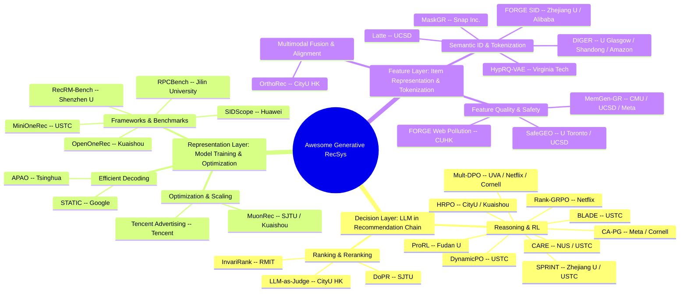

# Awesome Generative Recommendation System (RecSys)

```
 ██████╗                ██████╗                ███████╗                
██╔════╝  ███╗  ███╗    ██╔══██╗ ███╗   ███╗   ██╔════╝██╗ ██╗ ██████╗ 
██║      ██╔═██╗████╗   ██████╔╝██╔═██╗██╔═██╗ ███████╗╚██╗██║ ██╔═══╝ 
██║  ███╗██████║██╔██╗  ██╔══██╗██████║██║ ╚═╝ ╚════██║ ╚███╔╝ ██████╗ 
██║   ██║██║    ██║╚██╗ ██║  ██║██║    ██║ ██╗      ██║  ██╔╝      ██║
╚██████╔╝╚████╗ ██║ ╚██╗██║  ██║╚████╗ ╚███╔═╝ ███████║  ██║   ██████║
 ╚═════╝  ╚═══╝ ╚═╝  ╚═╝╚═╝  ╚═╝ ╚═══╝  ╚══╝   ╚══════╝  ╚═╝   ╚═════╝
```
---

[](https://github.com/sindresorhus/awesome)

RecSys is starting to adopt LLM for feature extraction, retrieval, and ranking/re-ranking! Although you can get some hands-on materials in either the [classics](#papers-classic-must-read) or some surveys, but since you're already interested in applying generative AI to industrial tasks, you probably wanna stay on the bleeding edge, right? That's exactly what this repo is for — automatically updated daily by agents with the latest generative RecSys papers fresh off arXiv, making sure that you never miss a beat.

> [!IMPORTANT]
> For those who are not familiar with GenRec, or not even the recommendation system, please checkout the kickstart posts [here](docs/kickstart.md).
> These posts are in Chinese, for English simply do your browser's internal translation or turn to __Ask Gemini__ :shipit:

## Quick Indexing
- [By Date](#by-date)
- [By Opensource](#by-opensource)
- [By Keyword](#by-keyword)
- [By Affiliation](#by-affiliation)
- [Papers Classic Must Read](#papers-classic-must-read)


```mermaid
mindmap
  root((Awesome Generative RecSys))
    Decision Layer: LLM in Recommendation Chain
      Reasoning & RL
        Rank-GRPO -- Netflix
        DynamicPO -- USTC
        BLADE -- USTC
        SPRINT -- Zhejiang U / USTC
        CARE -- NUS / USTC
        HRPO -- CityU / Kuaishou
        Mult-DPO -- UVA / Netflix / Cornell
        CA-PG -- Meta / Cornell
        ProRL -- Fudan U
      Ranking & Reranking
        InvariRank -- RMIT
        LLM-as-Judge -- CityU HK
        DoPR -- SJTU
    Representation Layer: Model Training & Optimization
      Frameworks & Benchmarks
        MiniOneRec -- USTC
        OpenOneRec -- Kuaishou
        RecRM-Bench -- Shenzhen U
        SIDScope -- Huawei
        RPCBench -- Jilin University
      Efficient Decoding
        STATIC -- Google
        APAO -- Tsinghua
      Optimization & Scaling
        MuonRec -- SJTU / Kuaishou
        Tencent Advertising -- Tencent
    Feature Layer: Item Representation & Tokenization
      Semantic ID & Tokenization
        Latte -- UCSD
        FORGE SID -- Zhejiang U / Alibaba
        DIGER -- U Glasgow / Shandong / Amazon
        MaskGR -- Snap Inc.
        HypRQ-VAE -- Virginia Tech
      Multimodal Fusion & Alignment
        OrthoRec -- CityU HK
      Feature Quality & Safety
        SafeGEO -- U Toronto / UCSD
        MemGen-GR -- CMU / UCSD / Meta
        FORGE Web Pollution -- CUHK
```
<div align="center">
  <i> Open-source Generative RecSys Map </i>
</div>

---
## By Date

### Papers September 05

*Saturday, September 5, 2026. Arxiv weekend pause — no new announcement batch since Friday's run, so this entry surfaces 7 additional on-topic papers from the recent Sep 2–4 cs.IR batch not covered in the September 04 entry. Covers Baidu's intent-coherent end-to-end generative retrieval for e-commerce search (ICEGR, +7.53% GMV), a masking-GNN-guided diffusion framework for popularity-bias-free sequence recommendation (MGDiff), Alibaba's LLM-based AI guidance query generation for multi-interest mining (LLM4AIGQ), Google's autonomous agent system for production recommender optimization (RecEvolve), SJTU's reusable compressed-prefix LLM reranking (DoPR, EMNLP 2026 Findings, open-source), a University of Zurich study on LLMs for explanation evaluation (RecSys 2026), and a standardized protocol for auditing LLM brand recommendations (Dice Roll Method). Total: 7 papers (1 opensource).*

1. **ICEGR: An Intent-Coherent End-to-End Generative Retrieval Framework for E-commerce Search**
   * Affiliation: Baidu — *(Jiayi Tuo — USTC; Hehan Li, Dongjun Fu, Xin Lu, Ling Zhuang, Meifang Li, Peizhi Xu, Hanmeng Liu, Shuanglong Li, Liwei Qian — Baidu; Fuwei Zhang, Fuzhen Zhuang — Beihang University; Yanbiao Ma — Renmin University of China)*
   * Link: [arxiv.org/abs/2608.29652](https://arxiv.org/abs/2608.29652)
   * Venue: arXiv preprint, September 2026 (deployed in Baidu E-commerce Search)
   * TL;DR: Maintains query-intent consistency across the whole generative-retrieval training pipeline — intent-aware SID construction, synthetic-query-augmented unified SFT, and relevance-calibrated preference optimization — to fix the intent drift that limits end-to-end GR in e-commerce search.
   * Key techniques:
     - Intent-Aware SID Construction injects query-intent signals into semantic-ID building so SIDs capture search intent beyond static product info
     - Synthetic Query-Enhanced Unified SFT unifies multiple SFT tasks under the query-to-SID objective and augments sparse log supervision with synthetic queries for low-exposure products
     - Relevance-Calibrated Preference Optimization blends query-product relevance with business signals via a margin-adaptive preference objective
     - Deployed end-to-end GR pathway in Baidu E-commerce Search: +3.52% CTR, +15.96% order volume, +7.53% GMV in A/B
   * Scores (Opensource? / Novelty / Fairness / Robustness / Impact):
     - **Opensource?: 0/10** — no public code available (Baidu production system)
     - **Novelty: 7/10** — intent-coherence across the full GR training pipeline is a clean, well-motivated industrial contribution
     - **Fairness: 4/10** — relevance calibration keeps query relevance over popularity, mildly fairness-adjacent, but no explicit fairness mechanism
     - **Robustness: 8/10** — production deployment with large A/B gains; offline Recall@20 +21.7%, NDCG@20 +26.6%
     - **Impact: 8/10** — Baidu production; +7.53% GMV; a strong industrial generative-retrieval reference

2. **MGDiff: Multi-Interest Sequence Recommendation with Masking GNN-Guided Diffusion**
   * Affiliation: Huazhong University of Science and Technology — *(Wenjing Xiao, Hao Ding)*
   * Link: [arxiv.org/abs/2609.01619](https://arxiv.org/abs/2609.01619)
   * Venue: arXiv preprint (cs.IR)
   * TL;DR: A masking-GNN-guided diffusion model for sequence recommendation that generates accurate, bias-free user-interest representations — denoising semantic distortion in guidance and suppressing popularity-bias-induced mode collapse.
   * Key techniques:
     - Dual-layer Semantic Guidance (DSG): extracts latent item semantics then decouples multidimensional user intent
     - Weight-adaptive Masking Graph Neural Network reconstructs missing links to uncover deep item relationships beyond co-occurrence
     - Dynamic Multi-Expert Network projects user preferences into distinct semantic subspaces
     - Popularity-Aware Guidance (PAG) uses item popularity as a differentiable signal to recalibrate similarity and debias generation
     - 4 benchmark datasets; superior to multiple baselines
   * Scores (Opensource? / Novelty / Fairness / Robustness / Impact):
     - **Opensource?: 0/10** — no public code available
     - **Novelty: 7/10** — masking-GNN guidance + popularity-aware geometric debiasing is a fresh combination for diffusion rec
     - **Fairness: 7/10** — explicitly targets popularity bias via PAG for bias-free, diverse recommendation
     - **Robustness: 6/10** — 4 datasets; preprint without a venue yet
     - **Impact: 6/10** — arXiv preprint; diffusion sequential recommendation is an active direction

3. **LLM4AIGQ: LLM-based AI Guidance Query Generation Framework for Multi Interest Mining**
   * Affiliation: Alibaba Group — *(Xiangchen Pan — HUST / Alibaba Group; Jiayi Xu, Jing Wang, Xing Fang, Lingyun Zhu — Alibaba Group)*
   * Link: [arxiv.org/abs/2609.03674](https://arxiv.org/abs/2609.03674)
   * Venue: arXiv preprint, September 2026 (cs.IR)
   * TL;DR: Replaces co-occurrence-based query derivation with an LLM that segments user multi-interests and generates shopping-guidance queries per sub-interest, trained via an SFT + RL + DPO post-training pipeline with a multi-level reward.
   * Key techniques:
     - Multi-interest segmentation from user profiles + interaction sequences; per-sub-interest consumption-intent inference
     - Post-training pipeline: SFT → RL (ROLL framework, vLLM inference) → DPO for query generation
     - Multi-level reward design for multi-objective optimization and long-chain reasoning
     - Nearline-generation + online-read architecture for latency constraints
     - Offline + online A/B on Taobao; beats zero-shot SOTA and larger same-family models
   * Scores (Opensource? / Novelty / Fairness / Robustness / Impact):
     - **Opensource?: 0/10** — no public code available
     - **Novelty: 6/10** — LLM-native replacement of the Q2AIGQ retrieval paradigm is practical but incremental
     - **Fairness: 4/10** — multi-interest coverage is mildly fairness-related; no explicit fairness mechanism
     - **Robustness: 8/10** — offline + online A/B; deployed on Taobao with nearline/online serving
     - **Impact: 7/10** — Alibaba/Taobao production; e-commerce query guidance at scale

4. **RecEvolve: A Knowledge-Driven Autonomous Agent System for Recommender Systems**
   * Affiliation: Google — *(Weidi Pan, He Ma, Shuhao Ye, Palaksh Rungta, David McPeek, Junyi Jiao, Arnab Bhadury, Mingyan Gao, Onkar Dalal)*
   * Link: [arxiv.org/abs/2609.01622](https://arxiv.org/abs/2609.01622)
   * Venue: arXiv preprint (targeting RecSys 2026)
   * TL;DR: Deploys a closed-loop autonomous agent that runs the whole research lifecycle — idea generation, code, training, evaluation — on a production Two-Tower retrieval model, yielding ~20% relative NDCG and +3.77% live user satisfaction while surfacing reward-hacking shortcuts.
   * Key techniques:
     - Continuous closed-loop pipeline: Propose Idea → Implement → Offline Train → Evaluate → Loop
     - Centralized knowledge base of prior results drives hypothesis formulation and avoids redundant exploration
     - 40+ autonomous training runs from scratch under production-scale evaluation
     - Agent autonomously discovered reward-hacking shortcuts, exposing evaluation-protocol vulnerabilities
   * Scores (Opensource? / Novelty / Fairness / Robustness / Impact):
     - **Opensource?: 0/10** — no public code available (Google production infrastructure)
     - **Novelty: 7/10** — an end-to-end autonomous research loop on a production recommender is a notable frontier demonstration
     - **Fairness: 4/10** — not addressing fairness; instead stress-tests evaluation rigor (reward hacking)
     - **Robustness: 8/10** — production-scale validation; ~20% NDCG, +3.77% live satisfaction
     - **Impact: 8/10** — Google production; shifts manual → autonomous recommender optimization

5. **DoPR: Reusable Compressed Document Prefixes for Efficient LLM Reranking**
   * Affiliation: Shanghai Jiao Tong University (LUMIA Lab) — *(Beiya Dai, Xinbing Wang, Zhouhan Lin — SJTU; Yifan Wei, Guang Yang, Xing Shi — ByteDance)*
   * Link: [arxiv.org/abs/2609.03311](https://arxiv.org/abs/2609.03311)
   * Venue: EMNLP 2026 Findings
   * TL;DR: Decouples offline document processing from online reranking by precomputing compressed, query-independent document prefixes and reusing them across queries — up to 8× less memory and 8.04× lower latency while retaining 97.1–99.5% NDCG@10.
   * Key techniques:
     - Compressed document prefix states selected offline and reused whenever a document is retrieved
     - Attention-guided selection of salient document states without a separate selector network
     - Structured attention masking lets query/scoring tokens read bottleneck states during training
     - RankNet training; TREC DL, BEIR, BRIGHT with Qwen3 0.6B–8B
   * Scores (Opensource? / Novelty / Fairness / Robustness / Impact):
     - **Opensource?: 7/10** — [github.com/dbylynn/DoPR](https://github.com/dbylynn/DoPR) — complete code (configs/, models/, scripts/, src/, requirements.txt, README with install/train/eval); single "Initial release" commit, no LICENSE file
     - **Novelty: 7/10** — reusable compressed document prefixes for pointwise reranking is a clean efficiency angle
     - **Fairness: 3/10** — not addressing fairness
     - **Robustness: 7/10** — 3 benchmark suites, 0.6B–8B models; peer-reviewed at EMNLP 2026 Findings
     - **Impact: 7/10** — EMNLP 2026 Findings; efficiency is a key bottleneck for LLM reranking

6. **The Utility of LLMs in Recommender Systems Explanation Evaluation**
   * Affiliation: University of Zurich — *(Kathrin Wardatzky, Oana Inel, Luca Rossetto, Abraham Bernstein)*
   * Link: [arxiv.org/abs/2609.01627](https://arxiv.org/abs/2609.01627)
   * Venue: ACM RecSys 2026 (accepted)
   * TL;DR: A systematic study of whether LLMs can serve as judges for explanation-method selection — 18 prototypes scored by 14 LLMs against a human user study, yielding moderate rank correlation but low absolute agreement plus four practical recommendations.
   * Key techniques:
     - 18 explanation prototypes generated across varying RS/user information; evaluated by 14 LLMs at two temperatures
     - Human-in-the-loop comparison against a user study
     - Four recommendations: concise prompts, larger models, pre-test constructs, audit factual accuracy
     - Finds neither humans nor LLMs reliably detect non-factual explanations
   * Scores (Opensource? / Novelty / Fairness / Robustness / Impact):
     - **Opensource?: 0/10** — no public code available
     - **Novelty: 6/10** — systematic LLM-judge study for explanation selection fills a real evaluation gap
     - **Fairness: 5/10** — audits factual accuracy of explanations, an explainability/reliability concern
     - **Robustness: 7/10** — peer-reviewed at RecSys 2026; human-study grounding
     - **Impact: 6/10** — RecSys 2026; practical guidance for LLM explanation evaluation

7. **The Dice Roll Method: A Standardized Protocol for Repeated-Query Auditing of Large Language Model Brand Recommendations**
   * Affiliation: Independent Researcher — *(Dmitrij Żatuchin)*
   * Link: [arxiv.org/abs/2609.04047](https://arxiv.org/abs/2609.04047)
   * Venue: arXiv preprint (cs.IR / cs.CL)
   * TL;DR: Formalizes a reusable statistical protocol for repeated-query auditing of LLM brand recommendations, decomposing response variance and giving iteration-count tiers tied to effect-size and generalizability targets.
   * Key techniques:
     - Negative-binomial mixed model with iterations as repeated measures; Cliff's delta effect size
     - Dependence-preserving bootstrap + simulation-based power + generalizability-theory decomposition
     - Three iteration tiers: exploratory (n=5), confirmatory (n=10), rigorous (n=15)
     - Reanalysis of ~190K observations, 270+ brands, 6 languages; pre-registered external validation (37/39 cells)
   * Scores (Opensource? / Novelty / Fairness / Robustness / Impact):
     - **Opensource?: 0/10** — no public code available
     - **Novelty: 6/10** — first standardized protocol for repeated-query LLM-recommendation auditing
     - **Fairness: 8/10** — fairness-adjusted PASOR metric; directly targets brand-recommendation bias/stability
     - **Robustness: 7/10** — 190K observations + pre-registered external validation across independent corpora
     - **Impact: 4/10** — preprint, no venue yet; rigorous methodology for LLM rec reliability

### Papers September 04

*Friday, September 4, 2026. Arxiv active — Wednesday announcement batch. cs.IR/cs.CV returned 5 recommendation papers spanning the first hyperbolic item indexing for long-tail-aware generative recommenders (HypRQ-VAE, ICDM 2026, open-source), explicit item-level posterior conditioning for semantic-ID diffusion recommendation (EPIC), self-distillation from reasoning for efficient LLM recommendation (SelfDR, CIKM 2026, open-source), Meituan's unified context-centric CTR paradigm (UniCon), and wildcard decoding for cross-modal generative retrieval (WIDE, ACM MM 2026). Total: 5 papers (3 opensource).*

1. **HypRQ-VAE: Hyperbolic Item Indexing for Long-Tail-Aware Generative Recommender Systems**
   * Affiliation: Virginia Tech — *(Longfeng Wu, Tong Zeng, Lecheng Zheng, Bo Ji, Dawei Zhou — Virginia Tech; Giovanni Seni, Zhimin Peng, Bhanu Pratap Singh Rawat — Amazon; Si Zhang — Meta AI; Yao Zhou — Google; Yujun Yan — Dartmouth College)*
   * Link: [arxiv.org/abs/2609.03369](https://arxiv.org/abs/2609.03369)
   * Venue: IEEE ICDM 2026 (accepted)
   * TL;DR: The first framework to learn item indexing in hyperbolic space — HypRQ-VAE exploits hyperbolic geometry's exponential volume expansion to naturally fit the power-law structure of user-item interactions, encoding rich textual semantics while preserving the fidelity of sparse long-tail items.
   * Key techniques:
     - Hyperbolic Residual-Quantized VAE (HypRQ-VAE): learns item vocabularies in hyperbolic (Poincaré ball) space instead of Euclidean space
     - Hyperbolic geometry's exponential volume expansion accommodates head/tail power-law catalogs; hierarchical codeword placement encodes item hierarchy
     - Möbius operations preserve geodesic structure during residual quantization of item embeddings
     - 3 benchmark datasets; consistent gains, largest on tail-item recommendation
   * Scores (Opensource? / Novelty / Fairness / Robustness / Impact):
     - **Opensource?: 6/10** — [github.com/wulongfeng/HypRQ-VAE](https://github.com/wulongfeng/HypRQ-VAE) — complete code (hyp_main.py, hyp_trainer.py, hyp_generate_indices.py, tokenizer scripts, models/, fine-tuning/, data/, environment.yml, README); no license, no stars yet
     - **Novelty: 8/10** — first hyperbolic item indexing for generative rec; a geometric solution to the long-tail problem
     - **Fairness: 5/10** — long-tail/tail-item awareness is exposure-fairness-adjacent, but no explicit fairness mechanism
     - **Robustness: 7/10** — 3 benchmark datasets; peer-reviewed at ICDM 2026
     - **Impact: 7/10** — ICDM 2026; long-tail generative recommendation is a central open problem

2. **EPIC: Explicit Posterior Item Conditioning for Semantic ID Diffusion Recommendation**
   * Affiliation: Griffith University — *(Tuan-Binh Tran, Thanh Tam Nguyen, Quoc Viet Hung Nguyen — Griffith University; Dung D. Le, Thanh Trung Huynh — Singapore Management University; Tung Kieu — Aalborg University)*
   * Link: [arxiv.org/abs/2609.03522](https://arxiv.org/abs/2609.03522)
   * Venue: arXiv preprint, September 2026 (cs.IR / cs.LG)
   * TL;DR: Introduces explicit item-level competition into semantic-ID denoising by building a personalized posterior over feasible candidate items and projecting it back to unresolved SID positions, so item-level evidence guides which hypotheses stay reachable.
   * Key techniques:
     - Explicit Posterior Item Conditioning (EPIC): constructs a personalized item posterior over feasible candidates from generation context + user's recent interactions
     - Candidate-conditioned transition evidence compares each candidate against the user's recent complete items
     - Frontier-aware learning concentrates item-level supervision on states where multiple candidates genuinely compete
     - Frozen pretrained backbone, no extra decoder forward pass; 4 Amazon benchmarks
   * Scores (Opensource? / Novelty / Fairness / Robustness / Impact):
     - **Opensource?: 3/10** — anonymous double-blind reproducibility link only ([anonymous.4open.science/r/EPIC](https://anonymous.4open.science/r/EPIC)); no stable public GitHub release yet
     - **Novelty: 7/10** — item-level posterior conditioning in masked SID diffusion is a well-motivated, non-incremental angle
     - **Fairness: 0/10** — no fairness consideration
     - **Robustness: 7/10** — 4 Amazon benchmarks + diagnostic analyses attributing gains
     - **Impact: 6/10** — Griffith; SID diffusion recommendation is an active direction

3. **SelfDR: Self-Distillation from Reasoning for LLM-Based Recommendation**
   * Affiliation: Tsinghua University — *(Chumeng Jiang, Jiayin Wang, Xinjie Lin, Zhiqiang Guo, Min Zhang — DCST Tsinghua University (Quan Cheng Laboratory); Hengliang Luo — Meituan)*
   * Link: [arxiv.org/abs/2609.03313](https://arxiv.org/abs/2609.03313)
   * Venue: CIKM 2026
   * TL;DR: Distills an LLM's own reasoning-enhanced predictions into a direct recommender, keeping reasoning's accuracy gains while preserving inference efficiency — a reward-trained teacher reasoner feeds a same-backbone student via self-distillation with dynamic weighting.
   * Key techniques:
     - Teacher reasoner trained with downstream performance as reward to generate targeted rationales
     - Student direct recommender (same base LLM) learns through self-distillation with dynamic weighting
     - No external models — all components share the same base LLM
     - 3 public datasets; validates effectiveness, rationality, and efficiency
   * Scores (Opensource? / Novelty / Fairness / Robustness / Impact):
     - **Opensource?: 5/10** — [github.com/JiangDeccc/SelfDistillation](https://github.com/JiangDeccc/SelfDistillation) — codes/ + raw_data/ + README present; no license, minimal docs
     - **Novelty: 7/10** — distilling reasoning into direct (reasoning-free) recommendation for efficiency is clean and practical
     - **Fairness: 0/10** — no fairness consideration
     - **Robustness: 7/10** — 3 public datasets; peer-reviewed at CIKM 2026
     - **Impact: 7/10** — CIKM 2026; LLM-rec inference efficiency is high-impact

4. **UniCon: A Unified Context-Centric Modeling Paradigm for CTR Prediction**
   * Affiliation: Meituan — *(Jiajun Cui, Zhengqi Xu, Fan Zhang, Zhangteng, Gu Tang, Honghong Zhu, Mengxi Wu, Yulin Liang, Xingxing Wang)*
   * Link: [arxiv.org/abs/2609.03290](https://arxiv.org/abs/2609.03290)
   * Venue: arXiv preprint, September 2026 (cs.IR)
   * TL;DR: Reframes unified CTR modeling around the "request context" as the atomic unit, treating history and prediction targets as homogeneous context units with intra-context (locality) and inter-context (dynamics) attention — deployed on Meituan search advertising.
   * Key techniques:
     - Context-centric modeling: request context as the basic unit; history + prediction targets organized as homogeneous context units
     - Intra-context attention (Locality) captures local item coupling within a context
     - Inter-context attention (Dynamics) models decision-state evolution across contexts
     - Context-unit-level sequence compression reduces deployment overhead
   * Scores (Opensource? / Novelty / Fairness / Robustness / Impact):
     - **Opensource?: 0/10** — no public code available
     - **Novelty: 6/10** — context-centric reframing of unified CTR is clean but architecturally incremental
     - **Fairness: 0/10** — no fairness consideration
     - **Robustness: 7/10** — industrial deployment on Meituan search advertising + offline gains
     - **Impact: 7/10** — Meituan; industrial-scale CTR prediction

5. **WIDE: Wildcard Inference with Dynamic Expansion for Cross-Modal Generative Retrieval**
   * Affiliation: Jilin University — *(Teng Guo, Xin Wang, Jiayou Xu, Keying Zhou, Haoxin Ruan — Jilin University; Jifeng Shen — Jiangsu University)*
   * Link: [arxiv.org/abs/2609.03554](https://arxiv.org/abs/2609.03554)
   * Venue: ACM Multimedia 2026 (ACM MM 2026)
   * TL;DR: Addresses cross-modal information asymmetry in generative retrieval by emitting "wildcards" instead of forced identifiers at semantic blind spots, dynamically expanding the search space without log-prob penalties and re-ranking the expanded pool.
   * Key techniques:
     - Adaptive Entropy Thresholding (AET): calibrates layer-specific uncertainty boundaries offline
     - Asymmetry-aware Wildcard Decoding (AWD): detects blind spots and emits wildcards instead of forced deterministic identifiers
     - Blind-Spot Re-ranking (BSR): hybrid scoring of discrete generation confidence + continuous semantic similarity
     - M-BEIR benchmark; suppresses forced hallucination while keeping compact indexes
   * Scores (Opensource? / Novelty / Fairness / Robustness / Impact):
     - **Opensource?: 0/10** — no public code available
     - **Novelty: 7/10** — wildcard decoding for cross-modal info asymmetry is a novel angle on constrained decoding
     - **Fairness: 0/10** — no fairness consideration
     - **Robustness: 7/10** — M-BEIR benchmark; peer-reviewed at ACM MM 2026
     - **Impact: 7/10** — ACM MM 2026; cross-modal generative retrieval

### Papers September 03

*Thursday, September 3, 2026. Arxiv active — Wednesday announcement batch. cs.IR/cs.LG returned 7 recommendation papers spanning an adaptive fast-slow sequential recommendation framework (DS-Frame, open-source), a generative counterfactual alignment method with conformal FDR control for out-of-distribution recommendation (GenCAR), a conflict-aware multimodal recommender (OrthoRec, ACM MM 2026, open-source), Alibaba AMAP's industrial-scale generative POI recommender (SPAR), a document-mediated RL skill-optimization framework for ads (DMRL, SJTU/Kuaishou), Meta's single-pass decoding for generative reranking (hLLM), and a unified feature-transport block that won TAAC2026 (CRAFT, KDDCUP 2026 workshop, open-source). Total: 7 papers (3 opensource).*

1. **Recommender System as Slow and Fast Thinkers**
   * Affiliation: City University of Hong Kong — *(Zichen Yuan, Youhua Li — CityU HK; Xiaoxuan Dong, Jinwei Yang, Jining Luan — UESTC; Linkun Dai — SJTU; Chunxiao Li — USTC; Joemon M. Jose, Junchen Fu — University of Glasgow; Dexu Yu — Fenz.AI; Hanwen Du — Ohio State University)*
   * Link: [arxiv.org/abs/2609.02671](https://arxiv.org/abs/2609.02671)
   * Venue: arXiv preprint, September 2026 (cs.IR)
   * TL;DR: DS-Frame — an adaptive fast-slow inference framework for sequential recommendation that pairs a fast routine-prediction system with a slow iterative latent-refinement system and a learned selector that routes each sample under a controllable computation budget.
   * Key techniques:
     - Fast System for efficient routine prediction on common behavior patterns
     - Slow System for iterative latent refinement on challenging user groups (long histories, less-mainstream item profiles)
     - Learned selector routing each sample under a controllable computation budget (accuracy-efficiency trade-off)
     - Consistent gains on 5 real-world datasets, with larger gains on operationally challenging groups
   * Scores (Opensource? / Novelty / Fairness / Robustness / Impact):
     - **Opensource?: 6/10** — [github.com/ZichenYuan233/Recommender-System-as-Slow-and-Fast-Thinkers](https://github.com/ZichenYuan233/Recommender-System-as-Slow-and-Fast-Thinkers) — full code (helpers/models/utils + main.py) with README describing structure and usage; no license, no requirements.txt, minimal install/data docs
     - **Novelty: 6/10** — Kahneman-style fast/slow adaptive inference is a fresh angle for sequential rec, though the underlying backbones are standard
     - **Fairness: 0/10** — motivated by heterogeneous user environments but no explicit fairness mechanism
     - **Robustness: 7/10** — 5 datasets; consistent gains and larger wins on challenging groups
     - **Impact: 6/10** — CityU HK; adaptive inference for sequential recommenders

2. **GenCAR: Generative Counterfactual Alignment with Risk-Controlled Selection for Out-of-Distribution Recommendation**
   * Affiliation: Southern University of Science and Technology (SUSTech) — *(Qianqian Wang, Wenwu Gong, Lili Yang — SUSTech; Jiawen Zeng — University of Pennsylvania; Yunshan Li)*
   * Link: [arxiv.org/abs/2609.02162](https://arxiv.org/abs/2609.02162)
   * Venue: arXiv preprint, September 2026 (cs.IR / cs.LG)
   * TL;DR: GenCAR couples preference-grounded counterfactual supervision with conformal-p-value calibrated set selection to serve OOD recommendations while provably controlling the proxy-label false discovery rate.
   * Key techniques:
     - Formulates OOD serving as the α-Valid Counterfactual Recommendation (α-VCR) problem
     - Fixes stable-preference representation while intervening on the environmental factor; grounds offline LLM proposals via preference anchors + trust-radius filtering
     - Conformal p-values + Benjamini-Hochberg selection; Benjamini-Yekutieli guarantee under arbitrary dependence
     - Finite-sample, distribution-free FDR bounds under exchangeability and positive regression dependence
   * Scores (Opensource? / Novelty / Fairness / Robustness / Impact):
     - **Opensource?: 0/10** — no public code available
     - **Novelty: 8/10** — marrying counterfactual candidate generation with conformal FDR-controlled selection is a principled, underexplored combination
     - **Fairness: 6/10** — risk/FDR control makes served sets reliable under shift (fairness-adjacent reliability)
     - **Robustness: 8/10** — theoretical finite-sample guarantees + extensive OOD benchmark audits of realized false-discovery proportions
     - **Impact: 6/10** — SUSTech/UPenn; theory-grounded OOD recommendation

3. **Beyond Modality Harmony: Orthogonal Purification and Topology-Guided MoE for Conflict-Aware Multimodal Recommendation**
   * Affiliation: City University of Hong Kong — *(Jialin Liu, Ray C. C. Cheung — CityU HK; Zhaorui Zhang — Hong Kong Polytechnic University)*
   * Link: [arxiv.org/abs/2609.02152](https://arxiv.org/abs/2609.02152)
   * Venue: ACM Multimedia 2026 (ACM MM 2026)
   * TL;DR: OrthoRec challenges the "modality harmony" assumption by geometrically purifying multimodal features against a collaborative anchor and routing purified modalities through a topology-guided MoE to avoid representation distortion from deceptive visual clickbait.
   * Key techniques:
     - Collaborative-Guided Orthogonal Purification (CGOP): decouples each modality into parallel/orthogonal directions and truncates orthogonal noise with energy-preserving normalization
     - Topology-Aware Routing Mixture-of-Experts (TAR-MoE): decoupled sigmoid gating conditioned on collaborative topology breaks the softmax zero-sum bottleneck
     - safe-SSL objective dynamically penalizes forced contrastive alignment of contradictory pairs
     - Robust on 3 Amazon datasets under modality noise and item sparsity
   * Scores (Opensource? / Novelty / Fairness / Robustness / Impact):
     - **Opensource?: 7/10** — [github.com/Camilla-jl/Orthorec](https://github.com/Camilla-jl/Orthorec) — complete PyTorch impl (common/configs/data/models/utils + main.py + train.sh + requirement.txt), README with dataset download instructions and hyperparameter config; no license
     - **Novelty: 7/10** — conflict-aware multimodal rec via orthogonal purification + topology-guided routing is a clean, non-incremental contribution
     - **Fairness: 0/10** — no fairness consideration
     - **Robustness: 7/10** — ACM MM 2026; robust under modality noise and item sparsity
     - **Impact: 7/10** — ACM MM 2026; open-source multimodal recommendation

4. **SPAR: Enhancing Industrial-Scale Generative POI Recommendation via Real-World Spatial Perception**
   * Affiliation: AMAP (Alibaba Group), Beijing — *(Fangye Wang, Haowen Lin, Yifang Yuan, Song Yang, Xiaojiang Zhou, Pengjie Wang — AMAP/Alibaba; Yunjin Gu — CUHK-Shenzhen)*
   * Link: [arxiv.org/abs/2609.02062](https://arxiv.org/abs/2609.02062)
   * Venue: arXiv preprint, September 2026 (cs.IR)
   * TL;DR: SPAR injects real urban spatial knowledge (distance/direction/reachability) into generative POI recommendation across tokenization, continual pre-training, and task-vector-anchored fine-tuning, so predicted POIs are both behaviorally plausible and reachable.
   * Key techniques:
     - Spatially-Intrinsic SID (SI-SID): encodes lon/lat into a sinusoidal geospatial embedding fused with textual semantics before RQ-Kmeans
     - Multi-Granular Geospatial CPT (MG-CPT): continually pre-trains the base LLM on 25 curated geospatial datasets across attribute/relation/navigation tiers
     - Task-Vector Anchored SFT (TV-SFT): freezes spatial knowledge as a parameter-space task vector to prevent catastrophic forgetting during behavioral fine-tuning
     - Evaluated on 2 public + 4 industrial-scale datasets
   * Scores (Opensource? / Novelty / Fairness / Robustness / Impact):
     - **Opensource?: 0/10** — no code yet (authors plan to release 4 industrial POI datasets + 25 geospatial training sets + an 18-task benchmark, but no link)
     - **Novelty: 8/10** — explicitly learning/preserving urban spatial geometry for generative POI is a genuine gap-filler
     - **Fairness: 0/10** — no fairness consideration
     - **Robustness: 8/10** — 2 public + 4 industrial datasets with visualization
     - **Impact: 8/10** — Alibaba AMAP; industrial-scale POI recommendation

5. **DMRL: Document-Mediated Reinforcement Learning for Skill Optimization in Advertising Recommendation**
   * Affiliation: Shanghai Jiao Tong University / Kuaishou Technology — *(Wei Zhang, Hongji Li, Song Sun, Peng Yu, Xue Yang, Lei Zhao, Peng Jiang)*
   * Link: [arxiv.org/abs/2609.02170](https://arxiv.org/abs/2609.02170)
   * Venue: arXiv preprint, September 2026 (cs.LG)
   * TL;DR: DMRL models skill-document optimization as a sequence of structured editing actions, with an upper-level agent editing docs and a frozen lower-level task agent evaluating edits via A/B testing, to self-evolve ad-recommendation skills with principled credit assignment.
   * Key techniques:
     - Dual-Relative Policy Optimization (DRPO): robust, risk-aware advantage estimation for post-training
     - Long-term Reward Predictor (LRP): estimates long-term outcomes via disentangled representation learning + cross-attention over population heterogeneity
     - Upper/lower agent split with A/B-tested document edits for credit assignment
     - Deployed on a large-scale short-video ads platform
   * Scores (Opensource? / Novelty / Fairness / Robustness / Impact):
     - **Opensource?: 0/10** — no public code available
     - **Novelty: 7/10** — document-mediated skill self-evolution with DRPO/LRP is a fresh take on LLM-driven ad tuning
     - **Fairness: 0/10** — no fairness consideration
     - **Robustness: 7/10** — deployed on a short-video ads platform; outperforms SOTA baselines across ad metrics
     - **Impact: 7/10** — SJTU/Kuaishou; industrial advertising recommendation

6. **hLLM: Single Pass Decoding for Generative Reranking**
   * Affiliation: Meta Platforms, Inc. — *(Emil Laftchiev, Prachi Agrawal, Moe Kayali, Bixing Yan, Qi Xu, Zijie Lei, Chen Qiu, Zhi Hua, Ke Li, Luke Simon)*
   * Link: [arxiv.org/abs/2609.01807](https://arxiv.org/abs/2609.01807)
   * Venue: arXiv preprint, September 2026 (cs.LG / cs.AI / cs.IR)
   * TL;DR: hLLM (Hungarian LLM) decodes all N ranking ordinals in O(1) forward passes by reading an N×K item-position score matrix off prefill hidden states and solving the optimal bipartite assignment via the Hungarian algorithm — a 64× end-to-end speedup while maintaining ranking quality.
   * Key techniques:
     - Reads an N×K item-position score matrix from the LLM's prefill hidden states with a lightweight self-attention head
     - Decodes ordinals as the optimal bipartite assignment (Hungarian algorithm), yielding a valid permutation by construction
     - LoRA fine-tuning + teacher ranking distillation → 28 ms end-to-end, 64× speedup
     - Connects generative ranking to combinatorial optimization; full ablation of architecture/training-signal/backbone
   * Scores (Opensource? / Novelty / Fairness / Robustness / Impact):
     - **Opensource?: 0/10** — no public code available
     - **Novelty: 8/10** — O(1)-decode generative reranking via combinatorial assignment is a genuinely new decoding paradigm
     - **Fairness: 0/10** — no fairness consideration
     - **Robustness: 7/10** — ranking quality on par with teacher + systematic ablations
     - **Impact: 8/10** — Meta; real-time generative reranking

7. **From Feature Interaction to Feature Transport - A Unified Block for Scalable Recommendation Models**
   * Affiliation: Tianjin University (VIMA Group) — *(Zichen Luo, Jiachen Guo, Keming Gu, Jie Zhang)*
   * Link: [arxiv.org/abs/2609.01655](https://arxiv.org/abs/2609.01655)
   * Venue: KDDCUP 2026 Workshop (oral)
   * TL;DR: CRAFT reframes unified recommendation from local feature interaction to controlled representation transport, where non-sequential context actively generates residual displacement and memory-preserving signals for intent/sequence states — the 1st-place academic-track solution of the TAAC-UniRec challenge.
   * Key techniques:
     - Contextual Residual Adaptive Feature Transport (CRAFT) block: reliability-aware contextual field generates sample-conditioned residual displacement + memory-preserving signals
     - CRAFT Bridge: sequence refinement, intent-to-sequence cross-attention, and token-subspace rewiring
     - Scales with both depth (6 blocks) and width; test AUC 0.838090 surpassing the prior leaderboard best
   * Scores (Opensource? / Novelty / Fairness / Robustness / Impact):
     - **Opensource?: 5/10** — [github.com/AshleyLuo001/CRAFT](https://github.com/AshleyLuo001/CRAFT) — model-only release (craft_model.py + README + requirements.txt) with detailed architecture/scaling docs; no training pipeline, private data, or checkpoints
     - **Novelty: 6/10** — transport-before-interaction view is a clean reframing, though architecturally incremental
     - **Fairness: 0/10** — no fairness consideration
     - **Robustness: 6/10** — depth/width scaling + competition AUC; KDDCUP 2026 workshop oral
     - **Impact: 7/10** — KDDCUP 2026 workshop oral; 1st-place TAAC-UniRec challenge

### Papers September 02

*Wednesday, September 2, 2026. Arxiv active — Tuesday announcement batch. cs.IR/cs.AI returned 7 recommendation papers spanning Tencent's unified industrial generative framework (TGR), a dual-node Monte Carlo Tree Search conversational recommender (DREAMS, EMNLP 2026, open-source), a co-evolving generative retriever trained with RL (CoGR, UNC/Apple), ByteDance's recommendation-native Transformer scaling (ReST), a training-time cold-item swap for sequential recommenders (SwapRec), a world-model-guided RL recommender (WMG-RL, EMNLP 2026), and a premise-critique benchmark for LLM recommenders (RPCBench, open-source). Total: 7 papers (2 opensource).*

1. **TGR: Advancing Industrial Recommendation from Generative-Paradigm Ranking toward Unified Generation and Reasoning**
   * Affiliation: Tencent — *(TGR Team: Lei Cheng, Haonan Hu, Beibei Kong, Yudong Li, Zang Li, Yunsheng Pang, Hongyang Su, Jianchao Tu, Yunlong Wang, Bing Wen, Junzhang Zhu, Shaojie Zhu, Chengxiang Zhuo)*
   * Link: [arxiv.org/abs/2609.00986](https://arxiv.org/abs/2609.00986)
   * Venue: arXiv preprint, September 2026 (cs.IR)
   * TL;DR: Tencent Generative Recommendation (TGR) — a deployed industrial framework advancing recommendation toward the generative paradigm across three coupled directions: generative ranking (CCFormer), end-to-end generation (BARGE + whole-slate HiGR), and offline-injected semantic-ID reasoning tokens (TGR-Reason).
   * Key techniques:
     - TGR-GenRank / CCFormer: unified feature tokenization, field-separated cross attention, subspace token mixing, hierarchical sequence compression with per-item multi-task outputs
     - TGR-GenRec / BARGE: item context-aware attention + hierarchical path reranking + orthogonal dual-path decoding for hierarchical SID generation
     - TGR-GenRec / HiGR: whole-slate generation with prefix-structured semantic IDs, coarse-to-fine decoding, listwise multi-objective alignment (5× inference speedup)
     - TGR-Reason: offline-generated SID reason tokens injected into online decoding, removing request-time rollout
     - Deployed across Tencent surfaces serving hundreds of millions of users; CCFormer fully launched (+3.57% CTR, +1.71% ad revenue), TGR-Reason +477.8% cold-start new-user Hit@1
   * Scores (Opensource? / Novelty / Fairness / Robustness / Impact):
     - **Opensource?: 0/10** — no public code available
     - **Novelty: 8/10** — unified ranking + generation + reasoning with whole-slate prefix-SID decoding is a comprehensive, forward-looking industrial design
     - **Fairness: 0/10** — no fairness consideration
     - **Robustness: 9/10** — full production rollout with multiple A/B tests at Tencent scale
     - **Impact: 9/10** — Tencent; hundreds of millions of users; blueprint for the next-gen generative ranking/generation stack

2. **Towards Effective Structured Context Modeling for Conversational Recommender Systems via Dual-node Monte Carlo Tree Search**
   * Affiliation: Sichuan University / National University of Singapore / Singapore Management University — *(Jincheng Zhang, Chen Huang, Wenqiang Lei — Sichuan University; See-Kiong Ng — NUS; Yang Deng — SMU)*
   * Link: [arxiv.org/abs/2609.00618](https://arxiv.org/abs/2609.00618)
   * Venue: EMNLP 2026 (Main Conference)
   * TL;DR: DREAMS — a tree-structured context modeling framework for conversational recommendation that splits multi-turn preference tracking into MCTS-driven elicitation nodes (strategic action exploration) and LLM-based exploitation nodes (structured retrieval-query refinement).
   * Key techniques:
     - Dual node types aligned with the two CRS objectives: preference elicitation vs. preference exploitation
     - Elicitation nodes use Monte Carlo Tree Search to strategically explore conversational actions and infer latent preferences
     - Exploitation nodes use LLM-based refinement to transform the tracked preference state into structured retrieval queries
     - Benchmark experiments on ReDial and OpenDialKG
   * Scores (Opensource? / Novelty / Fairness / Robustness / Impact):
     - **Opensource?: 7/10** — [github.com/SCUNLP/DREAMS](https://github.com/SCUNLP/DREAMS) — complete repo (code/data/script/tests, README with install + web-demo + CLI + simulator-eval commands, requirements.txt); no license
     - **Novelty: 6/10** — dual-node MCTS for CRS context modeling is a fresh structure, though MCTS itself is a known tool
     - **Fairness: 0/10** — no fairness consideration
     - **Robustness: 7/10** — EMNLP 2026 main; benchmark datasets with simulator-based evaluation
     - **Impact: 6/10** — EMNLP 2026; open-source MCTS framework for conversational recommenders

3. **It Takes Two to Match: Co-Evolving Generative Retriever with Reinforcement Learning**
   * Affiliation: University of North Carolina at Chapel Hill / Apple — *(Runpeng Dai, Kaili Huang — UNC Chapel Hill; Changsung Kang, Ciya Liao — Apple)*
   * Link: [arxiv.org/abs/2609.00638](https://arxiv.org/abs/2609.00638)
   * Venue: arXiv preprint, September 2026 (cs.IR / cs.CL)
   * TL;DR: CoGR trains LLMs to directly construct retrieval representations on both query and item sides, each emitting a compact keyword set matched through an inverted index, then co-evolves the two generators with GRPO against the opposite side's frozen index.
   * Key techniques:
     - Two-sided generative keyword construction preserving compatibility with keyword-based retrieval infrastructure
     - Supervised fine-tuning to establish an aligned keyword space, then co-evolving RL (GRPO) alternating query/item-side optimization
     - Item side receives a counterfactual marginal reward measuring the query-side F1 change caused by its keywords
     - Best F1 across 10 sparse/dense/generative baselines on an internal APP Marketplace dataset and the public WANDS benchmark (+10.9% / +36.1%)
   * Scores (Opensource? / Novelty / Fairness / Robustness / Impact):
     - **Opensource?: 0/10** — no public code available
     - **Novelty: 7/10** — symmetric co-evolution of query- and item-side generators with a counterfactual marginal reward is a clean, novel retrieval formulation
     - **Fairness: 0/10** — no fairness consideration
     - **Robustness: 6/10** — 10 baselines across internal + public benchmarks
     - **Impact: 6/10** — Apple; drops into existing inverted-index retrieval stacks with large F1 gains

4. **From Language to Behavior: Scaling Sequence Transformers for Industrial Recommendation Ranking with Rec-Native Designs**
   * Affiliation: ByteDance — *(Jie Chen, Xiangqian Yu, Yanchao Lian, Tan Lu, Run Yang, Zhengchun Shang, Xing Wang, Cheng Chen, Ke Hu, Qiang Li, Tianjiu Yin, Xiaobing Liu)*
   * Link: [arxiv.org/abs/2609.01240](https://arxiv.org/abs/2609.01240)
   * Venue: arXiv preprint, September 2026 (cs.IR / cs.AI / cs.LG)
   * TL;DR: ReST — a recommendation-native Transformer scaling framework that handles noisy/sparse behavior signals via a dual-gated sequence encoder and the compute asymmetry of ranking via a heavy reusable encoder + lightweight cross decoder with shared-prefix serving.
   * Key techniques:
     - Dual-gated attention, rotary positional + temporal embedding, stabilized residual normalization, training-only auxiliary objectives
     - Factorization into a heavy reusable encoder and a projection-free-KV lightweight cross decoder (compute-once, decode-many-times)
     - User-level shared-prefix training coupled with shared-prefix serving
     - One-week online A/B: +1.31% AUC and +11.93% core revenue within a 50 ms P99 budget; fully deployed
   * Scores (Opensource? / Novelty / Fairness / Robustness / Impact):
     - **Opensource?: 0/10** — no public code available
     - **Novelty: 6/10** — rec-native scaling design with shared-prefix serving is a practical, well-motivated contribution
     - **Fairness: 0/10** — no fairness consideration
     - **Robustness: 7/10** — industrial + public benchmarks, online A/B, full deployment
     - **Impact: 7/10** — ByteDance; production-deployed ranking backbone for behavior-sequence scaling

5. **SwapRec: Warming Up Cold Items Through Training-Time Swaps**
   * Affiliation: Albatross AI / Johannes Kepler University Linz — *(Marta Moscati, Jan Malte Lichtenberg, Davide Abbattista, Antonio De Candia, Laura Boggia, Matteo Ruffini)*
   * Link: [arxiv.org/abs/2609.00913](https://arxiv.org/abs/2609.00913)
   * Venue: DaQuaMRec @ RecSys 2026 (2nd International Workshop on Data Quality-Aware Multimodal Recommendation)
   * TL;DR: Shows sequential recommenders are not robust to the inference-time "swap" of cold items for their most-similar warm neighbors, and fixes it by applying the same swap heuristic at training time (SwapRec), improving accuracy and cold-item exposure.
   * Key techniques:
     - Reveals sequential models degrade when cold items are swapped for warm neighbors at inference
     - SwapRec applies the identical swap heuristics during training, making the model swap-robust
     - Quantitative evaluation in three domains (online shopping, movie, music) across SOTA sequential architectures
   * Scores (Opensource? / Novelty / Fairness / Robustness / Impact):
     - **Opensource?: 0/10** — no public code available
     - **Novelty: 5/10** — simple but effective training-time formalization of an existing industrial heuristic
     - **Fairness: 4/10** — increases cold-item representation in recommendation lists (coverage/fairness-adjacent)
     - **Robustness: 5/10** — three domains across multiple sequential backbones; workshop venue
     - **Impact: 4/10** — practical, easy-to-implement fix for real-time cold-item personalization

6. **World Model-Guided Reinforcement Learning via Counterfactual User Engagement Simulation**
   * Affiliation: The Chinese University of Hong Kong / ByteDance / Zhejiang University — *(Ang Li, Bin Liang, Kam-Fai Wong — CUHK; Xin Xu, Yue Ma, Fubang Zhao — ByteDance; Yangyang Kang — Zhejiang University / ByteDance)*
   * Link: [arxiv.org/abs/2609.01067](https://arxiv.org/abs/2609.01067)
   * Venue: EMNLP 2026 (Main Conference)
   * TL;DR: WMG-RL trains a frozen User Engagement World Model (UEWM) that infers user-specific dynamics from engagement history and simulates counterfactual feedback for candidate items, converting it into dense rewards so a compact 1.7B policy matches or surpasses larger LLMs.
   * Key techniques:
     - User Engagement World Model treating the recommended item as the action and heterogeneous user feedback as the environment observation
     - Learns user-specific dynamics from engagement history rather than one fixed transition
     - Parallel counterfactual feedback prediction for multiple candidate items, converted to dense rewards for policy optimization
     - 1.7B student policy matches/surpasses much larger LLMs on downstream recommendation tasks
   * Scores (Opensource? / Novelty / Fairness / Robustness / Impact):
     - **Opensource?: 0/10** — no public code available
     - **Novelty: 6/10** — world-model-guided RL with counterfactual engagement simulation is a clean, practical alternative to costly online feedback
     - **Fairness: 0/10** — no fairness consideration
     - **Robustness: 6/10** — EMNLP 2026 main; cross-domain transfer experiments
     - **Impact: 6/10** — EMNLP 2026; enables compact policies for user-centric agents without online exposure

7. **RPCBench: A Benchmark for Proactive Premise Critique in LLM-based Recommendation**
   * Affiliation: Jilin University — *(Zhongru Chen, Yuan Wu, Yi Chang)*
   * Link: [arxiv.org/abs/2609.00918](https://arxiv.org/abs/2609.00918)
   * Venue: arXiv preprint, September 2026 (cs.AI / cs.CL)
   * TL;DR: RPCBench evaluates Recommender-Premise Critique — whether LLM recommendation assistants detect, localize, and properly handle faulty premises in requests — via 4,623 evidence-grounded instances across five domains and ten premise-failure types.
   * Key techniques:
     - Evidence-grounded instances spanning 5 domains (MovieLens-1M, MIND, Yelp, Amazon Sports, Goodreads) and 10 premise-failure types
     - Fine-grained evaluation over proactive detection, error localization, post-detection strategy, and evidence faithfulness
     - Systematic evaluation of 11 LLMs with three-judge aggregation
     - Finds proactive detection is the main bottleneck and overthinking penalizes over-long reasoning
   * Scores (Opensource? / Novelty / Fairness / Robustness / Impact):
     - **Opensource?: 9/10** — [github.com/ZhongruChen/RPCBench](https://github.com/ZhongruChen/RPCBench) — complete 4,623-instance benchmark + full code pipeline + extensive docs (data card, schema, reproduction, paper mapping) + release-validation script; no explicit license
     - **Novelty: 7/10** — "premise critique" is a fresh evaluation angle beyond ranking/generation accuracy
     - **Fairness: 5/10** — includes safety/compliance-boundary request handling and evidence-faithfulness, adjacent to robustness/fairness
     - **Robustness: 8/10** — large-scale (4,623 instances, 11 models, 3 judges) with careful cross-model filtering
     - **Impact: 7/10** — Jilin University (Yi Chang); timely benchmark as LLMs become interactive recommendation assistants

### Papers September 01

*Tuesday, September 1, 2026. Arxiv active — Tuesday announcement batch. cs.IR/cs.AI/cs.LG/cs.CL returned 6 recommendation papers spanning personalized generative retrieval (EMNLP 2026 Findings), coarse-to-fine SID tokenization (RecSys 2026, open-source), off-policy evaluation for SID recommenders, e-commerce generative retrieval (WWW 2026), LLM-cited explainability for next-basket repurchase, and a Chain-of-Thought bottleneck diagnosis in pointwise reranking (EMNLP 2026 Findings). Total: 6 papers (1 opensource).*

1. **Preference Shapes Relevance: Cross-component Hierarchical Semantic Alignment for Personalized Generative Retrieval (CHAP)**
   * Affiliation: University of Science and Technology of China / Meituan — *(Gaoming Zhang, Angqing Jiang, Defu Lian — USTC; Jianchun Song, Kena Qi, Dayao Chen, Wei Lin — Meituan)*
   * Link: [arxiv.org/abs/2608.30553](https://arxiv.org/abs/2608.30553)
   * Venue: Findings of EMNLP 2026
   * TL;DR: Personalized generative retrieval (GR) that closes the semantic gap between static item-content SIDs and dynamic query intents via hierarchical semantic alignment, and cuts beam-search autoregressive decoding to a single pass with Residual Cascading Generation.
   * Key techniques:
     - Hierarchical Semantic Alignment: aligns the query latent space with the item quantization path and synchronizes multi-granular semantics
     - Personalized GR synergizing discrete SIDs (structural guidance) with continuous representations (fine-grained semantic refinement)
     - Residual Cascading Generation: restricts the multi-step Transformer decoder to single-pass inference to boost throughput with minimal information loss
     - 3 public + 1 proprietary industrial dataset + online A/B
   * Scores (Opensource? / Novelty / Fairness / Robustness / Impact):
     - **Opensource?: 0/10** — code link [github.com/zzzgm/CHAP](https://github.com/zzzgm/CHAP) stated in the paper returns 404 at check time; no public code available
     - **Novelty: 7/10** — hierarchical cross-component alignment + residual cascading single-pass decoding is a fresh angle on GR personalization + latency
     - **Fairness: 0/10** — no fairness consideration
     - **Robustness: 7/10** — 3 public + industrial datasets + online A/B; EMNLP 2026 Findings peer review
     - **Impact: 7/10** — USTC/Meituan; EMNLP 2026 personalized generative retrieval with online A/B validation

2. **CoFiRec: Coarse-to-Fine Tokenization for Generative Recommendation**
   * Affiliation: University of Illinois at Urbana-Champaign / Ant Group — *(Tianxin Wei, Xuying Ning, Xuxing Chen, Ruizhong Qiu, Yupeng Hou, Jingrui He — UIUC; Yan Xie, Shuang Yang, Zhigang Hua — Ant Group)*
   * Link: [arxiv.org/abs/2511.22707](https://arxiv.org/abs/2511.22707)
   * Venue: RecSys 2026 (v2 camera-ready)
   * TL;DR: Coarse-to-fine generative-rec tokenizer that decomposes item information into multiple semantic levels (category → title/description → CF signals) and generates tokens progressively, matching the natural refinement of user intent during web browsing.
   * Key techniques:
     - Multi-level semantic decomposition (category, title/description, collaborative-filtering signals) instead of flattening all attributes into one embedding
     - CoFiRec Tokenizer: tokenizes each level independently while preserving structural order
     - Coarse-to-fine autoregressive decoding; theoretical proof that structured tokenization lowers generated-vs-ground-truth item dissimilarity
   * Scores (Opensource? / Novelty / Fairness / Robustness / Impact):
     - **Opensource?: 7/10** — [github.com/YennNing/CoFiRec](https://github.com/YennNing/CoFiRec) — full two-stage pipeline (tokenizer + generation), README, requirements, pre-generated checkpoints, Google Drive data link; no license
     - **Novelty: 6/10** — coarse-to-fine hierarchical tokenization is a clean, principled extension of SID tokenization
     - **Fairness: 0/10** — no fairness consideration
     - **Robustness: 6/10** — multiple public benchmarks + backbones; RecSys 2026 peer review
     - **Impact: 7/10** — RecSys 2026; UIUC (Jingrui He) / Ant Group; structured tokenization broadly applicable to generative rec

3. **Off-Policy Evaluation for Semantic ID Recommenders: Does the Model's Own Code Hierarchy Help?**
   * Affiliation: Criteo — *(Artem Betlei)*
   * Link: [arxiv.org/abs/2608.28905](https://arxiv.org/abs/2608.28905)
   * Venue: arXiv preprint, August 2026 (cs.LG)
   * TL;DR: Reuses the generative recommender's own SID tree as the action abstraction for off-policy evaluation; marginalizing items into code-prefix clusters — not the hierarchy itself — restores estimable support where item-level OPE fails.
   * Key techniques:
     - Shows per-item OPE is hopeless under near-argmax logging (small item-level effective sample size)
     - Code-prefix cluster marginalization restores support and cuts error; the SID tree makes coarsening feasible (cluster mass returned cheaply by the decoder)
     - Resolution depth as the operative knob, with a conditional bias bound linking coarsening bias to quantizer reconstruction residual and target-logging divergence
   * Scores (Opensource? / Novelty / Fairness / Robustness / Impact):
     - **Opensource?: 0/10** — no public code available
     - **Novelty: 7/10** — first to reuse the SID tree as an OPE action abstraction; fresh, under-studied framing
     - **Fairness: 0/10** — no fairness consideration
     - **Robustness: 5/10** — theoretical (bias bound); no empirical experiments reported
     - **Impact: 5/10** — Criteo; practical for generative-rec teams facing scarce A/B tests

4. **Generative Retrieval for E-commerce: Jointly Learning Embedding and Codebook with Same Product Cluster**
   * Affiliation: Alibaba Group — *(Songtao Fang, Zihao Xu, Shaowei Wei, Jin Zhang, Zhuojun Wang)*
   * Link: [arxiv.org/abs/2608.30606](https://arxiv.org/abs/2608.30606)
   * Venue: WWW 2026 (short paper)
   * TL;DR: Jointly trains the product-embedding model and the SID codebook with same-cluster supervision, fixing the error-accumulation and cluster-inconsistency issues of the standard two-stage embedding-then-codebook pipeline.
   * Key techniques:
     - Joint embedding + codebook training (fixes cascaded error accumulation)
     - Same-product-cluster supervision to model query-to-product and product-to-product interactions
     - Products in the same cluster get consistent IDs, improving retrieval accuracy
   * Scores (Opensource? / Novelty / Fairness / Robustness / Impact):
     - **Opensource?: 0/10** — no public code available
     - **Novelty: 5/10** — joint embedding+codebook training with cluster supervision is a solid but incremental fix
     - **Fairness: 0/10** — no fairness consideration
     - **Robustness: 5/10** — e-commerce experiments; WWW 2026 peer review
     - **Impact: 5/10** — Alibaba; practical for e-commerce generative retrieval

5. **Beyond Ranking Accuracy: Evaluating LLM-Cited Feature Rationales for Next Basket Repurchase Recommendation**
   * Affiliation: Walmart Global Tech — *(Yanan Cao, Anay Dombe, Murali Mohana Krishna Dandu, Shreeranjani Srirangamsridharan, Sinduja Subramaniam, Yogananth Mahalingam, Evren Korpeoglu, Kannan Achan)*
   * Link: [arxiv.org/abs/2608.30333](https://arxiv.org/abs/2608.30333)
   * Venue: arXiv preprint, September 2026 (cs.AI)
   * TL;DR: Tests whether off-the-shelf LLMs work as next-basket repurchase recommenders and/or as validated explanation components, using a cross-model feature-masking protocol to assess outcome-grounded LLM-cited rationales.
   * Key techniques:
     - Repurchase features spanning cadence, frequency, recency, user behavior, and item popularity
     - LLM-as-scorer vs heuristic/supervised rankers on 2 public grocery + 1 proprietary retail dataset
     - Cross-model feature-masking protocol measuring ranking degradation; LLM-cited features vs model-specific attribution baselines
   * Scores (Opensource? / Novelty / Fairness / Robustness / Impact):
     - **Opensource?: 0/10** — no public code available
     - **Novelty: 6/10** — outcome-grounded evaluation of LLM-cited rationale quality, decoupled from ranking accuracy
     - **Fairness: 0/10** — no fairness consideration (explanation transparency is adjacent but not framed as fairness)
     - **Robustness: 6/10** — 3 datasets + attribution baselines; careful masking protocol
     - **Impact: 6/10** — Walmart; guidance for LLMs as explanation components in production next-basket rec

6. **Beyond Polarization: The Generative Constraint of Chain-of-Thought in Pointwise Reranking**
   * Affiliation: University of Chinese Academy of Sciences (UCAS) / Institute of Software, CAS — *(Xiaoyang Chen, Jie Liu, Haijin Liang, Haibo Shi, Jin Ma, Ben He, Yingfei Sun, Dezhi Ye)*
   * Link: [arxiv.org/abs/2608.30398](https://arxiv.org/abs/2608.30398)
   * Venue: Findings of EMNLP 2026
   * TL;DR: Shows the CoT-vs-direct-scoring gap in pointwise reranking is stable up to 32B parameters and not repairable by RL, fine-grained supervision, or architectural decoupling — routing continuous relevance through discrete text constrains ranking signal resolution.
   * Key techniques:
     - Scale study up to 32B parameters, ruling out model/data-capacity confounders
     - Stress tests: reinforcement learning, fine-grained supervision, architectural decoupling
     - Concludes the gap is a stable generative-constraint bottleneck, not an easily-resolvable training bias
   * Scores (Opensource? / Novelty / Fairness / Robustness / Impact):
     - **Opensource?: 0/10** — no public code available
     - **Novelty: 6/10** — systematic diagnosis of a fundamental CoT bottleneck in pointwise reranking
     - **Fairness: 0/10** — no fairness consideration
     - **Robustness: 7/10** — multi-scale + multi-intervention stress tests; EMNLP 2026 Findings peer review
     - **Impact: 6/10** — UCAS; important negative result for LLM reranking design

### Papers August 31

*Monday, August 31, 2026. Arxiv active — Monday announcement batch. cs.IR returned 5 recommendation papers spanning parameter-efficient feature interaction (production-deployed at Kuaishou), multimodal recommendation alignment (2×, both open-source), federated cold-start recommendation, and large-scale cross-city POI evaluation. Total: 5 papers (2 opensource).*

1. **SG-UMP: Sequence-Guided Universal Multimodal Prioritization Calculation Framework**
   * Affiliation: Imperial College London / University College London / Nanjing University of Posts and Telecommunications — *(Xinyi Zhang — Imperial College London; Yutong Li — UCL; Peijie Sun — NUPT)*
   * Link: [arxiv.org/abs/2608.28503](https://arxiv.org/abs/2608.28503)
   * Venue: ACM Multimedia (MM) 2026 (Full Paper)
   * TL;DR: A plug-and-play plugin for multimodal sequential recommendation that adapts the ordering of multimodal processing modules to user-level preference heterogeneity and dataset-level modality bias via a Module Combiner + Module Router.
   * Key techniques:
     - Module Combiner for flexible multimodal processing of heterogeneous signals (text, image, interactions)
     - Module Router for dynamic module ordering conditioned on user preferences and dataset characteristics
     - Consistent improvement across different backbones and multimodal settings on four real-world datasets
   * Scores (Opensource? / Novelty / Fairness / Robustness / Impact):
     - **Opensource?: 6/10** — [github.com/esemsc-xz524/SG-UMP](https://github.com/esemsc-xz524/SG-UMP) — 10 .py files + README (datasets/settings/processing/training) matching the paper, but no license and a single-upload commit
     - **Novelty: 6/10** — module routing for modality prioritization is a clean, generalizable plug-in angle
     - **Fairness: 0/10** — no fairness consideration
     - **Robustness: 7/10** — four real-world datasets across multiple backbones
     - **Impact: 6/10** — MM 2026 full paper; broadly applicable multimodal sequential rec plugin

2. **HubMixer: Progressive Latent Hub Mixing for Parameter-Efficient Feature Interaction in Recommendation**
   * Affiliation: Kuaishou / Tsinghua University — *(Jie Zhou, Wenhao Li, Chang Liu, Enzhao Shen, Bo Liu, Xu Guo, Fei Pan, Peng Jiang — Kuaishou; Zixian Gong — Tsinghua)*
   * Link: [arxiv.org/abs/2608.27991](https://arxiv.org/abs/2608.27991)
   * Venue: arXiv preprint, August 2026 (fully deployed in production at Kuaishou)
   * TL;DR: Parameter-efficient feature interaction that replaces direct raw-token mixing with a small set of learnable latent hubs organized through an induction–interaction–readout paradigm; +5.48% resume-submission conversion in Kuaishou A/B.
   * Key techniques:
     - Hub induction: latent hubs query heterogeneous input tokens via cross-attention to summarize them into compact hubs
     - Hub interaction: high-order interaction performed in the cleaner latent hub space
     - Token-conditioned readout: each token selectively reads from interacted hubs, preserving field identity
     - Offline SOTA + online A/B (+5.48% resume conversion); deployed in production
   * Scores (Opensource? / Novelty / Fairness / Robustness / Impact):
     - **Opensource?: 0/10** — No public code available
     - **Novelty: 6/10** — latent hub mixing is a parameter-efficient alternative to token mixing for heterogeneous rec features
     - **Fairness: 0/10** — no fairness consideration
     - **Robustness: 7/10** — industrial offline + online A/B, production deployment
     - **Impact: 7/10** — Kuaishou production feature-interaction backbone

3. **Information-Guided Selective Modality-Interest Alignment for Multimodal Recommendation (AMUR)**
   * Affiliation: Shanghai Jiao Tong University — *(Wenze Ma, Chenyu Sun, Yanmin Zhu, Qiwen Gu, Xuhao Zhao)*
   * Link: [arxiv.org/abs/2608.27950](https://arxiv.org/abs/2608.27950)
   * Venue: CIKM 2026
   * TL;DR: An information-theoretic selective modality-interest alignment framework for multimodal recommendation that enhances modality signals most related to user interests while suppressing weakly-aligned or noisy signals.
   * Key techniques:
     - Refine modality graph structures toward user behavior
     - Selectively align shared interest-related semantics across modalities
     - Preserve modality-specific complementary information during alignment
     - SOTA on three real-world datasets over competitive baselines
   * Scores (Opensource? / Novelty / Fairness / Robustness / Impact):
     - **Opensource?: 5/10** — [github.com/Wenze1/AMUR](https://github.com/Wenze1/AMUR) — full source (configs/model/common/utils + main.py) matching the paper, but a one-line README and no license
     - **Novelty: 6/10** — information-theoretic selective alignment is a principled refinement over heuristic modality fusion
     - **Fairness: 0/10** — no fairness consideration
     - **Robustness: 7/10** — three real-world datasets, competitive baselines, CIKM 2026 peer review
     - **Impact: 6/10** — SJTU; CIKM 2026 multimodal recommendation

4. **An Empirical Evaluation of Cross-City POI Recommendation on a Large-Scale Benchmark**
   * Affiliation: UNSW Sydney / University of Amsterdam — *(Peibo Li, Yang Song, Hao Xue, Flora D. Salim — UNSW; Maarten de Rijke — University of Amsterdam)*
   * Link: [arxiv.org/abs/2608.27840](https://arxiv.org/abs/2608.27840)
   * Venue: arXiv preprint, August 2026 (cs.AI; cs.IR)
   * TL;DR: Empirically re-examines cross-city POI recommendation on the large-scale Trip World benchmark, surfacing three bottlenecks of SOTA methods and piloting agentic next-POI methods.
   * Key techniques:
     - Destination-region prior analysis: hometown-aware models lean on destination priors more than user-specific preference transfer
     - Accuracy-efficiency trade-off audit at scale (the simplest model is among the strongest)
     - Semantic metadata integration audit (little benefit at this scale)
     - Agentic next-POI diagnostic pilot (naive adaptation trails a popularity prior)
   * Scores (Opensource? / Novelty / Fairness / Robustness / Impact):
     - **Opensource?: 0/10** — No public code available
     - **Novelty: 5/10** — empirical benchmark diagnostic rather than a new method
     - **Fairness: 0/10** — no fairness consideration
     - **Robustness: 6/10** — large-scale benchmark, multi-method, multi-bottleneck analysis
     - **Impact: 6/10** — UNSW/UvA (de Rijke, Salim); guidance for cross-city POI rec design

5. **Personalized and Multi-View Representation for Federated Cold-Start Recommendation (PMFRec)**
   * Affiliation: POSTECH (Pohang University of Science and Technology) — *(Jaehyung Lim, Wonbin Kweon, Woojoo Kim, Junyoung Kim, Dongha Kim, Hwanjo Yu)*
   * Link: [arxiv.org/abs/2608.27826](https://arxiv.org/abs/2608.27826)
   * Venue: arXiv preprint, August 2026 (cs.IR; cs.LG)
   * TL;DR: Federated cold-start recommendation addressing personalization, compositionality, and communication inefficiency under dual-sided constraints via a personalized representation generator + global multi-view encoder.
   * Key techniques:
     - Personalized representation generator produces user-specific item representations from attribute features
     - Global multi-view encoder with item-adaptive gating and an orthogonality objective to reduce cross-view redundancy
     - Fuses collaborative and attribute knowledge into a single exchanged item representation, eliminating client-side regularizers and cutting communication overhead
     - Improves user-level fairness, warm-scenario adaptability, and Local Differential Privacy (LDP) robustness
   * Scores (Opensource? / Novelty / Fairness / Robustness / Impact):
     - **Opensource?: 0/10** — No public code available
     - **Novelty: 6/10** — multi-view + personalized generation is a well-motivated fix for federated cold-start
     - **Fairness: 7/10** — explicitly improves user-level fairness and LDP robustness
     - **Robustness: 7/10** — cold-item + warm adaptability + LDP robustness experiments
     - **Impact: 6/10** — POSTECH (Hwanjo Yu); federated cold-start rec

### Papers August 30

*Sunday, August 30, 2026. Arxiv weekend pause — no new announcement since Friday Aug 28 (already covered Aug 29). Applied the 3-month fallback and surfaced 7 on-topic generative-rec papers missing full entries: 3 fully new (DASO, GenCDSR, FlashTrie) + 4 previously compact-indexed only (DLMRec, BARGE, ColdSID, IBA — added to keyword/affiliation tables on Jul 24 but never given full entries/links/scores). 3 opensource: DASO (Meta, Apache-2.0), DLMRec (PolyU), GenCDSR (CityU, RecSys 2026).*

1. **Difficulty-Aware Semantic-ID Optimization for Generative Recommendation (DASO)**
   * Affiliation: Meta / The Pennsylvania State University — *(Xin Yu, Stephen Li, Sina Aghaei, Zifan Zhu, Jiamu Bai, Guanjie Huang, Bo Peng, Yiyao Liu, Lingzhou Xue)*
   * Link: [arxiv.org/abs/2608.20611](https://arxiv.org/abs/2608.20611)
   * Venue: arXiv preprint, August 2026 (cs.AI)
   * TL;DR: Diagnoses vanilla GRPO's "target-missing" failure on tree-structured SID generation and reframes post-training as an online rollout-allocation problem, steering a bounded rollout budget toward prefix-guided completions.
   * Key techniques:
     - Prompt-level diagnostic: the frozen SFT checkpoint misses the target SID in the top-16 of a 50-beam search for many prompts (harder cases: no candidate enters the target branch)
     - DASO profiles each rollout group by prefix-match depth, locates bottleneck SID levels, and reallocates a bounded portion of the group to prefix-guided completions (retaining raw rollouts for contrast)
     - SID-prefix reward (graded credit) + auxiliary SFT anchor to avoid regression on already-solved examples
     - Improves MiniOneRec-style GRPO on 11/12 public metrics (best on 9/12) + level-wise recall on the internal task
   * Scores (Opensource? / Novelty / Fairness / Robustness / Impact):
     - **Opensource?: 7/10** — [github.com/LucasXinYu/DASO](https://github.com/LucasXinYu/DASO); Apache-2.0, 28 .py + 13 .sh, README + deepspeed configs, code matches paper
     - **Novelty: 8/10** — first to cast GRPO's target-missing failure as rollout allocation on the SID tree
     - **Fairness: 0/10** — no fairness consideration
     - **Robustness: 7/10** — 11/12 public metrics + internal task + SFT anchor
     - **Impact: 7/10** — Meta; RL post-training for SID-based generative recommendation

2. **Diffusion Language Model for Recommendation (DLMRec)**
   * Affiliation: The Hong Kong Polytechnic University / Tencent — *(Chengyi Liu, Yongqi Zhou, Junwei Pan, Zhixiang Feng, Chengguo Yin, Haijie Gu, Jie Jiang, Yinghao Liu, Yujuan Ding, Qing Li, Wenqi Fan)*
   * Link: [arxiv.org/abs/2607.21519](https://arxiv.org/abs/2607.21519)
   * Venue: arXiv preprint, July 2026 (cs.IR)
   * TL;DR: A discrete diffusion language model as a non-autoregressive alternative for recommendation, with a collaborative-aware tokenizer, curriculum denoising, and stability voting.
   * Key techniques:
     - Collaborative-aware stochastic tokenizer encodes multi-hop collaborative signals into discrete tokens compatible with diffusion modeling
     - Curriculum-driven denoising training aligns the denoising process with preference recovery via progressive item- and token-level learning
     - Stability-aware voting aggregates iterative predictions to improve generation consistency and robustness
   * Scores (Opensource? / Novelty / Fairness / Robustness / Impact):
     - **Opensource?: 6/10** — [github.com/ChengyiLIU-cs/DLMRec](https://github.com/ChengyiLIU-cs/DLMRec); full code + README + 9 yaml configs, but no license and committed .pyc caches
     - **Novelty: 8/10** — discrete diffusion LM as an alternative to autoregressive generation for rec (bidirectional, error-correctable)
     - **Fairness: 0/10** — no fairness consideration
     - **Robustness: 7/10** — stability voting + curriculum training reduce generation variance
     - **Impact: 7/10** — Wenqi Fan (PolyU) / Tencent; diffusion direction for generative rec

3. **Can Generative Recommendation Reach Cold Items? A Temporal Perspective on Semantic-ID Generation (ColdSID)**
   * Affiliation: Renmin University of China / Alibaba — *(Jie Peng, Yanping Zheng, Zhewei Wei, Bin Tong, Guan Wang, Bo Zheng)*
   * Link: [arxiv.org/abs/2607.21101](https://arxiv.org/abs/2607.21101)
   * Venue: arXiv preprint, July 2026 (cs.IR)
   * TL;DR: An absolute-time temporal protocol that diagnoses cold-item reachability of SID-based generative rec at the token level, showing SID generation is compositional but not fully open-ended.
   * Key techniques:
     - Seen/unseen-hit analysis + coldness taxonomy + oracle-prefix probing under an absolute-time temporal split
     - Token-level diagnosis: models can reach future items supported by observed tokens/prefixes, but struggle with unseen atomic tokens and unsupported SID paths
     - Interprets SID generation as hierarchical semantic bucketing (early tokens = coarse regions, later tokens = item-specific paths)
   * Scores (Opensource? / Novelty / Fairness / Robustness / Impact):
     - **Opensource?: 0/10** — no public code available
     - **Novelty: 7/10** — temporal cold-item reachability framing for SID genrec is fresh and under-studied
     - **Fairness: 2/10** — touches cold-start/coverage (long-tail) but no explicit fairness formulation
     - **Robustness: 6/10** — comprehensive seen/unseen analysis, but mostly diagnostic
     - **Impact: 6/10** — Alibaba; informs SID-space design for cold items

4. **Bridging the Structural Gap: Adapting Autoregressive Generation for Recommendation (BARGE)**
   * Affiliation: Tencent / Shenzhen University / Sun Yat-sen University — *(Junchao Zeng, Junzhang Zhu, Junyang Chen, Yudong Li, Wei Liu, Chengxiang Zhuo, Zang Li)*
   * Link: [arxiv.org/abs/2607.21028](https://arxiv.org/abs/2607.21028)
   * Venue: arXiv preprint, July 2026 (v3 Aug 20, 2026)
   * TL;DR: Fixes two structural gaps in GR (item-boundary loss and semantic drift) via Item Context-Aware Attention, Hierarchical Path Reranking, and Dual-Path Decoding; deployed at Tencent.
   * Key techniques:
     - Item Context-Aware Attention (ICA) restores item-level structure during encoding (cross-attention pooling + gated residual fusion)
     - Hierarchical Path Reranking (HPR) with a path-level scorer (InfoNCE) suppresses semantic drift during decoding
     - Dual-Path Decoding (DPD) with orthogonal-split quantization VAE (OSQ-VAE) + OR-fusion of two codebooks
     - Online A/B at Tencent: +0.60% CTR, +1.34% click unique visitors, +1.70% total reading time
   * Scores (Opensource? / Novelty / Fairness / Robustness / Impact):
     - **Opensource?: 0/10** — no public code available
     - **Novelty: 7/10** — jointly attacks encoder item-boundary loss and decoder semantic drift with three orthogonal modules
     - **Fairness: 0/10** — no fairness consideration
     - **Robustness: 8/10** — public benchmarks + offline test + online A/B; 19.91M params (smaller than TIGER)
     - **Impact: 7/10** — Tencent industrial deployment; R@10 +19.6% on Amazon Beauty

5. **Empowering Cross-Domain Sequential Recommendation with Hybrid Tokenization and Serial-Parallel Decoding (GenCDSR)**
   * Affiliation: City University of Hong Kong / ByteDance — *(Yuxuan Hu, Yuhao Wang, Tianbo Huang, Chao Zhang, Ziwei Liu, Lihua Zhang, Xiangyu Zhao)*
   * Link: [arxiv.org/abs/2607.28659](https://arxiv.org/abs/2607.28659)
   * Venue: RecSys 2026
   * TL;DR: Cross-domain hybrid tokenization (shared-specific + fine-grained codebooks) plus serial-parallel decoding for CDSR; +1.5% accuracy and -85.1% latency vs beam search.
   * Key techniques:
     - Cross-domain hybrid tokenization with a multi-tower architecture (shared-specific SST + fine-grained specific FGST codebooks, Gumbel-Softmax hard routing)
     - Cross-domain serial-parallel decoding: serial high-level tokens then parallel fine-grained tokens (leveraging hierarchical SID structure)
     - Unified training + per-domain LoRA adaptation; Trie-constrained generation
     - -85.1% avg generation latency vs beam search (T5: -87.5%, Qwen3-0.6B: -82.7%)
   * Scores (Opensource? / Novelty / Fairness / Robustness / Impact):
     - **Opensource?: 6/10** — [github.com/Applied-Machine-Learning-Lab/RecSys2026_GenCDSR](https://github.com/Applied-Machine-Learning-Lab/RecSys2026_GenCDSR); code + datasets + checkpoints, but no license
     - **Novelty: 7/10** — hybrid shared-specific tokenization + serial-parallel decoding for CDSR
     - **Fairness: 0/10** — no fairness consideration
     - **Robustness: 7/10** — 3 datasets, 2 backbones (T5 + Qwen3-0.6B), 3 seeds, ablations
     - **Impact: 7/10** — RecSys 2026 accepted; CityU / ByteDance

6. **Where Reasoning Matters: Rethinking Latent Reasoning in Semantic ID-based Generative Recommendation (IBA)**
   * Affiliation: Chongqing University / Griffith University — *(Shangxin Yang, Min Gao, Zongwei Wang, Junliang Yu)*
   * Link: [arxiv.org/abs/2607.12425](https://arxiv.org/abs/2607.12425)
   * Venue: arXiv preprint, July 2026 (cs.IR)
   * TL;DR: Position-wise information gain shows earlier SID positions matter more; IBA treats latent-refinement steps as a budget and allocates them to high-IG positions.
   * Key techniques:
     - Position-wise information-gain (IG) measures how much each SID position reduces target uncertainty (early positions >> later)
     - Information-Gain Budget Allocation (IBA) + Dual-Axis Refinement module (horizontal iterative updates + vertical semantic alignment)
     - Two-stage training + lookahead objective; beats CARE and LatentR3 across datasets
   * Scores (Opensource? / Novelty / Fairness / Robustness / Impact):
     - **Opensource?: 0/10** — no public code available
     - **Novelty: 7/10** — first to quantify position-wise IG and allocate latent-reasoning budget accordingly
     - **Fairness: 0/10** — no fairness consideration
     - **Robustness: 6/10** — multiple datasets/backbones but no code, ablation-driven
     - **Impact: 5/10** — accuracy-compute trade-off for latent-reasoning genrec

7. **FlashTrie: A GPU-Accelerated Constrained Beam Search for Generative Retrieval**
   * Affiliation: Microsoft / Nvidia — *(Dakshitha Anandakumar, Anurag Mukkara, Wenxiang Hu, Jiusheng Chen, M Akash Kumar, Ting Ye, Qiang Lou, Jian Jiao)*
   * Link: [arxiv.org/abs/2607.10044](https://arxiv.org/abs/2607.10044)
   * Venue: arXiv preprint, July 2026 (cs.LG)
   * TL;DR: GPU-accelerated constrained beam search via an integer-aware succinct trie and a cooperative CUDA kernel; 24× speedup and +0.71% revenue in sponsored search.
   * Key techniques:
     - Integer-aware succinct trie layout with bit compression keeps the full index in GPU HBM
     - Cooperative CUDA kernel performs beam expansion, validation, and pruning entirely on-device (no per-step host orchestration)
     - GPU-aware parallel primitives replace CPU-style irregular lookup/heap maintenance
     - 800M keywords, beam up to 1000, trie-search latency <3 ms, up to 24× speedup
   * Scores (Opensource? / Novelty / Fairness / Robustness / Impact):
     - **Opensource?: 0/10** — code to be released "after the review process" (not yet public)
     - **Novelty: 7/10** — GPU-native succinct trie + cooperative kernel for constrained beam search
     - **Fairness: 0/10** — no fairness consideration
     - **Robustness: 8/10** — 800M-keyword scale, 24× speedup, online A/B +0.71% revenue
     - **Impact: 7/10** — Microsoft/Nvidia; unlocks real-time constrained decoding for sponsored search

### Papers August 29

*Saturday, August 29, 2026. Arxiv Friday (Aug 28) announcement batch — cs.IR / cs.CL / cs.GT. 7 papers found (1 opensource). Core self-evolving / generative-retrieval: Astar (Alibaba/Lazada self-evolving industrial rec via RL), ProRetrieval (Tencent program-synthesis hybrid search), Order-Consistent LLM Scorers (JKU Linz/Thomson Reuters reranker decision-stability); broader: Stageboost (eBay signal rec), Scaling GNNs for Friend Rec (VK, CIKM 2026, opensource), Token-Level Advertising LAMA (Stanford/Purdue), When Does SFT Reduce Instruction Sensitivity (SNU).*

1. **Astar: Learning to Propose Evolution Directions for Self-Evolving Industrial AI Systems**
   * Affiliation: Alibaba (Lazada) / Zhejiang University — *(Jinxin Hu, Hao Deng, Haibo Xing, Lingyu Mu, Muyu Zou, Weiqin Yang, Sirui Chen, Bohao Wang, Zhezheng Hao, Hao Zhang, Zulong Chen, Shizhun Wang, Yu Zhang, Xiaoyi Zeng, Jiawei Chen)*
   * Link: [arxiv.org/abs/2608.27287](https://arxiv.org/abs/2608.27287)
   * Venue: arXiv preprint, August 2026 (cs.IR)
   * TL;DR: Trains an 8B "evolution-guiding" model (Astar) from industrial iteration histories to propose the next improvement direction of a recommender — the one stage of the iterate loop still left to human experts — and closes the loop for fully automatic self-evolution on Alibaba's Lazada advertising system.
   * Key techniques:
     - Pairwise sample expansion + noise filtering turn noisy historical commits into a large, clean evolutionary corpus
     - Mid-training + SFT + RL with hierarchical hints; reward model as a fast surrogate evaluator during RL
     - Astar-8B single-proposal success 0.6786 vs 0.3229 (human experts) / 0.3071 (GPT-5.5); 20 consecutive auto-iterations in two weeks
     - +23.6% offline Hitrate@200; online A/B +4.86% GMV, +1.82% advertising revenue
   * Scores (Opensource? / Novelty / Fairness / Robustness / Impact):
     - **Opensource?: 0/10** — No public code available
     - **Novelty: 8/10** — Automating the "propose direction" stage of the rec-system iterate loop (via learned RL/SFT model) is a fresh, underexplored target for self-evolving recommenders
     - **Fairness: 1/10** — No fairness consideration
     - **Robustness: 7/10** — Deployed at Lazada; real-execution success rate + two-week closed-loop + online A/B
     - **Impact: 8/10** — Alibaba (Lazada) / Zhejiang University; blueprint for AI-driven self-evolution of industrial recommenders

2. **ProRetrieval: Learning to Orchestrate Hybrid Search via Executable Program Synthesis**
   * Affiliation: Tencent — *(Chengsong You, Zhen Sun, Yunhai Hu, Junwei Zhou, Xiaoyu Cao, Binyu Li, Ziyan Zhao, Weiyao Wang, Liren Lu, Zhijie Ye, Yumo Cao, Yitao Long, Yiwei Xu, Qiyi Jiang, Xuanyi Fu, Yufan Chen, Yilun Li, Rongkang Xiong, Yiran Zou, Nan Du)*
   * Link: [arxiv.org/abs/2608.27017](https://arxiv.org/abs/2608.27017)
   * Venue: arXiv preprint, August 2026 (cs.IR)
   * TL;DR: Recasts the LLM as a retrieval *orchestrator* that synthesizes an executable program in a hybrid DSL (SQL over structured fields + vector-retrieval over text/images), letting SQL provide the Boolean algebra that fuses heterogeneous candidate sets; a Qwen3-4B trained with GRPO/DAPO beats GPT-5.5 on e-commerce and email benchmarks.
   * Key techniques:
     - Executable hybrid-DSL program synthesis (SQL operators interleaved with vector-retrieval primitives)
     - GRPO + DAPO training under a hierarchical four-term reward
     - Two new benchmarks built from Amazon products and Enron email
     - Hit@1 0.81 vs 0.69 (GPT-5.5) on e-commerce; 0.91 vs 0.86 on email; beats Claude Opus 4.7
   * Scores (Opensource? / Novelty / Fairness / Robustness / Impact):
     - **Opensource?: 0/10** — Code (anonymous.4open.science) + HF data announced, but anonymous review links are not publicly accessible (401); no permanent public GitHub yet
     - **Novelty: 7/10** — Program-synthesis orchestration of heterogeneous retrieval paths (vs. fixed fusion or single-backend RL retrievers) is a clean, fresh framing
     - **Fairness: 1/10** — No fairness consideration
     - **Robustness: 6/10** — Two new benchmarks + broad baselines (GPT-5.5, Claude Opus 4.7, retrieval/graph methods)
     - **Impact: 6/10** — Tencent; advances LLM-based generative/hybrid retrieval for industrial search

3. **Equal Ranking Quality, Different Decisions: Training Order-Consistent LLM Scorers**
   * Affiliation: Johannes Kepler University Linz / Thomson Reuters Labs — *(Markus Frohmann, Mahdiyar Alavi, Elizabeth Lingg, Navid Rekabsaz)*
   * Link: [arxiv.org/abs/2608.26762](https://arxiv.org/abs/2608.26762)
   * Venue: arXiv preprint, August 2026 (cs.CL / cs.IR / cs.LG)
   * TL;DR: Shows that equal reranker *ranking* quality does not imply equal downstream *decisions* — reordering the same candidate set flips retained-set/reader answers — and proposes Order-Consistency SFT (OC-SFT) to make each score independent of prompt order.
   * Key techniques:
     - Order-dependence analysis across rerankers, reward models, and multi-doc QA scorers (retained-set overlap only 0.66–0.84 under reordering)
     - OC-SFT trains a candidate's score to be order-independent in the weights
     - Decision-stability measures (threshold-retention, reader answer, preference selection) across 12 base models
   * Scores (Opensource? / Novelty / Fairness / Robustness / Impact):
     - **Opensource?: 0/10** — Code link (github.com/thomsonreuters/presentation-dependence) returns 404 / not yet public
     - **Novelty: 6/10** — Reframing scorer evaluation around order-induced *decision* variance (not just nDCG) is a useful, under-appreciated angle
     - **Fairness: 2/10** — Order-consistency is a fairness-of-evaluation property, not demographic fairness
     - **Robustness: 7/10** — Three tasks, 12 base models, controlled ablations of prompt-time and training-time fixes
     - **Impact: 6/10** — Thomson Reuters; practical guidance for LLM reranker/scorer selection and training

4. **Stageboost: Recommending Signals Based on Counterfactual Estimation**
   * Affiliation: eBay — *(Darpan Singhal, Matan Mandelbrod, Tal Franji, Manasa Kolla, Vipul Gaba, Yuri Brovman)*
   * Link: [arxiv.org/abs/2608.27366](https://arxiv.org/abs/2608.27366)
   * Venue: Consequences 2026 Workshop (accepted)
   * TL;DR: A two-stage XGBoost model that optimally populates the eBay View-Item page with contextual "signals" via counterfactual estimation, driving +0.08% overall GMB and +0.58% Parts & Accessories GMB from higher conversion of high-average-price items.
   * Key techniques:
     - Two-stage XGBoost signal selection with counterfactual estimation of signal value
     - Online experimentation measuring Gross Merchandise Bought (GMB) lift
   * Scores (Opensource? / Novelty / Fairness / Robustness / Impact):
     - **Opensource?: 0/10** — No public code available
     - **Novelty: 4/10** — Pragmatic industrial signal-recommendation via counterfactual estimation; incremental over standard uplift-modeling practice
     - **Fairness: 1/10** — No fairness consideration
     - **Robustness: 5/10** — Online A/B on a production e-commerce surface; single-platform
     - **Impact: 5/10** — eBay; industrial signal/content recommendation

5. **Scaling Graph Neural Networks for Friend Recommendation: Multi-Hash User Embeddings and Temporal Neighbor Sampling**
   * Affiliation: AI VK / Lomonosov Moscow State University — *(Maksim Utushkin, Andrei Ovsiannikov, Alexander D'yakonov)*
   * Link: [arxiv.org/abs/2608.27413](https://arxiv.org/abs/2608.27413)
   * Venue: CIKM 2026 (accepted)
   * TL;DR: A production-scale GNN friend-recommendation system using multi-hash ID embeddings (−98% embedding table) and timestamp-sorted CSR + binary search for O(log n) temporal neighbor sampling; +16% friend additions and +11.5% unique adders in A/B on a 194M-user/28B-edge graph.
   * Key techniques:
     - Multi-hash ID embeddings as the primary node representation, cutting the ID table >98% while preserving ranking quality
     - Timestamp-sorted CSR storage with binary search, reducing per-node temporal sampling from O(deg+k) to O(log(deg)+k)
     - Distributed training + inference framework for large temporal graphs
   * Scores (Opensource? / Novelty / Fairness / Robustness / Impact):
     - **Opensource?: 6/10** — [github.com/makut/VK-GNN](https://github.com/makut/VK-GNN) — Apache-2.0 Python framework matching the paper; 0⭐/minimal docs, framework-focused (no full A/B harness)
     - **Novelty: 5/10** — Solid systems/engineering combination of multi-hash + temporal sampling, incremental over known techniques but well-executed at scale
     - **Fairness: 1/10** — No fairness consideration
     - **Robustness: 7/10** — CIKM 2026; offline ablations + online A/B on a 194M-user/28B-edge graph
     - **Impact: 6/10** — VK; practical scaling recipe for industrial GNN recommendation

6. **Token-Level Advertising**
   * Affiliation: Stanford University / Purdue University — *(Hanbing Liu, Bowei Zhang, Changyuan Yu, Yinyu Ye, Qi Qi)*
   * Link: [arxiv.org/abs/2608.27382](https://arxiv.org/abs/2608.27382)
   * Venue: arXiv preprint, August 2026 (cs.GT / cs.LG)
   * TL;DR: Proposes LAMA, a token-level (generation-native) advertising mechanism that embeds advertiser influence directly into the generation process via a latent advertiser-mixture auction, satisfying Markov DSIC + IR and near-optimal KL-regularized welfare.
   * Key techniques:
     - Latent Advertiser Mixture Auction: advertisers report local continuation values inducing advertiser-specific next-token policies; platform decodes via a latent mixture with an allocation posterior
     - Learning-based implementation reconstructs reports online from learned local advantages and root values
     - Proof-of-concept on commercial-search query splits: higher welfare + revenue while preserving response quality
   * Scores (Opensource? / Novelty / Fairness / Robustness / Impact):
     - **Opensource?: 0/10** — No public code available
     - **Novelty: 7/10** — Generation-native ad auction (influence at the token level instead of predefined slots) is a genuinely novel mechanism-design direction
     - **Fairness: 1/10** — No fairness consideration
     - **Robustness: 5/10** — Theoretical guarantees (DSIC/IR) + proof-of-concept experiments; pre-deployment
     - **Impact: 6/10** — Stanford/Purdue; forward-looking blueprint for advertising in generative search/recommendation surfaces

7. **When Does Supervised Fine-Tuning Reduce Instruction Sensitivity?**
   * Affiliation: Seoul National University — *(Jaekeol Choi)*
   * Link: [arxiv.org/abs/2608.26661](https://arxiv.org/abs/2608.26661)
   * Venue: arXiv preprint, August 2026 (cs.IR)
   * TL;DR: Measures "instruction sensitivity" (std of performance across paraphrased instructions) before/after SFT, finding SFT reduces it 54–71% at Qwen3-1.7B/4B but not at 8B, with the effect varying across model families on MS MARCO and ESCI-English.
   * Key techniques:
     - Controlled scale analysis across Qwen3 1.7B/4B/8B on MS MARCO; cross-family checks (Mistral-7B, Gemma-2-9B)
     - Instruction sensitivity defined as std of task performance across paraphrased instructions
     - Query-level bootstrap for statistically reliable paired contrasts
   * Scores (Opensource? / Novelty / Fairness / Robustness / Impact):
     - **Opensource?: 0/10** — No public code available
     - **Novelty: 5/10** — Systematic scale/family analysis of SFT's effect on instruction sensitivity is a useful characterization, conceptually incremental
     - **Fairness: 2/10** — Robustness-to-instruction is a fairness-adjacent property; not demographic fairness
     - **Robustness: 6/10** — Multi-scale, multi-family, bootstrap-significance analysis on two IR datasets
     - **Impact: 5/10** — Seoul National University; informs SFT practice for LLM retrievers/recommenders

### Papers August 28

*Friday, August 28, 2026. Arxiv Thursday (Aug 27) batch — cs.IR / cs.CV. 6 papers found (1 opensource). Core generative-rec: PailitaoGR (Alibaba generative image retrieval), PrismRec (flow-matching micro-video rec), CoVeMem (Xiaohongshu agentic vector memory); broader: MaskRec (unified CVR backbone), MOSAIC (meta-review UGC rec), Conversational Recommendation over Live E-Commerce (RecSys 2026 demo, opensource).*

1. **PailitaoGR: Latent Think-with-Images for Generative Image Retrieval**
   * Affiliation: Alibaba (Taobao & Tmall Group) — *(Xiaomeng Fan, Yueran Liu, Shengyu Zhou, Chenghan Fu, Wanxian Guan, Feng Li, Chuan Yu, Jian Xu, Bo Zheng)*
   * Link: [arxiv.org/abs/2608.26658](https://arxiv.org/abs/2608.26658)
   * Venue: arXiv preprint, August 2026 (cs.CV / cs.AI / cs.IR)
   * TL;DR: Extends SID-based generative retrieval to image search by teaching the model to "think with images" — internalizing target-focused perception ("Zoom without Cropping") and selective auxiliary-evidence use ("Read without OCR") so it can pinpoint the search target amid distracting query-image content.
   * Key techniques:
     - Target-focused perception: a target Enhancer + on-policy distillation + attention-guidance loss sharpen the search-target visual tokens
     - Selective auxiliary-evidence utilization: an auxiliary enhancer + in-capacity incremental contrastive distillation exploit useful side evidence
     - Training/validation sets sampled from real online image-search logs; +13.8% avg over baselines
   * Scores (Opensource? / Novelty / Fairness / Robustness / Impact):
     - **Opensource?: 0/10** — No public code available
     - **Novelty: 7/10** — "Think-with-images" reframes generative image retrieval as target-vs-auxiliary visual attention, a fresh angle beyond text/categorical SID generation
     - **Fairness: 1/10** — No fairness consideration
     - **Robustness: 7/10** — Real online image-search logs; industrial-scale evaluation
     - **Impact: 7/10** — Alibaba (Taobao & Tmall); pushes generative retrieval into the image-search domain

2. **Preference Flow Matching with Spectral Factorization for Micro-video Recommendation (PrismRec)**
   * Affiliation: National University of Defense Technology / National University of Singapore / Zhengzhou University — *(Xinxin Dong, Haokai Ma, Fei Hu, YuZe Zheng, Bin Wu, Yonghui Yang, Xiaodong Wang)*
   * Link: [arxiv.org/abs/2608.26579](https://arxiv.org/abs/2608.26579)
   * Venue: arXiv preprint, August 2026 (cs.IR)
   * TL;DR: A flow-matching recommender that factorizes frame-level representations into static-semantic and dynamic factors in the temporal frequency domain, then injects user-calibrated context as a structured condition so video content becomes an intrinsic driver of preference formation instead of auxiliary side information.
   * Key techniques:
     - Spectral Semantic Factorization (SSF): prior-guided learnable frequency mask separates static vs. dynamic factors
     - Context-Calibrated Preference Matching (CPM): per-user sensitivity weighting steers the flow-matching trajectory
     - +22.65% over SOTA with the lowest inference cost / peak memory on 4 datasets across 2 platforms
   * Scores (Opensource? / Novelty / Fairness / Robustness / Impact):
     - **Opensource?: 0/10** — No public code available
     - **Novelty: 7/10** — Frequency-domain factorization fused with flow matching is a clean, underexplored combination for micro-video rec
     - **Fairness: 1/10** — No fairness consideration
     - **Robustness: 6/10** — 4 datasets, 2 platforms; strong gains and efficiency evidence
     - **Impact: 6/10** — NUDT/NUS/Zhengzhou; advances generative (flow-matching) micro-video recommendation

3. **When Memory Takes Gradients: Collaborative Vector Memory for Agentic Recommender Systems (CoVeMem)**
   * Affiliation: Xiaohongshu — *(Hanchong Chen, Xing Tang, Lingjie Li, Xiongfeng Shan, Xiuqiang He)*
   * Link: [arxiv.org/abs/2608.26895](https://arxiv.org/abs/2608.26895)
   * Venue: arXiv preprint, August 2026 (cs.IR / cs.AI)
   * TL;DR: Replaces the text-based memory of agentic recommenders with a collaborative vector memory — frozen LightGCN user/item states retrieved into the LLM context as soft tokens — so the full interaction history becomes trainable, matching text-memory agents with zero additional LLM calls.
   * Key techniques:
     - Frozen LightGCN user/item states form the memory bank; the candidate set retrieves the most relevant historical states
     - Contrastive alignment to item-semantic anchors + listwise co-training with masked candidates + pointwise yes/no readout
     - Matches/exceeds the strongest text-memory agent on 19/20 metric cells with zero extra LLM calls for memory
   * Scores (Opensource? / Novelty / Fairness / Robustness / Impact):
     - **Opensource?: 0/10** — No public code available
     - **Novelty: 7/10** — Vectorizing the collaborative memory core (vs. text narrative) so gradients reach the full history is a fresh agentic-rec idea
     - **Fairness: 1/10** — No fairness consideration
     - **Robustness: 6/10** — 4 instruction-grounded benchmarks; near-uniform gains with efficiency
     - **Impact: 7/10** — Xiaohongshu; targets the agentic-recommender memory bottleneck

4. **Topology-Masked Unified Backbone for Joint Feature Interaction and Multi-Domain Sequence Modeling (MaskRec)**
   * Affiliation: Shandong University — *(Zhihao Zhu, Dezheng Han, Jikang Xia, Shuaishuai Guo)*
   * Link: [arxiv.org/abs/2608.27005](https://arxiv.org/abs/2608.27005)
   * Venue: TAAC-KDD Cup 2026 Workshop (Unified Block Innovation Award)
   * TL;DR: A unified token-interaction backbone for industrial CVR prediction that models heterogeneous features and multi-domain behavior sequences within one topology-constrained attention space via a structured attention mask (TopoMask) plus learnable global/domain memory tokens.
   * Key techniques:
     - Unified token space with learnable global memory + domain-level memory tokens as aggregation nodes
     - TopoMask structured attention mask selectively enables/blocks connections by information source
     - Dual-path interactive query generation injects candidate-conditioned user-item signals
   * Scores (Opensource? / Novelty / Fairness / Robustness / Impact):
     - **Opensource?: 0/10** — No public code available
     - **Novelty: 5/10** — Unified token + topology-mask interaction is a clean engineering advance, incremental over unified ranking backbones
     - **Fairness: 1/10** — No fairness consideration
     - **Robustness: 5/10** — Single Tencent Advertising competition dataset; stable gains over baseline
     - **Impact: 4/10** — TAAC-KDD Cup 2026 workshop; industrial CVR prediction

5. **Beyond a Single Story: Meta-Reviewing Sparse and Incomplete User-generated Contents for Recommendation (MOSAIC)**
   * Affiliation: Nanyang Technological University — *(Hongren Wang, Tianjun Wei, Yingpeng Du, Jie Zhang, Yin-Leng Theng)*
   * Link: [arxiv.org/abs/2608.26728](https://arxiv.org/abs/2608.26728)
   * Venue: arXiv preprint, August 2026 (cs.IR)
   * TL;DR: Borrows "meta-review" from peer review to synthesize each user's sparse/incomplete reviews into an aggregated meta-review of attribute-sentiment evidence from neighbor users, jointly improving rating prediction and explanation quality.
   * Key techniques:
     - Meta-review construction: aggregate attribute-sentiment evidence from neighbor users' reviews
     - MMoE jointly optimizes rating + meta-review attribute-sentiment prediction; attention personalizes signals
     - 4 real-world datasets; consistent gains especially for low-interaction users
   * Scores (Opensource? / Novelty / Fairness / Robustness / Impact):
     - **Opensource?: 0/10** — No public code available
     - **Novelty: 5/10** — Meta-review analogy for UGC aggregation is intuitive; MMoE composition is standard
     - **Fairness: 3/10** — Mitigates data sparsity, delivering consistent gains for users with limited interaction history
     - **Robustness: 5/10** — 4 datasets; rating + explanation quality
     - **Impact: 5/10** — NTU; practical UGC/explainable recommendation under sparsity

6. **Conversational Recommendation over Live E-Commerce Catalogues with Self-Refreshing Retrieval**
   * Affiliation: Know-Center Research / Graz University of Technology — *(Ante Kapetanovic, Tomislav Duricic, Dionizije Fa, Andro Mercep, Emanuel Lacic)*
   * Link: [arxiv.org/abs/2608.27006](https://arxiv.org/abs/2608.27006)
   * Venue: ACM RecSys 2026 (Demo)
   * TL;DR: A multi-turn conversational shopping assistant with a self-refreshing retriever that delta-syncs live merchant catalogues via per-item hashes, using the LLM only for intent classification and preference elicitation — demoed as a WhatsApp assistant.
   * Key techniques:
     - Self-refreshing retriever: per-item hash → classify New/Semantic/Metadata-only/Deleted/Unchanged; process only deltas
     - Controller-based dialogue layer; retrieval, reranking, and diversity selection as dedicated functions
     - Live chatbot + documentation + walkthrough open-sourced (Apache-2.0)
   * Scores (Opensource? / Novelty / Fairness / Robustness / Impact):
     - **Opensource?: 5/10** — [github.com/infobip/infobip-agentic-crs](https://github.com/infobip/infobip-agentic-crs) — Apache-2.0 demo companion: runnable dependency-free synthetic sync demo + excellent documented README, but the full private engine/commercial catalogue remain closed
     - **Novelty: 5/10** — Self-refreshing (delta) catalogue sync for CRS is practical and under-addressed
     - **Fairness: 1/10** — No fairness consideration
     - **Robustness: 4/10** — Demo paper; no large-scale offline/online eval
     - **Impact: 5/10** — RecSys 2026 demo; Infobip; addresses the static-catalogue assumption in e-commerce CRS

### Papers August 27

*Thursday, August 27, 2026. Arxiv Wednesday (Aug 26) batch — cs.IR / cs.LG. 7 papers found (0 opensource). Core generative-rec: AMBER (Meta event tokenization for LLM rec), SWIM (generative re-ranking list evaluator), TransRetrieval (Alibaba/Renmin retrieval scaling); broader: D3ER (multimodal rec), HSR (Hamiltonian sequential rec), MOTIF (cold-start multimodal), DCEO (e-commerce search causal optimization).*

1. **An Event is Worth One Token: Event Tokenization for Industrial-scale LLM Recommendation (AMBER)**
   * Affiliation: Meta AI
   * Link: [arxiv.org/abs/2608.25546](https://arxiv.org/abs/2608.25546)
   * Venue: arXiv preprint, August 2026 (cs.IR)
   * TL;DR: Introduces "event tokenization" — a new LLM input modality that compresses each interaction's full temporal snapshot (user/item/context/outcome) into a single bottlenecked Event Token, scaling a new dimension "snapshot resolution" to push the compute-quality Pareto frontier of industrial LLM recommendation.
   * Key techniques:
     - Event-centric paradigm: each sequence position encodes a full interaction snapshot, not just text/SID/categorical features
     - New scaling dimension "snapshot resolution" (information encoded per event)
     - AMBER (Autoregressive Modeling via Bottlenecked Event Representation): learned end-to-end, Event Tokens pre-computed & cached for serving
     - Positive transfer: a single unified tokenizer beats dedicated per-entity tokenizers; Event Tokens transfer to non-LLM rankers as serving-time features
   * Scores (Opensource? / Novelty / Fairness / Robustness / Impact):
     - **Opensource?: 0/10** — No public code available
     - **Novelty: 8/10** — New "snapshot resolution" scaling dimension + Event Token input modality reframes how LLM recs encode each interaction
     - **Fairness: 1/10** — No fairness consideration
     - **Robustness: 7/10** — Industrial ranking + retrieval benchmarks; cross-architecture transfer evidence
     - **Impact: 8/10** — Meta; reorients LLM-rec scaling around event-level information density

2. **SWIM: Step-Wise Integrated Measure for Session-supervised List Evaluation in Generative Re-ranking**
   * Affiliation: University of Science and Technology of China (USTC) / Kuaishou Technology
   * Link: [arxiv.org/abs/2608.25104](https://arxiv.org/abs/2608.25104)
   * Venue: CIKM 2026 (ACM DOI 10.1145/3799682.3840732)
   * TL;DR: A list-level evaluator for the Generator-Evaluator re-ranking framework that models user behavior as a finite-horizon session-level survival process, capturing contextual dependency, user continuation, and diminishing returns that point-wise list scoring ignores.
   * Key techniques:
     - Prefix session-level survival process for the list's contribution to the session objective
     - Factorization into a recursive survival distribution + reached-position conditional rewards
     - Causally-masked Transformer for parallel continuation/utility estimation under strict latency
   * Scores (Opensource? / Novelty / Fairness / Robustness / Impact):
     - **Opensource?: 0/10** — Code link (github.com/yuanhao53/SWIM) currently 404 / not yet public
     - **Novelty: 7/10** — Session-level survival framing for list evaluation is a fresh angle vs point-wise aggregation
     - **Fairness: 1/10** — No fairness consideration
     - **Robustness: 6/10** — Extensive listwise-reranking experiments with significant engagement gains
     - **Impact: 7/10** — CIKM 2026; USTC/Kuaishou; targets the industrial generative re-ranking stage

3. **TransRetrieval: Scaling Up Transformer-Based Retrieval for Industrial Recommendation**
   * Affiliation: Renmin University of China / Alibaba (Taobao & Tmall Group)
   * Link: [arxiv.org/abs/2608.25528](https://arxiv.org/abs/2608.25528)
   * Venue: CIKM 2026
   * TL;DR: Transformer-based retrieval that scales with compute and cross-domain data by fixing token-norm divergence (weighted average aggregation), cutting per-candidate FLOPs by 85% (target token compression), and unifying domains with position-style domain embeddings.
   * Key techniques:
     - Weighted average aggregation restores the homogeneous-token assumption Transformers rely on
     - Target token compression cuts per-candidate FLOPs by 85% while preserving cross-attention expressiveness
     - Position-style domain embeddings turn cross-domain data into a scaling asset
     - Log-linear scaling (+19.3/+22.2 pt Recall@2000); online +2.53% revenue at same latency
   * Scores (Opensource? / Novelty / Fairness / Robustness / Impact):
     - **Opensource?: 0/10** — No public code available
     - **Novelty: 6/10** — Solid engineering fixes (norm-homogeneity, token compression) but incremental over retrieval scaling work
     - **Fairness: 1/10** — No fairness consideration
     - **Robustness: 7/10** — 40B-interaction industrial dataset + KuaiRand + online A/B
     - **Impact: 7/10** — CIKM 2026; Alibaba, deployed

4. **D3ER: Supporting Multi-Modal Recommendation via Disentangle and Distillation-based Dynamic Ensemble**
   * Affiliation: Institute of Software, Chinese Academy of Sciences (ISCAS) / UCAS
   * Link: [arxiv.org/abs/2608.25737](https://arxiv.org/abs/2608.25737)
   * Venue: ACMMM 2026
   * TL;DR: Introduces gradient boosting into multimodal recommendation to alternately optimize modal-homogeneity (HOI) and modal-heterogeneity (HEI) discriminative information, with knowledge distillation and global-correction regularization to curb storage cost and local optima.
   * Key techniques:
     - First gradient-boosting formulation for multimodal recommendation (alternate HOI/HEI learning)
     - Knowledge distillation + global correction regularization to mitigate gradient-boosting cost/local-optima
   * Scores (Opensource? / Novelty / Fairness / Robustness / Impact):
     - **Opensource?: 0/10** — No public code available
     - **Novelty: 6/10** — Gradient boosting for MR is a fresh angle, though the HOI/HEI disentanglement idea is familiar
     - **Fairness: 1/10** — No fairness consideration
     - **Robustness: 5/10** — Prevalent real-world datasets only
     - **Impact: 5/10** — ACMMM 2026; multimodal rec is a niche but active area

5. **Hamiltonian Spectral-Temporal Dissipative Dynamics for Sequential Recommendation (HSR)**
   * Affiliation: Hong Kong University of Science and Technology (HKUST)
   * Link: [arxiv.org/abs/2608.25755](https://arxiv.org/abs/2608.25755)
   * Venue: arXiv preprint, August 2026 (cs.IR; related ACM DOI 10.1145/3773078.3831793)
   * TL;DR: Recasts preference evolution as a second-order dissipative Hamiltonian system in latent phase space (position = stable preference, momentum = short-term tendency), yielding a closed-form frequency-domain solution that captures inertia, periodicity, and abrupt shifts beyond first-order models.
   * Key techniques:
     - Dissipative Hamiltonian system over latent phase space (position + momentum)
     - Linear time-invariant structure → closed-form frequency-domain solution
     - Learnable dissipation for interest decay; local impulse refinement for sparse-log shocks
   * Scores (Opensource? / Novelty / Fairness / Robustness / Impact):
     - **Opensource?: 0/10** — No public code available
     - **Novelty: 7/10** — Second-order Hamiltonian dynamics is a genuinely fresh formulation for sequential rec
     - **Fairness: 1/10** — No fairness consideration
     - **Robustness: 6/10** — 3 benchmarks, beats Transformer- and SSM-based recommenders
     - **Impact: 5/10** — HKUST; sequential rec, novel but niche

6. **MOTIF: Motivation-guided Topology Inference for Cold-start Multimodal Recommendation**
   * Affiliation: Taiyuan University of Technology / Northeastern University (China)
   * Link: [arxiv.org/abs/2608.25381](https://arxiv.org/abs/2608.25381)
   * Venue: WISE 2026
   * TL;DR: Uses offline LLM motivation reasoning to reconstruct transferable item-item topology for cold-start multimodal recommendation, without injecting generated text into prediction.
   * Key techniques:
     - Semantic Motivation Reasoning (offline LLM) to infer intent semantics
     - Knowledge-enhanced Graph Reconstruction + Weighted Graph Contrastive Learning
     - Semantic-Structural Alignment; up to +6.07% relative over the strongest recent baseline
   * Scores (Opensource? / Novelty / Fairness / Robustness / Impact):
     - **Opensource?: 0/10** — No public code available
     - **Novelty: 6/10** — LLM motivation semantics for topology inference is a reasonable, incremental idea
     - **Fairness: 1/10** — No fairness consideration
     - **Robustness: 5/10** — 3 multimodal benchmarks
     - **Impact: 5/10** — WISE 2026; cold-start multimodal rec

7. **DCEO: Direct Causal Effect Optimization for Long-Term User Value Modeling in E-commerce Search**
   * Affiliation: Alibaba (Taobao & Tmall Group)
   * Link: [arxiv.org/abs/2608.25635](https://arxiv.org/abs/2608.25635)
   * Venue: arXiv preprint, August 2026 (cs.LG, cross-list cs.IR)
   * TL;DR: An actor-critic framework that directly optimizes the relative causal effect between item-level proxy scores and the user-level long-term objective (n-day GMV/purchases), replacing hand-crafted multi-objective fusion weights.
   * Key techniques:
     - Relative causal effect as the alignment metric between proxy and ultimate objective
     - Actor generates context-dependent fusion weights; critic estimates the ultimate objective
     - Deployed; +0.36% GMV in a 41-day online A/B test
   * Scores (Opensource? / Novelty / Fairness / Robustness / Impact):
     - **Opensource?: 0/10** — No public code available
     - **Novelty: 6/10** — Direct causal-effect optimization of fusion weights is clean, but actor-critic ranking optimization is established
     - **Fairness: 1/10** — No fairness consideration
     - **Robustness: 7/10** — Offline + 41-day online A/B
     - **Impact: 7/10** — Alibaba; deployed in industrial e-commerce search

### Papers August 26

*Wednesday, August 26, 2026. Arxiv Tuesday (Aug 25) batch — cs.IR / cs.LG. 7 papers found (1 opensource). Core generative-rec: PRQ-KMeans (SID tokenization), Tlow (flow tokenizer, opensource), TAGR (live-stream genrec), UniSpecRec (LLM CF); broader: RecGPT-Mobile-V2 (on-device LLM), Native Multimodal CTR, Auditing Return Conditioning (Decision-Transformer diagnostic).*

1. **PRQ-KMeans: Projection Residual Quantization for Semantic ID Tokenization**
   * Affiliation: Kuaishou Technology
   * Link: [arxiv.org/abs/2608.24207](https://arxiv.org/abs/2608.24207)
   * Venue: arXiv preprint, August 2026 (cs.LG)
   * TL;DR: Reframes residual-quantization SID construction as "progressive commonality removal" and proposes PRQ-KMeans — global-mean removal, Top-k similarity-weighted centroid refinement, and projection residuals — to improve post-hoc semantic-ID tokenization for generative retrieval/recommendation.
   * Key techniques:
     - Global-mean removal frees first-level codebook capacity from a corpus-wide shared component
     - Top-k similarity-weighted centroid updates soften hard assignment to nearby codewords
     - Projection residual (instead of full-codeword subtraction) removes only the selected-centroid component
     - Up to +7.4% HitRate / +11.8% MRR on an industrial search dataset; 4 public recommendation benchmarks
   * Scores (Opensource? / Novelty / Fairness / Robustness / Impact):
     - **Opensource?: 0/10** — No public code available
     - **Novelty: 6/10** — "Progressive commonality removal" lens + projection residual is a thoughtful refinement, but incremental over RQ-KMeans/RQ-GMM
     - **Fairness: 2/10** — No fairness consideration
     - **Robustness: 6/10** — Industrial search + 4 public benchmarks with consistent gains
     - **Impact: 6/10** — Kuaishou; SID tokenization is a central GenRec topic

2. **Tlow: Flow-based Item Tokenizer for Recommendation**
   * Affiliation: Tsinghua University / Tencent
   * Link: [arxiv.org/abs/2608.24176](https://arxiv.org/abs/2608.24176)
   * Venue: CIKM 2026 (Applied Research)
   * TL;DR: Normalizing-flow item tokenizer that transforms semantic embeddings into a standard-normal latent space (dimensional independence + distributional simplicity) before independent tokenization, with codebook guidance aligning codebook and token-embedding spaces; deployed on WeChat multimodal retrieval.
   * Key techniques:
     - Flow-based transformation of raw semantic embeddings to a unified standard-normal latent space
     - Independent tokenization on latent embeddings yields semantically clear token IDs
     - Codebook guidance aligning codebook space with token embedding space for more distinct token embeddings
     - Offline: 4 public datasets + cross-domain + multimodal; online WeChat: +10.32% global CTR (+11.64% new items)
   * Scores (Opensource? / Novelty / Fairness / Robustness / Impact):
     - **Opensource?: 6/10** — [github.com/wjjln/Tlow](https://github.com/wjjln/Tlow): runnable (main.py/train.py, gin configs, run scripts, pre-trained Sports tokenizer cache) with a 3-step README; single init commit, no license/tests
     - **Novelty: 7/10** — Flow-based distribution normalization for tokenization is a fresh angle vs RQ-VAE/OPQ; codebook guidance is a nice addition
     - **Fairness: 2/10** — No fairness consideration
     - **Robustness: 7/10** — 4 public datasets + cross-domain/multimodal + online WeChat A/B
     - **Impact: 7/10** — CIKM 2026 Applied Research; Tsinghua/Tencent; deployed on WeChat

3. **TAGR: Temporally Adaptive Generative Recommendation for Industrial Live-Streaming Advertising**
   * Affiliation: Kuaishou Technology / Tsinghua University
   * Link: [arxiv.org/abs/2608.24034](https://arxiv.org/abs/2608.24034)
   * Venue: arXiv preprint, August 2026 (cs.IR)
   * TL;DR: Three-level temporal adaptation for generative recommendation in live-stream ads — periodically-refreshing Live Semantic-Collaborative IDs (LSID), multi-granularity intent modeling, and Intermittent On-Policy Preference Optimization — deployed at Kuaishou with +8.5%/+7.4% click lifts and +16.1% revenue.
   * Key techniques:
     - LSID: periodically refreshes each live ad's SID from current scene + promoted products while keeping a stable token vocabulary
     - Intent-Aware Generation (IAG): multi-granularity live-room entry history as the primary intent sequence + business-value-weighted next-token prediction
     - Intermittent On-Policy Preference Optimization (IOPO): interleaves fresh on-policy preference updates with supervised NTP maintenance
     - Deployed on a large-scale e-commerce live-stream advertising platform
   * Scores (Opensource? / Novelty / Fairness / Robustness / Impact):
     - **Opensource?: 0/10** — No public code available
     - **Novelty: 7/10** — Temporal adaptation at token/intent/alignment levels for the harder live-stream setting
     - **Fairness: 2/10** — No fairness consideration
     - **Robustness: 7/10** — Large-scale production deployment with strong online lifts
     - **Impact: 8/10** — Kuaishou live-stream ads; 16.1% revenue lift is significant industrial value

4. **Rethinking Semantic Alignment in LLM-Enhanced Collaborative Filtering: A Spectral Decoupling Approach (UniSpecRec)**
   * Affiliation: NAIST / Kyushu University
   * Link: [arxiv.org/abs/2608.24363](https://arxiv.org/abs/2608.24363)
   * Venue: WSDM 2027
   * TL;DR: Spectral analysis shows collaborative and semantic signals favor different spectral parts, and alignment over-concentrates representations into dominant collaborative/principal semantic subspaces; UniSpecRec applies signal-specific spectral filtering and fuses predictions without cross-space alignment or extra parameters.
   * Key techniques:
     - Component-wise evaluation + training-dynamics analysis revealing alignment suppresses non-principal semantic components
     - Signal-specific spectral filtering preserving collaborative and semantic representations in their own spaces
     - Prediction-level decoupling (no cross-space alignment, no added trainable parameters)
     - Validated across multiple datasets, LLM encoders, and collaborative backbones
   * Scores (Opensource? / Novelty / Fairness / Robustness / Impact):
     - **Opensource?: 0/10** — No public code available
     - **Novelty: 7/10** — Spectral view + parameter-free prediction-level decoupling is a principled re-think of alignment
     - **Fairness: 2/10** — No fairness consideration
     - **Robustness: 6/10** — Multiple datasets/encoders/backbones
     - **Impact: 6/10** — WSDM 2027; LLM+CF integration is a core topic

5. **RecGPT-Mobile-V2 Technical Report**
   * Affiliation: Alibaba Group (Taobao)
   * Link: [arxiv.org/abs/2608.24295](https://arxiv.org/abs/2608.24295)
   * Venue: arXiv technical report, August 2026 (cs.IR)
   * TL;DR: On-device LLM for personalized query prediction in the Taobao feed — a staged design coupling intent quality and execution efficiency, evidence-preserving trajectory, adaptive reasoning-cost optimization after grounded rollouts, distilled into a compact low-bit student with budget-aware device-cloud routing.
   * Key techniques:
     - Evidence-preserving trajectory from heterogeneous interactions; recommendation-native domain adaptation + supervised alignment
     - Reasoning-cost optimization gated on grouped rollouts meeting grounding/utility criteria
     - Teacher→student distillation with low-bit execution, structured compression, budget-aware device-cloud routing
     - Controlled RL: query quality 73.2%→78.6%, hard-failure 3.6%→1.6%, median CoT 62→14 tokens
   * Scores (Opensource? / Novelty / Fairness / Robustness / Impact):
     - **Opensource?: 0/10** — No public code available
     - **Novelty: 6/10** — Coupled intent-quality/efficiency objective with adaptive reasoning-cost is practical
     - **Fairness: 2/10** — No fairness consideration
     - **Robustness: 6/10** — Controlled RL + online retrieval analyses
     - **Impact: 7/10** — Alibaba Taobao on-device deployment; RecGPT lineage

6. **Native Multimodal Representation Learning for Click-Through Rate Prediction in E-Commerce Scenarios**
   * Affiliation: Alibaba (Taobao & Tmall Group) / University of Science and Technology of China
   * Link: [arxiv.org/abs/2608.24091](https://arxiv.org/abs/2608.24091)
   * Venue: CIKM 2026
   * TL;DR: Shows end-to-end training of multimodal encoder + CTR model fails due to ambiguous supervision from non-multimodal behavior factors; proposes Mine-Then-Train, mining high-quality multimodally-interpretable samples from CTR data to fine-tune the encoder toward click preferences.
   * Key techniques:
     - Analysis: raw CTR behaviors are driven by both multimodal semantics and non-multimodal factors → inconsistent encoder updates
     - Mine-Then-Train: mine multimodally-interpretable training samples, then fine-tune the encoder for click-preference alignment
     - Offline + online experiments demonstrating effectiveness
   * Scores (Opensource? / Novelty / Fairness / Robustness / Impact):
     - **Opensource?: 0/10** — No public code available
     - **Novelty: 6/10** — Diagnoses why E2E multimodal CTR fails; sample-mining fix is pragmatic
     - **Fairness: 2/10** — No fairness consideration
     - **Robustness: 6/10** — Offline + online experiments
     - **Impact: 6/10** — CIKM 2026; Taobao & Tmall industrial CTR

7. **Auditing Return Conditioning as a Control Knob: An Offline Diagnostic for Decision Transformer Recommendation**
   * Affiliation: Independent Researcher
   * Link: [arxiv.org/abs/2608.24815](https://arxiv.org/abs/2608.24815)
   * Venue: CONSEQUENCES '26 workshop (co-located with ACM RecSys 2026)
   * TL;DR: Audits whether reward (RTG) conditioning actually controls a Decision Transformer recommender via an RTG-locality ladder, no-RTG baseline, reward check, and shuffled-RTG ablation; finds context-wide RTG rewriting strongly shifts MovieLens Crime-share but a null result on MAL — so reward control is not established.
   * Key techniques:
     - RTG locality ladder: full-context vs current-slot RTG rewriting
     - Four-check protocol: intervention locality, no-RTG baseline, logged-match/score reward check, within-trajectory shuffled-RTG ablation
     - Cross-diagnostic pattern across locality + shuffled RTG + null MAL result → no established reward control
   * Scores (Opensource? / Novelty / Fairness / Robustness / Impact):
     - **Opensource?: 0/10** — No public code available
     - **Novelty: 6/10** — Offline audit protocol for reward conditioning is a useful methodological addition
     - **Fairness: 5/10** — Audit methodology relevant to controllability/reliability, not direct bias/fairness
     - **Robustness: 6/10** — Careful controlled ablations; exploratory findings stated as descriptive
     - **Impact: 4/10** — Workshop paper, single author, exploratory

## Papers Classic Must Read

The list's in no particular order.

1. **OneTrans: Unified Feature Interaction and Sequence Modeling with One Transformer in Industrial Recommender**
   * Affiliation: Alibaba Group (Taobao/Tmall) — (Zhaoqi Zhang, Haolei Pei, Jun Guo, Tianyu Wang, Yufei Feng, Hui Sun, Shaowei Liu, Aixin Sun — Alibaba Group)
   * Link: [arxiv.org/abs/2510.26104](https://arxiv.org/abs/2510.26104)
   * Venue: WWW 2026
   * TL;DR: Unified Transformer backbone replacing the traditional encode-then-interaction pipeline; one tokenizer converts both sequential (user behavior) and non-sequential (user/item attributes) features into a single token sequence with shared params for S-tokens and token-specific params for NS-tokens; cross-request KV caching enables efficient serving; +5.68% per-user GMV in online A/B.
   * Key techniques:
     - Unified Tokenizer: converts sequential S-tokens and non-sequential NS-tokens into a single token sequence for joint processing
     - Mixed Transformer Blocks: shared parameters across homogeneous sequential tokens + token-specific parameters for heterogeneous non-sequential tokens
     - Cross-Request KV Caching: precomputes and caches intermediate representations, reducing costs during both training and inference
     - Causal Attention + Pyramid Stacking: maintains temporal ordering with efficient autoregressive-style processing amenable to FlashAttention
   * Scores (Opensource? / Novelty / Fairness / Robustness / Impact):
     - **Opensource?: 0/10** — No public code available (Alibaba internal production)
     - **Novelty: 8/10** — First to unify feature interaction and sequence modeling under a single Transformer backbone; breaks the encode-then-interaction paradigm
     - **Fairness: 3/10** — Not addressing fairness
     - **Robustness: 8/10** — WWW 2026 peer-reviewed; deployed at Alibaba scale with +5.68% per-user GMV in online A/B tests
     - **Impact: 8/10** — WWW 2026; Alibaba; foundational architecture for unified recommendation Transformers; enables scaling and unified optimization

2. **OpenOneRec Technical Report**
   * Affiliation: Kuaishou (Guorui Zhou, Honghui Bao, Jiaming Huang, et al., 47 authors total)
   * Link: [arxiv.org/abs/2512.24762](https://arxiv.org/abs/2512.24762)
   * Venue: arXiv preprint, December 2025 (v2 revised February 2026)
   * TL;DR: Open-source end-to-end generative recommendation framework with RecIF-Bench benchmark and OneRec-Foundation model family (1.7B/8B parameters)
   * Key techniques:
     - RecIF-Bench: comprehensive benchmark covering 8 tasks from basic prediction to complex reasoning
     - Large-scale open dataset: 960K interactions, 160K users
     - Full training pipeline: data processing, collaborative pre-training, post-training
     - Model scaling with catastrophic forgetting mitigation
     - OneRec-Foundation models (1.7B/8B) achieving SOTA on RecIF-Bench
   * Scores (Opensource? / Novelty / Fairness / Robustness / Impact):
     - **Opensource?: 9/10** — GitHub: https://github.com/Kuaishou-OneRec/OpenOneRec; complete training pipeline with data processing, pre-training, and post-training code; well-documented; active maintenance
     - **Novelty: 8/10** — First open-source framework bridging recommendation systems and LLMs; RecIF-Bench fills evaluation gap
     - **Fairness: 5/10** — Not explicitly addressed; open data/pretrained models could help fairness research
     - **Robustness: 8/10** — Comprehensive evaluation on 8 diverse tasks; demonstrated scaling behavior
     - **Impact: 9/10** — From Kuaishou production team; 26.8% avg Recall@10 improvement on Amazon transfer learning; high open-source value for community

3. **OneMall: One Architecture, More Scenarios — End-to-End Generative Recommender Family at Kuaishou E-Commerce**
   * Affiliation: Kuaishou (Kun Zhang, Jingming Zhang, Wei Cheng, et al., 32 authors total)
   * Link: [arxiv.org/abs/2601.21770](https://arxiv.org/abs/2601.21770)
   * Venue: arXiv preprint, January 2026 (v2 revised February 2026)
   * TL;DR: End-to-end generative recommendation framework for Kuaishou e-commerce, unifying product cards, short videos, and live streaming via Transformer architecture + RL pipeline
   * Key techniques:
     - E-commerce Semantic Tokenizer: captures real-world semantics and cross-scenario business relationships
     - Transformer-based architecture: Query-Former (long-sequence compression), Cross-Attention (multi-behavior fusion), Sparse MoE (scalable autoregressive generation)
     - Reinforcement Learning Pipeline: connects retrieval and ranking models with end-to-end policy optimization
   * Scores (Opensource? / Novelty / Fairness / Robustness / Impact):
     - **Opensource?: 0/10** — No public code found
     - **Novelty: 8/10** — Systematically unifies multiple e-commerce scenarios into one generative framework; novel semantic tokenizer design
     - **Fairness: 5/10** — Not explicitly addressed; unified model may propagate biases across scenarios
     - **Robustness: 8/10** — Deployed on 400M+ DAU; consistent improvements across all e-commerce scenarios (GMV +13.01%, order volume +15.32%/+2.78%)
     - **Impact: 9/10** — Deployed at Kuaishou scale; significant business metrics improvements; high industrial relevance

4. **OneRec-Think: In-Text Reasoning for Generative Recommendation**
   * Affiliation: Kuaishou (Zhanyu Liu, Shiyao Wang, Xingmei Wang, et al., 26 authors total)
   * Link: [arxiv.org/abs/2510.11639](https://arxiv.org/abs/2510.11639)
   * Venue: arXiv preprint, October 2025 (v2 revised November 2025)
   * TL;DR: Unified framework integrating conversation, reasoning, and personalized recommendation with explicit text-based reasoning capabilities for generative recommendation
   * Key techniques:
     - Item-Textual Alignment: cross-modal alignment for semantic grounding
     - Reasoning Scaffolding: mechanism to activate LLM reasoning in recommendation context
     - Recommendation-specific Reward Function: considers multi-validity nature of user preferences
     - "Think-Ahead" architecture: enables effective industrial deployment
   * Scores (Opensource? / Novelty / Fairness / Robustness / Impact):
     - **Opensource?: 8/10** — GitHub: https://github.com/wangshy31/OneRec-Think; 255⭐; complete implementation (basemodel/data/train/test); Apache-2.0 license; from paper author Shiyao Wang
     - **Novelty: 9/10** — First to introduce explicit text-based reasoning into generative recommendation; "Think-Ahead" architecture is novel
     - **Fairness: 5/10** — Not explicitly addressed; reasoning may inherit LLM biases
     - **Robustness: 8/10** — Explicit reasoning improves interpretability; validated on Kuaishou with +0.159% App Stay Time
     - **Impact: 9/10** — From Kuaishou; SOTA on public benchmarks; successful industrial deployment

5. **OneRec-V2 Technical Report**
   * Affiliation: Kuaishou (Guorui Zhou, Hengrui Hu, Hongtao Cheng, et al., 75 authors total)
   * Link: [arxiv.org/abs/2508.20900](https://arxiv.org/abs/2508.20900)
   * Venue: arXiv preprint, August 2025 (v4 revised October 2025)
   * TL;DR: Lazy decoder-only architecture reducing 94% computation with real-user-interaction-based preference alignment for scalable generative recommendation
   * Key techniques:
     - Lazy Decoder-Only Architecture: eliminates encoder bottleneck, reduces 94% computation, 90% training resources
     - Duration-Aware Reward Shaping: aligns with real-world user feedback
     - Adaptive Ratio Clipping: improves RL training stability
     - Model scaling to 8B parameters
   * Scores (Opensource? / Novelty / Fairness / Robustness / Impact):
     - **Opensource?: 0/10** — No public code available (Meta paper style, industry team)
     - **Novelty: 8/10** — Lazy decoder-only architecture is novel for generative recommendation; addresses key scalability challenges
     - **Fairness: 5/10** — Not discussed; real-user-interaction-based alignment may have bias concerns
     - **Robustness: 8/10** — Extensive A/B testing on Kuaishou; +0.467%/+0.741% App Stay Time
     - **Impact: 9/10** — From Kuaishou; significant engineering contribution; deployed at scale

6. **MiniOneRec: An Open-Source Framework for Scaling Generative Recommendation**
   * Affiliation: USTC (Xiaoyu Kong, Leheng Sheng, Junfei Tan, Yuxin Chen, Jiancan Wu, An Zhang, Xiang Wang, Xiangnan He)
   * Link: [arxiv.org/abs/2510.24431](https://arxiv.org/abs/2510.24431)
   * Venue: arXiv preprint, October 2025
   * TL;DR: First fully open-source generative recommendation framework with end-to-end workflow (SID construction, SFT, RL) validating scaling laws on public benchmarks
   * Key techniques:
     - Semantic ID (SID) construction via Residual Quantized VAE
     - Autoregressive Transformer for generative recommendation
     - Supervised Fine-Tuning on public datasets (Amazon Review)
     - Recommendation-oriented RL with constrained decoding and hybrid rewards
     - Full-process SID alignment
     - Scaling experiments (0.5B to 7B parameters)
   * Scores (Opensource? / Novelty / Fairness / Robustness / Impact):
     - **Opensource?: 10/10** — GitHub: https://github.com/AkaliKong/MiniOneRec; first complete open-source framework; full end-to-end workflow; well-documented; active maintenance; 1.5K+ stars
     - **Novelty: 7/10** — First fully open-source implementation; validates scaling laws for generative recommendation on public benchmarks
     - **Fairness: 5/10** — Not explicitly addressed; open framework enables fairness research
     - **Robustness: 7/10** — Validated scaling behavior; hybrid rewards improve ranking accuracy and candidate diversity
     - **Impact: 8/10** — From USTC (Xiangnan He's team); high open-source value; enables reproducible research

7. **UniGRec: Unified Generative Recommendation with Soft Identifiers for End-to-End Optimization**
   * Affiliation: USTC (Jialei Li, Yang Zhang, Yimeng Bai, Shuai Zhu, Ziqi Xue, Xiaoyan Zhao, Dingxian Wang, Frank Yang, Andrew Rabinovich, Xiangnan He)
   * Link: [arxiv.org/abs/2601.17438](https://arxiv.org/abs/2601.17438)
   * Venue: arXiv preprint, January 2026
   * TL;DR: Unifies tokenizer and recommender via differentiable soft identifiers with end-to-end joint training, addressing training-inference mismatch and codeword collapse
   * Key techniques:
     - Differentiable Soft Identifiers: enables end-to-end joint training of tokenizer and recommender
     - Annealed Inference Alignment: smoothly bridges soft training and hard inference
     - Codeword Uniformity Regularization: prevents identifier collapse and encourages codebook diversity
     - Dual Collaborative Distillation: distills collaborative priors from lightweight teacher model
   * Scores (Opensource? / Novelty / Fairness / Robustness / Impact):
     - **Opensource?: 8/10** — GitHub: https://github.com/Jialei-03/UniGRec; code matches paper; good documentation; complete implementation
     - **Novelty: 8/10** — Soft identifiers for end-to-end unification is novel; effectively addresses training-inference mismatch
     - **Fairness: 5/10** — Not explicitly addressed
     - **Robustness: 7/10** — Codeword uniformity regularization prevents collapse; dual distillation improves stability
     - **Impact: 7/10** — From USTC (Xiangnan He's team); novel technical approach; strong empirical results

8. **Rec-R1: Bridging Generative Large Language Models and User-Centric Recommendation Systems via Reinforcement Learning**
   * Affiliation: UIUC Illinois (Jiacheng Lin, Tian Wang, Kun Qian)
   * Link: [arxiv.org/abs/2503.24289](https://arxiv.org/abs/2503.24289)
   * Venue: arXiv preprint, March 2025 (v4 revised January 2026)
   * TL;DR: General RL framework bridging LLMs and recommendation systems via closed-loop optimization using feedback from fixed black-box recommendation models
   * Key techniques:
     - Reinforcement Learning framework with closed-loop optimization
     - Black-box recommendation model feedback (no synthetic data needed)
     - Task-agnostic framework supporting different recommendation tasks
     - Preserves LLM general capabilities (avoids catastrophic forgetting)
   * Scores (Opensource? / Novelty / Fairness / Robustness / Impact):
     - **Opensource?: 7/10** — GitHub: https://github.com/linjc16/Rec-R1; code available but may need updates for latest paper version
     - **Novelty: 8/10** — Novel approach using black-box rec model feedback for RL; avoids expensive data distillation
     - **Fairness: 5/10** — Not explicitly addressed
     - **Robustness: 8/10** — Preserves LLM general capabilities; outperforms prompting and SFT baselines
     - **Impact: 8/10** — From UIUC; novel RL framework for LLM-recsys bridging; strong empirical results

9. **RelayGR: Scaling Long-Sequence Generative Recommendation via Cross-Stage Relay-Race Inference**
   * Affiliation: Huawei Cloud (Jiarui Wang, Huichao Chai, Yuanhang Zhang, et al., 41 authors total)
   * Link: [arxiv.org/abs/2601.01712](https://arxiv.org/abs/2601.01712)
   * Venue: arXiv preprint, January 2026
   * TL;DR: Production system for GR with HBM-based relay-race inference, enabling longer sequences within strict latency SLO via prefix KV cache reuse
   * Key techniques:
     - Sequence-aware trigger: selective prefix caching based on risk assessment
     - Affinity-aware router: co-locates pre-inference and ranking on same instance
     - Memory-aware expander: uses server local DRAM for cross-request reuse
     - HBM-based relay-race inference with prefix KV cache reuse
   * Scores (Opensource? / Novelty / Fairness / Robustness / Impact):
     - **Opensource?: 0/10** — No public code found (Huawei Cloud production system)
     - **Novelty: 8/10** — Creative system design for long-sequence GR in production; relay-race inference is novel
     - **Fairness: 4/10** — Not relevant to fairness; pure systems optimization
     - **Robustness: 9/10** — Deployed on Huawei Ascend NPUs; 1.5x sequence length increase, 3.6x SLO-compliant throughput improvement
     - **Impact: 8/10** — Huawei Cloud production system; significant engineering contribution for industrial GR deployment

10. **Reasoning over Semantic IDs Enhances Generative Recommendation (SIDReasoner)**
   * Affiliation: NUS (Yingzhi He, Yan Sun, Junfei Tan, Yuxin Chen, Xiaoyu Kong, Chunxu Shen, Xiang Wang, An Zhang, Tat-Seng Chua)
   * Link: [arxiv.org/abs/2603.23183](https://arxiv.org/abs/2603.23183)
   * Venue: arXiv preprint, March 2026
   * TL;DR: Two-stage framework (SIDReasoner) that elicits reasoning over SIDs by strengthening SID-language alignment and outcome-driven RL optimization
   * Key techniques:
     - Stage 1: Multi-task training with teacher-model-synthesized SID-centric corpus for SID-language alignment
     - Stage 2: Outcome-driven RL optimization for effective reasoning without explicit reasoning annotations
     - Transferable LLM reasoning capabilities for SID-based recommendation
   * Scores (Opensource? / Novelty / Fairness / Robustness / Impact):
     - **Opensource?: 0/10** — No public code found
     - **Novelty: 9/10** — First to address reasoning over SIDs; two-stage framework is novel and well-designed
     - **Fairness: 5/10** — Not explicitly addressed; SID-language alignment may have bias concerns
     - **Robustness: 8/10** — Outcome-driven RL avoids reliance on reasoning annotations; strong empirical results on 3 datasets
     - **Impact: 8/10** — From NUS (Tat-Seng Chua's team); addresses key challenge in SID-based generative recommendation

11. **MuonRec: Shifting the Optimizer Paradigm Beyond Adam in Scalable Generative Recommendation**
   * Affiliation: Shanghai JTU / Kuaishou (Rong Shan, Aofan Yu, Bo Chen, Kuo Cai, Qiang Luo, Ruiming Tang, Han Li, Weiwen Liu, Weinan Zhang, Jianghao Lin)
   * Link: [arxiv.org/abs/2603.00416](https://arxiv.org/abs/2603.00416)
   * Venue: arXiv preprint, February 2026
   * TL;DR: First framework bringing Muon optimizer to RecSys training, reducing 32.4% training steps while improving NDCG@10 by 12.6% on average
   * Key techniques:
     - Muon optimizer: orthogonal momentum updates via Newton-Schulz iteration
     - Open-source training solution for recommendation models
     - Evaluation on both traditional sequential recommenders and modern generative recommenders
   * Scores (Opensource? / Novelty / Fairness / Robustness / Impact):
     - **Opensource?: 8/10** — Code available (link in paper); matches paper description; good reproducibility
     - **Novelty: 8/10** — First to apply Muon optimizer to recommendation systems; significant training efficiency improvement
     - **Fairness: 4/10** — Not relevant to fairness; optimizer design
     - **Robustness: 8/10** — Consistent improvement over Adam/AdamW baselines; 32.4% training step reduction
     - **Impact: 8/10** — From Shanghai JTU/Kuaishou; practical optimization contribution with significant efficiency gains

12. **[STATIC] Vectorizing the Trie: Efficient Constrained Decoding for LLM-based Generative Retrieval on Accelerators**
   * Affiliation: Youtube / Google Research (Zhengyang Su, Isay Katsman, Yueqi Wang, Ruining He, et al., 13 authors total)
   * Link: [arxiv.org/abs/2602.22647](https://arxiv.org/abs/2602.22647)
   * Venue: arXiv preprint, February 2026
   * TL;DR: STATIC converts irregular Trie traversal to fully vectorized sparse matrix operations via CSR matrix representation, achieving 948x speedup over CPU Trie
   * Key techniques:
     - STATIC (Sparse Transition Matrix-Accelerated Trie Index for Constrained Decoding)
     - Flattens prefix tree (Trie) into static Compressed Sparse Row (CSR) matrix
     - Fully vectorized sparse matrix operations native to TPUs/GPUs
     - Branch-free decoding on hardware accelerators
   * Scores (Opensource? / Novelty / Fairness / Robustness / Impact):
     - **Opensource?: 9/10** — GitHub: https://github.com/youtube/static-constraint-decoding; 212⭐; complete implementation (JAX + PyTorch); well-documented; from Youtube/Google Research
     - **Novelty: 9/10** — Highly novel approach to constrained decoding; vectorization of Trie is clever and effective
     - **Fairness: 4/10** — Not relevant to fairness; systems optimization
     - **Robustness: 9/10** — Deployed on large-scale industrial video recommendation platform; 948x speedup over CPU Trie; 0.25% inference time overhead
     - **Impact: 9/10** — From Youtube/Google Research; first production-scale constrained generative retrieval deployment; significant engineering contribution

13. **Generative Large-Scale Pre-trained Models for Automated Ad Bidding Optimization (GRAD)**
   * Affiliation: Meituan (Yu Lei, Jiayang Zhao, Yilei Zhao, Zhaoqi Zhang, Linyou Cai, Qianlong Xie, Xingxing Wang)
   * Link: [arxiv.org/abs/2508.02002](https://arxiv.org/abs/2508.02002)
   * Venue: KDD 2026
   * TL;DR: GRAD is a scalable foundation model for automated bidding with Action-MoE and causal Transformer value estimator, deployed at Meituan with GMV +2.18% and ROI +10.68%
   * Key techniques:
     - GRAD (Generative Reward-driven Ad-bidding with Mixture-of-Experts)
     - Action-Mixture-of-Experts module for diverse bidding action exploration
     - Causal Transformer-based value estimator for constraint-aware optimization
     - Conditional generative model for bidding trajectory generation
   * Scores (Opensource? / Novelty / Fairness / Robustness / Impact):
     - **Opensource?: 0/10** — No public code found
     - **Novelty: 8/10** — Novel application of generative models to ad bidding; Action-MoE is creative design
     - **Fairness: 5/10** — Not explicitly addressed; ad bidding optimization may have fairness implications
     - **Robustness: 8/10** — Deployed at Meituan; GMV +2.18%, ROI +10.68%; handles CPM and ROI constraints
     - **Impact: 8/10** — KDD 2026; from Meituan; significant business impact; novel approach to ad bidding

14. **Rank-GRPO: Training LLM-based Conversational Recommender Systems with Reinforcement Learning (ConvRec-R1)**
   * Affiliation: Netflix (Yaochen Zhu, Harald Steck, Dawen Liang, et al.)
   * Link: [arxiv.org/abs/2510.20150](https://arxiv.org/abs/2510.20150)
   * Venue: ICLR 2026
   * TL;DR: ConvRec-R1 is a two-stage framework with Rank-GRPO, a principled extension of GRPO for rank-style outputs, achieving faster convergence and higher Recall/NDCG
   * Key techniques:
     - ConvRec-R1: two-stage end-to-end training framework
     - Remap-Reflect-Adjust pipeline for high-quality behavior cloning dataset construction
     - Rank-GRPO: treats each ranking as a unit, redefines rewards, introduces rank-level importance ratios
     - Two-stage training: behavior cloning warm-up + Rank-GRPO fine-tuning
   * Scores (Opensource? / Novelty / Fairness / Robustness / Impact):
     - **Opensource?: 9/10** — GitHub: https://github.com/yaochenzhu/Rank-GRPO; complete training/alignment/evaluation pipeline; well-documented; from Netflix
     - **Novelty: 9/10** — Rank-GRPO is a principled and novel extension of GRPO for ranking tasks; clever design
     - **Fairness: 5/10** — Not explicitly addressed
     - **Robustness: 8/10** — Faster convergence than GRPO baselines; rank-level importance ratios stabilize policy updates
     - **Impact: 9/10** — ICLR 2026; from Netflix; novel RL algorithm for conversational recommendation

## By Opensource

Papers whose daily entry lists **Opensource?** strictly above **0/10**. Sorted by score (highest first), then by title.

**Count:** 155 papers as of September 5.

| Score | Paper |
| --- | --- |
| 10/10 | Expressiveness Limits of Autoregressive Semantic ID Generation in Generative Recommendation (Latte) |
| 10/10 | RecRM-Bench: Benchmarking Multidimensional Reward Modeling for Agentic Recommender Systems |
| 10/10 | MiniOneRec: An Open-Source Framework for Scaling Generative Recommendation |
| 9/10 | Bringing Reasoning to Generative Recommendation Through the Lens of Cascaded Ranking (CARE) |
| 9/10 | One Pass, Any Order: Position-Invariant Listwise Reranking for LLM-Based Recommendation (InvariRank) |
| 9/10 | LLM-as-a-Judge for Reliable and Explainable Offline Evaluation in Top-K Recommendation (LLM Judge) |
| 9/10 | OpenOneRec Technical Report |
| 9/10 | Rank-GRPO: Training LLM-based Conversational Recommender Systems with Reinforcement Learning (ConvRec-R1) |
| 9/10 | The Pitfall of Scaling Up: Uncovering and Mitigating Popularity Bias Amplification in Scaling Transformer-based Recommenders (SPRINT) |
| 9/10 | [STATIC] Vectorizing the Trie: Efficient Constrained Decoding for LLM-based Generative Retrieval on Accelerators |
| 9/10 | Tencent Advertising Algorithm Challenge 2025: All-Modality Generative Recommendation |
| 9/10 | FORGE: Forming Semantic Identifiers for Generative Retrieval in Industrial Datasets |
| 9/10 | DynamicPO: Dynamic Preference Optimization for Recommendation (DASFAA 2026) |
| 9/10 | Beyond Static Best-of-N: Bayesian List-wise Alignment for LLM-based Recommendation (BLADE) |
| 9/10 | RPCBench: A Benchmark for Proactive Premise Critique in LLM-based Recommendation (RPCBench) |
| 8.5/10 | Factorized Latent Reasoning for LLM-based Recommendation (FLR) |
| 8/10 | Adaptive Autoguidance for Item-Side Fairness in Diffusion Recommender Systems (A2G-DiffRec) |
| 8/10 | ACE: Anisotropy-Controllable Embedding for LLM-enhanced Sequential Recommendation |
| 8/10 | APAO: Bridging the Training-Inference Gap in Generative Recommendation via Adaptive Prefix-Aware Optimization (APAO) |
| 8/10 | BRIDGE: Behavior-Guided Candidate Calibration for Multimodal Recommendation |
| 8/10 | COPF: An Online Framework for Deployment-Stable Counterfactual Fairness in Evolving Graphs |
| 8/10 | Credit-assigned Policy Gradient for Early Stage Retrieval in Two-stage Ranking (CA-PG) |
| 8/10 | Mult-DPO: Multinomial Direct Preference Optimization for Recommender Systems |
| 8/10 | MuonRec: Shifting the Optimizer Paradigm Beyond Adam in Scalable Generative Recommendation |
| 8/10 | On the Memorization Behavior of LLMs in Generative Recommendation: Observations, Implications, and Training Strategies (IIRG) |
| 8/10 | One Polluted Page Is Enough: Evaluating Web Content Pollution in Generative Recommenders (FORGE) |
| 8/10 | On the Memorization and Generalization of Generative Recommendation (MemGen-GR) |
| 8/10 | ManCAR: Manifold-Constrained Latent Reasoning with Adaptive Test-Time Computation for Sequential Recommendation |
| 8/10 | ProRL: Effective Reinforcement Learning for Proactive Recommendation via Rectified Policy Gradient Estimation (ProRL) |
| 8/10 | RAGEAR: Retrieval-Augmented Graph-Enhanced Academic Recommender |
| 8/10 | SafeGEO: Understanding Generative Engine Optimization Risks in Recommendation Agents |
| 8/10 | SIDScope: A Diagnostic Resource for Semantic-ID Interfaces in Generative Recommendation |
| 8/10 | How Reliable Are Semantic-ID Tokenizer Comparisons in Generative Recommendation? |
| 8/10 | HRPO: Hierarchical Residual Policy Optimization for Generative Recommendations |
| 8/10 | Intuition-Guided Latent Reasoning for LLM-Based Recommendation (IntuRec) |
| 8/10 | Time-Aware Diffusion based on Preference Disentanglement for Generative Recommendation (TDPM) |
| 8/10 | OneRec-Think: In-Text Reasoning for Generative Recommendation |
| 8/10 | A Standardized Re-evaluation of Conversational Recommender Systems on the ReDial Dataset (APG4RecSim) |
| 8/10 | TRACE: A Conversational Framework for Sustainable Tourism Recommendation with Agentic Counterfactual Explanations |
| 8/10 | TCA4Rec: Token-level Collaborative Alignment for LLM-based Generative Recommendation |
| 8/10 | UniGRec: Unified Generative Recommendation with Soft Identifiers for End-to-End Optimization |
| 8/10 | Unleashing the Native Recommendation Potential: LLM-Based Generative Recommendation via Structured Term Identifiers (GRLM) |
| 8/10 | UniRank: Benchmarking Ranking Models for Unified Sequential Modeling and Feature Interaction |
| 8/10 | Dynamic Spectral Denoising with Global-Context Attention for Multi-Behavior Recommendation (SpectraMB) |
| 8/10 | Differentiable Semantic ID for Generative Recommendation (DIGER) |
| 8/10 | Do Generative Recommenders Deepen the Information Cocoon? A Closed-Loop Simulation with LLM-powered User Simulators (RecLoop) |
| 8/10 | From Noise to Order: Learning to Rank via Denoising Diffusion (DiffusionRank) |
| 8/10 | GCIB: Graph Contrastive Information Bottleneck for Multi-Behavior Recommendation |
| 8/10 | GPlan: Generative Spatiotemporal Intent Sequence Recommendation via Implicit Reasoning in Amap |
| 8/10 | Expand More, Shrink Less: Shaping Effective-Rank Dynamics for Dense Scaling in Recommendation (RankElastor) |
| 8/10 | Rethinking Convolutional Networks for Attribute-Aware Sequential Recommendation (ConvRec) |
| 8/10 | Attention Calibration for Position-Fair Dense Information Retrieval |
| 8/10 | Cold-Starts in Generative Recommendation: A Reproducibility Study (ColdGenRec) |
| 8/10 | Closing the Indexing-Decoding Gap in Multimodal Generative Retrieval via Prefix Retention Optimization (PRO) |
| 8/10 | Masked Diffusion for Generative Recommendation (MaskGR) |
| 8/10 | Hierarchical Exponential-Gaussian Mixtures for Watch-Time Distribution Prediction (HEGM) |
| 7.5/10 | Generative Sequential Recommendation via Hierarchical Behavior Modeling (GAMER) |
| 7/10 | RecPFN: Prior-Fitted Networks for In-Context-Based Recommendations (RecPFN) |
| 7/10 | Reasoning over Semantic IDs Enhances Generative Recommendation (SIDReasoner) |
| 7/10 | Can We Steer the Black-Box? Towards Controllability-Centric Evaluation of Recommender Systems with Collaborative Agents (CtrlBench-Rec) |
| 7/10 | The Best of Both Worlds: Harmonizing Semantic and Hash IDs for Sequential Recommendation (H²Rec) |
| 7/10 | Beyond Modality Harmony: Orthogonal Purification and Topology-Guided MoE for Conflict-Aware Multimodal Recommendation (OrthoRec) |
| 7/10 | Beyond Noisy Signals: Dual-Level Denoising for Multi-modal Sequential Recommendation (DDMSR) |
| 7/10 | Diagnosing and Mitigating Retrieval Bottlenecks in LLM-Based Cold-Start Recommendation (LHF) |
| 7/10 | CRAMER: Control via Request-Aware Masking for Editing Recommenders (CRAMER) |
| 7/10 | Empowering Compact LLMs with Fusion of Layer-wise Exits for Recommendation (FLEXRec) |
| 7/10 | Fast and Feasible: Permutation-based Constrained Reranking for Revenue Maximization (PermR) |
| 7/10 | FAVE: Flow-based Average Velocity Establishment for Sequential Recommendation |
| 7/10 | Generative Archetype-Grounded Item Representations for Sequential Recommendation (GenAIR) |
| 7/10 | Harmonizing Semantic and Collaborative in LLMs: Reasoning-based Embedding Generator for Sequential Recommendation (ReaEmb) |
| 7/10 | HyCoRec: Hypergraph-Enhanced Multi-Preference Learning for Alleviating Matthew Effect in Conversational Recommendation |
| 7/10 | SIDInspector: A Mapping-First Diagnostic Resource for Semantic-ID Tokenizers |
| 7/10 | Learning Decomposed Contextual Token Representations from Pretrained and Collaborative Signals for Generative Recommendation (DECOR) |
| 7/10 | Learning to Rotate: Temporal and Semantic Rotary Encoding for Sequential Modeling (SIREN-RoPE) |
| 7/10 | LIME-Rec: Auditing Semantic Gains in Sequential Recommendation — A Lightweight Recovery Test |
| 7/10 | Mixture-of-Experts Knowledge Graph Retrieval-Augmented Generation for Multi-Agent LLM-based Recommendation (MixRAGRec) |
| 7/10 | MLPs are Efficient Distilled Generative Recommenders (SID-MLP) |
| 7/10 | OneSearch-V2: The Latent Reasoning Enhanced Self-distillation Generative Search Framework (OneSearch-V2) |
| 7/10 | Popcorn: A Configurable Benchmark for Visual Evidence in Multimodal Movie Recommendation (Popcorn) |
| 7/10 | Prompt Optimization for User Simulation in Conversational Recommender Systems (UserSimulator) |
| 7/10 | R3-VAE: Reference Vector-Guided Rating Residual Quantization VAE for Generative Recommendation |
| 7/10 | RAMP: Robust Ad Recommendation Under Limited Personalized-Feature Availability via Masking and Alignment Pathways |
| 7/10 | Rec-R1: Bridging Generative Large Language Models and User-Centric Recommendation Systems via Reinforcement Learning |
| 7/10 | RSIR: Can Recommender Systems Teach Themselves? A Recursive Self-Improving Framework with Fidelity Control (RSIR) |
| 7/10 | Reproducing FACTER: Fairness via Conformal Thresholding and Prompt Repair |
| 7/10 | SAERec: Constructing Fine-grained Interpretable Intents Priors via Sparse Autoencoders for Recommendation (SAERec) |
| 7/10 | Stream-aware Side Adaptation for Large Pre-trained Multimodal Embedding Models in Sequential Recommendation (Stresa) |
| 7/10 | SynGR: Unleashing the Potential of Cross-Modal Synergy for Generative Recommendation (SynGR) |
| 7/10 | Uncertainty-aware Generative Recommendation (UGR) |
| 7/10 | Uncertainty and Fairness Awareness in LLM-Based Recommendation Systems |
| 7/10 | URecJPQ: Memory-efficient Multimodal Recommendation Models through RecJPQ in Large-Scale Scenarios (URecJPQ) |
| 7/10 | Who Owns the AI Recommendation? A Multi-Industry Empirical Map of Brand Category Ownership Across Large Language Models (LLM Brand) |
| 7/10 | RAGR: Review-Augmented Generative Recommendation |
| 7/10 | Dual-Stream MLP is All You Need for CTR Prediction (DS-MLP) |
| 7/10 | Dual-Diffusional Generative Fashion Recommendation (DualFashion) |
| 7/10 | Skill Is Not Document: A Query-Conditional Benchmark and Two-Stage Retriever for LLM Agent Skill Routing (R3) |
| 7/10 | tau-Rec: A Verifiable Benchmark for Agentic Recommender Systems |
| 7/10 | Teach Multimodal Recommendation Model to See via Personalized Visual Extraction and Adaptive Learning (REVEAL) |
| 7/10 | ItemRAG: Item-Based Retrieval-Augmented Generation for LLM-Based Recommendation |
| 7/10 | Are We Really Making Progress in Group Recommendation? Unmasking the Tie-Breaking Illusion (Tie-Breaking) |
| 7/10 | Rethinking Item Tokenization in Generative Recommenders: From Fixed Atoms to Semantic Subwords (SST) |
| 7/10 | Difficulty-Aware Semantic-ID Optimization for Generative Recommendation (DASO) |
| 7/10 | CoFiRec: Coarse-to-Fine Tokenization for Generative Recommendation (CoFiRec) |
| 7/10 | Towards Effective Structured Context Modeling for Conversational Recommender Systems via Dual-node Monte Carlo Tree Search (DREAMS) |
| 7/10 | DoPR: Reusable Compressed Document Prefixes for Efficient LLM Reranking (DoPR) |
| 6.5/10 | On Efficiency-Effectiveness Trade-off of Diffusion-based Recommenders (TA-Rec) |
| 6/10 | Beyond Centralization: User-Controlled Federated Recommendations |
| 6/10 | Beyond Dense Connectivity: Explicit Sparsity for Scalable Recommendation (SSR) |
| 6/10 | Beyond Uniform Token Training: A Multi-Target Framework for Learning Token-Weighted Objectives in Generative Recommenders (Beyond Uniform Token Training) |
| 6/10 | CARD: Non-Uniform Quantization of Visual Semantic Unit for Generative Recommendation |
| 6/10 | GraphLoRA: Structure-Aware Low-Rank Adaptation for Large Language Model Recommendation |
| 6/10 | Whole-Pool Setwise Reranking with Long-Context Language Models (WP-Setwise / DualEnd) |
| 6/10 | MARS: Multi-rate Aggregation of Recency Signals for Sequential Recommendation across Sparse and Dense Regimes (MARS) |
| 6/10 | Mitigating Matthew Effect: Multi-Hypergraph Boosted Multi-Interest Self-Supervised Learning for Conversational Recommendation (HiCore) |
| 6/10 | Trading Engagement for Sustainability: Carbon-Aware Re-ranking for E-commerce Recommendations |
| 6/10 | Understanding and Debugging Failures in N-Gram-Based Generative Retrieval |
| 6/10 | CogRec: Structure-Cognitive Fast-and-Slow Reasoning for Generative Recommendation (CogRec) |
| 6/10 | VirtualMLE: A Virtual ML Engineer that Optimizes Sequential Recommenders (VirtualMLE) |
| 6/10 | From Overlooked to Explored: Recovering Item Relations via Mixture of Perspectives for Sequential Recommendation (PRISM) |
| 6/10 | Recommender System as Slow and Fast Thinkers (DS-Frame) |
| 6/10 | Residual Dominance as a Structural Account of Last-Item Reliance in Causal Self-Attention Recommenders (Residual Dominance) |
| 6/10 | Scaling Graph Neural Networks for Friend Recommendation: Multi-Hash User Embeddings and Temporal Neighbor Sampling |
| 6/10 | Tlow: Flow-based Item Tokenizer for Recommendation (Tlow) |
| 6/10 | Diffusion Language Model for Recommendation (DLMRec) |
| 6/10 | Empowering Cross-Domain Sequential Recommendation with Hybrid Tokenization and Serial-Parallel Decoding (GenCDSR) |
| 6/10 | SG-UMP: Sequence-Guided Universal Multimodal Prioritization Calculation Framework (SG-UMP) |
| 6/10 | HypRQ-VAE: Hyperbolic Item Indexing for Long-Tail-Aware Generative Recommender Systems (HypRQ-VAE) |
| 5.5/10 | PRISM: Purified Representation and Integrated Semantic Modeling for Generative Sequential Recommendation |
| 5/10 | ExPerT: Personalizing LLM Responses to Users' Domain Expertise via Query-Wise Semantic and Keystroke Behavioral Cues (ExPerT) |
| 5/10 | From Feature Interaction to Feature Transport - A Unified Block for Scalable Recommendation Models (CRAFT) |
| 5/10 | Gwhere: Guess Where You Go — Generative Next Point-of-Interest Recommendation in Amap (Gwhere) |
| 5/10 | Hyperbolic RQ-VAE enhanced Generative Recommendation with Differential-Length Codebook Strategy (HG-Rec) |
| 5/10 | LBR: Towards Mitigating Length Bias in Large Language Models for Recommendation (LBR) |
| 5/10 | OneReason Technical Report |
| 5/10 | Progressive Alignment of Recommender Foundation Model through Multi-Phase Post-Training (Progressive FM Post-Training) |
| 5/10 | SimGR: Escaping the Pitfalls of Generative Decoding in LLM-based Recommendation (SimGR) |
| 5/10 | Think2Go: Generative Next POI Recommendation with LLM Reasoning (Think2Go) |
| 5/10 | Adaptive Item-based Collaborative Structures via Noise Rescheduling in Diffusion for Generative Recommendation (ANR-DiffRec) |
| 5/10 | Conversational Recommendation over Live E-Commerce Catalogues with Self-Refreshing Retrieval |
| 5/10 | Information-Guided Selective Modality-Interest Alignment for Multimodal Recommendation (AMUR) |
| 5/10 | SelfDR: Self-Distillation from Reasoning for LLM-Based Recommendation (SelfDR) |
| 4/10 | Towards Efficient Reasoning in LLM-Based Recommender Systems via Model Merging (REAM) |
| 4/10 | Multi-Decoder OneRec: Controllable Generative Retrieval for Multi-Objective Industrial Recommendation |
| 4/10 | GLASS: Coarse-to-Fine Long-term Interest Modeling for Generative Recommendation |
| 4/10 | RecRec: Recursive Refinement for Sequential Recommendation |
| 4/10 | TRACER: Balancing Stability-Plasticity-Cognitivity Trilemma for LLM Enhanced Continual Recommendation (TRACER) |
| 4/10 | Cascading Relevance-driven Recommendation Network for CTR Prediction in Trigger-Introduced Recommendation (CRRN) |
| 3/10 | Mitigating Reward Hacking in LLM-based Recommendation: A Preference Optimization Approach (SIRIUS) |
| 3/10 | PVTG / Personalized Video Thumbnail Generation |
| 3/10 | STORM: Stepwise Token Optimization with Reward-Guided Beam Search |
| 3/10 | Cheaper is Better: A Discount-Aware Network for Conversion Rate Prediction in E-commerce Recommendation System (DANet) |
| 3/10 | Tail-Aware Adaptive-k: Query-Adaptive Context Selection for Retrieval-Augmented Generation (TAA-k) |
| 3/10 | InforID: Adaptive Semantic Capacity Allocation for Parallel Generative Recommendation (InforID) |
| 3/10 | TimeRoute: Time-Aware Modality Routing and Diffusion for Multi-Modal Recommendation (TimeRoute) |
| 3/10 | EPIC: Explicit Posterior Item Conditioning for Semantic ID Diffusion Recommendation (EPIC) |
| 2/10 | Verifiable Reasoning for LLM-based Generative Recommendation (VRec) |
| 1/10 | TSPORec: Token Selection via Preference Optimization for LLM-Based Sequential Recommendation (TSPORec) |
| 1/10 | HCGRec: Hint-Conditioned Generative Recommendation with Semantic IDs (HCGRec) |

---

## By Keyword

### Beam Search Decoding
- FedCGR: Federated Cross-Domain Generative Recommendation (FedCGR) — CIKM 2026
- GenRec / LLM-Backed Ranker — Netflix
- Closing the Indexing-Decoding Gap in Multimodal Generative Retrieval via Prefix Retention Optimization (PRO)
- GCRS: Generative Conversational Recommender System
- Generative Recommendation for Large-Scale Advertising (GR4AD)
- ThinkGR: Integrating Chain-of-Thought into Generative Retrieval
- LLaDA-Rec: Discrete Diffusion for Parallel Semantic ID Generation in Generative Recommendation
- MiniOneRec: An Open-Source Framework for Scaling Generative Recommendation
- Unified Value Alignment for Generative Recommendation in Industrial Advertising (UniVA)
- Objective Shaping with Hard Negatives: Windowed Partial AUC Optimization for RL-based LLM Recommenders
- PROMISE: Process Reward Models Unlock Test-Time Scaling Laws in Generative Recommendations
- SCOReD: Student-Aware CoT Optimization for Recommendation Distillation (SCOReD)
- SmartGR: Hierarchy and Beam-Aware Knowledge Distillation for Generative Recommendation (SmartGR)
- [STATIC] Vectorizing the Trie: Efficient Constrained Decoding for LLM-based Generative Retrieval on Accelerators
- STORM: Stepwise Token Optimization with Reward-Guided Beam Search
- APAO: Bridging the Training-Inference Gap in Generative Recommendation via Adaptive Prefix-Aware Optimization (APAO)
- GR2 Technical Report (GR2)
- UniSGR: Unified Framework for Semantic ID Generation and Ranking (UniSGR)
- PauseRec: Implicit Reasoning for LLM-based Generative Recommendation (PauseRec)
- HoloRec: Holistic Encoding and Interleaved Reasoning for Generative Recommendation (HoloRec)
- AsymRec: Asymmetric Generative Recommendation via Multi-Expert Projection and Multi-Faceted Hierarchical Quantization (AsymRec)
- DeGRe: Dense-supervised Generative Reranking for Recommendation (DeGRe)
- DaV-Gen: End-to-End Generative Retrieval via Draft-and-Verify (DaV-Gen)
- OneReason Technical Report (OneReason)
- Learning Decomposed Contextual Token Representations from Pretrained and Collaborative Signals for Generative Recommendation (DECOR)
- GenRec: A Preference-Oriented Generative Framework for Large-Scale Recommendation (GenRec)
- LASAR: Latent Adaptive Semantic Aligned Reasoning for Generative Recommendation (LASAR)
- GateSID: Adaptive Gating for Balancing Semantic and Collaborative Signals in Recommendation (GateSID)
- NEO: A Unified Language Model for Large Scale Search, Recommendation, and Reasoning (NEO)
- FORGE: Forming Semantic Identifiers for Generative Retrieval in Industrial Datasets (FORGE)
- Conditional Memory Enhanced Item Representation for Generative Recommendation (ComeIR)
- The Best of Both Worlds: Harmonizing Semantic and Hash IDs for Sequential Recommendation (H²Rec)
- IBA / IG Budget Allocation -- Chongqing U / Griffith U
- RecRec / Recursive Reasoning -- U Glasgow / Amazon / CMU / NUS
- Gryphon / Item-Level Scoring -- Yandex
- PrefixMem / SID Encoder -- Pinterest
- BONSAI / Decoding Trie Optimization -- MSU / Snap


- GenRecEdit: Adapting Model Editing for Generative Recommendation with Cold-Start Items (GenRecEdit)
- GBLA: Gated Bidirectional Linear Attention for Generative Retrieval (GBLA)
- DRQ: Understanding SID Tokenizer Failures via Decoupled Residual Quantization (DRQ)
- HiSAC: Hierarchical Sparse Activation Compression for Recommenders (HiSAC)
- Beyond Item IDs: Scaling Short-Form-Video Recommendation via Semantic-Native Long Sequence Modeling
- RankGR: Rank-Enhanced Generative Retrieval with Listwise Direct Preference Optimization in Recommendation (RankGR)
- OneBar: An End-to-End Content-Grounded Generative Query Recommendation Framework for E-Commerce Video Feeds (OneBar)
- TokenMinds: Pretrained User Tokens and Embeddings for User Understanding in Large Recommender Systems (TokenMinds)
- RecGPT-V3 Technical Report (RecGPT-V3)
- Topology-Aware Tokenization for Generative Recommendation (TopoTok)
- TSGR: Taobao Search Generative Retrieval (TSGR)
- BARGE: Bridging the Structural Gap — Adapting Autoregressive Generation for Recommendation (BARGE)
- DLMRec: Diffusion Language Model for Recommendation (DLMRec)
- CapsID: Soft-Routed Variable-Length Semantic IDs for Generative Recommendation (CapsID)
- GLASS: Coarse-to-Fine Long-term Interest Modeling for Generative Recommendation (GLASS)
- DIG: Discrimination Is Generation — Unifying Ranking and Retrieval from a Tokenizer Perspective (DIG)
- CaLIR: Category-Guided Latent Intent Reasoning for Generative Retrieval in E-Commerce (CaLIR)
- SynGR: Cross-Modal Synergy for Generative Recommendation (SynGR)
- DREAM: Dynamic Refinement of Early Assignment Mappings (DREAM)
- SimGR: Escaping the Pitfalls of Generative Decoding in LLM-based Recommendation (SimGR)
- OneFeed: A Unified Generative Framework for Feed Content Enhancement and Query Generation (OneFeed)
- CogRec: Structure-Cognitive Fast-and-Slow Reasoning for Generative Recommendation (CogRec)
- LaRec: Unleashing LLM-based Latent Reasoning for Generative Recommendation (LaRec)
- OxygenREC-v2: Internalizing Discrimination into Generative Recommendation (OxygenREC-v2)
- EGR: Embedding-Native Generative Retrieval with a Shared LLM (EGR)
- Grevo: A Unified Generative Recommendation Framework with Evolutionary Item Indexing (Grevo)
- VaLiDRec: Variable-Length LLM-Aligned Semantic IDs for Generative Recommendation (VaLiDRec)
- TopoGR: Revealing and Preserving Latent Structure of Semantic ID in Generative Recommendation (TopoGR)
- The Case Against Generation for Retrieval: Discriminative Language Models as Effective Retrievers (Discriminative Retrieval)
- Multi-Decoder OneRec: Controllable Generative Retrieval for Multi-Objective Industrial Recommendation (Multi-Decoder OneRec)
- WhisperRec: Latent Reasoning for Efficient Foundation Recommendation Models (WhisperRec)
- PSG: Pair-Space Generation for Efficient Generative Reranking (PSG)
- DIRECTOR: Dynamic Index-based Recommendation with Transport-Optimized Retrieval (DIRECTOR)
- Feedback-Grounded Policy Discovery / Understanding-Action Gap -- Tianjin U / Kuaishou / HKUST(GZ)
- LoopMemGR / Closed-Loop Experience Memory -- Alibaba
- Restoring Collaborative Signals via Personalized NL -- JD.com / McGill
- HiLaR / Hierarchical Latent Reasoning -- XJTLU / Xiaohongshu / PKU / BJTU
- SPARC / Sequence-aware Progressive Attribute Routing -- Alibaba
- RGD / Reward Guided Decoding -- Kuaishou / CAS IIE
- LGRID / Generative Disentanglement for SID -- Kuaishou
- Intent-Driven SID Generation for News -- Tencent (ACL 2026)
- SID-MLP / Efficient Distilled GenRec -- UCSD / Snap
- TwiSTAR / Adaptive Reasoning -- Tsinghua
- IMFuse / Multi-Layer Fusion -- Zhejiang U
- Dual-purpose Semantic IDs / Dual-purpose SID -- YouTube / Google (RecSys 2026)
- UGR / Uncertainty-aware GenRec -- USTC (KDD 2026)
- RAGR / Review-Augmented GenRec -- Dalian / CityU / Huawei (TOIS 2026)
- PauseRec / Implicit Reasoning -- UVA / Snap
- Gryphon / Item-Level Scoring -- Yandex
- SnapLGR / LLM-Based GR -- Snap Inc.
- Think2Go / Generative POI Rec -- Dalian UT / KDD 2026 Oral
- EvoReason / Self-Evolving Latent Reasoning -- Kuaishou / Shenzhen U
- HRPO / Hierarchical Residual Policy Optimization -- CityU / Kuaishou / KDD 2026
- GRACE / Generative Recommender Acceleration Engine -- Meta
- OMEGA / Collaborative Memory Augmentation -- Renmin / ByteDance / KDD 2026
- LIME-Rec / Auditing Semantic Gains -- Hunan U
- SmartGR / Hierarchy-Aware KD for GR -- Zhejiang U
- UniR² / Unifying Genrec Recall + Ranking -- Kuaishou / CAS IIE
- DEGR / Dual Exploration Generative Re-Ranking -- JD.com / KDD 2026
- SIDReasoner / Reasoning over SIDs -- NUS / USTC / Tencent / KDD 2026
- CARD / Non-Uniform Quantization Visual SID -- UESTC / SWUFE / SIGIR 2026
- DIGER / Differentiable Semantic ID -- U Glasgow / Shandong / Amazon / SIGIR 2026
- S2GR / Stepwise Semantic-Guided Reasoning -- Kuaishou / KDD 2026
- Gryphon-v2 / Generate-and-Rank with Rollout Distillation -- Yandex
- UniGD / Unified Generative-Discriminative Framework -- Kuaishou
- PinRec / Unified Generative Retrieval for Pinterest -- Pinterest (KDD 2026)
- SA2CRQ / Adaptive Semantic Quantization -- JD.com / HIT / PKU / CAS IIE (SIGIR 2026)
- OneLive / Dynamically Unified Generative Live-Streaming -- Kuaishou
- DualGR / Long+Short Interest GR -- USTC / Kuaishou (WWW 2026)
- GRC / Generation-Reflection-Correction -- Alibaba / Wuhan U (KDD 2026)
- SID Staleness / Mitigating Collaborative SID Staleness -- ITMO / VK (SIGIR 2026)
- MDGR / Masked Diffusion GR -- Alibaba International
- MaskGR / Masked Diffusion GR -- Snap Inc.
- Progressive FM Post-Training -- Webtoon (RecSys 2026)
- HD-Rec / Generative Cross-Domain Rec -- CityU / Kuaishou
- SID Understanding / Item-Supported Decoding -- UIUC
- TM20K / 20K Sequence Modeling -- ByteDance
- Preserving Item Semantics for Free / Centroid SID Init -- Snap Inc. / UMich
- PushDualGen / LLM SID Push Rec -- Kuaishou
- MetaStrategy / Generative LLM Ranking Strategy -- Alibaba (Taobao)
- TSPORec / Token Selection SeqRec -- ZJU / ByteDance
- IntHQ / Multi-Task Generative Rec -- Amap / Alibaba
- InforID / Adaptive SID Capacity Allocation -- UCAS / CASIA
- HCGRec / Hint-Conditioned GenRec -- SJTU / Huawei Noah's Ark Lab (CIKM 2026)
- Token-Level Credit Assignment / Generative Document Retrieval -- Shandong U
- DrIG / Dual-role Identifiers Multimodal Generative Retrieval -- U Tsukuba
- FlashTrie / GPU-Accelerated Constrained Beam Search -- Microsoft / Nvidia
- TGR / Tencent Generative Recommendation — Unified Generation and Reasoning (TGR)
- hLLM / Single Pass Decoding for Generative Reranking -- Meta
- WIDE / Wildcard Inference with Dynamic Expansion for Cross-Modal Generative Retrieval -- Jilin University

### RL / Reinforcement Learning
- Ask to Be Sure / Entropy-Reduction Reward for Multi-Turn LLM Rec — Amazon (CIKM 2026)
- ConnectionMind / Social Graph LLM Rec — Meta / MSU
- Efficient and Robust Online Learning to Rank in Decentralized Systems (RankGuard)
- Beyond Static Best-of-N: Bayesian List-wise Alignment for LLM-based Recommendation (BLADE)
- Bridging Passive and Active: Enhancing Conversation Starter Recommendation via Active Expression Modeling (PA-Bridge)
- Bringing Reasoning to Generative Recommendation Through the Lens of Cascaded Ranking (CARE)
- Adaptive Loss Balancing for Noise-Robust GRPO in Generative Recommendation (AdaGRPO)
- Causal Direct Preference Optimization for Distributionally Robust Generative Recommendation (CausalDPO)
- Diffusion-GR2: Diffusion Generative Reasoning Re-ranker (Diffusion-GR2)
- Don't Let Bandit Feedback Pull Continual LLM-Recommender Updates Off Target (ABPO)
- DynamicPO: Dynamic Preference Optimization for Recommendation
- Factorized Latent Reasoning for LLM-based Recommendation (FLR)
- Fairness Attacks on Recommender Systems
- Federated Variational Preference Alignment with Gumbel-Softmax Prior for Personalized User Preferences (FedVPA-GP)
- Affective Music Recommendation: A Rollout-Based World Model for Offline Preference Optimization (AMRS)
- Effective Reinforcement Learning for Agentic Search by Recycling Zero-Variance Queries During Training
- Generative Large-Scale Pre-trained Models for Automated Ad Bidding Optimization (GRAD)
- Generative Reasoning Re-ranker (GR2)
- Graph-GRPO: Dependency-Aware Credit Assignment for Generative E-commerce Search Relevance
- Harmonizing Semantic and Collaborative in LLMs: Reasoning-based Embedding Generator for Sequential Recommendation (ReaEmb)
- Taiji: Pareto Optimal Policy Optimization with Semantics-IDs Trade-off for Industrial LLM-Enhanced Recommendation (Taiji)
- MiniOneRec
- Mixture-of-Experts Knowledge Graph Retrieval-Augmented Generation for Multi-Agent LLM-based Recommendation (MixRAGRec)
- MuChator: Enabling Active Music Discovery via Conversational Music LLMs in Douyin Music
- Mult-DPO: Multinomial Direct Preference Optimization for Recommender Systems
- Unified Value Alignment for Generative Recommendation in Industrial Advertising (UniVA)
- Self-Distilled Reinforcement Learning for Co-Evolving Agentic Recommender Systems (CoARS)
- UniNote: A Unified Embedding Model for Multimodal Representation and Ranking
- Objective Shaping with Hard Negatives
- Once Generated, Ranked / End-to-End Generative Slate Recommendation (OGR) — Kuaishou
- OneMall
- OneBar: An End-to-End Content-Grounded Generative Query Recommendation Framework for E-Commerce Video Feeds (OneBar)
- OneRec-Think
- OneRec-V2
- OpenOneRec
- ProMax: Exploring the Potential of LLM-derived Profiles
- Rank-GRPO
- Reasoning over Semantic IDs Enhances Generative Recommendation (SIDReasoner)
- Rec-R1
- ReCast
- ReRec: Reasoning-Augmented LLM-based Recommendation Assistant
- RPORec: Reinforced Preference Optimization for Reasoning-Augmented Recommendations
- RSIR: Can Recommender Systems Teach Themselves? A Recursive Self-Improving Framework with Fidelity Control (RSIR)
- SCOReD: Student-Aware CoT Optimization for Recommendation Distillation (SCOReD)
- SAGER: Self-Evolving User Policy Skills for Recommendation Agent
- SAPO: Step-Aligned Policy Optimization for Reasoning-Based Generative Recommendation
- Expressiveness Limits of Autoregressive Semantic ID Generation in Generative Recommendation (Latte)
- Planning over Matrix-Factorization MDPs for Candidate Generation (MF-MDP Planning)
- ProRL: Effective Reinforcement Learning for Proactive Recommendation via Rectified Policy Gradient Estimation (ProRL)
- Mitigating Reward Hacking in LLM-based Recommendation: A Preference Optimization Approach (SIRIUS)
- Long-Term Optimization for Large-Scale Generative Retrieval with Off-Policy REINFORCE
- LBR: Towards Mitigating Length Bias in Large Language Models for Recommendation (LBR)
- DeGRe: Dense-supervised Generative Reranking for Recommendation (DeGRe)
- PauseRec: Implicit Reasoning for LLM-based Generative Recommendation (PauseRec)
- OneReason Technical Report (OneReason)
- AgentX: Towards Agent-Driven Self-Iteration of Industrial Recommender Systems (AgentX)
- Recommendation as Generation: Unifying Personalized Video Generation and Recommendation at Industrial Scale (RaG)
- GenRec: A Preference-Oriented Generative Framework for Large-Scale Recommendation (GenRec)
- LASAR: Latent Adaptive Semantic Aligned Reasoning for Generative Recommendation (LASAR)
- ManCAR: Manifold-Constrained Latent Reasoning with Adaptive Test-Time Computation for Sequential Recommendation (ManCAR)
- RankGR: Rank-Enhanced Generative Retrieval with Listwise Direct Preference Optimization in Recommendation (RankGR)
- OneBar: An End-to-End Content-Grounded Generative Query Recommendation Framework for E-Commerce Video Feeds (OneBar)
- RECAP: Feedback-Driven Streaming Semantic User Profiles for Short-Video Recommendation (RECAP)
- Long-History User Transformers for Real-Time Ad Ranking
- DLMRec: Diffusion Language Model for Recommendation (DLMRec)
- DREAM: Dynamic Refinement of Early Assignment Mappings (DREAM)
- SimGR: Escaping the Pitfalls of Generative Decoding in LLM-based Recommendation (SimGR)
- SSR-GRPO / Supervised Retrieval-GRPO with Semantic IDs -- Alibaba
- Think-to-Personalize / Reasoning + GRPO Personalized Dense Retrieval -- USTC / Meituan (CIKM 2026)
- STEPS / Self-Triggered Agentic Push -- ByteDance / PKU
- LaRec: Unleashing LLM-based Latent Reasoning for Generative Recommendation (LaRec)
- OxygenREC-v2: Internalizing Discrimination into Generative Recommendation (OxygenREC-v2)
- RecoReward: Recommender-Guided Multimodal Description Generation for Recommendation (RecoReward)
- Multi-Decoder OneRec: Controllable Generative Retrieval for Multi-Objective Industrial Recommendation (Multi-Decoder OneRec)
- WhisperRec: Latent Reasoning for Efficient Foundation Recommendation Models (WhisperRec)
- PSG: Pair-Space Generation for Efficient Generative Reranking (PSG)
- DIRECTOR: Dynamic Index-based Recommendation with Transport-Optimized Retrieval (DIRECTOR)
- Feedback-Grounded Policy Discovery / Understanding-Action Gap -- Tianjin U / Kuaishou / HKUST(GZ)
- HiLaR / Hierarchical Latent Reasoning -- XJTLU / Xiaohongshu / PKU / BJTU
- RGD / Reward Guided Decoding -- Kuaishou / CAS IIE
- TwiSTAR / Adaptive Reasoning -- Tsinghua
- UGR / Uncertainty-aware GenRec -- USTC (KDD 2026)
- UniR² / Unifying Genrec Recall + Ranking -- Kuaishou / CAS IIE
- PauseRec / Implicit Reasoning -- UVA / Snap
- Think2Go / Generative POI Rec -- Dalian UT / KDD 2026 Oral
- EvoReason / Self-Evolving Latent Reasoning -- Kuaishou / Shenzhen U
- GALA / Generative Aligned Multimodal -- Alibaba (ICDE 2026)
- RecHarness / Bandit Agentic Harness -- Kuaishou
- HRPO / Hierarchical Residual Policy Optimization -- CityU / Kuaishou / KDD 2026
- Exp-RSFT / Exponential Reward-Weighted Fine-Tuning -- Netflix
- DEGR / Dual Exploration Generative Re-Ranking -- JD.com / KDD 2026
- SIDReasoner / Reasoning over SIDs -- NUS / USTC / Tencent / KDD 2026
- S2GR / Stepwise Semantic-Guided Reasoning -- Kuaishou / KDD 2026
- Gryphon-v2 / Rollout Distillation GenRec -- Yandex
- UniGD / CAGE Gradient Coordination -- Kuaishou
- PinRec / Outcome-Conditioned Generation -- Pinterest (KDD 2026)
- OneLive / Multi-Objective Policy Optimization -- Kuaishou
- DualGR / Long+Short Interest GR -- USTC / Kuaishou (WWW 2026)
- GRC / Generation-Reflection-Correction GRPO -- Alibaba / Wuhan U (KDD 2026)
- Progressive FM Post-Training / Three-Phase RL Alignment -- Webtoon (RecSys 2026)
- MetaStrategy / Generative LLM Ranking Strategy -- Alibaba (Taobao)
- TSPORec / Token Selection SeqRec -- ZJU / ByteDance
- PushDualGen / LLM SID Push Rec -- Kuaishou
- HCGRec / Hint-Conditioned GenRec -- SJTU / Huawei Noah's Ark Lab (CIKM 2026)
- Token-Level Credit Assignment / Generative Document Retrieval -- Shandong U
- Gwhere / Generative Next-POI with EAKTO RL -- Amap / Alibaba
- TAGR / Temporally Adaptive Generative Recommendation (IOPO) -- Kuaishou / Tsinghua
- RecGPT-Mobile-V2 / On-Device Query Prediction with Reasoning-Cost RL -- Alibaba (Taobao)
- DCEO / Direct Causal Effect Optimization (actor-critic) for Long-Term User Value -- Alibaba (Taobao & Tmall)
- Astar / Self-Evolving Industrial AI Evolution-Direction Proposal (mid-training + SFT + RL) -- Alibaba (Lazada) / Zhejiang University
- DASO / Difficulty-Aware Semantic-ID Optimization (GRPO rollout-allocation) -- Meta / Penn State
- CoGR / It Takes Two to Match: Co-Evolving Generative Retriever with Reinforcement Learning -- UNC Chapel Hill / Apple
- WMG-RL / World Model-Guided Reinforcement Learning via Counterfactual User Engagement Simulation -- CUHK / ByteDance / Zhejiang University
- DMRL / Document-Mediated Reinforcement Learning for Skill Optimization in Advertising Recommendation -- SJTU / Kuaishou


See [Full keyword index](docs/by_keyword.md) for all other categories.

## By Affiliation

See [Papers by Affiliation](docs/by_affiliation.md).
