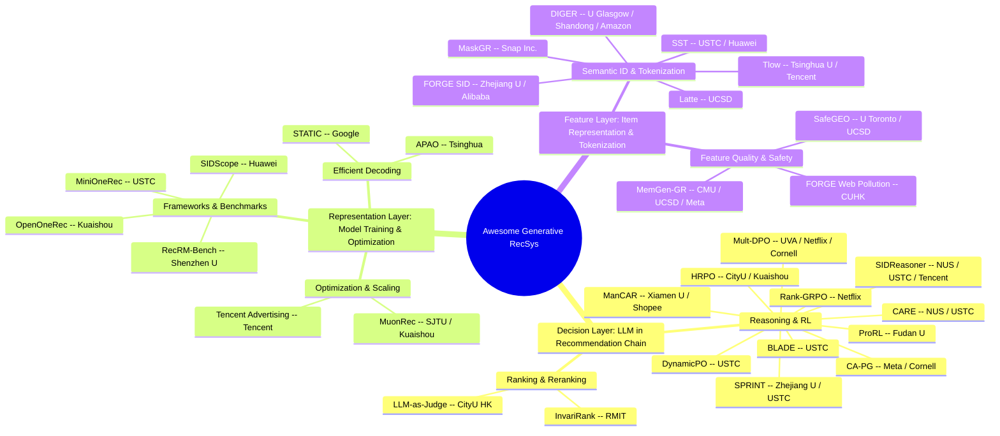

# Awesome Generative Recommendation System (RecSys)

```
 ██████╗                ██████╗                ███████╗                
██╔════╝  ███╗  ███╗    ██╔══██╗ ███╗   ███╗   ██╔════╝██╗ ██╗ ██████╗ 
██║      ██╔═██╗████╗   ██████╔╝██╔═██╗██╔═██╗ ███████╗╚██╗██║ ██╔═══╝ 
██║  ███╗██████║██╔██╗  ██╔══██╗██████║██║ ╚═╝ ╚════██║ ╚███╔╝ ██████╗ 
██║   ██║██║    ██║╚██╗ ██║  ██║██║    ██║ ██╗      ██║  ██╔╝      ██║
╚██████╔╝╚████╗ ██║ ╚██╗██║  ██║╚████╗ ╚███╔═╝ ███████║  ██║   ██████║
 ╚═════╝  ╚═══╝ ╚═╝  ╚═╝╚═╝  ╚═╝ ╚═══╝  ╚══╝   ╚══════╝  ╚═╝   ╚═════╝
```
---

[](https://github.com/sindresorhus/awesome)

RecSys is starting to adopt LLM for feature extraction, retrieval, and ranking/re-ranking! Although you can get some hands-on materials in either the [classics](#papers-classic-must-read) or some surveys, but since you're already interested in applying generative AI to industrial tasks, you probably wanna stay on the bleeding edge, right? That's exactly what this repo is for — automatically updated daily by agents with the latest generative RecSys papers fresh off arXiv, making sure that you never miss a beat.

> [!IMPORTANT]
> For those who are not familiar with GenRec, or not even the recommendation system, please checkout the kickstart posts [here](docs/kickstart.md).
> These posts are in Chinese, for English simply do your browser's internal translation or turn to __Ask Gemini__ :shipit:

## Quick Indexing
- [By Date](#by-date)
- [By Opensource](#by-opensource)
- [By Keyword](#by-keyword)
- [By Affiliation](#by-affiliation)


```mermaid
mindmap
  root((Awesome Generative RecSys))
    Decision Layer: LLM in Recommendation Chain
      Reasoning & RL
        Rank-GRPO -- Netflix
        DynamicPO -- USTC
        BLADE -- USTC
        SPRINT -- Zhejiang U / USTC
        CARE -- NUS / USTC
        HRPO -- CityU / Kuaishou
        Mult-DPO -- UVA / Netflix / Cornell
        CA-PG -- Meta / Cornell
        ProRL -- Fudan U
        ManCAR -- Xiamen U / Shopee
        SIDReasoner -- NUS / USTC / Tencent
      Ranking & Reranking
        InvariRank -- RMIT
        LLM-as-Judge -- CityU HK
    Representation Layer: Model Training & Optimization
      Frameworks & Benchmarks
        MiniOneRec -- USTC
        OpenOneRec -- Kuaishou
        RecRM-Bench -- Shenzhen U
        SIDScope -- Huawei
      Efficient Decoding
        STATIC -- Google
        APAO -- Tsinghua
      Optimization & Scaling
        MuonRec -- SJTU / Kuaishou
        Tencent Advertising -- Tencent
    Feature Layer: Item Representation & Tokenization
      Semantic ID & Tokenization
        Latte -- UCSD
        FORGE SID -- Zhejiang U / Alibaba
        DIGER -- U Glasgow / Shandong / Amazon
        MaskGR -- Snap Inc.
        SST -- USTC / Huawei
        Tlow -- Tsinghua U / Tencent
      Feature Quality & Safety
        SafeGEO -- U Toronto / UCSD
        MemGen-GR -- CMU / UCSD / Meta
        FORGE Web Pollution -- CUHK
```
<div align="center">
  <i> Open-source Generative RecSys Map </i>
</div>

---
## By Date

### Papers August 27

*Thursday, August 27, 2026. Arxiv Wednesday (Aug 26) batch — cs.IR / cs.LG. 7 papers found (0 opensource). Core generative-rec: AMBER (Meta event tokenization for LLM rec), SWIM (generative re-ranking list evaluator), TransRetrieval (Alibaba/Renmin retrieval scaling); broader: D3ER (multimodal rec), HSR (Hamiltonian sequential rec), MOTIF (cold-start multimodal), DCEO (e-commerce search causal optimization).*

1. **An Event is Worth One Token: Event Tokenization for Industrial-scale LLM Recommendation (AMBER)**
   * Affiliation: Meta AI
   * Link: [arxiv.org/abs/2608.25546](https://arxiv.org/abs/2608.25546)
   * Venue: arXiv preprint, August 2026 (cs.IR)
   * TL;DR: Introduces "event tokenization" — a new LLM input modality that compresses each interaction's full temporal snapshot (user/item/context/outcome) into a single bottlenecked Event Token, scaling a new dimension "snapshot resolution" to push the compute-quality Pareto frontier of industrial LLM recommendation.
   * Key techniques:
     - Event-centric paradigm: each sequence position encodes a full interaction snapshot, not just text/SID/categorical features
     - New scaling dimension "snapshot resolution" (information encoded per event)
     - AMBER (Autoregressive Modeling via Bottlenecked Event Representation): learned end-to-end, Event Tokens pre-computed & cached for serving
     - Positive transfer: a single unified tokenizer beats dedicated per-entity tokenizers; Event Tokens transfer to non-LLM rankers as serving-time features
   * Scores (Opensource? / Novelty / Fairness / Robustness / Impact):
     - **Opensource?: 0/10** — No public code available
     - **Novelty: 8/10** — New "snapshot resolution" scaling dimension + Event Token input modality reframes how LLM recs encode each interaction
     - **Fairness: 1/10** — No fairness consideration
     - **Robustness: 7/10** — Industrial ranking + retrieval benchmarks; cross-architecture transfer evidence
     - **Impact: 8/10** — Meta; reorients LLM-rec scaling around event-level information density

2. **SWIM: Step-Wise Integrated Measure for Session-supervised List Evaluation in Generative Re-ranking**
   * Affiliation: University of Science and Technology of China (USTC) / Kuaishou Technology
   * Link: [arxiv.org/abs/2608.25104](https://arxiv.org/abs/2608.25104)
   * Venue: CIKM 2026 (ACM DOI 10.1145/3799682.3840732)
   * TL;DR: A list-level evaluator for the Generator-Evaluator re-ranking framework that models user behavior as a finite-horizon session-level survival process, capturing contextual dependency, user continuation, and diminishing returns that point-wise list scoring ignores.
   * Key techniques:
     - Prefix session-level survival process for the list's contribution to the session objective
     - Factorization into a recursive survival distribution + reached-position conditional rewards
     - Causally-masked Transformer for parallel continuation/utility estimation under strict latency
   * Scores (Opensource? / Novelty / Fairness / Robustness / Impact):
     - **Opensource?: 0/10** — Code link (github.com/yuanhao53/SWIM) currently 404 / not yet public
     - **Novelty: 7/10** — Session-level survival framing for list evaluation is a fresh angle vs point-wise aggregation
     - **Fairness: 1/10** — No fairness consideration
     - **Robustness: 6/10** — Extensive listwise-reranking experiments with significant engagement gains
     - **Impact: 7/10** — CIKM 2026; USTC/Kuaishou; targets the industrial generative re-ranking stage

3. **TransRetrieval: Scaling Up Transformer-Based Retrieval for Industrial Recommendation**
   * Affiliation: Renmin University of China / Alibaba (Taobao & Tmall Group)
   * Link: [arxiv.org/abs/2608.25528](https://arxiv.org/abs/2608.25528)
   * Venue: CIKM 2026
   * TL;DR: Transformer-based retrieval that scales with compute and cross-domain data by fixing token-norm divergence (weighted average aggregation), cutting per-candidate FLOPs by 85% (target token compression), and unifying domains with position-style domain embeddings.
   * Key techniques:
     - Weighted average aggregation restores the homogeneous-token assumption Transformers rely on
     - Target token compression cuts per-candidate FLOPs by 85% while preserving cross-attention expressiveness
     - Position-style domain embeddings turn cross-domain data into a scaling asset
     - Log-linear scaling (+19.3/+22.2 pt Recall@2000); online +2.53% revenue at same latency
   * Scores (Opensource? / Novelty / Fairness / Robustness / Impact):
     - **Opensource?: 0/10** — No public code available
     - **Novelty: 6/10** — Solid engineering fixes (norm-homogeneity, token compression) but incremental over retrieval scaling work
     - **Fairness: 1/10** — No fairness consideration
     - **Robustness: 7/10** — 40B-interaction industrial dataset + KuaiRand + online A/B
     - **Impact: 7/10** — CIKM 2026; Alibaba, deployed

4. **D3ER: Supporting Multi-Modal Recommendation via Disentangle and Distillation-based Dynamic Ensemble**
   * Affiliation: Institute of Software, Chinese Academy of Sciences (ISCAS) / UCAS
   * Link: [arxiv.org/abs/2608.25737](https://arxiv.org/abs/2608.25737)
   * Venue: ACMMM 2026
   * TL;DR: Introduces gradient boosting into multimodal recommendation to alternately optimize modal-homogeneity (HOI) and modal-heterogeneity (HEI) discriminative information, with knowledge distillation and global-correction regularization to curb storage cost and local optima.
   * Key techniques:
     - First gradient-boosting formulation for multimodal recommendation (alternate HOI/HEI learning)
     - Knowledge distillation + global correction regularization to mitigate gradient-boosting cost/local-optima
   * Scores (Opensource? / Novelty / Fairness / Robustness / Impact):
     - **Opensource?: 0/10** — No public code available
     - **Novelty: 6/10** — Gradient boosting for MR is a fresh angle, though the HOI/HEI disentanglement idea is familiar
     - **Fairness: 1/10** — No fairness consideration
     - **Robustness: 5/10** — Prevalent real-world datasets only
     - **Impact: 5/10** — ACMMM 2026; multimodal rec is a niche but active area

5. **Hamiltonian Spectral-Temporal Dissipative Dynamics for Sequential Recommendation (HSR)**
   * Affiliation: Hong Kong University of Science and Technology (HKUST)
   * Link: [arxiv.org/abs/2608.25755](https://arxiv.org/abs/2608.25755)
   * Venue: arXiv preprint, August 2026 (cs.IR; related ACM DOI 10.1145/3773078.3831793)
   * TL;DR: Recasts preference evolution as a second-order dissipative Hamiltonian system in latent phase space (position = stable preference, momentum = short-term tendency), yielding a closed-form frequency-domain solution that captures inertia, periodicity, and abrupt shifts beyond first-order models.
   * Key techniques:
     - Dissipative Hamiltonian system over latent phase space (position + momentum)
     - Linear time-invariant structure → closed-form frequency-domain solution
     - Learnable dissipation for interest decay; local impulse refinement for sparse-log shocks
   * Scores (Opensource? / Novelty / Fairness / Robustness / Impact):
     - **Opensource?: 0/10** — No public code available
     - **Novelty: 7/10** — Second-order Hamiltonian dynamics is a genuinely fresh formulation for sequential rec
     - **Fairness: 1/10** — No fairness consideration
     - **Robustness: 6/10** — 3 benchmarks, beats Transformer- and SSM-based recommenders
     - **Impact: 5/10** — HKUST; sequential rec, novel but niche

6. **MOTIF: Motivation-guided Topology Inference for Cold-start Multimodal Recommendation**
   * Affiliation: Taiyuan University of Technology / Northeastern University (China)
   * Link: [arxiv.org/abs/2608.25381](https://arxiv.org/abs/2608.25381)
   * Venue: WISE 2026
   * TL;DR: Uses offline LLM motivation reasoning to reconstruct transferable item-item topology for cold-start multimodal recommendation, without injecting generated text into prediction.
   * Key techniques:
     - Semantic Motivation Reasoning (offline LLM) to infer intent semantics
     - Knowledge-enhanced Graph Reconstruction + Weighted Graph Contrastive Learning
     - Semantic-Structural Alignment; up to +6.07% relative over the strongest recent baseline
   * Scores (Opensource? / Novelty / Fairness / Robustness / Impact):
     - **Opensource?: 0/10** — No public code available
     - **Novelty: 6/10** — LLM motivation semantics for topology inference is a reasonable, incremental idea
     - **Fairness: 1/10** — No fairness consideration
     - **Robustness: 5/10** — 3 multimodal benchmarks
     - **Impact: 5/10** — WISE 2026; cold-start multimodal rec

7. **DCEO: Direct Causal Effect Optimization for Long-Term User Value Modeling in E-commerce Search**
   * Affiliation: Alibaba (Taobao & Tmall Group)
   * Link: [arxiv.org/abs/2608.25635](https://arxiv.org/abs/2608.25635)
   * Venue: arXiv preprint, August 2026 (cs.LG, cross-list cs.IR)
   * TL;DR: An actor-critic framework that directly optimizes the relative causal effect between item-level proxy scores and the user-level long-term objective (n-day GMV/purchases), replacing hand-crafted multi-objective fusion weights.
   * Key techniques:
     - Relative causal effect as the alignment metric between proxy and ultimate objective
     - Actor generates context-dependent fusion weights; critic estimates the ultimate objective
     - Deployed; +0.36% GMV in a 41-day online A/B test
   * Scores (Opensource? / Novelty / Fairness / Robustness / Impact):
     - **Opensource?: 0/10** — No public code available
     - **Novelty: 6/10** — Direct causal-effect optimization of fusion weights is clean, but actor-critic ranking optimization is established
     - **Fairness: 1/10** — No fairness consideration
     - **Robustness: 7/10** — Offline + 41-day online A/B
     - **Impact: 7/10** — Alibaba; deployed in industrial e-commerce search

### Papers August 26

*Wednesday, August 26, 2026. Arxiv Tuesday (Aug 25) batch — cs.IR / cs.LG. 7 papers found (1 opensource). Core generative-rec: PRQ-KMeans (SID tokenization), Tlow (flow tokenizer, opensource), TAGR (live-stream genrec), UniSpecRec (LLM CF); broader: RecGPT-Mobile-V2 (on-device LLM), Native Multimodal CTR, Auditing Return Conditioning (Decision-Transformer diagnostic).*

1. **PRQ-KMeans: Projection Residual Quantization for Semantic ID Tokenization**
   * Affiliation: Kuaishou Technology
   * Link: [arxiv.org/abs/2608.24207](https://arxiv.org/abs/2608.24207)
   * Venue: arXiv preprint, August 2026 (cs.LG)
   * TL;DR: Reframes residual-quantization SID construction as "progressive commonality removal" and proposes PRQ-KMeans — global-mean removal, Top-k similarity-weighted centroid refinement, and projection residuals — to improve post-hoc semantic-ID tokenization for generative retrieval/recommendation.
   * Key techniques:
     - Global-mean removal frees first-level codebook capacity from a corpus-wide shared component
     - Top-k similarity-weighted centroid updates soften hard assignment to nearby codewords
     - Projection residual (instead of full-codeword subtraction) removes only the selected-centroid component
     - Up to +7.4% HitRate / +11.8% MRR on an industrial search dataset; 4 public recommendation benchmarks
   * Scores (Opensource? / Novelty / Fairness / Robustness / Impact):
     - **Opensource?: 0/10** — No public code available
     - **Novelty: 6/10** — "Progressive commonality removal" lens + projection residual is a thoughtful refinement, but incremental over RQ-KMeans/RQ-GMM
     - **Fairness: 2/10** — No fairness consideration
     - **Robustness: 6/10** — Industrial search + 4 public benchmarks with consistent gains
     - **Impact: 6/10** — Kuaishou; SID tokenization is a central GenRec topic

2. **Tlow: Flow-based Item Tokenizer for Recommendation**
   * Affiliation: Tsinghua University / Tencent
   * Link: [arxiv.org/abs/2608.24176](https://arxiv.org/abs/2608.24176)
   * Venue: CIKM 2026 (Applied Research)
   * TL;DR: Normalizing-flow item tokenizer that transforms semantic embeddings into a standard-normal latent space (dimensional independence + distributional simplicity) before independent tokenization, with codebook guidance aligning codebook and token-embedding spaces; deployed on WeChat multimodal retrieval.
   * Key techniques:
     - Flow-based transformation of raw semantic embeddings to a unified standard-normal latent space
     - Independent tokenization on latent embeddings yields semantically clear token IDs
     - Codebook guidance aligning codebook space with token embedding space for more distinct token embeddings
     - Offline: 4 public datasets + cross-domain + multimodal; online WeChat: +10.32% global CTR (+11.64% new items)
   * Scores (Opensource? / Novelty / Fairness / Robustness / Impact):
     - **Opensource?: 6/10** — [github.com/wjjln/Tlow](https://github.com/wjjln/Tlow): runnable (main.py/train.py, gin configs, run scripts, pre-trained Sports tokenizer cache) with a 3-step README; single init commit, no license/tests
     - **Novelty: 7/10** — Flow-based distribution normalization for tokenization is a fresh angle vs RQ-VAE/OPQ; codebook guidance is a nice addition
     - **Fairness: 2/10** — No fairness consideration
     - **Robustness: 7/10** — 4 public datasets + cross-domain/multimodal + online WeChat A/B
     - **Impact: 7/10** — CIKM 2026 Applied Research; Tsinghua/Tencent; deployed on WeChat

3. **TAGR: Temporally Adaptive Generative Recommendation for Industrial Live-Streaming Advertising**
   * Affiliation: Kuaishou Technology / Tsinghua University
   * Link: [arxiv.org/abs/2608.24034](https://arxiv.org/abs/2608.24034)
   * Venue: arXiv preprint, August 2026 (cs.IR)
   * TL;DR: Three-level temporal adaptation for generative recommendation in live-stream ads — periodically-refreshing Live Semantic-Collaborative IDs (LSID), multi-granularity intent modeling, and Intermittent On-Policy Preference Optimization — deployed at Kuaishou with +8.5%/+7.4% click lifts and +16.1% revenue.
   * Key techniques:
     - LSID: periodically refreshes each live ad's SID from current scene + promoted products while keeping a stable token vocabulary
     - Intent-Aware Generation (IAG): multi-granularity live-room entry history as the primary intent sequence + business-value-weighted next-token prediction
     - Intermittent On-Policy Preference Optimization (IOPO): interleaves fresh on-policy preference updates with supervised NTP maintenance
     - Deployed on a large-scale e-commerce live-stream advertising platform
   * Scores (Opensource? / Novelty / Fairness / Robustness / Impact):
     - **Opensource?: 0/10** — No public code available
     - **Novelty: 7/10** — Temporal adaptation at token/intent/alignment levels for the harder live-stream setting
     - **Fairness: 2/10** — No fairness consideration
     - **Robustness: 7/10** — Large-scale production deployment with strong online lifts
     - **Impact: 8/10** — Kuaishou live-stream ads; 16.1% revenue lift is significant industrial value

4. **Rethinking Semantic Alignment in LLM-Enhanced Collaborative Filtering: A Spectral Decoupling Approach (UniSpecRec)**
   * Affiliation: NAIST / Kyushu University
   * Link: [arxiv.org/abs/2608.24363](https://arxiv.org/abs/2608.24363)
   * Venue: WSDM 2027
   * TL;DR: Spectral analysis shows collaborative and semantic signals favor different spectral parts, and alignment over-concentrates representations into dominant collaborative/principal semantic subspaces; UniSpecRec applies signal-specific spectral filtering and fuses predictions without cross-space alignment or extra parameters.
   * Key techniques:
     - Component-wise evaluation + training-dynamics analysis revealing alignment suppresses non-principal semantic components
     - Signal-specific spectral filtering preserving collaborative and semantic representations in their own spaces
     - Prediction-level decoupling (no cross-space alignment, no added trainable parameters)
     - Validated across multiple datasets, LLM encoders, and collaborative backbones
   * Scores (Opensource? / Novelty / Fairness / Robustness / Impact):
     - **Opensource?: 0/10** — No public code available
     - **Novelty: 7/10** — Spectral view + parameter-free prediction-level decoupling is a principled re-think of alignment
     - **Fairness: 2/10** — No fairness consideration
     - **Robustness: 6/10** — Multiple datasets/encoders/backbones
     - **Impact: 6/10** — WSDM 2027; LLM+CF integration is a core topic

5. **RecGPT-Mobile-V2 Technical Report**
   * Affiliation: Alibaba Group (Taobao)
   * Link: [arxiv.org/abs/2608.24295](https://arxiv.org/abs/2608.24295)
   * Venue: arXiv technical report, August 2026 (cs.IR)
   * TL;DR: On-device LLM for personalized query prediction in the Taobao feed — a staged design coupling intent quality and execution efficiency, evidence-preserving trajectory, adaptive reasoning-cost optimization after grounded rollouts, distilled into a compact low-bit student with budget-aware device-cloud routing.
   * Key techniques:
     - Evidence-preserving trajectory from heterogeneous interactions; recommendation-native domain adaptation + supervised alignment
     - Reasoning-cost optimization gated on grouped rollouts meeting grounding/utility criteria
     - Teacher→student distillation with low-bit execution, structured compression, budget-aware device-cloud routing
     - Controlled RL: query quality 73.2%→78.6%, hard-failure 3.6%→1.6%, median CoT 62→14 tokens
   * Scores (Opensource? / Novelty / Fairness / Robustness / Impact):
     - **Opensource?: 0/10** — No public code available
     - **Novelty: 6/10** — Coupled intent-quality/efficiency objective with adaptive reasoning-cost is practical
     - **Fairness: 2/10** — No fairness consideration
     - **Robustness: 6/10** — Controlled RL + online retrieval analyses
     - **Impact: 7/10** — Alibaba Taobao on-device deployment; RecGPT lineage

6. **Native Multimodal Representation Learning for Click-Through Rate Prediction in E-Commerce Scenarios**
   * Affiliation: Alibaba (Taobao & Tmall Group) / University of Science and Technology of China
   * Link: [arxiv.org/abs/2608.24091](https://arxiv.org/abs/2608.24091)
   * Venue: CIKM 2026
   * TL;DR: Shows end-to-end training of multimodal encoder + CTR model fails due to ambiguous supervision from non-multimodal behavior factors; proposes Mine-Then-Train, mining high-quality multimodally-interpretable samples from CTR data to fine-tune the encoder toward click preferences.
   * Key techniques:
     - Analysis: raw CTR behaviors are driven by both multimodal semantics and non-multimodal factors → inconsistent encoder updates
     - Mine-Then-Train: mine multimodally-interpretable training samples, then fine-tune the encoder for click-preference alignment
     - Offline + online experiments demonstrating effectiveness
   * Scores (Opensource? / Novelty / Fairness / Robustness / Impact):
     - **Opensource?: 0/10** — No public code available
     - **Novelty: 6/10** — Diagnoses why E2E multimodal CTR fails; sample-mining fix is pragmatic
     - **Fairness: 2/10** — No fairness consideration
     - **Robustness: 6/10** — Offline + online experiments
     - **Impact: 6/10** — CIKM 2026; Taobao & Tmall industrial CTR

7. **Auditing Return Conditioning as a Control Knob: An Offline Diagnostic for Decision Transformer Recommendation**
   * Affiliation: Independent Researcher
   * Link: [arxiv.org/abs/2608.24815](https://arxiv.org/abs/2608.24815)
   * Venue: CONSEQUENCES '26 workshop (co-located with ACM RecSys 2026)
   * TL;DR: Audits whether reward (RTG) conditioning actually controls a Decision Transformer recommender via an RTG-locality ladder, no-RTG baseline, reward check, and shuffled-RTG ablation; finds context-wide RTG rewriting strongly shifts MovieLens Crime-share but a null result on MAL — so reward control is not established.
   * Key techniques:
     - RTG locality ladder: full-context vs current-slot RTG rewriting
     - Four-check protocol: intervention locality, no-RTG baseline, logged-match/score reward check, within-trajectory shuffled-RTG ablation
     - Cross-diagnostic pattern across locality + shuffled RTG + null MAL result → no established reward control
   * Scores (Opensource? / Novelty / Fairness / Robustness / Impact):
     - **Opensource?: 0/10** — No public code available
     - **Novelty: 6/10** — Offline audit protocol for reward conditioning is a useful methodological addition
     - **Fairness: 5/10** — Audit methodology relevant to controllability/reliability, not direct bias/fairness
     - **Robustness: 6/10** — Careful controlled ablations; exploratory findings stated as descriptive
     - **Impact: 4/10** — Workshop paper, single author, exploratory

### Papers August 25

*Tuesday, August 25, 2026. Arxiv Monday (Aug 24) batch — cs.IR / cs.AI / cs.LG. 7 papers found (4 opensource). Core generative-rec: SST (item tokenization), ANR-DiffRec (diffusion), DuELRec (LLM cross-domain), The Disconnect (reasoning-trace analysis); broader recsys: CRRN (CTR), BOAR (multi-behavior), HEGM (watch-time).*

1. **Rethinking Item Tokenization in Generative Recommenders: From Fixed Atoms to Semantic Subwords**
   * Affiliation: University of Science and Technology of China (USTC) / Huawei Technologies
   * Link: [arxiv.org/abs/2608.22734](https://arxiv.org/abs/2608.22734)
   * Venue: CIKM 2026
   * TL;DR: Represents historical items as variable-length "semantic subwords" (instead of fixed-length SID sequences) while keeping fixed-length target decoding, reducing intra-item attention overload and re-directing model capacity toward inter-item behavioral transitions.
   * Key techniques:
     - Item-level Subword Tokenization (IST): merges stable adjacent atom tokens into compact semantic subword tokens
     - Behavior-induced Co-occurrence Augmentation (BCA): injects coarse-grained semantic prefix-transition signals into training
     - Validated on 3 public datasets × 3 generative recommender backbones
   * Scores (Opensource? / Novelty / Fairness / Robustness / Impact):
     - **Opensource?: 7/10** — [github.com/mxrcandy/Semantic-Subword-Tokenization](https://github.com/mxrcandy/Semantic-Subword-Tokenization): well-documented README with full IST+BCA workflow, runnable Beauty/TIGER example data, requirements.txt + configs; single example dataset and no explicit license
     - **Novelty: 7/10** — History-side variable-length subword tokenization is a fresh angle on SID tokenization
     - **Fairness: 3/10** — No fairness consideration
     - **Robustness: 7/10** — Consistent gains across 3 datasets and 3 backbones
     - **Impact: 7/10** — CIKM 2026; USTC/Huawei; tokenization is a central GenRec topic

2. **Adaptive Item-based Collaborative Structures via Noise Rescheduling in Diffusion for Generative Recommendation**
   * Affiliation: Tongji University / Huawei Technologies / Fudan University
   * Link: [arxiv.org/abs/2608.23400](https://arxiv.org/abs/2608.23400)
   * Venue: arXiv preprint, August 2026 (cs.IR / cs.AI)
   * TL;DR: Encodes item-based collaborative structure into discrete-diffusion generative recommendation via a collaborative-prior SID generation and an item-adaptive noise-rescheduling mechanism that treats tokens non-uniformly during denoising.
   * Key techniques:
     - Item co-occurrence matrix guides semantic ID generation (structured collaborative prior)
     - Item-based adaptive noise rescheduling: denoising weights adjusted by local contextual recoverability + behavior-aware item dependencies
     - Amazon Reviews 2023 (3 categories), outperforms SOTA generative recommenders
   * Scores (Opensource? / Novelty / Fairness / Robustness / Impact):
     - **Opensource?: 5/10** — [github.com/CalmaQi/ANR-DiffRec](https://github.com/CalmaQi/ANR-DiffRec): code present (LLaDA/genrec, run_pipeline.py, dataset links) but sparse (4 commits), minimal README, no license
     - **Novelty: 6/10** — Explicit collaborative structure + adaptive noise schedule in discrete diffusion for GenRec
     - **Fairness: 2/10** — No fairness consideration
     - **Robustness: 6/10** — Multiple benchmarks, consistent SOTA improvements
     - **Impact: 6/10** — Diffusion GenRec is trending; Tongji/Huawei/Fudan

3. **A Dual-Expert Strategy Integrating LLMs to Mitigate Negative Transfer in Cross-Domain Sequential Recommendation**
   * Affiliation: KAIST
   * Link: [arxiv.org/abs/2608.23131](https://arxiv.org/abs/2608.23131)
   * Venue: CIKM 2026
   * TL;DR: LLM-based cross-domain sequential recommendation (DuELRec) with a domain-gated dual-expert design and dual-sampling token-to-item contrastive learning to curb negative transfer across domains.
   * Key techniques:
     - Item-aware attention transformation: aggregates subword tokens into item-level representations with block-level attention masking
     - Single-domain expert (within-domain attention) + cross-domain expert (all-domain) adaptively fused by a gate
     - Dual-sampling token-to-item contrastive objective (single- + cross-domain item pools)
     - 2 real-world datasets, 10 domains, outperforms 26 SOTA methods
   * Scores (Opensource? / Novelty / Fairness / Robustness / Impact):
     - **Opensource?: 0/10** — No public code available
     - **Novelty: 6/10** — Domain-gated dual-expert to mitigate negative transfer in LLMRec CDSR
     - **Fairness: 2/10** — No fairness consideration
     - **Robustness: 6/10** — Extensive baselines across 10 domains
     - **Impact: 6/10** — CIKM 2026; KAIST

4. **The Disconnect Between Better Descriptive Reasoning Trace Quality and Recommendation Effectiveness**
   * Affiliation: Spotify
   * Link: [arxiv.org/abs/2608.23154](https://arxiv.org/abs/2608.23154)
   * Venue: RecSys '26 Workshop on Agentic and Generative AI for E-Commerce
   * TL;DR: First controlled 2×2 factorial study showing that better descriptive reasoning traces (natural-language titles + extensive SID alignment) do NOT translate into better offline recommendation accuracy under standard SFT and RL.
   * Key techniques:
     - 2×2 factorial over item representation (Title vs SID) and SID alignment (minimal vs extensive)
     - Shared Qwen3-1.7B backbone; SFT vs RL training objectives compared
     - 3 Amazon product domains
   * Scores (Opensource? / Novelty / Fairness / Robustness / Impact):
     - **Opensource?: 0/10** — No public code available
     - **Novelty: 7/10** — First controlled comparison of reasoning-trace quality vs. recommendation effectiveness
     - **Fairness: 3/10** — Touches interpretability, limited fairness scope
     - **Robustness: 7/10** — Controlled factorial design with a shared backbone
     - **Impact: 7/10** — Spotify; challenges the "chain-of-thought helps GenRec" assumption

5. **Cascading Relevance-driven Recommendation Network for CTR Prediction in Trigger-Introduced Recommendation**
   * Affiliation: Alibaba (Taobao & Tmall Group)
   * Link: [arxiv.org/abs/2608.22973](https://arxiv.org/abs/2608.22973)
   * Venue: arXiv preprint, August 2026 (cs.IR)
   * TL;DR: CTR prediction for "trigger-introduced recommendation" (TIR) that explicitly models trigger–target relevance with cascading interest fusion and a category-assisted pairwise loss.
   * Key techniques:
     - Trigger-Target Interaction layer (personalized gating on trigger/target features)
     - Cascading Interest Fusion: cascading attention blocks estimate trigger intention and fuse instant + personalized interest
     - Category-assisted Pairwise Loss enforcing trigger relevance
     - Industrial + public datasets; online A/B validated
   * Scores (Opensource? / Novelty / Fairness / Robustness / Impact):
     - **Opensource?: 4/10** — [github.com/a-little-cabbage/CRRN](https://github.com/a-little-cabbage/CRRN): only 3 files (README, crrn.py, module.py), no license/requirements/training/eval pipeline
     - **Novelty: 6/10** — New TIR scenario with explicit trigger-relevance modeling
     - **Fairness: 2/10** — No fairness consideration
     - **Robustness: 6/10** — Industrial + public + online A/B
     - **Impact: 7/10** — Alibaba (Taobao & Tmall), deployed

6. **Beyond Observed Auxiliary Relations: Environment-Conditioned Modeling for Multi-Behavior Recommendation**
   * Affiliation: Korea University
   * Link: [arxiv.org/abs/2608.22920](https://arxiv.org/abs/2608.22920)
   * Venue: CIKM 2026
   * TL;DR: Environment-conditioned multi-behavior recommendation (BOAR) that handles missing and unreliable auxiliary signals via two complementary modules conditioned on auxiliary observability.
   * Key techniques:
     - Two complementary modules conditioned on auxiliary observability (fill missing relations / suppress unreliable ones)
     - Up to +7.82% HR@10 overall; up to +44.2% for items without auxiliary observations
   * Scores (Opensource? / Novelty / Fairness / Robustness / Impact):
     - **Opensource?: 0/10** — Linked repo (github.com/LSH0411/BOAR) returns 404 — not publicly accessible
     - **Novelty: 5/10** — Observability-conditioned handling of missing/unreliable auxiliary signals
     - **Fairness: 2/10** — No fairness consideration
     - **Robustness: 6/10** — Strong gains on items lacking auxiliary observations
     - **Impact: 6/10** — CIKM 2026; Korea University

7. **Hierarchical Exponential-Gaussian Mixtures for Watch-Time Distribution Prediction**
   * Affiliation: VK (AI VK) / Lomonosov Moscow State University
   * Link: [arxiv.org/abs/2608.23356](https://arxiv.org/abs/2608.23356)
   * Venue: ICDM 2026
   * TL;DR: Distributional watch-time prediction for short-video recommendation that fixes EGMN's variance collapse / component redundancy via a hierarchical skip-watch decomposition and KL-based variance regularization.
   * Key techniques:
     - Hierarchical skip-watch decomposition: exponential component for quick skips + Gaussian mixture for engaged watching, separated by a learned skip gate
     - KL-based variance regularization + structured initialization; removes forced Gaussian shift + entropy regularizer
     - KuaiRec + VK-LSVD; 1.5-month production A/B with significant engagement lifts
   * Scores (Opensource? / Novelty / Fairness / Robustness / Impact):
     - **Opensource?: 8/10** — [github.com/rw404/HEGM](https://github.com/rw404/HEGM): Apache 2.0, full code + configs + preprocessing scripts + released checkpoints + deterministic reproducible eval
     - **Novelty: 6/10** — Hierarchical skip-watch mixture addressing EGMN failure modes
     - **Fairness: 2/10** — No fairness consideration
     - **Robustness: 8/10** — Fixes variance collapse/component redundancy; 1.5-month production A/B
     - **Impact: 6/10** — ICDM 2026; VK industrial short-video

### Papers August 24

*Monday, August 24, 2026. Arxiv weekend pause continues — no announcement since Thursday Aug 20, and the Monday batch was not yet posted at capture time, so zero new papers in the past 24h. Fallback per protocol: re-scanned the most recent batch (Fri Aug 21 cs.IR) and surfaced 5 recommendation papers that were missed by the original Aug 21 entry. Total: 5 papers.*

1. **Recommendation Quality and the Concentration of Consumption: Experimental Evidence from Netflix**
   * Affiliation: Netflix (with Northwestern University / Cornell University academic co-authors)
   * Link: [arxiv.org/abs/2608.21274](https://arxiv.org/abs/2608.21274)
   * Venue: arXiv preprint, August 2026 (econ.GN / cs.IR)
   * TL;DR: A field experiment on 8.5M Netflix users showing that recommendation-quality improvements raise total consumption and diffuse it from "superstar" head items toward the "middle-tail" (with minimal long-tail effect), challenging the claim that recommenders polarize consumption.
   * Key techniques:
     - Large-scale online experiment (8.5M users) on Netflix's production recommender
     - Causal measurement of how recommendation quality shifts the consumption distribution across head / middle-tail / long-tail
     - Finds returns to investing in middle-tail products grow as algorithms improve and platforms scale
     - Economic framing linking recommender quality to market concentration
   * Scores (Opensource? / Novelty / Fairness / Robustness / Impact):
     - **Opensource?: 0/10** — No public code (Netflix proprietary experiment data)
     - **Novelty: 5/10** — Empirical/causal study rather than a new method
     - **Fairness: 7/10** — Directly measures consumption concentration / head-tail exposure, a fairness-relevant question
     - **Robustness: 8/10** — 8.5M-user randomized experiment with strong causal identification
     - **Impact: 8/10** — Netflix; challenges the "recommenders polarize consumption" narrative (econ.GN + cs.IR)

2. **One Hierarchy, Two Systems: Semantic Product IDs for Discovery-Surface Ranking and Search-Page Query Reformulation**
   * Affiliation: DoorDash
   * Link: [arxiv.org/abs/2608.20640](https://arxiv.org/abs/2608.20640)
   * Venue: arXiv preprint, August 2026 (cs.IR / cs.AI)
   * TL;DR: A single hierarchical Semantic ID learned from product-content embeddings serves both personalized ranking (aggregating affinity/performance over SID prefixes) and query reformulation (grounding queries in SID concepts), with online gains in add-to-cart and reduced search effort.
   * Key techniques:
     - One shared semantic hierarchy learned from product-content embeddings, reused across ranking + query reformulation
     - Ranking: aggregate consumer affinity + product performance over SID prefixes; sequence features for candidates and histories
     - Query reformulation: ground queries/session transitions in SID concepts; navigation/refinement; assortment-filtered suggestions
     - Online: stronger top-slot add-to-cart, broader exposure for less-popular products, reduced search effort
   * Scores (Opensource? / Novelty / Fairness / Robustness / Impact):
     - **Opensource?: 0/10** — No public code available
     - **Novelty: 6/10** — Unifying ranking + query reformulation over one semantic hierarchy is a clean design
     - **Fairness: 4/10** — Broader exposure for less-popular products is exposure-fairness adjacent
     - **Robustness: 7/10** — Controlled ablations + online A/B at DoorDash
     - **Impact: 7/10** — DoorDash; shared SID hierarchy spanning recommendation and search

3. **Adapting Knowledge Graphs for Behavior Denoising in Sequential Recommendation (AdaptedKG)**
   * Affiliation: Northeastern University (China)
   * Link: [arxiv.org/abs/2608.21243](https://arxiv.org/abs/2608.21243)
   * Venue: arXiv preprint, August 2026 (cs.IR / cs.AI)
   * TL;DR: Uses knowledge-graph evidence to calibrate which historical interactions are reliable for sequential recommendation — identifying unusually-prominent relational paths, then comparing each interaction with structurally matched reference items to derive retention coefficients that gate history representations and reweight losses, with no KG needed at inference.
   * Key techniques:
     - Calibrated KG evidence per training example without adding graph representations to the recommendation backbone
     - Compares observed context vs. structurally matched alternatives to find unusually-prominent relational paths → local KG view
     - Per-interaction calibration vs. structurally matched reference items → retention coefficients
     - Retention coefficients gate historical representations and reweight target losses; computed offline, inference-free
   * Scores (Opensource? / Novelty / Fairness / Robustness / Impact):
     - **Opensource?: 0/10** — No public code available
     - **Novelty: 5/10** — KG-calibrated denoising without a graph in the backbone is practical but incremental
     - **Fairness: 4/10** — Denoising can curb popularity-driven distortion, not framed as fairness
     - **Robustness: 5/10** — Standard sequential recommender + multiple denoising recommenders; preprint
     - **Impact: 5/10** — Northeastern University; KG + sequential-rec behavior denoising

4. **From a Static Multi-Level Small Semantic Codebook to a Dynamic Single-Level Large Semantic Codebook for Generative Recommendation**
   * Affiliation: Kuaishou
   * Link: [arxiv.org/abs/2608.21012](https://arxiv.org/abs/2608.21012)
   * Venue: arXiv preprint, August 2026 (cs.IR / cs.LG); online A/B on production traffic
   * TL;DR: Replaces multi-level residual semantic codebooks with a single-level large codebook (one semantic token + a separate collaborative disambiguation token) plus an exposure-aware dynamic update, improving Recall@10 by 5.0–8.8% on OneRec-V1/V2 and cutting decode FLOPs ~48%.
   * Key techniques:
     - Single-level large semantic codebook: one semantic token replaces multiple residual codes + separate collaborative disambiguation token to cut collisions
     - Exposure-aware dynamic update: temporal weight decay, EMA center updates, exposure-weighted penalty on SID changes
     - Offline evaluation framework: representation quality, code utilization, cluster load, full-SID collision, temporal stability
     - OneRec-V1/V2 gains; 47.9–48.7% fewer decode FLOPs; +28.6–47% QPS; 5-day online A/B +0.792% consumption
   * Scores (Opensource? / Novelty / Fairness / Robustness / Impact):
     - **Opensource?: 0/10** — No public code (Kuaishou production)
     - **Novelty: 6/10** — Single-level large codebook + exposure-aware dynamic update is a practical SID-codebook innovation
     - **Fairness: 4/10** — Exposure-aware updating / code utilization (indirect)
     - **Robustness: 7/10** — 2 public datasets + KuaiRec + online A/B (2.5% production traffic)
     - **Impact: 7/10** — Kuaishou; OneRec-V1/V2 improvements; industrial SID codebook design

5. **Profiling What Matters: Context-Aware Item Profiles from Large-Scale Metadata for LLM Recommenders (CAIRO)**
   * Affiliation: Korea University
   * Link: [arxiv.org/abs/2608.20801](https://arxiv.org/abs/2608.20801)
   * Venue: CIKM 2026
   * TL;DR: User-context-aware item profiling for LLM reranking — structures raw metadata/reviews into objective features + subjective traits, then a lightweight profiler selects the most relevant info per user-item pair, giving concise context-specific item-side evidence to the LLM ranker with limited serving overhead.
   * Key techniques:
     - Structures raw metadata + reviews into objective features and subjective traits
     - Lightweight profiler selects relevant info per user-item pair with limited serving-time overhead
     - Concise, context-specific profiles as item-side evidence for the LLM's ranking decision
     - Consistent LLM-reranking gains across experiments
   * Scores (Opensource? / Novelty / Fairness / Robustness / Impact):
     - **Opensource?: 0/10** — No public code available
     - **Novelty: 5/10** — Context-aware item profiling is practical; conceptually incremental
     - **Fairness: 3/10** — Not addressing fairness
     - **Robustness: 6/10** — CIKM 2026 accepted; multiple experiments
     - **Impact: 6/10** — CIKM 2026; Korea University; practical item-side feature selection for LLM reranking

### Papers August 23

*Sunday, August 23, 2026. Arxiv weekend pause — no announcement since Thursday Aug 20, so zero new papers in the past 24h. Fallback per protocol: searched the missing dates in the log (Aug 20 / Aug 17 / Aug 15) plus Aug 14 for missed papers. Three genuinely new papers surfaced on Aug 17 (Unbiased RS, SAHC-NS, TREC 2025 track) and three missed Aug 14 papers (MACS, Residual Dominance, PriCoRec); the five most on-topic are listed below (SAHC-NS, a traditional CF negative-sampling paper, was dropped as out of the generative-recommendation scope). Total: 5 papers.*

1. **Residual Dominance as a Structural Account of Last-Item Reliance in Causal Self-Attention Recommenders**
   * Affiliation: Hokkaido University
   * Link: [arxiv.org/abs/2608.14021](https://arxiv.org/abs/2608.14021)
   * Venue: RecSys 2026
   * TL;DR: Shows SASRec-style causal self-attention recommenders over-rely on the most recent item because residual connections dominate the self-attention aggregation — "residual dominance" — and gives a training-free inference-time residual-scaling knob to trade off recency vs. context.
   * Key techniques:
     - Prediction-time diagnostics + norm-based analysis of the full attention block
     - "Residual dominance": residual addition sharply shifts the full-block representation toward same-position contributions
     - Inference-time residual scaling as a controlled intervention inducing a monotonic mixing ↔ last-item-reliance tradeoff
     - Reducing residual strength recovers final-position misses where non-final positions already rank the ground-truth item correctly
   * Scores (Opensource? / Novelty / Fairness / Robustness / Impact):
     - **Opensource?: 6/10** — [github.com/keito0329/Residual](https://github.com/keito0329/Residual) — public Python repo with README + supplement PDF matching the paper; no license, 1 star, single-purpose diagnostic
     - **Novelty: 7/10** — Clean structural account linking last-item reliance to residual dominance is a novel, mechanistic insight
     - **Fairness: 2/10** — Not addressing fairness
     - **Robustness: 7/10** — RecSys 2026 peer-reviewed; multiple models/datasets; controlled diagnostic intervention
     - **Impact: 6/10** — RecSys 2026; practical inference-time fix applicable to any transformer sequential recommender

2. **MACS: A Hybrid Multi-Agent Framework for Reliable Conversational E-Commerce Recommendation**
   * Affiliation: Stanford University / MIT / USC / Amazon
   * Link: [arxiv.org/abs/2608.14068](https://arxiv.org/abs/2608.14068)
   * Venue: Stanford Trust&Safety Conference / Stanford Market AI Conference (preprint)
   * TL;DR: Hybrid multi-agent framework for fixed-catalog conversational e-commerce — LLMs handle language while a deterministic merchant agent enforces retrieval and hard constraints, with a session-persistent preference layer achieving zero constraint drift across turns.
   * Key techniques:
     - Hybrid two-agent split: LLM "shopping agent" (NL understanding, elicitation, response) + deterministic "merchant agent" (retrieval, hard-constraint filtering, brand exclusion, progressive relaxation)
     - Session-persistent preference layer tracking budget overwrites and exclusion reversals across turns
     - Correctness-critical operations kept deterministic rather than LLM-sampled to avoid hallucination
     - 87.1% single-turn pass rate + perfect brand compliance; 72% macro Pass@5 with zero constraint drift (vs 56%/52% GPT/Gemini+Catalog)
   * Scores (Opensource? / Novelty / Fairness / Robustness / Impact):
     - **Opensource?: 0/10** — No public code available
     - **Novelty: 6/10** — Deterministic-constraint + LLM hybrid for reliability is clean but conceptually incremental
     - **Fairness: 4/10** — Brand-exclusion/constraint compliance is a reliability constraint, not demographic fairness
     - **Robustness: 7/10** — Reliability-focused evaluation vs GPT/Gemini baselines; zero constraint drift
     - **Impact: 6/10** — Stanford; agentic-commerce reliability under hard constraints is a rising industrial concern

3. **Unbiased Recommender Systems with Implicit Feedback**
   * Affiliation: University of Illinois at Chicago
   * Link: [arxiv.org/abs/2608.16704](https://arxiv.org/abs/2608.16704)
   * Venue: RecSys 2026 (Doctoral Symposium)
   * TL;DR: Doctoral-consortium work on mitigating position bias in learning-to-rank and popularity bias in CF and GNN social recommenders, so implicit feedback better reflects true user preferences.
   * Key techniques:
     - Control-function / residual-based correction for position bias in learning-to-rank
     - Post-hoc popularity-bias correction in GNN-based collaborative filtering
     - Debiasing message passing to curb popularity amplification in social/graph recommenders
     - Unified treatment across LTR, CF, and social recommendation
   * Scores (Opensource? / Novelty / Fairness / Robustness / Impact):
     - **Opensource?: 0/10** — No public code available
     - **Novelty: 5/10** — Synthesizes established debiasing techniques rather than a fundamentally new mechanism
     - **Fairness: 8/10** — Core focus is position + popularity bias mitigation
     - **Robustness: 5/10** — Doctoral Symposium (single-author proposal); evaluated across public + industrial benchmarks
     - **Impact: 5/10** — RecSys 2026 Doctoral Symposium; University of Illinois Chicago; contributes to fairer recommenders

4. **Overview of the TREC 2025 Product Search and Recommendation Track**
   * Affiliation: University of Illinois Urbana-Champaign / Lowe's / Snowflake / Walmart / Drexel University
   * Link: [arxiv.org/abs/2608.17138](https://arxiv.org/abs/2608.17138)
   * Venue: TREC 2025
   * TL;DR: TREC 2025 product search + recommendation track introduces a novel related-product recommendation task whose annotated dataset distinguishes complementary vs. related products, enabling end-to-end e-commerce retrieval evaluation and conversational product discovery.
   * Key techniques:
     - Two tasks: query expansion and related-product recommendation
     - Annotated dataset distinguishing complementary vs. related product relationships
     - End-to-end retrieval-quality evaluation for e-commerce (no prior high-quality dataset existed)
     - Building block for conversational product discovery experiences
   * Scores (Opensource? / Novelty / Fairness / Robustness / Impact):
     - **Opensource?: 0/10** — Track dataset released via TREC, not a code repository
     - **Novelty: 5/10** — Novel related-product (complementary vs. related) task, but a track overview
     - **Fairness: 3/10** — Not addressing fairness
     - **Robustness: 6/10** — Standardized TREC evaluation across participating systems
     - **Impact: 6/10** — TREC benchmark; fills a gap in e-commerce recommendation evaluation

5. **PriCoRec: A Privacy-Aware Cloud-Device Collaborative Framework for Ad Recommendation under Feature Constraints**
   * Affiliation: University College Dublin / Huawei Ireland Research Centre
   * Link: [arxiv.org/abs/2608.14429](https://arxiv.org/abs/2608.14429)
   * Venue: RecSys 2026
   * TL;DR: Splits ad recommendation into a cloud pre-ranking stage (cloud-accessible features) and an on-device ranking stage (sensitive features), keeping privacy-sensitive features on-device while preserving accuracy via a diversity regularizer and cloud-guided training.
   * Key techniques:
     - Cloud pre-ranking + on-device ranking split for privacy-aware deployment
     - Diversity regularizer in pre-ranking to improve shortlist candidate quality
     - Cloud-guided training to boost the lightweight on-device model without extra inference cost
     - Keeps sensitive features (age, gender) on-device to satisfy privacy regulations
   * Scores (Opensource? / Novelty / Fairness / Robustness / Impact):
     - **Opensource?: 0/10** — No public code available
     - **Novelty: 5/10** — Cloud-device privacy split is practical; individual techniques are incremental
     - **Fairness: 3/10** — Privacy-adjacent, not demographic fairness
     - **Robustness: 6/10** — RecSys 2026 accepted; ad-recommendation experiments
     - **Impact: 6/10** — University College Dublin / Huawei; privacy-preserving deployment is industry-relevant

### Papers August 22

*Saturday, August 22, 2026. Arxiv weekend pause (no new Saturday announcement). Friday Aug 21 listing yielded 2 new papers (RecPFN, Sequential Benchmarks) plus 3 missed papers from Aug 18–20 (Think-to-Personalize, OneModel) plus 1 replacement (Beyond Uniform Token Training, v2 Aug 20). Total: 5 papers.*

1. **RecPFN: Prior-Fitted Networks for In-Context-Based Recommendations**
   * Affiliation: SAP
   * Link: [arxiv.org/abs/2608.19735](https://arxiv.org/abs/2608.19735)
   * Venue: SIGIR 2026
   * TL;DR: Brings prior-fitted networks (in-context learning) to sequential recommendation — pretrained entirely on synthetic clickstreams sampled from a broad structural causal prior, amortizing Bayesian-style inference from a small support set; SOTA zero-shot performance across 8 benchmarks.
   * Key techniques:
     - Prior-Fitted Network (PFN) pretrained on synthetic clickstream environments from a broad structural causal prior
     - Amortized Bayesian-style inference from a small support set of domain sequences; no weight updates at inference
     - Lightweight decoder-only transformer producing next-item predictions in a single forward pass
     - Deployment-efficient and robust to domain shift; competitive with supervised methods in low-compute/low-data regimes
   * Scores (Opensource? / Novelty / Fairness / Robustness / Impact):
     - **Opensource?: 7/10** — [github.com/SAP-samples/tabular-ai-recpfn](https://github.com/SAP-samples/tabular-ai-recpfn) — official SAP samples repo with training + evaluation code
     - **Novelty: 7/10** — First to bring prior-fitted networks / in-context learning to sequential recommendation
     - **Fairness: 3/10** — Not addressing fairness
     - **Robustness: 7/10** — SIGIR 2026 peer-reviewed; 8 public benchmarks; robust to domain shift
     - **Impact: 7/10** — SIGIR 2026; SAP; a practical path to generalizable, data-efficient recommenders

2. **Do Sequential Recommendation Benchmarks Really Require Higher-Order Sequence Modelling?**
   * Affiliation: Spotify
   * Link: [arxiv.org/abs/2608.19833](https://arxiv.org/abs/2608.19833)
   * Venue: RecSys 2026
   * TL;DR: Two simple recency-weighted pairwise probes (SeqRules + PCTM) that learn no higher-order sequence representations match or beat SASRec on most benchmarks, questioning whether widely used sequential-rec benchmarks actually measure higher-order sequence modelling.
   * Key techniques:
     - SeqRules (Sequential Rules) and PCTM (Probabilistic Collaborative Transition Model) — recency-weighted pairwise probes without higher-order sequence representations
     - Reproduction of eSASRec + sampled-softmax SASRec as the reference point
     - At least one probe exceeds the eSASRec reproduction by 15–38% on 3 Amazon datasets and 4.4% on ML-1M
     - Concrete test of whether a benchmark can meaningfully measure higher-order sequence-modelling gains
   * Scores (Opensource? / Novelty / Fairness / Robustness / Impact):
     - **Opensource?: 0/10** — No public code available
     - **Novelty: 7/10** — Provocative benchmarking study with a concrete, reusable test for higher-order gains
     - **Fairness: 3/10** — Not addressing fairness
     - **Robustness: 7/10** — RecSys 2026 peer-reviewed; 8 datasets
     - **Impact: 7/10** — Spotify; challenges a core premise of sequential-rec benchmark design

3. **Think-to-Personalize: Unifying Reasoning and Retrieval for User-Centric Personalized Dense Retrieval**
   * Affiliation: University of Science and Technology of China / Meituan — *(Angqing Jiang, Gaoming Zhang, Defu Lian — USTC; Jianchun Song, Kena Qi, Dayao Chen, Wei Lin — Meituan)*
   * Link: [arxiv.org/abs/2608.18855](https://arxiv.org/abs/2608.18855)
   * Venue: CIKM 2026
   * TL;DR: Unifies explicit user-centric intent reasoning with dense retrieval — the LLM reasons over the user's purchase history to deduce latent needs and generate an intent-enhanced query encoded into a unified dense embedding; two-stage SFT + GRPO RL.
   * Key techniques:
     - Explicit user-centric intent reasoning over historical purchase sequences to disambiguate noisy behavior
     - Intent-enhanced query generation, then encoded into a unified dense embedding for retrieval
     - Two-stage training: SFT (cold-start capability) + GRPO RL (align reasoning with retrieval utility)
     - Online A/B: +0.46% order volume
   * Scores (Opensource? / Novelty / Fairness / Robustness / Impact):
     - **Opensource?: 0/10** — No public code available
     - **Novelty: 6/10** — Reasoning-driven personalized dense retrieval (vs implicit embedding interaction) is a clean, well-motivated angle
     - **Fairness: 3/10** — Not addressing fairness
     - **Robustness: 7/10** — CIKM 2026 peer-reviewed; proprietary + public benchmarks; online A/B
     - **Impact: 6/10** — Meituan/USTC; a new paradigm for reasoning-driven personalized retrieval in e-commerce

4. **OneModel: A Unified Foundation for Platform-Scale Multi-Scenario Ranking**
   * Affiliation: Xiaohongshu
   * Link: [arxiv.org/abs/2608.18606](https://arxiv.org/abs/2608.18606)
   * Venue: arXiv preprint, August 2026 (deployed in production at Xiaohongshu)
   * TL;DR: Unified multi-stream final-ranking foundation mapping heterogeneous behaviors into shared event sequences with an action-oriented backbone + Scenario-aware Information Modulation; deployed across Explore Feed, Feed Advertising, and Merchant Recommendation with consistent A/B gains.
   * Key techniques:
     - Shared event sequences unifying heterogeneous cross-stream user behaviors
     - Long-context user representations with an action-oriented backbone
     - Scenario-aware Information Modulation balancing cross-stream transfer and stream-specific specialization
     - Production serving optimizations (stratified user representation, multi-objective training, feature decomposition, user-feature prefetching, shared user-tower)
   * Scores (Opensource? / Novelty / Fairness / Robustness / Impact):
     - **Opensource?: 0/10** — No public code available
     - **Novelty: 5/10** — Unified multi-scenario ranking foundation is practical; scenario-aware modulation is conceptually incremental
     - **Fairness: 3/10** — Not addressing fairness
     - **Robustness: 7/10** — Production deployment; online A/B gains across 3 streams
     - **Impact: 7/10** — Xiaohongshu; production-proven unified multi-stream ranking foundation

5. **Beyond Uniform Token Training: A Multi-Target Framework for Learning Token-Weighted Objectives in Generative Recommenders**
   * Affiliation: National Taiwan University / Academia Sinica — *(Wei-Ning Chiu, Song-Duo Ma, Pu-Jen Cheng — NTU; Han-Jay Shu — National Tsing Hua University; Chuan-Ju Wang — Academia Sinica)*
   * Link: [arxiv.org/abs/2601.17787](https://arxiv.org/abs/2601.17787)
   * Venue: CIKM 2026
   * TL;DR: Token-weighted training objectives for generative recommenders — prefix-aware Front-Greater Weighting plus frequency weighting for long-tail tokens, integrated via multi-target curriculum learning; improves both popular and long-tail item recommendation.
   * Key techniques:
     - Front-Greater Weighting: prefix-aware scheme emphasizing tokens that most reduce semantic ambiguity among candidate items
     - Frequency weighting: upweights infrequent tokens to counter long-tailed distributions and popularity bias
     - Multi-target optimization with curriculum learning integrating token-weighted objectives with standard likelihood
     - Robust across semantic-ID constructions and backbone scales; helps both head and tail items
   * Scores (Opensource? / Novelty / Fairness / Robustness / Impact):
     - **Opensource?: 6/10** — [github.com/CHIUWEINING/Token-Weighted-Multi-Target-Learning-for-Generative-Recommenders-with-Curriculum-Learning](https://github.com/CHIUWEINING/Token-Weighted-Multi-Target-Learning-for-Generative-Recommenders-with-Curriculum-Learning) — individual research repo with training code
     - **Novelty: 6/10** — Token-weighted objectives aligned with semantic-ID structure is a clean, underexplored training fix
     - **Fairness: 5/10** — Frequency weighting directly mitigates popularity bias toward long-tail items
     - **Robustness: 6/10** — CIKM 2026 peer-reviewed; multiple benchmarks; robust across SID constructions and backbone scales
     - **Impact: 6/10** — NTU/Academia Sinica; token-weighted training applicable to any semantic-ID generative recommender

### Papers August 21

*Friday, August 21, 2026. Arxiv active. cs.IR Aug 20–21 listings returned 6 recommendation papers spanning LLM-based recommendation distillation, training-free LLM rec, semantic-ID diagnostics, memory-augmented reasoning, RL dense retrieval, and diffusion-based user behavior modeling. Total: 6 papers.*

1. **SCoRD: Semantic-Assisted Continual Retriever-Reranker Distillation for LLM-Based Recommendation**
   * Affiliation: Korea University / University of Illinois at Urbana-Champaign / Sungkyunkwan University — *(Seunghyun Baek, Seunghan Lee, SeongKu Kang — Korea University; Gyuseok Lee, Dong Wang — UIUC; Wonbin Kweon — Sungkyunkwan University)*
   * Link: [arxiv.org/abs/2608.19998](https://arxiv.org/abs/2608.19998)
   * Venue: arXiv preprint, August 2026
   * TL;DR: Continual knowledge distillation for LLM-based retriever-reranker pipelines under non-stationary data streams; a semantic reasoning assistant distills the LLM's intent-inference ability into reusable intent-level guidance, enabling cheap retriever-only updates without repeated LLM inference.
   * Key techniques:
     - Semantic reasoning assistant: distills the LLM's ability to infer user intents into reusable intent-level guidance
     - Selective distillation: reranker knowledge transferred to the retriever only on low-confidence sequences
     - Retriever-derived representations and intent-drift signals fed back to the reranker for co-adaptation
     - Avoids the prohibitive cost of repeatedly updating and distilling the LLM reranker
   * Scores (Opensource? / Novelty / Fairness / Robustness / Impact):
     - **Opensource?: 0/10** — No public code available
     - **Novelty: 6/10** — Continual retriever-reranker co-adaptation with an intent-level semantic assistant is a practical, well-motivated framing
     - **Fairness: 3/10** — Not addressing fairness
     - **Robustness: 5/10** — Real-world datasets; preprint (no peer review yet)
     - **Impact: 5/10** — Korea University (SeongKu Kang); practical continual distillation for deployed two-stage LLM rec

2. **Training-Free LLM-Based Recommendation with Post-LLM Item Refinement Using Collaborative Signals (CoRRe)**
   * Affiliation: KAIST / Snap Inc. — *(Kyungho Kim, Sunwoo Kim, Geon Lee, Shinhwan Kang, Sojeong Kim, Kijung Shin — KAIST; Liam Collins, Bhuvesh Kumar, Donald Loveland — Snap Inc.)*
   * Link: [arxiv.org/abs/2608.19665](https://arxiv.org/abs/2608.19665)
   * Venue: CIKM 2026 (short)
   * TL;DR: Post-LLM training-free recommendation injecting collaborative-filtering signals into LLM-generated item representations (rather than pre-LLM reranking/prompting); refines item-embedding directions via an item-item co-purchase graph and magnitudes via popularity, matching against LLM-generated user interests.
   * Key techniques:
     - Post-LLM paradigm: CF signals injected into LLM-generated item representations instead of pre-LLM candidate reranking/prompt augmentation
     - Direction refinement via item-item co-purchase graph; magnitude refinement via item popularity
     - Fully training-free, no model training or task-specific fine-tuning
     - Competitive or superior to training-based methods on real-world datasets
   * Scores (Opensource? / Novelty / Fairness / Robustness / Impact):
     - **Opensource?: 0/10** — No public code available
     - **Novelty: 6/10** — Post-LLM (vs pre-LLM) CF injection is a clean reframing with consistent gains
     - **Fairness: 3/10** — Not addressing fairness
     - **Robustness: 6/10** — CIKM 2026 peer-reviewed (short); real-world datasets; competitive with training-based baselines
     - **Impact: 5/10** — KAIST/Snap; practical training-free LLM recommendation

3. **SIDScope: A Diagnostic Resource for Semantic-ID Interfaces in Generative Recommendation**
   * Affiliation: Huawei Technologies Co., Ltd. — *(Jiandong Ding, Huijie Qin, Tiandeng Wu, Yi Cao)*
   * Link: [arxiv.org/abs/2608.18779](https://arxiv.org/abs/2608.18779)
   * Venue: arXiv preprint, August 2026
   * TL;DR: Source-traced diagnostic resource auditing semantic-ID tokenizer artifacts across D1–D7 signals (utilization, aliasing, neighborhood alignment, popularity allocation, structural cost, churn, trace accounting); finds interface health is mechanism-conditional rather than scalar, with prefix alignment tracking exposure only under prefix-based retrieval.
   * Key techniques:
     - D1–D7 multi-signal diagnostics: code utilization, prefix collision, neighborhood alignment, popularity allocation, structural cost, refresh churn, and generated-path trace accounting
     - Source-traced normalization across 9 tokenizer exports from 7 families on Amazon + Yelp (8 executable routes + 1 auditable snapshot)
     - Trace accounting exposes a hidden gap: valid target paths surviving without uniquely retrieving the target item (1.2–3.0 p.p.)
     - Refresh case: repairing the mapping does not by itself restore an inherited generator (needs a separate handoff check)
   * Scores (Opensource? / Novelty / Fairness / Robustness / Impact):
     - **Opensource?: 8/10** — [github.com/jdding/SIDscope](https://github.com/jdding/SIDscope) — MIT license; clean src/tests/docs/examples/experiments layout with pyproject.toml + setup.py, CPU-only verifier, frozen evidence summaries + conformance reports + table builders; 0⭐ (new)
     - **Novelty: 6/10** — Mechanism-conditional multi-signal SID-interface diagnostics is a fresh, rigorous angle vs. scalar metrics
     - **Fairness: 4/10** — D4 popularity allocation probes head/mid/tail capacity (indirect item-exposure fairness)
     - **Robustness: 5/10** — 9 tokenizer exports × 7 families on 2 datasets; preprint (no peer review yet)
     - **Impact: 6/10** — Huawei; important diagnostic resource for SID-based generative recommendation

4. **rEDMRec: Distilling Large Language Model Reasoning into an Editable Experience Memory for Recommendation**
   * Affiliation: University of Science, VNU-HCM (Vietnam National University Ho Chi Minh City) — *(Minh Hoang Nguyen, Tung Le, Huy Tien Nguyen)*
   * Link: [arxiv.org/abs/2608.18952](https://arxiv.org/abs/2608.18952)
   * Venue: arXiv preprint, August 2026
   * TL;DR: Compresses teacher-LLM reasoning once into four typed, editable experience channels (long-term preference, short-term context, item-perception, counterfactual hard negatives) maintained by an LLM memory controller with Add/Delete/Modify/Keep ops + K-agent debate, so a lightweight student ranks purely by memory retrieval without re-invoking the teacher.
   * Key techniques:
     - Four typed experience channels: long-term preference, short-term context, item-perception, counterfactual hard-negative comparisons
     - LLM memory controller performing Add/Delete/Modify/Keep operations with K-agent debate-based refinement
     - Lightweight student LLM ranks purely by retrieval, decoupling inference cost from reasoning depth
     - Up to 13.3% Impv over second-best baseline on ML-1M; debate lowers duplication 7.4 p.p.
   * Scores (Opensource? / Novelty / Fairness / Robustness / Impact):
     - **Opensource?: 0/10** — No public code available
     - **Novelty: 6/10** — Editable experience memory with typed channels + memory controller is a clean, practical idea
     - **Fairness: 3/10** — Not addressing fairness
     - **Robustness: 5/10** — ML-1M + Amazon Beauty + Steam × 10 student backbones; preprint (no peer review yet)
     - **Impact: 5/10** — VNU-HCM; practical memory-augmented LLM rec decoupling reasoning cost

5. **SSR-GRPO: Integrating Supervision and Semantic IDs into Reinforcement Learning for Dense Retrieval in E-commerce**
   * Affiliation: Alibaba Group — *(Guangxin Song, Xing Fang, Mingmin Jin, Jing Wang, Bokang Wang, Zhentao Song, Junjie Bai, Jianbo Zhu)*
   * Link: [arxiv.org/abs/2608.19595](https://arxiv.org/abs/2608.19595)
   * Venue: arXiv preprint, August 2026 (deployed on a large-scale e-commerce platform)
   * TL;DR: Fixes R-GRPO's noisy top-K and biased relevance by dual-perspective relevance assessment combining Semantic IDs + dense vectors, plus SID-hierarchy hard-negative mining for intra-group masking and a Retrieval-DPO pairwise task; deployed in production.
   * Key techniques:
     - Dual-perspective relevance assessment: SID-based + dense-vector scores for more unbiased relevance signals
     - SID-hierarchy hard-negative mining feeding (1) a masking function to filter intra-group noisy samples in R-GRPO and (2) a Retrieval-DPO pairwise task
     - Integrates supervised signals with RL for fine-grained semantic distinction
     - Validated offline + online, deployed on a large-scale e-commerce platform
   * Scores (Opensource? / Novelty / Fairness / Robustness / Impact):
     - **Opensource?: 0/10** — No public code available
     - **Novelty: 6/10** — SID-grounded dual-perspective relevance + hard-negative masking for retrieval RL is a clean, practical fix
     - **Fairness: 3/10** — Not addressing fairness
     - **Robustness: 7/10** — Offline + online experiments; production deployment on large-scale e-commerce
     - **Impact: 6/10** — Alibaba; practical RL dense retrieval for e-commerce search

6. **GateDiffInt: Gate-Mediated Controllable Diffusion and Multi-Intent LLM Distillation for User Behavior Modeling**
   * Affiliation: Fudan University / Xiaohongshu Inc. — *(Jialong Duan — Fudan; Zichen Zhang, Zirui Tu, Zheng Zhang, Zepeng Li, Qingyao Cui, Qinwen Wang, Yudan Liu, Luo Yang, Yao Hu — Xiaohongshu)*
   * Link: [arxiv.org/abs/2608.18764](https://arxiv.org/abs/2608.18764)
   * Venue: arXiv preprint, August 2026 (deployed to primary traffic)
   * TL;DR: Diagnoses Noise-Intent Coupling (NIC) in behavior sequences; uses a conversion-signal-aligned controllable forward diffusion with dual gating to denoise, then distills four structured intents (long-term, short-term, latent, conversion) from an LLM into a lightweight student for conversion-rate prediction.
   * Key techniques:
     - Noise-Intent Coupling (NIC) diagnosis: noise dilutes intents while missing intent priors leave denoising targetless
     - Controllable forward diffusion with dual gating to enhance and denoise behavior sequences aligned to the conversion signal
     - LLM teacher distills four structured intents into a lightweight student model
     - Attention-based deep fusion of enhanced sequences + structured intents; deployed to primary traffic with GMV gains
   * Scores (Opensource? / Novelty / Fairness / Robustness / Impact):
     - **Opensource?: 0/10** — No public code available
     - **Novelty: 6/10** — Gate-mediated controllable diffusion + multi-intent LLM distillation is a well-motivated industrial framing
     - **Fairness: 3/10** — Not addressing fairness
     - **Robustness: 7/10** — Public + industrial datasets; online A/B (hundreds of millions DAU); deployed to primary traffic
     - **Impact: 7/10** — Xiaohongshu/Fudan; production-deployed diffusion+LLM user behavior modeling

### Papers August 19

*Wednesday, August 19, 2026. Arxiv active. cs.IR Aug 18–19 listings returned 5 recommendation papers spanning end-to-end generative slate recommendation, compact-LLM efficiency, unified sequence+feature-interaction modeling, staleness filtering, and LLM-augmented POI recommendation. Total: 5 papers.*

1. **Once Generated, Ranked: End-to-End Generative Slate Recommendation with Unified Semantic-Collaborative IDs (OGR)**
   * Affiliation: Kuaishou Technology — *(Yang Hu, Jiayi Guo, Jingui Ma, Ning Li, Jiangling Qin, Yanming Li, Yang Deng, Xiaoshuang Chen, Kaiqiao Zhan)*
   * Link: [arxiv.org/abs/2608.17613](https://arxiv.org/abs/2608.17613)
   * Venue: arXiv preprint, August 2026
   * TL;DR: First end-to-end generative slate recommendation that directly generates ordered slates; TUSID fuses item-specific semantic + local collaborative signals into recommendation-aware hierarchical SIDs, list-wise preference planning + pipelined position-wise SID decoding models inter-item dependencies, and reward-guided conservative policy optimization (SPA) aligns slates with preferences; +48.2% NDCG@5 offline, +1.120% Effective Views online at Kuaishou.
   * Key techniques:
     - TUSID: adaptively fuses item-specific semantic and local collaborative information into hierarchical SIDs for recommendation-aware tokenization
     - List-wise preference planning + pipelined position-wise SID decoding to model global preferences and inter-item dependencies while generating ordered slates
     - SPA (reward-guided conservative policy optimization): aligns generated slates with user preferences beyond likelihood imitation
     - End-to-end "generate-then-rank" unified framework replacing separate candidate generation + ranking
   * Scores (Opensource? / Novelty / Fairness / Robustness / Impact):
     - **Opensource?: 0/10** — No public code available
     - **Novelty: 7/10** — First end-to-end generative slate recommendation; recommendation-aware SIDs + list-wise preference planning is a fresh, well-motivated angle
     - **Fairness: 3/10** — Not addressing fairness
     - **Robustness: 8/10** — Offline (industrial + public datasets) + online A/B at Kuaishou; +1.120% Effective Views validated
     - **Impact: 7/10** — Kuaishou; end-to-end slate-level generative recommendation with production validation

2. **Empowering Compact LLMs with Fusion of Layer-wise Exits for Recommendation (FLEXRec)**
   * Affiliation: University of Queensland / Griffith University / Edith Cowan University / University of Notre Dame — *(Xurong Liang, Tong Chen, Hongzhi Yin — UQ; Quoc Viet Hung Nguyen — Griffith; Jianxin Li — Edith Cowan; Xiangliang Zhang — Notre Dame)*
   * Link: [arxiv.org/abs/2608.17316](https://arxiv.org/abs/2608.17316)
   * Venue: ICDM 2026
   * TL;DR: Discriminative compact-LLM framework that inserts prediction heads (exits) at multiple transformer layers and adaptively fuses their score distributions via an adaptive continuous router, enabling efficient full-corpus ranking without autoregressive decoding; SOTA accuracy among compact backbones.
   * Key techniques:
     - Fusion of Layer-wise Exits: prediction heads inserted at multiple transformer layers with adaptive score-distribution fusion
     - Adaptive Continuous Router (AC-Router): dynamically selects both the number and identity of exits for each user sequence
     - Target-k hinge loss regulates routing sparsity for efficiency
     - Discriminative (embedding-similarity) full-corpus ranking, avoiding autoregressive decode latency
   * Scores (Opensource? / Novelty / Fairness / Robustness / Impact):
     - **Opensource?: 7/10** — [github.com/xurong-liang/FLEXRec](https://github.com/xurong-liang/FLEXRec) — complete 4-stage pipeline (preprocess → LLM4Rec pretrain → multi-head pretrain → FLEXRec train) with eval scripts, datasets, requirements.txt, clear README; no license, 1⭐, single-GPU only
     - **Novelty: 6/10** — Layer-wise exit fusion + adaptive continuous routing for compact discriminative LLM rec is a clean, practical idea
     - **Fairness: 3/10** — Not addressing fairness
     - **Robustness: 6/10** — ICDM 2026 peer-reviewed; 3 datasets; Qwen3 1.7B + Llama 3.2 3B
     - **Impact: 5/10** — UQ (Hongzhi Yin); practical efficiency solution for compact LLM-based recommendation

3. **UniDot: A Unified Network for Sequence Modeling and Feature Interaction in Large-scale Recommendation**
   * Affiliation: Meta — *(Rongcheng Lin, Yan Sun, Jamey Zhang, Guanglei Xiong, Ivan Ji, Xianjie Chen, Shujian Bu — Meta)*
   * Link: [arxiv.org/abs/2608.16797](https://arxiv.org/abs/2608.16797)
   * Venue: KDD 2026 UniRec Workshop (TAAC KDD Cup 2026 Industrial track runner-up)
   * TL;DR: Unifies feature interaction and sequence modeling from an FM point of view — the embedding inner product (CF) is the same primitive as attention's query·key scoring — tokenizing non-sequential fields and multi-domain behavioral sequences into one shared token space with a single macro-block; runner-up on TAAC KDD Cup 2026 Industrial track.
   * Key techniques:
     - Single dot-product primitive unifying feature interaction (FM) and sequence modeling (attention) in one shared token space
     - Token-mixing bus + sequence-retrieval bus (item tokens cross-attending histories) run in parallel, exchanging state each layer via MLP-Mixer fusion
     - FM Highway: explicit per-layer dot-product interactions carried around the residual stack directly to the classifier
     - Dual sparse/dense (Adagrad + Muon) optimizer, auxiliary conversion-delay head, multi-path mutual learning
   * Scores (Opensource? / Novelty / Fairness / Robustness / Impact):
     - **Opensource?: 0/10** — No public code available
     - **Novelty: 6/10** — Unified FM-dot-product view bridging feature interaction + sequence modeling is a clean conceptual unification; practical industrial architecture
     - **Fairness: 3/10** — Not addressing fairness
     - **Robustness: 6/10** — KDD Cup 2026 Industrial track runner-up; large-scale industrial validation
     - **Impact: 6/10** — Meta; runner-up on TAAC KDD Cup 2026 Industrial track

4. **Decomposing Staleness in Recommender Systems: A Dual-Filter Framework for Supersession and Decay (SDF)**
   * Affiliation: Google — *(Di Bai, Feng Han, Zhenwei Tang, Jintao Liu, Luoshu Wang, Jialu Liu — Google)*
   * Link: [arxiv.org/abs/2608.15780](https://arxiv.org/abs/2608.15780)
   * Venue: CIKM 2026 Applied Research Track
   * TL;DR: Decomposes recommendation staleness into supersession (emerging updates render prior coverage stale) and relevance decay (informational value diminishes over lifecycle), each handled by a learned filter; deployed in Google Discover, cutting user-filed staleness reports by 54.9% over two years.
   * Key techniques:
     - Relational staleness model: detects supersession between item pairs
     - Predicted Traffic Ratio (PTR) model: forecasts relevance decay from item content, trained on lifetime visit traffic
     - Dual-filter disjunction applied upstream of ranking to prune stale candidates, reducing downstream serving cost
     - Two-year production deployment at Google Discover (hundreds of millions of daily active users)
   * Scores (Opensource? / Novelty / Fairness / Robustness / Impact):
     - **Opensource?: 0/10** — No public code available
     - **Novelty: 6/10** — Decomposing staleness into supersession + decay with two complementary learned filters is a clean, well-motivated industrial framing
     - **Fairness: 3/10** — Not addressing fairness
     - **Robustness: 8/10** — CIKM 2026 Applied Research; two-year production deployment; -54.9% user-filed staleness reports
     - **Impact: 7/10** — Google; production-proven staleness filtering at massive scale

5. **POI Recommendation with LLM-Augmented Multi-Graph Learning and Contrastive Alignment (LLM-MGCL)**
   * Affiliation: University of Applied Sciences Ravensburg-Weingarten — *(Burak Tamer, Wolfram Höpken, Zehui Wang)*
   * Link: [arxiv.org/abs/2608.16407](https://arxiv.org/abs/2608.16407)
   * Venue: arXiv preprint, August 2026
   * TL;DR: Multi-graph neural network extending LightGCN with two LLM-derived auxiliary item-item graphs (semantic + geographic) to mitigate POI cold-start; +52.0% Recall@20 and +64.8% NDCG@20 over LightGCN on Yelp.
   * Key techniques:
     - Semantic graph built from sentence embeddings of LLM-generated photo summaries and keywords
     - Geographic graph derived from Haversine distances between business locations
     - Parallel propagation over behavioral + semantic + spatial graphs, additive fusion, bidirectional InfoNCE cross-view alignment
     - Externally grounded LLM item knowledge compensates for missing collaborative signal
   * Scores (Opensource? / Novelty / Fairness / Robustness / Impact):
     - **Opensource?: 0/10** — No public code available
     - **Novelty: 5/10** — LLM-derived semantic + geographic graphs for POI cold-start is practical; conceptually incremental vs. multi-graph GNN literature
     - **Fairness: 3/10** — Not addressing fairness
     - **Robustness: 5/10** — Yelp dataset with ablation study; preprint (no peer review yet)
     - **Impact: 5/10** — Ravensburg-Weingarten (Wolfram Höpken); practical LLM-augmented POI cold-start mitigation

### Papers August 18

*Tuesday, August 18, 2026. Arxiv active. cs.IR Aug 17–18 listings returned 6 recommendation papers spanning generative recommendation, LLM-based continual/multi-turn recommendation, and sequential recommendation. Total: 6 papers.*

1. **EchoRec: Multi-Item Prediction-Empowered Generative Recommendation via Cycle-Consistent Preference Alignment**
   * Affiliation: National University of Singapore / Tencent / BUPT / Shandong University — *(Haokai Ma, Aoqi Hu, Yonghui Yang, Teng Tu, Tat-Seng Chua — NUS; Ruobing Xie — Tencent; Yueao Xing — BUPT; Lei Meng — Shandong University)*
   * Link: [arxiv.org/abs/2608.14011](https://arxiv.org/abs/2608.14011)
   * Venue: arXiv preprint (under review)
   * TL;DR: Unlocks Multi-Token Prediction's dense-supervision potential for generative recommendation — future behaviors carry a semantic echo of the current one that decays across horizons; EchoRec chains horizon-aware auxiliary branches and cycle-consistently aligns the decoding representation with a holistic preference.
   * Key techniques:
     - Horizon-aware Preference Generation (HPG): sequentially chains lightweight auxiliary branches on the base recommender, each conditioning on its predecessor to respect preference evolution
     - Verifiable Holistic-Preference Alignment (VHA): consolidates multi-horizon signals into a holistic preference echoed back through cycle-consistent projectors to suppress spurious alignment (theoretically excludes rank-collapse under invertible transport)
     - Disposable scaffolding discarded at inference → negligible online serving overhead; natural multi-item generation ability
   * Scores (Opensource? / Novelty / Fairness / Robustness / Impact):
     - **Opensource?: 0/10** — code/datasets "available upon acceptance"; not yet public
     - **Novelty: 7/10** — First to unlock MTP's dense-supervision (vs. efficiency) potential for genrec; cycle-consistent holistic alignment is clean and theoretically grounded
     - **Fairness: 3/10** — Not addressing fairness
     - **Robustness: 5/10** — 3 datasets; under review (no peer review yet); theoretical guarantee on spurious-alignment exclusion
     - **Impact: 6/10** — NUS/Tencent (Tat-Seng Chua); advances multi-token prediction for SID-based generative recommendation

2. **Decoupled Temporal Encoding for Generative Recommendation**
   * Affiliation: Meituan — *(Pengfei Jia, Jingjian Wang, Jingmao Li, Ge Zhang, Feng Shi)*
   * Link: [arxiv.org/abs/2608.16274](https://arxiv.org/abs/2608.16274)
   * Venue: CIKM 2026
   * TL;DR: Separates broad temporal dynamics from local order cues in generative recommendation via a personalized macro-temporal module plus a time-gated micro-sequential module, motivated by multi-level temporal regularities (recency, meal-time peaks, weekday-weekend shifts, promotion bursts) in food delivery.
   * Key techniques:
     - Personalized macro-temporal module: injects compact temporal primitives into item embeddings
     - Time-gated micro-sequential module: introduces relative-order bias only when interactions are temporally dense
     - Parameter-efficient and deployment-friendly; easy integration into existing systems
   * Scores (Opensource? / Novelty / Fairness / Robustness / Impact):
     - **Opensource?: 0/10** — no public code available
     - **Novelty: 6/10** — Decoupling macro temporal dynamics from micro order cues is a clean, well-motivated fix vs. unified temporal modeling
     - **Fairness: 3/10** — Not addressing fairness
     - **Robustness: 6/10** — CIKM 2026 peer-reviewed; real-world food delivery / instant retail system
     - **Impact: 6/10** — Meituan; practical temporal encoding for industrial generative recommendation

3. **TRACER: Balancing Stability-Plasticity-Cognitivity Trilemma for LLM Enhanced Continual Recommendation**
   * Affiliation: POSTECH — *(WooJoo Kim, HyunSik Yoo, JunYoung Kim, JaeHyung Lim, SeongKu Kang, HwanJo Yu)*
   * Link: [arxiv.org/abs/2608.16075](https://arxiv.org/abs/2608.16075)
   * Venue: CIKM 2026
   * TL;DR: Identifies the Stability-Plasticity-Cognitivity (SPC) trilemma in LLM-enhanced continual recommendation and harmonizes it with three specialized modules so LLM semantic priors support history retention and interest adaptation without disrupting continual learning.
   * Key techniques:
     - SPC Trilemma diagnosis: generalized LLM semantic priors (Cognitivity) conflict with retaining personalized history (Stability) and adapting to interest shifts (Plasticity)
     - Three specialized modules targeting stability, plasticity, and cognitivity, preventing any single lemma from dominating
     - Up to 14.38% improvement over SOTA across 5 real-world datasets
   * Scores (Opensource? / Novelty / Fairness / Robustness / Impact):
     - **Opensource?: 4/10** — [github.com/woo-joo/TRACER_CIKM26](https://github.com/woo-joo/TRACER_CIKM26) — modular (base_rec/tracer/cl_frames/llm_enhancers), train.py + metrics, Zenodo pre-computed assets; no license, 1⭐, minimal README (no results/citation)
     - **Novelty: 6/10** — SPC trilemma is a fresh framing of the LLM-continual-rec conflict; three-way harmonization is well-designed
     - **Fairness: 3/10** — Not addressing fairness
     - **Robustness: 6/10** — CIKM 2026 peer-reviewed; 5 datasets; consistent gains
     - **Impact: 5/10** — POSTECH; practical LLM-enhanced continual recommendation

4. **GOD: Enhancing Generalization via Deep Grafting for Sequential Recommendation**
   * Affiliation: POSTECH — *(WooJoo Kim, JunYoung Kim, JaeHyung Lim, HwanJo Yu)*
   * Link: [arxiv.org/abs/2608.16073](https://arxiv.org/abs/2608.16073)
   * Venue: CIKM 2026
   * TL;DR: Component-level distillation via grafting — builds hybrid teacher-student source models to isolate whether weak generalization stems from unreliable embeddings, overfitted encoding, or co-adaptation to sparse histories.
   * Key techniques:
     - Graft-Oriented Distillation (GOD): replaces selected frozen-teacher components with trainable student counterparts to build hybrid source models
     - Component-level feedback: evaluates student embeddings with the teacher encoder, and the student encoder with teacher embeddings
     - Student-only at inference → no additional serving cost; up to 13.92% over SOTA on 3 datasets
   * Scores (Opensource? / Novelty / Fairness / Robustness / Impact):
     - **Opensource?: 0/10** — no public code available
     - **Novelty: 5/10** — Component-level grafting distillation is practical; conceptually incremental vs. representation/output matching
     - **Fairness: 3/10** — Not addressing fairness
     - **Robustness: 6/10** — CIKM 2026 peer-reviewed; 3 datasets; consistent gains
     - **Impact: 5/10** — POSTECH; practical distillation fix for sequential recommendation

5. **Ask to Be Sure: Informative Interactions for Confident Multi-Turn LLM Recommendation**
   * Affiliation: Amazon — *(Cedar Site Bai, Duanshun Li, Zhenyu Liao, Sheikh Sarwar, Huiyuan Chen, Yuan Chen, Changhe Yuan, Haiyang Zhang, Qilin Qi)*
   * Link: [arxiv.org/abs/2608.15949](https://arxiv.org/abs/2608.15949)
   * Venue: CIKM 2026
   * TL;DR: Quantifies each multi-turn interaction by the reduction in the assistant's uncertainty (entropy over recommendations) and uses this entropy-reduction reward — without ground-truth recommendations — to fine-tune the LLM for strategic interaction generation.
   * Key techniques:
     - Entropy-reduction reward: measures information gain per interaction via entropy over recommendations, no ground-truth needed
     - SFT + DPO fine-tuning with the entropy-reduction reward for strategic interaction generation
     - Improves both recommendation quality and conversational efficiency on INSPIRED + ReDial
   * Scores (Opensource? / Novelty / Fairness / Robustness / Impact):
     - **Opensource?: 0/10** — no public code available
     - **Novelty: 6/10** — Entropy-reduction (uncertainty) reward for multi-turn elicitation without ground-truth is a clean, practical idea
     - **Fairness: 3/10** — Not addressing fairness
     - **Robustness: 6/10** — CIKM 2026 peer-reviewed; INSPIRED + ReDial; SFT + DPO
     - **Impact: 5/10** — Amazon; practical multi-turn LLM recommendation with strategic interaction

6. **SAGA: Structure-Attended Generative Action Embedding Model that encodes Multi-Surface User Action Sequences**
   * Affiliation: PayPal AI — *(Tsz Fung Pang, Po Jen Chen, Nimish Ronghe, Farhad Farahani, Bo Zhang)*
   * Link: [arxiv.org/abs/2608.15429](https://arxiv.org/abs/2608.15429)
   * Venue: RecSys 2026 CARS Workshop
   * TL;DR: Generative action embedding with per-field tokenization (product/interaction/surface) encodes cross-surface financial-service user actions (checkout, P2P, in-app, email, account) into a unified user representation for downstream recommendation.
   * Key techniques:
     - Per-field tokenization: decomposes each action event into multiple field-level tokens enabling field-level attention and per-field objectives
     - Decoder-only transformer with round-robin per-field tokenization + K independent LM heads
     - Event-boundary contrastive head with stop-gradient compositional targets; strongest click/conversion lift across touchpoints
   * Scores (Opensource? / Novelty / Fairness / Robustness / Impact):
     - **Opensource?: 0/10** — no public code available
     - **Novelty: 6/10** — Per-field action tokenization for cross-surface generative embedding is a fresh, well-motivated angle for fintech
     - **Fairness: 3/10** — Not addressing fairness
     - **Robustness: 5/10** — RecSys 2026 CARS workshop; offline ablation; no online A/B
     - **Impact: 5/10** — PayPal; multi-surface generative embedding for financial-services recommendation

## By Opensource

Papers whose daily entry lists **Opensource?** strictly above **0/10**. Sorted by score (highest first), then by title.

**Count:** 138 papers as of August 26.

| Score | Paper |
| --- | --- |
| 10/10 | Expressiveness Limits of Autoregressive Semantic ID Generation in Generative Recommendation (Latte) |
| 10/10 | RecRM-Bench: Benchmarking Multidimensional Reward Modeling for Agentic Recommender Systems |
| 10/10 | MiniOneRec: An Open-Source Framework for Scaling Generative Recommendation |
| 9/10 | Bringing Reasoning to Generative Recommendation Through the Lens of Cascaded Ranking (CARE) |
| 9/10 | One Pass, Any Order: Position-Invariant Listwise Reranking for LLM-Based Recommendation (InvariRank) |
| 9/10 | LLM-as-a-Judge for Reliable and Explainable Offline Evaluation in Top-K Recommendation (LLM Judge) |
| 9/10 | OpenOneRec Technical Report |
| 9/10 | Rank-GRPO: Training LLM-based Conversational Recommender Systems with Reinforcement Learning (ConvRec-R1) |
| 9/10 | The Pitfall of Scaling Up: Uncovering and Mitigating Popularity Bias Amplification in Scaling Transformer-based Recommenders (SPRINT) |
| 9/10 | [STATIC] Vectorizing the Trie: Efficient Constrained Decoding for LLM-based Generative Retrieval on Accelerators |
| 9/10 | Tencent Advertising Algorithm Challenge 2025: All-Modality Generative Recommendation |
| 9/10 | FORGE: Forming Semantic Identifiers for Generative Retrieval in Industrial Datasets |
| 9/10 | DynamicPO: Dynamic Preference Optimization for Recommendation (DASFAA 2026) |
| 9/10 | Beyond Static Best-of-N: Bayesian List-wise Alignment for LLM-based Recommendation (BLADE) |
| 8.5/10 | Factorized Latent Reasoning for LLM-based Recommendation (FLR) |
| 8/10 | Adaptive Autoguidance for Item-Side Fairness in Diffusion Recommender Systems (A2G-DiffRec) |
| 8/10 | ACE: Anisotropy-Controllable Embedding for LLM-enhanced Sequential Recommendation |
| 8/10 | APAO: Bridging the Training-Inference Gap in Generative Recommendation via Adaptive Prefix-Aware Optimization (APAO) |
| 8/10 | BRIDGE: Behavior-Guided Candidate Calibration for Multimodal Recommendation |
| 8/10 | COPF: An Online Framework for Deployment-Stable Counterfactual Fairness in Evolving Graphs |
| 8/10 | Credit-assigned Policy Gradient for Early Stage Retrieval in Two-stage Ranking (CA-PG) |
| 8/10 | Mult-DPO: Multinomial Direct Preference Optimization for Recommender Systems |
| 8/10 | MuonRec: Shifting the Optimizer Paradigm Beyond Adam in Scalable Generative Recommendation |
| 8/10 | On the Memorization Behavior of LLMs in Generative Recommendation: Observations, Implications, and Training Strategies (IIRG) |
| 8/10 | One Polluted Page Is Enough: Evaluating Web Content Pollution in Generative Recommenders (FORGE) |
| 8/10 | On the Memorization and Generalization of Generative Recommendation (MemGen-GR) |
| 8/10 | ManCAR: Manifold-Constrained Latent Reasoning with Adaptive Test-Time Computation for Sequential Recommendation |
| 8/10 | ProRL: Effective Reinforcement Learning for Proactive Recommendation via Rectified Policy Gradient Estimation (ProRL) |
| 8/10 | RAGEAR: Retrieval-Augmented Graph-Enhanced Academic Recommender |
| 8/10 | SafeGEO: Understanding Generative Engine Optimization Risks in Recommendation Agents |
| 8/10 | SIDScope: A Diagnostic Resource for Semantic-ID Interfaces in Generative Recommendation |
| 8/10 | How Reliable Are Semantic-ID Tokenizer Comparisons in Generative Recommendation? |
| 8/10 | HRPO: Hierarchical Residual Policy Optimization for Generative Recommendations |
| 8/10 | Intuition-Guided Latent Reasoning for LLM-Based Recommendation (IntuRec) |
| 8/10 | Time-Aware Diffusion based on Preference Disentanglement for Generative Recommendation (TDPM) |
| 8/10 | OneRec-Think: In-Text Reasoning for Generative Recommendation |
| 8/10 | A Standardized Re-evaluation of Conversational Recommender Systems on the ReDial Dataset (APG4RecSim) |
| 8/10 | TRACE: A Conversational Framework for Sustainable Tourism Recommendation with Agentic Counterfactual Explanations |
| 8/10 | TCA4Rec: Token-level Collaborative Alignment for LLM-based Generative Recommendation |
| 8/10 | UniGRec: Unified Generative Recommendation with Soft Identifiers for End-to-End Optimization |
| 8/10 | Unleashing the Native Recommendation Potential: LLM-Based Generative Recommendation via Structured Term Identifiers (GRLM) |
| 8/10 | UniRank: Benchmarking Ranking Models for Unified Sequential Modeling and Feature Interaction |
| 8/10 | Dynamic Spectral Denoising with Global-Context Attention for Multi-Behavior Recommendation (SpectraMB) |
| 8/10 | Differentiable Semantic ID for Generative Recommendation (DIGER) |
| 8/10 | Do Generative Recommenders Deepen the Information Cocoon? A Closed-Loop Simulation with LLM-powered User Simulators (RecLoop) |
| 8/10 | From Noise to Order: Learning to Rank via Denoising Diffusion (DiffusionRank) |
| 8/10 | GCIB: Graph Contrastive Information Bottleneck for Multi-Behavior Recommendation |
| 8/10 | GPlan: Generative Spatiotemporal Intent Sequence Recommendation via Implicit Reasoning in Amap |
| 8/10 | Expand More, Shrink Less: Shaping Effective-Rank Dynamics for Dense Scaling in Recommendation (RankElastor) |
| 8/10 | Rethinking Convolutional Networks for Attribute-Aware Sequential Recommendation (ConvRec) |
| 8/10 | Attention Calibration for Position-Fair Dense Information Retrieval |
| 8/10 | Cold-Starts in Generative Recommendation: A Reproducibility Study (ColdGenRec) |
| 8/10 | Closing the Indexing-Decoding Gap in Multimodal Generative Retrieval via Prefix Retention Optimization (PRO) |
| 8/10 | Masked Diffusion for Generative Recommendation (MaskGR) |
| 8/10 | Hierarchical Exponential-Gaussian Mixtures for Watch-Time Distribution Prediction (HEGM) |
| 7.5/10 | Generative Sequential Recommendation via Hierarchical Behavior Modeling (GAMER) |
| 7/10 | RecPFN: Prior-Fitted Networks for In-Context-Based Recommendations (RecPFN) |
| 7/10 | Reasoning over Semantic IDs Enhances Generative Recommendation (SIDReasoner) |
| 7/10 | Can We Steer the Black-Box? Towards Controllability-Centric Evaluation of Recommender Systems with Collaborative Agents (CtrlBench-Rec) |
| 7/10 | The Best of Both Worlds: Harmonizing Semantic and Hash IDs for Sequential Recommendation (H²Rec) |
| 7/10 | Beyond Noisy Signals: Dual-Level Denoising for Multi-modal Sequential Recommendation (DDMSR) |
| 7/10 | Diagnosing and Mitigating Retrieval Bottlenecks in LLM-Based Cold-Start Recommendation (LHF) |
| 7/10 | CRAMER: Control via Request-Aware Masking for Editing Recommenders (CRAMER) |
| 7/10 | Empowering Compact LLMs with Fusion of Layer-wise Exits for Recommendation (FLEXRec) |
| 7/10 | Fast and Feasible: Permutation-based Constrained Reranking for Revenue Maximization (PermR) |
| 7/10 | FAVE: Flow-based Average Velocity Establishment for Sequential Recommendation |
| 7/10 | Generative Archetype-Grounded Item Representations for Sequential Recommendation (GenAIR) |
| 7/10 | Harmonizing Semantic and Collaborative in LLMs: Reasoning-based Embedding Generator for Sequential Recommendation (ReaEmb) |
| 7/10 | HyCoRec: Hypergraph-Enhanced Multi-Preference Learning for Alleviating Matthew Effect in Conversational Recommendation |
| 7/10 | SIDInspector: A Mapping-First Diagnostic Resource for Semantic-ID Tokenizers |
| 7/10 | Learning Decomposed Contextual Token Representations from Pretrained and Collaborative Signals for Generative Recommendation (DECOR) |
| 7/10 | Learning to Rotate: Temporal and Semantic Rotary Encoding for Sequential Modeling (SIREN-RoPE) |
| 7/10 | LIME-Rec: Auditing Semantic Gains in Sequential Recommendation — A Lightweight Recovery Test |
| 7/10 | Mixture-of-Experts Knowledge Graph Retrieval-Augmented Generation for Multi-Agent LLM-based Recommendation (MixRAGRec) |
| 7/10 | MLPs are Efficient Distilled Generative Recommenders (SID-MLP) |
| 7/10 | OneSearch-V2: The Latent Reasoning Enhanced Self-distillation Generative Search Framework (OneSearch-V2) |
| 7/10 | Popcorn: A Configurable Benchmark for Visual Evidence in Multimodal Movie Recommendation (Popcorn) |
| 7/10 | Prompt Optimization for User Simulation in Conversational Recommender Systems (UserSimulator) |
| 7/10 | R3-VAE: Reference Vector-Guided Rating Residual Quantization VAE for Generative Recommendation |
| 7/10 | RAMP: Robust Ad Recommendation Under Limited Personalized-Feature Availability via Masking and Alignment Pathways |
| 7/10 | Rec-R1: Bridging Generative Large Language Models and User-Centric Recommendation Systems via Reinforcement Learning |
| 7/10 | RSIR: Can Recommender Systems Teach Themselves? A Recursive Self-Improving Framework with Fidelity Control (RSIR) |
| 7/10 | Reproducing FACTER: Fairness via Conformal Thresholding and Prompt Repair |
| 7/10 | SAERec: Constructing Fine-grained Interpretable Intents Priors via Sparse Autoencoders for Recommendation (SAERec) |
| 7/10 | Stream-aware Side Adaptation for Large Pre-trained Multimodal Embedding Models in Sequential Recommendation (Stresa) |
| 7/10 | SynGR: Unleashing the Potential of Cross-Modal Synergy for Generative Recommendation (SynGR) |
| 7/10 | Uncertainty-aware Generative Recommendation (UGR) |
| 7/10 | Uncertainty and Fairness Awareness in LLM-Based Recommendation Systems |
| 7/10 | URecJPQ: Memory-efficient Multimodal Recommendation Models through RecJPQ in Large-Scale Scenarios (URecJPQ) |
| 7/10 | Who Owns the AI Recommendation? A Multi-Industry Empirical Map of Brand Category Ownership Across Large Language Models (LLM Brand) |
| 7/10 | RAGR: Review-Augmented Generative Recommendation |
| 7/10 | Dual-Stream MLP is All You Need for CTR Prediction (DS-MLP) |
| 7/10 | Dual-Diffusional Generative Fashion Recommendation (DualFashion) |
| 7/10 | Skill Is Not Document: A Query-Conditional Benchmark and Two-Stage Retriever for LLM Agent Skill Routing (R3) |
| 7/10 | tau-Rec: A Verifiable Benchmark for Agentic Recommender Systems |
| 7/10 | Teach Multimodal Recommendation Model to See via Personalized Visual Extraction and Adaptive Learning (REVEAL) |
| 7/10 | ItemRAG: Item-Based Retrieval-Augmented Generation for LLM-Based Recommendation |
| 7/10 | Are We Really Making Progress in Group Recommendation? Unmasking the Tie-Breaking Illusion (Tie-Breaking) |
| 7/10 | Rethinking Item Tokenization in Generative Recommenders: From Fixed Atoms to Semantic Subwords (SST) |
| 6.5/10 | On Efficiency-Effectiveness Trade-off of Diffusion-based Recommenders (TA-Rec) |
| 6/10 | Beyond Centralization: User-Controlled Federated Recommendations |
| 6/10 | Beyond Dense Connectivity: Explicit Sparsity for Scalable Recommendation (SSR) |
| 6/10 | Beyond Uniform Token Training: A Multi-Target Framework for Learning Token-Weighted Objectives in Generative Recommenders (Beyond Uniform Token Training) |
| 6/10 | CARD: Non-Uniform Quantization of Visual Semantic Unit for Generative Recommendation |
| 6/10 | GraphLoRA: Structure-Aware Low-Rank Adaptation for Large Language Model Recommendation |
| 6/10 | Whole-Pool Setwise Reranking with Long-Context Language Models (WP-Setwise / DualEnd) |
| 6/10 | MARS: Multi-rate Aggregation of Recency Signals for Sequential Recommendation across Sparse and Dense Regimes (MARS) |
| 6/10 | Mitigating Matthew Effect: Multi-Hypergraph Boosted Multi-Interest Self-Supervised Learning for Conversational Recommendation (HiCore) |
| 6/10 | Trading Engagement for Sustainability: Carbon-Aware Re-ranking for E-commerce Recommendations |
| 6/10 | Understanding and Debugging Failures in N-Gram-Based Generative Retrieval |
| 6/10 | CogRec: Structure-Cognitive Fast-and-Slow Reasoning for Generative Recommendation (CogRec) |
| 6/10 | VirtualMLE: A Virtual ML Engineer that Optimizes Sequential Recommenders (VirtualMLE) |
| 6/10 | From Overlooked to Explored: Recovering Item Relations via Mixture of Perspectives for Sequential Recommendation (PRISM) |
| 6/10 | Residual Dominance as a Structural Account of Last-Item Reliance in Causal Self-Attention Recommenders (Residual Dominance) |
| 6/10 | Tlow: Flow-based Item Tokenizer for Recommendation (Tlow) |
| 5.5/10 | PRISM: Purified Representation and Integrated Semantic Modeling for Generative Sequential Recommendation |
| 5/10 | ExPerT: Personalizing LLM Responses to Users' Domain Expertise via Query-Wise Semantic and Keystroke Behavioral Cues (ExPerT) |
| 5/10 | Gwhere: Guess Where You Go — Generative Next Point-of-Interest Recommendation in Amap (Gwhere) |
| 5/10 | Hyperbolic RQ-VAE enhanced Generative Recommendation with Differential-Length Codebook Strategy (HG-Rec) |
| 5/10 | LBR: Towards Mitigating Length Bias in Large Language Models for Recommendation (LBR) |
| 5/10 | OneReason Technical Report |
| 5/10 | Progressive Alignment of Recommender Foundation Model through Multi-Phase Post-Training (Progressive FM Post-Training) |
| 5/10 | SimGR: Escaping the Pitfalls of Generative Decoding in LLM-based Recommendation (SimGR) |
| 5/10 | Think2Go: Generative Next POI Recommendation with LLM Reasoning (Think2Go) |
| 5/10 | Adaptive Item-based Collaborative Structures via Noise Rescheduling in Diffusion for Generative Recommendation (ANR-DiffRec) |
| 4/10 | Towards Efficient Reasoning in LLM-Based Recommender Systems via Model Merging (REAM) |
| 4/10 | Multi-Decoder OneRec: Controllable Generative Retrieval for Multi-Objective Industrial Recommendation |
| 4/10 | GLASS: Coarse-to-Fine Long-term Interest Modeling for Generative Recommendation |
| 4/10 | RecRec: Recursive Refinement for Sequential Recommendation |
| 4/10 | TRACER: Balancing Stability-Plasticity-Cognitivity Trilemma for LLM Enhanced Continual Recommendation (TRACER) |
| 4/10 | Cascading Relevance-driven Recommendation Network for CTR Prediction in Trigger-Introduced Recommendation (CRRN) |
| 3/10 | Mitigating Reward Hacking in LLM-based Recommendation: A Preference Optimization Approach (SIRIUS) |
| 3/10 | PVTG / Personalized Video Thumbnail Generation |
| 3/10 | STORM: Stepwise Token Optimization with Reward-Guided Beam Search |
| 3/10 | Cheaper is Better: A Discount-Aware Network for Conversion Rate Prediction in E-commerce Recommendation System (DANet) |
| 3/10 | Tail-Aware Adaptive-k: Query-Adaptive Context Selection for Retrieval-Augmented Generation (TAA-k) |
| 3/10 | InforID: Adaptive Semantic Capacity Allocation for Parallel Generative Recommendation (InforID) |
| 3/10 | TimeRoute: Time-Aware Modality Routing and Diffusion for Multi-Modal Recommendation (TimeRoute) |
| 2/10 | Verifiable Reasoning for LLM-based Generative Recommendation (VRec) |
| 1/10 | TSPORec: Token Selection via Preference Optimization for LLM-Based Sequential Recommendation (TSPORec) |
| 1/10 | HCGRec: Hint-Conditioned Generative Recommendation with Semantic IDs (HCGRec) |

---

## By Keyword

### Beam Search Decoding
- FedCGR: Federated Cross-Domain Generative Recommendation (FedCGR) — CIKM 2026
- GenRec / LLM-Backed Ranker — Netflix
- Closing the Indexing-Decoding Gap in Multimodal Generative Retrieval via Prefix Retention Optimization (PRO)
- GCRS: Generative Conversational Recommender System
- Generative Recommendation for Large-Scale Advertising (GR4AD)
- ThinkGR: Integrating Chain-of-Thought into Generative Retrieval
- LLaDA-Rec: Discrete Diffusion for Parallel Semantic ID Generation in Generative Recommendation
- MiniOneRec: An Open-Source Framework for Scaling Generative Recommendation
- Unified Value Alignment for Generative Recommendation in Industrial Advertising (UniVA)
- Objective Shaping with Hard Negatives: Windowed Partial AUC Optimization for RL-based LLM Recommenders
- PROMISE: Process Reward Models Unlock Test-Time Scaling Laws in Generative Recommendations
- SCOReD: Student-Aware CoT Optimization for Recommendation Distillation (SCOReD)
- SmartGR: Hierarchy and Beam-Aware Knowledge Distillation for Generative Recommendation (SmartGR)
- [STATIC] Vectorizing the Trie: Efficient Constrained Decoding for LLM-based Generative Retrieval on Accelerators
- STORM: Stepwise Token Optimization with Reward-Guided Beam Search
- APAO: Bridging the Training-Inference Gap in Generative Recommendation via Adaptive Prefix-Aware Optimization (APAO)
- GR2 Technical Report (GR2)
- UniSGR: Unified Framework for Semantic ID Generation and Ranking (UniSGR)
- PauseRec: Implicit Reasoning for LLM-based Generative Recommendation (PauseRec)
- HoloRec: Holistic Encoding and Interleaved Reasoning for Generative Recommendation (HoloRec)
- AsymRec: Asymmetric Generative Recommendation via Multi-Expert Projection and Multi-Faceted Hierarchical Quantization (AsymRec)
- DeGRe: Dense-supervised Generative Reranking for Recommendation (DeGRe)
- DaV-Gen: End-to-End Generative Retrieval via Draft-and-Verify (DaV-Gen)
- OneReason Technical Report (OneReason)
- Learning Decomposed Contextual Token Representations from Pretrained and Collaborative Signals for Generative Recommendation (DECOR)
- GenRec: A Preference-Oriented Generative Framework for Large-Scale Recommendation (GenRec)
- LASAR: Latent Adaptive Semantic Aligned Reasoning for Generative Recommendation (LASAR)
- GateSID: Adaptive Gating for Balancing Semantic and Collaborative Signals in Recommendation (GateSID)
- NEO: A Unified Language Model for Large Scale Search, Recommendation, and Reasoning (NEO)
- FORGE: Forming Semantic Identifiers for Generative Retrieval in Industrial Datasets (FORGE)
- Conditional Memory Enhanced Item Representation for Generative Recommendation (ComeIR)
- The Best of Both Worlds: Harmonizing Semantic and Hash IDs for Sequential Recommendation (H²Rec)
- IBA / IG Budget Allocation -- Chongqing U / Griffith U
- RecRec / Recursive Reasoning -- U Glasgow / Amazon / CMU / NUS
- Gryphon / Item-Level Scoring -- Yandex
- PrefixMem / SID Encoder -- Pinterest
- BONSAI / Decoding Trie Optimization -- MSU / Snap


- GenRecEdit: Adapting Model Editing for Generative Recommendation with Cold-Start Items (GenRecEdit)
- GBLA: Gated Bidirectional Linear Attention for Generative Retrieval (GBLA)
- DRQ: Understanding SID Tokenizer Failures via Decoupled Residual Quantization (DRQ)
- HiSAC: Hierarchical Sparse Activation Compression for Recommenders (HiSAC)
- Beyond Item IDs: Scaling Short-Form-Video Recommendation via Semantic-Native Long Sequence Modeling
- RankGR: Rank-Enhanced Generative Retrieval with Listwise Direct Preference Optimization in Recommendation (RankGR)
- OneBar: An End-to-End Content-Grounded Generative Query Recommendation Framework for E-Commerce Video Feeds (OneBar)
- TokenMinds: Pretrained User Tokens and Embeddings for User Understanding in Large Recommender Systems (TokenMinds)
- RecGPT-V3 Technical Report (RecGPT-V3)
- Topology-Aware Tokenization for Generative Recommendation (TopoTok)
- TSGR: Taobao Search Generative Retrieval (TSGR)
- BARGE: Bridging the Structural Gap — Adapting Autoregressive Generation for Recommendation (BARGE)
- DLMRec: Diffusion Language Model for Recommendation (DLMRec)
- CapsID: Soft-Routed Variable-Length Semantic IDs for Generative Recommendation (CapsID)
- GLASS: Coarse-to-Fine Long-term Interest Modeling for Generative Recommendation (GLASS)
- DIG: Discrimination Is Generation — Unifying Ranking and Retrieval from a Tokenizer Perspective (DIG)
- CaLIR: Category-Guided Latent Intent Reasoning for Generative Retrieval in E-Commerce (CaLIR)
- SynGR: Cross-Modal Synergy for Generative Recommendation (SynGR)
- DREAM: Dynamic Refinement of Early Assignment Mappings (DREAM)
- SimGR: Escaping the Pitfalls of Generative Decoding in LLM-based Recommendation (SimGR)
- OneFeed: A Unified Generative Framework for Feed Content Enhancement and Query Generation (OneFeed)
- CogRec: Structure-Cognitive Fast-and-Slow Reasoning for Generative Recommendation (CogRec)
- LaRec: Unleashing LLM-based Latent Reasoning for Generative Recommendation (LaRec)
- OxygenREC-v2: Internalizing Discrimination into Generative Recommendation (OxygenREC-v2)
- EGR: Embedding-Native Generative Retrieval with a Shared LLM (EGR)
- Grevo: A Unified Generative Recommendation Framework with Evolutionary Item Indexing (Grevo)
- VaLiDRec: Variable-Length LLM-Aligned Semantic IDs for Generative Recommendation (VaLiDRec)
- TopoGR: Revealing and Preserving Latent Structure of Semantic ID in Generative Recommendation (TopoGR)
- The Case Against Generation for Retrieval: Discriminative Language Models as Effective Retrievers (Discriminative Retrieval)
- Multi-Decoder OneRec: Controllable Generative Retrieval for Multi-Objective Industrial Recommendation (Multi-Decoder OneRec)
- WhisperRec: Latent Reasoning for Efficient Foundation Recommendation Models (WhisperRec)
- PSG: Pair-Space Generation for Efficient Generative Reranking (PSG)
- DIRECTOR: Dynamic Index-based Recommendation with Transport-Optimized Retrieval (DIRECTOR)
- Feedback-Grounded Policy Discovery / Understanding-Action Gap -- Tianjin U / Kuaishou / HKUST(GZ)
- LoopMemGR / Closed-Loop Experience Memory -- Alibaba
- Restoring Collaborative Signals via Personalized NL -- JD.com / McGill
- HiLaR / Hierarchical Latent Reasoning -- XJTLU / Xiaohongshu / PKU / BJTU
- SPARC / Sequence-aware Progressive Attribute Routing -- Alibaba
- RGD / Reward Guided Decoding -- Kuaishou / CAS IIE
- LGRID / Generative Disentanglement for SID -- Kuaishou
- Intent-Driven SID Generation for News -- Tencent (ACL 2026)
- SID-MLP / Efficient Distilled GenRec -- UCSD / Snap
- TwiSTAR / Adaptive Reasoning -- Tsinghua
- IMFuse / Multi-Layer Fusion -- Zhejiang U
- Dual-purpose Semantic IDs / Dual-purpose SID -- YouTube / Google (RecSys 2026)
- UGR / Uncertainty-aware GenRec -- USTC (KDD 2026)
- RAGR / Review-Augmented GenRec -- Dalian / CityU / Huawei (TOIS 2026)
- PauseRec / Implicit Reasoning -- UVA / Snap
- Gryphon / Item-Level Scoring -- Yandex
- SnapLGR / LLM-Based GR -- Snap Inc.
- Think2Go / Generative POI Rec -- Dalian UT / KDD 2026 Oral
- EvoReason / Self-Evolving Latent Reasoning -- Kuaishou / Shenzhen U
- HRPO / Hierarchical Residual Policy Optimization -- CityU / Kuaishou / KDD 2026
- GRACE / Generative Recommender Acceleration Engine -- Meta
- OMEGA / Collaborative Memory Augmentation -- Renmin / ByteDance / KDD 2026
- LIME-Rec / Auditing Semantic Gains -- Hunan U
- SmartGR / Hierarchy-Aware KD for GR -- Zhejiang U
- UniR² / Unifying Genrec Recall + Ranking -- Kuaishou / CAS IIE
- DEGR / Dual Exploration Generative Re-Ranking -- JD.com / KDD 2026
- SIDReasoner / Reasoning over SIDs -- NUS / USTC / Tencent / KDD 2026
- CARD / Non-Uniform Quantization Visual SID -- UESTC / SWUFE / SIGIR 2026
- DIGER / Differentiable Semantic ID -- U Glasgow / Shandong / Amazon / SIGIR 2026
- S2GR / Stepwise Semantic-Guided Reasoning -- Kuaishou / KDD 2026
- Gryphon-v2 / Generate-and-Rank with Rollout Distillation -- Yandex
- UniGD / Unified Generative-Discriminative Framework -- Kuaishou
- PinRec / Unified Generative Retrieval for Pinterest -- Pinterest (KDD 2026)
- SA2CRQ / Adaptive Semantic Quantization -- JD.com / HIT / PKU / CAS IIE (SIGIR 2026)
- OneLive / Dynamically Unified Generative Live-Streaming -- Kuaishou
- DualGR / Long+Short Interest GR -- USTC / Kuaishou (WWW 2026)
- GRC / Generation-Reflection-Correction -- Alibaba / Wuhan U (KDD 2026)
- SID Staleness / Mitigating Collaborative SID Staleness -- ITMO / VK (SIGIR 2026)
- MDGR / Masked Diffusion GR -- Alibaba International
- MaskGR / Masked Diffusion GR -- Snap Inc.
- Progressive FM Post-Training -- Webtoon (RecSys 2026)
- HD-Rec / Generative Cross-Domain Rec -- CityU / Kuaishou
- SID Understanding / Item-Supported Decoding -- UIUC
- TM20K / 20K Sequence Modeling -- ByteDance
- Preserving Item Semantics for Free / Centroid SID Init -- Snap Inc. / UMich
- PushDualGen / LLM SID Push Rec -- Kuaishou
- MetaStrategy / Generative LLM Ranking Strategy -- Alibaba (Taobao)
- TSPORec / Token Selection SeqRec -- ZJU / ByteDance
- IntHQ / Multi-Task Generative Rec -- Amap / Alibaba
- InforID / Adaptive SID Capacity Allocation -- UCAS / CASIA
- HCGRec / Hint-Conditioned GenRec -- SJTU / Huawei Noah's Ark Lab (CIKM 2026)
- Token-Level Credit Assignment / Generative Document Retrieval -- Shandong U
- DrIG / Dual-role Identifiers Multimodal Generative Retrieval -- U Tsukuba

### RL / Reinforcement Learning
- Ask to Be Sure / Entropy-Reduction Reward for Multi-Turn LLM Rec — Amazon (CIKM 2026)
- ConnectionMind / Social Graph LLM Rec — Meta / MSU
- Efficient and Robust Online Learning to Rank in Decentralized Systems (RankGuard)
- Beyond Static Best-of-N: Bayesian List-wise Alignment for LLM-based Recommendation (BLADE)
- Bridging Passive and Active: Enhancing Conversation Starter Recommendation via Active Expression Modeling (PA-Bridge)
- Bringing Reasoning to Generative Recommendation Through the Lens of Cascaded Ranking (CARE)
- Adaptive Loss Balancing for Noise-Robust GRPO in Generative Recommendation (AdaGRPO)
- Causal Direct Preference Optimization for Distributionally Robust Generative Recommendation (CausalDPO)
- Diffusion-GR2: Diffusion Generative Reasoning Re-ranker (Diffusion-GR2)
- Don't Let Bandit Feedback Pull Continual LLM-Recommender Updates Off Target (ABPO)
- DynamicPO: Dynamic Preference Optimization for Recommendation
- Factorized Latent Reasoning for LLM-based Recommendation (FLR)
- Fairness Attacks on Recommender Systems
- Federated Variational Preference Alignment with Gumbel-Softmax Prior for Personalized User Preferences (FedVPA-GP)
- Affective Music Recommendation: A Rollout-Based World Model for Offline Preference Optimization (AMRS)
- Effective Reinforcement Learning for Agentic Search by Recycling Zero-Variance Queries During Training
- Generative Large-Scale Pre-trained Models for Automated Ad Bidding Optimization (GRAD)
- Generative Reasoning Re-ranker (GR2)
- Graph-GRPO: Dependency-Aware Credit Assignment for Generative E-commerce Search Relevance
- Harmonizing Semantic and Collaborative in LLMs: Reasoning-based Embedding Generator for Sequential Recommendation (ReaEmb)
- Taiji: Pareto Optimal Policy Optimization with Semantics-IDs Trade-off for Industrial LLM-Enhanced Recommendation (Taiji)
- MiniOneRec
- Mixture-of-Experts Knowledge Graph Retrieval-Augmented Generation for Multi-Agent LLM-based Recommendation (MixRAGRec)
- MuChator: Enabling Active Music Discovery via Conversational Music LLMs in Douyin Music
- Mult-DPO: Multinomial Direct Preference Optimization for Recommender Systems
- Unified Value Alignment for Generative Recommendation in Industrial Advertising (UniVA)
- Self-Distilled Reinforcement Learning for Co-Evolving Agentic Recommender Systems (CoARS)
- UniNote: A Unified Embedding Model for Multimodal Representation and Ranking
- Objective Shaping with Hard Negatives
- Once Generated, Ranked / End-to-End Generative Slate Recommendation (OGR) — Kuaishou
- OneMall
- OneBar: An End-to-End Content-Grounded Generative Query Recommendation Framework for E-Commerce Video Feeds (OneBar)
- OneRec-Think
- OneRec-V2
- OpenOneRec
- ProMax: Exploring the Potential of LLM-derived Profiles
- Rank-GRPO
- Reasoning over Semantic IDs Enhances Generative Recommendation (SIDReasoner)
- Rec-R1
- ReCast
- ReRec: Reasoning-Augmented LLM-based Recommendation Assistant
- RPORec: Reinforced Preference Optimization for Reasoning-Augmented Recommendations
- RSIR: Can Recommender Systems Teach Themselves? A Recursive Self-Improving Framework with Fidelity Control (RSIR)
- SCOReD: Student-Aware CoT Optimization for Recommendation Distillation (SCOReD)
- SAGER: Self-Evolving User Policy Skills for Recommendation Agent
- SAPO: Step-Aligned Policy Optimization for Reasoning-Based Generative Recommendation
- Expressiveness Limits of Autoregressive Semantic ID Generation in Generative Recommendation (Latte)
- Planning over Matrix-Factorization MDPs for Candidate Generation (MF-MDP Planning)
- ProRL: Effective Reinforcement Learning for Proactive Recommendation via Rectified Policy Gradient Estimation (ProRL)
- Mitigating Reward Hacking in LLM-based Recommendation: A Preference Optimization Approach (SIRIUS)
- Long-Term Optimization for Large-Scale Generative Retrieval with Off-Policy REINFORCE
- LBR: Towards Mitigating Length Bias in Large Language Models for Recommendation (LBR)
- DeGRe: Dense-supervised Generative Reranking for Recommendation (DeGRe)
- PauseRec: Implicit Reasoning for LLM-based Generative Recommendation (PauseRec)
- OneReason Technical Report (OneReason)
- AgentX: Towards Agent-Driven Self-Iteration of Industrial Recommender Systems (AgentX)
- Recommendation as Generation: Unifying Personalized Video Generation and Recommendation at Industrial Scale (RaG)
- GenRec: A Preference-Oriented Generative Framework for Large-Scale Recommendation (GenRec)
- LASAR: Latent Adaptive Semantic Aligned Reasoning for Generative Recommendation (LASAR)
- ManCAR: Manifold-Constrained Latent Reasoning with Adaptive Test-Time Computation for Sequential Recommendation (ManCAR)
- RankGR: Rank-Enhanced Generative Retrieval with Listwise Direct Preference Optimization in Recommendation (RankGR)
- OneBar: An End-to-End Content-Grounded Generative Query Recommendation Framework for E-Commerce Video Feeds (OneBar)
- RECAP: Feedback-Driven Streaming Semantic User Profiles for Short-Video Recommendation (RECAP)
- Long-History User Transformers for Real-Time Ad Ranking
- DLMRec: Diffusion Language Model for Recommendation (DLMRec)
- DREAM: Dynamic Refinement of Early Assignment Mappings (DREAM)
- SimGR: Escaping the Pitfalls of Generative Decoding in LLM-based Recommendation (SimGR)
- SSR-GRPO / Supervised Retrieval-GRPO with Semantic IDs -- Alibaba
- Think-to-Personalize / Reasoning + GRPO Personalized Dense Retrieval -- USTC / Meituan (CIKM 2026)
- STEPS / Self-Triggered Agentic Push -- ByteDance / PKU
- LaRec: Unleashing LLM-based Latent Reasoning for Generative Recommendation (LaRec)
- OxygenREC-v2: Internalizing Discrimination into Generative Recommendation (OxygenREC-v2)
- RecoReward: Recommender-Guided Multimodal Description Generation for Recommendation (RecoReward)
- Multi-Decoder OneRec: Controllable Generative Retrieval for Multi-Objective Industrial Recommendation (Multi-Decoder OneRec)
- WhisperRec: Latent Reasoning for Efficient Foundation Recommendation Models (WhisperRec)
- PSG: Pair-Space Generation for Efficient Generative Reranking (PSG)
- DIRECTOR: Dynamic Index-based Recommendation with Transport-Optimized Retrieval (DIRECTOR)
- Feedback-Grounded Policy Discovery / Understanding-Action Gap -- Tianjin U / Kuaishou / HKUST(GZ)
- HiLaR / Hierarchical Latent Reasoning -- XJTLU / Xiaohongshu / PKU / BJTU
- RGD / Reward Guided Decoding -- Kuaishou / CAS IIE
- TwiSTAR / Adaptive Reasoning -- Tsinghua
- UGR / Uncertainty-aware GenRec -- USTC (KDD 2026)
- UniR² / Unifying Genrec Recall + Ranking -- Kuaishou / CAS IIE
- PauseRec / Implicit Reasoning -- UVA / Snap
- Think2Go / Generative POI Rec -- Dalian UT / KDD 2026 Oral
- EvoReason / Self-Evolving Latent Reasoning -- Kuaishou / Shenzhen U
- GALA / Generative Aligned Multimodal -- Alibaba (ICDE 2026)
- RecHarness / Bandit Agentic Harness -- Kuaishou
- HRPO / Hierarchical Residual Policy Optimization -- CityU / Kuaishou / KDD 2026
- Exp-RSFT / Exponential Reward-Weighted Fine-Tuning -- Netflix
- DEGR / Dual Exploration Generative Re-Ranking -- JD.com / KDD 2026
- SIDReasoner / Reasoning over SIDs -- NUS / USTC / Tencent / KDD 2026
- S2GR / Stepwise Semantic-Guided Reasoning -- Kuaishou / KDD 2026
- Gryphon-v2 / Rollout Distillation GenRec -- Yandex
- UniGD / CAGE Gradient Coordination -- Kuaishou
- PinRec / Outcome-Conditioned Generation -- Pinterest (KDD 2026)
- OneLive / Multi-Objective Policy Optimization -- Kuaishou
- DualGR / Long+Short Interest GR -- USTC / Kuaishou (WWW 2026)
- GRC / Generation-Reflection-Correction GRPO -- Alibaba / Wuhan U (KDD 2026)
- Progressive FM Post-Training / Three-Phase RL Alignment -- Webtoon (RecSys 2026)
- MetaStrategy / Generative LLM Ranking Strategy -- Alibaba (Taobao)
- TSPORec / Token Selection SeqRec -- ZJU / ByteDance
- PushDualGen / LLM SID Push Rec -- Kuaishou
- HCGRec / Hint-Conditioned GenRec -- SJTU / Huawei Noah's Ark Lab (CIKM 2026)
- Token-Level Credit Assignment / Generative Document Retrieval -- Shandong U
- Gwhere / Generative Next-POI with EAKTO RL -- Amap / Alibaba
- TAGR / Temporally Adaptive Generative Recommendation (IOPO) -- Kuaishou / Tsinghua
- RecGPT-Mobile-V2 / On-Device Query Prediction with Reasoning-Cost RL -- Alibaba (Taobao)
- DCEO / Direct Causal Effect Optimization (actor-critic) for Long-Term User Value -- Alibaba (Taobao & Tmall)


See [Full keyword index](docs/by_keyword.md) for all other categories.

## By Affiliation

See [Papers by Affiliation](docs/by_affiliation.md).
