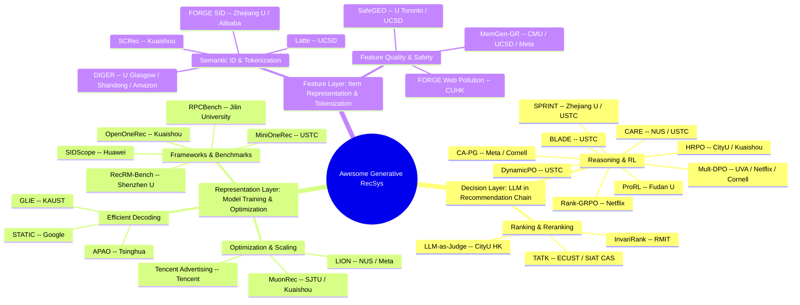

# Awesome Generative Recommendation System (RecSys)

```
 ██████╗                ██████╗                ███████╗                
██╔════╝  ███╗  ███╗    ██╔══██╗ ███╗   ███╗   ██╔════╝██╗ ██╗ ██████╗ 
██║      ██╔═██╗████╗   ██████╔╝██╔═██╗██╔═██╗ ███████╗╚██╗██║ ██╔═══╝ 
██║  ███╗██████║██╔██╗  ██╔══██╗██████║██║ ╚═╝ ╚════██║ ╚███╔╝ ██████╗ 
██║   ██║██║    ██║╚██╗ ██║  ██║██║    ██║ ██╗      ██║  ██╔╝      ██║
╚██████╔╝╚████╗ ██║ ╚██╗██║  ██║╚████╗ ╚███╔═╝ ███████║  ██║   ██████║
 ╚═════╝  ╚═══╝ ╚═╝  ╚═╝╚═╝  ╚═╝ ╚═══╝  ╚══╝   ╚══════╝  ╚═╝   ╚═════╝
```
---

[](https://github.com/sindresorhus/awesome)

RecSys is starting to adopt LLM for feature extraction, retrieval, and ranking/re-ranking! Although you can get some hands-on materials in either the [classics](#papers-classic-must-read) or some surveys, but since you're already interested in applying generative AI to industrial tasks, you probably wanna stay on the bleeding edge, right? That's exactly what this repo is for — automatically updated daily by agents with the latest generative RecSys papers fresh off arXiv, making sure that you never miss a beat.

> [!IMPORTANT]
> For those who are not familiar with GenRec, or not even the recommendation system, please checkout the kickstart posts [here](docs/kickstart.md).
> These posts are in Chinese, for English simply do your browser's internal translation or turn to __Ask Gemini__ :shipit:

## Quick Indexing
- [By Date](#by-date)
- [By Opensource](#by-opensource)
- [By Keyword](#by-keyword)
- [By Affiliation](#by-affiliation)
- [Papers Classic Must Read](#papers-classic-must-read)
- [Verl-GR: An Awesome RL Toolkit for GenRecSys](#verl-gr-an-awesome-rl-toolkit-for-genrecsys)


```mermaid
mindmap
  root((Awesome Generative RecSys))
    Decision Layer: LLM in Recommendation Chain
      Reasoning & RL
        Rank-GRPO -- Netflix
        DynamicPO -- USTC
        BLADE -- USTC
        SPRINT -- Zhejiang U / USTC
        CARE -- NUS / USTC
        HRPO -- CityU / Kuaishou
        Mult-DPO -- UVA / Netflix / Cornell
        CA-PG -- Meta / Cornell
        ProRL -- Fudan U
      Ranking & Reranking
        InvariRank -- RMIT
        LLM-as-Judge -- CityU HK
        TATK -- ECUST / SIAT CAS
    Representation Layer: Model Training & Optimization
      Frameworks & Benchmarks
        MiniOneRec -- USTC
        OpenOneRec -- Kuaishou
        RecRM-Bench -- Shenzhen U
        SIDScope -- Huawei
        RPCBench -- Jilin University
      Efficient Decoding
        STATIC -- Google
        APAO -- Tsinghua
        GLIE -- KAUST
      Optimization & Scaling
        MuonRec -- SJTU / Kuaishou
        Tencent Advertising -- Tencent
        LION -- NUS / Meta
    Feature Layer: Item Representation & Tokenization
      Semantic ID & Tokenization
        Latte -- UCSD
        FORGE SID -- Zhejiang U / Alibaba
        DIGER -- U Glasgow / Shandong / Amazon
        SCRec -- Kuaishou
      Feature Quality & Safety
        SafeGEO -- U Toronto / UCSD
        MemGen-GR -- CMU / UCSD / Meta
        FORGE Web Pollution -- CUHK
```
<div align="center">
  <i> Open-source Generative RecSys Map </i>
</div>

---
## `Verl-GR`: An Awesome RL Toolkit for GenRecSys
If you are interested in RFT your own GenRecSys, come check out our `verl`-based implementation called `verl-gr` here:
* [https://github.com/HaFred/verl-GR/tree/main/verl_gr/recipes/openonerec](https://github.com/HaFred/verl-GR/tree/main/verl_gr/recipes/openonerec)
* [https://github.com/HaFred/verl-GR/tree/main/verl_gr/recipes/rankgrpo](https://github.com/HaFred/verl-GR/tree/main/verl_gr/recipes/rankgrpo)

We manage to achieve 22% and 32% boosting for the end-to-end training efficiencies, compared with their respective vanilla implementations.

## By Date

### Papers September 15

*Tuesday, September 15, 2026. ArXiv active — the Tuesday Sep 15 announcement batch (cs.IR new listings 1–35) plus late Monday-Sep-14 submissions (2609.14xxx–2609.15xxx) landed after the Sep 14 run. Core: LION (NUS/Meta, CIKM 2026, opensource) names "evolution conflict" in continual generative recommendation and fixes it with a sparse key-value memory layer; SCRec (Kuaishou, RecSys 2026, opensource) closes the cross-stage semantic/collaborative decoupling; VARG (Taobao & Tmall) adds a value-ordered third token plus Prefix-GRPO to Tmall App search, +1.45% GMV online; LazFormer (Alibaba International) transferable generative pre-training for industrial ranking; TATK (ECUST/SIAT, EMNLP 2026 Main, opensource) couples top-K learning with KG-grounded verification; GESE (Baidu) splits headline personalization into GSPO exploration + real-time selection, +2.57% CTR on a 100M-DAU feed; Safety as a Constraint (Netflix/UPenn) uses constrained GRPO for faithful, harmless explanations; P3Rec prior–posterior preference distillation; PinDCO (Pinterest, RecSys 2026) whole-page dynamic creative optimization. Total: 9 papers (3 opensource).*

1. **Self-Evolving Memory for Generative Recommendation**
   * Affiliation: National University of Singapore / Meta — *(Xinyu Lin, Zhuosong Jiang, Zixiao Suo, Siqin Wang, Hanqing Zeng, Hanchao Yu, Yinglong Xia, Jiang Zhang, Aashu Singh, Fei Liu, Wenjie Wang, Fuli Feng, Yang Song, Qifan Wang, Tat-Seng Chua)*
   * Link: [arxiv.org/abs/2609.15598](https://arxiv.org/abs/2609.15598)
   * Venue: CIKM 2026
   * TL;DR: Diagnoses "evolution conflict" — dominant behavioral patterns hijacking the shared autoregressive parameters during continual generative-recommendation updates — and resolves it with LION, a sparse key-value memory layer plus a consolidation loss.
   * Key techniques:
     - Evolution-conflict diagnosis: heterogeneous per-user preference shifts are optimized in one fully shared AR parameter space, so dominant patterns crowd out underrepresented ones
     - Three design principles for self-evolving recommenders: isolated memorization, reinforced evolution, scalable application
     - LION = sparse memory activation over a key-value layer that isolates the evolution of different behavioral patterns
     - Consolidation loss explicitly reinforces underrepresented preference dynamics during continual adaptation
     - Evaluated per-period, per-user/item-group, and via evolution-convergence analysis on diverse real-world datasets
   * Scores (Opensource? / Novelty / Fairness / Robustness / Impact):
     - **Opensource?: 8/10** — [github.com/JazyJiang/Self-Evolving-Memory-for-Generative-Recommendation](https://github.com/JazyJiang/Self-Evolving-Memory-for-Generative-Recommendation) — MIT-licensed, single-shot release containing full training/eval entry points (train.py, test.py, run.sh), YAML configs, the RQ-VAE tokenizer, the data pipeline, six reproduced continual-learning baselines (PESO, PISA, LSAT, ICL-TIGER, Replay-Pure-TIGER, SAIL-PIW), sweep drivers and analysis tools, with explicit reproducibility notes; only the paper-ready table export is delegated to a script, so it is close to paper-matching
     - **Novelty: 8/10** — naming and diagnosing evolution conflict, then fixing it with isolated memory rather than more retraining, is a new framing for continually evolving GR
     - **Fairness: 5/10** — no fairness objective per se, though group-wise evolution evaluation implicitly protects underrepresented preference patterns
     - **Robustness: 8/10** — multiple continual-evolution protocols plus gradient-conflict, memory-activation and convergence diagnostics
     - **Impact: 8/10** — NUS / Meta; targets the core deployment problem (continuous preference drift) for generative recommenders

2. **Addressing Cross-Stage Decoupling of Semantic and Collaborative Signals in Generative Recommendation**
   * Affiliation: Kuaishou Technology — *(Jiayi Dan)*
   * Link: [arxiv.org/abs/2609.13678](https://arxiv.org/abs/2609.13678)
   * Venue: RecSys 2026 Main Track
   * TL;DR: SCRec re-couples the two stages of generative recommendation with bidirectional information supplementation — collaborative-enhanced tokenization, semantic-guided generation, and manifold alignment — at almost no extra training or inference cost.
   * Key techniques:
     - Collaborative-enhanced tokenization injects textualized collaborative signals into semantic IDs without introducing a separate alignment task
     - Semantic-guided generation dynamically recalibrates semantic priors with learnable code embeddings during decoding
     - Manifold alignment reconciles the geometric mismatch between the discrete codebook-index space and the dense continuous semantic space
     - Packaged as a plug-and-play module and re-validated on TIGER and LIGER backbones
   * Scores (Opensource? / Novelty / Fairness / Robustness / Impact):
     - **Opensource?: 7/10** — [github.com/DanJiayi/SCRec](https://github.com/DanJiayi/SCRec) — complete three-step pipeline (preprocess → RQ-VAE train → generative train/eval) with run.sh, an extracted Beauty codebook under cache/ so RQ-VAE can be skipped, alternative collaborative-tokenization baselines in other_CT_methods/, and a csa-plug-and-play/ module; README covers quick start and generalizability, but there is no LICENSE file and the repo has been quiet since Jul 31, 2026
     - **Novelty: 7/10** — the decoupling framing plus a joint bidirectional fix is a well-targeted contribution to the semantic-ID paradigm
     - **Fairness: 3/10** — not addressed
     - **Robustness: 7/10** — three Amazon categories plus cross-backbone (TIGER/LIGER) generalization tests
     - **Impact: 7/10** — Kuaishou; directly relevant to industrial semantic-ID tokenizer design

3. **VARG: Value-Aware and Ranking-Aligned Generative Retrieval for Dynamic E-commerce Search**
   * Affiliation: University of Science and Technology of China / Taobao & Tmall Group of Alibaba / Nankai University — *(Xiaopeng Chu, Jianbo Zhu, Mingmin Jin, Jing Wang, Xing Fang, Wenyi Zhang)*
   * Link: [arxiv.org/abs/2609.14493](https://arxiv.org/abs/2609.14493)
   * Venue: arXiv preprint, September 2026 (cs.IR)
   * TL;DR: A generative retrieval system for Tmall App search that admits generated candidates straight into the final ranker, encoding business value into a value-ordered third token and aligning generation with ranking via Prefix-GRPO, delivering +1.45% GMV in online A/B.
   * Key techniques:
     - VARG-ID builds RQ-VAE semantic prefixes with bidirectional query–item contrastive learning, then appends a value-ordered third token giving fine-grained addresses plus a business-value prior
     - Three-stage SFT: item-to-identifier mapping → query-semantic retrieval → personalized retrieval
     - Local ordinal supervision (LO-SFT) learns the within-cluster ordering encoded by the third token
     - Prefix-GRPO with gated rewards (output legality, user behavior, ranker advantage, search relevance) and prefix-aware token weighting
     - Coordinated daily product/model updates preserve existing item addresses while absorbing new products and feedback
   * Scores (Opensource? / Novelty / Fairness / Robustness / Impact):
     - **Opensource?: 0/10** — no public code available
     - **Novelty: 8/10** — folding commercial value into the identifier itself and then aligning decoding to the downstream ranker is a strong industrial formulation
     - **Fairness: 3/10** — value-optimized retrieval raises exposure-allocation questions that are not analyzed
     - **Robustness: 8/10** — tens of millions of products offline, identifier-stability checks, and a 14-day 20%-traffic A/B test
     - **Impact: 9/10** — Taobao & Tmall; +1.45% GMV, +0.22% IPV/user, +0.31% PCTR with a smaller candidate quota

4. **LazFormer: Scaling Transformers for Industrial Recommendation via Transferable Generative Pre-training**
   * Affiliation: Alibaba International Digital Commerce Group — *(Xiaodong Li, Alin Fan, Mingyang Li, Yan Xiao, Shichao Nie, Junfeng Zhang, Shaochuan Lin, Zhanming Ou, Tao Luo, Xiaoyi Zeng)*
   * Link: [arxiv.org/abs/2609.14978](https://arxiv.org/abs/2609.14978)
   * Venue: arXiv preprint, September 2026 (cs.IR)
   * TL;DR: A scaling Transformer for industrial ranking that generative-pre-trains to autoregressively produce sequential features — initializing both sparse and dense parameters — and uses a residual adapter plus asymmetric multi-epoch training to avoid negative transfer and sparse overfitting.
   * Key techniques:
     - Generative pre-training module autoregressively generates sequential features, yielding favorable sparse + dense initialization for ranking
     - Transferable residual adapter injects ranking-specific features residually to counter dense-parameter negative transfer
     - Request-aware ranking module combines long-sequence compression, hybrid sparse attention, and a request-aware paradigm
     - Asymmetric multi-epoch training resets sparse parameters while accumulating dense parameters across epochs
   * Scores (Opensource? / Novelty / Fairness / Robustness / Impact):
     - **Opensource?: 0/10** — no public code available
     - **Novelty: 7/10** — pre-training/ranking feature inconsistency and asymmetric sparse–dense epoch handling are pragmatic, under-addressed problems
     - **Fairness: 2/10** — not addressed
     - **Robustness: 6/10** — industrial-scale internal evaluation, but no public benchmarks or A/B numbers reported in the abstract
     - **Impact: 7/10** — Alibaba International Digital Commerce; a scaling recipe for production rankers

5. **TATK: Triple-Aware Top-K Learning with Knowledge-Grounded Verification for LLM-based Sequential Recommendation**
   * Affiliation: East China University of Science and Technology / Hong Kong Institute of Science & Innovation, CAS / Shenzhen Institutes of Advanced Technology, CAS / Westlake University — *(Yuchen Guan, Jiaye Liu, Yifei Han, Zhenxi Zhang, Yixuan Weng, Bin Li)*
   * Link: [arxiv.org/abs/2609.14565](https://arxiv.org/abs/2609.14565)
   * Venue: EMNLP 2026 Main Conference
   * TL;DR: TATK pairs Top-K Learning (context-aware metadata-KG prompt grounding + position-aware top-K rewards) with Knowledge-Grounded Verification (structure-aware reranking over top-M candidates) to fix the mismatch between text generation and full-catalog top-K ranking.
   * Key techniques:
     - Top-K Learning combines context-aware metadata-KG prompt grounding with position-aware top-K rewards aligned to ranking utility
     - Knowledge-Grounded Verification reranks top-M candidates after a single LLM forward pass, reusing the same metadata-derived item graph
     - Matched R²ec-style full-catalog protocol on three Amazon Reviews 2023 categories with Gemma-2-2B-It and Qwen2.5-3B-Instruct backbones
     - Diagnostics (reward shape, sequence perturbation, relation quality, candidate pool) show structural evidence should be gated when metadata relations are sparse or noisy
   * Scores (Opensource? / Novelty / Fairness / Robustness / Impact):
     - **Opensource?: 6/10** — [github.com/conor1020/TATK](https://github.com/conor1020/TATK) — full_model/, baseline/rrec/, ablation_chain/, dataset_process/ and paper_source/ plus REPRODUCE.md, MANIFEST.md, requirements.txt and a documented quick start; however it is still packaged as an anonymous EMNLP submission snapshot (single commit, May 25 2026, "Anonymous" citation) and the license is review-only rather than a standard OSS license
     - **Novelty: 7/10** — decomposing the generation↔ranking mismatch into three separable mismatches (context, objective, verification) is a clean formulation
     - **Fairness: 3/10** — not addressed
     - **Robustness: 8/10** — all 36 reported metrics improved, plus component, reward-shape, perturbation and relation-quality ablations
     - **Impact: 7/10** — EMNLP 2026 Main; gives a practical gating rule (drop structural evidence when KGs are noisy) for LLM recommenders

6. **Generate to Explore, Select to Exploit: Aligning LLM-based Headline Generation with Personalized Recommendation**
   * Affiliation: Baidu Inc. — *(Yi Chen, Rufeng Cheng, Qiang Xie, Tao Li)*
   * Link: [arxiv.org/abs/2609.15094](https://arxiv.org/abs/2609.15094)
   * Venue: arXiv preprint, September 2026 (cs.IR / cs.AI)
   * TL;DR: GESE decouples the presentation layer into a GSPO-trained LLM that explores a diverse headline candidate set and a lightweight feedback-aware selector that exploits real-time context, gaining +2.57% CTR on a 100M+ DAU feed.
   * Key techniques:
     - LLM as probabilistic explorer, optimized with Group Sequence Policy Optimization (GSPO) and a hierarchical reward to maximize semantic coverage of latent user interests
     - Explicitly targets mode collapse of single-best-headline optimization, which suppresses long-tail audiences
     - Lightweight real-time feedback-aware selector picks the best realization from the candidate pool per instant context
     - Full deployment on a commercial platform with over 100 million daily active users
   * Scores (Opensource? / Novelty / Fairness / Robustness / Impact):
     - **Opensource?: 0/10** — no public code available
     - **Novelty: 7/10** — the explore/exploit decomposition of generative personalization at the presentation layer is a fresh, well-motivated angle
     - **Fairness: 6/10** — the coverage-oriented exploration objective is explicitly motivated by long-tail audience suppression
     - **Robustness: 7/10** — large-scale online deployment with two live metrics and SOTA baselines
     - **Impact: 8/10** — Baidu; +2.57% CTR / +0.87% dwell time at 100M-DAU scale

7. **Safety as a Constraint: Fine-Tuning a LLM Recommender to Explain Itself**
   * Affiliation: Netflix / University of Pennsylvania — *(Jiashu He, Emma Yanyang Kong, JJ Tan, David Fagnan)*
   * Link: [arxiv.org/abs/2609.13657](https://arxiv.org/abs/2609.13657)
   * Venue: arXiv preprint, September 2026 (cs.AI)
   * TL;DR: Trains an in-house recommender LLM to explain its own recommendations with constrained GRPO — faithfulness as the objective, two harmlessness criteria as hard constraints — lifting the all-criteria PASS rate from 0.649 to 0.956.
   * Key techniques:
     - Two LoRA-based LLM-judge reward models with chain-of-thought rationales covering faithfulness and two harmlessness criteria, checked against human annotators
     - Constrained GRPO: faithfulness maximized as the main objective while harmlessness criteria are enforced as constraints (primal–dual optimization)
     - Explanations grounded in the user's previously watched similar shows ("watch this if you enjoyed X")
     - Shows language and recommendation abilities are preserved, supporting single-model agentic user interfaces
   * Scores (Opensource? / Novelty / Fairness / Robustness / Impact):
     - **Opensource?: 0/10** — no public code available
     - **Novelty: 7/10** — constrained-RL where safety is a constraint rather than a blended reward, applied to self-explanation
     - **Fairness: 8/10** — harmlessness constraints explicitly target stereotyping and sensitive associations for user groups
     - **Robustness: 7/10** — held-out real-world test set, two independent judges, plus regression checks on language and recommendation quality
     - **Impact: 7/10** — Netflix; directly transferable to explainable/agentic recommender UIs

8. **P3Rec: Distilling Prior–Posterior Preference Reasoning for LLM-based Recommendation**
   * Affiliation: Chongqing University of Technology / Peking University / Chongqing University — *(Jinfei Chen, Weihai Lu, Jiawei Cheng)*
   * Link: [arxiv.org/abs/2609.13993](https://arxiv.org/abs/2609.13993)
   * Venue: arXiv preprint, September 2026 (cs.IR)
   * TL;DR: P3Rec distills both target-agnostic prior and target-conditioned posterior preference reasoning from an LLM into a lightweight retriever, then uses interest entropy to calibrate the user representation before contrastive retrieval.
   * Key techniques:
     - Joint extraction of prior (stable, target-agnostic) and posterior (target-conditioned) preference reasoning from the user side
     - Item-centric preference representations derived from item semantics and predecessor interactions
     - Progressive internalization: prior preference absorption + posterior-guided preference distillation
     - Interest entropy characterizes historical interest dispersion and adaptively calibrates the user embedding before contrastive optimization
   * Scores (Opensource? / Novelty / Fairness / Robustness / Impact):
     - **Opensource?: 0/10** — no public code available
     - **Novelty: 6/10** — combining prior/posterior distillation with entropy-based calibration is a sensible but incremental refinement of the LLM-as-Enhancer paradigm
     - **Fairness: 2/10** — not addressed
     - **Robustness: 6/10** — evaluated on multiple public datasets, but the abstract reports no ablation depth
     - **Impact: 5/10** — academic; keeps online inference LLM-free, useful for cost-sensitive deployment

9. **PinDCO: Whole-Page Aware Dynamic Creative Optimization at Scale**
   * Affiliation: Pinterest — *(Yu Hao, Yuchun Li, Peimeng Sui, Meilin Liu, Tianyuan Cui, Hao Li, Zicong Zhou, Akanksha Baid)*
   * Link: [arxiv.org/abs/2609.11943](https://arxiv.org/abs/2609.11943)
   * Venue: RecSys 2026
   * TL;DR: A production DCO system for ad creative retrieval and selection on Pinterest that scores creative components with a fusion network and adjusts for rendered size in the waterfall grid, yielding +3.09% ad CTR.
   * Key techniques:
     - Creative Component Fusion Network (CCFN): one tower per creative component (image, title, layout) with component-specific hyperparameters, fused into a creative-level score conditioned on the ad-level prediction
     - Pixel-aware Adjustment Module (PAM) accounts for rendered creative size affecting nearby content and session-level engagement
     - Exploration–exploitation strategy improves training-data quality; a lightweight pre-selection model prunes candidates early
     - Caching and dynamic batching for serving efficiency; launched in the Pinterest Ads platform
   * Scores (Opensource? / Novelty / Fairness / Robustness / Impact):
     - **Opensource?: 0/10** — no public code available
     - **Novelty: 6/10** — whole-page and pixel-aware creative scoring is a practical contribution rather than a new paradigm
     - **Fairness: 3/10** — not addressed
     - **Robustness: 7/10** — offline analyses plus online A/B experiments with positive whole-page metrics
     - **Impact: 7/10** — Pinterest; shipped production system, +3.09% CTR

*Note: 9 new papers surfaced (3 opensource), so no gap-fill or backfill search was required.*

### Papers September 14

*Monday, September 14, 2026. ArXiv active — Monday announcement batch (10 on-topic papers in cs.IR). Core: OneLA (HKU/Kuaishou) scales linear-attention decoding to large beams in generative recommendation; Meta's post-hoc generative verifier lifts recall for sequential retrievers; ChronicleRec (UNSW/Tencent) compresses lifelong user behavior into cacheable Chronicle Tokens deployed in Weixin Moments Ads; Preference-Drift-Aware subsequence learning (NEU/Tencent) for long-sequence GR; MIMA (Alibaba International) multi-interest rec; two agentic-web position papers (Spotify RecSys 2026 + UNC Charlotte PAMR); MemRetriever (MemTensor, opensource) agentic long-term memory retrieval. Total: 8 papers (1 opensource).*

1. **Recommendation Retrievers Need Verifiers: Universal Generative Reranking for Sequential Recommendations**
   * Affiliation: Meta (Meta MRS) — *(Benyu Zhang, Qiang Zhang, Rui Li, Qunshu Zhang, Devansh Tandon, Neeraj Bhatia)*
   * Link: [arxiv.org/abs/2609.12270](https://arxiv.org/abs/2609.12270)
   * Venue: arXiv preprint, September 2026 (cs.IR)
   * TL;DR: A post-hoc generative verifier that promotes deep-list candidates into the consumed shortlist without retraining the retriever, improving Recall@10 across SASRec, GRU4Rec, NextItNet, and MiniOneRec.
   * Key techniques:
     - Lightweight generative verifier scores items via identifier-token likelihood (next-token cross-entropy)
     - Trained post hoc with no sampled negatives or candidate pool; scores only the retriever's top-K at inference
     - Minimal interface: retriever supplies query state + candidate items; any fixed tokenization supported
     - Consistent Recall@10 gains on Amazon product + YaMBDa music rec; ablations isolate verification from content injection
   * Scores (Opensource? / Novelty / Fairness / Robustness / Impact):
     - **Opensource?: 0/10** — no public code available
     - **Novelty: 7/10** — post-hoc output-side verification for retrieval is a fresh angle vs. retraining the retriever
     - **Fairness: 3/10** — no explicit fairness mechanism
     - **Robustness: 7/10** — 4 retrievers × 2 datasets with ablations
     - **Impact: 7/10** — Meta; plug-and-play recall lift for multi-stage recommenders

2. **Preference-Drift-Aware Subsequence Learning and Hierarchical Context Fusion for Long-Sequence Generative Recommendation**
   * Affiliation: Northeastern University (Shenyang) / Tencent — *(Fei Li, Qingyun Gao, Jianzhe Zhao, Guibing Guo; Beibei Kong, Lei Cheng, Chengxiang Zhuo, Zang Li)*
   * Link: [arxiv.org/abs/2609.12556](https://arxiv.org/abs/2609.12556)
   * Venue: arXiv preprint, September 2026 (cs.IR)
   * TL;DR: Long-sequence generative recommendation that learns differentiable preference-drift-aware subsequence boundaries and fuses recent + global subsequence context via gated cross-attention, cutting full-sequence attention cost while boosting accuracy.
   * Key techniques:
     - Differentiable soft subsequence boundaries from multidimensional preference-drift information
     - Linear attention with soft assignment weights aggregates items into preference-coherent representations
     - Cross-attention captures recent↔subsequence dependencies; gated fusion blends recent + long-term preferences
     - Consistent accuracy + efficiency gains over full-sequence and context-retrieval baselines
   * Scores (Opensource? / Novelty / Fairness / Robustness / Impact):
     - **Opensource?: 0/10** — no public code available
     - **Novelty: 7/10** — preference-drift-aware soft boundaries + hierarchical fusion is a clean, well-motivated design
     - **Fairness: 3/10** — no explicit fairness mechanism
     - **Robustness: 7/10** — extensive baselines; explicitly targets noise/incomplete-context failure modes
     - **Impact: 6/10** — NEU / Tencent; addresses a core long-sequence GR bottleneck

3. **OneLA: Scaling Linear-Attention Decoding to Large Beams in Generative Recommendation**
   * Affiliation: University of Hong Kong / Kuaishou Technology — *(Xiangrui Yang, Cheng Peng, Yunfeng Zhao, Liang Zeng, Ao Hu, Jiawei Yang, Shengzhe Wang, Jingshan Lv, Xiao Liang, Chen Yang, Jiaqiang Liu, Yiming Qiu)*
   * Link: [arxiv.org/abs/2609.12399](https://arxiv.org/abs/2609.12399)
   * Venue: arXiv preprint, September 2026 (cs.AI / cs.IR)
   * TL;DR: A linear-attention decoding framework for large-beam generative recommendation that shares one prompt-derived state across beams with append-only divergent-transition records, delivering 1.54–2.46× decode speedups.
   * Key techniques:
     - Single shared prompt-derived state + compact append-only records of each beam's divergent transitions
     - Lightweight ancestry index tracks each beam's history without moving/copying records
     - Fused GPU kernel reuses shared state; only needed state computed per decoding step
     - 1.54–2.46× end-to-end decode speedup with reduced recurrent-state memory and data movement
   * Scores (Opensource? / Novelty / Fairness / Robustness / Impact):
     - **Opensource?: 0/10** — no public code available
     - **Novelty: 8/10** — shared-state + ancestry-index representation for large-beam linear attention is a novel systems contribution
     - **Fairness: 2/10** — systems-level, no fairness angle
     - **Robustness: 7/10** — measured speedups + memory/traffic reduction on GR workloads
     - **Impact: 8/10** — HKU / Kuaishou (OneRec ecosystem); directly unblocks large-beam GR serving

4. **ChronicleRec: Pre-training Temporally Anchored Tokens for Lifelong User Modeling**
   * Affiliation: UNSW Sydney / Tencent — *(Chengkai Huang, Yubin Sheng, Liang Guo, Haoxi Liu, Junwei Pan, Shangyu Zhang, Zhixiang Feng, Chao Zhou, Chengguo Yin, Lina Yao, Haijie Gu, Jie Jiang)*
   * Link: [arxiv.org/abs/2609.12375](https://arxiv.org/abs/2609.12375)
   * Venue: arXiv preprint, September 2026 (cs.IR)
   * TL;DR: A pre-train-and-transfer framework compressing ultra-long behavior sequences into chronologically ordered, cacheable Chronicle Tokens via recency-aware multi-granularity merge and causal query interleaving, deployed in Weixin Moments Ads.
   * Key techniques:
     - Recency-aware multi-granularity merge (preserve recent, coarsen distant history)
     - Causal encoder interleaves query tokens; each query summarizes only pre-anchor history
     - Multi-horizon masking over recent-history windows; mask-and-predict pre-training objective
     - +1.61% GMV in 7-day online A/B on Weixin Moments Ads; strong on KuaiRand + Tencent AdLive
   * Scores (Opensource? / Novelty / Fairness / Robustness / Impact):
     - **Opensource?: 0/10** — no public code available
     - **Novelty: 7/10** — target-independent, chronologically-anchored compression is a clean decoupling of lifelong modeling from scoring
     - **Fairness: 3/10** — no explicit fairness mechanism
     - **Robustness: 8/10** — public + industrial datasets, token analyses, statistically-significant online A/B
     - **Impact: 8/10** — UNSW / Tencent; deployed in Weixin Moments Ads pCVR

5. **MIMA: Multi-Interest Recommendation via Multi-Positive Exclusive Assignment**
   * Affiliation: Alibaba International Digital Commerce Group — *(Xingyuan Mao, Alin Fan, Shichao Nie, Junfeng Zhang, Yan Xiao, Tao Luo, Xiaoyi Zeng)*
   * Link: [arxiv.org/abs/2609.12842](https://arxiv.org/abs/2609.12842)
   * Venue: arXiv preprint, September 2026 (cs.IR)
   * TL;DR: A multi-interest recommendation framework using multi-positive exclusive assignment (Hungarian matching) so interest differentiation emerges from the training objective itself, plus a routing module to calibrate interest-channel scores.
   * Key techniques:
     - Groups items co-occurring in one request into a positive set; complementary interests via causal Transformer decoder
     - Hungarian matching exclusively assigns each positive to a distinct interest (anti-collapse)
     - Lightweight routing estimates interest-activation probabilities to calibrate cross-channel scores
     - SOTA on 3 public + 1 industrial dataset; online A/B gains
   * Scores (Opensource? / Novelty / Fairness / Robustness / Impact):
     - **Opensource?: 0/10** — no public code available
     - **Novelty: 6/10** — multi-positive exclusive assignment is a clean fix for interest collapse, though components are familiar
     - **Fairness: 4/10** — interest differentiation indirectly improves minority-interest coverage
     - **Robustness: 7/10** — 4 datasets incl. industrial + online A/B
     - **Impact: 7/10** — Alibaba International; industrial multi-interest rec

6. **Who Are We Recommending To? Recommender Systems in the Agentic Web**
   * Affiliation: Spotify — *(Himan Abdollahpouri, Kyle Kretschman, Sai Ravindranath, Jackie Doremus, Mounia Lalmas)*
   * Link: [arxiv.org/abs/2609.11945](https://arxiv.org/abs/2609.11945)
   * Venue: ACM RecSys 2026 (Past, Present, and Future track)
   * TL;DR: Position paper arguing recommendation is bifurcating — agents become the primary consumer in delegable contexts while humans remain the judge in experiential contexts — introducing a delegation spectrum and research agenda.
   * Key techniques:
     - Delegation spectrum over preference specifiability, outcome verifiability, and decision stakes
     - Dual-audience optimization (human-interpretable + machine-actionable outputs)
     - Agent preference modeling, outcome-based evaluation, and the agent attention economy
     - New trust/accountability and monetization risks from agent mediation
   * Scores (Opensource? / Novelty / Fairness / Robustness / Impact):
     - **Opensource?: 0/10** — no public code available
     - **Novelty: 7/10** — delegation spectrum and dual-audience framing are timely conceptual contributions
     - **Fairness: 7/10** — foregrounds disclosure, auditing, and accountability in agent-mediated rec
     - **Robustness: 4/10** — position paper without empirical validation
     - **Impact: 8/10** — RecSys 2026 (20th-anniversary track), Spotify; shapes the agentic-web agenda

7. **Position: Recommender Systems Should Move Beyond Platform-Centric Ranking toward Personal Agent-Mediated Recommendation**
   * Affiliation: University of North Carolina at Charlotte — *(Haohan Yuan, Peng He, Dan Zhang, Jianpeng Liang, Junning Zhu)*
   * Link: [arxiv.org/abs/2609.11942](https://arxiv.org/abs/2609.11942)
   * Venue: arXiv preprint (position paper), September 2026 (cs.IR)
   * TL;DR: Position paper proposing Personal Agent-Mediated Recommendation (PAMR), shifting from platform-side item ranking to user-side evidence mediation, with a mediation-centered evaluation framework.
   * Key techniques:
     - PAMR paradigm: user-facing agent discovers, filters, aggregates, and governs evidence across distributed sources
     - Mediation-centered evaluation over utility–traceability–exposure–cost
     - Proof-of-concept on hard Yelp restaurant rec: source selection + controlled disclosure as best operating point
   * Scores (Opensource? / Novelty / Fairness / Robustness / Impact):
     - **Opensource?: 0/10** — no public code available
     - **Novelty: 7/10** — reframes the recommendation bottleneck as evidence-control rather than ranking
     - **Fairness: 7/10** — centers user control over evidence acquisition/disclosure
     - **Robustness: 4/10** — position paper with a small proof-of-concept only
     - **Impact: 6/10** — UNC Charlotte et al.; direction-setting for personal agents

8. **MemRetriever: Learning to Search, Reflect, and Retrieve from Long-Term Memory**
   * Affiliation: MemTensor (Shanghai) Technology — *(Ruiyang Jiang, Chunyu Li, Zhiyu Li)*
   * Link: [arxiv.org/abs/2609.11951](https://arxiv.org/abs/2609.11951)
   * Venue: arXiv preprint, September 2026 (cs.IR)
   * TL;DR: An agentic retrieval model that treats long-term memory access as a multi-step search/reflect/denoise process, trained via warm-start plus GRPO, improving memory retrieval across five benchmarks.
   * Key techniques:
     - Parallel/serial search, reflection, and denoising actions per step with adaptive termination
     - ReAct-style search-memory trajectories for warm-start; Group Relative Policy Optimization (GRPO) for RL
     - Reward for evidence coverage, noise reduction, answer sufficiency, and efficient termination
     - MemRetriever-4B-RL beats DeepSeek-v4-Flash on LongMemEval; backend-agnostic
   * Scores (Opensource? / Novelty / Fairness / Robustness / Impact):
     - **Opensource?: 7/10** — [github.com/MemTensor/MemOS](https://github.com/MemTensor/MemOS) — active memory-OS repo (PR #2156+, Sept 2026 commits) with hybrid-retrieval/reflect pipelines, docs/, and CI; matches the search/reflect/retrieve pattern but the specific 4B-RL checkpoint/recipe is not fully packaged
     - **Novelty: 7/10** — an intermediate decision layer for memory access is a clean agentic-retrieval formulation
     - **Fairness: 4/10** — not directly addressed
     - **Robustness: 7/10** — 5 benchmarks (LOCOMO, LongMemEval, HotpotQA, MuSiQue, 2WikiMultiHopQA)
     - **Impact: 6/10** — MemTensor; long-term memory for personalized/agentic recommenders

### Papers September 13

*Sunday, September 13, 2026. ArXiv weekend pause — no new announcement batch in the last 24h (last batch was Thu Sep 10, already covered by the Sep 11 run; Fri/Sat are no-announcement days). Fallback: re-scanned the Sep 7–11 cs.IR / cs.AI / cs.CL batches and surfaced 6 on-topic papers missed by prior runs (1 opensource). Core: FunnelAudit responsibility auditing for multi-route recsys (RMIT), MORE multi-task ranking backbone deployed on Momo (CIKM 2026), GLIE generative late-interaction embeddings (KAUST, opensource), Matryoshka Hash compact semantic retrieval (CUHK-Shenzhen), Query-Aware Token Budgeting for visual document retrieval (IISER Bhopal, ICDM 2026), Democracy Needs Reach algorithmic recommendation fairness (U Ottawa).*

1. **FunnelAudit: Responsibility Auditing in Multi-Route Recommender Systems**
   * Affiliation: RMIT University — *(Jie Li, Dudu Luo, Jiayang Niu, Ke Deng, Yongli Ren)*
   * Link: [arxiv.org/abs/2609.06964](https://arxiv.org/abs/2609.06964)
   * Venue: arXiv preprint, September 2026 (cs.IR)
   * TL;DR: An executable framework for incident-level responsibility auditing in multi-route recommenders, using an accountability contract plus graded actual responsibility to find the smallest outcome-preserving contingency that makes each control pivotal, with checkable certificates.
   * Key techniques:
     - Accountability contract specifying the disputed Top-K event, controls/owners, permitted reference actions, and replay semantics
     - Graded actual responsibility over every permitted control configuration; smallest outcome-preserving contingency per control
     - Verifiable certificate recording the contingency + paired serving executions needed to verify the judgment
     - 258,809 user-target incidents across 3 real datasets; independent replay reproduces all 9,121,792 outcomes; MILP cross-check
   * Scores (Opensource? / Novelty / Fairness / Robustness / Impact):
     - **Opensource?: 0/10** — no public code available
     - **Novelty: 7/10** — executable, witness-based responsibility auditing for recsys is a fresh governance angle
     - **Fairness: 7/10** — accountability/attribution of inclusion-exclusion decisions underpins fairness audits
     - **Robustness: 8/10** — large-scale incident study + exhaustive independent replay + MILP agreement
     - **Impact: 6/10** — RMIT; actionable accountability tooling for multi-route recommenders

2. **Task-Blind No MORE: Multi-Task Information Flow in Unified Ranking Backbones**
   * Affiliation: Momo Inc. (Hello Group) — *(Yuchen Wang, Feng Niu, Qing Tan, Junting Lu, Baoxin Wu, Jun Gao)*
   * Link: [arxiv.org/abs/2609.07273](https://arxiv.org/abs/2609.07273)
   * Venue: CIKM 2026
   * TL;DR: MORE embeds multi-task information flow inside a unified ranking backbone via persistent Anchor Tokens (Shared + Private), so task-specific signals co-evolve with sequence and feature representations at every layer — deployed in production on Momo.
   * Key techniques:
     - Anchor Tokens persisting across layers: Shared Anchors encode cross-task commonalities, Private Anchors capture task-specific priors
     - Task-boundary mask mixes anchors with non-sequential features; independent per-task refinement branches
     - Request-level shared computation cuts scoring latency ~30%
     - Online A/B on Momo (tens of millions MAU): +3% usage duration, +3.6% interaction rate, +2% deep-chat rate
   * Scores (Opensource? / Novelty / Fairness / Robustness / Impact):
     - **Opensource?: 0/10** — no public code available (industrial deployment)
     - **Novelty: 6/10** — moving multi-task learning into the backbone (vs post-hoc towers) is a clean architectural shift
     - **Fairness: 0/10** — not fairness-focused
     - **Robustness: 8/10** — industrial datasets + online A/B + production deployment; scales with model size
     - **Impact: 8/10** — CIKM 2026; deployed multi-task ranking at Momo scale

3. **Generative Late-Interaction Embeddings For Visual Document Retrieval**
   * Affiliation: King Abdullah University of Science and Technology (KAUST) — *(Mohamed Eltahir, Talal Aloushan, Rose Khairoalsendi, Jana Shata, Mohammed Alhassan, Leen Alrehaili, Naeemullah Khan; Tanveer Hussain — Edge Hill University)*
   * Link: [arxiv.org/abs/2609.11808](https://arxiv.org/abs/2609.11808)
   * Venue: arXiv preprint, September 2026 (cs.IR)
   * TL;DR: GLIE regenerates a page's full late-interaction embedding set from a tiny learned basis (k≪N vectors), exploiting the geometric finding that ColPali/ColQwen vectors lie on the unit sphere with intrinsic dimension ~5–6 — cutting storage ~200× while retaining ~80% nDCG@5 at 4 vectors/page.
   * Key techniques:
     - Geometry-first insight: vectors lie exactly on the unit sphere near a 5–6-dim manifold, so few vectors regenerate all N
     - Spherical k-means anchoring (free +0.093 nDCG@5); generative decoder expands top-L candidates for exact MaxSim rescoring
     - Frozen encoder; 415K-param codec fitted in <3 GPU-min on 1K pages, zero-shot across ViDoRe v1+v2
     - Beats every prior post-hoc compression baseline at every budget, and encoder fine-tuning at a matched budget
   * Scores (Opensource? / Novelty / Fairness / Robustness / Impact):
     - **Opensource?: 8/10** — [github.com/mohammad2012191/GLIE](https://github.com/mohammad2012191/GLIE) — full package (glie/ + scripts/ + LICENSE + requirements.txt) with detailed usage guide, reproduce_main.sh, config docs, and citation; fresh (Sep 10–11) but complete and reproducible
     - **Novelty: 7/10** — generative reconstruction of multi-vector representations from a compact code is a new axis for storage-efficient retrieval
     - **Fairness: 0/10** — not fairness-focused
     - **Robustness: 7/10** — 3 encoders × ViDoRe v1+v2, zero-shot transfer, matched-budget ablations
     - **Impact: 7/10** — KAUST; ~200× storage savings for late-interaction retrieval deployment

4. **Matryoshka Hash Representations for Model-Aware Compact Semantic Retrieval**
   * Affiliation: The Chinese University of Hong Kong, Shenzhen — *(Peichun Hua, Yunming Xiao)*
   * Link: [arxiv.org/abs/2609.07276](https://arxiv.org/abs/2609.07276)
   * Venue: arXiv preprint, September 2026 (cs.IR / cs.AI / cs.LG)
   * TL;DR: MHR decouples full-width binary-code training from prefix organization via a two-stage procedure (long code first, then frozen-model residual adaptors), yielding directly searchable nested 64/128/256-bit prefixes without degrading full-width quality.
   * Key techniques:
     - Two-stage decoupling of full-width training vs prefix organization; zero-initialized residual code adaptors
     - Documents stored at 1 bit/coordinate; queries keep continuous logits (PQ-like) for expressivity
     - FAISS FastScan implementation; MS MARCO → zero-shot 7 BEIR datasets
     - .5561 NDCG@10 / .6535 Recall@100 at 32 bytes; drop-in for PQ, shortlisting, and LEANN graph pruning
   * Scores (Opensource? / Novelty / Fairness / Robustness / Impact):
     - **Opensource?: 0/10** — no public code available
     - **Novelty: 6/10** — identifying and resolving the full-width–prefix trade-off in nested binary codes is a focused, well-motivated contribution
     - **Fairness: 0/10** — not fairness-focused
     - **Robustness: 6/10** — 7 BEIR datasets + ablations across index types
     - **Impact: 5/10** — CUHK-Shenzhen; model-aware compact quantization relevant to rec candidate generation

5. **Query-Aware Token Budgeting for Efficient Late-Interaction Visual Document Retrieval**
   * Affiliation: Indian Institute of Science Education and Research (IISER) Bhopal — *(PS Rishi, Rajeev Ranjan Dwivedi, Vinod K. Kurmi)*
   * Link: [arxiv.org/abs/2609.07262](https://arxiv.org/abs/2609.07262)
   * Venue: IEEE ICDM 2026
   * TL;DR: Formulates second-stage visual-document token selection as a budgeted MaxSim coverage problem (monotone submodular when clipped) and shows query-aware token budgeting recovers 93.99–98.39% of full-token score versus 32× static pooling.
   * Key techniques:
     - Compressed hot-path index generates candidates; query-aware budgeting over original token sets of shortlisted pages
     - Budgeted MaxSim coverage formulation; clipped version proven monotone submodular
     - Coverage-only / cluster-guided / token-wise / greedy marginal-gain policies compared
     - 10 ViDoRe tasks; greedy marginal-gain recovers 98.39% of full-token score at pool-factor-8 budget
   * Scores (Opensource? / Novelty / Fairness / Robustness / Impact):
     - **Opensource?: 0/10** — no public code available
     - **Novelty: 6/10** — query-aware allocation (vs query-agnostic pooling) with a submodular formulation is a neat efficiency framing
     - **Fairness: 0/10** — not fairness-focused
     - **Robustness: 7/10** — 10 ViDoRe tasks; hold-out + leave-one-dataset-out; ICDM 2026
     - **Impact: 5/10** — IISER Bhopal; efficiency for late-interaction visual retrieval

6. **Democracy Needs Reach: Political Equality, Online Speech, and Algorithmic Recommendation**
   * Affiliation: University of Ottawa — *(Étienne Brown)*
   * Link: [arxiv.org/abs/2609.09465](https://arxiv.org/abs/2609.09465)
   * Venue: Ethical Theory and Moral Practice (2026)
   * TL;DR: Argues that unequal distribution of algorithmic reach on social platforms undermines equality of opportunity for political influence, and proposes "recommendation floors" (guaranteed minimum recommendation for a limited number of political posts/week) as a fairness mechanism.
   * Key techniques:
     - Normative analysis (drawing on Niko Kolodny) of algorithmic reach and equal opportunity for political influence (EOPI)
     - "Recommendation floors" proposal for verified accounts' political speech
     - Policy/structural-reform framing for the digital public sphere
   * Scores (Opensource? / Novelty / Fairness / Robustness / Impact):
     - **Opensource?: 0/10** — no public code available (philosophy/policy paper)
     - **Novelty: 5/10** — recommendation floors as a concrete speech-equality mechanism is a fresh policy proposal
     - **Fairness: 8/10** — political equality / equal-opportunity-for-influence is the core object of study
     - **Robustness: 3/10** — argumentative, no empirical evaluation
     - **Impact: 5/10** — published in Ethical Theory and Moral Practice; policy-relevant

### Papers September 12

*Saturday, September 12, 2026. ArXiv weekend pause — no new announcement batch since Thursday (Sep 10), which the Sep 11 run already covered. Re-scanned the Sep 4–9 cs.IR / cs.AR / cs.AI batches and surfaced 7 on-topic papers missed by prior runs. 7 papers found (1 opensource). Core: High-Bandwidth Flash GR serving (Huawei), EAGER generative query rec (Alibaba International, deployed), AI housing-rec audit (compliance-without-optimization), Long-Short View Gap sequential rec (Texas A&M/UNSW, CIKM 2026, opensource), AdaKG node-aware KG fusion (Soongsil), green-cost-of-fairness (JKU Linz/ISISTAN), ADHD engagement trap (TU Graz).*

1. **Enabling High-Bandwidth Flash for Generative Recommendation Serving with Write-Aware KV Cache Policy**
   * Affiliation: Huawei Technologies Co., Ltd. — *(Danni Peng, Kai Wu, Tianyu Zuo, Pengfei Xia, Hui Zang)*
   * Link: [arxiv.org/abs/2609.07175](https://arxiv.org/abs/2609.07175)
   * Venue: arXiv preprint, September 2026 (cs.AR)
   * TL;DR: Write-aware (LRU-K) KV-cache admission for High-Bandwidth Flash in generative-rec serving, decoupling writes from cache misses to extend flash lifetime from ~1 year to 6+ years while boosting throughput 3.8–4.7× over HBM-only.
   * Key techniques:
     - Admission-controlled LRU-K: filters low-reuse users before cache admission to cut write traffic
     - Analytical model of GR serving throughput, KV-cache write traffic, and HBF endurance
     - Evaluation across diverse memory systems (HBM / HBM+CPU / HBF) and GR workloads
   * Scores (Opensource? / Novelty / Fairness / Robustness / Impact):
     - **Opensource?: 0/10** — no public code available (Huawei systems paper)
     - **Novelty: 6/10** — write-aware KV-cache policy for HBF is a fresh serving-systems angle for GR
     - **Fairness: 0/10** — not fairness-focused
     - **Robustness: 7/10** — analytical model + multi-system / multi-workload evaluation
     - **Impact: 6/10** — Huawei; addresses the KV-cache capacity/bandwidth bottleneck as GR scales

2. **EAGER: Enrich-and-Align Generative Query Recommendation from Clicked Items in E-commerce Search**
   * Affiliation: Alibaba International Digital Commerce Group — *(Shuwei Yuan, Mingqian Ding, Luxin Liu, Rong Xiao, Xiaoyi Zeng)*
   * Link: [arxiv.org/abs/2609.07143](https://arxiv.org/abs/2609.07143)
   * Venue: arXiv preprint, September 2026 (cs.IR); deployed in production
   * TL;DR: Two-stage generative query recommendation that first enriches clicked items into queries via a four-stage SFT curriculum, then aligns them to business objectives via GRPO with hybrid rewards; deployed at Alibaba International.
   * Key techniques:
     - Four-stage curriculum scaling information richness (item-only → user-conditioned) and reasoning depth (direct → CoT)
     - Rationale augmentation, diversity regularization, and self-distillation in the enrichment stage
     - GRPO post-training with a hybrid reward (rule-based business signals + preference-aware click reward)
     - Offline experiments + online A/B; production deployment
   * Scores (Opensource? / Novelty / Fairness / Robustness / Impact):
     - **Opensource?: 0/10** — no public code available
     - **Novelty: 6/10** — enrich-then-align two-stage framing for click-grounded query generation is a clean industrial recipe
     - **Fairness: 0/10** — not fairness-focused
     - **Robustness: 7/10** — offline + online A/B; production deployment
     - **Impact: 7/10** — Alibaba International; deployed generative query recommendation

3. **Following the Preference, Missing the Optimum: Compliance Without Optimization in AI Housing Recommendation**
   * Affiliation: Independent Researcher (Harvard University, DDes) — *(Hsuan Lo)*
   * Link: [arxiv.org/abs/2609.10856](https://arxiv.org/abs/2609.10856)
   * Venue: arXiv preprint, September 2026 (pre-registered audit)
   * TL;DR: Audits LLM housing recommendation against a verifiable Pareto-frontier ground truth and finds near-perfect constraint compliance but 39% strictly-dominated recommendations — a "compliance without optimization" failure costing users ~US$900/month.
   * Key techniques:
     - Enumerated inventory of 120 real NYC listings with GTFS-computed transit commute per 150 synthetic renter scenarios
     - Pareto-dominance instrumentation: a rec is dominated if a cheaper, faster, no-smaller listing exists in the same pool
     - Within-scenario manipulation separating preference-honoring from optimization
     - 9,945 calls across three models / two vendors; replicates within US$3 across OpenAI and Anthropic
   * Scores (Opensource? / Novelty / Fairness / Robustness / Impact):
     - **Opensource?: 0/10** — no public code available
     - **Novelty: 7/10** — verifiable ground-truth Pareto audit and the "compliance without optimization" framing are fresh
     - **Fairness: 8/10** — directly measures discrimination and lost opportunity in housing rec
     - **Robustness: 7/10** — large-scale (9,945 calls), pre-registered, cross-vendor replication
     - **Impact: 6/10** — policy-relevant independent audit methodology

4. **Closing the Long-Short View Gap in Sequential Recommendation without Cached History**
   * Affiliation: Texas A&M University / University of New South Wales — *(Lingfeng Shi, Chengkai Huang, Lina Yao, James Caverlee)*
   * Link: [arxiv.org/abs/2609.06219](https://arxiv.org/abs/2609.06219)
   * Venue: CIKM 2026
   * TL;DR: Closes the performance gap between training on long histories and serving on short recent behaviors — without persistent cached states — via angular similarity scoring, prefix-position-bias correction, and fine-tuning only bias/LayerNorm parameters.
   * Key techniques:
     - Angular (cosine) similarity scoring replaces dot-product to counter prefix position bias
     - Modified softmax for prefix position-bias correction
     - Two-stage framework: scoring correction then bias/LayerNorm-only fine-tuning (universal to sequential backbones)
     - 2 backbones × 3 public datasets
   * Scores (Opensource? / Novelty / Fairness / Robustness / Impact):
     - **Opensource?: 7/10** — [github.com/lingfengs111/long-short-view-rec](https://github.com/lingfengs111/long-short-view-rec) — full src/ + tests/ + config + reproduce.sh + README, Apache 2.0; 0 stars, single commit
     - **Novelty: 6/10** — training-free-ish (bias/LayerNorm-only) gap closing is a neat efficiency angle
     - **Fairness: 0/10** — not fairness-focused
     - **Robustness: 6/10** — two backbones × three datasets
     - **Impact: 6/10** — CIKM 2026; practical for low-overhead sequential-rec serving

5. **Do All Nodes Benefit Equally from Knowledge Graphs? Adaptive Node-Aware KG Fusion for Recommendation (AdaKG)**
   * Affiliation: Soongsil University — *(Jaehyun Park, Minseo Jeon, Daewon Gwak, Sunuk Kim, Hanvit Lee, Jinhong Jung)*
   * Link: [arxiv.org/abs/2609.05909](https://arxiv.org/abs/2609.05909)
   * Venue: arXiv preprint, September 2026 (cs.IR)
   * TL;DR: KG-aware recommendation that adaptively weights item-side knowledge per node, using perturbation-based CF-signal stability to assign more KG reliance to less-stable nodes rather than injecting KG signals indiscriminately.
   * Key techniques:
     - Separate view-specific encoders for interaction graph (IG) and knowledge graph (KG) to avoid distorting CF signals
     - Node-wise KG reliance estimated from CF-signal stability under small adversarial perturbations
     - Adaptive alignment + fusion of IG/KG embeddings per estimated reliance
   * Scores (Opensource? / Novelty / Fairness / Robustness / Impact):
     - **Opensource?: 0/10** — no public code available
     - **Novelty: 6/10** — node-aware adaptive KG fusion via stability probing is a sensible refinement over uniform KG injection
     - **Fairness: 0/10** — not fairness-focused
     - **Robustness: 6/10** — multi-dataset comparison vs strong baselines
     - **Impact: 5/10** — Soongsil U; KG-rec refinement

6. **What Price Fairness? Evaluating Energy - Fairness - Accuracy Trade-off in Recommender Systems**
   * Affiliation: Johannes Kepler University Linz / ISISTAN (CONICET-UNCPBA) — *(Abhirup Mitra, Oleg Lesota, Antonela Tommasel)*
   * Link: [arxiv.org/abs/2609.05759](https://arxiv.org/abs/2609.05759)
   * Venue: arXiv preprint, September 2026
   * TL;DR: First systematic measurement of the "green cost of fairness" — showing provider-side fairness interventions shift energy cost to inference-time re-ranking (post-processing) vs training (in-processing), and calling for a three-way accuracy-fairness-energy trade-off.
   * Key techniques:
     - Compares in-processing, graph-level reweighting, and post-processing fairness interventions
     - Separate energy measurement across training vs inference stages, two datasets, two hardware settings
     - Three-way trade-off analysis (accuracy, provider fairness, energy)
   * Scores (Opensource? / Novelty / Fairness / Robustness / Impact):
     - **Opensource?: 0/10** — no public code available
     - **Novelty: 6/10** — energy-cost-of-fairness is an under-studied, timely angle
     - **Fairness: 8/10** — provider-side fairness is the core object of study
     - **Robustness: 6/10** — multi-model, multi-dataset, multi-hardware measurement
     - **Impact: 6/10** — sustainability + fairness; actionable for green RecSys

7. **Quantifying the Engagement Trap: Impact of Short-form Video Recommender Systems on Users with ADHD**
   * Affiliation: Graz University of Technology — *(Vedad Misirlic, Gregor Mayr, Elisabeth Lex)*
   * Link: [arxiv.org/abs/2609.07795](https://arxiv.org/abs/2609.07795)
   * Venue: arXiv preprint, September 2026
   * TL;DR: A 302-participant stratified study operationalizing the "Engagement Trap" — showing engagement-optimized short-video recommenders disproportionately harm users with ADHD (time blindness, regret, distress) and proposing neuro-inclusive design principles.
   * Key techniques:
     - Operationalizes "Engagement Trap" for neurodivergent users
     - Stratified Prolific study (302 participants) comparing ADHD vs non-ADHD users
     - Proof-of-concept neuro-inclusive design interventions + feedback collection
   * Scores (Opensource? / Novelty / Fairness / Robustness / Impact):
     - **Opensource?: 0/10** — no public code available
     - **Novelty: 6/10** — neurodiversity-aware framing of algorithmic harm is fresh
     - **Fairness: 9/10** — directly addresses systemic algorithmic harm to ADHD users
     - **Robustness: 5/10** — user study (n=302), self-report measures
     - **Impact: 6/10** — human-centered / neuro-inclusive design for recommender systems

### Papers September 11

*Friday, September 11, 2026. arXiv Thursday (Sep 10) announcement batch — cs.AI / cs.CL / cs.IR / cs.LG / stat.ML. 6 papers found (1 opensource). Note: the Friday Sep 11 batch had not posted at scan time, so the "last 24h" window maps to the Sep 10 batch; it is agentic/e-commerce/industrial-heavy with no new SID/tokenization method. Core: Auto-RecSys (Meta autonomous research agents for industry-scale recsys), UniRec (Kuaishou cross-stage fusion, deployed), FedHUR (Fudan hierarchical federated rec, CIKM 2026, opensource), Agentic Share-of-Search (Georgia Tech seller-side LLM-commerce competitive intelligence), On the Regularization Landscape (Kent State linear-rec unification theory), GMMM (U Tokyo causal framework for generative-engine marketing).*

1. **Auto-RecSys: Harnessing Autonomous Research Agents for Industry-Scale Recommender System**
   * Affiliation: Meta — *(Ming Li, Dai Li, Xuying Ning, Bo Sun, Rui Li, Yi Zhang, Silvia Gong, Xuan Cao, Cornelia Carapcea, Qunshu Zhang, Zhigang Wang, Yinglong Xia, Andy Wang; Xuying Ning also UIUC)*
   * Link: [arxiv.org/abs/2609.10922](https://arxiv.org/abs/2609.10922)
   * Venue: arXiv preprint, September 2026 (cs.AI / cs.CL)
   * TL;DR: An autonomous research system that scales agentic hypothesis-generation/experimentation to industry-scale recommendation models whose training takes days, via parallel distributed execution and persistent cross-server memory.
   * Key techniques:
     - Distributed asynchronous execution for parallel multi-direction experiments across servers
     - Centralized cross-server memory for persistent, recoverable execution across sessions/failures
     - Cognitive-procedural separation: natural-language skill files steer LLM reasoning while deterministic scripts enforce correctness
     - Dual-loop self-evolution (Execution Evolution Loop for playbooks, Idea Evolution Loop for ideation)
   * Scores (Opensource? / Novelty / Fairness / Robustness / Impact):
     - **Opensource?: 0/10** — no public code available (Meta internal research infrastructure)
     - **Novelty: 7/10** — scaling autonomous research agents to multi-day industry rec experiments with self-evolving playbooks is a fresh system angle
     - **Fairness: 1/10** — not fairness-focused
     - **Robustness: 8/10** — robustness is the core design goal (recoverable execution, persistent memory, playbook maturation)
     - **Impact: 7/10** — Meta; cuts human time per experiment cycle on production recommendation models

2. **UniRec: Cross-stage Multi-Task Fusion with Preference Alignment for Cascaded Recommender Systems**
   * Affiliation: Kuaishou Technology — *(Lingyuan Kong, Jiaqi Cui, Fanjiao Zeng, Congqi Wang, Yu Li, Yuan Cheng, Jingxin Liu, Xiaoshuang Chen, Kaiqiao Zhan)*
   * Link: [arxiv.org/abs/2609.11052](https://arxiv.org/abs/2609.11052)
   * Venue: arXiv preprint, September 2026 (cs.IR); fully deployed on Kuaishou
   * TL;DR: Unified cross-stage (pre-ranking + ranking) fusion that trains both fusion agents in one computation graph with dual-axis preference alignment to remove cross-stage inconsistency in cascaded recommenders.
   * Key techniques:
     - Partially shared input embeddings trained in a single computation graph so gradients propagate across stages
     - Dual-axis preference alignment: vertical cross-stage consistency + horizontal compact aggregation over heterogeneous prior signals
     - Attribute group-relative regularization to stop end-to-end fusion over-concentrating on high-reward regions
     - Online A/B: +0.616% app usage duration; fully deployed
   * Scores (Opensource? / Novelty / Fairness / Robustness / Impact):
     - **Opensource?: 0/10** — no public code available
     - **Novelty: 6/10** — joint cross-stage fusion optimization is under-explored vs. intra-stage multi-objective fusion
     - **Fairness: 4/10** — attribute group-relative regularization addresses item-attribute distribution imbalance
     - **Robustness: 6/10** — deployed in production with online A/B validation
     - **Impact: 7/10** — Kuaishou production deployment; large-scale industrial cascade

3. **FedHUR: Learning Hierarchical Utility-Guided Client Relations for Personalized Federated Recommendation**
   * Affiliation: Fudan University — *(Mingzhe Han, Jiahao Liu, Dongsheng Li, Jiankui Zhou, Hansu Gu, Peng Zhang, Ning Gu, Tun Lu; Dongsheng Li also Microsoft Research Asia)*
   * Link: [arxiv.org/abs/2609.11632](https://arxiv.org/abs/2609.11632)
   * Venue: CIKM 2026
   * TL;DR: Federated recommendation that learns hierarchical, utility-guided client relations from item-item filters so each client aggregates only the collaborators that actually improve its prediction, replacing predefined single-global-relation assumptions.
   * Key techniques:
     - Item-item filters as the object for relation construction and aggregation
     - Hierarchical clustering of client information into global multi-granularity structure
     - Hierarchical utility signals indicating which collaborative information helps each client
     - Server retrieves useful clients per target for personalized aggregation; SOTA on 5 datasets
   * Scores (Opensource? / Novelty / Fairness / Robustness / Impact):
     - **Opensource?: 7/10** — [github.com/Mingzhe-Han/FedHUR](https://github.com/Mingzhe-Han/FedHUR) — complete code (flalgorithm/model/entry/config + datasets) with runnable README, but minimal docs, no license, 1 star
     - **Novelty: 6/10** — hierarchical utility-guided client relations generalize single-relation personalized aggregation
     - **Fairness: 5/10** — federated privacy-preserving personalization; utility signals reduce harmful cross-client aggregation
     - **Robustness: 6/10** — consistent gains across five real-world datasets
     - **Impact: 6/10** — CIKM 2026; open-source federated rec framework

4. **Agentic Share-of-Search: A Multi-Agent AI System for Competitive Decision-Making in LLM-Mediated E-Commerce**
   * Affiliation: Georgia Institute of Technology — *(Spandan Ghose Chowdhury, College of Computing)*
   * Link: [arxiv.org/abs/2609.11190](https://arxiv.org/abs/2609.11190)
   * Venue: 2026 Decision Science Institute (DSI) Annual Conference
   * TL;DR: A seller-side multi-agent system that measures "Agentic Share-of-Search" (how often an LLM shopping assistant surfaces a retailer's products) and diagnoses root causes via a ReAct agent that recommends merchandising interventions.
   * Key techniques:
     - Agentic Share-of-Search (ASoS): retailer-attribution-weighted visibility metric robust to entity-resolution noise
     - Query agents deployed across leading AI shopping platforms
     - ReAct-based diagnostic agent for root-cause attribution and intervention recommendation
     - 100-trial ablation: recovers ablated signal in 39% (5.5x chance), 63.9% on high-correlation ablations
   * Scores (Opensource? / Novelty / Fairness / Robustness / Impact):
     - **Opensource?: 0/10** — no public code available (prototype)
     - **Novelty: 7/10** — seller-side ASoS metric + diagnostic agent is a fresh inversion of generative commerce evaluation
     - **Fairness: 6/10** — retailer-attribution weighting addresses measurement fairness across sellers
     - **Robustness: 5/10** — 100-trial ablation with CIs; prototype feasibility stage
     - **Impact: 5/10** — DSI 2026; emerging LLM-mediated e-commerce decision support

5. **On the Regularization Landscape for the Linear Recommendation Models**
   * Affiliation: Kent State University — *(Dong Li, Ruoming Jin, Hao Zhou — Kent State; Zhenming Liu, Bin Ren — College of William & Mary; Zhi Liu, Jing Gao — iLambda)*
   * Link: [arxiv.org/abs/2609.11876](https://arxiv.org/abs/2609.11876)
   * Venue: arXiv preprint, September 2026 (cs.AI)
   * TL;DR: Unifies recent linear recommendation performance-leaders under two regularizers (nuclear-norm vs Frobenius-norm) and derives two new low-rank closed-form solutions that capture the best of both worlds.
   * Key techniques:
     - Shows all linear leaders effectively add only a nuclear-norm or Frobenius-norm regularizer
     - Nuclear-norm models: low-rank + closed-form but rigid/limited; Frobenius-norm models: expressive but full-rank/hard-to-tune (ADMM)
     - Two new low-rank, closed-form solutions generalizing Frobenius-norm regularizers
   * Scores (Opensource? / Novelty / Fairness / Robustness / Impact):
     - **Opensource?: 0/10** — no public code available (theory paper)
     - **Novelty: 6/10** — a unifying regularization taxonomy plus closed-form constructions
     - **Fairness: 3/10** — not fairness-focused (low-rank structure touches expressiveness only)
     - **Robustness: 6/10** — closed-form solutions with theoretical guarantees
     - **Impact: 5/10** — academic theory; clarifies the "barebones engine" behind linear rec models

6. **Generative Marketing Mix Modeling: A Causal Inference Framework Linking GEO and GEM to Business Impact**
   * Affiliation: The University of Tokyo — *(Masahiro Kato; also Mizuho-DL Financial Technology Co., Ltd.)*
   * Link: [arxiv.org/abs/2609.11915](https://arxiv.org/abs/2609.11915)
   * Venue: arXiv preprint, September 2026 (stat.ML / cs.AI / cs.LG / econ.EM)
   * TL;DR: Extends marketing mix modeling to measure the causal effects of Generative Engine Optimization (GEO) and Generative Engine Marketing (GEM) by combining generated-answer occurrence counts with question counts, platform share, and notice probabilities.
   * Key techniques:
     - GEO/GEM inputs: occurrence probability x question counts x system share x notice probability
     - Carryover + Hill saturation transformations before the response model, matching classic MMM
     - Sequence-level treatment-effect comparison under alternative treatment paths
     - Bayesian cut-posterior averaging over measurement uncertainty; eval on simulated product-recommendation answers (EN/JA)
   * Scores (Opensource? / Novelty / Fairness / Robustness / Impact):
     - **Opensource?: 0/10** — no public code available
     - **Novelty: 7/10** — first causal-inference framework for GEO/GEM business attribution
     - **Fairness: 4/10** — identification/measurement rigor (notice probabilities, measurement error) rather than fairness per se
     - **Robustness: 6/10** — sufficient identification conditions + Bayesian uncertainty
     - **Impact: 6/10** — generative commerce/marketing measurement; econometrics + ML relevance

### Papers September 10

*Thursday, September 10, 2026. arXiv Wednesday (Sep 9) announcement batch — cs.IR / cs.CL / cs.AI / cs.LG. 6 papers found (2 opensource). Note: the Thursday Sep 10 batch had not posted at scan time, so the "last 24h" window maps to the Sep 9 batch; it is personalization/security/evaluation-heavy with no new SID/generative-retrieval method. Core: AGAS (Griffith U agentic group shilling attack, opensource), HyperTrace (JHU hypothesis-based LLM preference tracing, EMNLP 2026 Findings, opensource), PRAGMA (SNU personalized-guidance benchmark), Purchase Advice (Aiso real-conversation purchase audit), LLM Relevance Judge tone (RecSys 2026 reproducibility), Kernel-Managed Shared Memory (Rutgers system-wide personalization).*

1. **An Efficient and Effective Agentic Group Shilling Attack on Recommender Systems (AGAS)**
   * Affiliation: Griffith University — *(Quoc Viet Nguyen, Quoc Viet Hung Nguyen, Thanh Tam Nguyen; also Edith Cowan University, University of Queensland, HUTECH University)*
   * Link: [arxiv.org/abs/2609.09551](https://arxiv.org/abs/2609.09551)
   * Venue: arXiv preprint, September 2026 (cs.CR / cs.CL)
   * TL;DR: A coordinated multi-agent shilling framework where a central Coordinator directs role-switching worker agents to adaptively promote a target item across victim families while evading detection.
   * Key techniques:
     - Central Coordinator + role-switching worker agents pursuing a shared promotion objective
     - Adaptive strategy adjustment when progress stalls or suppression signals rise
     - Active/inactive role alternation to avoid repetitive, detectable patterns
     - Outperforms strong baselines in target promotion while preserving benign recommendation quality and weakening representative detectors
   * Scores (Opensource? / Novelty / Fairness / Robustness / Impact):
     - **Opensource?: 7/10** — [github.com/phkhanhtrinh23/AGAS](https://github.com/phkhanhtrinh23/AGAS) — clean src/configs/tests/docs layout with pyproject+requirements, but no license and 2 stars (early stage)
     - **Novelty: 7/10** — group-coordinated, role-switching agentic attack generalizes beyond target-specific single-agent shilling
     - **Fairness: 8/10** — directly targets RS integrity/robustness and surfaces the need for adaptive defenses
     - **Robustness: 7/10** — consistent gains under matched budgets + evasion of representative detectors
     - **Impact: 6/10** — recsys security; red-team for shilling-resilient recommenders

2. **HyperTrace: Hypothesis-Based Preference Tracing for Online LLM Personalization**
   * Affiliation: Johns Hopkins University — *(also Institute of Science Tokyo)*
   * Link: [arxiv.org/abs/2609.09835](https://arxiv.org/abs/2609.09835)
   * Venue: EMNLP 2026 Findings
   * TL;DR: A training-free framework that traces latent user preferences as interpretable natural-language hypotheses (short-term intent + long-term preference), updated via SMC-style reweighting with an LLM surrogate choice model.
   * Key techniques:
     - Natural-language hypothesis state over short-term intent and long-term preferences
     - SMC-style hypothesis reweighting using an LLM-based surrogate choice model
     - Cross-turn / cross-session updates without any parameter updates
     - Improves response alignment, preference prediction, and profile consistency on PRISM and PersonaMem-v2
   * Scores (Opensource? / Novelty / Fairness / Robustness / Impact):
     - **Opensource?: 6/10** — [github.com/jiseshen/HyperTrace](https://github.com/jiseshen/HyperTrace) — functional core/model/eval/config code, but no README at root and no license
     - **Novelty: 7/10** — SMC-style latent-preference tracing is a fresh training-free alternative to memory retrieval
     - **Fairness: 3/10** — not fairness-focused
     - **Robustness: 6/10** — robust across turns/sessions; strong online baselines compared
     - **Impact: 5/10** — EMNLP 2026 Findings; LLM personalization

3. **PRAGMA: Evaluating Personalized Guidance with Memory Alignment in Lifelong Conversations**
   * Affiliation: Seoul National University
   * Link: [arxiv.org/abs/2609.09664](https://arxiv.org/abs/2609.09664)
   * Venue: arXiv preprint, September 2026 (cs.AI)
   * TL;DR: A benchmark for personalized guidance (recommendations, planning, decision support) in long-term LLM conversations, with evidence annotations and evolving user-context scenarios.
   * Key techniques:
     - Curated longitudinal conversation histories with evidence annotations
     - Guidance scenarios grounded in evolving user contexts and incorrect user assumptions
     - Evaluates retrieval systems, memory systems, and long-context models
   * Scores (Opensource? / Novelty / Fairness / Robustness / Impact):
     - **Opensource?: 0/10** — no public code/data announced
     - **Novelty: 6/10** — first benchmark targeting personalized guidance beyond factual recall
     - **Fairness: 4/10** — focuses on memory alignment, not user-fairness
     - **Robustness: 5/10** — reveals a wide robustness gap in current memory systems
     - **Impact: 5/10** — SNU; benchmark for memory-grounded recommendation agents

4. **Purchase Advice and Observable Buyer Responses in Real AI Conversations**
   * Affiliation: Aiso
   * Link: [arxiv.org/abs/2609.09878](https://arxiv.org/abs/2609.09878)
   * Venue: arXiv preprint, September 2026 (cs.IR)
   * TL;DR: An audit of 317 real AI-assistant conversations showing recommendation content is observable far more often than the buyer's subsequent decision, exposing a fundamental measurement limitation.
   * Key techniques:
     - Audit of 317 licensed, consent-based, de-identified conversations (Apr 2023–Jul 2025)
     - Single-agent AI screening for purchase-directed records (68 episodes)
     - Operational definitions + text-free annotations + reproducible descriptive statistics
   * Scores (Opensource? / Novelty / Fairness / Robustness / Impact):
     - **Opensource?: 0/10** — observational audit, no code released
     - **Novelty: 5/10** — measurement-limitation audit rather than a new method
     - **Fairness: 5/10** — audits persuasion/advice asymmetry in AI commerce
     - **Robustness: 3/10** — small sample, unvalidated AI annotations, no causal claims
     - **Impact: 4/10** — Aiso; informs evaluation of conversational commerce assistants

5. **Should I Be Polite to My LLM Relevance Judge? Tone as a Severity Operating-Point Shift**
   * Affiliation: Independent Researcher
   * Link: [arxiv.org/abs/2609.09703](https://arxiv.org/abs/2609.09703)
   * Venue: RecSys 2026 (Reproducibility & Practice Notes)
   * TL;DR: Prompt tone shifts an LLM relevance judge's overall scoring leniency rather than improving judgment, a validity threat when absolute relevance labels matter.
   * Key techniques:
     - 3,498 TREC DL19/DL20 query-passage pairs × 8 judge models × 5 politeness levels × 3 paraphrases
     - Severity operating-point account (Spearman ρ = −0.683; permutation p = 0.019)
     - Separates calibration-based agreement shifts from ranking changes (NDCG@10 ≤ 0.011)
   * Scores (Opensource? / Novelty / Fairness / Robustness / Impact):
     - **Opensource?: 0/10** — no public code
     - **Novelty: 6/10** — tone-as-operating-point reconciles contradictory prior findings
     - **Fairness: 6/10** — flags a validity threat to judge reliability/fairness
     - **Robustness: 5/10** — model-dependent effects with a held-out cross-fit
     - **Impact: 5/10** — RecSys 2026; LLM-as-judge evaluation practice

6. **Kernel-Managed Shared Memory for System-Wide Personalization**
   * Affiliation: Rutgers University
   * Link: [arxiv.org/abs/2609.10144](https://arxiv.org/abs/2609.10144)
   * Venue: arXiv preprint, September 2026 (cs.AI / cs.LG)
   * TL;DR: Centralizes multi-agent memory retrieval/privacy/prompt-injection in an agent-system kernel (AIOS), delivering most of the personalization benefit of full context at a fraction of its cost.
   * Key techniques:
     - Kernel-governed retrieval, privacy enforcement, and prompt injection for tagged agent memories
     - 1,800 trials across 3 assistant models (GPT-4o, Llama-3.1:8B, Qwen-2.5:7B)
     - +2.4–4.0 personalization points vs. unmanaged Mem0 (p < 10⁻¹⁸); 15–61% lower latency
   * Scores (Opensource? / Novelty / Fairness / Robustness / Impact):
     - **Opensource?: 0/10** — no public code (evaluated on AIOS)
     - **Novelty: 6/10** — kernel-managed memory is a principled system-level answer to cross-agent personalization
     - **Fairness: 4/10** — privacy enforcement as a first-class concern
     - **Robustness: 6/10** — large trial count, three models, statistical significance
     - **Impact: 5/10** — Rutgers (Yongfeng Zhang); multi-agent personalization systems

### Papers September 09

*Wednesday, September 9, 2026. arXiv Tuesday (Sep 8) announcement batch — cs.IR / cs.AI. 6 papers found (2 opensource). Core: SequenceO1 (ByteDance/Douyin ultra-long 100K sequence modeling, RecSys 2026 Industry long oral), FINALLY (U Siegen dataset recommender, RecSys 2026 demo, opensource), REDSI (IRISA Rennes first open-source DSI implementation, opensource), PDMR (IRIT Toulouse passage-driven multi-ID generative retrieval), Bottom-Up Clustering for Semantic IDs (Cornell workshop), A-MLE (Google agentic ML exploration for ads ranking).*

1. **SequenceO1: End-to-End Ultra-Long (100K) Sequence Modeling in Recommendation with Low-Rank Caching**
   * Affiliation: ByteDance (Douyin)
   * Link: [arxiv.org/abs/2609.08443](https://arxiv.org/abs/2609.08443)
   * Venue: RecSys 2026 Industry Track (long oral)
   * TL;DR: A compress-then-reason framework for ultra-long user-behavior sequence modeling, deployed at full traffic on Douyin with histories of up to 100K interactions.
   * Key techniques:
     - Sketch Attention (SA): learnable prototypes + prototype-wise normalization compress the raw history into a fixed-size, target-agnostic user representation
     - Stacked Target-to-History Cross Attention (STCA): a recent 10K suffix for short-term interests + the compact sketch for long-term preferences
     - Low-rank user representation caching, multi-request user-level batching, pipeline lift, and a fused FlashSA kernel amortize storage/communication/compute
   * Scores (Opensource? / Novelty / Fairness / Robustness / Impact):
     - **Opensource?: 0/10** — no public code available (industrial, deployed at Douyin)
     - **Novelty: 7/10** — compress-then-reason with prototype-based sketch attention is a fresh end-to-end answer to 100K-sequence ranking
     - **Fairness: 3/10** — not fairness-focused
     - **Robustness: 8/10** — consistent offline + online gains at full Douyin traffic
     - **Impact: 8/10** — RecSys 2026 Industry long oral; billion-scale production deployment

2. **FINALLY: A Dataset Recommender System for Recommender-Systems Research**
   * Affiliation: University of Siegen
   * Link: [arxiv.org/abs/2609.08941](https://arxiv.org/abs/2609.08941)
   * Venue: RecSys 2026 Demo (also Bachelor's thesis, University of Siegen, 2026)
   * TL;DR: A web-based dataset recommender that constructs configurable dataset sets (90+ datasets) for offline RecSys evaluation via Effective-Covariance / Convex-Hull diversity objectives.
   * Key techniques:
     - Required-dataset + candidate-pool restrictions + metadata filters with configurable target-set sizes
     - Diverse and non-diverse strategies via adapted Effective Covariance and Convex Hull objectives
     - 420 recommendation runs across ten configurations; all deterministic strategy-configuration combinations reproducible
   * Scores (Opensource? / Novelty / Fairness / Robustness / Impact):
     - **Opensource?: 7/10** — live system (finally.recommender-systems.com) + source at code.isg.beel.org/FINALLY; public, operational, 90+ datasets
     - **Novelty: 6/10** — first operational dataset-set recommender for RecSys experiments (vs. manual/convention-driven selection)
     - **Fairness: 4/10** — addresses dataset-selection concentration/bias, not user-facing fairness
     - **Robustness: 6/10** — 420 runs, reproducible deterministic strategies, constraint satisfaction verified
     - **Impact: 6/10** — RecSys 2026 demo; targets the under-addressed dataset-selection gap

3. **REDSI: Addressing the Reproducibility and Evaluation Consistency of Differentiable Search Indexing for Document Retrieval**
   * Affiliation: IRISA / Université de Rennes
   * Link: [arxiv.org/abs/2609.08860](https://arxiv.org/abs/2609.08860)
   * Venue: arXiv preprint, September 2026 (cs.IR)
   * TL;DR: ReDSI — the first open-source DSI implementation covering all three document identifier types (atomic, naive, semantic) plus a parameterizable, well-documented NQ320K construction pipeline.
   * Key techniques:
     - Unified open-source DSI supporting atomic / naive / semantic identifier types
     - Parameterizable and well-documented NQ320K construction pipeline from Natural Questions
     - Model-downscaling experiments across retrieval effectiveness, parameter efficiency, training methods, and decoding strategies
   * Scores (Opensource? / Novelty / Fairness / Robustness / Impact):
     - **Opensource?: 7/10** — open-source ReDSI (repo linked in paper); first to cover all three ID types + documented NQ320K pipeline
     - **Novelty: 6/10** — reproducibility/consistency contribution rather than a new method
     - **Fairness: 3/10** — not fairness-focused
     - **Robustness: 7/10** — competitive-or-stronger results vs. DSI baselines under downscaling
     - **Impact: 6/10** — fixes a long-standing DSI reproducibility gap for generative retrieval

4. **PDMR: Passage-Driven Multi-ID Document Retrieval**
   * Affiliation: IRIT, Université de Toulouse
   * Link: [arxiv.org/abs/2609.08762](https://arxiv.org/abs/2609.08762)
   * Venue: arXiv preprint, September 2026 (cs.IR)
   * TL;DR: A generative retrieval framework that gives each document multiple passage-level identifiers as semantic entry points, with a multi-target objective distributing probability mass across valid passage IDs.
   * Key techniques:
     - Document segmentation + one identifier per selected passage (multi-entry representation)
     - Multi-target learning to resolve the one-to-many supervision ambiguity
     - Passage-level supervision, identifier design, and training-query augmentation ablations
   * Scores (Opensource? / Novelty / Fairness / Robustness / Impact):
     - **Opensource?: 0/10** — no public code available
     - **Novelty: 6/10** — multi-ID passage-level entry points is a clean extension beyond single-ID generative retrieval
     - **Fairness: 3/10** — not fairness-focused
     - **Robustness: 6/10** — gains on NQ320K + MS MARCO Document with controlled ablations
     - **Impact: 5/10** — advances generative retrieval for multi-faceted documents

5. **Exploring Bottom-Up Clustering for Creating Semantic IDs**
   * Affiliation: Cornell University
   * Link: [arxiv.org/abs/2609.08310](https://arxiv.org/abs/2609.08310)
   * Venue: Workshop paper (arXiv, cs.IR / cs.AI)
   * TL;DR: Bottom-up (agglomerative) clustering to build unique, embedding-structure-preserving Semantic IDs for downstream generative retrieval.
   * Key techniques:
     - Bottom-up clustering preserves local embedding-space structure (vs. top-down residual quantization)
     - Uniqueness guarantee + structure preservation for each identifier
     - Improved clustering quality and downstream generative-retrieval utility
   * Scores (Opensource? / Novelty / Fairness / Robustness / Impact):
     - **Opensource?: 0/10** — no public code available
     - **Novelty: 6/10** — bottom-up (vs. top-down) clustering for SID construction is an under-explored direction
     - **Fairness: 3/10** — not fairness-focused
     - **Robustness: 5/10** — workshop-scale evaluation, limited benchmarks
     - **Impact: 5/10** — informs SID tokenization design for generative retrieval

6. **Agentic ML Exploration (A-MLE) for Ads Ranking**
   * Affiliation: Google
   * Link: [arxiv.org/abs/2609.08248](https://arxiv.org/abs/2609.08248)
   * Venue: arXiv preprint, September 2026 (cs.AI)
   * TL;DR: An autonomous LLM-agent system that systematically explores ML techniques across a portfolio of ads-ranking models, decomposing ML iteration into five stages with human-in-the-loop checkpoints.
   * Key techniques:
     - Five-stage decomposition: hypothesis generation, exploration strategy, experiment execution, result analysis, shared knowledge substrate
     - Sandboxed execution layer + domain-specific skills + agentic workflows
     - Cross-LLM study (Claude Sonnet, Gemini, GPT) of execution reliability and exploration aggressiveness
   * Scores (Opensource? / Novelty / Fairness / Robustness / Impact):
     - **Opensource?: 0/10** — no public code available
     - **Novelty: 7/10** — agentic ML exploration as a force multiplier for industrial recommenders is an emerging, underexplored direction
     - **Fairness: 3/10** — not fairness-focused
     - **Robustness: 6/10** — tiered capability framework + failure-mode analysis, but qualitative
     - **Impact: 7/10** — Google ads ranking; targets the long tail of models lacking expert attention

### Papers September 08

*Tuesday, September 8, 2026. arXiv Monday (Sep 7) announcement batch — cs.IR / cs.AI / cs.LG. 7 papers found (2 opensource). Core: SAM-D2Q (Alibaba/AliExpress multimodal Doc2Query, CIKM 2026 Oral), Distill Globally Adapt Locally (Amazon trade-up recommendation distillation, GenAIECommerce @ RecSys 2026), AutoLR (NetEase autonomous research-to-launch harness), Embedding Surgery (IIT-CNR Pisa dense-retrieval ranking correction, CIKM 2026, opensource); plus RegionFed (Walmart federated retail search), SAGE (Korea University visual retrieval, EMNLP 2026 Main, opensource), IGPO (Alibaba Taobao training-free AI search, EMNLP 2026 Industry).*

1. **SAM-D2Q: Aligning Multimodal Doc2Query with Search Demand and Conversion for E-commerce**
   * Affiliation: Alibaba International Digital Commerce Group (AliExpress)
   * Link: [arxiv.org/abs/2609.04961](https://arxiv.org/abs/2609.04961)
   * Venue: CIKM 2026 (Oral Full Paper)
   * TL;DR: A business-aligned multimodal Doc2Query framework that SFTs a vision-language model, augments visual attributes, then RL-aligns pseudo-query generation toward search conversion — deployed in AliExpress (+3.38% GMV, +2.27% Pay Count).
   * Key techniques:
     - Task-adapted multimodal supervised fine-tuning over product titles, images, and user queries
     - Multimodal data augmentation for key visual-attribute perception and expansion coverage
     - Reinforcement-learning preference alignment toward search business objectives under Boolean-retrieval constraints
   * Scores (Opensource? / Novelty / Fairness / Robustness / Impact):
     - **Opensource?: 0/10** — no public code available (industrial, deployed in AliExpress)
     - **Novelty: 7/10** — pairing multimodal Doc2Query with RL-based business-objective alignment is a fresh step beyond text-only document expansion
     - **Fairness: 3/10** — not fairness-focused
     - **Robustness: 7/10** — offline gains plus a deployed online A/B (GMV +3.38%, Pay Count +2.27%)
     - **Impact: 8/10** — CIKM 2026 Oral, production AliExpress search system

2. **Distill Globally, Adapt Locally: Reasoning Distillation and Product-Type Test-Time Training for Scalable Trade-Up Recommendation**
   * Affiliation: Amazon (Everyday Essentials Technologies)
   * Link: [arxiv.org/abs/2609.05363](https://arxiv.org/abs/2609.05363)
   * Venue: GenAIECommerce 2026 Workshop @ ACM RecSys 2026
   * TL;DR: Distills LLM trade-up reasoning into a 15.5M-param embedding-pair classifier, then adapts the decision boundary per product type via test-time training (AUC 0.924 → 0.941), ~5,000× faster than direct LLM inference.
   * Key techniques:
     - Retrieval-augmented few-shot LLM teacher emits structured relation labels + natural-language rationales
     - Alignment + contrastive distillation into a compact embedding-pair student (no LLM calls at inference)
     - Product-type test-time training (PT-TTT) with lightweight category-specific adapters over the frozen student
   * Scores (Opensource? / Novelty / Fairness / Robustness / Impact):
     - **Opensource?: 0/10** — no public code available
     - **Novelty: 7/10** — reasoning distillation + category-specific TTT for a recommendation decision boundary is a clean, practical contribution
     - **Fairness: 3/10** — not fairness-focused
     - **Robustness: 7/10** — fixed 8,352-pair benchmark with reported 95% CIs; AUC 0.924 → 0.941
     - **Impact: 7/10** — Amazon, GenAIECommerce @ RecSys 2026; 5,000× speedup / 10,000× cost reduction vs. LLM

3. **AutoLR: Automating the Path from Research to Launch Review in Industrial Recommender Systems**
   * Affiliation: NetEase Games (Fuxi AI Lab)
   * Link: [arxiv.org/abs/2609.04871](https://arxiv.org/abs/2609.04871)
   * Venue: arXiv preprint, September 2026 (cs.AI)
   * TL;DR: An autonomous research-to-launch harness for NetEase's DASHEN gaming-community recommender that coordinates a multi-expert council, a deterministic evidence-weighted explore-exploit selector, and layered knowledge to drive multi-day experiment cycles through launch review.
   * Key techniques:
     - Multi-expert council that debates and adversarially reviews proposals
     - Deterministic evidence-weighted exploration–exploitation selector allocating a limited trial budget with Council reranking
     - Layered knowledge system combining external research, production knowledge, and DASHEN domain knowledge
   * Scores (Opensource? / Novelty / Fairness / Robustness / Impact):
     - **Opensource?: 0/10** — no public code available
     - **Novelty: 7/10** — an end-to-end autonomous harness from research reproduction to launch review is a distinct, underexplored angle for industrial recsys
     - **Fairness: 4/10** — adversarial council review provides some guardrails, but not a fairness contribution
     - **Robustness: 6/10** — deployed in DASHEN over long-running, multi-day cycles
     - **Impact: 7/10** — NetEase; targets the recsys research-to-production automation bottleneck

4. **Embedding Surgery: Localized Updates for Adaptive Ranking Correction in Dense Retrieval**
   * Affiliation: IIT-CNR, Pisa (Italian National Research Council)
   * Link: [arxiv.org/abs/2609.05110](https://arxiv.org/abs/2609.05110)
   * Venue: CIKM 2026
   * TL;DR: A query-time convex-optimization "surgery" that applies localized, minimal edits to document embeddings — guided by editorial, click, or LLM feedback — to fix stale rankings without re-indexing (up to +60.64% relative nDCG@10 on DL-Hard).
   * Key techniques:
     - Embedding surgery formulated as convex optimization enforcing ranking constraints while minimizing representation drift
     - Symmetric / demotion / promotion update variants for different feedback signals
     - Safe in-place ANN index overwriting (no reconstruction); complements query-adaptation methods such as CoRocchio
   * Scores (Opensource? / Novelty / Fairness / Robustness / Impact):
     - **Opensource?: 7/10** — [github.com/maddalena-amendola/Embedding-Surgery](https://github.com/maddalena-amendola/Embedding-Surgery) — complete pipeline (embedding_surgery, corocchio, llm, index/generate utils), clean module split, README; no license/tests yet
     - **Novelty: 6/10** — localized query-time embedding correction as convex optimization is a well-motivated, pragmatic idea (adjacent to CoRocchio/query-side adaptation)
     - **Fairness: 4/10** — robust to noisy feedback, but not fairness-focused
     - **Robustness: 7/10** — TREC DL/Robust/CAsT + MS MARCO, consistent gains even under noisy/shifting feedback
     - **Impact: 6/10** — CIKM 2026; applicable to search, recommendation, and RAG pipelines

5. **RegionFed: Federated Learning for Personalized Query Understanding in Heterogeneous Retail Environments**
   * Affiliation: Walmart Global Tech
   * Link: [arxiv.org/abs/2609.05403](https://arxiv.org/abs/2609.05403)
   * Venue: arXiv preprint, September 2026 (cs.LG / cs.AI)
   * TL;DR: A gradient-level federated personalization framework that uses ℓ2 conflict between regional and global gradients to diagnose heterogeneity, route each region to the cheapest sufficient personalization strategy, and avoid the transformer collapse of parameter-level methods (92.27% accuracy).
   * Key techniques:
     - Gradient-level personalization treating models as differentiable black boxes (zero code changes across T5-Small/T5-3B/RoBERTa/CNN)
     - ℓ2 gradient-conflict as a unified signal for heterogeneity diagnosis + personalization-strength control
     - Differential privacy (ε≈0.60) and O(1/√T) convergence guarantees
   * Scores (Opensource? / Novelty / Fairness / Robustness / Impact):
     - **Opensource?: 0/10** — no public code available
     - **Novelty: 6/10** — operating personalization at the gradient level sidesteps a concrete transformer failure mode, though personalized FL is a mature area
     - **Fairness: 6/10** — regional personalization + differential privacy directly target cross-region equity and privacy
     - **Robustness: 7/10** — 3 datasets (Amazon ESCI/Reviews, LEAF-FEMNIST) and 4 architectures with consistent gains
     - **Impact: 6/10** — Walmart Global Tech; retail search across heterogeneous regions

6. **SAGE: Semantic Attribute Graphs for Multi-Entity Visual Retrieval**
   * Affiliation: Korea University
   * Link: [arxiv.org/abs/2609.04255](https://arxiv.org/abs/2609.04255)
   * Venue: EMNLP 2026 (Main)
   * TL;DR: A training-free framework that parses dense document images into hierarchical graph nodes with multi-vector embeddings and performs iterative entity-level subgraph matching to counter "semantic dilution" (R@3 0.849 on the new DEAR dataset).
   * Key techniques:
     - Semantic Dilution failure-mode quantification as a function of entity density
     - Hierarchical entity-graph parsing with multi-vector node embeddings
     - Iterative entity-level subgraph matching; DEAR benchmark (1,055 query–image pairs from product detail pages)
   * Scores (Opensource? / Novelty / Fairness / Robustness / Impact):
     - **Opensource?: 3/10** — [github.com/All4Nothing/SAGE](https://github.com/All4Nothing/SAGE) — repo announced but currently only a README placeholder (no code pushed yet)
     - **Novelty: 6/10** — training-free hierarchical graph representation for fine-grained visual retrieval is a clean idea
     - **Fairness: 3/10** — not fairness-focused
     - **Robustness: 6/10** — outperforms patch-level and OCR-based baselines on DEAR, but single-dataset evaluation
     - **Impact: 6/10** — EMNLP 2026 Main; product-detail retrieval

7. **Inventory-Grounded Policy-Level Optimization for Training-Free AI Search (IGPO)**
   * Affiliation: Alibaba (Taobao AI Search)
   * Link: [arxiv.org/abs/2609.04813](https://arxiv.org/abs/2609.04813)
   * Venue: EMNLP 2026 (Industry Track)
   * TL;DR: A training-free search optimization that separates Policy Guidelines from runtime inventory facts — online it probes inventory to build a "portrait" and injects relevant guidelines into retrieval/selection prompts (3.17% CTR lift, 38.9% fewer audited bad cases).
   * Key techniques:
     - Policy Guidelines decoupled from environment facts (no fine-tuning, RL, or static prompt patches)
     - Inventory grounding: runtime probing → inventory portrait → guideline injection
     - Contrastive signal from stochastic rollouts grouped by query; inventory-guided exploration loop
   * Scores (Opensource? / Novelty / Fairness / Robustness / Impact):
     - **Opensource?: 0/10** — no public code available
     - **Novelty: 6/10** — separating policy from environment facts for training-free adaptation is a sensible, production-oriented framing
     - **Fairness: 3/10** — not fairness-focused
     - **Robustness: 7/10** — deployed since May 2026; 14-day online A/B (CTR +3.17%, bad cases −38.9%)
     - **Impact: 7/10** — EMNLP 2026 Industry Track; commercial smart-assistant AI search

### Papers September 07

*Monday, September 7, 2026. arXiv Friday (Sep 4) announcement batch — cs.IR / cs.AI. 7 papers found (1 opensource). Core generative/agentic rec: AtomRec (XJTLU/Xiaohongshu evolving atomic memory), CGM-Rec (Phenikaa continual graph memory, EMNLP 2026 Findings), LARK (Xiaohongshu/SJTU latent-aligned VLM reasoning), MURAL (American U uncertainty-aware multimodal GNN); broader: Repeated Queries (LLM brand-rec saturation audit, opensource), PTDG (Huawei multi-task dependency graphs, CIKM 2026), AlleCompanion (Allegro complementary rec, RecSys 2026 OARS).*

1. **AtomRec: Evolving Atomic Memory for Agentic Recommendation**
   * Affiliation: Xi'an Jiaotong-Liverpool University / Xiaohongshu — *(with Peking University, East China Normal University, Beijing Jiaotong University)*
   * Link: [arxiv.org/abs/2609.04882](https://arxiv.org/abs/2609.04882)
   * Venue: arXiv preprint, September 2026 (cs.IR)
   * TL;DR: An agentic recommender that stores user/item memory as structured atomic units (not coarse summaries), links them semantically, and retrieves multi-hop evidence paths so fine-grained preference stages survive interest evolution.
   * Key techniques:
     - Atomic collaborative memory: user/item memories as structured atomic units with semantic links, evolved field-wise on new interactions
     - Multi-hop evidence-path retrieval (vs. isolated neighbor summaries) for grounded, evidence-aware ranking
     - ~8.5% average relative improvement over SOTA agentic and memory-augmented baselines on 4 public benchmarks
   * Scores (Opensource? / Novelty / Fairness / Robustness / Impact):
     - **Opensource?: 0/10** — no public code available
     - **Novelty: 7/10** — replacing coarse-summary memory with evolving atomic units + multi-hop evidence paths is a fresh, well-motivated advance for agentic-rec memory
     - **Fairness: 3/10** — not fairness-focused
     - **Robustness: 6/10** — 4 public benchmarks with consistent gains
     - **Impact: 7/10** — XJTLU/Xiaohongshu/PKU/ECNU/BJTU collaboration targeting the agentic-recommender memory bottleneck

2. **Continual Graph Memory for Adaptive Recommendation under Intent Drift (CGM-Rec)**
   * Affiliation: Phenikaa University, Vietnam — *(with Hanoi University of Science and Technology, University of Technology Sydney)*
   * Link: [arxiv.org/abs/2609.04651](https://arxiv.org/abs/2609.04651)
   * Venue: Findings of EMNLP 2026
   * TL;DR: Treats the KG as a writable memory — a conservative Semantic Graph Memory plus a fast Episodic Lesson Memory — so a frozen-parameter model adapts to intent drift purely through memory writes.
   * Key techniques:
     - Semantic Graph Memory updated via quality-gated typed operations for stable, high-confidence relational knowledge
     - Episodic Lesson Memory as a fast reactive store of recent outcomes, failures, and corrective hints
     - Frozen-parameter, one-pass reranking protocol; HR@1 up to +29.58% over the strongest LLM baseline on Bundle, HR@5 0.5941 vs 0.4746 (K-RagRec) on ML-100K
   * Scores (Opensource? / Novelty / Fairness / Robustness / Impact):
     - **Opensource?: 0/10** — only an anonymous review repo (anonymous.4open.science/r/CGM-17DD); no public code
     - **Novelty: 6/10** — writable graph memory for frozen-parameter intent-drift adaptation is a clean idea, though memory-augmented KG rec is well-trodden
     - **Fairness: 3/10** — not fairness-focused
     - **Robustness: 6/10** — multiple settings (Bundle, ML-100K, etc.) with consistent wins
     - **Impact: 7/10** — EMNLP 2026 Findings

3. **Latent-Aligned Reasoning for Multimodal Recommendation (LARK)**
   * Affiliation: Xiaohongshu / Shanghai Jiao Tong University
   * Link: [arxiv.org/abs/2609.04645](https://arxiv.org/abs/2609.04645)
   * Venue: arXiv preprint, September 2026 (cs.IR / cs.CL / cs.CV / cs.LG)
   * TL;DR: A two-stage latent reasoning framework inside a single VLM that uses learnable latent tokens as "visual checkpoints" to stop cross-modal dilution as visual/textual signals attenuate through multi-step reasoning.
   * Key techniques:
     - Learnable latent tokens interleaved with multi-step CoT and aligned to a frozen vision encoder, preserving perceptual detail throughout the chain
     - Bridge MLP + item-to-item contrastive learning; intermediate features aligned to first-stage CoT hidden states to anchor final embeddings to reasoning output
     - SOTA across 3 public benchmarks + 1 industrial dataset, with controlled ablations
   * Scores (Opensource? / Novelty / Fairness / Robustness / Impact):
     - **Opensource?: 0/10** — no public code available
     - **Novelty: 7/10** — diagnosing "cross-modal dilution" and using latent-token visual checkpoints inside VLM reasoning is a fresh angle for multimodal rec
     - **Fairness: 3/10** — not fairness-focused
     - **Robustness: 6/10** — 3 public + 1 industrial dataset with ablations
     - **Impact: 6/10** — Xiaohongshu/SJTU; strong SOTA but no venue/code yet

4. **MURAL: Multimodal Uncertainty-aware Recommendation via Adaptive edge Learning**
   * Affiliation: American University — *(with Ulsan National Institute of Science and Technology, Michigan State University, Independent Researcher)*
   * Link: [arxiv.org/abs/2609.04574](https://arxiv.org/abs/2609.04574)
   * Venue: arXiv preprint, September 2026 (cs.IR / cs.LG / cs.SI)
   * TL;DR: Moves multimodal GNN recommendation from fixed structural augmentation to dynamic topology discovery, with uncertainty-aware fusion that down-weights noisy modality signals.
   * Key techniques:
     - Adaptive Edge Learner: differentiable retrieval-augmented strategy + ANN search to discover latent item-item correlations in O(N log N)
     - Uncertainty-Aware Fusion models aleatoric uncertainty to down-weight unreliable modalities against cross-modal noise
     - Contrastive teacher-student alignment anchors modality representations to stable behavioral signals (no gradient leakage)
   * Scores (Opensource? / Novelty / Fairness / Robustness / Impact):
     - **Opensource?: 0/10** — no public code available
     - **Novelty: 6/10** — dynamic topology discovery + uncertainty-aware fusion is a solid, if incremental, evolution of multimodal GNN rec
     - **Fairness: 3/10** — not fairness-focused
     - **Robustness: 8/10** — large-scale TikTok/Amazon benchmarks, robustness shown under extreme data corruption
     - **Impact: 6/10** — beats both structural and generative SOTA baselines on multimodal rec

5. **Repeated Queries Exhaust an LLM's Brand Recommendations but Not Its Sources**
   * Affiliation: Estonian Entrepreneurship University of Applied Sciences
   * Link: [arxiv.org/abs/2609.05059](https://arxiv.org/abs/2609.05059)
   * Venue: arXiv preprint, September 2026 (cs.IR / cs.CL)
   * TL;DR: Shows non-retrieval LLMs keep adding never-seen brands even at run 15 (86–92% of cells) while retrieval-enabled engines saturate earlier — using exact rarefaction and Chao2 richness estimators.
   * Key techniques:
     - 300 question-engine cells (50 questions, 6 engines, 15 runs) over 1,470 adjudicated organizations with open extraction
     - Exact rarefaction + Chao2 richness; parallel fixed-roster extraction reproduces flat curves, showing roster-bounded tracking manufactures plateaus
     - Open-sources code, per-cell tables, and data pointers
   * Scores (Opensource? / Novelty / Fairness / Robustness / Impact):
     - **Opensource?: 7/10** — [github.com/Rankfor/rankfor-open](https://github.com/Rankfor/rankfor-open): well-organized repo (dice-roller + brand-detector + research/recommendation-saturation study), LICENSE, CITATION.cff, unit tests, docs; data archived on Zenodo (CC BY 4.0)
     - **Novelty: 5/10** — rigorous follow-up to the author's Dice Roll Method; rarefaction/Chao2 on recommendation saturation is a useful methodological addition
     - **Fairness: 8/10** — directly targets reliability/auditing of LLM recommendation output
     - **Robustness: 7/10** — exact estimators over 300 cells; large N
     - **Impact: 5/10** — single-author preprint; niche (brand-visibility auditing) but clean, reproducible methodology

6. **Personalized Task Dependency Graphs for Mitigating Signal Erosion in Multi-Task Recommendation (PTDG)**
   * Affiliation: Huawei Technologies Co., Ltd.
   * Link: [arxiv.org/abs/2609.04862](https://arxiv.org/abs/2609.04862)
   * Venue: CIKM 2026
   * TL;DR: Item-adaptive "rewiring" of task dependency pathways (low-rank) plus adaptive progressive masking to fix cumulative signal erosion in multi-task CTR.
   * Key techniques:
     - Low-rank dependency rewiring respects physical causal constraints (Click → Pay) while creating adaptive information shortcuts
     - GCN propagation with hard causal masking; Adaptive Progressive Masking (APM) decouples shared parameters by task sparsity
     - AUC up to +1.45% on sparse conversion tasks; online A/B +1.2% CVR, +1.9% eCPM
   * Scores (Opensource? / Novelty / Fairness / Robustness / Impact):
     - **Opensource?: 0/10** — no public code available
     - **Novelty: 6/10** — personalized task-dependency rewiring + APM is a thoughtful, pragmatic advance over static MTL funnels
     - **Fairness: 3/10** — not fairness-focused
     - **Robustness: 8/10** — KuaiRand1K + industrial dataset + online A/B
     - **Impact: 7/10** — CIKM 2026; Huawei industrial multi-task recommendation

7. **Beyond Co-purchase Relation: Evolution of Complementary Recommendations at Allegro (AlleCompanion)**
   * Affiliation: Allegro
   * Link: [arxiv.org/abs/2609.05063](https://arxiv.org/abs/2609.05063)
   * Venue: RecSys 2026 OARS Workshop
   * TL;DR: Production complementary-product retrieval that turns noisy co-purchase traffic into semantic compatibility via a category-constrained Two Tower plus a multi-source category mapping (ComCat).
   * Key techniques:
     - Category-constrained Two Tower architecture with a Category Adapter guiding embeddings within complementary boundaries
     - ComCat: multi-source Complementary Categories Mapping (expert rules + human-in-the-loop + LLM reasoning + statistical mining)
     - Data-level filtering heuristics; 20M+ monthly active users, uplift in attributed GMV and sponsored revenue
   * Scores (Opensource? / Novelty / Fairness / Robustness / Impact):
     - **Opensource?: 0/10** — no public code available
     - **Novelty: 5/10** — category-constrained Two Tower + ComCat is practical, but the techniques are established
     - **Fairness: 3/10** — not fairness-focused
     - **Robustness: 8/10** — deployed production system, 20M+ MAU
     - **Impact: 7/10** — Allegro production complementary rec; RecSys 2026 workshop

### Papers September 06

*Sunday, September 6, 2026. Arxiv weekend pause — no new announcement batch since Friday (Sep 4). Following the fallback protocol, this entry surfaces 5 additional on-topic generative-rec papers from the recent Aug 29–31 cs.IR batch not covered by the September 04/05 entries: Alibaba AMAP's high-fidelity SIDs for LBS generative retrieval (HF-SID), Snap's co-engagement-aware multimodal item embeddings for dynamic product ads (CAMIE), Emory's two-sided state-space model for review-driven sequential recommendation (TS-SSM, EMNLP 2026 Findings, open-source), HIT's temporal autoregressive alignment against early beam pruning (TAAL), and HKU's two-agent knowledge-integrator framework for multimodal recommendation (AgentMMRec). Total: 5 papers (1 opensource).*

1. **HF-SID: High-Fidelity Semantic IDs for Generative Retrieval in Location-Based Services**
   * Affiliation: AMAP, Alibaba Group — *(with Jing Li — USTC; Zhibin Hao — Tsinghua University)*
   * Link: [arxiv.org/abs/2608.30479](https://arxiv.org/abs/2608.30479)
   * Venue: arXiv preprint, August 2026 (cs.IR)
   * TL;DR: Restores geographic, numerical, and structural fidelity at the representation stage of POI Semantic IDs — before any information is committed to a discrete code — so LBS generative retrieval no longer blurs the fine-grained POI differences it must preserve.
   * Key techniques:
     - Geo-CPT + Num-CPT: transforms coordinates into a continuous 3D Cartesian form and encodes each numerical attribute as a single unit with type-aware embeddings, fixing LLMs' discontinuous coordinate embedding
     - Structure-based Contrastive Learning on the last-layer residual separates co-located POIs that share a coarse tag but differ at the fine level
     - Compact 3-token SID at no extra decoding cost (enriches representation rather than lengthening the identifier)
     - Open-sources AMap-S, a large-scale real-world POI/trajectory dataset; large-scale industrial offline + production validation
   * Scores (Opensource? / Novelty / Fairness / Robustness / Impact):
     - **Opensource?: 0/10** — no public code; only the AMap-S POI dataset is released (not the model)
     - **Novelty: 7/10** — targeting geographic/numerical/structural fidelity losses inside the SID representation is a fresh, well-motivated angle for LBS generative retrieval
     - **Fairness: 3/10** — not fairness-focused
     - **Robustness: 8/10** — large-scale industrial AMap deployment with offline + production experiments
     - **Impact: 7/10** — AMAP (Alibaba) production POI retrieval; releases a real-world LBS dataset

2. **CAMIE: Co-Engagement-Aware Multimodal Item Embeddings for Snap Dynamic Product Ads Retrieval**
   * Affiliation: Snap Inc.
   * Link: [arxiv.org/abs/2608.30255](https://arxiv.org/abs/2608.30255)
   * Venue: arXiv preprint, August 2026 (cs.IR)
   * TL;DR: Unifies Snap DPA's fragmented visual/text/multimodal encoders into a single LLM/MLLM-backbone embedding space and fine-tunes it on co-engaged item pairs, aligning embeddings with the co-engagement behavior that drives downstream conversions.
   * Key techniques:
     - Shared LLM/MLLM backbone using native multimodal interfaces to represent item images + metadata in one embedding space
     - Symmetric in-batch InfoNCE fine-tuning on co-engaged item pairs mined from user journeys
     - Serves text-only retrieval from the same checkpoint with minimal quality loss
     - Production: +0.390% CTR / +10.832% CVR over multimodal control, +18.958% CTR / +13.12% CVR over text control
   * Scores (Opensource? / Novelty / Fairness / Robustness / Impact):
     - **Opensource?: 0/10** — no public code (Snap production system)
     - **Novelty: 6/10** — co-engagement-aligned MLLM embeddings as a drop-in for fragmented encoders is practical but incremental
     - **Fairness: 3/10** — not fairness-focused
     - **Robustness: 8/10** — deployed in production DPA with strong offline + online gains
     - **Impact: 8/10** — Snap production dynamic-product-ads retrieval

3. **Two-Sided State-Space Models for Sequential Recommendation with Non-Random Multimodal Review Feedback**
   * Affiliation: Emory University
   * Link: [arxiv.org/abs/2609.00165](https://arxiv.org/abs/2609.00165)
   * Venue: Findings of EMNLP 2026
   * TL;DR: Models reviews as non-random, informative signals that both reflect and reshape evolving user and item states, via a two-sided state-space model with modality-missing-not-at-random fusion and asymmetric positive/negative carryover.
   * Key techniques:
     - Modality-missing-not-at-random fusion encodes review content plus the informative availability pattern (presence/absence of text/image)
     - User-state evolution with temporal variation + local graph message passing using related item states
     - Item-state evolution with asymmetric carryover of positive vs negative review shocks (different decay half-lives)
     - 6 Amazon categories (+14.8–18.8% Recall@20 over BSARec) + Goodreads Fantasy
   * Scores (Opensource? / Novelty / Fairness / Robustness / Impact):
     - **Opensource?: 7/10** — [github.com/CausalMLResearch/TS-SSM](https://github.com/CausalMLResearch/TS-SSM): MIT license, official implementation with a well-structured README (model overview + mermaid pipeline + setup) and reproducibility materials; very new (1 star)
     - **Novelty: 7/10** — two-sided (user + item) co-evolution with non-random multimodal review feedback is a fresh, principled formulation
     - **Fairness: 4/10** — asymmetric negative/positive carryover is fairness-adjacent but not an explicit fairness mechanism
     - **Robustness: 7/10** — 6 Amazon categories + Goodreads; detailed ablations; EMNLP Findings
     - **Impact: 6/10** — EMNLP 2026 Findings; sequential recommendation

4. **TAAL: Mitigating Early Beam Pruning in Generative Recommendation via Temporal Autoregressive Alignment**
   * Affiliation: Harbin Institute of Technology (Weihai)
   * Link: [arxiv.org/abs/2608.29179](https://arxiv.org/abs/2608.29179)
   * Venue: arXiv preprint, August 2026 (cs.IR)
   * TL;DR: Shows 91.9–96.6% of generative-retrieval failures occur within the first two beam-search decoding steps, then fixes the early-pruning problem by aligning the early-prefix distribution with historical transitions and PMI-calibrating candidate scores.
   * Key techniques:
     - Joint (c₁,c₂) soft target built from historical transitions, aligned with a forward-KL objective on the early-prefix distribution
     - Pointwise Mutual Information (PMI) candidate-score calibration to downweight globally frequent prefixes at inference
     - +39.5% / +6.7% / +28.6% NDCG@10 on Amazon Beauty / Instruments / Yelp; full-SID survival +3.9–16.6%
     - Beam-width analysis: relative survival gain grows as the beam narrows (+39.4% at B=5)
   * Scores (Opensource? / Novelty / Fairness / Robustness / Impact):
     - **Opensource?: 0/10** — no public code available
     - **Novelty: 8/10** — directly targets the under-studied early-pruning failure mode of trie-constrained beam search with a transition-alignment + PMI approach
     - **Fairness: 3/10** — PMI calibration incidentally reduces global-frequency bias, but no explicit fairness objective
     - **Robustness: 7/10** — 3 benchmarks with consistent gains + thorough beam-width analysis
     - **Impact: 6/10** — beam-search decoding is a core GenRec inference bottleneck

5. **Agents as Knowledge Integrator and Utilizer in Multimodal Recommendation**
   * Affiliation: University of Hong Kong — *(with BIT, Peking University, Universiti Malaya, Macao Polytechnic University)*
   * Link: [arxiv.org/abs/2608.29410](https://arxiv.org/abs/2608.29410)
   * Venue: arXiv preprint, August 2026 (cs.IR)
   * TL;DR: Two coordinated agents — an Integrator that distills behavior- and multimodal-aware knowledge into a reusable memory, and a Utilizer that converts that memory into graph structure and reranking — bridge the semantic gap between multimodal content and recommendation objectives.
   * Key techniques:
     - Integrator Agent infers user preferences + item properties from interactions + content, stored in reusable knowledge memory
     - Utilizer Agent refines modality-specific item-item graphs, builds behavior-aware homogeneous graphs, and reranks under a frozen evaluation-time memory
     - Knowledge converted into graph structure/model representations before recommendation (vs direct LLM feature augmentation or pure reranking)
     - 3 Amazon multimodal datasets; gains persist under sparsity and item cold-start; knowledge transfers to existing backbones
   * Scores (Opensource? / Novelty / Fairness / Robustness / Impact):
     - **Opensource?: 0/10** — no public code available
     - **Novelty: 7/10** — treating LLM knowledge as an intermediate graph-structuring memory (rather than augmentation/reranking) is a distinct agentic design
     - **Fairness: 4/10** — cold-start/sparsity robustness is mild; no explicit fairness mechanism
     - **Robustness: 6/10** — 3 Amazon datasets + sparsity/cold-start + transfer studies
     - **Impact: 6/10** — agent-based multimodal recommendation

## Papers Classic Must Read

The list's in no particular order.

1. **OneTrans: Unified Feature Interaction and Sequence Modeling with One Transformer in Industrial Recommender**
   * Affiliation: Alibaba Group (Taobao/Tmall) — (Zhaoqi Zhang, Haolei Pei, Jun Guo, Tianyu Wang, Yufei Feng, Hui Sun, Shaowei Liu, Aixin Sun — Alibaba Group)
   * Link: [arxiv.org/abs/2510.26104](https://arxiv.org/abs/2510.26104)
   * Venue: WWW 2026
   * TL;DR: Unified Transformer backbone replacing the traditional encode-then-interaction pipeline; one tokenizer converts both sequential (user behavior) and non-sequential (user/item attributes) features into a single token sequence with shared params for S-tokens and token-specific params for NS-tokens; cross-request KV caching enables efficient serving; +5.68% per-user GMV in online A/B.
   * Key techniques:
     - Unified Tokenizer: converts sequential S-tokens and non-sequential NS-tokens into a single token sequence for joint processing
     - Mixed Transformer Blocks: shared parameters across homogeneous sequential tokens + token-specific parameters for heterogeneous non-sequential tokens
     - Cross-Request KV Caching: precomputes and caches intermediate representations, reducing costs during both training and inference
     - Causal Attention + Pyramid Stacking: maintains temporal ordering with efficient autoregressive-style processing amenable to FlashAttention
   * Scores (Opensource? / Novelty / Fairness / Robustness / Impact):
     - **Opensource?: 0/10** — No public code available (Alibaba internal production)
     - **Novelty: 8/10** — First to unify feature interaction and sequence modeling under a single Transformer backbone; breaks the encode-then-interaction paradigm
     - **Fairness: 3/10** — Not addressing fairness
     - **Robustness: 8/10** — WWW 2026 peer-reviewed; deployed at Alibaba scale with +5.68% per-user GMV in online A/B tests
     - **Impact: 8/10** — WWW 2026; Alibaba; foundational architecture for unified recommendation Transformers; enables scaling and unified optimization

2. **OpenOneRec Technical Report**
   * Affiliation: Kuaishou (Guorui Zhou, Honghui Bao, Jiaming Huang, et al., 47 authors total)
   * Link: [arxiv.org/abs/2512.24762](https://arxiv.org/abs/2512.24762)
   * Venue: arXiv preprint, December 2025 (v2 revised February 2026)
   * TL;DR: Open-source end-to-end generative recommendation framework with RecIF-Bench benchmark and OneRec-Foundation model family (1.7B/8B parameters)
   * Key techniques:
     - RecIF-Bench: comprehensive benchmark covering 8 tasks from basic prediction to complex reasoning
     - Large-scale open dataset: 960K interactions, 160K users
     - Full training pipeline: data processing, collaborative pre-training, post-training
     - Model scaling with catastrophic forgetting mitigation
     - OneRec-Foundation models (1.7B/8B) achieving SOTA on RecIF-Bench
   * Scores (Opensource? / Novelty / Fairness / Robustness / Impact):
     - **Opensource?: 9/10** — GitHub: https://github.com/Kuaishou-OneRec/OpenOneRec; complete training pipeline with data processing, pre-training, and post-training code; well-documented; active maintenance
     - **Novelty: 8/10** — First open-source framework bridging recommendation systems and LLMs; RecIF-Bench fills evaluation gap
     - **Fairness: 5/10** — Not explicitly addressed; open data/pretrained models could help fairness research
     - **Robustness: 8/10** — Comprehensive evaluation on 8 diverse tasks; demonstrated scaling behavior
     - **Impact: 9/10** — From Kuaishou production team; 26.8% avg Recall@10 improvement on Amazon transfer learning; high open-source value for community

3. **OneMall: One Architecture, More Scenarios — End-to-End Generative Recommender Family at Kuaishou E-Commerce**
   * Affiliation: Kuaishou (Kun Zhang, Jingming Zhang, Wei Cheng, et al., 32 authors total)
   * Link: [arxiv.org/abs/2601.21770](https://arxiv.org/abs/2601.21770)
   * Venue: arXiv preprint, January 2026 (v2 revised February 2026)
   * TL;DR: End-to-end generative recommendation framework for Kuaishou e-commerce, unifying product cards, short videos, and live streaming via Transformer architecture + RL pipeline
   * Key techniques:
     - E-commerce Semantic Tokenizer: captures real-world semantics and cross-scenario business relationships
     - Transformer-based architecture: Query-Former (long-sequence compression), Cross-Attention (multi-behavior fusion), Sparse MoE (scalable autoregressive generation)
     - Reinforcement Learning Pipeline: connects retrieval and ranking models with end-to-end policy optimization
   * Scores (Opensource? / Novelty / Fairness / Robustness / Impact):
     - **Opensource?: 0/10** — No public code found
     - **Novelty: 8/10** — Systematically unifies multiple e-commerce scenarios into one generative framework; novel semantic tokenizer design
     - **Fairness: 5/10** — Not explicitly addressed; unified model may propagate biases across scenarios
     - **Robustness: 8/10** — Deployed on 400M+ DAU; consistent improvements across all e-commerce scenarios (GMV +13.01%, order volume +15.32%/+2.78%)
     - **Impact: 9/10** — Deployed at Kuaishou scale; significant business metrics improvements; high industrial relevance

4. **OneRec-Think: In-Text Reasoning for Generative Recommendation**
   * Affiliation: Kuaishou (Zhanyu Liu, Shiyao Wang, Xingmei Wang, et al., 26 authors total)
   * Link: [arxiv.org/abs/2510.11639](https://arxiv.org/abs/2510.11639)
   * Venue: arXiv preprint, October 2025 (v2 revised November 2025)
   * TL;DR: Unified framework integrating conversation, reasoning, and personalized recommendation with explicit text-based reasoning capabilities for generative recommendation
   * Key techniques:
     - Item-Textual Alignment: cross-modal alignment for semantic grounding
     - Reasoning Scaffolding: mechanism to activate LLM reasoning in recommendation context
     - Recommendation-specific Reward Function: considers multi-validity nature of user preferences
     - "Think-Ahead" architecture: enables effective industrial deployment
   * Scores (Opensource? / Novelty / Fairness / Robustness / Impact):
     - **Opensource?: 8/10** — GitHub: https://github.com/wangshy31/OneRec-Think; 255⭐; complete implementation (basemodel/data/train/test); Apache-2.0 license; from paper author Shiyao Wang
     - **Novelty: 9/10** — First to introduce explicit text-based reasoning into generative recommendation; "Think-Ahead" architecture is novel
     - **Fairness: 5/10** — Not explicitly addressed; reasoning may inherit LLM biases
     - **Robustness: 8/10** — Explicit reasoning improves interpretability; validated on Kuaishou with +0.159% App Stay Time
     - **Impact: 9/10** — From Kuaishou; SOTA on public benchmarks; successful industrial deployment

5. **OneRec-V2 Technical Report**
   * Affiliation: Kuaishou (Guorui Zhou, Hengrui Hu, Hongtao Cheng, et al., 75 authors total)
   * Link: [arxiv.org/abs/2508.20900](https://arxiv.org/abs/2508.20900)
   * Venue: arXiv preprint, August 2025 (v4 revised October 2025)
   * TL;DR: Lazy decoder-only architecture reducing 94% computation with real-user-interaction-based preference alignment for scalable generative recommendation
   * Key techniques:
     - Lazy Decoder-Only Architecture: eliminates encoder bottleneck, reduces 94% computation, 90% training resources
     - Duration-Aware Reward Shaping: aligns with real-world user feedback
     - Adaptive Ratio Clipping: improves RL training stability
     - Model scaling to 8B parameters
   * Scores (Opensource? / Novelty / Fairness / Robustness / Impact):
     - **Opensource?: 0/10** — No public code available (Meta paper style, industry team)
     - **Novelty: 8/10** — Lazy decoder-only architecture is novel for generative recommendation; addresses key scalability challenges
     - **Fairness: 5/10** — Not discussed; real-user-interaction-based alignment may have bias concerns
     - **Robustness: 8/10** — Extensive A/B testing on Kuaishou; +0.467%/+0.741% App Stay Time
     - **Impact: 9/10** — From Kuaishou; significant engineering contribution; deployed at scale

6. **MiniOneRec: An Open-Source Framework for Scaling Generative Recommendation**
   * Affiliation: USTC (Xiaoyu Kong, Leheng Sheng, Junfei Tan, Yuxin Chen, Jiancan Wu, An Zhang, Xiang Wang, Xiangnan He)
   * Link: [arxiv.org/abs/2510.24431](https://arxiv.org/abs/2510.24431)
   * Venue: arXiv preprint, October 2025
   * TL;DR: First fully open-source generative recommendation framework with end-to-end workflow (SID construction, SFT, RL) validating scaling laws on public benchmarks
   * Key techniques:
     - Semantic ID (SID) construction via Residual Quantized VAE
     - Autoregressive Transformer for generative recommendation
     - Supervised Fine-Tuning on public datasets (Amazon Review)
     - Recommendation-oriented RL with constrained decoding and hybrid rewards
     - Full-process SID alignment
     - Scaling experiments (0.5B to 7B parameters)
   * Scores (Opensource? / Novelty / Fairness / Robustness / Impact):
     - **Opensource?: 10/10** — GitHub: https://github.com/AkaliKong/MiniOneRec; first complete open-source framework; full end-to-end workflow; well-documented; active maintenance; 1.5K+ stars
     - **Novelty: 7/10** — First fully open-source implementation; validates scaling laws for generative recommendation on public benchmarks
     - **Fairness: 5/10** — Not explicitly addressed; open framework enables fairness research
     - **Robustness: 7/10** — Validated scaling behavior; hybrid rewards improve ranking accuracy and candidate diversity
     - **Impact: 8/10** — From USTC (Xiangnan He's team); high open-source value; enables reproducible research

7. **UniGRec: Unified Generative Recommendation with Soft Identifiers for End-to-End Optimization**
   * Affiliation: USTC (Jialei Li, Yang Zhang, Yimeng Bai, Shuai Zhu, Ziqi Xue, Xiaoyan Zhao, Dingxian Wang, Frank Yang, Andrew Rabinovich, Xiangnan He)
   * Link: [arxiv.org/abs/2601.17438](https://arxiv.org/abs/2601.17438)
   * Venue: arXiv preprint, January 2026
   * TL;DR: Unifies tokenizer and recommender via differentiable soft identifiers with end-to-end joint training, addressing training-inference mismatch and codeword collapse
   * Key techniques:
     - Differentiable Soft Identifiers: enables end-to-end joint training of tokenizer and recommender
     - Annealed Inference Alignment: smoothly bridges soft training and hard inference
     - Codeword Uniformity Regularization: prevents identifier collapse and encourages codebook diversity
     - Dual Collaborative Distillation: distills collaborative priors from lightweight teacher model
   * Scores (Opensource? / Novelty / Fairness / Robustness / Impact):
     - **Opensource?: 8/10** — GitHub: https://github.com/Jialei-03/UniGRec; code matches paper; good documentation; complete implementation
     - **Novelty: 8/10** — Soft identifiers for end-to-end unification is novel; effectively addresses training-inference mismatch
     - **Fairness: 5/10** — Not explicitly addressed
     - **Robustness: 7/10** — Codeword uniformity regularization prevents collapse; dual distillation improves stability
     - **Impact: 7/10** — From USTC (Xiangnan He's team); novel technical approach; strong empirical results

8. **Rec-R1: Bridging Generative Large Language Models and User-Centric Recommendation Systems via Reinforcement Learning**
   * Affiliation: UIUC Illinois (Jiacheng Lin, Tian Wang, Kun Qian)
   * Link: [arxiv.org/abs/2503.24289](https://arxiv.org/abs/2503.24289)
   * Venue: arXiv preprint, March 2025 (v4 revised January 2026)
   * TL;DR: General RL framework bridging LLMs and recommendation systems via closed-loop optimization using feedback from fixed black-box recommendation models
   * Key techniques:
     - Reinforcement Learning framework with closed-loop optimization
     - Black-box recommendation model feedback (no synthetic data needed)
     - Task-agnostic framework supporting different recommendation tasks
     - Preserves LLM general capabilities (avoids catastrophic forgetting)
   * Scores (Opensource? / Novelty / Fairness / Robustness / Impact):
     - **Opensource?: 7/10** — GitHub: https://github.com/linjc16/Rec-R1; code available but may need updates for latest paper version
     - **Novelty: 8/10** — Novel approach using black-box rec model feedback for RL; avoids expensive data distillation
     - **Fairness: 5/10** — Not explicitly addressed
     - **Robustness: 8/10** — Preserves LLM general capabilities; outperforms prompting and SFT baselines
     - **Impact: 8/10** — From UIUC; novel RL framework for LLM-recsys bridging; strong empirical results

9. **RelayGR: Scaling Long-Sequence Generative Recommendation via Cross-Stage Relay-Race Inference**
   * Affiliation: Huawei Cloud (Jiarui Wang, Huichao Chai, Yuanhang Zhang, et al., 41 authors total)
   * Link: [arxiv.org/abs/2601.01712](https://arxiv.org/abs/2601.01712)
   * Venue: arXiv preprint, January 2026
   * TL;DR: Production system for GR with HBM-based relay-race inference, enabling longer sequences within strict latency SLO via prefix KV cache reuse
   * Key techniques:
     - Sequence-aware trigger: selective prefix caching based on risk assessment
     - Affinity-aware router: co-locates pre-inference and ranking on same instance
     - Memory-aware expander: uses server local DRAM for cross-request reuse
     - HBM-based relay-race inference with prefix KV cache reuse
   * Scores (Opensource? / Novelty / Fairness / Robustness / Impact):
     - **Opensource?: 0/10** — No public code found (Huawei Cloud production system)
     - **Novelty: 8/10** — Creative system design for long-sequence GR in production; relay-race inference is novel
     - **Fairness: 4/10** — Not relevant to fairness; pure systems optimization
     - **Robustness: 9/10** — Deployed on Huawei Ascend NPUs; 1.5x sequence length increase, 3.6x SLO-compliant throughput improvement
     - **Impact: 8/10** — Huawei Cloud production system; significant engineering contribution for industrial GR deployment

10. **Reasoning over Semantic IDs Enhances Generative Recommendation (SIDReasoner)**
   * Affiliation: NUS (Yingzhi He, Yan Sun, Junfei Tan, Yuxin Chen, Xiaoyu Kong, Chunxu Shen, Xiang Wang, An Zhang, Tat-Seng Chua)
   * Link: [arxiv.org/abs/2603.23183](https://arxiv.org/abs/2603.23183)
   * Venue: arXiv preprint, March 2026
   * TL;DR: Two-stage framework (SIDReasoner) that elicits reasoning over SIDs by strengthening SID-language alignment and outcome-driven RL optimization
   * Key techniques:
     - Stage 1: Multi-task training with teacher-model-synthesized SID-centric corpus for SID-language alignment
     - Stage 2: Outcome-driven RL optimization for effective reasoning without explicit reasoning annotations
     - Transferable LLM reasoning capabilities for SID-based recommendation
   * Scores (Opensource? / Novelty / Fairness / Robustness / Impact):
     - **Opensource?: 0/10** — No public code found
     - **Novelty: 9/10** — First to address reasoning over SIDs; two-stage framework is novel and well-designed
     - **Fairness: 5/10** — Not explicitly addressed; SID-language alignment may have bias concerns
     - **Robustness: 8/10** — Outcome-driven RL avoids reliance on reasoning annotations; strong empirical results on 3 datasets
     - **Impact: 8/10** — From NUS (Tat-Seng Chua's team); addresses key challenge in SID-based generative recommendation

11. **MuonRec: Shifting the Optimizer Paradigm Beyond Adam in Scalable Generative Recommendation**
   * Affiliation: Shanghai JTU / Kuaishou (Rong Shan, Aofan Yu, Bo Chen, Kuo Cai, Qiang Luo, Ruiming Tang, Han Li, Weiwen Liu, Weinan Zhang, Jianghao Lin)
   * Link: [arxiv.org/abs/2603.00416](https://arxiv.org/abs/2603.00416)
   * Venue: arXiv preprint, February 2026
   * TL;DR: First framework bringing Muon optimizer to RecSys training, reducing 32.4% training steps while improving NDCG@10 by 12.6% on average
   * Key techniques:
     - Muon optimizer: orthogonal momentum updates via Newton-Schulz iteration
     - Open-source training solution for recommendation models
     - Evaluation on both traditional sequential recommenders and modern generative recommenders
   * Scores (Opensource? / Novelty / Fairness / Robustness / Impact):
     - **Opensource?: 8/10** — Code available (link in paper); matches paper description; good reproducibility
     - **Novelty: 8/10** — First to apply Muon optimizer to recommendation systems; significant training efficiency improvement
     - **Fairness: 4/10** — Not relevant to fairness; optimizer design
     - **Robustness: 8/10** — Consistent improvement over Adam/AdamW baselines; 32.4% training step reduction
     - **Impact: 8/10** — From Shanghai JTU/Kuaishou; practical optimization contribution with significant efficiency gains

12. **[STATIC] Vectorizing the Trie: Efficient Constrained Decoding for LLM-based Generative Retrieval on Accelerators**
   * Affiliation: Youtube / Google Research (Zhengyang Su, Isay Katsman, Yueqi Wang, Ruining He, et al., 13 authors total)
   * Link: [arxiv.org/abs/2602.22647](https://arxiv.org/abs/2602.22647)
   * Venue: arXiv preprint, February 2026
   * TL;DR: STATIC converts irregular Trie traversal to fully vectorized sparse matrix operations via CSR matrix representation, achieving 948x speedup over CPU Trie
   * Key techniques:
     - STATIC (Sparse Transition Matrix-Accelerated Trie Index for Constrained Decoding)
     - Flattens prefix tree (Trie) into static Compressed Sparse Row (CSR) matrix
     - Fully vectorized sparse matrix operations native to TPUs/GPUs
     - Branch-free decoding on hardware accelerators
   * Scores (Opensource? / Novelty / Fairness / Robustness / Impact):
     - **Opensource?: 9/10** — GitHub: https://github.com/youtube/static-constraint-decoding; 212⭐; complete implementation (JAX + PyTorch); well-documented; from Youtube/Google Research
     - **Novelty: 9/10** — Highly novel approach to constrained decoding; vectorization of Trie is clever and effective
     - **Fairness: 4/10** — Not relevant to fairness; systems optimization
     - **Robustness: 9/10** — Deployed on large-scale industrial video recommendation platform; 948x speedup over CPU Trie; 0.25% inference time overhead
     - **Impact: 9/10** — From Youtube/Google Research; first production-scale constrained generative retrieval deployment; significant engineering contribution

13. **Generative Large-Scale Pre-trained Models for Automated Ad Bidding Optimization (GRAD)**
   * Affiliation: Meituan (Yu Lei, Jiayang Zhao, Yilei Zhao, Zhaoqi Zhang, Linyou Cai, Qianlong Xie, Xingxing Wang)
   * Link: [arxiv.org/abs/2508.02002](https://arxiv.org/abs/2508.02002)
   * Venue: KDD 2026
   * TL;DR: GRAD is a scalable foundation model for automated bidding with Action-MoE and causal Transformer value estimator, deployed at Meituan with GMV +2.18% and ROI +10.68%
   * Key techniques:
     - GRAD (Generative Reward-driven Ad-bidding with Mixture-of-Experts)
     - Action-Mixture-of-Experts module for diverse bidding action exploration
     - Causal Transformer-based value estimator for constraint-aware optimization
     - Conditional generative model for bidding trajectory generation
   * Scores (Opensource? / Novelty / Fairness / Robustness / Impact):
     - **Opensource?: 0/10** — No public code found
     - **Novelty: 8/10** — Novel application of generative models to ad bidding; Action-MoE is creative design
     - **Fairness: 5/10** — Not explicitly addressed; ad bidding optimization may have fairness implications
     - **Robustness: 8/10** — Deployed at Meituan; GMV +2.18%, ROI +10.68%; handles CPM and ROI constraints
     - **Impact: 8/10** — KDD 2026; from Meituan; significant business impact; novel approach to ad bidding

14. **Rank-GRPO: Training LLM-based Conversational Recommender Systems with Reinforcement Learning (ConvRec-R1)**
   * Affiliation: Netflix (Yaochen Zhu, Harald Steck, Dawen Liang, et al.)
   * Link: [arxiv.org/abs/2510.20150](https://arxiv.org/abs/2510.20150)
   * Venue: ICLR 2026
   * TL;DR: ConvRec-R1 is a two-stage framework with Rank-GRPO, a principled extension of GRPO for rank-style outputs, achieving faster convergence and higher Recall/NDCG
   * Key techniques:
     - ConvRec-R1: two-stage end-to-end training framework
     - Remap-Reflect-Adjust pipeline for high-quality behavior cloning dataset construction
     - Rank-GRPO: treats each ranking as a unit, redefines rewards, introduces rank-level importance ratios
     - Two-stage training: behavior cloning warm-up + Rank-GRPO fine-tuning
   * Scores (Opensource? / Novelty / Fairness / Robustness / Impact):
     - **Opensource?: 9/10** — GitHub: https://github.com/yaochenzhu/Rank-GRPO; complete training/alignment/evaluation pipeline; well-documented; from Netflix
     - **Novelty: 9/10** — Rank-GRPO is a principled and novel extension of GRPO for ranking tasks; clever design
     - **Fairness: 5/10** — Not explicitly addressed
     - **Robustness: 8/10** — Faster convergence than GRPO baselines; rank-level importance ratios stabilize policy updates
     - **Impact: 9/10** — ICLR 2026; from Netflix; novel RL algorithm for conversational recommendation

## By Opensource

Papers whose daily entry lists **Opensource?** strictly above **0/10**. Sorted by score (highest first), then by title.

**Count:** 173 papers as of September 15.

| Score | Paper |
| --- | --- |
| 10/10 | Expressiveness Limits of Autoregressive Semantic ID Generation in Generative Recommendation (Latte) |
| 10/10 | RecRM-Bench: Benchmarking Multidimensional Reward Modeling for Agentic Recommender Systems |
| 10/10 | MiniOneRec: An Open-Source Framework for Scaling Generative Recommendation |
| 9/10 | Bringing Reasoning to Generative Recommendation Through the Lens of Cascaded Ranking (CARE) |
| 9/10 | One Pass, Any Order: Position-Invariant Listwise Reranking for LLM-Based Recommendation (InvariRank) |
| 9/10 | LLM-as-a-Judge for Reliable and Explainable Offline Evaluation in Top-K Recommendation (LLM Judge) |
| 9/10 | OpenOneRec Technical Report |
| 9/10 | Rank-GRPO: Training LLM-based Conversational Recommender Systems with Reinforcement Learning (ConvRec-R1) |
| 9/10 | The Pitfall of Scaling Up: Uncovering and Mitigating Popularity Bias Amplification in Scaling Transformer-based Recommenders (SPRINT) |
| 9/10 | [STATIC] Vectorizing the Trie: Efficient Constrained Decoding for LLM-based Generative Retrieval on Accelerators |
| 9/10 | Tencent Advertising Algorithm Challenge 2025: All-Modality Generative Recommendation |
| 9/10 | FORGE: Forming Semantic Identifiers for Generative Retrieval in Industrial Datasets |
| 9/10 | DynamicPO: Dynamic Preference Optimization for Recommendation (DASFAA 2026) |
| 9/10 | Beyond Static Best-of-N: Bayesian List-wise Alignment for LLM-based Recommendation (BLADE) |
| 9/10 | RPCBench: A Benchmark for Proactive Premise Critique in LLM-based Recommendation (RPCBench) |
| 8.5/10 | Factorized Latent Reasoning for LLM-based Recommendation (FLR) |
| 8/10 | Adaptive Autoguidance for Item-Side Fairness in Diffusion Recommender Systems (A2G-DiffRec) |
| 8/10 | ACE: Anisotropy-Controllable Embedding for LLM-enhanced Sequential Recommendation |
| 8/10 | APAO: Bridging the Training-Inference Gap in Generative Recommendation via Adaptive Prefix-Aware Optimization (APAO) |
| 8/10 | BRIDGE: Behavior-Guided Candidate Calibration for Multimodal Recommendation |
| 8/10 | COPF: An Online Framework for Deployment-Stable Counterfactual Fairness in Evolving Graphs |
| 8/10 | Credit-assigned Policy Gradient for Early Stage Retrieval in Two-stage Ranking (CA-PG) |
| 8/10 | Mult-DPO: Multinomial Direct Preference Optimization for Recommender Systems |
| 8/10 | MuonRec: Shifting the Optimizer Paradigm Beyond Adam in Scalable Generative Recommendation |
| 8/10 | On the Memorization Behavior of LLMs in Generative Recommendation: Observations, Implications, and Training Strategies (IIRG) |
| 8/10 | One Polluted Page Is Enough: Evaluating Web Content Pollution in Generative Recommenders (FORGE) |
| 8/10 | On the Memorization and Generalization of Generative Recommendation (MemGen-GR) |
| 8/10 | ManCAR: Manifold-Constrained Latent Reasoning with Adaptive Test-Time Computation for Sequential Recommendation |
| 8/10 | ProRL: Effective Reinforcement Learning for Proactive Recommendation via Rectified Policy Gradient Estimation (ProRL) |
| 8/10 | RAGEAR: Retrieval-Augmented Graph-Enhanced Academic Recommender |
| 8/10 | SafeGEO: Understanding Generative Engine Optimization Risks in Recommendation Agents |
| 8/10 | Self-Evolving Memory for Generative Recommendation |
| 8/10 | SIDScope: A Diagnostic Resource for Semantic-ID Interfaces in Generative Recommendation |
| 8/10 | How Reliable Are Semantic-ID Tokenizer Comparisons in Generative Recommendation? |
| 8/10 | HRPO: Hierarchical Residual Policy Optimization for Generative Recommendations |
| 8/10 | Intuition-Guided Latent Reasoning for LLM-Based Recommendation (IntuRec) |
| 8/10 | Time-Aware Diffusion based on Preference Disentanglement for Generative Recommendation (TDPM) |
| 8/10 | OneRec-Think: In-Text Reasoning for Generative Recommendation |
| 8/10 | A Standardized Re-evaluation of Conversational Recommender Systems on the ReDial Dataset (APG4RecSim) |
| 8/10 | TRACE: A Conversational Framework for Sustainable Tourism Recommendation with Agentic Counterfactual Explanations |
| 8/10 | TCA4Rec: Token-level Collaborative Alignment for LLM-based Generative Recommendation |
| 8/10 | UniGRec: Unified Generative Recommendation with Soft Identifiers for End-to-End Optimization |
| 8/10 | Unleashing the Native Recommendation Potential: LLM-Based Generative Recommendation via Structured Term Identifiers (GRLM) |
| 8/10 | UniRank: Benchmarking Ranking Models for Unified Sequential Modeling and Feature Interaction |
| 8/10 | Dynamic Spectral Denoising with Global-Context Attention for Multi-Behavior Recommendation (SpectraMB) |
| 8/10 | Differentiable Semantic ID for Generative Recommendation (DIGER) |
| 8/10 | Do Generative Recommenders Deepen the Information Cocoon? A Closed-Loop Simulation with LLM-powered User Simulators (RecLoop) |
| 8/10 | From Noise to Order: Learning to Rank via Denoising Diffusion (DiffusionRank) |
| 8/10 | GCIB: Graph Contrastive Information Bottleneck for Multi-Behavior Recommendation |
| 8/10 | Generative Late-Interaction Embeddings For Visual Document Retrieval (GLIE) |
| 8/10 | GPlan: Generative Spatiotemporal Intent Sequence Recommendation via Implicit Reasoning in Amap |
| 8/10 | Expand More, Shrink Less: Shaping Effective-Rank Dynamics for Dense Scaling in Recommendation (RankElastor) |
| 8/10 | Rethinking Convolutional Networks for Attribute-Aware Sequential Recommendation (ConvRec) |
| 8/10 | Attention Calibration for Position-Fair Dense Information Retrieval |
| 8/10 | Cold-Starts in Generative Recommendation: A Reproducibility Study (ColdGenRec) |
| 8/10 | Closing the Indexing-Decoding Gap in Multimodal Generative Retrieval via Prefix Retention Optimization (PRO) |
| 8/10 | Masked Diffusion for Generative Recommendation (MaskGR) |
| 8/10 | Hierarchical Exponential-Gaussian Mixtures for Watch-Time Distribution Prediction (HEGM) |
| 7.5/10 | Generative Sequential Recommendation via Hierarchical Behavior Modeling (GAMER) |
| 7/10 | Addressing Cross-Stage Decoupling of Semantic and Collaborative Signals in Generative Recommendation (SCRec) |
| 7/10 | RecPFN: Prior-Fitted Networks for In-Context-Based Recommendations (RecPFN) |
| 7/10 | Reasoning over Semantic IDs Enhances Generative Recommendation (SIDReasoner) |
| 7/10 | Can We Steer the Black-Box? Towards Controllability-Centric Evaluation of Recommender Systems with Collaborative Agents (CtrlBench-Rec) |
| 7/10 | Closing the Long-Short View Gap in Sequential Recommendation without Cached History |
| 7/10 | The Best of Both Worlds: Harmonizing Semantic and Hash IDs for Sequential Recommendation (H²Rec) |
| 7/10 | Beyond Modality Harmony: Orthogonal Purification and Topology-Guided MoE for Conflict-Aware Multimodal Recommendation (OrthoRec) |
| 7/10 | Beyond Noisy Signals: Dual-Level Denoising for Multi-modal Sequential Recommendation (DDMSR) |
| 7/10 | Diagnosing and Mitigating Retrieval Bottlenecks in LLM-Based Cold-Start Recommendation (LHF) |
| 7/10 | CRAMER: Control via Request-Aware Masking for Editing Recommenders (CRAMER) |
| 7/10 | Empowering Compact LLMs with Fusion of Layer-wise Exits for Recommendation (FLEXRec) |
| 7/10 | Fast and Feasible: Permutation-based Constrained Reranking for Revenue Maximization (PermR) |
| 7/10 | FAVE: Flow-based Average Velocity Establishment for Sequential Recommendation |
| 7/10 | FedHUR: Learning Hierarchical Utility-Guided Client Relations for Personalized Federated Recommendation |
| 7/10 | Generative Archetype-Grounded Item Representations for Sequential Recommendation (GenAIR) |
| 7/10 | Harmonizing Semantic and Collaborative in LLMs: Reasoning-based Embedding Generator for Sequential Recommendation (ReaEmb) |
| 7/10 | HyCoRec: Hypergraph-Enhanced Multi-Preference Learning for Alleviating Matthew Effect in Conversational Recommendation |
| 7/10 | SIDInspector: A Mapping-First Diagnostic Resource for Semantic-ID Tokenizers |
| 7/10 | Learning Decomposed Contextual Token Representations from Pretrained and Collaborative Signals for Generative Recommendation (DECOR) |
| 7/10 | Learning to Rotate: Temporal and Semantic Rotary Encoding for Sequential Modeling (SIREN-RoPE) |
| 7/10 | LIME-Rec: Auditing Semantic Gains in Sequential Recommendation — A Lightweight Recovery Test |
| 7/10 | MemRetriever: Learning to Search, Reflect, and Retrieve from Long-Term Memory |
| 7/10 | Mixture-of-Experts Knowledge Graph Retrieval-Augmented Generation for Multi-Agent LLM-based Recommendation (MixRAGRec) |
| 7/10 | MLPs are Efficient Distilled Generative Recommenders (SID-MLP) |
| 7/10 | OneSearch-V2: The Latent Reasoning Enhanced Self-distillation Generative Search Framework (OneSearch-V2) |
| 7/10 | Popcorn: A Configurable Benchmark for Visual Evidence in Multimodal Movie Recommendation (Popcorn) |
| 7/10 | Prompt Optimization for User Simulation in Conversational Recommender Systems (UserSimulator) |
| 7/10 | R3-VAE: Reference Vector-Guided Rating Residual Quantization VAE for Generative Recommendation |
| 7/10 | RAMP: Robust Ad Recommendation Under Limited Personalized-Feature Availability via Masking and Alignment Pathways |
| 7/10 | Rec-R1: Bridging Generative Large Language Models and User-Centric Recommendation Systems via Reinforcement Learning |
| 7/10 | RSIR: Can Recommender Systems Teach Themselves? A Recursive Self-Improving Framework with Fidelity Control (RSIR) |
| 7/10 | Reproducing FACTER: Fairness via Conformal Thresholding and Prompt Repair |
| 7/10 | SAERec: Constructing Fine-grained Interpretable Intents Priors via Sparse Autoencoders for Recommendation (SAERec) |
| 7/10 | Stream-aware Side Adaptation for Large Pre-trained Multimodal Embedding Models in Sequential Recommendation (Stresa) |
| 7/10 | SynGR: Unleashing the Potential of Cross-Modal Synergy for Generative Recommendation (SynGR) |
| 7/10 | Uncertainty-aware Generative Recommendation (UGR) |
| 7/10 | Uncertainty and Fairness Awareness in LLM-Based Recommendation Systems |
| 7/10 | URecJPQ: Memory-efficient Multimodal Recommendation Models through RecJPQ in Large-Scale Scenarios (URecJPQ) |
| 7/10 | Who Owns the AI Recommendation? A Multi-Industry Empirical Map of Brand Category Ownership Across Large Language Models (LLM Brand) |
| 7/10 | RAGR: Review-Augmented Generative Recommendation |
| 7/10 | Dual-Stream MLP is All You Need for CTR Prediction (DS-MLP) |
| 7/10 | Dual-Diffusional Generative Fashion Recommendation (DualFashion) |
| 7/10 | Skill Is Not Document: A Query-Conditional Benchmark and Two-Stage Retriever for LLM Agent Skill Routing (R3) |
| 7/10 | tau-Rec: A Verifiable Benchmark for Agentic Recommender Systems |
| 7/10 | Teach Multimodal Recommendation Model to See via Personalized Visual Extraction and Adaptive Learning (REVEAL) |
| 7/10 | ItemRAG: Item-Based Retrieval-Augmented Generation for LLM-Based Recommendation |
| 7/10 | Are We Really Making Progress in Group Recommendation? Unmasking the Tie-Breaking Illusion (Tie-Breaking) |
| 7/10 | Rethinking Item Tokenization in Generative Recommenders: From Fixed Atoms to Semantic Subwords (SST) |
| 7/10 | Difficulty-Aware Semantic-ID Optimization for Generative Recommendation (DASO) |
| 7/10 | CoFiRec: Coarse-to-Fine Tokenization for Generative Recommendation (CoFiRec) |
| 7/10 | Towards Effective Structured Context Modeling for Conversational Recommender Systems via Dual-node Monte Carlo Tree Search (DREAMS) |
| 7/10 | DoPR: Reusable Compressed Document Prefixes for Efficient LLM Reranking (DoPR) |
| 7/10 | Two-Sided State-Space Models for Sequential Recommendation with Non-Random Multimodal Review Feedback (TS-SSM) |
| 7/10 | Repeated Queries Exhaust an LLM's Brand Recommendations but Not Its Sources |
| 7/10 | Embedding Surgery: Localized Updates for Adaptive Ranking Correction in Dense Retrieval |
| 7/10 | FINALLY: A Dataset Recommender System for Recommender-Systems Research |
| 7/10 | REDSI: Addressing the Reproducibility and Evaluation Consistency of Differentiable Search Indexing for Document Retrieval |
| 7/10 | An Efficient and Effective Agentic Group Shilling Attack on Recommender Systems (AGAS) |
| 6.5/10 | On Efficiency-Effectiveness Trade-off of Diffusion-based Recommenders (TA-Rec) |
| 6/10 | Beyond Centralization: User-Controlled Federated Recommendations |
| 6/10 | Beyond Dense Connectivity: Explicit Sparsity for Scalable Recommendation (SSR) |
| 6/10 | Beyond Uniform Token Training: A Multi-Target Framework for Learning Token-Weighted Objectives in Generative Recommenders (Beyond Uniform Token Training) |
| 6/10 | CARD: Non-Uniform Quantization of Visual Semantic Unit for Generative Recommendation |
| 6/10 | GraphLoRA: Structure-Aware Low-Rank Adaptation for Large Language Model Recommendation |
| 6/10 | Whole-Pool Setwise Reranking with Long-Context Language Models (WP-Setwise / DualEnd) |
| 6/10 | MARS: Multi-rate Aggregation of Recency Signals for Sequential Recommendation across Sparse and Dense Regimes (MARS) |
| 6/10 | Mitigating Matthew Effect: Multi-Hypergraph Boosted Multi-Interest Self-Supervised Learning for Conversational Recommendation (HiCore) |
| 6/10 | Trading Engagement for Sustainability: Carbon-Aware Re-ranking for E-commerce Recommendations |
| 6/10 | Understanding and Debugging Failures in N-Gram-Based Generative Retrieval |
| 6/10 | CogRec: Structure-Cognitive Fast-and-Slow Reasoning for Generative Recommendation (CogRec) |
| 6/10 | VirtualMLE: A Virtual ML Engineer that Optimizes Sequential Recommenders (VirtualMLE) |
| 6/10 | From Overlooked to Explored: Recovering Item Relations via Mixture of Perspectives for Sequential Recommendation (PRISM) |
| 6/10 | Recommender System as Slow and Fast Thinkers (DS-Frame) |
| 6/10 | Residual Dominance as a Structural Account of Last-Item Reliance in Causal Self-Attention Recommenders (Residual Dominance) |
| 6/10 | Scaling Graph Neural Networks for Friend Recommendation: Multi-Hash User Embeddings and Temporal Neighbor Sampling |
| 6/10 | TATK: Triple-Aware Top-K Learning with Knowledge-Grounded Verification for LLM-based Sequential Recommendation |
| 6/10 | Tlow: Flow-based Item Tokenizer for Recommendation (Tlow) |
| 6/10 | Diffusion Language Model for Recommendation (DLMRec) |
| 6/10 | Empowering Cross-Domain Sequential Recommendation with Hybrid Tokenization and Serial-Parallel Decoding (GenCDSR) |
| 6/10 | SG-UMP: Sequence-Guided Universal Multimodal Prioritization Calculation Framework (SG-UMP) |
| 6/10 | HypRQ-VAE: Hyperbolic Item Indexing for Long-Tail-Aware Generative Recommender Systems (HypRQ-VAE) |
| 6/10 | HyperTrace: Hypothesis-Based Preference Tracing for Online LLM Personalization |
| 5.5/10 | PRISM: Purified Representation and Integrated Semantic Modeling for Generative Sequential Recommendation |
| 5/10 | ExPerT: Personalizing LLM Responses to Users' Domain Expertise via Query-Wise Semantic and Keystroke Behavioral Cues (ExPerT) |
| 5/10 | From Feature Interaction to Feature Transport - A Unified Block for Scalable Recommendation Models (CRAFT) |
| 5/10 | Gwhere: Guess Where You Go — Generative Next Point-of-Interest Recommendation in Amap (Gwhere) |
| 5/10 | Hyperbolic RQ-VAE enhanced Generative Recommendation with Differential-Length Codebook Strategy (HG-Rec) |
| 5/10 | LBR: Towards Mitigating Length Bias in Large Language Models for Recommendation (LBR) |
| 5/10 | OneReason Technical Report |
| 5/10 | Progressive Alignment of Recommender Foundation Model through Multi-Phase Post-Training (Progressive FM Post-Training) |
| 5/10 | SimGR: Escaping the Pitfalls of Generative Decoding in LLM-based Recommendation (SimGR) |
| 5/10 | Think2Go: Generative Next POI Recommendation with LLM Reasoning (Think2Go) |
| 5/10 | Adaptive Item-based Collaborative Structures via Noise Rescheduling in Diffusion for Generative Recommendation (ANR-DiffRec) |
| 5/10 | Conversational Recommendation over Live E-Commerce Catalogues with Self-Refreshing Retrieval |
| 5/10 | Information-Guided Selective Modality-Interest Alignment for Multimodal Recommendation (AMUR) |
| 5/10 | SelfDR: Self-Distillation from Reasoning for LLM-Based Recommendation (SelfDR) |
| 4/10 | Towards Efficient Reasoning in LLM-Based Recommender Systems via Model Merging (REAM) |
| 4/10 | Multi-Decoder OneRec: Controllable Generative Retrieval for Multi-Objective Industrial Recommendation |
| 4/10 | GLASS: Coarse-to-Fine Long-term Interest Modeling for Generative Recommendation |
| 4/10 | RecRec: Recursive Refinement for Sequential Recommendation |
| 4/10 | TRACER: Balancing Stability-Plasticity-Cognitivity Trilemma for LLM Enhanced Continual Recommendation (TRACER) |
| 4/10 | Cascading Relevance-driven Recommendation Network for CTR Prediction in Trigger-Introduced Recommendation (CRRN) |
| 3/10 | Mitigating Reward Hacking in LLM-based Recommendation: A Preference Optimization Approach (SIRIUS) |
| 3/10 | PVTG / Personalized Video Thumbnail Generation |
| 3/10 | STORM: Stepwise Token Optimization with Reward-Guided Beam Search |
| 3/10 | Cheaper is Better: A Discount-Aware Network for Conversion Rate Prediction in E-commerce Recommendation System (DANet) |
| 3/10 | Tail-Aware Adaptive-k: Query-Adaptive Context Selection for Retrieval-Augmented Generation (TAA-k) |
| 3/10 | InforID: Adaptive Semantic Capacity Allocation for Parallel Generative Recommendation (InforID) |
| 3/10 | TimeRoute: Time-Aware Modality Routing and Diffusion for Multi-Modal Recommendation (TimeRoute) |
| 3/10 | EPIC: Explicit Posterior Item Conditioning for Semantic ID Diffusion Recommendation (EPIC) |
| 3/10 | SAGE: Semantic Attribute Graphs for Multi-Entity Visual Retrieval (SAGE) |
| 2/10 | Verifiable Reasoning for LLM-based Generative Recommendation (VRec) |
| 1/10 | TSPORec: Token Selection via Preference Optimization for LLM-Based Sequential Recommendation (TSPORec) |
| 1/10 | HCGRec: Hint-Conditioned Generative Recommendation with Semantic IDs (HCGRec) |

---

## By Keyword

### Beam Search Decoding
- FedCGR: Federated Cross-Domain Generative Recommendation (FedCGR) — CIKM 2026
- GenRec / LLM-Backed Ranker — Netflix
- Closing the Indexing-Decoding Gap in Multimodal Generative Retrieval via Prefix Retention Optimization (PRO)
- GCRS: Generative Conversational Recommender System
- Generative Recommendation for Large-Scale Advertising (GR4AD)
- ThinkGR: Integrating Chain-of-Thought into Generative Retrieval
- LLaDA-Rec: Discrete Diffusion for Parallel Semantic ID Generation in Generative Recommendation
- MiniOneRec: An Open-Source Framework for Scaling Generative Recommendation
- Unified Value Alignment for Generative Recommendation in Industrial Advertising (UniVA)
- Objective Shaping with Hard Negatives: Windowed Partial AUC Optimization for RL-based LLM Recommenders
- PROMISE: Process Reward Models Unlock Test-Time Scaling Laws in Generative Recommendations
- SCOReD: Student-Aware CoT Optimization for Recommendation Distillation (SCOReD)
- SmartGR: Hierarchy and Beam-Aware Knowledge Distillation for Generative Recommendation (SmartGR)
- [STATIC] Vectorizing the Trie: Efficient Constrained Decoding for LLM-based Generative Retrieval on Accelerators
- STORM: Stepwise Token Optimization with Reward-Guided Beam Search
- APAO: Bridging the Training-Inference Gap in Generative Recommendation via Adaptive Prefix-Aware Optimization (APAO)
- GR2 Technical Report (GR2)
- UniSGR: Unified Framework for Semantic ID Generation and Ranking (UniSGR)
- PauseRec: Implicit Reasoning for LLM-based Generative Recommendation (PauseRec)
- HoloRec: Holistic Encoding and Interleaved Reasoning for Generative Recommendation (HoloRec)
- AsymRec: Asymmetric Generative Recommendation via Multi-Expert Projection and Multi-Faceted Hierarchical Quantization (AsymRec)
- DeGRe: Dense-supervised Generative Reranking for Recommendation (DeGRe)
- DaV-Gen: End-to-End Generative Retrieval via Draft-and-Verify (DaV-Gen)
- OneReason Technical Report (OneReason)
- Learning Decomposed Contextual Token Representations from Pretrained and Collaborative Signals for Generative Recommendation (DECOR)
- GenRec: A Preference-Oriented Generative Framework for Large-Scale Recommendation (GenRec)
- LASAR: Latent Adaptive Semantic Aligned Reasoning for Generative Recommendation (LASAR)
- GateSID: Adaptive Gating for Balancing Semantic and Collaborative Signals in Recommendation (GateSID)
- NEO: A Unified Language Model for Large Scale Search, Recommendation, and Reasoning (NEO)
- FORGE: Forming Semantic Identifiers for Generative Retrieval in Industrial Datasets (FORGE)
- Conditional Memory Enhanced Item Representation for Generative Recommendation (ComeIR)
- The Best of Both Worlds: Harmonizing Semantic and Hash IDs for Sequential Recommendation (H²Rec)
- IBA / IG Budget Allocation -- Chongqing U / Griffith U
- RecRec / Recursive Reasoning -- U Glasgow / Amazon / CMU / NUS
- Gryphon / Item-Level Scoring -- Yandex
- PrefixMem / SID Encoder -- Pinterest
- BONSAI / Decoding Trie Optimization -- MSU / Snap


- GenRecEdit: Adapting Model Editing for Generative Recommendation with Cold-Start Items (GenRecEdit)
- GBLA: Gated Bidirectional Linear Attention for Generative Retrieval (GBLA)
- DRQ: Understanding SID Tokenizer Failures via Decoupled Residual Quantization (DRQ)
- HiSAC: Hierarchical Sparse Activation Compression for Recommenders (HiSAC)
- Beyond Item IDs: Scaling Short-Form-Video Recommendation via Semantic-Native Long Sequence Modeling
- RankGR: Rank-Enhanced Generative Retrieval with Listwise Direct Preference Optimization in Recommendation (RankGR)
- OneBar: An End-to-End Content-Grounded Generative Query Recommendation Framework for E-Commerce Video Feeds (OneBar)
- TokenMinds: Pretrained User Tokens and Embeddings for User Understanding in Large Recommender Systems (TokenMinds)
- RecGPT-V3 Technical Report (RecGPT-V3)
- Topology-Aware Tokenization for Generative Recommendation (TopoTok)
- TSGR: Taobao Search Generative Retrieval (TSGR)
- BARGE: Bridging the Structural Gap — Adapting Autoregressive Generation for Recommendation (BARGE)
- DLMRec: Diffusion Language Model for Recommendation (DLMRec)
- CapsID: Soft-Routed Variable-Length Semantic IDs for Generative Recommendation (CapsID)
- GLASS: Coarse-to-Fine Long-term Interest Modeling for Generative Recommendation (GLASS)
- DIG: Discrimination Is Generation — Unifying Ranking and Retrieval from a Tokenizer Perspective (DIG)
- CaLIR: Category-Guided Latent Intent Reasoning for Generative Retrieval in E-Commerce (CaLIR)
- SynGR: Cross-Modal Synergy for Generative Recommendation (SynGR)
- DREAM: Dynamic Refinement of Early Assignment Mappings (DREAM)
- SimGR: Escaping the Pitfalls of Generative Decoding in LLM-based Recommendation (SimGR)
- OneFeed: A Unified Generative Framework for Feed Content Enhancement and Query Generation (OneFeed)
- CogRec: Structure-Cognitive Fast-and-Slow Reasoning for Generative Recommendation (CogRec)
- LaRec: Unleashing LLM-based Latent Reasoning for Generative Recommendation (LaRec)
- OxygenREC-v2: Internalizing Discrimination into Generative Recommendation (OxygenREC-v2)
- EGR: Embedding-Native Generative Retrieval with a Shared LLM (EGR)
- Grevo: A Unified Generative Recommendation Framework with Evolutionary Item Indexing (Grevo)
- VaLiDRec: Variable-Length LLM-Aligned Semantic IDs for Generative Recommendation (VaLiDRec)
- TopoGR: Revealing and Preserving Latent Structure of Semantic ID in Generative Recommendation (TopoGR)
- The Case Against Generation for Retrieval: Discriminative Language Models as Effective Retrievers (Discriminative Retrieval)
- Multi-Decoder OneRec: Controllable Generative Retrieval for Multi-Objective Industrial Recommendation (Multi-Decoder OneRec)
- WhisperRec: Latent Reasoning for Efficient Foundation Recommendation Models (WhisperRec)
- PSG: Pair-Space Generation for Efficient Generative Reranking (PSG)
- DIRECTOR: Dynamic Index-based Recommendation with Transport-Optimized Retrieval (DIRECTOR)
- Feedback-Grounded Policy Discovery / Understanding-Action Gap -- Tianjin U / Kuaishou / HKUST(GZ)
- LoopMemGR / Closed-Loop Experience Memory -- Alibaba
- Restoring Collaborative Signals via Personalized NL -- JD.com / McGill
- HiLaR / Hierarchical Latent Reasoning -- XJTLU / Xiaohongshu / PKU / BJTU
- SPARC / Sequence-aware Progressive Attribute Routing -- Alibaba
- RGD / Reward Guided Decoding -- Kuaishou / CAS IIE
- LGRID / Generative Disentanglement for SID -- Kuaishou
- Intent-Driven SID Generation for News -- Tencent (ACL 2026)
- SID-MLP / Efficient Distilled GenRec -- UCSD / Snap
- TwiSTAR / Adaptive Reasoning -- Tsinghua
- IMFuse / Multi-Layer Fusion -- Zhejiang U
- Dual-purpose Semantic IDs / Dual-purpose SID -- YouTube / Google (RecSys 2026)
- UGR / Uncertainty-aware GenRec -- USTC (KDD 2026)
- RAGR / Review-Augmented GenRec -- Dalian / CityU / Huawei (TOIS 2026)
- PauseRec / Implicit Reasoning -- UVA / Snap
- Gryphon / Item-Level Scoring -- Yandex
- SnapLGR / LLM-Based GR -- Snap Inc.
- Think2Go / Generative POI Rec -- Dalian UT / KDD 2026 Oral
- EvoReason / Self-Evolving Latent Reasoning -- Kuaishou / Shenzhen U
- HRPO / Hierarchical Residual Policy Optimization -- CityU / Kuaishou / KDD 2026
- GRACE / Generative Recommender Acceleration Engine -- Meta
- OMEGA / Collaborative Memory Augmentation -- Renmin / ByteDance / KDD 2026
- LIME-Rec / Auditing Semantic Gains -- Hunan U
- SmartGR / Hierarchy-Aware KD for GR -- Zhejiang U
- UniR² / Unifying Genrec Recall + Ranking -- Kuaishou / CAS IIE
- DEGR / Dual Exploration Generative Re-Ranking -- JD.com / KDD 2026
- SIDReasoner / Reasoning over SIDs -- NUS / USTC / Tencent / KDD 2026
- CARD / Non-Uniform Quantization Visual SID -- UESTC / SWUFE / SIGIR 2026
- DIGER / Differentiable Semantic ID -- U Glasgow / Shandong / Amazon / SIGIR 2026
- S2GR / Stepwise Semantic-Guided Reasoning -- Kuaishou / KDD 2026
- Gryphon-v2 / Generate-and-Rank with Rollout Distillation -- Yandex
- UniGD / Unified Generative-Discriminative Framework -- Kuaishou
- PinRec / Unified Generative Retrieval for Pinterest -- Pinterest (KDD 2026)
- SA2CRQ / Adaptive Semantic Quantization -- JD.com / HIT / PKU / CAS IIE (SIGIR 2026)
- OneLive / Dynamically Unified Generative Live-Streaming -- Kuaishou
- DualGR / Long+Short Interest GR -- USTC / Kuaishou (WWW 2026)
- GRC / Generation-Reflection-Correction -- Alibaba / Wuhan U (KDD 2026)
- SID Staleness / Mitigating Collaborative SID Staleness -- ITMO / VK (SIGIR 2026)
- MDGR / Masked Diffusion GR -- Alibaba International
- MaskGR / Masked Diffusion GR -- Snap Inc.
- Progressive FM Post-Training -- Webtoon (RecSys 2026)
- HD-Rec / Generative Cross-Domain Rec -- CityU / Kuaishou
- SID Understanding / Item-Supported Decoding -- UIUC
- TM20K / 20K Sequence Modeling -- ByteDance
- Preserving Item Semantics for Free / Centroid SID Init -- Snap Inc. / UMich
- PushDualGen / LLM SID Push Rec -- Kuaishou
- MetaStrategy / Generative LLM Ranking Strategy -- Alibaba (Taobao)
- TSPORec / Token Selection SeqRec -- ZJU / ByteDance
- IntHQ / Multi-Task Generative Rec -- Amap / Alibaba
- InforID / Adaptive SID Capacity Allocation -- UCAS / CASIA
- HCGRec / Hint-Conditioned GenRec -- SJTU / Huawei Noah's Ark Lab (CIKM 2026)
- Token-Level Credit Assignment / Generative Document Retrieval -- Shandong U
- DrIG / Dual-role Identifiers Multimodal Generative Retrieval -- U Tsukuba
- FlashTrie / GPU-Accelerated Constrained Beam Search -- Microsoft / Nvidia
- TGR / Tencent Generative Recommendation — Unified Generation and Reasoning (TGR)
- hLLM / Single Pass Decoding for Generative Reranking -- Meta
- WIDE / Wildcard Inference with Dynamic Expansion for Cross-Modal Generative Retrieval -- Jilin University
- TAAL / Mitigating Early Beam Pruning via Temporal Autoregressive Alignment -- Harbin Institute of Technology
- OneLA / Scaling Linear-Attention Decoding to Large Beams -- HKU / Kuaishou

### RL / Reinforcement Learning
- VARG: Value-Aware and Ranking-Aligned Generative Retrieval for Dynamic E-commerce Search (VARG) — Taobao & Tmall / USTC (Prefix-GRPO)
- Generate to Explore, Select to Exploit: Aligning LLM-based Headline Generation with Personalized Recommendation (GESE) — Baidu (GSPO)
- Safety as a Constraint: Fine-Tuning a LLM Recommender to Explain Itself — Netflix / UPenn (constrained GRPO)
- TATK: Triple-Aware Top-K Learning with Knowledge-Grounded Verification for LLM-based Sequential Recommendation (TATK) — ECUST / SIAT CAS (EMNLP 2026)
- EAGER: Enrich-and-Align Generative Query Recommendation from Clicked Items in E-commerce Search (EAGER) — Alibaba International
- Ask to Be Sure / Entropy-Reduction Reward for Multi-Turn LLM Rec — Amazon (CIKM 2026)
- ConnectionMind / Social Graph LLM Rec — Meta / MSU
- Efficient and Robust Online Learning to Rank in Decentralized Systems (RankGuard)
- Beyond Static Best-of-N: Bayesian List-wise Alignment for LLM-based Recommendation (BLADE)
- Bridging Passive and Active: Enhancing Conversation Starter Recommendation via Active Expression Modeling (PA-Bridge)
- Bringing Reasoning to Generative Recommendation Through the Lens of Cascaded Ranking (CARE)
- Adaptive Loss Balancing for Noise-Robust GRPO in Generative Recommendation (AdaGRPO)
- Causal Direct Preference Optimization for Distributionally Robust Generative Recommendation (CausalDPO)
- Diffusion-GR2: Diffusion Generative Reasoning Re-ranker (Diffusion-GR2)
- Don't Let Bandit Feedback Pull Continual LLM-Recommender Updates Off Target (ABPO)
- DynamicPO: Dynamic Preference Optimization for Recommendation
- Factorized Latent Reasoning for LLM-based Recommendation (FLR)
- Fairness Attacks on Recommender Systems
- Federated Variational Preference Alignment with Gumbel-Softmax Prior for Personalized User Preferences (FedVPA-GP)
- Affective Music Recommendation: A Rollout-Based World Model for Offline Preference Optimization (AMRS)
- Effective Reinforcement Learning for Agentic Search by Recycling Zero-Variance Queries During Training
- Generative Large-Scale Pre-trained Models for Automated Ad Bidding Optimization (GRAD)
- Generative Reasoning Re-ranker (GR2)
- Graph-GRPO: Dependency-Aware Credit Assignment for Generative E-commerce Search Relevance
- Harmonizing Semantic and Collaborative in LLMs: Reasoning-based Embedding Generator for Sequential Recommendation (ReaEmb)
- Taiji: Pareto Optimal Policy Optimization with Semantics-IDs Trade-off for Industrial LLM-Enhanced Recommendation (Taiji)
- MiniOneRec
- Mixture-of-Experts Knowledge Graph Retrieval-Augmented Generation for Multi-Agent LLM-based Recommendation (MixRAGRec)
- MuChator: Enabling Active Music Discovery via Conversational Music LLMs in Douyin Music
- Mult-DPO: Multinomial Direct Preference Optimization for Recommender Systems
- Unified Value Alignment for Generative Recommendation in Industrial Advertising (UniVA)
- Self-Distilled Reinforcement Learning for Co-Evolving Agentic Recommender Systems (CoARS)
- UniNote: A Unified Embedding Model for Multimodal Representation and Ranking
- Objective Shaping with Hard Negatives
- Once Generated, Ranked / End-to-End Generative Slate Recommendation (OGR) — Kuaishou
- OneMall
- OneBar: An End-to-End Content-Grounded Generative Query Recommendation Framework for E-Commerce Video Feeds (OneBar)
- OneRec-Think
- OneRec-V2
- OpenOneRec
- ProMax: Exploring the Potential of LLM-derived Profiles
- Rank-GRPO
- Reasoning over Semantic IDs Enhances Generative Recommendation (SIDReasoner)
- Rec-R1
- ReCast
- ReRec: Reasoning-Augmented LLM-based Recommendation Assistant
- RPORec: Reinforced Preference Optimization for Reasoning-Augmented Recommendations
- RSIR: Can Recommender Systems Teach Themselves? A Recursive Self-Improving Framework with Fidelity Control (RSIR)
- SCOReD: Student-Aware CoT Optimization for Recommendation Distillation (SCOReD)
- SAGER: Self-Evolving User Policy Skills for Recommendation Agent
- SAPO: Step-Aligned Policy Optimization for Reasoning-Based Generative Recommendation
- Expressiveness Limits of Autoregressive Semantic ID Generation in Generative Recommendation (Latte)
- Planning over Matrix-Factorization MDPs for Candidate Generation (MF-MDP Planning)
- ProRL: Effective Reinforcement Learning for Proactive Recommendation via Rectified Policy Gradient Estimation (ProRL)
- Mitigating Reward Hacking in LLM-based Recommendation: A Preference Optimization Approach (SIRIUS)
- Long-Term Optimization for Large-Scale Generative Retrieval with Off-Policy REINFORCE
- LBR: Towards Mitigating Length Bias in Large Language Models for Recommendation (LBR)
- DeGRe: Dense-supervised Generative Reranking for Recommendation (DeGRe)
- PauseRec: Implicit Reasoning for LLM-based Generative Recommendation (PauseRec)
- OneReason Technical Report (OneReason)
- AgentX: Towards Agent-Driven Self-Iteration of Industrial Recommender Systems (AgentX)
- Recommendation as Generation: Unifying Personalized Video Generation and Recommendation at Industrial Scale (RaG)
- GenRec: A Preference-Oriented Generative Framework for Large-Scale Recommendation (GenRec)
- LASAR: Latent Adaptive Semantic Aligned Reasoning for Generative Recommendation (LASAR)
- ManCAR: Manifold-Constrained Latent Reasoning with Adaptive Test-Time Computation for Sequential Recommendation (ManCAR)
- RankGR: Rank-Enhanced Generative Retrieval with Listwise Direct Preference Optimization in Recommendation (RankGR)
- OneBar: An End-to-End Content-Grounded Generative Query Recommendation Framework for E-Commerce Video Feeds (OneBar)
- RECAP: Feedback-Driven Streaming Semantic User Profiles for Short-Video Recommendation (RECAP)
- Long-History User Transformers for Real-Time Ad Ranking
- DLMRec: Diffusion Language Model for Recommendation (DLMRec)
- DREAM: Dynamic Refinement of Early Assignment Mappings (DREAM)
- SimGR: Escaping the Pitfalls of Generative Decoding in LLM-based Recommendation (SimGR)
- SSR-GRPO / Supervised Retrieval-GRPO with Semantic IDs -- Alibaba
- Think-to-Personalize / Reasoning + GRPO Personalized Dense Retrieval -- USTC / Meituan (CIKM 2026)
- STEPS / Self-Triggered Agentic Push -- ByteDance / PKU
- LaRec: Unleashing LLM-based Latent Reasoning for Generative Recommendation (LaRec)
- OxygenREC-v2: Internalizing Discrimination into Generative Recommendation (OxygenREC-v2)
- RecoReward: Recommender-Guided Multimodal Description Generation for Recommendation (RecoReward)
- Multi-Decoder OneRec: Controllable Generative Retrieval for Multi-Objective Industrial Recommendation (Multi-Decoder OneRec)
- WhisperRec: Latent Reasoning for Efficient Foundation Recommendation Models (WhisperRec)
- PSG: Pair-Space Generation for Efficient Generative Reranking (PSG)
- DIRECTOR: Dynamic Index-based Recommendation with Transport-Optimized Retrieval (DIRECTOR)
- Feedback-Grounded Policy Discovery / Understanding-Action Gap -- Tianjin U / Kuaishou / HKUST(GZ)
- HiLaR / Hierarchical Latent Reasoning -- XJTLU / Xiaohongshu / PKU / BJTU
- RGD / Reward Guided Decoding -- Kuaishou / CAS IIE
- TwiSTAR / Adaptive Reasoning -- Tsinghua
- UGR / Uncertainty-aware GenRec -- USTC (KDD 2026)
- UniR² / Unifying Genrec Recall + Ranking -- Kuaishou / CAS IIE
- PauseRec / Implicit Reasoning -- UVA / Snap
- Think2Go / Generative POI Rec -- Dalian UT / KDD 2026 Oral
- EvoReason / Self-Evolving Latent Reasoning -- Kuaishou / Shenzhen U
- GALA / Generative Aligned Multimodal -- Alibaba (ICDE 2026)
- RecHarness / Bandit Agentic Harness -- Kuaishou
- HRPO / Hierarchical Residual Policy Optimization -- CityU / Kuaishou / KDD 2026
- Exp-RSFT / Exponential Reward-Weighted Fine-Tuning -- Netflix
- DEGR / Dual Exploration Generative Re-Ranking -- JD.com / KDD 2026
- SIDReasoner / Reasoning over SIDs -- NUS / USTC / Tencent / KDD 2026
- S2GR / Stepwise Semantic-Guided Reasoning -- Kuaishou / KDD 2026
- Gryphon-v2 / Rollout Distillation GenRec -- Yandex
- UniGD / CAGE Gradient Coordination -- Kuaishou
- PinRec / Outcome-Conditioned Generation -- Pinterest (KDD 2026)
- OneLive / Multi-Objective Policy Optimization -- Kuaishou
- DualGR / Long+Short Interest GR -- USTC / Kuaishou (WWW 2026)
- GRC / Generation-Reflection-Correction GRPO -- Alibaba / Wuhan U (KDD 2026)
- Progressive FM Post-Training / Three-Phase RL Alignment -- Webtoon (RecSys 2026)
- MetaStrategy / Generative LLM Ranking Strategy -- Alibaba (Taobao)
- TSPORec / Token Selection SeqRec -- ZJU / ByteDance
- PushDualGen / LLM SID Push Rec -- Kuaishou
- HCGRec / Hint-Conditioned GenRec -- SJTU / Huawei Noah's Ark Lab (CIKM 2026)
- Token-Level Credit Assignment / Generative Document Retrieval -- Shandong U
- Gwhere / Generative Next-POI with EAKTO RL -- Amap / Alibaba
- TAGR / Temporally Adaptive Generative Recommendation (IOPO) -- Kuaishou / Tsinghua
- RecGPT-Mobile-V2 / On-Device Query Prediction with Reasoning-Cost RL -- Alibaba (Taobao)
- DCEO / Direct Causal Effect Optimization (actor-critic) for Long-Term User Value -- Alibaba (Taobao & Tmall)
- Astar / Self-Evolving Industrial AI Evolution-Direction Proposal (mid-training + SFT + RL) -- Alibaba (Lazada) / Zhejiang University
- DASO / Difficulty-Aware Semantic-ID Optimization (GRPO rollout-allocation) -- Meta / Penn State
- CoGR / It Takes Two to Match: Co-Evolving Generative Retriever with Reinforcement Learning -- UNC Chapel Hill / Apple
- WMG-RL / World Model-Guided Reinforcement Learning via Counterfactual User Engagement Simulation -- CUHK / ByteDance / Zhejiang University
- DMRL / Document-Mediated Reinforcement Learning for Skill Optimization in Advertising Recommendation -- SJTU / Kuaishou
- MemRetriever / Learning to Search, Reflect, and Retrieve from Long-Term Memory (GRPO) -- MemTensor


See [Full keyword index](docs/by_keyword.md) for all other categories.

## By Affiliation

See [Papers by Affiliation](docs/by_affiliation.md).
