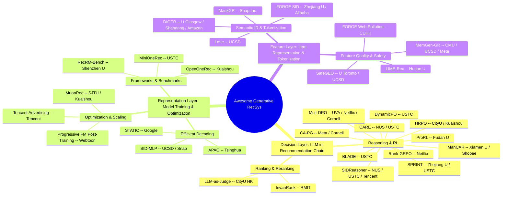

# Awesome Generative Recommendation System (RecSys)

```
 ██████╗                ██████╗                ███████╗                
██╔════╝  ███╗  ███╗    ██╔══██╗ ███╗   ███╗   ██╔════╝██╗ ██╗ ██████╗ 
██║      ██╔═██╗████╗   ██████╔╝██╔═██╗██╔═██╗ ███████╗╚██╗██║ ██╔═══╝ 
██║  ███╗██████║██╔██╗  ██╔══██╗██████║██║ ╚═╝ ╚════██║ ╚███╔╝ ██████╗ 
██║   ██║██║    ██║╚██╗ ██║  ██║██║    ██║ ██╗      ██║  ██╔╝      ██║
╚██████╔╝╚████╗ ██║ ╚██╗██║  ██║╚████╗ ╚███╔═╝ ███████║  ██║   ██████║
 ╚═════╝  ╚═══╝ ╚═╝  ╚═╝╚═╝  ╚═╝ ╚═══╝  ╚══╝   ╚══════╝  ╚═╝   ╚═════╝
```
---

[](https://github.com/sindresorhus/awesome)

RecSys is starting to adopt LLM for feature extraction, retrieval, and ranking/re-ranking! Although you can get some hands-on materials in either the [classics](#papers-classic-must-read) or some surveys, but since you're already interested in applying generative AI to industrial tasks, you probably wanna stay on the bleeding edge, right? That's exactly what this repo is for — automatically updated daily by agents with the latest generative RecSys papers fresh off arXiv, making sure that you never miss a beat.

> [!IMPORTANT]
> For those who are not familiar with GenRec, or not even the recommendation system, please checkout the kickstart posts [here](docs/kickstart.md).
> These posts are in Chinese, for English simply do your browser's internal translation or turn to __Ask Gemini__ :shipit:

## Quick Indexing
- [By Date](#by-date)
- [By Opensource](#by-opensource)
- [By Keyword](#by-keyword)
- [By Affiliation](#by-affiliation)


```mermaid
mindmap
  root((Awesome Generative RecSys))
    Decision Layer: LLM in Recommendation Chain
      Reasoning & RL
        Rank-GRPO -- Netflix
        DynamicPO -- USTC
        BLADE -- USTC
        SPRINT -- Zhejiang U / USTC
        CARE -- NUS / USTC
        HRPO -- CityU / Kuaishou
        Mult-DPO -- UVA / Netflix / Cornell
        CA-PG -- Meta / Cornell
        ProRL -- Fudan U
        ManCAR -- Xiamen U / Shopee
        SIDReasoner -- NUS / USTC / Tencent
      Ranking & Reranking
        InvariRank -- RMIT
        LLM-as-Judge -- CityU HK
    Representation Layer: Model Training & Optimization
      Frameworks & Benchmarks
        MiniOneRec -- USTC
        OpenOneRec -- Kuaishou
        RecRM-Bench -- Shenzhen U
      Efficient Decoding
        STATIC -- Google
        APAO -- Tsinghua
        SID-MLP -- UCSD / Snap
      Optimization & Scaling
        MuonRec -- SJTU / Kuaishou
        Tencent Advertising -- Tencent
        Progressive FM Post-Training -- Webtoon
    Feature Layer: Item Representation & Tokenization
      Semantic ID & Tokenization
        Latte -- UCSD
        FORGE SID -- Zhejiang U / Alibaba
        DIGER -- U Glasgow / Shandong / Amazon
        MaskGR -- Snap Inc.
      Feature Quality & Safety
        SafeGEO -- U Toronto / UCSD
        MemGen-GR -- CMU / UCSD / Meta
        FORGE Web Pollution -- CUHK
        LIME-Rec -- Hunan U
```
<div align="center">
  <i> Open-source Generative RecSys Map </i>
</div>

---
## By Date

### Papers August 14

*Friday, August 14, 2026. Arxiv active. cs.IR Aug 13 listing returned 5 genrec/recsys papers. Total: 5 papers.*

1. **FSGR: Mitigating Token Frequency Bias for Fair SID-Based Generative Recommendation**
   * Affiliation: Nankai University — *(Yuchen Zheng, Sihan Xu, Jingwen Yang, Xiangrui Cai, Haiwei Zhang, Xiaojie Yuan)*
   * Link: [arxiv.org/abs/2608.12845](https://arxiv.org/abs/2608.12845)
   * Venue: arXiv preprint, August 2026
   * TL;DR: Diagnoses "Token Frequency Bias" in SID genrec — high-frequency SID tokens are systematically over-predicted while low-frequency tokens are under-predicted; FSGR rebalances the SID representation space (OT-based assignment + dual-criteria re-anchor) and adds two-stage training with hierarchical frequency calibration, achieving >20% Gini fairness improvement while maintaining accuracy.
   * Key techniques:
     - Token Frequency Bias diagnosis: over/under-prediction of high/low-frequency SID tokens from imbalanced codebooks + popularity bias + MLE objective
     - OT-based Assignment Optimization + Dual-Criteria Re-anchor for a balanced SID representation space during construction
     - Two-stage training + Hierarchical Frequency Calibration for layer-specific fairness fine-tuning
     - >20% average Gini fairness improvement across 3 datasets and 3 backbones while maintaining competitive accuracy
   * Scores (Opensource? / Novelty / Fairness / Robustness / Impact):
     - **Opensource?: 0/10** — No public code available
     - **Novelty: 7/10** — First to diagnose token frequency bias in SID genrec; OT-based re-anchor + hierarchical frequency calibration is principled
     - **Fairness: 8/10** — Directly targets fairness (token frequency bias → item-category exposure fairness) with quantified Gini gains
     - **Robustness: 5/10** — 3 public datasets × 3 backbone models; no venue/peer review yet
     - **Impact: 6/10** — Nankai (Xiaojie Yuan); opens fairness direction for SID-based genrec

2. **STAR: Structured Tokenization and Target-Aware Interest Representation for PCVR Prediction**
   * Affiliation: Tsinghua University / Peking University — *(Yimeng Xu, Yingqi Song, Ying Jiang, Lan Ma — Tsinghua; Ruihao Zhang — Peking University)*
   * Link: [arxiv.org/abs/2608.12986](https://arxiv.org/abs/2608.12986)
   * Venue: KDD Cup 2026 Tencent UniRec Challenge (workshop)
   * TL;DR: Practical PCVR ranking framework combining structured feature tokenization with target-aware interest representation on a HyFormer-style multi-sequence backbone; high-cardinality signal recovery, explicit user-item interaction tokens, target-aware sequence decoding, and InfoNCE-inspired contrastive objective; identifies temporal context as the largest contributor to ranking AUC.
   * Key techniques:
     - Structured feature tokenization on a HyFormer-style multi-sequence backbone unifying sequence modeling + feature interaction
     - High-cardinality signal recovery + explicit user-item interaction tokens for sparse features
     - Target-aware sequence decoding + weighted user-item contrastive auxiliary objective (InfoNCE-inspired)
     - Train-inference pipeline alignment via reconstruction of feature remapping tables from saved config
   * Scores (Opensource? / Novelty / Fairness / Robustness / Impact):
     - **Opensource?: 0/10** — No public code available
     - **Novelty: 5/10** — Practical challenge solution; tokenization + target-aware interest representation is incremental
     - **Fairness: 3/10** — Not addressing fairness (ethics note flags monitoring before production)
     - **Robustness: 5/10** — Challenge leaderboard-style offline evaluation; no online A/B
     - **Impact: 5/10** — KDD Cup 2026 Tencent UniRec; Tsinghua/PKU; practical PCVR ranking blueprint

3. **Generative Universal Multimodal Retrieval with Dual-role Identifiers (DrIG)**
   * Affiliation: University of Tsukuba — *(Kaipeng Li, Haitao Yu, Xuanchen Zhou)*
   * Link: [arxiv.org/abs/2608.12987](https://arxiv.org/abs/2608.12987)
   * Venue: arXiv preprint, August 2026 (under review)
   * TL;DR: Generative multimodal retrieval where each candidate gets one residual-quantized identifier playing a sequential role (autoregressive decode; first token = modality) and a set-based role (unordered set providing a prefix-independent relevance prior that guides beam search); outperforms SOTA generative multimodal baselines on M-BEIR.
   * Key techniques:
     - Dual-role identifiers: sequential role (AR decoding with modality token + progressive semantics) + set-based role (prefix-independent relevance prior)
     - Set-based prior guides constrained beam search to alleviate prefix-level/local-optimum errors
     - Hybrid reranking for efficiency-effectiveness tradeoff vs. dense retrievers
     - Scaling/ablation analysis over base LMM, beam size, reranking depth, fusion strategy
   * Scores (Opensource? / Novelty / Fairness / Robustness / Impact):
     - **Opensource?: 0/10** — No public code available
     - **Novelty: 6/10** — Dual-role identifier with set-based prefix-independent prior is a clean, novel idea
     - **Fairness: 3/10** — Not addressing fairness
     - **Robustness: 5/10** — M-BEIR + text-to-image benchmarks; under review
     - **Impact: 6/10** — U Tsukuba (Haitao Yu); advances generative multimodal retrieval

4. **DrEM: Dual-Side Robust Ensemble Ranking from Noisy User Preference Predictions in Video Recommendation**
   * Affiliation: Shenzhen University / Kuaishou Technology — *(Canwei Huang, Tiantian He, Xiaoxiao Xu, Jun Zhang, Ziran Deng, Weike Pan, Chunjie Chen, Kaiqiao Zhan)*
   * Link: [arxiv.org/abs/2608.12778](https://arxiv.org/abs/2608.12778)
   * Venue: arXiv preprint, August 2026
   * TL;DR: Addresses prediction noise in multi-task pxtr signals used for ensemble ranking; risk-denoising robust loss corrects empirical risk using estimated preference flip probability (supervision side) + perturbation sampling with a preference-preserving ranking consistency regularizer (feature side); theoretical robustness proof + online A/B.
   * Key techniques:
     - Risk-denoising robust loss: corrects empirical risk using estimated preference flip probability
     - Preference-preserving ranking consistency regularizer for feature-side output stability
     - Perturbation sampling from the prediction-noise distribution
     - Theoretical proof of robustness under flip-probability estimation error
   * Scores (Opensource? / Novelty / Fairness / Robustness / Impact):
     - **Opensource?: 0/10** — No public code available
     - **Novelty: 6/10** — Dual-side (supervision + feature) noise handling in ensemble ranking is novel
     - **Fairness: 3/10** — Not addressing fairness
     - **Robustness: 7/10** — Theoretical analysis + offline experiments + large-scale online A/B
     - **Impact: 6/10** — Kuaishou/SZU; practical robust ensemble ranking for industrial video rec

5. **TimeRoute: Time-Aware Modality Routing and Diffusion for Multi-Modal Recommendation**
   * Affiliation: University of Amsterdam / University of Hong Kong / Aarhus University — *(Pengyu Zhang, Congfeng Cao, Paul Groth — UvA; Yangqin Jiang — HKU; Klim Zaporojets — Aarhus)*
   * Link: [arxiv.org/abs/2608.10983](https://arxiv.org/abs/2608.10983)
   * Venue: arXiv preprint, August 2026
   * TL;DR: Modality usefulness drifts over time at different rates (e.g., text→visual cues around holidays); temporal-aware modal router maps behavioral features to a personalized modality distribution, and a diffusion-based graph reconstructor conditioned via FiLM with dual-stream long/short-term denoising heads suppresses outdated modality edges; up to 9.8% improvement.
   * Key techniques:
     - Temporal-aware modal router: personalized modality distribution replacing globally shared fusion weights
     - Diffusion-based graph reconstructor with Feature-wise Linear Modulation (FiLM) + dual-stream long/short-term denoising heads
     - Suppresses outdated modality edges before they enter the propagation graph
     - 10-seed paired tests; up to 9.8% Recall/Precision/NDCG gains
   * Scores (Opensource? / Novelty / Fairness / Robustness / Impact):
     - **Opensource?: 3/10** — [anonymous.4open.science/r/TimeRoute](https://anonymous.4open.science/r/TimeRoute) — anonymous repo for double-blind review; not a permanent public release
     - **Novelty: 6/10** — Time-aware modality routing + diffusion for multimodal rec is well-motivated
     - **Fairness: 3/10** — Not addressing fairness
     - **Robustness: 5/10** — TikTok + Amazon datasets; 10-seed paired tests; preprint
     - **Impact: 5/10** — UvA (Paul Groth); practical multimodal rec with temporal modality dynamics

### Papers August 13

*Thursday, August 13, 2026. Arxiv active. cs.IR Aug 12 listing returned 5 genrec/recsys papers. Total: 5 papers.*

1. **HCGRec: Hint-Conditioned Generative Recommendation with Semantic IDs**
   * Affiliation: Shanghai Jiao Tong University / Huawei Noah's Ark Lab — *(Kangning Zhang, Haotian Fang, Xukun Luo, Hao Yin, Yang Gao, Peng Yan, Weiwen Liu, Weinan Zhang, Yong Yu)*
   * Link: [arxiv.org/abs/2608.11980](https://arxiv.org/abs/2608.11980)
   * Venue: CIKM 2026
   * TL;DR: Diagnoses the "zero-advantage" bottleneck in reward-based post-training of SID genrec — when an early semantic token enters the wrong branch, rollout groups miss the ground-truth item and receive identical zero rewards; supplies minimal target-prefix hints only for hard instances, then uses hint-aware credit decomposition (supervised for hinted tokens, GRPO for sampled suffix).
   * Key techniques:
     - Checkpoint-rollout diagnosis: supplies a minimal target-prefix hint only when the current generator cannot reach the correct item
     - Hint-aware credit decomposition: supervised learning preserves item-semantic/prefix-structure alignment for hinted tokens; GRPO optimizes the sampled suffix
     - Turns zero-reward groups into informative comparisons over item-token completions
     - Reduces zero-advantage training samples from over 70% to below 20%
   * Scores (Opensource? / Novelty / Fairness / Robustness / Impact):
     - **Opensource?: 1/10** — [github.com/WncFht/GRec](https://github.com/WncFht/GRec) — code link provided in paper but repo returns 404 (not yet public)
     - **Novelty: 7/10** — First to diagnose and treat the zero-advantage training failure in SID genrec; hint-conditioned generation is a clean, well-motivated fix
     - **Fairness: 3/10** — Not addressing fairness
     - **Robustness: 6/10** — CIKM 2026 peer-reviewed; sequential recommendation benchmarks; consistent gains over SFT + vanilla reward-based post-training
     - **Impact: 6/10** — CIKM 2026; SJTU (Weinan Zhang); practical post-training fix applicable to any SID-based genrec

2. **Token-Level Credit Assignment Optimization for Generative Document Retrieval**
   * Affiliation: Shandong University — *(Xinpeng Zhao, Yang Liu, Ran Chen, Xinyu Ma, Daiting Shi, Pengjie Ren, Zhumin Chen, Zhaochun Ren, Xin Xin)*
   * Link: [arxiv.org/abs/2608.12049](https://arxiv.org/abs/2608.12049)
   * Venue: arXiv preprint, August 2026
   * TL;DR: Fine-grained RL framework replacing sequence-level rewards with token-level relevance rewards for generative (DocID) retrieval; estimates step-wise rewards by measuring how each token decision changes the expected retrieval quality of the generation trajectory.
   * Key techniques:
     - Token-level relevance rewards: step-wise reward estimation measuring per-token impact on expected retrieval quality
     - Precise credit assignment favoring token decisions that contribute directly to document-level relevance
     - Practical reward-estimation strategies tailored to the autoregressive DocID generation process
     - Policy optimization integrating fine-grained supervision to align decoding with retrieval objectives
   * Scores (Opensource? / Novelty / Fairness / Robustness / Impact):
     - **Opensource?: 0/10** — No public code available
     - **Novelty: 6/10** — Token-level (vs sequence-level) RL rewards for generative retrieval is a clean, under-explored idea
     - **Fairness: 3/10** — Not addressing fairness
     - **Robustness: 5/10** — Retrieval benchmarks; consistently outperforms sequence-level reward baselines; no venue/peer review yet
     - **Impact: 5/10** — Shandong U; practical RL credit-assignment improvement for generative retrieval

3. **Making Collaborative Signals Count: Graph-Aware Large Language Models for Sequential Recommendation (GALLM)**
   * Affiliation: Zhejiang University — *(Fenglin Yan, Bohao Wang, Jian Zhang, Yu Cui, Tongya Zheng, Ye Feng, Can Wang, Jiawei Chen)*
   * Link: [arxiv.org/abs/2608.12184](https://arxiv.org/abs/2608.12184)
   * Venue: arXiv preprint, August 2026
   * TL;DR: Graph-aware LLM framework building a collaborative graph over text tokens + item tokens with three relation types (Text-Text, Item-Text, Item-Item), turned into lightweight learnable attention biases — no additional graph encoder needed.
   * Key techniques:
     - Collaborative graph over text tokens + item tokens modeling three relation types
     - Lightweight learnable attention biases injected into the LLM attention mechanism for collaborative-aware token interactions
     - Item-Item relations derived from global item co-occurrence patterns across users
     - No additional graph encoder; +9.76% average HR@5 over strongest baseline on 4 benchmarks
   * Scores (Opensource? / Novelty / Fairness / Robustness / Impact):
     - **Opensource?: 0/10** — No public code available
     - **Novelty: 5/10** — Graph-aware attention biases for LLM seqrec are practical; conceptually incremental
     - **Fairness: 3/10** — Not addressing fairness
     - **Robustness: 5/10** — 4 real-world benchmarks; consistent gains; no venue/peer review yet
     - **Impact: 5/10** — Zhejiang U; practical integration of collaborative signals into LLM-based sequential rec

4. **From Overlooked to Explored: Recovering Item Relations via Mixture of Perspectives for Sequential Recommendation (PRISM)**
   * Affiliation: POSTECH — *(Junyoung Kim, Wonbin Kweon, Woojoo Kim, Jaehyung Lim, Dongha Kim, Hwanjo Yu)*
   * Link: [arxiv.org/abs/2608.11846](https://arxiv.org/abs/2608.11846)
   * Venue: CIKM 2026
   * TL;DR: Diagnoses similarity bias in transformer sequential rec (dot-product attention over-favors similar items, overlooking heterogeneous relations with meaningful preference signals); proposes PRISM with K Perspective Lenses combining an Affinity View (homogeneous) and a Contrast View (heterogeneous) to calibrate attention.
   * Key techniques:
     - Similarity-bias diagnosis: dot-product attention scores disproportionately favor similar items across transformer-based SR models
     - K Perspective Lenses calibrating attention from distinct viewpoints
     - Affinity View (homogeneous relations) + Contrast View (heterogeneous relations suppressed by bias)
     - 7 real-world benchmarks; consistently outperforms SOTA baselines
   * Scores (Opensource? / Novelty / Fairness / Robustness / Impact):
     - **Opensource?: 6/10** — [github.com/327aem/PRISM](https://github.com/327aem/PRISM) — 1⭐, 9 commits; functional code (train/trainer/dataset/metrics) with training scripts; minimal README, no license
     - **Novelty: 5/10** — Multi-perspective attention calibration is practical; conceptually incremental
     - **Fairness: 3/10** — Not addressing fairness
     - **Robustness: 6/10** — CIKM 2026 peer-reviewed; 7 benchmarks; consistent SOTA
     - **Impact: 5/10** — CIKM 2026; POSTECH; practical attention fix for sequential recommendation

5. **Are We Really Making Progress in Group Recommendation? Unmasking the Tie-Breaking Illusion**
   * Affiliation: National Taiwan University — *(Song-Duo Ma, Pu-Jen Cheng)*
   * Link: [arxiv.org/abs/2608.11190](https://arxiv.org/abs/2608.11190)
   * Venue: RecSys 2026
   * TL;DR: Shows recent group rec improvements are inflated by a systematic evaluation bias from training-time score compression + deterministic tie-breaking; proposes tie-aware evaluation computing the exact expectation of HR@K/NDCG@K under uniform random tie-breaking; finds many reported gains shrink substantially.
   * Key techniques:
     - Tie-breaking bias diagnosis: sigmoid-before-BPR inflates tied top scores, making HR@K/NDCG@K highly sensitive to tie resolution
     - Tie-aware protocol: exact expectation of HR@K/NDCG@K under uniform random tie-breaking
     - Re-evaluation of 5 recent methods + 6 baselines on CAMRa2011 and Mafengwo (group + user settings)
     - Temperature-scaled BPR (τ-BPR) retains smoothing benefit without severe tie inflation
   * Scores (Opensource? / Novelty / Fairness / Robustness / Impact):
     - **Opensource?: 7/10** — [github.com/songduoma/TieAwareGroupRec](https://github.com/songduoma/TieAwareGroupRec) — 0⭐, 18 commits; publication-grade README with full reproduction for 5 methods + 6 baselines
     - **Novelty: 6/10** — First to isolate tie-breaking as a systematic evaluation confound in group rec; tie-aware protocol is an important diagnostic
     - **Fairness: 4/10** — Establishes reliable, unbiased evaluation for group rec benchmarks (indirect fairness)
     - **Robustness: 7/10** — RecSys 2026 peer-reviewed; tie-aware protocol; multiple methods + datasets
     - **Impact: 6/10** — RecSys 2026; NTU; important diagnostic for reliable group recommendation evaluation

### Papers August 12

*Wednesday, August 12, 2026. Arxiv active. cs.IR Aug 11-12 listing returned 7 genrec papers. Total: 7 papers.*

1. **FedCGR: Federated Cross-Domain Generative Recommendation**
   * Affiliation: Qiyuan Lab / Beihang University — *(Zhuodong Liu, Hugen Lv, Xiangyu Li, Bohan Guo, Peiyu Hu — Qiyuan Lab/BUAA)*
   * Link: [arxiv.org/abs/2608.10929](https://arxiv.org/abs/2608.10929)
   * Venue: CIKM 2026
   * TL;DR: First federated cross-domain generative recommendation framework; represents items as discrete SID sequences from public metadata for cross-domain alignment; reliability-aware semantic interface injects local CF evidence; prototype-personalized generator selectively aggregates shared parameters by domain relatedness.
   * Key techniques:
     - Stable SID vocabulary from public item-side metadata for cross-client token consistency without privacy leakage
     - Reliability-aware semantic interface injecting local collaborative filtering signals into fixed-tokenizer bottleneck
     - Prototype-personalized generator: selective aggregation of shared parameters according to domain relatedness
     - Federated CDR reformulated as generation over shared SID language avoiding behavioral anchor dependency
   * Scores (Opensource? / Novelty / Fairness / Robustness / Impact):
     - **Opensource?: 0/10** — No public code available
     - **Novelty: 6/10** — First to combine federated CDR with generative SID-based recommendation; reliability-aware interface is practical
     - **Fairness: 3/10** — Not addressing fairness
     - **Robustness: 6/10** — CIKM 2026; 6 Amazon cross-domain scenarios; consistent outperformance vs. federated generative + sequential/CDR baselines
     - **Impact: 6/10** — CIKM 2026; Qiyuan Lab/BUAA; opens federated generative cross-domain recommendation direction

2. **Towards Efficient Reasoning in LLM-Based Recommender Systems via Model Merging (REAM)**
   * Affiliation: University of Queensland — *(Linh Dieu Le, Tong Chen, Shazia Sadiq, Hongzhi Yin, Ming Jin, Junliang Yu — UQ)*
   * Link: [arxiv.org/abs/2608.10447](https://arxiv.org/abs/2608.10447)
   * Venue: arXiv preprint, August 2026
   * TL;DR: First training-free model merging framework for reasoning compression in LLM recsys; attention-head-level merging with retrieval-criticality + decision-faithfulness + update-sensitivity signals; -24.3% reasoning length while maintaining accuracy.
   * Key techniques:
     - Head-level merge coefficients: distinct per attention head based on retrieval criticality, decision faithfulness, and update sensitivity
     - Constrained water-filling allocation for coefficient optimization
     - Merging slow-thinking (verbose reasoning) with fast-thinking (direct prediction) models in shared parameter space
     - Training-free: no adaptation cost or brittle inference-time methods needed
   * Scores (Opensource? / Novelty / Fairness / Robustness / Impact):
     - **Opensource?: 4/10** — [github.com/linhledieu/REAM](https://github.com/linhledieu/REAM) — 0⭐, 6 commits, no license; clean 4-stage pipeline (head_reasoning_aware → update_sensitivity → allocation → merge) with run.py driver; maps code to paper sections; minimal documentation, no deps/requirements listed, no paper citation
     - **Novelty: 6/10** — First model merging for reasoning compression in recsys; head-level coefficients are novel vs. uniform merging
     - **Fairness: 3/10** — Not addressing fairness
     - **Robustness: 5/10** — 3 benchmark datasets; consistent -24.3% reasoning length; no venue/peer review yet
     - **Impact: 5/10** — UQ; practical efficiency contribution for LLM-based rec deployment

3. **GenRec: An LLM-Backed Recommendation Ranker at Netflix**
   * Affiliation: Netflix — *(Ying Li, Shradha Sehgal, Arjun Rao, Rein Houthooft, Yaochen Zhu, Ashish Rastogi — Netflix)*
   * Link: [arxiv.org/abs/2608.10257](https://arxiv.org/abs/2608.10257)
   * Venue: arXiv preprint, August 2026
   * TL;DR: Two-phase LLM-backed ranker: Phase 1 adapts open-source LLM to Netflix catalog, Phase 2 post-trains with ranking-specific data/rewards; prefill-only inference for cost-constrained serving; large-scale A/B shows significant gains over production ranker with fewer labeled examples and input signals.
   * Key techniques:
     - Two-phase framework: catalog adaptation (understanding + instruction-following) → ranking alignment (reward signals + business objectives)
     - Input verbalization: user histories and context as natural language instead of thousands of engineered features
     - Prefill-only inference: cost-constrained serving design avoiding autoregressive decode overhead
     - Paradigm shift: from feature engineering → context engineering; from bespoke architectures → shared foundation backbones
   * Scores (Opensource? / Novelty / Fairness / Robustness / Impact):
     - **Opensource?: 0/10** — No public code available; built on in-house Netflix foundational LLM
     - **Novelty: 5/10** — LLM-based ranking at Netflix scale with prefill-only serving is practically significant; conceptually builds on known LLM rec paradigms
     - **Fairness: 3/10** — Not addressing fairness
     - **Robustness: 8/10** — Large-scale A/B at Netflix vs. production ranker; statistically significant offline + online gains
     - **Impact: 8/10** — Netflix; paradigm-shifting for industrial recommendation — first detailed account of LLM-backed ranking at major streaming platform

4. **ConnectionMind: Leveraging Social Networks and Large Language Models for Personalized Recommendation at Meta**
   * Affiliation: Meta / Michigan State University — *(Haoyu Han, Yuming Liu, Lei Huang, Lizhu Zhang, Xiangjun Fan — Meta; Jiliang Tang — MSU)*
   * Link: [arxiv.org/abs/2608.10187](https://arxiv.org/abs/2608.10187)
   * Venue: arXiv preprint, August 2026
   * TL;DR: Integrates heterogeneous social graph (users, items, friends, groups, creators) with LLM-based reasoning policy; formulates rec as graph reasoning problem discovering personalized paths; two-stage SFT+RL training; deployed at Meta: +0.43% video watch time.
   * Key techniques:
     - Heterogeneous graph connecting users, items, friends, groups, and creator pages
     - LLM-based policy reasoning over graph structures to discover personalized user→item paths
     - Two-stage: SFT on user-item interaction trajectories → end-to-end RL for social graph reasoning refinement
     - Production deployment: measurable real-world impact in Meta's recommendation pipeline
   * Scores (Opensource? / Novelty / Fairness / Robustness / Impact):
     - **Opensource?: 0/10** — No public code available
     - **Novelty: 6/10** — First to tightly integrate heterogeneous social graph + LLM reasoning for rec; graph-as-reasoning formulation is novel
     - **Fairness: 3/10** — Not addressing fairness
     - **Robustness: 7/10** — Production A/B at Meta; +0.43% video watch time; multiple real-world datasets
     - **Impact: 7/10** — Meta; production-proven LLM+social-graph recommendation at massive scale

5. **Do LLM Recommenders Know When They're Hallucinating? Auditing Confidence Calibration in Catalog Faithfulness**
   * Affiliation: Amazon — *(Srijith Ravikumar — Amazon)*
   * Link: [arxiv.org/abs/2608.10008](https://arxiv.org/abs/2608.10008)
   * Venue: arXiv preprint, August 2026
   * TL;DR: First joint audit of OOD hallucination rate + verbalized confidence calibration in zero-shot LLM rec; finds systematic under-confidence across all 4 LLMs (opposite of typical over-confidence); conformal abstention fails to filter hallucinations — "Just Ask" elicits generic quality rating, not catalog-membership probability.
   * Key techniques:
     - Joint audit framework: hallucination rate (OOD@10) + confidence calibration (ECE, Brier, reliability diagrams)
     - 4 LLMs (Mistral, Llama-3.3, GPT-OSS, Claude) × 3 catalogs (MovieLens, Amazon, Yelp) × popularity strata
     - Counterintuitive finding: all LLMs systematically under-confident (67-86/100 confidence on 92-100% accurate items)
     - Elicitation mismatch diagnosis: generic confidence prompts fail; recommend catalog-anchored elicitation
   * Scores (Opensource? / Novelty / Fairness / Robustness / Impact):
     - **Opensource?: 0/10** — No public code available
     - **Novelty: 7/10** — First joint hallucination+calibration audit for LLM rec; under-confidence finding is counterintuitive and important
     - **Fairness: 3/10** — Not addressing fairness
     - **Robustness: 6/10** — 4 LLMs × 3 catalogs; systematic across all cells; solo author, no peer review yet
     - **Impact: 6/10** — Amazon; important diagnostic for LLM rec safety and reliability; practical guidance for catalog-grounded evaluation

6. **Structure-Preserving Projection for Mitigating Modality Bias in LLM-Based Sequential Recommendation**
   * Affiliation: National Taiwan University — *(Tzu-Wei Chiu, Song-Duo Ma, Hsin-Yu Lin, Pu-Jen Cheng — NTU)*
   * Link: [arxiv.org/abs/2608.08583](https://arxiv.org/abs/2608.08583)
   * Venue: RecSys 2026
   * TL;DR: Identifies modality bias when projecting collaborative embeddings into LLM space distorts relational geometry; proposes structure-preserving projection with dedicated losses maintaining collaborative structure; consistent improvements for LLM-based sequential rec.
   * Key techniques:
     - Modality bias diagnosis: projecting collaborative embeddings into LLM space distorts underlying collaborative structure
     - Structure-preserving losses: dedicated objectives maintaining relational geometry of collaborative embeddings during projection
     - Plug-and-play approach compatible with existing LLM-based recommenders
   * Scores (Opensource? / Novelty / Fairness / Robustness / Impact):
     - **Opensource?: 0/10** — No public code available
     - **Novelty: 5/10** — Structure-preserving projection is a practical fix for modality bias; conceptually incremental
     - **Fairness: 3/10** — Not addressing fairness
     - **Robustness: 6/10** — RecSys 2026 peer-reviewed; consistent improvements across experiments
     - **Impact: 5/10** — RecSys 2026; NTU; practical fix for LLM-based sequential rec with modality bias

7. **Personalized Communication Skills for Agentic Recommender Systems (AgentCom)**
   * Affiliation: Chongqing University / University of Queensland — *(Zongwei Wang, Min Gao, Guangyu Hu, Xinyi Gao — CQU; Junliang Yu — UQ)*
   * Link: [arxiv.org/abs/2608.08417](https://arxiv.org/abs/2608.08417)
   * Venue: arXiv preprint, August 2026
   * TL;DR: Introduces advisor agents with diverse histories to overcome perspective narrowing in agentic rec; organizes communication skills into why-what-how-who skill bank; personalized skill routing + failure-driven skill evolution; consistent gains across traditional, social, and agentic recommenders.
   * Key techniques:
     - Advisor agents: other users whose diverse histories provide complementary evidence for overlooked preferences
     - Why-what-how-who skill bank: why (decision deficiency) → what (information task) → how (interaction protocol) → who (advisor retrieval)
     - Personalized skill routing: sequentially selects suitable skills per user and recommendation context
     - Failure-driven skill evolution: learns from unsuccessful communication cases to enrich shared skill bank
   * Scores (Opensource? / Novelty / Fairness / Robustness / Impact):
     - **Opensource?: 0/10** — No public code available
     - **Novelty: 6/10** — First personalized communication skill framework for agentic rec; why-what-how-who decomposition is well-designed
     - **Fairness: 3/10** — Not addressing fairness
     - **Robustness: 5/10** — Multiple rec paradigms (traditional, social, agentic); failure-driven evolution; no venue/peer review yet
     - **Impact: 6/10** — CQU/UQ; extends agentic rec paradigm with personalized communication; practical for multi-agent rec systems

### Papers August 11

*Tuesday, August 11, 2026. Arxiv active. cs.IR Aug 10-11 new listing returned 6 genrec papers. Total: 6 papers.*

1. **Preserving Item Semantics for Free: Rethinking Token Initialization in LLM-Based Generative Recommendation**
   * Affiliation: Snap Inc. / University of Michigan — *(Donald Loveland, Liam Collins, Bhuvesh Kumar, Neil Shah — Snap Inc.; Danai Koutra — UMich)*
   * Link: [arxiv.org/abs/2608.07816](https://arxiv.org/abs/2608.07816)
   * Venue: arXiv preprint, August 2026
   * TL;DR: Simple parameter-free centroid initialization for SID tokens eliminates random Gaussian init; shows random init causes embeddings to organize around popularity instead of semantics; centroid init improves Recall@5 up to 16%, cold-item Recall@5 up to 60%, reaches peak with 40% fewer SFT steps.
   * Key techniques:
     - Centroid Initialization: initializes SID token embeddings directly from k-means centroids in semantic embedding space; parameter-free, drop-in replacement
     - Diagnostic probes: Neighborhood Purity, Spectral Scale, Latent Signal Encoding quantifying popularity vs. semantic organization
     - Matryoshka-compatible: exploits MRL for dimension matching via truncation to leading dimensions
     - Residual k-means quantization for SID construction (not RQ-VAE)
   * Scores (Opensource? / Novelty / Fairness / Robustness / Impact):
     - **Opensource?: 0/10** — No public code available
     - **Novelty: 7/10** — First systematic diagnosis of random SID init failure mode; centroid init is elegantly simple and effective
     - **Fairness: 3/10** — Not addressing fairness
     - **Robustness: 6/10** — 3 datasets; consistent gains across SFT + CPT regimes; gradient analysis provides theoretical grounding
     - **Impact: 6/10** — Snap Inc./UMich; simple practical fix for any LLM-based GR; cold-item improvement especially valuable

2. **PushDualGen: Enabling LLMs to Generate Semantic IDs with Interpretable Copy for Industrial Push Recommendation**
   * Affiliation: Kuaishou Technology — *(Manjia Lin, Da Li, Yan Wang, Yong Jin, Zheming Ding, Wei Yuan, Lei Yan, Yanan Xia, Lu Zhang, Fan Yang, Xuanping Li, Yanan Niu — Kuaishou)*
   * Link: [arxiv.org/abs/2608.07989](https://arxiv.org/abs/2608.07989)
   * Venue: arXiv preprint, August 2026
   * TL;DR: Lightweight LLM (Qwen3-0.6B) generates SIDs first then skippable interpretable copy for push recommendation; deployed at Kuaishou with +8.50% effective play rate, -37.70% dissatisfaction rate; long-tail video exposure improved.
   * Key techniques:
     - Parallel Semantic ID encoding: 8 parallel embedding slots with K-means quantization (M=8, K=512) using Qwen2.5-Omni-3B compression tokens
     - Scenario-Aware SID Adaptation: fine-tunes LLM with Text2SID + SID2Text tasks; multi-token binding merges frequent n-grams
     - Token Freeze: freezes original vocabulary during SID token training for stability
     - Representation Fusion: LLM-generated SID preference signals fused with user features for ANN search
   * Scores (Opensource? / Novelty / Fairness / Robustness / Impact):
     - **Opensource?: 0/10** — No public code available
     - **Novelty: 6/10** — First to deploy LLM-based SID generation for push recommendation with interpretable copy; parallel SID construction is practical
     - **Fairness: 4/10** — Long-tail video exposure improved (indirect provider fairness)
     - **Robustness: 8/10** — Production A/B at Kuaishou (1B+ users); +8.50% effective play rate; -37.70% dissatisfaction
     - **Impact: 7/10** — Kuaishou; practical LLM-based push genrec with verified business impact; interpretability is key differentiator

3. **MetaStrategy: Generative Ranking with Executable LLM Strategies**
   * Affiliation: Alibaba Group (Taobao) — *(Chengyu Lai, Jiuning Lin, Zhibo Xiao, Xiaodong Zhu, Ruiquan Lan, Bin Zhang, Zihong Huang, Wendong Zhang, Chuxin Chen, Yinjiang Cai, Shuai Zhong, Lingqing Zhang, Dimin Wang, Jialin Zhu, Han Zhu — Alibaba)*
   * Link: [arxiv.org/abs/2608.09440](https://arxiv.org/abs/2608.09440)
   * Venue: arXiv preprint, August 2026
   * TL;DR: LLM generates structured JSON ranking strategy (objective weights, category preferences, position policies) instead of item sequences; deterministic validator compiles into isolated Generator competing under list-level Evaluator; deployed on Taobao Homepage: +2.11% click PV, +3.12% IPV, +2.83% transaction amount, zero RT increase.
   * Key techniques:
     - Generative strategy paradigm: LLM emits typed JSON bundle (objective weights, content/category/experience constraints, position policies) rather than item sequences
     - Generator-Evaluator (GE) architecture: compiled strategy competes atomically with incumbents under list-level Evaluator
     - Production-path replay environment: trains on re-executed logged requests without user exposure
     - Evaluator-routed reward-augmented on-policy distillation: 4B Teachers → 0.8B Student
     - Self-competitive curriculum + selection/relative-rank/baseline-lift rewards
   * Scores (Opensource? / Novelty / Fairness / Robustness / Impact):
     - **Opensource?: 0/10** — No public code available
     - **Novelty: 7/10** — Novel paradigm: generate strategy not items; GE architecture with self-competitive curriculum is well-designed
     - **Fairness: 3/10** — Not addressing fairness
     - **Robustness: 8/10** — 7-day A/B at Taobao; +2.11%/3.12%/2.83% on PV/IPV/transaction; zero RT increase via diff-triggered nearline
     - **Impact: 8/10** — Alibaba Taobao; new paradigm for generative ranking applicable to any multi-objective industrial recommender

4. **TSPORec: Token Selection via Preference Optimization for LLM-Based Sequential Recommendation**
   * Affiliation: Zhejiang University / ByteDance — *(Wenqiao Zhu, Chao Xu, Haipang Wu, Ji Liu — ZJU/ByteDance)*
   * Link: [arxiv.org/abs/2608.09605](https://arxiv.org/abs/2608.09605)
   * Venue: arXiv preprint, August 2026
   * TL;DR: Pinpoints informative tokens from full item descriptions instead of truncating to first few; three-stage selection pipeline with proxy reward; +31.25% performance, +63.4% efficiency over 6 baselines.
   * Key techniques:
     - Token selection via preference optimization: identifies informative tokens across entire textual content
     - Three-stage pipeline for systematic token selection and filtering
     - Novel proxy reward mechanism guiding token selection process
     - Balances recommendation quality with computational efficiency without truncation-induced information loss
   * Scores (Opensource? / Novelty / Fairness / Robustness / Impact):
     - **Opensource?: 1/10** — [github.com/WNQzhu/TSPORec](https://github.com/WNQzhu/TSPORec) — empty repo (0 stars, 0 commits); placeholder only
     - **Novelty: 6/10** — Token selection over truncation is practical; proxy reward for preference optimization is clean
     - **Fairness: 3/10** — Not addressing fairness
     - **Robustness: 5/10** — 2 models × 2 datasets; consistent gains; no peer review or industrial validation
     - **Impact: 5/10** — ZJU/ByteDance; practical efficiency solution for LLM-based sequential rec

5. **IntHQ: Task-Interactive Hierarchical Query on Dual-Stream Representations for Generative Recommendation**
   * Affiliation: Amap / Alibaba Group — *(Junjie Sun, Longfei Xu, Huimin Yan, Wei Luo, Kaikui Liu, Xiangxiang Chu — Amap/Alibaba)*
   * Link: [arxiv.org/abs/2608.09634](https://arxiv.org/abs/2608.09634)
   * Venue: arXiv preprint, August 2026
   * TL;DR: First multi-task generative recommender identifying threefold collapse (source/relational/hierarchical); Dual-Stream Decoupling + Task-Interactive Modeling + Hierarchical Querying; deployed on Amap serving hundreds of millions of users: +1.60% UVCTR.
   * Key techniques:
     - Dual-Stream Decoupling (DSD): injects task identity early, separates shared context from task-specific stream alleviating signal dilution
     - Task-Interactive Modeling (TIM): replaces predefined funnel with explicit cross-task interaction; each task conditions on predecessors' outcomes with learned input-adaptive strength
     - Hierarchical Querying (HQ): each task gathers multi-scale information across different layers at different training stages
     - Threefold collapse diagnosis: source collapse (late signal injection), relational collapse (static funnel), hierarchical collapse (scale-stage mismatch)
   * Scores (Opensource? / Novelty / Fairness / Robustness / Impact):
     - **Opensource?: 0/10** — No public code available
     - **Novelty: 6/10** — First systematic diagnosis of multi-task collapse in genrec; three-component design is well-motivated
     - **Fairness: 3/10** — Not addressing fairness
     - **Robustness: 7/10** — 4 task-head configurations; production deployment at Amap with hundreds of millions of users
     - **Impact: 7/10** — Amap/Alibaba; practical multi-task generative recommendation with production validation

6. **InforID: Adaptive Semantic Capacity Allocation for Parallel Generative Recommendation**
   * Affiliation: University of Chinese Academy of Sciences / Institute of Automation, CAS — *(Chenxi Li, Yuchen Lu, Xu Yang — UCAS/CASIA)*
   * Link: [arxiv.org/abs/2608.09685](https://arxiv.org/abs/2608.09685)
   * Venue: arXiv preprint, August 2026
   * TL;DR: Identifies homogeneous SID structures waste capacity; adaptive allocation of fixed capacity budget across semantic slots jointly determines ID length + slot-specific codebook sizes; improved accuracy under comparable budgets with one-step parallel prediction.
   * Key techniques:
     - Adaptive semantic target construction: allocates fixed capacity budget across candidate semantic slots
     - Joint optimization of effective ID length and slot-specific codebook sizes
     - Demonstrates uniformly expanding semantic slots provides limited gains → capacity redundancy in homogeneous SIDs
     - One-step parallel prediction preserved; lightweight framework for parallel genrec
   * Scores (Opensource? / Novelty / Fairness / Robustness / Impact):
     - **Opensource?: 3/10** — [anonymous.4open.science/r/inforID-F582](https://anonymous.4open.science/r/inforID-F582) — anonymous repo; not a permanent public release
     - **Novelty: 6/10** — First to address heterogeneous capacity demands across semantic subspaces; adaptive allocation is practical
     - **Fairness: 3/10** — Not addressing fairness
     - **Robustness: 5/10** — Multiple datasets; comparable capacity budget comparison; no peer review yet
     - **Impact: 5/10** — UCAS/CASIA; practical contribution to parallel genrec but limited industrial validation

### Papers August 10

*Monday, August 10, 2026. Arxiv active. cs.IR Aug 10 listing returned 4 genrec papers (light day) + 1 missed July 27 paper from 3-month fallback (SID Understanding, UIUC). Total: 5 papers.*

1. **Progressive Alignment of Recommender Foundation Model through Multi-Phase Post-Training**
   * Affiliation: Webtoon (NAVER WEBTOON) — *(Oseong Choi, Hoeinn Kim, Jihoon Lee, Byungsoo Kang, Taeyeong Jang — Webtoon)*
   * Link: [arxiv.org/abs/2608.06792](https://arxiv.org/abs/2608.06792)
   * Venue: RecSys 2026 Industry Track
   * TL;DR: Three-phase progressive post-training (LP→FFT→RFT) decoupling downstream adaptation from business-metric alignment for recommender foundation models; reward-based RL fine-tuning uses learned reward model with dense implicit feedback; large-scale online A/B validated; code open-sourced.
   * Key techniques:
     - Three-phase framework: Linear Probing stabilizes heads in frozen FM space, Full Fine-Tuning jointly specializes, Reinforcement Fine-Tuning aligns with business objectives
     - Decoupled alignment: business-metric supervision used only for reward modeling — policy optimized on dense implicit feedback
     - Learned reward model avoids directly optimizing serving policy on sparse/noisy business targets
     - Reference implementation at github.com/webtoon/rec-fm-progressive-alignment (Apache 2.0)
   * Scores (Opensource? / Novelty / Fairness / Robustness / Impact):
     - **Opensource?: 5/10** — [github.com/webtoon/rec-fm-progressive-alignment](https://github.com/webtoon/rec-fm-progressive-alignment) — 3⭐, 1 commit, Apache 2.0; functional ref impl with clean modular structure (recfm/); runs on synthetic data; no pretrained weights or real dataset
     - **Novelty: 5/10** — Three-phase alignment is a practical methodology but conceptually incremental; decoupling adaptation from alignment is sensible engineering
     - **Fairness: 3/10** — Not addressing fairness
     - **Robustness: 7/10** — RecSys 2026 peer-reviewed; large-scale online A/B; production deployment validation
     - **Impact: 6/10** — RecSys 2026 Industry; Webtoon; practical post-training blueprint for FM-based recommendation systems

2. **From Classification to Recommendation: Empirical Analysis of Audio Embedding Models Application for Content-Based Music Recommendation**
   * Affiliation: Macquarie University — *(Qingrui Li, Haowei Lou, Chengkai Huang, Quan Z. Sheng, Lina Yao — Macquarie/UNSW)*
   * Link: [arxiv.org/abs/2608.06928](https://arxiv.org/abs/2608.06928)
   * Venue: arXiv preprint, August 2026
   * TL;DR: First systematic evaluation of audio embeddings across 3 recommendation paradigms (content-based, sequential, SID-based generative); increasing SID capacity does not consistently improve genrec and may introduce instability; practical guidance for audio encoder selection.
   * Key techniques:
     - Six representative audio encoders evaluated across three recommendation paradigms
     - Residual-quantization analysis: codebook width, quantization depth, retained SID prefixes
     - Key finding: audio-text-aligned and music-domain representations best when embedding geometry used directly; interaction-based training narrows encoder differences
     - Key finding: increased SID capacity does not consistently improve generative rec performance
   * Scores (Opensource? / Novelty / Fairness / Robustness / Impact):
     - **Opensource?: 0/10** — No public code available
     - **Novelty: 6/10** — First systematic audio embedding evaluation across SID-based genrec; capacity-instability finding is practically important
     - **Fairness: 3/10** — Not addressing fairness
     - **Robustness: 5/10** — 6 encoders × 3 paradigms on 2 music datasets; comprehensive but no venue/peer review yet
     - **Impact: 5/10** — Macquarie/UNSW; practical empirical guidance for music rec adopting genrec

3. **HD-Rec: Hierarchical Quantization with Domain-Adaptive Sparse Routing for Generative Cross-Domain Recommendation**
   * Affiliation: City University of Hong Kong / Kuaishou Technology — *(Haiying He, Kuo Cai, Bo Chen, Jingtong Gao, Yejing Wang, Ruiming Tang, Guorui Zhou, Han Li — Kuaishou; Xiaopeng Li, Yuchen Gu, Derong Xu, Xiangyu Zhao — CityU)*
   * Link: [arxiv.org/abs/2608.06997](https://arxiv.org/abs/2608.06997)
   * Venue: arXiv preprint, August 2026
   * TL;DR: First generative cross-domain recommendation framework; hierarchical domain-aware quantizer with shared coarse + adaptively routed fine codebooks; domain-adaptive sparse MoE combining shared + specialized experts; cross-granularity routing consistency objective.
   * Key techniques:
     - Hierarchical Domain-Aware Quantizer: globally shared coarse-level codebooks + adaptively routed fine-level codebooks for domain-specific granularity
     - Domain-Adaptive Sparse MoE: continuously activated shared expert + dynamically selected specialized expert per domain
     - Cross-Granularity Routing Consistency: regularizes token-level routing toward item-level consensus for coherent multi-token representations
     - Unified generative framework handling heterogeneous item semantics and behavioral patterns across domains
   * Scores (Opensource? / Novelty / Fairness / Robustness / Impact):
     - **Opensource?: 0/10** — No public code available
     - **Novelty: 7/10** — First generative cross-domain rec with hierarchical domain-aware SID construction; MoE + routing consistency is well-designed
     - **Fairness: 3/10** — Not addressing fairness
     - **Robustness: 6/10** — 3 public cross-domain benchmarks; consistent gains over sequential, generative, and cross-domain baselines
     - **Impact: 6/10** — CityU/Kuaishou (Xiangyu Zhao, Ruiming Tang); opens generative cross-domain recommendation direction

4. **TM20K: Teacher Retains Full Tokens, Student Merges Efficiently — E-Commerce Sequence Modeling in Ad Recommendation**
   * Affiliation: ByteDance — *(Xinchun Li, Duoru Zheng, Wenlin Zhao, Ziyi Zhou, Jingxuan Tan, Huizhi Yang, Linlan Chen, Dongjian Wang, Dongyue Wang, Xiaosong Li, Hongyue Mao, Yaocheng Tan — ByteDance)*
   * Link: [arxiv.org/abs/2608.07055](https://arxiv.org/abs/2608.07055)
   * Venue: arXiv preprint, August 2026
   * TL;DR: Ultra-long 20K-token e-commerce sequence modeling with full Transformer attention + teacher-student KD; student uses token merge for compression; deployed at ByteDance ads: +1.036% ADSS, only +5.6% serving latency.
   * Key techniques:
     - Full Transformer attention (not target-sequence attention) for effective ultra-long sequence feature extraction
     - Token merge: simple yet well-motivated compression for student model maintaining acceptable performance
     - Two-stage KD: one-time heavy teacher trained on full 20K tokens; student distilled with merged tokens
     - Production deployment: extends sequence to 20K with near-identical training/serving cost as online SOTA
   * Scores (Opensource? / Novelty / Fairness / Robustness / Impact):
     - **Opensource?: 0/10** — No public code available
     - **Novelty: 6/10** — Full-attention + token-merge KD for 20K sequences is practical; production-scale validation is strong
     - **Fairness: 3/10** — Not addressing fairness
     - **Robustness: 8/10** — Production A/B at ByteDance e-commerce ads; +1.036% ADSS with minimal latency overhead
     - **Impact: 7/10** — ByteDance; practical ultra-long sequence scaling blueprint for industrial ad recommendation

5. **Understanding Semantic IDs: From Item Representation to Item Selection in Generative Recommendation**
   * Affiliation: University of Illinois at Urbana-Champaign — *(Junting Wang, Xinrui He, Yunzhe Li, Hari Sundaram — UIUC)*
   * Link: [arxiv.org/abs/2607.24995](https://arxiv.org/abs/2607.24995)
   * Venue: arXiv preprint, July 2026
   * TL;DR: First systematic empirical analysis of SID construction→generation pipeline; SIDs recover only 32.2% of encoder neighbors, TIGER retains only 29.9% of plausible targets after final token; proposes Item-Supported Decoding (ISD) with up to 31.2% NDCG gain, zero retraining.
   * Key techniques:
     - Systematic SID pipeline analysis: item encoding → SID construction → autoregressive generation → recommendation
     - 8 SID constructions × 3 Amazon domains: SID neighborhoods recover only 32.2% of encoder's 10 nearest neighbors
     - Item-Supported Decoding (ISD): lightweight inference-time method using user-specific item ranking to support SID prefixes before beam search discards them
     - No additional parameters or retraining required; relative NDCG@10 gains up to 31.2%
   * Scores (Opensource? / Novelty / Fairness / Robustness / Impact):
     - **Opensource?: 0/10** — No public code available
     - **Novelty: 7/10** — First systematic diagnostic of SID construction-to-generation pipeline; ISD is a clever lightweight fix
     - **Fairness: 3/10** — Not addressing fairness
     - **Robustness: 6/10** — 3 domains × 8 constructions; comprehensive analysis; no peer review yet
     - **Impact: 7/10** — UIUC (Hari Sundaram lab); important diagnostic work questioning SID fine-boundary assumptions; ISD practical for any SID-based genrec

### Papers August 9

*Sunday, August 9, 2026. Arxiv inactive (weekend). Applied 3-month fallback strategy → found 5 missed genrec papers from Nov 2025–Apr 2026: DualGR USTC/Kuaishou WWW 2026, GRC Alibaba/Wuhan U KDD 2026, SID Staleness ITMO/AI VK SIGIR 2026, MDGR Alibaba International, MaskGR Snap Inc. opensource 8/10. Total: 5 papers.*

1. **DualGR: Generative Retrieval with Long and Short-Term Interests Modeling**
   * Affiliation: University of Science and Technology of China / Kuaishou Technology — *(Zhongchao Yi, Zhengyang Zhou, Yang Wang — USTC; Kai Feng, Xiaojian Ma, Yalong Wang, Yongqi Liu, Han Li — Kuaishou)*
   * Link: [arxiv.org/abs/2511.12518](https://arxiv.org/abs/2511.12518)
   * Venue: WWW 2026
   * TL;DR: Generative retrieval with explicit dual-branch long/short-term router + search-based SID decoding for noise control + exposure-aware NTP loss treating unclicked items as hard negatives; deployed at Kuaishou short-video: +0.527% video views, +0.432% watch time.
   * Key techniques:
     - Dual-Branch Long/Short-Term Router (DBR): selective activation covering stable preferences (long window ~1000) and transient intents (short window ~64)
     - Search-based SID Decoding (S2D): constrains fine-level decoding within current coarse bucket for noise control and efficiency
     - Exposure-aware Next-Token Prediction Loss (ENTP-Loss): treats exposed-but-unclicked items as coarse-level hard negatives for timely interest fade-out
     - Encoder-free decoder-only backbone with step-wise target-aware cross-attention
   * Scores (Opensource? / Novelty / Fairness / Robustness / Impact):
     - **Opensource?: 0/10** — No public code available
     - **Novelty: 7/10** — First to explicitly model dual time-scale interests in GR via selective routing; ENTP-Loss exploits negative feedback
     - **Fairness: 3/10** — Not addressing fairness
     - **Robustness: 7/10** — WWW 2026 peer-reviewed; online A/B at Kuaishou; +0.527% video views, +0.432% watch time
     - **Impact: 7/10** — WWW 2026; USTC/Kuaishou; practical GR for industrial short-video with explicit interest time-scale modeling

2. **GRC: Learning to Reflect and Correct — Towards Better Decoding Trajectories for Large-Scale Generative Recommendation**
   * Affiliation: Alibaba International Digital Commerce Group / Wuhan University — *(Haibo Xing, Hao Deng, Lingyu Mu, Jinxin Hu, Yu Zhang, Xiaoyi Zeng — Alibaba; Jing Zhang — Wuhan U)*
   * Link: [arxiv.org/abs/2602.23639](https://arxiv.org/abs/2602.23639)
   * Venue: KDD 2026
   * TL;DR: First structured reflection-correction framework for GR extending decoding into Generation→Reflection→Correction process; GRPO-based RL optimizes full trajectory; Entropy-Guided Reflection Scheduling dynamically allocates correction budget; +15.74% Recall, +1.79% ad revenue.
   * Key techniques:
     - Structured reflection-correction template: token-level localization + semantic consistency checking in discrete SID token space
     - GRPO-based RL optimization: combined task reward (final token) + correction reward (error localization + quality improvement)
     - Entropy-Guided Reflection Scheduling (EGRS): dynamically allocates correction budget to high-uncertainty beams
     - Multi-granular reflection decomposing decoding into draft generation, reflection, reflection-guided correction
   * Scores (Opensource? / Novelty / Fairness / Robustness / Impact):
     - **Opensource?: 0/10** — No public code available
     - **Novelty: 7/10** — First structured reflection-correction for GR; EGRS for inference efficiency is clever; GRPO in discrete SID space is well-motivated
     - **Fairness: 3/10** — Not addressing fairness
     - **Robustness: 8/10** — KDD 2026 peer-reviewed; public + industrial datasets; online A/B +1.79% revenue; up to 15.74% Recall gain
     - **Impact: 7/10** — KDD 2026; Alibaba/Wuhan U; opens reflection-correction paradigm for generative recommendation

3. **Mitigating Collaborative Semantic ID Staleness in Generative Retrieval**
   * Affiliation: ITMO University / AI VK — *(Vladimir Baikalov, Iskander Bagautdinov, Sergey Muravyov — ITMO/VK)*
   * Link: [arxiv.org/abs/2604.13273](https://arxiv.org/abs/2604.13273)
   * Venue: SIGIR 2026
   * TL;DR: First systematic study of SID staleness under temporal distribution drift; lightweight model-agnostic SID alignment via bipartite matching between old and new codebooks; 8-9× training compute reduction while matching full-retrain recall.
   * Key techniques:
     - SID staleness diagnosis: interaction-informed SIDs degrade as collaborative patterns drift over time
     - Bipartite token matching: aligns refreshed SIDs to existing vocabulary via codebook-wise assignment (Greedy/Hungarian)
     - Warm-start fine-tuning: checkpoint-compatible adaptation without full rebuild-and-retrain pipeline
     - Multi-step continual adaptation stability across consecutive refresh cycles
   * Scores (Opensource? / Novelty / Fairness / Robustness / Impact):
     - **Opensource?: 0/10** — No public code available
     - **Novelty: 6/10** — First to formalize SID staleness in GR; bipartite alignment is simple but effective
     - **Fairness: 3/10** — Not addressing fairness
     - **Robustness: 6/10** — SIGIR 2026 peer-reviewed; 3 benchmarks; multi-step adaptation analysis
     - **Impact: 6/10** — SIGIR 2026; ITMO/VK; practical SID maintenance for continual GR deployment

4. **MDGR: Masked Diffusion Generative Recommendation**
   * Affiliation: Alibaba International Digital Commerce Group — *(Lingyu Mu, Hao Deng, Haibo Xing, Jinxin Hu, Yu Zhang, Xiaoyi Zeng — Alibaba)*
   * Link: [arxiv.org/abs/2601.19501](https://arxiv.org/abs/2601.19501)
   * Venue: arXiv preprint, January 2026
   * TL;DR: Replaces autoregressive SID decoding with masked diffusion; parallel codebook + adaptive masking + warm-up two-stage parallel decoding; +10.78% over SOTA, +1.20% ad revenue in online deployment.
   * Key techniques:
     - Parallel codebook: structural foundation for diffusion-based GR (positions conditionally independent given unmasked tokens)
     - Adaptive masking along temporal + sample dimensions for difficulty-aware training
     - Warm-up two-stage parallel decoding: efficient inference generating multiple SID positions simultaneously
     - Addresses three AR limitations: global dependency capture, fixed decoding path, inference efficiency
   * Scores (Opensource? / Novelty / Fairness / Robustness / Impact):
     - **Opensource?: 0/10** — Code stated "will be released upon acceptance"; not yet available
     - **Novelty: 7/10** — First to apply masked diffusion to SID-based GR; parallel codebook + adaptive masking is well-designed
     - **Fairness: 3/10** — Not addressing fairness
     - **Robustness: 7/10** — Public + industrial-scale datasets; +1.20% online revenue; 10-SOTA-baseline comparison
     - **Impact: 7/10** — Alibaba; practical diffusion-based alternative to autoregressive GR; production-verified

5. **Masked Diffusion for Generative Recommendation (MaskGR)**
   * Affiliation: Snap Inc. — *(Kulin Shah, Bhuvesh Kumar, Neil Shah, Liam Collins — Snap Inc.)*
   * Link: [arxiv.org/abs/2511.23021](https://arxiv.org/abs/2511.23021)
   * Venue: arXiv preprint, November 2025
   * TL;DR: Masked diffusion as alternative to autoregressive modeling for SID-based GR; conditional independence enables parallel decoding; consistently outperforms AR especially in data-constrained settings; code open-sourced.
   * Key techniques:
     - Masked diffusion on SID sequences: discrete masking noise with conditional independence assumption
     - Parallel decoding: predicts multiple masked SID positions simultaneously during inference
     - Better data efficiency: performance gap widens in data-constrained settings
     - Superior coarse-grained recall: diffusion better captures global token relationships vs. local AR bias
   * Scores (Opensource? / Novelty / Fairness / Robustness / Impact):
     - **Opensource?: 8/10** — [github.com/snap-research/MaskGR](https://github.com/snap-research/MaskGR) — well-structured repo with Hydra configs, Makefile targets, GRID pipeline integration; training/inference/eval scripts
     - **Novelty: 6/10** — Applies masked diffusion to SID-based GR; conceptually clean but builds on known diffusion techniques
     - **Fairness: 3/10** — Not addressing fairness
     - **Robustness: 6/10** — Thorough experiments; consistent outperformance especially data-constrained regimes
     - **Impact: 7/10** — Snap Inc.; opens diffusion-based GR paradigm with strong open-source implementation

### Papers August 7

*Friday, August 7, 2026. Arxiv active. cs.IR Aug 7 listing returned 1 new genrec paper (Gryphon-v2) + 1 missed paper from Aug 4 submission (UniGD) + 3 missed KDD/SIGIR 2026 papers from 3-month fallback (PinRec Pinterest KDD 2026, SA2CRQ JD.com/HIT/PKU/CAS IIE SIGIR 2026, OneLive Kuaishou). Total: 5 papers.*

1. **Gryphon-v2: One Model in Place of a Cascade — Generate-and-Rank Recommender with Rollout Distillation**
   * Affiliation: Yandex — *(Anna Lipkina, Daria Tikhonovich, Viktor Yanush, Mariia Ulianova, Oleg Sorokin, Vladislav Dodonov, Ilya Murzin, Denis Burshtein, Nikolay Savushkin — Yandex)*
   * Link: [arxiv.org/abs/2608.06213](https://arxiv.org/abs/2608.06213)
   * Venue: arXiv preprint, August 2026
   * TL;DR: Unified generate-and-rank architecture replacing multi-stage cascade with single model; Rollout Distillation transfers production ranking preferences from Teacher Ranker to Ranking Module without second serving model; deployed at Yandex Music replacing 15+ candidate generators + pre-ranking + final ranking; +1.41% active users at comparable latency.
   * Key techniques:
     - Unified generate-and-rank: shared encoder processes user history once for both SID generation and item-level ranking
     - Rollout Distillation: teacher scores as sole ranking supervision over decoder rollouts + logged impressions for complementary coverage
     - Shared encoder reuse between autoregressive decoder and item-level Ranking Module
     - End-to-end deployment replacing production cascade with single model
   * Scores (Opensource? / Novelty / Fairness / Robustness / Impact):
     - **Opensource?: 0/10** — No public code available
     - **Novelty: 6/10** — Extends Gryphon with rollout distillation for end-to-end cascade replacement; deployment validation is strong
     - **Fairness: 3/10** — Not addressing fairness
     - **Robustness: 7/10** — Production deployment at Yandex Music; +1.41% active users; comparable latency to production cascade
     - **Impact: 7/10** — Yandex; practical blueprint for end-to-end generative retrieval replacing multi-stage cascade in music streaming

2. **UniGD: A Unified Generative-Discriminative Framework for Industrial Retrieval**
   * Affiliation: Kuaishou Technology — *(Shujie Ji, Yawei Kong, Yilin Zhao, Li Wang, Xialong Liu, Peng Jiang — Kuaishou)*
   * Link: [arxiv.org/abs/2608.03150](https://arxiv.org/abs/2608.03150)
   * Venue: arXiv preprint, August 2026
   * TL;DR: Unified decoder-only framework integrating SID-based generation and query-ad relevance scoring in single model; CAGE coordinates conflicting gradients between generation and discrimination objectives; CAM anchors ad representations to frozen hierarchical codebooks; deployed at Kuaishou search ads: +5.78% revenue, -33% latency.
   * Key techniques:
     - Conflict-Aware Gradient Enhancement (CAGE): adaptive gradient coordination via orthogonal projection when generation and discrimination objectives conflict
     - Codebook-Anchored Representation Module (CAM): anchors items to frozen hierarchical codebooks from multimodal pretrained model for rich semantic priors
     - Heterogeneous Ad-material Modeling (HAM): shared backbone + type-specific capacity for short-video, product, and live-stream ads
     - Unified decoder-only architecture eliminating external online relevance model
   * Scores (Opensource? / Novelty / Fairness / Robustness / Impact):
     - **Opensource?: 0/10** — No public code available
     - **Novelty: 6/10** — Unified generative-discriminative with CAGE gradient coordination is practical; CAM+HAM are well-engineered for industrial ads
     - **Fairness: 3/10** — Not addressing fairness
     - **Robustness: 7/10** — Production A/B at Kuaishou; +5.78% revenue, -33% latency; NQ320K + MS300K public benchmarks
     - **Impact: 7/10** — Kuaishou; practical unified framework bridging generation and relevance for industrial search advertising

3. **PinRec: Unified Generative Retrieval for Pinterest Recommender Systems**
   * Affiliation: Pinterest Inc. — *(Edoardo Botta, Jaewon Yang, Yi-Ping Hsu, Laksh Bhasin, Yilin Chen, Prabhat Agarwal, Anirudhan Badrinath, Jiajing Xu, Charles Rosenberg — Pinterest)*
   * Link: [arxiv.org/abs/2504.10507](https://arxiv.org/abs/2504.10507)
   * Venue: KDD 2026
   * TL;DR: First unified generative retrieval model serving all Pinterest surfaces (home feed, search, related pins) with single pretrained-finetuned architecture; outcome-conditioned generation targets surface-specific business goals; +4% increase in search saves at Pinterest scale.
   * Key techniques:
     - Cross-surface pretraining + surface-specific fine-tuning: single model serves all recommendation surfaces
     - Outcome-conditioned generation mechanism: targets different business outcomes per surface (saves, clicks, etc.)
     - Unified token sequence combining heterogeneous inputs (query text + user history) across surfaces
     - First rigorous study of unified generative retrieval deployed at Pinterest scale (600M+ MAU)
   * Scores (Opensource? / Novelty / Fairness / Robustness / Impact):
     - **Opensource?: 0/10** — No public code available
     - **Novelty: 6/10** — First multi-surface unified GR at production scale; outcome-conditioned generation is practical
     - **Fairness: 3/10** — Not addressing fairness
     - **Robustness: 8/10** — KDD 2026; deployed at Pinterest (600M+ MAU); +4% search saves; cross-surface validation
     - **Impact: 8/10** — KDD 2026; Pinterest; milestone for unified generative retrieval at internet-scale visual discovery platform

4. **SA²CRQ: Towards Efficient and Generalizable Retrieval — Adaptive Semantic Quantization and Residual Knowledge Transfer**
   * Affiliation: JD.com / Harbin Institute of Technology / Peking University / CAS IIE — *(Huimu Wang, Xingzhi Yao, Yiming Qiu, Qinghong Zhang, Songlin Wang, Sulong Xu — JD.com; Haotian Wang — HIT; Yufan Cui — PKU; Mingming Li — CAS IIE)*
   * Link: [arxiv.org/abs/2602.23978](https://arxiv.org/abs/2602.23978)
   * Venue: SIGIR 2026
   * TL;DR: Addresses SID head-tail asymmetry — head items suffer ID collisions, tail items suffer semantic fragmentation; SARQ dynamically allocates code lengths based on item path entropy; ACRQ uses frozen head-item manifold to regularize tail-item representation learning; consistent improvements especially in cold-start.
   * Key techniques:
     - Sequential Adaptive Residual Quantization (SARQ): variable-length SID allocation — longer discriminative IDs for head items, shorter generalizable IDs for tail items
     - Anchored Curriculum Residual Quantization (ACRQ): frozen semantic manifold from head items regularizes tail-item learning
     - Path-entropy-based code length allocation adapting to item popularity
     - Large-scale industrial search validation + public datasets; cold-start scenario emphasis
   * Scores (Opensource? / Novelty / Fairness / Robustness / Impact):
     - **Opensource?: 0/10** — No public code available
     - **Novelty: 7/10** — First to address SID head-tail asymmetry via adaptive code-length allocation; frozen manifold knowledge transfer is principled
     - **Fairness: 4/10** — Explicitly improves tail/cold-start item retrieval; addresses data-imbalance fairness
     - **Robustness: 6/10** — SIGIR 2026 peer-reviewed; industrial + public datasets; consistent cold-start gains
     - **Impact: 6/10** — SIGIR 2026; JD.com/HIT/PKU/CAS IIE; practical adaptive SID framework for imbalanced industrial item corpora

5. **OneLive: Dynamically Unified Generative Framework for Live-Streaming Recommendation**
   * Affiliation: Kuaishou Technology — *(Shen Wang, Yusheng Huang, Ruochen Yang, Shuang Wen, Pengbo Xu, Jiangxia Cao, Yueyang Liu, Kuo Cai, Chengcheng Guo, Shiyao Wang, Xinchen Luo, Qiang Luo, Ruiming Tang, Shuang Yang, Zhaojie Liu, Guorui Zhou, Han Li, Kun Gai — Kuaishou)*
   * Link: [arxiv.org/abs/2602.08612](https://arxiv.org/abs/2602.08612)
   * Venue: arXiv preprint, February 2026
   * TL;DR: First generative recommendation framework tailored for live-streaming; Dynamic Tokenizer with residual quantization handles continuously evolving live content; Time-Aware Gated Attention for temporal dynamics; Unified Multi-Objective Alignment for heterogeneous objectives; decoder-only architecture with Sequential MTP.
   * Key techniques:
     - Dynamic Tokenizer: continuous residual quantization encoding evolving real-time live content fused with behavior signals
     - Time-Aware Gated Attention: explicit temporal dynamics modeling for timely decision-making in fast-changing live environments
     - Sequential Multi-Token Prediction (MTP) + QK Norm for stable training and accelerated inference
     - Unified Multi-Objective Alignment Framework: policy optimization balancing heterogeneous objectives (engagement, retention, revenue)
   * Scores (Opensource? / Novelty / Fairness / Robustness / Impact):
     - **Opensource?: 0/10** — No public code available
     - **Novelty: 6/10** — First generative recommendation specifically for live-streaming; dynamic tokenization for evolving content is well-motivated
     - **Fairness: 3/10** — Not addressing fairness
     - **Robustness: 5/10** — Work in progress; no public benchmark or industrial A/B reported; decoder-only architecture is sound
     - **Impact: 6/10** — Kuaishou; opens new direction for generative recommendation in live-streaming domain; practical for short-video/live platforms

### Papers August 6

*Thursday, August 6, 2026. Arxiv active. cs.IR listing returned 1 new genrec paper (DEGR) from Aug 5 submission window + 4 missed papers from Jan–Apr 2026 3-month fallback (SIDReasoner NUS/USTC/Tencent KDD 2026, CARD UESTC/SWUFE SIGIR 2026, DIGER SIGIR 2026, S2GR Kuaishou KDD 2026). Total: 5 papers.*

1. **DEGR: Dual Exploration-Driven Generative Re-Ranking for Adaptive Cross-Request Context Bridging**
   * Affiliation: JD.com — *(Binglei Zhao, Xuanhua Yang, Xiwei Zhao, Sulong Xu — JD.com)*
   * Link: [arxiv.org/abs/2608.04809](https://arxiv.org/abs/2608.04809)
   * Venue: KDD 2026 ADS Track
   * TL;DR: Generative re-ranking with hybrid supervised-RL exploration; exploratory reward model adaptively balances immediate vs. exploratory value per supply quality; deployed at JD.com with +1.22% UCTR, +0.20% PV.
   * Key techniques:
     - Dual exploration: immediate value exploitation + exploratory exposure driven by supply quality assessment
     - Hybrid supervised-reinforcement optimization with exploration diversity constraint
     - Adaptive reward-weighted ORPO for preference optimization under cross-request context
     - Generator as adaptive cross-request contextual bridge
   * Scores (Opensource? / Novelty / Fairness / Robustness / Impact):
     - **Opensource?: 0/10** — No public code available
     - **Novelty: 6/10** — First generative re-ranking with dual exploration bridging cross-request context; hybrid ORPO is practical
     - **Fairness: 3/10** — Not addressing fairness
     - **Robustness: 7/10** — KDD 2026 ADS; production deployment at JD.com; +1.22% UCTR, +0.20% PV
     - **Impact: 7/10** — KDD 2026 ADS; JD.com; practical generative re-ranking paradigm for industrial recommendation

2. **SIDReasoner: Reasoning over Semantic IDs Enhances Generative Recommendation**
   * Affiliation: National University of Singapore / University of Science and Technology of China / Tencent — *(Yingzhi He, Yuxin Chen, Tat-Seng Chua — NUS; Yan Sun, Junfei Tan, Xiaoyu Kong, Xiang Wang, An Zhang — USTC; Chunxu Shen — Tencent)*
   * Link: [arxiv.org/abs/2603.23183](https://arxiv.org/abs/2603.23183)
   * Venue: KDD 2026
   * TL;DR: Two-stage framework for reasoning over SIDs via SID-language alignment + outcome-driven RL; enriched SID-centered corpus synthesized by teacher model grounds itemic tokens in diverse contexts; no recommendation-specific reasoning traces needed.
   * Key techniques:
     - SID-language alignment via multi-task training on enriched SID-centered corpus synthesized by stronger teacher model
     - Outcome-driven reinforced optimization guiding model toward effective reasoning trajectories without explicit annotations
     - Two-stage framework: alignment pretraining → RL-based reasoning activation
     - Improved cross-domain generalization and interpretability beyond accuracy gains
   * Scores (Opensource? / Novelty / Fairness / Robustness / Impact):
     - **Opensource?: 7/10** — [github.com/HappyPointer/SIDReasoner](https://github.com/HappyPointer/SIDReasoner) — 29⭐, 10 commits; three-stage pipeline (SFT→Reasoning→RL); Zenodo DOI artifact; well-documented README with reproduction instructions; built on MiniOneRec
     - **Novelty: 7/10** — First to enable reasoning over SIDs by strengthening SID-language alignment; outcome-driven RL for reasoning is well-motivated
     - **Fairness: 3/10** — Not addressing fairness
     - **Robustness: 7/10** — KDD 2026 peer-reviewed; 3 real-world datasets; cross-domain generalization analysis; interpretability evaluation
     - **Impact: 7/10** — KDD 2026; NUS/USTC/Tencent; opens new direction for reasoning-augmented SID-based generative recommendation

3. **CARD: Non-Uniform Quantization of Visual Semantic Unit for Generative Recommendation**
   * Affiliation: University of Electronic Science and Technology of China / Southwestern University of Finance and Economics — *(Yibiao Wei, Jie Zou, Xiao Ao, Pengfei Zhang, Zeyu Ma, Yang Yang — UESTC; Weikang Guo — SWUFE)*
   * Link: [arxiv.org/abs/2604.26427](https://arxiv.org/abs/2604.26427)
   * Venue: SIGIR 2026
   * TL;DR: Visual semantic unit unifying text+visual+collab signals into structured representation; NU-RQ-VAE with learnable non-uniform transformation maps skewed embedding distributions to balanced latent space for improved codebook utilization.
   * Key techniques:
     - Visual semantic unit: unifies textual, visual, and collaborative signals into structured visual representation prior to encoding
     - NU-RQ-VAE: learnable and invertible non-uniform transformation handling skewed semantic distributions
     - Plug-and-play non-uniform transformation module robust across different quantization schemes
     - Reduced supervision signal dependency for heterogeneous fusion in SID learning
   * Scores (Opensource? / Novelty / Fairness / Robustness / Impact):
     - **Opensource?: 6/10** — [github.com/HAI-UESTC/CARD](https://github.com/HAI-UESTC/CARD) — 19⭐, 49 commits; functional codebase with training pipeline; sparse README lacking paper link, results, license; built on TIGER/SASRec
     - **Novelty: 7/10** — First to address non-uniform embedding distributions in SID quantization; visual semantic unit + NU-RQ-VAE is novel
     - **Fairness: 3/10** — Not addressing fairness
     - **Robustness: 6/10** — SIGIR 2026 peer-reviewed; multiple datasets; plug-and-play module across quantization schemes
     - **Impact: 6/10** — SIGIR 2026; UESTC; practical non-uniform quantization framework improving codebook utilization for genrec

4. **DIGER: Differentiable Semantic ID for Generative Recommendation**
   * Affiliation: University of Glasgow / Shandong University / Amazon / Telefónica / Leiden University — *(Junchen Fu, Joemon M. Jose — U Glasgow; Xuri Ge — Shandong U; Alexandros Karatzoglou — Amazon; Ioannis Arapakis — Telefónica; Suzan Verberne, Zhaochun Ren — Leiden U)*
   * Link: [arxiv.org/abs/2601.19711](https://arxiv.org/abs/2601.19711)
   * Venue: SIGIR 2026
   * TL;DR: First differentiable SID joint optimization; Gumbel noise + uncertainty decay strategies prevent codebook collapse while aligning indexing and recommendation objectives end-to-end.
   * Key techniques:
     - Differentiable semantic indexing: recommendation gradients directly influence SID learning
     - Gumbel noise injection encouraging early codebook exploration to prevent collapse
     - Two uncertainty decay strategies: gradual noise reduction transitioning from exploration to exploitation
     - Joint optimization closing the objective mismatch between content reconstruction and recommendation
   * Scores (Opensource? / Novelty / Fairness / Robustness / Impact):
     - **Opensource?: 8/10** — [github.com/junchen-fu/DIGER](https://github.com/junchen-fu/DIGER) — SIGIR 2026 artifact; clean implementation with clear modular structure; well-documented; reproducible pipeline
     - **Novelty: 7/10** — First to enable differentiable SID optimization for GR; Gumbel-based codebook collapse mitigation is principled
     - **Fairness: 3/10** — Not addressing fairness
     - **Robustness: 6/10** — SIGIR 2026 peer-reviewed; multiple public datasets; consistent improvements across benchmark settings
     - **Impact: 7/10** — SIGIR 2026; Glasgow/Shandong/Amazon; addresses fundamental objective-mismatch problem in genrec; opens differentiable SID research direction

5. **S²GR: Stepwise Semantic-Guided Reasoning in Latent Space for Generative Recommendation**
   * Affiliation: Kuaishou Technology — *(Zihao Guo, Jian Wang, Ruxin Zhou, Youhua Liu, Jiawei Guo, Jun Zhao, Xiaoxiao Xu, Yongqi Liu, Kaiqiao Zhan — Kuaishou)*
   * Link: [arxiv.org/abs/2601.18664](https://arxiv.org/abs/2601.18664)
   * Venue: KDD 2026
   * TL;DR: Inserts thinking tokens before each SID generation step with contrastive supervision against codebook cluster distributions; CoBa RQ-VAE integrates co-occurrence + load balancing for robust codebooks; online A/B at Kuaishou: +0.092% app usage time, +0.091% video views.
   * Key techniques:
     - CoBa RQ-VAE: item co-occurrence + load balancing + uniformity objectives for robust semantic codebooks
     - Stepwise reasoning: thinking tokens interleaved before each SID code step with explicit semantic supervision
     - Contrastive learning against ground-truth codebook cluster distributions for interpretable reasoning paths
     - Balanced computational focus across all hierarchical SID codes vs. sequential separation approaches
   * Scores (Opensource? / Novelty / Fairness / Robustness / Impact):
     - **Opensource?: 0/10** — No public code available
     - **Novelty: 7/10** — First stepwise latent reasoning for SID generation; CoBa RQ-VAE with co-occurrence is novel; thinking token supervision is well-motivated
     - **Fairness: 3/10** — Not addressing fairness
     - **Robustness: 7/10** — KDD 2026 peer-reviewed; public + industrial datasets; online A/B at Kuaishou with +0.092% usage time
     - **Impact: 7/10** — KDD 2026; Kuaishou; practical stepwise reasoning framework for genrec deployed on large-scale short-video platform

### Papers August 5

*Wednesday, August 5, 2026. Arxiv active. cs.IR listing returned 5 genrec papers from Aug 3–4 submission windows + 1 missed July 28 paper (UniR²). Total: 6 papers.*

1. **SmartGR: Hierarchy and Beam-Aware Knowledge Distillation for Generative Recommendation**
   * Affiliation: Zhejiang University — *(Ziheng Zhang, Yu Cui, Bohao Wang, Wujie Sun, Can Wang, Jiawei Chen — Zhejiang U; Yong He, Chao Yu, Chuan Yuan)*
   * Link: [arxiv.org/abs/2608.02048](https://arxiv.org/abs/2608.02048)
   * Venue: arXiv preprint, August 2026
   * TL;DR: First knowledge distillation framework specifically designed for GR; Hierarchy-Aware SID Distillation addresses imbalanced distillation difficulty across SID levels; Beam-Aware Ranking Distillation transfers teacher ranking preferences during beam search; +8.6% performance with 2.39× inference speedup.
   * Key techniques:
     - Hierarchy-Aware SID Distillation: transfers teacher modeling capability across coarse-to-fine SID hierarchy with level-specific weighting
     - Beam-Aware Ranking Distillation: distills teacher's beam search ranking preferences to correct prefix pruning errors
     - Offline teacher cache with top-K token distributions at each valid SID position
     - Unified distillation framework combining hierarchy-aware + beam-aware objectives for GR models
   * Scores (Opensource? / Novelty / Fairness / Robustness / Impact):
     - **Opensource?: 0/10** — No public code available
     - **Novelty: 6/10** — First KD specifically designed for GR; hierarchy-aware + beam-aware distillation is practical but conceptually incremental
     - **Fairness: 3/10** — Not addressing fairness
     - **Robustness: 6/10** — 4 benchmark datasets (Amazon Beauty/Toys + Kuaishou Ad/Video); 2.39× speedup; consistent across distillation configurations
     - **Impact: 6/10** — Zhejiang U; practical contribution enabling efficient GR deployment; built on OneRec ecosystem

2. **UnpairGR: Unpaired Modality-Agnostic Generative Recommendation**
   * Affiliation: Beihang University / Meituan — *(Weihao Shen, Wei Chen, Fuwei Zhang, Meng Yuan, Yuqin Lan, Fuzhen Zhuang — Beihang; Guojun Liu, Qingsong Hua, Wei Lin — Meituan)*
   * Link: [arxiv.org/abs/2608.02477](https://arxiv.org/abs/2608.02477)
   * Venue: arXiv preprint, August 2026
   * TL;DR: Learns unified SID space from paired + image-only + text-only observations; lightweight modality-specific input projections + shared Transformer/codebooks; reliability-guided cross-modal consensus resolves incompatible identifier sequences; no feature imputation or modality-specific codebooks needed.
   * Key techniques:
     - Unified semantic-ID space learning from paired (image+text), image-only, and text-only observations
     - Modality-specific processing confined to lightweight input projections; shared Transformer + residual codebooks
     - Reliability-guided cross-modal consensus: paired observations establish cross-modal alignment for unimodal refinement
     - Stationary tokenizer: learned tokenizer fixed as stable targets for autoregressive recommender
     - No feature imputation, modality-specific codebooks, or fallback mappings
   * Scores (Opensource? / Novelty / Fairness / Robustness / Impact):
     - **Opensource?: 0/10** — No public code available
     - **Novelty: 7/10** — First to handle unpaired multimodal observations in GR; shared SID space with reliability-guided consensus is novel
     - **Fairness: 4/10** — Improves coverage for items with incomplete modality data (indirect fairness benefit)
     - **Robustness: 6/10** — 3 benchmark datasets; both fully-observed and incomplete-observation settings; consistent improvement
     - **Impact: 6/10** — Beihang/Meituan; practical for real-world multimodal GR where modality missing is common

3. **SITA: Semantic Interest Tokens for Target-Aware Compression in Long-Sequence Recommendation**
   * Affiliation: University of Science and Technology of China / Kuaishou Technology — *(Rui Zhou, Hao Wang, Enhong Chen — USTC; Bo Chen, Qinglin Jia, Jiezhou Ji, Chaoyi Ma, Ruiming Tang — Kuaishou)*
   * Link: [arxiv.org/abs/2608.03692](https://arxiv.org/abs/2608.03692)
   * Venue: arXiv preprint, August 2026
   * TL;DR: Target-aware compression for long user sequences via semantic interest tokens learned through parallel semantic quantization; target-conditioned aggregation adaptively selects relevant interests per candidate; bridges the gap between efficient compression-based methods and adaptive target-retrieval methods.
   * Key techniques:
     - Semantic interest tokens: compress user history into structured semantic representations via parallel semantic quantization
     - Target-conditioned aggregation: conditioned on target item's semantic identifier, adaptively aggregates corresponding structured interests
     - Parallel semantic quantization organizes compressed interests into semantic structures without sequential dependency
     - Balances target-aware modeling with compression efficiency; validated on public + large-scale industrial datasets
   * Scores (Opensource? / Novelty / Fairness / Robustness / Impact):
     - **Opensource?: 0/10** — No public code available
     - **Novelty: 6/10** — Target-aware compression via semantic interest tokens is practical; parallel semantic quantization for rec is well-motivated
     - **Fairness: 3/10** — Not addressing fairness
     - **Robustness: 7/10** — Public + large-scale industrial datasets; strong scalability maintained; consistent outperformance over baselines
     - **Impact: 7/10** — USTC/Kuaishou; practical for industrial long-sequence recommendation bridging compression and target-awareness

4. **STEPS: A Self-Triggered Agentic Push Recommendation System**
   * Affiliation: ByteDance / Peking University — *(Zhao-Yu Zhang, Qingying Chen, Jing Zhou, Jian Sun, Siqi Chen, Leiying Chen, Chuan Zhou, Huiyou Jiang, Xin Tao, Chunyuan Zheng — ByteDance; Haoxuan Li, Zhouchen Lin — PKU)*
   * Link: [arxiv.org/abs/2608.01949](https://arxiv.org/abs/2608.01949)
   * Venue: arXiv preprint, August 2026
   * TL;DR: Reformulates push notification recommendation as proactive self-triggered agentic process; Planning Agent schedules next invocation via gated ordinal regression; Execution Agent decides send/drop with trajectory rewards; deployed at Douyin (1B+ users) with +0.28% active days, -1.91% push disablement, -79.42% compute overhead.
   * Key techniques:
     - Self-triggered agentic framework (STEPS): proactive closed-loop replacing passive polling/pre-scheduled delivery
     - Two Decision Transformer-based agents: Planning Agent (gated ordinal regression for scheduling) + Execution Agent (trajectory-reward-driven send/drop)
     - Lightweight filtering agent controls compute overhead and safeguards against unreasonable planning
     - End-to-end architecture avoiding local optima in multi-stage push frameworks
   * Scores (Opensource? / Novelty / Fairness / Robustness / Impact):
     - **Opensource?: 0/10** — No public code available
     - **Novelty: 7/10** — First self-triggered agentic push rec; reformulates push as proactive agentic process; gated ordinal regression for scheduling is novel
     - **Fairness: 3/10** — Not addressing fairness
     - **Robustness: 8/10** — Online A/B at Douyin (1B+ users); +0.28% active days; -1.91% push disablement; -79.42% compute reduction
     - **Impact: 7/10** — ByteDance/PKU; production-proven agentic push paradigm; deployed at Douyin with verified engagement and efficiency gains

5. **UniR²: Unifying Generative Recall and Multi-Objective Ranking in a Single Decoder-Only Sequence**
   * Affiliation: Kuaishou Technology / CAS IIE — *(Shuang Wen, Pengbo Xu, Yusheng Huang, Jiangxia Cao, Shuang Yang, Zhaojie Liu — Kuaishou; Ruochen Yang, Jiawei Sheng, Tingwen Liu — CAS IIE)*
   * Link: [arxiv.org/abs/2607.24439](https://arxiv.org/abs/2607.24439)
   * Venue: arXiv preprint, July 2026
   * TL;DR: Unified decoder-only Transformer merging generative recall + multi-objective ranking in single heterogeneous sequence; generated SID trajectory serves as representation bridge; Dual-Query Prefix-Causal Attention provides task-specific visibility with shared base weights + LoRA ranking adaptation; long-term online A/B validated at Kuaishou.
   * Key techniques:
     - Heterogeneous sequence: user context + SID trajectory + item features in single decoder-only Transformer
     - Generated SID trajectory as representation bridge between recall and ranking stages
     - Dual-Query Prefix-Causal Attention: task-specific information visibility with shared attention weights
     - LoRA for ranking adaptation: preserves generative backbone while enabling ranking-specific optimization
     - Eliminates objective inconsistency and information loss at candidate hand-off in cascade architectures
   * Scores (Opensource? / Novelty / Fairness / Robustness / Impact):
     - **Opensource?: 0/10** — No public code available
     - **Novelty: 7/10** — First to unify genrec recall + multi-objective ranking in single decoder-only sequence; Dual-Query Prefix-Causal Attention is novel
     - **Fairness: 3/10** — Not addressing fairness
     - **Robustness: 8/10** — Large-scale industrial data; long-term online A/B at Kuaishou with consistent positive gains
     - **Impact: 7/10** — Kuaishou/CAS IIE; practical unified recall-ranking paradigm for industrial recommendation

### Papers August 4

*Tuesday, August 4, 2026. Arxiv active. cs.IR listing returned 6 genrec papers from Aug 1–2 submission window. Total: 6 papers.*

1. **HRPO: Hierarchical Residual Policy Optimization for Generative Recommendations**
   * Affiliation: City University of Hong Kong / Kuaishou Technology — *(Kaifeng Guo, Jingtong Gao, Xiangyu Zhao — CityU; Yiming Yang, Fukang Yang, Yukang Liang, Peng Jiang, Qingpeng Cai — Kuaishou; Guolei Zeng — Independent)*
   * Link: [arxiv.org/abs/2608.00750](https://arxiv.org/abs/2608.00750)
   * Venue: KDD 2026 Research Track
   * TL;DR: Converts item-level outcome feedback into dense, token-aligned learning signals for SID-based generative recommenders via hierarchical residual credit decomposition; RRPO with group-normalized advantages + KL regularization; online A/B-validated with source code and Zenodo artifact.
   * Key techniques:
     - Prefix-level utility estimation via group-wise reward smoothing over feature-based user clusters
     - Residual token credit decomposition: prefix utilities broken into per-token credits, accumulated into credit-to-go signals
     - Residual-Return Policy Optimization (RRPO): clipped updates, group-normalized advantages, KL regularization
     - Converts sparse item-level feedback into dense token-aligned signals for conservative per-token improvement
   * Scores (Opensource? / Novelty / Fairness / Robustness / Impact):
     - **Opensource?: 8/10** — [github.com/Applied-Machine-Learning-Lab/KDD2026-HRPO](https://github.com/Applied-Machine-Learning-Lab/KDD2026-HRPO) — 3⭐, 6 commits; Apache 2.0; complete pipeline (KuaiSim simulator, SID mapping, HRPO table building, RRPO training + 11 baseline comparisons); Zenodo DOI artifact; well-documented README with reproduction instructions
     - **Novelty: 7/10** — First to convert item-level feedback into hierarchical token-aligned credits for SID genrec; RRPO is a principled RL formulation
     - **Fairness: 3/10** — Not addressing fairness
     - **Robustness: 8/10** — KDD 2026 peer-reviewed; public dataset + online A/B test in large-scale commercial system; comprehensive baseline comparisons (A2C, DDPG, HAC, Decision Transformer, etc.)
     - **Impact: 7/10** — KDD 2026; CityU/Kuaishou; practical post-training framework for token-level credit assignment in SID-based genrec

2. **Exp-RSFT: Exponential Reward Weighting for Fine-Tuning Generative Recommenders under Sparse and Noisy Feedback**
   * Affiliation: Netflix — *(Keertana Chidambaram, Sanath Kumar Krishnamurthy, Qiuling Xu, Ko-Jen Hsiao, Moumita Bhattacharya — Netflix)*
   * Link: [arxiv.org/abs/2608.00816](https://arxiv.org/abs/2608.00816)
   * Venue: arXiv preprint, August 2026
   * TL;DR: Replaces PPO/DPO post-training with exponential reward-weighted SFT (Exp-RSFT); temperature λ balances coverage vs. noise costs with inverted-U optimality curve; no online exploration or preference data needed; outperforms PPO/DPO on 3 public + 1 industrial dataset.
   * Key techniques:
     - Exponential reward-weighted fine-tuning: weights logged interactions by exp(r/λ), directly optimizing logged rewards
     - Theoretical suboptimality decomposition: coverage cost (logging policy limitations) + noise cost (imperfect feedback)
     - Temperature λ balancing exploitation-robustness tradeoff → inverted-U performance curve
     - Outperforms PPO/DPO which over-optimize unreliable reward models; no online exploration required
   * Scores (Opensource? / Novelty / Fairness / Robustness / Impact):
     - **Opensource?: 0/10** — No public code available
     - **Novelty: 6/10** — Simple but principled alternative to PPO/DPO for genrec post-training; theoretical decomposition is clean
     - **Fairness: 3/10** — Not addressing fairness
     - **Robustness: 7/10** — 3 public benchmarks + large-scale industrial dataset; theoretical analysis supporting empirical inverted-U trend
     - **Impact: 6/10** — Netflix; practical lightweight post-training method for industrial genrec under sparse/noisy feedback

3. **OMEGA: Collaborative Memory Augmentation for Generative Recommendation**
   * Affiliation: Renmin University of China / ByteDance — *(Enze Liu, Wayne Xin Zhao — Renmin University; Zhen Tian — ByteDance)*
   * Link: [arxiv.org/abs/2608.01315](https://arxiv.org/abs/2608.01315)
   * Venue: KDD 2026 Research Track
   * TL;DR: Bridges parametric knowledge gap in GR with explicit collaborative memory bank; learnable query tokens compress user sequences into compact memory; target-aware retrieval + gated cross-attention integration adaptively fuses global patterns with local context.
   * Key techniques:
     - Latent context compression: learnable query tokens distill sequential behavior into compact memory representations
     - Collaborative memory bank: explicit repository of global cross-user behavioral patterns
     - Lightweight target-aware retrieval: identifies relevant memories via sequence-level + target-level similarities
     - Gated cross-attention integration: adaptively fuses retrieved collaborative memories while suppressing noisy patterns
   * Scores (Opensource? / Novelty / Fairness / Robustness / Impact):
     - **Opensource?: 0/10** — No public code available
     - **Novelty: 6/10** — First to add explicit collaborative memory bank to GR; bridges implicit parametric ↔ explicit collaborative knowledge gap
     - **Fairness: 3/10** — Not addressing fairness
     - **Robustness: 7/10** — KDD 2026 peer-reviewed; multiple real-world datasets; consistent outperformance over advanced GR models
     - **Impact: 6/10** — KDD 2026; Renmin/ByteDance; opens new direction for memory-augmented generative recommendation

4. **GARDRec: Decision-Level Graph Grounding for Large Language Model Recommendation**
   * Affiliation: Harbin Institute of Technology — *(Yong Wang, Hongliang Sun, Jinlan Liu, Hua Zhang, Dianbo Sui, Dianhui Chu, Zhiying Tu — HIT)*
   * Link: [arxiv.org/abs/2608.00669](https://arxiv.org/abs/2608.00669)
   * Venue: arXiv preprint, August 2026
   * TL;DR: Shifts KG grounding from prompt-level to decision-level for LLM-based next-item ranking; semantic-structural item representations + temporally weighted graph contexts aligned with frozen LLM via multimodal prompts; late-stage decision branches inject explicit matching features.
   * Key techniques:
     - Semantic-structural item representations from textual node features + graph propagation
     - Personalized graph contexts from temporally weighted histories + first-order neighborhoods
     - Graph-LLM alignment via continuous multimodal prompts with frozen LLM backbone
     - Late-stage decision branches injecting explicit interaction/matching features + inter-candidate attention
   * Scores (Opensource? / Novelty / Fairness / Robustness / Impact):
     - **Opensource?: 0/10** — No public code available
     - **Novelty: 5/10** — Decision-level vs. prompt-level graph grounding is a practical refinement; conceptually incremental
     - **Fairness: 3/10** — Not addressing fairness
     - **Robustness: 6/10** — 3 public benchmarks; multiple LLM backbones; ablation verifying each component
     - **Impact: 5/10** — HIT; practical LLM-based recommendation with structured graph grounding

5. **GRACE: Generative Recommender Acceleration Engine for Real-Time Ads Retrieval**
   * Affiliation: Meta — *(Zhou Fang, Yuhang Huang, Ang Zhang, Yihan He, Ruichao Xiao, Chao Li, Yavuz Yetim, Sibyl Yang, Xiaohan Wei, Fei Tian, Liang Wang, Liyuan Li, Nathan Yan, Gaoxiang Liu — Meta)*
   * Link: [arxiv.org/abs/2608.00938](https://arxiv.org/abs/2608.00938)
   * Venue: arXiv preprint, August 2026
   * TL;DR: Production serving system for ads genrec solving eligibility (GTM: bitmask+Bloom filter SID-prefix filtering, 23.55→40.42% pass rate) and latency (68× cross-attention, 11.1× decoder speedup on GH200 via wide-beam kernel/KV-cache/beam-search optimization).
   * Key techniques:
     - Generative Target Matching (GTM): SID-prefix-level personalized filtering using bitmask + Bloom filter matchers from advertiser targeting rules
     - Encoder-decoder Transformer optimizations targeting wide-beam, short-sequence decoding regime
     - Custom attention kernels + KV cache + beam search redesign for wide-beam inference
     - 68× cross-attention, 23-26× self-attention, 11.1× overall decoder latency reduction on NVIDIA GH200
   * Scores (Opensource? / Novelty / Fairness / Robustness / Impact):
     - **Opensource?: 0/10** — No public code available
     - **Novelty: 6/10** — First production serving system addressing both eligibility and latency for ads genrec; GTM is novel for ad targeting
     - **Fairness: 3/10** — Not addressing fairness
     - **Robustness: 7/10** — Production-scale system design; GH200 latency benchmarks; comprehensive serving pipeline coverage
     - **Impact: 7/10** — Meta; practical blueprint for productionizing genrec in high-volume real-time ads systems

6. **LIME-Rec: Auditing Semantic Gains in Sequential Recommendation — A Lightweight Recovery Test**
   * Affiliation: Hunan University — *(Kong Wang, Kehua Yang — Hunan U; Zhongke He, Xiang Chen, Hongwei Zeng, Kai Deng, Long Wang)*
   * Link: [arxiv.org/abs/2608.01260](https://arxiv.org/abs/2608.01260)
   * Venue: arXiv preprint, August 2026
   * TL;DR: Diagnostic framework decomposing semantic recsys gains; three-expert fusion (SASRec + ItemCF + frozen BGE embeddings) with auditable score-level fusion + bounded history calibration recovers 7-12% over strongest baselines without serving-time LM inference; randomly permuting embeddings drops R@10 by 13.6-17.5%.
   * Key techniques:
     - Three-expert design: SASRec sequential + ItemCF co-occurrence + frozen BAAI/bge-base-en-v1.5 semantic expert
     - Auditable score-level fusion: per-user score normalization with separately inspectable expert contributions
     - Bounded history calibration fitted on validation data only, zero serving-time LM inference
     - Controlled perturbation: random item-text permutation reducing R@10 by 13.6-17.5% → gains depend on genuine content correspondence
   * Scores (Opensource? / Novelty / Fairness / Robustness / Impact):
     - **Opensource?: 7/10** — [github.com/Double-wk/LIME-Rec](https://github.com/Double-wk/LIME-Rec) — 3⭐, 1 commit; Apache 2.0; well-structured package (lime_rec/, configs/, scripts/, workflows/); comprehensive README with multi-seed reproduction; tests included
     - **Novelty: 7/10** — First lightweight recovery test auditing source of semantic gains in seqrec; diagnostic framing is important for the field
     - **Fairness: 3/10** — Not addressing fairness directly
     - **Robustness: 7/10** — 3 Amazon benchmarks + Yelp; multi-seed; controlled perturbations; three-expert isolation
     - **Impact: 7/10** — Hunan U; important diagnostic contribution suggesting lightweight representations may explain much of semantic rec gains; challenges the need for complex semantic architectures

## By Opensource

Papers whose daily entry lists **Opensource?** strictly above **0/10**. Sorted by score (highest first), then by title.

**Count:** 126 papers as of August 14.

| Score | Paper |
| --- | --- |
| 10/10 | Expressiveness Limits of Autoregressive Semantic ID Generation in Generative Recommendation (Latte) |
| 10/10 | RecRM-Bench: Benchmarking Multidimensional Reward Modeling for Agentic Recommender Systems |
| 10/10 | MiniOneRec: An Open-Source Framework for Scaling Generative Recommendation |
| 9/10 | Bringing Reasoning to Generative Recommendation Through the Lens of Cascaded Ranking (CARE) |
| 9/10 | One Pass, Any Order: Position-Invariant Listwise Reranking for LLM-Based Recommendation (InvariRank) |
| 9/10 | LLM-as-a-Judge for Reliable and Explainable Offline Evaluation in Top-K Recommendation (LLM Judge) |
| 9/10 | OpenOneRec Technical Report |
| 9/10 | Rank-GRPO: Training LLM-based Conversational Recommender Systems with Reinforcement Learning (ConvRec-R1) |
| 9/10 | The Pitfall of Scaling Up: Uncovering and Mitigating Popularity Bias Amplification in Scaling Transformer-based Recommenders (SPRINT) |
| 9/10 | [STATIC] Vectorizing the Trie: Efficient Constrained Decoding for LLM-based Generative Retrieval on Accelerators |
| 9/10 | Tencent Advertising Algorithm Challenge 2025: All-Modality Generative Recommendation |
| 9/10 | FORGE: Forming Semantic Identifiers for Generative Retrieval in Industrial Datasets |
| 9/10 | DynamicPO: Dynamic Preference Optimization for Recommendation (DASFAA 2026) |
| 9/10 | Beyond Static Best-of-N: Bayesian List-wise Alignment for LLM-based Recommendation (BLADE) |
| 8.5/10 | Factorized Latent Reasoning for LLM-based Recommendation (FLR) |
| 8/10 | Adaptive Autoguidance for Item-Side Fairness in Diffusion Recommender Systems (A2G-DiffRec) |
| 8/10 | ACE: Anisotropy-Controllable Embedding for LLM-enhanced Sequential Recommendation |
| 8/10 | APAO: Bridging the Training-Inference Gap in Generative Recommendation via Adaptive Prefix-Aware Optimization (APAO) |
| 8/10 | BRIDGE: Behavior-Guided Candidate Calibration for Multimodal Recommendation |
| 8/10 | COPF: An Online Framework for Deployment-Stable Counterfactual Fairness in Evolving Graphs |
| 8/10 | Credit-assigned Policy Gradient for Early Stage Retrieval in Two-stage Ranking (CA-PG) |
| 8/10 | Mult-DPO: Multinomial Direct Preference Optimization for Recommender Systems |
| 8/10 | MuonRec: Shifting the Optimizer Paradigm Beyond Adam in Scalable Generative Recommendation |
| 8/10 | On the Memorization Behavior of LLMs in Generative Recommendation: Observations, Implications, and Training Strategies (IIRG) |
| 8/10 | One Polluted Page Is Enough: Evaluating Web Content Pollution in Generative Recommenders (FORGE) |
| 8/10 | On the Memorization and Generalization of Generative Recommendation (MemGen-GR) |
| 8/10 | ManCAR: Manifold-Constrained Latent Reasoning with Adaptive Test-Time Computation for Sequential Recommendation |
| 8/10 | ProRL: Effective Reinforcement Learning for Proactive Recommendation via Rectified Policy Gradient Estimation (ProRL) |
| 8/10 | RAGEAR: Retrieval-Augmented Graph-Enhanced Academic Recommender |
| 8/10 | SafeGEO: Understanding Generative Engine Optimization Risks in Recommendation Agents |
| 8/10 | How Reliable Are Semantic-ID Tokenizer Comparisons in Generative Recommendation? |
| 8/10 | HRPO: Hierarchical Residual Policy Optimization for Generative Recommendations |
| 8/10 | Intuition-Guided Latent Reasoning for LLM-Based Recommendation (IntuRec) |
| 8/10 | Time-Aware Diffusion based on Preference Disentanglement for Generative Recommendation (TDPM) |
| 8/10 | OneRec-Think: In-Text Reasoning for Generative Recommendation |
| 8/10 | A Standardized Re-evaluation of Conversational Recommender Systems on the ReDial Dataset (APG4RecSim) |
| 8/10 | TRACE: A Conversational Framework for Sustainable Tourism Recommendation with Agentic Counterfactual Explanations |
| 8/10 | TCA4Rec: Token-level Collaborative Alignment for LLM-based Generative Recommendation |
| 8/10 | UniGRec: Unified Generative Recommendation with Soft Identifiers for End-to-End Optimization |
| 8/10 | Unleashing the Native Recommendation Potential: LLM-Based Generative Recommendation via Structured Term Identifiers (GRLM) |
| 8/10 | UniRank: Benchmarking Ranking Models for Unified Sequential Modeling and Feature Interaction |
| 8/10 | Dynamic Spectral Denoising with Global-Context Attention for Multi-Behavior Recommendation (SpectraMB) |
| 8/10 | Differentiable Semantic ID for Generative Recommendation (DIGER) |
| 8/10 | Do Generative Recommenders Deepen the Information Cocoon? A Closed-Loop Simulation with LLM-powered User Simulators (RecLoop) |
| 8/10 | From Noise to Order: Learning to Rank via Denoising Diffusion (DiffusionRank) |
| 8/10 | GCIB: Graph Contrastive Information Bottleneck for Multi-Behavior Recommendation |
| 8/10 | GPlan: Generative Spatiotemporal Intent Sequence Recommendation via Implicit Reasoning in Amap |
| 8/10 | Expand More, Shrink Less: Shaping Effective-Rank Dynamics for Dense Scaling in Recommendation (RankElastor) |
| 8/10 | Rethinking Convolutional Networks for Attribute-Aware Sequential Recommendation (ConvRec) |
| 8/10 | Attention Calibration for Position-Fair Dense Information Retrieval |
| 8/10 | Cold-Starts in Generative Recommendation: A Reproducibility Study (ColdGenRec) |
| 8/10 | Closing the Indexing-Decoding Gap in Multimodal Generative Retrieval via Prefix Retention Optimization (PRO) |
| 8/10 | Masked Diffusion for Generative Recommendation (MaskGR) |
| 7.5/10 | Generative Sequential Recommendation via Hierarchical Behavior Modeling (GAMER) |
| 7/10 | Reasoning over Semantic IDs Enhances Generative Recommendation (SIDReasoner) |
| 7/10 | Can We Steer the Black-Box? Towards Controllability-Centric Evaluation of Recommender Systems with Collaborative Agents (CtrlBench-Rec) |
| 7/10 | The Best of Both Worlds: Harmonizing Semantic and Hash IDs for Sequential Recommendation (H²Rec) |
| 7/10 | Beyond Noisy Signals: Dual-Level Denoising for Multi-modal Sequential Recommendation (DDMSR) |
| 7/10 | Diagnosing and Mitigating Retrieval Bottlenecks in LLM-Based Cold-Start Recommendation (LHF) |
| 7/10 | CRAMER: Control via Request-Aware Masking for Editing Recommenders (CRAMER) |
| 7/10 | Fast and Feasible: Permutation-based Constrained Reranking for Revenue Maximization (PermR) |
| 7/10 | FAVE: Flow-based Average Velocity Establishment for Sequential Recommendation |
| 7/10 | Generative Archetype-Grounded Item Representations for Sequential Recommendation (GenAIR) |
| 7/10 | Harmonizing Semantic and Collaborative in LLMs: Reasoning-based Embedding Generator for Sequential Recommendation (ReaEmb) |
| 7/10 | HyCoRec: Hypergraph-Enhanced Multi-Preference Learning for Alleviating Matthew Effect in Conversational Recommendation |
| 7/10 | SIDInspector: A Mapping-First Diagnostic Resource for Semantic-ID Tokenizers |
| 7/10 | Learning Decomposed Contextual Token Representations from Pretrained and Collaborative Signals for Generative Recommendation (DECOR) |
| 7/10 | Learning to Rotate: Temporal and Semantic Rotary Encoding for Sequential Modeling (SIREN-RoPE) |
| 7/10 | LIME-Rec: Auditing Semantic Gains in Sequential Recommendation — A Lightweight Recovery Test |
| 7/10 | Mixture-of-Experts Knowledge Graph Retrieval-Augmented Generation for Multi-Agent LLM-based Recommendation (MixRAGRec) |
| 7/10 | MLPs are Efficient Distilled Generative Recommenders (SID-MLP) |
| 7/10 | OneSearch-V2: The Latent Reasoning Enhanced Self-distillation Generative Search Framework (OneSearch-V2) |
| 7/10 | Popcorn: A Configurable Benchmark for Visual Evidence in Multimodal Movie Recommendation (Popcorn) |
| 7/10 | Prompt Optimization for User Simulation in Conversational Recommender Systems (UserSimulator) |
| 7/10 | R3-VAE: Reference Vector-Guided Rating Residual Quantization VAE for Generative Recommendation |
| 7/10 | RAMP: Robust Ad Recommendation Under Limited Personalized-Feature Availability via Masking and Alignment Pathways |
| 7/10 | Rec-R1: Bridging Generative Large Language Models and User-Centric Recommendation Systems via Reinforcement Learning |
| 7/10 | RSIR: Can Recommender Systems Teach Themselves? A Recursive Self-Improving Framework with Fidelity Control (RSIR) |
| 7/10 | Reproducing FACTER: Fairness via Conformal Thresholding and Prompt Repair |
| 7/10 | SAERec: Constructing Fine-grained Interpretable Intents Priors via Sparse Autoencoders for Recommendation (SAERec) |
| 7/10 | Stream-aware Side Adaptation for Large Pre-trained Multimodal Embedding Models in Sequential Recommendation (Stresa) |
| 7/10 | SynGR: Unleashing the Potential of Cross-Modal Synergy for Generative Recommendation (SynGR) |
| 7/10 | Uncertainty-aware Generative Recommendation (UGR) |
| 7/10 | Uncertainty and Fairness Awareness in LLM-Based Recommendation Systems |
| 7/10 | URecJPQ: Memory-efficient Multimodal Recommendation Models through RecJPQ in Large-Scale Scenarios (URecJPQ) |
| 7/10 | Who Owns the AI Recommendation? A Multi-Industry Empirical Map of Brand Category Ownership Across Large Language Models (LLM Brand) |
| 7/10 | RAGR: Review-Augmented Generative Recommendation |
| 7/10 | Dual-Stream MLP is All You Need for CTR Prediction (DS-MLP) |
| 7/10 | Dual-Diffusional Generative Fashion Recommendation (DualFashion) |
| 7/10 | Skill Is Not Document: A Query-Conditional Benchmark and Two-Stage Retriever for LLM Agent Skill Routing (R3) |
| 7/10 | tau-Rec: A Verifiable Benchmark for Agentic Recommender Systems |
| 7/10 | Teach Multimodal Recommendation Model to See via Personalized Visual Extraction and Adaptive Learning (REVEAL) |
| 7/10 | ItemRAG: Item-Based Retrieval-Augmented Generation for LLM-Based Recommendation |
| 7/10 | Are We Really Making Progress in Group Recommendation? Unmasking the Tie-Breaking Illusion (Tie-Breaking) |
| 6.5/10 | On Efficiency-Effectiveness Trade-off of Diffusion-based Recommenders (TA-Rec) |
| 6/10 | Beyond Centralization: User-Controlled Federated Recommendations |
| 6/10 | Beyond Dense Connectivity: Explicit Sparsity for Scalable Recommendation (SSR) |
| 6/10 | CARD: Non-Uniform Quantization of Visual Semantic Unit for Generative Recommendation |
| 6/10 | GraphLoRA: Structure-Aware Low-Rank Adaptation for Large Language Model Recommendation |
| 6/10 | Whole-Pool Setwise Reranking with Long-Context Language Models (WP-Setwise / DualEnd) |
| 6/10 | MARS: Multi-rate Aggregation of Recency Signals for Sequential Recommendation across Sparse and Dense Regimes (MARS) |
| 6/10 | Mitigating Matthew Effect: Multi-Hypergraph Boosted Multi-Interest Self-Supervised Learning for Conversational Recommendation (HiCore) |
| 6/10 | Trading Engagement for Sustainability: Carbon-Aware Re-ranking for E-commerce Recommendations |
| 6/10 | Understanding and Debugging Failures in N-Gram-Based Generative Retrieval |
| 6/10 | CogRec: Structure-Cognitive Fast-and-Slow Reasoning for Generative Recommendation (CogRec) |
| 6/10 | VirtualMLE: A Virtual ML Engineer that Optimizes Sequential Recommenders (VirtualMLE) |
| 6/10 | From Overlooked to Explored: Recovering Item Relations via Mixture of Perspectives for Sequential Recommendation (PRISM) |
| 5.5/10 | PRISM: Purified Representation and Integrated Semantic Modeling for Generative Sequential Recommendation |
| 5/10 | ExPerT: Personalizing LLM Responses to Users' Domain Expertise via Query-Wise Semantic and Keystroke Behavioral Cues (ExPerT) |
| 5/10 | Hyperbolic RQ-VAE enhanced Generative Recommendation with Differential-Length Codebook Strategy (HG-Rec) |
| 5/10 | LBR: Towards Mitigating Length Bias in Large Language Models for Recommendation (LBR) |
| 5/10 | OneReason Technical Report |
| 5/10 | Progressive Alignment of Recommender Foundation Model through Multi-Phase Post-Training (Progressive FM Post-Training) |
| 5/10 | SimGR: Escaping the Pitfalls of Generative Decoding in LLM-based Recommendation (SimGR) |
| 5/10 | Think2Go: Generative Next POI Recommendation with LLM Reasoning (Think2Go) |
| 4/10 | Towards Efficient Reasoning in LLM-Based Recommender Systems via Model Merging (REAM) |
| 4/10 | Multi-Decoder OneRec: Controllable Generative Retrieval for Multi-Objective Industrial Recommendation |
| 4/10 | GLASS: Coarse-to-Fine Long-term Interest Modeling for Generative Recommendation |
| 4/10 | RecRec: Recursive Refinement for Sequential Recommendation |
| 3/10 | Mitigating Reward Hacking in LLM-based Recommendation: A Preference Optimization Approach (SIRIUS) |
| 3/10 | PVTG / Personalized Video Thumbnail Generation |
| 3/10 | STORM: Stepwise Token Optimization with Reward-Guided Beam Search |
| 3/10 | Cheaper is Better: A Discount-Aware Network for Conversion Rate Prediction in E-commerce Recommendation System (DANet) |
| 3/10 | Tail-Aware Adaptive-k: Query-Adaptive Context Selection for Retrieval-Augmented Generation (TAA-k) |
| 3/10 | InforID: Adaptive Semantic Capacity Allocation for Parallel Generative Recommendation (InforID) |
| 3/10 | TimeRoute: Time-Aware Modality Routing and Diffusion for Multi-Modal Recommendation (TimeRoute) |
| 2/10 | Verifiable Reasoning for LLM-based Generative Recommendation (VRec) |
| 1/10 | TSPORec: Token Selection via Preference Optimization for LLM-Based Sequential Recommendation (TSPORec) |
| 1/10 | HCGRec: Hint-Conditioned Generative Recommendation with Semantic IDs (HCGRec) |

---

## By Keyword

### Beam Search Decoding
- FedCGR: Federated Cross-Domain Generative Recommendation (FedCGR) — CIKM 2026
- GenRec / LLM-Backed Ranker — Netflix
- Closing the Indexing-Decoding Gap in Multimodal Generative Retrieval via Prefix Retention Optimization (PRO)
- GCRS: Generative Conversational Recommender System
- Generative Recommendation for Large-Scale Advertising (GR4AD)
- ThinkGR: Integrating Chain-of-Thought into Generative Retrieval
- LLaDA-Rec: Discrete Diffusion for Parallel Semantic ID Generation in Generative Recommendation
- MiniOneRec: An Open-Source Framework for Scaling Generative Recommendation
- Unified Value Alignment for Generative Recommendation in Industrial Advertising (UniVA)
- Objective Shaping with Hard Negatives: Windowed Partial AUC Optimization for RL-based LLM Recommenders
- PROMISE: Process Reward Models Unlock Test-Time Scaling Laws in Generative Recommendations
- SCOReD: Student-Aware CoT Optimization for Recommendation Distillation (SCOReD)
- SmartGR: Hierarchy and Beam-Aware Knowledge Distillation for Generative Recommendation (SmartGR)
- [STATIC] Vectorizing the Trie: Efficient Constrained Decoding for LLM-based Generative Retrieval on Accelerators
- STORM: Stepwise Token Optimization with Reward-Guided Beam Search
- APAO: Bridging the Training-Inference Gap in Generative Recommendation via Adaptive Prefix-Aware Optimization (APAO)
- GR2 Technical Report (GR2)
- UniSGR: Unified Framework for Semantic ID Generation and Ranking (UniSGR)
- PauseRec: Implicit Reasoning for LLM-based Generative Recommendation (PauseRec)
- HoloRec: Holistic Encoding and Interleaved Reasoning for Generative Recommendation (HoloRec)
- AsymRec: Asymmetric Generative Recommendation via Multi-Expert Projection and Multi-Faceted Hierarchical Quantization (AsymRec)
- DeGRe: Dense-supervised Generative Reranking for Recommendation (DeGRe)
- DaV-Gen: End-to-End Generative Retrieval via Draft-and-Verify (DaV-Gen)
- OneReason Technical Report (OneReason)
- Learning Decomposed Contextual Token Representations from Pretrained and Collaborative Signals for Generative Recommendation (DECOR)
- GenRec: A Preference-Oriented Generative Framework for Large-Scale Recommendation (GenRec)
- LASAR: Latent Adaptive Semantic Aligned Reasoning for Generative Recommendation (LASAR)
- GateSID: Adaptive Gating for Balancing Semantic and Collaborative Signals in Recommendation (GateSID)
- NEO: A Unified Language Model for Large Scale Search, Recommendation, and Reasoning (NEO)
- FORGE: Forming Semantic Identifiers for Generative Retrieval in Industrial Datasets (FORGE)
- Conditional Memory Enhanced Item Representation for Generative Recommendation (ComeIR)
- The Best of Both Worlds: Harmonizing Semantic and Hash IDs for Sequential Recommendation (H²Rec)
- IBA / IG Budget Allocation -- Chongqing U / Griffith U
- RecRec / Recursive Reasoning -- U Glasgow / Amazon / CMU / NUS
- Gryphon / Item-Level Scoring -- Yandex
- PrefixMem / SID Encoder -- Pinterest
- BONSAI / Decoding Trie Optimization -- MSU / Snap


- GenRecEdit: Adapting Model Editing for Generative Recommendation with Cold-Start Items (GenRecEdit)
- GBLA: Gated Bidirectional Linear Attention for Generative Retrieval (GBLA)
- DRQ: Understanding SID Tokenizer Failures via Decoupled Residual Quantization (DRQ)
- HiSAC: Hierarchical Sparse Activation Compression for Recommenders (HiSAC)
- Beyond Item IDs: Scaling Short-Form-Video Recommendation via Semantic-Native Long Sequence Modeling
- RankGR: Rank-Enhanced Generative Retrieval with Listwise Direct Preference Optimization in Recommendation (RankGR)
- OneBar: An End-to-End Content-Grounded Generative Query Recommendation Framework for E-Commerce Video Feeds (OneBar)
- TokenMinds: Pretrained User Tokens and Embeddings for User Understanding in Large Recommender Systems (TokenMinds)
- RecGPT-V3 Technical Report (RecGPT-V3)
- Topology-Aware Tokenization for Generative Recommendation (TopoTok)
- TSGR: Taobao Search Generative Retrieval (TSGR)
- BARGE: Bridging the Structural Gap — Adapting Autoregressive Generation for Recommendation (BARGE)
- DLMRec: Diffusion Language Model for Recommendation (DLMRec)
- CapsID: Soft-Routed Variable-Length Semantic IDs for Generative Recommendation (CapsID)
- GLASS: Coarse-to-Fine Long-term Interest Modeling for Generative Recommendation (GLASS)
- DIG: Discrimination Is Generation — Unifying Ranking and Retrieval from a Tokenizer Perspective (DIG)
- CaLIR: Category-Guided Latent Intent Reasoning for Generative Retrieval in E-Commerce (CaLIR)
- SynGR: Cross-Modal Synergy for Generative Recommendation (SynGR)
- DREAM: Dynamic Refinement of Early Assignment Mappings (DREAM)
- SimGR: Escaping the Pitfalls of Generative Decoding in LLM-based Recommendation (SimGR)
- OneFeed: A Unified Generative Framework for Feed Content Enhancement and Query Generation (OneFeed)
- CogRec: Structure-Cognitive Fast-and-Slow Reasoning for Generative Recommendation (CogRec)
- LaRec: Unleashing LLM-based Latent Reasoning for Generative Recommendation (LaRec)
- OxygenREC-v2: Internalizing Discrimination into Generative Recommendation (OxygenREC-v2)
- EGR: Embedding-Native Generative Retrieval with a Shared LLM (EGR)
- Grevo: A Unified Generative Recommendation Framework with Evolutionary Item Indexing (Grevo)
- VaLiDRec: Variable-Length LLM-Aligned Semantic IDs for Generative Recommendation (VaLiDRec)
- TopoGR: Revealing and Preserving Latent Structure of Semantic ID in Generative Recommendation (TopoGR)
- The Case Against Generation for Retrieval: Discriminative Language Models as Effective Retrievers (Discriminative Retrieval)
- Multi-Decoder OneRec: Controllable Generative Retrieval for Multi-Objective Industrial Recommendation (Multi-Decoder OneRec)
- WhisperRec: Latent Reasoning for Efficient Foundation Recommendation Models (WhisperRec)
- PSG: Pair-Space Generation for Efficient Generative Reranking (PSG)
- DIRECTOR: Dynamic Index-based Recommendation with Transport-Optimized Retrieval (DIRECTOR)
- Feedback-Grounded Policy Discovery / Understanding-Action Gap -- Tianjin U / Kuaishou / HKUST(GZ)
- LoopMemGR / Closed-Loop Experience Memory -- Alibaba
- Restoring Collaborative Signals via Personalized NL -- JD.com / McGill
- HiLaR / Hierarchical Latent Reasoning -- XJTLU / Xiaohongshu / PKU / BJTU
- SPARC / Sequence-aware Progressive Attribute Routing -- Alibaba
- RGD / Reward Guided Decoding -- Kuaishou / CAS IIE
- LGRID / Generative Disentanglement for SID -- Kuaishou
- Intent-Driven SID Generation for News -- Tencent (ACL 2026)
- SID-MLP / Efficient Distilled GenRec -- UCSD / Snap
- TwiSTAR / Adaptive Reasoning -- Tsinghua
- IMFuse / Multi-Layer Fusion -- Zhejiang U
- Dual-purpose Semantic IDs / Dual-purpose SID -- YouTube / Google (RecSys 2026)
- UGR / Uncertainty-aware GenRec -- USTC (KDD 2026)
- RAGR / Review-Augmented GenRec -- Dalian / CityU / Huawei (TOIS 2026)
- PauseRec / Implicit Reasoning -- UVA / Snap
- Gryphon / Item-Level Scoring -- Yandex
- SnapLGR / LLM-Based GR -- Snap Inc.
- Think2Go / Generative POI Rec -- Dalian UT / KDD 2026 Oral
- EvoReason / Self-Evolving Latent Reasoning -- Kuaishou / Shenzhen U
- HRPO / Hierarchical Residual Policy Optimization -- CityU / Kuaishou / KDD 2026
- GRACE / Generative Recommender Acceleration Engine -- Meta
- OMEGA / Collaborative Memory Augmentation -- Renmin / ByteDance / KDD 2026
- LIME-Rec / Auditing Semantic Gains -- Hunan U
- SmartGR / Hierarchy-Aware KD for GR -- Zhejiang U
- UniR² / Unifying Genrec Recall + Ranking -- Kuaishou / CAS IIE
- DEGR / Dual Exploration Generative Re-Ranking -- JD.com / KDD 2026
- SIDReasoner / Reasoning over SIDs -- NUS / USTC / Tencent / KDD 2026
- CARD / Non-Uniform Quantization Visual SID -- UESTC / SWUFE / SIGIR 2026
- DIGER / Differentiable Semantic ID -- U Glasgow / Shandong / Amazon / SIGIR 2026
- S2GR / Stepwise Semantic-Guided Reasoning -- Kuaishou / KDD 2026
- Gryphon-v2 / Generate-and-Rank with Rollout Distillation -- Yandex
- UniGD / Unified Generative-Discriminative Framework -- Kuaishou
- PinRec / Unified Generative Retrieval for Pinterest -- Pinterest (KDD 2026)
- SA2CRQ / Adaptive Semantic Quantization -- JD.com / HIT / PKU / CAS IIE (SIGIR 2026)
- OneLive / Dynamically Unified Generative Live-Streaming -- Kuaishou
- DualGR / Long+Short Interest GR -- USTC / Kuaishou (WWW 2026)
- GRC / Generation-Reflection-Correction -- Alibaba / Wuhan U (KDD 2026)
- SID Staleness / Mitigating Collaborative SID Staleness -- ITMO / VK (SIGIR 2026)
- MDGR / Masked Diffusion GR -- Alibaba International
- MaskGR / Masked Diffusion GR -- Snap Inc.
- Progressive FM Post-Training -- Webtoon (RecSys 2026)
- HD-Rec / Generative Cross-Domain Rec -- CityU / Kuaishou
- SID Understanding / Item-Supported Decoding -- UIUC
- TM20K / 20K Sequence Modeling -- ByteDance
- Preserving Item Semantics for Free / Centroid SID Init -- Snap Inc. / UMich
- PushDualGen / LLM SID Push Rec -- Kuaishou
- MetaStrategy / Generative LLM Ranking Strategy -- Alibaba (Taobao)
- TSPORec / Token Selection SeqRec -- ZJU / ByteDance
- IntHQ / Multi-Task Generative Rec -- Amap / Alibaba
- InforID / Adaptive SID Capacity Allocation -- UCAS / CASIA
- HCGRec / Hint-Conditioned GenRec -- SJTU / Huawei Noah's Ark Lab (CIKM 2026)
- Token-Level Credit Assignment / Generative Document Retrieval -- Shandong U
- DrIG / Dual-role Identifiers Multimodal Generative Retrieval -- U Tsukuba

### RL / Reinforcement Learning
- ConnectionMind / Social Graph LLM Rec — Meta / MSU
- Efficient and Robust Online Learning to Rank in Decentralized Systems (RankGuard)
- Beyond Static Best-of-N: Bayesian List-wise Alignment for LLM-based Recommendation (BLADE)
- Bridging Passive and Active: Enhancing Conversation Starter Recommendation via Active Expression Modeling (PA-Bridge)
- Bringing Reasoning to Generative Recommendation Through the Lens of Cascaded Ranking (CARE)
- Adaptive Loss Balancing for Noise-Robust GRPO in Generative Recommendation (AdaGRPO)
- Causal Direct Preference Optimization for Distributionally Robust Generative Recommendation (CausalDPO)
- Diffusion-GR2: Diffusion Generative Reasoning Re-ranker (Diffusion-GR2)
- Don't Let Bandit Feedback Pull Continual LLM-Recommender Updates Off Target (ABPO)
- DynamicPO: Dynamic Preference Optimization for Recommendation
- Factorized Latent Reasoning for LLM-based Recommendation (FLR)
- Fairness Attacks on Recommender Systems
- Federated Variational Preference Alignment with Gumbel-Softmax Prior for Personalized User Preferences (FedVPA-GP)
- Affective Music Recommendation: A Rollout-Based World Model for Offline Preference Optimization (AMRS)
- Effective Reinforcement Learning for Agentic Search by Recycling Zero-Variance Queries During Training
- Generative Large-Scale Pre-trained Models for Automated Ad Bidding Optimization (GRAD)
- Generative Reasoning Re-ranker (GR2)
- Graph-GRPO: Dependency-Aware Credit Assignment for Generative E-commerce Search Relevance
- Harmonizing Semantic and Collaborative in LLMs: Reasoning-based Embedding Generator for Sequential Recommendation (ReaEmb)
- Taiji: Pareto Optimal Policy Optimization with Semantics-IDs Trade-off for Industrial LLM-Enhanced Recommendation (Taiji)
- MiniOneRec
- Mixture-of-Experts Knowledge Graph Retrieval-Augmented Generation for Multi-Agent LLM-based Recommendation (MixRAGRec)
- MuChator: Enabling Active Music Discovery via Conversational Music LLMs in Douyin Music
- Mult-DPO: Multinomial Direct Preference Optimization for Recommender Systems
- Unified Value Alignment for Generative Recommendation in Industrial Advertising (UniVA)
- Self-Distilled Reinforcement Learning for Co-Evolving Agentic Recommender Systems (CoARS)
- UniNote: A Unified Embedding Model for Multimodal Representation and Ranking
- Objective Shaping with Hard Negatives
- OneMall
- OneBar: An End-to-End Content-Grounded Generative Query Recommendation Framework for E-Commerce Video Feeds (OneBar)
- OneRec-Think
- OneRec-V2
- OpenOneRec
- ProMax: Exploring the Potential of LLM-derived Profiles
- Rank-GRPO
- Reasoning over Semantic IDs Enhances Generative Recommendation (SIDReasoner)
- Rec-R1
- ReCast
- ReRec: Reasoning-Augmented LLM-based Recommendation Assistant
- RPORec: Reinforced Preference Optimization for Reasoning-Augmented Recommendations
- RSIR: Can Recommender Systems Teach Themselves? A Recursive Self-Improving Framework with Fidelity Control (RSIR)
- SCOReD: Student-Aware CoT Optimization for Recommendation Distillation (SCOReD)
- SAGER: Self-Evolving User Policy Skills for Recommendation Agent
- SAPO: Step-Aligned Policy Optimization for Reasoning-Based Generative Recommendation
- Expressiveness Limits of Autoregressive Semantic ID Generation in Generative Recommendation (Latte)
- Planning over Matrix-Factorization MDPs for Candidate Generation (MF-MDP Planning)
- ProRL: Effective Reinforcement Learning for Proactive Recommendation via Rectified Policy Gradient Estimation (ProRL)
- Mitigating Reward Hacking in LLM-based Recommendation: A Preference Optimization Approach (SIRIUS)
- Long-Term Optimization for Large-Scale Generative Retrieval with Off-Policy REINFORCE
- LBR: Towards Mitigating Length Bias in Large Language Models for Recommendation (LBR)
- DeGRe: Dense-supervised Generative Reranking for Recommendation (DeGRe)
- PauseRec: Implicit Reasoning for LLM-based Generative Recommendation (PauseRec)
- OneReason Technical Report (OneReason)
- AgentX: Towards Agent-Driven Self-Iteration of Industrial Recommender Systems (AgentX)
- Recommendation as Generation: Unifying Personalized Video Generation and Recommendation at Industrial Scale (RaG)
- GenRec: A Preference-Oriented Generative Framework for Large-Scale Recommendation (GenRec)
- LASAR: Latent Adaptive Semantic Aligned Reasoning for Generative Recommendation (LASAR)
- ManCAR: Manifold-Constrained Latent Reasoning with Adaptive Test-Time Computation for Sequential Recommendation (ManCAR)
- RankGR: Rank-Enhanced Generative Retrieval with Listwise Direct Preference Optimization in Recommendation (RankGR)
- OneBar: An End-to-End Content-Grounded Generative Query Recommendation Framework for E-Commerce Video Feeds (OneBar)
- RECAP: Feedback-Driven Streaming Semantic User Profiles for Short-Video Recommendation (RECAP)
- Long-History User Transformers for Real-Time Ad Ranking
- DLMRec: Diffusion Language Model for Recommendation (DLMRec)
- DREAM: Dynamic Refinement of Early Assignment Mappings (DREAM)
- SimGR: Escaping the Pitfalls of Generative Decoding in LLM-based Recommendation (SimGR)
- STEPS / Self-Triggered Agentic Push -- ByteDance / PKU
- LaRec: Unleashing LLM-based Latent Reasoning for Generative Recommendation (LaRec)
- OxygenREC-v2: Internalizing Discrimination into Generative Recommendation (OxygenREC-v2)
- RecoReward: Recommender-Guided Multimodal Description Generation for Recommendation (RecoReward)
- Multi-Decoder OneRec: Controllable Generative Retrieval for Multi-Objective Industrial Recommendation (Multi-Decoder OneRec)
- WhisperRec: Latent Reasoning for Efficient Foundation Recommendation Models (WhisperRec)
- PSG: Pair-Space Generation for Efficient Generative Reranking (PSG)
- DIRECTOR: Dynamic Index-based Recommendation with Transport-Optimized Retrieval (DIRECTOR)
- Feedback-Grounded Policy Discovery / Understanding-Action Gap -- Tianjin U / Kuaishou / HKUST(GZ)
- HiLaR / Hierarchical Latent Reasoning -- XJTLU / Xiaohongshu / PKU / BJTU
- RGD / Reward Guided Decoding -- Kuaishou / CAS IIE
- TwiSTAR / Adaptive Reasoning -- Tsinghua
- UGR / Uncertainty-aware GenRec -- USTC (KDD 2026)
- UniR² / Unifying Genrec Recall + Ranking -- Kuaishou / CAS IIE
- PauseRec / Implicit Reasoning -- UVA / Snap
- Think2Go / Generative POI Rec -- Dalian UT / KDD 2026 Oral
- EvoReason / Self-Evolving Latent Reasoning -- Kuaishou / Shenzhen U
- GALA / Generative Aligned Multimodal -- Alibaba (ICDE 2026)
- RecHarness / Bandit Agentic Harness -- Kuaishou
- HRPO / Hierarchical Residual Policy Optimization -- CityU / Kuaishou / KDD 2026
- Exp-RSFT / Exponential Reward-Weighted Fine-Tuning -- Netflix
- DEGR / Dual Exploration Generative Re-Ranking -- JD.com / KDD 2026
- SIDReasoner / Reasoning over SIDs -- NUS / USTC / Tencent / KDD 2026
- S2GR / Stepwise Semantic-Guided Reasoning -- Kuaishou / KDD 2026
- Gryphon-v2 / Rollout Distillation GenRec -- Yandex
- UniGD / CAGE Gradient Coordination -- Kuaishou
- PinRec / Outcome-Conditioned Generation -- Pinterest (KDD 2026)
- OneLive / Multi-Objective Policy Optimization -- Kuaishou
- DualGR / Long+Short Interest GR -- USTC / Kuaishou (WWW 2026)
- GRC / Generation-Reflection-Correction GRPO -- Alibaba / Wuhan U (KDD 2026)
- Progressive FM Post-Training / Three-Phase RL Alignment -- Webtoon (RecSys 2026)
- MetaStrategy / Generative LLM Ranking Strategy -- Alibaba (Taobao)
- TSPORec / Token Selection SeqRec -- ZJU / ByteDance
- PushDualGen / LLM SID Push Rec -- Kuaishou
- HCGRec / Hint-Conditioned GenRec -- SJTU / Huawei Noah's Ark Lab (CIKM 2026)
- Token-Level Credit Assignment / Generative Document Retrieval -- Shandong U


See [Full keyword index](docs/by_keyword.md) for all other categories.

## By Affiliation

See [Papers by Affiliation](docs/by_affiliation.md).
