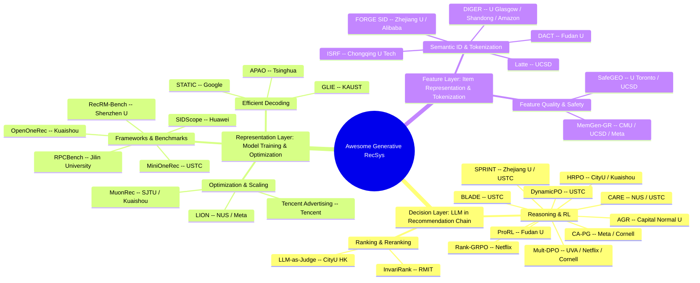

# Awesome Generative Recommendation System (RecSys)

```
 ██████╗                ██████╗                ███████╗                
██╔════╝  ███╗  ███╗    ██╔══██╗ ███╗   ███╗   ██╔════╝██╗ ██╗ ██████╗ 
██║      ██╔═██╗████╗   ██████╔╝██╔═██╗██╔═██╗ ███████╗╚██╗██║ ██╔═══╝ 
██║  ███╗██████║██╔██╗  ██╔══██╗██████║██║ ╚═╝ ╚════██║ ╚███╔╝ ██████╗ 
██║   ██║██║    ██║╚██╗ ██║  ██║██║    ██║ ██╗      ██║  ██╔╝      ██║
╚██████╔╝╚████╗ ██║ ╚██╗██║  ██║╚████╗ ╚███╔═╝ ███████║  ██║   ██████║
 ╚═════╝  ╚═══╝ ╚═╝  ╚═╝╚═╝  ╚═╝ ╚═══╝  ╚══╝   ╚══════╝  ╚═╝   ╚═════╝
```
---

[](https://github.com/sindresorhus/awesome)

RecSys is starting to adopt LLM for feature extraction, retrieval, and ranking/re-ranking! Although you can get some hands-on materials in either the [classics](#papers-classic-must-read) or some surveys, but since you're already interested in applying generative AI to industrial tasks, you probably wanna stay on the bleeding edge, right? That's exactly what this repo is for — automatically updated daily by agents with the latest generative RecSys papers fresh off arXiv, making sure that you never miss a beat.

> [!IMPORTANT]
> For those who are not familiar with GenRec, or not even the recommendation system, please checkout the kickstart posts [here](docs/kickstart.md).
> These posts are in Chinese, for English simply do your browser's internal translation or turn to __Ask Gemini__ :shipit:

## Quick Indexing
- [By Date](#by-date)
- [By Opensource](#by-opensource)
- [By Keyword](#by-keyword)
- [By Affiliation](#by-affiliation)
- [Papers Classic Must Read](#papers-classic-must-read)
- [Verl-GR: An Awesome RL Toolkit for GenRecSys](#verl-gr-an-awesome-rl-toolkit-for-genrecsys)


```mermaid
mindmap
  root((Awesome Generative RecSys))
    Decision Layer: LLM in Recommendation Chain
      Reasoning & RL
        Rank-GRPO -- Netflix
        DynamicPO -- USTC
        BLADE -- USTC
        SPRINT -- Zhejiang U / USTC
        CARE -- NUS / USTC
        HRPO -- CityU / Kuaishou
        Mult-DPO -- UVA / Netflix / Cornell
        CA-PG -- Meta / Cornell
        ProRL -- Fudan U
        AGR -- Capital Normal U
      Ranking & Reranking
        InvariRank -- RMIT
        LLM-as-Judge -- CityU HK
    Representation Layer: Model Training & Optimization
      Frameworks & Benchmarks
        MiniOneRec -- USTC
        OpenOneRec -- Kuaishou
        RecRM-Bench -- Shenzhen U
        SIDScope -- Huawei
        RPCBench -- Jilin University
      Efficient Decoding
        STATIC -- Google
        APAO -- Tsinghua
        GLIE -- KAUST
      Optimization & Scaling
        MuonRec -- SJTU / Kuaishou
        Tencent Advertising -- Tencent
        LION -- NUS / Meta
    Feature Layer: Item Representation & Tokenization
      Semantic ID & Tokenization
        Latte -- UCSD
        FORGE SID -- Zhejiang U / Alibaba
        DIGER -- U Glasgow / Shandong / Amazon
        DACT -- Fudan U
        ISRF -- Chongqing U Tech
      Feature Quality & Safety
        SafeGEO -- U Toronto / UCSD
        MemGen-GR -- CMU / UCSD / Meta
```
<div align="center">
  <i> Open-source Generative RecSys Map </i>
</div>

---
## `Verl-GR`: An Awesome RL Toolkit for GenRecSys
If you are interested in RFT your own GenRecSys, come check out our `verl`-based implementation called `verl-gr` here:
* [https://github.com/HaFred/verl-GR/tree/main/verl_gr/recipes/openonerec](https://github.com/HaFred/verl-GR/tree/main/verl_gr/recipes/openonerec)
* [https://github.com/HaFred/verl-GR/tree/main/verl_gr/recipes/rankgrpo](https://github.com/HaFred/verl-GR/tree/main/verl_gr/recipes/rankgrpo)

We manage to achieve 22% and 32% boosting for the end-to-end training efficiencies, compared with their respective vanilla implementations.

## By Date

We only keep the last 10 days summary below, for the past records before these, please see [the archive](docs/archive_by_month).

---

### Papers September 21

*Monday, September 21, 2026. The Monday Sep 21 arXiv cs.IR batch had not posted at scan time (newest cs.IR listing is still Fri 18 Sep, already captured by the Sep 18 run), so the last-24h window is empty. Per the fallback protocol a broadened archive-aware search (Dec 2025 – Sep 2026, with every `docs/archive_by_month/*.md` month checked for dedup) surfaced 7 genuinely-new on-topic generative-recommendation papers. NOTE: the prior run's 8 "new" candidates were all already present in the repo or its archive months, so this run restarts the search from scratch rather than re-adding duplicates. Total: 7 papers (4 opensource).*

1. **Retrieval, Scoring, and Decoding Shape Performance and Stability in LLM-based Conversational Recommendation**
   * Affiliation: Infobip (Split / Zagreb, Croatia) — *(Ante Kapetanovic, Tomislav Duricic, Andro Mercep, Emanuel Lacic)*
   * Link: [arxiv.org/abs/2609.00086](https://arxiv.org/abs/2609.00086)
   * Venue: CIKM 2026 (35th ACM Int. Conf. on Information and Knowledge Management, Rome, Nov 2026; arXiv preprint 31 Aug 2026; cs.CL / cs.AI; submitted 31 Aug 2026), DOI 10.1145/3799682.3840066
   * TL;DR: LLM rerankers in conversational recommendation are highly sensitive to the retrieval-and-inference protocol — on ReDial, a proprietary reranker reaches NDCG@10 0.1497 vs 0.0939 for the best non-LLM baseline under a shared top-250 pool, but unconstrained (zero-shot generation) scoring inflates that to 0.2925, and switching candidate generators or raising decoding temperature reshapes the results; the paper argues candidate set, pool size, scoring policy and decoding config must be standard reporting fields.
   * Key techniques:
     - A shared retrieve-then-rerank pipeline comparing proprietary, open-weight and fine-tuned LLM rerankers against CF/sequential baselines on the ReDial conversational movie benchmark
     - Candidate-aware vs. unconstrained (zero-shot generation) scoring showing the apparent LLM advantage is largely a protocol artifact
     - Varying candidate-pool size, first-stage retriever (semantic vs collaborative filtering) and decoding temperature to expose sensitivity
     - Showing no open-weight LLM beats a tuned shallow autoencoder under matched protocol, and CF candidates lift NDCG@10 by >50% over semantic ones
   * Scores (Opensource? / Novelty / Fairness / Robustness / Impact):
     - **Opensource?: 8/10** — [github.com/infobip/crs-performance](https://github.com/infobip/crs-performance): official CIKM'26 artifact with data-processing, retriever, scoring and decoding configs that reproduce the ReDial experiments; deductions: scoped to a single benchmark (ReDial), no pretrained weights released, single-org maintenance
     - **Novelty: 6/10** — largely a rigorous empirical measurement / reporting-discipline paper rather than a new method
     - **Fairness: 6/10** — surfaces candidate-generation bias but is not a fairness study per se
     - **Robustness: 9/10** — the paper's entire contribution is a stability analysis across pool size, retriever and temperature, with matched-pool controls
     - **Impact: 8/10** — CIKM 2026; directly reshapes how the field reports LLM reranker gains
2. **Enhancing Group Recommendation with Memory-Augmented Reasoning in LLM Agent (AGR)**
   * Affiliation: Capital Normal University (Beijing) / The University of Queensland (Australia) — *(Qimeng Niu, Bowen Hao, Zixuan Zhang, Shuyu Qu, Hongzhi Yin)*
   * Link: [arxiv.org/abs/2608.21939](https://arxiv.org/abs/2608.21939)
   * Venue: arXiv preprint, August 2026 (cs.IR; submitted 22 Aug 2026)
   * TL;DR: Group recommendation needs to model evolving preferences and explicit consensus formation, so AGR is an LLM agent with a token-hash Memory Module (insert/update/retrieve/forget/summarize) and a four-step Reasoning Module (group-interest collection, consensus refinement, multi-dimensional evaluation, explainable generation), trained with SFT then GRPO; it beats SOTA on LastFM and Douban in accuracy and explainability.
   * Key techniques:
     - A token-based hash-table memory for dynamic, forgetful, summarized tracking of group/user interaction history
     - A four-step reasoning module moving beyond black-box inference to interpretable group recommendations
     - Reinforcement Fine-Tuning: SFT to bootstrap module invocation, then Group Relative Policy Optimization (GRPO) to let the agent autonomously coordinate memory+reasoning
     - Evaluated on LastFM and Douban with accuracy and explainability gains
   * Scores (Opensource? / Novelty / Fairness / Robustness / Impact):
     - **Opensource?: 7/10** — [huggingface.co/niuqimeng/AGR](https://huggingface.co/niuqimeng/AGR): released model weights + inference for the memory-augmented LLM agent; deductions: model-only release, agent harness / training code not clearly open, single-author HF repo
     - **Novelty: 7/10** — coupling a memory module with GRPO-coordinated reasoning for group rec is a clean advance over fixed-history LLM methods
     - **Fairness: 6/10** — consensus-formation modeling has an equity dimension but is not a fairness audit
     - **Robustness: 6/10** — two public datasets, no online or adversarial evaluation
     - **Impact: 7/10** — group recommendation + GRPO is an active axis; reproducible weights help
3. **The Lifecycle of LLM-as-a-Judge for Large-Scale Recommendation Explanations**
   * Affiliation: Netflix (Los Gatos, CA) — *(Emma Yanyang Kong, JJ Tan, Ishan Gupta, Lars Olds, Claire Campbell, David Fagnan, Ratna Kavuri, Veli Balin, Rohan Gosain, Louis Garcia, Minsu Jang)*
   * Link: [arxiv.org/abs/2608.18300](https://arxiv.org/abs/2608.18300)
   * Venue: COLM 2026 Workshop (Lifelong Agents + AIMS); arXiv v3 31 Aug 2026 (cs.AI; first submitted 18 Aug 2026)
   * TL;DR: An LLM judge in production has a lifecycle, not a one-off benchmark; Netflix presents the four-phase lifecycle (Birth → Training via Reasoning-Aligned Rubric Tuning → Deployment in quality-gating + reflective-generation roles → Monitoring with HITL drift detection) for judges of recommendation explanations, backed by a five-week online A/B test over tens of millions of members.
   * Key techniques:
     - A four-phase judge lifecycle framework (Birth, Training, Deployment, Monitoring)
     - Reasoning-Aligned Rubric Tuning (RART): a meta-judge over reasoning output as the learning signal
     - Dual online judge roles: quality gating and reflective generation
     - Continuous Human-in-the-Loop alignment detecting drift and triggering re-tuning behind a human review gate; five-week A/B over tens of millions of members
   * Scores (Opensource? / Novelty / Fairness / Robustness / Impact):
     - **Opensource?: 0/10** — no public code or judge release at scan time (Netflix)
     - **Novelty: 8/10** — framing a judge as a maintained lifecycle with RART and online dual-role deployment is distinctive
     - **Fairness: 7/10** — quality-gating plus drift monitoring are trust/fairness-adjacent safeguards
     - **Robustness: 8/10** — five-week online A/B over tens of millions of members with drift detection, not a simulation
     - **Impact: 9/10** — Netflix production recsys; concrete blueprint for deploying and maintaining LLM judges at scale
4. **From Prompting to Behavioral Alignment: Personalized LLM Judges for Recommendation Evaluation**
   * Affiliation: Netflix — *(Alireza S. Ziabari, Kat Ellis, Colleen Chan, Ding Tong)*
   * Link: [arxiv.org/abs/2608.11493](https://arxiv.org/abs/2608.11493)
   * Venue: arXiv preprint, August 2026 (cs.AI / cs.LG; submitted 11 Aug 2026)
   * TL;DR: Off-the-shelf LLMs exhibit "bidirectional rationalization" — they convincingly argue both for and against the same user engagement on the same item — so Netflix develops a sequential behavioral-alignment framework (fine-tuning + preference optimization over paired correct/counterfactual rationales) that lifts Macro-F1 by 32.19% over zero-shot and matches the production feature-engineered baseline.
   * Key techniques:
     - Identification of bidirectional rationalization as a critical zero-shot LLM-judge failure mode
     - A sequential behavioral-alignment framework pairing fine-tuning with preference optimization
     - Paired correct vs. counterfactual rationale supervision from real homepage interaction logs
     - 32.19% Macro-F1 lift over zero-shot, matching the production feature-pipeline baseline
   * Scores (Opensource? / Novelty / Fairness / Robustness / Impact):
     - **Opensource?: 0/10** — no public code or model release at scan time (Netflix)
     - **Novelty: 7/10** — behavioral alignment via paired rationales is a neat fix for the rationalization failure mode
     - **Fairness: 6/10** — not fairness-focused
     - **Robustness: 7/10** — validated on real production interaction logs against the live baseline
     - **Impact: 8/10** — Netflix; directly targets a real offline-evaluation reliability gap
5. **Drift-Aware Continual Tokenization for Generative Recommendation (DACT)**
   * Affiliation: Fudan University (Shanghai) / Microsoft Research Asia — *(Yuebo Feng, Jiahao Liu, Mingzhe Han, Dongsheng Li, Hansu Gu, Peng Zhang, Tun Lu, Ning Gu)*
   * Link: [arxiv.org/abs/2603.29705](https://arxiv.org/abs/2603.29705)
   * Venue: arXiv preprint, March 2026 (cs.IR; submitted 31 Mar 2026)
   * TL;DR: Collaborative tokenizers for generative recommendation drift as new items and interactions arrive, and naive fine-tuning shifts token sequences for most existing items, breaking GRM alignment; DACT is a drift-aware continual tokenization framework with a Collaborative Drift Identification Module (CDIM) for differentiated optimization and a relaxed-to-strict hierarchical code reassignment that adapts with minimal disruption.
   * Key techniques:
     - A two-stage continual-tokenization pipeline: tokenizer fine-tuning + hierarchical code reassignment
     - CDIM: a jointly trained module outputting item-level drift confidence for differentiated (drifting vs stationary) optimization
     - Relaxed-to-strict code reassignment limiting unnecessary token-sequence changes
     - Evaluated on three real datasets with two GRMs, reducing disruption to prior learned embeddings
   * Scores (Opensource? / Novelty / Fairness / Robustness / Impact):
     - **Opensource?: 8/10** — [github.com/HomesAmaranta/DACT](https://github.com/HomesAmaranta/DACT): full two-stage implementation (CDIM + hierarchical code reassignment) with configs and dataset scripts; deductions: limited documentation, single-lab maintenance
     - **Novelty: 8/10** — framing tokenizer maintenance as continual / drift-aware learning with a drift-confidence module is genuinely new
     - **Fairness: 5/10** — not fairness-focused
     - **Robustness: 8/10** — stability-plasticity experiments across datasets and two GRMs
     - **Impact: 8/10** — tokenizer stability is a real production pain point for generative recsys
6. **Iterative Semantic Reasoning from Individual to Group Interests for Generative Recommendation with LLMs (ISRF)**
   * Affiliation: Chongqing University of Technology / Chongqing Normal University — *(Xiaofei Zhu, Jinfei Chen, Feiyang Yuan, Zhou Yang)*
   * Link: [arxiv.org/abs/2603.13934](https://arxiv.org/abs/2603.13934)
   * Venue: WWW 2026 (The Web Conference, Dubai; arXiv preprint 14 Mar 2026; cs.IR / cs.AI; submitted 14 Mar 2026), DOI 10.1145/3774904.3792123
   * TL;DR: Truly modeling user interest needs semantic reasoning from explicit individual to implicit group interests, so ISRF uses LLMs in three steps — bidirectional reasoning over item attributes to build a semantic interaction graph, similarity-based user graph for group implicit interests, and an iterative batch optimization where individual and group interests mutually refine — beating SOTA on Sports/Beauty/Toys.
   * Key techniques:
     - Multi-step bidirectional reasoning over item attributes to infer semantic item features and an explicit-interest interaction graph
     - A similarity-based user graph inferring implicit interests of similar user groups
     - Iterative batch optimization: explicit individual interests guide group refinement, group interests enhance individual modeling
     - Validated on Sports, Beauty, Toys datasets
   * Scores (Opensource? / Novelty / Fairness / Robustness / Impact):
     - **Opensource?: 7/10** — [github.com/htired/ISRF](https://github.com/htired/ISRF): official WWW'26 code with semantic-graph construction and iterative optimization; deductions: modest README, single-lab, no pretrained weights
     - **Novelty: 7/10** — individual→group iterative semantic reasoning is a clear take on interest modeling
     - **Fairness: 6/10** — group-interest modeling has an equity angle but is not a fairness study
     - **Robustness: 6/10** — three public datasets, no online or adversarial evaluation
     - **Impact: 7/10** — WWW 2026; semantic reasoning for generative rec is a growing direction
7. **Beyond Interleaving: Causal Attention Reformulations for Generative Recommender Systems**
   * Affiliation: LinkedIn Inc. (Mountain View, CA) — *(Hailing Cheng)*
   * Link: [arxiv.org/abs/2603.10369](https://arxiv.org/abs/2603.10369)
   * Venue: arXiv preprint, March 2026 (cs.IR / cs.AI; submitted 11 Mar 2026), submitted to KDD 2026
   * TL;DR: Interleaving item and action tokens in generative recommenders doubles sequence length, adds quadratic overhead and relies on implicit attention to recover causality; the paper reframes interleaving as similarity-weighted action pooling and proposes AttnLFA and AttnMVP, which drop interleaved dependencies, cut sequence complexity ~50%, and beat interleaved baselines on large-scale social-network product data with 23%/12% training-time savings.
   * Key techniques:
     - A principled reformulation aligning sequence modeling with item→action causal structure and attention theory
     - AttnLFA (Attention-based Late Fusion for Actions) and AttnMVP (Attention-based Mixed Value Pooling) eliminating interleaved dependencies
     - ~50% sequence-complexity reduction with preserved Transformer expressivity
     - Evaluated on large-scale product recommendation from a major social network: NE gains and 23%/12% training-time reductions
   * Scores (Opensource? / Novelty / Fairness / Robustness / Impact):
     - **Opensource?: 0/10** — no public code or model release at scan time (LinkedIn)
     - **Novelty: 8/10** — explicit causal-attention reformulation replacing interleaving is a clean architecture contribution
     - **Fairness: 5/10** — not fairness-focused
     - **Robustness: 7/10** — large-scale production-style data with efficiency + NE gains
     - **Impact: 8/10** — LinkedIn; a directly deployable efficiency/architecture recipe for generative ranking

### Papers September 20

*Sunday, September 20, 2026. arXiv weekend pause — no new generative-recommendation announcement batch landed in the last 24h (the most recent cs.IR listing is still Fri 18 Sep, already captured by the Sep 18 run). The `date_list` of missing dates in the date section is empty (Sep 10–19 are all present). Per the fallback rule, this run back-fills 6 on-topic papers from the Jun–Sep window that prior runs missed: CORAL (Meta AI) closes a continual agentic loop over a live production recommender with A/B wins on two social platforms; PAPA (WashU) does feedback-efficient diffusion preference alignment for recsys; SPACE (Southeast University, RecSys 2026) lifts long-tail POI exposure via constraint-guided latent diffusion and ships code; Epistemic Warrant (Purdue / UPenn) gives a four-tier reliance certificate for individual LLM recommendations; MM-slotgate (Amazon) factorizes Fashion-CLIP into named attribute slots for controllable fashion retrieval; and PCGNet (Hong Kong PolyU) unifies compatibility and personal preference for fashion matching. Total: 6 papers (2 opensource).*

1. **CORAL: An LLM-Native Harness for Production Recommender Systems**
   * Affiliation: Meta AI — *(Muhammad Rafay Azhar, Yuhang Zhou, Gilbert Jiang, Yuchen Wang, Rahul Sharma, Matthew DeSousa, Jiayi Liu, Xin Guo, Lizhu Zhang, Xiangjun Fan; all Meta AI)*
   * Link: [arxiv.org/abs/2609.02730](https://arxiv.org/abs/2609.02730)
   * Venue: RecSys 2026 OARS Workshop (arXiv preprint, September 2026; cs.CL; submitted 2 Sep 2026)
   * TL;DR: Sustaining a production recommender is a continual constrained-optimization problem, so CORAL puts an LLM agent in a closed loop that observes operating signals, reasons over a memory of past decisions, and invokes tools — including a numerical optimizer that keeps every change inside a fixed budget — to reconfigure the live system, with A/B wins on two large social platforms.
   * Key techniques:
     - A constraint-optimized agentic loop (analysis → retrieval → attribution → constrained optimizer → apply) that reconfigures retrieval/ranking/serving parameters of a live recommender without parameter updates
     - A numerical optimizer that projects over-budget proposals back into a feasible operating envelope, so the loop can run under production guardrails
     - Memory of past decisions and measured outcomes drives in-context policy improvement as the loop iterates
     - Validated with online A/B experiments on two large-scale social platforms: engagement up at no extra serving cost on one, serving-cost savings with no engagement loss on the other
   * Scores (Opensource? / Novelty / Fairness / Robustness / Impact):
     - **Opensource?: 0/10** — no public code or agent release at scan time
     - **Novelty: 8/10** — framing production recsys continual optimization as a closed agentic loop with a budget-constrained optimizer is a distinctive industrial advance
     - **Fairness: 5/10** — the operating-budget guardrail is an equity/feasibility mechanism, but not a bias audit
     - **Robustness: 8/10** — online A/B on two platforms with measured engagement/efficiency trade-offs, not a simulation
     - **Impact: 9/10** — Meta production social platforms; a concrete blueprint for agentic continual optimization of recommender systems
2. **PAPA: Online Personalized Active Preference Alignment**
   * Affiliation: Washington University in St. Louis — *(Anindya Sarkar, Nasik Muhammad Nafi, Isaac Lyngaas, Muralikrishnan Gopalakrishnan Meena, Yevgeniy Vorobeychik)*
   * Link: [arxiv.org/abs/2607.00486](https://arxiv.org/abs/2607.00486)
   * Venue: ECML PKDD 2026 (arXiv preprint, July 2026; cs.LG / cs.AI / cs.CV; submitted 1 Jul 2026)
   * TL;DR: Personalizing a recommender means aligning a generative model to user preferences that are initially unknown, so PAPA bypasses a parameterized reward model entirely and directly optimizes a diffusion model from real-time user feedback via a variational-inference-inspired objective.
   * Key techniques:
     - Feedback-efficient preference alignment that skips reward-model training, drawing on the variational inference framework
     - Direct optimization of a diffusion model using real-time interactive user feedback
     - A strengthened variant EPAPA with a cheaper fine-tuning strategy for real-world deployment
     - Experiments and ablations across class-conditioned and fine-grained alignment tasks (image/fashion diffusion)
   * Scores (Opensource? / Novelty / Fairness / Robustness / Impact):
     - **Opensource?: 6/10** — [github.com/NasikNafi/papa](https://github.com/NasikNafi/papa): real code with LICENSE, README quickstart, configs, scripts, and DDPM-based training/sampling; deductions: requirements.txt details "available soon" (incomplete), single-day commit burst, single-author maintenance, and the released experiments are on MNIST/fashion image diffusion rather than real recsys datasets
     - **Novelty: 7/10** — eliminating the reward model for preference alignment is a clean, deployment-friendly take, though rooted in variational-inference ideas
     - **Fairness: 4/10** — not fairness-focused
     - **Robustness: 6/10** — ablations and multi-task experiments, but validation is on image-diffusion toy domains rather than live recsys
     - **Impact: 6/10** — ECML PKDD 2026; the reward-model-free alignment idea transfers to recsys preference optimization
3. **Give the Long-tail More SPACE: Promoting Provider Fairness in Next POI Recommendation**
   * Affiliation: Southeast University, Nanjing, China — *(Anran Zhang, Jiaqi Jiang, Jiahui Jin, Yuhan Zhao)*
   * Link: [arxiv.org/abs/2608.07998](https://arxiv.org/abs/2608.07998)
   * Venue: RecSys 2026 (20th ACM Conference on Recommender Systems; arXiv preprint, August 2026; cs.IR; submitted 8 Aug 2026)
   * TL;DR: Mainstream next-POI models starve long-tail merchants of exposure, and naive provider-fairness methods break because users have execution constraints and POIs have supply constraints, so SPACE generates virtual users under explicit feasibility and supply control to train existing recommenders fairly.
   * Key techniques:
     - Community inference to capture heterogeneous user execution constraints
     - Unbalanced optimal-transport allocation deciding how many virtual users each tail POI gets from which communities under POI-specific supply budgets
     - Constraint-guided latent diffusion to generate POI-conditional, community-consistent virtual user embeddings
     - Model-agnostic: the synthetic user–POI pairs train existing recommenders unchanged
   * Scores (Opensource? / Novelty / Fairness / Robustness / Impact):
     - **Opensource?: 4/10** — [github.com/Anniran1/SPACE-main](https://github.com/Anniran1/SPACE-main): actual code (dataset_process, model, param, trainer, utils, main.py) matching the paper's stages, but a single initial commit (Jul 18 2026) with no README, no requirements.txt, no LICENSE, and committed `__pycache__/` and `.DS_Store` — usable for reproduction only with effort
     - **Novelty: 7/10** — coupling supply- and physics-aware virtual-user generation with optimal transport is a fresh provider-fairness mechanism for POI rec
     - **Fairness: 9/10** — provider fairness is the paper's explicit core contribution (long-tail exposure under real constraints)
     - **Robustness: 7/10** — three real-world datasets, multiple backbones, accuracy preserved/improved while fairness rises
     - **Impact: 6/10** — RecSys 2026; a directly usable fairness recipe for location-based recommendation
4. **Epistemic Warrant for LLM Recommendations: Characterizing the Basis for Reliance When Ground Truth Is Unavailable**
   * Affiliation: Purdue University / University of Pennsylvania — *(Shai Vardi (Purdue), João Sedoc (UPenn))*
   * Link: [arxiv.org/abs/2609.04127](https://arxiv.org/abs/2609.04127)
   * Venue: arXiv preprint, September 2026 (cs.AI; submitted 3 Sep 2026), 43 pages
   * TL;DR: Users lack a principled basis for trusting an individual LLM recommendation, so the paper adapts epistemology into "epistemic warrant" — a decision-level construct capturing a model's preference stability and the scope over which it holds — operationalized as a four-tier reliance certificate for pairwise recommendations.
   * Key techniques:
     - Epistemic warrant: stability of the model's preference plus the scope over which that preference holds
     - A four-tier reliance certificate (unstable / context-dependent / locally supported / broadly supported) for pairwise recommendations
     - Known-groups tests recover expert-prespecified warrant orderings; stronger warrants align with independent crowd-worker consensus
     - Shows warrant is distinct from verbalized confidence and not explained by decision difficulty
   * Scores (Opensource? / Novelty / Fairness / Robustness / Impact):
     - **Opensource?: 0/10** — no public code or dataset link at scan time
     - **Novelty: 8/10** — importing an epistemology construct to certify individual LLM-recommendation reliance is a genuinely new framing
     - **Fairness: 7/10** — reliance certification is a trust/fairness-adjacent safeguard against over-trusting opaque LLM recs
     - **Robustness: 7/10** — known-groups + crowd-consensus validation, but no live recsys deployment
     - **Impact: 6/10** — a useful, implementable trust layer for LLM recommendation assistants
5. **Attribute-Conditioned Multimodal Slot Factorization for Controllable Fashion Retrieval (MM-slotgate)**
   * Affiliation: Amazon — *(Najmeh Forouzandehmehr, Topojoy Biswas, Evren Korpeoglu, Kannan Achan)*
   * Link: [arxiv.org/abs/2608.12570](https://arxiv.org/abs/2608.12570)
   * Venue: arXiv preprint, August 2026 (cs.CV / cs.IR; submitted 12 Aug 2026)
   * TL;DR: Monolithic fashion-retrieval embeddings mix attributes into one vector; MM-slotgate factorizes Fashion-CLIP text/image embeddings into four named attribute slots with per-slot text-image gates, giving interpretable, controllable retrieval that beats equal-weight fusion on H&M.
   * Key techniques:
     - A multimodal slot encoder that factorizes Fashion-CLIP embeddings into four named attribute slots (category, color, pattern, demographic)
     - Per-slot learnable text-image gates so color/pattern lean on image evidence while category/demographic stay text-driven
     - A combined slot-similarity + slot-logit retrieval score
     - Quantized slot codes enable targeted intervention (e.g., +15.3x lift on color); linear probes show no excess leakage
   * Scores (Opensource? / Novelty / Fairness / Robustness / Impact):
     - **Opensource?: 0/10** — no public code or model release at scan time (Amazon)
     - **Novelty: 7/10** — typed, attribute-conditioned multimodal slots with interpretable gates are a clear advance over opaque item-level semantic IDs
     - **Fairness: 3/10** — not fairness-focused
     - **Robustness: 6/10** — H&M benchmark with macro ConstraintSatisfied@10 and interpretability probes, single dataset
     - **Impact: 6/10** — Amazon fashion retrieval; directly relevant to industrial multimodal generative/semantic-ID retrieval
6. **PCGNet: Unifying Shared and Specific Information for Fashion Matching Recommendations**
   * Affiliation: The Hong Kong Polytechnic University — *(Shuiying Liao, P. Y. Mok)*
   * Link: [arxiv.org/abs/2609.13339](https://arxiv.org/abs/2609.13339)
   * Venue: arXiv preprint, September 2026 (cs.IR / cs.IT; submitted 11 Sep 2026)
   * TL;DR: Fashion matching recommendation must satisfy both garment compatibility and personal preference, which prior decoupled models ignore, so PCGNet unifies the two via contrastive mutual-information maximization over shared and view-specific graph patterns.
   * Key techniques:
     - A Personalized Compatibility Graph Network framing fashion matching as multi-objective graph learning
     - Contrastive mutual-information maximization to extract and align shared vs. view-specific (compatibility vs. preference) patterns
     - Correlation-aware neighbor sampling and a learnable global graph augmentation for self-supervised signals
     - Joint BPR ranking loss and multi-view mutual-information losses for recommendation scoring
   * Scores (Opensource? / Novelty / Fairness / Robustness / Impact):
     - **Opensource?: 0/10** — no public code or repository at scan time
     - **Novelty: 5/10** — a compatibility-plus-preference unification for fashion matching, but graph MI methods are established
     - **Fairness: 2/10** — not fairness-focused
     - **Robustness: 5/10** — two benchmark datasets, four metrics, no online or adversarial evaluation
     - **Impact: 5/10** — a solid fashion compatibility/personalization contribution for e-commerce

### Papers September 19

*Saturday, September 19, 2026. arXiv weekend pause — no new generative-recommendation announcement batch landed in the last 24h (the Friday Sep 18 cs.IR batch was already captured in the Sep 18 run). Per the fallback rule, this run back-fills 5 on-topic papers from the Sep 9–16 window that prior runs missed: NarraLite (Tencent / HK PolyU) compresses multimodal generative recommendation for short-form-drama continuation with latent narrative reasoning; BanglaShop-CRS (University of Vermont) ships a 27K-dialogue Bangla conversational-recommendation benchmark; FlashVector (Stanford / Unity) is an agentic model-serving optimizer that doubled throughput on Unity's Vector ad platform; a trust-aware health recommendation policy (UIUC) couples worker health, trust and compliance via model-free RL; and a University of Melbourne null result showing sociodemographic attributes add no detectable lift to LLM next-location prediction. Total: 5 papers (0 opensource).*

1. **NarraLite: Efficient Multimodal Generative Recommendation with Latent Narrative Reasoning**
   * Affiliation: Tencent (Weixin Group) / The Hong Kong Polytechnic University — *(Chenxing Wang, Nantao Zheng, Hao Miao, Juyuan Wang, Xinke Jiang, Yuchen Fang (corresponding), Aolin Li, Haijun Wu)*
   * Link: [arxiv.org/abs/2609.16070](https://arxiv.org/abs/2609.16070)
   * Venue: arXiv preprint, September 2026 (cs.CL / cs.AI; submitted 13 Sep 2026)
   * TL;DR: Generative recommendation reformulates item prediction as semantic-identifier generation, but episodic content — such as short-form dramas — is determined by narrative evolution rather than user preference; NarraLite jointly compresses perception and reasoning so a recommender can follow a multimodal storyline and predict its continuation without autoregressively decoding textual rationales.
   * Key techniques:
     - Progressive Spectral Compression: selectively distills long visual contexts into compact narrative-relevant evidence, preserving transition-critical information while cutting redundant visual computation
     - Latent Narrative Reasoning: context-routed latent reasoning tokens whose contextualized representations are aligned with future-continuation semantics, enabling implicit narrative inference without explicit reasoning decoding
     - A user-agnostic multimodal benchmark for short-form drama continuation spanning UGC, PGC and OOD settings
     - Results: consistent gains in continuation accuracy, narrative coherence and robustness over existing approaches with a favourable accuracy–efficiency trade-off
   * Scores (Opensource? / Novelty / Fairness / Robustness / Impact):
     - **Opensource?: 0/10** — no public code or checkpoint released at scan time
     - **Novelty: 7/10** — latent (non-autoregressive) narrative reasoning plus spectral compression of visual context is a fresh efficiency-first take on multimodal generative recommendation
     - **Fairness: 2/10** — not fairness-focused
     - **Robustness: 6/10** — UGC/PGC/OOD benchmark with coherence and robustness gains, but no online deployment and no adversarial evaluation
     - **Impact: 7/10** — Tencent Weixin; multimodal generative recommendation is an under-addressed axis and the efficiency story is directly relevant to production
2. **BanglaShop-CRS: A User-Centric Bangla Dataset for Conversational Recommendation**
   * Affiliation: University of Vermont (Complex Systems Center) — *(Tabia Tanzin Prama, Christopher M. Danforth, Peter Sheridan Dodds)*
   * Link: [arxiv.org/abs/2609.18715](https://arxiv.org/abs/2609.18715)
   * Venue: arXiv preprint, September 2026 (physics.soc-ph; submitted 16 Sep 2026)
   * TL;DR: Existing conversational-recommender (CRS) resources concentrate in English, leaving Bangla and code-mixed Bangla–English underrepresented; BanglaShop-CRS is a 27,178-dialogue synthetic-but-user-grounded Bangla CRS benchmark built from real e-commerce behaviour.
   * Key techniques:
     - A large-scale user-centric synthetic generation pipeline grounded in real e-commerce behaviour: user purchase histories, positive/negative feedback and review texts keep dialogue content consistent with user preferences
     - 27,178 multi-turn dialogues, 274,802 utterances and 3.6M tokens across 10 product domains
     - Evaluated under catalog-constrained and open-vocabulary recommendation protocols; dialogue context improves recommendation quality and fine-tuning yields further gains
     - Human evaluation by five native Bangla speakers (fluency, informativeness, logicality, coherence) with κ=0.65 inter-annotator agreement; factual-grounding eval confirms alignment with correct versus shuffled user records
   * Scores (Opensource? / Novelty / Fairness / Robustness / Impact):
     - **Opensource?: 0/10** — dataset introduced but no public repository or download link found at scan time
     - **Novelty: 5/10** — a language-resource contribution rather than a new method, but the first large Bangla CRS benchmark fills a real gap
     - **Fairness: 6/10** — addresses representational inequity (Bangla / code-mixed underrepresented); inclusivity-adjacent
     - **Robustness: 5/10** — human + GPT-5.1 factual-grounding eval with κ=0.65, but a single synthetic dataset and closed-set protocols
     - **Impact: 5/10** — enables CRS research in Bangla; resource paper with clear downstream value
3. **FlashVector: Agent for Hierarchical Model Serving Stack Optimization**
   * Affiliation: Stanford University / Unity Vector AI Team — *(Qi Wu, Lohan Lemire, Kai Meng, Zhongmou Cai, Raphael Bargues, Petr Zhitnikov, Zeyuan Cao, Yao Wang, Shujun Bian, Wei Chen, Sean Sheng)*
   * Link: [arxiv.org/abs/2609.17391](https://arxiv.org/abs/2609.17391)
   * Venue: arXiv preprint, September 2026 (cs.AI / cs.PF; submitted 15 Sep 2026)
   * TL;DR: Model serving is among the largest cost drivers in production recommender systems, so FlashVector generalizes the single-kernel optimization agent to the whole serving stack (GPU kernels, framework graph, model server, feature processing) and, deployed in Unity's Vector ad platform, delivers up to 2x throughput.
   * Key techniques:
     - An extensible agentic framework that generalizes the single-GPU-kernel optimization-agent paradigm to heterogeneous technical stacks (NVIDIA Triton C++ model server, Python feature-transformation service)
     - Cross-layer optimization across GPU kernels, ML-framework computation graph, model server and on-demand feature processing
     - Deployed in Unity's Vector advertising platform: up to 2x throughput on the model server, up to 1.98x latency speedup, and up to 1.6x throughput on the feature store
   * Scores (Opensource? / Novelty / Fairness / Robustness / Impact):
     - **Opensource?: 0/10** — no public code or agent release at scan time
     - **Novelty: 6/10** — extending agentic kernel optimization to the full serving hierarchy with an extensible framework is a clear industrial advance
     - **Fairness: 1/10** — not relevant
     - **Robustness: 6/10** — production deployment with measured throughput/latency gains across multiple stack layers, not a simulation
     - **Impact: 6/10** — Unity advertising; serving-cost efficiency is a top concern for industrial recommender systems
4. **Personalized and Trust-Aware Health Recommendation Policies for a Construction Workplace**
   * Affiliation: University of Illinois Urbana-Champaign — *(Atefeh Mollabagher, Yogesh Gautam, Houtan Jebelli, Parinaz Naghizadeh)*
   * Link: [arxiv.org/abs/2609.12679](https://arxiv.org/abs/2609.12679)
   * Venue: arXiv preprint, September 2026 (cs.IR / eess.SY; submitted 11 Sep 2026)
   * TL;DR: For construction-worker health, a recommender that triggers personalized interventions must respect that worker trust is shaped by health and recommendation dynamics and in turn drives compliance; the paper characterizes the trust-aware policy via both model-based control and model-free RL.
   * Key techniques:
     - A dynamic model coupling worker health evolution, trust dynamics (driven by health and recommendations) and compliance with future recommendations
     - Characterization of the recommender policy: a health-based recommendation triggering threshold and the recommendation frequency
     - Solved via both model-based short-horizon control and model-free reinforcement learning
     - Analysis of how frequencies are tuned per worker to balance health, productivity and trust
   * Scores (Opensource? / Novelty / Fairness / Robustness / Impact):
     - **Opensource?: 0/10** — no public code or simulator release at scan time
     - **Novelty: 6/10** — jointly modelling health, trust and compliance in one dynamic recommendation policy is a distinctive framing for RL-based recommendation
     - **Fairness: 7/10** — worker well-being and trust calibration are the explicit objectives; ethics/fairness-adjacent
     - **Robustness: 5/10** — analytical characterization plus RL, but simulation-based with no field deployment
     - **Impact: 5/10** — construction-workplace health; the trust–compliance coupling is a transferable idea for safety-critical recsys
5. **Who You Are Adds Nothing Detectable to Where You Go Next: Sociodemographic Conditioning in LLM Next-Location Prediction**
   * Affiliation: University of Melbourne — *(Xin Wang, Paraic Carroll, Kerry Nice, Sachith Seneviratne, Li Zhang)*
   * Link: [arxiv.org/abs/2609.09609](https://arxiv.org/abs/2609.09609)
   * Venue: arXiv preprint, September 2026 (cs.CY; submitted 9 Sep 2026), 17 pages
   * TL;DR: A controlled study linking sociodemographic records to 5,000 Shenzhen residents' mobility data shows age/gender/occupation/income change top-1 next-location accuracy by at most ±0.8pp — demographics add no detectable predictive value, while candidate construction dominates reported performance.
   * Key techniques:
     - A closed-set benchmark where models rank 100 candidate destinations, evaluated with and without sociodemographic attributes while holding mobility history, candidates and all other prompt content fixed
     - Four history lengths; paired top-1 accuracy change ranges −0.8 to +0.5 pp with no detectable gain
     - Consistency checks: stay history withheld, alternative prediction times, two additional LLMs, and a supervised reranker trained on the same benchmark
     - A permutation probe showing mis-matched attributes hurt accuracy whereas correctly matched attributes do not help — distinguishing demographic association from incremental predictive usefulness
     - Candidate-construction analysis: removing distance raises accuracy 7.7pp under proximity sampling but lowers it 22.3pp under popularity sampling
   * Scores (Opensource? / Novelty / Fairness / Robustness / Impact):
     - **Opensource?: 0/10** — benchmark built from proprietary mobility data; no public code or dataset link at scan time
     - **Novelty: 7/10** — a rigorous null result on sociodemographic conditioning for LLM location/POI recommendation, with careful controls
     - **Fairness: 6/10** — directly interrogates demographic conditioning (a fairness/privacy concern) and finds it carries no predictive value here
     - **Robustness: 7/10** — four history lengths, three LLMs, a supervised reranker and multiple consistency checks
     - **Impact: 6/10** — cautions the field against demographic conditioning in LLM mobility/POI recommendation; a useful negative result

### Papers September 18

*Friday, September 18, 2026. arXiv active — the Friday Sep 18 cs.IR announcement batch (22 entries) plus late Sep 17 uploads and two cs.CL / cs.AI cross-overs. Headline: UniPolicy (Meituan) decouples a generative search-advertising retriever into objective-specific policy subspaces and decodes them with multi-policy beam search, gaining +0.71% CTR, +1.58% RPS and +1.32% ad revenue in a 7-day online A/B; CoFree (Alibaba/Taobao + Wuhan U + SJTU) names and fixes "reasoning collapse" in reasoning-augmented LLM embedding learning with reference-guided SFT plus dual embedding/reasoning rewards (+2.8 avg nDCG@10 over Qwen3-Embedding-4B on 22 datasets); SELF-INDEX (Yonsei University) lets a retrieval index rewrite its own index keys by diagnosing failures, revising the responsible keys, validating each revision and simulating unseen queries — but ships only a placeholder repository. MERIT-Rank (Honor Device) attacks the single-reasoning-trajectory bottleneck of LLM rerankers with a Multi-Trajectory Reasoning Space trained by Progressive Rank Policy Optimization. A sobering reproducibility result from the University of Zurich: natural-language user profiles leave the ranking of an LLM recommender unchanged even under direct activation steering, because the rating-regression objective absorbs the perturbation. Total: 8 papers (1 opensource).*

1. **UniPolicy: Unified Objective-Specific Policies for Generative Search Advertising**
   * Affiliation: Meituan, Beijing, China — *(Kun Yao\*, Yuhang Zhou\*, Yichi Zhang, Zeliang Tong, Shengri Xue, Haitao Wang, Siyu Lu, Qianlong Xie, Xingxing Wang; \* equal contribution)*
   * Link: [arxiv.org/abs/2609.20630](https://arxiv.org/abs/2609.20630)
   * Venue: arXiv preprint, September 2026 (cs.CL; submitted 17 Sep 2026), 13 pages
   * TL;DR: Rather than fusing relevance, click propensity and commercial value into one reward — which lets the strongest objective dominate the gradients — UniPolicy gives each business objective its own parameter subspace inside a shared generative-retrieval backbone and decodes all of them in parallel with a business-customizable multi-policy beam search.
   * Key techniques:
     - Hierarchical parameter decoupling per objective: objective-specific prefix tokens, sparse MoE-LoRA routing, and objective-specific residual FFNs on top of one shared backbone, yielding differentiated parameter and policy-expression spaces
     - Pairwise preference construction from multi-stage behavioural feedback: exposed-but-unclicked samples are turned into relative preference information so the clicked candidate's relative advantage in the generation distribution is strengthened
     - Per-objective independent GRPO (group-relative advantages computed from objective-specific SID rollout rewards) instead of naive reward fusion
     - Inference-time parallel multi-policy beam search that allocates candidate quotas across objectives under a fixed retrieval budget, preserving retrieval quality
     - Results: outperforms single-objective RL and naive reward-fusion baselines offline; 7-day online A/B on a real search advertising system gives +0.71% CTR, +1.58% RPS and +1.32% advertising revenue with stable serving latency
   * Scores (Opensource? / Novelty / Fairness / Robustness / Impact):
     - **Opensource?: 0/10** — no public code or model release; a Meituan production search-advertising system
     - **Novelty: 7/10** — MoE-LoRA and prefix conditioning are established, but using them to give each business objective its own policy subspace while unifying quota allocation inside a single multi-policy beam search is a well-specified industrial advance over reward fusion
     - **Fairness: 4/10** — not a bias audit, yet the paper's explicit motivation is that single-objective revenue optimisation is harmful to ecosystem health, and relevance/click objectives are carried in parallel with eCPM rather than after it
     - **Robustness: 8/10** — large-scale offline comparison against single-objective RL and reward-fusion baselines plus a 7-day online A/B with stable latency, not a single-metric win
     - **Impact: 8/10** — Meituan search advertising; gives the generative-retrieval-plus-RL line a concrete recipe for multi-objective alignment without gradient competition
2. **Reasoning Quality Matters: Combating Reasoning Collapse in LLM-based Embedding Learning (CoFree)**
   * Affiliation: Alibaba Group (Taobao) / Wuhan University / Shanghai Jiao Tong University — *(Zihan Gong\*, Xiaohan Ye\*, Jiangchao Yao, Jinsong Lan, Xiaoyong Zhu, Xu Chen (corresponding); \* equal contribution)*
   * Link: [arxiv.org/abs/2609.20563](https://arxiv.org/abs/2609.20563)
   * Venue: arXiv preprint, September 2026 (cs.IR), 30 pages
   * TL;DR: Embedding specialisation degrades the reasoning that made the LLM a good embedder in the first place — either suppressing reasoning generation or emitting retrieval-irrelevant text — and CoFree fixes both forms of "reasoning collapse" with reference-guided SFT followed by dual embedding/reasoning rewards in RL.
   * Key techniques:
     - Names reasoning collapse as two distinct degradations: suppression of useful reasoning generation, and reasoning text that is irrelevant to retrieval
     - Stage 1 reference-guided supervised fine-tuning restores the reasoning ability of the foundation embedder while retaining its representational strength
     - Stage 2 RL with dual rewards — an embedding-oriented reward and a reasoning-oriented reward — so fine-grained relevance reasoning is preserved alongside the embedding objective
     - Frames embedding learning as a high-quality reasoning-guided search process rather than static alignment (endpoint-coupled optimisation)
     - Results: CoFree-4B improves an average +2.8 nDCG@10 over Qwen3-Embedding-4B across 22 MTEB and BRIGHT datasets; consistent gains in a real-world online retrieval system; code, the RTED dataset (3.6M instances) and checkpoints are promised but not yet released
   * Scores (Opensource? / Novelty / Fairness / Robustness / Impact):
     - **Opensource?: 0/10** — no public code, dataset or checkpoints at scan time; the paper commits to releasing CoFree, the RTED reasoning-augmented retrieval dataset and model checkpoints, so the score should be revisited
     - **Novelty: 7/10** — diagnosing reasoning collapse and repairing it with a two-stage reference-guided SFT plus dual-reward RL objective is a fresh, well-motivated framing for LLM embedding training
     - **Fairness: 3/10** — not fairness-focused
     - **Robustness: 8/10** — 22 datasets from MTEB and BRIGHT plus an online retrieval deployment, with an explicit two-stage ablation
     - **Impact: 7/10** — Alibaba/Taobao + WHU + SJTU; embedding backbones feed every generative retrieval and LLM-rec pipeline built on top of them
3. **Reproducing Transparent and Scrutable Recommendations: Exploring Open-Weight Models via Natural-Language User Profiles (Transparent UPR Repro)**
   * Affiliation: University of Zurich, Department of Informatics — *(Noah Mamié, Laurin van den Bergh)*
   * Link: [arxiv.org/abs/2609.19831](https://arxiv.org/abs/2609.19831)
   * Venue: BlackBoxNLP @ EMNLP 2026 — Special Track: Reproducibility and Reliability in Interpretability Analyses
   * TL;DR: Reproduces the natural-language user-profile recommender and then pushes on its central promise — a negative result: editing or perturbing the profile shifts predicted ratings uniformly across genres but leaves the ranking unchanged, even under direct activation steering, because the rating-regression objective, not the profile interface, governs the model.
   * Key techniques:
     - Full reproduction of the ACL 2024 user-profile recommendation (UPR) study on Amazon Movies & TV and TripAdvisor, plus fixes to several issues and inconsistencies found in the original repository
     - Systematic context ablation over input context (user profile / review history / item-review history) crossed with output format (item title / title and description)
     - Multi-seed stability across five random seeds (37–41), with standard deviations reported for statistical reliability
     - Mechanistic interpretability with the nnsight framework: counterfactual profile perturbations and activation steering probed against internal representations
     - Non-LLM baselines (MostPop, UserKNN, ItemKNN, BPR, WMF, MF, NeuMF) re-run under a protocol standardized against the LLM evaluation script, with side-by-side original-vs-reproduction tables
     - Conclusion: rating-regression models are the bottleneck; ranking-objective models clearly exceed them on the same task
   * Scores (Opensource? / Novelty / Fairness / Robustness / Impact):
     - **Opensource?: 7/10** — [github.com/nmamie/transparent_user_profiles](https://github.com/nmamie/transparent_user_profiles): genuinely usable release with preprocess/train/evaluate scripts, Cornac and personalization baselines, counterfactual-profile generation, latent-steering and behavioural-validation scripts, uv-locked `pyproject.toml` + `requirements.txt`, batch shell scripts and a quick-start README covering cuda/mps/cpu. Deductions: no LICENSE file, no tests or CI, single-author maintenance, last commit 11 Sep 2026
     - **Novelty: 6/10** — a reproduction study rather than a new method, but the mechanistic finding that scrutable profiles do not move rankings (traced to the regression objective) is a genuinely new and useful negative result for the interpretable-recommendation line
     - **Fairness: 7/10** — user scrutiny, profile correction and the genre-level distribution of prediction shifts are the paper's subject matter; transparency and user control are treated as fairness-adjacent obligations rather than ignored
     - **Robustness: 7/10** — five seeds with variance reporting, two datasets, multiple context ablations and a mechanistic probe; limited by the small number of domains and the absence of an online study
     - **Impact: 6/10** — BlackBoxNLP @ EMNLP 2026; tempers enthusiasm for "scrutable" LLM recommenders and hands the community a reproducible harness
4. **Think Thrice Before Reranking: Multi-perspective Evidence and Reasoning Integration for Text Reranking (MERIT-Rank)**
   * Affiliation: Honor Device Co., Ltd — *(Lijun Liu, Zhengzong Chen (corresponding), Wenyan Li, Yuanyuan Zhao, Fei Huang)*
   * Link: [arxiv.org/abs/2609.20131](https://arxiv.org/abs/2609.20131)
   * Venue: arXiv preprint, September 2026 (cs.IR / cs.CL)
   * TL;DR: One reasoning trajectory makes an LLM reranker fragile, so MERIT-Rank evaluates query–document relevance along several complementary trajectories, consolidates them into a single ranking decision, and trains the whole thing with staged, progressively harder ranking objectives.
   * Key techniques:
     - Multi-Trajectory Reasoning Space (MTRS) evaluating relevance from multiple perspectives instead of one chain of thought
     - A joint reranker that fuses the independent reasoning paths into a unified ranking decision rather than picking one trajectory
     - Progressive Rank Policy Optimization (PRPO): a progressive training framework that first stabilizes reasoning trajectories and then continually improves ranking quality through staged objectives
     - Evaluated on reasoning-intensive (BRIGHT) and traditional retrieval benchmarks
     - Results: a 4B MERIT-Rank outperforms most 7B and even 32B rerankers on BRIGHT
   * Scores (Opensource? / Novelty / Fairness / Robustness / Impact):
     - **Opensource?: 0/10** — no code or repository link anywhere in the paper or on an author page
     - **Novelty: 6/10** — multi-perspective reasoning plus a consolidating reranker is a sensible answer to trajectory fragility; the progressive staged optimization is the more distinctive piece
     - **Fairness: 3/10** — not fairness-focused
     - **Robustness: 7/10** — two benchmark families and a small model beating much larger rerankers, which is the robustness argument the paper is making
     - **Impact: 6/10** — Honor Device corporate lab; directly actionable for anyone running LLM rerankers under tight latency/size budgets
5. **FacetCRS: Multi-Faceted Preference Learning for Pricking Filter Bubbles in Conversational Recommender System (FacetCRS)**
   * Affiliation: Sun Yat-sen University — *(Yongsen Zheng, Ziliang Chen, Jinghui Qin, Liang Lin (corresponding))*
   * Link: [arxiv.org/abs/2609.20175](https://arxiv.org/abs/2609.20175)
   * Venue: AAAI 2024 — Thirty-Eighth AAAI Conference on Artificial Intelligence (arXiv re-posting, v1 dated 24 Jul 2026)
   * TL;DR: Attacks the filter bubble where it actually compounds — inside the conversational loop — by representing the user as four complementary preference facets (entity, word, context, review) that are refreshed by natural-language dialogue, so the profile keeps room for surprise instead of collapsing onto the dominant interest.
   * Key techniques:
     - Multi-facet preference modelling: entity-, word-, context- and review-level facets learned adaptively rather than one monolithic user vector
     - End-to-end CRS framework that adaptively learns representations at several granularity levels and fuses diverse external knowledge (review text, entities)
     - Bubble pricking framed as a dialogue-level, continuously intensified feedback-loop problem rather than a static recommender issue
     - Two publicly available CRS benchmark datasets; reported state of the art on both bubble mitigation and recommendation quality
   * Scores (Opensource? / Novelty / Fairness / Robustness / Impact):
     - **Opensource?: 0/10** — the first author's homepage advertises a CODE link for the AAAI'24 paper, but no reachable repository was found at scan time; nothing is linked from the arXiv posting
     - **Novelty: 5/10** — the method predates most of this tracker and the four-facet recipe has since become a familiar template; the value here is the original, cleanly argued framing of bubble mitigation as an interactive problem
     - **Fairness: 9/10** — the entire objective is filter-bubble reduction: exposure diversity and resistance to feedback-loop narrowing are the target metrics, not an afterthought
     - **Robustness: 5/10** — two public CRS datasets with consistent gains, but no online study and no analysis of how the facets behave under long-horizon drift
     - **Impact: 6/10** — AAAI 2024 venue; a late arXiv upload, but a useful reference point now that diversity and cocoon effects are back on the generative-rec agenda
6. **Self-Evolving Search Index (SELF-INDEX)**
   * Affiliation: Yonsei University — *(with Samsung Research, University of California Irvine, and Korea University)*
   * Link: [arxiv.org/abs/2609.19656](https://arxiv.org/abs/2609.19656)
   * Venue: arXiv preprint, September 2026 (cs.IR / cs.AI), marked "Work in progress"
   * TL;DR: Because the right index representation differs per retrieval environment, SELF-INDEX closes the loop — an LLM Optimizer diagnoses retrieval shortfalls, revises only the responsible index keys, validates each revision before committing, and a Query Simulator proactively invents demands the index has never seen.
   * Key techniques:
     - Optimizer loop: diagnose retrieval failure → selectively revise the responsible index keys → validate the revision → update the index, with no human in the loop
     - Query Simulator that explores additional retrieval demands beyond the queries available for optimization, so the index evolves proactively rather than only reactively
     - Environment-agnostic by design, evaluated across diverse corpora and retrievers
     - Downstream benefits reported for search agents (effectiveness and efficiency) and for agent memory systems retrieving useful past interactions
   * Scores (Opensource? / Novelty / Fairness / Robustness / Impact):
     - **Opensource?: 0/10** — the paper's `[CODE]` link (github.com/augustinLib/Self-Index) resolves to a repository containing only a 12-byte README and a single "Initial commit" from 16 Sep 2026; no implementation is public
     - **Novelty: 7/10** — automating the human "diagnose → refine strategy → reprocess the index" loop, with validation before committing edits, is a sharp reframing of index optimization as self-evolution
     - **Fairness: 3/10** — not fairness-focused
     - **Robustness: 5/10** — breadth across corpora and retrievers, but the paper is explicitly labelled work in progress with no large-scale or adversarial evaluation
     - **Impact: 6/10** — Yonsei University with Samsung Research; index evolution matters for every agent-memory and RAG stack built on top of retrieval
7. **Re2A: Situated Conversational Recommendation via Rubric-based Preference Reasoning and Alignment (Re2A)**
   * Affiliation: The Hong Kong Polytechnic University / The Chinese University of Hong Kong / Sichuan University — *(Dongding Lin, Jian Wang, Xiaoyan Zhao, Wenjie Li (corresponding))*
   * Link: [arxiv.org/abs/2609.18249](https://arxiv.org/abs/2609.18249)
   * Venue: EMNLP 2026 (Main Conference)
   * TL;DR: In situated conversational recommendation the recommender and user share a physical scene, so Re2A inserts an inspectable, rubric-derived preference state between reasoning and generation and optimises the response against both user-preference satisfaction and situation consistency.
   * Key techniques:
     - Rubric-based preference reasoning: automated rubrics drive the model to emit an explicit structured preference state recording inferred needs, attribute constraints and the visual target before any item is recommended — unlike free-form chain-of-thought
     - Preference-conditioned optimization aligning response generation with the dual objectives of user-preference satisfaction and situation consistency
     - The structured preference state acts as the shared interface between situated reasoning and response generation, rather than requiring a new optimization algorithm
     - Two SCR datasets; consistent improvements over state-of-the-art baselines in precision and context awareness
   * Scores (Opensource? / Novelty / Fairness / Robustness / Impact):
     - **Opensource?: 0/10** — the paper states code is available at github.com/DongdingLin/Re2A, but the repository is not publicly reachable (404) at scan time
     - **Novelty: 7/10** — turning preference inference into an explicit, inspectable state that both the reasoner and the generator share is a clean design for a task (situated CRS) that remains underexplored
     - **Fairness: 3/10** — not fairness-focused
     - **Robustness: 5/10** — two SCR datasets, no online deployment; the method depends on rubrics being well specified per domain
     - **Impact: 7/10** — EMNLP 2026 main conference; extends conversational recommendation from text-only chat to scene-grounded assistance
8. **Dense Feature Representation over Sequence Modeling: A Solution to the KDD Cup 2026 UniRec Challenge (KDD Cup 2026 UniRec)**
   * Affiliation: Z Lab, Chengdu, Sichuan, China — *(Yi Zhang, Weiliang Ji)*
   * Link: [arxiv.org/abs/2609.19787](https://arxiv.org/abs/2609.19787)
   * Venue: KDD Cup 2026 Tencent UniRec Challenge Workshop (6 pages)
   * TL;DR: A 10th-place competition report whose real payload is an attribution: a 15-step single-variable chain over 34.82M records shows dense feature representation (+0.0095 AUC) and the orthogonalized optimizer (+0.0028) carry the gain, while every sequence-modeling component is worth ≤0.0005 — and it documents a validation split that overstates the leaderboard by ~0.014.
   * Key techniques:
     - Dense-feature representation stack built on the official PCVRHyFormer baseline, raising test AUC from 0.813237 to 0.827816, with the final submission at 0.828535
     - 15-step single-variable ablation chain plus a leave-one-out ablation from the full model to attribute every increment
     - Orthogonalized optimizer (Muon-style) contributing +0.0028 AUC — an optimization effect, not an architectural one
     - Anti-memorization and high-cardinality-ID treatments whose sign inverts against the leaderboard, traced to dump-to-dump distribution shift
     - Generalization hazard: the row-group train/validation split shares one time window, inflating validation AUC by ~0.014; the divergence survives a time-ordered re-split, so verdicts must come from the held-out leaderboard
   * Scores (Opensource? / Novelty / Fairness / Robustness / Impact):
     - **Opensource?: 0/10** — no solution repository, checkpoint download or artifact link; only the competition site and cited third-party code
     - **Novelty: 5/10** — an honest competition write-up rather than a new method; its contribution is the negative result that sequence modeling did nothing at this scale
     - **Fairness: 2/10** — not fairness-focused
     - **Robustness: 7/10** — ±0.0004 seed bands, leave-one-out attribution and a time-ordered re-split make this a careful methodological caution for industrial CVR practitioners
     - **Impact: 5/10** — workshop paper, but a useful counterweight to the assumption that more sequence modeling is always the answer

### Papers September 17

*Thursday, September 17, 2026. arXiv active — the Thursday Sep 17 announcement batch (9 new cs.IR submissions plus 8 cross-lists) together with late Sep 15/16 uploads. Core: LIGE-GR (Meta Platforms) turns a mature itemwise ranking recommender into a listwise generative system through three strictly reversible upgrades — a context-aware predictor, a listwise value model, and an RL-based Palette decoder — delivering +1.14% time spent on Instagram Reels and +0.72% on Facebook Video; SARA (Kuaishou) scales articulated user rationales from 86,564 authors to the full 10M-author space using a 240M-user data engine plus SFT and Quality-Refining DPO before feeding them into production ranking; ANGLE (Tencent) drops SID-based generative retrieval for LLM-generated hierarchical text representations and folds retrieval, relevance and ranking into one LLM, gaining +1.81% consumption and +2.16% GMV; SURF (Sapienza University of Rome / University of Pisa, CIKM 2026, opensource) makes sequential-recommender unlearning subtractive by training an auxiliary model on the embedding-space neighbourhood of the target item and subtracting its scores at inference, matching full retraining at 2% of the time budget. Total: 8 papers (2 opensource).*

1. **LIGE-GR: A Smooth Leap from Ranking to Generative Recommendation in the LLM Era**
   * Affiliation: Meta Platforms, Inc., Menlo Park, CA, USA — *(60+ authors; equal contribution: Venkat Srinivas, Chenzhang He, Sam Woodmansee, Shawn Lian, Wenjie Hu, Renjie Jiang)*
   * Link: [arxiv.org/abs/2609.18148](https://arxiv.org/abs/2609.18148)
   * Venue: arXiv preprint, September 2026 (cs.LG / cs.IR)
   * TL;DR: Instead of rebuilding the stack from scratch, LIGE-GR upgrades a live itemwise ranking recommender into a listwise generation system via three additive, individually reversible components, and validates the migration on two of Meta's short-video surfaces.
   * Key techniques:
     - Context-Aware (CA) Predictor: a 4-head, 4-layer GPT-style causal transformer refining the incumbent context-free predictor, conditioning each item's score on the previously selected items so repetition, saturation, complementarity, diversity and fatigue enter the objective (~10% extra inference)
     - Listwise Value Model: ListVM_vanilla sums context-aware item values across positions, while ListVM_golden additionally weights each item by its continuation probability — the likelihood the user actually reaches that position
     - Palette Decoder: decoding framed as optimal sequential decision making with absorbing states; beam search of width b guided by Future-Value Estimation in both step-based and duration-aware form, the latter countering bias toward shorter items
     - Strict generalization: reverting all three upgrades recovers the incumbent itemwise system exactly, so the migration is additive and reversible rather than disruptive; per-request fallback to the itemwise decoder when the latency budget τ is exceeded, plus config-level reversion without retraining
     - Efficiency: cached CF representations computed once per request, re-scoring restricted to ~1/3 of candidates (+60–80% throughput), the beam batched into a single forward pass, and generation right-sized to the requested positions
     - Results: +1.14% time spent on Instagram Reels (~7% latency, ~10% extra inference at b=1) and +0.72% on Facebook Video (~2.2% latency); improved diversity, creator mix, exploration and length variety, with a minor regression on content freshness
     - Stated limitation: candidate pools on the order of 10² items; integration with Semantic IDs for larger spaces is left to future work
   * Scores (Opensource? / Novelty / Fairness / Robustness / Impact):
     - **Opensource?: 0/10** — no public code or repository link; an internal Meta production deployment
     - **Novelty: 8/10** — reframing the itemwise→generative migration as three formally reversible upgrades with an exact-generalization guarantee, plus duration-aware future-value estimation inside beam search, is a fresh and unusually well-specified industrial contribution
     - **Fairness: 4/10** — not fairness-focused, but reports ecosystem-level effects on creator mix, diversity, exploration and content freshness rather than only engagement
     - **Robustness: 9/10** — two production surfaces, online A/B, an explicit latency budget with per-request fallback, and config-level reversion without retraining
     - **Impact: 9/10** — Meta scale (Instagram Reels + Facebook Video); supplies the concrete, low-risk migration recipe the industrial generative-recommendation literature has been missing

2. **Scaling Articulated Rationales for MLLM-based Recommendation (SARA)**
   * Affiliation: Kuaishou Technology
   * Link: [arxiv.org/abs/2609.17639](https://arxiv.org/abs/2609.17639)
   * Venue: arXiv preprint, September 2026 (cs.IR / cs.AI)
   * TL;DR: Treats users' natural-language explanations of their preferences as a first-class polarity-aware signal: a data engine elicits and curates them from 240M Kuaishou Live users, a 7B MLLM is aligned to generate them at scale, and the resulting positive/negative rationales are wired into production ranking.
   * Key techniques:
     - Articulated user rationales (AURs) framed as a new signal class — reason-level and polarity-aware, in contrast to implicit clicks and watch time that reveal what users do rather than why
     - Data engine elicits and curates AURs from 240M Kuaishou Live users, producing SARA-HQ, a quality-controlled author-centric rationale dataset
     - SARA-7B: large-scale SFT plus Quality-Refining DPO aligns a general-purpose MLLM, extending rationale generation from 86,564 AUR-covered authors to the full 10M-author space
     - SARA-Ranker integrates the generated positive and negative rationales via rationale-aware interaction modelling and rejection-memory modelling
     - Builds on Kuaishou's internal TagNex tagging system rather than relying on free-form generation alone; validated by offline evaluation, human calibration and online A/B
     - Deployed with daily refresh for over 30 days on Kuaishou Featured Livestream, improving engagement while reducing negative feedback
   * Scores (Opensource? / Novelty / Fairness / Robustness / Impact):
     - **Opensource?: 0/10** — no public code; SARA-HQ is an internal quality-controlled dataset rather than a released one
     - **Novelty: 7/10** — articulated rationales are not new in isolation, but the elicitation → curation → DPO-aligned generation → production-ranker pipeline at 10M-author scale is a substantial systematisation
     - **Fairness: 5/10** — polarity-aware rationales and rejection memory explicitly encode negative user feedback, a step toward representing dissatisfaction rather than only engagement
     - **Robustness: 8/10** — 30+ days of daily-refresh production deployment, human calibration and online A/B, not just offline metrics
     - **Impact: 8/10** — Kuaishou-scale industrial deployment that legitimises natural-language rationales as a ranking signal

3. **One-Step Retrieval Framework for Real-Time Sponsored Search Ads Using Hierarchical Text Representations (ANGLE)**
   * Affiliation: Tencent Inc. — *(Tongtong Liu, Renyu Zhang, Jiayu Ding, Hongchao Guo, Xintao Yang, He Wei, Zhaoyu Li, Haiyang Wu)*
   * Link: [arxiv.org/abs/2609.18296](https://arxiv.org/abs/2609.18296)
   * Venue: arXiv preprint, September 2026 (cs.IR)
   * TL;DR: Argues discrete SIDs are the wrong retrieval interface for ads — the base LLM never learned them and decoding is one-to-one — and instead has the LLM generate hierarchical textual representations (commercial intent + ad abstract) while a single model handles retrieval, relevance and ranking.
   * Key techniques:
     - Names three concrete SID failure modes for ads: SIDs are not learned by the base LLM; SFT must memorise numerous SID-to-ad mappings, hurting generalisation to unseen ads; and the one-to-one SID↔ad mapping makes decoding inefficient
     - Hierarchical textual representation: a high-level commercial-intent summary plus a fine-grained ad abstract, generated by the LLM itself
     - Retrieval, relevance and ranking unified inside one LLM, replacing a small reward model (e.g. pctr) that otherwise caps how far the LLM can assess commercial value
     - Targets the multi-stage cascading architecture (MCA) pathology of inconsistent per-module objectives and premature elimination of high-potential candidates
     - Real-world search deployment: +1.81% consumption and +2.16% GMV; offline, ANGLE beats seven baselines on HR and ACR
   * Scores (Opensource? / Novelty / Fairness / Robustness / Impact):
     - **Opensource?: 0/10** — no public code; Tencent internal production search ads
     - **Novelty: 7/10** — replacing SID-based retrieval with LLM-generated hierarchical text while collapsing retrieval/relevance/ranking into one model is a well-argued alternative direction for generative retrieval, though the ingredients are individually established
     - **Fairness: 3/10** — not fairness-focused
     - **Robustness: 8/10** — real-world search scenarios with online consumption/GMV uplift plus offline evaluation against seven baselines
     - **Impact: 7/10** — Tencent sponsored search; a credible industrial counterpoint to the SID-centric generative-retrieval consensus

4. **SURF: Subtractive Updates for Recommender Forgetting**
   * Affiliation: Sapienza University of Rome / University of Pisa — *(Filippo Betello†, Antonio Purificato†, Nicola Tonellotto, Fabrizio Silvestri; † equal contribution)*
   * Link: [arxiv.org/abs/2609.18695](https://arxiv.org/abs/2609.18695)
   * Venue: CIKM '26 — Proceedings of the 35th ACM International Conference on Information and Knowledge Management, November 2026, Rome, Italy
   * TL;DR: Makes sequential-recommender unlearning subtractive rather than retraining-based: locate the forget-target's neighbourhood in embedding space, train an auxiliary model on that compact local subset, and subtract its scores from the original model at inference.
   * Key techniques:
     - Three-stage protocol: (i) K-nearest-neighbour identification of the to-be-forgotten entity's neighbourhood in the embedding space, (ii) auxiliary-model training on that compact local subset only, (iii) score subtraction at inference — no full retraining
     - Explicitly targets the sequential setting, where temporal interaction patterns make unlearning harder than in static recommenders; existing approaches either retrain fully or ignore sequence structure
     - α parameter trades off the magnitude of the subtractive correction; supports both item-level and user-level forgetting
     - Baselines: SRU (NED/CED deletion), RecEraser, Retrain, UltraRE, IFRU across 7 datasets
     - Results: unlearning effectiveness comparable to full retraining, up to +32% NDCG@20, at as little as 0.02× the retraining time budget
   * Scores (Opensource? / Novelty / Fairness / Robustness / Impact):
     - **Opensource?: 7/10** — [github.com/FilippoBetello/SURF](https://github.com/FilippoBetello/SURF): usable repo with README (abstract + usage), install instructions, requirements.txt and a cfg/src/ntb layout covering BERT4Rec, GRU4Rec and SASRec, with all six baselines selectable via `--model_type`. Deductions: no LICENSE file, no tests or CI, and the last substantive code commit predates the paper (Feb 2026) — reproducible but not polished
     - **Novelty: 7/10** — score subtraction from a locally trained auxiliary model is an elegant, cheap alternative to shard-based unlearning, and applying it to sequential recommenders fills a real gap
     - **Fairness: 4/10** — not fairness-focused in the bias sense, but squarely motivated by user privacy and GDPR rights, a fairness-adjacent concern
     - **Robustness: 7/10** — 7 datasets and 5 baselines with consistent unlearning-effectiveness results, though the subtraction trick carries a tunable α that must be set per setting
     - **Impact: 7/10** — CIKM 2026 with open code; makes compliant forgetting practical for deployed sequential recommenders

5. **Single-Token Expected-Value Scoring for Cold-Start Candidate Ranking**
   * Affiliation: Indeed Inc. — *(Qihang Wang, Jinwei Tan, Mengyuan Shi, Mayank Sharma, Shuai Zhao, Fuxian Li, Ryan Yan, Alexander P. Kreuzer, Mohit Jain, Dheeraj Toshniwal, Manoj Seethamsetty)*
   * Link: [arxiv.org/abs/2609.18188](https://arxiv.org/abs/2609.18188)
   * Venue: RecSys in HR '26 — The 6th Workshop on Recommender Systems for Human Resources, co-located with RecSys 2026; to appear in CEUR Workshop Proceedings
   * TL;DR: Casts candidate-job relevance as ordinal classification over the grade tokens {1..5} and reads the score as the expectation of the first-token distribution — a deterministic, parse-free, single-decoding-step ranking primitive that works from only a few hundred thousand ordinal labels.
   * Key techniques:
     - Expected-value scoring from the first-token logit distribution over grade tokens, making the score a deterministic function of logits (fixing zero-shot LLM score instability) and removing output parsing
     - Hybrid ordinal regression loss: an MSE term preserving ordinal distance combined with a categorical cross-entropy term sharpening class boundaries, fine-tuned into a Small Language Model
     - Diagnosis of the deployment tension: zero-shot LLMs are unstable and rank poorly, while conventional deep rankers need millions of logged interactions that a low-traffic niche sourcing platform never produces
     - Evaluation along two axes — Jobseeker Relevance and Employer Relevance — using NDCG@10 and low relevance rate
     - Results: +54.2% Jobseeker NDCG@10 and −46.7% low-relevance rate in end-to-end simulation; a live online experiment cuts employer low-relevance by 27.3% and raises employer keep rate by 7.07%
   * Scores (Opensource? / Novelty / Fairness / Robustness / Impact):
     - **Opensource?: 0/10** — no public code or model release; Indeed production sourcing
     - **Novelty: 6/10** — reading a score as the expectation over next-token logits is a neat, well-motivated primitive; the hybrid ordinal loss is sensible rather than surprising
     - **Fairness: 4/10** — the two-sided (jobseeker/employer) evaluation is a fairness-aware framing, but demographic or bias auditing is absent
     - **Robustness: 6/10** — offline, simulated and live online evaluation, but on a single platform in a niche domain
     - **Impact: 6/10** — RecSys in HR workshop; immediately actionable for label-scarce ranking deployments well beyond hiring

6. **How Calibration Content Shapes Attention-Based Reranking**
   * Affiliation: UC San Diego / Amazon — *(Petros Karypis, Hossein Rajaby Faghihi, Peter Chen, Rui Zhu, Noveen Sachdeva, Yan Zhu, Julian McAuley)*
   * Link: [arxiv.org/abs/2609.17764](https://arxiv.org/abs/2609.17764)
   * Venue: arXiv preprint, September 2026 (cs.CL / cs.IR)
   * TL;DR: Shows that the null-query calibration pass attention-based rerankers rely on stops being null once modern prompt content (constraints, instructions, personas) leaks into the scoring readout, and fixes it with a training-free interpolated null calibration.
   * Key techniques:
     - Identifies the broken assumption: calibration assumes the null pass removes irrelevant signal from each document, but prompt content entering the scoring readout makes the null pass relevance-aware instead of null
     - Quantifies the damage: calibration is especially harmful for prompts with longer, more detailed instructions, because the null-pass subtraction removes relevant signal
     - Interpolated null calibration: a training-free modification controlling how much instruction content enters the null baseline, recovering performance on instruction-heavy tasks while preserving calibration's benefits when the null pass stays relevance-agnostic
     - On instruction-heavy tasks the recovered rankings surpass generative rerankers
     - Separate finding: in-context demonstrations improve attention-based reranking with little calibration interference, because demonstrations act only through the query pass and leave the null pass unchanged
   * Scores (Opensource? / Novelty / Fairness / Robustness / Impact):
     - **Opensource?: 0/10** — no public code or repository link found in the paper or on the authors' pages
     - **Novelty: 7/10** — diagnosing a widely used calibration step as silently broken by prompt engineering, and supplying a training-free interpolation fix, is a crisp and genuinely new finding for LLM reranking
     - **Fairness: 3/10** — not fairness-focused
     - **Robustness: 6/10** — consistent analysis across instruction-heavy settings, but the evidence is ablation-driven rather than multi-domain at scale
     - **Impact: 7/10** — UCSD / Amazon collaboration; affects any deployed attention-based reranker that still applies standard null-query calibration

7. **Understanding AI Provider Recommendations in Local Service Markets**
   * Affiliation: New York University Abu Dhabi — *(Hazem Ibrahim, Yasir Zaki)*
   * Link: [arxiv.org/abs/2609.18341](https://arxiv.org/abs/2609.18341)
   * Venue: arXiv preprint, September 2026 (cs.CY / cs.IR)
   * TL;DR: Audits AI assistants' "referral layer" against official registries across the 100 largest U.S. metros and finds trustworthiness is governed mostly by whether retrieval is switched on, not by which model answers.
   * Key techniques:
     - Registry-backed audit of four service domains (Medicare clinician and facility records, SEC adviser disclosures) across the 100 largest U.S. metropolitan areas, under three conditions: open-weight model, proprietary model without web search, and the same proprietary model with search
     - Without search, both models largely fabricate: only 4% of the open-weight model's recommended doctors and 11% of the proprietary model's match a clinician in the queried city, and open-weight matches are name coincidences — no likelier to be primary-care doctors than names drawn at random from the registry
     - With search, 64–71% of recommendations match a real provider; search largely removes the metro-size penalty and also changes who is recommended
     - Financial-sector finding: without search, recommended advisory firms carry SEC misconduct disclosures at 3.6× the registry base rate even after adjusting for firm size; with search, significantly below it
     - Restaurants, where quality and visibility are separately measurable, show a 3–5× review-count premium but a rating premium of at most a tenth of a star
     - Core claim: an answer produced without retrieval often carries no sign that its recommendations were never verified
   * Scores (Opensource? / Novelty / Fairness / Robustness / Impact):
     - **Opensource?: 0/10** — no public code or dataset release accompanying the audit
     - **Novelty: 7/10** — prior audits asked whether recommended providers exist and who they are; matching referrals against registries for quality and misconduct, and isolating retrieval configuration as the governing variable, is a materially new question
     - **Fairness: 9/10** — the fairness dimension is the paper's spine: recommendation quality, disclosure rates and geographic equity (the metro-size penalty) are all audited directly
     - **Robustness: 9/10** — four domains, 100 metros, 1,470+ adjudicated organizations and three retrieval conditions, with firm-size-adjusted controls
     - **Impact: 8/10** — reframes AI recommendation trust as a retrieval-configuration problem with direct regulatory relevance

8. **Quanta: A Self-Contained Python Library for Hybrid Retrieval over Quantised Embeddings, Lexical Indexes, and Knowledge Graphs**
   * Affiliation: Novelcore, Athens / University of Peloponnese — *(Ioannis E. Livieris)*
   * Link: [arxiv.org/abs/2609.18248](https://arxiv.org/abs/2609.18248)
   * Venue: arXiv preprint, September 2026 (cs.IR)
   * TL;DR: Collapses the four-system hybrid-retrieval stack (ANN index, full-text engine, graph database, document store) into one MIT-licensed Python library, using weighted reciprocal rank fusion instead of query-dependent score normalisation and demoting the graph from relevance scorer to candidate expander.
   * Key techniques:
     - Unifies dense vector search over 4-bit quantised embeddings, BM25 full-text retrieval and knowledge-graph traversal behind a single retrieval API
     - Weighted reciprocal rank fusion rather than normalising heterogeneous scores onto a shared range, which the author argues is ill-posed because such normalisations are query-dependent
     - Graph as candidate expander, not relevance scorer: traversal widens the candidate pool and newly admitted documents are re-scored by the dense indexes under an identifier allowlist, so structural adjacency decides what is considered while content evidence decides how it ranks
     - 4-bit quantisation (≈4× compression) so hybrid retrieval fits on cheaper, smaller machines
     - Motivated by the observation that integration glue between the four retrieval systems is rewritten in every project, each component contributing its own deployment surface and failure modes
   * Scores (Opensource? / Novelty / Fairness / Robustness / Impact):
     - **Opensource?: 7/10** — [github.com/ilivieris/quanta](https://github.com/ilivieris/quanta): MIT-licensed and packaged behind a single retrieval API with a clear design document; deductions for single-author maintenance, no independent benchmark against the assembled four-system baseline it replaces, and no test suite described in the paper
     - **Novelty: 6/10** — each ingredient is standard; the contributions are the two design commitments (weighted RRF over score normalisation, graph-as-expander) and the packaging of four systems into one dependency
     - **Fairness: 3/10** — not fairness-focused
     - **Robustness: 5/10** — design claims are argued rather than stress-tested across failure modes; no large-scale retrieval-quality study is reported
     - **Impact: 5/10** — single-author preprint, but a genuinely reusable open-source building block for generative-retrieval and RAG pipelines

### Papers September 16

*Wednesday, September 16, 2026. ArXiv active — the Wednesday Sep 16 announcement batch (9 new cs.IR submissions plus 6 cross-lists) together with late Sep 14/15 uploads. Core: ReliGRec (Central South University / Beihang / SCUT) turns user-level weak-risk estimation from an auxiliary prediction into a generation-time prompt-routing control signal for LLM-based generative recommendation; AURA (The Walt Disney Company, GenAIECommerce'26 co-located with RecSys 2026) puts specialized agents on production engagement logs to diagnose recommender failures and propose code-level refinements, ported across two streaming platforms; UVR (Wolt / DoorDash) replaces four separate venue rankers with one transformer-plus-GBDT hybrid and ships +5.5% Merchant Trial Rate and +0.16% Global CVR in three consecutive A/B tests; PCap (Meta) adds personalized Shannon-entropy diversity caps at the Facebook Marketplace retrieval stage with automated online parameter tuning; ASC/K-ASC (Hong Kong Baptist University, SIGMOD 2027) give provable approximate and top-K Swing computation for i2i retrieval with order-of-magnitude speedups on billion-edge graphs; LSREP + ICE v2 (Thakur College of Engineering and Technology, opensource) introduce a longitudinal state-replay protocol that exposes conversational-memory failure modes aggregate endpoint scores hide; Evaluating Brand Retrieval (Northwestern University / Boston University, opensource) reframes LLM brand recommendation as a stochastic retrieval-and-ranking process with BRP@k / MRR@k; RegRet (Zhejiang University / Xiaohongshu, ECCV 2026) adds region-level retrieval to LMMs alongside the 225K-pair REGMB benchmark. Total: 8 papers (2 opensource).*

1. **ReliGRec: Reliability-Oriented LLM-Based Generative Recommendation via User-Risk-Aware Prompt Routing**
   * Affiliation: Central South University / Beihang University / South China University of Technology — *(Haoran Yang, Fei Chen, Yutian Xiao, Jiahao Liang)*
   * Link: [arxiv.org/abs/2609.16560](https://arxiv.org/abs/2609.16560)
   * Venue: arXiv preprint, September 2026 (cs.IR)
   * TL;DR: Estimates a weakly supervised user-level "weak risk" score from observed interaction histories and uses it to route each user to a Simple or Cautious prompt before decoding, turning risk estimation into a generation-time control signal rather than a training-time reweighting.
   * Key techniques:
     - Behavior Token encodes ordered interaction sequences; temporal Graph Tokens encode the evolving collaborative neighbourhood, keeping collaborative evidence dynamic rather than collapsed into a static embedding
     - Dual-View Weak-Risk Estimator fuses both views to produce a user-level weak-risk score, mitigating the ambiguity of single-view evidence
     - Weak supervision from review-feedback signals supplies proxy labels for only a subset of users, so the framework avoids claiming a calibrated maliciousness probability
     - Cautious Prompt discards overreliance on isolated, short-term or excessively repetitive evidence and prioritizes temporally stable, collaboratively supported patterns
     - Aggregated Graph Token also conditions next-item Semantic ID generation, so the same collaborative context drives both routing and generation
     - Evaluated on Beauty and Yelp for recommendation quality, proxy-label prediction, and quality–efficiency routing analysis
   * Scores (Opensource? / Novelty / Fairness / Robustness / Impact):
     - **Opensource?: 0/10** — no public code or repository link found in the paper or on the authors' pages
     - **Novelty: 7/10** — moving weak-risk estimation from an auxiliary objective to a pre-decoding policy selector is a genuinely new control point for LLM-based generative recommendation
     - **Fairness: 7/10** — explicitly targets the harm caused by shilling attacks and noisy or hijacked histories, protecting users whose behaviour deviates from collaborative neighbours
     - **Robustness: 8/10** — designed around adversarial and noisy interaction patterns; the routing analysis reports quality–cost behaviour under weak-risk-guided prompting rather than a single average
     - **Impact: 6/10** — academic China collaboration (CSU / Beihang / SCUT), offline-only evidence, but the routing idea transfers cleanly to industrial LLM recommenders

2. **LSREP: A Longitudinal State-Replay Protocol for Evaluating Conversational Memory, with ICE v2 as an Audited Local-First Architecture**
   * Affiliation: Thakur College of Engineering and Technology, Mumbai — *(Deepesh Sonar)*
   * Link: [arxiv.org/abs/2609.16730](https://arxiv.org/abs/2609.16730)
   * Venue: arXiv preprint, September 2026 (cs.AI / cs.CL / cs.IR)
   * TL;DR: Argues that endpoint question answering cannot establish how a persistent memory state accumulates, ages or absorbs revisions, then introduces LSREP — ordered replay plus lifecycle schedules, repeated probes, evolving reference answers and mechanism-fidelity checks — and audits its own ICE v2 middleware with it.
   * Key techniques:
     - Longitudinal state-replay evaluation: replay interactions in order against explicit lifecycle schedules and probe the same question at 52 checkpoints
     - Repeated probes with evolving reference answers capture temporal drift and multi-session failures that single-shot QA benchmarks miss
     - Mechanism-fidelity audit explicitly reports which internal mechanisms were exercised, limiting attribution rather than over-claiming
     - ICE v2 = local-first memory middleware with typed stores, retrieval fusion (RRF) and dynamic context budgets; the single-user instantiation spans 1,985 turns, 219 distinct probes and 1,211 probe-checkpoint observations
     - Honest negative result: ICE v2 loses decisively to pure vector-RAG on LongMemEval (43.0% vs 69.5% in full-S), establishing a quality–cost trade-off rather than a superiority claim
     - Frozen `v2-paper-eval` release archived on Zenodo for exact reproducibility
   * Scores (Opensource? / Novelty / Fairness / Robustness / Impact):
     - **Opensource?: 8/10** — [github.com/Deepnar/ice](https://github.com/Deepnar/ice) — Apache-2.0 with a Zenodo-archived frozen release (DOI 10.5281/zenodo.21759702); well-documented (README, `docs/ICE_Architecture.md`, CITATION.cff, CLAUDE.md, NOTICE), cleanly layered `src/` (api / classifier / retrieval / memory / workers / coding / ingestion / mcp / services), a pytest smoke suite, and the three experiments plus harnesses in `experiments/`. Docked two points because the README states plainly it is "not packaged or distributable software" — `setup.sh` is a personal Arch Linux bootstrap that assumes `pyenv`, an NVIDIA GPU and a local Ollama server, so reproduction requires real adaptation effort
     - **Novelty: 8/10** — treating memory evaluation as an ordered replay with lifecycle schedules and a fidelity audit is a new protocol, and publishing a decisive loss on a public benchmark is rare
     - **Fairness: 4/10** — single-user private instantiation; privacy-preserving by construction (local-first) but no group-level fairness analysis
     - **Robustness: 8/10** — the protocol's whole purpose is exposing failure modes (multi-session, temporal, procedural-retrieval defects) that aggregate scores conceal; paired-difference CIs reported
     - **Impact: 7/10** — independent solo work, but the audit framing directly challenges how agentic memory and conversational recommenders are currently benchmarked

3. **AURA: Agentic Diagnosis and Refinement for Production Recommender Systems at Scale**
   * Affiliation: The Walt Disney Company — *(SungGeun Kim, Abhinav Narain, Daniel Nemirovsky)*
   * Link: [arxiv.org/abs/2609.16625](https://arxiv.org/abs/2609.16625)
   * Venue: GenAIECommerce'26 — The Third Workshop on Agentic and Generative AI for E-Commerce, co-located with RecSys 2026
   * TL;DR: AURA runs specialized agents over production engagement logs to surface qualitative failure patterns that aggregate metrics average away, then uses those diagnoses plus the recommender's own code, data and training pipeline to propose and implement refinements at the code level.
   * Key techniques:
     - Specialized diagnosis agents read engagement logs from thousands to millions of sessions and report concrete instances of where the recommender fails real users
     - Diagnoses are grounded in the recommender's own codebase, data and training pipeline before any refinement is proposed, avoiding generic prompt-level suggestions
     - Refinements are implemented at the code level, moving toward a self-improving recommender loop with safeguards and operational learnings reported
     - Domain-specific elements are isolated in a configuration layer, which is what allowed the same architecture to port between two large consumer platforms at a major media-streaming company
     - Explicitly mapped to e-commerce and online-retail recommendation, where the same segment-level harm (e.g. over-promoting high-margin items to price-sensitive shoppers) is averaged away by healthy top-line metrics
   * Scores (Opensource? / Novelty / Fairness / Robustness / Impact):
     - **Opensource?: 0/10** — no public code; the system is internal to a major media-streaming company
     - **Novelty: 8/10** — closing the loop from log-level qualitative diagnosis to code-level algorithm refinement is a materially new agentic architecture for recommender engineering
     - **Fairness: 6/10** — motivated explicitly by subgroup and long-tail harm hidden by aggregation, though the reported improvements are not fairness metrics
     - **Robustness: 6/10** — validated on two production platforms with safeguards, but reporting is early-stage with no published online metric deltas
     - **Impact: 8/10** — industry-scale deployment at a major streaming company plus a transferable configuration-layer design; a credible template for agentic recommender maintenance

4. **Efficient Swing Computation for Retrieval in Large-Scale Recommender Systems**
   * Affiliation: Hong Kong Baptist University — *(Runhao Jiang, Renchi Yang)*
   * Link: [arxiv.org/abs/2609.16850](https://arxiv.org/abs/2609.16850)
   * Venue: SIGMOD 2027 (technical report)
   * TL;DR: ASC and K-ASC make Swing similarity — the user-item-user structural measure behind industrial i2i retrieval — computable with rigorous probabilistic error guarantees, replacing quadratic-time exact computation and quality-degrading truncation heuristics.
   * Key techniques:
     - Combines two randomized algorithms, GNS and USS, in a non-trivial adaptive scheme that processes high-degree and low-degree query items with different estimators for minimal runtime cost
     - ASC returns approximate Swing values with rigorous probabilistic relative and additive error guarantees rather than heuristic truncation
     - K-ASC targets top-K queries via a filter-refinement paradigm with carefully designed heuristics
     - Extensive evaluation on eight real datasets, including the billion-edge Yambda and MAG graphs where K-ASC remains efficient
     - Reported orders-of-magnitude speedups over competitors at matched approximate and top-K result quality
   * Scores (Opensource? / Novelty / Fairness / Robustness / Impact):
     - **Opensource?: 0/10** — no public code repository or artifact link found in the paper
     - **Novelty: 7/10** — Swing is a long-standing industrial workhorse; giving it adaptive, theoretically grounded approximation and a top-K variant is a real algorithmic contribution
     - **Fairness: 0/10** — no fairness consideration; purely a similarity-computation efficiency problem
     - **Robustness: 8/10** — probabilistic error guarantees plus validation on eight datasets and billion-edge graphs is strong theoretical and empirical evidence
     - **Impact: 8/10** — HKBU and SIGMOD 2027; Swing is deployed widely in industrial i2i retrieval, so order-of-magnitude speedups have direct production value

5. **PCap: Personalized Retrieval-Stage Diversity Capping in Facebook Marketplace**
   * Affiliation: Meta — *(Guangchao Yuan, Janis Fuh, Christopher Choate, Xun Tang, Wenqi Zhu, Chengyi Zhang, Pavan Kumar Paalya Chandrashekar, Jiang Han, Jiangyuan Li, Hongyan Wang, Shuting Wang)*
   * Link: [arxiv.org/abs/2609.16452](https://arxiv.org/abs/2609.16452)
   * Venue: arXiv preprint, September 2026 (cs.IR)
   * TL;DR: PCap moves diversity control from re-ranking to the retrieval stage, scoring each user's diversity preference with Shannon entropy, bucketing users, and applying per-bucket category caps tuned by an automated online optimizer.
   * Key techniques:
     - Shannon entropy-based scoring models individual diversity preferences from users' historical category distributions
     - Users are segmented into diversity buckets, each receiving its own personalized category cap during multi-source candidate retrieval
     - Parameter Tuning Sequence automates online optimization over the high-dimensional per-bucket cap space, avoiding manual grid search
     - Applied at the retrieval stage rather than re-ranking, so diversity is enforced before candidates are truncated and no large diverse pool must be held downstream
     - Large-scale online experiments on Facebook Marketplace report significant engagement improvements
   * Scores (Opensource? / Novelty / Fairness / Robustness / Impact):
     - **Opensource?: 0/10** — no public code; Meta production system
     - **Novelty: 7/10** — personalized per-user diversity caps enforced at retrieval, with automated cap optimization, is a practically new placement of the diversity lever
     - **Fairness: 7/10** — diversity and exposure breadth are the explicit objective, and personalized caps avoid imposing one diversity level on all users
     - **Robustness: 7/10** — validated by large-scale online experiments rather than offline proxies only; the short 5-page format limits ablation depth
     - **Impact: 7/10** — Meta / Facebook Marketplace scale; a directly reusable recipe for industrial retrieval teams

6. **Balancing Trial and Reorder: A Hybrid Sequential Transformer-GBDT Ranker for On-Demand Delivery (UVR)**
   * Affiliation: Wolt (DoorDash, Inc.) — *(Marcel Kurovski — Munich; Attila Nagy — Munich; Steffen Klempau — Berlin; Aleksandr Fedintsev — Helsinki)*
   * Link: [arxiv.org/abs/2609.16407](https://arxiv.org/abs/2609.16407)
   * Venue: arXiv preprint, September 2026 (cs.IR; RecSys CCS)
   * TL;DR: Universal Venue Ranker pairs a bidirectional transformer encoder for sequential user modelling with a GBDT ranker over contextual, user and store features, unifying four separate ranking models into one system while deliberately trading reorder accuracy for new-store trial.
   * Key techniques:
     - Hybrid architecture: the transformer encoder captures sequential user behaviour, the GBDT absorbs contextual, user and store features plus local constraints
     - Trained across all stores and domains of a country while enforcing local delivery constraints (distance, courier availability, opening hours, workload) only at inference
     - Label smoothing and trial-biased sample weighting steer ranking toward unexplored stores, lifting offline trial MRR by +12% to +30% while regressing reorder MRR in five of six countries
     - Global CVR (blending trial and reorder sessions) stays statistically unchanged, making the trade-off explicitly measurable rather than hidden
     - Three consecutive A/B tests: V1 +5.5% Merchant Trial Rate / +0.16% Global CVR; V2 +0.45% further trial; V3 cross-domain unification +1.31% Retail Merchant Trial Rate
     - Replaces three restaurant rankers and one retail ranker with a single serving stack, materially simplifying operations
   * Scores (Opensource? / Novelty / Fairness / Robustness / Impact):
     - **Opensource?: 0/10** — no public code; Wolt / DoorDash production system
     - **Novelty: 6/10** — transformer-plus-GBDT hybrids are known; the contribution is the explicit trial-versus-reorder multi-objective framing and the cross-domain serving unification
     - **Fairness: 6/10** — trial-biased weighting directly targets merchant long-tail exposure (new stores), a marketplace-fairness mechanism even if not framed as fairness
     - **Robustness: 8/10** — three consecutive A/B tests spanning largest markets then all countries and both domains, with an honest account of where reorder MRR regresses
     - **Impact: 7/10** — deployed at Wolt (30+ countries, 1,000+ cities); a strong industrial reference for locality-constrained, multi-objective ranking

7. **Evaluating Brand Retrieval and Ranking in Large Language Model Recommendations**
   * Affiliation: Northwestern University / Boston University — *(Edward Malthouse, Kun-Yu Lee, Sanchary Pal, Xueyan Feng — Northwestern University; Jing Yang — Boston University)*
   * Link: [arxiv.org/abs/2609.16304](https://arxiv.org/abs/2609.16304)
   * Venue: arXiv preprint, September 2026 (cs.IR)
   * TL;DR: Defines the competitive brand set independently of model output and estimates recommendation prevalence and prominence through repeated sampling, arguing LLM recommendation must be evaluated as a stochastic retrieval-and-ranking process rather than from a single generated list.
   * Key techniques:
     - Brand Recommendation Probability (BRP@k) measures how often a brand is recommended at all; MRR@k measures its prominence within the generated list
     - The competitive set is defined independently of model outputs, avoiding the circularity of measuring a model against its own generations
     - Repeated sampling across six LLMs and five product categories quantifies stochasticity instead of treating one response as the answer
     - Category-only queries reveal substantial omission of established brands, and prominence tracks marketplace-visibility signals (search interest, online brand conversation) more than conventional brand popularity
     - Needs-based queries and diagnostic positioning probes show that brands omitted from ordinary recommendations can remain conditionally retrievable when distinctive cues are supplied
   * Scores (Opensource? / Novelty / Fairness / Robustness / Impact):
     - **Opensource?: 6/10** — anonymized repository at [anonymous.4open.science/r/LLM-Monitor-CF9F](https://anonymous.4open.science/r/LLM-Monitor-CF9F) holding config / lib / public / scripts / seed-data (39 files, README, package.json, server.js) for the analyses and figures, and the paper states it provides open-source software and data. Docked because the link is a double-blind anonymized mirror rather than a stable public repository, with no license or setup documentation visible, so reproducibility currently depends on that anonymized snapshot
     - **Novelty: 7/10** — defining the competitive set independently of model output and treating LLM recommendation as repeated-sampling retrieval is a genuinely different evaluation stance for brand and product recommendation
     - **Fairness: 8/10** — the entire contribution is an auditing framework that surfaces which brands, especially established ones, are systematically omitted — a direct marketplace-visibility fairness question
     - **Robustness: 7/10** — six LLMs across five categories with repeated sampling and diagnostic positioning probes; no online validation
     - **Impact: 7/10** — Northwestern / Boston University marketing-and-IR collaboration; gives practitioners a concrete auditing protocol for LLM-mediated brand discovery

8. **RegRet: Enhancing Region-Level Retrieval in Large Multimodal Models**
   * Affiliation: Zhejiang University / Xiaohongshu Inc. — *(Xun Liang, Ruisi Zhao, Deng Cai — ZJU State Key Lab of CAD&CG; Weihang Pan, Wenxiao Wang, Binbin Lin — ZJU School of Software Technology; Honghui Yang, Boyuan Pan, Yao Hu — Xiaohongshu Inc.)*
   * Link: [arxiv.org/abs/2609.16847](https://arxiv.org/abs/2609.16847)
   * Venue: ECCV 2026
   * TL;DR: RegRet adds a Region-Aware Encoder plus localized-captioning and regional-contrastive training to Large Multimodal Models so they can align user-specified image regions, without sacrificing global retrieval, and ships the 225K-pair REGMB benchmark.
   * Key techniques:
     - Region-Aware Encoder captures detailed regional features while explicitly balancing them against the global background context
     - Multi-stage training pipeline combining detailed localized captioning with regional contrastive learning for fine-grained discriminability
     - REGMB benchmark provides 225k contrastive pairs across four multimodal retrieval tasks, addressing both missing region-level training data and narrow existing evaluation
     - Zero-shot RegRet already outperforms strong baselines; contrastive training adds an average improvement above 20% on REGMB and public benchmarks
     - Global-level retrieval performance is preserved or improved, avoiding the usual region-versus-global trade-off
     - Directly motivated by e-commerce product search and RAG, where region-level alignment matters
   * Scores (Opensource? / Novelty / Fairness / Robustness / Impact):
     - **Opensource?: 0/10** — the ECCV 2026 page states "The code and data will be released for future research" but no repository exists yet at time of writing
     - **Novelty: 7/10** — region-level retrieval inside an LMM with a balanced region/global encoder and a purpose-built 225K-pair benchmark is a solid, well-scoped contribution
     - **Fairness: 4/10** — no fairness mechanism; region-level grounding is closer to accessibility than to bias mitigation
     - **Robustness: 7/10** — zero-shot plus contrastive training across REGMB and public benchmarks, with global retrieval verified not to regress; ECCV 2026 peer review
     - **Impact: 7/10** — Zhejiang University with Xiaohongshu; REGMB is likely to be reused, and region-level retrieval feeds e-commerce product search directly

### Papers September 15

*Tuesday, September 15, 2026. ArXiv active — the Tuesday Sep 15 announcement batch (cs.IR new listings 1–35) plus late Monday-Sep-14 submissions (2609.14xxx–2609.15xxx) landed after the Sep 14 run. Core: LION (NUS/Meta, CIKM 2026, opensource) names "evolution conflict" in continual generative recommendation and fixes it with a sparse key-value memory layer; SCRec (Kuaishou, RecSys 2026, opensource) closes the cross-stage semantic/collaborative decoupling; VARG (Taobao & Tmall) adds a value-ordered third token plus Prefix-GRPO to Tmall App search, +1.45% GMV online; LazFormer (Alibaba International) transferable generative pre-training for industrial ranking; TATK (ECUST/SIAT, EMNLP 2026 Main, opensource) couples top-K learning with KG-grounded verification; GESE (Baidu) splits headline personalization into GSPO exploration + real-time selection, +2.57% CTR on a 100M-DAU feed; Safety as a Constraint (Netflix/UPenn) uses constrained GRPO for faithful, harmless explanations; P3Rec prior–posterior preference distillation; PinDCO (Pinterest, RecSys 2026) whole-page dynamic creative optimization. Total: 9 papers (3 opensource).*

1. **Self-Evolving Memory for Generative Recommendation**
   * Affiliation: National University of Singapore / Meta — *(Xinyu Lin, Zhuosong Jiang, Zixiao Suo, Siqin Wang, Hanqing Zeng, Hanchao Yu, Yinglong Xia, Jiang Zhang, Aashu Singh, Fei Liu, Wenjie Wang, Fuli Feng, Yang Song, Qifan Wang, Tat-Seng Chua)*
   * Link: [arxiv.org/abs/2609.15598](https://arxiv.org/abs/2609.15598)
   * Venue: CIKM 2026
   * TL;DR: Diagnoses "evolution conflict" — dominant behavioral patterns hijacking the shared autoregressive parameters during continual generative-recommendation updates — and resolves it with LION, a sparse key-value memory layer plus a consolidation loss.
   * Key techniques:
     - Evolution-conflict diagnosis: heterogeneous per-user preference shifts are optimized in one fully shared AR parameter space, so dominant patterns crowd out underrepresented ones
     - Three design principles for self-evolving recommenders: isolated memorization, reinforced evolution, scalable application
     - LION = sparse memory activation over a key-value layer that isolates the evolution of different behavioral patterns
     - Consolidation loss explicitly reinforces underrepresented preference dynamics during continual adaptation
     - Evaluated per-period, per-user/item-group, and via evolution-convergence analysis on diverse real-world datasets
   * Scores (Opensource? / Novelty / Fairness / Robustness / Impact):
     - **Opensource?: 8/10** — [github.com/JazyJiang/Self-Evolving-Memory-for-Generative-Recommendation](https://github.com/JazyJiang/Self-Evolving-Memory-for-Generative-Recommendation) — MIT-licensed, single-shot release containing full training/eval entry points (train.py, test.py, run.sh), YAML configs, the RQ-VAE tokenizer, the data pipeline, six reproduced continual-learning baselines (PESO, PISA, LSAT, ICL-TIGER, Replay-Pure-TIGER, SAIL-PIW), sweep drivers and analysis tools, with explicit reproducibility notes; only the paper-ready table export is delegated to a script, so it is close to paper-matching
     - **Novelty: 8/10** — naming and diagnosing evolution conflict, then fixing it with isolated memory rather than more retraining, is a new framing for continually evolving GR
     - **Fairness: 5/10** — no fairness objective per se, though group-wise evolution evaluation implicitly protects underrepresented preference patterns
     - **Robustness: 8/10** — multiple continual-evolution protocols plus gradient-conflict, memory-activation and convergence diagnostics
     - **Impact: 8/10** — NUS / Meta; targets the core deployment problem (continuous preference drift) for generative recommenders

2. **Addressing Cross-Stage Decoupling of Semantic and Collaborative Signals in Generative Recommendation**
   * Affiliation: Kuaishou Technology — *(Jiayi Dan)*
   * Link: [arxiv.org/abs/2609.13678](https://arxiv.org/abs/2609.13678)
   * Venue: RecSys 2026 Main Track
   * TL;DR: SCRec re-couples the two stages of generative recommendation with bidirectional information supplementation — collaborative-enhanced tokenization, semantic-guided generation, and manifold alignment — at almost no extra training or inference cost.
   * Key techniques:
     - Collaborative-enhanced tokenization injects textualized collaborative signals into semantic IDs without introducing a separate alignment task
     - Semantic-guided generation dynamically recalibrates semantic priors with learnable code embeddings during decoding
     - Manifold alignment reconciles the geometric mismatch between the discrete codebook-index space and the dense continuous semantic space
     - Packaged as a plug-and-play module and re-validated on TIGER and LIGER backbones
   * Scores (Opensource? / Novelty / Fairness / Robustness / Impact):
     - **Opensource?: 7/10** — [github.com/DanJiayi/SCRec](https://github.com/DanJiayi/SCRec) — complete three-step pipeline (preprocess → RQ-VAE train → generative train/eval) with run.sh, an extracted Beauty codebook under cache/ so RQ-VAE can be skipped, alternative collaborative-tokenization baselines in other_CT_methods/, and a csa-plug-and-play/ module; README covers quick start and generalizability, but there is no LICENSE file and the repo has been quiet since Jul 31, 2026
     - **Novelty: 7/10** — the decoupling framing plus a joint bidirectional fix is a well-targeted contribution to the semantic-ID paradigm
     - **Fairness: 3/10** — not addressed
     - **Robustness: 7/10** — three Amazon categories plus cross-backbone (TIGER/LIGER) generalization tests
     - **Impact: 7/10** — Kuaishou; directly relevant to industrial semantic-ID tokenizer design

3. **VARG: Value-Aware and Ranking-Aligned Generative Retrieval for Dynamic E-commerce Search**
   * Affiliation: University of Science and Technology of China / Taobao & Tmall Group of Alibaba / Nankai University — *(Xiaopeng Chu, Jianbo Zhu, Mingmin Jin, Jing Wang, Xing Fang, Wenyi Zhang)*
   * Link: [arxiv.org/abs/2609.14493](https://arxiv.org/abs/2609.14493)
   * Venue: arXiv preprint, September 2026 (cs.IR)
   * TL;DR: A generative retrieval system for Tmall App search that admits generated candidates straight into the final ranker, encoding business value into a value-ordered third token and aligning generation with ranking via Prefix-GRPO, delivering +1.45% GMV in online A/B.
   * Key techniques:
     - VARG-ID builds RQ-VAE semantic prefixes with bidirectional query–item contrastive learning, then appends a value-ordered third token giving fine-grained addresses plus a business-value prior
     - Three-stage SFT: item-to-identifier mapping → query-semantic retrieval → personalized retrieval
     - Local ordinal supervision (LO-SFT) learns the within-cluster ordering encoded by the third token
     - Prefix-GRPO with gated rewards (output legality, user behavior, ranker advantage, search relevance) and prefix-aware token weighting
     - Coordinated daily product/model updates preserve existing item addresses while absorbing new products and feedback
   * Scores (Opensource? / Novelty / Fairness / Robustness / Impact):
     - **Opensource?: 0/10** — no public code available
     - **Novelty: 8/10** — folding commercial value into the identifier itself and then aligning decoding to the downstream ranker is a strong industrial formulation
     - **Fairness: 3/10** — value-optimized retrieval raises exposure-allocation questions that are not analyzed
     - **Robustness: 8/10** — tens of millions of products offline, identifier-stability checks, and a 14-day 20%-traffic A/B test
     - **Impact: 9/10** — Taobao & Tmall; +1.45% GMV, +0.22% IPV/user, +0.31% PCTR with a smaller candidate quota

4. **LazFormer: Scaling Transformers for Industrial Recommendation via Transferable Generative Pre-training**
   * Affiliation: Alibaba International Digital Commerce Group — *(Xiaodong Li, Alin Fan, Mingyang Li, Yan Xiao, Shichao Nie, Junfeng Zhang, Shaochuan Lin, Zhanming Ou, Tao Luo, Xiaoyi Zeng)*
   * Link: [arxiv.org/abs/2609.14978](https://arxiv.org/abs/2609.14978)
   * Venue: arXiv preprint, September 2026 (cs.IR)
   * TL;DR: A scaling Transformer for industrial ranking that generative-pre-trains to autoregressively produce sequential features — initializing both sparse and dense parameters — and uses a residual adapter plus asymmetric multi-epoch training to avoid negative transfer and sparse overfitting.
   * Key techniques:
     - Generative pre-training module autoregressively generates sequential features, yielding favorable sparse + dense initialization for ranking
     - Transferable residual adapter injects ranking-specific features residually to counter dense-parameter negative transfer
     - Request-aware ranking module combines long-sequence compression, hybrid sparse attention, and a request-aware paradigm
     - Asymmetric multi-epoch training resets sparse parameters while accumulating dense parameters across epochs
   * Scores (Opensource? / Novelty / Fairness / Robustness / Impact):
     - **Opensource?: 0/10** — no public code available
     - **Novelty: 7/10** — pre-training/ranking feature inconsistency and asymmetric sparse–dense epoch handling are pragmatic, under-addressed problems
     - **Fairness: 2/10** — not addressed
     - **Robustness: 6/10** — industrial-scale internal evaluation, but no public benchmarks or A/B numbers reported in the abstract
     - **Impact: 7/10** — Alibaba International Digital Commerce; a scaling recipe for production rankers

5. **TATK: Triple-Aware Top-K Learning with Knowledge-Grounded Verification for LLM-based Sequential Recommendation**
   * Affiliation: East China University of Science and Technology / Hong Kong Institute of Science & Innovation, CAS / Shenzhen Institutes of Advanced Technology, CAS / Westlake University — *(Yuchen Guan, Jiaye Liu, Yifei Han, Zhenxi Zhang, Yixuan Weng, Bin Li)*
   * Link: [arxiv.org/abs/2609.14565](https://arxiv.org/abs/2609.14565)
   * Venue: EMNLP 2026 Main Conference
   * TL;DR: TATK pairs Top-K Learning (context-aware metadata-KG prompt grounding + position-aware top-K rewards) with Knowledge-Grounded Verification (structure-aware reranking over top-M candidates) to fix the mismatch between text generation and full-catalog top-K ranking.
   * Key techniques:
     - Top-K Learning combines context-aware metadata-KG prompt grounding with position-aware top-K rewards aligned to ranking utility
     - Knowledge-Grounded Verification reranks top-M candidates after a single LLM forward pass, reusing the same metadata-derived item graph
     - Matched R²ec-style full-catalog protocol on three Amazon Reviews 2023 categories with Gemma-2-2B-It and Qwen2.5-3B-Instruct backbones
     - Diagnostics (reward shape, sequence perturbation, relation quality, candidate pool) show structural evidence should be gated when metadata relations are sparse or noisy
   * Scores (Opensource? / Novelty / Fairness / Robustness / Impact):
     - **Opensource?: 6/10** — [github.com/conor1020/TATK](https://github.com/conor1020/TATK) — full_model/, baseline/rrec/, ablation_chain/, dataset_process/ and paper_source/ plus REPRODUCE.md, MANIFEST.md, requirements.txt and a documented quick start; however it is still packaged as an anonymous EMNLP submission snapshot (single commit, May 25 2026, "Anonymous" citation) and the license is review-only rather than a standard OSS license
     - **Novelty: 7/10** — decomposing the generation↔ranking mismatch into three separable mismatches (context, objective, verification) is a clean formulation
     - **Fairness: 3/10** — not addressed
     - **Robustness: 8/10** — all 36 reported metrics improved, plus component, reward-shape, perturbation and relation-quality ablations
     - **Impact: 7/10** — EMNLP 2026 Main; gives a practical gating rule (drop structural evidence when KGs are noisy) for LLM recommenders

6. **Generate to Explore, Select to Exploit: Aligning LLM-based Headline Generation with Personalized Recommendation**
   * Affiliation: Baidu Inc. — *(Yi Chen, Rufeng Cheng, Qiang Xie, Tao Li)*
   * Link: [arxiv.org/abs/2609.15094](https://arxiv.org/abs/2609.15094)
   * Venue: arXiv preprint, September 2026 (cs.IR / cs.AI)
   * TL;DR: GESE decouples the presentation layer into a GSPO-trained LLM that explores a diverse headline candidate set and a lightweight feedback-aware selector that exploits real-time context, gaining +2.57% CTR on a 100M+ DAU feed.
   * Key techniques:
     - LLM as probabilistic explorer, optimized with Group Sequence Policy Optimization (GSPO) and a hierarchical reward to maximize semantic coverage of latent user interests
     - Explicitly targets mode collapse of single-best-headline optimization, which suppresses long-tail audiences
     - Lightweight real-time feedback-aware selector picks the best realization from the candidate pool per instant context
     - Full deployment on a commercial platform with over 100 million daily active users
   * Scores (Opensource? / Novelty / Fairness / Robustness / Impact):
     - **Opensource?: 0/10** — no public code available
     - **Novelty: 7/10** — the explore/exploit decomposition of generative personalization at the presentation layer is a fresh, well-motivated angle
     - **Fairness: 6/10** — the coverage-oriented exploration objective is explicitly motivated by long-tail audience suppression
     - **Robustness: 7/10** — large-scale online deployment with two live metrics and SOTA baselines
     - **Impact: 8/10** — Baidu; +2.57% CTR / +0.87% dwell time at 100M-DAU scale

7. **Safety as a Constraint: Fine-Tuning a LLM Recommender to Explain Itself**
   * Affiliation: Netflix / University of Pennsylvania — *(Jiashu He, Emma Yanyang Kong, JJ Tan, David Fagnan)*
   * Link: [arxiv.org/abs/2609.13657](https://arxiv.org/abs/2609.13657)
   * Venue: arXiv preprint, September 2026 (cs.AI)
   * TL;DR: Trains an in-house recommender LLM to explain its own recommendations with constrained GRPO — faithfulness as the objective, two harmlessness criteria as hard constraints — lifting the all-criteria PASS rate from 0.649 to 0.956.
   * Key techniques:
     - Two LoRA-based LLM-judge reward models with chain-of-thought rationales covering faithfulness and two harmlessness criteria, checked against human annotators
     - Constrained GRPO: faithfulness maximized as the main objective while harmlessness criteria are enforced as constraints (primal–dual optimization)
     - Explanations grounded in the user's previously watched similar shows ("watch this if you enjoyed X")
     - Shows language and recommendation abilities are preserved, supporting single-model agentic user interfaces
   * Scores (Opensource? / Novelty / Fairness / Robustness / Impact):
     - **Opensource?: 0/10** — no public code available
     - **Novelty: 7/10** — constrained-RL where safety is a constraint rather than a blended reward, applied to self-explanation
     - **Fairness: 8/10** — harmlessness constraints explicitly target stereotyping and sensitive associations for user groups
     - **Robustness: 7/10** — held-out real-world test set, two independent judges, plus regression checks on language and recommendation quality
     - **Impact: 7/10** — Netflix; directly transferable to explainable/agentic recommender UIs

8. **P3Rec: Distilling Prior–Posterior Preference Reasoning for LLM-based Recommendation**
   * Affiliation: Chongqing University of Technology / Peking University / Chongqing University — *(Jinfei Chen, Weihai Lu, Jiawei Cheng)*
   * Link: [arxiv.org/abs/2609.13993](https://arxiv.org/abs/2609.13993)
   * Venue: arXiv preprint, September 2026 (cs.IR)
   * TL;DR: P3Rec distills both target-agnostic prior and target-conditioned posterior preference reasoning from an LLM into a lightweight retriever, then uses interest entropy to calibrate the user representation before contrastive retrieval.
   * Key techniques:
     - Joint extraction of prior (stable, target-agnostic) and posterior (target-conditioned) preference reasoning from the user side
     - Item-centric preference representations derived from item semantics and predecessor interactions
     - Progressive internalization: prior preference absorption + posterior-guided preference distillation
     - Interest entropy characterizes historical interest dispersion and adaptively calibrates the user embedding before contrastive optimization
   * Scores (Opensource? / Novelty / Fairness / Robustness / Impact):
     - **Opensource?: 0/10** — no public code available
     - **Novelty: 6/10** — combining prior/posterior distillation with entropy-based calibration is a sensible but incremental refinement of the LLM-as-Enhancer paradigm
     - **Fairness: 2/10** — not addressed
     - **Robustness: 6/10** — evaluated on multiple public datasets, but the abstract reports no ablation depth
     - **Impact: 5/10** — academic; keeps online inference LLM-free, useful for cost-sensitive deployment

9. **PinDCO: Whole-Page Aware Dynamic Creative Optimization at Scale**
   * Affiliation: Pinterest — *(Yu Hao, Yuchun Li, Peimeng Sui, Meilin Liu, Tianyuan Cui, Hao Li, Zicong Zhou, Akanksha Baid)*
   * Link: [arxiv.org/abs/2609.11943](https://arxiv.org/abs/2609.11943)
   * Venue: RecSys 2026
   * TL;DR: A production DCO system for ad creative retrieval and selection on Pinterest that scores creative components with a fusion network and adjusts for rendered size in the waterfall grid, yielding +3.09% ad CTR.
   * Key techniques:
     - Creative Component Fusion Network (CCFN): one tower per creative component (image, title, layout) with component-specific hyperparameters, fused into a creative-level score conditioned on the ad-level prediction
     - Pixel-aware Adjustment Module (PAM) accounts for rendered creative size affecting nearby content and session-level engagement
     - Exploration–exploitation strategy improves training-data quality; a lightweight pre-selection model prunes candidates early
     - Caching and dynamic batching for serving efficiency; launched in the Pinterest Ads platform
   * Scores (Opensource? / Novelty / Fairness / Robustness / Impact):
     - **Opensource?: 0/10** — no public code available
     - **Novelty: 6/10** — whole-page and pixel-aware creative scoring is a practical contribution rather than a new paradigm
     - **Fairness: 3/10** — not addressed
     - **Robustness: 7/10** — offline analyses plus online A/B experiments with positive whole-page metrics
     - **Impact: 7/10** — Pinterest; shipped production system, +3.09% CTR

*Note: 9 new papers surfaced (3 opensource), so no gap-fill or backfill search was required.*

### Papers September 14

*Monday, September 14, 2026. ArXiv active — Monday announcement batch (10 on-topic papers in cs.IR). Core: OneLA (HKU/Kuaishou) scales linear-attention decoding to large beams in generative recommendation; Meta's post-hoc generative verifier lifts recall for sequential retrievers; ChronicleRec (UNSW/Tencent) compresses lifelong user behavior into cacheable Chronicle Tokens deployed in Weixin Moments Ads; Preference-Drift-Aware subsequence learning (NEU/Tencent) for long-sequence GR; MIMA (Alibaba International) multi-interest rec; two agentic-web position papers (Spotify RecSys 2026 + UNC Charlotte PAMR); MemRetriever (MemTensor, opensource) agentic long-term memory retrieval. Total: 8 papers (1 opensource).*

1. **Recommendation Retrievers Need Verifiers: Universal Generative Reranking for Sequential Recommendations**
   * Affiliation: Meta (Meta MRS) — *(Benyu Zhang, Qiang Zhang, Rui Li, Qunshu Zhang, Devansh Tandon, Neeraj Bhatia)*
   * Link: [arxiv.org/abs/2609.12270](https://arxiv.org/abs/2609.12270)
   * Venue: arXiv preprint, September 2026 (cs.IR)
   * TL;DR: A post-hoc generative verifier that promotes deep-list candidates into the consumed shortlist without retraining the retriever, improving Recall@10 across SASRec, GRU4Rec, NextItNet, and MiniOneRec.
   * Key techniques:
     - Lightweight generative verifier scores items via identifier-token likelihood (next-token cross-entropy)
     - Trained post hoc with no sampled negatives or candidate pool; scores only the retriever's top-K at inference
     - Minimal interface: retriever supplies query state + candidate items; any fixed tokenization supported
     - Consistent Recall@10 gains on Amazon product + YaMBDa music rec; ablations isolate verification from content injection
   * Scores (Opensource? / Novelty / Fairness / Robustness / Impact):
     - **Opensource?: 0/10** — no public code available
     - **Novelty: 7/10** — post-hoc output-side verification for retrieval is a fresh angle vs. retraining the retriever
     - **Fairness: 3/10** — no explicit fairness mechanism
     - **Robustness: 7/10** — 4 retrievers × 2 datasets with ablations
     - **Impact: 7/10** — Meta; plug-and-play recall lift for multi-stage recommenders

2. **Preference-Drift-Aware Subsequence Learning and Hierarchical Context Fusion for Long-Sequence Generative Recommendation**
   * Affiliation: Northeastern University (Shenyang) / Tencent — *(Fei Li, Qingyun Gao, Jianzhe Zhao, Guibing Guo; Beibei Kong, Lei Cheng, Chengxiang Zhuo, Zang Li)*
   * Link: [arxiv.org/abs/2609.12556](https://arxiv.org/abs/2609.12556)
   * Venue: arXiv preprint, September 2026 (cs.IR)
   * TL;DR: Long-sequence generative recommendation that learns differentiable preference-drift-aware subsequence boundaries and fuses recent + global subsequence context via gated cross-attention, cutting full-sequence attention cost while boosting accuracy.
   * Key techniques:
     - Differentiable soft subsequence boundaries from multidimensional preference-drift information
     - Linear attention with soft assignment weights aggregates items into preference-coherent representations
     - Cross-attention captures recent↔subsequence dependencies; gated fusion blends recent + long-term preferences
     - Consistent accuracy + efficiency gains over full-sequence and context-retrieval baselines
   * Scores (Opensource? / Novelty / Fairness / Robustness / Impact):
     - **Opensource?: 0/10** — no public code available
     - **Novelty: 7/10** — preference-drift-aware soft boundaries + hierarchical fusion is a clean, well-motivated design
     - **Fairness: 3/10** — no explicit fairness mechanism
     - **Robustness: 7/10** — extensive baselines; explicitly targets noise/incomplete-context failure modes
     - **Impact: 6/10** — NEU / Tencent; addresses a core long-sequence GR bottleneck

3. **OneLA: Scaling Linear-Attention Decoding to Large Beams in Generative Recommendation**
   * Affiliation: University of Hong Kong / Kuaishou Technology — *(Xiangrui Yang, Cheng Peng, Yunfeng Zhao, Liang Zeng, Ao Hu, Jiawei Yang, Shengzhe Wang, Jingshan Lv, Xiao Liang, Chen Yang, Jiaqiang Liu, Yiming Qiu)*
   * Link: [arxiv.org/abs/2609.12399](https://arxiv.org/abs/2609.12399)
   * Venue: arXiv preprint, September 2026 (cs.AI / cs.IR)
   * TL;DR: A linear-attention decoding framework for large-beam generative recommendation that shares one prompt-derived state across beams with append-only divergent-transition records, delivering 1.54–2.46× decode speedups.
   * Key techniques:
     - Single shared prompt-derived state + compact append-only records of each beam's divergent transitions
     - Lightweight ancestry index tracks each beam's history without moving/copying records
     - Fused GPU kernel reuses shared state; only needed state computed per decoding step
     - 1.54–2.46× end-to-end decode speedup with reduced recurrent-state memory and data movement
   * Scores (Opensource? / Novelty / Fairness / Robustness / Impact):
     - **Opensource?: 0/10** — no public code available
     - **Novelty: 8/10** — shared-state + ancestry-index representation for large-beam linear attention is a novel systems contribution
     - **Fairness: 2/10** — systems-level, no fairness angle
     - **Robustness: 7/10** — measured speedups + memory/traffic reduction on GR workloads
     - **Impact: 8/10** — HKU / Kuaishou (OneRec ecosystem); directly unblocks large-beam GR serving

4. **ChronicleRec: Pre-training Temporally Anchored Tokens for Lifelong User Modeling**
   * Affiliation: UNSW Sydney / Tencent — *(Chengkai Huang, Yubin Sheng, Liang Guo, Haoxi Liu, Junwei Pan, Shangyu Zhang, Zhixiang Feng, Chao Zhou, Chengguo Yin, Lina Yao, Haijie Gu, Jie Jiang)*
   * Link: [arxiv.org/abs/2609.12375](https://arxiv.org/abs/2609.12375)
   * Venue: arXiv preprint, September 2026 (cs.IR)
   * TL;DR: A pre-train-and-transfer framework compressing ultra-long behavior sequences into chronologically ordered, cacheable Chronicle Tokens via recency-aware multi-granularity merge and causal query interleaving, deployed in Weixin Moments Ads.
   * Key techniques:
     - Recency-aware multi-granularity merge (preserve recent, coarsen distant history)
     - Causal encoder interleaves query tokens; each query summarizes only pre-anchor history
     - Multi-horizon masking over recent-history windows; mask-and-predict pre-training objective
     - +1.61% GMV in 7-day online A/B on Weixin Moments Ads; strong on KuaiRand + Tencent AdLive
   * Scores (Opensource? / Novelty / Fairness / Robustness / Impact):
     - **Opensource?: 0/10** — no public code available
     - **Novelty: 7/10** — target-independent, chronologically-anchored compression is a clean decoupling of lifelong modeling from scoring
     - **Fairness: 3/10** — no explicit fairness mechanism
     - **Robustness: 8/10** — public + industrial datasets, token analyses, statistically-significant online A/B
     - **Impact: 8/10** — UNSW / Tencent; deployed in Weixin Moments Ads pCVR

5. **MIMA: Multi-Interest Recommendation via Multi-Positive Exclusive Assignment**
   * Affiliation: Alibaba International Digital Commerce Group — *(Xingyuan Mao, Alin Fan, Shichao Nie, Junfeng Zhang, Yan Xiao, Tao Luo, Xiaoyi Zeng)*
   * Link: [arxiv.org/abs/2609.12842](https://arxiv.org/abs/2609.12842)
   * Venue: arXiv preprint, September 2026 (cs.IR)
   * TL;DR: A multi-interest recommendation framework using multi-positive exclusive assignment (Hungarian matching) so interest differentiation emerges from the training objective itself, plus a routing module to calibrate interest-channel scores.
   * Key techniques:
     - Groups items co-occurring in one request into a positive set; complementary interests via causal Transformer decoder
     - Hungarian matching exclusively assigns each positive to a distinct interest (anti-collapse)
     - Lightweight routing estimates interest-activation probabilities to calibrate cross-channel scores
     - SOTA on 3 public + 1 industrial dataset; online A/B gains
   * Scores (Opensource? / Novelty / Fairness / Robustness / Impact):
     - **Opensource?: 0/10** — no public code available
     - **Novelty: 6/10** — multi-positive exclusive assignment is a clean fix for interest collapse, though components are familiar
     - **Fairness: 4/10** — interest differentiation indirectly improves minority-interest coverage
     - **Robustness: 7/10** — 4 datasets incl. industrial + online A/B
     - **Impact: 7/10** — Alibaba International; industrial multi-interest rec

6. **Who Are We Recommending To? Recommender Systems in the Agentic Web**
   * Affiliation: Spotify — *(Himan Abdollahpouri, Kyle Kretschman, Sai Ravindranath, Jackie Doremus, Mounia Lalmas)*
   * Link: [arxiv.org/abs/2609.11945](https://arxiv.org/abs/2609.11945)
   * Venue: ACM RecSys 2026 (Past, Present, and Future track)
   * TL;DR: Position paper arguing recommendation is bifurcating — agents become the primary consumer in delegable contexts while humans remain the judge in experiential contexts — introducing a delegation spectrum and research agenda.
   * Key techniques:
     - Delegation spectrum over preference specifiability, outcome verifiability, and decision stakes
     - Dual-audience optimization (human-interpretable + machine-actionable outputs)
     - Agent preference modeling, outcome-based evaluation, and the agent attention economy
     - New trust/accountability and monetization risks from agent mediation
   * Scores (Opensource? / Novelty / Fairness / Robustness / Impact):
     - **Opensource?: 0/10** — no public code available
     - **Novelty: 7/10** — delegation spectrum and dual-audience framing are timely conceptual contributions
     - **Fairness: 7/10** — foregrounds disclosure, auditing, and accountability in agent-mediated rec
     - **Robustness: 4/10** — position paper without empirical validation
     - **Impact: 8/10** — RecSys 2026 (20th-anniversary track), Spotify; shapes the agentic-web agenda

7. **Position: Recommender Systems Should Move Beyond Platform-Centric Ranking toward Personal Agent-Mediated Recommendation**
   * Affiliation: University of North Carolina at Charlotte — *(Haohan Yuan, Peng He, Dan Zhang, Jianpeng Liang, Junning Zhu)*
   * Link: [arxiv.org/abs/2609.11942](https://arxiv.org/abs/2609.11942)
   * Venue: arXiv preprint (position paper), September 2026 (cs.IR)
   * TL;DR: Position paper proposing Personal Agent-Mediated Recommendation (PAMR), shifting from platform-side item ranking to user-side evidence mediation, with a mediation-centered evaluation framework.
   * Key techniques:
     - PAMR paradigm: user-facing agent discovers, filters, aggregates, and governs evidence across distributed sources
     - Mediation-centered evaluation over utility–traceability–exposure–cost
     - Proof-of-concept on hard Yelp restaurant rec: source selection + controlled disclosure as best operating point
   * Scores (Opensource? / Novelty / Fairness / Robustness / Impact):
     - **Opensource?: 0/10** — no public code available
     - **Novelty: 7/10** — reframes the recommendation bottleneck as evidence-control rather than ranking
     - **Fairness: 7/10** — centers user control over evidence acquisition/disclosure
     - **Robustness: 4/10** — position paper with a small proof-of-concept only
     - **Impact: 6/10** — UNC Charlotte et al.; direction-setting for personal agents

8. **MemRetriever: Learning to Search, Reflect, and Retrieve from Long-Term Memory**
   * Affiliation: MemTensor (Shanghai) Technology — *(Ruiyang Jiang, Chunyu Li, Zhiyu Li)*
   * Link: [arxiv.org/abs/2609.11951](https://arxiv.org/abs/2609.11951)
   * Venue: arXiv preprint, September 2026 (cs.IR)
   * TL;DR: An agentic retrieval model that treats long-term memory access as a multi-step search/reflect/denoise process, trained via warm-start plus GRPO, improving memory retrieval across five benchmarks.
   * Key techniques:
     - Parallel/serial search, reflection, and denoising actions per step with adaptive termination
     - ReAct-style search-memory trajectories for warm-start; Group Relative Policy Optimization (GRPO) for RL
     - Reward for evidence coverage, noise reduction, answer sufficiency, and efficient termination
     - MemRetriever-4B-RL beats DeepSeek-v4-Flash on LongMemEval; backend-agnostic
   * Scores (Opensource? / Novelty / Fairness / Robustness / Impact):
     - **Opensource?: 7/10** — [github.com/MemTensor/MemOS](https://github.com/MemTensor/MemOS) — active memory-OS repo (PR #2156+, Sept 2026 commits) with hybrid-retrieval/reflect pipelines, docs/, and CI; matches the search/reflect/retrieve pattern but the specific 4B-RL checkpoint/recipe is not fully packaged
     - **Novelty: 7/10** — an intermediate decision layer for memory access is a clean agentic-retrieval formulation
     - **Fairness: 4/10** — not directly addressed
     - **Robustness: 7/10** — 5 benchmarks (LOCOMO, LongMemEval, HotpotQA, MuSiQue, 2WikiMultiHopQA)
     - **Impact: 6/10** — MemTensor; long-term memory for personalized/agentic recommenders

### Papers September 13

*Sunday, September 13, 2026. ArXiv weekend pause — no new announcement batch in the last 24h (last batch was Thu Sep 10, already covered by the Sep 11 run; Fri/Sat are no-announcement days). Fallback: re-scanned the Sep 7–11 cs.IR / cs.AI / cs.CL batches and surfaced 6 on-topic papers missed by prior runs (1 opensource). Core: FunnelAudit responsibility auditing for multi-route recsys (RMIT), MORE multi-task ranking backbone deployed on Momo (CIKM 2026), GLIE generative late-interaction embeddings (KAUST, opensource), Matryoshka Hash compact semantic retrieval (CUHK-Shenzhen), Query-Aware Token Budgeting for visual document retrieval (IISER Bhopal, ICDM 2026), Democracy Needs Reach algorithmic recommendation fairness (U Ottawa).*

1. **FunnelAudit: Responsibility Auditing in Multi-Route Recommender Systems**
   * Affiliation: RMIT University — *(Jie Li, Dudu Luo, Jiayang Niu, Ke Deng, Yongli Ren)*
   * Link: [arxiv.org/abs/2609.06964](https://arxiv.org/abs/2609.06964)
   * Venue: arXiv preprint, September 2026 (cs.IR)
   * TL;DR: An executable framework for incident-level responsibility auditing in multi-route recommenders, using an accountability contract plus graded actual responsibility to find the smallest outcome-preserving contingency that makes each control pivotal, with checkable certificates.
   * Key techniques:
     - Accountability contract specifying the disputed Top-K event, controls/owners, permitted reference actions, and replay semantics
     - Graded actual responsibility over every permitted control configuration; smallest outcome-preserving contingency per control
     - Verifiable certificate recording the contingency + paired serving executions needed to verify the judgment
     - 258,809 user-target incidents across 3 real datasets; independent replay reproduces all 9,121,792 outcomes; MILP cross-check
   * Scores (Opensource? / Novelty / Fairness / Robustness / Impact):
     - **Opensource?: 0/10** — no public code available
     - **Novelty: 7/10** — executable, witness-based responsibility auditing for recsys is a fresh governance angle
     - **Fairness: 7/10** — accountability/attribution of inclusion-exclusion decisions underpins fairness audits
     - **Robustness: 8/10** — large-scale incident study + exhaustive independent replay + MILP agreement
     - **Impact: 6/10** — RMIT; actionable accountability tooling for multi-route recommenders

2. **Task-Blind No MORE: Multi-Task Information Flow in Unified Ranking Backbones**
   * Affiliation: Momo Inc. (Hello Group) — *(Yuchen Wang, Feng Niu, Qing Tan, Junting Lu, Baoxin Wu, Jun Gao)*
   * Link: [arxiv.org/abs/2609.07273](https://arxiv.org/abs/2609.07273)
   * Venue: CIKM 2026
   * TL;DR: MORE embeds multi-task information flow inside a unified ranking backbone via persistent Anchor Tokens (Shared + Private), so task-specific signals co-evolve with sequence and feature representations at every layer — deployed in production on Momo.
   * Key techniques:
     - Anchor Tokens persisting across layers: Shared Anchors encode cross-task commonalities, Private Anchors capture task-specific priors
     - Task-boundary mask mixes anchors with non-sequential features; independent per-task refinement branches
     - Request-level shared computation cuts scoring latency ~30%
     - Online A/B on Momo (tens of millions MAU): +3% usage duration, +3.6% interaction rate, +2% deep-chat rate
   * Scores (Opensource? / Novelty / Fairness / Robustness / Impact):
     - **Opensource?: 0/10** — no public code available (industrial deployment)
     - **Novelty: 6/10** — moving multi-task learning into the backbone (vs post-hoc towers) is a clean architectural shift
     - **Fairness: 0/10** — not fairness-focused
     - **Robustness: 8/10** — industrial datasets + online A/B + production deployment; scales with model size
     - **Impact: 8/10** — CIKM 2026; deployed multi-task ranking at Momo scale

3. **Generative Late-Interaction Embeddings For Visual Document Retrieval**
   * Affiliation: King Abdullah University of Science and Technology (KAUST) — *(Mohamed Eltahir, Talal Aloushan, Rose Khairoalsendi, Jana Shata, Mohammed Alhassan, Leen Alrehaili, Naeemullah Khan; Tanveer Hussain — Edge Hill University)*
   * Link: [arxiv.org/abs/2609.11808](https://arxiv.org/abs/2609.11808)
   * Venue: arXiv preprint, September 2026 (cs.IR)
   * TL;DR: GLIE regenerates a page's full late-interaction embedding set from a tiny learned basis (k≪N vectors), exploiting the geometric finding that ColPali/ColQwen vectors lie on the unit sphere with intrinsic dimension ~5–6 — cutting storage ~200× while retaining ~80% nDCG@5 at 4 vectors/page.
   * Key techniques:
     - Geometry-first insight: vectors lie exactly on the unit sphere near a 5–6-dim manifold, so few vectors regenerate all N
     - Spherical k-means anchoring (free +0.093 nDCG@5); generative decoder expands top-L candidates for exact MaxSim rescoring
     - Frozen encoder; 415K-param codec fitted in <3 GPU-min on 1K pages, zero-shot across ViDoRe v1+v2
     - Beats every prior post-hoc compression baseline at every budget, and encoder fine-tuning at a matched budget
   * Scores (Opensource? / Novelty / Fairness / Robustness / Impact):
     - **Opensource?: 8/10** — [github.com/mohammad2012191/GLIE](https://github.com/mohammad2012191/GLIE) — full package (glie/ + scripts/ + LICENSE + requirements.txt) with detailed usage guide, reproduce_main.sh, config docs, and citation; fresh (Sep 10–11) but complete and reproducible
     - **Novelty: 7/10** — generative reconstruction of multi-vector representations from a compact code is a new axis for storage-efficient retrieval
     - **Fairness: 0/10** — not fairness-focused
     - **Robustness: 7/10** — 3 encoders × ViDoRe v1+v2, zero-shot transfer, matched-budget ablations
     - **Impact: 7/10** — KAUST; ~200× storage savings for late-interaction retrieval deployment

4. **Matryoshka Hash Representations for Model-Aware Compact Semantic Retrieval**
   * Affiliation: The Chinese University of Hong Kong, Shenzhen — *(Peichun Hua, Yunming Xiao)*
   * Link: [arxiv.org/abs/2609.07276](https://arxiv.org/abs/2609.07276)
   * Venue: arXiv preprint, September 2026 (cs.IR / cs.AI / cs.LG)
   * TL;DR: MHR decouples full-width binary-code training from prefix organization via a two-stage procedure (long code first, then frozen-model residual adaptors), yielding directly searchable nested 64/128/256-bit prefixes without degrading full-width quality.
   * Key techniques:
     - Two-stage decoupling of full-width training vs prefix organization; zero-initialized residual code adaptors
     - Documents stored at 1 bit/coordinate; queries keep continuous logits (PQ-like) for expressivity
     - FAISS FastScan implementation; MS MARCO → zero-shot 7 BEIR datasets
     - .5561 NDCG@10 / .6535 Recall@100 at 32 bytes; drop-in for PQ, shortlisting, and LEANN graph pruning
   * Scores (Opensource? / Novelty / Fairness / Robustness / Impact):
     - **Opensource?: 0/10** — no public code available
     - **Novelty: 6/10** — identifying and resolving the full-width–prefix trade-off in nested binary codes is a focused, well-motivated contribution
     - **Fairness: 0/10** — not fairness-focused
     - **Robustness: 6/10** — 7 BEIR datasets + ablations across index types
     - **Impact: 5/10** — CUHK-Shenzhen; model-aware compact quantization relevant to rec candidate generation

5. **Query-Aware Token Budgeting for Efficient Late-Interaction Visual Document Retrieval**
   * Affiliation: Indian Institute of Science Education and Research (IISER) Bhopal — *(PS Rishi, Rajeev Ranjan Dwivedi, Vinod K. Kurmi)*
   * Link: [arxiv.org/abs/2609.07262](https://arxiv.org/abs/2609.07262)
   * Venue: IEEE ICDM 2026
   * TL;DR: Formulates second-stage visual-document token selection as a budgeted MaxSim coverage problem (monotone submodular when clipped) and shows query-aware token budgeting recovers 93.99–98.39% of full-token score versus 32× static pooling.
   * Key techniques:
     - Compressed hot-path index generates candidates; query-aware budgeting over original token sets of shortlisted pages
     - Budgeted MaxSim coverage formulation; clipped version proven monotone submodular
     - Coverage-only / cluster-guided / token-wise / greedy marginal-gain policies compared
     - 10 ViDoRe tasks; greedy marginal-gain recovers 98.39% of full-token score at pool-factor-8 budget
   * Scores (Opensource? / Novelty / Fairness / Robustness / Impact):
     - **Opensource?: 0/10** — no public code available
     - **Novelty: 6/10** — query-aware allocation (vs query-agnostic pooling) with a submodular formulation is a neat efficiency framing
     - **Fairness: 0/10** — not fairness-focused
     - **Robustness: 7/10** — 10 ViDoRe tasks; hold-out + leave-one-dataset-out; ICDM 2026
     - **Impact: 5/10** — IISER Bhopal; efficiency for late-interaction visual retrieval

6. **Democracy Needs Reach: Political Equality, Online Speech, and Algorithmic Recommendation**
   * Affiliation: University of Ottawa — *(Étienne Brown)*
   * Link: [arxiv.org/abs/2609.09465](https://arxiv.org/abs/2609.09465)
   * Venue: Ethical Theory and Moral Practice (2026)
   * TL;DR: Argues that unequal distribution of algorithmic reach on social platforms undermines equality of opportunity for political influence, and proposes "recommendation floors" (guaranteed minimum recommendation for a limited number of political posts/week) as a fairness mechanism.
   * Key techniques:
     - Normative analysis (drawing on Niko Kolodny) of algorithmic reach and equal opportunity for political influence (EOPI)
     - "Recommendation floors" proposal for verified accounts' political speech
     - Policy/structural-reform framing for the digital public sphere
   * Scores (Opensource? / Novelty / Fairness / Robustness / Impact):
     - **Opensource?: 0/10** — no public code available (philosophy/policy paper)
     - **Novelty: 5/10** — recommendation floors as a concrete speech-equality mechanism is a fresh policy proposal
     - **Fairness: 8/10** — political equality / equal-opportunity-for-influence is the core object of study
     - **Robustness: 3/10** — argumentative, no empirical evaluation
     - **Impact: 5/10** — published in Ethical Theory and Moral Practice; policy-relevant

### Papers September 12

*Saturday, September 12, 2026. ArXiv weekend pause — no new announcement batch since Thursday (Sep 10), which the Sep 11 run already covered. Re-scanned the Sep 4–9 cs.IR / cs.AR / cs.AI batches and surfaced 7 on-topic papers missed by prior runs. 7 papers found (1 opensource). Core: High-Bandwidth Flash GR serving (Huawei), EAGER generative query rec (Alibaba International, deployed), AI housing-rec audit (compliance-without-optimization), Long-Short View Gap sequential rec (Texas A&M/UNSW, CIKM 2026, opensource), AdaKG node-aware KG fusion (Soongsil), green-cost-of-fairness (JKU Linz/ISISTAN), ADHD engagement trap (TU Graz).*

1. **Enabling High-Bandwidth Flash for Generative Recommendation Serving with Write-Aware KV Cache Policy**
   * Affiliation: Huawei Technologies Co., Ltd. — *(Danni Peng, Kai Wu, Tianyu Zuo, Pengfei Xia, Hui Zang)*
   * Link: [arxiv.org/abs/2609.07175](https://arxiv.org/abs/2609.07175)
   * Venue: arXiv preprint, September 2026 (cs.AR)
   * TL;DR: Write-aware (LRU-K) KV-cache admission for High-Bandwidth Flash in generative-rec serving, decoupling writes from cache misses to extend flash lifetime from ~1 year to 6+ years while boosting throughput 3.8–4.7× over HBM-only.
   * Key techniques:
     - Admission-controlled LRU-K: filters low-reuse users before cache admission to cut write traffic
     - Analytical model of GR serving throughput, KV-cache write traffic, and HBF endurance
     - Evaluation across diverse memory systems (HBM / HBM+CPU / HBF) and GR workloads
   * Scores (Opensource? / Novelty / Fairness / Robustness / Impact):
     - **Opensource?: 0/10** — no public code available (Huawei systems paper)
     - **Novelty: 6/10** — write-aware KV-cache policy for HBF is a fresh serving-systems angle for GR
     - **Fairness: 0/10** — not fairness-focused
     - **Robustness: 7/10** — analytical model + multi-system / multi-workload evaluation
     - **Impact: 6/10** — Huawei; addresses the KV-cache capacity/bandwidth bottleneck as GR scales

2. **EAGER: Enrich-and-Align Generative Query Recommendation from Clicked Items in E-commerce Search**
   * Affiliation: Alibaba International Digital Commerce Group — *(Shuwei Yuan, Mingqian Ding, Luxin Liu, Rong Xiao, Xiaoyi Zeng)*
   * Link: [arxiv.org/abs/2609.07143](https://arxiv.org/abs/2609.07143)
   * Venue: arXiv preprint, September 2026 (cs.IR); deployed in production
   * TL;DR: Two-stage generative query recommendation that first enriches clicked items into queries via a four-stage SFT curriculum, then aligns them to business objectives via GRPO with hybrid rewards; deployed at Alibaba International.
   * Key techniques:
     - Four-stage curriculum scaling information richness (item-only → user-conditioned) and reasoning depth (direct → CoT)
     - Rationale augmentation, diversity regularization, and self-distillation in the enrichment stage
     - GRPO post-training with a hybrid reward (rule-based business signals + preference-aware click reward)
     - Offline experiments + online A/B; production deployment
   * Scores (Opensource? / Novelty / Fairness / Robustness / Impact):
     - **Opensource?: 0/10** — no public code available
     - **Novelty: 6/10** — enrich-then-align two-stage framing for click-grounded query generation is a clean industrial recipe
     - **Fairness: 0/10** — not fairness-focused
     - **Robustness: 7/10** — offline + online A/B; production deployment
     - **Impact: 7/10** — Alibaba International; deployed generative query recommendation

3. **Following the Preference, Missing the Optimum: Compliance Without Optimization in AI Housing Recommendation**
   * Affiliation: Independent Researcher (Harvard University, DDes) — *(Hsuan Lo)*
   * Link: [arxiv.org/abs/2609.10856](https://arxiv.org/abs/2609.10856)
   * Venue: arXiv preprint, September 2026 (pre-registered audit)
   * TL;DR: Audits LLM housing recommendation against a verifiable Pareto-frontier ground truth and finds near-perfect constraint compliance but 39% strictly-dominated recommendations — a "compliance without optimization" failure costing users ~US$900/month.
   * Key techniques:
     - Enumerated inventory of 120 real NYC listings with GTFS-computed transit commute per 150 synthetic renter scenarios
     - Pareto-dominance instrumentation: a rec is dominated if a cheaper, faster, no-smaller listing exists in the same pool
     - Within-scenario manipulation separating preference-honoring from optimization
     - 9,945 calls across three models / two vendors; replicates within US$3 across OpenAI and Anthropic
   * Scores (Opensource? / Novelty / Fairness / Robustness / Impact):
     - **Opensource?: 0/10** — no public code available
     - **Novelty: 7/10** — verifiable ground-truth Pareto audit and the "compliance without optimization" framing are fresh
     - **Fairness: 8/10** — directly measures discrimination and lost opportunity in housing rec
     - **Robustness: 7/10** — large-scale (9,945 calls), pre-registered, cross-vendor replication
     - **Impact: 6/10** — policy-relevant independent audit methodology

4. **Closing the Long-Short View Gap in Sequential Recommendation without Cached History**
   * Affiliation: Texas A&M University / University of New South Wales — *(Lingfeng Shi, Chengkai Huang, Lina Yao, James Caverlee)*
   * Link: [arxiv.org/abs/2609.06219](https://arxiv.org/abs/2609.06219)
   * Venue: CIKM 2026
   * TL;DR: Closes the performance gap between training on long histories and serving on short recent behaviors — without persistent cached states — via angular similarity scoring, prefix-position-bias correction, and fine-tuning only bias/LayerNorm parameters.
   * Key techniques:
     - Angular (cosine) similarity scoring replaces dot-product to counter prefix position bias
     - Modified softmax for prefix position-bias correction
     - Two-stage framework: scoring correction then bias/LayerNorm-only fine-tuning (universal to sequential backbones)
     - 2 backbones × 3 public datasets
   * Scores (Opensource? / Novelty / Fairness / Robustness / Impact):
     - **Opensource?: 7/10** — [github.com/lingfengs111/long-short-view-rec](https://github.com/lingfengs111/long-short-view-rec) — full src/ + tests/ + config + reproduce.sh + README, Apache 2.0; 0 stars, single commit
     - **Novelty: 6/10** — training-free-ish (bias/LayerNorm-only) gap closing is a neat efficiency angle
     - **Fairness: 0/10** — not fairness-focused
     - **Robustness: 6/10** — two backbones × three datasets
     - **Impact: 6/10** — CIKM 2026; practical for low-overhead sequential-rec serving

5. **Do All Nodes Benefit Equally from Knowledge Graphs? Adaptive Node-Aware KG Fusion for Recommendation (AdaKG)**
   * Affiliation: Soongsil University — *(Jaehyun Park, Minseo Jeon, Daewon Gwak, Sunuk Kim, Hanvit Lee, Jinhong Jung)*
   * Link: [arxiv.org/abs/2609.05909](https://arxiv.org/abs/2609.05909)
   * Venue: arXiv preprint, September 2026 (cs.IR)
   * TL;DR: KG-aware recommendation that adaptively weights item-side knowledge per node, using perturbation-based CF-signal stability to assign more KG reliance to less-stable nodes rather than injecting KG signals indiscriminately.
   * Key techniques:
     - Separate view-specific encoders for interaction graph (IG) and knowledge graph (KG) to avoid distorting CF signals
     - Node-wise KG reliance estimated from CF-signal stability under small adversarial perturbations
     - Adaptive alignment + fusion of IG/KG embeddings per estimated reliance
   * Scores (Opensource? / Novelty / Fairness / Robustness / Impact):
     - **Opensource?: 0/10** — no public code available
     - **Novelty: 6/10** — node-aware adaptive KG fusion via stability probing is a sensible refinement over uniform KG injection
     - **Fairness: 0/10** — not fairness-focused
     - **Robustness: 6/10** — multi-dataset comparison vs strong baselines
     - **Impact: 5/10** — Soongsil U; KG-rec refinement

6. **What Price Fairness? Evaluating Energy - Fairness - Accuracy Trade-off in Recommender Systems**
   * Affiliation: Johannes Kepler University Linz / ISISTAN (CONICET-UNCPBA) — *(Abhirup Mitra, Oleg Lesota, Antonela Tommasel)*
   * Link: [arxiv.org/abs/2609.05759](https://arxiv.org/abs/2609.05759)
   * Venue: arXiv preprint, September 2026
   * TL;DR: First systematic measurement of the "green cost of fairness" — showing provider-side fairness interventions shift energy cost to inference-time re-ranking (post-processing) vs training (in-processing), and calling for a three-way accuracy-fairness-energy trade-off.
   * Key techniques:
     - Compares in-processing, graph-level reweighting, and post-processing fairness interventions
     - Separate energy measurement across training vs inference stages, two datasets, two hardware settings
     - Three-way trade-off analysis (accuracy, provider fairness, energy)
   * Scores (Opensource? / Novelty / Fairness / Robustness / Impact):
     - **Opensource?: 0/10** — no public code available
     - **Novelty: 6/10** — energy-cost-of-fairness is an under-studied, timely angle
     - **Fairness: 8/10** — provider-side fairness is the core object of study
     - **Robustness: 6/10** — multi-model, multi-dataset, multi-hardware measurement
     - **Impact: 6/10** — sustainability + fairness; actionable for green RecSys

7. **Quantifying the Engagement Trap: Impact of Short-form Video Recommender Systems on Users with ADHD**
   * Affiliation: Graz University of Technology — *(Vedad Misirlic, Gregor Mayr, Elisabeth Lex)*
   * Link: [arxiv.org/abs/2609.07795](https://arxiv.org/abs/2609.07795)
   * Venue: arXiv preprint, September 2026
   * TL;DR: A 302-participant stratified study operationalizing the "Engagement Trap" — showing engagement-optimized short-video recommenders disproportionately harm users with ADHD (time blindness, regret, distress) and proposing neuro-inclusive design principles.
   * Key techniques:
     - Operationalizes "Engagement Trap" for neurodivergent users
     - Stratified Prolific study (302 participants) comparing ADHD vs non-ADHD users
     - Proof-of-concept neuro-inclusive design interventions + feedback collection
   * Scores (Opensource? / Novelty / Fairness / Robustness / Impact):
     - **Opensource?: 0/10** — no public code available
     - **Novelty: 6/10** — neurodiversity-aware framing of algorithmic harm is fresh
     - **Fairness: 9/10** — directly addresses systemic algorithmic harm to ADHD users
     - **Robustness: 5/10** — user study (n=302), self-report measures
     - **Impact: 6/10** — human-centered / neuro-inclusive design for recommender systems

## Papers Classic Must Read

The list's in no particular order.

1. **OneTrans: Unified Feature Interaction and Sequence Modeling with One Transformer in Industrial Recommender**
   * Affiliation: Alibaba Group (Taobao/Tmall) — (Zhaoqi Zhang, Haolei Pei, Jun Guo, Tianyu Wang, Yufei Feng, Hui Sun, Shaowei Liu, Aixin Sun — Alibaba Group)
   * Link: [arxiv.org/abs/2510.26104](https://arxiv.org/abs/2510.26104)
   * Venue: WWW 2026
   * TL;DR: Unified Transformer backbone replacing the traditional encode-then-interaction pipeline; one tokenizer converts both sequential (user behavior) and non-sequential (user/item attributes) features into a single token sequence with shared params for S-tokens and token-specific params for NS-tokens; cross-request KV caching enables efficient serving; +5.68% per-user GMV in online A/B.
   * Key techniques:
     - Unified Tokenizer: converts sequential S-tokens and non-sequential NS-tokens into a single token sequence for joint processing
     - Mixed Transformer Blocks: shared parameters across homogeneous sequential tokens + token-specific parameters for heterogeneous non-sequential tokens
     - Cross-Request KV Caching: precomputes and caches intermediate representations, reducing costs during both training and inference
     - Causal Attention + Pyramid Stacking: maintains temporal ordering with efficient autoregressive-style processing amenable to FlashAttention
   * Scores (Opensource? / Novelty / Fairness / Robustness / Impact):
     - **Opensource?: 0/10** — No public code available (Alibaba internal production)
     - **Novelty: 8/10** — First to unify feature interaction and sequence modeling under a single Transformer backbone; breaks the encode-then-interaction paradigm
     - **Fairness: 3/10** — Not addressing fairness
     - **Robustness: 8/10** — WWW 2026 peer-reviewed; deployed at Alibaba scale with +5.68% per-user GMV in online A/B tests
     - **Impact: 8/10** — WWW 2026; Alibaba; foundational architecture for unified recommendation Transformers; enables scaling and unified optimization

2. **OpenOneRec Technical Report**
   * Affiliation: Kuaishou (Guorui Zhou, Honghui Bao, Jiaming Huang, et al., 47 authors total)
   * Link: [arxiv.org/abs/2512.24762](https://arxiv.org/abs/2512.24762)
   * Venue: arXiv preprint, December 2025 (v2 revised February 2026)
   * TL;DR: Open-source end-to-end generative recommendation framework with RecIF-Bench benchmark and OneRec-Foundation model family (1.7B/8B parameters)
   * Key techniques:
     - RecIF-Bench: comprehensive benchmark covering 8 tasks from basic prediction to complex reasoning
     - Large-scale open dataset: 960K interactions, 160K users
     - Full training pipeline: data processing, collaborative pre-training, post-training
     - Model scaling with catastrophic forgetting mitigation
     - OneRec-Foundation models (1.7B/8B) achieving SOTA on RecIF-Bench
   * Scores (Opensource? / Novelty / Fairness / Robustness / Impact):
     - **Opensource?: 9/10** — GitHub: https://github.com/Kuaishou-OneRec/OpenOneRec; complete training pipeline with data processing, pre-training, and post-training code; well-documented; active maintenance
     - **Novelty: 8/10** — First open-source framework bridging recommendation systems and LLMs; RecIF-Bench fills evaluation gap
     - **Fairness: 5/10** — Not explicitly addressed; open data/pretrained models could help fairness research
     - **Robustness: 8/10** — Comprehensive evaluation on 8 diverse tasks; demonstrated scaling behavior
     - **Impact: 9/10** — From Kuaishou production team; 26.8% avg Recall@10 improvement on Amazon transfer learning; high open-source value for community

3. **OneMall: One Architecture, More Scenarios — End-to-End Generative Recommender Family at Kuaishou E-Commerce**
   * Affiliation: Kuaishou (Kun Zhang, Jingming Zhang, Wei Cheng, et al., 32 authors total)
   * Link: [arxiv.org/abs/2601.21770](https://arxiv.org/abs/2601.21770)
   * Venue: arXiv preprint, January 2026 (v2 revised February 2026)
   * TL;DR: End-to-end generative recommendation framework for Kuaishou e-commerce, unifying product cards, short videos, and live streaming via Transformer architecture + RL pipeline
   * Key techniques:
     - E-commerce Semantic Tokenizer: captures real-world semantics and cross-scenario business relationships
     - Transformer-based architecture: Query-Former (long-sequence compression), Cross-Attention (multi-behavior fusion), Sparse MoE (scalable autoregressive generation)
     - Reinforcement Learning Pipeline: connects retrieval and ranking models with end-to-end policy optimization
   * Scores (Opensource? / Novelty / Fairness / Robustness / Impact):
     - **Opensource?: 0/10** — No public code found
     - **Novelty: 8/10** — Systematically unifies multiple e-commerce scenarios into one generative framework; novel semantic tokenizer design
     - **Fairness: 5/10** — Not explicitly addressed; unified model may propagate biases across scenarios
     - **Robustness: 8/10** — Deployed on 400M+ DAU; consistent improvements across all e-commerce scenarios (GMV +13.01%, order volume +15.32%/+2.78%)
     - **Impact: 9/10** — Deployed at Kuaishou scale; significant business metrics improvements; high industrial relevance

4. **OneRec-Think: In-Text Reasoning for Generative Recommendation**
   * Affiliation: Kuaishou (Zhanyu Liu, Shiyao Wang, Xingmei Wang, et al., 26 authors total)
   * Link: [arxiv.org/abs/2510.11639](https://arxiv.org/abs/2510.11639)
   * Venue: arXiv preprint, October 2025 (v2 revised November 2025)
   * TL;DR: Unified framework integrating conversation, reasoning, and personalized recommendation with explicit text-based reasoning capabilities for generative recommendation
   * Key techniques:
     - Item-Textual Alignment: cross-modal alignment for semantic grounding
     - Reasoning Scaffolding: mechanism to activate LLM reasoning in recommendation context
     - Recommendation-specific Reward Function: considers multi-validity nature of user preferences
     - "Think-Ahead" architecture: enables effective industrial deployment
   * Scores (Opensource? / Novelty / Fairness / Robustness / Impact):
     - **Opensource?: 8/10** — GitHub: https://github.com/wangshy31/OneRec-Think; 255⭐; complete implementation (basemodel/data/train/test); Apache-2.0 license; from paper author Shiyao Wang
     - **Novelty: 9/10** — First to introduce explicit text-based reasoning into generative recommendation; "Think-Ahead" architecture is novel
     - **Fairness: 5/10** — Not explicitly addressed; reasoning may inherit LLM biases
     - **Robustness: 8/10** — Explicit reasoning improves interpretability; validated on Kuaishou with +0.159% App Stay Time
     - **Impact: 9/10** — From Kuaishou; SOTA on public benchmarks; successful industrial deployment

5. **OneRec-V2 Technical Report**
   * Affiliation: Kuaishou (Guorui Zhou, Hengrui Hu, Hongtao Cheng, et al., 75 authors total)
   * Link: [arxiv.org/abs/2508.20900](https://arxiv.org/abs/2508.20900)
   * Venue: arXiv preprint, August 2025 (v4 revised October 2025)
   * TL;DR: Lazy decoder-only architecture reducing 94% computation with real-user-interaction-based preference alignment for scalable generative recommendation
   * Key techniques:
     - Lazy Decoder-Only Architecture: eliminates encoder bottleneck, reduces 94% computation, 90% training resources
     - Duration-Aware Reward Shaping: aligns with real-world user feedback
     - Adaptive Ratio Clipping: improves RL training stability
     - Model scaling to 8B parameters
   * Scores (Opensource? / Novelty / Fairness / Robustness / Impact):
     - **Opensource?: 0/10** — No public code available (Meta paper style, industry team)
     - **Novelty: 8/10** — Lazy decoder-only architecture is novel for generative recommendation; addresses key scalability challenges
     - **Fairness: 5/10** — Not discussed; real-user-interaction-based alignment may have bias concerns
     - **Robustness: 8/10** — Extensive A/B testing on Kuaishou; +0.467%/+0.741% App Stay Time
     - **Impact: 9/10** — From Kuaishou; significant engineering contribution; deployed at scale

6. **MiniOneRec: An Open-Source Framework for Scaling Generative Recommendation**
   * Affiliation: USTC (Xiaoyu Kong, Leheng Sheng, Junfei Tan, Yuxin Chen, Jiancan Wu, An Zhang, Xiang Wang, Xiangnan He)
   * Link: [arxiv.org/abs/2510.24431](https://arxiv.org/abs/2510.24431)
   * Venue: arXiv preprint, October 2025
   * TL;DR: First fully open-source generative recommendation framework with end-to-end workflow (SID construction, SFT, RL) validating scaling laws on public benchmarks
   * Key techniques:
     - Semantic ID (SID) construction via Residual Quantized VAE
     - Autoregressive Transformer for generative recommendation
     - Supervised Fine-Tuning on public datasets (Amazon Review)
     - Recommendation-oriented RL with constrained decoding and hybrid rewards
     - Full-process SID alignment
     - Scaling experiments (0.5B to 7B parameters)
   * Scores (Opensource? / Novelty / Fairness / Robustness / Impact):
     - **Opensource?: 10/10** — GitHub: https://github.com/AkaliKong/MiniOneRec; first complete open-source framework; full end-to-end workflow; well-documented; active maintenance; 1.5K+ stars
     - **Novelty: 7/10** — First fully open-source implementation; validates scaling laws for generative recommendation on public benchmarks
     - **Fairness: 5/10** — Not explicitly addressed; open framework enables fairness research
     - **Robustness: 7/10** — Validated scaling behavior; hybrid rewards improve ranking accuracy and candidate diversity
     - **Impact: 8/10** — From USTC (Xiangnan He's team); high open-source value; enables reproducible research

7. **UniGRec: Unified Generative Recommendation with Soft Identifiers for End-to-End Optimization**
   * Affiliation: USTC (Jialei Li, Yang Zhang, Yimeng Bai, Shuai Zhu, Ziqi Xue, Xiaoyan Zhao, Dingxian Wang, Frank Yang, Andrew Rabinovich, Xiangnan He)
   * Link: [arxiv.org/abs/2601.17438](https://arxiv.org/abs/2601.17438)
   * Venue: arXiv preprint, January 2026
   * TL;DR: Unifies tokenizer and recommender via differentiable soft identifiers with end-to-end joint training, addressing training-inference mismatch and codeword collapse
   * Key techniques:
     - Differentiable Soft Identifiers: enables end-to-end joint training of tokenizer and recommender
     - Annealed Inference Alignment: smoothly bridges soft training and hard inference
     - Codeword Uniformity Regularization: prevents identifier collapse and encourages codebook diversity
     - Dual Collaborative Distillation: distills collaborative priors from lightweight teacher model
   * Scores (Opensource? / Novelty / Fairness / Robustness / Impact):
     - **Opensource?: 8/10** — GitHub: https://github.com/Jialei-03/UniGRec; code matches paper; good documentation; complete implementation
     - **Novelty: 8/10** — Soft identifiers for end-to-end unification is novel; effectively addresses training-inference mismatch
     - **Fairness: 5/10** — Not explicitly addressed
     - **Robustness: 7/10** — Codeword uniformity regularization prevents collapse; dual distillation improves stability
     - **Impact: 7/10** — From USTC (Xiangnan He's team); novel technical approach; strong empirical results

8. **Rec-R1: Bridging Generative Large Language Models and User-Centric Recommendation Systems via Reinforcement Learning**
   * Affiliation: UIUC Illinois (Jiacheng Lin, Tian Wang, Kun Qian)
   * Link: [arxiv.org/abs/2503.24289](https://arxiv.org/abs/2503.24289)
   * Venue: arXiv preprint, March 2025 (v4 revised January 2026)
   * TL;DR: General RL framework bridging LLMs and recommendation systems via closed-loop optimization using feedback from fixed black-box recommendation models
   * Key techniques:
     - Reinforcement Learning framework with closed-loop optimization
     - Black-box recommendation model feedback (no synthetic data needed)
     - Task-agnostic framework supporting different recommendation tasks
     - Preserves LLM general capabilities (avoids catastrophic forgetting)
   * Scores (Opensource? / Novelty / Fairness / Robustness / Impact):
     - **Opensource?: 7/10** — GitHub: https://github.com/linjc16/Rec-R1; code available but may need updates for latest paper version
     - **Novelty: 8/10** — Novel approach using black-box rec model feedback for RL; avoids expensive data distillation
     - **Fairness: 5/10** — Not explicitly addressed
     - **Robustness: 8/10** — Preserves LLM general capabilities; outperforms prompting and SFT baselines
     - **Impact: 8/10** — From UIUC; novel RL framework for LLM-recsys bridging; strong empirical results

9. **RelayGR: Scaling Long-Sequence Generative Recommendation via Cross-Stage Relay-Race Inference**
   * Affiliation: Huawei Cloud (Jiarui Wang, Huichao Chai, Yuanhang Zhang, et al., 41 authors total)
   * Link: [arxiv.org/abs/2601.01712](https://arxiv.org/abs/2601.01712)
   * Venue: arXiv preprint, January 2026
   * TL;DR: Production system for GR with HBM-based relay-race inference, enabling longer sequences within strict latency SLO via prefix KV cache reuse
   * Key techniques:
     - Sequence-aware trigger: selective prefix caching based on risk assessment
     - Affinity-aware router: co-locates pre-inference and ranking on same instance
     - Memory-aware expander: uses server local DRAM for cross-request reuse
     - HBM-based relay-race inference with prefix KV cache reuse
   * Scores (Opensource? / Novelty / Fairness / Robustness / Impact):
     - **Opensource?: 0/10** — No public code found (Huawei Cloud production system)
     - **Novelty: 8/10** — Creative system design for long-sequence GR in production; relay-race inference is novel
     - **Fairness: 4/10** — Not relevant to fairness; pure systems optimization
     - **Robustness: 9/10** — Deployed on Huawei Ascend NPUs; 1.5x sequence length increase, 3.6x SLO-compliant throughput improvement
     - **Impact: 8/10** — Huawei Cloud production system; significant engineering contribution for industrial GR deployment

10. **Reasoning over Semantic IDs Enhances Generative Recommendation (SIDReasoner)**
   * Affiliation: NUS (Yingzhi He, Yan Sun, Junfei Tan, Yuxin Chen, Xiaoyu Kong, Chunxu Shen, Xiang Wang, An Zhang, Tat-Seng Chua)
   * Link: [arxiv.org/abs/2603.23183](https://arxiv.org/abs/2603.23183)
   * Venue: arXiv preprint, March 2026
   * TL;DR: Two-stage framework (SIDReasoner) that elicits reasoning over SIDs by strengthening SID-language alignment and outcome-driven RL optimization
   * Key techniques:
     - Stage 1: Multi-task training with teacher-model-synthesized SID-centric corpus for SID-language alignment
     - Stage 2: Outcome-driven RL optimization for effective reasoning without explicit reasoning annotations
     - Transferable LLM reasoning capabilities for SID-based recommendation
   * Scores (Opensource? / Novelty / Fairness / Robustness / Impact):
     - **Opensource?: 0/10** — No public code found
     - **Novelty: 9/10** — First to address reasoning over SIDs; two-stage framework is novel and well-designed
     - **Fairness: 5/10** — Not explicitly addressed; SID-language alignment may have bias concerns
     - **Robustness: 8/10** — Outcome-driven RL avoids reliance on reasoning annotations; strong empirical results on 3 datasets
     - **Impact: 8/10** — From NUS (Tat-Seng Chua's team); addresses key challenge in SID-based generative recommendation

11. **MuonRec: Shifting the Optimizer Paradigm Beyond Adam in Scalable Generative Recommendation**
   * Affiliation: Shanghai JTU / Kuaishou (Rong Shan, Aofan Yu, Bo Chen, Kuo Cai, Qiang Luo, Ruiming Tang, Han Li, Weiwen Liu, Weinan Zhang, Jianghao Lin)
   * Link: [arxiv.org/abs/2603.00416](https://arxiv.org/abs/2603.00416)
   * Venue: arXiv preprint, February 2026
   * TL;DR: First framework bringing Muon optimizer to RecSys training, reducing 32.4% training steps while improving NDCG@10 by 12.6% on average
   * Key techniques:
     - Muon optimizer: orthogonal momentum updates via Newton-Schulz iteration
     - Open-source training solution for recommendation models
     - Evaluation on both traditional sequential recommenders and modern generative recommenders
   * Scores (Opensource? / Novelty / Fairness / Robustness / Impact):
     - **Opensource?: 8/10** — Code available (link in paper); matches paper description; good reproducibility
     - **Novelty: 8/10** — First to apply Muon optimizer to recommendation systems; significant training efficiency improvement
     - **Fairness: 4/10** — Not relevant to fairness; optimizer design
     - **Robustness: 8/10** — Consistent improvement over Adam/AdamW baselines; 32.4% training step reduction
     - **Impact: 8/10** — From Shanghai JTU/Kuaishou; practical optimization contribution with significant efficiency gains

12. **[STATIC] Vectorizing the Trie: Efficient Constrained Decoding for LLM-based Generative Retrieval on Accelerators**
   * Affiliation: Youtube / Google Research (Zhengyang Su, Isay Katsman, Yueqi Wang, Ruining He, et al., 13 authors total)
   * Link: [arxiv.org/abs/2602.22647](https://arxiv.org/abs/2602.22647)
   * Venue: arXiv preprint, February 2026
   * TL;DR: STATIC converts irregular Trie traversal to fully vectorized sparse matrix operations via CSR matrix representation, achieving 948x speedup over CPU Trie
   * Key techniques:
     - STATIC (Sparse Transition Matrix-Accelerated Trie Index for Constrained Decoding)
     - Flattens prefix tree (Trie) into static Compressed Sparse Row (CSR) matrix
     - Fully vectorized sparse matrix operations native to TPUs/GPUs
     - Branch-free decoding on hardware accelerators
   * Scores (Opensource? / Novelty / Fairness / Robustness / Impact):
     - **Opensource?: 9/10** — GitHub: https://github.com/youtube/static-constraint-decoding; 212⭐; complete implementation (JAX + PyTorch); well-documented; from Youtube/Google Research
     - **Novelty: 9/10** — Highly novel approach to constrained decoding; vectorization of Trie is clever and effective
     - **Fairness: 4/10** — Not relevant to fairness; systems optimization
     - **Robustness: 9/10** — Deployed on large-scale industrial video recommendation platform; 948x speedup over CPU Trie; 0.25% inference time overhead
     - **Impact: 9/10** — From Youtube/Google Research; first production-scale constrained generative retrieval deployment; significant engineering contribution

13. **Generative Large-Scale Pre-trained Models for Automated Ad Bidding Optimization (GRAD)**
   * Affiliation: Meituan (Yu Lei, Jiayang Zhao, Yilei Zhao, Zhaoqi Zhang, Linyou Cai, Qianlong Xie, Xingxing Wang)
   * Link: [arxiv.org/abs/2508.02002](https://arxiv.org/abs/2508.02002)
   * Venue: KDD 2026
   * TL;DR: GRAD is a scalable foundation model for automated bidding with Action-MoE and causal Transformer value estimator, deployed at Meituan with GMV +2.18% and ROI +10.68%
   * Key techniques:
     - GRAD (Generative Reward-driven Ad-bidding with Mixture-of-Experts)
     - Action-Mixture-of-Experts module for diverse bidding action exploration
     - Causal Transformer-based value estimator for constraint-aware optimization
     - Conditional generative model for bidding trajectory generation
   * Scores (Opensource? / Novelty / Fairness / Robustness / Impact):
     - **Opensource?: 0/10** — No public code found
     - **Novelty: 8/10** — Novel application of generative models to ad bidding; Action-MoE is creative design
     - **Fairness: 5/10** — Not explicitly addressed; ad bidding optimization may have fairness implications
     - **Robustness: 8/10** — Deployed at Meituan; GMV +2.18%, ROI +10.68%; handles CPM and ROI constraints
     - **Impact: 8/10** — KDD 2026; from Meituan; significant business impact; novel approach to ad bidding

14. **Rank-GRPO: Training LLM-based Conversational Recommender Systems with Reinforcement Learning (ConvRec-R1)**
   * Affiliation: Netflix (Yaochen Zhu, Harald Steck, Dawen Liang, et al.)
   * Link: [arxiv.org/abs/2510.20150](https://arxiv.org/abs/2510.20150)
   * Venue: ICLR 2026
   * TL;DR: ConvRec-R1 is a two-stage framework with Rank-GRPO, a principled extension of GRPO for rank-style outputs, achieving faster convergence and higher Recall/NDCG
   * Key techniques:
     - ConvRec-R1: two-stage end-to-end training framework
     - Remap-Reflect-Adjust pipeline for high-quality behavior cloning dataset construction
     - Rank-GRPO: treats each ranking as a unit, redefines rewards, introduces rank-level importance ratios
     - Two-stage training: behavior cloning warm-up + Rank-GRPO fine-tuning
   * Scores (Opensource? / Novelty / Fairness / Robustness / Impact):
     - **Opensource?: 9/10** — GitHub: https://github.com/yaochenzhu/Rank-GRPO; complete training/alignment/evaluation pipeline; well-documented; from Netflix
     - **Novelty: 9/10** — Rank-GRPO is a principled and novel extension of GRPO for ranking tasks; clever design
     - **Fairness: 5/10** — Not explicitly addressed
     - **Robustness: 8/10** — Faster convergence than GRPO baselines; rank-level importance ratios stabilize policy updates
     - **Impact: 9/10** — ICLR 2026; from Netflix; novel RL algorithm for conversational recommendation

## By Opensource

Papers whose daily entry lists **Opensource?** strictly above **0/10**. Sorted by score (highest first), then by title.

**Count:** 184 papers as of September 21.

| Score | Paper |
| --- | --- |
| 10/10 | Expressiveness Limits of Autoregressive Semantic ID Generation in Generative Recommendation (Latte) |
| 10/10 | RecRM-Bench: Benchmarking Multidimensional Reward Modeling for Agentic Recommender Systems |
| 10/10 | MiniOneRec: An Open-Source Framework for Scaling Generative Recommendation |
| 9/10 | Bringing Reasoning to Generative Recommendation Through the Lens of Cascaded Ranking (CARE) |
| 9/10 | One Pass, Any Order: Position-Invariant Listwise Reranking for LLM-Based Recommendation (InvariRank) |
| 9/10 | LLM-as-a-Judge for Reliable and Explainable Offline Evaluation in Top-K Recommendation (LLM Judge) |
| 9/10 | OpenOneRec Technical Report |
| 9/10 | Rank-GRPO: Training LLM-based Conversational Recommender Systems with Reinforcement Learning (ConvRec-R1) |
| 9/10 | The Pitfall of Scaling Up: Uncovering and Mitigating Popularity Bias Amplification in Scaling Transformer-based Recommenders (SPRINT) |
| 9/10 | [STATIC] Vectorizing the Trie: Efficient Constrained Decoding for LLM-based Generative Retrieval on Accelerators |
| 9/10 | Tencent Advertising Algorithm Challenge 2025: All-Modality Generative Recommendation |
| 9/10 | FORGE: Forming Semantic Identifiers for Generative Retrieval in Industrial Datasets |
| 9/10 | DynamicPO: Dynamic Preference Optimization for Recommendation (DASFAA 2026) |
| 9/10 | Beyond Static Best-of-N: Bayesian List-wise Alignment for LLM-based Recommendation (BLADE) |
| 9/10 | RPCBench: A Benchmark for Proactive Premise Critique in LLM-based Recommendation (RPCBench) |
| 8.5/10 | Factorized Latent Reasoning for LLM-based Recommendation (FLR) |
| 8/10 | Adaptive Autoguidance for Item-Side Fairness in Diffusion Recommender Systems (A2G-DiffRec) |
| 8/10 | ACE: Anisotropy-Controllable Embedding for LLM-enhanced Sequential Recommendation |
| 8/10 | APAO: Bridging the Training-Inference Gap in Generative Recommendation via Adaptive Prefix-Aware Optimization (APAO) |
| 8/10 | BRIDGE: Behavior-Guided Candidate Calibration for Multimodal Recommendation |
| 8/10 | COPF: An Online Framework for Deployment-Stable Counterfactual Fairness in Evolving Graphs |
| 8/10 | Credit-assigned Policy Gradient for Early Stage Retrieval in Two-stage Ranking (CA-PG) |
| 8/10 | Mult-DPO: Multinomial Direct Preference Optimization for Recommender Systems |
| 8/10 | MuonRec: Shifting the Optimizer Paradigm Beyond Adam in Scalable Generative Recommendation |
| 8/10 | On the Memorization Behavior of LLMs in Generative Recommendation: Observations, Implications, and Training Strategies (IIRG) |
| 8/10 | One Polluted Page Is Enough: Evaluating Web Content Pollution in Generative Recommenders (FORGE) |
| 8/10 | On the Memorization and Generalization of Generative Recommendation (MemGen-GR) |
| 8/10 | ManCAR: Manifold-Constrained Latent Reasoning with Adaptive Test-Time Computation for Sequential Recommendation |
| 8/10 | ProRL: Effective Reinforcement Learning for Proactive Recommendation via Rectified Policy Gradient Estimation (ProRL) |
| 8/10 | RAGEAR: Retrieval-Augmented Graph-Enhanced Academic Recommender |
| 8/10 | SafeGEO: Understanding Generative Engine Optimization Risks in Recommendation Agents |
| 8/10 | Self-Evolving Memory for Generative Recommendation |
| 8/10 | SIDScope: A Diagnostic Resource for Semantic-ID Interfaces in Generative Recommendation |
| 8/10 | How Reliable Are Semantic-ID Tokenizer Comparisons in Generative Recommendation? |
| 8/10 | HRPO: Hierarchical Residual Policy Optimization for Generative Recommendations |
| 8/10 | Intuition-Guided Latent Reasoning for LLM-Based Recommendation (IntuRec) |
| 8/10 | Time-Aware Diffusion based on Preference Disentanglement for Generative Recommendation (TDPM) |
| 8/10 | OneRec-Think: In-Text Reasoning for Generative Recommendation |
| 8/10 | A Standardized Re-evaluation of Conversational Recommender Systems on the ReDial Dataset (APG4RecSim) |
| 8/10 | TRACE: A Conversational Framework for Sustainable Tourism Recommendation with Agentic Counterfactual Explanations |
| 8/10 | TCA4Rec: Token-level Collaborative Alignment for LLM-based Generative Recommendation |
| 8/10 | UniGRec: Unified Generative Recommendation with Soft Identifiers for End-to-End Optimization |
| 8/10 | Unleashing the Native Recommendation Potential: LLM-Based Generative Recommendation via Structured Term Identifiers (GRLM) |
| 8/10 | UniRank: Benchmarking Ranking Models for Unified Sequential Modeling and Feature Interaction |
| 8/10 | Dynamic Spectral Denoising with Global-Context Attention for Multi-Behavior Recommendation (SpectraMB) |
| 8/10 | Differentiable Semantic ID for Generative Recommendation (DIGER) |
| 8/10 | Do Generative Recommenders Deepen the Information Cocoon? A Closed-Loop Simulation with LLM-powered User Simulators (RecLoop) |
| 8/10 | From Noise to Order: Learning to Rank via Denoising Diffusion (DiffusionRank) |
| 8/10 | GCIB: Graph Contrastive Information Bottleneck for Multi-Behavior Recommendation |
| 8/10 | Generative Late-Interaction Embeddings For Visual Document Retrieval (GLIE) |
| 8/10 | GPlan: Generative Spatiotemporal Intent Sequence Recommendation via Implicit Reasoning in Amap |
| 8/10 | Expand More, Shrink Less: Shaping Effective-Rank Dynamics for Dense Scaling in Recommendation (RankElastor) |
| 8/10 | Rethinking Convolutional Networks for Attribute-Aware Sequential Recommendation (ConvRec) |
| 8/10 | Attention Calibration for Position-Fair Dense Information Retrieval |
| 8/10 | Cold-Starts in Generative Recommendation: A Reproducibility Study (ColdGenRec) |
| 8/10 | Closing the Indexing-Decoding Gap in Multimodal Generative Retrieval via Prefix Retention Optimization (PRO) |
| 8/10 | Masked Diffusion for Generative Recommendation (MaskGR) |
| 8/10 | Hierarchical Exponential-Gaussian Mixtures for Watch-Time Distribution Prediction (HEGM) |
| 8/10 | LSREP: A Longitudinal State-Replay Protocol for Evaluating Conversational Memory, with ICE v2 as an Audited Local-First Architecture (LSREP) |
| 8/10 | Retrieval, Scoring, and Decoding Shape Performance and Stability in LLM-based Conversational Recommendation (CRS-Performance) |
| 8/10 | Drift-Aware Continual Tokenization for Generative Recommendation (DACT) |
| 7.5/10 | Generative Sequential Recommendation via Hierarchical Behavior Modeling (GAMER) |
| 7/10 | Reproducing Transparent and Scrutable Recommendations: Exploring Open-Weight Models via Natural-Language User Profiles (Transparent UPR Repro) |
| 7/10 | Quanta: A Self-Contained Python Library for Hybrid Retrieval over Quantised Embeddings, Lexical Indexes, and Knowledge Graphs (Quanta) |
| 7/10 | SURF: Subtractive Updates for Recommender Forgetting (SURF) |
| 7/10 | Addressing Cross-Stage Decoupling of Semantic and Collaborative Signals in Generative Recommendation (SCRec) |
| 7/10 | RecPFN: Prior-Fitted Networks for In-Context-Based Recommendations (RecPFN) |
| 7/10 | Reasoning over Semantic IDs Enhances Generative Recommendation (SIDReasoner) |
| 7/10 | Can We Steer the Black-Box? Towards Controllability-Centric Evaluation of Recommender Systems with Collaborative Agents (CtrlBench-Rec) |
| 7/10 | Closing the Long-Short View Gap in Sequential Recommendation without Cached History |
| 7/10 | The Best of Both Worlds: Harmonizing Semantic and Hash IDs for Sequential Recommendation (H²Rec) |
| 7/10 | Beyond Modality Harmony: Orthogonal Purification and Topology-Guided MoE for Conflict-Aware Multimodal Recommendation (OrthoRec) |
| 7/10 | Beyond Noisy Signals: Dual-Level Denoising for Multi-modal Sequential Recommendation (DDMSR) |
| 7/10 | Diagnosing and Mitigating Retrieval Bottlenecks in LLM-Based Cold-Start Recommendation (LHF) |
| 7/10 | CRAMER: Control via Request-Aware Masking for Editing Recommenders (CRAMER) |
| 7/10 | Empowering Compact LLMs with Fusion of Layer-wise Exits for Recommendation (FLEXRec) |
| 7/10 | Fast and Feasible: Permutation-based Constrained Reranking for Revenue Maximization (PermR) |
| 7/10 | FAVE: Flow-based Average Velocity Establishment for Sequential Recommendation |
| 7/10 | FedHUR: Learning Hierarchical Utility-Guided Client Relations for Personalized Federated Recommendation |
| 7/10 | Generative Archetype-Grounded Item Representations for Sequential Recommendation (GenAIR) |
| 7/10 | Harmonizing Semantic and Collaborative in LLMs: Reasoning-based Embedding Generator for Sequential Recommendation (ReaEmb) |
| 7/10 | HyCoRec: Hypergraph-Enhanced Multi-Preference Learning for Alleviating Matthew Effect in Conversational Recommendation |
| 7/10 | SIDInspector: A Mapping-First Diagnostic Resource for Semantic-ID Tokenizers |
| 7/10 | Learning Decomposed Contextual Token Representations from Pretrained and Collaborative Signals for Generative Recommendation (DECOR) |
| 7/10 | Learning to Rotate: Temporal and Semantic Rotary Encoding for Sequential Modeling (SIREN-RoPE) |
| 7/10 | LIME-Rec: Auditing Semantic Gains in Sequential Recommendation — A Lightweight Recovery Test |
| 7/10 | MemRetriever: Learning to Search, Reflect, and Retrieve from Long-Term Memory |
| 7/10 | Mixture-of-Experts Knowledge Graph Retrieval-Augmented Generation for Multi-Agent LLM-based Recommendation (MixRAGRec) |
| 7/10 | MLPs are Efficient Distilled Generative Recommenders (SID-MLP) |
| 7/10 | OneSearch-V2: The Latent Reasoning Enhanced Self-distillation Generative Search Framework (OneSearch-V2) |
| 7/10 | Popcorn: A Configurable Benchmark for Visual Evidence in Multimodal Movie Recommendation (Popcorn) |
| 7/10 | Prompt Optimization for User Simulation in Conversational Recommender Systems (UserSimulator) |
| 7/10 | R3-VAE: Reference Vector-Guided Rating Residual Quantization VAE for Generative Recommendation |
| 7/10 | RAMP: Robust Ad Recommendation Under Limited Personalized-Feature Availability via Masking and Alignment Pathways |
| 7/10 | Rec-R1: Bridging Generative Large Language Models and User-Centric Recommendation Systems via Reinforcement Learning |
| 7/10 | RSIR: Can Recommender Systems Teach Themselves? A Recursive Self-Improving Framework with Fidelity Control (RSIR) |
| 7/10 | Reproducing FACTER: Fairness via Conformal Thresholding and Prompt Repair |
| 7/10 | SAERec: Constructing Fine-grained Interpretable Intents Priors via Sparse Autoencoders for Recommendation (SAERec) |
| 7/10 | Stream-aware Side Adaptation for Large Pre-trained Multimodal Embedding Models in Sequential Recommendation (Stresa) |
| 7/10 | SynGR: Unleashing the Potential of Cross-Modal Synergy for Generative Recommendation (SynGR) |
| 7/10 | Uncertainty-aware Generative Recommendation (UGR) |
| 7/10 | Uncertainty and Fairness Awareness in LLM-Based Recommendation Systems |
| 7/10 | URecJPQ: Memory-efficient Multimodal Recommendation Models through RecJPQ in Large-Scale Scenarios (URecJPQ) |
| 7/10 | Who Owns the AI Recommendation? A Multi-Industry Empirical Map of Brand Category Ownership Across Large Language Models (LLM Brand) |
| 7/10 | RAGR: Review-Augmented Generative Recommendation |
| 7/10 | Dual-Stream MLP is All You Need for CTR Prediction (DS-MLP) |
| 7/10 | Dual-Diffusional Generative Fashion Recommendation (DualFashion) |
| 7/10 | Skill Is Not Document: A Query-Conditional Benchmark and Two-Stage Retriever for LLM Agent Skill Routing (R3) |
| 7/10 | tau-Rec: A Verifiable Benchmark for Agentic Recommender Systems |
| 7/10 | Teach Multimodal Recommendation Model to See via Personalized Visual Extraction and Adaptive Learning (REVEAL) |
| 7/10 | ItemRAG: Item-Based Retrieval-Augmented Generation for LLM-Based Recommendation |
| 7/10 | Are We Really Making Progress in Group Recommendation? Unmasking the Tie-Breaking Illusion (Tie-Breaking) |
| 7/10 | Rethinking Item Tokenization in Generative Recommenders: From Fixed Atoms to Semantic Subwords (SST) |
| 7/10 | Difficulty-Aware Semantic-ID Optimization for Generative Recommendation (DASO) |
| 7/10 | CoFiRec: Coarse-to-Fine Tokenization for Generative Recommendation (CoFiRec) |
| 7/10 | Towards Effective Structured Context Modeling for Conversational Recommender Systems via Dual-node Monte Carlo Tree Search (DREAMS) |
| 7/10 | DoPR: Reusable Compressed Document Prefixes for Efficient LLM Reranking (DoPR) |
| 7/10 | Two-Sided State-Space Models for Sequential Recommendation with Non-Random Multimodal Review Feedback (TS-SSM) |
| 7/10 | Repeated Queries Exhaust an LLM's Brand Recommendations but Not Its Sources |
| 7/10 | Embedding Surgery: Localized Updates for Adaptive Ranking Correction in Dense Retrieval |
| 7/10 | FINALLY: A Dataset Recommender System for Recommender-Systems Research |
| 7/10 | REDSI: Addressing the Reproducibility and Evaluation Consistency of Differentiable Search Indexing for Document Retrieval |
| 7/10 | An Efficient and Effective Agentic Group Shilling Attack on Recommender Systems (AGAS) |
| 7/10 | Enhancing Group Recommendation with Memory-Augmented Reasoning in LLM Agent (AGR) |
| 7/10 | Iterative Semantic Reasoning from Individual to Group Interests for Generative Recommendation with LLMs (ISRF) |
| 6.5/10 | On Efficiency-Effectiveness Trade-off of Diffusion-based Recommenders (TA-Rec) |
| 6/10 | Beyond Centralization: User-Controlled Federated Recommendations |
| 6/10 | PAPA: Online Personalized Active Preference Alignment (PAPA) |
| 6/10 | Beyond Dense Connectivity: Explicit Sparsity for Scalable Recommendation (SSR) |
| 6/10 | Beyond Uniform Token Training: A Multi-Target Framework for Learning Token-Weighted Objectives in Generative Recommenders (Beyond Uniform Token Training) |
| 6/10 | CARD: Non-Uniform Quantization of Visual Semantic Unit for Generative Recommendation |
| 6/10 | GraphLoRA: Structure-Aware Low-Rank Adaptation for Large Language Model Recommendation |
| 6/10 | Whole-Pool Setwise Reranking with Long-Context Language Models (WP-Setwise / DualEnd) |
| 6/10 | MARS: Multi-rate Aggregation of Recency Signals for Sequential Recommendation across Sparse and Dense Regimes (MARS) |
| 6/10 | Mitigating Matthew Effect: Multi-Hypergraph Boosted Multi-Interest Self-Supervised Learning for Conversational Recommendation (HiCore) |
| 6/10 | Trading Engagement for Sustainability: Carbon-Aware Re-ranking for E-commerce Recommendations |
| 6/10 | Understanding and Debugging Failures in N-Gram-Based Generative Retrieval |
| 6/10 | CogRec: Structure-Cognitive Fast-and-Slow Reasoning for Generative Recommendation (CogRec) |
| 6/10 | VirtualMLE: A Virtual ML Engineer that Optimizes Sequential Recommenders (VirtualMLE) |
| 6/10 | From Overlooked to Explored: Recovering Item Relations via Mixture of Perspectives for Sequential Recommendation (PRISM) |
| 6/10 | Recommender System as Slow and Fast Thinkers (DS-Frame) |
| 6/10 | Residual Dominance as a Structural Account of Last-Item Reliance in Causal Self-Attention Recommenders (Residual Dominance) |
| 6/10 | Scaling Graph Neural Networks for Friend Recommendation: Multi-Hash User Embeddings and Temporal Neighbor Sampling |
| 6/10 | TATK: Triple-Aware Top-K Learning with Knowledge-Grounded Verification for LLM-based Sequential Recommendation |
| 6/10 | Tlow: Flow-based Item Tokenizer for Recommendation (Tlow) |
| 6/10 | Diffusion Language Model for Recommendation (DLMRec) |
| 6/10 | Empowering Cross-Domain Sequential Recommendation with Hybrid Tokenization and Serial-Parallel Decoding (GenCDSR) |
| 6/10 | SG-UMP: Sequence-Guided Universal Multimodal Prioritization Calculation Framework (SG-UMP) |
| 6/10 | HypRQ-VAE: Hyperbolic Item Indexing for Long-Tail-Aware Generative Recommender Systems (HypRQ-VAE) |
| 6/10 | HyperTrace: Hypothesis-Based Preference Tracing for Online LLM Personalization |
| 6/10 | Evaluating Brand Retrieval and Ranking in Large Language Model Recommendations |
| 5.5/10 | PRISM: Purified Representation and Integrated Semantic Modeling for Generative Sequential Recommendation |
| 5/10 | ExPerT: Personalizing LLM Responses to Users' Domain Expertise via Query-Wise Semantic and Keystroke Behavioral Cues (ExPerT) |
| 5/10 | From Feature Interaction to Feature Transport - A Unified Block for Scalable Recommendation Models (CRAFT) |
| 5/10 | Gwhere: Guess Where You Go — Generative Next Point-of-Interest Recommendation in Amap (Gwhere) |
| 5/10 | Hyperbolic RQ-VAE enhanced Generative Recommendation with Differential-Length Codebook Strategy (HG-Rec) |
| 5/10 | LBR: Towards Mitigating Length Bias in Large Language Models for Recommendation (LBR) |
| 5/10 | OneReason Technical Report |
| 5/10 | Progressive Alignment of Recommender Foundation Model through Multi-Phase Post-Training (Progressive FM Post-Training) |
| 5/10 | SimGR: Escaping the Pitfalls of Generative Decoding in LLM-based Recommendation (SimGR) |
| 5/10 | Think2Go: Generative Next POI Recommendation with LLM Reasoning (Think2Go) |
| 5/10 | Adaptive Item-based Collaborative Structures via Noise Rescheduling in Diffusion for Generative Recommendation (ANR-DiffRec) |
| 5/10 | Conversational Recommendation over Live E-Commerce Catalogues with Self-Refreshing Retrieval |
| 5/10 | Information-Guided Selective Modality-Interest Alignment for Multimodal Recommendation (AMUR) |
| 5/10 | SelfDR: Self-Distillation from Reasoning for LLM-Based Recommendation (SelfDR) |
| 4/10 | Give the Long-tail More SPACE: Promoting Provider Fairness in Next POI Recommendation (SPACE) |
| 4/10 | Towards Efficient Reasoning in LLM-Based Recommender Systems via Model Merging (REAM) |
| 4/10 | Multi-Decoder OneRec: Controllable Generative Retrieval for Multi-Objective Industrial Recommendation |
| 4/10 | GLASS: Coarse-to-Fine Long-term Interest Modeling for Generative Recommendation |
| 4/10 | RecRec: Recursive Refinement for Sequential Recommendation |
| 4/10 | TRACER: Balancing Stability-Plasticity-Cognitivity Trilemma for LLM Enhanced Continual Recommendation (TRACER) |
| 4/10 | Cascading Relevance-driven Recommendation Network for CTR Prediction in Trigger-Introduced Recommendation (CRRN) |
| 3/10 | Mitigating Reward Hacking in LLM-based Recommendation: A Preference Optimization Approach (SIRIUS) |
| 3/10 | PVTG / Personalized Video Thumbnail Generation |
| 3/10 | STORM: Stepwise Token Optimization with Reward-Guided Beam Search |
| 3/10 | Cheaper is Better: A Discount-Aware Network for Conversion Rate Prediction in E-commerce Recommendation System (DANet) |
| 3/10 | Tail-Aware Adaptive-k: Query-Adaptive Context Selection for Retrieval-Augmented Generation (TAA-k) |
| 3/10 | InforID: Adaptive Semantic Capacity Allocation for Parallel Generative Recommendation (InforID) |
| 3/10 | TimeRoute: Time-Aware Modality Routing and Diffusion for Multi-Modal Recommendation (TimeRoute) |
| 3/10 | EPIC: Explicit Posterior Item Conditioning for Semantic ID Diffusion Recommendation (EPIC) |
| 3/10 | SAGE: Semantic Attribute Graphs for Multi-Entity Visual Retrieval (SAGE) |
| 2/10 | Verifiable Reasoning for LLM-based Generative Recommendation (VRec) |
| 1/10 | TSPORec: Token Selection via Preference Optimization for LLM-Based Sequential Recommendation (TSPORec) |
| 1/10 | HCGRec: Hint-Conditioned Generative Recommendation with Semantic IDs (HCGRec) |

---

## By Keyword

### Beam Search Decoding
- FedCGR: Federated Cross-Domain Generative Recommendation (FedCGR) — CIKM 2026
- GenRec / LLM-Backed Ranker — Netflix
- Closing the Indexing-Decoding Gap in Multimodal Generative Retrieval via Prefix Retention Optimization (PRO)
- GCRS: Generative Conversational Recommender System
- Generative Recommendation for Large-Scale Advertising (GR4AD)
- ThinkGR: Integrating Chain-of-Thought into Generative Retrieval
- LLaDA-Rec: Discrete Diffusion for Parallel Semantic ID Generation in Generative Recommendation
- MiniOneRec: An Open-Source Framework for Scaling Generative Recommendation
- Unified Value Alignment for Generative Recommendation in Industrial Advertising (UniVA)
- Objective Shaping with Hard Negatives: Windowed Partial AUC Optimization for RL-based LLM Recommenders
- PROMISE: Process Reward Models Unlock Test-Time Scaling Laws in Generative Recommendations
- SCOReD: Student-Aware CoT Optimization for Recommendation Distillation (SCOReD)
- SmartGR: Hierarchy and Beam-Aware Knowledge Distillation for Generative Recommendation (SmartGR)
- [STATIC] Vectorizing the Trie: Efficient Constrained Decoding for LLM-based Generative Retrieval on Accelerators
- STORM: Stepwise Token Optimization with Reward-Guided Beam Search
- APAO: Bridging the Training-Inference Gap in Generative Recommendation via Adaptive Prefix-Aware Optimization (APAO)
- GR2 Technical Report (GR2)
- UniSGR: Unified Framework for Semantic ID Generation and Ranking (UniSGR)
- PauseRec: Implicit Reasoning for LLM-based Generative Recommendation (PauseRec)
- HoloRec: Holistic Encoding and Interleaved Reasoning for Generative Recommendation (HoloRec)
- AsymRec: Asymmetric Generative Recommendation via Multi-Expert Projection and Multi-Faceted Hierarchical Quantization (AsymRec)
- DeGRe: Dense-supervised Generative Reranking for Recommendation (DeGRe)
- DaV-Gen: End-to-End Generative Retrieval via Draft-and-Verify (DaV-Gen)
- OneReason Technical Report (OneReason)
- Learning Decomposed Contextual Token Representations from Pretrained and Collaborative Signals for Generative Recommendation (DECOR)
- GenRec: A Preference-Oriented Generative Framework for Large-Scale Recommendation (GenRec)
- LASAR: Latent Adaptive Semantic Aligned Reasoning for Generative Recommendation (LASAR)
- GateSID: Adaptive Gating for Balancing Semantic and Collaborative Signals in Recommendation (GateSID)
- NEO: A Unified Language Model for Large Scale Search, Recommendation, and Reasoning (NEO)
- FORGE: Forming Semantic Identifiers for Generative Retrieval in Industrial Datasets (FORGE)
- Conditional Memory Enhanced Item Representation for Generative Recommendation (ComeIR)
- The Best of Both Worlds: Harmonizing Semantic and Hash IDs for Sequential Recommendation (H²Rec)
- IBA / IG Budget Allocation -- Chongqing U / Griffith U
- RecRec / Recursive Reasoning -- U Glasgow / Amazon / CMU / NUS
- Gryphon / Item-Level Scoring -- Yandex
- PrefixMem / SID Encoder -- Pinterest
- BONSAI / Decoding Trie Optimization -- MSU / Snap


- GenRecEdit: Adapting Model Editing for Generative Recommendation with Cold-Start Items (GenRecEdit)
- GBLA: Gated Bidirectional Linear Attention for Generative Retrieval (GBLA)
- DRQ: Understanding SID Tokenizer Failures via Decoupled Residual Quantization (DRQ)
- HiSAC: Hierarchical Sparse Activation Compression for Recommenders (HiSAC)
- Beyond Item IDs: Scaling Short-Form-Video Recommendation via Semantic-Native Long Sequence Modeling
- RankGR: Rank-Enhanced Generative Retrieval with Listwise Direct Preference Optimization in Recommendation (RankGR)
- OneBar: An End-to-End Content-Grounded Generative Query Recommendation Framework for E-Commerce Video Feeds (OneBar)
- TokenMinds: Pretrained User Tokens and Embeddings for User Understanding in Large Recommender Systems (TokenMinds)
- RecGPT-V3 Technical Report (RecGPT-V3)
- Topology-Aware Tokenization for Generative Recommendation (TopoTok)
- TSGR: Taobao Search Generative Retrieval (TSGR)
- BARGE: Bridging the Structural Gap — Adapting Autoregressive Generation for Recommendation (BARGE)
- DLMRec: Diffusion Language Model for Recommendation (DLMRec)
- CapsID: Soft-Routed Variable-Length Semantic IDs for Generative Recommendation (CapsID)
- GLASS: Coarse-to-Fine Long-term Interest Modeling for Generative Recommendation (GLASS)
- DIG: Discrimination Is Generation — Unifying Ranking and Retrieval from a Tokenizer Perspective (DIG)
- CaLIR: Category-Guided Latent Intent Reasoning for Generative Retrieval in E-Commerce (CaLIR)
- SynGR: Cross-Modal Synergy for Generative Recommendation (SynGR)
- DREAM: Dynamic Refinement of Early Assignment Mappings (DREAM)
- SimGR: Escaping the Pitfalls of Generative Decoding in LLM-based Recommendation (SimGR)
- OneFeed: A Unified Generative Framework for Feed Content Enhancement and Query Generation (OneFeed)
- CogRec: Structure-Cognitive Fast-and-Slow Reasoning for Generative Recommendation (CogRec)
- LaRec: Unleashing LLM-based Latent Reasoning for Generative Recommendation (LaRec)
- OxygenREC-v2: Internalizing Discrimination into Generative Recommendation (OxygenREC-v2)
- EGR: Embedding-Native Generative Retrieval with a Shared LLM (EGR)
- Grevo: A Unified Generative Recommendation Framework with Evolutionary Item Indexing (Grevo)
- VaLiDRec: Variable-Length LLM-Aligned Semantic IDs for Generative Recommendation (VaLiDRec)
- TopoGR: Revealing and Preserving Latent Structure of Semantic ID in Generative Recommendation (TopoGR)
- The Case Against Generation for Retrieval: Discriminative Language Models as Effective Retrievers (Discriminative Retrieval)
- Multi-Decoder OneRec: Controllable Generative Retrieval for Multi-Objective Industrial Recommendation (Multi-Decoder OneRec)
- WhisperRec: Latent Reasoning for Efficient Foundation Recommendation Models (WhisperRec)
- PSG: Pair-Space Generation for Efficient Generative Reranking (PSG)
- DIRECTOR: Dynamic Index-based Recommendation with Transport-Optimized Retrieval (DIRECTOR)
- Feedback-Grounded Policy Discovery / Understanding-Action Gap -- Tianjin U / Kuaishou / HKUST(GZ)
- LoopMemGR / Closed-Loop Experience Memory -- Alibaba
- Restoring Collaborative Signals via Personalized NL -- JD.com / McGill
- HiLaR / Hierarchical Latent Reasoning -- XJTLU / Xiaohongshu / PKU / BJTU
- SPARC / Sequence-aware Progressive Attribute Routing -- Alibaba
- RGD / Reward Guided Decoding -- Kuaishou / CAS IIE
- LGRID / Generative Disentanglement for SID -- Kuaishou
- Intent-Driven SID Generation for News -- Tencent (ACL 2026)
- SID-MLP / Efficient Distilled GenRec -- UCSD / Snap
- TwiSTAR / Adaptive Reasoning -- Tsinghua
- IMFuse / Multi-Layer Fusion -- Zhejiang U
- Dual-purpose Semantic IDs / Dual-purpose SID -- YouTube / Google (RecSys 2026)
- UGR / Uncertainty-aware GenRec -- USTC (KDD 2026)
- RAGR / Review-Augmented GenRec -- Dalian / CityU / Huawei (TOIS 2026)
- PauseRec / Implicit Reasoning -- UVA / Snap
- Gryphon / Item-Level Scoring -- Yandex
- SnapLGR / LLM-Based GR -- Snap Inc.
- Think2Go / Generative POI Rec -- Dalian UT / KDD 2026 Oral
- EvoReason / Self-Evolving Latent Reasoning -- Kuaishou / Shenzhen U
- HRPO / Hierarchical Residual Policy Optimization -- CityU / Kuaishou / KDD 2026
- GRACE / Generative Recommender Acceleration Engine -- Meta
- OMEGA / Collaborative Memory Augmentation -- Renmin / ByteDance / KDD 2026
- LIME-Rec / Auditing Semantic Gains -- Hunan U
- SmartGR / Hierarchy-Aware KD for GR -- Zhejiang U
- UniR² / Unifying Genrec Recall + Ranking -- Kuaishou / CAS IIE
- DEGR / Dual Exploration Generative Re-Ranking -- JD.com / KDD 2026
- SIDReasoner / Reasoning over SIDs -- NUS / USTC / Tencent / KDD 2026
- CARD / Non-Uniform Quantization Visual SID -- UESTC / SWUFE / SIGIR 2026
- DIGER / Differentiable Semantic ID -- U Glasgow / Shandong / Amazon / SIGIR 2026
- S2GR / Stepwise Semantic-Guided Reasoning -- Kuaishou / KDD 2026
- Gryphon-v2 / Generate-and-Rank with Rollout Distillation -- Yandex
- UniGD / Unified Generative-Discriminative Framework -- Kuaishou
- PinRec / Unified Generative Retrieval for Pinterest -- Pinterest (KDD 2026)
- SA2CRQ / Adaptive Semantic Quantization -- JD.com / HIT / PKU / CAS IIE (SIGIR 2026)
- OneLive / Dynamically Unified Generative Live-Streaming -- Kuaishou
- DualGR / Long+Short Interest GR -- USTC / Kuaishou (WWW 2026)
- GRC / Generation-Reflection-Correction -- Alibaba / Wuhan U (KDD 2026)
- SID Staleness / Mitigating Collaborative SID Staleness -- ITMO / VK (SIGIR 2026)
- MDGR / Masked Diffusion GR -- Alibaba International
- MaskGR / Masked Diffusion GR -- Snap Inc.
- Progressive FM Post-Training -- Webtoon (RecSys 2026)
- HD-Rec / Generative Cross-Domain Rec -- CityU / Kuaishou
- SID Understanding / Item-Supported Decoding -- UIUC
- TM20K / 20K Sequence Modeling -- ByteDance
- Preserving Item Semantics for Free / Centroid SID Init -- Snap Inc. / UMich
- PushDualGen / LLM SID Push Rec -- Kuaishou
- MetaStrategy / Generative LLM Ranking Strategy -- Alibaba (Taobao)
- TSPORec / Token Selection SeqRec -- ZJU / ByteDance
- IntHQ / Multi-Task Generative Rec -- Amap / Alibaba
- InforID / Adaptive SID Capacity Allocation -- UCAS / CASIA
- HCGRec / Hint-Conditioned GenRec -- SJTU / Huawei Noah's Ark Lab (CIKM 2026)
- Token-Level Credit Assignment / Generative Document Retrieval -- Shandong U
- DrIG / Dual-role Identifiers Multimodal Generative Retrieval -- U Tsukuba
- FlashTrie / GPU-Accelerated Constrained Beam Search -- Microsoft / Nvidia
- TGR / Tencent Generative Recommendation — Unified Generation and Reasoning (TGR)
- hLLM / Single Pass Decoding for Generative Reranking -- Meta
- WIDE / Wildcard Inference with Dynamic Expansion for Cross-Modal Generative Retrieval -- Jilin University
- TAAL / Mitigating Early Beam Pruning via Temporal Autoregressive Alignment -- Harbin Institute of Technology
- OneLA / Scaling Linear-Attention Decoding to Large Beams -- HKU / Kuaishou
- UniPolicy: Unified Objective-Specific Policies for Generative Search Advertising (UniPolicy) — Meituan

### RL / Reinforcement Learning
- VARG: Value-Aware and Ranking-Aligned Generative Retrieval for Dynamic E-commerce Search (VARG) — Taobao & Tmall / USTC (Prefix-GRPO)
- Generate to Explore, Select to Exploit: Aligning LLM-based Headline Generation with Personalized Recommendation (GESE) — Baidu (GSPO)
- Safety as a Constraint: Fine-Tuning a LLM Recommender to Explain Itself — Netflix / UPenn (constrained GRPO)
- TATK: Triple-Aware Top-K Learning with Knowledge-Grounded Verification for LLM-based Sequential Recommendation (TATK) — ECUST / SIAT CAS (EMNLP 2026)
- EAGER: Enrich-and-Align Generative Query Recommendation from Clicked Items in E-commerce Search (EAGER) — Alibaba International
- Ask to Be Sure / Entropy-Reduction Reward for Multi-Turn LLM Rec — Amazon (CIKM 2026)
- ConnectionMind / Social Graph LLM Rec — Meta / MSU
- Efficient and Robust Online Learning to Rank in Decentralized Systems (RankGuard)
- Beyond Static Best-of-N: Bayesian List-wise Alignment for LLM-based Recommendation (BLADE)
- Bridging Passive and Active: Enhancing Conversation Starter Recommendation via Active Expression Modeling (PA-Bridge)
- Bringing Reasoning to Generative Recommendation Through the Lens of Cascaded Ranking (CARE)
- Adaptive Loss Balancing for Noise-Robust GRPO in Generative Recommendation (AdaGRPO)
- Causal Direct Preference Optimization for Distributionally Robust Generative Recommendation (CausalDPO)
- Diffusion-GR2: Diffusion Generative Reasoning Re-ranker (Diffusion-GR2)
- Don't Let Bandit Feedback Pull Continual LLM-Recommender Updates Off Target (ABPO)
- DynamicPO: Dynamic Preference Optimization for Recommendation
- Factorized Latent Reasoning for LLM-based Recommendation (FLR)
- Fairness Attacks on Recommender Systems
- Federated Variational Preference Alignment with Gumbel-Softmax Prior for Personalized User Preferences (FedVPA-GP)
- Affective Music Recommendation: A Rollout-Based World Model for Offline Preference Optimization (AMRS)
- Effective Reinforcement Learning for Agentic Search by Recycling Zero-Variance Queries During Training
- Generative Large-Scale Pre-trained Models for Automated Ad Bidding Optimization (GRAD)
- Generative Reasoning Re-ranker (GR2)
- Graph-GRPO: Dependency-Aware Credit Assignment for Generative E-commerce Search Relevance
- Harmonizing Semantic and Collaborative in LLMs: Reasoning-based Embedding Generator for Sequential Recommendation (ReaEmb)
- Taiji: Pareto Optimal Policy Optimization with Semantics-IDs Trade-off for Industrial LLM-Enhanced Recommendation (Taiji)
- MiniOneRec
- Mixture-of-Experts Knowledge Graph Retrieval-Augmented Generation for Multi-Agent LLM-based Recommendation (MixRAGRec)
- MuChator: Enabling Active Music Discovery via Conversational Music LLMs in Douyin Music
- Mult-DPO: Multinomial Direct Preference Optimization for Recommender Systems
- Unified Value Alignment for Generative Recommendation in Industrial Advertising (UniVA)
- Self-Distilled Reinforcement Learning for Co-Evolving Agentic Recommender Systems (CoARS)
- UniNote: A Unified Embedding Model for Multimodal Representation and Ranking
- Objective Shaping with Hard Negatives
- Once Generated, Ranked / End-to-End Generative Slate Recommendation (OGR) — Kuaishou
- OneMall
- OneBar: An End-to-End Content-Grounded Generative Query Recommendation Framework for E-Commerce Video Feeds (OneBar)
- OneRec-Think
- OneRec-V2
- OpenOneRec
- ProMax: Exploring the Potential of LLM-derived Profiles
- Rank-GRPO
- Reasoning over Semantic IDs Enhances Generative Recommendation (SIDReasoner)
- Rec-R1
- ReCast
- ReRec: Reasoning-Augmented LLM-based Recommendation Assistant
- RPORec: Reinforced Preference Optimization for Reasoning-Augmented Recommendations
- RSIR: Can Recommender Systems Teach Themselves? A Recursive Self-Improving Framework with Fidelity Control (RSIR)
- SCOReD: Student-Aware CoT Optimization for Recommendation Distillation (SCOReD)
- SAGER: Self-Evolving User Policy Skills for Recommendation Agent
- SAPO: Step-Aligned Policy Optimization for Reasoning-Based Generative Recommendation
- Expressiveness Limits of Autoregressive Semantic ID Generation in Generative Recommendation (Latte)
- Planning over Matrix-Factorization MDPs for Candidate Generation (MF-MDP Planning)
- ProRL: Effective Reinforcement Learning for Proactive Recommendation via Rectified Policy Gradient Estimation (ProRL)
- Mitigating Reward Hacking in LLM-based Recommendation: A Preference Optimization Approach (SIRIUS)
- Long-Term Optimization for Large-Scale Generative Retrieval with Off-Policy REINFORCE
- LBR: Towards Mitigating Length Bias in Large Language Models for Recommendation (LBR)
- DeGRe: Dense-supervised Generative Reranking for Recommendation (DeGRe)
- PauseRec: Implicit Reasoning for LLM-based Generative Recommendation (PauseRec)
- OneReason Technical Report (OneReason)
- AgentX: Towards Agent-Driven Self-Iteration of Industrial Recommender Systems (AgentX)
- Recommendation as Generation: Unifying Personalized Video Generation and Recommendation at Industrial Scale (RaG)
- GenRec: A Preference-Oriented Generative Framework for Large-Scale Recommendation (GenRec)
- LASAR: Latent Adaptive Semantic Aligned Reasoning for Generative Recommendation (LASAR)
- ManCAR: Manifold-Constrained Latent Reasoning with Adaptive Test-Time Computation for Sequential Recommendation (ManCAR)
- RankGR: Rank-Enhanced Generative Retrieval with Listwise Direct Preference Optimization in Recommendation (RankGR)
- OneBar: An End-to-End Content-Grounded Generative Query Recommendation Framework for E-Commerce Video Feeds (OneBar)
- RECAP: Feedback-Driven Streaming Semantic User Profiles for Short-Video Recommendation (RECAP)
- Long-History User Transformers for Real-Time Ad Ranking
- DLMRec: Diffusion Language Model for Recommendation (DLMRec)
- DREAM: Dynamic Refinement of Early Assignment Mappings (DREAM)
- SimGR: Escaping the Pitfalls of Generative Decoding in LLM-based Recommendation (SimGR)
- SSR-GRPO / Supervised Retrieval-GRPO with Semantic IDs -- Alibaba
- Think-to-Personalize / Reasoning + GRPO Personalized Dense Retrieval -- USTC / Meituan (CIKM 2026)
- STEPS / Self-Triggered Agentic Push -- ByteDance / PKU
- LaRec: Unleashing LLM-based Latent Reasoning for Generative Recommendation (LaRec)
- OxygenREC-v2: Internalizing Discrimination into Generative Recommendation (OxygenREC-v2)
- RecoReward: Recommender-Guided Multimodal Description Generation for Recommendation (RecoReward)
- Multi-Decoder OneRec: Controllable Generative Retrieval for Multi-Objective Industrial Recommendation (Multi-Decoder OneRec)
- WhisperRec: Latent Reasoning for Efficient Foundation Recommendation Models (WhisperRec)
- PSG: Pair-Space Generation for Efficient Generative Reranking (PSG)
- DIRECTOR: Dynamic Index-based Recommendation with Transport-Optimized Retrieval (DIRECTOR)
- Feedback-Grounded Policy Discovery / Understanding-Action Gap -- Tianjin U / Kuaishou / HKUST(GZ)
- HiLaR / Hierarchical Latent Reasoning -- XJTLU / Xiaohongshu / PKU / BJTU
- RGD / Reward Guided Decoding -- Kuaishou / CAS IIE
- TwiSTAR / Adaptive Reasoning -- Tsinghua
- UGR / Uncertainty-aware GenRec -- USTC (KDD 2026)
- UniR² / Unifying Genrec Recall + Ranking -- Kuaishou / CAS IIE
- PauseRec / Implicit Reasoning -- UVA / Snap
- Think2Go / Generative POI Rec -- Dalian UT / KDD 2026 Oral
- EvoReason / Self-Evolving Latent Reasoning -- Kuaishou / Shenzhen U
- GALA / Generative Aligned Multimodal -- Alibaba (ICDE 2026)
- RecHarness / Bandit Agentic Harness -- Kuaishou
- HRPO / Hierarchical Residual Policy Optimization -- CityU / Kuaishou / KDD 2026
- Exp-RSFT / Exponential Reward-Weighted Fine-Tuning -- Netflix
- DEGR / Dual Exploration Generative Re-Ranking -- JD.com / KDD 2026
- SIDReasoner / Reasoning over SIDs -- NUS / USTC / Tencent / KDD 2026
- S2GR / Stepwise Semantic-Guided Reasoning -- Kuaishou / KDD 2026
- Gryphon-v2 / Rollout Distillation GenRec -- Yandex
- UniGD / CAGE Gradient Coordination -- Kuaishou
- PinRec / Outcome-Conditioned Generation -- Pinterest (KDD 2026)
- OneLive / Multi-Objective Policy Optimization -- Kuaishou
- DualGR / Long+Short Interest GR -- USTC / Kuaishou (WWW 2026)
- GRC / Generation-Reflection-Correction GRPO -- Alibaba / Wuhan U (KDD 2026)
- Progressive FM Post-Training / Three-Phase RL Alignment -- Webtoon (RecSys 2026)
- MetaStrategy / Generative LLM Ranking Strategy -- Alibaba (Taobao)
- TSPORec / Token Selection SeqRec -- ZJU / ByteDance
- PushDualGen / LLM SID Push Rec -- Kuaishou
- HCGRec / Hint-Conditioned GenRec -- SJTU / Huawei Noah's Ark Lab (CIKM 2026)
- Token-Level Credit Assignment / Generative Document Retrieval -- Shandong U
- Gwhere / Generative Next-POI with EAKTO RL -- Amap / Alibaba
- TAGR / Temporally Adaptive Generative Recommendation (IOPO) -- Kuaishou / Tsinghua
- RecGPT-Mobile-V2 / On-Device Query Prediction with Reasoning-Cost RL -- Alibaba (Taobao)
- DCEO / Direct Causal Effect Optimization (actor-critic) for Long-Term User Value -- Alibaba (Taobao & Tmall)
- Astar / Self-Evolving Industrial AI Evolution-Direction Proposal (mid-training + SFT + RL) -- Alibaba (Lazada) / Zhejiang University
- DASO / Difficulty-Aware Semantic-ID Optimization (GRPO rollout-allocation) -- Meta / Penn State
- CoGR / It Takes Two to Match: Co-Evolving Generative Retriever with Reinforcement Learning -- UNC Chapel Hill / Apple
- WMG-RL / World Model-Guided Reinforcement Learning via Counterfactual User Engagement Simulation -- CUHK / ByteDance / Zhejiang University
- DMRL / Document-Mediated Reinforcement Learning for Skill Optimization in Advertising Recommendation -- SJTU / Kuaishou
- MemRetriever / Learning to Search, Reflect, and Retrieve from Long-Term Memory (GRPO) -- MemTensor
- UniPolicy / Objective-Specific Multi-Policy Alignment with Multi-Policy Beam Search -- Meituan
- Personalized and Trust-Aware Health Recommendation Policies for a Construction Workplace (Trust-Aware Health Rec) — University of Illinois Urbana-Champaign (model-free RL)

See [Full keyword index](docs/by_keyword.md) for all other categories.

## By Affiliation

See [Papers by Affiliation](docs/by_affiliation.md).
