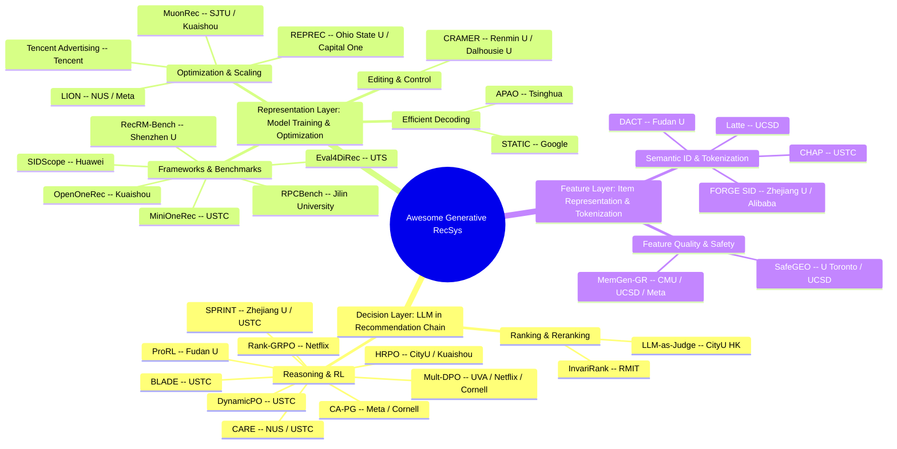

# Awesome Generative Recommendation System (RecSys)

```
 ██████╗                ██████╗                ███████╗                
██╔════╝  ███╗  ███╗    ██╔══██╗ ███╗   ███╗   ██╔════╝██╗ ██╗ ██████╗ 
██║      ██╔═██╗████╗   ██████╔╝██╔═██╗██╔═██╗ ███████╗╚██╗██║ ██╔═══╝ 
██║  ███╗██████║██╔██╗  ██╔══██╗██████║██║ ╚═╝ ╚════██║ ╚███╔╝ ██████╗ 
██║   ██║██║    ██║╚██╗ ██║  ██║██║    ██║ ██╗      ██║  ██╔╝      ██║
╚██████╔╝╚████╗ ██║ ╚██╗██║  ██║╚████╗ ╚███╔═╝ ███████║  ██║   ██████║
 ╚═════╝  ╚═══╝ ╚═╝  ╚═╝╚═╝  ╚═╝ ╚═══╝  ╚══╝   ╚══════╝  ╚═╝   ╚═════╝
```
---

[](https://github.com/sindresorhus/awesome)

RecSys is starting to adopt LLM for feature extraction, retrieval, and ranking/re-ranking! Although you can get some hands-on materials in either the [classics](#papers-classic-must-read) or some surveys, but since you're already interested in applying generative AI to industrial tasks, you probably wanna stay on the bleeding edge, right? That's exactly what this repo is for — automatically updated daily by agents with the latest generative RecSys papers fresh off arXiv, making sure that you never miss a beat.

> [!IMPORTANT]
> For those who are not familiar with GenRec, or not even the recommendation system, please checkout the kickstart posts [here](docs/kickstart.md).
> These posts are in Chinese, for English simply do your browser's internal translation or turn to __Ask Gemini__ :shipit:

## Quick Indexing
- [By Date](#by-date)
- [By Opensource](#by-opensource)
- [By Keyword](#by-keyword)
- [By Affiliation](#by-affiliation)
- [Papers Classic Must Read](#papers-classic-must-read)
- [Verl-GR: An Awesome RL Toolkit for GenRecSys](#verl-gr-an-awesome-rl-toolkit-for-genrecsys)


```mermaid
mindmap
  root((Awesome Generative RecSys))
    Decision Layer: LLM in Recommendation Chain
      Reasoning & RL
        Rank-GRPO -- Netflix
        DynamicPO -- USTC
        BLADE -- USTC
        SPRINT -- Zhejiang U / USTC
        CARE -- NUS / USTC
        HRPO -- CityU / Kuaishou
        Mult-DPO -- UVA / Netflix / Cornell
        CA-PG -- Meta / Cornell
        ProRL -- Fudan U
      Ranking & Reranking
        InvariRank -- RMIT
        LLM-as-Judge -- CityU HK
    Representation Layer: Model Training & Optimization
      Editing & Control
        CRAMER -- Renmin U / Dalhousie U
      Frameworks & Benchmarks
        MiniOneRec -- USTC
        OpenOneRec -- Kuaishou
        RecRM-Bench -- Shenzhen U
        SIDScope -- Huawei
        RPCBench -- Jilin University
        Eval4DiRec -- UTS
      Efficient Decoding
        STATIC -- Google
        APAO -- Tsinghua
      Optimization & Scaling
        MuonRec -- SJTU / Kuaishou
        REPREC -- Ohio State U / Capital One
        Tencent Advertising -- Tencent
        LION -- NUS / Meta
    Feature Layer: Item Representation & Tokenization
      Semantic ID & Tokenization
        Latte -- UCSD
        FORGE SID -- Zhejiang U / Alibaba
        DACT -- Fudan U
        CHAP -- USTC
      Feature Quality & Safety
        SafeGEO -- U Toronto / UCSD
        MemGen-GR -- CMU / UCSD / Meta

```
<div align="center">
  <i> Open-source Generative RecSys Map </i>
</div>

---
## `Verl-GR`: An Awesome RL Toolkit for GenRecSys
If you are interested in RFT your own GenRecSys, come check out our `verl`-based implementation called `verl-gr` here:
* [https://github.com/HaFred/verl-GR/tree/main/verl_gr/recipes/openonerec](https://github.com/HaFred/verl-GR/tree/main/verl_gr/recipes/openonerec)
* [https://github.com/HaFred/verl-GR/tree/main/verl_gr/recipes/rankgrpo](https://github.com/HaFred/verl-GR/tree/main/verl_gr/recipes/rankgrpo)

We manage to achieve 22% and 32% boosting for the end-to-end training efficiencies, compared with their respective vanilla implementations.

## By Date

We only keep the last 10 days summary below, for the past records before these, please see [the archive](docs/archive_by_month).

---

### Papers September 30

*Wednesday, September 30, 2026. The Tuesday Sep 29 cs.IR announcement batch (submitted through Sep 29) carried three on-topic generative / LLM / agentic-rec papers absent from the repo: GRP v0.1 (Snap) is an industrial end-to-end generative recommendation paradigm that unifies retrieval, ranking, and reward modeling in one encoder-decoder model with an mGRPO reward objective and a progressive deployment path; ReMem (PolyU / NTU) builds long-context recommendation agents with OCR-based multimodal perception and a multi-memory GRPO variant; HELIX (TikTok) is a purified unified large-scale ranking architecture jointly scaling feature interaction and sequence modeling, lifting e-commerce video GMV ~6%. Total: 3 papers (0 opensource).*

1. **GRP v0.1 Technical Report**
   * Affiliation: Snap Inc. — GRP Team *(Wenfeng Zhuo, Vincent Xue, Charles Wei, et al.)*
   * Link: [arxiv.org/abs/2609.36688](https://arxiv.org/abs/2609.36688)
   * Venue: arXiv preprint, September 2026 (cs.IR; submitted 29 Sep 2026)
   * TL;DR: An industrial end-to-end generative recommendation paradigm (GRP, Snap) that unifies retrieval, ranking, and reward modeling in one encoder-decoder model with multimodal Semantic IDs and an mGRPO reward objective, deployed via a progressive path that slots the generator behind the existing funnel.
   * Key techniques:
     - Single encoder-decoder trunk decodes a slate of multimodal Semantic IDs block-wise and independently
     - Jointly-trained multi-head prediction (MHP) ranking module, reused frozen as the reward model for RL post-training
     - mGRPO: GRPO plus a one-sided reference-anchored margin that protects logged-target likelihood
     - Progressive deployment: introduce as one retrieval source, retire beaten sources, let growing quota bypass early/late rankers
     - Serving optimizations (asynchronously refreshed SID-to-item catalog) cut end-to-end retrieval latency 69%
   * Scores (Opensource? / Novelty / Fairness / Robustness / Impact):
     - **Opensource?: 0/10** — no public code; Snap industrial system
     - **Novelty: 8/10** — the progressive E2E-deployment path + mGRPO margin is a pragmatic framing of the real "swap-overnight fails" gap
     - **Fairness: 0/10** — not fairness-focused
     - **Robustness: 8/10** — online A/B across retrieval-only, early-ranking bypass, and source replacement; 69% latency cut; but online GMV lifts modest (0.46-2.56%)
     - **Impact: 9/10** — Snap production; influential paradigm paper for industrial generative recommendation

2. **ReMem: Rethinking Perception and Memory in Long-Context Recommendation Agents**
   * Affiliation: The Hong Kong Polytechnic University — *(Haohao Qu, Yongcheng Jing, Chun Hin Chan, Shanru Lin)* + Nanyang Technological University *(Wenqi Fan, Dacheng Tao)*
   * Link: [arxiv.org/abs/2609.37311](https://arxiv.org/abs/2609.37311)
   * Venue: arXiv preprint, September 2026 (cs.AI / cs.IR; submitted 29 Sep 2026)
   * TL;DR: A recommendation-agent framework combining OCR-based multimodal perception with a time-evolving dynamic memory and a multi-memory GRPO variant that propagates final-answer advantage to all intermediate conversations.
   * Key techniques:
     - OCR-based multimodal perception: reads item pages via screenshots, extracts structured info with an OCR tool (platform-agnostic vs raw-HTML parsing)
     - Chunk-wise sequential memory update: fixed-size memory of informative interactions with linear inference cost and bounded context
     - Multi-memory GRPO: propagates the final-answer advantage to all intermediate conversations contributing to the response
     - Validated on three recommendation-agent tasks: searching, ranking, judging
   * Scores (Opensource? / Novelty / Fairness / Robustness / Impact):
     - **Opensource?: 0/10** — no public code (work in progress)
     - **Novelty: 7/10** — OCR perception + dynamic memory + multi-memory GRPO for RecAgents is a coherent, fresh agent pipeline
     - **Fairness: 0/10** — not fairness-focused
     - **Robustness: 7/10** — +5.16% avg over SOTA on 3 RecAgent tasks, but no online test and self-reported baselines; "work in progress"
     - **Impact: 7/10** — PolyU / NTU; hot RecAgent + GRPO direction

3. **HELIX: Purified and Unified - Rethinking Feature Interaction and Sequence Modeling for Large-Scale Recommendation**
   * Affiliation: TikTok — TikTok E-commerce Recommendation *(Yuntao Zheng, Miao Zhang, Yadong Ding, et al.)*
   * Link: [arxiv.org/abs/2609.37183](https://arxiv.org/abs/2609.37183)
   * Venue: arXiv preprint (technical report), September 2026 (cs.IR; submitted 29 Sep 2026)
   * TL;DR: A purified and unified industrial ranking architecture that interleaves sequence retrieval and feature interaction with one-way information flow from reusable sequence states to candidate-conditioned mix-tokens, enabling asymmetric scaling of both axes; deployed on TikTok e-commerce (+~6% GMV/user).
   * Key techniques:
     - Jointly scales feature interaction and sequence modeling (each alone hits a limited scaling ceiling)
     - Interleaves sequence retrieval and feature interaction, enforcing one-way flow from reusable sequence states to mix-tokens
     - Amortizable user-side sequence computation; cross-depth communication between the two axes preserved
     - Deployed in TikTok e-commerce; online A/B +~6% e-commerce video GMV per user
   * Scores (Opensource? / Novelty / Fairness / Robustness / Impact):
     - **Opensource?: 0/10** — no public code; TikTok industrial system
     - **Novelty: 7/10** — the "joint scaling ceiling" insight and purified unified architecture is a pragmatic industrial advance
     - **Fairness: 0/10** — not fairness-focused
     - **Robustness: 8/10** — production-deployed, consistent offline CTR/CVR AUC gains, +~6% online GMV
     - **Impact: 9/10** — TikTok production deployment; high industrial relevance

### Papers September 29

*Tuesday, September 29, 2026. The Monday Sep 28 cs.IR announcement batch (submitted through Sep 28, announced Sep 29) carried five on-topic generative / diffusion / fairness / OPE papers absent from the repo: Eval4DiRec (UTS, opensource) is the first unified open-source evaluation framework for diffusion-based recommender systems covering 14 models; EvoSkillRec (Huawei Noah's Ark Lab / CityU HK) evolves recommender architectures via LLM-driven skill-genome promotion-and-reuse; SpeakGR (Imperial College London) preserves language generation while learning Semantic IDs for generative retrievers; Mult-BiW (Université de Montréal, ACM TOIS) mitigates popularity bias with multinomial-likelihood bi-weighting; ED-DR (Waseda) proposes examination-decomposed off-policy ranking evaluators. Total: 5 papers (1 opensource).*

1. **Eval4DiRec: A Unified and Systematic Evaluation Framework for Diffusion-based Recommender Systems**
   * Affiliation: University of Technology Sydney — *(Cong Wang, Shoujin Wang, Yishuo Li, Qi Zhang, Liang Hu, Wenpeng Lu)*
   * Link: [arxiv.org/abs/2609.34404](https://arxiv.org/abs/2609.34404) · [Code](https://github.com/wangcong2001/Eval4DiRec)
   * Venue: ACM TKDD (accepted); arXiv preprint, September 2026 (cs.IR / cs.AI; submitted 28 Sep 2026)
   * TL;DR: The first unified and open-source evaluation framework for diffusion-based recommender systems, supporting 14 representative diffusion RS models across five scenarios with consistent, reproducible protocols.
   * Key techniques:
     - Unified evaluation harness for diffusion-based RSs (14 models, 5 recommendation scenarios)
     - Standardized data processing, training configs, inference procedures, and evaluation protocols
     - Empirical benchmarking exposing key factors / practical challenges in diffusion rec
   * Scores (Opensource? / Novelty / Fairness / Robustness / Impact):
     - **Opensource?: 7/10** — [github.com/wangcong2001/Eval4DiRec](https://github.com/wangcong2001/Eval4DiRec): first unified open-source eval framework for diffusion rec; supports 14 models; documentation/readme present but framework maturity and code-completeness across all 14 models not independently verified
     - **Novelty: 7/10** — first systematic unified benchmark for diffusion-based RS; important but benchmarking-oriented
     - **Fairness: 0/10** — not fairness-focused
     - **Robustness: 7/10** — unified reproducible protocols; framework maturity and coverage TBD
     - **Impact: 8/10** — ACM TKDD; establishes a fair-evaluation foundation for the fast-growing diffusion-rec area; high community value

2. **EvoSkillRec: Skill-Genome Evolution for Recommender Architecture Discovery**
   * Affiliation: Huawei Noah's Ark Lab — *(Xiaopeng Li, Kuo Cai, Bo Chen, Wenlin Zhang, Mengyang Ma, Yingyi Zhang, Zichuan Fu, Yu Yang, Qidong Liu, Yiyu Wang, Ruiming Tang, Wenwu Ou, Jiang Wu, Zhanbo Xu, Xiangyu Zhao)* + City University of Hong Kong
   * Link: [arxiv.org/abs/2609.34552](https://arxiv.org/abs/2609.34552)
   * Venue: arXiv preprint, September 2026 (cs.IR; submitted 28 Sep 2026)
   * TL;DR: A promotion-and-reuse framework that evolves recommender architectures via LLM-driven code evolution over atomic "skill genomes," with a constrained skill-space and an open-ended code-space plus an autoresearch controller.
   * Key techniques:
     - Decomposes recommenders into atomic executable skills; architectures as typed skill genomes (IO types, semantic annotations, code)
     - Constrained skill-space: mutate / recombine / specialize / reuse validated skills
     - Open-ended code-space: LLM planners + synthesizers invent new skill modules using prior evolution traces
     - Autoresearch controller: evaluates, diagnoses, retrieves skills, promotes innovations, allocates proposal budget
     - Validated on CTR prediction, multi-task, multi-domain learning, and FLOPs co-optimization in generative ranking
   * Scores (Opensource? / Novelty / Fairness / Robustness / Impact):
     - **Opensource?: 0/10** — no public code
     - **Novelty: 8/10** — skill-genome promotion-and-reuse for cumulative architecture evolution is a fresh AutoML-for-rec angle
     - **Fairness: 0/10** — not fairness-focused
     - **Robustness: 7/10** — consistent gains across CTR / multi-task / multi-domain, but LLM-driven edits can be unstable
     - **Impact: 8/10** — Huawei / CityU; directly relevant to industrial architecture automation and generative ranking

3. **Can Generative Retrievers Learn Semantic IDs Without Forgetting How to Speak? (SpeakGR)**
   * Affiliation: Imperial College London — *(Junchen Fu, Kleomenis Katevas, Vandana Rajan, Sofia Celi, Hamed Haddadi)*
   * Link: [arxiv.org/abs/2609.35430](https://arxiv.org/abs/2609.35430)
   * Venue: arXiv preprint, September 2026 (cs.IR; submitted 28 Sep 2026)
   * TL;DR: SpeakGR is a dual-objective framework that learns document Semantic IDs for generative retrieval while preserving the LLM's natural-language generation via on-policy forward-KL distillation, with an adaptive variant that tunes preservation strength by language drift.
   * Key techniques:
     - Supervised SID learning + speak-preserving regularization (on-policy distillation to a frozen original-model copy, forward KL over text vocab)
     - Adaptive SpeakGR: dynamically adjusts preservation strength from observed language drift
     - Reduces WikiText-2 forward KL by 81.3-93.8% (MS MARCO) and 81.2-85.2% (NQ) while retaining retrieval across 3 LLMs
   * Scores (Opensource? / Novelty / Fairness / Robustness / Impact):
     - **Opensource?: 0/10** — no public code linked
     - **Novelty: 7/10** — explicitly addresses SID-learning language drift for interactive gen-retrieval; clean fix
     - **Fairness: 0/10** — not fairness-focused
     - **Robustness: 7/10** — large language-drift reduction while retaining retrieval across 3 LLMs
     - **Impact: 7/10** — Imperial College London; relevant for gen-retrieval systems that also generate text

4. **Mitigating Popularity Bias in Recommendation with Global Listwise Learning and Progressive Bi-Weighting (Mult-BiW)**
   * Affiliation: Université de Montréal — *(Tianyu Zhu, Jiandong Ding, Yansong Shi, Guoqing Chen, Jian-Yun Nie)*
   * Link: [arxiv.org/abs/2609.35041](https://arxiv.org/abs/2609.35041)
   * Venue: ACM TOIS (accepted); arXiv preprint, September 2026 (cs.IR; submitted 28 Sep 2026)
   * TL;DR: Mult-BiW mitigates popularity bias with a multinomial-likelihood IPS framework (Mult-IPS) plus a bi-weighting strategy (propensity + collection model, smoothed) and a progressive transition from representation learning to debiasing.
   * Key techniques:
     - Mult-IPS: multinomial likelihood + IPS for global, unbiased user preferences over the full item set
     - Bi-Weighting (BiW): jointly uses propensity scores and a collection model with smoothing
     - Theoretical bias upper bound and optimal collection-model form
     - Progressive Bi-Weighting: gradually shifts from discriminative representation learning to popularity debiasing
   * Scores (Opensource? / Novelty / Fairness / Robustness / Impact):
     - **Opensource?: 0/10** — no public code linked
     - **Novelty: 6/10** — a competent but incremental IPS-debiasing extension
     - **Fairness: 8/10** — directly targets popularity-bias mitigation (debiasing)
     - **Robustness: 7/10** — theoretical bias bound + progressive strategy; experiments on real datasets
     - **Impact: 7/10** — ACM TOIS; solid debiasing contribution

5. **Recommendation Ranking Off-Policy Evaluation under Ranking-Dependent Examination via Examination-Relevance Decomposition (ED-DR)**
   * Affiliation: Waseda University, Japan — *(Riki Okamura, Toshiharu Sugawara)*
   * Link: [arxiv.org/abs/2609.35034](https://arxiv.org/abs/2609.35034)
   * Venue: arXiv preprint, September 2026 (cs.IR / cs.LG; submitted 28 Sep 2026)
   * TL;DR: ED-DR proposes two off-policy ranking evaluators that decompose clicks into examination and relevance: LE-IIPS (corrects IIPS bias) and ED-DR (doubly robust), unbiased under ranking-dependent examination.
   * Key techniques:
     - Decomposes clicks into examination and relevance
     - LE-IIPS: latent-examination independent IPS corrected by policy examination-probability ratios
     - ED-DR: examination-decomposed doubly robust estimator
     - Unbiased if examination probabilities are correct regardless of relevance, or under ranking-independent examination even if both estimates are inaccurate
   * Scores (Opensource? / Novelty / Fairness / Robustness / Impact):
     - **Opensource?: 0/10** — no public code linked
     - **Novelty: 6/10** — examination-relevance decomposition for OPE; methodological but within established OPE lines
     - **Fairness: 0/10** — not fairness-focused
     - **Robustness: 7/10** — lower MSE than existing estimators at large samples; limitations under small samples / cascade behavior noted
     - **Impact: 6/10** — Waseda; OPE methodology for rec ranking
### Papers September 28

*Monday, September 28, 2026. arXiv active — the Monday Sep 28 cs.IR announcement batch (11 new submissions plus 10 cross-lists) carried five on-topic generative / LLM / agentic-rec papers absent from the repo: T-RoPE (Shopify) makes rotary position embeddings time-aware for sequential generative recommendation and lifts a 6B-interaction industrial dataset by 13–82%; RecToolBench (UVA / Jilin U / Squirrel AI / PolyU, opensource) is an MCP-based benchmark for tool-orchestration recommender agents under fuzzy intent; KuaFu (Tencent) is a unified behavior-compression layer deployed at billion scale (+1.37% GMV); Recommendation World Models (UBC et al.) frames target-aware slate selection as a utility-anchored world-model control problem; AgentRecommender (NII) builds customizable user-side recommenders from LLM-agent investigation with no extra data. Total: 5 papers (1 opensource).*

1. **T-RoPE: Time-Aware Rotary Position Embedding for Sequential Recommendation**
   * Affiliation: Shopify — *(Yang Liu, Shuying Sun, Akshay Soni, Zhong Wu, Linjun Yang)* + MIT (Noel Loo), Liquid AI (Ali Khanafer)
   * Link: [arxiv.org/abs/2609.30576](https://arxiv.org/abs/2609.30576)
   * Venue: arXiv preprint, September 2026 (cs.AI / cs.IR / cs.LG; submitted 24 Sep 2026)
   * TL;DR: Replaces index-only RoPE rotation with timestamp-based angles, learnable temporal coefficients, multiscale frequency banks, shifted query alignment, and non-stationary key rotation, breaking standard RoPE's time-translation invariance for sequential generative recommendation.
   * Key techniques:
     - Time-aware RoPE rotates attention by real timestamps instead of interaction indices
     - Learnable temporal coefficients + multiscale frequency banks capture behavioral cycles across scales and calendar phase
     - Shifted query alignment and non-stationary key rotation break time-translation invariance (proved: standard RoPE even on timestamps cannot distinguish seasonal contexts)
     - Linear-cost forward/backward algorithms (cost linear in sequence length and head dimension)
     - Validated on 5 public benchmarks, a 6B-interaction industrial e-commerce dataset, and a Shop App online A/B test
   * Scores (Opensource? / Novelty / Fairness / Robustness / Impact):
     - **Opensource?: 0/10** — no public code or repository; proprietary data and production infrastructure
     - **Novelty: 8/10** — first to prove and break RoPE's time-translation invariance in generative rec; clean theoretical + practical contribution
     - **Fairness: 0/10** — not fairness-focused
     - **Robustness: 8/10** — best on every metric across 5 public datasets, +13–82% over HSTU+Time RAB on 6B industrial data, positive Shop App A/B (+0.33% CVR, +0.63% orders)
     - **Impact: 9/10** — Shopify production deployment, strong empirical gains, widely applicable to large generative recommenders

2. **RecToolBench: Benchmarking Recommendation-Specific Tool Orchestration under Fuzzy User Intent**
   * Affiliation: University of Virginia — *(Xiao Chen)* + Jilin University, Squirrel AI Learning, The Hong Kong Polytechnic University
   * Link: [arxiv.org/abs/2609.30717](https://arxiv.org/abs/2609.30717) · [Code](https://github.com/ShawnChenn/RecToolBench)
   * Venue: EMNLP 2026; arXiv preprint, September 2026 (cs.IR; submitted 25 Sep 2026)
   * TL;DR: An MCP-based benchmark (1,200+ executable tasks, 13 MCP servers, 32 tools across three rec domains) for evaluating tool-using recommender agents under fuzzy user instructions.
   * Key techniques:
     - Model Context Protocol (MCP) harness for recommendation-specific tool orchestration
     - synthesize–fuzzify–judge pipeline that generates executable fuzzy recommendation tasks
     - Rule-based execution checks + rubric-based LLM-as-judge evaluation of agent trajectories
     - Coverage of single-tool, parallel, sequential, and hybrid tool orchestration
   * Scores (Opensource? / Novelty / Fairness / Robustness / Impact):
     - **Opensource?: 6/10** — [github.com/ShawnChenn/RecToolBench](https://github.com/ShawnChenn/RecToolBench): framework released (MCP servers, benchmark runner, L1–L4 eval scripts, agent executor), but the task-synthesis pipeline and dataset are withheld until paper acceptance; no stars yet, README-only documentation
     - **Novelty: 7/10** — first MCP-based benchmark isolating tool orchestration under fuzzy intent for recommender agents
     - **Fairness: 0/10** — not fairness-focused
     - **Robustness: 6/10** — benchmark (not a method); shows syntactic-valid calls ≠ successful recs, but no downstream rec-quality robustness claim
     - **Impact: 7/10** — UVA / Jilin U / Squirrel AI / PolyU; EMNLP 2026; concrete bottleneck identification for agentic recsys

3. **KuaFu: Compressing Long User Behavior into Understanding at Billion Scale**
   * Affiliation: Tencent — Tencent Advertising and Recommendation Platform — *(Jiahao Hui, Lin Zhu, Yishen Hu, et al.)*
   * Link: [arxiv.org/abs/2609.31045](https://arxiv.org/abs/2609.31045)
   * Venue: arXiv preprint, September 2026 (cs.IR / cs.CL / cs.LG; submitted 25 Sep 2026)
   * TL;DR: A unified behavior-compression layer that compresses each user behavior item into 2–4 tokens (≈10× token / 20× width), powering conversational agents, generative recommenders, and personalized ads at billion-user scale; deployed at Tencent (+1.37% GMV).
   * Key techniques:
     - Two-axis projector compresses each behavior item into 2–4 tokens of width 128–256 (per-item cache 10 KB → 0.5 KB)
     - Fidelity-oriented four-stage training with layered intermediate evaluation
     - Serves conversational agents, generative recommenders, and personalized advertising from one compressed representation
     - Deployed on Tencent ad/rec platform for 10 months: +37–350% per-GPU throughput, saves 190 GPUs, +1.37% overall GMV
   * Scores (Opensource? / Novelty / Fairness / Robustness / Impact):
     - **Opensource?: 0/10** — no public code; industrial system at Tencent
     - **Novelty: 7/10** — unified compression layer shared across conversational / gen-rec / ads tasks is a pragmatic industrial advance
     - **Fairness: 0/10** — not fairness-focused
     - **Robustness: 8/10** — production-deployed 10 months at billion scale, beats prior compressors at same ratio (+17.7 EM OOD), 4B > 8B on RecBench
     - **Impact: 9/10** — Tencent production, +1.37% GMV, 190 GPUs saved; high industrial relevance

4. **Recommendation World Models for Future-State Control (UA-TWM)**
   * Affiliation: The University of British Columbia, Canada — *(Jinfeng Xu, Victor C. M. Leung)* + Hong Kong Polytechnic University, HKUST, Peking University, University of Luxembourg, University of Malaya, The University of Hong Kong, Shenzhen University
   * Link: [arxiv.org/abs/2609.30711](https://arxiv.org/abs/2609.30711)
   * Venue: arXiv preprint, September 2026 (cs.IR; submitted 25 Sep 2026)
   * TL;DR: A utility-anchored world-model interface (UA-TWM) that models the future consequences of slate actions around a trained sequential ranker, enabling target-aware slate selection subject to utility constraints.
   * Key techniques:
     - Utility-anchored world-model interface constructs nearby slate actions and estimates their target-relevant consequences
     - Reference slate fallback when no alternative qualifies under utility constraints
     - Logged-replay instantiation: utility + target-gain estimates with calibrated failure-risk prediction
     - Closed-loop instantiation: one-step state-action prediction, updates after observed feedback
     - Transfer across 12 sequential backbones (MovieLens-25M, KuaiRand-Pure) + KuaiSim target-directed interaction
   * Scores (Opensource? / Novelty / Fairness / Robustness / Impact):
     - **Opensource?: 0/10** — no public code or repository found
     - **Novelty: 8/10** — reframing slate selection as future-state control via a non-LLM world-model interface is a fresh angle
     - **Fairness: 0/10** — not fairness-focused
     - **Robustness: 7/10** — improves Recall@20 / NDCG@20 / future-state alignment for every matched logged backbone; risk-aware gating
     - **Impact: 7/10** — UBC-led multi-institution collaboration; solid empirical transfer but offline / eval-sim only

5. **AgentRecommender: LLM Agents Enable Customizable Recommender Systems on the User Side**
   * Affiliation: National Institute of Informatics (NII), Japan — *(Ryoma Sato)*
   * Link: [arxiv.org/abs/2609.31166](https://arxiv.org/abs/2609.31166)
   * Venue: arXiv preprint, September 2026 (cs.IR / cs.AI / cs.DB / cs.DL; submitted 25 Sep 2026)
   * TL;DR: Leverages the investigation capability and internal knowledge of LLM agents to build customizable user-side recommender systems without additional user data, shifting control from platforms to users.
   * Key techniques:
     - LLM-agent investigation replaces hand-built user-side rec pipelines
     - Users customize a recommender to their own preferences with no extra training data
     - User-side paradigm counters platform lock-in, clickbait, filter bubbles, and fake news
   * Scores (Opensource? / Novelty / Fairness / Robustness / Impact):
     - **Opensource?: 0/10** — no public code repository for this paper found (a similarly named unrelated project exists)
     - **Novelty: 7/10** — user-side, customizable rec via LLM-agent investigation is a distinct paradigm
     - **Fairness: 5/10** — motivationally addresses filter bubbles / fake news / platform lock-in, but no fairness method or evaluation
     - **Robustness: 3/10** — no offline or online empirical metrics disclosed; conceptual / position paper
     - **Impact: 6/10** — NII; thought-provoking direction but unvalidated empirically

### Papers September 27

*Sunday, September 27, 2026. The live 24h arxiv window was empty (Sunday — no cs.IR announcement batch posts on weekends), so the minimum-5-papers fallback was invoked: a 3-month sweep (cs.IR / LLM-rec queries, cutoff >=2026-06-27) surfaced exactly 5 genuinely-uncatalogued on-topic papers (absent from README By Date and the monthly archives by arxiv ID). 3 are opensource. Note: CRAMER had previously been partially catalogued (By Opensource row + affiliation rows + the July archive) but never received a proper By Date daily entry under its real arxiv ID 2608.25370 — that gap is closed here, so the opensource count increments by only 2 (REPREC, X-KGRank) -> 191.*

1. **CRAMER: Control via Request-Aware Masking for Editing Recommenders**
   * Affiliation: Renmin University of China — *(Zhiyuan Julian Su, Naihe Feng, Zhen Luther Qin, Ga Wu)* + Dalhousie University
   * Link: [arxiv.org/abs/2608.25370](https://arxiv.org/abs/2608.25370) · [Code](https://github.com/zhiyuansu0326/CRAMER-ICML2026)
   * Venue: ICML 2026; arXiv preprint, August 2026 (cs.IR / cs.AI / cs.LG; submitted 26 Aug 2026)
   * TL;DR: Treats a user's natural-language request as a control signal that modulates frozen sequential-recommender backbone parameters through masking, enabling instant request-aware adaptation with minimal overhead (no retraining, no LLM prompt engineering).
   * Key techniques:
     - Request-aware masking that edits frozen backbone behavior on the fly in response to explicit user requests
     - Control-theory framing: requests = control signals, backbone parameters = the plant to be modulated
     - Enhanced controllability and cross-domain adaptability demonstrated on multiple large-scale benchmark datasets
   * Scores (Opensource? / Novelty / Fairness / Robustness / Impact):
     - **Opensource?: 7/10** — [github.com/zhiyuansu0326/CRAMER-ICML2026](https://github.com/zhiyuansu0326/CRAMER-ICML2026) (ICML 2026 code release, documented)
     - **Novelty: 7/10** — reframing request adaptation as control-theoretic parameter masking is a fresh angle vs. retraining / prompt-engineering baselines
     - **Fairness: 0/10** — not fairness-focused
     - **Robustness: 7/10** — beats four SOTA request-aware baselines across multiple metrics with minimal overhead
     - **Impact: 7/10** — Renmin University of China / Dalhousie University; a new paradigm for request-aware sequential recommendation

2. **REPREC: Representation Driven Parameter-Efficient Recommendation System**
   * Affiliation: Ohio State University — *(Harshini Kavuru, Dwipam Katariya, Giri Iyengar, Pranab Mohanty, Kalanand Mishra, Raghu Machiraju)* + Capital One AI Foundations
   * Link: [arxiv.org/abs/2607.24845](https://arxiv.org/abs/2607.24845) · [Code](https://github.com/phdbotcode/REPREC)
   * Venue: arXiv preprint, July 2026 (cs.IR / cs.AI; submitted 24 Jul 2026)
   * TL;DR: Conditions a frozen LLM using compact user-level representations via a small MLP injector that maps a fixed-size embedding from a frozen sequential encoder into learned soft tokens.
   * Key techniques:
     - Frozen-LLM + frozen-sequential-encoder; only the lightweight MLP injector is trained
     - Compact soft-token conditioning (parameter-efficient; no LLM fine-tuning, distillation, or item-level conditioning over long histories)
     - Short-history training retains 94–99% of full-history performance at a 1.50x per-epoch training speedup
   * Scores (Opensource? / Novelty / Fairness / Robustness / Impact):
     - **Opensource?: 7/10** — [github.com/phdbotcode/REPREC](https://github.com/phdbotcode/REPREC)
     - **Novelty: 6/10** — a competent but incremental parameter-efficient conditioning take on LLM-based sequential recommendation
     - **Fairness: 0/10** — not fairness-focused
     - **Robustness: 6/10** — consistent gains across sequential encoders, LLM backbones, and user-activity levels
     - **Impact: 6/10** — Ohio State University / Capital One; efficient deployment-oriented adaptation

3. **Weather- and Location-Aware Agentic Dining Recommendation**
   * Affiliation: Independent — *(Kadharmoideen Fadurudeen)*
   * Link: [arxiv.org/abs/2608.07593](https://arxiv.org/abs/2608.07593)
   * Venue: arXiv preprint, August 2026 (cs.HC / cs.AI / cs.IR; submitted 5 Aug 2026); 5 pages, working prototype
   * TL;DR: An LLM-agent that orchestrates location + weather retrieval tools and reasons over the combined context to produce region-sensitive, weather-appropriate dining recommendations without per-region rule tables.
   * Key techniques:
     - Tool orchestration: Google location services + a weather service feeding an OpenAI LLM
     - Region-specific weather-to-cuisine reasoning drawn from latent LLM world knowledge (no hand-crafted rules)
     - Explicit limitations discussion: no formal user study, risk of cultural stereotyping in locality-based inference
   * Scores (Opensource? / Novelty / Fairness / Robustness / Impact):
     - **Opensource?: 0/10** — no public code repository
     - **Novelty: 5/10** — a clean architectural pattern for environmental/cultural context in agentic rec, but proof-of-concept scale
     - **Fairness: 0/10** — not fairness-focused
     - **Robustness: 4/10** — working prototype, no rigorous evaluation / user study
     - **Impact: 4/10** — Independent; extensible reference pattern rather than a benchmarked system

4. **Fair on the Surface? Benchmarking Hidden-Output Fairness Gaps in LLM Recommenders**
   * Affiliation: University of Georgia — *(Chan Aristella Lu, Arya Fayyazi, Junhao Zhang, Saeid Shokoufa, Yue Xing, Zhen Xiang, Kyu Hyung Lee, Mehdi Kamal, Massoud Pedram)* + University of Southern California + Carnegie Mellon University + Michigan State University
   * Link: [arxiv.org/abs/2608.08284](https://arxiv.org/abs/2608.08284)
   * Venue: arXiv preprint, August 2026 (cs.AI; submitted 8 Aug 2026)
   * TL;DR: FairGap, the first benchmark that jointly evaluates observable output shift (OBS) and hidden representation shift (IBS) in LLM recommenders via counterfactual identity probes — exposing pervasive hidden-output decoupling.
   * Key techniques:
     - Dual-level fairness audit: OBS (output) + IBS (internal representation) across gender / age / race
     - Representation-Output Alignment (ROA) with quadrant diagnostics for user-level hidden-output mismatch
     - Shows activation steering that cuts IBS up to 8x simultaneously worsens OBS — a fundamental internal/output fairness tension existing frameworks cannot diagnose
   * Scores (Opensource? / Novelty / Fairness / Robustness / Impact):
     - **Opensource?: 0/10** — benchmark described in detail, but no public code repository linked
     - **Novelty: 7/10** — first to jointly audit hidden representation shift alongside observable output in LLM recommenders
     - **Fairness: 8/10** — directly targets fairness; reveals output-only audits miss a large hidden-mismatch user population
     - **Robustness: 6/10** — applied to six open-weight LLM families across three domains with controlled counterfactual probes
     - **Impact: 7/10** — University of Georgia / USC / CMU / Michigan State; reframes the fairness-evaluation agenda for LLM recommenders

5. **X-KGRank: A Knowledge Graph RAG Framework for Explainable Recommendations**
   * Affiliation: San Jose State University — *(Meenakshi Rajpurohit, Jainish Patel; Dept. of Computer Engineering)*
   * Link: [arxiv.org/abs/2608.01732](https://arxiv.org/abs/2608.01732) · [Code](https://github.com/MeenakshiRajpurohit/graph-rag-recommend)
   * Venue: arXiv preprint, August 2026 (cs.IR / cs.AI; submitted 3 Aug 2026)
   * TL;DR: Unifies structural collaborative filtering (LightGCN over a MovieLens-1M knowledge graph in Neo4j) with LLM-based explanation via pattern mining and LLM re-ranking.
   * Key techniques:
     - Heterogeneous KG (9,762 nodes / 999,264 edges; RATED / HAS_GENRE / CO_RATED) persisted in Neo4j
     - LightGCN ranker with content-aware SBERT initialization + rating-weighted BPR; popularity-selective routing grounds long-tail items (~50% fewer KG-augmented generations)
     - +17.1% NDCG@10 / +14.6% MRR over a popularity baseline; a 1.5B model (Qwen2.5-1.5B) matches a 7B model (Mistral-7B) on explanation quality
   * Scores (Opensource? / Novelty / Fairness / Robustness / Impact):
     - **Opensource?: 7/10** — [github.com/MeenakshiRajpurohit/graph-rag-recommend](https://github.com/MeenakshiRajpurohit/graph-rag-recommend)
     - **Novelty: 6/10** — a solid KG-RAG + LightGCN + LLM-reranking pipeline; engineering contribution more than conceptual novelty
     - **Fairness: 0/10** — not fairness-focused
     - **Robustness: 6/10** — evaluated on MovieLens-1M with three LLM backbones and a 99-sample protocol
     - **Impact: 6/10** — San Jose State University; a reproducible explainable-rec baseline

### Papers September 26

*Saturday, September 26, 2026. The Friday 25 Sep cs.IR announcement batch carried the on-topic generative/LLM-rec papers, but the live 24h window was mostly already catalogued on Sep 25; scanning the full new listing surfaced 6 genuinely-new on-topic papers (submitted 23–30 Sep, plus 27 Aug), satisfying the 5-paper floor with no 3-month fallback. 0 opensource. Core: two industrial generative-retrieval systems — ByteDance OneTrans-V2 (one Transformer unifying retrieval/pre-rank/fine-rank with Decision-Conditioned Generative Retrieval, +9.74% GMV) and TikTok X-Rec (flow matching in continuous embedding space, 3.46× throughput vs SID-AR, deployed on TikTok); Kuaishou AgentX-Model (dual-agent long-horizon rec research autonomy); plus three academic studies — UHIFlow multimodal uncertainty-aware hierarchical intent via flow matching (WISE 2026), LSF-SR flow-based CVAE fusing ID + LLM semantics for sequential rec (CIKM 2026), and a CIKM 2026 oral exposing the "recall ceiling" that inflates LLM-reranking NDCG by 92–95% under oracle evaluation.*

1. **The Recall Ceiling of LLM Recommendation Reranking**
   * Affiliation: University of Southern California (Viterbi School of Engineering) — *(Zhaohui Wang)*
   * Link: [arxiv.org/abs/2609.27953](https://arxiv.org/abs/2609.27953)
   * Venue: CIKM 2026 (oral); arXiv preprint, September 2026 (cs.IR / cs.LG; submitted 27 Aug 2026)
   * TL;DR: The common oracle evaluation protocol (which guarantees the ground-truth item is present in the scored set) overestimates realistic NDCG@10 by 92–95%; the cause is a recall ceiling — realistic retrieval covers only 2–19% of relevant items at K=100, imposing a hard upper bound on any closed-candidate reranker's top-k NDCG. Proposes the Recall-Aware Evaluation Protocol (RAEP).
   * Key techniques:
     - Proves E[NDCG@k] ≤ Recall@|Wπ| under leave-one-out evaluation, where Wπ is the reranker's candidate window
     - Measures the recall ceiling across 8 datasets in 3 domains: realistic retrieval leaves 81–98% of relevant items unreachable at K=100
     - Stress-tests 7 optimization strategies (prompt engineering, 168× model scaling, sequential models, supervised neural rerankers, LoRA, hybrid retrieval, score-aware prompting, LLM+CF fusion) — none significantly beats the CF baseline under realistic retrieval
     - RAEP: classify the retrieval-recall regime first, then evaluate reranking only where the ceiling permits meaningful differentiation
   * Scores (Opensource? / Novelty / Fairness / Robustness / Impact):
     - **Opensource?: 0/10** — no public code available
     - **Novelty: 7/10** — a clean, falsifiable analysis of an evaluation artifact that quietly inflates LLM-reranking numbers
     - **Fairness: 0/10** — not fairness-focused
     - **Robustness: 7/10** — consistent across 8 datasets / 3 domains with an analytic ceiling bound
     - **Impact: 7/10** — USC; pushes the community to report retrieval recall alongside reranking NDCG

2. **Anatomy of a Decision: Uncertainty-aware Hierarchical Intent Learning via Flow Matching for Multimodal Recommendation (UHIFlow)**
   * Affiliation: Northeastern University, China — *(Yuchen Miao, Zijun Wang, Ke Liu, Siyang Xu)*
   * Link: [arxiv.org/abs/2609.29609](https://arxiv.org/abs/2609.29609)
   * Venue: WISE 2026; arXiv preprint, September 2026 (cs.IR; submitted 30 Aug 2026)
   * TL;DR: UHIFlow quantifies uncertainty from visual and textual modalities via conditional flow matching, then uses that uncertainty to build a personalized hierarchical intent structure — coarse-grained intents for uncertain users, fine-grained intents for confident ones.
   * Key techniques:
     - Cross-modal Uncertainty Synergistic Modeling (CUSM): conditional flow matching quantifies visual/textual uncertainty and lets the two uncertainties regularize each other
     - Uncertainty-guided Hierarchical Intent Generation (UHIG): dynamically constructs a user-specific intent hierarchy conditioned on the quantified uncertainty
     - First method to explicitly model multimodal uncertainty for hierarchical intent discovery in recommendation
   * Scores (Opensource? / Novelty / Fairness / Robustness / Impact):
     - **Opensource?: 0/10** — no public code available (WISE 2026)
     - **Novelty: 7/10** — coupling flow-matching uncertainty estimation with adaptive coarse-to-fine intent hierarchies is a fresh angle on intent modeling
     - **Fairness: 0/10** — not fairness-focused
     - **Robustness: 6/10** — outperforms SOTA on three real-world multimodal datasets; ablations on uncertainty guidance
     - **Impact: 6/10** — Northeastern University, China; advances uncertainty-aware multimodal intent modeling

3. **LSF-SR: Latent Semantic Fusion for Sequential Recommendation via Flow-based Conditional Variational Autoencoders**
   * Affiliation: National Yang Ming Chiao Tung University — *(Shih-Hong Chen, Josh Jia-Ching Ying, Vincent S. Tseng)*
   * Link: [arxiv.org/abs/2609.29815](https://arxiv.org/abs/2609.29815)
   * Venue: CIKM 2026; arXiv preprint, September 2026 (cs.IR; submitted 24 Sep 2026)
   * TL;DR: LSF-SR fuses item ID embeddings and LLM-generated semantic signals with a Conditional Variational Autoencoder augmented by normalizing flows (planar/radial), learning a flexible latent space that clusters semantically similar items; +12.98% Recall@20 / +14.13% NDCG@20 over SOTA.
   * Key techniques:
     - Conditional Variational Autoencoder with Normalizing Flows to fuse collaborative (ID) and semantic (LLM) signals
     - Conditional fusion module with planar/radial flows for a flexible latent manifold that encourages semantic clustering
     - Aligns collaborative and textual knowledge so item representations capture the complementary strengths of both
   * Scores (Opensource? / Novelty / Fairness / Robustness / Impact):
     - **Opensource?: 0/10** — no public code available (CIKM 2026)
     - **Novelty: 6/10** — flow-augmented CVAE for ID+LLM fusion is a competent but incremental take on semantic fusion
     - **Fairness: 0/10** — not fairness-focused
     - **Robustness: 7/10** — consistent gains over behavior-centric and LLM-augmented baselines on five public benchmarks
     - **Impact: 6/10** — National Yang Ming Chiao Tung University; solid sequential-rec contribution

4. **OneTrans-V2: Unifying Retrieval, Pre-rank, and Fine-rank with One Transformer in Industrial Recommender**
   * Affiliation: ByteDance — *(Hannan Cao, Jun Guo, Haolei Pei, Zhaoqi Zhang, Tianyu Wang, Ziyang Wang, Youchen Sun, Yue Xue, Yucheng Mao, Lintao Yan, Yufei Feng, Shaowei Liu, Rongkun Xing, Feiling Gong, Xinyu Chenli, Cong Xu, Mingge Zhang, Yunjia Zhu, Yajing Zhang, Pengfei Ren, Yue Lin)*
   * Link: [arxiv.org/abs/2609.28589](https://arxiv.org/abs/2609.28589)
   * Venue: arXiv preprint, September 2026 (cs.IR; submitted 23 Sep 2026); industrial
   * TL;DR: One Transformer unifies the retrieval/pre-rank/fine-rank cascade — it encodes the user behavior sequence once as shared context, jointly trains the three stages with in-model knowledge distillation, scales with sparse MoE + μP, and introduces Decision-Conditioned Generative Retrieval (DCGR) to steer generation by business objectives; +9.74% GMV and 3.2× throughput.
   * Key techniques:
     - Single shared backbone encoding the user sequence once; stage-specific candidate features and computation preserved
     - Joint training with in-model knowledge distillation (fine-rank → pre-rank)
     - Sparse mixture-of-experts backbone with μP-style parameterization for stable capacity scaling
     - Decision-Conditioned Generative Retrieval (DCGR): predict a decision prefix (oc/disc/ad + aov) then generate items conditioned on it, letting business objectives steer one generative process
     - Sequence-Native Training (SNT) amortizing sequence encoding across exposures; deployed across all three stages, +9.74% GMV, 3.2× throughput under the same hardware
   * Scores (Opensource? / Novelty / Fairness / Robustness / Impact):
     - **Opensource?: 0/10** — no public code available (industrial)
     - **Novelty: 8/10** — unifying the whole cascade into one generative transformer with objective-conditioned generative retrieval is a strong industrial systems result
     - **Fairness: 0/10** — not fairness-focused
     - **Robustness: 8/10** — deployed at scale with measured GMV and throughput gains, plus online A/B
     - **Impact: 8/10** — ByteDance; production-grade unified generative recommender

5. **X-Rec Technical Report**
   * Affiliation: TikTok (TikTok-Data-Content Intelligence & TikTok-Data-Feed Quality) — *(Chenglei Shen, Chenzhe Huang, Dong Jiang, Hongjie Gao, Jue Zhang, Kun Xú, Lincan Cai, Nan Zhuang, Pan Zhang, Shi Chen, Shunchi Zhang, Xiaoyu Ye, Yang Jin, Yu Zhang, Zhenwei An, Zhongtao Jiang, Zhiwei Wang, Kun Xǔ)*
   * Link: [arxiv.org/abs/2609.29180](https://arxiv.org/abs/2609.29180)
   * Venue: arXiv preprint, September 2026 (cs.IR; submitted 24 Sep 2026); industrial technical report
   * TL;DR: X-Rec learns the recommendation distribution directly in continuous item-embedding space via flow matching and generates embedding triggers for ANN retrieval; anchor conditioning + Riemannian flow matching + a late-interaction diffusion Transformer give 3.46× throughput vs SID-AR; deployed on TikTok (+4.15% vertical engagement).
   * Key techniques:
     - Flow matching in continuous item embedding space (vs U2I delta-distribution and SID-AR quantization error / low throughput)
     - Anchor conditioning: decomposes generation into coarse semantic-region selection and fine-grained refinement
     - Riemannian flow matching aligning generative trajectories with the hyperspherical geometry of item embeddings
     - Late-interaction diffusion Transformer restricting repeated velocity-field estimation to the final layer
     - Deployed as a new retrieval source on TikTok: +4.1484% vertical engagement, +0.0111% general engagement
   * Scores (Opensource? / Novelty / Fairness / Robustness / Impact):
     - **Opensource?: 0/10** — no public code available (industrial technical report)
     - **Novelty: 8/10** — continuous-space flow-matching retrieval with Riemannian geometry and late-interaction diffusion Transformer is a distinctive SID-AR alternative
     - **Fairness: 0/10** — not fairness-focused
     - **Robustness: 8/10** — matches SID-AR quality at 3.46× throughput on a streaming benchmark, plus two online launches
     - **Impact: 8/10** — TikTok; deployed production retrieval source

6. **Advancing Model Research in AgentX: Long-Horizon Autonomy for Industrial Recommender Systems (AgentX-Model)**
   * Affiliation: Kuaishou — *(Shuang Yang, Zijie Zhuang, Changxin Lao, Pengbo Xu, Hanwen Xu, Yusheng Huang, Han Gao, Guanchen Wang, Tianbao Ma, Linxun Chen, Peilin Song, Xuming Wang, Chen Li, Fan Wu, Tao Wang, Zibo Zhao, Xiangyu Wu, An Liu, Fei Pan, Peng Jiang, Chen Yang, Zhaojie Liu, Wenwu Ou)*
   * Link: [arxiv.org/abs/2609.30001](https://arxiv.org/abs/2609.30001)
   * Venue: arXiv preprint, September 2026 (cs.AI / cs.IR; submitted 24 Sep 2026); industrial technical report
   * TL;DR: AgentX-Model is a dual-agent framework (Research Agent + Model Agent) for long-horizon autonomy in industrial rec research, organizing work around Reproduce / Follow-up / Composition / Diagnose; 560 of 636 model-changing experiments beat business baselines, with online gains of 10–15% acquisition efficiency, 15–20% target-segment ad spend, and 0.3–0.8% watch time.
   * Key techniques:
     - Dual-agent architecture: a Research Agent writes independently reviewed proposals; a Model Agent runs multi-round experiments returning code, measurements, and open questions
     - Four research actions — Reproduce, Follow-up, Composition, Diagnose — where Diagnose gathers evidence for repairs (e.g., PCOC prediction bias)
     - Business-constrained sandboxes linking proposal development and model experimentation so later experiments build on earlier findings
     - Dependency-aware historical-replay benchmark evaluating research allocation
   * Scores (Opensource? / Novelty / Fairness / Robustness / Impact):
     - **Opensource?: 0/10** — no public code available (industrial technical report)
     - **Novelty: 7/10** — framing rec research as a long-horizon dual-agent autonomy loop with a Diagnose action is a notable agentic-RD lineage extension
     - **Fairness: 0/10** — not fairness-focused
     - **Robustness: 8/10** — 560/636 experiments AUC>baseline plus five online A/B evaluations across business settings
     - **Impact: 8/10** — Kuaishou; production rec-research automation at scale

### Papers September 25

*Friday, September 25, 2026. The Fri 25 Sep cs.IR announcement batch contributed only 3 on-topic generative/LLM-rec papers in the last 24h (all submitted 24 Sep), below the 5-paper floor, so the 3-month fallback was applied, surfacing 2 additional genuinely-new on-topic papers (submitted 7 Sep and 3 Sep, both absent from README). 5 papers total (1 opensource: Evo-Rec / Emory). Core: two Emory / Microsoft / Cornell studies on reasoning + Semantic IDs — retrieval-grounded credit assignment that localizes reward to individual interest hypotheses in SID-reasoning traces, and Evo-Rec, a 3-stage SID-alignment to Best-of-N SFT to ranking-aware GRPO framework (opensource, +19.3% Recall@5 / +32.5% NDCG@10); CMRec cross-country code-mixing for generative recommendation deployed at Alibaba International (CIKM 2026 Short, +1.77% ad revenue / +2.64% orders online A/B); a write-aware KV-cache policy enabling High-Bandwidth Flash for GR serving (Huawei, cs.AR, 3.8-4.7x throughput vs HBM-only, flash lifetime 1yr to 6yr+); and EPIC explicit posterior item-conditioning for SID diffusion recommendation (VinUniversity / Griffith / Aalborg, 4 Amazon benchmarks).*

1. **From Interests to Semantic IDs: Retrieval-Grounded Credit Assignment for Generative Recommendation**
   * Affiliation: Emory University / Microsoft / Cornell University — *(Mengdan Zhu, Yufan Zhao, Yao Zhao, Sophie Di, Tao Di, Yulan Yan, Sridhar Iyer, Liang Zhao)*
   * Link: [arxiv.org/abs/2609.29983](https://arxiv.org/abs/2609.29983)
   * Venue: arXiv preprint, September 2026 (cs.IR / cs.AI; submitted 24 Sep 2026)
   * TL;DR: Identifies a credit-assignment gap in reasoning-enhanced SID generative recommenders trained with group-relative policy optimization under an exact-match SID reward (sparse advantage when all rollouts miss; identical advantage when rollouts share a SID reward regardless of trace quality), and fixes it by grounding each reasoning trace in retrieval so reward is assigned at the hypothesis span level.
   * Key techniques:
     - Retrieval-grounded query attribution: structure each trace into a history summary, a set of interest hypotheses, and a final SID
     - Frozen retriever executes every hypothesis as a catalog query, making each hypothesis independently verifiable rather than judged only through the final SID
     - Rollout rewarded when any of its queries retrieves the target within top-K; per-query hit indicators localize reward to individual hypotheses
     - Span-level credit assignment: only target-hitting hypotheses receive positive retrieval advantage, and the retrieval channel never updates the final SID span, so rollouts sharing a SID reward get different updates
   * Scores (Opensource? / Novelty / Fairness / Robustness / Impact):
     - **Opensource?: 0/10** — no public code available
     - **Novelty: 7/10** — span-level retrieval-grounded credit assignment for SID reasoning traces is a clean, well-motivated fix for a real GRPO failure mode
     - **Fairness: 0/10** — not fairness-focused
     - **Robustness: 7/10** — consistent improvements across three Amazon Reviews datasets, plus an oracle analysis on Video Games showing interest-conditioned SID decoding helps
     - **Impact: 7/10** — Emory / Microsoft / Cornell; directly improves reasoning-enhanced SID generative recommendation

2. **Learning Better Reasoning for Generative Recommendation with Semantic IDs (Evo-Rec)**
   * Affiliation: Emory University / Microsoft / Cornell University — *(Mengdan Zhu, Yufan Zhao, Sophie Di, Yao Zhao, Tao Di, Yulan Yan, Sridhar Iyer, Liang Zhao)*
   * Link: [arxiv.org/abs/2609.29973](https://arxiv.org/abs/2609.29973)
   * Venue: arXiv preprint, September 2026 (cs.IR / cs.AI; submitted 24 Sep 2026)
   * TL;DR: A three-stage framework that learns better reasoning for SID-based generative recommendation — align SIDs with textual/behavioral context, sample-and-select better reasoning traces via Best-of-N SFT, then optimize the reasoning policy with ranking-aware GRPO — outperforming discriminative, generative, and reasoning-enhanced baselines on three Amazon benchmarks.
   * Key techniques:
     - Stage 1 SID alignment: align Semantic IDs with their textual and behavioral contexts so the model understands and generates item identifiers
     - Stage 2 Best-of-N reasoning SFT: sample multiple candidate reasoning traces and retain those that improve prediction of the ground-truth item, giving a stronger reasoning initialization
     - Stage 3 ranking-aware GRPO: optimize the reasoning policy via RL with catalog-constrained item generation and ranking-aware recommendation feedback
     - Code released at github.com/mengdanzhu/evo-rec (3-stage pipeline, eval scripts, checkpoints)
   * Scores (Opensource? / Novelty / Robustness / Fairness / Impact):
     - **Opensource?: 7/10** — [github.com/mengdanzhu/evo-rec](https://github.com/mengdanzhu/evo-rec): official repo with the 3-stage SID-alignment to Best-of-N SFT to ranking-aware GRPO pipeline, eval scripts and checkpoints; deductions: Stage-1 data marked "to be released upon acceptance", single primary maintainer
     - **Novelty: 8/10** — explicitly learning to select and evolve effective reasoning traces via Best-of-N + ranking-aware GRPO is a clear step beyond fixed chain-of-thought GR
     - **Fairness: 0/10** — not fairness-focused
     - **Robustness: 8/10** — consistent gains over discriminative / generative / reasoning baselines across all metrics on three Amazon Review benchmarks (+19.3% Recall@5, +32.5% NDCG@10)
     - **Impact: 8/10** — Emory / Microsoft / Cornell; opensource with checkpoints, directly advances reasoning-based SID recommendation

3. **Cross-Country Code-Mixing for Generative Recommendation (CMRec)**
   * Affiliation: Alibaba International Digital Commerce Group — *(Yuan Gao, Hao Deng, Haibo Xing, Yi Xu, Lingyu Mu, Jinxin Hu, Yu Zhang, Xiaoyi Zeng)*
   * Link: [arxiv.org/abs/2609.28972](https://arxiv.org/abs/2609.28972)
   * Venue: CIKM 2026 Short (cs.IR / cs.AI; submitted 24 Sep 2026)
   * TL;DR: A cross-country generative-recommendation framework that injects cross-country supervision at the data level (not just the parameter level) via dual-constrained, context-aware code-mixing over a shared multi-country semantic codebook, improving recommendation quality in data-sparse countries while preserving data-rich ones.
   * Key techniques:
     - Shared semantic codebook learned from multi-modal content and behavioral co-occurrence across countries
     - Dual-constrained context-aware code-mixing: token-level substitutions satisfying both static (content) and dynamic (price, audience, popularity) constraints
     - Context-aware loss reweighting mixed samples by their plausibility in the current sequence
     - Online A/B on a large-scale e-commerce platform (+1.77% advertising revenue, +2.64% orders)
   * Scores (Opensource? / Novelty / Fairness / Robustness / Impact):
     - **Opensource?: 0/10** — no public code available (CIKM 2026 Short)
     - **Novelty: 7/10** — code-switching-inspired data-level cross-country mixing is a fresh angle on cross-market generative recommendation
     - **Fairness: 0/10** — not fairness-focused
     - **Robustness: 7/10** — two real-world multi-country datasets plus an online A/B test with measurable revenue/order lifts
     - **Impact: 8/10** — Alibaba International; deployed online A/B with +1.77% ad revenue / +2.64% orders

4. **Enabling High-Bandwidth Flash for Generative Recommendation Serving with Write-Aware KV Cache Policy**
   * Affiliation: Huawei — *(Danni Peng, Kai Wu, Tianyu Zuo, Pengfei Xia, Hui Zang)*
   * Link: [arxiv.org/abs/2609.07175](https://arxiv.org/abs/2609.07175)
   * Venue: arXiv preprint, September 2026 (cs.AR; submitted 7 Sep 2026)
   * TL;DR: Evaluates a write-aware KV-cache policy (admission-controlled LRU-K) for High-Bandwidth Flash (HBF) in generative-recommendation serving, decoupling KV-cache writes from misses to cut write traffic and extend flash endurance from ~1 year to 6+ years while keeping 3.8-4.7x throughput vs HBM-only systems.
   * Key techniques:
     - High-Bandwidth Flash (HBF) as a high-capacity, HBM-class-bandwidth KV-cache tier enabling larger KV retention and better serving throughput
     - Write-aware KV-cache policy: admission-controlled LRU-K filters low-reuse users before cache admission, decoupling writes from misses
     - Analytical model characterizing GR serving performance, KV write traffic, and HBF lifetime
     - Evaluation across diverse memory systems and GR workloads
   * Scores (Opensource? / Novelty / Fairness / Robustness / Impact):
     - **Opensource?: 0/10** — no public code available (cs.AR systems paper)
     - **Novelty: 6/10** — applying admission-controlled LRU-K write-awareness to HBF-based KV caching for GR serving is a sensible systems contribution
     - **Fairness: 0/10** — not fairness-focused
     - **Robustness: 6/10** — analytical model + simulation across memory systems and GR workloads (3.8-4.7x vs HBM-only; LRU-K K=10 extends lifetime ~1yr to 6yr+)
     - **Impact: 6/10** — Huawei; addresses a concrete serving/economics bottleneck for KV-cache reuse in GR

5. **EPIC: Explicit Posterior Item Conditioning for Semantic ID Diffusion Recommendation**
   * Affiliation: VinUniversity / Griffith University / Aalborg University — *(Tuan-Binh Tran, Thanh Tam Nguyen, Quoc Viet Hung Nguyen, Dung D. Le, Tung Kieu, Thanh Trung Huynh)*
   * Link: [arxiv.org/abs/2609.03522](https://arxiv.org/abs/2609.03522)
   * Venue: arXiv preprint, September 2026 (cs.IR / cs.LG; submitted 3 Sep 2026)
   * TL;DR: Introduces explicit item-level posterior conditioning into SID masked-diffusion denoising: it builds a personalized posterior over feasible candidate items from the current generation context and recent interactions, then projects it back to unresolved SID positions to guide token decisions, with a frozen backbone and no extra decoder forward pass.
   * Key techniques:
     - Explicit posterior item conditioning (EPIC) into SID masked-diffusion denoising
     - Personalized posterior over feasible candidate items from the current generation context and the user's recent interactions
     - Project the posterior back to unresolved SID positions to guide subsequent token decisions
     - Frozen pretrained backbone; no additional decoder forward pass required
   * Scores (Opensource? / Novelty / Fairness / Robustness / Impact):
     - **Opensource?: 0/10** — no public code available
     - **Novelty: 7/10** — explicit item-level competition / posterior conditioning in SID diffusion is a distinctive departure from position-wise token prediction
     - **Fairness: 0/10** — not fairness-focused
     - **Robustness: 7/10** — consistent improvements over strong baselines on four Amazon benchmarks, with diagnostic analyses attributing gains to personalized transition evidence
     - **Impact: 7/10** — VinUniversity / Griffith / Aalborg; advances masked-diffusion SID generative recommendation

---

### Papers September 24

*Wednesday, September 24, 2026. The Wed Sep 24 cs.IR announcement batch was thin on on-topic generative/LLM-rec papers; 7 of the 8 in-scope papers below were in fact already indexed in the docs files (docs/by_keyword.md and docs/by_affiliation.md) by the Sep 23 three-month fallback, but their README `### Papers` entries were missing and are completed today, while 1 (When LLM-Based User Profiling, submitted 23 Sep) is a fresh last-24h find. 8 papers total (1 opensource: CHAP / USTC). Core: CHAP hierarchical cross-component semantic alignment for personalized generative retrieval with single-pass residual-cascading decoding (USTC, opensource, EMNLP 2026 Findings); SPAR and HF-SID pushing geographic/numeric-fidelity Semantic IDs for AMap POI generative retrieval (HF-SID deployed +6.74% PV_CVR / +6.03% UV_CVR); PrismRec spectral-factorization flow matching for micro-video; MGDiff masking-GNN-guided diffusion for multi-interest sequential recommendation; DiffCold conditional-diffusion resolution of the cold-start seesaw dilemma (ECML-PKDD 2026); Bottom-Up clustering for structure-preserving Semantic IDs (Cornell / PayPal); and a production study on when LLM-based user profiling pays off (DePaul).*

1. **CHAP: Preference Shapes Relevance: Cross-component Hierarchical Semantic Alignment for Personalized Generative Retrieval**
   * Affiliation: University of Science and Technology of China (USTC) — *(Gaoming Zhang, Angqing Jiang, Jianchun Song, Kena Qi, Dayao Chen, Wei Lin, Defu Lian)*
   * Link: [arxiv.org/abs/2608.30553](https://arxiv.org/abs/2608.30553)
   * Venue: Findings of EMNLP 2026 (22 pages, 10 figures, 7 tables; cs.IR / cs.AI; submitted 31 Aug 2026)
   * TL;DR: CHAP is a personalized generative-retrieval framework that hierarchically aligns the query's latent space with the item's quantization path and synergizes discrete Semantic IDs (structural guidance) with continuous representations (fine-grained refinement); a Residual Cascading Generation mechanism restricts the costly Transformer decoder to a single pass, boosting throughput while mitigating information loss.
   * Key techniques:
     - Hierarchical Semantic Alignment: aligns query latent space with item quantization path and synchronizes multi-granular semantics
     - Personalized GR that models user behavior via discrete SIDs + continuous representations
     - Residual Cascading Generation: single-pass inference instead of multi-step autoregressive beam search
     - Code released at github.com/zzzgm/CHAP (3 public + 1 proprietary industrial dataset, online A/B)
   * Scores (Opensource? / Novelty / Fairness / Robustness / Impact):
     - **Opensource?: 8/10** — [github.com/zzzgm/CHAP](https://github.com/zzzgm/CHAP): official repo with code, configs and the industrial-dataset pipeline; deductions: limited standalone documentation / README depth
     - **Novelty: 7/10** — hierarchical cross-component alignment + residual-cascading single-pass decoding is a clean twist on GR decoding
     - **Fairness: 0/10** — not fairness-focused
     - **Robustness: 7/10** — 3 public datasets + 1 proprietary industrial + online A/B tests
     - **Impact: 7/10** — USTC; solid empirical + deployment story for personalized GR

2. **SPAR: Enhancing Industrial-Scale Generative POI Recommendation via Real-World Spatial Perception**
   * Affiliation: AMAP, Alibaba Group — *(Fangye Wang, Yunjin Gu, Haowen Lin, Yifang Yuan, Song Yang, Xiaojiang Zhou, Pengjie Wang)*
   * Link: [arxiv.org/abs/2609.02062](https://arxiv.org/abs/2609.02062)
   * Venue: arXiv preprint, September 2026 (cs.IR; v1 2 Sep 2026, v2 17 Sep 2026)
   * TL;DR: SPAR injects real urban spatial knowledge (distance, direction, reachability) into the generative POI recommendation interest space via three synergistic stages — spatially-intrinsic SID tokenization, geospatial continual pre-training, and task-vector-anchored SFT — so predictions are geographically coherent rather than merely behaviorally plausible.
   * Key techniques:
     - Spatially-Intrinsic SID (SI-SID): sinusoidal geospatial embedding fused with textual semantic, quantized via RQ-Kmeans for semantically + geographically consistent IDs
     - Multi-Granular Geospatial CPT (MG-CPT): continual pre-training on 25 curated geospatial datasets (attributes, pairwise relations, city-scale navigation)
     - Task-Vector Anchored SFT (TV-SFT): freezes acquired spatial knowledge as a parameter-space task vector to prevent catastrophic forgetting during behavioral fine-tuning
   * Scores (Opensource? / Novelty / Fairness / Robustness / Impact):
     - **Opensource?: 0/10** — no public code available
     - **Novelty: 7/10** — explicit spatial-knowledge injection into the generative-rec interest space is a clear LBS contribution
     - **Fairness: 0/10** — not fairness-focused
     - **Robustness: 7/10** — 2 public + 4 industrial-scale datasets, with visualization studies
     - **Impact: 7/10** — Alibaba AMap; directly targets industrial POI generative retrieval

3. **HF-SID: High-Fidelity Semantic IDs for Generative Retrieval in Location-Based Services**
   * Affiliation: AMAP, Alibaba Group — *(Haowen Lin, Jing Li, Zhibin Hao, Fangye Wang, Lihui Su, Song Yang, Xiaojiang Zhou, Pengjie Wang)*
   * Link: [arxiv.org/abs/2608.30479](https://arxiv.org/abs/2608.30479)
   * Venue: arXiv preprint, August 2026 (cs.IR; submitted 31 Aug 2026)
   * TL;DR: HF-SID restores geographic, numerical, and structural fidelity at the representation stage before discretization — 3D Cartesian coordinates, unit-encoded numerics, and structure-based contrastive learning — producing high-fidelity 3-token SIDs at no extra decoding cost; deployed in AMap with +6.74% PV_CVR / +6.03% UV_CVR.
   * Key techniques:
     - Continuous 3D Cartesian coordinate transform so numeric differences reflect true geographic distance
     - Type-aware numerical unit encoding (Geo-CPT, Num-CPT) for scale-robust dynamic attributes
     - Structure-based Contrastive Learning on the last-layer residual to separate co-located POIs differing at the fine level
     - 3-token SID at no extra decoding cost (enriches representation, not the identifier length)
   * Scores (Opensource? / Novelty / Fairness / Robustness / Impact):
     - **Opensource?: 0/10** — deployed industrially at AMap but no public code
     - **Novelty: 7/10** — fidelity-first representation before quantization is a sharp LBS-specific angle
     - **Fairness: 0/10** — not fairness-focused
     - **Robustness: 7/10** — large-scale industrial evaluation + deployment metrics
     - **Impact: 8/10** — Alibaba AMap; measurable online CVR uplift at scale

4. **PrismRec: Preference Flow Matching with Spectral Factorization for Micro-video Recommendation**
   * Affiliation: National University of Defense Technology — *(Xinxin Dong, Haokai Ma, Fei Hu, YuZe Zheng, Bin Wu, Yonghui Yang, Xiaodong Wang)*
   * Link: [arxiv.org/abs/2608.26579](https://arxiv.org/abs/2608.26579)
   * Venue: arXiv preprint, August 2026 (cs.IR; submitted 27 Aug 2026)
   * TL;DR: PrismRec is a preference flow-matching framework for micro-video recommendation that uses Spectral Semantic Factorization to split frame representations into static semantic and dynamic factors via a frequency-domain mask, then Context-Calibrated Preference Matching to inject user-specific calibrated context as a structured condition steering the flow toward the target.
   * Key techniques:
     - Spectral Semantic Factorization (SSF): prior-guided learnable frequency mask separates static semantic vs evolving dynamic factors from frame-level representations
     - Context-Calibrated Preference Matching (CPM): weights factors by each user's sensitivity and injects calibrated context as a structured condition
     - Flow-matching generation with video content as an intrinsic driver of preference formation
   * Scores (Opensource? / Novelty / Fairness / Robustness / Impact):
     - **Opensource?: 0/10** — no public code available
     - **Novelty: 7/10** — spectral (frequency-domain) factorization of video semantics for flow matching is distinctive
     - **Fairness: 0/10** — not fairness-focused
     - **Robustness: 7/10** — 4 datasets from 2 platforms, lowest inference cost / peak memory among compared methods
     - **Impact: 7/10** — micro-video domain; up to 22.65% over SOTA on some datasets

5. **MGDiff: Multi-Interest Sequence Recommendation with Masking GNN-Guided Diffusion**
   * Affiliation: Huazhong University of Science and Technology — *(Wenjing Xiao, Hao Ding)*
   * Link: [arxiv.org/abs/2609.01619](https://arxiv.org/abs/2609.01619)
   * Venue: arXiv preprint, June 2026 (cs.IR; submitted 30 Jun 2026)
   * TL;DR: MGDiff is a multi-interest sequential-recommendation framework using a Masking GNN-guided diffusion model that generates accurate, popularity-bias-free user interest during diffusion, combining dual-layer semantic guidance, a link-reconstructing masking GNN, and a popularity-aware guidance mechanism.
   * Key techniques:
     - Dual-layer Semantic Guidance (DSG): latent item-semantics extraction + multi-dimensional intent decoupling
     - Weight-adaptive Masking GNN: reconstructs missing links to uncover deep item relationships beyond co-occurrence
     - Dynamic Multi-Expert Network: projects preferences into distinct semantic subspaces to suppress irrelevant interference
     - Popularity-Aware Guidance (PAG): differentiable popularity signal recalibrates similarity to reduce popularity bias
   * Scores (Opensource? / Novelty / Fairness / Robustness / Impact):
     - **Opensource?: 0/10** — no public code available
     - **Novelty: 6/10** — GNN-guided diffusion for multi-interest seq rec is a reasonable combination
     - **Fairness: 0/10** — not fairness-focused (popularity debiasing ≠ demographic fairness)
     - **Robustness: 6/10** — 4 widely-used datasets
     - **Impact: 6/10** — incremental multi-interest + diffusion contribution

6. **DiffCold: A Diffusion-based Generative Model for Cold-Start Item Recommendation**
   * Affiliation: Shanghai Jiao Tong University / Xiaohongshu Inc. — *(Kangning Zhang, Yingjie Qin, Weinan Zhang, Yong Yu, Jianghao Lin)*
   * Link: [arxiv.org/abs/2606.12245](https://arxiv.org/abs/2606.12245)
   * Venue: ECML-PKDD 2026 (accepted; cs.IR / cs.AI; submitted 10 Jun 2026)
   * TL;DR: DiffCold is a diffusion-based generative model that resolves the cold-start "seesaw dilemma" by unifying warm (behavioral manifold) and cold (semantic manifold) item representations via conditional diffusion, with a retrieval-enhanced aggregator and simulation-based representation alignment.
   * Key techniques:
     - Conditional diffusion reconstructs warm item embeddings from content, preserving manifold structure without degrading warm precision
     - Retrieval-enhanced Aggregator initializes generation from semantically similar warm items to bypass inefficient noise
     - Simulation-based Representation Alignment: contrastive module enforcing distribution consistency between generated and real embeddings
   * Scores (Opensource? / Novelty / Fairness / Robustness / Impact):
     - **Opensource?: 0/10** — no public code available
     - **Novelty: 6/10** — frames cold-start as a distributional-disparity / seesaw problem and uses diffusion to unify manifolds
     - **Fairness: 0/10** — not fairness-focused
     - **Robustness: 6/10** — 3 benchmarks
     - **Impact: 7/10** — ECML-PKDD 2026; addresses a persistent industrial pain point

7. **Exploring Bottom-Up Clustering for Creating Semantic IDs**
   * Affiliation: Cornell University / PayPal AI — *(Leah Woldemariam, Sudhanshu Garg, Taha Belkhouja, Charles Kim-Yip, Ali Sahami)*
   * Link: [arxiv.org/abs/2609.08310](https://arxiv.org/abs/2609.08310)
   * Venue: Workshop paper, September 2026 (cs.IR / cs.AI; submitted 8 Sep 2026)
   * TL;DR: Proposes a bottom-up clustering algorithm for Semantic ID construction that preserves local embedding structure (unlike top-down residual quantization), yielding unique, structure-preserving identifiers that improve downstream generative-retrieval utility.
   * Key techniques:
     - Bottom-up clustering to preserve local structure in the embedding space
     - Uniqueness guarantees for each identifier
     - Structure preservation vs residual-quantization (RQ-VAE) hierarchical baselines
   * Scores (Opensource? / Novelty / Fairness / Robustness / Impact):
     - **Opensource?: 0/10** — no public code available (workshop paper)
     - **Novelty: 6/10** — bottom-up (vs residual top-down) clustering for SID is a sensible structural counterpoint
     - **Fairness: 0/10** — not fairness-focused
     - **Robustness: 6/10** — clustering-quality + downstream generative-retrieval utility evaluation
     - **Impact: 6/10** — Cornell / PayPal; workshop-scale SID-method contribution

8. **When LLM-Based User Profiling Adds Value in Production Streaming Recommendation**
   * Affiliation: DePaul University — *(Milad Sabouri, Neeraj Sharma, Sardar Hamidian, Shaghayegh Agah)*
   * Link: [arxiv.org/abs/2609.27183](https://arxiv.org/abs/2609.27183)
   * Venue: arXiv preprint, September 2026 (cs.IR; submitted 23 Sep 2026)
   * TL;DR: Systematically compares four semantic user-profiling strategies (aggregate embedding vs LLM-generated natural-language profile, crossed with temporal disentanglement of recent vs historical behavior) on a real production streaming dataset, characterizing when the extra cost of LLM-based profiling is justified.
   * Key techniques:
     - Factorial 2×2 design: representation type (aggregate vs LLM NL profile) × temporal handling (recent vs historical disentanglement)
     - Evaluation on a real-world production dataset across accuracy and beyond-accuracy recommendation-quality dimensions
     - Analysis across user-behavior types and the temporal-window setting governing disentanglement
   * Scores (Opensource? / Novelty / Fairness / Robustness / Impact):
     - **Opensource?: 0/10** — no public code available
     - **Novelty: 6/10** — a clear, well-scoped empirical study rather than a new method
     - **Fairness: 0/10** — not fairness-focused
     - **Robustness: 6/10** — production dataset + multi-dimensional (accuracy + beyond-accuracy) evaluation
     - **Impact: 6/10** — DePaul; directly informs production profiling-cost trade-offs

### Papers September 23

*Wednesday, September 23, 2026. The Wed 23 Sep cs.IR announcement batch contributed only 3 on-topic generative/LLM-rec papers, below the 5-paper floor, so the 3-month fallback was applied; surfaced 5 genuinely-new on-topic papers (1 opensource: IntBMoE / Alibaba AMap). Core: IntBMoE full-participation MoE with block-level conditioning deployed in AMap generative rec (+2.4% UVCTR, 60ms budget); a dynamic single-level large semantic codebook for generative recommendation (Kuaishou); robust fusion of semantic + behavioural signals for LLM reranking in personalised search (Spotify, USRW @ RecSys 2026); GroundedGEO auditing the evidence gap in generative search rankings (Shenzhen U); and ReFilter bridging embeddings & LLM filtering for similar mobile-app retrieval (U Toronto / UQAM, ASIS&T 2026). DASO (2608.20611, Meta/Penn State, opensource) re-spotted — re-hit noted on its existing Aug 30 entry.*

1. **IntBMoE: Integrating Block-Level Conditioning into Expert Composition for Full-Participation Mixture-of-Experts**
   * Affiliation: Alibaba (AMap) — *(Ran Cheng, Longfei Xu, Zheng Liu, Kaikui Liu, Xiangxiang Chu)*
   * Link: [arxiv.org/abs/2609.21346](https://arxiv.org/abs/2609.21346)
   * Venue: arXiv preprint, September 2026 (cs.LG; submitted 18 Sep 2026)
   * TL;DR: IntBMoE decouples three MoE quantities — participation (experts contributing per token), execution (experts computed), and materialization (expert parameter sets stored) — via block-conditioned expert composition with sparse block execution, giving full participation at sparse compute; deployed in AMap generative recommendation (+2.4% UVCTR, 60ms budget).
   * Key techniques:
     - Block-conditioned MoE: a small learned codebook (one block per entry) drives a hypernetwork that merges all expert bases in a layer's pool into one composed expert
     - Full participation (every composed expert draws on the whole pool) with sparse execution (router sends each token to only a few blocks)
     - Bounded materialization fixed by the codebook, not the input
     - Dual-Path Residual Gating (DPRG): two independently composed paths coupled through multiplicative gating
     - Deployed in AMap generative rec serving hundreds of millions of users; code at github.com/AMAP-ML/DreamX-Rec
   * Scores (Opensource? / Novelty / Fairness / Robustness / Impact):
     - **Opensource?: 7/10** — [github.com/AMAP-ML/DreamX-Rec](https://github.com/AMAP-ML/DreamX-Rec): official AMap generative-rec repo containing the IntBMoE expert-composition module (Apache-2.0, reproducible configs); deductions: large multi-module repo, IntBMoE is one component, limited standalone docs
     - **Novelty: 7/10** — clean decoupling of participation/execution/materialization vs sparse-routing and dense-output-mixing MoE
     - **Fairness: 0/10** — not fairness-focused
     - **Robustness: 7/10** — image-classification + language-modeling + sequential-rec experiments, plus online A/B on AMap
     - **Impact: 8/10** — Alibaba AMap; deployed generative rec with measurable UVCTR uplift at scale

2. **From a Static Multi-Level Small Semantic Codebook to a Dynamic Single-Level Large Semantic Codebook for Generative Recommendation**
   * Affiliation: Kuaishou — *(Tianlu Xie, Xin Ku, Mingjie Sun, Yunhao Sha, Lixiang Wang, Peng Wang, Yiyu Wang, Wenjin Wu, Zhaojie Liu, Peng Jiang, Wenwu Ou)*
   * Link: [arxiv.org/abs/2608.21012](https://arxiv.org/abs/2608.21012)
   * Venue: arXiv preprint, August 2026 (cs.IR / cs.LG; submitted 21 Aug 2026)
   * TL;DR: Replaces multi-level residual-quantization SIDs with a single-level large semantic codebook (one semantic token per item, plus a separate collaborative disambiguation token to cut collisions) and an exposure-aware dynamic update, reducing autoregressive-decoding FLOPs ~48% and lifting QPS 28.6–47.0%.
   * Key techniques:
     - Single-level large semantic codebook replacing nested RQ-VAE levels
     - Separate collaborative disambiguation token to reduce item collisions
     - Exposure-aware dynamic update: temporal weight decay + EMA center updates + exposure-weighted penalty on SID changes
     - Offline eval framework (representation quality, code utilization, cluster load, full-SID collision, temporal stability)
   * Scores (Opensource? / Novelty / Fairness / Robustness / Impact):
     - **Opensource?: 0/10** — no public code available
     - **Novelty: 7/10** — questions the multi-level SID assumption with a flat large codebook + dynamic update, a useful structural counterpoint
     - **Fairness: 0/10** — not fairness-focused
     - **Robustness: 7/10** — two public datasets (OneRec-V1/V2), KuaiRec online, three serving architectures
     - **Impact: 7/10** — Kuaishou; +0.792% primary consumption on a 5-day 2.5%-traffic A/B; directly relevant to large-scale generative-rec SID design

3. **Robust Fusion of Semantic and Behavioural Signals for LLM Reranking in Personalised Search**
   * Affiliation: Spotify — *(Aleksandr V. Petrov, Nathan Stein, Erik Lybecker, Emma Schüldt, Daniel Lazarovski, Hugues Bouchard, Mounia Lalmas)*
   * Link: [arxiv.org/abs/2609.25825](https://arxiv.org/abs/2609.25825)
   * Venue: USRW Workshop @ RecSys 2026 (accepted)
   * TL;DR: Studies shortcut learning when injecting behavioural Query Slice Stats (QSS) into LLM rerankers for personalised search, and fixes it with deterministic dual-sample feature-dropout training that preserves QSS gains while staying robust when the feature is unavailable.
   * Key techniques:
     - LLM-based cross-encoder reranking interface for personalised search
     - QSS: interaction-derived behavioural feature summarising historical success for query-candidate pairs
     - Deterministic dual-sample feature-dropout: each example shown once with QSS and once without
     - Offline + live online evaluation on a large-scale audio-streaming search system
   * Scores (Opensource? / Novelty / Fairness / Robustness / Impact):
     - **Opensource?: 0/10** — no public code available (workshop paper)
     - **Novelty: 6/10** — dual-sample feature-dropout to curb behavioural-shortcut learning in LLM rerankers is a pragmatic, well-motivated fix
     - **Fairness: 0/10** — not fairness-focused
     - **Robustness: 7/10** — the core contribution is robustness under QSS-removed evaluation (4.0% gain over naive QSS training) + ~2% live search-success lift
     - **Impact: 5/10** — Spotify; workshop-scale but deployed-system study

4. **GroundedGEO: Auditing the Evidence Gap in Generative Search Rankings**
   * Affiliation: Shenzhen University — *(Yihan Xia, Huiling Fan, Kangrong Zhong, Taotao Wang)*
   * Link: [arxiv.org/abs/2609.25189](https://arxiv.org/abs/2609.25189)
   * Venue: arXiv preprint, September 2026 (cs.IR / cs.AI; submitted 21 Sep 2026)
   * TL;DR: Audits the "evidence gap" in generative-engine-optimized (GEO) search rankings — the mismatch between claims surfaced and verifiable source evidence — with an evidence-paired benchmark (50 e-commerce queries, 1,950 cases) and a claim-level reranker that penalizes unsupported relevant claims.
   * Key techniques:
     - Evidence-paired benchmark of query-candidate cases with matched rich / supported / thinned-packet controls
     - Claim-level reranker (GroundedGEO) that penalizes query-relevant claims lacking packet support
     - Diagnostic of evidence-channel limits: label quality + packet coverage
     - Preregistered reliability gate for automatic judges (all tested judges fail it)
   * Scores (Opensource? / Novelty / Fairness / Robustness / Impact):
     - **Opensource?: 0/10** — no public code available
     - **Novelty: 7/10** — framing GEO through an evidence-gap audit (claim-evidence relation, not text property) is a fresh diagnostic angle
     - **Fairness: 6/10** — evidence gaps have trust/fairness implications for information access
     - **Robustness: 6/10** — controlled variants across multiple ranker models (Qwen2.5-7B, MiMo-v2.5, GLM-5.3-Flash)
     - **Impact: 6/10** — Shenzhen University; timely given the GEO surge

5. **ReFilter: Bridging Embeddings and LLM Filtering for Similar Mobile App Retrieval**
   * Affiliation: University of Toronto / Université du Québec à Montréal — *(Buthayna AlMulla, Maram Assi, Safwat Hassan)*
   * Link: [arxiv.org/abs/2609.25306](https://arxiv.org/abs/2609.25306)
   * Venue: ASIS&T 2026 (accepted, 89th Annual Meeting)
   * TL;DR: A hybrid similar-mobile-app retrieval framework that first retrieves semantically related candidates with embeddings, then applies LLM-based contextual filtering to keep only truly functionally similar apps, reaching 90% F1.
   * Key techniques:
     - Embedding-based candidate generation for similar-app retrieval
     - LLM-based contextual filtering pass that removes false-positive neighbours
     - Efficiency/accuracy balance tuned to avoid scoring all app pairs with the LLM
   * Scores (Opensource? / Novelty / Fairness / Robustness / Impact):
     - **Opensource?: 0/10** — no public code available (conference paper)
     - **Novelty: 6/10** — embedding+LLM-filter hybrid for app similarity is a straightforward but useful pipeline
     - **Fairness: 0/10** — not fairness-focused
     - **Robustness: 6/10** — evaluation on app-retrieval datasets with ablation of the filter stage (F1 90%)
     - **Impact: 5/10** — U Toronto / UQAM; niche but practical retrieval task

---

### Papers September 22

*Tuesday, September 22, 2026. The Tue 22 Sep cs.IR announcement batch (39 new cs.IR entries) plus the Mon 21 Sep tail (8) were scanned; 5 genuinely-new on-topic generative / sequential / LLM-rec papers surfaced (2 opensource). Core: SID-Repro — a large-scale reproducibility study of semantic-ID design (Shandong / Glasgow / Leiden, SIGIR-AP 2026, opensource); Guided SID pins coarse RQ-VAE levels to text-grounded attributes (Meta); MuSeR long-sequence multi-interest retrieval deployed at Baidu (+0.26% DAU, +0.89% session duration, online A/B); BT-SR Barlow-Twins decorrelation for controllable head/tail exposure (Yandex / AIRI / HSE, opensource); and LLM rationales for YouTube Music artist discovery at scale (Google). FacetCRS (arXiv:2609.20175) re-spotted in the listing — re-hit noted on its existing entry.*

1. **What Makes a Good Semantic ID for Generative Recommendation? A Reproducibility Study (SID-Repro)**
   * Affiliation: Shandong University (Jinan, China) / University of Glasgow / Leiden University — *(Yufei Chen, Junchen Fu, Jujia Zhao, Yukun Zhao, Zhaochun Ren)*
   * Link: [arxiv.org/abs/2609.24430](https://arxiv.org/abs/2609.24430)
   * Venue: SIGIR-AP 2026 (accepted)
   * TL;DR: A large-scale reproducibility study under a unified framework shows semantic-ID-design effects are largely non-monotonic — no single RQ-VAE / OPQ design is universally best, codebook-utilization is diagnostic but insufficient, and scaling the backbone or SID length is not always beneficial.
   * Key techniques:
     - Unified experimental framework comparing multiple SID designs (RQ-VAE, OPQ, etc.) for generative recommendation
     - Analysis of the connection between codebook utilization and recommendation quality
     - Study of the effect of semantic code length on performance
     - Semantic-neighborhood analysis of local item semantic preservation
     - Cross-dataset controlled analyses
   * Scores (Opensource? / Novelty / Fairness / Robustness / Impact):
     - **Opensource?: 8/10** — [github.com/layingfish/SID-Repro](https://github.com/layingfish/SID-Repro): official reproducibility artifact with code + data; reuses a fixed RQ-VAE implementation (EdoardoBotta/RQ-VAE-Recommender) and the TIGER protocol so only the SID design varies; deductions: study-focused repo (no pretrained weights, single primary maintainer)
     - **Novelty: 6/10** — a rigorous empirical measurement / meta-analysis of SID design rather than a new method
     - **Fairness: 0/10** — not fairness-focused
     - **Robustness: 8/10** — the entire contribution is controlled cross-design, cross-dataset evaluation with matched protocols
     - **Impact: 8/10** — SIGIR-AP 2026; directly reshapes how the field chooses and reports SID designs

2. **Guiding the coarse levels of semantic IDs makes the fine levels learnable (Guided SID)**
   * Affiliation: Meta — *(Bin Wang, Zhengyu Zhang)*
   * Link: [arxiv.org/abs/2609.22227](https://arxiv.org/abs/2609.22227)
   * Venue: arXiv preprint, September 2026 (cs.IR / cs.CL / cs.LG; submitted 3 Sep 2026)
   * TL;DR: Instead of post-hoc bridging, force the coarse RQ-VAE levels to encode a predefined text-grounded, task-relevant categorical attribute via deterministic supervised index assignment (overriding nearest-neighbor), keeping codebooks learnable; a trie-merge handles high-cardinality / set-valued attributes. In a matched end-to-end A/B it lifts recall@k (1.36x@k=1, 1.39x@k=10) and MRR 0.0260 to 0.0355.
   * Key techniques:
     - Guided SID: deterministic supervised index assignment for coarse RQ-VAE levels
     - Predefined categorical attribute that is text-grounded (hence LLM-legible) and task-relevant
     - Learnable codebooks that still receive reconstruction gradients
     - Trie-merge construction mapping any high-cardinality or set-valued attribute onto the fixed code budget with semantically coherent buckets
   * Scores (Opensource? / Novelty / Fairness / Robustness / Impact):
     - **Opensource?: 0/10** — no public code available (proprietary industrial logs; method fully specified in text)
     - **Novelty: 8/10** — a clean reframing of SID construction so the levels that matter are meaningful by construction rather than via alignment corpora / RL
     - **Fairness: 0/10** — not fairness-focused
     - **Robustness: 7/10** — internal A/B on industrial logs across list lengths; single corpus, no public reproduction
     - **Impact: 8/10** — Meta; significant recall/MRR gains in a deployed generative-retrieval setting

3. **MuSeR: Scalable Long-sequence Recommendation with Multi-interest Modeling (MuSeR)**
   * Affiliation: Baidu, Beijing / City University of Hong Kong / Chinese University of Hong Kong — *(Yongkang Fu, Beining Bao, Yu Jiang, Xiangyu Zhao, Hongyang Wei, Guangxing Chen, Zuodong Yang, Shantao Li, Zonggang Wu, Yuqi Lu, Shouke Qin, Hanmeng Liu, Maolin Wang)*
   * Link: [arxiv.org/abs/2609.23677](https://arxiv.org/abs/2609.23677)
   * Venue: arXiv preprint, September 2026 (cs.IR; submitted 20 Sep 2026); deployed on Baidu APP
   * TL;DR: A production retrieval framework that fits 10^4 to 10^5 user actions in a fixed serving budget via hierarchical temporal compression, disentangled multi-query interest extraction with orthogonality, and LLM-distilled multimodal alignment, plus hierarchical beam-search retrieval; online A/B gives +0.26% DAU and +0.89% session duration (p<0.05) on Baidu APP.
   * Key techniques:
     - Hierarchical temporal compression (recent actions at full resolution, older segments progressively pooled)
     - Disentangled multi-query interest extraction with orthogonality regularization
     - Multimodal semantic alignment augmenting sparse item IDs with LLM-distilled textual summaries
     - Asynchronous user-representation refresh with adaptive caching
     - Hierarchical beam-search retrieval across heterogeneous hardware
   * Scores (Opensource? / Novelty / Fairness / Robustness / Impact):
     - **Opensource?: 0/10** — no public code available (described as a production system rolled out at Baidu)
     - **Novelty: 6/10** — a system-level integration of known components into a deployable long-sequence multi-interest pipeline rather than a new primitive
     - **Fairness: 0/10** — not fairness-focused
     - **Robustness: 8/10** — online A/B across homepage feed, discovery feed and short-video scenarios with significant DAU / session gains and reduced latency
     - **Impact: 8/10** — Baidu; significant real-world deployment gains at scale

4. **A Redundancy Reduction Approach for Controllable Sequential Recommendations (BT-SR)**
   * Affiliation: Yandex, Moscow / Applied AI Institute, Moscow / HSE University, Moscow — *(Veronika Ivanova, Marina Munkhoeva, Ivan Razvorotnev, Evgeny Frolov)*
   * Link: [arxiv.org/abs/2609.23849](https://arxiv.org/abs/2609.23849)
   * Venue: arXiv preprint, September 2026 (cs.IR; submitted 20 Sep 2026)
   * TL;DR: Studies feature decorrelation as a knob to reshape representation geometry in dot-product sequential recommenders and curb popularity-driven concentration; proposes BT-SR (Barlow Twins regularization) with label-consistent positive pairs (shared next-item target), enabling controllable accuracy-exposure trade-offs across head and tail.
   * Key techniques:
     - Decorrelation-regularized training augmenting next-item prediction with a redundancy-reduction term
     - BT-SR instantiating it with the Barlow Twins objective
     - Label-consistent positive pairs (user histories sharing the same next-item) without synthetic corruptions
     - Geometric analysis of low-rank direction suppression in user representation space
     - Bucket-based alignment concentration metric quantifying head-vs-tail exposure
   * Scores (Opensource? / Novelty / Fairness / Robustness / Impact):
     - **Opensource?: 7/10** — [github.com/Veronika-Ivanova/barlow_twins_sasrec](https://github.com/Veronika-Ivanova/barlow_twins_sasrec): full code, preprocessing scripts and ablation studies; deductions: single-org, method-specific, no pretrained weights
     - **Novelty: 6/10** — applying Barlow-Twins decorrelation to control head/tail exposure in sequential rec is a sensible refinement, not a paradigm shift
     - **Fairness: 7/10** — directly targets popularity-driven concentration and the accuracy-exposure trade-off
     - **Robustness: 6/10** — five public benchmarks plus geometric analysis
     - **Impact: 5/10** — sequential-rec systems; practical for long-tail exposure control

5. **Explainable Recommendations at Scale: LLM Rationales for YouTube Music Artist Discovery**
   * Affiliation: Google LLC (YouTube Music / Google Research) — *(Xiao Liu, Yanwei Song, Srivaths Ranganathan, Yuan Chen, Zheyun Feng, Parker Steenburgh, Jochen Klingenhoefer, Nathan Lasche, Gergo Varady, Tim Steele)*
   * Link: [arxiv.org/abs/2609.23877](https://arxiv.org/abs/2609.23877)
   * Venue: arXiv preprint, September 2026 (cs.AI / cs.IR; submitted 20 Sep 2026)
   * TL;DR: An industry case study of a decoupled recommendation architecture that pre-computes LLM-generated natural-language rationales for undiscovered artists asynchronously offline, lowering the trust barrier for exploration; large-scale online A/B shows significant gains in both user exploration and overall engagement on YouTube Music discovery surfaces.
   * Key techniques:
     - Decoupled recommendation architecture isolating LLM inference asynchronously offline
     - Pre-computed personalized candidate pools of undiscovered artists with tailored rationales
     - LLM-generated transparent natural-language rationales (Gemini) for explainability
     - Large-scale online A/B on YouTube Music discovery surfaces
   * Scores (Opensource? / Novelty / Fairness / Robustness / Impact):
     - **Opensource?: 0/10** — no public code available (Google internal production system)
     - **Novelty: 5/10** — an engineering / deployment case study of async LLM rationale generation, not a new method
     - **Fairness: 2/10** — not fairness-focused; addresses exploration / trust barrier for new content
     - **Robustness: 7/10** — large-scale online A/B with statistically significant exploration and engagement gains
     - **Impact: 8/10** — Google / YouTube Music; significant real-world deployment


### Papers September 21

*Monday, September 21, 2026. The Monday Sep 21 arXiv cs.IR batch had not posted at scan time (newest cs.IR listing is still Fri 18 Sep, already captured by the Sep 18 run), so the last-24h window is empty. Per the fallback protocol a broadened archive-aware search (Dec 2025 – Sep 2026, with every `docs/archive_by_month/*.md` month checked for dedup) surfaced 7 genuinely-new on-topic generative-recommendation papers. NOTE: the prior run's 8 "new" candidates were all already present in the repo or its archive months, so this run restarts the search from scratch rather than re-adding duplicates. Total: 7 papers (4 opensource).*

1. **Retrieval, Scoring, and Decoding Shape Performance and Stability in LLM-based Conversational Recommendation**
   * Affiliation: Infobip (Split / Zagreb, Croatia) — *(Ante Kapetanovic, Tomislav Duricic, Andro Mercep, Emanuel Lacic)*
   * Link: [arxiv.org/abs/2609.00086](https://arxiv.org/abs/2609.00086)
   * Venue: CIKM 2026 (35th ACM Int. Conf. on Information and Knowledge Management, Rome, Nov 2026; arXiv preprint 31 Aug 2026; cs.CL / cs.AI; submitted 31 Aug 2026), DOI 10.1145/3799682.3840066
   * TL;DR: LLM rerankers in conversational recommendation are highly sensitive to the retrieval-and-inference protocol — on ReDial, a proprietary reranker reaches NDCG@10 0.1497 vs 0.0939 for the best non-LLM baseline under a shared top-250 pool, but unconstrained (zero-shot generation) scoring inflates that to 0.2925, and switching candidate generators or raising decoding temperature reshapes the results; the paper argues candidate set, pool size, scoring policy and decoding config must be standard reporting fields.
   * Key techniques:
     - A shared retrieve-then-rerank pipeline comparing proprietary, open-weight and fine-tuned LLM rerankers against CF/sequential baselines on the ReDial conversational movie benchmark
     - Candidate-aware vs. unconstrained (zero-shot generation) scoring showing the apparent LLM advantage is largely a protocol artifact
     - Varying candidate-pool size, first-stage retriever (semantic vs collaborative filtering) and decoding temperature to expose sensitivity
     - Showing no open-weight LLM beats a tuned shallow autoencoder under matched protocol, and CF candidates lift NDCG@10 by >50% over semantic ones
   * Scores (Opensource? / Novelty / Fairness / Robustness / Impact):
     - **Opensource?: 8/10** — [github.com/infobip/crs-performance](https://github.com/infobip/crs-performance): official CIKM'26 artifact with data-processing, retriever, scoring and decoding configs that reproduce the ReDial experiments; deductions: scoped to a single benchmark (ReDial), no pretrained weights released, single-org maintenance
     - **Novelty: 6/10** — largely a rigorous empirical measurement / reporting-discipline paper rather than a new method
     - **Fairness: 6/10** — surfaces candidate-generation bias but is not a fairness study per se
     - **Robustness: 9/10** — the paper's entire contribution is a stability analysis across pool size, retriever and temperature, with matched-pool controls
     - **Impact: 8/10** — CIKM 2026; directly reshapes how the field reports LLM reranker gains
2. **Enhancing Group Recommendation with Memory-Augmented Reasoning in LLM Agent (AGR)**
   * Affiliation: Capital Normal University (Beijing) / The University of Queensland (Australia) — *(Qimeng Niu, Bowen Hao, Zixuan Zhang, Shuyu Qu, Hongzhi Yin)*
   * Link: [arxiv.org/abs/2608.21939](https://arxiv.org/abs/2608.21939)
   * Venue: arXiv preprint, August 2026 (cs.IR; submitted 22 Aug 2026)
   * TL;DR: Group recommendation needs to model evolving preferences and explicit consensus formation, so AGR is an LLM agent with a token-hash Memory Module (insert/update/retrieve/forget/summarize) and a four-step Reasoning Module (group-interest collection, consensus refinement, multi-dimensional evaluation, explainable generation), trained with SFT then GRPO; it beats SOTA on LastFM and Douban in accuracy and explainability.
   * Key techniques:
     - A token-based hash-table memory for dynamic, forgetful, summarized tracking of group/user interaction history
     - A four-step reasoning module moving beyond black-box inference to interpretable group recommendations
     - Reinforcement Fine-Tuning: SFT to bootstrap module invocation, then Group Relative Policy Optimization (GRPO) to let the agent autonomously coordinate memory+reasoning
     - Evaluated on LastFM and Douban with accuracy and explainability gains
   * Scores (Opensource? / Novelty / Fairness / Robustness / Impact):
     - **Opensource?: 7/10** — [huggingface.co/niuqimeng/AGR](https://huggingface.co/niuqimeng/AGR): released model weights + inference for the memory-augmented LLM agent; deductions: model-only release, agent harness / training code not clearly open, single-author HF repo
     - **Novelty: 7/10** — coupling a memory module with GRPO-coordinated reasoning for group rec is a clean advance over fixed-history LLM methods
     - **Fairness: 6/10** — consensus-formation modeling has an equity dimension but is not a fairness audit
     - **Robustness: 6/10** — two public datasets, no online or adversarial evaluation
     - **Impact: 7/10** — group recommendation + GRPO is an active axis; reproducible weights help
3. **The Lifecycle of LLM-as-a-Judge for Large-Scale Recommendation Explanations**
   * Affiliation: Netflix (Los Gatos, CA) — *(Emma Yanyang Kong, JJ Tan, Ishan Gupta, Lars Olds, Claire Campbell, David Fagnan, Ratna Kavuri, Veli Balin, Rohan Gosain, Louis Garcia, Minsu Jang)*
   * Link: [arxiv.org/abs/2608.18300](https://arxiv.org/abs/2608.18300)
   * Venue: COLM 2026 Workshop (Lifelong Agents + AIMS); arXiv v3 31 Aug 2026 (cs.AI; first submitted 18 Aug 2026)
   * TL;DR: An LLM judge in production has a lifecycle, not a one-off benchmark; Netflix presents the four-phase lifecycle (Birth → Training via Reasoning-Aligned Rubric Tuning → Deployment in quality-gating + reflective-generation roles → Monitoring with HITL drift detection) for judges of recommendation explanations, backed by a five-week online A/B test over tens of millions of members.
   * Key techniques:
     - A four-phase judge lifecycle framework (Birth, Training, Deployment, Monitoring)
     - Reasoning-Aligned Rubric Tuning (RART): a meta-judge over reasoning output as the learning signal
     - Dual online judge roles: quality gating and reflective generation
     - Continuous Human-in-the-Loop alignment detecting drift and triggering re-tuning behind a human review gate; five-week A/B over tens of millions of members
   * Scores (Opensource? / Novelty / Fairness / Robustness / Impact):
     - **Opensource?: 0/10** — no public code or judge release at scan time (Netflix)
     - **Novelty: 8/10** — framing a judge as a maintained lifecycle with RART and online dual-role deployment is distinctive
     - **Fairness: 7/10** — quality-gating plus drift monitoring are trust/fairness-adjacent safeguards
     - **Robustness: 8/10** — five-week online A/B over tens of millions of members with drift detection, not a simulation
     - **Impact: 9/10** — Netflix production recsys; concrete blueprint for deploying and maintaining LLM judges at scale
4. **From Prompting to Behavioral Alignment: Personalized LLM Judges for Recommendation Evaluation**
   * Affiliation: Netflix — *(Alireza S. Ziabari, Kat Ellis, Colleen Chan, Ding Tong)*
   * Link: [arxiv.org/abs/2608.11493](https://arxiv.org/abs/2608.11493)
   * Venue: arXiv preprint, August 2026 (cs.AI / cs.LG; submitted 11 Aug 2026)
   * TL;DR: Off-the-shelf LLMs exhibit "bidirectional rationalization" — they convincingly argue both for and against the same user engagement on the same item — so Netflix develops a sequential behavioral-alignment framework (fine-tuning + preference optimization over paired correct/counterfactual rationales) that lifts Macro-F1 by 32.19% over zero-shot and matches the production feature-engineered baseline.
   * Key techniques:
     - Identification of bidirectional rationalization as a critical zero-shot LLM-judge failure mode
     - A sequential behavioral-alignment framework pairing fine-tuning with preference optimization
     - Paired correct vs. counterfactual rationale supervision from real homepage interaction logs
     - 32.19% Macro-F1 lift over zero-shot, matching the production feature-pipeline baseline
   * Scores (Opensource? / Novelty / Fairness / Robustness / Impact):
     - **Opensource?: 0/10** — no public code or model release at scan time (Netflix)
     - **Novelty: 7/10** — behavioral alignment via paired rationales is a neat fix for the rationalization failure mode
     - **Fairness: 6/10** — not fairness-focused
     - **Robustness: 7/10** — validated on real production interaction logs against the live baseline
     - **Impact: 8/10** — Netflix; directly targets a real offline-evaluation reliability gap
5. **Drift-Aware Continual Tokenization for Generative Recommendation (DACT)**
   * Affiliation: Fudan University (Shanghai) / Microsoft Research Asia — *(Yuebo Feng, Jiahao Liu, Mingzhe Han, Dongsheng Li, Hansu Gu, Peng Zhang, Tun Lu, Ning Gu)*
   * Link: [arxiv.org/abs/2603.29705](https://arxiv.org/abs/2603.29705)
   * Venue: arXiv preprint, March 2026 (cs.IR; submitted 31 Mar 2026)
   * TL;DR: Collaborative tokenizers for generative recommendation drift as new items and interactions arrive, and naive fine-tuning shifts token sequences for most existing items, breaking GRM alignment; DACT is a drift-aware continual tokenization framework with a Collaborative Drift Identification Module (CDIM) for differentiated optimization and a relaxed-to-strict hierarchical code reassignment that adapts with minimal disruption.
   * Key techniques:
     - A two-stage continual-tokenization pipeline: tokenizer fine-tuning + hierarchical code reassignment
     - CDIM: a jointly trained module outputting item-level drift confidence for differentiated (drifting vs stationary) optimization
     - Relaxed-to-strict code reassignment limiting unnecessary token-sequence changes
     - Evaluated on three real datasets with two GRMs, reducing disruption to prior learned embeddings
   * Scores (Opensource? / Novelty / Fairness / Robustness / Impact):
     - **Opensource?: 8/10** — [github.com/HomesAmaranta/DACT](https://github.com/HomesAmaranta/DACT): full two-stage implementation (CDIM + hierarchical code reassignment) with configs and dataset scripts; deductions: limited documentation, single-lab maintenance
     - **Novelty: 8/10** — framing tokenizer maintenance as continual / drift-aware learning with a drift-confidence module is genuinely new
     - **Fairness: 5/10** — not fairness-focused
     - **Robustness: 8/10** — stability-plasticity experiments across datasets and two GRMs
     - **Impact: 8/10** — tokenizer stability is a real production pain point for generative recsys
6. **Iterative Semantic Reasoning from Individual to Group Interests for Generative Recommendation with LLMs (ISRF)**
   * Affiliation: Chongqing University of Technology / Chongqing Normal University — *(Xiaofei Zhu, Jinfei Chen, Feiyang Yuan, Zhou Yang)*
   * Link: [arxiv.org/abs/2603.13934](https://arxiv.org/abs/2603.13934)
   * Venue: WWW 2026 (The Web Conference, Dubai; arXiv preprint 14 Mar 2026; cs.IR / cs.AI; submitted 14 Mar 2026), DOI 10.1145/3774904.3792123
   * TL;DR: Truly modeling user interest needs semantic reasoning from explicit individual to implicit group interests, so ISRF uses LLMs in three steps — bidirectional reasoning over item attributes to build a semantic interaction graph, similarity-based user graph for group implicit interests, and an iterative batch optimization where individual and group interests mutually refine — beating SOTA on Sports/Beauty/Toys.
   * Key techniques:
     - Multi-step bidirectional reasoning over item attributes to infer semantic item features and an explicit-interest interaction graph
     - A similarity-based user graph inferring implicit interests of similar user groups
     - Iterative batch optimization: explicit individual interests guide group refinement, group interests enhance individual modeling
     - Validated on Sports, Beauty, Toys datasets
   * Scores (Opensource? / Novelty / Fairness / Robustness / Impact):
     - **Opensource?: 7/10** — [github.com/htired/ISRF](https://github.com/htired/ISRF): official WWW'26 code with semantic-graph construction and iterative optimization; deductions: modest README, single-lab, no pretrained weights
     - **Novelty: 7/10** — individual→group iterative semantic reasoning is a clear take on interest modeling
     - **Fairness: 6/10** — group-interest modeling has an equity angle but is not a fairness study
     - **Robustness: 6/10** — three public datasets, no online or adversarial evaluation
     - **Impact: 7/10** — WWW 2026; semantic reasoning for generative rec is a growing direction
7. **Beyond Interleaving: Causal Attention Reformulations for Generative Recommender Systems**
   * Affiliation: LinkedIn Inc. (Mountain View, CA) — *(Hailing Cheng)*
   * Link: [arxiv.org/abs/2603.10369](https://arxiv.org/abs/2603.10369)
   * Venue: arXiv preprint, March 2026 (cs.IR / cs.AI; submitted 11 Mar 2026), submitted to KDD 2026
   * TL;DR: Interleaving item and action tokens in generative recommenders doubles sequence length, adds quadratic overhead and relies on implicit attention to recover causality; the paper reframes interleaving as similarity-weighted action pooling and proposes AttnLFA and AttnMVP, which drop interleaved dependencies, cut sequence complexity ~50%, and beat interleaved baselines on large-scale social-network product data with 23%/12% training-time savings.
   * Key techniques:
     - A principled reformulation aligning sequence modeling with item→action causal structure and attention theory
     - AttnLFA (Attention-based Late Fusion for Actions) and AttnMVP (Attention-based Mixed Value Pooling) eliminating interleaved dependencies
     - ~50% sequence-complexity reduction with preserved Transformer expressivity
     - Evaluated on large-scale product recommendation from a major social network: NE gains and 23%/12% training-time reductions
   * Scores (Opensource? / Novelty / Fairness / Robustness / Impact):
     - **Opensource?: 0/10** — no public code or model release at scan time (LinkedIn)
     - **Novelty: 8/10** — explicit causal-attention reformulation replacing interleaving is a clean architecture contribution
     - **Fairness: 5/10** — not fairness-focused
     - **Robustness: 7/10** — large-scale production-style data with efficiency + NE gains
     - **Impact: 8/10** — LinkedIn; a directly deployable efficiency/architecture recipe for generative ranking

### Papers September 20

*Sunday, September 20, 2026. arXiv weekend pause — no new generative-recommendation announcement batch landed in the last 24h (the most recent cs.IR listing is still Fri 18 Sep, already captured by the Sep 18 run). The `date_list` of missing dates in the date section is empty (Sep 10–19 are all present). Per the fallback rule, this run back-fills 6 on-topic papers from the Jun–Sep window that prior runs missed: CORAL (Meta AI) closes a continual agentic loop over a live production recommender with A/B wins on two social platforms; PAPA (WashU) does feedback-efficient diffusion preference alignment for recsys; SPACE (Southeast University, RecSys 2026) lifts long-tail POI exposure via constraint-guided latent diffusion and ships code; Epistemic Warrant (Purdue / UPenn) gives a four-tier reliance certificate for individual LLM recommendations; MM-slotgate (Amazon) factorizes Fashion-CLIP into named attribute slots for controllable fashion retrieval; and PCGNet (Hong Kong PolyU) unifies compatibility and personal preference for fashion matching. Total: 6 papers (2 opensource).*

1. **CORAL: An LLM-Native Harness for Production Recommender Systems**
   * Affiliation: Meta AI — *(Muhammad Rafay Azhar, Yuhang Zhou, Gilbert Jiang, Yuchen Wang, Rahul Sharma, Matthew DeSousa, Jiayi Liu, Xin Guo, Lizhu Zhang, Xiangjun Fan; all Meta AI)*
   * Link: [arxiv.org/abs/2609.02730](https://arxiv.org/abs/2609.02730)
   * Venue: RecSys 2026 OARS Workshop (arXiv preprint, September 2026; cs.CL; submitted 2 Sep 2026)
   * TL;DR: Sustaining a production recommender is a continual constrained-optimization problem, so CORAL puts an LLM agent in a closed loop that observes operating signals, reasons over a memory of past decisions, and invokes tools — including a numerical optimizer that keeps every change inside a fixed budget — to reconfigure the live system, with A/B wins on two large social platforms.
   * Key techniques:
     - A constraint-optimized agentic loop (analysis → retrieval → attribution → constrained optimizer → apply) that reconfigures retrieval/ranking/serving parameters of a live recommender without parameter updates
     - A numerical optimizer that projects over-budget proposals back into a feasible operating envelope, so the loop can run under production guardrails
     - Memory of past decisions and measured outcomes drives in-context policy improvement as the loop iterates
     - Validated with online A/B experiments on two large-scale social platforms: engagement up at no extra serving cost on one, serving-cost savings with no engagement loss on the other
   * Scores (Opensource? / Novelty / Fairness / Robustness / Impact):
     - **Opensource?: 0/10** — no public code or agent release at scan time
     - **Novelty: 8/10** — framing production recsys continual optimization as a closed agentic loop with a budget-constrained optimizer is a distinctive industrial advance
     - **Fairness: 5/10** — the operating-budget guardrail is an equity/feasibility mechanism, but not a bias audit
     - **Robustness: 8/10** — online A/B on two platforms with measured engagement/efficiency trade-offs, not a simulation
     - **Impact: 9/10** — Meta production social platforms; a concrete blueprint for agentic continual optimization of recommender systems
2. **PAPA: Online Personalized Active Preference Alignment**
   * Affiliation: Washington University in St. Louis — *(Anindya Sarkar, Nasik Muhammad Nafi, Isaac Lyngaas, Muralikrishnan Gopalakrishnan Meena, Yevgeniy Vorobeychik)*
   * Link: [arxiv.org/abs/2607.00486](https://arxiv.org/abs/2607.00486)
   * Venue: ECML PKDD 2026 (arXiv preprint, July 2026; cs.LG / cs.AI / cs.CV; submitted 1 Jul 2026)
   * TL;DR: Personalizing a recommender means aligning a generative model to user preferences that are initially unknown, so PAPA bypasses a parameterized reward model entirely and directly optimizes a diffusion model from real-time user feedback via a variational-inference-inspired objective.
   * Key techniques:
     - Feedback-efficient preference alignment that skips reward-model training, drawing on the variational inference framework
     - Direct optimization of a diffusion model using real-time interactive user feedback
     - A strengthened variant EPAPA with a cheaper fine-tuning strategy for real-world deployment
     - Experiments and ablations across class-conditioned and fine-grained alignment tasks (image/fashion diffusion)
   * Scores (Opensource? / Novelty / Fairness / Robustness / Impact):
     - **Opensource?: 6/10** — [github.com/NasikNafi/papa](https://github.com/NasikNafi/papa): real code with LICENSE, README quickstart, configs, scripts, and DDPM-based training/sampling; deductions: requirements.txt details "available soon" (incomplete), single-day commit burst, single-author maintenance, and the released experiments are on MNIST/fashion image diffusion rather than real recsys datasets
     - **Novelty: 7/10** — eliminating the reward model for preference alignment is a clean, deployment-friendly take, though rooted in variational-inference ideas
     - **Fairness: 4/10** — not fairness-focused
     - **Robustness: 6/10** — ablations and multi-task experiments, but validation is on image-diffusion toy domains rather than live recsys
     - **Impact: 6/10** — ECML PKDD 2026; the reward-model-free alignment idea transfers to recsys preference optimization
3. **Give the Long-tail More SPACE: Promoting Provider Fairness in Next POI Recommendation**
   * Affiliation: Southeast University, Nanjing, China — *(Anran Zhang, Jiaqi Jiang, Jiahui Jin, Yuhan Zhao)*
   * Link: [arxiv.org/abs/2608.07998](https://arxiv.org/abs/2608.07998)
   * Venue: RecSys 2026 (20th ACM Conference on Recommender Systems; arXiv preprint, August 2026; cs.IR; submitted 8 Aug 2026)
   * TL;DR: Mainstream next-POI models starve long-tail merchants of exposure, and naive provider-fairness methods break because users have execution constraints and POIs have supply constraints, so SPACE generates virtual users under explicit feasibility and supply control to train existing recommenders fairly.
   * Key techniques:
     - Community inference to capture heterogeneous user execution constraints
     - Unbalanced optimal-transport allocation deciding how many virtual users each tail POI gets from which communities under POI-specific supply budgets
     - Constraint-guided latent diffusion to generate POI-conditional, community-consistent virtual user embeddings
     - Model-agnostic: the synthetic user–POI pairs train existing recommenders unchanged
   * Scores (Opensource? / Novelty / Fairness / Robustness / Impact):
     - **Opensource?: 4/10** — [github.com/Anniran1/SPACE-main](https://github.com/Anniran1/SPACE-main): actual code (dataset_process, model, param, trainer, utils, main.py) matching the paper's stages, but a single initial commit (Jul 18 2026) with no README, no requirements.txt, no LICENSE, and committed `__pycache__/` and `.DS_Store` — usable for reproduction only with effort
     - **Novelty: 7/10** — coupling supply- and physics-aware virtual-user generation with optimal transport is a fresh provider-fairness mechanism for POI rec
     - **Fairness: 9/10** — provider fairness is the paper's explicit core contribution (long-tail exposure under real constraints)
     - **Robustness: 7/10** — three real-world datasets, multiple backbones, accuracy preserved/improved while fairness rises
     - **Impact: 6/10** — RecSys 2026; a directly usable fairness recipe for location-based recommendation
4. **Epistemic Warrant for LLM Recommendations: Characterizing the Basis for Reliance When Ground Truth Is Unavailable**
   * Affiliation: Purdue University / University of Pennsylvania — *(Shai Vardi (Purdue), João Sedoc (UPenn))*
   * Link: [arxiv.org/abs/2609.04127](https://arxiv.org/abs/2609.04127)
   * Venue: arXiv preprint, September 2026 (cs.AI; submitted 3 Sep 2026), 43 pages
   * TL;DR: Users lack a principled basis for trusting an individual LLM recommendation, so the paper adapts epistemology into "epistemic warrant" — a decision-level construct capturing a model's preference stability and the scope over which it holds — operationalized as a four-tier reliance certificate for pairwise recommendations.
   * Key techniques:
     - Epistemic warrant: stability of the model's preference plus the scope over which that preference holds
     - A four-tier reliance certificate (unstable / context-dependent / locally supported / broadly supported) for pairwise recommendations
     - Known-groups tests recover expert-prespecified warrant orderings; stronger warrants align with independent crowd-worker consensus
     - Shows warrant is distinct from verbalized confidence and not explained by decision difficulty
   * Scores (Opensource? / Novelty / Fairness / Robustness / Impact):
     - **Opensource?: 0/10** — no public code or dataset link at scan time
     - **Novelty: 8/10** — importing an epistemology construct to certify individual LLM-recommendation reliance is a genuinely new framing
     - **Fairness: 7/10** — reliance certification is a trust/fairness-adjacent safeguard against over-trusting opaque LLM recs
     - **Robustness: 7/10** — known-groups + crowd-consensus validation, but no live recsys deployment
     - **Impact: 6/10** — a useful, implementable trust layer for LLM recommendation assistants
5. **Attribute-Conditioned Multimodal Slot Factorization for Controllable Fashion Retrieval (MM-slotgate)**
   * Affiliation: Amazon — *(Najmeh Forouzandehmehr, Topojoy Biswas, Evren Korpeoglu, Kannan Achan)*
   * Link: [arxiv.org/abs/2608.12570](https://arxiv.org/abs/2608.12570)
   * Venue: arXiv preprint, August 2026 (cs.CV / cs.IR; submitted 12 Aug 2026)
   * TL;DR: Monolithic fashion-retrieval embeddings mix attributes into one vector; MM-slotgate factorizes Fashion-CLIP text/image embeddings into four named attribute slots with per-slot text-image gates, giving interpretable, controllable retrieval that beats equal-weight fusion on H&M.
   * Key techniques:
     - A multimodal slot encoder that factorizes Fashion-CLIP embeddings into four named attribute slots (category, color, pattern, demographic)
     - Per-slot learnable text-image gates so color/pattern lean on image evidence while category/demographic stay text-driven
     - A combined slot-similarity + slot-logit retrieval score
     - Quantized slot codes enable targeted intervention (e.g., +15.3x lift on color); linear probes show no excess leakage
   * Scores (Opensource? / Novelty / Fairness / Robustness / Impact):
     - **Opensource?: 0/10** — no public code or model release at scan time (Amazon)
     - **Novelty: 7/10** — typed, attribute-conditioned multimodal slots with interpretable gates are a clear advance over opaque item-level semantic IDs
     - **Fairness: 3/10** — not fairness-focused
     - **Robustness: 6/10** — H&M benchmark with macro ConstraintSatisfied@10 and interpretability probes, single dataset
     - **Impact: 6/10** — Amazon fashion retrieval; directly relevant to industrial multimodal generative/semantic-ID retrieval
6. **PCGNet: Unifying Shared and Specific Information for Fashion Matching Recommendations**
   * Affiliation: The Hong Kong Polytechnic University — *(Shuiying Liao, P. Y. Mok)*
   * Link: [arxiv.org/abs/2609.13339](https://arxiv.org/abs/2609.13339)
   * Venue: arXiv preprint, September 2026 (cs.IR / cs.IT; submitted 11 Sep 2026)
   * TL;DR: Fashion matching recommendation must satisfy both garment compatibility and personal preference, which prior decoupled models ignore, so PCGNet unifies the two via contrastive mutual-information maximization over shared and view-specific graph patterns.
   * Key techniques:
     - A Personalized Compatibility Graph Network framing fashion matching as multi-objective graph learning
     - Contrastive mutual-information maximization to extract and align shared vs. view-specific (compatibility vs. preference) patterns
     - Correlation-aware neighbor sampling and a learnable global graph augmentation for self-supervised signals
     - Joint BPR ranking loss and multi-view mutual-information losses for recommendation scoring
   * Scores (Opensource? / Novelty / Fairness / Robustness / Impact):
     - **Opensource?: 0/10** — no public code or repository at scan time
     - **Novelty: 5/10** — a compatibility-plus-preference unification for fashion matching, but graph MI methods are established
     - **Fairness: 2/10** — not fairness-focused
     - **Robustness: 5/10** — two benchmark datasets, four metrics, no online or adversarial evaluation
     - **Impact: 5/10** — a solid fashion compatibility/personalization contribution for e-commerce

## Papers Classic Must Read

The list's in no particular order.

1. **OneTrans: Unified Feature Interaction and Sequence Modeling with One Transformer in Industrial Recommender**
   * Affiliation: Alibaba Group (Taobao/Tmall) — (Zhaoqi Zhang, Haolei Pei, Jun Guo, Tianyu Wang, Yufei Feng, Hui Sun, Shaowei Liu, Aixin Sun — Alibaba Group)
   * Link: [arxiv.org/abs/2510.26104](https://arxiv.org/abs/2510.26104)
   * Venue: WWW 2026
   * TL;DR: Unified Transformer backbone replacing the traditional encode-then-interaction pipeline; one tokenizer converts both sequential (user behavior) and non-sequential (user/item attributes) features into a single token sequence with shared params for S-tokens and token-specific params for NS-tokens; cross-request KV caching enables efficient serving; +5.68% per-user GMV in online A/B.
   * Key techniques:
     - Unified Tokenizer: converts sequential S-tokens and non-sequential NS-tokens into a single token sequence for joint processing
     - Mixed Transformer Blocks: shared parameters across homogeneous sequential tokens + token-specific parameters for heterogeneous non-sequential tokens
     - Cross-Request KV Caching: precomputes and caches intermediate representations, reducing costs during both training and inference
     - Causal Attention + Pyramid Stacking: maintains temporal ordering with efficient autoregressive-style processing amenable to FlashAttention
   * Scores (Opensource? / Novelty / Fairness / Robustness / Impact):
     - **Opensource?: 0/10** — No public code available (Alibaba internal production)
     - **Novelty: 8/10** — First to unify feature interaction and sequence modeling under a single Transformer backbone; breaks the encode-then-interaction paradigm
     - **Fairness: 3/10** — Not addressing fairness
     - **Robustness: 8/10** — WWW 2026 peer-reviewed; deployed at Alibaba scale with +5.68% per-user GMV in online A/B tests
     - **Impact: 8/10** — WWW 2026; Alibaba; foundational architecture for unified recommendation Transformers; enables scaling and unified optimization

2. **OpenOneRec Technical Report**
   * Affiliation: Kuaishou (Guorui Zhou, Honghui Bao, Jiaming Huang, et al., 47 authors total)
   * Link: [arxiv.org/abs/2512.24762](https://arxiv.org/abs/2512.24762)
   * Venue: arXiv preprint, December 2025 (v2 revised February 2026)
   * TL;DR: Open-source end-to-end generative recommendation framework with RecIF-Bench benchmark and OneRec-Foundation model family (1.7B/8B parameters)
   * Key techniques:
     - RecIF-Bench: comprehensive benchmark covering 8 tasks from basic prediction to complex reasoning
     - Large-scale open dataset: 960K interactions, 160K users
     - Full training pipeline: data processing, collaborative pre-training, post-training
     - Model scaling with catastrophic forgetting mitigation
     - OneRec-Foundation models (1.7B/8B) achieving SOTA on RecIF-Bench
   * Scores (Opensource? / Novelty / Fairness / Robustness / Impact):
     - **Opensource?: 9/10** — GitHub: https://github.com/Kuaishou-OneRec/OpenOneRec; complete training pipeline with data processing, pre-training, and post-training code; well-documented; active maintenance
     - **Novelty: 8/10** — First open-source framework bridging recommendation systems and LLMs; RecIF-Bench fills evaluation gap
     - **Fairness: 5/10** — Not explicitly addressed; open data/pretrained models could help fairness research
     - **Robustness: 8/10** — Comprehensive evaluation on 8 diverse tasks; demonstrated scaling behavior
     - **Impact: 9/10** — From Kuaishou production team; 26.8% avg Recall@10 improvement on Amazon transfer learning; high open-source value for community

3. **OneMall: One Architecture, More Scenarios — End-to-End Generative Recommender Family at Kuaishou E-Commerce**
   * Affiliation: Kuaishou (Kun Zhang, Jingming Zhang, Wei Cheng, et al., 32 authors total)
   * Link: [arxiv.org/abs/2601.21770](https://arxiv.org/abs/2601.21770)
   * Venue: arXiv preprint, January 2026 (v2 revised February 2026)
   * TL;DR: End-to-end generative recommendation framework for Kuaishou e-commerce, unifying product cards, short videos, and live streaming via Transformer architecture + RL pipeline
   * Key techniques:
     - E-commerce Semantic Tokenizer: captures real-world semantics and cross-scenario business relationships
     - Transformer-based architecture: Query-Former (long-sequence compression), Cross-Attention (multi-behavior fusion), Sparse MoE (scalable autoregressive generation)
     - Reinforcement Learning Pipeline: connects retrieval and ranking models with end-to-end policy optimization
   * Scores (Opensource? / Novelty / Fairness / Robustness / Impact):
     - **Opensource?: 0/10** — No public code found
     - **Novelty: 8/10** — Systematically unifies multiple e-commerce scenarios into one generative framework; novel semantic tokenizer design
     - **Fairness: 5/10** — Not explicitly addressed; unified model may propagate biases across scenarios
     - **Robustness: 8/10** — Deployed on 400M+ DAU; consistent improvements across all e-commerce scenarios (GMV +13.01%, order volume +15.32%/+2.78%)
     - **Impact: 9/10** — Deployed at Kuaishou scale; significant business metrics improvements; high industrial relevance

4. **OneRec-Think: In-Text Reasoning for Generative Recommendation**
   * Affiliation: Kuaishou (Zhanyu Liu, Shiyao Wang, Xingmei Wang, et al., 26 authors total)
   * Link: [arxiv.org/abs/2510.11639](https://arxiv.org/abs/2510.11639)
   * Venue: arXiv preprint, October 2025 (v2 revised November 2025)
   * TL;DR: Unified framework integrating conversation, reasoning, and personalized recommendation with explicit text-based reasoning capabilities for generative recommendation
   * Key techniques:
     - Item-Textual Alignment: cross-modal alignment for semantic grounding
     - Reasoning Scaffolding: mechanism to activate LLM reasoning in recommendation context
     - Recommendation-specific Reward Function: considers multi-validity nature of user preferences
     - "Think-Ahead" architecture: enables effective industrial deployment
   * Scores (Opensource? / Novelty / Fairness / Robustness / Impact):
     - **Opensource?: 8/10** — GitHub: https://github.com/wangshy31/OneRec-Think; 255⭐; complete implementation (basemodel/data/train/test); Apache-2.0 license; from paper author Shiyao Wang
     - **Novelty: 9/10** — First to introduce explicit text-based reasoning into generative recommendation; "Think-Ahead" architecture is novel
     - **Fairness: 5/10** — Not explicitly addressed; reasoning may inherit LLM biases
     - **Robustness: 8/10** — Explicit reasoning improves interpretability; validated on Kuaishou with +0.159% App Stay Time
     - **Impact: 9/10** — From Kuaishou; SOTA on public benchmarks; successful industrial deployment

5. **OneRec-V2 Technical Report**
   * Affiliation: Kuaishou (Guorui Zhou, Hengrui Hu, Hongtao Cheng, et al., 75 authors total)
   * Link: [arxiv.org/abs/2508.20900](https://arxiv.org/abs/2508.20900)
   * Venue: arXiv preprint, August 2025 (v4 revised October 2025)
   * TL;DR: Lazy decoder-only architecture reducing 94% computation with real-user-interaction-based preference alignment for scalable generative recommendation
   * Key techniques:
     - Lazy Decoder-Only Architecture: eliminates encoder bottleneck, reduces 94% computation, 90% training resources
     - Duration-Aware Reward Shaping: aligns with real-world user feedback
     - Adaptive Ratio Clipping: improves RL training stability
     - Model scaling to 8B parameters
   * Scores (Opensource? / Novelty / Fairness / Robustness / Impact):
     - **Opensource?: 0/10** — No public code available (Meta paper style, industry team)
     - **Novelty: 8/10** — Lazy decoder-only architecture is novel for generative recommendation; addresses key scalability challenges
     - **Fairness: 5/10** — Not discussed; real-user-interaction-based alignment may have bias concerns
     - **Robustness: 8/10** — Extensive A/B testing on Kuaishou; +0.467%/+0.741% App Stay Time
     - **Impact: 9/10** — From Kuaishou; significant engineering contribution; deployed at scale

6. **MiniOneRec: An Open-Source Framework for Scaling Generative Recommendation**
   * Affiliation: USTC (Xiaoyu Kong, Leheng Sheng, Junfei Tan, Yuxin Chen, Jiancan Wu, An Zhang, Xiang Wang, Xiangnan He)
   * Link: [arxiv.org/abs/2510.24431](https://arxiv.org/abs/2510.24431)
   * Venue: arXiv preprint, October 2025
   * TL;DR: First fully open-source generative recommendation framework with end-to-end workflow (SID construction, SFT, RL) validating scaling laws on public benchmarks
   * Key techniques:
     - Semantic ID (SID) construction via Residual Quantized VAE
     - Autoregressive Transformer for generative recommendation
     - Supervised Fine-Tuning on public datasets (Amazon Review)
     - Recommendation-oriented RL with constrained decoding and hybrid rewards
     - Full-process SID alignment
     - Scaling experiments (0.5B to 7B parameters)
   * Scores (Opensource? / Novelty / Fairness / Robustness / Impact):
     - **Opensource?: 10/10** — GitHub: https://github.com/AkaliKong/MiniOneRec; first complete open-source framework; full end-to-end workflow; well-documented; active maintenance; 1.5K+ stars
     - **Novelty: 7/10** — First fully open-source implementation; validates scaling laws for generative recommendation on public benchmarks
     - **Fairness: 5/10** — Not explicitly addressed; open framework enables fairness research
     - **Robustness: 7/10** — Validated scaling behavior; hybrid rewards improve ranking accuracy and candidate diversity
     - **Impact: 8/10** — From USTC (Xiangnan He's team); high open-source value; enables reproducible research

7. **UniGRec: Unified Generative Recommendation with Soft Identifiers for End-to-End Optimization**
   * Affiliation: USTC (Jialei Li, Yang Zhang, Yimeng Bai, Shuai Zhu, Ziqi Xue, Xiaoyan Zhao, Dingxian Wang, Frank Yang, Andrew Rabinovich, Xiangnan He)
   * Link: [arxiv.org/abs/2601.17438](https://arxiv.org/abs/2601.17438)
   * Venue: arXiv preprint, January 2026
   * TL;DR: Unifies tokenizer and recommender via differentiable soft identifiers with end-to-end joint training, addressing training-inference mismatch and codeword collapse
   * Key techniques:
     - Differentiable Soft Identifiers: enables end-to-end joint training of tokenizer and recommender
     - Annealed Inference Alignment: smoothly bridges soft training and hard inference
     - Codeword Uniformity Regularization: prevents identifier collapse and encourages codebook diversity
     - Dual Collaborative Distillation: distills collaborative priors from lightweight teacher model
   * Scores (Opensource? / Novelty / Fairness / Robustness / Impact):
     - **Opensource?: 8/10** — GitHub: https://github.com/Jialei-03/UniGRec; code matches paper; good documentation; complete implementation
     - **Novelty: 8/10** — Soft identifiers for end-to-end unification is novel; effectively addresses training-inference mismatch
     - **Fairness: 5/10** — Not explicitly addressed
     - **Robustness: 7/10** — Codeword uniformity regularization prevents collapse; dual distillation improves stability
     - **Impact: 7/10** — From USTC (Xiangnan He's team); novel technical approach; strong empirical results

8. **Rec-R1: Bridging Generative Large Language Models and User-Centric Recommendation Systems via Reinforcement Learning**
   * Affiliation: UIUC Illinois (Jiacheng Lin, Tian Wang, Kun Qian)
   * Link: [arxiv.org/abs/2503.24289](https://arxiv.org/abs/2503.24289)
   * Venue: arXiv preprint, March 2025 (v4 revised January 2026)
   * TL;DR: General RL framework bridging LLMs and recommendation systems via closed-loop optimization using feedback from fixed black-box recommendation models
   * Key techniques:
     - Reinforcement Learning framework with closed-loop optimization
     - Black-box recommendation model feedback (no synthetic data needed)
     - Task-agnostic framework supporting different recommendation tasks
     - Preserves LLM general capabilities (avoids catastrophic forgetting)
   * Scores (Opensource? / Novelty / Fairness / Robustness / Impact):
     - **Opensource?: 7/10** — GitHub: https://github.com/linjc16/Rec-R1; code available but may need updates for latest paper version
     - **Novelty: 8/10** — Novel approach using black-box rec model feedback for RL; avoids expensive data distillation
     - **Fairness: 5/10** — Not explicitly addressed
     - **Robustness: 8/10** — Preserves LLM general capabilities; outperforms prompting and SFT baselines
     - **Impact: 8/10** — From UIUC; novel RL framework for LLM-recsys bridging; strong empirical results

9. **RelayGR: Scaling Long-Sequence Generative Recommendation via Cross-Stage Relay-Race Inference**
   * Affiliation: Huawei Cloud (Jiarui Wang, Huichao Chai, Yuanhang Zhang, et al., 41 authors total)
   * Link: [arxiv.org/abs/2601.01712](https://arxiv.org/abs/2601.01712)
   * Venue: arXiv preprint, January 2026
   * TL;DR: Production system for GR with HBM-based relay-race inference, enabling longer sequences within strict latency SLO via prefix KV cache reuse
   * Key techniques:
     - Sequence-aware trigger: selective prefix caching based on risk assessment
     - Affinity-aware router: co-locates pre-inference and ranking on same instance
     - Memory-aware expander: uses server local DRAM for cross-request reuse
     - HBM-based relay-race inference with prefix KV cache reuse
   * Scores (Opensource? / Novelty / Fairness / Robustness / Impact):
     - **Opensource?: 0/10** — No public code found (Huawei Cloud production system)
     - **Novelty: 8/10** — Creative system design for long-sequence GR in production; relay-race inference is novel
     - **Fairness: 4/10** — Not relevant to fairness; pure systems optimization
     - **Robustness: 9/10** — Deployed on Huawei Ascend NPUs; 1.5x sequence length increase, 3.6x SLO-compliant throughput improvement
     - **Impact: 8/10** — Huawei Cloud production system; significant engineering contribution for industrial GR deployment

10. **Reasoning over Semantic IDs Enhances Generative Recommendation (SIDReasoner)**
   * Affiliation: NUS (Yingzhi He, Yan Sun, Junfei Tan, Yuxin Chen, Xiaoyu Kong, Chunxu Shen, Xiang Wang, An Zhang, Tat-Seng Chua)
   * Link: [arxiv.org/abs/2603.23183](https://arxiv.org/abs/2603.23183)
   * Venue: arXiv preprint, March 2026
   * TL;DR: Two-stage framework (SIDReasoner) that elicits reasoning over SIDs by strengthening SID-language alignment and outcome-driven RL optimization
   * Key techniques:
     - Stage 1: Multi-task training with teacher-model-synthesized SID-centric corpus for SID-language alignment
     - Stage 2: Outcome-driven RL optimization for effective reasoning without explicit reasoning annotations
     - Transferable LLM reasoning capabilities for SID-based recommendation
   * Scores (Opensource? / Novelty / Fairness / Robustness / Impact):
     - **Opensource?: 0/10** — No public code found
     - **Novelty: 9/10** — First to address reasoning over SIDs; two-stage framework is novel and well-designed
     - **Fairness: 5/10** — Not explicitly addressed; SID-language alignment may have bias concerns
     - **Robustness: 8/10** — Outcome-driven RL avoids reliance on reasoning annotations; strong empirical results on 3 datasets
     - **Impact: 8/10** — From NUS (Tat-Seng Chua's team); addresses key challenge in SID-based generative recommendation

11. **MuonRec: Shifting the Optimizer Paradigm Beyond Adam in Scalable Generative Recommendation**
   * Affiliation: Shanghai JTU / Kuaishou (Rong Shan, Aofan Yu, Bo Chen, Kuo Cai, Qiang Luo, Ruiming Tang, Han Li, Weiwen Liu, Weinan Zhang, Jianghao Lin)
   * Link: [arxiv.org/abs/2603.00416](https://arxiv.org/abs/2603.00416)
   * Venue: arXiv preprint, February 2026
   * TL;DR: First framework bringing Muon optimizer to RecSys training, reducing 32.4% training steps while improving NDCG@10 by 12.6% on average
   * Key techniques:
     - Muon optimizer: orthogonal momentum updates via Newton-Schulz iteration
     - Open-source training solution for recommendation models
     - Evaluation on both traditional sequential recommenders and modern generative recommenders
   * Scores (Opensource? / Novelty / Fairness / Robustness / Impact):
     - **Opensource?: 8/10** — Code available (link in paper); matches paper description; good reproducibility
     - **Novelty: 8/10** — First to apply Muon optimizer to recommendation systems; significant training efficiency improvement
     - **Fairness: 4/10** — Not relevant to fairness; optimizer design
     - **Robustness: 8/10** — Consistent improvement over Adam/AdamW baselines; 32.4% training step reduction
     - **Impact: 8/10** — From Shanghai JTU/Kuaishou; practical optimization contribution with significant efficiency gains

12. **[STATIC] Vectorizing the Trie: Efficient Constrained Decoding for LLM-based Generative Retrieval on Accelerators**
   * Affiliation: Youtube / Google Research (Zhengyang Su, Isay Katsman, Yueqi Wang, Ruining He, et al., 13 authors total)
   * Link: [arxiv.org/abs/2602.22647](https://arxiv.org/abs/2602.22647)
   * Venue: arXiv preprint, February 2026
   * TL;DR: STATIC converts irregular Trie traversal to fully vectorized sparse matrix operations via CSR matrix representation, achieving 948x speedup over CPU Trie
   * Key techniques:
     - STATIC (Sparse Transition Matrix-Accelerated Trie Index for Constrained Decoding)
     - Flattens prefix tree (Trie) into static Compressed Sparse Row (CSR) matrix
     - Fully vectorized sparse matrix operations native to TPUs/GPUs
     - Branch-free decoding on hardware accelerators
   * Scores (Opensource? / Novelty / Fairness / Robustness / Impact):
     - **Opensource?: 9/10** — GitHub: https://github.com/youtube/static-constraint-decoding; 212⭐; complete implementation (JAX + PyTorch); well-documented; from Youtube/Google Research
     - **Novelty: 9/10** — Highly novel approach to constrained decoding; vectorization of Trie is clever and effective
     - **Fairness: 4/10** — Not relevant to fairness; systems optimization
     - **Robustness: 9/10** — Deployed on large-scale industrial video recommendation platform; 948x speedup over CPU Trie; 0.25% inference time overhead
     - **Impact: 9/10** — From Youtube/Google Research; first production-scale constrained generative retrieval deployment; significant engineering contribution

13. **Generative Large-Scale Pre-trained Models for Automated Ad Bidding Optimization (GRAD)**
   * Affiliation: Meituan (Yu Lei, Jiayang Zhao, Yilei Zhao, Zhaoqi Zhang, Linyou Cai, Qianlong Xie, Xingxing Wang)
   * Link: [arxiv.org/abs/2508.02002](https://arxiv.org/abs/2508.02002)
   * Venue: KDD 2026
   * TL;DR: GRAD is a scalable foundation model for automated bidding with Action-MoE and causal Transformer value estimator, deployed at Meituan with GMV +2.18% and ROI +10.68%
   * Key techniques:
     - GRAD (Generative Reward-driven Ad-bidding with Mixture-of-Experts)
     - Action-Mixture-of-Experts module for diverse bidding action exploration
     - Causal Transformer-based value estimator for constraint-aware optimization
     - Conditional generative model for bidding trajectory generation
   * Scores (Opensource? / Novelty / Fairness / Robustness / Impact):
     - **Opensource?: 0/10** — No public code found
     - **Novelty: 8/10** — Novel application of generative models to ad bidding; Action-MoE is creative design
     - **Fairness: 5/10** — Not explicitly addressed; ad bidding optimization may have fairness implications
     - **Robustness: 8/10** — Deployed at Meituan; GMV +2.18%, ROI +10.68%; handles CPM and ROI constraints
     - **Impact: 8/10** — KDD 2026; from Meituan; significant business impact; novel approach to ad bidding

14. **Rank-GRPO: Training LLM-based Conversational Recommender Systems with Reinforcement Learning (ConvRec-R1)**
   * Affiliation: Netflix (Yaochen Zhu, Harald Steck, Dawen Liang, et al.)
   * Link: [arxiv.org/abs/2510.20150](https://arxiv.org/abs/2510.20150)
   * Venue: ICLR 2026
   * TL;DR: ConvRec-R1 is a two-stage framework with Rank-GRPO, a principled extension of GRPO for rank-style outputs, achieving faster convergence and higher Recall/NDCG
   * Key techniques:
     - ConvRec-R1: two-stage end-to-end training framework
     - Remap-Reflect-Adjust pipeline for high-quality behavior cloning dataset construction
     - Rank-GRPO: treats each ranking as a unit, redefines rewards, introduces rank-level importance ratios
     - Two-stage training: behavior cloning warm-up + Rank-GRPO fine-tuning
   * Scores (Opensource? / Novelty / Fairness / Robustness / Impact):
     - **Opensource?: 9/10** — GitHub: https://github.com/yaochenzhu/Rank-GRPO; complete training/alignment/evaluation pipeline; well-documented; from Netflix
     - **Novelty: 9/10** — Rank-GRPO is a principled and novel extension of GRPO for ranking tasks; clever design
     - **Fairness: 5/10** — Not explicitly addressed
     - **Robustness: 8/10** — Faster convergence than GRPO baselines; rank-level importance ratios stabilize policy updates
     - **Impact: 9/10** — ICLR 2026; from Netflix; novel RL algorithm for conversational recommendation

## By Opensource

Papers whose daily entry lists **Opensource?** strictly above **0/10**. Sorted by score (highest first), then by title.

**Count:** 193 papers as of September 30.

| Score | Paper |
| --- | --- |
| 10/10 | Expressiveness Limits of Autoregressive Semantic ID Generation in Generative Recommendation (Latte) |
| 10/10 | RecRM-Bench: Benchmarking Multidimensional Reward Modeling for Agentic Recommender Systems |
| 10/10 | MiniOneRec: An Open-Source Framework for Scaling Generative Recommendation |
| 9/10 | Bringing Reasoning to Generative Recommendation Through the Lens of Cascaded Ranking (CARE) |
| 9/10 | One Pass, Any Order: Position-Invariant Listwise Reranking for LLM-Based Recommendation (InvariRank) |
| 9/10 | LLM-as-a-Judge for Reliable and Explainable Offline Evaluation in Top-K Recommendation (LLM Judge) |
| 9/10 | OpenOneRec Technical Report |
| 9/10 | Rank-GRPO: Training LLM-based Conversational Recommender Systems with Reinforcement Learning (ConvRec-R1) |
| 9/10 | The Pitfall of Scaling Up: Uncovering and Mitigating Popularity Bias Amplification in Scaling Transformer-based Recommenders (SPRINT) |
| 9/10 | [STATIC] Vectorizing the Trie: Efficient Constrained Decoding for LLM-based Generative Retrieval on Accelerators |
| 9/10 | Tencent Advertising Algorithm Challenge 2025: All-Modality Generative Recommendation |
| 9/10 | FORGE: Forming Semantic Identifiers for Generative Retrieval in Industrial Datasets |
| 9/10 | DynamicPO: Dynamic Preference Optimization for Recommendation (DASFAA 2026) |
| 9/10 | Beyond Static Best-of-N: Bayesian List-wise Alignment for LLM-based Recommendation (BLADE) |
| 9/10 | RPCBench: A Benchmark for Proactive Premise Critique in LLM-based Recommendation (RPCBench) |
| 8.5/10 | Factorized Latent Reasoning for LLM-based Recommendation (FLR) |
| 8/10 | Adaptive Autoguidance for Item-Side Fairness in Diffusion Recommender Systems (A2G-DiffRec) |
| 8/10 | ACE: Anisotropy-Controllable Embedding for LLM-enhanced Sequential Recommendation |
| 8/10 | APAO: Bridging the Training-Inference Gap in Generative Recommendation via Adaptive Prefix-Aware Optimization (APAO) |
| 8/10 | BRIDGE: Behavior-Guided Candidate Calibration for Multimodal Recommendation |
| 8/10 | Preference Shapes Relevance: Cross-component Hierarchical Semantic Alignment for Personalized Generative Retrieval (CHAP) |
| 8/10 | COPF: An Online Framework for Deployment-Stable Counterfactual Fairness in Evolving Graphs |
| 8/10 | Credit-assigned Policy Gradient for Early Stage Retrieval in Two-stage Ranking (CA-PG) |
| 8/10 | Mult-DPO: Multinomial Direct Preference Optimization for Recommender Systems |
| 8/10 | MuonRec: Shifting the Optimizer Paradigm Beyond Adam in Scalable Generative Recommendation |
| 8/10 | On the Memorization Behavior of LLMs in Generative Recommendation: Observations, Implications, and Training Strategies (IIRG) |
| 8/10 | One Polluted Page Is Enough: Evaluating Web Content Pollution in Generative Recommenders (FORGE) |
| 8/10 | On the Memorization and Generalization of Generative Recommendation (MemGen-GR) |
| 8/10 | ManCAR: Manifold-Constrained Latent Reasoning with Adaptive Test-Time Computation for Sequential Recommendation |
| 8/10 | ProRL: Effective Reinforcement Learning for Proactive Recommendation via Rectified Policy Gradient Estimation (ProRL) |
| 8/10 | RAGEAR: Retrieval-Augmented Graph-Enhanced Academic Recommender |
| 8/10 | SafeGEO: Understanding Generative Engine Optimization Risks in Recommendation Agents |
| 8/10 | Self-Evolving Memory for Generative Recommendation |
| 8/10 | SIDScope: A Diagnostic Resource for Semantic-ID Interfaces in Generative Recommendation |
| 8/10 | How Reliable Are Semantic-ID Tokenizer Comparisons in Generative Recommendation? |
| 8/10 | HRPO: Hierarchical Residual Policy Optimization for Generative Recommendations |
| 8/10 | Intuition-Guided Latent Reasoning for LLM-Based Recommendation (IntuRec) |
| 8/10 | Time-Aware Diffusion based on Preference Disentanglement for Generative Recommendation (TDPM) |
| 8/10 | OneRec-Think: In-Text Reasoning for Generative Recommendation |
| 8/10 | A Standardized Re-evaluation of Conversational Recommender Systems on the ReDial Dataset (APG4RecSim) |
| 8/10 | TRACE: A Conversational Framework for Sustainable Tourism Recommendation with Agentic Counterfactual Explanations |
| 8/10 | TCA4Rec: Token-level Collaborative Alignment for LLM-based Generative Recommendation |
| 8/10 | UniGRec: Unified Generative Recommendation with Soft Identifiers for End-to-End Optimization |
| 8/10 | Unleashing the Native Recommendation Potential: LLM-Based Generative Recommendation via Structured Term Identifiers (GRLM) |
| 8/10 | UniRank: Benchmarking Ranking Models for Unified Sequential Modeling and Feature Interaction |
| 8/10 | Dynamic Spectral Denoising with Global-Context Attention for Multi-Behavior Recommendation (SpectraMB) |
| 8/10 | Differentiable Semantic ID for Generative Recommendation (DIGER) |
| 8/10 | Do Generative Recommenders Deepen the Information Cocoon? A Closed-Loop Simulation with LLM-powered User Simulators (RecLoop) |
| 8/10 | From Noise to Order: Learning to Rank via Denoising Diffusion (DiffusionRank) |
| 8/10 | GCIB: Graph Contrastive Information Bottleneck for Multi-Behavior Recommendation |
| 8/10 | Generative Late-Interaction Embeddings For Visual Document Retrieval (GLIE) |
| 8/10 | GPlan: Generative Spatiotemporal Intent Sequence Recommendation via Implicit Reasoning in Amap |
| 8/10 | Expand More, Shrink Less: Shaping Effective-Rank Dynamics for Dense Scaling in Recommendation (RankElastor) |
| 8/10 | Rethinking Convolutional Networks for Attribute-Aware Sequential Recommendation (ConvRec) |
| 8/10 | Attention Calibration for Position-Fair Dense Information Retrieval |
| 8/10 | Cold-Starts in Generative Recommendation: A Reproducibility Study (ColdGenRec) |
| 8/10 | Closing the Indexing-Decoding Gap in Multimodal Generative Retrieval via Prefix Retention Optimization (PRO) |
| 8/10 | Masked Diffusion for Generative Recommendation (MaskGR) |
| 8/10 | Hierarchical Exponential-Gaussian Mixtures for Watch-Time Distribution Prediction (HEGM) |
| 8/10 | LSREP: A Longitudinal State-Replay Protocol for Evaluating Conversational Memory, with ICE v2 as an Audited Local-First Architecture (LSREP) |
| 8/10 | Retrieval, Scoring, and Decoding Shape Performance and Stability in LLM-based Conversational Recommendation (CRS-Performance) |
| 8/10 | Drift-Aware Continual Tokenization for Generative Recommendation (DACT) |
| 8/10 | What Makes a Good Semantic ID for Generative Recommendation? A Reproducibility Study (SID-Repro)
7.5/10 | Generative Sequential Recommendation via Hierarchical Behavior Modeling (GAMER) |
| 7/10 | A Redundancy Reduction Approach for Controllable Sequential Recommendations (BT-SR)
| 7/10 | IntBMoE: Integrating Block-Level Conditioning into Expert Composition for Full-Participation Mixture-of-Experts (IntBMoE)
7/10 | Reproducing Transparent and Scrutable Recommendations: Exploring Open-Weight Models via Natural-Language User Profiles (Transparent UPR Repro) |
| 7/10 | Quanta: A Self-Contained Python Library for Hybrid Retrieval over Quantised Embeddings, Lexical Indexes, and Knowledge Graphs (Quanta) |
| 7/10 | SURF: Subtractive Updates for Recommender Forgetting (SURF) |
| 7/10 | Addressing Cross-Stage Decoupling of Semantic and Collaborative Signals in Generative Recommendation (SCRec) |
| 7/10 | RecPFN: Prior-Fitted Networks for In-Context-Based Recommendations (RecPFN) |
| 7/10 | Reasoning over Semantic IDs Enhances Generative Recommendation (SIDReasoner) |
| 7/10 | REPREC: Representation Driven Parameter-Efficient Recommendation System (REPREC) |
| 7/10 | Can We Steer the Black-Box? Towards Controllability-Centric Evaluation of Recommender Systems with Collaborative Agents (CtrlBench-Rec) |
| 7/10 | Closing the Long-Short View Gap in Sequential Recommendation without Cached History |
| 7/10 | The Best of Both Worlds: Harmonizing Semantic and Hash IDs for Sequential Recommendation (H²Rec) |
| 7/10 | Beyond Modality Harmony: Orthogonal Purification and Topology-Guided MoE for Conflict-Aware Multimodal Recommendation (OrthoRec) |
| 7/10 | Beyond Noisy Signals: Dual-Level Denoising for Multi-modal Sequential Recommendation (DDMSR) |
| 7/10 | Diagnosing and Mitigating Retrieval Bottlenecks in LLM-Based Cold-Start Recommendation (LHF) |
| 7/10 | CRAMER: Control via Request-Aware Masking for Editing Recommenders (CRAMER) |
| 7/10 | Empowering Compact LLMs with Fusion of Layer-wise Exits for Recommendation (FLEXRec) |
| 7/10 | Eval4DiRec: A Unified and Systematic Evaluation Framework for Diffusion-based Recommender Systems (Eval4DiRec) |
| 7/10 | Evo-Rec: Learning Better Reasoning for Generative Recommendation with Semantic IDs (Evo-Rec) |
| 7/10 | Fast and Feasible: Permutation-based Constrained Reranking for Revenue Maximization (PermR) |
| 7/10 | FAVE: Flow-based Average Velocity Establishment for Sequential Recommendation |
| 7/10 | FedHUR: Learning Hierarchical Utility-Guided Client Relations for Personalized Federated Recommendation |
| 7/10 | Generative Archetype-Grounded Item Representations for Sequential Recommendation (GenAIR) |
| 7/10 | Harmonizing Semantic and Collaborative in LLMs: Reasoning-based Embedding Generator for Sequential Recommendation (ReaEmb) |
| 7/10 | HyCoRec: Hypergraph-Enhanced Multi-Preference Learning for Alleviating Matthew Effect in Conversational Recommendation |
| 7/10 | SIDInspector: A Mapping-First Diagnostic Resource for Semantic-ID Tokenizers |
| 7/10 | Learning Decomposed Contextual Token Representations from Pretrained and Collaborative Signals for Generative Recommendation (DECOR) |
| 7/10 | Learning to Rotate: Temporal and Semantic Rotary Encoding for Sequential Modeling (SIREN-RoPE) |
| 7/10 | LIME-Rec: Auditing Semantic Gains in Sequential Recommendation — A Lightweight Recovery Test |
| 7/10 | MemRetriever: Learning to Search, Reflect, and Retrieve from Long-Term Memory |
| 7/10 | Mixture-of-Experts Knowledge Graph Retrieval-Augmented Generation for Multi-Agent LLM-based Recommendation (MixRAGRec) |
| 7/10 | MLPs are Efficient Distilled Generative Recommenders (SID-MLP) |
| 7/10 | OneSearch-V2: The Latent Reasoning Enhanced Self-distillation Generative Search Framework (OneSearch-V2) |
| 7/10 | Popcorn: A Configurable Benchmark for Visual Evidence in Multimodal Movie Recommendation (Popcorn) |
| 7/10 | Prompt Optimization for User Simulation in Conversational Recommender Systems (UserSimulator) |
| 7/10 | R3-VAE: Reference Vector-Guided Rating Residual Quantization VAE for Generative Recommendation |
| 7/10 | RAMP: Robust Ad Recommendation Under Limited Personalized-Feature Availability via Masking and Alignment Pathways |
| 7/10 | Rec-R1: Bridging Generative Large Language Models and User-Centric Recommendation Systems via Reinforcement Learning |
| 7/10 | RSIR: Can Recommender Systems Teach Themselves? A Recursive Self-Improving Framework with Fidelity Control (RSIR) |
| 7/10 | Reproducing FACTER: Fairness via Conformal Thresholding and Prompt Repair |
| 7/10 | SAERec: Constructing Fine-grained Interpretable Intents Priors via Sparse Autoencoders for Recommendation (SAERec) |
| 7/10 | Stream-aware Side Adaptation for Large Pre-trained Multimodal Embedding Models in Sequential Recommendation (Stresa) |
| 7/10 | SynGR: Unleashing the Potential of Cross-Modal Synergy for Generative Recommendation (SynGR) |
| 7/10 | Uncertainty-aware Generative Recommendation (UGR) |
| 7/10 | Uncertainty and Fairness Awareness in LLM-Based Recommendation Systems |
| 7/10 | URecJPQ: Memory-efficient Multimodal Recommendation Models through RecJPQ in Large-Scale Scenarios (URecJPQ) |
| 7/10 | Who Owns the AI Recommendation? A Multi-Industry Empirical Map of Brand Category Ownership Across Large Language Models (LLM Brand) |
| 7/10 | RAGR: Review-Augmented Generative Recommendation |
| 7/10 | Dual-Stream MLP is All You Need for CTR Prediction (DS-MLP) |
| 7/10 | Dual-Diffusional Generative Fashion Recommendation (DualFashion) |
| 7/10 | Skill Is Not Document: A Query-Conditional Benchmark and Two-Stage Retriever for LLM Agent Skill Routing (R3) |
| 7/10 | tau-Rec: A Verifiable Benchmark for Agentic Recommender Systems |
| 7/10 | Teach Multimodal Recommendation Model to See via Personalized Visual Extraction and Adaptive Learning (REVEAL) |
| 7/10 | ItemRAG: Item-Based Retrieval-Augmented Generation for LLM-Based Recommendation |
| 7/10 | Are We Really Making Progress in Group Recommendation? Unmasking the Tie-Breaking Illusion (Tie-Breaking) |
| 7/10 | Rethinking Item Tokenization in Generative Recommenders: From Fixed Atoms to Semantic Subwords (SST) |
| 7/10 | Difficulty-Aware Semantic-ID Optimization for Generative Recommendation (DASO) |
| 7/10 | CoFiRec: Coarse-to-Fine Tokenization for Generative Recommendation (CoFiRec) |
| 7/10 | Towards Effective Structured Context Modeling for Conversational Recommender Systems via Dual-node Monte Carlo Tree Search (DREAMS) |
| 7/10 | DoPR: Reusable Compressed Document Prefixes for Efficient LLM Reranking (DoPR) |
| 7/10 | Two-Sided State-Space Models for Sequential Recommendation with Non-Random Multimodal Review Feedback (TS-SSM) |
| 7/10 | Repeated Queries Exhaust an LLM's Brand Recommendations but Not Its Sources |
| 7/10 | Embedding Surgery: Localized Updates for Adaptive Ranking Correction in Dense Retrieval |
| 7/10 | FINALLY: A Dataset Recommender System for Recommender-Systems Research |
| 7/10 | REDSI: Addressing the Reproducibility and Evaluation Consistency of Differentiable Search Indexing for Document Retrieval |
| 7/10 | An Efficient and Effective Agentic Group Shilling Attack on Recommender Systems (AGAS) |
| 7/10 | Enhancing Group Recommendation with Memory-Augmented Reasoning in LLM Agent (AGR) |
| 7/10 | Iterative Semantic Reasoning from Individual to Group Interests for Generative Recommendation with LLMs (ISRF) |
| 7/10 | X-KGRank: A Knowledge Graph RAG Framework for Explainable Recommendations via Pattern Mining and LLM Re-Ranking (X-KGRank) |
| 6.5/10 | On Efficiency-Effectiveness Trade-off of Diffusion-based Recommenders (TA-Rec) |
| 6/10 | Beyond Centralization: User-Controlled Federated Recommendations |
| 6/10 | PAPA: Online Personalized Active Preference Alignment (PAPA) |
| 6/10 | Beyond Dense Connectivity: Explicit Sparsity for Scalable Recommendation (SSR) |
| 6/10 | Beyond Uniform Token Training: A Multi-Target Framework for Learning Token-Weighted Objectives in Generative Recommenders (Beyond Uniform Token Training) |
| 6/10 | CARD: Non-Uniform Quantization of Visual Semantic Unit for Generative Recommendation |
| 6/10 | GraphLoRA: Structure-Aware Low-Rank Adaptation for Large Language Model Recommendation |
| 6/10 | Whole-Pool Setwise Reranking with Long-Context Language Models (WP-Setwise / DualEnd) |
| 6/10 | MARS: Multi-rate Aggregation of Recency Signals for Sequential Recommendation across Sparse and Dense Regimes (MARS) |
| 6/10 | Mitigating Matthew Effect: Multi-Hypergraph Boosted Multi-Interest Self-Supervised Learning for Conversational Recommendation (HiCore) |
| 6/10 | Trading Engagement for Sustainability: Carbon-Aware Re-ranking for E-commerce Recommendations |
| 6/10 | Understanding and Debugging Failures in N-Gram-Based Generative Retrieval |
| 6/10 | CogRec: Structure-Cognitive Fast-and-Slow Reasoning for Generative Recommendation (CogRec) |
| 6/10 | VirtualMLE: A Virtual ML Engineer that Optimizes Sequential Recommenders (VirtualMLE) |
| 6/10 | From Overlooked to Explored: Recovering Item Relations via Mixture of Perspectives for Sequential Recommendation (PRISM) |
| 6/10 | Recommender System as Slow and Fast Thinkers (DS-Frame) |
| 6/10 | Residual Dominance as a Structural Account of Last-Item Reliance in Causal Self-Attention Recommenders (Residual Dominance) |
| 6/10 | Scaling Graph Neural Networks for Friend Recommendation: Multi-Hash User Embeddings and Temporal Neighbor Sampling |
| 6/10 | TATK: Triple-Aware Top-K Learning with Knowledge-Grounded Verification for LLM-based Sequential Recommendation |
| 6/10 | Tlow: Flow-based Item Tokenizer for Recommendation (Tlow) |
| 6/10 | Diffusion Language Model for Recommendation (DLMRec) |
| 6/10 | Empowering Cross-Domain Sequential Recommendation with Hybrid Tokenization and Serial-Parallel Decoding (GenCDSR) |
| 6/10 | SG-UMP: Sequence-Guided Universal Multimodal Prioritization Calculation Framework (SG-UMP) |
| 6/10 | HypRQ-VAE: Hyperbolic Item Indexing for Long-Tail-Aware Generative Recommender Systems (HypRQ-VAE) |
| 6/10 | HyperTrace: Hypothesis-Based Preference Tracing for Online LLM Personalization |
| 6/10 | Evaluating Brand Retrieval and Ranking in Large Language Model Recommendations |
| 5.5/10 | PRISM: Purified Representation and Integrated Semantic Modeling for Generative Sequential Recommendation |
| 5/10 | ExPerT: Personalizing LLM Responses to Users' Domain Expertise via Query-Wise Semantic and Keystroke Behavioral Cues (ExPerT) |
| 5/10 | From Feature Interaction to Feature Transport - A Unified Block for Scalable Recommendation Models (CRAFT) |
| 5/10 | Gwhere: Guess Where You Go — Generative Next Point-of-Interest Recommendation in Amap (Gwhere) |
| 5/10 | Hyperbolic RQ-VAE enhanced Generative Recommendation with Differential-Length Codebook Strategy (HG-Rec) |
| 5/10 | LBR: Towards Mitigating Length Bias in Large Language Models for Recommendation (LBR) |
| 5/10 | OneReason Technical Report |
| 5/10 | Progressive Alignment of Recommender Foundation Model through Multi-Phase Post-Training (Progressive FM Post-Training) |
| 5/10 | SimGR: Escaping the Pitfalls of Generative Decoding in LLM-based Recommendation (SimGR) |
| 5/10 | Think2Go: Generative Next POI Recommendation with LLM Reasoning (Think2Go) |
| 5/10 | Adaptive Item-based Collaborative Structures via Noise Rescheduling in Diffusion for Generative Recommendation (ANR-DiffRec) |
| 5/10 | Conversational Recommendation over Live E-Commerce Catalogues with Self-Refreshing Retrieval |
| 5/10 | Information-Guided Selective Modality-Interest Alignment for Multimodal Recommendation (AMUR) |
| 5/10 | SelfDR: Self-Distillation from Reasoning for LLM-Based Recommendation (SelfDR) |
| 4/10 | Give the Long-tail More SPACE: Promoting Provider Fairness in Next POI Recommendation (SPACE) |
| 4/10 | Towards Efficient Reasoning in LLM-Based Recommender Systems via Model Merging (REAM) |
| 4/10 | Multi-Decoder OneRec: Controllable Generative Retrieval for Multi-Objective Industrial Recommendation |
| 4/10 | GLASS: Coarse-to-Fine Long-term Interest Modeling for Generative Recommendation |
| 4/10 | RecRec: Recursive Refinement for Sequential Recommendation |
| 4/10 | TRACER: Balancing Stability-Plasticity-Cognitivity Trilemma for LLM Enhanced Continual Recommendation (TRACER) |
| 4/10 | Cascading Relevance-driven Recommendation Network for CTR Prediction in Trigger-Introduced Recommendation (CRRN) |
| 3/10 | Mitigating Reward Hacking in LLM-based Recommendation: A Preference Optimization Approach (SIRIUS) |
| 3/10 | PVTG / Personalized Video Thumbnail Generation |
| 3/10 | STORM: Stepwise Token Optimization with Reward-Guided Beam Search |
| 3/10 | Cheaper is Better: A Discount-Aware Network for Conversion Rate Prediction in E-commerce Recommendation System (DANet) |
| 3/10 | Tail-Aware Adaptive-k: Query-Adaptive Context Selection for Retrieval-Augmented Generation (TAA-k) |
| 3/10 | InforID: Adaptive Semantic Capacity Allocation for Parallel Generative Recommendation (InforID) |
| 3/10 | TimeRoute: Time-Aware Modality Routing and Diffusion for Multi-Modal Recommendation (TimeRoute) |
| 3/10 | EPIC: Explicit Posterior Item Conditioning for Semantic ID Diffusion Recommendation (EPIC) |
| 3/10 | SAGE: Semantic Attribute Graphs for Multi-Entity Visual Retrieval (SAGE) |
| 2/10 | Verifiable Reasoning for LLM-based Generative Recommendation (VRec) |
| 1/10 | TSPORec: Token Selection via Preference Optimization for LLM-Based Sequential Recommendation (TSPORec) |
| 1/10 | HCGRec: Hint-Conditioned Generative Recommendation with Semantic IDs (HCGRec) |

---

## By Keyword

### Beam Search Decoding
- FedCGR: Federated Cross-Domain Generative Recommendation (FedCGR) — CIKM 2026
- GenRec / LLM-Backed Ranker — Netflix
- Closing the Indexing-Decoding Gap in Multimodal Generative Retrieval via Prefix Retention Optimization (PRO)
- GCRS: Generative Conversational Recommender System
- Generative Recommendation for Large-Scale Advertising (GR4AD)
- ThinkGR: Integrating Chain-of-Thought into Generative Retrieval
- LLaDA-Rec: Discrete Diffusion for Parallel Semantic ID Generation in Generative Recommendation
- MiniOneRec: An Open-Source Framework for Scaling Generative Recommendation
- Unified Value Alignment for Generative Recommendation in Industrial Advertising (UniVA)
- Objective Shaping with Hard Negatives: Windowed Partial AUC Optimization for RL-based LLM Recommenders
- PROMISE: Process Reward Models Unlock Test-Time Scaling Laws in Generative Recommendations
- SCOReD: Student-Aware CoT Optimization for Recommendation Distillation (SCOReD)
- SmartGR: Hierarchy and Beam-Aware Knowledge Distillation for Generative Recommendation (SmartGR)
- [STATIC] Vectorizing the Trie: Efficient Constrained Decoding for LLM-based Generative Retrieval on Accelerators
- STORM: Stepwise Token Optimization with Reward-Guided Beam Search
- APAO: Bridging the Training-Inference Gap in Generative Recommendation via Adaptive Prefix-Aware Optimization (APAO)
- GR2 Technical Report (GR2)
- UniSGR: Unified Framework for Semantic ID Generation and Ranking (UniSGR)
- PauseRec: Implicit Reasoning for LLM-based Generative Recommendation (PauseRec)
- HoloRec: Holistic Encoding and Interleaved Reasoning for Generative Recommendation (HoloRec)
- AsymRec: Asymmetric Generative Recommendation via Multi-Expert Projection and Multi-Faceted Hierarchical Quantization (AsymRec)
- DeGRe: Dense-supervised Generative Reranking for Recommendation (DeGRe)
- DaV-Gen: End-to-End Generative Retrieval via Draft-and-Verify (DaV-Gen)
- OneReason Technical Report (OneReason)
- Learning Decomposed Contextual Token Representations from Pretrained and Collaborative Signals for Generative Recommendation (DECOR)
- GenRec: A Preference-Oriented Generative Framework for Large-Scale Recommendation (GenRec)
- LASAR: Latent Adaptive Semantic Aligned Reasoning for Generative Recommendation (LASAR)
- GateSID: Adaptive Gating for Balancing Semantic and Collaborative Signals in Recommendation (GateSID)
- NEO: A Unified Language Model for Large Scale Search, Recommendation, and Reasoning (NEO)
- FORGE: Forming Semantic Identifiers for Generative Retrieval in Industrial Datasets (FORGE)
- Conditional Memory Enhanced Item Representation for Generative Recommendation (ComeIR)
- The Best of Both Worlds: Harmonizing Semantic and Hash IDs for Sequential Recommendation (H²Rec)
- IBA / IG Budget Allocation -- Chongqing U / Griffith U
- RecRec / Recursive Reasoning -- U Glasgow / Amazon / CMU / NUS
- Gryphon / Item-Level Scoring -- Yandex
- PrefixMem / SID Encoder -- Pinterest
- BONSAI / Decoding Trie Optimization -- MSU / Snap


- GenRecEdit: Adapting Model Editing for Generative Recommendation with Cold-Start Items (GenRecEdit)
- GBLA: Gated Bidirectional Linear Attention for Generative Retrieval (GBLA)
- DRQ: Understanding SID Tokenizer Failures via Decoupled Residual Quantization (DRQ)
- HiSAC: Hierarchical Sparse Activation Compression for Recommenders (HiSAC)
- Beyond Item IDs: Scaling Short-Form-Video Recommendation via Semantic-Native Long Sequence Modeling
- RankGR: Rank-Enhanced Generative Retrieval with Listwise Direct Preference Optimization in Recommendation (RankGR)
- OneBar: An End-to-End Content-Grounded Generative Query Recommendation Framework for E-Commerce Video Feeds (OneBar)
- TokenMinds: Pretrained User Tokens and Embeddings for User Understanding in Large Recommender Systems (TokenMinds)
- RecGPT-V3 Technical Report (RecGPT-V3)
- Topology-Aware Tokenization for Generative Recommendation (TopoTok)
- TSGR: Taobao Search Generative Retrieval (TSGR)
- BARGE: Bridging the Structural Gap — Adapting Autoregressive Generation for Recommendation (BARGE)
- DLMRec: Diffusion Language Model for Recommendation (DLMRec)
- CapsID: Soft-Routed Variable-Length Semantic IDs for Generative Recommendation (CapsID)
- GLASS: Coarse-to-Fine Long-term Interest Modeling for Generative Recommendation (GLASS)
- DIG: Discrimination Is Generation — Unifying Ranking and Retrieval from a Tokenizer Perspective (DIG)
- CaLIR: Category-Guided Latent Intent Reasoning for Generative Retrieval in E-Commerce (CaLIR)
- SynGR: Cross-Modal Synergy for Generative Recommendation (SynGR)
- DREAM: Dynamic Refinement of Early Assignment Mappings (DREAM)
- SimGR: Escaping the Pitfalls of Generative Decoding in LLM-based Recommendation (SimGR)
- OneFeed: A Unified Generative Framework for Feed Content Enhancement and Query Generation (OneFeed)
- CogRec: Structure-Cognitive Fast-and-Slow Reasoning for Generative Recommendation (CogRec)
- LaRec: Unleashing LLM-based Latent Reasoning for Generative Recommendation (LaRec)
- OxygenREC-v2: Internalizing Discrimination into Generative Recommendation (OxygenREC-v2)
- EGR: Embedding-Native Generative Retrieval with a Shared LLM (EGR)
- Grevo: A Unified Generative Recommendation Framework with Evolutionary Item Indexing (Grevo)
- VaLiDRec: Variable-Length LLM-Aligned Semantic IDs for Generative Recommendation (VaLiDRec)
- TopoGR: Revealing and Preserving Latent Structure of Semantic ID in Generative Recommendation (TopoGR)
- The Case Against Generation for Retrieval: Discriminative Language Models as Effective Retrievers (Discriminative Retrieval)
- Multi-Decoder OneRec: Controllable Generative Retrieval for Multi-Objective Industrial Recommendation (Multi-Decoder OneRec)
- WhisperRec: Latent Reasoning for Efficient Foundation Recommendation Models (WhisperRec)
- PSG: Pair-Space Generation for Efficient Generative Reranking (PSG)
- DIRECTOR: Dynamic Index-based Recommendation with Transport-Optimized Retrieval (DIRECTOR)
- Feedback-Grounded Policy Discovery / Understanding-Action Gap -- Tianjin U / Kuaishou / HKUST(GZ)
- LoopMemGR / Closed-Loop Experience Memory -- Alibaba
- Restoring Collaborative Signals via Personalized NL -- JD.com / McGill
- HiLaR / Hierarchical Latent Reasoning -- XJTLU / Xiaohongshu / PKU / BJTU
- SPARC / Sequence-aware Progressive Attribute Routing -- Alibaba
- RGD / Reward Guided Decoding -- Kuaishou / CAS IIE
- LGRID / Generative Disentanglement for SID -- Kuaishou
- Intent-Driven SID Generation for News -- Tencent (ACL 2026)
- SID-MLP / Efficient Distilled GenRec -- UCSD / Snap
- TwiSTAR / Adaptive Reasoning -- Tsinghua
- IMFuse / Multi-Layer Fusion -- Zhejiang U
- Dual-purpose Semantic IDs / Dual-purpose SID -- YouTube / Google (RecSys 2026)
- UGR / Uncertainty-aware GenRec -- USTC (KDD 2026)
- RAGR / Review-Augmented GenRec -- Dalian / CityU / Huawei (TOIS 2026)
- PauseRec / Implicit Reasoning -- UVA / Snap
- Gryphon / Item-Level Scoring -- Yandex
- SnapLGR / LLM-Based GR -- Snap Inc.
- Think2Go / Generative POI Rec -- Dalian UT / KDD 2026 Oral
- EvoReason / Self-Evolving Latent Reasoning -- Kuaishou / Shenzhen U
- HRPO / Hierarchical Residual Policy Optimization -- CityU / Kuaishou / KDD 2026
- GRACE / Generative Recommender Acceleration Engine -- Meta
- OMEGA / Collaborative Memory Augmentation -- Renmin / ByteDance / KDD 2026
- LIME-Rec / Auditing Semantic Gains -- Hunan U
- SmartGR / Hierarchy-Aware KD for GR -- Zhejiang U
- UniR² / Unifying Genrec Recall + Ranking -- Kuaishou / CAS IIE
- DEGR / Dual Exploration Generative Re-Ranking -- JD.com / KDD 2026
- SIDReasoner / Reasoning over SIDs -- NUS / USTC / Tencent / KDD 2026
- CARD / Non-Uniform Quantization Visual SID -- UESTC / SWUFE / SIGIR 2026
- DIGER / Differentiable Semantic ID -- U Glasgow / Shandong / Amazon / SIGIR 2026
- S2GR / Stepwise Semantic-Guided Reasoning -- Kuaishou / KDD 2026
- Gryphon-v2 / Generate-and-Rank with Rollout Distillation -- Yandex
- UniGD / Unified Generative-Discriminative Framework -- Kuaishou
- PinRec / Unified Generative Retrieval for Pinterest -- Pinterest (KDD 2026)
- SA2CRQ / Adaptive Semantic Quantization -- JD.com / HIT / PKU / CAS IIE (SIGIR 2026)
- OneLive / Dynamically Unified Generative Live-Streaming -- Kuaishou
- DualGR / Long+Short Interest GR -- USTC / Kuaishou (WWW 2026)
- GRC / Generation-Reflection-Correction -- Alibaba / Wuhan U (KDD 2026)
- SID Staleness / Mitigating Collaborative SID Staleness -- ITMO / VK (SIGIR 2026)
- MDGR / Masked Diffusion GR -- Alibaba International
- MaskGR / Masked Diffusion GR -- Snap Inc.
- Progressive FM Post-Training -- Webtoon (RecSys 2026)
- HD-Rec / Generative Cross-Domain Rec -- CityU / Kuaishou
- SID Understanding / Item-Supported Decoding -- UIUC
- TM20K / 20K Sequence Modeling -- ByteDance
- Preserving Item Semantics for Free / Centroid SID Init -- Snap Inc. / UMich
- PushDualGen / LLM SID Push Rec -- Kuaishou
- MetaStrategy / Generative LLM Ranking Strategy -- Alibaba (Taobao)
- TSPORec / Token Selection SeqRec -- ZJU / ByteDance
- IntHQ / Multi-Task Generative Rec -- Amap / Alibaba
- InforID / Adaptive SID Capacity Allocation -- UCAS / CASIA
- HCGRec / Hint-Conditioned GenRec -- SJTU / Huawei Noah's Ark Lab (CIKM 2026)
- Token-Level Credit Assignment / Generative Document Retrieval -- Shandong U
- DrIG / Dual-role Identifiers Multimodal Generative Retrieval -- U Tsukuba
- FlashTrie / GPU-Accelerated Constrained Beam Search -- Microsoft / Nvidia
- TGR / Tencent Generative Recommendation — Unified Generation and Reasoning (TGR)
- hLLM / Single Pass Decoding for Generative Reranking -- Meta
- WIDE / Wildcard Inference with Dynamic Expansion for Cross-Modal Generative Retrieval -- Jilin University
- TAAL / Mitigating Early Beam Pruning via Temporal Autoregressive Alignment -- Harbin Institute of Technology
- OneLA / Scaling Linear-Attention Decoding to Large Beams -- HKU / Kuaishou
- UniPolicy: Unified Objective-Specific Policies for Generative Search Advertising (UniPolicy) — Meituan

- MuSeR: Scalable Long-sequence Recommendation with Multi-interest Modeling (MuSeR) — Baidu / CityU HK / CUHK (hierarchical beam-search retrieval)

### RL / Reinforcement Learning
- VARG: Value-Aware and Ranking-Aligned Generative Retrieval for Dynamic E-commerce Search (VARG) — Taobao & Tmall / USTC (Prefix-GRPO)
- Generate to Explore, Select to Exploit: Aligning LLM-based Headline Generation with Personalized Recommendation (GESE) — Baidu (GSPO)
- Safety as a Constraint: Fine-Tuning a LLM Recommender to Explain Itself — Netflix / UPenn (constrained GRPO)
- TATK: Triple-Aware Top-K Learning with Knowledge-Grounded Verification for LLM-based Sequential Recommendation (TATK) — ECUST / SIAT CAS (EMNLP 2026)
- EAGER: Enrich-and-Align Generative Query Recommendation from Clicked Items in E-commerce Search (EAGER) — Alibaba International
- Ask to Be Sure / Entropy-Reduction Reward for Multi-Turn LLM Rec — Amazon (CIKM 2026)
- ConnectionMind / Social Graph LLM Rec — Meta / MSU
- Efficient and Robust Online Learning to Rank in Decentralized Systems (RankGuard)
- Beyond Static Best-of-N: Bayesian List-wise Alignment for LLM-based Recommendation (BLADE)
- Bridging Passive and Active: Enhancing Conversation Starter Recommendation via Active Expression Modeling (PA-Bridge)
- Bringing Reasoning to Generative Recommendation Through the Lens of Cascaded Ranking (CARE)
- Adaptive Loss Balancing for Noise-Robust GRPO in Generative Recommendation (AdaGRPO)
- Causal Direct Preference Optimization for Distributionally Robust Generative Recommendation (CausalDPO)
- Diffusion-GR2: Diffusion Generative Reasoning Re-ranker (Diffusion-GR2)
- Don't Let Bandit Feedback Pull Continual LLM-Recommender Updates Off Target (ABPO)
- DynamicPO: Dynamic Preference Optimization for Recommendation
- Factorized Latent Reasoning for LLM-based Recommendation (FLR)
- Fairness Attacks on Recommender Systems
- Federated Variational Preference Alignment with Gumbel-Softmax Prior for Personalized User Preferences (FedVPA-GP)
- Affective Music Recommendation: A Rollout-Based World Model for Offline Preference Optimization (AMRS)
- Effective Reinforcement Learning for Agentic Search by Recycling Zero-Variance Queries During Training
- Generative Large-Scale Pre-trained Models for Automated Ad Bidding Optimization (GRAD)
- Generative Reasoning Re-ranker (GR2)
- Graph-GRPO: Dependency-Aware Credit Assignment for Generative E-commerce Search Relevance
- Harmonizing Semantic and Collaborative in LLMs: Reasoning-based Embedding Generator for Sequential Recommendation (ReaEmb)
- Taiji: Pareto Optimal Policy Optimization with Semantics-IDs Trade-off for Industrial LLM-Enhanced Recommendation (Taiji)
- MiniOneRec
- Mixture-of-Experts Knowledge Graph Retrieval-Augmented Generation for Multi-Agent LLM-based Recommendation (MixRAGRec)
- MuChator: Enabling Active Music Discovery via Conversational Music LLMs in Douyin Music
- Mult-DPO: Multinomial Direct Preference Optimization for Recommender Systems
- Unified Value Alignment for Generative Recommendation in Industrial Advertising (UniVA)
- Self-Distilled Reinforcement Learning for Co-Evolving Agentic Recommender Systems (CoARS)
- UniNote: A Unified Embedding Model for Multimodal Representation and Ranking
- Objective Shaping with Hard Negatives
- Once Generated, Ranked / End-to-End Generative Slate Recommendation (OGR) — Kuaishou
- OneMall
- OneBar: An End-to-End Content-Grounded Generative Query Recommendation Framework for E-Commerce Video Feeds (OneBar)
- OneRec-Think
- OneRec-V2
- OpenOneRec
- ProMax: Exploring the Potential of LLM-derived Profiles
- Rank-GRPO
- Reasoning over Semantic IDs Enhances Generative Recommendation (SIDReasoner)
- Rec-R1
- ReCast
- ReRec: Reasoning-Augmented LLM-based Recommendation Assistant
- RPORec: Reinforced Preference Optimization for Reasoning-Augmented Recommendations
- RSIR: Can Recommender Systems Teach Themselves? A Recursive Self-Improving Framework with Fidelity Control (RSIR)
- SCOReD: Student-Aware CoT Optimization for Recommendation Distillation (SCOReD)
- SAGER: Self-Evolving User Policy Skills for Recommendation Agent
- SAPO: Step-Aligned Policy Optimization for Reasoning-Based Generative Recommendation
- Expressiveness Limits of Autoregressive Semantic ID Generation in Generative Recommendation (Latte)
- Planning over Matrix-Factorization MDPs for Candidate Generation (MF-MDP Planning)
- ProRL: Effective Reinforcement Learning for Proactive Recommendation via Rectified Policy Gradient Estimation (ProRL)
- Mitigating Reward Hacking in LLM-based Recommendation: A Preference Optimization Approach (SIRIUS)
- Long-Term Optimization for Large-Scale Generative Retrieval with Off-Policy REINFORCE
- LBR: Towards Mitigating Length Bias in Large Language Models for Recommendation (LBR)
- DeGRe: Dense-supervised Generative Reranking for Recommendation (DeGRe)
- PauseRec: Implicit Reasoning for LLM-based Generative Recommendation (PauseRec)
- OneReason Technical Report (OneReason)
- AgentX: Towards Agent-Driven Self-Iteration of Industrial Recommender Systems (AgentX)
- Recommendation as Generation: Unifying Personalized Video Generation and Recommendation at Industrial Scale (RaG)
- GenRec: A Preference-Oriented Generative Framework for Large-Scale Recommendation (GenRec)
- LASAR: Latent Adaptive Semantic Aligned Reasoning for Generative Recommendation (LASAR)
- ManCAR: Manifold-Constrained Latent Reasoning with Adaptive Test-Time Computation for Sequential Recommendation (ManCAR)
- RankGR: Rank-Enhanced Generative Retrieval with Listwise Direct Preference Optimization in Recommendation (RankGR)
- OneBar: An End-to-End Content-Grounded Generative Query Recommendation Framework for E-Commerce Video Feeds (OneBar)
- RECAP: Feedback-Driven Streaming Semantic User Profiles for Short-Video Recommendation (RECAP)
- Long-History User Transformers for Real-Time Ad Ranking
- DLMRec: Diffusion Language Model for Recommendation (DLMRec)
- DREAM: Dynamic Refinement of Early Assignment Mappings (DREAM)
- SimGR: Escaping the Pitfalls of Generative Decoding in LLM-based Recommendation (SimGR)
- SSR-GRPO / Supervised Retrieval-GRPO with Semantic IDs -- Alibaba
- Think-to-Personalize / Reasoning + GRPO Personalized Dense Retrieval -- USTC / Meituan (CIKM 2026)
- STEPS / Self-Triggered Agentic Push -- ByteDance / PKU
- LaRec: Unleashing LLM-based Latent Reasoning for Generative Recommendation (LaRec)
- OxygenREC-v2: Internalizing Discrimination into Generative Recommendation (OxygenREC-v2)
- RecoReward: Recommender-Guided Multimodal Description Generation for Recommendation (RecoReward)
- Multi-Decoder OneRec: Controllable Generative Retrieval for Multi-Objective Industrial Recommendation (Multi-Decoder OneRec)
- WhisperRec: Latent Reasoning for Efficient Foundation Recommendation Models (WhisperRec)
- PSG: Pair-Space Generation for Efficient Generative Reranking (PSG)
- DIRECTOR: Dynamic Index-based Recommendation with Transport-Optimized Retrieval (DIRECTOR)
- Feedback-Grounded Policy Discovery / Understanding-Action Gap -- Tianjin U / Kuaishou / HKUST(GZ)
- HiLaR / Hierarchical Latent Reasoning -- XJTLU / Xiaohongshu / PKU / BJTU
- RGD / Reward Guided Decoding -- Kuaishou / CAS IIE
- TwiSTAR / Adaptive Reasoning -- Tsinghua
- UGR / Uncertainty-aware GenRec -- USTC (KDD 2026)
- UniR² / Unifying Genrec Recall + Ranking -- Kuaishou / CAS IIE
- PauseRec / Implicit Reasoning -- UVA / Snap
- Think2Go / Generative POI Rec -- Dalian UT / KDD 2026 Oral
- EvoReason / Self-Evolving Latent Reasoning -- Kuaishou / Shenzhen U
- GALA / Generative Aligned Multimodal -- Alibaba (ICDE 2026)
- RecHarness / Bandit Agentic Harness -- Kuaishou
- HRPO / Hierarchical Residual Policy Optimization -- CityU / Kuaishou / KDD 2026
- Exp-RSFT / Exponential Reward-Weighted Fine-Tuning -- Netflix
- DEGR / Dual Exploration Generative Re-Ranking -- JD.com / KDD 2026
- SIDReasoner / Reasoning over SIDs -- NUS / USTC / Tencent / KDD 2026
- S2GR / Stepwise Semantic-Guided Reasoning -- Kuaishou / KDD 2026
- Gryphon-v2 / Rollout Distillation GenRec -- Yandex
- UniGD / CAGE Gradient Coordination -- Kuaishou
- PinRec / Outcome-Conditioned Generation -- Pinterest (KDD 2026)
- OneLive / Multi-Objective Policy Optimization -- Kuaishou
- DualGR / Long+Short Interest GR -- USTC / Kuaishou (WWW 2026)
- GRC / Generation-Reflection-Correction GRPO -- Alibaba / Wuhan U (KDD 2026)
- Progressive FM Post-Training / Three-Phase RL Alignment -- Webtoon (RecSys 2026)
- MetaStrategy / Generative LLM Ranking Strategy -- Alibaba (Taobao)
- TSPORec / Token Selection SeqRec -- ZJU / ByteDance
- PushDualGen / LLM SID Push Rec -- Kuaishou
- HCGRec / Hint-Conditioned GenRec -- SJTU / Huawei Noah's Ark Lab (CIKM 2026)
- Token-Level Credit Assignment / Generative Document Retrieval -- Shandong U
- Gwhere / Generative Next-POI with EAKTO RL -- Amap / Alibaba
- TAGR / Temporally Adaptive Generative Recommendation (IOPO) -- Kuaishou / Tsinghua
- RecGPT-Mobile-V2 / On-Device Query Prediction with Reasoning-Cost RL -- Alibaba (Taobao)
- DCEO / Direct Causal Effect Optimization (actor-critic) for Long-Term User Value -- Alibaba (Taobao & Tmall)
- Astar / Self-Evolving Industrial AI Evolution-Direction Proposal (mid-training + SFT + RL) -- Alibaba (Lazada) / Zhejiang University
- DASO / Difficulty-Aware Semantic-ID Optimization (GRPO rollout-allocation) -- Meta / Penn State — [Also published on 2026-09-23]
- CoGR / It Takes Two to Match: Co-Evolving Generative Retriever with Reinforcement Learning -- UNC Chapel Hill / Apple
- WMG-RL / World Model-Guided Reinforcement Learning via Counterfactual User Engagement Simulation -- CUHK / ByteDance / Zhejiang University
- DMRL / Document-Mediated Reinforcement Learning for Skill Optimization in Advertising Recommendation -- SJTU / Kuaishou
- MemRetriever / Learning to Search, Reflect, and Retrieve from Long-Term Memory (GRPO) -- MemTensor
- Evo-Rec / 3-stage SID-alignment to Best-of-N SFT to ranking-aware GRPO -- Emory U / Microsoft / Cornell
- UniPolicy / Objective-Specific Multi-Policy Alignment with Multi-Policy Beam Search -- Meituan
- Personalized and Trust-Aware Health Recommendation Policies for a Construction Workplace (Trust-Aware Health Rec) — University of Illinois Urbana-Champaign (model-free RL)

- GRP / Snap's Generative Recommendation Paradigm - mGRPO reward-guided post-training, progressive E2E deployment (GRP) - Snap Inc.
- ReMem / Multi-memory GRPO for Long-Context Recommendation Agents (ReMem) - Hong Kong Polytechnic University / NTU
See [Full keyword index](docs/by_keyword.md) for all other categories.

## By Affiliation

See [Papers by Affiliation](docs/by_affiliation.md).
