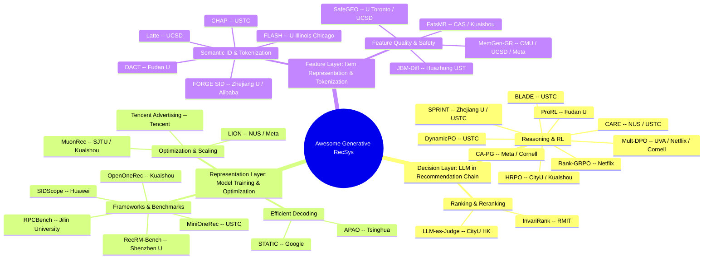

# Awesome Generative Recommendation System (RecSys)

```
 ██████╗                ██████╗                ███████╗                
██╔════╝  ███╗  ███╗    ██╔══██╗ ███╗   ███╗   ██╔════╝██╗ ██╗ ██████╗ 
██║      ██╔═██╗████╗   ██████╔╝██╔═██╗██╔═██╗ ███████╗╚██╗██║ ██╔═══╝ 
██║  ███╗██████║██╔██╗  ██╔══██╗██████║██║ ╚═╝ ╚════██║ ╚███╔╝ ██████╗ 
██║   ██║██║    ██║╚██╗ ██║  ██║██║    ██║ ██╗      ██║  ██╔╝      ██║
╚██████╔╝╚████╗ ██║ ╚██╗██║  ██║╚████╗ ╚███╔═╝ ███████║  ██║   ██████║
 ╚═════╝  ╚═══╝ ╚═╝  ╚═╝╚═╝  ╚═╝ ╚═══╝  ╚══╝   ╚══════╝  ╚═╝   ╚═════╝
```
---

[](https://github.com/sindresorhus/awesome)

RecSys is starting to adopt LLM for feature extraction, retrieval, and ranking/re-ranking! Although you can get some hands-on materials in either the [classics](#papers-classic-must-read) or some surveys, but since you're already interested in applying generative AI to industrial tasks, you probably wanna stay on the bleeding edge, right? That's exactly what this repo is for — automatically updated daily by agents with the latest generative RecSys papers fresh off arXiv, making sure that you never miss a beat.

> [!IMPORTANT]
> For those who are not familiar with GenRec, or not even the recommendation system, please checkout the kickstart posts [here](docs/kickstart.md).
> These posts are in Chinese, for English simply do your browser's internal translation or turn to __Ask Gemini__ :shipit:

## Quick Indexing
- [By Date](#by-date)
- [By Opensource](#by-opensource)
- [By Keyword](#by-keyword)
- [By Affiliation](#by-affiliation)
- [Papers Classic Must Read](#papers-classic-must-read)
- [Verl-GR: An Awesome RL Toolkit for GenRecSys](#verl-gr-an-awesome-rl-toolkit-for-genrecsys)


```mermaid
mindmap
  root((Awesome Generative RecSys))
    Decision Layer: LLM in Recommendation Chain
      Reasoning & RL
        Rank-GRPO -- Netflix
        DynamicPO -- USTC
        BLADE -- USTC
        SPRINT -- Zhejiang U / USTC
        CARE -- NUS / USTC
        HRPO -- CityU / Kuaishou
        Mult-DPO -- UVA / Netflix / Cornell
        CA-PG -- Meta / Cornell
        ProRL -- Fudan U
      Ranking & Reranking
        InvariRank -- RMIT
        LLM-as-Judge -- CityU HK
    Representation Layer: Model Training & Optimization
      Frameworks & Benchmarks
        MiniOneRec -- USTC
        OpenOneRec -- Kuaishou
        RecRM-Bench -- Shenzhen U
        SIDScope -- Huawei
        RPCBench -- Jilin University
      Efficient Decoding
        STATIC -- Google
        APAO -- Tsinghua
      Optimization & Scaling
        MuonRec -- SJTU / Kuaishou
        Tencent Advertising -- Tencent
        LION -- NUS / Meta
    Feature Layer: Item Representation & Tokenization
      Semantic ID & Tokenization
        Latte -- UCSD
        FORGE SID -- Zhejiang U / Alibaba
        DACT -- Fudan U
        CHAP -- USTC
        FLASH -- U Illinois Chicago
      Feature Quality & Safety
        SafeGEO -- U Toronto / UCSD
        MemGen-GR -- CMU / UCSD / Meta
        JBM-Diff -- Huazhong UST
        FatsMB -- CAS / Kuaishou
```

<div align="center">
  <i> Open-source Generative RecSys Map </i>
</div>

---
## `Verl-GR`: An Awesome RL Toolkit for GenRecSys
If you are interested in RFT your own GenRecSys, come check out our `verl`-based implementation called `verl-gr` here:
* [https://github.com/HaFred/verl-GR/tree/main/verl_gr/recipes/openonerec](https://github.com/HaFred/verl-GR/tree/main/verl_gr/recipes/openonerec)
* [https://github.com/HaFred/verl-GR/tree/main/verl_gr/recipes/rankgrpo](https://github.com/HaFred/verl-GR/tree/main/verl_gr/recipes/rankgrpo)

We manage to achieve 22% and 32% boosting for the end-to-end training efficiencies, compared with their respective vanilla implementations.

## By Date

We only keep the last 10 days summary below, for the past records before these, please see [the archive](docs/archive_by_month).

---

### Papers October 08

*Thursday, October 8, 2026. The live 24h arxiv window (papers dated Oct 7) carried only 1 strictly on-topic generative-recommendation paper (Missed Targets, 2610.10124); the other Oct 7 hits were already catalogued on Oct 7. Below the 5-paper floor, the 3-month keyword fallback surfaced 6 additional on-topic papers, of which 4 were genuinely uncatalogued and 2 were recovered from the Feb–Apr window (DiffuReason, JBM-Diff, FatsMB, DiffSBR). 3 are opensource. By Opensource count 200 -> 203.*

1. **Training with Missed Targets in Generative Recommendation: Separating Supervision from Probability Competition (Missed Targets)**
   * Affiliation: Zhejiang University — *(Xuesi Wang, Yangbin Shi, Xiaolin Zheng)*
   * Link: [arxiv.org/abs/2610.10124](https://arxiv.org/abs/2610.10124)
   * Venue: arXiv preprint, October 2026 (cs.IR; submitted 7 Oct 2026)
   * TL;DR: Generative recommenders return a limited candidate set and may drop observed targets before reranking; naively appending those "missed targets" to reranker training lists silently changes retrieved-target weight, adds supervision, AND makes the two groups compete for probability, so a naive append/no-append comparison cannot explain ranking changes. The paper builds three matched losses to isolate these effects and shows the competition can hurt returned-item ranking.
   * Key techniques:
     - Constructs three matched losses that hold retrieved-target weight fixed while separately introducing appended-target supervision and group probability competition
     - Intermediate loss trains within both groups but normalizes them separately, preventing training-only targets from competing with inference candidates
     - Evaluates with a released OneRec model and locally trained Amazon generators; removing the competition improved FT-NDCG by 7.8–22.2% across four Amazon Video Games comparisons (95% CIs exclude zero)
   * Scores (Opensource? / Novelty / Fairness / Robustness / Impact):
     - **Opensource?: 0/10** — no public code; reuses a released OneRec checkpoint
     - **Novelty: 6/10** — a careful causal dissection of the missed-target training artifact rather than a new architecture
     - **Fairness: 0/10** — not fairness-focused
     - **Robustness: 7/10** — rigorous matched-loss experimental design with FT-NDCG gains and 95% intervals over users and runs
     - **Impact: 6/10** — Zhejiang University; practical guidance on when candidate completion helps vs. hurts

2. **Rethinking Semantic ID Construction for Generative Recommendation: SimHash with Parallel Decoding and Semantic Alignment (FLASH)**
   * Affiliation: University of Illinois Chicago — *(Yuqing Liu, Huiyuan Chen, Yibo Wang, Wooseong Yang, Philip S. Yu)*
   * Link: [arxiv.org/abs/2610.07402](https://arxiv.org/abs/2610.07402) · [Code](https://github.com/KevinC2015/Flash)
   * Venue: NeurIPS 2026; arXiv preprint, October 2026 (cs.IR; submitted 5 Oct 2026)
   * TL;DR: Challenges the consensus that hashing-based semantic IDs are inherently inferior to learned quantization; shows the gap comes from a structural mismatch with autoregressive decoding plus rigid discretization, and proposes FLASH — a training-free SimHash tokenizer revitalized by parallel decoding and explicit semantic alignment that matches learned SIDs without any tokenizer training.
   * Key techniques:
     - Two-stage framework: training-free SimHash semantic-ID tokenization + parallel decoding (removes the AR mismatch)
     - Explicit semantic alignment as a universally effective mechanism across diverse generative-retrieval paradigms
     - Achieves SOTA across multiple datasets with no tokenizer training and stronger cold-start generalization
   * Scores (Opensource? / Novelty / Fairness / Robustness / Impact):
     - **Opensource?: 7/10** — [github.com/KevinC2015/Flash](https://github.com/KevinC2015/Flash) (NeurIPS 2026 code release, documented)
     - **Novelty: 7/10** — reframes the hashing-vs-learned-SID debate around decoding/alignment rather than tokenizer capacity
     - **Fairness: 0/10** — not fairness-focused
     - **Robustness: 7/10** — SOTA across multiple datasets with stronger cold-start generalization
     - **Impact: 8/10** — University of Illinois Chicago / Philip S. Yu; a simple, training-free tokenizer that rivals learned SIDs at NeurIPS

3. **MATE: Adaptive Long- and Short-Term User Memory for LLM-Based Recommendation**
   * Affiliation: Yonsei University — *(Yu Hou)*, Seoul, Korea
   * Link: [arxiv.org/abs/2610.06050](https://arxiv.org/abs/2610.06050)
   * Venue: arXiv preprint, October 2026 (cs.IR; submitted 5 Oct 2026)
   * TL;DR: LLM-based sequential recommenders use semantic representations but do not distinguish persistent preferences from recent interests; MATE evaluates each new interaction from two temporal perspectives to control updates of a long-term (conservative) and a short-term (adaptive) user memory, with a recent-context representation gating their contribution.
   * Key techniques:
     - Temporal-evidence computation: repeated historical support + recent-interaction consistency for each newly observed interaction
     - Two user-specific memories: long-term conservatively preserves persistent preferences, short-term rapidly adapts to recent interests
     - Online adaptation keeps the shared model fixed and updates only the two memories; +7.0–13.2% NDCG@10 over the strongest baseline on MovieLens-10M, Amazon Luxury Beauty, and KuaiRec
   * Scores (Opensource? / Novelty / Fairness / Robustness / Impact):
     - **Opensource?: 0/10** — no public code repository linked
     - **Novelty: 7/10** — adaptive long/short-term memory with temporal-evidence gating for LLM-based sequential rec
     - **Fairness: 0/10** — not fairness-focused
     - **Robustness: 7/10** — consistent 7.0–13.2% NDCG@10 gains across three benchmarks
     - **Impact: 6/10** — Yonsei University; a clean LLM-based sequential-rec memory framework

4. **DiffuReason: Bridging Latent Reasoning and Generative Refinement for Sequential Recommendation**
   * Affiliation: Tencent — *(Jie Jiang, Yang Wu, Qian Li, Yuling Xiong, Yihang Su, Junbang Huo, Longfei Lu, Jun Zhang, Huan Yu)*, Beijing
   * Link: [arxiv.org/abs/2602.09744](https://arxiv.org/abs/2602.09744)
   * Venue: arXiv preprint, February 2026 (cs.IR; v2 submitted 12 Feb 2026)
   * TL;DR: A unified "Think-then-Diffuse" framework for sequential recommendation that integrates multi-step Thinking Tokens (latent reasoning), diffusion-based refinement (probabilistic intent denoising), and end-to-end GRPO alignment so the reasoning and refinement modules co-evolve without staged optimization.
   * Key techniques:
     - Think stage: generates Thinking Tokens that reason over user history to form an initial intent hypothesis
     - Diffuse stage: refines the hypothesis via a diffusion process that models user intent as a distribution, iteratively denoising against reasoning noise
     - GRPO-based reinforcement learning enables reasoning + refinement to co-evolve end-to-end; validated by online A/B on a large-scale industrial platform
   * Scores (Opensource? / Novelty / Fairness / Robustness / Impact):
     - **Opensource?: 0/10** — no public code repository linked
     - **Novelty: 8/10** — unifies latent reasoning + diffusion refinement + GRPO in one end-to-end framework, removing staged-pipeline constraints
     - **Fairness: 0/10** — not fairness-focused
     - **Robustness: 8/10** — improves diverse backbone architectures and is validated online via A/B
     - **Impact: 8/10** — Tencent; industrially validated sequential recommendation

5. **Joint Behavior-guided and Modality-coherence Conditional Graph Diffusion Denoising for Multi-Modal Recommendation (JBM-Diff)**
   * Affiliation: Huazhong University of Science and Technology — *(Xiangchen Pan, Wei Wei)*, Wuhan, China
   * Link: [arxiv.org/abs/2604.03654](https://arxiv.org/abs/2604.03654) · [Code](https://github.com/pxcstart/JBMDiff)
   * Venue: arXiv preprint, April 2026 (cs.IR; submitted 4 Apr 2026)
   * TL;DR: A joint behavior-guided and modality-coherence conditional graph diffusion model (JBM-Diff) for multi-modal recommendation that denoises both redundant, preference-irrelevant multimodal features and feedback-biased (false positive/negative) user behaviors.
   * Key techniques:
     - Diffusion model conditioned on collaborative features per modality to remove preference-irrelevant multimodal information
     - Multi-view message propagation + feature fusion to align collaborative and modal semantics
     - Behavior-perspective partial-order consistency detection sets sample-pair credibility for data augmentation
   * Scores (Opensource? / Novelty / Fairness / Robustness / Impact):
     - **Opensource?: 7/10** — [github.com/pxcstart/JBMDiff](https://github.com/pxcstart/JBMDiff)
     - **Novelty: 7/10** — joint denoising of multimodal features and feedback bias via behavior-guided modality-coherence conditional diffusion
     - **Fairness: 0/10** — not fairness-focused
     - **Robustness: 7/10** — extensive experiments on three public datasets
     - **Impact: 6/10** — Huazhong University of Science and Technology; multimodal recommendation denoising

6. **From Agnostic to Specific: Latent Preference Diffusion for Multi-Behavior Sequential Recommendation (FatsMB)**
   * Affiliation: Institute of Information Engineering, Chinese Academy of Sciences / University of Chinese Academy of Sciences — *(Ruochen Yang, Xiaodong Li, Jiawei Sheng, Tingwen Liu)* + Kuaishou Technology, Beijing — *(Jiangxia Cao, Shen Wang, Shuang Yang)*
   * Link: [arxiv.org/abs/2602.23132](https://arxiv.org/abs/2602.23132) · [Code](https://github.com/OrchidViolet/FatsMB)
   * Venue: KDD 2026; arXiv preprint, February 2026 (cs.IR / cs.LG; submitted 26 Feb 2026)
   * TL;DR: FatsMB is a diffusion-based framework that guides preference generation from behavior-agnostic to behavior-specific in latent spaces for multi-behavior sequential recommendation, capturing the latent user preference underlying decision-making and the asymmetric uncertainty from low-entropy behaviors to high-entropy items.
   * Key techniques:
     - Multi-Behavior AutoEncoder (MBAE) builds a unified user latent preference space with cross-behavior interaction; Behavior-aware RoPE (BaRoPE) for multi-information fusion
     - Target behavior-specific preference transfer in the latent space, enriched with informative priors
     - Multi-Condition Guided Layer Normalization (MCGLN) for the denoising process
   * Scores (Opensource? / Novelty / Fairness / Robustness / Impact):
     - **Opensource?: 7/10** — [github.com/OrchidViolet/FatsMB](https://github.com/OrchidViolet/FatsMB) (KDD 2026 code release)
     - **Novelty: 7/10** — behavior-agnostic→behavior-specific latent preference diffusion with MBAE + BaRoPE + MCGLN
     - **Fairness: 0/10** — not fairness-focused
     - **Robustness: 7/10** — extensive experiments on real-world datasets; KDD 2026
     - **Impact: 7/10** — CAS / Kuaishou; KDD 2026 multi-behavior sequential recommendation

7. **Unleashing the Potential of Neighbors: Diffusion-based Latent Neighbor Generation for Session-based Recommendation (DiffSBR)**
   * Affiliation: University of Electronic Science and Technology of China — *(Yuhan Yang, Jie Zou, Guojia An, Jiwei Wei, Yang Yang, Heng Tao Shen)*
   * Link: [arxiv.org/abs/2601.03903](https://arxiv.org/abs/2601.03903)
   * Venue: KDD 2026 (accepted); arXiv preprint, January 2026 (cs.IR; submitted 7 Jan 2026)
   * TL;DR: DiffSBR generates high-quality latent neighbors for session-based recommendation via two diffusion modules — retrieval-augmented (uses retrieved neighbors as guidance) and self-augmented (injects the current session's multimodal signals) — then enhances session representations with the generated latent neighbors.
   * Key techniques:
     - Retrieval-augmented diffusion: retrieved neighbors constrain and reconstruct the latent-neighbor distribution; the retriever learns from generator feedback
     - Self-augmented diffusion: contrastive learning injects the current session's multimodal signals to guide latent-neighbor generation
     - Generated latent neighbors augment session representations; extensive experiments on four public datasets
   * Scores (Opensource? / Novelty / Fairness / Robustness / Impact):
     - **Opensource?: 0/10** — no public code repository linked
     - **Novelty: 7/10** — diffusion-based latent neighbor generation (retrieval-augmented + self-augmented) with retriever–generator co-training for session-based rec
     - **Fairness: 0/10** — not fairness-focused
     - **Robustness: 7/10** — extensive experiments on four public datasets; KDD 2026
     - **Impact: 6/10** — University of Electronic Science and Technology of China; KDD 2026 session-based recommendation

### Papers October 07

*Wednesday, October 7, 2026. The live last-24h arxiv submission window (papers dated Oct 6) carried only 3 strictly on-topic generative-retrieval/recommendation papers (Semantic-ID Spaces, Disentangling Paradigm/Identifier/Decoding, INTEGER), below the 5-paper floor, so per the fallback we drew 2 more genuinely-new, on-topic sequential-recommendation / fairness papers from the same Oct 6 window (RLCP, CPFR). 0 are open-source. Total: 5 papers (0 opensource).*

1. **A Systematic Study of Semantic ID Spaces for Generative Information Retrieval**
   * Affiliation: Artefact Research Center, Paris, France; Université d'Angers (LERIA), France — *(Alexia Allal, Hicham Randrianarivo, Sylvain Lamprier)*
   * Link: [arxiv.org/abs/2610.08732](https://arxiv.org/abs/2610.08732)
   * Venue: arXiv preprint, October 2026 (cs.IR, cs.CL; submitted 6 Oct 2026)
   * TL;DR: Proposes a unified design space that merges Product Quantization (PQ), Residual Quantization (RQ), and hybrid PQ×RQ variants for numerical DocIDs in Generative Information Retrieval, plus a suite of training-free intrinsic metrics that predict retrieval quality without full model training — enabling systematic analysis of DocID structural properties (hierarchy vs parallelism, length, codebook size) on MS MARCO 300K and NQ320K.
   * Key techniques:
     - Unified DocID framework spanning PQ, RQ, and hybrid PQ×RQ variants in one design space
     - Training-free intrinsic metrics for DocID structural fidelity / quality (no full-model training)
     - Controlled study of hierarchy vs parallelism, DocID length, and codebook size
     - Empirical analysis on MS MARCO 300K and NQ320K
   * Scores (Opensource? / Novelty / Fairness / Robustness / Impact):
     - **Opensource?: 0/10** — No public code released (empirical study; no repository found).
     - **Novelty: 7/10** — A systematic, method-agnostic lens on DocID design; the unified PQ/RQ space and training-free metrics are genuinely useful for the SID community, though it studies rather than invents a method.
     - **Fairness: 3/10** — Not addressed.
     - **Robustness: 6/10** — Studies structural trade-offs extensively, but robustness under distribution shift is not the focus.
     - **Impact: 7/10** — Directly relevant to every generative-recommendation / retrieval system that uses semantic IDs; training-free metrics save substantial compute in DocID iteration.

2. **Disentangling Paradigm, Identifier, and Decoding in Generative Retrieval**
   * Affiliation: Artefact Research Center, Paris, France; Université d'Angers (LERIA), France — *(Hicham Randrianarivo, Logan Renaud, Alexia Allal)*
   * Link: [arxiv.org/abs/2610.08716](https://arxiv.org/abs/2610.08716)
   * Venue: arXiv preprint, October 2026 (cs.IR, cs.CL; submitted 6 Oct 2026)
   * TL;DR: Training autoregressive, masked-diffusion, and block-diffusion generative retrievers with RQ/PQ/random identifiers at a fixed budget, the study shows decoding choice alone shifts diffusion Hit@1 by 6.6–13.7 points, and proposes one-pass scoring that matches or beats generate-and-match in 11/12 settings — arguing paradigm comparisons must report each method at its own best decoding.
   * Key techniques:
     - Controlled isolation of paradigm (AR / masked-diffusion / block-diffusion) from identifier (RQ / PQ / random) and decoding
     - Generate-and-match decoding for diffusion retrievers (generate an identifier, then retrieve closest corpus identifiers)
     - One-pass scoring: a fully-masked identifier is scored once by its codes' probabilities — removes 46–83% of masked diffusion's deficit to beam search
     - Empirical finding that random identifiers retain 83–90% of RQ Hit@1 (the models largely memorize query→identifier mappings)
   * Scores (Opensource? / Novelty / Fairness / Robustness / Impact):
     - **Opensource?: 0/10** — No public code released.
     - **Novelty: 8/10** — Carefully disentangles three entangled design choices and introduces one-pass scoring as a strong, cheap diffusion decoding; a valuable methodological clarification.
     - **Fairness: 3/10** — Not addressed.
     - **Robustness: 7/10** — Exhaustive controlled experiments across paradigms, identifiers, and decodings; strong empirical rigor.
     - **Impact: 8/10** — Challenges the "diffusion beats AR" narrative and sets a reporting standard (report each paradigm at its own best decoding); one-pass scoring is practically useful.

3. **Adapting Generative Recommenders for Multi-Turn Interaction (INTEGER)**
   * Affiliation: National Taiwan University — *(Yu-Chen Den, Zhi Rui Tam, Yung-Yu Shih, Shih-Hsin Wang, Yun-Nung Chen, Pu-Jen Cheng, Eugene Yang)*; Eugene Yang: Johns Hopkins University
   * Link: [arxiv.org/abs/2610.08136](https://arxiv.org/abs/2610.08136)
   * Venue: arXiv preprint, October 2026 (cs.IR; submitted 6 Oct 2026)
   * TL;DR: INTEGER extends generative recommendation to multi-turn interaction so users can correct recommendations in-dialogue: a learned routing token decides when to recommend, history re-anchoring conditions items on both past behavior and the conversation, and behavioral replay prevents forgetting — improving Hit@10 by 13.3% on Amazon Beauty.
   * Key techniques:
     - Learned routing token for recommend-vs-converse decisions
     - History re-anchoring: condition item generation on past behavior AND the dialogue context
     - Behavioral replay with instruction-data rehearsal to prevent catastrophic forgetting during adaptation
     - Intent-agnostic replacement over the item space to suppress rejected items
   * Scores (Opensource? / Novelty / Fairness / Robustness / Impact):
     - **Opensource?: 0/10** — No public code released.
     - **Novelty: 8/10** — Cleanly bridges generative recommendation and conversational recommendation; the routing token + re-anchoring + replay trio addresses a real gap (no in-conversation correction).
     - **Fairness: 4/10** — Not directly addressed.
     - **Robustness: 7/10** — Behavioral replay guards against forgetting; evaluated on Amazon Beauty and Toys with strong, consistent gains.
     - **Impact: 8/10** — Practical path to deployable conversational generative recommenders; +13.3% Hit@10 on Amazon Beauty and beats its generative-recommender starting point.

4. **Reinforcement Learning with Conformal Action Sets: An Application to Sequential Recommendation (RLCP)**
   * Affiliation: University of Pennsylvania — *(Wenwen Si, Honghao Wei)*
   * Link: [arxiv.org/abs/2610.08743](https://arxiv.org/abs/2610.08743)
   * Venue: arXiv preprint, October 2026 (cs.LG, cs.AI; submitted 6 Oct 2026)
   * TL;DR: RLCP adapts the retained action (slate) set per session using critic scores and an online conformal threshold, with a proven deterministic bound on proxy miss rate and an exact value-loss decomposition into filtering/selection losses; it reaches 1.11×–5.21× the catalog diversity of the strongest baseline across 19 configurations.
   * Key techniques:
     - Reinforcement Learning with Calibrated Pruning (RLCP)
     - Online threshold from binary proxy-target feedback (does the retained set contain a target action?)
     - Deterministic bound on the observed proxy miss rate along adaptive trajectories
     - Exact decomposition of value loss into filtering and selection losses → finite session reward bound (no convergence required)
     - Two RLCP implementations vs four RL baselines on KuaiRand-Pure and MovieLens 1M
   * Scores (Opensource? / Novelty / Fairness / Robustness / Impact):
     - **Opensource?: 0/10** — No public code released.
     - **Novelty: 7/10** — Connects conformal prediction / calibrated pruning to RL action-set adaptation with a clean theoretical decomposition; novel for sequential rec.
     - **Fairness: 5/10** — Not fairness per se, but catalog diversity (a fairness-adjacent metric) is a core measured outcome.
     - **Robustness: 8/10** — Provides formal miss-rate and reward bounds; theoretically grounded under explicit approximation conditions.
     - **Impact: 7/10** — Model-agnostic action-set adaptation applicable to any sequential recommender; 1.11×–5.21× catalog diversity with no larger retained sets.

5. **Aligning Performance with Contribution: Towards Contribution-Aware Fair Recommendation (CPFR)**
   * Affiliation: Shanghai University of Finance and Economics, China — *(Shuai Zhang, Hui Fang, Zun Sun)*; Zhu Sun: Singapore University of Technology and Design
   * Link: [arxiv.org/abs/2610.08245](https://arxiv.org/abs/2610.08245)
   * Venue: arXiv preprint, October 2026 (cs.IR; submitted 6 Oct 2026)
   * TL;DR: Contribution-Performance Fairness requires recommendation performance to align with users' estimated (training-dependent) contribution — building ordered user groups from interaction volume, loss alignment, and optimization intensity, and jointly optimizing accuracy with cross-group alignment and within-group equity; a game-theoretic analysis shows this strengthens contribution incentives.
   * Key techniques:
     - Contribution-Performance Fairness (CPFR) perspective: align performance with estimated contribution across groups, equitable within comparable-contribution users
     - Training-dependent contribution estimation (interaction volume, loss alignment, optimization intensity)
     - Ordered user-group construction from contribution
     - Joint optimization of accuracy + cross-group alignment + within-group equity
     - Game-theoretic analysis of contribution incentives; model-agnostic over 3 backbones × 3 datasets
   * Scores (Opensource? / Novelty / Fairness / Robustness / Impact):
     - **Opensource?: 0/10** — No public code released.
     - **Novelty: 8/10** — A genuinely new fairness axis (contribution-performance alignment) distinct from parity-based notions; training-dependent contribution estimation is well-motivated.
     - **Fairness: 9/10** — Core contribution is fairness: aligns benefits with users' model-learning contribution and protects against incentive misalignment.
     - **Robustness: 6/10** — Evaluated on 3 datasets × 3 backbones; robustness/stability of contribution estimates under sparse data not deeply stressed.
     - **Impact: 7/10** — New fairness perspective for sustainable recommendation ecosystems; model-agnostic and demonstrates a strong accuracy–fairness trade-off.

### Papers October 06

*Tuesday, October 6, 2026. The live last-24h arxiv cs.IR announcement window carried only 3 on-topic generative-rec papers (SPRIG, CreGR, SAGA-CDR), below the 5-paper floor, so per the fallback we drew 2 more genuinely-new, on-topic papers from the arxiv keyword pools over the last ~3 months (LRPRec, FairDiff). 2 are open-source (SPRIG, CreGR). Total: 5 papers (2 opensource).*

1. **SPRIG: Semantic-ID-enhanced Paths for Knowledge Graph-based Generative Recommendation**
   * Affiliation: Johannes Kepler University Linz — *(Justin Hangoebl, Marta Moscati, Alessandro B. Melchiorre, Shah Nawaz, Markus Schedl)*
   * Link: [arxiv.org/abs/2610.06590](https://arxiv.org/abs/2610.06590)
   * Venue: CIKM 2026 (short paper), arXiv preprint, October 2026 (cs.IR; submitted 5 Oct 2026)
   * TL;DR: SPRIG integrates content-derived Semantic IDs into knowledge-graph path reasoning, training on KG paths that terminate in items represented as discrete content-derived tokens — combining relational grounding with parameter-efficient SID item representations.
   * Key techniques:
     - Knowledge-graph path reasoning generative recommender (entity-relation path generation)
     - Semantic IDs (hierarchically quantized discrete codes) replacing opaque item tokens
     - KG paths terminating in discrete, content-derived SID tokens for compositional generalization
     - Beam output postprocessor for SEM-tuple decoding; built as a fork of the hopwise library
   * Scores (Opensource? / Novelty / Fairness / Robustness / Impact):
     - **Opensource?: 7/10** — Official MIT-licensed code (github.com/justinhangoebl/semantic-id-knowledge-graph-recommender), a well-structured fork of hopwise with a documented SPRIG model class, dataset, SEM tokenizer, and config.
     - **Novelty: 7/10** — Clean fusion of SID item representation with KG path reasoning, addressing both lines' complementary limitations.
     - **Fairness: 5/10** — Not directly addressed.
     - **Robustness: 6/10** — Uses fewer parameters and lower compute than baselines; robustness is not the focus.
     - **Impact: 7/10** — Strong fit for knowledge-rich domains (movies, music); reproducible MIT codebase.

2. **Generate What You Can Trust: Content Credibility in Generative Recommenders (CreGR)**
   * Affiliation: University of Technology Sydney — *(Zhuo Cai, Guanghao Wu, Shoujin Wang, Peilin Zhou, Victor W. Chu)*
   * Link: [arxiv.org/abs/2610.05670](https://arxiv.org/abs/2610.05670)
   * Venue: arXiv preprint, October 2026 (cs.IR; submitted 5 Oct 2026)
   * TL;DR: CreGR is the first credible generative recommender that tackles content credibility across both GR stages — a credibility-aware tokenizer that disentangles credible/uncredible tokens, and an accuracy-preserving discrete-diffusion generator with an asymmetric masking strategy that suppresses uncredible-content tokens.
   * Key techniques:
     - Generative recommendation with semantic IDs (discrete token sequences)
     - Credibility-aware tokenizer that learns discriminative tokens for credible vs. uncredible items
     - Discrete-diffusion generator with asymmetric masking probability reduction for uncredible tokens
     - Accuracy preservation: user-preference-signal tokens are left unaffected
   * Scores (Opensource? / Novelty / Fairness / Robustness / Impact):
     - **Opensource?: 6/10** — Official code (github.com/iamZhuoCai/CreGR) with detailed README, run_pipeline.py, requirements.txt, but no license file and last commit 30 May 2026 (stale).
     - **Novelty: 7/10** — First to explicitly address content credibility in generative recommenders across tokenization and generation.
     - **Fairness: 9/10** — Core contribution is credibility/fairness (protecting users from fake news and related harms), explicitly optimized.
     - **Robustness: 6/10** — Credibility handling helps robustness to malicious content; not stress-tested broadly.
     - **Impact: 7/10** — Directly relevant to societal harms (fake news, platform reputation); practical discrete-diffusion design.

3. **Reading the Mood: Emotion-Guided Book-to-Music Recommendation via CGANs and LLMs (SAGA-CDR)**
   * Affiliation: National Technical University of Athens — *(Manousos Linardakis, Georgios Alexandridis)*
   * Link: [arxiv.org/abs/2610.06703](https://arxiv.org/abs/2610.06703)
   * Venue: SENTIRE 2026 (ICDM 2026 Workshops), arXiv preprint, October 2026 (cs.IR; submitted 5 Oct 2026)
   * TL;DR: SAGA-CDR is a two-phase cross-domain recommender that pairs books with mood-matched music — transformer sentiment embeddings mapped across domains via a Conditional GAN (with a mask-conditioned, stochastic generator), then LLM-based valence-arousal emotion filtering.
   * Key techniques:
     - Cross-domain recommendation (book → music)
     - Transformer-based sentiment embeddings from user reviews
     - Conditional GAN with a mask-conditioned generator handling missing sentiment and injecting stochasticity
     - LLM classification of books into valence-arousal emotional quadrants for candidate filtering
   * Scores (Opensource? / Novelty / Fairness / Robustness / Impact):
     - **Opensource?: 0/10** — No public code released.
     - **Novelty: 6/10** — Combines CGAN cross-domain transfer with LLM emotion alignment; a modest, incremental framing.
     - **Fairness: 5/10** — Not directly addressed.
     - **Robustness: 5/10** — Evaluated on Amazon (English) and Douban (Chinese, cross-lingual); robustness not stressed.
     - **Impact: 5/10** — Niche cross-domain book-to-music scenario; workshop paper.

4. **Learning Robust Personalized Prompts for LLM-Driven Sequential Recommendation (LRPRec)**
   * Affiliation: Zhejiang University — *(Xiaolin Zheng, Qiyong Zhong, Jiajie Su, Xiang Chen)*
   * Link: [arxiv.org/abs/2610.03923](https://arxiv.org/abs/2610.03923)
   * Venue: arXiv preprint, October 2026 (cs.IR; submitted 2 Oct 2026)
   * TL;DR: LRPRec is a learnable prompting framework for LLM-driven sequential recommendation that initializes continuous instruction prompts from discrete templates and injects a user preference embedding while constraining shared prompts within a trust region to prevent semantic drift.
   * Key techniques:
     - LLM-driven sequential recommendation as autoregressive generation conditioned on natural-language prompts
     - Continuous instruction prompts initialized from discrete templates
     - Personalized prompt injection: user behavior → preference embedding added to shared prompts
     - Semantic drift constraint: trust-region regularization around initialization anchors
   * Scores (Opensource? / Novelty / Fairness / Robustness / Impact):
     - **Opensource?: 0/10** — No public code released.
     - **Novelty: 7/10** — Decouples stability (trust-region shared prompts) from expressiveness (additive personalization).
     - **Fairness: 4/10** — Not addressed.
     - **Robustness: 8/10** — Core contribution is robustness to prompt wording changes and semantic drift; main evaluation axis.
     - **Impact: 6/10** — Removes manual prompt engineering for LLM sequential rec; solid empirical gains.

5. **FairDiff: Mitigating the Self-Reinforcing Matthew Effect in Diffusion Recommender Models**
   * Affiliation: Tsinghua University — *(Song-Li Wu¹, Xianquan Wang³, Zhaocheng Du², Weinan Gan², Jingyi Wang¹)* — also Huawei Noah's Ark Lab, University of Science and Technology of China
   * Link: [arxiv.org/abs/2609.36671](https://arxiv.org/abs/2609.36671)
   * Venue: arXiv preprint, September 2026 (cs.AI; submitted 29 Sep 2026)
   * TL;DR: FairDiff exposes a self-reinforcing Matthew Effect in diffusion recommenders — driven by popularity-dominated loss and a structural prior mismatch that collapses reverse sampling toward popular items — and proposes a plug-and-play framework with Popularity Condition Guidance (inference-time reweighting) and a Semantic Calibration module (one-step optimal transport).
   * Key techniques:
     - Diffusion Recommender Models (DRMs) with forward/reverse denoising
     - Popularity Condition Guidance (PCG): inference-time score-field reweighting that penalizes high-popularity regions
     - Semantic Calibration (SC) module: one-step optimal transport bridging the prior mismatch
     - Plug-and-play, architecture- and training-agnostic integration
   * Scores (Opensource? / Novelty / Fairness / Robustness / Impact):
     - **Opensource?: 0/10** — No public code released.
     - **Novelty: 8/10** — Identifies a unique generative-dynamics bias mechanism (prior mismatch) in DRMs, distinct from standard popularity bias.
     - **Fairness: 9/10** — Core contribution is fairness (mitigating the Matthew Effect / long-tail suppression).
     - **Robustness: 7/10** — Plug-and-play across DRMs; validated on multiple datasets.
     - **Impact: 7/10** — A general framework for the fast-growing DRM line; strong empirical fairness gains.

### Papers October 05

*Monday, October 5, 2026. The live last-24h arxiv cs.IR announcement window carried only one on-topic generative-rec paper (AIMS, 2610.02600), so per the fallback we drew 6 more genuinely-new, on-topic generative / LLM / multimodal / agentic / security recommendation papers from the arxiv keyword pools over the last ~3 months (Jul-Oct 2026). 2 are open-source (AdaM-Rec, PQA). Total: 7 papers (2 opensource).*

1. **When History Misleads: Asymmetric Margin Supervision for Instruction-Guided LLM Generative Recommendation**
   * Affiliation: Duke University, Meta AI — *(Ming Yin, Yuhan Yang, Chen Chen, Xinyu Lin, Wentao Shi, Fangcong Yin, Chaofei Yang, Chao Yang, Jiyan Yang, Hui Zhang, Ning Jiang, Yiran Chen, Qifan Wang)*
   * Link: [arxiv.org/abs/2610.02600](https://arxiv.org/abs/2610.02600)
   * Venue: arXiv preprint, October 2026 (cs.IR; submitted 1 Oct 2026)
   * TL;DR: Proposes AIMS, an asymmetric-margin supervision scheme for instruction-guided LLM generative recommendation that down-weights misleading historical interactions so the generative recommender does not over-fit spurious co-occurrence in the user's history.
   * Key techniques:
     - Instruction-guided generative recommendation formulation where free-text instructions modulate item generation
     - Asymmetric margin loss that treats history-misleading (false-positive) items differently from genuine positives
     - Decoupling of collaborative signal from noisy historical clicks via margin re-weighting
     - Analysis of when/how historical engagement misleads generative ranking
   * Scores (Opensource? / Novelty / Fairness / Robustness / Impact):
     - **Opensource?: 0/10** — No public code or benchmark released.
     - **Novelty: 7/10** — Fresh angle: explicit handling of misleading history in instruction-guided gen-rec via asymmetric margins.
     - **Fairness: 5/10** — Not directly addressed.
     - **Robustness: 8/10** — Core contribution is robustness to history noise/misleading engagement; ablation on history-quality perturbations.
     - **Impact: 7/10** — Strong relevance to production gen-rec where historical clicks are noisy; preprint.

2. **AdaM-Rec: Adaptive Modality Routing for Multimodal Recommendation**
   * Affiliation: University of Queensland, Alibaba — *(Honghao Fu, Jiacheng Chen, Manxi Lin, Junjun Zheng, Xiangheng Kong, Yiwei Wang, Xin Yu, Miao Xu, Yuning Jiang, Yujun Cai)*
   * Link: [arxiv.org/abs/2609.38455](https://arxiv.org/abs/2609.38455)
   * Venue: NeurIPS 2026
   * TL;DR: AdaM-Rec is an LLM-based framework for adaptive modality routing in multimodal recommendation that estimates per-query modality reliability via proxy recall tasks and routes textual vs. multimodal evidence with an agentic strategy.
   * Key techniques:
     - Structured natural-language item/user representations
     - Proxy recall tasks that generate pseudo-queries pointing to the user's positive items to estimate modality reliability
     - Agentic routing-strategy optimization over textual vs. multimodal evidence
     - Routed recall + collaborative-item enrichment + relevance re-ranking
   * Scores (Opensource? / Novelty / Fairness / Robustness / Impact):
     - **Opensource?: 7/10** — [github.com/RomGai/AdaM-Rec](https://github.com/RomGai/AdaM-Rec): official NeurIPS-2026 code with README Get-Started/Data/Inference, requirements.txt, runnable run_pipe.py, sample data (Amazon Beauty/Clothing/Music via TAIRA); deductions: no checkpoints and relies on external LLM API (vLLM profiling reverted).
     - **Novelty: 7/10** — Adaptive modality routing + proxy-recall reliability estimation is a fresh take on multimodal fusion.
     - **Fairness: 5/10** — Not directly addressed.
     - **Robustness: 6/10** — Benchmarked against SOTA multimodal recs; limited robustness stress-testing.
     - **Impact: 7/10** — NeurIPS 2026; practical multimodal-rec framework with released code.

3. **Reasoning with Evidence, Not Merely Rationales: Verifiable Preference Proofs for LLM-Based Recommendation**
   * Affiliation: Yonsei University — *(Yu Hou, Nathaniel Kang, Pengkai Wang, Hua Li)*
   * Link: [arxiv.org/abs/2610.02968](https://arxiv.org/abs/2610.02968)
   * Venue: arXiv preprint, October 2026 (cs.IR; submitted 2 Oct 2026)
   * TL;DR: PROVE-REC replaces unverifiable free-text rationales with verifiable preference proofs - structured, checkable evidence chains grounding an LLM recommender's decisions in retrieved user/item facts.
   * Key techniques:
     - Verifiable preference proofs as structured, machine-checkable evidence
     - Separation of rationale generation from proof verification
     - Grounding recommendations in retrievable user histories / item attributes
     - Reliability evaluation of LLM-based recommendation under proof verification
   * Scores (Opensource? / Novelty / Fairness / Robustness / Impact):
     - **Opensource?: 0/10** — No public code released.
     - **Novelty: 8/10** — Reframing LLM-rec explainability around verifiable proofs rather than uncheckable rationales is novel.
     - **Fairness: 6/10** — Proofs improve transparency/accountability but no explicit fairness method.
     - **Robustness: 7/10** — Verification step guards against unsupported recommendations; evaluated for reliability.
     - **Impact: 7/10** — Relevant to trustworthy LLM rec; preprint.

4. **RankEvolve: A Reliable Multi-Agent Auto-Research Harness for Evolving Ranking Models**
   * Affiliation: Meta — *(Zheng Chen, Linfeng Liu, Hong Li, Hong Yan)*
   * Link: [arxiv.org/abs/2609.39551](https://arxiv.org/abs/2609.39551)
   * Venue: arXiv preprint, September 2026 (cs.IR; submitted 30 Sep 2026)
   * TL;DR: RankEvolve is a multi-agent auto-research harness that autonomously proposes, implements, and evaluates changes to ranking models, evolving them reliably with guardrails (uses open-source HSTU as the benchmark backbone).
   * Key techniques:
     - Multi-agent orchestration (proposer / implementer / evaluator roles) for ranking-model research
     - Reliability guardrails to keep auto-generated changes safe and reproducible
     - Benchmarking on the open-source HSTU generative ranking model
     - Closed-loop auto-research with experiment validation
   * Scores (Opensource? / Novelty / Fairness / Robustness / Impact):
     - **Opensource?: 0/10** — No public code released (uses open-source HSTU only as a benchmark).
     - **Novelty: 7/10** — Auto-research agent harness specialized for evolving ranking models with guardrails.
     - **Fairness: 5/10** — Not directly addressed.
     - **Robustness: 6/10** — Guardrails target reproducibility/safety of auto-changes; empirical on HSTU.
     - **Impact: 7/10** — Meta; points to autonomous ML-research tooling for ranking at scale.

5. **The Like Trap: Multi-Stage Poisoning against Agents in Similarity-based Recommendation Systems**
   * Affiliation: Michigan State University, Purdue University — *(Yue Xing, Pengfei He, Zitao Li)*
   * Link: [arxiv.org/abs/2609.27155](https://arxiv.org/abs/2609.27155)
   * Venue: arXiv preprint, September 2026 (cs.LG / cs.IR; submitted 22 Sep 2026)
   * TL;DR: Exposes a multi-stage poisoning attack ('Like Trap') that manipulates similarity-based recommender agents by injecting coordinated fake engagements across stages to bias recommendations toward attacker-chosen items.
   * Key techniques:
     - Multi-stage poisoning pipeline targeting similarity-based recommendation agents
     - Coordinated fake-engagement injection to distort item similarity graphs
     - Stage-wise threat model separating data-poisoning from agent-exploitation
     - Empirical demonstration of recommendation hijacking under the attack
   * Scores (Opensource? / Novelty / Fairness / Robustness / Impact):
     - **Opensource?: 0/10** — No public attack/defense code released.
     - **Novelty: 7/10** — Multi-stage (not single-shot) poisoning against similarity-based rec agents is a novel threat model.
     - **Fairness: 6/10** — Security/adversarial focus; exposes integrity risks rather than fairness method.
     - **Robustness: 4/10** — It is an attack paper - it demonstrates vulnerability, not a robustness improvement.
     - **Impact: 6/10** — Important security warning for agentic similarity-based recs; preprint.

6. **A Behavioral Trait Leaks into Preferences: Diagnosing Trait Interference in LLM User Simulators**
   * Affiliation: KAIST — *(Chaehyun Kim, Sein Kim, Hongseok Kang, Chanyoung Park)*
   * Link: [arxiv.org/abs/2609.25572](https://arxiv.org/abs/2609.25572)
   * Venue: CIKM 2026 (short paper)
   * TL;DR: PQA diagnoses 'trait interference' in LLM user simulators (where an amplified activity trait distorts preference boundaries) and proposes page-level quality anchoring to restore reliable simulator-based evaluation.
   * Key techniques:
     - Diagnosis of trait interference + evaluation invalidity in LLM user simulators
     - Page-level quality anchoring (PQA) with a personalized anchor μ_u from user history
     - ABOVE / NORMAL / BELOW page labeling before continue-or-exit decision
     - Validation on Agent4Rec + SimUSER over MovieLens and Amazon CDs & Vinyl
   * Scores (Opensource? / Novelty / Fairness / Robustness / Impact):
     - **Opensource?: 6/10** — [github.com/chaehyun1/PQA](https://github.com/chaehyun1/PQA): official CIKM-2026 code with detailed README, requirements.txt, clear numbered pipeline for Agent4Rec + SimUSER; deductions: datasets/personas/recommendation-lists NOT included and depends on external simulators + GPT-4o-mini API.
     - **Novelty: 7/10** — Identifies and names trait interference, a previously overlooked simulator failure mode.
     - **Fairness: 6/10** — Improves evaluation validity; no explicit fairness method.
     - **Robustness: 7/10** — Restores reliability of simulator-based rec evaluation under activity shifts.
     - **Impact: 6/10** — CIKM 2026 short; directly useful for anyone using LLM user simulators.

7. **Optimizing Effective Training Time for Large-Scale Recommendation Systems**
   * Affiliation: Meta — *(Mingming Ding, Ruilin Chen, Yuzhen Huang, Hang Qi, Menglu Yu, San Tan, Damian Reeves, Boris Sarana, Kevin Tang, Satendra Gera, Gagan Jain, Sahil Shah, Vishwa Karia, Fuzail Khan, Yashasvi Makin, Edward Z. Yang, Oguz Ulgen, et al.)*
   * Link: [arxiv.org/abs/2610.02057](https://arxiv.org/abs/2610.02057)
   * Venue: arXiv preprint, October 2026 (cs.IR; submitted 1 Oct 2026)
   * TL;DR: Introduces Effective Training Time (ETT%) as an operational metric and a fleet-scale set of training-stack optimizations that lifted Meta's recommendation-training ETT% from ~80% to >90% (avg +15.5% on benchmarks).
   * Key techniques:
     - ETT% metric instrumenting lifecycle overhead across the training fleet
     - Communication elimination + pipeline overlap during trainer initialization
     - Dynamic-shape handling, autotuning pruning, reusable PyTorch 2 compilation caches
     - Asynchronous checkpointing + standalone model publishing + recovery-cost reduction
   * Scores (Opensource? / Novelty / Fairness / Robustness / Impact):
     - **Opensource?: 0/10** — No public code released (industrial system paper).
     - **Novelty: 6/10** — ETT% framing + full-stack optimization is solid engineering, not a new ML method.
     - **Fairness: 4/10** — Not relevant.
     - **Robustness: 6/10** — Validated across Meta's production fleet (500+ models, 6 months).
     - **Impact: 8/10** — Large practical impact: +15.5% avg ETT, fleet-wide >90%; deployed at Meta scale.

### Papers October 04

*Sunday, October 4, 2026. The live last-24h arxiv cs.IR announcement window is empty (weekend — no Oct 3–4 batch), so per the fallback we drew 7 genuinely-new, on-topic generative / LLM / agentic / conversational recommendation papers from the arxiv keyword pools over the last ~3 months (Jul–Oct 2026). All 7 are closed-source. Total: 7 papers (0 opensource).*

1. **Algorithmic Harms Associated with Generative Model-Augmented Recommendation Systems**
   * Affiliation: Pinterest, Inc. — *(Christine Herlihy, Xumei Xi, Shloka Desai, Kevin Bannerman Hutchful, Pedro Silva)*
   * Link: [arxiv.org/abs/2609.33073](https://arxiv.org/abs/2609.33073)
   * Venue: KDD 2025 Workshop on Online and Adaptive Recommender Systems (OARS)
   * TL;DR: Extends algorithmic-harm taxonomies to generative-model-augmented, non-conversational recommender systems, exposing novel causal drivers (e.g., sanitization) and offering a causal analysis of how harmful (input, output) subsets arise.
   * Key techniques:
     - Expanded taxonomy of algorithmic harms for generative-model-augmented recsys
     - Separation of representational / quality-of-service harms from endogenous harms (e.g., sanitization when inputs misalign with designer objectives)
     - Causal analysis of problematic subsets of the (input, output) joint distribution to guide detection/mitigation
   * Scores (Opensource? / Novelty / Fairness / Robustness / Impact):
     - **Opensource?: 0/10** — No public code or benchmark released.
     - **Novelty: 7/10** — Solid conceptual extension of harm taxonomies to the gen-augmented setting; no new method, but a needed framing.
     - **Fairness: 9/10** — Core contribution is fairness/responsible-AI: taxonomizing novel harms in gen-augmented recsys.
     - **Robustness: 6/10** — Causal/conceptual analysis; no empirical robustness evaluation across models or deployments.
     - **Impact: 7/10** — Important responsible-AI framing for generative recsys; workshop venue tempers reach.

2. **MM-VeriRec: Failure-Guided Fusion for Verifiable Agentic Multimodal Recommendation**
   * Affiliation: Independent Research, United States — *(Yufeng Wang)*
   * Link: [arxiv.org/abs/2609.31718](https://arxiv.org/abs/2609.31718)
   * Venue: 1st Int'l Workshop on Agentic Multimodal Intelligence (AMI '26), co-located with ACM Multimedia 2026
   * TL;DR: A verifiable agentic multimodal recommendation protocol with failure-guided fusion that detects hidden visual constraints, image-text mismatch, and abstains on impossible tasks.
   * Key techniques:
     - Tasks built from real movie-poster / product-image datasets with deterministic visual-attribute verification
     - Failures converted into actionable labels: text-trap following, visual ignorance, false acceptance
     - Adaptive attribute gate + failure-guided fusion that routes to the correct repair
     - Transfer under a non-aligned gate: an independently derived leave-one-out CLIP detector still reaches 0.7028 / 0.6111 visual-grounded success
   * Scores (Opensource? / Novelty / Fairness / Robustness / Impact):
     - **Opensource?: 0/10** — No public code released.
     - **Novelty: 8/10** — Verifiable agentic multimodal rec with failure-guided fusion + abstention is a fresh angle on trustworthy multimodal rec.
     - **Fairness: 5/10** — Not directly addressed.
     - **Robustness: 8/10** — Verifier-aligned gating and ablation across LLM families show it handles hidden constraints and impossible tasks.
     - **Impact: 7/10** — Strong benchmark + diagnostic loop for trustworthy agentic multimodal rec; workshop venue.

3. **Bootstrapping Conversational Recommendation Agents At Spotify: Synthetic Data Generation and Self-Improvement Loops**
   * Affiliation: Spotify — *(Enrico Palumbo, Alexandre Tamborrino, Victor Ode, Ben Lacker, Adrià Casas Escoda, Jeremy Hopple, et al.)*
   * Link: [arxiv.org/abs/2609.30297](https://arxiv.org/abs/2609.30297)
   * Venue: RecSys 2026
   * TL;DR: A multi-turn synthetic-data generation + self-improvement loop for conversational recommendation agents at Spotify, improving quality +8% over a highly optimized manual prompt and +14% user listening in online A/B.
   * Key techniques:
     - Single-turn prompt → realistic multi-turn conversation transformation for cold-start evaluation
     - Variance-based contrastive optimization for agent planning
     - Iterative refinement through a coding agent (self-improvement loop)
     - Productionized with online A/B tests: +14% listening, +5% WAU, −5% skip rate vs. session-refinement-only experience
   * Scores (Opensource? / Novelty / Fairness / Robustness / Impact):
     - **Opensource?: 0/10** — Industrial system; no public code released.
     - **Novelty: 7/10** — Practical novelty: synthetic-data + self-improvement loop for rec-agent planning; not a new architecture.
     - **Fairness: 4/10** — Not addressed.
     - **Robustness: 7/10** — Validated via online A/B at Spotify scale; real deployment evidence.
     - **Impact: 9/10** — RecSys 2026, deployed at Spotify with strong online gains — high industry impact.

4. **Overview and Analysis of the RecSys Challenge 2026: Conversational Music Recommendation**
   * Affiliation: Sony Group Corporation, SiriusXM, Deezer Research, Amazon, Politecnico di Bari, Maastricht University — *(Seungheon Doh, Sergio Oramas, Bruno Sguerra, Abhinav Bohra, Claudio Pomo, Francesco Barile)*
   * Link: [arxiv.org/abs/2609.33045](https://arxiv.org/abs/2609.33045)
   * Venue: RecSys Challenge 2026 (RecSysChallenge '26)
   * TL;DR: Organizer overview/analysis of the RecSys 2026 conversational music recommendation challenge (retrieve tracks + generate grounded response), analyzing 16 systems via retrieve–rerank–generate and exposing benchmark/eval limitations.
   * Key techniques:
     - Retrieve–rerank–generate framework for cross-system analysis
     - Variance study of recommendation performance across users, requests, and dialogue contexts
     - Identifies single-ground-truth relevance and teacher-forced synthetic-dialogue eval as benchmark limitations
   * Scores (Opensource? / Novelty / Fairness / Robustness / Impact):
     - **Opensource?: 0/10** — Challenge baseline referenced but no public code URL; dataset on HuggingFace/Codabench.
     - **Novelty: 6/10** — Analysis/organizer paper, not a new method; but a defining shared benchmark for conversational rec.
     - **Fairness: 5/10** — Discusses eval bias but no fairness method.
     - **Robustness: 7/10** — Synthesizes lessons from 16 systems and surfaces protocol weaknesses.
     - **Impact: 8/10** — Defines a major shared benchmark for conversational recommendation — high community impact.

5. **Do Evidence-Reading Diagnostics Improve Interface Selection in Small LLM Recommenders?**
   * Affiliation: Independent Researcher — *(Han Chen, Yingrui Li)*
   * Link: [arxiv.org/abs/2609.37472](https://arxiv.org/abs/2609.37472)
   * Venue: preprint
   * TL;DR: Evidence-reading diagnostic prompts for small LLM recommenders do NOT meaningfully improve interface selection (NDCG@5 change within ±0.0019, below target); retrieved-similar-user evidence does help prompting.
   * Key techniques:
     - Baseline vs. augmented selector using six evidence-reading prompts over 6 small LLMs × 4 domains × 3,426 users
     - Stability prompts varying wording and candidate order
     - Chronological evaluation; 95% bootstrap intervals on NDCG@5
     - Reveals answer-position and tie-response biases in small LLM recommenders
   * Scores (Opensource? / Novelty / Fairness / Robustness / Impact):
     - **Opensource?: 0/10** — Scripts/code referenced but no public repository URL.
     - **Novelty: 6/10** — Rigorous negative-result / diagnostic study; reframes how to validate LLM-rec diagnostics.
     - **Fairness: 4/10** — Not addressed.
     - **Robustness: 7/10** — Careful bootstrap analysis and bias diagnostics; honest about non-effects.
     - **Impact: 6/10** — Useful methodological caution for LLM-rec interface selection; preprint.

6. **FARE: Deep Reinforcement Learning for Fair Exposure Constrained Uncertainty-Aware Financial Content Personalization**
   * Affiliation: JPMorganChase — *(Arundeep Chinta, Lucas Vinh Tran, Jay Katukuri)*
   * Link: [arxiv.org/abs/2609.31890](https://arxiv.org/abs/2609.31890)
   * Venue: 2nd Workshop on Advances in Financial AI (ICLR 2026)
   * TL;DR: FARE frames Share-of-Voice-constrained fair ranking as a deep RL problem with CTR uncertainty in the state, reducing SOV deviation from fairness targets while minimizing engagement loss.
   * Key techniques:
     - SOV-constrained ranking cast as constrained trade execution (analogous to algorithmic finance)
     - Uncertainty (σ) explicitly in agent state/policy — larger adjustments where CTR is uncertain
     - FARE-PC (uncertainty-weighted proportional control), FARE-ES (evolution strategies), FARE-PPO (policy gradient)
     - Modular execution layer atop any black-box CTR model, no retraining
   * Scores (Opensource? / Novelty / Fairness / Robustness / Impact):
     - **Opensource?: 0/10** — No public code released.
     - **Novelty: 8/10** — RL framing of fair-exposure ranking with uncertainty-aware state is novel.
     - **Fairness: 9/10** — Core contribution is fairness (SOV constraints) in personalization.
     - **Robustness: 7/10** — Evaluated on synthetic data + KuaiRand-Pure; ES outperforms PPO.
     - **Impact: 7/10** — Financial-services personalization with fairness guarantees; workshop venue.

7. **On Evaluating and Improving Conversational Agents in Production**
   * Affiliation: Zalando SE — *(Kasra Hosseini, Wen-Sen Cheng, Marco-Andrea Buchmann, Emir Mulabegovic, Weiwei Cheng)*
   * Link: [arxiv.org/abs/2609.32092](https://arxiv.org/abs/2609.32092)
   * Venue: preprint (cs.MA)
   * TL;DR: An Evaluation Harness + Improvement Orchestrator for testing a production multi-agent shopping assistant via grounded user simulation, isolating real behavior changes from run-to-run noise.
   * Key techniques:
     - Evaluation Harness generates targeted assertions + a fixed cohort of customer scenarios, reproduces behavior via grounded user simulation
     - Stored baseline from repeated runs of the unchanged system
     - Improvement Orchestrator turns assertion results into hypotheses, compares isolated modifications via paired percentile bootstrap over scenario-level differences
     - Human-approved revisions to future evaluations without altering past decisions
   * Scores (Opensource? / Novelty / Fairness / Robustness / Impact):
     - **Opensource?: 0/10** — Industrial framework; no public code released.
     - **Novelty: 7/10** — Solid engineering-method contribution: harness/orchestrator for production conversational-agent evaluation.
     - **Fairness: 4/10** — Not addressed.
     - **Robustness: 8/10** — Handles LLM/retrieval stochasticity via bootstrap; distinguishes real gains from fluctuation.
     - **Impact: 7/10** — Practical production eval framework at Zalando scale; preprint.

### Papers October 03

*Saturday, October 3, 2026. The Friday Oct 2 cs.IR announcement batch (21 new submissions) was already fully captured by the October 02 run, so the strict last-24h window yields 0 genuinely new generative-recsys papers. To meet the 5-paper minimum, 1 on-topic paper from that batch (System Attribution in LLM Brand Recommendations) plus 6 further in-scope generative / LLM / semantic-ID / RL papers from the last ~3 weeks (Sep 13–28) were backfilled from the arxiv keyword pools. Total: 7 papers (1 opensource: Self-Evolving Memory / LION, CIKM 2026).*

1. **Beyond the Beam: Constructive Repair and Candidate Completion for Generative Recommendation**
   * Affiliation: Beijing Institute of Technology — *(Zijun Zhao, Peng Zhang, Gang Zhang, Yuanchi Ma, Hui He, Zhendong Niu)*
   * Link: [arxiv.org/abs/2609.33745](https://arxiv.org/abs/2609.33745)
   * Venue: preprint
   * TL;DR: Beyond-beam retrieval that repairs identifier assignment via minimum-replacement integral flow and certifies candidate completion to recover items outside the initial beam.
   * Key techniques:
     - Output-invariance certificates identify failures shared by all admissible assignments
     - Coupled support and ranking constraints give the exact feasible interval of new-item counts for target recovery
     - Minimum-replacement repair via an integral-flow formulation; shared map + generator adaptation
     - Combined generative-likelihood / collaborative-evidence scoring with retained-prefix-bounded candidate completion and certified global Top-K stopping
   * Scores (Opensource? / Novelty / Fairness / Robustness / Impact):
     - **Opensource?: 0/10** — No public code repository released.
     - **Novelty: 8/10** — Reframes out-of-beam failures as a constructive repair + certified completion problem; integral-flow min-replacement is a new angle on generative retrieval.
     - **Fairness: 4/10** — Not addressed.
     - **Robustness: 8/10** — Output-invariance certificates and exhaustive finite-catalog evaluation confirm construction in every feasible case; +15.5–46.3% Recall@10 over strong baselines.
     - **Impact: 8/10** — Directly improves deployment-relevant generative retrieval; works with both T5 and decoder-only LC-Rec.

2. **Measuring and Mitigating Identity-Cue Preference Drift in LLM-based Recommender Systems** (PromptShift)
   * Affiliation: University of Electronic Science and Technology of China (UESTC), Chengdu — *(Zhuoxiong Gan, Qiang Dong)*
   * Link: [arxiv.org/abs/2609.34229](https://arxiv.org/abs/2609.34229)
   * Venue: preprint
   * TL;DR: A training-free, interpretable framework that quantifies and mitigates identity-cue preference drift in LLM-based recommenders.
   * Key techniques:
     - Drift: divergence (membership + ranking) between an identity-cued list and the history-only reference
     - SliceShift: how far a cued list gravitates toward slice-popular items vs the global population
     - DifHitRate: difficulty-weighted hit metric crediting less-popular, higher-ranked relevant items
     - Adaptive post-hoc reranker interpolating the LLM ranking with inverse slice-popularity
   * Scores (Opensource? / Novelty / Fairness / Robustness / Impact):
     - **Opensource?: 0/10** — No public code repository released.
     - **Novelty: 7/10** — Formalizes identity-cue drift with measurable, interpretable diagnostics and a training-free mitigation.
     - **Fairness: 8/10** — Directly targets group-level (identity-slice) preference bias in LLM recommendations.
     - **Robustness: 7/10** — Consistent across 2 datasets x 3 LLMs; SliceShift positive in all 6 settings; -62.42% macro-mean SliceShift.
     - **Impact: 7/10** — Practical, zero-training fairness/robustness knob for deployed LLM recommenders.

3. **SPRINT: Single-Step Generative Recommendation via Average Probability Velocity**
   * Affiliation: University of Technology Sydney — *(Zhuo Cai, Shoujin Wang, Peilin Zhou, Min Xu, Julian McAuley, Fang Chen)*
   * Link: [arxiv.org/abs/2609.34306](https://arxiv.org/abs/2609.34306)
   * Venue: preprint
   * TL;DR: Generates the full Semantic ID in a single forward pass via an "average probability velocity" perspective plus a dual-level flow contrastive objective.
   * Key techniques:
     - Views SID generation as a flow of token probabilities characterized by average velocity over the whole process
     - Bidirectional Transformer parameterizes all token probabilities independently in one pass
     - Token-level and SID-level flow contrastive objectives restore cross-position coherence
   * Scores (Opensource? / Novelty / Fairness / Robustness / Impact):
     - **Opensource?: 0/10** — No public code repository found for this paper.
     - **Novelty: 9/10** — Breaks the token-by-token AR/NAR paradigm; single-pass SID generation is a distinct efficiency contribution.
     - **Fairness: 4/10** — Not addressed.
     - **Robustness: 7/10** — Extensive experiments; 8.39–10.04x speedup with +7.77% avg accuracy, but single-pass coherence is reconstructed rather than guaranteed.
     - **Impact: 9/10** — Major latency win for latency-sensitive generative retrieval; from the McAuley group.

4. **ReliGRec: Reliability-Oriented LLM-Based Generative Recommendation via User-Risk-Aware Prompt Routing**
   * Affiliation: Central South University, Changsha, China — *(Haoran Yang, Fei Chen; with Yutian Xiao, Beihang University; Jiahao Liang, South China University of Technology)*
   * Link: [arxiv.org/abs/2609.16560](https://arxiv.org/abs/2609.16560)
   * Venue: preprint
   * TL;DR: A weakly-supervised framework that estimates per-user weak risk and routes between Simple / Cautious prompts at generation time.
   * Key techniques:
     - Behavior Token + temporal Graph Tokens encode sequential and collaborative context
     - Dual-View Weak-Risk Estimator fuses views into a user-level weak-risk score
     - Cautious Prompt steers toward stable, collaboratively-supported evidence
     - Weak-risk proxy labels derived from review-feedback signals
   * Scores (Opensource? / Novelty / Fairness / Robustness / Impact):
     - **Opensource?: 0/10** — No public code repository released.
     - **Novelty: 7/10** — Turns weak-risk estimation into a generation-time control signal via prompt routing.
     - **Fairness: 6/10** — Addresses manipulation/shilling-robustness rather than demographic fairness per se.
     - **Robustness: 8/10** — Explicitly reliability-oriented; routes away from brittle/short-term signals.
     - **Impact: 7/10** — Relevant to safe, robust LLM generative recommendation.

5. **Self-Evolving Memory for Generative Recommendation** (LION)
   * Affiliation: National University of Singapore — *(Xinyu Lin, Zhuosong Jiang, et al.; with Meta AI)*
   * Link: [arxiv.org/abs/2609.15598](https://arxiv.org/abs/2609.15598)
   * Venue: CIKM 2026
   * TL;DR: A sparse Key-Value memory paradigm (LION) that resolves the "evolution conflict" in continual generative recommendation.
   * Key techniques:
     - Isolated memorization via sparse memory activation to separate heterogeneous preference patterns
     - Reinforced evolution via a consolidation loss for underrepresented dynamics
     - Scalable application across continual-evolution settings
     - Three design principles: isolated memorization, reinforced evolution, scalable application
   * Scores (Opensource? / Novelty / Fairness / Robustness / Impact):
     - **Opensource?: 8/10** — Code released at [github.com/JazyJiang/Self-Evolving-Memory-for-Generative-Recommendation](https://github.com/JazyJiang/Self-Evolving-Memory-for-Generative-Recommendation). Repo present with code + README, moderate documentation; CIKM'26 artifact.
     - **Novelty: 8/10** — Identifies and addresses evolution conflict in shared autoregressive genrec parameters.
     - **Fairness: 5/10** — Mitigates underrepresented-pattern neglect (a fairness-adjacent concern).
     - **Robustness: 8/10** — Per-period / user-group / convergence evaluations show stable continual learning.
     - **Impact: 9/10** — CIKM'26; touches a core continual-learning pain point for generative recommenders.

6. **VARG: Value-Aware and Ranking-Aligned Generative Retrieval for Dynamic E-commerce Search**
   * Affiliation: University of Science and Technology of China (USTC), Hefei — *(Xiaopeng Chu, Wenyi Zhang; with Alibaba/Tmall: Jianbo Zhu, Mingmin Jin, Jing Wang, Xing Fang)*
   * Link: [arxiv.org/abs/2609.14493](https://arxiv.org/abs/2609.14493)
   * Venue: preprint (Tmall / Alibaba, deployed)
   * TL;DR: Generative retrieval for Tmall search that admits generated candidates straight to the final ranker using business-value-ordered SIDs and Prefix-GRPO.
   * Key techniques:
     - VARG-ID: RQ-VAE semantic prefix + value-ordered 3rd token for fine-grained addresses
     - Three-stage supervised fine-tuning (mapping, query-semantic, personalized retrieval)
     - Local ordinal supervision (LO-SFT) for within-cluster ordering
     - Prefix-GRPO with gated rewards (legality, behavior, ranker advantage, relevance) + prefix-aware token weighting
   * Scores (Opensource? / Novelty / Fairness / Robustness / Impact):
     - **Opensource?: 0/10** — Industrial system; no public code released.
     - **Novelty: 8/10** — Couples business value into the SID and aligns generation to the ranker via GRPO.
     - **Fairness: 4/10** — Not addressed.
     - **Robustness: 7/10** — 14-day online A/B (20% traffic) + coordinated daily product/model updates.
     - **Impact: 9/10** — Real Tmall deployment: +1.45% GMV, +0.22% IPV, +0.31% PCTR.

7. **System Attribution in LLM Brand Recommendations: Single Responses Identify the System, Aggregated Brand Profiles Do Not Transfer**
   * Affiliation: Estonian Entrepreneurship University of Applied Sciences (EUAS), Tallinn, Estonia — *(Dmitrij Żatuchin; also Rankfor.AI, Wrocław, Poland)*
   * Link: [arxiv.org/abs/2610.00253](https://arxiv.org/abs/2610.00253)
   * Venue: preprint
   * TL;DR: Audits whether per-system brand-recommendation profiles describe the deployed LLM; single responses attribute well, but aggregate brand profiles fail to transfer across domains.
   * Key techniques:
     - Character n-gram classifier attributing 5 deployed endpoints (GPT-5.2, Gemini 3 Flash, Grok, Perplexity) with 97.84% accuracy
     - Output-length truncation analysis (1,024-token cap) quantifying harness-induced censoring
     - Retrieval-grounded arm changing the harness (0/120 Grok answers attributed to Grok)
     - Grouped cross-validation separating four systems at 66.53% vs a 33.71% permutation null
   * Scores (Opensource? / Novelty / Fairness / Robustness / Impact):
     - **Opensource?: 0/10** — No public code repository released.
     - **Novelty: 7/10** — Shows the surface form of an answer carries system identity while aggregate brand behavior does not.
     - **Fairness: 5/10** — Auditing/transparency lens on LLM recommendations rather than a fairness method.
     - **Robustness: 7/10** — Strong cross-validation, null tests, and a harness-ablation arm.
     - **Impact: 5/10** — Useful for LLM-recommender transparency auditing; narrow empirical scope.

---

### Papers October 02

*Friday, October 2, 2026. The Thursday Oct 1 cs.IR announcement batch (submitted through Oct 1) and late Sep 30 submissions surfaced 9 on-topic generative / LLM / agentic / semantic-ID papers absent from the repo: AgentWebRec (compact evidence fusion over the agent web for personalized rec, Beihang), GrIS / Graph-Informed Semantic IDs (recursive graph-partition SID construction, Huawei Ireland, CIKM 2026), REPAIR (repairs lossy preference states of frozen personalization encoders, IIIT Delhi, NeurIPS 2026), a multilingual-consistency study of Semantic IDs (Amazon / Rutgers, WiNLP 2026), the Context-Sufficiency Frontier theory for generative-AI personalization (ABYAT), an audit of policy-selected labels in synthetic conversational music rec (Uber AI, RecSys Challenge 2026, opensource), RouteRec (behavior-guided sparse MoE routing for sequential rec, KAIST / SNU, CIKM 2026, opensource), a production streaming-rec user-profiling study (DePaul / Comcast), and an empirical study of the decision-oriented reranking model Jev (U Rochester / Meta AI). Total: 9 papers (2 opensource: RouteRec, When the Label Ignores the Request).*

1. **AgentWebRec: Compact Evidence Fusion over the Agent Web for Personalized Recommendation**
   * Affiliation: Beihang University — *(Haoran Qiang, Guannan Liu, Liang Zhang, Junjie Wu)*
   * Link: [arxiv.org/abs/2610.01705](https://arxiv.org/abs/2610.01705)
   * Venue: arXiv preprint, October 2026 (cs.IR; submitted 1 Oct 2026)
   * TL;DR: AgentWebRec reframes recommendation over the emerging agent web (User-Agents-Platform) as a task-time evidence-acquisition-and-fusion problem under a finite evidence budget, progressively acquiring and fusing distributed evidence from a user's own agent memory and neighboring user agents while keeping agent memories local.
   * Key techniques:
     - Agent-web pathway where LLM-based personal agents carry user semantics and intermediate between users and platforms
     - Task-time evidence acquisition: decide what to ask and what to keep rather than learning from aggregated data
     - Grounds each decision in platform item semantics plus task-relevant evidence from the target user agent's private memory
     - Conditionally queries neighboring user agents for complementary preference patterns when local evidence is insufficient
     - Evaluated on four InstructRec datasets; ablations confirm complementary gains from each evidence layer
   * Scores (Opensource? / Novelty / Fairness / Robustness / Impact):
     - **Opensource?: 0/10** — no public code at indexing time
     - **Novelty: 8/10** — recasting agent-web rec as task-time evidence acquisition/fusion under a budget is a fresh framing
     - **Fairness: 2/10** — not fairness-focused; agent-mediated evidence could create representation gaps
     - **Robustness: 7/10** — consistent gains over baselines across 4 datasets; ablations support layer contributions
     - **Impact: 7/10** — speaks to the emerging agent-web / personal-agent recommendation paradigm

2. **Neither Black nor White: Balancing Semantic and Collaborative Signals with Graph-Informed Semantic IDs (GrIS)**
   * Affiliation: Huawei Ireland Research Centre, Dublin, Ireland — *(Aleksei Medvedev, Alejandro Ariza-Casabona, Steven Derby, Gonzalo Fiz Pontiveros, Xinyang Shao, Florian Spiess)*
   * Link: [arxiv.org/abs/2610.01533](https://arxiv.org/abs/2610.01533)
   * Venue: CIKM 2026 (35th ACM CIKM, Rome, Nov 2026); arXiv preprint, October 2026 (cs.AI / cs.IR; submitted 1 Oct 2026)
   * TL;DR: GrIS reframes Semantic-ID construction as a recursive clustering / hierarchical graph-partition problem over a graph whose nodes carry semantic content and edges carry collaborative signal, subsuming RQ-VAE and RQ-KMeans as the empty-graph special case; two instantiations (RecDMoN, RQ-GAE) improve over CF-aware SOTA by up to +52% Hit@10.
   * Key techniques:
     - SID construction = recursive graph partition (graph construction and partition are explicit, separately configurable axes)
     - RecDMoN: hierarchical assignment via differentiable graph pooling
     - RQ-GAE: extends RQ-VAE with graph-aware item representations and a graph-reconstruction objective
     - Recovers RQ-VAE / RQ-KMeans as the empty-graph corner of the design space
     - Gains on multiple real-world datasets; improvements on either axis combine and evaluate systematically
   * Scores (Opensource? / Novelty / Fairness / Robustness / Impact):
     - **Opensource?: 0/10** — no public code at indexing time
     - **Novelty: 9/10** — principled reframing of SID construction as recursive graph clustering; unifies prior approaches
     - **Fairness: 0/10** — not fairness-focused
     - **Robustness: 8/10** — consistent +52% Hit@10 gains over CF-aware SOTA across multiple datasets
     - **Impact: 8/10** — Huawei industrial context; reframes the SID design space for generative recommendation

3. **Not All Is Lost: Repairing Lossy User Preference States of Personalization Encoders (REPAIR)**
   * Affiliation: Indraprastha Institute of Information Technology Delhi (IIIT Delhi) — *(Parthiv Chatterjee, Dhiraj Golhar, Ummesalma Diwan, Sourish Dasgupta, Manjunath Joshi, Tanmoy Chakraborty)*
   * Link: [arxiv.org/abs/2610.01270](https://arxiv.org/abs/2610.01270)
   * Venue: NeurIPS 2026 (accepted); arXiv preprint, October 2026 (cs.LG / cs.IR; submitted 1 Oct 2026)
   * TL;DR: REPAIR repairs the lossy preference states produced by frozen personalization encoders by comparing cached per-timestep representations with the current state in a learned coordinate space and adding an aggregate correction before the task head, improving MRR / nDCG@10 for 12 representative hosts with encoder and head both frozen.
   * Key techniques:
     - Encoder-host repair reuses representations from the existing forward computation (no history re-encoding)
     - Compares cached representations against the current preference state in a compact learned coordinate space
     - Resolves corrective evidence over extended history, recent interactions, and localized bursts
     - Selects which patterns at which timesteps contribute; adds aggregate correction to the state before the task head
     - Applies to recommendation hosts (MovieLens, PENS, MIND, Amazon Reviews 2023) and personalized generation (IMPerSumm)
   * Scores (Opensource? / Novelty / Fairness / Robustness / Impact):
     - **Opensource?: 0/10** — no public code at indexing time
     - **Novelty: 8/10** — post-compression state correction is a clean angle on frozen-encoder personalization
     - **Fairness: 0/10** — not fairness-focused
     - **Robustness: 7/10** — gains across 12 hosts with frozen encoder/head; rank/temporal diagnostics
     - **Impact: 7/10** — NeurIPS 2026; practical for deployed personalization encoders

4. **Do Multilingual Encoders Produce Language-Consistent Semantic IDs?**
   * Affiliation: Abhinav Bohra (Amazon), Anuj Bohra (Rutgers University) — *(Abhinav Bohra, Anuj Bohra)*
   * Link: [arxiv.org/abs/2610.01139](https://arxiv.org/abs/2610.01139)
   * Venue: WiNLP 2026 (short paper, co-located with EMNLP 2026); arXiv preprint, October 2026 (cs.IR / cs.CL; submitted 1 Oct 2026)
   * TL;DR: Using Amazon ESCI listings in English, Spanish, and Japanese, the paper shows multilingual encoders do NOT automatically yield language-consistent Semantic IDs: a Japanese translation preserves the first SID code of its English counterpart in only 7.7% of cases (vs 89.0% for an English rewording), and balancing the quantizer fit further reduces cross-lingual prefix agreement.
   * Key techniques:
     - Tests whether translations stay close to their English source under a multilingual encoder (Multilingual E5)
     - Examines residual-quantization sensitivity to translation-induced movement
     - Distance-matched product-directed controls isolate language effects from product-driven movement
     - Compares multilingual vs language-balanced quantizer fitting for SID agreement
     - Reports cross-lingual SID agreement rates across EN/ES/JA
   * Scores (Opensource? / Novelty / Fairness / Robustness / Impact):
     - **Opensource?: 0/10** — no public code at indexing time
     - **Novelty: 7/10** — careful empirical dissection of cross-lingual SID consistency
     - **Fairness: 0/10** — not fairness-focused
     - **Robustness: 6/10** — controlled experiments with matched controls; limited to one encoder / one catalog family
     - **Impact: 6/10** — important caveat for multilingual generative retrieval deployments

5. **When More Data Is Not Enough: The Context-Sufficiency Frontier in Generative AI Personalization (Context-Sufficiency)**
   * Affiliation: ABYAT — *(Merieme Askour, Ayoub Merimi)*
   * Link: [arxiv.org/abs/2610.00654](https://arxiv.org/abs/2610.00654)
   * Venue: Preprint submitted to Journal of Service Research (JSR); arXiv preprint, October 2026 (cs.AI / cs.LG; submitted 30 Sep 2026)
   * TL;DR: Proposes a theory of context sufficiency for generative-AI personalization: once provider-supplied context becomes easy to add, relevance to the user's current intent matters more than volume - identifying four states (insufficiency, sufficiency, saturation, interference) and a Context-Sufficiency Frontier; a full-factorial experiment at a large home-furnishing retailer shows relevant context improves appropriateness while irrelevant context reduces it and destabilizes retrieval.
   * Key techniques:
     - Distinguishes customer evidence (historical behavior/preferences) from provider-side context (what is possible/permitted/advisable now)
     - Four-state theory: insufficiency, sufficiency, saturation, interference
     - Context-Sufficiency Frontier locates the minimal relevant context set
     - Full-factorial experiment with a generative recommender at a large home-furnishing retailer
     - Enforces context constraints throughout the service process
   * Scores (Opensource? / Novelty / Fairness / Robustness / Impact):
     - **Opensource?: 0/10** — no public code at indexing time
     - **Novelty: 7/10** — theory of context sufficiency is a fresh framing for generative-AI personalization
     - **Fairness: 0/10** — not fairness-focused
     - **Robustness: 5/10** — single-retailer full-factorial experiment; theoretical claims need broader validation
     - **Impact: 6/10** — actionable framing for industrial personalization; JSR submission

6. **When the Label Ignores the Request: Auditing Policy-Selected Targets in Synthetic Conversational Music Recommendation (When-the-Label)**
   * Affiliation: Uber AI — *(Sanjeev Suresh)*
   * Link: [arxiv.org/abs/2609.39696](https://arxiv.org/abs/2609.39696)
   * Venue: Proceedings of the Workshop on the ACM RecSys Challenge 2026 (RecSys Challenge '26); arXiv preprint, October 2026 (cs.IR; submitted 30 Sep 2026)
   * TL;DR: Audits the point where policy-selected (LLM-generated) labels contradict the user's explicit request in the RecSys Challenge 2026 TalkPlay conversational music benchmark - the official label contradicts an exact-song request in half of audited development turns; a small catalog-resolved training supplement closes most of the gap (+53.3% relative nDCG@20 on conflict turns) while leaving the official metric intact.
   * Key techniques:
     - Audits turns where the user asks for an exact song by name (label-request directly comparable)
     - Catalog-resolved request-satisfying targets added to a small fraction of training turns
     - Matched control that detects the same requests but trains only on official labels
     - Verified against the official RecSys Challenge 2026 metric
   * Scores (Opensource? / Novelty / Fairness / Robustness / Impact):
     - **Opensource?: 6/10** — [github.com/Sanjeev-S/recsys2026-request-audit](https://github.com/Sanjeev-S/recsys2026-request-audit): audit code released; recent, single-author, modest documentation, no external validation yet
     - **Novelty: 7/10** — exposes a concrete label-request misalignment in synthetic conversational-rec benchmarks
     - **Fairness: 4/10** — touches label correctness/representativeness of simulated user intent
     - **Robustness: 6/10** — matched-control verification; single benchmark (TalkPlay)
     - **Impact: 6/10** — directly relevant to how synthetic conversational-rec benchmarks are constructed and trusted

7. **RouteRec: Behavior-Guided Sparse Routing for Sequential Recommendation (RouteRec)**
   * Affiliation: Junyeong Song (KAIST), Jaemin Yoo (Seoul National University) — *(Junyeong Song, Jaemin Yoo)*
   * Link: [arxiv.org/abs/2609.39007](https://arxiv.org/abs/2609.39007)
   * Venue: CIKM 2026 (35th ACM CIKM, Rome, Nov 2026); arXiv preprint, October 2026 (cs.IR / cs.LG; submitted 30 Sep 2026)
   * TL;DR: RouteRec is a sequential recommender that uses observed session behavior (interaction tempo, item-group focus, repetition/carryover, popularity tendency) as the MoE routing criterion, routing computation at macro/mid/micro scopes; across six datasets and 18 metric combinations it ranks first in 12 and second in 3, with the best average rank 1.61 vs 4.11 for the next-best baseline.
   * Key techniques:
     - Behavior-guided sparse routing: sessionized behavioral cues select expert groups, then backbone state refines expert selection
     - Summarizes four behavioral-evidence types from sessionized histories
     - Routes at macro, mid, and micro scopes
     - Conditional computation via Mixture of Experts with sparse allocation
     - Cue-derived routing guides allocation beyond added capacity
   * Scores (Opensource? / Novelty / Fairness / Robustness / Impact):
     - **Opensource?: 7/10** — [github.com/jy1559/RouteRec](https://github.com/jy1559/RouteRec): official first-author repo released with the CIKM 2026 paper; recent, needs verification of completeness/docs/external validation
     - **Novelty: 8/10** — using observed session behavior as the MoE routing criterion is a clear idea
     - **Fairness: 0/10** — not fairness-focused
     - **Robustness: 7/10** — 6 datasets / 18 combinations, strong average-rank results; analyses on routing patterns
     - **Impact: 7/10** — CIKM 2026; practical sequential-rec architecture

8. **When LLM-Inferred User Context Adds Value in Production Streaming Recommendation (LLM-Inferred-Context)**
   * Affiliation: DePaul University / Comcast Technology AI — *(Milad Sabouri, Neeraj Sharma, Sardar Hamidian, Shaghayegh Agah)*
   * Link: [arxiv.org/abs/2609.38999](https://arxiv.org/abs/2609.38999)
   * Venue: arXiv preprint, October 2026 (cs.IR; submitted 30 Sep 2026)
   * TL;DR: Evaluates semantic user-profiling strategies on a production streaming platform under a 2x2 design crossing representation type (aggregate vs LLM-generated) with contextual scope (holistic history vs attention-fused short/long-term); aggregate profiles win under habitual consumption (~4/5 of users) while LLM-generated profiles win for exploratory users, and LLM-generated profiles show a popularity-attractor effect that lowers catalog coverage.
   * Key techniques:
     - LLM renders unstructured interaction history as a natural-language thematic user context
     - 2x2 design: representation type x contextual scope
     - Ranking against the full catalog on a production streaming dataset
     - Characterizes when generated profiles beat aggregate embeddings by consumption regime
     - Context-aware selection of profiling strategy from inferred consumption regime
   * Scores (Opensource? / Novelty / Fairness / Robustness / Impact):
     - **Opensource?: 0/10** — no public code at indexing time
     - **Novelty: 7/10** — systematic characterization of when LLM-inferred profiles help on production streaming data
     - **Fairness: 2/10** — notes popularity-attractor effect (lower catalog coverage / novelty) from LLM profiles
     - **Robustness: 6/10** — production streaming dataset, 2x2 design; single platform
     - **Impact: 6/10** — Comcast production context; actionable guidance for profiling strategy

9. **Decision-Oriented Recommendation Reranking: An Empirical Study of Jev (Jev)**
   * Affiliation: Hanjia Lyu (University of Rochester), Yinglong Xia (Meta AI) — *(Hanjia Lyu, Yinglong Xia)*
   * Link: [arxiv.org/abs/2609.40241](https://arxiv.org/abs/2609.40241)
   * Venue: arXiv preprint, October 2026 (cs.CL / cs.IR; submitted 30 Sep 2026)
   * TL;DR: A controlled empirical study of Jev - a decision-oriented "System One Model" (TypeSafe AI) that maps a context state and a set of options to per-option probabilities - for personalized recommendation reranking, compared with recommendation-specific models and pointwise/listwise Qwen rerankers across multiple Amazon Reviews domains and candidate-set sizes; Jev matches quality while exhibiting far gentler latency growth than pointwise Qwen rerankers.
   * Key techniques:
     - Decision-oriented model: state (history) + options (candidates) -> probabilities used directly as scores
     - SASRec retriever with hard candidate sets (ground-truth item in top-200)
     - Controlled candidate-set sizes K in {20, 50, 100, 200}
     - Compares against SASRec, DCNv2, pointwise/listwise Qwen2.5-7B rerankers
     - Quality-latency curves across domains
   * Scores (Opensource? / Novelty / Fairness / Robustness / Impact):
     - **Opensource?: 0/10** — Jev is a hosted third-party model (TypeSafe AI); no public code from the study
     - **Novelty: 6/10** — primarily an empirical characterization of a decision-oriented reranker rather than a new method
     - **Fairness: 0/10** — not fairness-focused
     - **Robustness: 5/10** — controlled multi-domain study; single retriever (SASRec), hosted-model latency includes network overhead
     - **Impact: 6/10** — motivates decision-oriented models as a quality-latency regime for reranking

### Papers October 01

*Thursday, October 1, 2026. The Wednesday Sep 30 cs.IR announcement batch (submitted through Sep 30) carried 7 on-topic generative / LLM / agentic-rec papers absent from the repo: KUAISHOU Explorer LLM-Rec Challenge 2026 (reasoning generative recommendation, Kuaishou), GEAR (generative end-to-end ad retrieval at Douyin / ByteDance), ResTD (residual-trajectory distillation for generative retrieval, Beihang–Meituan), RARS (multiresolution relevance for hierarchical generative retrieval, Beihang–Meituan, opensource), Forum Post Retrieval with Generative Modeling (Meta), a serving-time routing gate between generative and collaborative user profiles (DePaul / Comcast), and FineSID (scalable SID learning, Tsinghua / Huawei / USTC). Total: 7 papers (1 opensource: RARS).*

1. **KUAISHOU Explorer LLM-Rec Challenge 2026: Reasoning Generative Recommendation**
   * Affiliation: Kuaishou Technology — *(Jiangxia Cao, Hao Peng, Wenlong Xu, Jiaxin Deng, et al.; 115 authors)*
   * Link: [arxiv.org/abs/2609.39828](https://arxiv.org/abs/2609.39828)
   * Venue: arXiv preprint, September 2026 (cs.IR; submitted 30 Sep 2026); associated with SIGIR 2026
   * TL;DR: Kuaishou's overview of the OneRec / OneRec-V2 generative recommendation models and the OneReason reasoning model, announcing the KUAISHOU Explorer LLM-Rec Challenge 2026 on Reasoning Generative Recommendation.
   * Key techniques:
     - Semantic-ID-based OneRec / OneRec-V2 autoregressive next-item prediction, already deployed in production
     - OneRec-Think / OpenOneRec / OneReason connect item SIDs with natural language in a unified representation space
     - OneReason: structured template-based supervision for interest reasoning + advanced RL to make CoT reasoning beneficial
     - Challenge design to spur research on recommendation foundation models with natural-language CoT reasoning
   * Scores (Opensource? / Novelty / Fairness / Robustness / Impact):
     - **Opensource?: 0/10** — no public code for this challenge overview (refers to separately released OneRec / OneReason)
     - **Novelty: 6/10** — overview / challenge paper; synthesizes OneRec / OneReason progress and motivates reasoning-GR, but not a novel method per se
     - **Fairness: 0/10** — not fairness-focused
     - **Robustness: 5/10** — notes that reasoning CoT does not always improve performance; no new empirical robustness study within this paper
     - **Impact: 8/10** — Kuaishou production (OneRec deployed) + SIGIR 2026 challenge; shapes the reasoning-generative-rec agenda

2. **Generative End-to-end Ad Retrieval at Douyin (GEAR)**
   * Affiliation: ByteDance (Douyin) — *(Shaowen Zeng, Yanhua Huang, Jiacheng Sun, Jiarui Liu, Qian Dai, Zhikai Yang, Hancheng Li, Boya Wu, Tuoyu Zhang, Yekui Chen, Xiang Sun)*
   * Link: [arxiv.org/abs/2609.39327](https://arxiv.org/abs/2609.39327)
   * Venue: arXiv preprint, September 2026 (cs.IR; submitted 30 Sep 2026)
   * TL;DR: GEAR is an end-to-end generative retrieval framework for Douyin Ads that jointly optimizes tokenizer, generator, and reranker to cure representation collapse (BasisVQ / BasisRQ) and item collisions (context-conditioned reranking); serves hundreds of millions of DAU with online A/B gains.
   * Key techniques:
     - End-to-end generative retrieval reformulating ad retrieval as discrete item-token generation
     - BasisVQ: orthogonal-basis reparameterization of the codebook for global gradient sharing and rigid latent-space rotation (stabilizes training)
     - Prefix-aware BasisRQ: extends BasisVQ with prefix awareness at the same asymptotic cost (higher expressiveness)
     - Context-conditioned reranking head disambiguates colliding items with minimal overhead
     - Fully differentiable, scalable paradigm deployed on Douyin Ads
   * Scores (Opensource? / Novelty / Fairness / Robustness / Impact):
     - **Opensource?: 0/10** — ByteDance industrial system, no public code
     - **Novelty: 8/10** — orthogonal-basis codebook reparameterization + prefix-aware RQ + context-conditioned reranking is a principled joint solution to the coupled collapse / collision bottleneck
     - **Fairness: 0/10** — not fairness-focused
     - **Robustness: 8/10** — production-deployed at hundreds of millions DAU, substantial online A/B improvements
     - **Impact: 9/10** — ByteDance / Douyin production at massive scale; high industrial impact

3. **Residual Trajectory Distillation for Generative Retrieval (ResTD)**
   * Affiliation: Beihang University / Meituan — *(Weihao Shen, Wei Chen, Fuwei Zhang, Guojun Liu, Qingsong Hua, Wei Lin, Fuzhen Zhuang)*
   * Link: [arxiv.org/abs/2609.39319](https://arxiv.org/abs/2609.39319)
   * Venue: arXiv preprint, September 2026 (cs.IR; submitted 30 Sep 2026)
   * TL;DR: ResTD distills the discarded residual-quantization trajectories of a frozen RQ indexer into SID-decoding states as a "process teacher," recovering distinctions hidden by hard SID supervision and improving generative retrieval (extensible to generative recommendation).
   * Key techniques:
     - Treats the frozen RQ indexer as a process teacher
     - Distills residual-induced codeword preferences into SID-decoding states
     - Recovers distinctions hidden by hard assignments; earlier decoder states capture later quantization decisions
     - Preserves the original retrieval index and inference procedure (drop-in supervision)
     - Experiments on multilingual e-commerce retrieval; extensible to generative recommendation
   * Scores (Opensource? / Novelty / Fairness / Robustness / Impact):
     - **Opensource?: 0/10** — paper links github.com/Nevaeh7/iclr2027_ResTD but the repository is not accessible (404 / private) at indexing time; no usable public code
     - **Novelty: 8/10** — residual-trajectory distillation as process-teacher supervision is a fresh angle on SID training
     - **Fairness: 0/10** — not fairness-focused
     - **Robustness: 7/10** — consistent gains over strong baselines and matched controls on multilingual e-commerce retrieval; representation-probe evidence; mainly retrieval (rec extensible)
     - **Impact: 7/10** — strong academic contribution to generative retrieval / SID; targets ICLR 2027

4. **Learning Multiresolution Relevance for Hierarchical Generative Retrieval (RARS)**
   * Affiliation: Beihang University / Meituan — *(Weihao Shen, Wei Chen, Fuwei Zhang, Guojun Liu, Qingsong Hua, Wei Lin, Fuzhen Zhuang)*
   * Link: [arxiv.org/abs/2609.39312](https://arxiv.org/abs/2609.39312)
   * Venue: arXiv preprint, September 2026 (cs.IR; submitted 30 Sep 2026)
   * TL;DR: RARS formulates multiresolution relevance as consistent conditional distributions over the SID hierarchy and introduces Resolution-Aligned Relevance Supervision (RARS) that trains a shared query representation via a prefix-conditioned predictor; improves hierarchical generative retrieval while keeping standard autoregressive inference.
   * Key techniques:
     - Multiresolution relevance = consistent conditional distributions induced by a single document-level relevance measure across the SID hierarchy
     - RARS aggregates document relevance over prefixes and trains a prefix-conditioned predictor to allocate relevance among sibling branches
     - All relevance-bearing children participate in local competition; each local loss is weighted by the relevance mass reaching its parent
     - Predictor is discarded after training → standard autoregressive retrieval at inference
     - Beats full-SID and grouped / decoder / sampled-tree soft-target supervision on 3 multilingual ESCI locales
   * Scores (Opensource? / Novelty / Fairness / Robustness / Impact):
     - **Opensource?: 7/10** — [github.com/Nevaeh7/RARS](https://github.com/Nevaeh7/RARS): MIT-licensed, Python, contains rars/ source package, configs/, scripts/, README.md, pyproject.toml (official first-author repo). Caveats: very new (created 2026-09-18), 1 star, 0 forks, no external validation yet, documentation depth limited
     - **Novelty: 8/10** — multiresolution relevance supervision over the SID hierarchy is a clean, principled idea
     - **Fairness: 0/10** — not fairness-focused
     - **Robustness: 7/10** — consistent gains across 3 ESCI locales, robust across alternative identifier structures and relevance definitions
     - **Impact: 7/10** — solid academic contribution; targets ICLR 2027

5. **Exploring Forum Post Retrieval with Generative Modeling**
   * Affiliation: Meta (Facebook / Meta AI) — *(Yang Li, Yaguang Liu, Heng Liu, Shengbo Guo, Samson Komo, et al.; 17 authors)*
   * Link: [arxiv.org/abs/2609.38646](https://arxiv.org/abs/2609.38646)
   * Venue: arXiv preprint, September 2026 (cs.IR; submitted 29 Sep 2026)
   * TL;DR: An industrial exploration of generative recommendation on Facebook Forum (a new surface), using cross-platform hierarchical SIDs from Facebook Feed and a 3B instruction-tuned LM fine-tuned to generate SIDs, with systematic ablations on SID construction, history composition, and user-profile features.
   * Key techniques:
     - Transfer along two axes: train on broader Facebook Groups engagements + reuse cross-platform Feed SIDs (prefix-based hierarchical SIDs)
     - 3B-parameter instruction-tuned LM supervised-fine-tuned to generate SIDs from user context
     - Systematic ablations: SID construction, user-history composition / length, user-profile features
     - Shows cross-platform SIDs transfer to a new recommendation surface
   * Scores (Opensource? / Novelty / Fairness / Robustness / Impact):
     - **Opensource?: 0/10** — Meta internal; no public code
     - **Novelty: 6/10** — primarily a practical transfer / ablation study for a new surface rather than a new method
     - **Fairness: 0/10** — not fairness-focused
     - **Robustness: 6/10** — systematic ablations, but single new surface (Facebook Forum), no online A/B reported
     - **Impact: 7/10** — Meta production context; practical guidance for deploying GR on real social platforms

6. **Routing Between Generative and Collaborative User Profiles: A Serving-Time Gate for Controllable Novelty**
   * Affiliation: DePaul University / Comcast Technology AI — *(Milad Sabouri, Neeraj Sharma, Sardar Hamidian, Shaghayegh Agah)*
   * Link: [arxiv.org/abs/2609.39043](https://arxiv.org/abs/2609.39043)
   * Venue: Workshop on Generative, Retrieval-augmented, and Agentic Intelligence for Personalization (GRAIP), Rome, November 2026; arXiv preprint, September 2026 (cs.IR; submitted 30 Sep 2026)
   * TL;DR: Trains a serving-time routing gate that selectively sends users to an LLM-generated-profile recommender vs a collaborative sequential model to raise Novelty@10 while bounding NDCG loss, exposing a tunable novelty–relevance frontier on a production streaming dataset.
   * Key techniques:
     - Serving-time routing gate using only serving-time features
     - Assigns each user to a collaborative sequential model or an LLM-generated-profile model
     - A routing threshold controls aggressiveness → tunable novelty–relevance trade-off
     - At 5% NDCG-loss budget: +6.5% Novelty@10 while routing only 12.5% of users
     - Beats heuristic / random routing; benefit stems from selective routing not LLM generation alone
   * Scores (Opensource? / Novelty / Fairness / Robustness / Impact):
     - **Opensource?: 0/10** — no public code; workshop paper
     - **Novelty: 7/10** — serving-time selective routing of generative vs collaborative profiles for controllable novelty is a practical framing
     - **Fairness: 3/10** — touches beyond-accuracy (novelty / exposure) trade-off, but not fairness per se
     - **Robustness: 6/10** — real-world streaming dataset, tunable frontier; single dataset, no online test
     - **Impact: 6/10** — Comcast production context, workshop (Rome Nov 2026); moderate relevance

7. **FineSID: Scalable and Efficient Semantic Identifier Learning for Generative Recommendation**
   * Affiliation: Tsinghua University / Huawei Noah's Ark Lab / University of Science and Technology of China — *(Song-Li Wu, Weinan Gan, Zhaocheng Du, Xianquan Wang, Jingyi Wang)*
   * Link: [arxiv.org/abs/2609.36670](https://arxiv.org/abs/2609.36670)
   * Venue: arXiv preprint, September 2026 (cs.AI; submitted 29 Sep 2026)
   * TL;DR: FineSID moves beyond Top-1 hard assignment in SID vector quantization by distributing learning signals softly across the whole codebook (Global-Local Quantization + Quantization Semantic Consistency), alleviating SID collisions and stabilizing training in large codebooks.
   * Key techniques:
     - Global-Local Quantization (GLQ): Local Refinement Quantization (LRQ) softmax soft-assignment with straight-through estimator + Global Anchor Quantization (GAQ) EMA frequency-scaled update
     - Quantization Semantic Consistency Module (QSCM) keeps codes from drifting off meaning
     - Soft, differentiable gradient propagation across the entire codebook → balanced utilization
     - Initialization-agnostic; emits hard discrete SIDs at inference (decoder interface unchanged)
     - +12.7% / 13.0% / 8.9% Recall@10 vs CAR on Instrument / Scientific / Game Amazon sets; 100% codebook utilization
   * Scores (Opensource? / Novelty / Fairness / Robustness / Impact):
     - **Opensource?: 0/10** — paper states "Codes are available" but provides no public repo link at indexing time; treated as not-yet-released
     - **Novelty: 8/10** — principled move beyond Top-1 hard assignment with globally-balanced soft gradient propagation
     - **Fairness: 0/10** — not fairness-focused
     - **Robustness: 8/10** — robust to initialization; improves codebook utilization & accuracy on multiple benchmarks; strong vs CAR
     - **Impact: 8/10** — Tsinghua / Huawei / USTC; strong SID contribution, high relevance to generative recommendation

---

### Papers September 30

*Wednesday, September 30, 2026. The Tuesday Sep 29 cs.IR announcement batch (submitted through Sep 29) carried three on-topic generative / LLM / agentic-rec papers absent from the repo: GRP v0.1 (Snap) is an industrial end-to-end generative recommendation paradigm that unifies retrieval, ranking, and reward modeling in one encoder-decoder model with an mGRPO reward objective and a progressive deployment path; ReMem (PolyU / NTU) builds long-context recommendation agents with OCR-based multimodal perception and a multi-memory GRPO variant; HELIX (TikTok) is a purified unified large-scale ranking architecture jointly scaling feature interaction and sequence modeling, lifting e-commerce video GMV ~6%. Total: 3 papers (0 opensource).*

1. **GRP v0.1 Technical Report**
   * Affiliation: Snap Inc. — GRP Team *(Wenfeng Zhuo, Vincent Xue, Charles Wei, et al.)*
   * Link: [arxiv.org/abs/2609.36688](https://arxiv.org/abs/2609.36688)
   * Venue: arXiv preprint, September 2026 (cs.IR; submitted 29 Sep 2026)
   * TL;DR: An industrial end-to-end generative recommendation paradigm (GRP, Snap) that unifies retrieval, ranking, and reward modeling in one encoder-decoder model with multimodal Semantic IDs and an mGRPO reward objective, deployed via a progressive path that slots the generator behind the existing funnel.
   * Key techniques:
     - Single encoder-decoder trunk decodes a slate of multimodal Semantic IDs block-wise and independently
     - Jointly-trained multi-head prediction (MHP) ranking module, reused frozen as the reward model for RL post-training
     - mGRPO: GRPO plus a one-sided reference-anchored margin that protects logged-target likelihood
     - Progressive deployment: introduce as one retrieval source, retire beaten sources, let growing quota bypass early/late rankers
     - Serving optimizations (asynchronously refreshed SID-to-item catalog) cut end-to-end retrieval latency 69%
   * Scores (Opensource? / Novelty / Fairness / Robustness / Impact):
     - **Opensource?: 0/10** — no public code; Snap industrial system
     - **Novelty: 8/10** — the progressive E2E-deployment path + mGRPO margin is a pragmatic framing of the real "swap-overnight fails" gap
     - **Fairness: 0/10** — not fairness-focused
     - **Robustness: 8/10** — online A/B across retrieval-only, early-ranking bypass, and source replacement; 69% latency cut; but online GMV lifts modest (0.46-2.56%)
     - **Impact: 9/10** — Snap production; influential paradigm paper for industrial generative recommendation

2. **ReMem: Rethinking Perception and Memory in Long-Context Recommendation Agents**
   * Affiliation: The Hong Kong Polytechnic University — *(Haohao Qu, Yongcheng Jing, Chun Hin Chan, Shanru Lin)* + Nanyang Technological University *(Wenqi Fan, Dacheng Tao)*
   * Link: [arxiv.org/abs/2609.37311](https://arxiv.org/abs/2609.37311)
   * Venue: arXiv preprint, September 2026 (cs.AI / cs.IR; submitted 29 Sep 2026)
   * TL;DR: A recommendation-agent framework combining OCR-based multimodal perception with a time-evolving dynamic memory and a multi-memory GRPO variant that propagates final-answer advantage to all intermediate conversations.
   * Key techniques:
     - OCR-based multimodal perception: reads item pages via screenshots, extracts structured info with an OCR tool (platform-agnostic vs raw-HTML parsing)
     - Chunk-wise sequential memory update: fixed-size memory of informative interactions with linear inference cost and bounded context
     - Multi-memory GRPO: propagates the final-answer advantage to all intermediate conversations contributing to the response
     - Validated on three recommendation-agent tasks: searching, ranking, judging
   * Scores (Opensource? / Novelty / Fairness / Robustness / Impact):
     - **Opensource?: 0/10** — no public code (work in progress)
     - **Novelty: 7/10** — OCR perception + dynamic memory + multi-memory GRPO for RecAgents is a coherent, fresh agent pipeline
     - **Fairness: 0/10** — not fairness-focused
     - **Robustness: 7/10** — +5.16% avg over SOTA on 3 RecAgent tasks, but no online test and self-reported baselines; "work in progress"
     - **Impact: 7/10** — PolyU / NTU; hot RecAgent + GRPO direction

3. **HELIX: Purified and Unified - Rethinking Feature Interaction and Sequence Modeling for Large-Scale Recommendation**
   * Affiliation: TikTok — TikTok E-commerce Recommendation *(Yuntao Zheng, Miao Zhang, Yadong Ding, et al.)*
   * Link: [arxiv.org/abs/2609.37183](https://arxiv.org/abs/2609.37183)
   * Venue: arXiv preprint (technical report), September 2026 (cs.IR; submitted 29 Sep 2026)
   * TL;DR: A purified and unified industrial ranking architecture that interleaves sequence retrieval and feature interaction with one-way information flow from reusable sequence states to candidate-conditioned mix-tokens, enabling asymmetric scaling of both axes; deployed on TikTok e-commerce (+~6% GMV/user).
   * Key techniques:
     - Jointly scales feature interaction and sequence modeling (each alone hits a limited scaling ceiling)
     - Interleaves sequence retrieval and feature interaction, enforcing one-way flow from reusable sequence states to mix-tokens
     - Amortizable user-side sequence computation; cross-depth communication between the two axes preserved
     - Deployed in TikTok e-commerce; online A/B +~6% e-commerce video GMV per user
   * Scores (Opensource? / Novelty / Fairness / Robustness / Impact):
     - **Opensource?: 0/10** — no public code; TikTok industrial system
     - **Novelty: 7/10** — the "joint scaling ceiling" insight and purified unified architecture is a pragmatic industrial advance
     - **Fairness: 0/10** — not fairness-focused
     - **Robustness: 8/10** — production-deployed, consistent offline CTR/CVR AUC gains, +~6% online GMV
     - **Impact: 9/10** — TikTok production deployment; high industrial relevance

### Papers September 29

*Tuesday, September 29, 2026. The Monday Sep 28 cs.IR announcement batch (submitted through Sep 28, announced Sep 29) carried five on-topic generative / diffusion / fairness / OPE papers absent from the repo: Eval4DiRec (UTS, opensource) is the first unified open-source evaluation framework for diffusion-based recommender systems covering 14 models; EvoSkillRec (Huawei Noah's Ark Lab / CityU HK) evolves recommender architectures via LLM-driven skill-genome promotion-and-reuse; SpeakGR (Imperial College London) preserves language generation while learning Semantic IDs for generative retrievers; Mult-BiW (Université de Montréal, ACM TOIS) mitigates popularity bias with multinomial-likelihood bi-weighting; ED-DR (Waseda) proposes examination-decomposed off-policy ranking evaluators. Total: 5 papers (1 opensource).*

1. **Eval4DiRec: A Unified and Systematic Evaluation Framework for Diffusion-based Recommender Systems**
   * Affiliation: University of Technology Sydney — *(Cong Wang, Shoujin Wang, Yishuo Li, Qi Zhang, Liang Hu, Wenpeng Lu)*
   * Link: [arxiv.org/abs/2609.34404](https://arxiv.org/abs/2609.34404) · [Code](https://github.com/wangcong2001/Eval4DiRec)
   * Venue: ACM TKDD (accepted); arXiv preprint, September 2026 (cs.IR / cs.AI; submitted 28 Sep 2026)
   * TL;DR: The first unified and open-source evaluation framework for diffusion-based recommender systems, supporting 14 representative diffusion RS models across five scenarios with consistent, reproducible protocols.
   * Key techniques:
     - Unified evaluation harness for diffusion-based RSs (14 models, 5 recommendation scenarios)
     - Standardized data processing, training configs, inference procedures, and evaluation protocols
     - Empirical benchmarking exposing key factors / practical challenges in diffusion rec
   * Scores (Opensource? / Novelty / Fairness / Robustness / Impact):
     - **Opensource?: 7/10** — [github.com/wangcong2001/Eval4DiRec](https://github.com/wangcong2001/Eval4DiRec): first unified open-source eval framework for diffusion rec; supports 14 models; documentation/readme present but framework maturity and code-completeness across all 14 models not independently verified
     - **Novelty: 7/10** — first systematic unified benchmark for diffusion-based RS; important but benchmarking-oriented
     - **Fairness: 0/10** — not fairness-focused
     - **Robustness: 7/10** — unified reproducible protocols; framework maturity and coverage TBD
     - **Impact: 8/10** — ACM TKDD; establishes a fair-evaluation foundation for the fast-growing diffusion-rec area; high community value

2. **EvoSkillRec: Skill-Genome Evolution for Recommender Architecture Discovery**
   * Affiliation: Huawei Noah's Ark Lab — *(Xiaopeng Li, Kuo Cai, Bo Chen, Wenlin Zhang, Mengyang Ma, Yingyi Zhang, Zichuan Fu, Yu Yang, Qidong Liu, Yiyu Wang, Ruiming Tang, Wenwu Ou, Jiang Wu, Zhanbo Xu, Xiangyu Zhao)* + City University of Hong Kong
   * Link: [arxiv.org/abs/2609.34552](https://arxiv.org/abs/2609.34552)
   * Venue: arXiv preprint, September 2026 (cs.IR; submitted 28 Sep 2026)
   * TL;DR: A promotion-and-reuse framework that evolves recommender architectures via LLM-driven code evolution over atomic "skill genomes," with a constrained skill-space and an open-ended code-space plus an autoresearch controller.
   * Key techniques:
     - Decomposes recommenders into atomic executable skills; architectures as typed skill genomes (IO types, semantic annotations, code)
     - Constrained skill-space: mutate / recombine / specialize / reuse validated skills
     - Open-ended code-space: LLM planners + synthesizers invent new skill modules using prior evolution traces
     - Autoresearch controller: evaluates, diagnoses, retrieves skills, promotes innovations, allocates proposal budget
     - Validated on CTR prediction, multi-task, multi-domain learning, and FLOPs co-optimization in generative ranking
   * Scores (Opensource? / Novelty / Fairness / Robustness / Impact):
     - **Opensource?: 0/10** — no public code
     - **Novelty: 8/10** — skill-genome promotion-and-reuse for cumulative architecture evolution is a fresh AutoML-for-rec angle
     - **Fairness: 0/10** — not fairness-focused
     - **Robustness: 7/10** — consistent gains across CTR / multi-task / multi-domain, but LLM-driven edits can be unstable
     - **Impact: 8/10** — Huawei / CityU; directly relevant to industrial architecture automation and generative ranking

3. **Can Generative Retrievers Learn Semantic IDs Without Forgetting How to Speak? (SpeakGR)**
   * Affiliation: Imperial College London — *(Junchen Fu, Kleomenis Katevas, Vandana Rajan, Sofia Celi, Hamed Haddadi)*
   * Link: [arxiv.org/abs/2609.35430](https://arxiv.org/abs/2609.35430)
   * Venue: arXiv preprint, September 2026 (cs.IR; submitted 28 Sep 2026)
   * TL;DR: SpeakGR is a dual-objective framework that learns document Semantic IDs for generative retrieval while preserving the LLM's natural-language generation via on-policy forward-KL distillation, with an adaptive variant that tunes preservation strength by language drift.
   * Key techniques:
     - Supervised SID learning + speak-preserving regularization (on-policy distillation to a frozen original-model copy, forward KL over text vocab)
     - Adaptive SpeakGR: dynamically adjusts preservation strength from observed language drift
     - Reduces WikiText-2 forward KL by 81.3-93.8% (MS MARCO) and 81.2-85.2% (NQ) while retaining retrieval across 3 LLMs
   * Scores (Opensource? / Novelty / Fairness / Robustness / Impact):
     - **Opensource?: 0/10** — no public code linked
     - **Novelty: 7/10** — explicitly addresses SID-learning language drift for interactive gen-retrieval; clean fix
     - **Fairness: 0/10** — not fairness-focused
     - **Robustness: 7/10** — large language-drift reduction while retaining retrieval across 3 LLMs
     - **Impact: 7/10** — Imperial College London; relevant for gen-retrieval systems that also generate text

4. **Mitigating Popularity Bias in Recommendation with Global Listwise Learning and Progressive Bi-Weighting (Mult-BiW)**
   * Affiliation: Université de Montréal — *(Tianyu Zhu, Jiandong Ding, Yansong Shi, Guoqing Chen, Jian-Yun Nie)*
   * Link: [arxiv.org/abs/2609.35041](https://arxiv.org/abs/2609.35041)
   * Venue: ACM TOIS (accepted); arXiv preprint, September 2026 (cs.IR; submitted 28 Sep 2026)
   * TL;DR: Mult-BiW mitigates popularity bias with a multinomial-likelihood IPS framework (Mult-IPS) plus a bi-weighting strategy (propensity + collection model, smoothed) and a progressive transition from representation learning to debiasing.
   * Key techniques:
     - Mult-IPS: multinomial likelihood + IPS for global, unbiased user preferences over the full item set
     - Bi-Weighting (BiW): jointly uses propensity scores and a collection model with smoothing
     - Theoretical bias upper bound and optimal collection-model form
     - Progressive Bi-Weighting: gradually shifts from discriminative representation learning to popularity debiasing
   * Scores (Opensource? / Novelty / Fairness / Robustness / Impact):
     - **Opensource?: 0/10** — no public code linked
     - **Novelty: 6/10** — a competent but incremental IPS-debiasing extension
     - **Fairness: 8/10** — directly targets popularity-bias mitigation (debiasing)
     - **Robustness: 7/10** — theoretical bias bound + progressive strategy; experiments on real datasets
     - **Impact: 7/10** — ACM TOIS; solid debiasing contribution

5. **Recommendation Ranking Off-Policy Evaluation under Ranking-Dependent Examination via Examination-Relevance Decomposition (ED-DR)**
   * Affiliation: Waseda University, Japan — *(Riki Okamura, Toshiharu Sugawara)*
   * Link: [arxiv.org/abs/2609.35034](https://arxiv.org/abs/2609.35034)
   * Venue: arXiv preprint, September 2026 (cs.IR / cs.LG; submitted 28 Sep 2026)
   * TL;DR: ED-DR proposes two off-policy ranking evaluators that decompose clicks into examination and relevance: LE-IIPS (corrects IIPS bias) and ED-DR (doubly robust), unbiased under ranking-dependent examination.
   * Key techniques:
     - Decomposes clicks into examination and relevance
     - LE-IIPS: latent-examination independent IPS corrected by policy examination-probability ratios
     - ED-DR: examination-decomposed doubly robust estimator
     - Unbiased if examination probabilities are correct regardless of relevance, or under ranking-independent examination even if both estimates are inaccurate
   * Scores (Opensource? / Novelty / Fairness / Robustness / Impact):
     - **Opensource?: 0/10** — no public code linked
     - **Novelty: 6/10** — examination-relevance decomposition for OPE; methodological but within established OPE lines
     - **Fairness: 0/10** — not fairness-focused
     - **Robustness: 7/10** — lower MSE than existing estimators at large samples; limitations under small samples / cascade behavior noted
     - **Impact: 6/10** — Waseda; OPE methodology for rec ranking
### Papers September 28

*Monday, September 28, 2026. arXiv active — the Monday Sep 28 cs.IR announcement batch (11 new submissions plus 10 cross-lists) carried five on-topic generative / LLM / agentic-rec papers absent from the repo: T-RoPE (Shopify) makes rotary position embeddings time-aware for sequential generative recommendation and lifts a 6B-interaction industrial dataset by 13–82%; RecToolBench (UVA / Jilin U / Squirrel AI / PolyU, opensource) is an MCP-based benchmark for tool-orchestration recommender agents under fuzzy intent; KuaFu (Tencent) is a unified behavior-compression layer deployed at billion scale (+1.37% GMV); Recommendation World Models (UBC et al.) frames target-aware slate selection as a utility-anchored world-model control problem; AgentRecommender (NII) builds customizable user-side recommenders from LLM-agent investigation with no extra data. Total: 5 papers (1 opensource).*

1. **T-RoPE: Time-Aware Rotary Position Embedding for Sequential Recommendation**
   * Affiliation: Shopify — *(Yang Liu, Shuying Sun, Akshay Soni, Zhong Wu, Linjun Yang)* + MIT (Noel Loo), Liquid AI (Ali Khanafer)
   * Link: [arxiv.org/abs/2609.30576](https://arxiv.org/abs/2609.30576)
   * Venue: arXiv preprint, September 2026 (cs.AI / cs.IR / cs.LG; submitted 24 Sep 2026)
   * TL;DR: Replaces index-only RoPE rotation with timestamp-based angles, learnable temporal coefficients, multiscale frequency banks, shifted query alignment, and non-stationary key rotation, breaking standard RoPE's time-translation invariance for sequential generative recommendation.
   * Key techniques:
     - Time-aware RoPE rotates attention by real timestamps instead of interaction indices
     - Learnable temporal coefficients + multiscale frequency banks capture behavioral cycles across scales and calendar phase
     - Shifted query alignment and non-stationary key rotation break time-translation invariance (proved: standard RoPE even on timestamps cannot distinguish seasonal contexts)
     - Linear-cost forward/backward algorithms (cost linear in sequence length and head dimension)
     - Validated on 5 public benchmarks, a 6B-interaction industrial e-commerce dataset, and a Shop App online A/B test
   * Scores (Opensource? / Novelty / Fairness / Robustness / Impact):
     - **Opensource?: 0/10** — no public code or repository; proprietary data and production infrastructure
     - **Novelty: 8/10** — first to prove and break RoPE's time-translation invariance in generative rec; clean theoretical + practical contribution
     - **Fairness: 0/10** — not fairness-focused
     - **Robustness: 8/10** — best on every metric across 5 public datasets, +13–82% over HSTU+Time RAB on 6B industrial data, positive Shop App A/B (+0.33% CVR, +0.63% orders)
     - **Impact: 9/10** — Shopify production deployment, strong empirical gains, widely applicable to large generative recommenders

2. **RecToolBench: Benchmarking Recommendation-Specific Tool Orchestration under Fuzzy User Intent**
   * Affiliation: University of Virginia — *(Xiao Chen)* + Jilin University, Squirrel AI Learning, The Hong Kong Polytechnic University
   * Link: [arxiv.org/abs/2609.30717](https://arxiv.org/abs/2609.30717) · [Code](https://github.com/ShawnChenn/RecToolBench)
   * Venue: EMNLP 2026; arXiv preprint, September 2026 (cs.IR; submitted 25 Sep 2026)
   * TL;DR: An MCP-based benchmark (1,200+ executable tasks, 13 MCP servers, 32 tools across three rec domains) for evaluating tool-using recommender agents under fuzzy user instructions.
   * Key techniques:
     - Model Context Protocol (MCP) harness for recommendation-specific tool orchestration
     - synthesize–fuzzify–judge pipeline that generates executable fuzzy recommendation tasks
     - Rule-based execution checks + rubric-based LLM-as-judge evaluation of agent trajectories
     - Coverage of single-tool, parallel, sequential, and hybrid tool orchestration
   * Scores (Opensource? / Novelty / Fairness / Robustness / Impact):
     - **Opensource?: 6/10** — [github.com/ShawnChenn/RecToolBench](https://github.com/ShawnChenn/RecToolBench): framework released (MCP servers, benchmark runner, L1–L4 eval scripts, agent executor), but the task-synthesis pipeline and dataset are withheld until paper acceptance; no stars yet, README-only documentation
     - **Novelty: 7/10** — first MCP-based benchmark isolating tool orchestration under fuzzy intent for recommender agents
     - **Fairness: 0/10** — not fairness-focused
     - **Robustness: 6/10** — benchmark (not a method); shows syntactic-valid calls ≠ successful recs, but no downstream rec-quality robustness claim
     - **Impact: 7/10** — UVA / Jilin U / Squirrel AI / PolyU; EMNLP 2026; concrete bottleneck identification for agentic recsys

3. **KuaFu: Compressing Long User Behavior into Understanding at Billion Scale**
   * Affiliation: Tencent — Tencent Advertising and Recommendation Platform — *(Jiahao Hui, Lin Zhu, Yishen Hu, et al.)*
   * Link: [arxiv.org/abs/2609.31045](https://arxiv.org/abs/2609.31045)
   * Venue: arXiv preprint, September 2026 (cs.IR / cs.CL / cs.LG; submitted 25 Sep 2026)
   * TL;DR: A unified behavior-compression layer that compresses each user behavior item into 2–4 tokens (≈10× token / 20× width), powering conversational agents, generative recommenders, and personalized ads at billion-user scale; deployed at Tencent (+1.37% GMV).
   * Key techniques:
     - Two-axis projector compresses each behavior item into 2–4 tokens of width 128–256 (per-item cache 10 KB → 0.5 KB)
     - Fidelity-oriented four-stage training with layered intermediate evaluation
     - Serves conversational agents, generative recommenders, and personalized advertising from one compressed representation
     - Deployed on Tencent ad/rec platform for 10 months: +37–350% per-GPU throughput, saves 190 GPUs, +1.37% overall GMV
   * Scores (Opensource? / Novelty / Fairness / Robustness / Impact):
     - **Opensource?: 0/10** — no public code; industrial system at Tencent
     - **Novelty: 7/10** — unified compression layer shared across conversational / gen-rec / ads tasks is a pragmatic industrial advance
     - **Fairness: 0/10** — not fairness-focused
     - **Robustness: 8/10** — production-deployed 10 months at billion scale, beats prior compressors at same ratio (+17.7 EM OOD), 4B > 8B on RecBench
     - **Impact: 9/10** — Tencent production, +1.37% GMV, 190 GPUs saved; high industrial relevance

4. **Recommendation World Models for Future-State Control (UA-TWM)**
   * Affiliation: The University of British Columbia, Canada — *(Jinfeng Xu, Victor C. M. Leung)* + Hong Kong Polytechnic University, HKUST, Peking University, University of Luxembourg, University of Malaya, The University of Hong Kong, Shenzhen University
   * Link: [arxiv.org/abs/2609.30711](https://arxiv.org/abs/2609.30711)
   * Venue: arXiv preprint, September 2026 (cs.IR; submitted 25 Sep 2026)
   * TL;DR: A utility-anchored world-model interface (UA-TWM) that models the future consequences of slate actions around a trained sequential ranker, enabling target-aware slate selection subject to utility constraints.
   * Key techniques:
     - Utility-anchored world-model interface constructs nearby slate actions and estimates their target-relevant consequences
     - Reference slate fallback when no alternative qualifies under utility constraints
     - Logged-replay instantiation: utility + target-gain estimates with calibrated failure-risk prediction
     - Closed-loop instantiation: one-step state-action prediction, updates after observed feedback
     - Transfer across 12 sequential backbones (MovieLens-25M, KuaiRand-Pure) + KuaiSim target-directed interaction
   * Scores (Opensource? / Novelty / Fairness / Robustness / Impact):
     - **Opensource?: 0/10** — no public code or repository found
     - **Novelty: 8/10** — reframing slate selection as future-state control via a non-LLM world-model interface is a fresh angle
     - **Fairness: 0/10** — not fairness-focused
     - **Robustness: 7/10** — improves Recall@20 / NDCG@20 / future-state alignment for every matched logged backbone; risk-aware gating
     - **Impact: 7/10** — UBC-led multi-institution collaboration; solid empirical transfer but offline / eval-sim only

5. **AgentRecommender: LLM Agents Enable Customizable Recommender Systems on the User Side**
   * Affiliation: National Institute of Informatics (NII), Japan — *(Ryoma Sato)*
   * Link: [arxiv.org/abs/2609.31166](https://arxiv.org/abs/2609.31166)
   * Venue: arXiv preprint, September 2026 (cs.IR / cs.AI / cs.DB / cs.DL; submitted 25 Sep 2026)
   * TL;DR: Leverages the investigation capability and internal knowledge of LLM agents to build customizable user-side recommender systems without additional user data, shifting control from platforms to users.
   * Key techniques:
     - LLM-agent investigation replaces hand-built user-side rec pipelines
     - Users customize a recommender to their own preferences with no extra training data
     - User-side paradigm counters platform lock-in, clickbait, filter bubbles, and fake news
   * Scores (Opensource? / Novelty / Fairness / Robustness / Impact):
     - **Opensource?: 0/10** — no public code repository for this paper found (a similarly named unrelated project exists)
     - **Novelty: 7/10** — user-side, customizable rec via LLM-agent investigation is a distinct paradigm
     - **Fairness: 5/10** — motivationally addresses filter bubbles / fake news / platform lock-in, but no fairness method or evaluation
     - **Robustness: 3/10** — no offline or online empirical metrics disclosed; conceptual / position paper
     - **Impact: 6/10** — NII; thought-provoking direction but unvalidated empirically

## By Opensource

Papers whose daily entry lists **Opensource?** strictly above **0/10**. Sorted by score (highest first), then by title.

**Count:** 203 papers as of October 08.

| Score | Paper |
| --- | --- |
| 10/10 | Expressiveness Limits of Autoregressive Semantic ID Generation in Generative Recommendation (Latte) |
| 10/10 | RecRM-Bench: Benchmarking Multidimensional Reward Modeling for Agentic Recommender Systems |
| 10/10 | MiniOneRec: An Open-Source Framework for Scaling Generative Recommendation |
| 9/10 | Bringing Reasoning to Generative Recommendation Through the Lens of Cascaded Ranking (CARE) |
| 9/10 | One Pass, Any Order: Position-Invariant Listwise Reranking for LLM-Based Recommendation (InvariRank) |
| 9/10 | LLM-as-a-Judge for Reliable and Explainable Offline Evaluation in Top-K Recommendation (LLM Judge) |
| 9/10 | OpenOneRec Technical Report |
| 9/10 | Rank-GRPO: Training LLM-based Conversational Recommender Systems with Reinforcement Learning (ConvRec-R1) |
| 9/10 | The Pitfall of Scaling Up: Uncovering and Mitigating Popularity Bias Amplification in Scaling Transformer-based Recommenders (SPRINT) |
| 9/10 | [STATIC] Vectorizing the Trie: Efficient Constrained Decoding for LLM-based Generative Retrieval on Accelerators |
| 9/10 | Tencent Advertising Algorithm Challenge 2025: All-Modality Generative Recommendation |
| 9/10 | FORGE: Forming Semantic Identifiers for Generative Retrieval in Industrial Datasets |
| 9/10 | DynamicPO: Dynamic Preference Optimization for Recommendation (DASFAA 2026) |
| 9/10 | Beyond Static Best-of-N: Bayesian List-wise Alignment for LLM-based Recommendation (BLADE) |
| 9/10 | RPCBench: A Benchmark for Proactive Premise Critique in LLM-based Recommendation (RPCBench) |
| 8.5/10 | Factorized Latent Reasoning for LLM-based Recommendation (FLR) |
| 8/10 | Adaptive Autoguidance for Item-Side Fairness in Diffusion Recommender Systems (A2G-DiffRec) |
| 8/10 | ACE: Anisotropy-Controllable Embedding for LLM-enhanced Sequential Recommendation |
| 8/10 | APAO: Bridging the Training-Inference Gap in Generative Recommendation via Adaptive Prefix-Aware Optimization (APAO) |
| 8/10 | BRIDGE: Behavior-Guided Candidate Calibration for Multimodal Recommendation |
| 8/10 | Preference Shapes Relevance: Cross-component Hierarchical Semantic Alignment for Personalized Generative Retrieval (CHAP) |
| 8/10 | COPF: An Online Framework for Deployment-Stable Counterfactual Fairness in Evolving Graphs |
| 8/10 | Credit-assigned Policy Gradient for Early Stage Retrieval in Two-stage Ranking (CA-PG) |
| 8/10 | Mult-DPO: Multinomial Direct Preference Optimization for Recommender Systems |
| 8/10 | MuonRec: Shifting the Optimizer Paradigm Beyond Adam in Scalable Generative Recommendation |
| 8/10 | On the Memorization Behavior of LLMs in Generative Recommendation: Observations, Implications, and Training Strategies (IIRG) |
| 8/10 | One Polluted Page Is Enough: Evaluating Web Content Pollution in Generative Recommenders (FORGE) |
| 8/10 | On the Memorization and Generalization of Generative Recommendation (MemGen-GR) |
| 8/10 | ManCAR: Manifold-Constrained Latent Reasoning with Adaptive Test-Time Computation for Sequential Recommendation |
| 8/10 | ProRL: Effective Reinforcement Learning for Proactive Recommendation via Rectified Policy Gradient Estimation (ProRL) |
| 8/10 | RAGEAR: Retrieval-Augmented Graph-Enhanced Academic Recommender |
| 8/10 | SafeGEO: Understanding Generative Engine Optimization Risks in Recommendation Agents |
| 8/10 | Self-Evolving Memory for Generative Recommendation |
| 8/10 | SIDScope: A Diagnostic Resource for Semantic-ID Interfaces in Generative Recommendation |
| 8/10 | How Reliable Are Semantic-ID Tokenizer Comparisons in Generative Recommendation? |
| 8/10 | HRPO: Hierarchical Residual Policy Optimization for Generative Recommendations |
| 8/10 | Intuition-Guided Latent Reasoning for LLM-Based Recommendation (IntuRec) |
| 8/10 | Time-Aware Diffusion based on Preference Disentanglement for Generative Recommendation (TDPM) |
| 8/10 | OneRec-Think: In-Text Reasoning for Generative Recommendation |
| 8/10 | A Standardized Re-evaluation of Conversational Recommender Systems on the ReDial Dataset (APG4RecSim) |
| 8/10 | TRACE: A Conversational Framework for Sustainable Tourism Recommendation with Agentic Counterfactual Explanations |
| 8/10 | TCA4Rec: Token-level Collaborative Alignment for LLM-based Generative Recommendation |
| 8/10 | UniGRec: Unified Generative Recommendation with Soft Identifiers for End-to-End Optimization |
| 8/10 | Unleashing the Native Recommendation Potential: LLM-Based Generative Recommendation via Structured Term Identifiers (GRLM) |
| 8/10 | UniRank: Benchmarking Ranking Models for Unified Sequential Modeling and Feature Interaction |
| 8/10 | Dynamic Spectral Denoising with Global-Context Attention for Multi-Behavior Recommendation (SpectraMB) |
| 8/10 | Differentiable Semantic ID for Generative Recommendation (DIGER) |
| 8/10 | Do Generative Recommenders Deepen the Information Cocoon? A Closed-Loop Simulation with LLM-powered User Simulators (RecLoop) |
| 8/10 | From Noise to Order: Learning to Rank via Denoising Diffusion (DiffusionRank) |
| 8/10 | GCIB: Graph Contrastive Information Bottleneck for Multi-Behavior Recommendation |
| 8/10 | Generative Late-Interaction Embeddings For Visual Document Retrieval (GLIE) |
| 8/10 | GPlan: Generative Spatiotemporal Intent Sequence Recommendation via Implicit Reasoning in Amap |
| 8/10 | Expand More, Shrink Less: Shaping Effective-Rank Dynamics for Dense Scaling in Recommendation (RankElastor) |
| 8/10 | Rethinking Convolutional Networks for Attribute-Aware Sequential Recommendation (ConvRec) |
| 8/10 | Attention Calibration for Position-Fair Dense Information Retrieval |
| 8/10 | Cold-Starts in Generative Recommendation: A Reproducibility Study (ColdGenRec) |
| 8/10 | Closing the Indexing-Decoding Gap in Multimodal Generative Retrieval via Prefix Retention Optimization (PRO) |
| 8/10 | Masked Diffusion for Generative Recommendation (MaskGR) |
| 8/10 | Hierarchical Exponential-Gaussian Mixtures for Watch-Time Distribution Prediction (HEGM) |
| 8/10 | LSREP: A Longitudinal State-Replay Protocol for Evaluating Conversational Memory, with ICE v2 as an Audited Local-First Architecture (LSREP) |
| 8/10 | Retrieval, Scoring, and Decoding Shape Performance and Stability in LLM-based Conversational Recommendation (CRS-Performance) |
| 8/10 | Drift-Aware Continual Tokenization for Generative Recommendation (DACT) |
| 8/10 | What Makes a Good Semantic ID for Generative Recommendation? A Reproducibility Study (SID-Repro)
7.5/10 | Generative Sequential Recommendation via Hierarchical Behavior Modeling (GAMER) |
| 7/10 | AdaM-Rec: Adaptive Modality Routing for Multimodal Recommendation (AdaM-Rec) |
| 7/10 | A Redundancy Reduction Approach for Controllable Sequential Recommendations (BT-SR)
| 7/10 | IntBMoE: Integrating Block-Level Conditioning into Expert Composition for Full-Participation Mixture-of-Experts (IntBMoE)
7/10 | Reproducing Transparent and Scrutable Recommendations: Exploring Open-Weight Models via Natural-Language User Profiles (Transparent UPR Repro) |
| 7/10 | Quanta: A Self-Contained Python Library for Hybrid Retrieval over Quantised Embeddings, Lexical Indexes, and Knowledge Graphs (Quanta) |
| 7/10 | SURF: Subtractive Updates for Recommender Forgetting (SURF) |
| 7/10 | Addressing Cross-Stage Decoupling of Semantic and Collaborative Signals in Generative Recommendation (SCRec) |
| 7/10 | RecPFN: Prior-Fitted Networks for In-Context-Based Recommendations (RecPFN) |
| 7/10 | Reasoning over Semantic IDs Enhances Generative Recommendation (SIDReasoner) |
| 7/10 | REPREC: Representation Driven Parameter-Efficient Recommendation System (REPREC) |
| 7/10 | Can We Steer the Black-Box? Towards Controllability-Centric Evaluation of Recommender Systems with Collaborative Agents (CtrlBench-Rec) |
| 7/10 | Closing the Long-Short View Gap in Sequential Recommendation without Cached History |
| 7/10 | The Best of Both Worlds: Harmonizing Semantic and Hash IDs for Sequential Recommendation (H²Rec) |
| 7/10 | Beyond Modality Harmony: Orthogonal Purification and Topology-Guided MoE for Conflict-Aware Multimodal Recommendation (OrthoRec) |
| 7/10 | Beyond Noisy Signals: Dual-Level Denoising for Multi-modal Sequential Recommendation (DDMSR) |
| 7/10 | Diagnosing and Mitigating Retrieval Bottlenecks in LLM-Based Cold-Start Recommendation (LHF) |
| 7/10 | CRAMER: Control via Request-Aware Masking for Editing Recommenders (CRAMER) |
| 7/10 | Empowering Compact LLMs with Fusion of Layer-wise Exits for Recommendation (FLEXRec) |
| 7/10 | Eval4DiRec: A Unified and Systematic Evaluation Framework for Diffusion-based Recommender Systems (Eval4DiRec) |
| 7/10 | Evo-Rec: Learning Better Reasoning for Generative Recommendation with Semantic IDs (Evo-Rec) |
| 7/10 | Fast and Feasible: Permutation-based Constrained Reranking for Revenue Maximization (PermR) |
| 7/10 | FAVE: Flow-based Average Velocity Establishment for Sequential Recommendation |
| 7/10 | FedHUR: Learning Hierarchical Utility-Guided Client Relations for Personalized Federated Recommendation |
| 7/10 | Generative Archetype-Grounded Item Representations for Sequential Recommendation (GenAIR) |
| 7/10 | Harmonizing Semantic and Collaborative in LLMs: Reasoning-based Embedding Generator for Sequential Recommendation (ReaEmb) |
| 7/10 | HyCoRec: Hypergraph-Enhanced Multi-Preference Learning for Alleviating Matthew Effect in Conversational Recommendation |
| 7/10 | SIDInspector: A Mapping-First Diagnostic Resource for Semantic-ID Tokenizers |
| 7/10 | Learning Decomposed Contextual Token Representations from Pretrained and Collaborative Signals for Generative Recommendation (DECOR) |
| 7/10 | Learning Multiresolution Relevance for Hierarchical Generative Retrieval (RARS) |
| 7/10 | Learning to Rotate: Temporal and Semantic Rotary Encoding for Sequential Modeling (SIREN-RoPE) |
| 7/10 | LIME-Rec: Auditing Semantic Gains in Sequential Recommendation — A Lightweight Recovery Test |
| 7/10 | MemRetriever: Learning to Search, Reflect, and Retrieve from Long-Term Memory |
| 7/10 | Mixture-of-Experts Knowledge Graph Retrieval-Augmented Generation for Multi-Agent LLM-based Recommendation (MixRAGRec) |
| 7/10 | MLPs are Efficient Distilled Generative Recommenders (SID-MLP) |
| 7/10 | OneSearch-V2: The Latent Reasoning Enhanced Self-distillation Generative Search Framework (OneSearch-V2) |
| 7/10 | Popcorn: A Configurable Benchmark for Visual Evidence in Multimodal Movie Recommendation (Popcorn) |
| 7/10 | Prompt Optimization for User Simulation in Conversational Recommender Systems (UserSimulator) |
| 7/10 | R3-VAE: Reference Vector-Guided Rating Residual Quantization VAE for Generative Recommendation |
| 7/10 | RAMP: Robust Ad Recommendation Under Limited Personalized-Feature Availability via Masking and Alignment Pathways |
| 7/10 | Rec-R1: Bridging Generative Large Language Models and User-Centric Recommendation Systems via Reinforcement Learning |
| 7/10 | RSIR: Can Recommender Systems Teach Themselves? A Recursive Self-Improving Framework with Fidelity Control (RSIR) |
| 7/10 | Reproducing FACTER: Fairness via Conformal Thresholding and Prompt Repair |
| 7/10 | SAERec: Constructing Fine-grained Interpretable Intents Priors via Sparse Autoencoders for Recommendation (SAERec) |
| 7/10 | Stream-aware Side Adaptation for Large Pre-trained Multimodal Embedding Models in Sequential Recommendation (Stresa) |
| 7/10 | SynGR: Unleashing the Potential of Cross-Modal Synergy for Generative Recommendation (SynGR) |
| 7/10 | Uncertainty-aware Generative Recommendation (UGR) |
| 7/10 | Uncertainty and Fairness Awareness in LLM-Based Recommendation Systems |
| 7/10 | URecJPQ: Memory-efficient Multimodal Recommendation Models through RecJPQ in Large-Scale Scenarios (URecJPQ) |
| 7/10 | Who Owns the AI Recommendation? A Multi-Industry Empirical Map of Brand Category Ownership Across Large Language Models (LLM Brand) |
| 7/10 | RAGR: Review-Augmented Generative Recommendation |
| 7/10 | Dual-Stream MLP is All You Need for CTR Prediction (DS-MLP) |
| 7/10 | Dual-Diffusional Generative Fashion Recommendation (DualFashion) |
| 7/10 | Skill Is Not Document: A Query-Conditional Benchmark and Two-Stage Retriever for LLM Agent Skill Routing (R3) |
| 7/10 | SPRIG: Semantic-ID-enhanced Paths for Knowledge Graph-based Generative Recommendation (SPRIG) |
| 7/10 | FatsMB: From Agnostic to Specific: Latent Preference Diffusion for Multi-Behavior Sequential Recommendation (FatsMB) |
| 7/10 | FLASH: Rethinking Semantic ID Construction for Generative Recommendation: SimHash with Parallel Decoding and Semantic Alignment (FLASH) |
| 7/10 | JBM-Diff: Joint Behavior-guided and Modality-coherence Conditional Graph Diffusion Denoising for Multi-Modal Recommendation (JBM-Diff) |
| 7/10 | tau-Rec: A Verifiable Benchmark for Agentic Recommender Systems |
| 7/10 | Teach Multimodal Recommendation Model to See via Personalized Visual Extraction and Adaptive Learning (REVEAL) |
| 7/10 | ItemRAG: Item-Based Retrieval-Augmented Generation for LLM-Based Recommendation |
| 7/10 | Are We Really Making Progress in Group Recommendation? Unmasking the Tie-Breaking Illusion (Tie-Breaking) |
| 7/10 | Rethinking Item Tokenization in Generative Recommenders: From Fixed Atoms to Semantic Subwords (SST) |
| 7/10 | Difficulty-Aware Semantic-ID Optimization for Generative Recommendation (DASO) |
| 7/10 | CoFiRec: Coarse-to-Fine Tokenization for Generative Recommendation (CoFiRec) |
| 7/10 | Towards Effective Structured Context Modeling for Conversational Recommender Systems via Dual-node Monte Carlo Tree Search (DREAMS) |
| 7/10 | DoPR: Reusable Compressed Document Prefixes for Efficient LLM Reranking (DoPR) |
| 7/10 | Two-Sided State-Space Models for Sequential Recommendation with Non-Random Multimodal Review Feedback (TS-SSM) |
| 7/10 | Repeated Queries Exhaust an LLM's Brand Recommendations but Not Its Sources |
| 7/10 | Embedding Surgery: Localized Updates for Adaptive Ranking Correction in Dense Retrieval |
| 7/10 | FINALLY: A Dataset Recommender System for Recommender-Systems Research |
| 7/10 | REDSI: Addressing the Reproducibility and Evaluation Consistency of Differentiable Search Indexing for Document Retrieval |
| 7/10 | An Efficient and Effective Agentic Group Shilling Attack on Recommender Systems (AGAS) |
| 7/10 | Enhancing Group Recommendation with Memory-Augmented Reasoning in LLM Agent (AGR) |
| 7/10 | Iterative Semantic Reasoning from Individual to Group Interests for Generative Recommendation with LLMs (ISRF) |
| 7/10 | X-KGRank: A Knowledge Graph RAG Framework for Explainable Recommendations via Pattern Mining and LLM Re-Ranking (X-KGRank) |
| 7/10 | RouteRec: Behavior-Guided Sparse Routing for Sequential Recommendation (RouteRec) |
| 6.5/10 | On Efficiency-Effectiveness Trade-off of Diffusion-based Recommenders (TA-Rec) |
| 6/10 | Beyond Centralization: User-Controlled Federated Recommendations |
| 6/10 | PAPA: Online Personalized Active Preference Alignment (PAPA) |
| 6/10 | A Behavioral Trait Leaks into Preferences: Diagnosing Trait Interference in LLM User Simulators (PQA) |
| 6/10 | Beyond Dense Connectivity: Explicit Sparsity for Scalable Recommendation (SSR) |
| 6/10 | Beyond Uniform Token Training: A Multi-Target Framework for Learning Token-Weighted Objectives in Generative Recommenders (Beyond Uniform Token Training) |
| 6/10 | CARD: Non-Uniform Quantization of Visual Semantic Unit for Generative Recommendation |
| 6/10 | Generate What You Can Trust: Content Credibility in Generative Recommenders (CreGR) |
| 6/10 | GraphLoRA: Structure-Aware Low-Rank Adaptation for Large Language Model Recommendation |
| 6/10 | Whole-Pool Setwise Reranking with Long-Context Language Models (WP-Setwise / DualEnd) |
| 6/10 | MARS: Multi-rate Aggregation of Recency Signals for Sequential Recommendation across Sparse and Dense Regimes (MARS) |
| 6/10 | Mitigating Matthew Effect: Multi-Hypergraph Boosted Multi-Interest Self-Supervised Learning for Conversational Recommendation (HiCore) |
| 6/10 | Trading Engagement for Sustainability: Carbon-Aware Re-ranking for E-commerce Recommendations |
| 6/10 | Understanding and Debugging Failures in N-Gram-Based Generative Retrieval |
| 6/10 | CogRec: Structure-Cognitive Fast-and-Slow Reasoning for Generative Recommendation (CogRec) |
| 6/10 | VirtualMLE: A Virtual ML Engineer that Optimizes Sequential Recommenders (VirtualMLE) |
| 6/10 | From Overlooked to Explored: Recovering Item Relations via Mixture of Perspectives for Sequential Recommendation (PRISM) |
| 6/10 | Recommender System as Slow and Fast Thinkers (DS-Frame) |
| 6/10 | Residual Dominance as a Structural Account of Last-Item Reliance in Causal Self-Attention Recommenders (Residual Dominance) |
| 6/10 | Scaling Graph Neural Networks for Friend Recommendation: Multi-Hash User Embeddings and Temporal Neighbor Sampling |
| 6/10 | TATK: Triple-Aware Top-K Learning with Knowledge-Grounded Verification for LLM-based Sequential Recommendation |
| 6/10 | Tlow: Flow-based Item Tokenizer for Recommendation (Tlow) |
| 6/10 | Diffusion Language Model for Recommendation (DLMRec) |
| 6/10 | Empowering Cross-Domain Sequential Recommendation with Hybrid Tokenization and Serial-Parallel Decoding (GenCDSR) |
| 6/10 | SG-UMP: Sequence-Guided Universal Multimodal Prioritization Calculation Framework (SG-UMP) |
| 6/10 | HypRQ-VAE: Hyperbolic Item Indexing for Long-Tail-Aware Generative Recommender Systems (HypRQ-VAE) |
| 6/10 | HyperTrace: Hypothesis-Based Preference Tracing for Online LLM Personalization |
| 6/10 | Evaluating Brand Retrieval and Ranking in Large Language Model Recommendations |
| 6/10 | When the Label Ignores the Request: Auditing Policy-Selected Targets in Synthetic Conversational Music Recommendation (When-the-Label) |
| 5.5/10 | PRISM: Purified Representation and Integrated Semantic Modeling for Generative Sequential Recommendation |
| 5/10 | ExPerT: Personalizing LLM Responses to Users' Domain Expertise via Query-Wise Semantic and Keystroke Behavioral Cues (ExPerT) |
| 5/10 | From Feature Interaction to Feature Transport - A Unified Block for Scalable Recommendation Models (CRAFT) |
| 5/10 | Gwhere: Guess Where You Go — Generative Next Point-of-Interest Recommendation in Amap (Gwhere) |
| 5/10 | Hyperbolic RQ-VAE enhanced Generative Recommendation with Differential-Length Codebook Strategy (HG-Rec) |
| 5/10 | LBR: Towards Mitigating Length Bias in Large Language Models for Recommendation (LBR) |
| 5/10 | OneReason Technical Report |
| 5/10 | Progressive Alignment of Recommender Foundation Model through Multi-Phase Post-Training (Progressive FM Post-Training) |
| 5/10 | SimGR: Escaping the Pitfalls of Generative Decoding in LLM-based Recommendation (SimGR) |
| 5/10 | Think2Go: Generative Next POI Recommendation with LLM Reasoning (Think2Go) |
| 5/10 | Adaptive Item-based Collaborative Structures via Noise Rescheduling in Diffusion for Generative Recommendation (ANR-DiffRec) |
| 5/10 | Conversational Recommendation over Live E-Commerce Catalogues with Self-Refreshing Retrieval |
| 5/10 | Information-Guided Selective Modality-Interest Alignment for Multimodal Recommendation (AMUR) |
| 5/10 | SelfDR: Self-Distillation from Reasoning for LLM-Based Recommendation (SelfDR) |
| 4/10 | Give the Long-tail More SPACE: Promoting Provider Fairness in Next POI Recommendation (SPACE) |
| 4/10 | Towards Efficient Reasoning in LLM-Based Recommender Systems via Model Merging (REAM) |
| 4/10 | Multi-Decoder OneRec: Controllable Generative Retrieval for Multi-Objective Industrial Recommendation |
| 4/10 | GLASS: Coarse-to-Fine Long-term Interest Modeling for Generative Recommendation |
| 4/10 | RecRec: Recursive Refinement for Sequential Recommendation |
| 4/10 | TRACER: Balancing Stability-Plasticity-Cognitivity Trilemma for LLM Enhanced Continual Recommendation (TRACER) |
| 4/10 | Cascading Relevance-driven Recommendation Network for CTR Prediction in Trigger-Introduced Recommendation (CRRN) |
| 3/10 | Mitigating Reward Hacking in LLM-based Recommendation: A Preference Optimization Approach (SIRIUS) |
| 3/10 | PVTG / Personalized Video Thumbnail Generation |
| 3/10 | STORM: Stepwise Token Optimization with Reward-Guided Beam Search |
| 3/10 | Cheaper is Better: A Discount-Aware Network for Conversion Rate Prediction in E-commerce Recommendation System (DANet) |
| 3/10 | Tail-Aware Adaptive-k: Query-Adaptive Context Selection for Retrieval-Augmented Generation (TAA-k) |
| 3/10 | InforID: Adaptive Semantic Capacity Allocation for Parallel Generative Recommendation (InforID) |
| 3/10 | TimeRoute: Time-Aware Modality Routing and Diffusion for Multi-Modal Recommendation (TimeRoute) |
| 3/10 | EPIC: Explicit Posterior Item Conditioning for Semantic ID Diffusion Recommendation (EPIC) |
| 3/10 | SAGE: Semantic Attribute Graphs for Multi-Entity Visual Retrieval (SAGE) |
| 2/10 | Verifiable Reasoning for LLM-based Generative Recommendation (VRec) |
| 1/10 | TSPORec: Token Selection via Preference Optimization for LLM-Based Sequential Recommendation (TSPORec) |
| 1/10 | HCGRec: Hint-Conditioned Generative Recommendation with Semantic IDs (HCGRec) |

---

## By Keyword

### Beam Search Decoding
- FedCGR: Federated Cross-Domain Generative Recommendation (FedCGR) — CIKM 2026
- GenRec / LLM-Backed Ranker — Netflix
- Closing the Indexing-Decoding Gap in Multimodal Generative Retrieval via Prefix Retention Optimization (PRO)
- GCRS: Generative Conversational Recommender System
- Generative Recommendation for Large-Scale Advertising (GR4AD)
- ThinkGR: Integrating Chain-of-Thought into Generative Retrieval
- LLaDA-Rec: Discrete Diffusion for Parallel Semantic ID Generation in Generative Recommendation
- MiniOneRec: An Open-Source Framework for Scaling Generative Recommendation
- Unified Value Alignment for Generative Recommendation in Industrial Advertising (UniVA)
- Objective Shaping with Hard Negatives: Windowed Partial AUC Optimization for RL-based LLM Recommenders
- PROMISE: Process Reward Models Unlock Test-Time Scaling Laws in Generative Recommendations
- SCOReD: Student-Aware CoT Optimization for Recommendation Distillation (SCOReD)
- SmartGR: Hierarchy and Beam-Aware Knowledge Distillation for Generative Recommendation (SmartGR)
- [STATIC] Vectorizing the Trie: Efficient Constrained Decoding for LLM-based Generative Retrieval on Accelerators
- STORM: Stepwise Token Optimization with Reward-Guided Beam Search
- APAO: Bridging the Training-Inference Gap in Generative Recommendation via Adaptive Prefix-Aware Optimization (APAO)
- GR2 Technical Report (GR2)
- UniSGR: Unified Framework for Semantic ID Generation and Ranking (UniSGR)
- PauseRec: Implicit Reasoning for LLM-based Generative Recommendation (PauseRec)
- HoloRec: Holistic Encoding and Interleaved Reasoning for Generative Recommendation (HoloRec)
- AsymRec: Asymmetric Generative Recommendation via Multi-Expert Projection and Multi-Faceted Hierarchical Quantization (AsymRec)
- DeGRe: Dense-supervised Generative Reranking for Recommendation (DeGRe)
- DaV-Gen: End-to-End Generative Retrieval via Draft-and-Verify (DaV-Gen)
- OneReason Technical Report (OneReason)
- Learning Decomposed Contextual Token Representations from Pretrained and Collaborative Signals for Generative Recommendation (DECOR)
- GenRec: A Preference-Oriented Generative Framework for Large-Scale Recommendation (GenRec)
- LASAR: Latent Adaptive Semantic Aligned Reasoning for Generative Recommendation (LASAR)
- GateSID: Adaptive Gating for Balancing Semantic and Collaborative Signals in Recommendation (GateSID)
- NEO: A Unified Language Model for Large Scale Search, Recommendation, and Reasoning (NEO)
- FORGE: Forming Semantic Identifiers for Generative Retrieval in Industrial Datasets (FORGE)
- Conditional Memory Enhanced Item Representation for Generative Recommendation (ComeIR)
- The Best of Both Worlds: Harmonizing Semantic and Hash IDs for Sequential Recommendation (H²Rec)
- IBA / IG Budget Allocation -- Chongqing U / Griffith U
- RecRec / Recursive Reasoning -- U Glasgow / Amazon / CMU / NUS
- Gryphon / Item-Level Scoring -- Yandex
- PrefixMem / SID Encoder -- Pinterest
- BONSAI / Decoding Trie Optimization -- MSU / Snap

- GenRecEdit: Adapting Model Editing for Generative Recommendation with Cold-Start Items (GenRecEdit)
- GBLA: Gated Bidirectional Linear Attention for Generative Retrieval (GBLA)
- DRQ: Understanding SID Tokenizer Failures via Decoupled Residual Quantization (DRQ)
- HiSAC: Hierarchical Sparse Activation Compression for Recommenders (HiSAC)
- Beyond Item IDs: Scaling Short-Form-Video Recommendation via Semantic-Native Long Sequence Modeling
- RankGR: Rank-Enhanced Generative Retrieval with Listwise Direct Preference Optimization in Recommendation (RankGR)
- OneBar: An End-to-End Content-Grounded Generative Query Recommendation Framework for E-Commerce Video Feeds (OneBar)
- TokenMinds: Pretrained User Tokens and Embeddings for User Understanding in Large Recommender Systems (TokenMinds)
- RecGPT-V3 Technical Report (RecGPT-V3)
- Topology-Aware Tokenization for Generative Recommendation (TopoTok)
- TSGR: Taobao Search Generative Retrieval (TSGR)
- BARGE: Bridging the Structural Gap — Adapting Autoregressive Generation for Recommendation (BARGE)
- DLMRec: Diffusion Language Model for Recommendation (DLMRec)
- CapsID: Soft-Routed Variable-Length Semantic IDs for Generative Recommendation (CapsID)
- GLASS: Coarse-to-Fine Long-term Interest Modeling for Generative Recommendation (GLASS)
- DIG: Discrimination Is Generation — Unifying Ranking and Retrieval from a Tokenizer Perspective (DIG)
- CaLIR: Category-Guided Latent Intent Reasoning for Generative Retrieval in E-Commerce (CaLIR)
- SynGR: Cross-Modal Synergy for Generative Recommendation (SynGR)
- DREAM: Dynamic Refinement of Early Assignment Mappings (DREAM)
- SimGR: Escaping the Pitfalls of Generative Decoding in LLM-based Recommendation (SimGR)
- OneFeed: A Unified Generative Framework for Feed Content Enhancement and Query Generation (OneFeed)
- CogRec: Structure-Cognitive Fast-and-Slow Reasoning for Generative Recommendation (CogRec)
- LaRec: Unleashing LLM-based Latent Reasoning for Generative Recommendation (LaRec)
- OxygenREC-v2: Internalizing Discrimination into Generative Recommendation (OxygenREC-v2)
- EGR: Embedding-Native Generative Retrieval with a Shared LLM (EGR)
- Grevo: A Unified Generative Recommendation Framework with Evolutionary Item Indexing (Grevo)
- VaLiDRec: Variable-Length LLM-Aligned Semantic IDs for Generative Recommendation (VaLiDRec)
- TopoGR: Revealing and Preserving Latent Structure of Semantic ID in Generative Recommendation (TopoGR)
- The Case Against Generation for Retrieval: Discriminative Language Models as Effective Retrievers (Discriminative Retrieval)
- Multi-Decoder OneRec: Controllable Generative Retrieval for Multi-Objective Industrial Recommendation (Multi-Decoder OneRec)
- WhisperRec: Latent Reasoning for Efficient Foundation Recommendation Models (WhisperRec)
- PSG: Pair-Space Generation for Efficient Generative Reranking (PSG)
- DIRECTOR: Dynamic Index-based Recommendation with Transport-Optimized Retrieval (DIRECTOR)
- Feedback-Grounded Policy Discovery / Understanding-Action Gap -- Tianjin U / Kuaishou / HKUST(GZ)
- LoopMemGR / Closed-Loop Experience Memory -- Alibaba
- Restoring Collaborative Signals via Personalized NL -- JD.com / McGill
- HiLaR / Hierarchical Latent Reasoning -- XJTLU / Xiaohongshu / PKU / BJTU
- SPARC / Sequence-aware Progressive Attribute Routing -- Alibaba
- RGD / Reward Guided Decoding -- Kuaishou / CAS IIE
- LGRID / Generative Disentanglement for SID -- Kuaishou
- Intent-Driven SID Generation for News -- Tencent (ACL 2026)
- SID-MLP / Efficient Distilled GenRec -- UCSD / Snap
- TwiSTAR / Adaptive Reasoning -- Tsinghua
- IMFuse / Multi-Layer Fusion -- Zhejiang U
- Dual-purpose Semantic IDs / Dual-purpose SID -- YouTube / Google (RecSys 2026)
- UGR / Uncertainty-aware GenRec -- USTC (KDD 2026)
- RAGR / Review-Augmented GenRec -- Dalian / CityU / Huawei (TOIS 2026)
- PauseRec / Implicit Reasoning -- UVA / Snap
- Gryphon / Item-Level Scoring -- Yandex
- SnapLGR / LLM-Based GR -- Snap Inc.
- Think2Go / Generative POI Rec -- Dalian UT / KDD 2026 Oral
- EvoReason / Self-Evolving Latent Reasoning -- Kuaishou / Shenzhen U
- HRPO / Hierarchical Residual Policy Optimization -- CityU / Kuaishou / KDD 2026
- GRACE / Generative Recommender Acceleration Engine -- Meta
- OMEGA / Collaborative Memory Augmentation -- Renmin / ByteDance / KDD 2026
- LIME-Rec / Auditing Semantic Gains -- Hunan U
- SmartGR / Hierarchy-Aware KD for GR -- Zhejiang U
- UniR² / Unifying Genrec Recall + Ranking -- Kuaishou / CAS IIE
- DEGR / Dual Exploration Generative Re-Ranking -- JD.com / KDD 2026
- SIDReasoner / Reasoning over SIDs -- NUS / USTC / Tencent / KDD 2026
- CARD / Non-Uniform Quantization Visual SID -- UESTC / SWUFE / SIGIR 2026
- DIGER / Differentiable Semantic ID -- U Glasgow / Shandong / Amazon / SIGIR 2026
- S2GR / Stepwise Semantic-Guided Reasoning -- Kuaishou / KDD 2026
- Gryphon-v2 / Generate-and-Rank with Rollout Distillation -- Yandex
- UniGD / Unified Generative-Discriminative Framework -- Kuaishou
- PinRec / Unified Generative Retrieval for Pinterest -- Pinterest (KDD 2026)
- SA2CRQ / Adaptive Semantic Quantization -- JD.com / HIT / PKU / CAS IIE (SIGIR 2026)
- OneLive / Dynamically Unified Generative Live-Streaming -- Kuaishou
- DualGR / Long+Short Interest GR -- USTC / Kuaishou (WWW 2026)
- GRC / Generation-Reflection-Correction -- Alibaba / Wuhan U (KDD 2026)
- SID Staleness / Mitigating Collaborative SID Staleness -- ITMO / VK (SIGIR 2026)
- MDGR / Masked Diffusion GR -- Alibaba International
- MaskGR / Masked Diffusion GR -- Snap Inc.
- Progressive FM Post-Training -- Webtoon (RecSys 2026)
- HD-Rec / Generative Cross-Domain Rec -- CityU / Kuaishou
- SID Understanding / Item-Supported Decoding -- UIUC
- TM20K / 20K Sequence Modeling -- ByteDance
- Preserving Item Semantics for Free / Centroid SID Init -- Snap Inc. / UMich
- PushDualGen / LLM SID Push Rec -- Kuaishou
- MetaStrategy / Generative LLM Ranking Strategy -- Alibaba (Taobao)
- TSPORec / Token Selection SeqRec -- ZJU / ByteDance
- IntHQ / Multi-Task Generative Rec -- Amap / Alibaba
- InforID / Adaptive SID Capacity Allocation -- UCAS / CASIA
- HCGRec / Hint-Conditioned GenRec -- SJTU / Huawei Noah's Ark Lab (CIKM 2026)
- Token-Level Credit Assignment / Generative Document Retrieval -- Shandong U
- DrIG / Dual-role Identifiers Multimodal Generative Retrieval -- U Tsukuba
- FlashTrie / GPU-Accelerated Constrained Beam Search -- Microsoft / Nvidia
- TGR / Tencent Generative Recommendation — Unified Generation and Reasoning (TGR)
- hLLM / Single Pass Decoding for Generative Reranking -- Meta
- WIDE / Wildcard Inference with Dynamic Expansion for Cross-Modal Generative Retrieval -- Jilin University
- TAAL / Mitigating Early Beam Pruning via Temporal Autoregressive Alignment -- Harbin Institute of Technology
- OneLA / Scaling Linear-Attention Decoding to Large Beams -- HKU / Kuaishou
- UniPolicy: Unified Objective-Specific Policies for Generative Search Advertising (UniPolicy) — Meituan

- MuSeR: Scalable Long-sequence Recommendation with Multi-interest Modeling (MuSeR) — Baidu / CityU HK / CUHK (hierarchical beam-search retrieval)

- Beyond the Beam: Constructive Repair and Candidate Completion for Generative Recommendation (Beyond the Beam) — Beijing Institute of Technology

- FLASH: Rethinking Semantic ID Construction for Generative Recommendation (FLASH) — U Illinois Chicago / NeurIPS 2026 (SimHash + parallel decoding)

### RL / Reinforcement Learning
- VARG: Value-Aware and Ranking-Aligned Generative Retrieval for Dynamic E-commerce Search (VARG) — Taobao & Tmall / USTC (Prefix-GRPO)
- Generate to Explore, Select to Exploit: Aligning LLM-based Headline Generation with Personalized Recommendation (GESE) — Baidu (GSPO)
- Safety as a Constraint: Fine-Tuning a LLM Recommender to Explain Itself — Netflix / UPenn (constrained GRPO)
- TATK: Triple-Aware Top-K Learning with Knowledge-Grounded Verification for LLM-based Sequential Recommendation (TATK) — ECUST / SIAT CAS (EMNLP 2026)
- EAGER: Enrich-and-Align Generative Query Recommendation from Clicked Items in E-commerce Search (EAGER) — Alibaba International
- Ask to Be Sure / Entropy-Reduction Reward for Multi-Turn LLM Rec — Amazon (CIKM 2026)
- ConnectionMind / Social Graph LLM Rec — Meta / MSU
- Efficient and Robust Online Learning to Rank in Decentralized Systems (RankGuard)
- Beyond Static Best-of-N: Bayesian List-wise Alignment for LLM-based Recommendation (BLADE)
- Bridging Passive and Active: Enhancing Conversation Starter Recommendation via Active Expression Modeling (PA-Bridge)
- Bringing Reasoning to Generative Recommendation Through the Lens of Cascaded Ranking (CARE)
- Adaptive Loss Balancing for Noise-Robust GRPO in Generative Recommendation (AdaGRPO)
- Causal Direct Preference Optimization for Distributionally Robust Generative Recommendation (CausalDPO)
- Diffusion-GR2: Diffusion Generative Reasoning Re-ranker (Diffusion-GR2)
- Don't Let Bandit Feedback Pull Continual LLM-Recommender Updates Off Target (ABPO)
- DynamicPO: Dynamic Preference Optimization for Recommendation
- Factorized Latent Reasoning for LLM-based Recommendation (FLR)
- Fairness Attacks on Recommender Systems
- Federated Variational Preference Alignment with Gumbel-Softmax Prior for Personalized User Preferences (FedVPA-GP)
- Affective Music Recommendation: A Rollout-Based World Model for Offline Preference Optimization (AMRS)
- Effective Reinforcement Learning for Agentic Search by Recycling Zero-Variance Queries During Training
- Generative Large-Scale Pre-trained Models for Automated Ad Bidding Optimization (GRAD)
- Generative Reasoning Re-ranker (GR2)
- Graph-GRPO: Dependency-Aware Credit Assignment for Generative E-commerce Search Relevance
- Harmonizing Semantic and Collaborative in LLMs: Reasoning-based Embedding Generator for Sequential Recommendation (ReaEmb)
- Taiji: Pareto Optimal Policy Optimization with Semantics-IDs Trade-off for Industrial LLM-Enhanced Recommendation (Taiji)
- MiniOneRec
- Mixture-of-Experts Knowledge Graph Retrieval-Augmented Generation for Multi-Agent LLM-based Recommendation (MixRAGRec)
- MuChator: Enabling Active Music Discovery via Conversational Music LLMs in Douyin Music
- Mult-DPO: Multinomial Direct Preference Optimization for Recommender Systems
- Unified Value Alignment for Generative Recommendation in Industrial Advertising (UniVA)
- Self-Distilled Reinforcement Learning for Co-Evolving Agentic Recommender Systems (CoARS)
- UniNote: A Unified Embedding Model for Multimodal Representation and Ranking
- Objective Shaping with Hard Negatives
- Once Generated, Ranked / End-to-End Generative Slate Recommendation (OGR) — Kuaishou
- OneMall
- OneBar: An End-to-End Content-Grounded Generative Query Recommendation Framework for E-Commerce Video Feeds (OneBar)
- OneRec-Think
- OneRec-V2
- OpenOneRec
- ProMax: Exploring the Potential of LLM-derived Profiles
- Rank-GRPO
- Reasoning over Semantic IDs Enhances Generative Recommendation (SIDReasoner)
- Rec-R1
- ReCast
- ReRec: Reasoning-Augmented LLM-based Recommendation Assistant
- RPORec: Reinforced Preference Optimization for Reasoning-Augmented Recommendations
- RSIR: Can Recommender Systems Teach Themselves? A Recursive Self-Improving Framework with Fidelity Control (RSIR)
- SCOReD: Student-Aware CoT Optimization for Recommendation Distillation (SCOReD)
- SAGER: Self-Evolving User Policy Skills for Recommendation Agent
- SAPO: Step-Aligned Policy Optimization for Reasoning-Based Generative Recommendation
- Expressiveness Limits of Autoregressive Semantic ID Generation in Generative Recommendation (Latte)
- Planning over Matrix-Factorization MDPs for Candidate Generation (MF-MDP Planning)
- ProRL: Effective Reinforcement Learning for Proactive Recommendation via Rectified Policy Gradient Estimation (ProRL)
- Mitigating Reward Hacking in LLM-based Recommendation: A Preference Optimization Approach (SIRIUS)
- Long-Term Optimization for Large-Scale Generative Retrieval with Off-Policy REINFORCE
- LBR: Towards Mitigating Length Bias in Large Language Models for Recommendation (LBR)
- DeGRe: Dense-supervised Generative Reranking for Recommendation (DeGRe)
- PauseRec: Implicit Reasoning for LLM-based Generative Recommendation (PauseRec)
- OneReason Technical Report (OneReason)
- AgentX: Towards Agent-Driven Self-Iteration of Industrial Recommender Systems (AgentX)
- Recommendation as Generation: Unifying Personalized Video Generation and Recommendation at Industrial Scale (RaG)
- GenRec: A Preference-Oriented Generative Framework for Large-Scale Recommendation (GenRec)
- LASAR: Latent Adaptive Semantic Aligned Reasoning for Generative Recommendation (LASAR)
- ManCAR: Manifold-Constrained Latent Reasoning with Adaptive Test-Time Computation for Sequential Recommendation (ManCAR)
- RankGR: Rank-Enhanced Generative Retrieval with Listwise Direct Preference Optimization in Recommendation (RankGR)
- OneBar: An End-to-End Content-Grounded Generative Query Recommendation Framework for E-Commerce Video Feeds (OneBar)
- RECAP: Feedback-Driven Streaming Semantic User Profiles for Short-Video Recommendation (RECAP)
- Long-History User Transformers for Real-Time Ad Ranking
- DLMRec: Diffusion Language Model for Recommendation (DLMRec)
- DREAM: Dynamic Refinement of Early Assignment Mappings (DREAM)
- SimGR: Escaping the Pitfalls of Generative Decoding in LLM-based Recommendation (SimGR)
- SSR-GRPO / Supervised Retrieval-GRPO with Semantic IDs -- Alibaba
- Think-to-Personalize / Reasoning + GRPO Personalized Dense Retrieval -- USTC / Meituan (CIKM 2026)
- STEPS / Self-Triggered Agentic Push -- ByteDance / PKU
- LaRec: Unleashing LLM-based Latent Reasoning for Generative Recommendation (LaRec)
- OxygenREC-v2: Internalizing Discrimination into Generative Recommendation (OxygenREC-v2)
- RecoReward: Recommender-Guided Multimodal Description Generation for Recommendation (RecoReward)
- Multi-Decoder OneRec: Controllable Generative Retrieval for Multi-Objective Industrial Recommendation (Multi-Decoder OneRec)
- WhisperRec: Latent Reasoning for Efficient Foundation Recommendation Models (WhisperRec)
- PSG: Pair-Space Generation for Efficient Generative Reranking (PSG)
- DIRECTOR: Dynamic Index-based Recommendation with Transport-Optimized Retrieval (DIRECTOR)
- Feedback-Grounded Policy Discovery / Understanding-Action Gap -- Tianjin U / Kuaishou / HKUST(GZ)
- HiLaR / Hierarchical Latent Reasoning -- XJTLU / Xiaohongshu / PKU / BJTU
- RGD / Reward Guided Decoding -- Kuaishou / CAS IIE
- TwiSTAR / Adaptive Reasoning -- Tsinghua
- UGR / Uncertainty-aware GenRec -- USTC (KDD 2026)
- UniR² / Unifying Genrec Recall + Ranking -- Kuaishou / CAS IIE
- PauseRec / Implicit Reasoning -- UVA / Snap
- Think2Go / Generative POI Rec -- Dalian UT / KDD 2026 Oral
- EvoReason / Self-Evolving Latent Reasoning -- Kuaishou / Shenzhen U
- GALA / Generative Aligned Multimodal -- Alibaba (ICDE 2026)
- RecHarness / Bandit Agentic Harness -- Kuaishou
- HRPO / Hierarchical Residual Policy Optimization -- CityU / Kuaishou / KDD 2026
- Exp-RSFT / Exponential Reward-Weighted Fine-Tuning -- Netflix
- DEGR / Dual Exploration Generative Re-Ranking -- JD.com / KDD 2026
- SIDReasoner / Reasoning over SIDs -- NUS / USTC / Tencent / KDD 2026
- S2GR / Stepwise Semantic-Guided Reasoning -- Kuaishou / KDD 2026
- Gryphon-v2 / Rollout Distillation GenRec -- Yandex
- UniGD / CAGE Gradient Coordination -- Kuaishou
- PinRec / Outcome-Conditioned Generation -- Pinterest (KDD 2026)
- OneLive / Multi-Objective Policy Optimization -- Kuaishou
- DualGR / Long+Short Interest GR -- USTC / Kuaishou (WWW 2026)
- GRC / Generation-Reflection-Correction GRPO -- Alibaba / Wuhan U (KDD 2026)
- Progressive FM Post-Training / Three-Phase RL Alignment -- Webtoon (RecSys 2026)
- MetaStrategy / Generative LLM Ranking Strategy -- Alibaba (Taobao)
- TSPORec / Token Selection SeqRec -- ZJU / ByteDance
- PushDualGen / LLM SID Push Rec -- Kuaishou
- HCGRec / Hint-Conditioned GenRec -- SJTU / Huawei Noah's Ark Lab (CIKM 2026)
- Token-Level Credit Assignment / Generative Document Retrieval -- Shandong U
- Gwhere / Generative Next-POI with EAKTO RL -- Amap / Alibaba
- TAGR / Temporally Adaptive Generative Recommendation (IOPO) -- Kuaishou / Tsinghua
- RecGPT-Mobile-V2 / On-Device Query Prediction with Reasoning-Cost RL -- Alibaba (Taobao)
- DCEO / Direct Causal Effect Optimization (actor-critic) for Long-Term User Value -- Alibaba (Taobao & Tmall)
- Astar / Self-Evolving Industrial AI Evolution-Direction Proposal (mid-training + SFT + RL) -- Alibaba (Lazada) / Zhejiang University
- DASO / Difficulty-Aware Semantic-ID Optimization (GRPO rollout-allocation) -- Meta / Penn State — [Also published on 2026-09-23]
- CoGR / It Takes Two to Match: Co-Evolving Generative Retriever with Reinforcement Learning -- UNC Chapel Hill / Apple
- WMG-RL / World Model-Guided Reinforcement Learning via Counterfactual User Engagement Simulation -- CUHK / ByteDance / Zhejiang University
- DMRL / Document-Mediated Reinforcement Learning for Skill Optimization in Advertising Recommendation -- SJTU / Kuaishou
- MemRetriever / Learning to Search, Reflect, and Retrieve from Long-Term Memory (GRPO) -- MemTensor
- Evo-Rec / 3-stage SID-alignment to Best-of-N SFT to ranking-aware GRPO -- Emory U / Microsoft / Cornell
- UniPolicy / Objective-Specific Multi-Policy Alignment with Multi-Policy Beam Search -- Meituan
- Personalized and Trust-Aware Health Recommendation Policies for a Construction Workplace (Trust-Aware Health Rec) — University of Illinois Urbana-Champaign (model-free RL)

- GRP / Snap's Generative Recommendation Paradigm - mGRPO reward-guided post-training, progressive E2E deployment (GRP) - Snap Inc.
- ReMem / Multi-memory GRPO for Long-Context Recommendation Agents (ReMem) - Hong Kong Polytechnic University / NTU
- KUAISHOU Explorer LLM-Rec Challenge 2026: Reasoning Generative Recommendation (OneRec-V2 / OneReason) — Kuaishou (SIGIR 2026 challenge; OneReason uses advanced RL to make CoT reasoning beneficial) — [arxiv](https://arxiv.org/abs/2609.39828)
- SPRINT: Single-Step Generative Recommendation via Average Probability Velocity (SPRINT) — University of Technology Sydney (single-pass SID generation)
- ReliGRec: Reliability-Oriented LLM-Based Generative Recommendation via User-Risk-Aware Prompt Routing (ReliGRec) — Central South University / Beihang / South China Univ. of Tech.

- Reinforcement Learning with Conformal Action Sets: An Application to Sequential Recommendation (RLCP) — University of Pennsylvania, arXiv 2610.08743

- DiffuReason: Bridging Latent Reasoning and Generative Refinement for Sequential Recommendation (DiffuReason) — Tencent (Think-then-Diffuse + GRPO), arXiv 2602.09744

See [Full keyword index](docs/by_keyword.md) for all other categories.

## By Affiliation

See [Papers by Affiliation](docs/by_affiliation.md).
